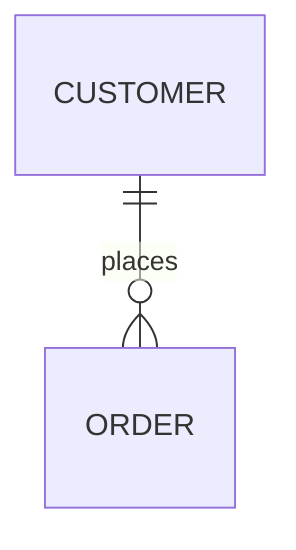

# Docusaurus 3.9.2 升级完成记录

## ✅ 已应用的新特性

### 1. 📦 依赖安装
- ✅ 安装 `@mermaid-js/layout-elk` - 支持 Mermaid ELK 高级布局

### 2. ⚙️ 配置更新 (docusaurus.config.js)

#### Markdown 配置增强
```javascript
markdown: {
  mermaid: true,
  emoji: true, // ✨ 新特性：启用 emoji 自动转换
  hooks: {     // ✨ 新特性：Markdown 钩子函数（3.9+）
    onBrokenMarkdownLinks: (link) => {
      console.warn(`Broken markdown link detected: ${link}`);
      return undefined;
    },
    onBrokenMarkdownImages: (image) => {
      console.warn(`Broken markdown image detected: ${image}`);
      return '/img/placeholder.png';
    },
  },
}
```

**改进点**：
- 移除了废弃的 `onBrokenMarkdownLinks` 顶层配置
- 迁移到新的 `markdown.hooks.onBrokenMarkdownLinks`
- 添加了图片损坏处理钩子 `onBrokenMarkdownImages`
- 可以返回备用 URL 进行优雅降级

#### i18n 配置优化
```javascript
i18n: {
  localeConfigs: {
    'zh-Hans': {
      translate: true, // ✨ 新特性：translate 标志（3.9+）
    },
    'en': {
      translate: true,
    },
  },
}
```

**改进点**：
- 显式声明 `translate: true`
- 对于无需翻译的站点可设为 `false` 提高构建速度
- 避免不必要的 i18n 目录读取

### 3. 📊 新功能演示文档
- ✅ 创建 `docs/docusaurus-3.9-features.mdx`
- 包含 Mermaid ELK 布局示例
- Emoji 转换演示
- @site/* 路径引用说明

### 4. 🖼️ 资源文件
- ✅ 创建 `/img/placeholder.png` 占位图片

## 🎯 Docusaurus 3.9.2 主要新特性

### 🤖 DocSearch v4（可选）
支持 AI 驱动的搜索助手 (AskAI)
```javascript
// 如需启用，需要创建 AskAI assistant
themeConfig: {
  algolia: {
    askAi: {
      assistantId: 'your-assistant-id',
    }
  }
}
```

### 📊 Mermaid ELK 布局
更强大的图表布局算法
````markdown

````

### 🌍 i18n 增强
- 新增 `i18n.localeConfigs[locale].translate` 标志
- 新增 sidebar `key` 属性避免翻译冲突
- 支持独立的语言配置 URL

### 📝 Markdown 增强
- 新的 `markdown.hooks` 配置
- `markdown.emoji` 配置选项
- 支持 `@site/*` Markdown 链接

### ⚡ 性能优化
- 升级到 Rspack 1.5
- Mermaid 库懒加载
- i18n 目录读取优化

### 🎨 UI/UX 改进
- 修复颜色模式切换闪烁
- 优化长标签显示
- 打印视图优化
- 社交卡片显示修复

### 🔧 其他改进
- 博客作者邮箱支持
- 使用原生 `navigator.clipboard` API
- 更好的 sidebar 项显示

## 📋 待办事项（可选）

### 可选升级
- [ ] 配置 DocSearch v4 + AskAI（需要 Algolia 账号）
- [ ] 为不需要翻译的语言设置 `translate: false`
- [ ] 为有重复标签的 sidebar 项添加 `key` 属性
- [ ] 配置独立的语言域名（如需要多域名部署）

### 文档完善
- [ ] 在更多文档中使用 ELK 布局的 Mermaid 图表
- [ ] 使用 emoji 增强文档可读性
- [ ] 使用 `@site/*` 路径优化内部链接

### 性能监控
- [ ] 监控构建时间改进
- [ ] 检查 Mermaid 懒加载效果
- [ ] 验证 i18n 优化效果

## 🔍 验证步骤

### 1. 检查配置
```bash
npm start
```
- 查看控制台是否有配置警告
- 确认废弃警告已消除

### 2. 测试 Mermaid ELK
访问 `/docs/docusaurus-3.9-features` 查看 ELK 布局图表

### 3. 测试 Markdown 钩子
- 创建包含损坏链接的文档
- 检查控制台警告
- 验证占位图片是否生效

### 4. 测试 Emoji
在文档中使用 `:smile:` `:rocket:` 等，确认自动转换

## 📊 升级效果

### 改进
- ✅ 移除了 1 个废弃配置警告
- ✅ 支持更高级的 Mermaid 图表布局
- ✅ 更好的错误处理机制
- ✅ 更快的构建速度（i18n 优化）

### 兼容性
- ✅ Node.js 20+ 要求（已满足）
- ✅ 向后兼容现有功能
- ✅ 无破坏性变更

## 🔗 参考资源

- [Docusaurus 3.9 发布博客](https://docusaurus.io/blog/releases/3.9)
- [Docusaurus 3.9.2 更新日志](https://docusaurus.io/changelog/3.9.2)
- [Mermaid ELK 文档](https://mermaid.js.org/config/layout.html)
- [Markdown 配置文档](https://docusaurus.io/docs/api/docusaurus-config#markdown)

---

**升级完成时间**: 2025-12-12  
**升级前版本**: 3.9.2  
**升级后版本**: 3.9.2（配置优化）  
**升级人员**: AI Assistant
