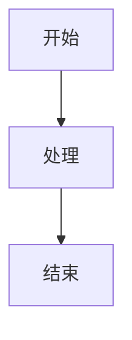

# 🚀 Laby 的技术博客


> 一个基于 [Docusaurus 3.9](https://docusaurus.io/) 构建的现代化技术博客和知识库，涵盖前后端开发、系统设计、面试题库等内容。

**🌐 在线访问**: [https://laby-umr.github.io](https://laby-umr.github.io)

## 🎯 项目特色

### 📚 **完整的知识体系**
- **后端开发**：Java 基础、并发编程、集合框架、JVM、Spring 全家桶、微服务架构
- **前端开发**：Vue、React、Angular、TypeScript、性能优化
- **系统设计**：WMS、CRM、ERP、OMS、数字孪生系统完整设计方案
- **数据库**：MySQL、Redis、MongoDB、数据库优化
- **消息队列**：RabbitMQ、RocketMQ、Kafka
- **大数据**：Hadoop、Spark、Flink
- **面试宝典**：精选高频面试题及详细解答

### 🎨 **现代化体验**
- **Mermaid ELK 图表**：使用最新的 ELK 布局算法绘制复杂架构图
- **深色模式**：自动适配系统主题，护眼舒适
- **全文搜索**：本地搜索引擎，快速定位内容
- **响应式设计**：完美适配桌面和移动设备

### 🚀 **自动化部署**
- **GitHub Actions**：每次推送代码自动构建部署
- **持续集成**：无需手动操作，提交即部署
- **快速发布**：3-6 分钟完成构建和发布

## ✨ 核心功能

### 📖 **文档系统**
- 📝 **技术文档**：完整的前后端技术栈文档
- 🎓 **系统设计**：WMS、CRM、ERP、OMS 完整系统设计方案（含 Mermaid 架构图）
- 🔧 **数字孪生**：OpenTwins 部署与实践指南
- 📊 **面试题库**：覆盖 Java、Spring、数据库、消息队列等高频面试题

### 📝 **博客系统**
- 📰 **技术博客**：AI 实施、数字孪生等前沿技术分享
- 🏷️ **标签分类**：按技术栈和主题分类
- 👥 **多作者支持**：团队协作写作
- 📅 **归档功能**：按时间线浏览历史文章

### 🎨 **用户体验**
- 🔍 **全文搜索**：集成本地搜索，无需外部服务
- 🌙 **深色模式**：自动和手动切换
- 📱 **响应式设计**：完美适配桌面和移动设备
- 🌐 **国际化**：中英文双语支持
- ⚡ **高性能**：静态站点生成，秒开体验

## 🛠️ 技术栈

### 核心框架
- **[Docusaurus 3.9.2](https://docusaurus.io/)**: 最新版静态网站生成器
- **[React 19.0](https://reactjs.org/)**: 现代化用户界面库
- **[Node.js 20.x](https://nodejs.org/)**: 运行环境
- **[MDX](https://mdxjs.com/)**: 支持 JSX 的增强 Markdown

### Docusaurus 3.9 新特性
- ✨ **Mermaid ELK 布局**: 支持复杂图表的高级布局算法
- ✨ **Markdown 钩子**: 智能处理损坏的链接和图片
- ✨ **Emoji 支持**: 自动转换 emoji 代码
- ✨ **@site/* 路径**: 更方便的文件引用

### 功能组件
- **[@mermaid-js/layout-elk](https://mermaid.js.org/)**: ELK 布局算法
- **[Prism React Renderer](https://prismjs.com/)**: 代码语法高亮
- **[@easyops-cn/docusaurus-search-local](https://github.com/easyops-cn/docusaurus-search-local)**: 本地全文搜索
- **[Ant Design](https://ant.design/)**: UI 组件库

### CI/CD
- **GitHub Actions**: 自动化部署工作流
- **GitHub Pages**: 静态网站托管

## 🚀 快速开始

### 环境要求

- **Node.js**: >= 18.0
- **包管理器**: yarn 或 npm

### 克隆项目

```bash
# 克隆仓库
git clone https://github.com/laby-umr/laby-umr.github.io.git
cd laby-umr.github.io

# 安装依赖
npm install
```

### 本地开发

```bash
# 启动开发服务器
npm start

# 自动打开浏览器访问 http://localhost:3000
```

开发服务器支持**热重载**，大多数更改会实时生效。

### 构建网站

```bash
# 构建生产版本
npm run build

# 静态文件生成在 build/ 目录
```

### 本地预览

```bash
# 预览构建后的网站
npm run serve

# 访问 http://localhost:3000
```

## 🚀 自动部署

### 工作流程

本项目已配置 **GitHub Actions 自动部署**，工作流程如下：

```bash
# 1. 修改代码或写文章

# 2. 提交更改
git add .
git commit -m "你的提交信息"

# 3. 推送到 GitHub
git push origin main

# 4. ✨ 自动部署！
# GitHub Actions 自动构建并部署到 GitHub Pages
# 等待 3-6 分钟后网站自动更新
```

### 查看部署状态

- **Actions 页面**: [github.com/laby-umr/laby-umr.github.io/actions](https://github.com/laby-umr/laby-umr.github.io/actions)
- 🟡 黄色 = 部署中
- ✅ 绿色 = 部署成功
- ❌ 红色 = 部署失败

### 部署配置

部署工作流配置文件：`.github/workflows/deploy.yml`

```yaml
# 自动触发条件
on:
  push:
    branches: [main, master]  # 推送到 main 分支时触发
  workflow_dispatch:           # 也可手动触发
```

更多详情请查看文档：[部署指南](https://laby-umr.github.io/docs/deployment-guide)

## 📁 项目结构

```
laby-umr.github.io/
├── blog/                         # 📰 博客文章
│   ├── 2024-12-24-*.md          # 数字孪生系列
│   └── 2025-08-17-*.md          # AI 实施系列
│
├── docs/                         # 📚 文档系统
│   ├── backend/                 # 后端开发
│   │   ├── java-basics/         # Java 基础
│   │   ├── java-collections/    # 集合框架
│   │   ├── concurrency/         # 并发编程
│   │   ├── jvm/                 # JVM 虚拟机
│   │   ├── spring/              # Spring 全家桶
│   │   ├── microservices/       # 微服务架构
│   │   ├── database-orm/        # 数据库与 ORM
│   │   ├── message-queues/      # 消息队列
│   │   ├── distributed-systems/ # 分布式系统
│   │   ├── big-data/            # 大数据
│   │   ├── design-patterns/     # 设计模式
│   │   └── system-design/       # 系统设计
│   │
│   ├── frontend/                # 前端开发
│   │   ├── html-css/            # HTML & CSS
│   │   ├── javascript/          # JavaScript
│   │   ├── typescript/          # TypeScript
│   │   ├── vue/                 # Vue.js
│   │   ├── react/               # React
│   │   ├── angular/             # Angular
│   │   ├── mobile-dev/          # 移动开发
│   │   ├── performance/         # 性能优化
│   │   ├── testing/             # 测试
│   │   └── tools/               # 开发工具
│   │
│   ├── interview/               # 🎯 面试题库
│   │   ├── java-基础.md
│   │   ├── java-并发.md
│   │   ├── java-集合.md
│   │   ├── java-虚拟机.md
│   │   ├── java-spring.md
│   │   ├── mysql-interview.md
│   │   ├── Redis-interview.md
│   │   └── 后端场景.md
│   │
│   ├── projectDesign/           # 🎨 系统设计
│   │   ├── wms-system-design.mdx      # WMS 仓库管理系统
│   │   ├── crm-system-design.mdx      # CRM 客户关系管理
│   │   ├── erp-system-design.mdx      # ERP 企业资源规划
│   │   ├── oms-system-design.mdx      # OMS 订单管理系统
│   │   └── digital-twin-system-design.mdx  # 数字孪生系统
│   │
│   └── digital-twin/            # 🔧 数字孪生
│       ├── opentwins-windows-deployment.mdx   # Windows 部署
│       └── opentwins-linux-offline-deployment.mdx  # Linux 离线部署
│
├── i18n/                        # 🌐 国际化
│   ├── en/                      # 英文翻译
│   └── zh-Hans/                 # 中文翻译
│
├── src/                         # 💻 源代码
│   ├── components/              # React 组件
│   ├── css/                     # 全局样式
│   ├── pages/                   # 自定义页面
│   │   ├── index.js             # 首页
│   │   ├── about.js             # 关于
│   │   └── projects.js          # 项目展示
│   └── theme/                   # 主题定制
│
├── static/                      # 📦 静态资源
│   └── img/                     # 图片
│
├── docusaurus.config.js         # ⚙️ Docusaurus 配置
├── sidebars.js                  # 📑 侧边栏配置
└── package.json                 # 📦 依赖管理
```

## 🌍 国际化支持

本项目支持多语言切换，默认提供中文和英文支持。

### 添加新语言

1. 修改 `docusaurus.config.js` 文件中的 `i18n` 配置：

```js
i18n: {
  defaultLocale: 'zh-Hans',
  locales: ['zh-Hans', 'en', 'your-locale'],
  localeConfigs: {
    'your-locale': {
      label: 'Your Language',
      direction: 'ltr',
      htmlLang: 'your-locale',
    },
  },
},
```

2. 生成翻译文件：

```bash
yarn docusaurus write-translations --locale your-locale
```

3. 编辑生成的翻译文件，位于 `i18n/your-locale/` 目录下。

## ⚙️ 自定义配置

### 修改网站信息

编辑 `docusaurus.config.js` 文件中的以下部分：

```js
const config = {
  title: '你的网站标题',
  tagline: '你的网站标语',
  favicon: 'img/your-favicon.ico',
  url: 'https://your-domain.com',
  // ...其他配置
};
```

### 自定义主题

在 `src/css/custom.css` 文件中修改颜色变量：

```css
:root {
  --ifm-color-primary: #4a6cf7;
  --ifm-color-primary-dark: #3d5ef5;
  /* ...其他颜色变量 */
}
```

### 添加新页面

在 `src/pages/` 目录下创建新的 React 组件：

```jsx
import React from 'react';
import Layout from '@theme/Layout';

export default function MyPage() {
  return (
    <Layout title="页面标题" description="页面描述">
      <main className="container margin-top--lg">
        <h1>我的新页面</h1>
        <p>页面内容...</p>
      </main>
    </Layout>
  );
}
```

## 📝 内容贡献

### 添加博客文章

在 `blog/` 目录下创建新的 Markdown 或 MDX 文件：

```md
---
slug: my-tech-article
title: 我的技术文章
authors: [laby]
tags: [Java, Spring Cloud, 微服务]
date: 2025-10-16
---

文章摘要...

<!-- truncate -->

文章正文内容...
```

### 添加技术文档

1. 在相应目录下创建 `.mdx` 文件（如 `docs/backend/java-basics/`）
2. 在文件头部添加 frontmatter：

```mdx
---
sidebar_position: 1
title: 文档标题
description: 文档描述
tags: [Java, 基础]
---

# 文档标题

文档内容...
```

3. 更新 `sidebars.js` 配置侧边栏

### 添加系统设计方案

在 `docs/projectDesign/` 目录下创建新的系统设计文档，参考已有的 WMS、CRM、ERP、OMS 文档格式，使用 Mermaid 绘制架构图。

## 🔧 常见问题

### 如何添加 Mermaid 图表？

在 MDX 文件中使用 mermaid 代码块：

````markdown

````

### 如何自定义组件？

在 `src/components/` 目录下创建 React 组件，然后在 MDX 中导入使用：

```jsx
import MyComponent from '@site/src/components/MyComponent';

<MyComponent />
```

### 如何修改导航栏？

编辑 `docusaurus.config.js` 文件中的 `themeConfig.navbar` 部分。

### 如何部署到 GitHub Pages？

本项目已配置 **GitHub Actions 自动部署**，无需手动操作！

只需：
1. 提交代码：`git commit -m "你的更改"`
2. 推送代码：`git push origin main`
3. 等待 3-6 分钟，网站自动更新

详见：[自动部署](#-自动部署)章节

### 搜索功能不工作？

确保已安装 `@easyops-cn/docusaurus-search-local` 插件，并在 `docusaurus.config.js` 中正确配置。

## 🤝 贡献指南

欢迎贡献代码、报告问题或提出改进建议！

### 贡献流程

1. **Fork** 本仓库到你的 GitHub 账号
2. **Clone** 你 Fork 的仓库到本地
3. **创建分支**：`git checkout -b feature/your-feature`
4. **提交更改**：`git commit -m 'feat: add some feature'`
5. **推送分支**：`git push origin feature/your-feature`
6. **提交 PR**：打开 Pull Request

### 提交规范

请遵循 [Conventional Commits](https://www.conventionalcommits.org/) 规范：

- `feat:` 新功能
- `fix:` 修复 Bug
- `docs:` 文档更新
- `style:` 代码格式调整
- `refactor:` 代码重构
- `test:` 测试相关
- `chore:` 构建/工具相关

### 内容质量要求

- ✅ 代码示例完整可运行
- ✅ 使用 Mermaid 绘制架构图
- ✅ 提供详细的注释和说明
- ✅ 遵循项目代码风格

## 📊 项目亮点

### 🎨 系统设计方案

本项目包含 **5 个完整的企业级系统设计方案**：

| 系统 | 说明 | 亮点 |
|------|------|------|
| **WMS** | 仓库管理系统 | 智能拣货路径优化、多级缓存、分布式锁 |
| **CRM** | 客户关系管理 | 销售漏斗自动化、客户画像分析 |
| **ERP** | 企业资源规划 | 采购到付款完整流程、多组织支持 |
| **OMS** | 订单管理系统 | 高并发处理（10000+ TPS）、分库分表 |
| **数字孪生** | OpenTwins 平台 | 物联网设备接入、实时数据可视化 |

每个系统都包含：
- 🎯 完整的技术架构（Mermaid 图）
- 📊 核心业务流程图
- 💾 数据库设计（建表语句）
- ⚙️ 核心代码实现
- 🚀 部署方案（Docker/K8s）

### 📚 知识体系

- **200+ 技术文档**：覆盖前后端完整技术栈
- **100+ 面试题**：精选高频面试题及详细解答
- **50+ 博客文章**：技术分享和实践经验
- **Mermaid 可视化**：所有架构图使用 Mermaid 绘制

## 📄 许可证

本项目采用 **MIT 许可证** - 详情请参阅 [LICENSE](LICENSE) 文件。

## 📞 联系方式

- 📧 **邮箱**: 1521170425@qq.com
- 🐛 **Issues**: [github.com/laby-umr/laby-umr.github.io/issues](https://github.com/laby-umr/laby-umr.github.io/issues)
- 🌐 **网站**: [laby-umr.github.io](https://laby-umr.github.io)

## 🙏 致谢

感谢以下开源项目：

- [Docusaurus 3.9](https://docusaurus.io/) - 强大的文档生成框架
- [Mermaid](https://mermaid.js.org/) - 图表绘制工具
- [React 19](https://reactjs.org/) - 现代前端框架
- [GitHub Pages](https://pages.github.com/) - 免费静态网站托管
- [GitHub Actions](https://github.com/features/actions) - CI/CD 自动化

## 📊 项目状态


---

<div align="center">

**⭐ 如果这个项目对你有帮助，请给个 Star 支持一下！⭐**

Made with ❤️ by [Laby](https://github.com/laby-umr)

Built with [Docusaurus 3.9.2](https://docusaurus.io/) | Deployed by [GitHub Actions](https://github.com/features/actions)

</div>
