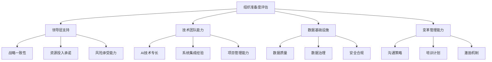

# 企业级AI大模型落地实施方案：从战略到执行

随着ChatGPT、Claude、Gemini等大语言模型的爆发式发展，AI技术正在以前所未有的速度重塑商业世界。然而，对于大多数企业来说，如何将AI大模型从概念转化为实际业务价值，仍然是一个巨大的挑战。本文将从战略规划到具体执行，为您提供一套完整的企业级AI大模型落地实施方案。

## 一、AI大模型落地战略规划

### 1.1 业务价值识别与机会评估

在开始AI大模型项目之前，企业需要系统性地识别AI能够创造价值的业务场景。这不仅仅是技术问题，更是战略问题。

**关键评估维度：**

| 评估维度 | 具体内容 | 权重 |
|---------|---------|------|
| 业务影响 | 对核心业务流程的改进程度 | 30% |
| 技术可行性 | 现有技术栈的兼容性 | 25% |
| 投资回报 | 预期收益与成本比例 | 25% |
| 风险控制 | 实施风险与合规要求 | 20% |

**高价值应用场景识别：**

1. **客户服务与支持**
   - 智能客服机器人
   - 个性化推荐系统
   - 客户需求预测

2. **内容创作与营销**
   - 营销文案生成
   - 产品描述优化
   - 社交媒体内容管理

3. **数据分析与洞察**
   - 市场趋势分析
   - 客户行为预测
   - 风险识别与预警

### 1.2 组织能力评估与准备

AI大模型的成功落地不仅需要技术能力，更需要组织层面的充分准备。

**组织准备度评估框架：**

**关键成功因素：**

- **领导层支持**：CEO和CXO级别的明确支持
- **跨部门协作**：IT、业务、法务等部门的有效协作
- **持续学习文化**：鼓励实验和创新的组织氛围

## 二、技术架构设计与选型

### 2.1 AI大模型技术架构概览

企业级AI大模型应用需要构建完整的技术架构，确保系统的可扩展性、安全性和可维护性。

**典型技术架构组件：**

1. **数据层**
   - 结构化数据存储（MySQL、PostgreSQL）
   - 非结构化数据存储（MongoDB、Elasticsearch）
   - 向量数据库（Pinecone、Weaviate、Milvus）

2. **模型层**
   - 基础模型（GPT-4、Claude、Gemini）
   - 微调模型（领域适应、任务优化）
   - 嵌入模型（文本向量化）

3. **应用层**
   - API服务（REST、GraphQL）
   - 业务逻辑处理
   - 用户界面（Web、移动、API）

4. **基础设施层**
   - 计算资源（GPU、CPU）
   - 网络与存储
   - 安全与监控

### 2.2 模型选型策略

选择合适的AI大模型是技术架构设计的关键环节，需要综合考虑多种因素。

**模型选型决策矩阵：**

| 模型类型 | 优势 | 劣势 | 适用场景 |
|---------|------|------|---------|
| 公共API模型 | 快速部署、无需维护 | 成本高、数据隐私风险 | 非核心业务、原型验证 |
| 开源模型部署 | 数据隐私保护、可定制性强 | 技术门槛高、资源需求大 | 核心业务、敏感数据处理 |
| 混合模式 | 灵活性高、平衡成本和性能 | 集成复杂性增加 | 多样化业务需求 |

**主流模型对比：**

| 模型名称 | 参数规模 | 推理成本 | 适用场景 | 
|---------|--------|---------|---------|
| GPT-4 | 1.76T | 高 | 复杂推理、创意生成 |
| Claude 3 | 未公开 | 中高 | 长文本处理、安全合规 |
| Gemini Pro | 未公开 | 中 | 多模态应用、知识问答 |
| Llama 3 | 70B/8B | 低 | 本地部署、定制化应用 |

### 2.3 基础设施规划

企业需要根据AI应用的规模和性能需求，规划相应的基础设施。

**基础设施规划考虑因素：**

- **计算资源需求**：模型大小、并发用户数、响应时间要求
- **存储需求**：训练数据、向量索引、用户数据
- **网络需求**：带宽、延迟、可靠性
- **安全需求**：数据加密、访问控制、审计日志

**部署模式选择：**

1. **云服务部署**
   - 优势：快速启动、弹性扩展、按需付费
   - 劣势：长期成本高、数据主权限制

2. **本地部署**
   - 优势：数据安全、完全控制、长期成本优势
   - 劣势：前期投入大、维护复杂

3. **混合部署**
   - 优势：灵活性高、平衡安全与成本
   - 劣势：架构复杂、管理难度增加

## 三、实施路径与方法论

### 3.1 分阶段实施策略

AI大模型项目应采用分阶段实施策略，逐步验证价值并降低风险。

**四阶段实施方法论：**

1. **探索与概念验证（1-3个月）**
   - 明确业务目标和成功标准
   - 选择高价值、低复杂度的试点场景
   - 快速构建MVP验证概念

2. **试点与优化（3-6个月）**
   - 在受控环境中部署试点应用
   - 收集用户反馈并持续优化
   - 量化业务价值和技术可行性

3. **扩展与规模化（6-12个月）**
   - 完善技术架构和运营流程
   - 扩大应用范围和用户群体
   - 建立长期运营和维护机制

4. **持续创新与演进（持续）**
   - 跟踪技术发展和业务需求变化
   - 持续优化模型和应用功能
   - 探索新的应用场景和价值创造

### 3.2 项目管理与治理

有效的项目管理和治理机制是AI项目成功的关键保障。

**项目管理框架：**

- **敏捷与迭代方法**：采用短周期迭代，快速响应变化
- **跨职能团队**：技术、业务、法务、安全等多部门协作
- **明确的决策机制**：设立项目指导委员会，明确决策流程
- **风险管理**：识别、评估和应对项目风险

**关键项目里程碑：**

1. **项目启动**：明确目标、范围和资源
2. **概念验证**：验证技术可行性和业务价值
3. **试点上线**：在受控环境中部署试点应用
4. **全面部署**：扩大应用范围，实现规模化价值
5. **持续优化**：基于反馈持续改进

### 3.3 数据架构与知识库构建

高质量的数据和知识库是AI大模型应用的基础。

**数据架构设计原则：**

- **数据质量优先**：确保数据的准确性、完整性和一致性
- **可扩展性**：支持数据规模和复杂性的增长
- **安全与合规**：保护敏感数据，遵守法规要求
- **实时性**：支持实时数据处理和更新

**知识库构建流程：**

1. **数据源识别与评估**
   - 内部数据：文档、报告、产品信息
   - 外部数据：行业报告、公开数据集
   - 结构化与非结构化数据

2. **数据处理与转换**
   - 数据清洗与标准化
   - 文本分块与向量化
   - 元数据标注与索引

3. **知识库管理与更新**
   - 版本控制与变更管理
   - 定期更新与质量评估
   - 权限管理与访问控制

## 四、变革管理与价值实现

### 4.1 组织变革与人才发展

AI大模型的落地需要配套的组织变革和人才发展策略。

**组织变革策略：**

- **明确的变革愿景**：传达AI转型的目标和价值
- **有效的沟通计划**：解决疑虑，获取支持
- **培训与赋能**：提升团队AI素养和技能
- **激励机制**：鼓励创新和采纳新技术

**AI人才发展框架：**

1. **核心AI团队建设**
   - AI研究员与工程师
   - 数据科学家与分析师
   - AI产品经理

2. **业务团队AI赋能**
   - AI应用基础培训
   - 业务场景识别能力
   - AI工具使用技能

3. **领导层AI素养提升**
   - AI战略思维
   - AI项目评估能力
   - AI伦理与责任

### 4.2 价值评估与持续优化

建立科学的价值评估体系，确保AI投资获得预期回报。

**价值评估框架：**

- **定量指标**：成本节约、收入增长、效率提升
- **定性指标**：用户满意度、员工体验、创新能力
- **短期价值**：直接业务影响和运营改进
- **长期价值**：战略竞争力和组织能力提升

**持续优化机制：**

1. **数据驱动决策**
   - 建立关键绩效指标（KPI）
   - 定期评估与报告
   - 基于数据调整策略

2. **用户反馈循环**
   - 建立用户反馈渠道
   - 分析使用模式和痛点
   - 迭代改进产品功能

3. **技术更新与升级**
   - 跟踪AI技术发展
   - 评估新模型和方法
   - 计划技术升级路径

## 五、安全合规与风险管理

### 5.1 数据安全与隐私保护

确保AI系统的数据安全和隐私保护是企业责任和法律要求。

**数据安全策略：**

- **数据分类与保护**：根据敏感度分级保护
- **访问控制**：最小权限原则，身份认证
- **数据加密**：传输和存储加密
- **审计与监控**：异常行为检测，安全日志

**隐私保护措施：**

1. **隐私设计原则**
   - 默认隐私保护
   - 数据最小化
   - 用户知情同意

2. **合规框架**
   - GDPR、CCPA等法规遵从
   - 行业特定合规要求
   - 内部隐私政策

### 5.2 AI伦理与责任

AI大模型应用需要考虑伦理问题和社会责任。

**AI伦理框架：**

- **公平性**：避免偏见和歧视
- **透明度**：可解释性和可追溯性
- **问责制**：明确责任和监督机制
- **人类优先**：保持人类决策的最终控制权

**实施措施：**

1. **伦理审查机制**
   - 建立AI伦理委员会
   - 开发伦理评估工具
   - 定期伦理审计

2. **负责任的AI实践**
   - 模型偏见检测与缓解
   - 内容过滤与安全措施
   - 用户反馈与投诉机制

## 结论

企业级AI大模型的成功落地是一个系统工程，需要战略规划、技术实现、组织变革和价值管理的全面协同。通过本文提供的实施方案，企业可以更加系统地规划和执行AI大模型项目，实现从概念到价值的转化。

在AI技术快速发展的今天，企业应保持开放和学习的态度，持续关注技术进展，不断优化实施策略，真正将AI大模型转化为业务创新和竞争优势的强大引擎。

---

*"成功的AI转型不仅仅是技术的应用，更是思维方式和组织文化的变革。"* 