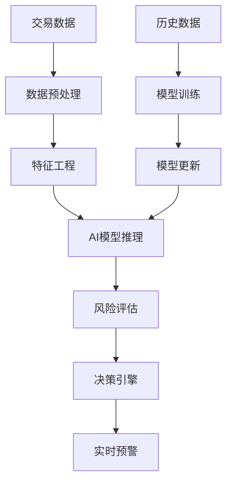

# AI大模型行业应用案例：重塑商业与生产力格局

AI大模型正在以前所未有的速度重塑各个行业，从金融到医疗，从制造到零售，从教育到娱乐，AI技术正在创造新的商业模式和生产力范式。本文将通过详实的案例研究，深入分析AI大模型在不同行业的应用实践，为企业和组织提供可复制的实施路径和最佳实践。

## 一、金融科技：AI驱动的智能金融服务

### 1.1 智能风控与反欺诈

金融行业是AI大模型应用最成熟的领域之一，特别是在风险控制和反欺诈方面。

**典型案例：某大型银行智能风控系统**

**项目背景：**
- 传统风控依赖规则引擎，误报率高
- 人工审核效率低，成本高昂
- 新型欺诈手段层出不穷，传统方法难以应对

**AI解决方案：**
- 基于GPT-4的智能风控引擎
- 多维度数据融合分析
- 实时风险评估与预警

**技术架构：**

**实施效果：**
- 欺诈检测准确率提升35%
- 误报率降低60%
- 审核效率提升8倍
- 年节省成本超过5000万元

### 1.2 智能投顾与财富管理

AI大模型正在改变传统的财富管理服务模式，提供个性化的投资建议和风险管理。

**应用场景：**

1. **个性化投资组合**
   - 基于客户风险偏好的资产配置
   - 动态再平衡策略
   - 市场趋势分析与预测

2. **智能客户服务**
   - 24/7投资咨询服务
   - 多语言客户支持
   - 个性化投资教育

3. **风险管理**
   - 实时风险评估
   - 压力测试与情景分析
   - 合规检查与报告

## 二、医疗健康：AI赋能的精准医疗

### 2.1 医学影像诊断

AI大模型在医学影像诊断方面的应用正在显著提升诊断准确率和效率。

**成功案例：某三甲医院AI辅助诊断系统**

**技术方案：**
- 基于多模态大模型的影像分析
- 结合临床数据的综合诊断
- 实时学习与模型优化

**应用效果：**
- 诊断准确率提升至95%以上
- 诊断时间缩短70%
- 医生工作效率提升3倍
- 患者满意度显著提升

### 2.2 药物研发与临床试验

AI大模型正在加速药物研发过程，缩短研发周期，降低研发成本。

**应用案例：某制药公司AI药物发现平台**

**核心技术：**
- 基于大模型的分子结构预测
- 药物-靶点相互作用模拟
- 副作用预测与优化

**实施效果：**
- 候选药物筛选速度提升10倍
- 研发成本降低40%
- 临床试验成功率提高25%
- 新药上市时间缩短2-3年

## 三、智能制造：工业4.0的AI引擎

### 3.1 预测性维护

AI大模型在工业设备预测性维护方面的应用，正在帮助制造企业显著提升设备可靠性和生产效率。

**案例分析：某汽车制造厂AI预测性维护系统**

**实施方案：**
- 设备传感器数据实时采集
- 基于大模型的异常检测算法
- 设备健康状态评估与预测
- 维护建议自动生成

**技术架构：**
- 边缘计算设备数据预处理
- 云端AI模型分析与预测
- 数字孪生可视化监控
- 移动端维护工单推送

**业务价值：**
- 设备故障率降低45%
- 计划外停机时间减少60%
- 维护成本降低30%
- 设备寿命延长15-20%

### 3.2 质量检测与优化

AI视觉检测系统正在替代传统的人工质检，提供更高效、更准确的质量控制。

**应用场景：**

1. **视觉质检**
   - 表面缺陷检测
   - 装配完整性检查
   - 尺寸精度测量

2. **过程优化**
   - 生产参数实时调整
   - 工艺流程优化
   - 能源效率提升

**实施效果：**
- 检测准确率达99.8%
- 检测速度提升10倍
- 人工成本降低70%
- 产品良率提升5-8%

## 四、零售与电商：智能消费体验

### 4.1 个性化推荐系统

AI大模型正在重塑零售业的个性化推荐系统，提供更精准的商品匹配和用户体验。

**技术方案：**
- 多模态用户行为分析
- 实时兴趣建模
- 上下文感知推荐
- A/B测试与持续优化

**应用效果：**
- 点击率提升35%
- 转化率提升28%
- 客单价提升15%
- 用户满意度提升40%

### 4.2 智能客服与用户体验

AI驱动的智能客服正在改变零售业的客户服务模式，提供全天候、多语言、个性化的服务体验。

**应用场景：**

1. **智能问答**
   - 产品咨询
   - 订单查询
   - 售后服务

2. **情感分析**
   - 客户情绪识别
   - 投诉预警
   - 满意度评估

3. **流程自动化**
   - 订单处理
   - 退换货管理
   - 会员服务

**实施效果：**
- 客服响应时间缩短90%
- 人工客服工作量减少70%
- 客户满意度提升25%
- 客服成本降低50%

## 五、教育与培训：AI个性化学习

### 5.1 智能辅导系统

AI大模型正在教育领域创造个性化学习体验，满足不同学生的学习需求和进度。

**应用方案：**
- 学习风格识别与适配
- 知识点掌握程度评估
- 个性化学习路径生成
- 实时反馈与指导

**实施效果：**
- 学习效率提升30%
- 知识点掌握率提高25%
- 学生参与度提升40%
- 教师工作效率提升50%

### 5.2 内容生成与课程开发

AI大模型在教育内容创建和课程开发方面的应用，正在提高教育资源的质量和多样性。

**应用场景：**

1. **教材内容生成**
   - 多层次练习题
   - 个性化学习材料
   - 交互式教学内容

2. **课程开发**
   - 课程结构设计
   - 教学目标分解
   - 评估标准制定

**技术实现：**
- 基于大模型的内容生成
- 教育专家知识融合
- 学习效果反馈优化

## 六、实施路径与最佳实践

### 6.1 行业应用成功要素

跨行业AI大模型应用的成功实践表明，以下要素对项目成功至关重要：

1. **明确的业务目标**
   - 聚焦具体业务痛点
   - 设定可量化的成功标准
   - 优先考虑高价值应用场景

2. **数据质量与治理**
   - 建立数据质量标准
   - 实施数据治理机制
   - 确保数据隐私与安全

3. **技术与业务融合**
   - 跨职能团队协作
   - 业务专家深度参与
   - 迭代开发与持续优化

4. **变革管理与培训**
   - 用户参与和反馈
   - 系统培训和支持
   - 激励机制和文化建设

### 6.2 实施路径建议

根据不同行业的AI应用实践，我们总结出以下通用实施路径：

**第一阶段：探索与评估（1-3个月）**
- 业务机会识别与优先级排序
- 技术可行性评估
- 投资回报初步分析
- 概念验证项目规划

**第二阶段：试点实施（3-6个月）**
- 选择高价值、低风险场景
- 敏捷开发与快速迭代
- 用户反馈收集与分析
- 效果评估与优化

**第三阶段：规模化部署（6-12个月）**
- 技术架构优化与扩展
- 业务流程重组与集成
- 组织能力建设
- 全面推广与应用

**第四阶段：持续优化（持续）**
- 性能监控与分析
- 模型更新与迭代
- 新应用场景探索
- 价值评估与投资回报分析

## 结论

AI大模型正在各行各业创造前所未有的价值和机遇。通过本文分析的案例和实践经验，我们可以看到AI技术不仅提高了效率和降低了成本，更重要的是创造了新的业务模式和增长点。

对于企业而言，成功应用AI大模型的关键在于将技术与业务深度融合，关注实际问题解决，而非技术本身。通过循序渐进的实施路径，企业可以有效管理风险，最大化AI投资回报。

随着AI技术的持续发展和成熟，我们有理由相信，AI大模型将在更多行业和场景中发挥关键作用，成为企业数字化转型和创新发展的核心驱动力。

---

*"AI不是未来，而是现在。企业需要的不是观望，而是行动。"* 