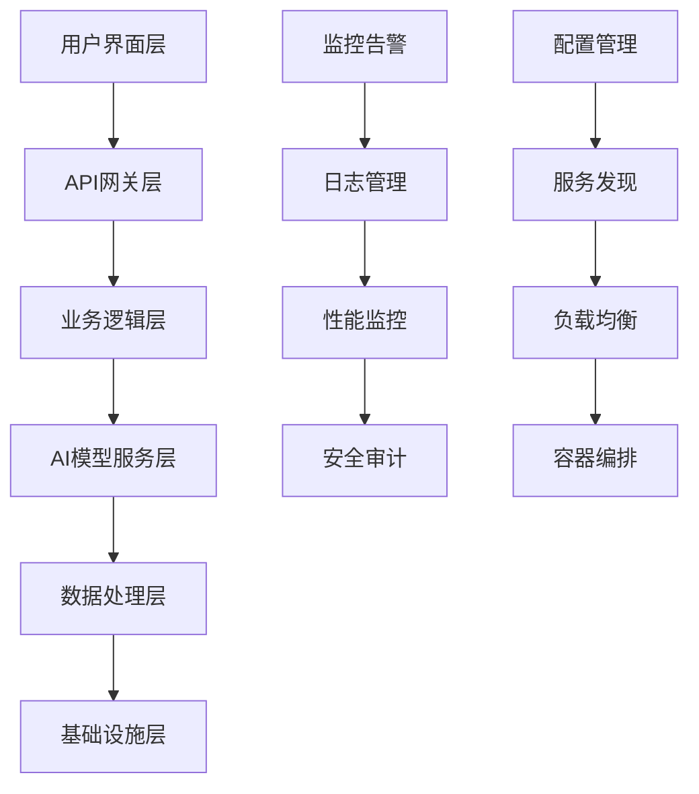

# AI大模型技术架构与部署实践指南

AI大模型的成功落地不仅需要正确的业务策略，更需要坚实的技术架构支撑。本文将深入探讨AI大模型的技术架构设计、部署策略、性能优化等关键技术问题，为技术团队提供实用的实施指南和最佳实践。

## 一、AI大模型技术架构概述

### 1.1 整体架构设计原则

构建企业级AI大模型应用需要遵循特定的架构设计原则，确保系统的可扩展性、可维护性和可靠性。

**核心设计原则：**

1. **模块化设计**
   - 功能模块独立
   - 接口标准化
   - 松耦合架构

2. **可扩展性**
   - 水平扩展能力
   - 垂直扩展支持
   - 弹性资源配置

3. **高可用性**
   - 故障自动恢复
   - 负载均衡
   - 多活部署

4. **安全性**
   - 数据加密传输
   - 访问权限控制
   - 审计日志记录

### 1.2 典型技术架构组件

一个完整的AI大模型应用架构通常包含以下核心组件：

**架构层次结构：**

**核心组件详解：**

1. **用户界面层**
   - Web前端应用
   - 移动端应用
   - 第三方集成接口

2. **API网关层**
   - 请求路由
   - 身份认证
   - 限流控制
   - 监控统计

3. **业务逻辑层**
   - 业务流程处理
   - 数据验证
   - 业务规则引擎
   - 事务管理

4. **AI模型服务层**
   - 模型推理服务
   - 模型管理
   - 版本控制
   - 性能优化

5. **数据处理层**
   - 数据存储
   - 数据缓存
   - 数据同步
   - 数据备份

6. **基础设施层**
   - 计算资源
   - 存储资源
   - 网络资源
   - 安全资源

## 二、AI模型服务架构设计

### 2.1 模型服务架构模式

AI模型服务架构主要有以下几种模式，每种模式适用于不同的应用场景：

1. **集中式架构**
   - 特点：所有模型部署在中央服务器
   - 优势：管理简单，资源利用率高
   - 劣势：单点故障风险，扩展性受限
   - 适用：中小规模应用，资源有限场景

2. **分布式架构**
   - 特点：模型分布在多个服务节点
   - 优势：高可用性，水平扩展能力强
   - 劣势：管理复杂，一致性挑战
   - 适用：大规模应用，高并发场景

3. **混合架构**
   - 特点：结合集中式和分布式优点
   - 优势：灵活性高，资源利用率优
   - 劣势：设计复杂，运维要求高
   - 适用：复杂业务场景，多样化需求

### 2.2 模型推理服务设计

模型推理服务是AI系统的核心组件，需要考虑以下设计要点：

1. **服务抽象层**
   - 统一接口定义
   - 模型无关的调用方式
   - 版本管理机制

2. **推理优化策略**
   - 批处理优化
   - 计算图优化
   - 量化压缩
   - 并行计算

3. **弹性伸缩机制**
   - 基于负载的自动扩缩
   - 预热与冷启动优化
   - 资源利用率监控

### 2.3 向量数据库选型与应用

向量数据库是AI大模型应用的关键组件，主要用于存储和检索高维向量数据：

1. **主流向量数据库对比**

| 数据库 | 查询性能 | 扩展性 | 易用性 | 社区活跃度 |
|-------|--------|-------|-------|----------|
| Pinecone | ★★★★★ | ★★★★☆ | ★★★★★ | ★★★☆☆ |
| Milvus | ★★★★☆ | ★★★★★ | ★★★☆☆ | ★★★★☆ |
| Weaviate | ★★★★☆ | ★★★☆☆ | ★★★★☆ | ★★★★☆ |
| Qdrant | ★★★★☆ | ★★★★☆ | ★★★★★ | ★★★☆☆ |
| Chroma | ★★★☆☆ | ★★★☆☆ | ★★★★★ | ★★★☆☆ |

2. **向量数据库应用场景**
   - 语义搜索
   - 推荐系统
   - 相似度匹配
   - 知识检索

3. **性能优化策略**
   - 索引选择（HNSW, IVF, FLAT等）
   - 向量维度优化
   - 分片与副本策略
   - 缓存机制

## 三、部署架构与基础设施

### 3.1 容器化部署架构

容器化技术已成为AI模型部署的主流方式，提供了灵活性和可移植性：

1. **容器编排平台**
   - Kubernetes：生产级容器编排
   - Docker Swarm：轻量级编排方案
   - Amazon ECS：云原生容器服务

2. **容器化最佳实践**
   - 镜像分层优化
   - 资源限制设置
   - 健康检查配置
   - 滚动更新策略

3. **微服务架构整合**
   - 服务发现与注册
   - API网关集成
   - 配置中心
   - 分布式追踪

### 3.2 Kubernetes部署模式

Kubernetes已成为AI模型部署的标准平台，提供了丰富的部署模式：

1. **部署资源类型**
   - Deployment：无状态应用
   - StatefulSet：有状态应用
   - DaemonSet：节点级应用
   - Job/CronJob：批处理任务

2. **资源编排策略**
   - Pod亲和性与反亲和性
   - 节点选择器与污点容忍
   - 资源配额与限制
   - 优先级与抢占

3. **高可用部署模式**
   - 多副本部署
   - 多区域部署
   - 滚动更新策略
   - 自动扩缩容

### 3.3 GPU资源管理与优化

GPU资源是AI模型推理的关键，需要合理管理和优化：

1. **GPU调度策略**
   - 专用节点分配
   - GPU共享（MIG技术）
   - 时间片轮转

2. **GPU资源监控**
   - 利用率监控
   - 内存使用监控
   - 温度与功耗监控

3. **成本优化策略**
   - 自动缩放
   - 批处理优化
   - 混合精度计算
   - 按需分配

## 四、模型优化与加速技术

### 4.1 模型量化与压缩

模型量化与压缩是提高推理效率的关键技术：

1. **量化技术**
   - INT8/INT4量化
   - 混合精度量化
   - 动态量化
   - 量化感知训练

2. **模型剪枝**
   - 结构化剪枝
   - 非结构化剪枝
   - 迭代式剪枝
   - 敏感度分析

3. **知识蒸馏**
   - 教师-学生模型
   - 特征蒸馏
   - 关系蒸馏
   - 自蒸馏

### 4.2 推理优化技术

推理优化是提高模型服务性能的关键：

1. **计算图优化**
   - 算子融合
   - 内存优化
   - 并行计算
   - 计算重排序

2. **硬件加速**
   - GPU优化
   - CUDA核心编程
   - TensorRT加速
   - ONNX Runtime优化

3. **批处理策略**
   - 动态批处理
   - 请求排队与合并
   - 超时控制
   - 优先级调度

### 4.3 分布式推理架构

大规模模型需要分布式推理架构支持：

1. **模型并行**
   - 张量并行
   - 流水线并行
   - 专家混合并行
   - 分层模型并行

2. **推理服务编排**
   - 微服务架构
   - 服务网格
   - API网关
   - 负载均衡

3. **分布式推理框架**
   - DeepSpeed
   - Ray Serve
   - Triton Inference Server
   - vLLM

## 五、数据处理与存储架构

### 5.1 数据处理流水线

高效的数据处理流水线对AI系统至关重要：

1. **数据采集层**
   - 多源数据接入
   - 实时数据流
   - 批量数据导入
   - ETL处理

2. **数据预处理**
   - 清洗与标准化
   - 特征工程
   - 数据增强
   - 标签处理

3. **数据存储策略**
   - 冷热数据分离
   - 分层存储
   - 数据压缩
   - 索引优化

### 5.2 存储架构设计

AI系统需要高效的存储架构支持：

1. **存储类型选择**
   - 对象存储：模型文件、大规模数据集
   - 文件存储：训练数据、中间结果
   - 块存储：数据库、高性能计算
   - 内存存储：缓存、实时处理

2. **数据库选型**
   - 关系型：PostgreSQL, MySQL
   - 文档型：MongoDB, Elasticsearch
   - 时序型：InfluxDB, TimescaleDB
   - 向量型：Pinecone, Milvus, Weaviate

3. **缓存策略**
   - 多级缓存
   - 分布式缓存
   - 内容缓存
   - 结果缓存

## 六、安全与合规架构

### 6.1 安全架构设计

AI系统的安全架构需要全面考虑：

1. **身份认证与授权**
   - OAuth 2.0/OIDC
   - RBAC/ABAC权限模型
   - API密钥管理
   - 多因素认证

2. **数据安全**
   - 传输加密(TLS/SSL)
   - 存储加密
   - 数据脱敏
   - 隐私计算

3. **模型安全**
   - 模型防篡改
   - 对抗样本防御
   - 模型水印
   - 安全推理

### 6.2 合规性架构

AI系统需要满足各种合规要求：

1. **隐私保护**
   - GDPR合规
   - CCPA合规
   - 数据主权
   - 数据最小化

2. **审计与追踪**
   - 操作日志
   - 访问记录
   - 变更追踪
   - 合规报告

3. **治理框架**
   - 模型治理
   - 数据治理
   - 风险评估
   - 伦理审查

## 七、监控与运维架构

### 7.1 监控系统架构

全面的监控系统是保障AI服务稳定运行的关键：

1. **监控维度**
   - 基础设施监控
   - 应用性能监控
   - 模型性能监控
   - 业务指标监控

2. **监控工具链**
   - Prometheus：指标收集
   - Grafana：可视化展示
   - Jaeger/Zipkin：分布式追踪
   - ELK/PLG：日志管理

3. **告警策略**
   - 多级告警
   - 智能阈值
   - 告警聚合
   - 自动修复

### 7.2 自动化运维

自动化运维是大规模AI系统的必要支持：

1. **CI/CD流水线**
   - 代码质量检查
   - 自动测试
   - 镜像构建
   - 自动部署

2. **GitOps实践**
   - 基础设施即代码
   - 声明式配置
   - 版本控制
   - 自动同步

3. **故障自愈**
   - 健康检查
   - 自动重启
   - 服务降级
   - 灾难恢复

## 八、性能优化与扩展性

### 8.1 性能优化策略

AI系统性能优化需要全面考虑：

1. **计算优化**
   - 算法优化
   - 并行计算
   - 异步处理
   - 资源隔离

2. **网络优化**
   - 负载均衡
   - 连接池
   - 请求合并
   - 网络拓扑优化

3. **存储优化**
   - 缓存策略
   - 索引优化
   - 数据分片
   - 读写分离

### 8.2 扩展性设计

良好的扩展性设计是支撑业务增长的基础：

1. **水平扩展**
   - 无状态设计
   - 分片策略
   - 一致性哈希
   - 服务发现

2. **垂直扩展**
   - 资源升级
   - 性能调优
   - 内存管理
   - 异构计算

3. **弹性伸缩**
   - 自动扩缩容
   - 预测式扩容
   - 资源池化
   - 按需分配

## 九、最佳实践与案例分析

### 9.1 企业级部署最佳实践

企业级AI系统部署的最佳实践：

1. **多环境策略**
   - 开发环境
   - 测试环境
   - 预生产环境
   - 生产环境

2. **灰度发布**
   - 金丝雀发布
   - A/B测试
   - 流量控制
   - 快速回滚

3. **高可用设计**
   - 多区域部署
   - 故障转移
   - 数据备份
   - 灾难恢复

### 9.2 成功案例分析

典型AI系统架构案例分析：

1. **金融风控系统**
   - 架构特点：高可用、低延迟、安全合规
   - 技术选型：Kubernetes + TensorRT + Redis + Kafka
   - 性能指标：毫秒级响应、99.99%可用性

2. **内容推荐平台**
   - 架构特点：高并发、实时性、个性化
   - 技术选型：微服务 + 向量数据库 + 流处理
   - 性能指标：秒级更新、千万级用户规模

3. **客服智能助手**
   - 架构特点：多模态、上下文感知、知识库集成
   - 技术选型：大模型 + RAG架构 + 微服务
   - 性能指标：秒级响应、90%以上问题解决率

## 结论

AI大模型技术架构与部署是一个复杂而系统的工程，需要在性能、可靠性、安全性和成本之间寻找平衡。本文介绍的架构设计原则、部署策略和优化技术，旨在帮助技术团队构建稳定、高效、可扩展的AI系统。

随着技术的不断发展，AI系统架构也将持续演进。技术团队应保持学习和创新精神，不断优化和改进系统架构，以满足业务发展的需求。

---

*"架构不是一成不变的，而是随着业务需求和技术发展不断演进的。"* 