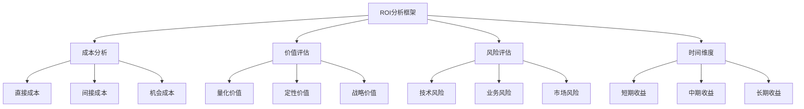
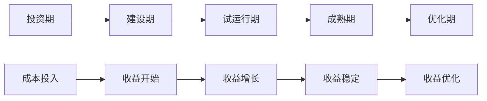

# AI大模型投资回报分析：从成本到价值的系统评估

AI大模型项目的投资回报分析是企业决策者面临的关键挑战。如何科学地评估AI项目的成本结构、量化价值创造、预测长期收益，是确保AI投资成功的重要前提。本文将提供一套完整的AI大模型ROI分析框架，帮助企业做出明智的投资决策。

## 一、AI大模型ROI分析框架概述

### 1.1 ROI分析的重要性

在AI大模型项目投资决策中，ROI分析扮演着至关重要的角色：

**为什么需要ROI分析：**

1. **投资决策支持**
   - 项目优先级排序
   - 资源分配决策
   - 风险收益评估

2. **预算规划依据**
   - 投资规模确定
   - 分期投入计划
   - 资金筹措策略

3. **项目监控指标**
   - 进度跟踪
   - 效果评估
   - 调整优化

4. **利益相关方沟通**
   - 管理层汇报
   - 投资者沟通
   - 团队激励

### 1.2 ROI分析框架设计

构建科学的AI大模型ROI分析框架需要从多个维度进行考虑：

**分析框架结构：**

## 二、AI大模型成本结构分析

### 2.1 直接成本分析

AI大模型项目的直接成本包括技术开发、基础设施、人员投入等可明确计量的费用。

**主要直接成本类别：**

#### 1. 技术开发成本
**模型开发费用：**
- 模型训练与优化：50,000 - 200,000元
- 算法开发与调优：30,000 - 100,000元
- 系统集成与测试：40,000 - 150,000元

**软件开发费用：**
- 前端界面开发：30,000 - 80,000元
- 后端服务开发：50,000 - 120,000元
- API接口开发：20,000 - 60,000元

#### 2. 基础设施成本
**云服务费用：**
- 计算资源：10,000 - 50,000元/年
- 存储资源：5,000 - 20,000元/年
- 网络带宽：3,000 - 15,000元/年

**硬件设备费用：**
- 服务器设备：100,000 - 500,000元
- 网络设备：20,000 - 100,000元
- 安全设备：30,000 - 150,000元

#### 3. 人员成本
**技术团队：**
- AI工程师：150,000 - 300,000元/年/人
- 软件工程师：100,000 - 200,000元/年/人
- 数据工程师：120,000 - 250,000元/年/人

**项目管理：**
- 项目经理：120,000 - 200,000元/年
- 产品经理：100,000 - 180,000元/年
- 测试工程师：80,000 - 150,000元/年

### 2.2 间接成本分析

间接成本虽然不直接体现在项目预算中，但对总体投资回报有重要影响。

**主要间接成本：**

1. **管理成本**
   - 项目协调时间
   - 决策沟通成本
   - 风险管理投入

2. **培训成本**
   - 员工技能培训
   - 新流程学习
   - 知识转移成本

3. **机会成本**
   - 其他项目延迟
   - 资源占用成本
   - 市场时机损失

### 2.3 成本控制策略

有效的成本控制是提升AI项目ROI的重要手段。

**成本控制方法：**

1. **分阶段投入**
   - 概念验证阶段：20%预算
   - MVP开发阶段：40%预算
   - 规模化部署：40%预算

2. **技术选型优化**
   - 开源技术优先
   - 云服务按需付费
   - 混合部署策略

3. **资源利用优化**
   - 团队技能匹配
   - 外部资源整合
   - 敏捷开发方法

## 三、AI大模型价值创造评估

### 3.1 量化价值分析

量化价值是ROI分析的核心，需要建立科学的评估指标体系。

**主要量化价值指标：**

#### 1. 效率提升价值
**时间节约：**
- 流程自动化：节省人工时间30-70%
- 决策支持：决策时间缩短50-80%
- 问题解决：响应速度提升3-10倍

**成本节约：**
- 人力成本：减少重复性工作20-50%
- 运营成本：流程优化节省15-40%
- 错误成本：质量提升减少损失25-60%

#### 2. 收入增长价值
**直接收入：**
- 新产品服务：创造新收入来源
- 客户满意度：提升客户续费率
- 市场份额：扩大市场占有率

**间接收入：**
- 品牌价值：提升企业形象
- 竞争优势：建立技术壁垒
- 合作伙伴：拓展合作机会

#### 3. 风险控制价值
**风险降低：**
- 操作风险：减少人为错误
- 合规风险：提升合规水平
- 市场风险：增强预测能力

### 3.2 定性价值评估

除了量化指标，AI大模型项目还创造许多难以量化的价值。

**定性价值维度：**

1. **创新能力提升**
   - 产品创新速度
   - 服务模式创新
   - 商业模式创新

2. **组织能力建设**
   - 技术能力提升
   - 数据驱动文化
   - 敏捷响应能力

3. **客户体验改善**
   - 服务个性化
   - 响应及时性
   - 交互自然性

### 3.3 战略价值评估

AI大模型项目的战略价值往往超越短期财务回报。

**战略价值体现：**

1. **技术领先性**
   - 行业技术标杆
   - 人才吸引力
   - 合作伙伴价值

2. **市场竞争力**
   - 差异化优势
   - 客户粘性
   - 进入壁垒

3. **未来布局**
   - 技术积累
   - 生态建设
   - 长期发展

## 四、时间维度与收益分布

### 4.1 收益时间分布

AI大模型项目的收益通常呈现特定的时间分布特征。

**收益时间曲线：**

**各阶段特征：**

1. **投资期（0-3个月）**
   - 成本：高投入
   - 收益：无
   - ROI：负值

2. **建设期（3-9个月）**
   - 成本：持续投入
   - 收益：开始显现
   - ROI：逐步改善

3. **试运行期（9-15个月）**
   - 成本：投入减少
   - 收益：快速增长
   - ROI：显著提升

4. **成熟期（15-36个月）**
   - 成本：稳定维护
   - 收益：稳定增长
   - ROI：达到峰值

5. **优化期（36个月以后）**
   - 成本：优化投入
   - 收益：持续提升
   - ROI：长期稳定

### 4.2 现金流分析

现金流分析是评估AI项目投资回报的重要工具。

**现金流分析方法：**

1. **净现值(NPV)分析**
   - 折现率：通常采用8-15%
   - 计算期限：3-5年
   - 正向NPV：项目可行
   - 负向NPV：需要重新评估

2. **内部收益率(IRR)分析**
   - 目标IRR：通常>20%
   - 与资本成本比较
   - 与其他投资选项比较

3. **投资回收期分析**
   - 简单回收期：1.5-3年
   - 折现回收期：2-4年
   - 与企业预期比较

## 五、风险评估与敏感性分析

### 5.1 风险因素识别

AI大模型项目面临多种风险因素，需要系统识别和评估。

**主要风险类别：**

1. **技术风险**
   - 模型性能不达预期
   - 技术路线选择错误
   - 集成难度超出预期
   - 数据质量问题

2. **业务风险**
   - 用户接受度低
   - 流程变革阻力
   - 价值实现不足
   - 内部支持不足

3. **市场风险**
   - 竞争加剧
   - 技术快速迭代
   - 监管环境变化
   - 市场需求变化

### 5.2 敏感性分析

敏感性分析帮助评估关键变量对ROI的影响程度。

**敏感性分析维度：**

1. **成本变动敏感性**
   - 开发成本上升20%：ROI降低15%
   - 运维成本增加30%：ROI降低10%
   - 人员成本提高25%：ROI降低12%

2. **收益变动敏感性**
   - 效率提升减少20%：ROI降低25%
   - 收入增长减少30%：ROI降低35%
   - 实施延迟6个月：ROI降低20%

3. **外部因素敏感性**
   - 市场竞争加剧：ROI降低15-30%
   - 技术快速迭代：ROI降低10-25%
   - 监管政策变化：ROI降低5-40%

### 5.3 风险应对策略

针对识别的风险，制定相应的应对策略。

**风险应对方法：**

1. **风险规避**
   - 分阶段实施
   - 先小规模试点
   - 技术路线备选

2. **风险缓解**
   - 增强变更管理
   - 加强用户培训
   - 技术架构冗余

3. **风险转移**
   - 外包高风险模块
   - 联合研发分担风险
   - 保险保障

4. **风险接受**
   - 建立应急预案
   - 预留风险预算
   - 定期风险评估

## 六、ROI优化策略

### 6.1 成本优化方法

通过优化成本结构提升AI项目ROI。

**成本优化策略：**

1. **技术架构优化**
   - 混合云策略
   - 开源技术利用
   - 资源弹性伸缩

2. **开发方法优化**
   - 敏捷开发方法
   - 持续集成部署
   - 自动化测试

3. **资源配置优化**
   - 人员技能匹配
   - 资源共享机制
   - 外部资源整合

### 6.2 价值提升方法

通过价值创造最大化提升AI项目ROI。

**价值提升策略：**

1. **应用场景扩展**
   - 横向扩展到更多业务
   - 纵向深化应用深度
   - 外部赋能合作伙伴

2. **用户体验优化**
   - 交互界面优化
   - 个性化定制能力
   - 持续反馈改进

3. **商业模式创新**
   - AI能力服务化
   - 数据价值变现
   - 生态合作共赢

### 6.3 持续优化机制

建立长效机制确保AI项目ROI持续优化。

**持续优化机制：**

1. **绩效评估体系**
   - 关键指标定期跟踪
   - 多维度价值评估
   - 对标行业最佳实践

2. **迭代优化流程**
   - 定期回顾与总结
   - 持续改进计划
   - 用户反馈闭环

3. **知识管理系统**
   - 经验教训沉淀
   - 最佳实践分享
   - 能力持续提升

## 结论

AI大模型项目的ROI分析是一项系统工程，需要全面考虑成本结构、价值创造、风险因素和时间维度。通过科学的分析框架和方法，企业可以做出更明智的投资决策，最大化AI技术带来的商业价值。

随着AI技术的不断发展和成熟，其投资回报模式也将持续演进。企业需要建立动态的ROI评估机制，不断优化投资策略，在AI时代的竞争中赢得先机。

---

*"投资AI不仅是成本支出，更是价值创造的过程。明智的投资决策来源于科学的ROI分析框架。"* 