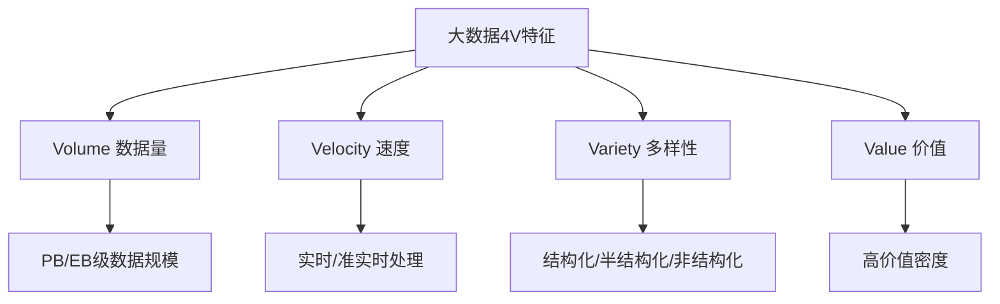
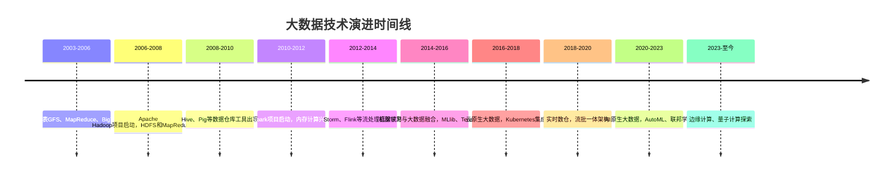
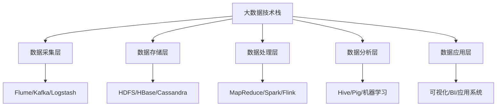
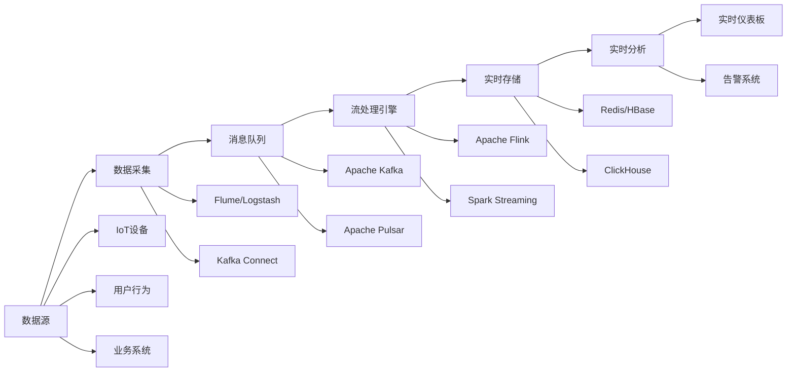
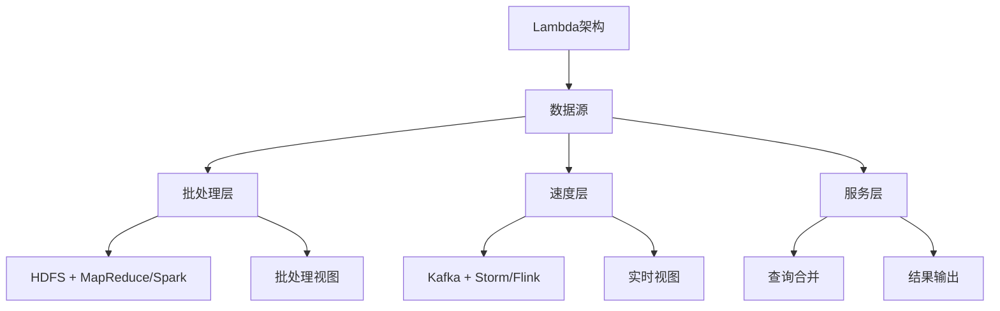
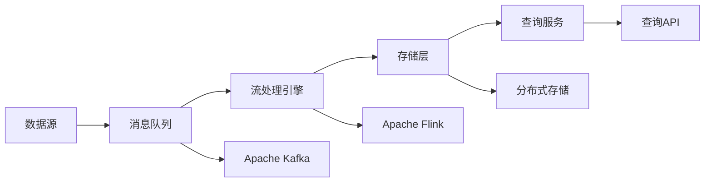
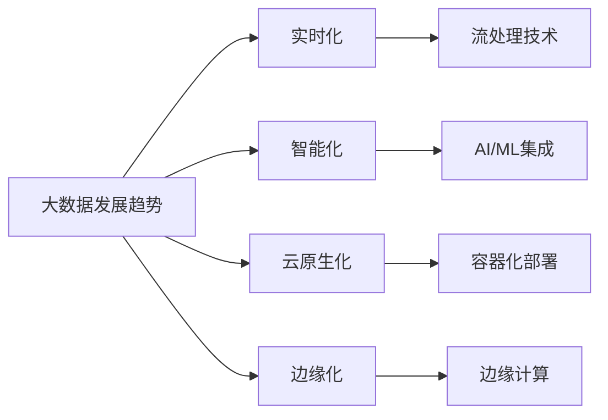
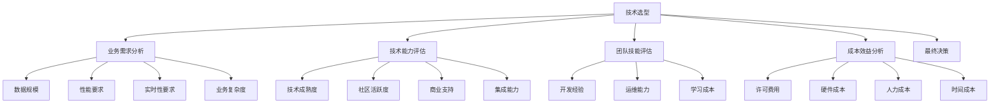

import Tabs from '@theme/Tabs';
import TabItem from '@theme/TabItem';
import TOCInline from '@theme/TOCInline';

# 大数据技术概述

大数据技术是当今信息技术领域的重要发展方向，它涵盖了数据采集、存储、处理、分析和应用的全生命周期。随着互联网、物联网、人工智能等技术的快速发展，大数据技术已经成为企业数字化转型和智能化升级的核心驱动力。

:::info 本文内容概览
<TOCInline toc={toc} />
:::

:::tip 核心价值
**大数据技术 = 海量数据处理 + 实时分析能力 + 智能决策支持 + 业务价值挖掘 + 技术架构创新**
- 🚀 **海量数据处理**：处理PB级甚至EB级的数据规模
- 👨‍💻 **实时分析能力**：支持流式数据处理和实时分析
- 🔍 **智能决策支持**：通过数据挖掘和机器学习提供智能决策
- 🔗 **业务价值挖掘**：从海量数据中发现业务洞察和价值
- 📚 **技术架构创新**：分布式计算、存储和处理架构的创新
:::

## 1. 大数据基本概念

### 1.1 什么是大数据？

大数据是指无法使用传统数据处理软件在合理时间内处理的数据集。大数据具有"4V"特征：



#### 大数据的5V特征扩展
```java title="大数据特征示例"
public class BigDataCharacteristics {
    public static void main(String[] args) {
        // 1. Volume - 数据量
        System.out.println("Volume: 数据量从TB级增长到PB/EB级");
        
        // 2. Velocity - 速度
        System.out.println("Velocity: 数据生成和处理速度越来越快");
        
        // 3. Variety - 多样性
        System.out.println("Variety: 数据类型包括文本、图像、视频、音频等");
        
        // 4. Value - 价值
        System.out.println("Value: 数据价值密度相对较低，但总量价值巨大");
        
        // 5. Veracity - 真实性
        System.out.println("Veracity: 数据质量和可信度的重要性");
    }
}
```

### 1.2 大数据与传统数据的区别

| 特征 | 传统数据 | 大数据 |
|------|----------|--------|
| **数据量** | GB/TB级 | PB/EB级 |
| **数据类型** | 主要是结构化 | 结构化、半结构化、非结构化 |
| **处理方式** | 批处理 | 批处理+流处理 |
| **存储方式** | 关系型数据库 | 分布式存储系统 |
| **分析方式** | 统计分析 | 统计分析+机器学习+深度学习 |
| **实时性** | 离线分析 | 实时+离线分析 |

<Tabs>
  <TabItem value="traditional" label="传统数据处理" default>
  ```java
  // 传统数据处理方式
  public class TraditionalDataProcessing {
      public void processData(List<Record> records) {
          // 单机处理
          for (Record record : records) {
              // 串行处理
              processRecord(record);
          }
      }
  }
  ```
  </TabItem>
  <TabItem value="bigdata" label="大数据处理方式">
  ```java
  // 大数据处理方式
  public class BigDataProcessing {
      public void processData(Stream<Record> records) {
          // 分布式并行处理
          records.parallel()
              .map(this::processRecord)
              .collect(Collectors.toList());
      }
  }
  ```
  </TabItem>
</Tabs>

### 1.3 大数据技术演进历程



## 2. 大数据技术栈

### 2.1 大数据技术架构

大数据技术栈通常分为以下几个层次：



### 2.2 核心技术组件

<div className="card">
<div className="card__header">
<h4>大数据核心技术组件</h4>
</div>
<div className="card__body">
<ol>
<li><strong>分布式存储</strong>：HDFS、HBase、Cassandra、MongoDB</li>
<li><strong>分布式计算</strong>：MapReduce、Spark、Flink、Storm</li>
<li><strong>数据仓库</strong>：Hive、Impala、Presto、ClickHouse</li>
<li><strong>消息队列</strong>：Kafka、RabbitMQ、RocketMQ</li>
<li><strong>数据采集</strong>：Flume、Logstash、Beats</li>
<li><strong>调度管理</strong>：Airflow、Oozie、Azkaban</li>
</ol>
</div>
</div>

### 2.3 技术选型决策矩阵

| 技术需求 | 推荐技术 | 优势 | 劣势 | 适用场景 |
|----------|----------|------|------|----------|
| **高吞吐批处理** | Apache Spark | 内存计算、易用性 | 内存消耗大 | 数据挖掘、机器学习 |
| **低延迟流处理** | Apache Flink | 低延迟、精确一次 | 学习曲线陡峭 | 实时风控、实时推荐 |
| **大规模存储** | Apache HDFS | 高可靠、高扩展 | 小文件问题 | 数据湖、历史数据 |
| **实时查询** | Apache Druid | 亚秒级查询 | 存储成本高 | 实时分析、监控仪表板 |
| **消息传输** | Apache Kafka | 高吞吐、持久化 | 运维复杂 | 日志收集、事件流 |

<Tabs>
  <TabItem value="intro-storage" label="存储技术" default>
  ```java
  // HDFS文件操作示例
  public class HDFSExample {
      public void writeToHDFS(String path, String content) {
          Configuration conf = new Configuration();
          FileSystem fs = FileSystem.get(conf);
          
          try (FSDataOutputStream out = fs.create(new Path(path))) {
              out.writeBytes(content);
          }
      }
  }
  ```
  </TabItem>
  <TabItem value="intro-compute" label="计算技术">
  ```java
  // Spark处理示例
  public class SparkExample {
      public void processData(JavaRDD<String> data) {
          JavaRDD<String> result = data
              .filter(line -> line.contains("error"))
              .map(String::toUpperCase);
          
          result.collect().forEach(System.out::println);
      }
  }
  ```
  </TabItem>
  <TabItem value="intro-queue" label="消息队列">
  ```java
  // Kafka生产者示例
  public class KafkaProducer {
      public void sendMessage(String topic, String message) {
          Properties props = new Properties();
          props.put("bootstrap.servers", "localhost:9092");
          props.put("key.serializer", "org.apache.kafka.common.serialization.StringSerializer");
          props.put("value.serializer", "org.apache.kafka.common.serialization.StringSerializer");
          
          try (Producer<String, String> producer = new KafkaProducer<>(props)) {
              producer.send(new ProducerRecord<>(topic, message));
          }
      }
  }
  ```
  </TabItem>
</Tabs>

## 3. 大数据应用场景

### 3.1 典型应用领域

大数据技术在各个行业都有广泛应用：

| 行业 | 应用场景 | 技术特点 | 技术栈 |
|------|----------|----------|--------|
| **金融** | 风险控制、反欺诈、智能投顾 | 实时性要求高、数据安全性强 | Kafka+Flink+Redis+HBase |
| **电商** | 用户画像、推荐系统、库存优化 | 数据量大、个性化需求强 | Spark+MLlib+HBase+Redis |
| **医疗** | 疾病预测、药物研发、健康管理 | 数据质量要求高、隐私保护 | Spark+TensorFlow+Elasticsearch |
| **交通** | 智能交通、路径优化、事故预测 | 实时性要求高、地理位置相关 | Kafka+Flink+GeoMesa+Redis |
| **制造** | 预测性维护、质量控制、供应链优化 | IoT数据、时序数据分析 | InfluxDB+Spark+MLlib |

### 3.2 应用案例详解

<div className="code-with-callout">

```java title="推荐系统架构示例"
public class RecommendationSystem {
    private final SparkSession spark;
    private final RedisTemplate<String, String> redisTemplate;
    private final HBaseTemplate hbaseTemplate;
    
    public RecommendationSystem(SparkSession spark, 
                               RedisTemplate<String, String> redisTemplate,
                               HBaseTemplate hbaseTemplate) {
        this.spark = spark;
        this.redisTemplate = redisTemplate;
        this.hbaseTemplate = hbaseTemplate;
    }
    
    public List<Product> recommendProducts(User user, List<Product> products) {
        // 1. 获取用户历史行为
        List<UserBehavior> behaviors = getUserBehaviors(user.getId());
        
        // 2. 计算用户兴趣向量
        UserInterestVector interestVector = calculateInterestVector(behaviors);
        
        // 3. 计算产品特征向量
        List<ProductFeatureVector> productFeatures = getProductFeatures(products);
        
        // 4. 计算相似度并排序
        return products.stream()
            .map(product -> {
                ProductFeatureVector feature = findFeature(product.getId(), productFeatures);
                double score = calculateSimilarity(interestVector, feature);
                return new ProductScore(product, score);
            })
            .sorted(Comparator.comparing(ProductScore::getScore).reversed())
            .limit(10)
            .map(ProductScore::getProduct)
            .collect(Collectors.toList());
    }
    
    private UserInterestVector calculateInterestVector(List<UserBehavior> behaviors) {
        // 基于用户行为计算兴趣向量
        Map<String, Double> interests = new HashMap<>();
        
        for (UserBehavior behavior : behaviors) {
            String category = behavior.getProductCategory();
            double weight = getBehaviorWeight(behavior.getType());
            
            interests.merge(category, weight, Double::sum);
        }
        
        return new UserInterestVector(interests);
    }
    
    private double getBehaviorWeight(BehaviorType type) {
        switch (type) {
            case VIEW: return 1.0;
            case LIKE: return 2.0;
            case SHARE: return 3.0;
            case PURCHASE: return 5.0;
            default: return 0.5;
        }
    }
    
    private double calculateSimilarity(UserInterestVector user, ProductFeatureVector product) {
        // 计算余弦相似度
        double dotProduct = 0.0;
        double userNorm = 0.0;
        double productNorm = 0.0;
        
        for (String category : user.getInterests().keySet()) {
            double userValue = user.getInterests().get(category);
            double productValue = product.getFeatures().getOrDefault(category, 0.0);
            
            dotProduct += userValue * productValue;
            userNorm += userValue * userValue;
        }
        
        for (double value : product.getFeatures().values()) {
            productNorm += value * value;
        }
        
        if (userNorm == 0 || productNorm == 0) return 0.0;
        
        return dotProduct / (Math.sqrt(userNorm) * Math.sqrt(productNorm));
    }
}
```

:::info 应用价值
推荐系统通过分析用户行为数据，能够提供个性化的产品推荐，提高用户满意度和转化率。该架构结合了Spark的批处理能力、Redis的缓存性能和HBase的存储能力。
:::
</div>

### 3.3 实时数据处理架构



## 4. 大数据架构设计

### 4.1 Lambda架构

Lambda架构是大数据处理的标准架构模式：



#### Lambda架构实现示例
```java title="Lambda架构实现"
public class LambdaArchitecture {
    private final BatchProcessor batchProcessor;
    private final SpeedProcessor speedProcessor;
    private final ServingLayer servingLayer;
    
    public LambdaArchitecture(BatchProcessor batchProcessor,
                             SpeedProcessor speedProcessor,
                             ServingLayer servingLayer) {
        this.batchProcessor = batchProcessor;
        this.speedProcessor = speedProcessor;
        this.servingLayer = servingLayer;
    }
    
    public void processData(DataStream dataStream) {
        // 1. 批处理层 - 处理历史数据
        CompletableFuture<BatchView> batchFuture = CompletableFuture
            .supplyAsync(() -> batchProcessor.process(dataStream.getBatchData()));
        
        // 2. 速度层 - 处理实时数据
        CompletableFuture<SpeedView> speedFuture = CompletableFuture
            .supplyAsync(() -> speedProcessor.process(dataStream.getSpeedData()));
        
        // 3. 服务层 - 合并结果
        CompletableFuture.allOf(batchFuture, speedFuture)
            .thenAccept(v -> {
                BatchView batchView = batchFuture.join();
                SpeedView speedView = speedFuture.join();
                
                ServingView servingView = servingLayer.merge(batchView, speedView);
                servingLayer.update(servingView);
            });
    }
}

// 批处理层
public class BatchProcessor {
    public BatchView process(List<DataRecord> batchData) {
        // 使用Spark进行批处理
        JavaRDD<DataRecord> rdd = sparkContext.parallelize(batchData);
        
        JavaRDD<ProcessedRecord> processed = rdd
            .map(this::transformRecord)
            .filter(this::validateRecord)
            .mapToPair(this::createKeyValuePair)
            .reduceByKey(this::aggregateRecords);
        
        return new BatchView(processed.collect());
    }
}

// 速度层
public class SpeedProcessor {
    public SpeedView process(Stream<DataRecord> speedData) {
        // 使用Flink进行流处理
        DataStream<DataRecord> stream = env.fromCollection(speedData.collect(Collectors.toList()));
        
        DataStream<ProcessedRecord> processed = stream
            .map(this::transformRecord)
            .filter(this::validateRecord)
            .keyBy(ProcessedRecord::getKey)
            .window(TumblingProcessingTimeWindows.of(Time.minutes(5)))
            .aggregate(new RecordAggregator());
        
        return new SpeedView(processed.executeAndCollect());
    }
}
```

### 4.2 Kappa架构

Kappa架构是Lambda架构的简化版本，统一使用流处理：



## 5. 大数据发展趋势

### 5.1 技术发展趋势



### 5.2 未来发展方向

<div className="card">
<div className="card__body">
<ol>
<li><strong>实时数据处理</strong>：流处理技术将成为主流</li>
<li><strong>AI与大数据融合</strong>：机器学习深度集成</li>
<li><strong>边缘计算</strong>：数据处理向边缘节点迁移</li>
<li><strong>数据湖架构</strong>：统一的数据存储和分析平台</li>
<li><strong>隐私计算</strong>：在保护隐私的前提下进行数据分析</li>
</ol>
</div>
</div>

### 5.3 新兴技术趋势

#### 5.3.1 数据湖技术
```java title="数据湖架构示例"
public class DataLakeArchitecture {
    private final StorageLayer storageLayer;
    private final ProcessingLayer processingLayer;
    private final GovernanceLayer governanceLayer;
    
    public DataLakeArchitecture(StorageLayer storageLayer,
                               ProcessingLayer processingLayer,
                               GovernanceLayer governanceLayer) {
        this.storageLayer = storageLayer;
        this.processingLayer = processingLayer;
        this.governanceLayer = governanceLayer;
    }
    
    public void ingestData(DataSource source) {
        // 1. 原始数据存储
        String rawPath = storageLayer.storeRaw(source.getData());
        
        // 2. 元数据管理
        Metadata metadata = new Metadata();
        metadata.setSource(source.getName());
        metadata.setIngestTime(LocalDateTime.now());
        metadata.setRawPath(rawPath);
        metadata.setSchema(source.getSchema());
        
        governanceLayer.registerMetadata(metadata);
        
        // 3. 数据质量检查
        DataQualityReport qualityReport = governanceLayer.checkQuality(source.getData());
        
        if (qualityReport.isValid()) {
            // 4. 数据转换和优化
            String processedPath = processingLayer.process(source.getData());
            metadata.setProcessedPath(processedPath);
            governanceLayer.updateMetadata(metadata);
        } else {
            // 5. 数据质量问题处理
            governanceLayer.handleQualityIssues(qualityReport);
        }
    }
}
```

#### 5.3.2 联邦学习
```java title="联邦学习示例"
public class FederatedLearning {
    private final List<Participant> participants;
    private final Coordinator coordinator;
    
    public FederatedLearning(List<Participant> participants, Coordinator coordinator) {
        this.participants = participants;
        this.coordinator = coordinator;
    }
    
    public Model trainFederatedModel() {
        // 1. 初始化全局模型
        Model globalModel = coordinator.initializeModel();
        
        // 2. 多轮训练
        for (int round = 0; round < MAX_ROUNDS; round++) {
            // 3. 分发模型到各参与方
            List<Model> localModels = participants.parallelStream()
                .map(participant -> participant.trainLocalModel(globalModel))
                .collect(Collectors.toList());
            
            // 4. 聚合本地模型
            globalModel = coordinator.aggregateModels(localModels);
            
            // 5. 评估全局模型
            double accuracy = coordinator.evaluateModel(globalModel);
            
            if (accuracy > TARGET_ACCURACY) {
                break;
            }
        }
        
        return globalModel;
    }
}
```

## 6. 大数据技术选型指南

### 6.1 技术选型决策框架



### 6.2 场景化技术选型

<Tabs>
  <TabItem value="scenario1" label="电商推荐系统" default>
  ```java
  // 电商推荐系统技术选型
  public class EcommerceRecommendationSelection {
      public TechnologyStack selectTechnologies(Requirements requirements) {
          TechnologyStack stack = new TechnologyStack();
          
          // 数据存储
          if (requirements.getDataVolume() > 1000000000) { // 10亿+
              stack.setStorage("HDFS + HBase"); // 大规模分布式存储
          } else {
              stack.setStorage("MySQL + Redis"); // 传统关系型存储
          }
          
          // 数据处理
          if (requirements.isRealTime()) {
              stack.setProcessing("Spark Streaming + Flink"); // 实时处理
          } else {
              stack.setProcessing("Spark + MapReduce"); // 批处理
          }
          
          // 机器学习
          if (requirements.getAlgorithmComplexity() > 70) {
              stack.setML("TensorFlow + PyTorch"); // 深度学习
          } else {
              stack.setML("Spark MLlib + Scikit-learn"); // 传统机器学习
          }
          
          return stack;
      }
  }
  ```
  </TabItem>
  <TabItem value="scenario2" label="金融风控系统">
  ```java
  // 金融风控系统技术选型
  public class FinancialRiskSelection {
      public TechnologyStack selectTechnologies(Requirements requirements) {
          TechnologyStack stack = new TechnologyStack();
          
          // 实时性要求高
          stack.setStreaming("Apache Flink"); // 低延迟流处理
          stack.setStorage("Apache Druid"); // 实时查询存储
          stack.setCache("Redis Cluster"); // 分布式缓存
          
          // 数据安全
          stack.setSecurity("Kerberos + Ranger"); // 认证授权
          stack.setEncryption("AES + RSA"); // 数据加密
          
          // 规则引擎
          stack.setRules("Drools + Esper"); // 复杂规则处理
          
          return stack;
      }
  }
  ```
  </TabItem>
  <TabItem value="scenario3" label="IoT数据处理">
  ```java
  // IoT数据处理技术选型
  public class IoTDataSelection {
      public TechnologyStack selectTechnologies(Requirements requirements) {
          TechnologyStack stack = new TechnologyStack();
          
          // 时序数据
          stack.setStorage("InfluxDB + Cassandra"); // 时序数据库
          stack.setProcessing("Apache Flink"); // 流处理
          
          // 边缘计算
          if (requirements.isEdgeComputing()) {
              stack.setEdge("EdgeX Foundry + KubeEdge");
          }
          
          // 设备管理
          stack.setDeviceManagement("Apache IoTDB");
          
          return stack;
      }
  }
  ```
  </TabItem>
</Tabs>

## 7. 总结

大数据技术是现代信息技术的重要组成部分，它为企业提供了处理海量数据、挖掘数据价值、支持智能决策的能力。随着技术的不断发展，大数据将在更多领域发挥重要作用。

### 学习建议

1. **掌握基础概念**：理解大数据的特征和技术架构
2. **学习核心技术**：熟悉Hadoop、Spark等主流技术
3. **实践项目**：通过实际项目积累经验
4. **关注趋势**：了解技术发展方向和新兴技术
5. **跨领域学习**：结合业务场景学习相关技术

### 关键要点

1. **技术架构**：理解Lambda和Kappa架构的设计思想
2. **技术选型**：根据业务需求选择合适的技术方案
3. **性能优化**：掌握大数据系统的性能调优方法
4. **运维管理**：学习大数据平台的运维和监控
5. **安全合规**：了解大数据安全和隐私保护要求

大数据技术的学习是一个持续的过程，需要不断实践和更新知识，以适应快速发展的技术环境。 