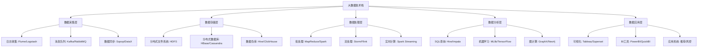
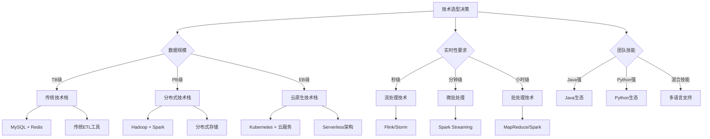
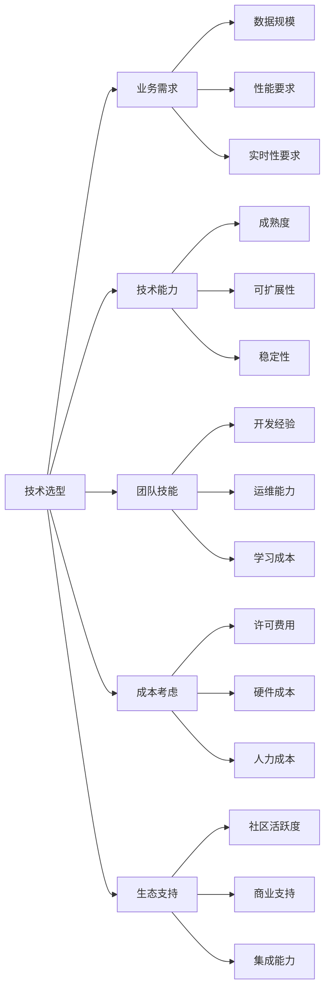
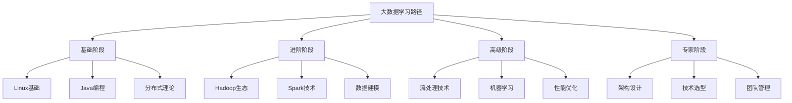
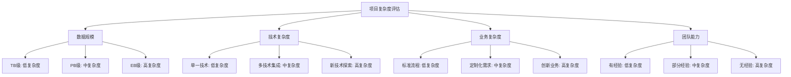
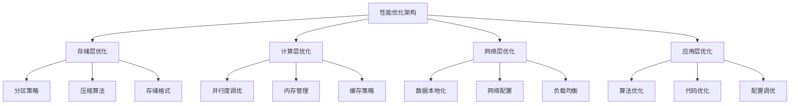
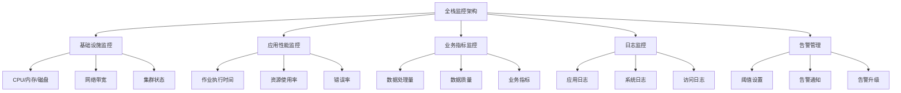
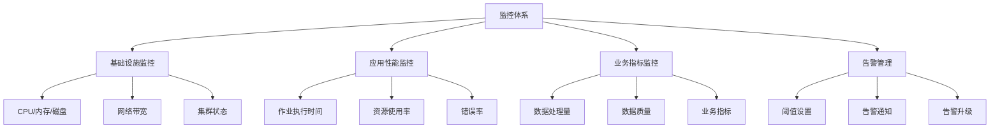
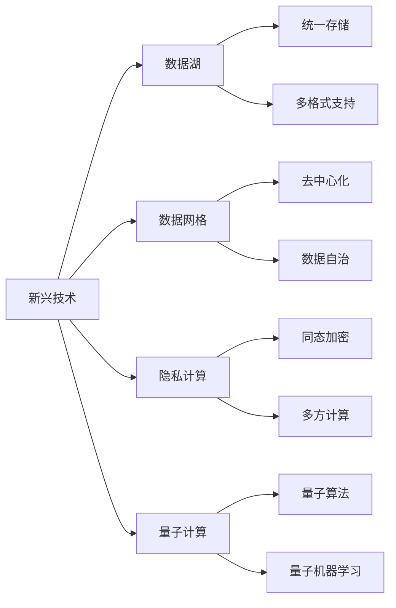

import Tabs from '@theme/Tabs';
import TabItem from '@theme/TabItem';
import TOCInline from '@theme/TOCInline';

# 大数据技术总结

大数据技术是一个庞大而复杂的技术体系，涵盖了数据采集、存储、处理、分析和应用的各个环节。本文档将总结大数据技术的核心要点，提供技术选型指南，并规划学习路径。

:::info 本文内容概览
<TOCInline toc={toc} />
:::

:::tip 核心价值
**大数据技术总结 = 技术体系梳理 + 选型指南 + 学习路径 + 最佳实践 + 发展趋势**
- 🚀 **技术体系梳理**：系统总结大数据技术栈和架构模式
- 👨‍💻 **选型指南**：提供技术选型的决策框架和参考标准
- 🔍 **学习路径**：规划循序渐进的学习路线图
- 🔗 **最佳实践**：总结实际项目中的经验和教训
- 📚 **发展趋势**：分析技术发展方向和新兴趋势
:::

## 1. 大数据技术体系总览

### 1.1 技术栈全景图

大数据技术栈可以分为以下几个层次：



### 1.2 核心技术对比

| 技术领域 | 主流技术 | 特点 | 适用场景 |
|----------|----------|------|----------|
| **分布式存储** | HDFS、HBase、Cassandra | 高可靠、高扩展 | 大规模数据存储 |
| **分布式计算** | MapReduce、Spark、Flink | 高性能、易用 | 数据处理和分析 |
| **数据仓库** | Hive、Impala、ClickHouse | SQL支持、高性能 | 数据查询和分析 |
| **消息队列** | Kafka、RabbitMQ、RocketMQ | 高吞吐、低延迟 | 数据流传输 |
| **机器学习** | MLlib、TensorFlow、PyTorch | 算法丰富、易扩展 | 智能分析和预测 |

## 2. 技术选型指南

### 2.1 选型决策框架

技术选型需要考虑多个维度：

#### 2.1.1 技术选型决策树


#### 2.1.2 技术选型评分模型
```java title="技术选型评分模型示例"
public class TechnologySelectionModel {
    private final Map<String, Technology> technologies;
    private final List<SelectionCriteria> criteria;
    
    public TechnologySelectionModel() {
        this.technologies = new HashMap<>();
        this.criteria = new ArrayList<>();
        initializeTechnologies();
        initializeCriteria();
    }
    
    private void initializeTechnologies() {
        // 存储技术
        technologies.put("HDFS", new Technology("HDFS", "分布式文件系统", 0.9, 0.8, 0.7));
        technologies.put("HBase", new Technology("HBase", "分布式NoSQL数据库", 0.8, 0.9, 0.6));
        technologies.put("Cassandra", new Technology("Cassandra", "分布式NoSQL数据库", 0.7, 0.9, 0.8));
        technologies.put("ClickHouse", new Technology("ClickHouse", "列式数据库", 0.9, 0.7, 0.8));
        
        // 计算技术
        technologies.put("MapReduce", new Technology("MapReduce", "批处理框架", 0.6, 0.8, 0.9));
        technologies.put("Spark", new Technology("Spark", "内存计算框架", 0.9, 0.8, 0.7));
        technologies.put("Flink", new Technology("Flink", "流处理框架", 0.8, 0.9, 0.6));
        technologies.put("Storm", new Technology("Storm", "流处理框架", 0.7, 0.9, 0.5));
        
        // 消息队列
        technologies.put("Kafka", new Technology("Kafka", "分布式消息队列", 0.9, 0.8, 0.7));
        technologies.put("RabbitMQ", new Technology("RabbitMQ", "消息队列", 0.7, 0.8, 0.9));
        technologies.put("RocketMQ", new Technology("RocketMQ", "消息队列", 0.8, 0.8, 0.8));
    }
    
    private void initializeCriteria() {
        criteria.add(new SelectionCriteria("性能", 0.3));
        criteria.add(new SelectionCriteria("可扩展性", 0.25));
        criteria.add(new SelectionCriteria("易用性", 0.2));
        criteria.add(new SelectionCriteria("社区支持", 0.15));
        criteria.add(new SelectionCriteria("成本", 0.1));
    }
    
    public TechnologyRecommendation selectTechnology(Requirements requirements) {
        Map<String, Double> scores = new HashMap<>();
        
        // 计算每个技术的综合得分
        for (Map.Entry<String, Technology> entry : technologies.entrySet()) {
            String techName = entry.getKey();
            Technology tech = entry.getValue();
            
            double score = calculateScore(tech, requirements);
            scores.put(techName, score);
        }
        
        // 排序并返回推荐结果
        List<Map.Entry<String, Double>> sortedScores = scores.entrySet().stream()
            .sorted(Map.Entry.<String, Double>comparingByValue().reversed())
            .collect(Collectors.toList());
        
        TechnologyRecommendation recommendation = new TechnologyRecommendation();
        recommendation.setTopChoice(sortedScores.get(0).getKey());
        recommendation.setTopScore(sortedScores.get(0).getValue());
        recommendation.setAlternatives(sortedScores.subList(1, Math.min(4, sortedScores.size())));
        
        return recommendation;
    }
    
    private double calculateScore(Technology tech, Requirements requirements) {
        double score = 0.0;
        
        // 根据需求权重计算得分
        if (requirements.isPerformanceCritical()) {
            score += tech.getPerformance() * 0.4;
        }
        if (requirements.isScalabilityCritical()) {
            score += tech.getScalability() * 0.4;
        }
        if (requirements.isEaseOfUseCritical()) {
            score += tech.getEaseOfUse() * 0.4;
        }
        
        // 考虑技术成熟度
        score += tech.getMaturity() * 0.2;
        
        return score;
    }
}

// 技术实体类
public class Technology {
    private String name;
    private String description;
    private double performance;      // 性能评分
    private double scalability;     // 可扩展性评分
    private double easeOfUse;       // 易用性评分
    private double maturity;        // 成熟度评分
    
    public Technology(String name, String description, double performance, 
                     double scalability, double easeOfUse) {
        this.name = name;
        this.description = description;
        this.performance = performance;
        this.scalability = scalability;
        this.easeOfUse = easeOfUse;
        this.maturity = calculateMaturity();
    }
    
    private double calculateMaturity() {
        // 基于技术出现时间和社区活跃度计算成熟度
        return (performance + scalability + easeOfUse) / 3.0;
    }
    
    // getters...
}

// 需求实体类
public class Requirements {
    private boolean performanceCritical;
    private boolean scalabilityCritical;
    private boolean easeOfUseCritical;
    private long dataVolume;
    private int concurrentUsers;
    private double budget;
    
    // constructors, getters, setters...
}
```



### 2.2 场景化选型建议

<Tabs>
  <TabItem value="summary-batch" label="批处理场景" default>
  ```java
  // 批处理场景技术选型
  public class BatchProcessingSelection {
      public String selectTechnology(BatchRequirements requirements) {
          if (requirements.getDataSize() > 100 && requirements.isHadoopEcosystem()) {
              return "Hadoop MapReduce"; // 大规模数据，Hadoop生态
          } else if (requirements.getPerformance() > 80 && requirements.isMemoryAvailable()) {
              return "Apache Spark"; // 高性能要求，内存充足
          } else if (requirements.getComplexity() > 70) {
              return "Apache Flink"; // 复杂计算逻辑
          } else {
              return "Traditional ETL Tools"; // 简单批处理
          }
      }
  }
  ```
  </TabItem>
  <TabItem value="summary-streaming" label="流处理场景">
  ```java
  // 流处理场景技术选型
  public class StreamingSelection {
      public String selectTechnology(StreamingRequirements requirements) {
          if (requirements.getLatency() < 100 && requirements.isExactlyOnce()) {
              return "Apache Flink"; // 低延迟，精确一次语义
          } else if (requirements.getThroughput() > 1000000) {
              return "Apache Storm"; // 超高吞吐量
          } else if (requirements.isIntegration() && requirements.isHadoopEcosystem()) {
              return "Spark Streaming"; // Hadoop生态集成
          } else {
              return "Kafka Streams"; // 轻量级流处理
          }
      }
  }
  ```
  </TabItem>
  <TabItem value="summary-storage" label="存储场景">
  ```java
  // 存储场景技术选型
  public class StorageSelection {
      public String selectTechnology(StorageRequirements requirements) {
          if (requirements.getConsistency() == Consistency.STRONG && requirements.isRealTime()) {
              return "Apache HBase"; // 强一致性，实时读写
          } else if (requirements.getScalability() > 90 && requirements.isEventuallyConsistent()) {
              return "Apache Cassandra"; // 高扩展性，最终一致性
          } else if (requirements.getQueryComplexity() > 80) {
              return "ClickHouse"; // 复杂查询，高性能
          } else if (requirements.getDataStructure() == Structure.DOCUMENT) {
              return "MongoDB"; // 文档型数据
          } else {
              return "HDFS + Hive"; // 通用存储方案
          }
      }
  }
  ```
  </TabItem>
</Tabs>

## 3. 学习路径规划

### 3.1 学习阶段划分

大数据技术学习可以分为以下几个阶段：



### 3.2 详细学习计划

<div className="card">
<div className="card__header">
<h4>分阶段学习计划</h4>
</div>
<div className="card__body">
<h5>第一阶段：基础准备（1-2个月）</h5>
<ol>
<li><strong>Linux系统</strong>：掌握基本命令、文件管理、权限控制</li>
<li><strong>Java编程</strong>：熟悉Java基础、集合框架、并发编程</li>
<li><strong>数据库基础</strong>：了解SQL、关系型数据库原理</li>
<li><strong>网络基础</strong>：理解TCP/IP、HTTP等协议</li>
</ol>

<h5>第二阶段：Hadoop生态（2-3个月）</h5>
<ol>
<li><strong>HDFS</strong>：理解分布式文件系统原理和操作</li>
<li><strong>MapReduce</strong>：掌握编程模型和开发方法</li>
<li><strong>YARN</strong>：了解资源管理和任务调度</li>
<li><strong>Hive</strong>：学习数据仓库和SQL查询</li>
</ol>

<h5>第三阶段：Spark技术（2-3个月）</h5>
<ol>
<li><strong>RDD编程</strong>：掌握弹性分布式数据集</li>
<li><strong>DataFrame</strong>：学习结构化数据处理</li>
<li><strong>Spark SQL</strong>：理解SQL查询优化</li>
<li><strong>Spark Streaming</strong>：掌握流处理技术</li>
</ol>

<h5>第四阶段：高级特性（2-3个月）</h5>
<ol>
<li><strong>流处理</strong>：学习Flink、Storm等流处理框架</li>
<li><strong>机器学习</strong>：掌握MLlib、TensorFlow等</li>
<li><strong>性能优化</strong>：学习调优技巧和最佳实践</li>
<li><strong>监控运维</strong>：掌握集群管理和监控工具</li>
</ol>
</div>
</div>

## 4. 项目实战指南

### 4.1 项目类型分类

大数据项目可以分为以下几种类型：

#### 4.1.1 项目复杂度评估矩阵


#### 4.1.2 项目风险评估框架
```java title="项目风险评估框架示例"
public class ProjectRiskAssessment {
    private final List<RiskFactor> riskFactors;
    private final RiskMitigationStrategy mitigationStrategy;
    
    public ProjectRiskAssessment() {
        this.riskFactors = new ArrayList<>();
        this.mitigationStrategy = new RiskMitigationStrategy();
        initializeRiskFactors();
    }
    
    private void initializeRiskFactors() {
        // 技术风险
        riskFactors.add(new RiskFactor("技术成熟度", RiskLevel.MEDIUM, "新技术可能存在稳定性问题"));
        riskFactors.add(new RiskFactor("技术集成复杂度", RiskLevel.HIGH, "多技术栈集成难度大"));
        riskFactors.add(new RiskFactor("性能瓶颈", RiskLevel.MEDIUM, "大规模数据处理可能存在性能问题"));
        
        // 数据风险
        riskFactors.add(new RiskFactor("数据质量", RiskLevel.HIGH, "源数据质量差影响整体效果"));
        riskFactors.add(new RiskFactor("数据安全", RiskLevel.HIGH, "敏感数据泄露风险"));
        riskFactors.add(new RiskFactor("数据一致性", RiskLevel.MEDIUM, "多源数据一致性难以保证"));
        
        // 业务风险
        riskFactors.add(new RiskFactor("需求变更", RiskLevel.HIGH, "业务需求频繁变更"));
        riskFactors.add(new RiskFactor("业务理解", RiskLevel.MEDIUM, "对业务理解不够深入"));
        riskFactors.add(new RiskFactor("价值验证", RiskLevel.MEDIUM, "项目价值难以量化"));
        
        // 团队风险
        riskFactors.add(new RiskFactor("技能不足", RiskLevel.HIGH, "团队缺乏必要技能"));
        riskFactors.add(new RiskFactor("人员流失", RiskLevel.MEDIUM, "关键人员离职风险"));
        riskFactors.add(new RiskFactor("沟通协作", RiskLevel.MEDIUM, "跨团队沟通协作困难"));
    }
    
    public RiskAssessmentResult assessProject(Project project) {
        RiskAssessmentResult result = new RiskAssessmentResult();
        
        // 评估各项风险
        for (RiskFactor factor : riskFactors) {
            RiskScore score = calculateRiskScore(factor, project);
            result.addRiskScore(factor.getName(), score);
        }
        
        // 计算总体风险等级
        RiskLevel overallRisk = calculateOverallRisk(result);
        result.setOverallRisk(overallRisk);
        
        // 生成风险缓解建议
        List<MitigationAction> actions = mitigationStrategy.generateActions(result);
        result.setMitigationActions(actions);
        
        return result;
    }
    
    private RiskScore calculateRiskScore(RiskFactor factor, Project project) {
        double probability = calculateProbability(factor, project);
        double impact = calculateImpact(factor, project);
        double score = probability * impact;
        
        RiskLevel level = score > 0.7 ? RiskLevel.HIGH : 
                         score > 0.4 ? RiskLevel.MEDIUM : RiskLevel.LOW;
        
        return new RiskScore(probability, impact, score, level);
    }
    
    private double calculateProbability(RiskFactor factor, Project project) {
        // 基于项目特征计算风险发生概率
        double baseProbability = factor.getBaseProbability();
        
        // 根据项目特征调整概率
        if (factor.getName().equals("技术成熟度") && project.usesNewTechnologies()) {
            baseProbability *= 1.5;
        }
        if (factor.getName().equals("数据质量") && project.hasPoorDataQuality()) {
            baseProbability *= 1.3;
        }
        if (factor.getName().equals("技能不足") && project.teamHasSkillGaps()) {
            baseProbability *= 1.4;
        }
        
        return Math.min(baseProbability, 1.0);
    }
    
    private double calculateImpact(RiskFactor factor, Project project) {
        // 基于项目特征计算风险影响程度
        double baseImpact = factor.getBaseImpact();
        
        // 根据项目特征调整影响
        if (factor.getName().equals("数据安全") && project.processesSensitiveData()) {
            baseImpact *= 1.5;
        }
        if (factor.getName().equals("需求变更") && project.hasUnstableRequirements()) {
            baseImpact *= 1.3;
        }
        
        return Math.min(baseImpact, 1.0);
    }
    
    private RiskLevel calculateOverallRisk(RiskAssessmentResult result) {
        // 计算总体风险等级
        double averageScore = result.getRiskScores().values().stream()
            .mapToDouble(RiskScore::getScore)
            .average()
            .orElse(0.0);
        
        if (averageScore > 0.6) return RiskLevel.HIGH;
        if (averageScore > 0.3) return RiskLevel.MEDIUM;
        return RiskLevel.LOW;
    }
}

// 风险因子
public class RiskFactor {
    private String name;
    private RiskLevel baseLevel;
    private String description;
    private double baseProbability;
    private double baseImpact;
    
    public RiskFactor(String name, RiskLevel baseLevel, String description) {
        this.name = name;
        this.baseLevel = baseLevel;
        this.description = description;
        this.baseProbability = baseLevel.getProbability();
        this.baseImpact = baseLevel.getImpact();
    }
    
    // getters...
}

// 风险等级枚举
public enum RiskLevel {
    LOW(0.2, 0.3),
    MEDIUM(0.5, 0.6),
    HIGH(0.8, 0.9);
    
    private final double probability;
    private final double impact;
    
    RiskLevel(double probability, double impact) {
        this.probability = probability;
        this.impact = impact;
    }
    
    // getters...
}
```

| 项目类型 | 特点 | 技术栈 | 难度 |
|----------|------|--------|------|
| **数据仓库建设** | 整合多源数据，构建统一视图 | HDFS+Hive+Spark | 中等 |
| **实时数据处理** | 处理流式数据，支持实时分析 | Kafka+Flink+Redis | 较高 |
| **用户画像系统** | 构建用户标签，支持精准营销 | Spark+MLlib+HBase | 中等 |
| **推荐系统** | 基于用户行为，提供个性化推荐 | Spark+MLlib+Redis | 较高 |
| **风控系统** | 实时风险检测，预防欺诈行为 | Flink+规则引擎+Redis | 高 |

### 4.2 实战项目示例

<div className="code-with-callout">

```java title="用户画像系统架构示例"
public class UserProfileSystem {
    public void buildUserProfile() {
        // 1. 数据采集层
        DataCollector collector = new DataCollector();
        collector.collectUserBehavior();    // 用户行为数据
        collector.collectUserAttribute();   // 用户属性数据
        collector.collectUserTransaction(); // 用户交易数据
        
        // 2. 数据处理层
        DataProcessor processor = new DataProcessor();
        JavaRDD<UserBehavior> behaviors = processor.processBehaviors();
        JavaRDD<UserAttribute> attributes = processor.processAttributes();
        JavaRDD<UserTransaction> transactions = processor.processTransactions();
        
        // 3. 特征工程层
        FeatureEngineer engineer = new FeatureEngineer();
        JavaRDD<UserFeature> features = engineer.extractFeatures(
            behaviors, attributes, transactions);
        
        // 4. 标签生成层
        TagGenerator generator = new TagGenerator();
        JavaRDD<UserTag> tags = generator.generateTags(features);
        
        // 5. 标签存储层
        TagStorage storage = new TagStorage();
        storage.saveTags(tags);
        
        // 6. 标签查询层
        TagQuery query = new TagQuery();
        List<UserTag> userTags = query.queryUserTags("user123");
    }
}
```

:::info 实战建议
从简单的数据仓库项目开始，逐步过渡到复杂的实时处理项目，在实践中积累经验和技能。
:::
</div>

## 5. 性能优化最佳实践

### 5.1 系统级优化

#### 5.1.1 性能优化架构


#### 5.1.2 性能优化策略矩阵
```java title="性能优化策略矩阵示例"
public class PerformanceOptimizationMatrix {
    private final Map<String, OptimizationStrategy> strategies;
    private final PerformanceProfiler profiler;
    
    public PerformanceOptimizationMatrix() {
        this.strategies = new HashMap<>();
        this.profiler = new PerformanceProfiler();
        initializeStrategies();
    }
    
    private void initializeStrategies() {
        // 存储优化策略
        strategies.put("storage", new StorageOptimizationStrategy());
        strategies.put("compute", new ComputeOptimizationStrategy());
        strategies.put("network", new NetworkOptimizationStrategy());
        strategies.put("application", new ApplicationOptimizationStrategy());
    }
    
    public OptimizationPlan generateOptimizationPlan(PerformanceProfile profile) {
        OptimizationPlan plan = new OptimizationPlan();
        
        // 1. 分析性能瓶颈
        List<PerformanceBottleneck> bottlenecks = profiler.analyzeBottlenecks(profile);
        
        // 2. 为每个瓶颈生成优化策略
        for (PerformanceBottleneck bottleneck : bottlenecks) {
            OptimizationStrategy strategy = selectStrategy(bottleneck);
            List<OptimizationAction> actions = strategy.generateActions(bottleneck);
            plan.addActions(bottleneck.getType(), actions);
        }
        
        // 3. 计算优化优先级
        plan.calculatePriorities();
        
        // 4. 估算优化效果
        plan.estimateImpact();
        
        return plan;
    }
    
    private OptimizationStrategy selectStrategy(PerformanceBottleneck bottleneck) {
        switch (bottleneck.getType()) {
            case STORAGE_IO:
                return strategies.get("storage");
            case CPU_COMPUTATION:
                return strategies.get("compute");
            case NETWORK_TRANSMISSION:
                return strategies.get("network");
            case APPLICATION_LOGIC:
                return strategies.get("application");
            default:
                return strategies.get("compute");
        }
    }
}

// 存储优化策略
public class StorageOptimizationStrategy implements OptimizationStrategy {
    @Override
    public List<OptimizationAction> generateActions(PerformanceBottleneck bottleneck) {
        List<OptimizationAction> actions = new ArrayList<>();
        
        if (bottleneck.getType() == BottleneckType.STORAGE_IO) {
            // 1. 分区优化
            actions.add(new OptimizationAction(
                "优化分区策略",
                "根据查询模式重新设计分区策略",
                ActionType.CONFIGURATION,
                Priority.HIGH,
                0.3 // 预期性能提升30%
            ));
            
            // 2. 压缩优化
            actions.add(new OptimizationAction(
                "启用列式压缩",
                "使用Snappy或Zstandard压缩算法",
                ActionType.CONFIGURATION,
                Priority.MEDIUM,
                0.2
            ));
            
            // 3. 存储格式优化
            actions.add(new OptimizationAction(
                "转换为Parquet格式",
                "将现有数据转换为列式存储格式",
                ActionType.DATA_MIGRATION,
                Priority.HIGH,
                0.4
            ));
        }
        
        return actions;
    }
}

// 计算优化策略
public class ComputeOptimizationStrategy implements OptimizationStrategy {
    @Override
    public List<OptimizationAction> generateActions(PerformanceBottleneck bottleneck) {
        List<OptimizationAction> actions = new ArrayList<>();
        
        if (bottleneck.getType() == BottleneckType.CPU_COMPUTATION) {
            // 1. 并行度优化
            actions.add(new OptimizationAction(
                "调整并行度",
                "根据数据量和集群资源设置最优并行度",
                ActionType.CONFIGURATION,
                Priority.HIGH,
                0.25
            ));
            
            // 2. 内存优化
            actions.add(new OptimizationAction(
                "优化内存配置",
                "调整执行内存和存储内存比例",
                ActionType.CONFIGURATION,
                Priority.MEDIUM,
                0.15
            ));
            
            // 3. 算法优化
            actions.add(new OptimizationAction(
                "使用更高效的算法",
                "替换低效的算法实现",
                ActionType.CODE_REFACTORING,
                Priority.HIGH,
                0.35
            ));
        }
        
        return actions;
    }
}

// 网络优化策略
public class NetworkOptimizationStrategy implements OptimizationStrategy {
    @Override
    public List<OptimizationAction> generateActions(PerformanceBottleneck bottleneck) {
        List<OptimizationAction> actions = new ArrayList<>();
        
        if (bottleneck.getType() == BottleneckType.NETWORK_TRANSMISSION) {
            // 1. 数据本地化
            actions.add(new OptimizationAction(
                "提高数据本地化率",
                "优化数据分布，减少网络传输",
                ActionType.CONFIGURATION,
                Priority.HIGH,
                0.3
            ));
            
            // 2. 网络配置优化
            actions.add(new OptimizationAction(
                "优化网络参数",
                "调整TCP参数和网络缓冲区大小",
                ActionType.CONFIGURATION,
                Priority.MEDIUM,
                0.2
            ));
            
            // 3. 负载均衡
            actions.add(new OptimizationAction(
                "实现负载均衡",
                "均匀分布网络负载",
                ActionType.INFRASTRUCTURE,
                Priority.MEDIUM,
                0.25
            ));
        }
        
        return actions;
    }
}

// 应用层优化策略
public class ApplicationOptimizationStrategy implements OptimizationStrategy {
    @Override
    public List<OptimizationAction> generateActions(PerformanceBottleneck bottleneck) {
        List<OptimizationAction> actions = new ArrayList<>();
        
        if (bottleneck.getType() == BottleneckType.APPLICATION_LOGIC) {
            // 1. 代码优化
            actions.add(new OptimizationAction(
                "优化关键代码路径",
                "重构性能瓶颈代码",
                ActionType.CODE_REFACTORING,
                Priority.HIGH,
                0.4
            ));
            
            // 2. 缓存策略
            actions.add(new OptimizationAction(
                "实现智能缓存",
                "添加多级缓存策略",
                ActionType.CODE_REFACTORING,
                Priority.MEDIUM,
                0.3
            ));
            
            // 3. 异步处理
            actions.add(new OptimizationAction(
                "引入异步处理",
                "将同步操作改为异步",
                ActionType.ARCHITECTURE,
                Priority.MEDIUM,
                0.25
            ));
        }
        
        return actions;
    }
}

// 优化计划
public class OptimizationPlan {
    private final Map<String, List<OptimizationAction>> actionsByType;
    private final List<OptimizationAction> prioritizedActions;
    
    public OptimizationPlan() {
        this.actionsByType = new HashMap<>();
        this.prioritizedActions = new ArrayList<>();
    }
    
    public void addActions(String type, List<OptimizationAction> actions) {
        actionsByType.put(type, actions);
        prioritizedActions.addAll(actions);
    }
    
    public void calculatePriorities() {
        // 根据影响力和实施难度计算优先级
        prioritizedActions.sort((a1, a2) -> {
            double score1 = a1.getImpact() / a1.getDifficulty();
            double score2 = a2.getImpact() / a2.getDifficulty();
            return Double.compare(score2, score1);
        });
    }
    
    public void estimateImpact() {
        // 估算总体优化效果
        double totalImpact = prioritizedActions.stream()
            .mapToDouble(OptimizationAction::getImpact)
            .sum();
        
        System.out.println("Total estimated performance improvement: " + 
                          String.format("%.1f%%", totalImpact * 100));
    }
    
    public void executeOptimizations() {
        System.out.println("Executing optimizations in priority order:");
        
        for (int i = 0; i < prioritizedActions.size(); i++) {
            OptimizationAction action = prioritizedActions.get(i);
            System.out.printf("%d. %s (Priority: %s, Impact: %.1f%%)\n", 
                            i + 1, action.getName(), action.getPriority(), 
                            action.getImpact() * 100);
            
            // 执行优化操作
            executeAction(action);
        }
    }
    
    private void executeAction(OptimizationAction action) {
        try {
            System.out.println("Executing: " + action.getName());
            
            switch (action.getType()) {
                case CONFIGURATION:
                    updateConfiguration(action);
                    break;
                case CODE_REFACTORING:
                    refactorCode(action);
                    break;
                case DATA_MIGRATION:
                    migrateData(action);
                    break;
                case INFRASTRUCTURE:
                    updateInfrastructure(action);
                    break;
                case ARCHITECTURE:
                    updateArchitecture(action);
                    break;
            }
            
            System.out.println("✓ Completed: " + action.getName());
            
        } catch (Exception e) {
            System.err.println("✗ Failed: " + action.getName() + " - " + e.getMessage());
        }
    }
    
    private void updateConfiguration(OptimizationAction action) {
        // 更新配置参数
        System.out.println("  Updating configuration parameters...");
        // 实际实现...
    }
    
    private void refactorCode(OptimizationAction action) {
        // 重构代码
        System.out.println("  Refactoring application code...");
        // 实际实现...
    }
    
    private void migrateData(OptimizationAction action) {
        // 数据迁移
        System.out.println("  Migrating data to new format...");
        // 实际实现...
    }
    
    private void updateInfrastructure(OptimizationAction action) {
        // 更新基础设施
        System.out.println("  Updating infrastructure components...");
        // 实际实现...
    }
    
    private void updateArchitecture(OptimizationAction action) {
        // 更新架构
        System.out.println("  Updating system architecture...");
        // 实际实现...
    }
}
```

### 5.2 代码级优化

```java title="Spark性能优化示例"
public class SparkOptimization {
    public void optimizeSparkJob(JavaRDD<String> data) {
        // 1. 合理设置分区数
        JavaRDD<String> repartitioned = data.repartition(100);
        
        // 2. 使用广播变量减少数据传输
        List<String> stopWords = getStopWords();
        Broadcast<List<String>> stopWordsBroadcast = 
            data.context().broadcast(stopWords, ClassTag$.MODULE$.apply(List.class));
        
        // 3. 使用累加器进行计数
        Accumulator<Integer> errorCount = data.context().accumulator(0, "ErrorCount");
        
        // 4. 数据预处理和缓存
        JavaRDD<String> processedData = repartitioned
            .filter(line -> !line.isEmpty())
            .map(String::trim)
            .cache(); // 缓存处理后的数据
        
        // 5. 使用mapPartitions减少函数调用开销
        JavaRDD<String> result = processedData.mapPartitions(iterator -> {
            List<String> batch = new ArrayList<>();
            while (iterator.hasNext()) {
                String line = iterator.next();
                if (line.length() > 10) {
                    batch.add(line.toUpperCase());
                }
            }
            return batch.iterator();
        });
        
        // 6. 结果输出
        result.saveAsTextFile("output");
    }
}
```

## 6. 监控和运维

### 6.1 监控体系

大数据系统的监控体系包括：

#### 6.1.1 全栈监控架构


#### 6.1.2 智能监控系统
```java title="智能监控系统示例"
public class IntelligentMonitoringSystem {
    private final MetricsCollector metricsCollector;
    private final AnomalyDetector anomalyDetector;
    private final AlertManager alertManager;
    private final DashboardManager dashboardManager;
    private final AutoScalingManager autoScalingManager;
    
    public IntelligentMonitoringSystem() {
        this.metricsCollector = new MetricsCollector();
        this.anomalyDetector = new AnomalyDetector();
        this.alertManager = new AlertManager();
        this.dashboardManager = new DashboardManager();
        this.autoScalingManager = new AutoScalingManager();
    }
    
    public void startMonitoring() {
        // 1. 启动指标收集
        startMetricsCollection();
        
        // 2. 启动异常检测
        startAnomalyDetection();
        
        // 3. 启动自动扩缩容
        startAutoScaling();
        
        // 4. 启动仪表板
        startDashboard();
        
        System.out.println("Intelligent monitoring system started");
    }
    
    private void startMetricsCollection() {
        // 配置指标收集
        metricsCollector.addMetric("cpu_usage", MetricType.GAUGE, "CPU使用率");
        metricsCollector.addMetric("memory_usage", MetricType.GAUGE, "内存使用率");
        metricsCollector.addMetric("disk_io", MetricType.COUNTER, "磁盘IO");
        metricsCollector.addMetric("network_throughput", MetricType.COUNTER, "网络吞吐量");
        metricsCollector.addMetric("job_execution_time", MetricType.HISTOGRAM, "作业执行时间");
        metricsCollector.addMetric("error_rate", MetricType.RATE, "错误率");
        
        // 设置收集频率
        metricsCollector.setCollectionInterval(Duration.ofSeconds(30));
        
        // 启动收集
        metricsCollector.start();
    }
    
    private void startAnomalyDetection() {
        // 配置异常检测规则
        anomalyDetector.addRule(new ThresholdRule("cpu_usage", 0.9, Severity.CRITICAL));
        anomalyDetector.addRule(new ThresholdRule("memory_usage", 0.85, Severity.WARNING));
        anomalyDetector.addRule(new ThresholdRule("error_rate", 0.05, Severity.CRITICAL));
        
        // 配置机器学习异常检测
        anomalyDetector.addMLDetector(new IsolationForestDetector("job_execution_time"));
        anomalyDetector.addMLDetector(new LOFDetector("network_throughput"));
        
        // 启动检测
        anomalyDetector.start();
    }
    
    private void startAutoScaling() {
        // 配置自动扩缩容规则
        autoScalingManager.addScalingRule(new CPUScalingRule(0.8, 0.3));
        autoScalingManager.addScalingRule(new MemoryScalingRule(0.85, 0.4));
        autoScalingManager.addScalingRule(new JobQueueScalingRule(100, 10));
        
        // 启动自动扩缩容
        autoScalingManager.start();
    }
    
    private void startDashboard() {
        // 配置仪表板
        dashboardManager.createDashboard("overview", "系统概览");
        dashboardManager.createDashboard("performance", "性能监控");
        dashboardManager.createDashboard("business", "业务指标");
        dashboardManager.createDashboard("alerts", "告警管理");
        
        // 启动仪表板服务
        dashboardManager.start();
    }
}

// 异常检测器
public class AnomalyDetector {
    private final List<DetectionRule> rules;
    private final List<MLDetector> mlDetectors;
    private final AlertManager alertManager;
    
    public AnomalyDetector() {
        this.rules = new ArrayList<>();
        this.mlDetectors = new ArrayList<>();
        this.alertManager = new AlertManager();
    }
    
    public void addRule(DetectionRule rule) {
        rules.add(rule);
    }
    
    public void addMLDetector(MLDetector detector) {
        mlDetectors.add(detector);
    }
    
    public void start() {
        // 启动规则检测线程
        startRuleDetection();
        
        // 启动ML检测线程
        startMLDetection();
    }
    
    private void startRuleDetection() {
        Thread ruleThread = new Thread(() -> {
            while (!Thread.currentThread().isInterrupted()) {
                for (DetectionRule rule : rules) {
                    if (rule.evaluate()) {
                        Alert alert = new Alert(
                            AlertType.THRESHOLD_VIOLATION,
                            rule.getSeverity(),
                            rule.getDescription(),
                            rule.getCurrentValue()
                        );
                        alertManager.sendAlert(alert);
                    }
                }
                
                try {
                    Thread.sleep(10000); // 10秒检查一次
                } catch (InterruptedException e) {
                    Thread.currentThread().interrupt();
                }
            }
        });
        ruleThread.start();
    }
    
    private void startMLDetection() {
        Thread mlThread = new Thread(() -> {
            while (!Thread.currentThread().isInterrupted()) {
                for (MLDetector detector : mlDetectors) {
                    if (detector.detectAnomaly()) {
                        Alert alert = new Alert(
                            AlertType.ML_ANOMALY,
                            Severity.WARNING,
                            "ML检测到异常: " + detector.getName(),
                            detector.getAnomalyScore()
                        );
                        alertManager.sendAlert(alert);
                    }
                }
                
                try {
                    Thread.sleep(30000); // 30秒检查一次
                } catch (InterruptedException e) {
                    Thread.currentThread().interrupt();
                }
            }
        });
        mlThread.start();
    }
}

// 自动扩缩容管理器
public class AutoScalingManager {
    private final List<ScalingRule> scalingRules;
    private final ClusterManager clusterManager;
    
    public AutoScalingManager() {
        this.scalingRules = new ArrayList<>();
        this.clusterManager = new ClusterManager();
    }
    
    public void addScalingRule(ScalingRule rule) {
        scalingRules.add(rule);
    }
    
    public void start() {
        Thread scalingThread = new Thread(() -> {
            while (!Thread.currentThread().isInterrupted()) {
                for (ScalingRule rule : scalingRules) {
                    ScalingDecision decision = rule.evaluate();
                    
                    if (decision.getAction() == ScalingAction.SCALE_UP) {
                        clusterManager.scaleUp(decision.getNodeCount());
                        System.out.println("Scaling up by " + decision.getNodeCount() + " nodes");
                    } else if (decision.getAction() == ScalingAction.SCALE_DOWN) {
                        clusterManager.scaleDown(decision.getNodeCount());
                        System.out.println("Scaling down by " + decision.getNodeCount() + " nodes");
                    }
                }
                
                try {
                    Thread.sleep(60000); // 1分钟检查一次
                } catch (InterruptedException e) {
                    Thread.currentThread().interrupt();
                }
            }
        });
        scalingThread.start();
    }
}

// CPU扩缩容规则
public class CPUScalingRule implements ScalingRule {
    private final double scaleUpThreshold;
    private final double scaleDownThreshold;
    
    public CPUScalingRule(double scaleUpThreshold, double scaleDownThreshold) {
        this.scaleUpThreshold = scaleUpThreshold;
        this.scaleDownThreshold = scaleDownThreshold;
    }
    
    @Override
    public ScalingDecision evaluate() {
        double currentCPU = getCurrentCPUUsage();
        
        if (currentCPU > scaleUpThreshold) {
            int nodesToAdd = calculateScaleUpNodes(currentCPU);
            return new ScalingDecision(ScalingAction.SCALE_UP, nodesToAdd);
        } else if (currentCPU < scaleDownThreshold) {
            int nodesToRemove = calculateScaleDownNodes(currentCPU);
            return new ScalingDecision(ScalingAction.SCALE_DOWN, nodesToRemove);
        }
        
        return new ScalingDecision(ScalingAction.NO_ACTION, 0);
    }
    
    private double getCurrentCPUUsage() {
        // 获取当前CPU使用率
        return 0.75; // 示例值
    }
    
    private int calculateScaleUpNodes(double cpuUsage) {
        // 根据CPU使用率计算需要增加的节点数
        double excess = cpuUsage - scaleUpThreshold;
        return Math.max(1, (int) Math.ceil(excess * 10));
    }
    
    private int calculateScaleDownNodes(double cpuUsage) {
        // 根据CPU使用率计算可以减少的节点数
        double underutilized = scaleDownThreshold - cpuUsage;
        return Math.max(1, (int) Math.ceil(underutilized * 5));
    }
}
```



### 6.2 运维工具

| 工具类型 | 推荐工具 | 主要功能 |
|----------|----------|----------|
| **集群管理** | Ambari、Cloudera Manager | 集群部署、配置管理、服务管理 |
| **监控告警** | Prometheus、Grafana | 指标收集、可视化、告警 |
| **日志管理** | ELK Stack、Graylog | 日志收集、分析、搜索 |
| **任务调度** | Airflow、Oozie | 工作流编排、任务调度 |
| **数据质量** | Great Expectations、Griffin | 数据质量检查、监控 |

## 7. 未来发展趋势

### 7.1 技术发展趋势

<div className="card">
<div className="card__body">
<h5>云原生大数据</h5>
<ol>
<li><strong>容器化部署</strong>：Kubernetes成为大数据平台的标准部署方式</li>
<li><strong>Serverless计算</strong>：按需分配资源，降低运维成本</li>
<li><strong>多云支持</strong>：支持跨云平台的数据处理</li>
</ol>

<h5>AI与大数据融合</h5>
<ol>
<li><strong>AutoML</strong>：自动化机器学习，降低AI应用门槛</li>
<li><strong>联邦学习</strong>：在保护隐私的前提下进行分布式学习</li>
<li><strong>边缘AI</strong>：将AI能力部署到边缘设备</li>
</ol>

<h5>实时化处理</h5>
<ol>
<li><strong>流批一体</strong>：统一批处理和流处理的计算模型</li>
<li><strong>实时数仓</strong>：支持实时数据查询和分析</li>
<li><strong>事件驱动</strong>：基于事件的实时响应系统</li>
</ol>
</div>
</div>

### 7.2 新兴技术



## 8. 学习资源推荐

### 8.1 书籍推荐

<div className="card">
<div className="card__body">
<h5>入门书籍</h5>
<ol>
<li><strong>《大数据时代》</strong> - 维克托·迈尔-舍恩伯格</li>
<li><strong>《Hadoop权威指南》</strong> - Tom White</li>
<li><strong>《Spark快速大数据分析》</strong> - Holden Karau</li>
</ol>

<h5>进阶书籍</h5>
<ol>
<li><strong>《设计数据密集型应用》</strong> - Martin Kleppmann</li>
<li><strong>《数据仓库工具箱》</strong> - Ralph Kimball</li>
<li><strong>《流式系统》</strong> - Tyler Akidau</li>
</ol>

<h5>专业书籍</h5>
<ol>
<li><strong>《大规模分布式存储系统》</strong> - 杨传辉</li>
<li><strong>《分布式系统概念与设计》</strong> - George Coulouris</li>
<li><strong>《机器学习》</strong> - 周志华</li>
</ol>
</div>
</div>

### 8.2 在线资源

| 资源类型 | 推荐平台 | 特点 |
|----------|----------|------|
| **官方文档** | Apache官网、各项目官网 | 权威、详细、最新 |
| **在线课程** | Coursera、edX、Udacity | 系统、互动、证书 |
| **技术博客** | Medium、InfoQ、CSDN | 实践、案例、经验 |
| **开源项目** | GitHub、GitLab | 代码、示例、贡献 |
| **技术社区** | Stack Overflow、Reddit | 问答、讨论、交流 |

## 9. 总结

大数据技术是一个快速发展的技术领域，需要持续学习和实践。通过系统化的学习路径、项目实战和最佳实践，可以逐步掌握大数据技术的核心技能。

### 关键要点

1. **技术体系**：理解大数据技术的整体架构和各个组件的作用
2. **选型决策**：根据业务需求和技术特点选择合适的技术方案
3. **学习路径**：制定循序渐进的学习计划，理论与实践相结合
4. **项目实战**：通过实际项目积累经验，提升技术能力
5. **持续学习**：关注技术发展趋势，保持技术敏感度

### 学习建议

1. **打好基础**：扎实掌握Linux、Java、数据库等基础知识
2. **动手实践**：多动手编写代码，搭建实验环境
3. **项目驱动**：以实际项目为目标，边学边做
4. **社区参与**：积极参与开源社区，与他人交流学习
5. **持续更新**：关注技术发展，及时更新知识体系

大数据技术的学习是一个长期过程，需要耐心和毅力。通过系统学习和持续实践，你一定能够成为大数据技术领域的专家！ 