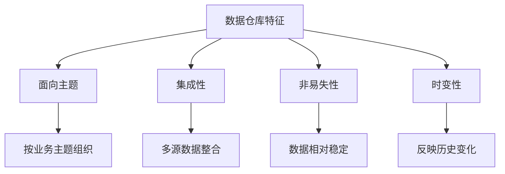
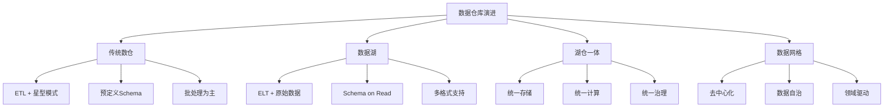
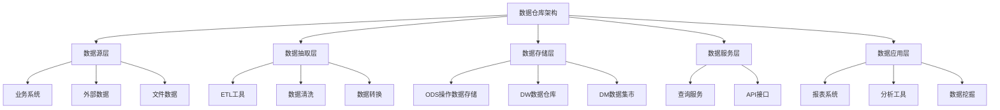
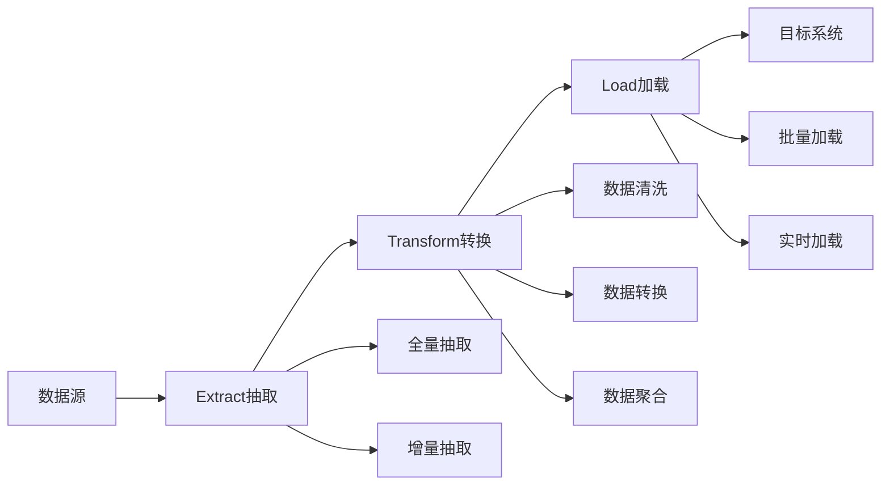
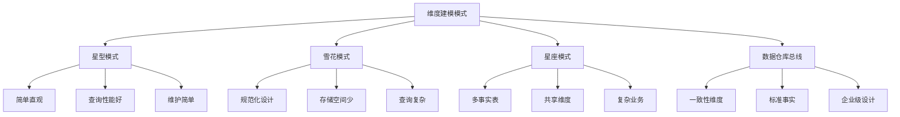
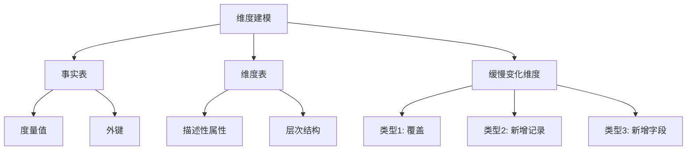
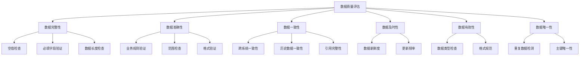
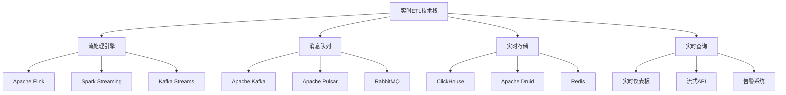
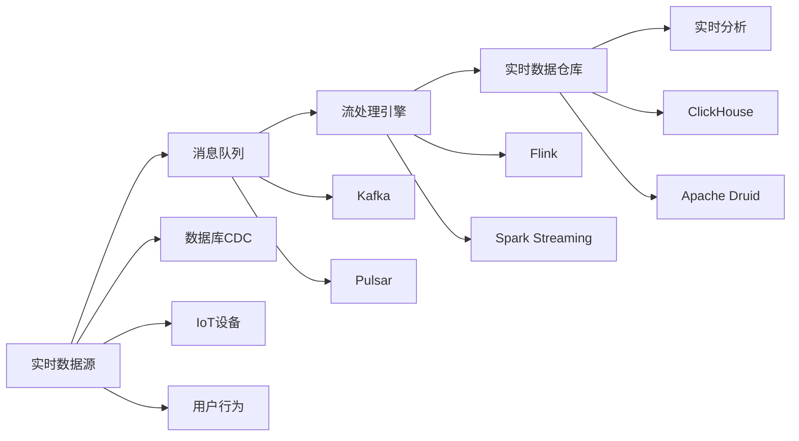
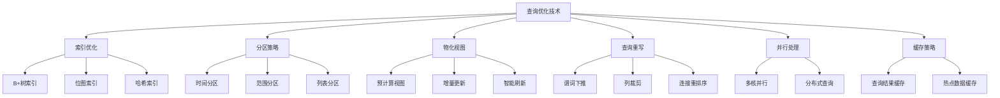

import Tabs from '@theme/Tabs';
import TabItem from '@theme/TabItem';
import TOCInline from '@theme/TOCInline';

# 数据仓库与ETL技术

数据仓库是企业级数据管理的核心，它集成了来自多个业务系统的数据，为决策支持和商业智能提供统一的数据视图。ETL（Extract, Transform, Load）是构建数据仓库的关键技术，负责数据的抽取、转换和加载。

:::info 本文内容概览
<TOCInline toc={toc} />
:::

:::tip 核心价值
**数据仓库与ETL = 数据集成 + 数据质量 + 统一视图 + 决策支持 + 业务洞察**
- 🚀 **数据集成**：整合多个数据源，消除数据孤岛
- 👨‍💻 **数据质量**：通过ETL流程保证数据准确性和一致性
- 🔍 **统一视图**：提供标准化的数据模型和接口
- 🔗 **决策支持**：支持复杂的分析查询和报表生成
- 📚 **业务洞察**：通过数据分析发现业务价值和趋势
:::

## 1. 数据仓库基础概念

### 1.1 什么是数据仓库？

数据仓库是一个面向主题的、集成的、相对稳定的、反映历史变化的数据集合，用于支持管理决策。



#### 数据仓库与传统数据库的区别
```java title="数据仓库特征示例"
public class DataWarehouseCharacteristics {
    public static void main(String[] args) {
        // 1. 面向主题
        System.out.println("数据仓库按业务主题组织，如客户、产品、销售等");
        
        // 2. 集成性
        System.out.println("整合来自多个业务系统的数据，消除不一致性");
        
        // 3. 非易失性
        System.out.println("数据一旦进入数据仓库，通常不会修改或删除");
        
        // 4. 时变性
        System.out.println("数据仓库中的数据反映历史变化，支持时间序列分析");
        
        // 5. 决策支持
        System.out.println("主要用于分析查询，支持复杂的OLAP操作");
    }
}
```

### 1.2 数据仓库架构

数据仓库通常采用分层架构：

#### 1.2.1 现代数据仓库架构演进


#### 1.2.2 湖仓一体架构设计
```java title="湖仓一体架构示例"
public class DataLakehouseArchitecture {
    private final StorageLayer storageLayer;
    private final ProcessingLayer processingLayer;
    private final GovernanceLayer governanceLayer;
    private final QueryEngine queryEngine;
    
    public DataLakehouseArchitecture(StorageLayer storageLayer,
                                   ProcessingLayer processingLayer,
                                   GovernanceLayer governanceLayer,
                                   QueryEngine queryEngine) {
        this.storageLayer = storageLayer;
        this.processingLayer = processingLayer;
        this.governanceLayer = governanceLayer;
        this.queryEngine = queryEngine;
    }
    
    public void ingestData(DataSource source) {
        // 1. 原始数据存储到数据湖
        String rawPath = storageLayer.storeRaw(source.getData(), source.getFormat());
        
        // 2. 元数据注册
        Metadata metadata = new Metadata();
        metadata.setSource(source.getName());
        metadata.setIngestTime(LocalDateTime.now());
        metadata.setRawPath(rawPath);
        metadata.setSchema(source.getSchema());
        metadata.setFormat(source.getFormat());
        metadata.setSize(source.getData().size());
        
        governanceLayer.registerMetadata(metadata);
        
        // 3. 数据质量检查
        DataQualityReport qualityReport = governanceLayer.checkQuality(source.getData());
        
        if (qualityReport.isValid()) {
            // 4. 数据转换和优化
            String processedPath = processingLayer.process(source.getData(), source.getSchema());
            
            // 5. 创建Delta表
            createDeltaTable(processedPath, source.getSchema());
            
            // 6. 更新元数据
            metadata.setProcessedPath(processedPath);
            metadata.setStatus("PROCESSED");
            governanceLayer.updateMetadata(metadata);
            
            // 7. 创建物化视图
            createMaterializedViews(processedPath);
            
        } else {
            // 8. 数据质量问题处理
            governanceLayer.handleQualityIssues(qualityReport);
            metadata.setStatus("FAILED");
            metadata.setQualityIssues(qualityReport.getIssues());
            governanceLayer.updateMetadata(metadata);
        }
    }
    
    private void createDeltaTable(String dataPath, StructType schema) {
        // 使用Delta Lake创建表
        DeltaTable deltaTable = DeltaTable.createIfNotExists()
            .tableName("raw_data")
            .addColumn("id", DataTypes.StringType)
            .addColumn("data", DataTypes.StringType)
            .addColumn("timestamp", DataTypes.TimestampType)
            .location(dataPath)
            .execute();
        
        System.out.println("Delta table created at: " + dataPath);
    }
    
    private void createMaterializedViews(String tablePath) {
        // 创建常用查询的物化视图
        String viewSQL = "CREATE MATERIALIZED VIEW user_summary AS " +
                        "SELECT user_id, COUNT(*) as event_count, " +
                        "AVG(amount) as avg_amount " +
                        "FROM raw_data " +
                        "GROUP BY user_id";
        
        queryEngine.executeSQL(viewSQL);
        System.out.println("Materialized view created");
    }
}
```



## 2. ETL流程设计

### 2.1 ETL基本流程

ETL是数据仓库建设的核心环节：



### 2.2 ETL实现示例

<Tabs>
  <TabItem value="extract" label="数据抽取" default>
  ```java title="数据抽取示例"
  public class DataExtractor {
      public List<Customer> extractCustomers(String sourceType) {
          List<Customer> customers = new ArrayList<>();
          
          switch (sourceType) {
              case "database":
                  customers = extractFromDatabase();
                  break;
              case "file":
                  customers = extractFromFile();
                  break;
              case "api":
                  customers = extractFromAPI();
                  break;
              default:
                  throw new IllegalArgumentException("Unsupported source type");
          }
          
          return customers;
      }
      
      private List<Customer> extractFromDatabase() {
          // 从数据库抽取客户数据
          String sql = "SELECT id, name, email, phone FROM customers";
          // 执行查询并返回结果
          return executeQuery(sql);
      }
      
      private List<Customer> extractFromFile() {
          // 从文件抽取客户数据
          List<Customer> customers = new ArrayList<>();
          try (BufferedReader reader = new BufferedReader(
                  new FileReader("customers.csv"))) {
              String line;
              while ((line = reader.readLine()) != null) {
                  String[] fields = line.split(",");
                  customers.add(new Customer(fields[0], fields[1], fields[2], fields[3]));
              }
          } catch (IOException e) {
              throw new RuntimeException("Failed to read file", e);
          }
          return customers;
      }
  }
  ```
  </TabItem>
  <TabItem value="transform" label="数据转换">
  ```java title="数据转换示例"
  public class DataTransformer {
      public List<Customer> transformCustomers(List<Customer> rawCustomers) {
          return rawCustomers.stream()
              .filter(this::validateCustomer)           // 数据验证
              .map(this::standardizeCustomer)           // 数据标准化
              .map(this::enrichCustomer)                // 数据丰富
              .collect(Collectors.toList());
      }
      
      private boolean validateCustomer(Customer customer) {
          // 验证客户数据完整性
          return customer.getId() != null && 
                 customer.getName() != null && 
                 customer.getEmail() != null &&
                 isValidEmail(customer.getEmail());
      }
      
      private Customer standardizeCustomer(Customer customer) {
          // 标准化客户数据
          return new Customer(
              customer.getId(),
              customer.getName().trim().toLowerCase(),
              customer.getEmail().toLowerCase(),
              standardizePhone(customer.getPhone())
          );
      }
      
      private Customer enrichCustomer(Customer customer) {
          // 丰富客户数据
          String region = determineRegion(customer.getPhone());
          String segment = determineSegment(customer);
          
          return new EnrichedCustomer(customer, region, segment);
      }
      
      private boolean isValidEmail(String email) {
          return email.matches("^[A-Za-z0-9+_.-]+@(.+)$");
      }
  }
  ```
  </TabItem>
  <TabItem value="load" label="数据加载">
  ```java title="数据加载示例"
  public class DataLoader {
      public void loadCustomers(List<Customer> customers, String targetType) {
          switch (targetType) {
              case "warehouse":
                  loadToWarehouse(customers);
                  break;
              case "mart":
                  loadToDataMart(customers);
                  break;
              case "cache":
                  loadToCache(customers);
                  break;
              default:
                  throw new IllegalArgumentException("Unsupported target type");
          }
      }
      
      private void loadToWarehouse(List<Customer> customers) {
          // 批量加载到数据仓库
          try (Connection conn = getWarehouseConnection()) {
              conn.setAutoCommit(false);
              
              String sql = "INSERT INTO dim_customers (id, name, email, phone, created_date) " +
                          "VALUES (?, ?, ?, ?, ?) " +
                          "ON DUPLICATE KEY UPDATE " +
                          "name = VALUES(name), email = VALUES(email), " +
                          "phone = VALUES(phone), updated_date = NOW()";
              
              try (PreparedStatement stmt = conn.prepareStatement(sql)) {
                  for (Customer customer : customers) {
                      stmt.setString(1, customer.getId());
                      stmt.setString(2, customer.getName());
                      stmt.setString(3, customer.getEmail());
                      stmt.setString(4, customer.getPhone());
                      stmt.setTimestamp(5, new Timestamp(System.currentTimeMillis()));
                      stmt.addBatch();
                  }
                  stmt.executeBatch();
                  conn.commit();
              }
          } catch (SQLException e) {
              throw new RuntimeException("Failed to load data to warehouse", e);
          }
      }
  }
  ```
  </TabItem>
</Tabs>

## 3. 数据建模

### 3.1 维度建模

维度建模是数据仓库设计的核心方法：

#### 3.1.1 现代维度建模模式


#### 3.1.2 数据仓库总线架构
```java title="数据仓库总线架构示例"
public class DataWarehouseBusArchitecture {
    private final List<ConformedDimension> conformedDimensions;
    private final List<StandardFact> standardFacts;
    private final DataModelValidator validator;
    
    public DataWarehouseBusArchitecture() {
        this.conformedDimensions = new ArrayList<>();
        this.standardFacts = new ArrayList<>();
        this.validator = new DataModelValidator();
    }
    
    public void addConformedDimension(ConformedDimension dimension) {
        // 验证一致性维度
        if (validator.validateConformedDimension(dimension)) {
            conformedDimensions.add(dimension);
            System.out.println("Conformed dimension added: " + dimension.getName());
        } else {
            throw new IllegalArgumentException("Invalid conformed dimension: " + dimension.getName());
        }
    }
    
    public void addStandardFact(StandardFact fact) {
        // 验证标准事实
        if (validator.validateStandardFact(fact)) {
            standardFacts.add(fact);
            System.out.println("Standard fact added: " + fact.getName());
        } else {
            throw new IllegalArgumentException("Invalid standard fact: " + fact.getName());
        }
    }
    
    public void buildDataMarts() {
        // 基于一致性维度和标准事实构建数据集市
        for (StandardFact fact : standardFacts) {
            DataMart dataMart = new DataMart(fact.getName());
            
            // 添加相关维度
            for (ConformedDimension dimension : conformedDimensions) {
                if (fact.usesDimension(dimension)) {
                    dataMart.addDimension(dimension);
                }
            }
            
            // 构建数据集市
            dataMart.build();
            System.out.println("Data mart built: " + dataMart.getName());
        }
    }
}

// 一致性维度
public class ConformedDimension {
    private String name;
    private String businessKey;
    private List<Attribute> attributes;
    private List<Hierarchy> hierarchies;
    private SCDType scdType;
    
    public ConformedDimension(String name, String businessKey) {
        this.name = name;
        this.businessKey = businessKey;
        this.attributes = new ArrayList<>();
        this.hierarchies = new ArrayList<>();
    }
    
    public void addAttribute(Attribute attribute) {
        attributes.add(attribute);
    }
    
    public void addHierarchy(Hierarchy hierarchy) {
        hierarchies.add(hierarchy);
    }
    
    public void setSCDType(SCDType scdType) {
        this.scdType = scdType;
    }
    
    // getters...
}

// 标准事实
public class StandardFact {
    private String name;
    private List<Measure> measures;
    private List<String> dimensionKeys;
    private Grain grain;
    
    public StandardFact(String name) {
        this.name = name;
        this.measures = new ArrayList<>();
        this.dimensionKeys = new ArrayList<>();
    }
    
    public void addMeasure(Measure measure) {
        measures.add(measure);
    }
    
    public void addDimensionKey(String dimensionKey) {
        dimensionKeys.add(dimensionKey);
    }
    
    public void setGrain(Grain grain) {
        this.grain = grain;
    }
    
    public boolean usesDimension(ConformedDimension dimension) {
        return dimensionKeys.contains(dimension.getBusinessKey());
    }
    
    // getters...
}
```



### 3.2 星型模式示例

<div className="code-with-callout">

```java title="星型模式数据模型示例"
public class StarSchemaModel {
    // 事实表 - 销售事实
    public static class SalesFact {
        private String factId;
        private String customerId;      // 客户维度外键
        private String productId;       // 产品维度外键
        private String timeId;          // 时间维度外键
        private String storeId;         // 商店维度外键
        private BigDecimal quantity;    // 数量度量
        private BigDecimal amount;      // 金额度量
        private BigDecimal cost;        // 成本度量
        
        // 构造函数、getter、setter...
    }
    
    // 维度表 - 客户维度
    public static class CustomerDimension {
        private String customerId;
        private String customerName;
        private String customerType;
        private String region;
        private String city;
        private String country;
        private String segment;
        private Date effectiveDate;
        private Date expiryDate;
        private boolean isCurrent;
        
        // 构造函数、getter、setter...
    }
    
    // 维度表 - 产品维度
    public static class ProductDimension {
        private String productId;
        private String productName;
        private String category;
        private String subcategory;
        private String brand;
        private String color;
        private String size;
        private BigDecimal unitPrice;
        
        // 构造函数、getter、setter...
    }
    
    // 维度表 - 时间维度
    public static class TimeDimension {
        private String timeId;
        private Date fullDate;
        private int year;
        private int quarter;
        private int month;
        private int day;
        private String dayOfWeek;
        private boolean isWeekend;
        private boolean isHoliday;
        
        // 构造函数、getter、setter...
    }
}
```

:::info 星型模式优势
星型模式简单直观，查询性能好，适合OLAP分析，是数据仓库设计中最常用的模式。
:::
</div>

## 4. 数据质量保证

### 4.1 数据质量维度

数据质量包含多个维度：

#### 4.1.1 数据质量评估框架


#### 4.1.2 数据质量监控系统
```java title="数据质量监控系统示例"
public class DataQualityMonitoringSystem {
    private final List<QualityRule> qualityRules;
    private final QualityMetricsCollector metricsCollector;
    private final AlertSystem alertSystem;
    private final QualityDashboard dashboard;
    
    public DataQualityMonitoringSystem() {
        this.qualityRules = new ArrayList<>();
        this.metricsCollector = new QualityMetricsCollector();
        this.alertSystem = new AlertSystem();
        this.dashboard = new QualityDashboard();
    }
    
    public void addQualityRule(QualityRule rule) {
        qualityRules.add(rule);
        System.out.println("Quality rule added: " + rule.getName());
    }
    
    public DataQualityReport monitorDataQuality(Dataset<Row> data, String datasetName) {
        DataQualityReport report = new DataQualityReport(datasetName);
        
        // 1. 执行所有质量规则
        for (QualityRule rule : qualityRules) {
            QualityCheckResult result = rule.execute(data);
            report.addCheckResult(result);
            
            // 2. 收集质量指标
            metricsCollector.collectMetrics(result);
            
            // 3. 检查告警条件
            if (result.getSeverity() == Severity.CRITICAL) {
                alertSystem.sendAlert(new Alert(
                    AlertType.DATA_QUALITY,
                    Severity.CRITICAL,
                    "Critical data quality issue in " + datasetName,
                    result.getDetails()
                ));
            }
        }
        
        // 4. 更新仪表板
        dashboard.updateMetrics(report);
        
        // 5. 生成质量报告
        generateQualityReport(report);
        
        return report;
    }
    
    private void generateQualityReport(DataQualityReport report) {
        // 生成详细的质量报告
        StringBuilder reportBuilder = new StringBuilder();
        reportBuilder.append("=== Data Quality Report ===\n");
        reportBuilder.append("Dataset: ").append(report.getDatasetName()).append("\n");
        reportBuilder.append("Timestamp: ").append(LocalDateTime.now()).append("\n");
        reportBuilder.append("Overall Score: ").append(report.getOverallScore()).append("\n\n");
        
        for (QualityCheckResult result : report.getCheckResults()) {
            reportBuilder.append("Rule: ").append(result.getRuleName()).append("\n");
            reportBuilder.append("Status: ").append(result.getStatus()).append("\n");
            reportBuilder.append("Severity: ").append(result.getSeverity()).append("\n");
            reportBuilder.append("Details: ").append(result.getDetails()).append("\n\n");
        }
        
        System.out.println(reportBuilder.toString());
    }
}

// 数据质量规则接口
public interface QualityRule {
    String getName();
    QualityCheckResult execute(Dataset<Row> data);
}

// 完整性检查规则
public class CompletenessRule implements QualityRule {
    private final String columnName;
    private final double threshold;
    
    public CompletenessRule(String columnName, double threshold) {
        this.columnName = columnName;
        this.threshold = threshold;
    }
    
    @Override
    public String getName() {
        return "Completeness Check for " + columnName;
    }
    
    @Override
    public QualityCheckResult execute(Dataset<Row> data) {
        long totalRows = data.count();
        long nonNullRows = data.filter(col(columnName).isNotNull()).count();
        double completeness = (double) nonNullRows / totalRows;
        
        boolean passed = completeness >= threshold;
        Severity severity = passed ? Severity.INFO : 
                           (completeness >= threshold * 0.8 ? Severity.WARNING : Severity.CRITICAL);
        
        return new QualityCheckResult(
            getName(),
            passed ? Status.PASSED : Status.FAILED,
            severity,
            String.format("Completeness: %.2f%% (threshold: %.2f%%)", 
                         completeness * 100, threshold * 100)
        );
    }
}

// 一致性检查规则
public class ConsistencyRule implements QualityRule {
    private final String columnName;
    private final String referenceColumn;
    private final String referenceTable;
    
    public ConsistencyRule(String columnName, String referenceColumn, String referenceTable) {
        this.columnName = columnName;
        this.referenceColumn = referenceColumn;
        this.referenceTable = referenceTable;
    }
    
    @Override
    public String getName() {
        return "Referential Integrity Check: " + columnName + " -> " + referenceTable + "." + referenceColumn;
    }
    
    @Override
    public QualityCheckResult execute(Dataset<Row> data) {
        // 检查引用完整性
        Dataset<Row> referenceData = spark.table(referenceTable);
        
        long totalRows = data.count();
        long validRows = data.join(referenceData, 
            data.col(columnName).equalTo(referenceData.col(referenceColumn)), "left_anti")
            .count();
        
        double consistency = (double) (totalRows - validRows) / totalRows;
        boolean passed = consistency >= 0.95; // 95%一致性阈值
        
        return new QualityCheckResult(
            getName(),
            passed ? Status.PASSED : Status.FAILED,
            passed ? Severity.INFO : Severity.CRITICAL,
            String.format("Consistency: %.2f%%", consistency * 100)
        );
    }
}
```

| 质量维度 | 描述 | 检查方法 |
|----------|------|----------|
| **完整性** | 数据是否完整，无缺失 | 空值检查、必填字段验证 |
| **准确性** | 数据是否正确、真实 | 业务规则验证、范围检查 |
| **一致性** | 数据在不同系统中是否一致 | 跨系统数据对比 |
| **及时性** | 数据是否及时更新 | 数据新鲜度检查 |
| **有效性** | 数据格式是否符合规范 | 格式验证、类型检查 |

### 4.2 数据质量检查实现

```java title="数据质量检查示例"
public class DataQualityChecker {
    public DataQualityReport checkDataQuality(List<Customer> customers) {
        DataQualityReport report = new DataQualityReport();
        
        // 1. 完整性检查
        long nullNameCount = customers.stream()
            .filter(c -> c.getName() == null || c.getName().trim().isEmpty())
            .count();
        report.addIssue("完整性", "姓名缺失", nullNameCount);
        
        // 2. 准确性检查
        long invalidEmailCount = customers.stream()
            .filter(c -> !isValidEmail(c.getEmail()))
            .count();
        report.addIssue("准确性", "邮箱格式无效", invalidEmailCount);
        
        // 3. 一致性检查
        long duplicateIdCount = customers.stream()
            .collect(Collectors.groupingBy(Customer::getId))
            .values().stream()
            .filter(list -> list.size() > 1)
            .count();
        report.addIssue("一致性", "客户ID重复", duplicateIdCount);
        
        // 4. 有效性检查
        long invalidPhoneCount = customers.stream()
            .filter(c -> !isValidPhone(c.getPhone()))
            .count();
        report.addIssue("有效性", "电话号码格式无效", invalidPhoneCount);
        
        return report;
    }
    
    private boolean isValidEmail(String email) {
        return email != null && email.matches("^[A-Za-z0-9+_.-]+@(.+)$");
    }
    
    private boolean isValidPhone(String phone) {
        return phone != null && phone.matches("^\\+?[1-9]\\d{1,14}$");
    }
}
```

## 5. ETL工具和框架

### 5.1 主流ETL工具

<div className="card">
<div className="card__header">
<h4>ETL工具对比</h4>
</div>
<div className="card__body">
<ol>
<li><strong>Apache NiFi</strong>：开源数据流工具，支持实时数据处理</li>
<li><strong>Apache Airflow</strong>：Python编写的任务调度平台</li>
<li><strong>Talend</strong>：企业级数据集成平台，提供图形化界面</li>
<li><strong>Informatica</strong>：商业ETL工具，功能强大但成本较高</li>
<li><strong>DataStage</strong>：IBM的数据集成平台</li>
</ol>
</div>
</div>

### 5.2 自定义ETL框架

```java title="自定义ETL框架示例"
public class ETLFramework {
    public void executeETL(ETLJob job) {
        try {
            // 1. 执行抽取
            log.info("Starting extraction phase...");
            List<RawData> rawData = job.getExtractor().extract();
            log.info("Extraction completed. Records: " + rawData.size());
            
            // 2. 执行转换
            log.info("Starting transformation phase...");
            List<TransformedData> transformedData = job.getTransformer().transform(rawData);
            log.info("Transformation completed. Records: " + transformedData.size());
            
            // 3. 执行加载
            log.info("Starting loading phase...");
            job.getLoader().load(transformedData);
            log.info("Loading completed successfully");
            
            // 4. 更新元数据
            updateMetadata(job, rawData.size(), transformedData.size());
            
        } catch (Exception e) {
            log.error("ETL job failed", e);
            handleError(job, e);
            throw new ETLException("ETL job execution failed", e);
        }
    }
    
    private void updateMetadata(ETLJob job, int extractedCount, int transformedCount) {
        ETLMetadata metadata = new ETLMetadata();
        metadata.setJobId(job.getJobId());
        metadata.setExecutionTime(LocalDateTime.now());
        metadata.setExtractedRecords(extractedCount);
        metadata.setTransformedRecords(transformedCount);
        metadata.setStatus("SUCCESS");
        
        metadataRepository.save(metadata);
    }
    
    private void handleError(ETLJob job, Exception e) {
        ETLMetadata metadata = new ETLMetadata();
        metadata.setJobId(job.getJobId());
        metadata.setExecutionTime(LocalDateTime.now());
        metadata.setStatus("FAILED");
        metadata.setErrorMessage(e.getMessage());
        
        metadataRepository.save(metadata);
    }
}
```

## 6. 实时ETL和流处理

### 6.1 实时ETL架构

现代数据仓库需要支持实时数据处理：

#### 6.1.1 实时ETL技术栈对比


#### 6.1.2 实时ETL架构设计
```java title="实时ETL架构设计示例"
public class RealTimeETLArchitecture {
    private final StreamProcessor streamProcessor;
    private final MessageQueue messageQueue;
    private final RealTimeStorage realTimeStorage;
    private final DataQualityChecker qualityChecker;
    private final MonitoringSystem monitoringSystem;
    
    public RealTimeETLArchitecture(StreamProcessor streamProcessor,
                                  MessageQueue messageQueue,
                                  RealTimeStorage realTimeStorage,
                                  DataQualityChecker qualityChecker,
                                  MonitoringSystem monitoringSystem) {
        this.streamProcessor = streamProcessor;
        this.messageQueue = messageQueue;
        this.realTimeStorage = realTimeStorage;
        this.qualityChecker = qualityChecker;
        this.monitoringSystem = monitoringSystem;
    }
    
    public void buildRealTimeETL() {
        // 1. 配置数据源连接
        configureDataSources();
        
        // 2. 设置流处理管道
        setupStreamingPipeline();
        
        // 3. 配置数据质量检查
        setupQualityChecks();
        
        // 4. 设置监控和告警
        setupMonitoring();
        
        // 5. 启动实时ETL
        startRealTimeETL();
    }
    
    private void configureDataSources() {
        // 配置多种数据源
        DataSourceConfig dbConfig = new DataSourceConfig("database", "jdbc:mysql://localhost:3306/source_db");
        DataSourceConfig apiConfig = new DataSourceConfig("api", "https://api.example.com/events");
        DataSourceConfig fileConfig = new DataSourceConfig("file", "/data/streaming/");
        
        messageQueue.configureSource(dbConfig);
        messageQueue.configureSource(apiConfig);
        messageQueue.configureSource(fileConfig);
        
        System.out.println("Data sources configured");
    }
    
    private void setupStreamingPipeline() {
        // 设置Flink流处理管道
        StreamExecutionEnvironment env = StreamExecutionEnvironment.getExecutionEnvironment();
        
        // 设置检查点
        env.enableCheckpointing(60000); // 每分钟检查点
        env.getCheckpointConfig().setCheckpointTimeout(30000);
        env.getCheckpointConfig().setMaxConcurrentCheckpoints(1);
        
        // 创建数据流
        DataStream<Event> eventStream = env
            .addSource(new KafkaSource<>())
            .name("event-source");
        
        // 数据转换和清洗
        DataStream<ProcessedEvent> processedStream = eventStream
            .map(new EventProcessor())
            .filter(new EventFilter())
            .keyBy(ProcessedEvent::getUserId);
        
        // 窗口聚合
        DataStream<UserProfile> userProfileStream = processedStream
            .window(TumblingEventTimeWindows.of(Time.minutes(5)))
            .aggregate(new UserProfileAggregator());
        
        // 输出到实时存储
        userProfileStream.addSink(new ClickHouseSink());
        
        // 保存执行计划
        streamProcessor.setExecutionPlan(env);
        
        System.out.println("Streaming pipeline configured");
    }
    
    private void setupQualityChecks() {
        // 配置实时数据质量检查
        qualityChecker.addRule(new CompletenessRule("userId", 0.99));
        qualityChecker.addRule(new ConsistencyRule("userId", "users", "id"));
        qualityChecker.addRule(new ValidityRule("email", "^[A-Za-z0-9+_.-]+@(.+)$"));
        
        // 设置质量检查窗口
        qualityChecker.setCheckWindow(Time.minutes(1));
        qualityChecker.setAlertThreshold(0.95);
        
        System.out.println("Quality checks configured");
    }
    
    private void setupMonitoring() {
        // 配置监控指标
        monitoringSystem.addMetric("events_processed_per_second", MetricType.COUNTER);
        monitoringSystem.addMetric("processing_latency_ms", MetricType.HISTOGRAM);
        monitoringSystem.addMetric("error_rate", MetricType.GAUGE);
        monitoringSystem.addMetric("data_quality_score", MetricType.GAUGE);
        
        // 设置告警规则
        monitoringSystem.addAlertRule("error_rate > 0.05", Severity.CRITICAL);
        monitoringSystem.addAlertRule("processing_latency_ms > 1000", Severity.WARNING);
        monitoringSystem.addAlertRule("data_quality_score < 0.9", Severity.WARNING);
        
        System.out.println("Monitoring configured");
    }
    
    private void startRealTimeETL() {
        try {
            // 启动流处理作业
            streamProcessor.start();
            
            // 启动监控
            monitoringSystem.start();
            
            // 启动质量检查
            qualityChecker.start();
            
            System.out.println("Real-time ETL started successfully");
            
        } catch (Exception e) {
            System.err.println("Failed to start real-time ETL: " + e.getMessage());
            throw new RuntimeException("Real-time ETL startup failed", e);
        }
    }
}

// 事件处理器
public class EventProcessor implements MapFunction<Event, ProcessedEvent> {
    @Override
    public ProcessedEvent map(Event event) throws Exception {
        // 数据清洗和转换
        ProcessedEvent processed = new ProcessedEvent();
        processed.setUserId(cleanUserId(event.getUserId()));
        processed.setEventType(normalizeEventType(event.getEventType()));
        processed.setTimestamp(parseTimestamp(event.getTimestamp()));
        processed.setAmount(validateAmount(event.getAmount()));
        
        return processed;
    }
    
    private String cleanUserId(String userId) {
        return userId != null ? userId.trim().toLowerCase() : null;
    }
    
    private String normalizeEventType(String eventType) {
        if (eventType == null) return "unknown";
        switch (eventType.toLowerCase()) {
            case "view": return "VIEW";
            case "click": return "CLICK";
            case "purchase": return "PURCHASE";
            default: return "OTHER";
        }
    }
    
    private LocalDateTime parseTimestamp(String timestamp) {
        try {
            return LocalDateTime.parse(timestamp, DateTimeFormatter.ISO_LOCAL_DATE_TIME);
        } catch (Exception e) {
            return LocalDateTime.now();
        }
    }
    
    private Double validateAmount(Double amount) {
        return amount != null && amount >= 0 ? amount : 0.0;
    }
}
```



### 6.2 实时ETL实现

<Tabs>
  <TabItem value="flink" label="Flink实时ETL" default>
  ```java title="Flink实时ETL示例"
  public class FlinkRealTimeETL {
      public void buildRealTimeETL(StreamExecutionEnvironment env) {
          // 1. 创建Kafka消费者
          FlinkKafkaConsumer<String> consumer = new FlinkKafkaConsumer<>(
              "user-events",
              new SimpleStringSchema(),
              getKafkaProperties()
          );
          
          // 2. 数据流处理
          DataStream<UserEvent> userEvents = env
              .addSource(consumer)
              .map(this::parseUserEvent)
              .filter(this::validateEvent)
              .keyBy(UserEvent::getUserId)
              .window(TumblingProcessingTimeWindows.of(Time.minutes(5)))
              .aggregate(new UserEventAggregator());
          
          // 3. 输出到实时数据仓库
          userEvents.addSink(new ClickHouseSink());
          
          // 4. 执行流处理作业
          env.execute("Real-time User Event ETL");
      }
      
      private UserEvent parseUserEvent(String json) {
          try {
              return objectMapper.readValue(json, UserEvent.class);
          } catch (Exception e) {
              log.error("Failed to parse user event", e);
              return null;
          }
      }
      
      private boolean validateEvent(UserEvent event) {
          return event != null && 
                 event.getUserId() != null && 
                 event.getEventType() != null;
      }
  }
  ```
  </TabItem>
  <TabItem value="kafka" label="Kafka Streams">
  ```java title="Kafka Streams ETL示例"
  public class KafkaStreamsETL {
      public void buildKafkaStreamsETL() {
          Properties props = new Properties();
          props.put(StreamsConfig.APPLICATION_ID_CONFIG, "user-events-etl");
          props.put(StreamsConfig.BOOTSTRAP_SERVERS_CONFIG, "localhost:9092");
          props.put(StreamsConfig.DEFAULT_KEY_SERDE_CLASS_CONFIG, Serdes.String().getClass());
          props.put(StreamsConfig.DEFAULT_VALUE_SERDE_CLASS_CONFIG, Serdes.String().getClass());
          
          StreamsBuilder builder = new StreamsBuilder();
          
          // 1. 从输入主题读取数据
          KStream<String, String> inputStream = builder.stream("user-events-input");
          
          // 2. 数据转换和清洗
          KStream<String, UserEvent> processedStream = inputStream
              .filter((key, value) -> value != null && !value.isEmpty())
              .mapValues(this::parseUserEvent)
              .filter((key, event) -> event != null && validateEvent(event));
          
          // 3. 聚合处理
          KTable<String, UserProfile> userProfiles = processedStream
              .groupBy((key, event) -> event.getUserId())
              .aggregate(
                  UserProfile::new,
                  (userId, event, profile) -> profile.update(event),
                  Materialized.as("user-profiles-store")
              );
          
          // 4. 输出到目标主题
          userProfiles.toStream().to("user-profiles-output");
          
          // 5. 构建和启动流处理应用
          KafkaStreams streams = new KafkaStreams(builder.build(), props);
          streams.start();
      }
  }
  ```
  </TabItem>
</Tabs>

## 7. 数据仓库性能优化

### 7.1 查询性能优化

数据仓库查询性能优化策略：

#### 7.1.1 查询优化技术栈


#### 7.1.2 高级查询优化策略
```java title="高级查询优化策略示例"
public class AdvancedQueryOptimization {
    private final QueryOptimizer optimizer;
    private final StatisticsCollector statisticsCollector;
    private final CacheManager cacheManager;
    
    public AdvancedQueryOptimization(QueryOptimizer optimizer,
                                   StatisticsCollector statisticsCollector,
                                   CacheManager cacheManager) {
        this.optimizer = optimizer;
        this.statisticsCollector = statisticsCollector;
        this.cacheManager = cacheManager;
    }
    
    public void optimizeQuery(Query query) {
        // 1. 收集统计信息
        collectStatistics(query);
        
        // 2. 分析查询模式
        analyzeQueryPattern(query);
        
        // 3. 应用优化规则
        applyOptimizationRules(query);
        
        // 4. 检查缓存命中
        checkCacheHit(query);
        
        // 5. 生成执行计划
        generateExecutionPlan(query);
    }
    
    private void collectStatistics(Query query) {
        // 收集表和列的统计信息
        for (String tableName : query.getReferencedTables()) {
            TableStatistics tableStats = statisticsCollector.collectTableStatistics(tableName);
            ColumnStatistics columnStats = statisticsCollector.collectColumnStatistics(tableName);
            
            // 更新统计信息
            optimizer.updateStatistics(tableName, tableStats, columnStats);
        }
        
        System.out.println("Statistics collected for query optimization");
    }
    
    private void analyzeQueryPattern(Query query) {
        // 分析查询特征
        QueryPattern pattern = new QueryPattern();
        pattern.setJoinType(query.getJoinType());
        pattern.setFilterConditions(query.getFilterConditions());
        pattern.setAggregationFunctions(query.getAggregationFunctions());
        pattern.setSortColumns(query.getSortColumns());
        
        // 识别查询模式
        QueryPatternType patternType = optimizer.identifyPattern(pattern);
        System.out.println("Query pattern identified: " + patternType);
    }
    
    private void applyOptimizationRules(Query query) {
        // 应用各种优化规则
        
        // 1. 谓词下推
        if (canPushDownPredicates(query)) {
            optimizer.pushDownPredicates(query);
            System.out.println("Predicates pushed down");
        }
        
        // 2. 列裁剪
        if (canPruneColumns(query)) {
            optimizer.pruneColumns(query);
            System.out.println("Columns pruned");
        }
        
        // 3. 连接重排序
        if (canReorderJoins(query)) {
            optimizer.reorderJoins(query);
            System.out.println("Joins reordered");
        }
        
        // 4. 分区裁剪
        if (canPrunePartitions(query)) {
            optimizer.prunePartitions(query);
            System.out.println("Partitions pruned");
        }
    }
    
    private boolean canPushDownPredicates(Query query) {
        // 检查是否可以下推谓词
        return query.getFilterConditions().stream()
            .anyMatch(condition -> condition.canBePushedDown());
    }
    
    private boolean canPruneColumns(Query query) {
        // 检查是否可以裁剪列
        Set<String> referencedColumns = query.getReferencedColumns();
        Set<String> allColumns = query.getAllColumns();
        return allColumns.size() > referencedColumns.size();
    }
    
    private boolean canReorderJoins(Query query) {
        // 检查是否可以重排序连接
        return query.getJoinCount() > 2;
    }
    
    private boolean canPrunePartitions(Query query) {
        // 检查是否可以裁剪分区
        return query.hasPartitionFilter();
    }
    
    private void checkCacheHit(Query query) {
        // 检查查询缓存
        String cacheKey = generateCacheKey(query);
        CachedResult cachedResult = cacheManager.get(cacheKey);
        
        if (cachedResult != null && !cachedResult.isExpired()) {
            System.out.println("Query cache hit, using cached result");
            query.setCachedResult(cachedResult);
        } else {
            System.out.println("Query cache miss, executing query");
        }
    }
    
    private String generateCacheKey(Query query) {
        // 生成缓存键
        StringBuilder keyBuilder = new StringBuilder();
        keyBuilder.append(query.getSQL().hashCode());
        keyBuilder.append("_");
        keyBuilder.append(query.getParameters().hashCode());
        return keyBuilder.toString();
    }
    
    private void generateExecutionPlan(Query query) {
        // 生成优化的执行计划
        ExecutionPlan plan = optimizer.generatePlan(query);
        
        // 设置并行度
        plan.setParallelism(calculateOptimalParallelism(query));
        
        // 设置内存配置
        plan.setMemoryConfig(calculateMemoryConfig(query));
        
        // 设置缓存策略
        plan.setCacheStrategy(selectCacheStrategy(query));
        
        System.out.println("Optimized execution plan generated");
        System.out.println("Parallelism: " + plan.getParallelism());
        System.out.println("Memory: " + plan.getMemoryConfig());
        System.out.println("Cache strategy: " + plan.getCacheStrategy());
    }
    
    private int calculateOptimalParallelism(Query query) {
        // 根据查询复杂度计算最优并行度
        int baseParallelism = Runtime.getRuntime().availableProcessors();
        double complexityFactor = query.getComplexityScore();
        
        if (complexityFactor > 0.8) {
            return baseParallelism * 2; // 复杂查询使用更多并行度
        } else if (complexityFactor < 0.3) {
            return Math.max(1, baseParallelism / 2); // 简单查询减少并行度
        } else {
            return baseParallelism;
        }
    }
    
    private MemoryConfig calculateMemoryConfig(Query query) {
        // 根据查询需求计算内存配置
        MemoryConfig config = new MemoryConfig();
        
        if (query.hasLargeJoins()) {
            config.setJoinBufferSize("2GB");
            config.setSortBufferSize("1GB");
        } else if (query.hasAggregations()) {
            config.setAggregationBufferSize("1GB");
        } else {
            config.setDefaultBufferSize("512MB");
        }
        
        return config;
    }
    
    private CacheStrategy selectCacheStrategy(Query query) {
        // 根据查询特征选择缓存策略
        if (query.isFrequentlyExecuted()) {
            return CacheStrategy.AGGRESSIVE; // 频繁查询使用激进缓存
        } else if (query.isReadOnly()) {
            return CacheStrategy.MODERATE; // 只读查询使用中等缓存
        } else {
            return CacheStrategy.CONSERVATIVE; // 其他查询使用保守缓存
        }
    }
}
```

<div className="card">
<div className="card__body">
<ol>
<li><strong>索引优化</strong>：合理设计索引，支持查询模式</li>
<li><strong>分区策略</strong>：按时间、地区等维度分区</li>
<li><strong>物化视图</strong>：预计算常用查询结果</li>
<li><strong>查询重写</strong>：优化器自动重写查询</li>
<li><strong>并行处理</strong>：利用多核CPU并行执行</li>
</ol>
</div>
</div>

### 7.2 分区策略示例

```java title="分区策略示例"
public class PartitioningStrategy {
    public void createPartitionedTable(Connection conn) throws SQLException {
        // 1. 按时间分区
        String timePartitionSQL = 
            "CREATE TABLE sales_fact_partitioned (" +
            "  sale_id VARCHAR(50)," +
            "  customer_id VARCHAR(50)," +
            "  product_id VARCHAR(50)," +
            "  sale_date DATE," +
            "  amount DECIMAL(10,2)" +
            ") PARTITION BY RANGE (YEAR(sale_date)) (" +
            "  PARTITION p2020 VALUES LESS THAN (2021)," +
            "  PARTITION p2021 VALUES LESS THAN (2022)," +
            "  PARTITION p2022 VALUES LESS THAN (2023)," +
            "  PARTITION p2023 VALUES LESS THAN (2024)," +
            "  PARTITION p_future VALUES LESS THAN MAXVALUE" +
            ")";
        
        // 2. 按地区分区
        String regionPartitionSQL = 
            "CREATE TABLE customer_dim_partitioned (" +
            "  customer_id VARCHAR(50)," +
            "  customer_name VARCHAR(100)," +
            "  region VARCHAR(50)," +
            "  city VARCHAR(50)" +
            ") PARTITION BY LIST (region) (" +
            "  PARTITION p_north VALUES IN ('North', 'Northeast')," +
            "  PARTITION p_south VALUES IN ('South', 'Southeast')," +
            "  PARTITION p_east VALUES IN ('East', 'Northeast')," +
            "  PARTITION p_west VALUES IN ('West', 'Northwest')" +
            ")";
        
        try (Statement stmt = conn.createStatement()) {
            stmt.execute(timePartitionSQL);
            stmt.execute(regionPartitionSQL);
        }
    }
}
```

## 8. 最佳实践

### 8.1 设计最佳实践

<div className="card">
<div className="card__body">
<ol>
<li><strong>数据建模</strong>：采用维度建模，设计清晰的事实表和维度表</li>
<li><strong>ETL设计</strong>：模块化设计，支持增量处理和错误恢复</li>
<li><strong>性能优化</strong>：合理使用分区、索引和物化视图</li>
<li><strong>数据质量</strong>：建立完善的数据质量检查机制</li>
<li><strong>监控告警</strong>：实时监控ETL作业执行状态</li>
</ol>
</div>
</div>

### 8.2 实施建议

1. **分阶段实施**：先建设核心主题域，再逐步扩展
2. **数据标准化**：建立统一的数据标准和命名规范
3. **版本管理**：对数据模型和ETL流程进行版本控制
4. **文档管理**：维护完整的技术文档和业务文档
5. **培训支持**：为业务用户提供数据使用培训

## 9. 总结

数据仓库与ETL技术是企业数据管理的基础，它们为企业提供了统一的数据视图和强大的分析能力。通过合理的设计和实施，可以构建高效、可靠的数据仓库系统。

### 学习建议

1. **理解概念**：深入理解数据仓库的基本概念和架构
2. **掌握建模**：学习维度建模方法和最佳实践
3. **实践ETL**：通过实际项目掌握ETL流程设计
4. **性能优化**：学习查询优化和性能调优技术
5. **工具使用**：熟悉主流ETL工具和框架

数据仓库建设是一个持续的过程，需要不断优化和完善，以适应业务发展的需要。 