import Tabs from '@theme/Tabs';
import TabItem from '@theme/TabItem';
import TOCInline from '@theme/TOCInline';

# Hadoop生态系统详解

Hadoop是Apache软件基金会开发的开源分布式计算平台，它提供了可靠、可扩展的分布式计算和存储能力。Hadoop生态系统包含了多个相互协作的组件，形成了一个完整的大数据处理解决方案。

:::info 本文内容概览
<TOCInline toc={toc} />
:::

:::tip 核心价值
**Hadoop生态系统 = 分布式存储 + 分布式计算 + 资源管理 + 数据仓库 + 工作流调度 + 监控管理**
- 🚀 **分布式存储**：HDFS提供高可靠、高吞吐量的分布式文件系统
- 👨‍💻 **分布式计算**：MapReduce提供简单易用的分布式计算模型
- 🔍 **资源管理**：YARN统一管理集群资源，支持多种计算框架
- 🔗 **数据仓库**：Hive提供SQL查询能力，降低大数据使用门槛
- 📚 **工作流调度**：Oozie协调复杂的数据处理工作流
:::

## 1. Hadoop核心架构

### 1.1 整体架构

Hadoop采用主从（Master-Slave）架构，主要包含以下核心组件：

#### 1.1.1 架构演进历程
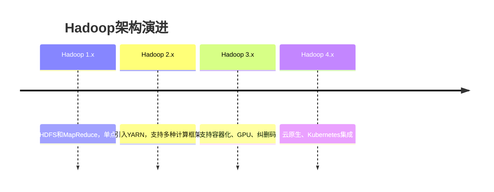

#### 1.1.2 高可用架构设计
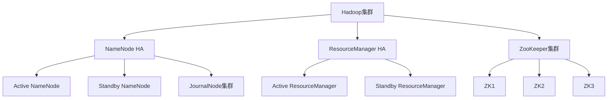

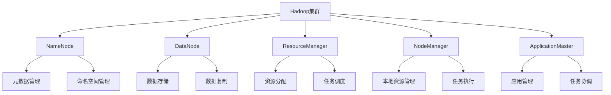

### 1.2 核心组件关系

<div className="card">
<div className="card__header">
<h4>Hadoop核心组件职责</h4>
</div>
<div className="card__body">
<ol>
<li><strong>HDFS</strong>：分布式文件系统，提供数据存储</li>
<li><strong>YARN</strong>：资源管理和任务调度平台</li>
<li><strong>MapReduce</strong>：分布式计算编程模型</li>
<li><strong>Common</strong>：公共工具和库</li>
</ol>
</div>
</div>

#### 1.2.1 组件交互流程
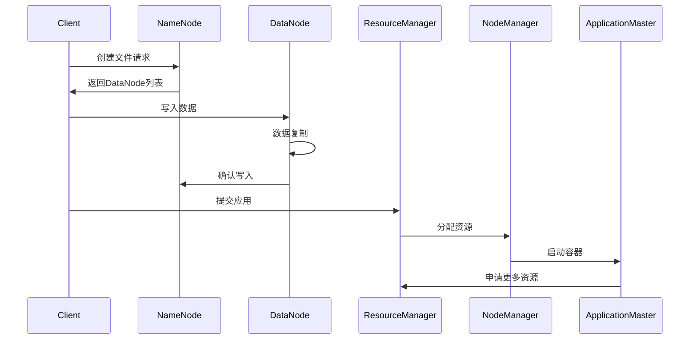

#### 1.2.2 集群规模规划
```java title="集群规模规划示例"
public class ClusterPlanning {
    public ClusterSpecification planCluster(WorkloadRequirements requirements) {
        ClusterSpecification spec = new ClusterSpecification();
        
        // 1. 存储容量规划
        long totalStorage = requirements.getDataVolume() * 3; // 3副本
        int dataNodes = (int) Math.ceil(totalStorage / (4L * 1024 * 1024 * 1024)); // 4TB/节点
        spec.setDataNodeCount(dataNodes);
        
        // 2. 计算资源规划
        int totalCores = requirements.getCpuCores();
        int totalMemory = requirements.getMemoryGB();
        int computeNodes = Math.max(
            (int) Math.ceil(totalCores / 16.0), // 16核/节点
            (int) Math.ceil(totalMemory / 64.0)  // 64GB/节点
        );
        spec.setComputeNodeCount(computeNodes);
        
        // 3. 网络带宽规划
        double networkBandwidth = requirements.getDataThroughput() * 1.5; // 1.5倍冗余
        spec.setNetworkBandwidth(networkBandwidth);
        
        // 4. 高可用配置
        spec.setNameNodeCount(2); // 主备NameNode
        spec.setResourceManagerCount(2); // 主备ResourceManager
        spec.setZooKeeperCount(3); // 3节点ZK集群
        
        return spec;
    }
    
    public static class ClusterSpecification {
        private int dataNodeCount;
        private int computeNodeCount;
        private double networkBandwidth;
        private int nameNodeCount;
        private int resourceManagerCount;
        private int zooKeeperCount;
        
        // getters and setters...
    }
}
```

## 2. HDFS分布式文件系统

### 2.1 HDFS架构设计

HDFS采用主从架构，包含NameNode和DataNode：

#### 2.1.1 HDFS 3.x新特性
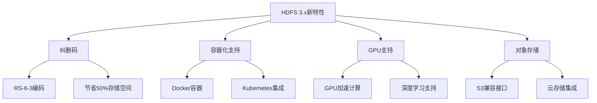

#### 2.1.2 数据块管理策略
```java title="HDFS数据块管理示例"
public class HDFSBlockManagement {
    private final Configuration conf;
    private final FileSystem fs;
    
    public HDFSBlockManagement(Configuration conf) throws IOException {
        this.conf = conf;
        this.fs = FileSystem.get(conf);
    }
    
    public void optimizeBlockPlacement(String path) throws IOException {
        // 1. 获取文件块信息
        FileStatus fileStatus = fs.getFileStatus(new Path(path));
        BlockLocation[] blockLocations = fs.getFileBlockLocations(fileStatus, 0, fileStatus.getLen());
        
        // 2. 分析块分布
        Map<String, Integer> rackBlockCount = new HashMap<>();
        for (BlockLocation block : blockLocations) {
            String[] hosts = block.getHosts();
            String[] racks = block.getTopologyPaths();
            
            for (String rack : racks) {
                rackBlockCount.merge(rack, 1, Integer::sum);
            }
        }
        
        // 3. 检查数据倾斜
        int avgBlocksPerRack = blockLocations.length / rackBlockCount.size();
        for (Map.Entry<String, Integer> entry : rackBlockCount.entrySet()) {
            if (entry.getValue() > avgBlocksPerRack * 1.5) {
                System.out.println("Rack " + entry.getKey() + " has too many blocks: " + entry.getValue());
            }
        }
        
        // 4. 建议重新平衡
        if (needsRebalancing(rackBlockCount)) {
            System.out.println("Recommend running hdfs balancer");
        }
    }
    
    private boolean needsRebalancing(Map<String, Integer> rackBlockCount) {
        if (rackBlockCount.size() < 2) return false;
        
        int min = rackBlockCount.values().stream().mapToInt(Integer::intValue).min().orElse(0);
        int max = rackBlockCount.values().stream().mapToInt(Integer::intValue).max().orElse(0);
        
        return (double) max / min > 1.5; // 最大最小比例超过1.5
    }
    
    public void enableErasureCoding(String path) throws IOException {
        // 启用纠删码
        fs.setErasureCodingPolicy(new Path(path), "RS-6-3-1024k");
        System.out.println("Erasure coding enabled for: " + path);
    }
}
```

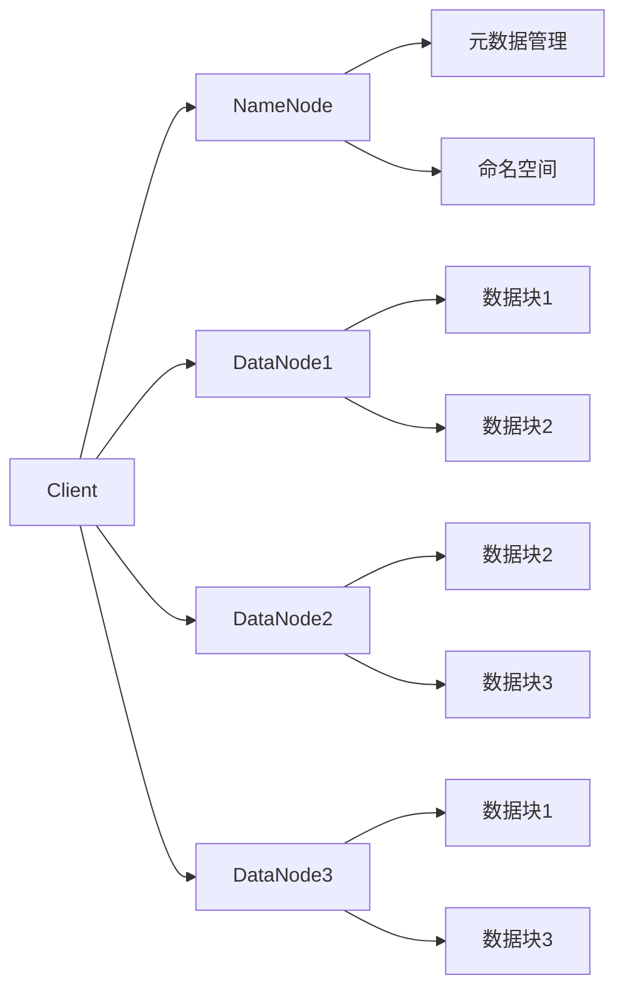

#### HDFS核心特性
```java title="HDFS特性示例"
public class HDFSFeatures {
    public static void main(String[] args) {
        // 1. 高容错性
        System.out.println("HDFS通过数据复制提供高容错性");
        
        // 2. 高吞吐量
        System.out.println("HDFS设计用于批处理，提供高吞吐量");
        
        // 3. 大文件支持
        System.out.println("HDFS适合存储大文件，通常GB到TB级别");
        
        // 4. 流式数据访问
        System.out.println("HDFS支持一次写入，多次读取的访问模式");
        
        // 5. 硬件容错
        System.out.println("HDFS运行在普通硬件上，通过软件提供容错能力");
    }
}
```

### 2.2 HDFS文件操作

<Tabs>
  <TabItem value="read" label="文件读取" default>
  ```java title="HDFS文件读取示例"
  public class HDFSReader {
      public String readFile(String filePath) throws IOException {
          Configuration conf = new Configuration();
          FileSystem fs = FileSystem.get(conf);
          
          try (FSDataInputStream in = fs.open(new Path(filePath))) {
              BufferedReader reader = new BufferedReader(
                  new InputStreamReader(in)
              );
              return reader.lines().collect(Collectors.joining("\n"));
          }
      }
  }
  ```
  </TabItem>
  <TabItem value="write" label="文件写入">
  ```java title="HDFS文件写入示例"
  public class HDFSWriter {
      public void writeFile(String filePath, String content) throws IOException {
          Configuration conf = new Configuration();
          FileSystem fs = FileSystem.get(conf);
          
          try (FSDataOutputStream out = fs.create(new Path(filePath))) {
              out.writeBytes(content);
          }
      }
  }
  ```
  </TabItem>
  <TabItem value="delete" label="文件删除">
  ```java title="HDFS文件删除示例"
  public class HDFSDeleter {
      public boolean deleteFile(String filePath) throws IOException {
          Configuration conf = new Configuration();
          FileSystem fs = FileSystem.get(conf);
          
          return fs.delete(new Path(filePath), false);
      }
  }
  ```
  </TabItem>
</Tabs>

## 3. YARN资源管理

### 3.1 YARN架构

YARN（Yet Another Resource Negotiator）是Hadoop 2.0引入的资源管理平台：

#### 3.1.1 YARN 3.x新特性
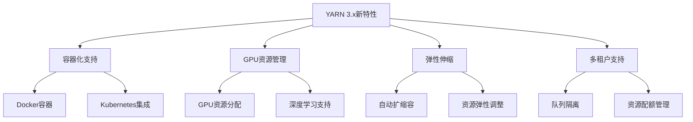

#### 3.1.2 资源调度器对比
```java title="YARN调度器对比示例"
public class YARNSchedulerComparison {
    public void compareSchedulers() {
        // 1. FIFO调度器 - 先进先出
        System.out.println("=== FIFO Scheduler ===");
        System.out.println("优点: 简单、公平");
        System.out.println("缺点: 小作业可能被大作业阻塞");
        System.out.println("适用: 单用户环境");
        
        // 2. Capacity调度器 - 容量调度
        System.out.println("\n=== Capacity Scheduler ===");
        System.out.println("优点: 资源隔离、多租户支持");
        System.out.println("缺点: 配置复杂");
        System.out.println("适用: 多用户、多队列环境");
        
        // 3. Fair调度器 - 公平调度
        System.out.println("\n=== Fair Scheduler ===");
        System.out.println("优点: 动态资源分配、响应时间短");
        System.out.println("缺点: 资源利用率可能不高");
        System.out.println("适用: 交互式查询、实时应用");
    }
    
    public void configureCapacityScheduler() {
        // Capacity调度器配置示例
        Properties props = new Properties();
        
        // 队列配置
        props.setProperty("yarn.scheduler.capacity.root.queues", "default,prod,dev");
        props.setProperty("yarn.scheduler.capacity.root.default.capacity", "20");
        props.setProperty("yarn.scheduler.capacity.root.prod.capacity", "60");
        props.setProperty("yarn.scheduler.capacity.root.dev.capacity", "20");
        
        // 用户限制
        props.setProperty("yarn.scheduler.capacity.root.default.maximum-applications", "100");
        props.setProperty("yarn.scheduler.capacity.root.prod.maximum-applications", "200");
        props.setProperty("yarn.scheduler.capacity.root.dev.maximum-applications", "50");
        
        // 资源限制
        props.setProperty("yarn.scheduler.capacity.root.default.maximum-allocation-mb", "8192");
        props.setProperty("yarn.scheduler.capacity.root.prod.maximum-allocation-mb", "16384");
        props.setProperty("yarn.scheduler.capacity.root.dev.maximum-allocation-mb", "4096");
        
        System.out.println("Capacity Scheduler configured with production and development queues");
    }
}
```

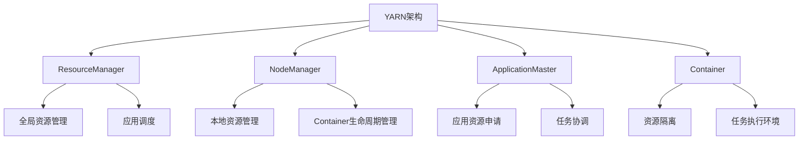

### 3.2 YARN工作流程

<div className="code-with-callout">

```java title="YARN应用提交示例"
public class YARNApplication {
    public void submitApplication() throws Exception {
        // 1. 创建YARN客户端
        YarnClient yarnClient = YarnClient.createYarnClient();
        yarnClient.init(conf);
        yarnClient.start();
        
        // 2. 创建应用
        YarnClientApplication app = yarnClient.createApplication();
        GetNewApplicationResponse appResponse = app.getNewApplicationResponse();
        
        // 3. 设置应用上下文
        ApplicationSubmissionContext appContext = app.getApplicationSubmissionContext();
        appContext.setApplicationName("MyYARNApp");
        appContext.setApplicationType("MAPREDUCE");
        
        // 4. 提交应用
        yarnClient.submitApplication(appContext);
    }
}
```

:::info YARN优势
YARN将资源管理和任务调度分离，支持多种计算框架（MapReduce、Spark、Flink等），提高了集群资源利用率。
:::
</div>

## 4. MapReduce编程模型

### 4.1 MapReduce原理

MapReduce是一种编程模型，用于大规模数据集的并行计算：

#### 4.1.1 MapReduce 2.0架构
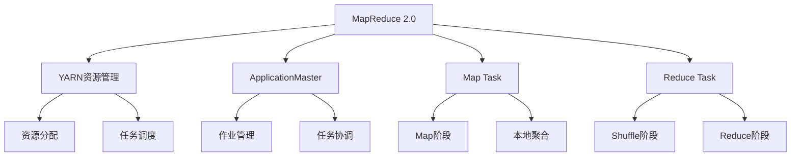

#### 4.1.2 性能优化策略
```java title="MapReduce性能优化示例"
public class MapReduceOptimization {
    public void optimizeJob(Job job) throws IOException {
        Configuration conf = job.getConfiguration();
        
        // 1. 输入分片优化
        conf.set("mapreduce.input.fileinputformat.split.minsize", "134217728"); // 128MB
        conf.set("mapreduce.input.fileinputformat.split.maxsize", "268435456"); // 256MB
        
        // 2. Map端优化
        conf.set("mapreduce.map.memory.mb", "4096"); // 4GB内存
        conf.set("mapreduce.map.java.opts", "-Xmx3072m"); // 3GB堆内存
        conf.set("mapreduce.map.output.compress", "true"); // 启用压缩
        conf.set("mapreduce.map.output.compress.codec", "org.apache.hadoop.io.compress.SnappyCodec");
        
        // 3. Reduce端优化
        conf.set("mapreduce.reduce.memory.mb", "8192"); // 8GB内存
        conf.set("mapreduce.reduce.java.opts", "-Xmx6144m"); // 6GB堆内存
        conf.set("mapreduce.reduce.shuffle.parallelcopies", "5"); // 并行复制数
        
        // 4. Shuffle优化
        conf.set("mapreduce.reduce.shuffle.input.buffer.percent", "0.7"); // 70%内存用于shuffle
        conf.set("mapreduce.reduce.shuffle.merge.percent", "0.66"); // 66%数据时开始合并
        
        // 5. 推测执行
        conf.set("mapreduce.map.speculative", "true");
        conf.set("mapreduce.reduce.speculative", "true");
        
        // 6. 任务数量优化
        conf.set("mapreduce.job.maps", "200"); // Map任务数
        conf.set("mapreduce.job.reduces", "50"); // Reduce任务数
        
        System.out.println("MapReduce job optimized for performance");
    }
    
    public void configureCombiner(Job job) {
        // 配置Combiner减少网络传输
        job.setCombinerClass(WordCountCombiner.class);
        System.out.println("Combiner configured to reduce network traffic");
    }
    
    public void configurePartitioner(Job job) {
        // 自定义分区器避免数据倾斜
        job.setPartitionerClass(CustomPartitioner.class);
        System.out.println("Custom partitioner configured to balance data distribution");
    }
}

// 自定义分区器示例
public static class CustomPartitioner extends Partitioner<Text, IntWritable> {
    @Override
    public int getPartition(Text key, IntWritable value, int numPartitions) {
        // 使用哈希分区避免数据倾斜
        String word = key.toString();
        return Math.abs(word.hashCode()) % numPartitions;
    }
}
```

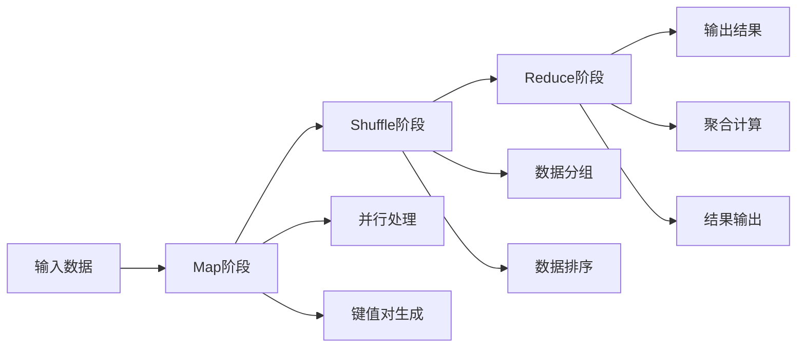

### 4.2 MapReduce编程示例

<Tabs>
  <TabItem value="wordcount" label="WordCount示例" default>
  ```java title="WordCount MapReduce示例"
  public class WordCount {
      public static class TokenizerMapper extends Mapper<Object, Text, Text, IntWritable> {
          private final static IntWritable one = new IntWritable(1);
          private Text word = new Text();
          
          public void map(Object key, Text value, Context context) throws IOException, InterruptedException {
              StringTokenizer itr = new StringTokenizer(value.toString());
              while (itr.hasMoreTokens()) {
                  word.set(itr.nextToken());
                  context.write(word, one);
              }
          }
      }
      
      public static class IntSumReducer extends Reducer<Text, IntWritable, Text, IntWritable> {
          private IntWritable result = new IntWritable();
          
          public void reduce(Text key, Iterable<IntWritable> values, Context context) 
              throws IOException, InterruptedException {
              int sum = 0;
              for (IntWritable val : values) {
                  sum += val.get();
              }
              result.set(sum);
              context.write(key, result);
          }
      }
  }
  ```
  </TabItem>
  <TabItem value="custom" label="自定义MapReduce">
  ```java title="自定义MapReduce示例"
  public class CustomMapReduce {
      public static class CustomMapper extends Mapper<LongWritable, Text, Text, LongWritable> {
          public void map(LongWritable key, Text value, Context context) 
              throws IOException, InterruptedException {
              // 自定义映射逻辑
              String line = value.toString();
              String[] fields = line.split(",");
              
              if (fields.length >= 2) {
                  String category = fields[0];
                  long amount = Long.parseLong(fields[1]);
                  context.write(new Text(category), new LongWritable(amount));
              }
          }
      }
      
      public static class CustomReducer extends Reducer<Text, LongWritable, Text, LongWritable> {
          public void reduce(Text key, Iterable<LongWritable> values, Context context) 
              throws IOException, InterruptedException {
              // 自定义归约逻辑
              long total = 0;
              for (LongWritable value : values) {
                  total += value.get();
              }
              context.write(key, new LongWritable(total));
          }
      }
  }
  ```
  </TabItem>
</Tabs>

## 5. Hadoop生态系统组件

### 5.1 数据存储组件

| 组件 | 用途 | 特点 |
|------|------|------|
| **HBase** | 分布式NoSQL数据库 | 强一致性、实时读写、列式存储 |
| **Cassandra** | 分布式NoSQL数据库 | 高可用性、线性扩展、最终一致性 |
| **MongoDB** | 文档数据库 | 灵活的数据模型、丰富的查询语言 |

### 5.2 数据处理组件

<div className="card">
<div className="card__header">
<h4>数据处理组件对比</h4>
</div>
<div className="card__body">
<ol>
<li><strong>Hive</strong>：数据仓库，提供SQL查询能力</li>
<li><strong>Pig</strong>：数据流语言，适合ETL处理</li>
<li><strong>Sqoop</strong>：关系型数据库与Hadoop之间的数据传输</li>
<li><strong>Flume</strong>：分布式日志收集系统</li>
</ol>
</div>
</div>

### 5.3 工作流调度组件

```java title="Oozie工作流示例"
public class OozieWorkflow {
    public void createWorkflow() {
        // 创建工作流定义
        WorkflowApp app = new WorkflowApp();
        app.setName("DataProcessingWorkflow");
        
        // 添加MapReduce作业
        MapReduceAction mrAction = new MapReduceAction();
        mrAction.setName("WordCount");
        mrAction.setJobTracker("${jobTracker}");
        mrAction.setNameNode("${nameNode}");
        
        // 设置输入输出路径
        mrAction.setConfigProperty("mapred.input.dir", "/input");
        mrAction.setConfigProperty("mapred.output.dir", "/output");
        
        // 添加到工作流
        app.addAction(mrAction);
    }
}
```

## 6. Hadoop部署和配置

### 6.1 集群规划

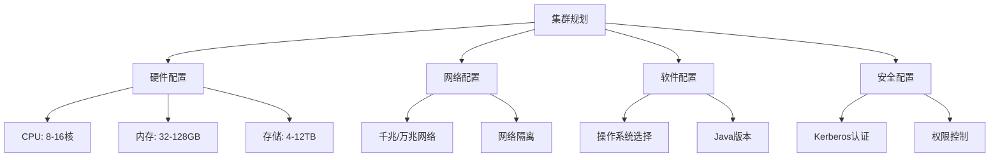

### 6.2 配置文件示例

<Tabs>
  <TabItem value="core" label="core-site.xml" default>
  ```xml
  <configuration>
      <property>
          <name>fs.defaultFS</name>
          <value>hdfs://namenode:9000</value>
      </property>
      <property>
          <name>hadoop.tmp.dir</name>
          <value>/opt/hadoop/data</value>
      </property>
  </configuration>
  ```
  </TabItem>
  <TabItem value="hdfs" label="hdfs-site.xml">
  ```xml
  <configuration>
      <property>
          <name>dfs.replication</name>
          <value>3</value>
      </property>
      <property>
          <name>dfs.namenode.name.dir</name>
          <value>/opt/hadoop/data/namenode</value>
      </property>
      <property>
          <name>dfs.datanode.data.dir</name>
          <value>/opt/hadoop/data/datanode</value>
      </property>
  </configuration>
  ```
  </TabItem>
  <TabItem value="yarn" label="yarn-site.xml">
  ```xml
  <configuration>
      <property>
          <name>yarn.nodemanager.aux-services</name>
          <value>mapreduce_shuffle</value>
      </property>
      <property>
          <name>yarn.resourcemanager.hostname</name>
          <value>resourcemanager</value>
      </property>
  </configuration>
  ```
  </TabItem>
</Tabs>

## 7. 性能优化和监控

### 7.1 性能优化策略

<div className="card">
<div className="card__body">
<ol>
<li><strong>HDFS优化</strong>：调整块大小、副本数量、压缩算法</li>
<li><strong>MapReduce优化</strong>：合理设置Map/Reduce数量、内存配置</li>
<li><strong>YARN优化</strong>：调整资源分配策略、队列配置</li>
<li><strong>网络优化</strong>：使用专用网络、调整网络参数</li>
</ol>
</div>
</div>

### 7.2 监控工具

```java title="监控指标收集示例"
public class HadoopMonitoring {
    public void collectMetrics() {
        // 收集HDFS指标
        HdfsMetrics hdfsMetrics = new HdfsMetrics();
        hdfsMetrics.collectNameNodeMetrics();
        hdfsMetrics.collectDataNodeMetrics();
        
        // 收集YARN指标
        YarnMetrics yarnMetrics = new YarnMetrics();
        yarnMetrics.collectResourceManagerMetrics();
        yarnMetrics.collectNodeManagerMetrics();
        
        // 收集MapReduce指标
        MapReduceMetrics mrMetrics = new MapReduceMetrics();
        mrMetrics.collectJobMetrics();
        mrMetrics.collectTaskMetrics();
    }
}
```

## 8. 最佳实践

### 8.1 开发最佳实践

<Tabs>
  <TabItem value="design" label="设计原则" default>
  ```java
  // 1. 合理设计键值对
  public class KeyValueDesign {
      // 好的设计：复合键
      public static class CompositeKey implements WritableComparable<CompositeKey> {
          private String category;
          private String subcategory;
          // 实现方法...
      }
  }
  ```
  </TabItem>
  <TabItem value="performance" label="性能优化">
  ```java
  // 2. 使用Combiner减少网络传输
  public class WordCountCombiner extends Reducer<Text, IntWritable, Text, IntWritable> {
      public void reduce(Text key, Iterable<IntWritable> values, Context context) 
          throws IOException, InterruptedException {
          int sum = 0;
          for (IntWritable val : values) {
              sum += val.get();
          }
          context.write(key, new IntWritable(sum));
      }
  }
  ```
  </TabItem>
  <TabItem value="error" label="错误处理">
  ```java
  // 3. 异常处理和容错
  public class RobustMapper extends Mapper<LongWritable, Text, Text, IntWritable> {
      public void map(LongWritable key, Text value, Context context) 
          throws IOException, InterruptedException {
          try {
              // 处理逻辑
              processRecord(value, context);
          } catch (Exception e) {
              // 记录错误但继续处理
              context.getCounter("Errors", "ParseErrors").increment(1);
          }
      }
  }
  ```
  </TabItem>
</Tabs>

### 8.2 运维最佳实践

1. **定期备份**：定期备份HDFS元数据和重要数据
2. **监控告警**：设置关键指标的监控和告警
3. **容量规划**：提前规划存储和计算资源
4. **版本管理**：谨慎升级，保持版本一致性
5. **安全加固**：启用Kerberos认证，控制访问权限

## 9. 总结

Hadoop生态系统为大数据处理提供了完整的解决方案，包括存储、计算、资源管理等各个方面。通过合理使用Hadoop组件，可以构建高效、可靠的大数据处理平台。

### 学习建议

1. **理解架构**：深入理解HDFS、YARN、MapReduce的架构设计
2. **实践编程**：通过实际项目掌握MapReduce编程
3. **学习生态**：了解Hadoop生态系统中各个组件的用途
4. **性能调优**：学习性能优化和监控方法
5. **最佳实践**：掌握开发和运维的最佳实践

Hadoop生态系统是大数据技术的基础，掌握它将为学习其他大数据技术奠定坚实的基础。 