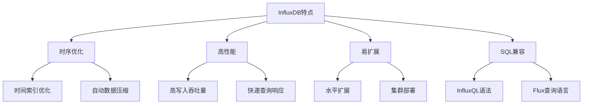
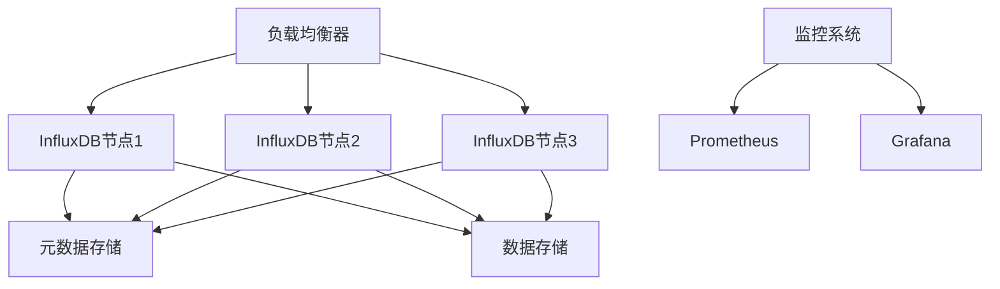

import Tabs from '@theme/Tabs';
import TabItem from '@theme/TabItem';
import TOCInline from '@theme/TOCInline';

# InfluxDB数据采集详解

InfluxDB是一个专为时间序列数据设计的高性能数据库，广泛应用于监控系统、IoT设备、实时分析等场景。它提供了高效的数据写入、查询和聚合能力，是构建实时数据采集系统的理想选择。

:::info 本文内容概览
<TOCInline toc={toc} />
:::

:::tip 核心价值
**InfluxDB数据采集 = 高性能时序存储 + 实时数据写入 + 灵活查询语言 + 数据压缩优化 + 集群扩展能力**
- 🚀 **高性能时序存储**：专为时间序列数据优化的存储引擎
- 👨‍💻 **实时数据写入**：支持高吞吐量的数据写入操作
- 🔍 **灵活查询语言**：InfluxQL和Flux查询语言支持复杂查询
- 🔗 **数据压缩优化**：自动数据压缩，节省存储空间
- 📚 **集群扩展能力**：支持水平扩展，满足大规模数据需求
:::

## 1. InfluxDB基础概念

### 1.1 什么是InfluxDB？

InfluxDB是一个开源的时序数据库，专门设计用于处理时间序列数据。它具有以下特点：



#### InfluxDB核心概念
```java title="InfluxDB核心概念示例"
public class InfluxDBConcepts {
    public static void main(String[] args) {
        // 1. Database - 数据库
        System.out.println("Database: 存储时间序列数据的容器");
        
        // 2. Measurement - 测量值（类似关系数据库的表）
        System.out.println("Measurement: 存储相关时间序列数据的集合");
        
        // 3. Tag - 标签（索引字段）
        System.out.println("Tag: 用于查询和分组的元数据字段");
        
        // 4. Field - 字段（实际数据值）
        System.out.println("Field: 存储实际测量值的字段");
        
        // 5. Timestamp - 时间戳
        System.out.println("Timestamp: 数据点的时间标识");
        
        // 6. Retention Policy - 保留策略
        System.out.println("Retention Policy: 数据保留时间和分片策略");
    }
}
```

### 1.2 数据模型

InfluxDB的数据模型与传统关系数据库不同：

| 概念 | 关系数据库 | InfluxDB |
|------|------------|----------|
| **数据库** | Database | Database |
| **表** | Table | Measurement |
| **行** | Row | Point |
| **列** | Column | Tag/Field |
| **主键** | Primary Key | Timestamp + Tag Set |

#### 数据点结构示例
```java title="数据点结构示例"
public class DataPointStructure {
    // InfluxDB数据点结构
    public static class DataPoint {
        private String measurement;        // 测量值名称
        private Map<String, String> tags; // 标签集合
        private Map<String, Object> fields; // 字段集合
        private long timestamp;            // 时间戳
        
        // 示例：CPU使用率数据点
        public static DataPoint createCPUUsagePoint() {
            DataPoint point = new DataPoint();
            point.measurement = "cpu_usage";
            
            // 标签：用于查询和分组
            point.tags = new HashMap<>();
            point.tags.put("host", "server-01");
            point.tags.put("region", "us-west");
            point.tags.put("cpu_core", "0");
            
            // 字段：实际测量值
            point.fields = new HashMap<>();
            point.fields.put("usage_percent", 75.5);
            point.fields.put("temperature", 45.2);
            
            // 时间戳
            point.timestamp = System.currentTimeMillis();
            
            return point;
        }
    }
}
```

## 2. InfluxDB安装和配置

### 2.1 安装方法

<Tabs>
  <TabItem value="docker" label="Docker安装" default>
  ```bash
  # 使用Docker安装InfluxDB
  docker run -d \
    --name influxdb \
    -p 8086:8086 \
    -v influxdb-data:/var/lib/influxdb2 \
    -v influxdb-config:/etc/influxdb2 \
    -e DOCKER_INFLUXDB_INIT_MODE=setup \
    -e DOCKER_INFLUXDB_INIT_USERNAME=admin \
    -e DOCKER_INFLUXDB_INIT_PASSWORD=password123 \
    -e DOCKER_INFLUXDB_INIT_ORG=myorg \
    -e DOCKER_INFLUXDB_INIT_BUCKET=mybucket \
    influxdb:2.7
  ```
  </TabItem>
  <TabItem value="package" label="包管理器安装">
  ```bash
  # Ubuntu/Debian
  wget https://dl.influxdata.com/influxdb/releases/influxdb2-2.7.1-amd64.deb
  sudo dpkg -i influxdb2-2.7.1-amd64.deb
  
  # CentOS/RHEL
  wget https://dl.influxdata.com/influxdb/releases/influxdb2-2.7.1.x86_64.rpm
  sudo yum localinstall influxdb2-2.7.1.x86_64.rpm
  ```
  </TabItem>
  <TabItem value="binary" label="二进制安装">
  ```bash
  # 下载二进制文件
  wget https://dl.influxdata.com/influxdb/releases/influxdb2-2.7.1-linux-amd64.tar.gz
  tar xvfz influxdb2-2.7.1-linux-amd64.tar.gz
  cd influxdb2-2.7.1-linux-amd64
  
  # 启动服务
  ./influxd
  ```
  </TabItem>
</Tabs>

### 2.2 配置文件

InfluxDB的主要配置文件：

```yaml title="influxdb.yml配置示例"
# InfluxDB配置文件
api:
  bind-address: ":8086"
  auth-enabled: true

meta:
  dir: "/var/lib/influxdb2/meta"
  bind-address: ":8089"

data:
  dir: "/var/lib/influxdb2/data"
  wal-dir: "/var/lib/influxdb2/wal"
  series-id-set-cache-size: 100

http:
  bind-address: ":8086"
  auth-enabled: true
  log-enabled: true
  write-tracing: false
  pprof-enabled: false

logging:
  level: "info"
  format: "auto"
```

## 3. 数据采集方法

### 3.1 HTTP API写入

InfluxDB提供了RESTful HTTP API用于数据写入：

```java title="HTTP API数据写入示例"
public class InfluxDBHTTPWriter {
    private final String url;
    private final String token;
    private final String org;
    private final String bucket;
    
    public InfluxDBHTTPWriter(String url, String token, String org, String bucket) {
        this.url = url;
        this.token = token;
        this.org = org;
        this.bucket = bucket;
    }
    
    public void writeDataPoint(DataPoint point) throws IOException {
        // 构建Line Protocol格式的数据
        String lineProtocol = buildLineProtocol(point);
        
        // 发送HTTP POST请求
        URL writeUrl = new URL(url + "/api/v2/write?org=" + org + "&bucket=" + bucket);
        HttpURLConnection connection = (HttpURLConnection) writeUrl.openConnection();
        connection.setRequestMethod("POST");
        connection.setRequestProperty("Authorization", "Token " + token);
        connection.setRequestProperty("Content-Type", "text/plain; charset=utf-8");
        connection.setDoOutput(true);
        
        try (OutputStreamWriter writer = new OutputStreamWriter(connection.getOutputStream())) {
            writer.write(lineProtocol);
        }
        
        int responseCode = connection.getResponseCode();
        if (responseCode != 204) {
            throw new IOException("Write failed with response code: " + responseCode);
        }
    }
    
    private String buildLineProtocol(DataPoint point) {
        StringBuilder sb = new StringBuilder();
        
        // 测量值名称
        sb.append(point.measurement);
        
        // 标签
        if (point.tags != null && !point.tags.isEmpty()) {
            for (Map.Entry<String, String> tag : point.tags.entrySet()) {
                sb.append(",").append(tag.getKey()).append("=").append(tag.getValue());
            }
        }
        
        // 字段
        sb.append(" ");
        boolean first = true;
        for (Map.Entry<String, Object> field : point.fields.entrySet()) {
            if (!first) sb.append(",");
            sb.append(field.getKey()).append("=");
            
            Object value = field.getValue();
            if (value instanceof String) {
                sb.append("\"").append(value).append("\"");
            } else {
                sb.append(value);
            }
            first = false;
        }
        
        // 时间戳（纳秒）
        sb.append(" ").append(point.timestamp * 1_000_000);
        
        return sb.toString();
    }
}
```

### 3.2 客户端库写入

使用官方Java客户端库：

```java title="Java客户端写入示例"
public class InfluxDBClientWriter {
    private final InfluxDBClient client;
    private final WriteApi writeApi;
    
    public InfluxDBClientWriter(String url, String token, String org, String bucket) {
        this.client = InfluxDBClientFactory.create(url, token.toCharArray(), org, bucket);
        this.writeApi = client.getWriteApi();
    }
    
    public void writeDataPoint(DataPoint point) {
        Point influxPoint = Point.measurement(point.measurement)
            .addTags(point.tags)
            .addFields(point.fields)
            .time(point.timestamp, WritePrecision.MS);
        
        writeApi.writePoint(influxPoint);
    }
    
    public void writeBatch(List<DataPoint> points) {
        List<Point> influxPoints = points.stream()
            .map(point -> Point.measurement(point.measurement)
                .addTags(point.tags)
                .addFields(point.fields)
                .time(point.timestamp, WritePrecision.MS))
            .collect(Collectors.toList());
        
        writeApi.writePoints(influxPoints);
    }
    
    public void close() {
        writeApi.close();
        client.close();
    }
}
```

### 3.3 批量写入优化

对于高吞吐量场景，批量写入是必要的：

```java title="批量写入优化示例"
public class BatchWriter {
    private final InfluxDBClient client;
    private final WriteApi writeApi;
    private final int batchSize;
    private final long flushInterval;
    
    private final List<Point> buffer = new ArrayList<>();
    private final ScheduledExecutorService scheduler;
    
    public BatchWriter(String url, String token, String org, String bucket, 
                      int batchSize, long flushInterval) {
        this.client = InfluxDBClientFactory.create(url, token.toCharArray(), org, bucket);
        this.writeApi = client.getWriteApi();
        this.batchSize = batchSize;
        this.flushInterval = flushInterval;
        
        // 设置批量写入选项
        writeApi.setWriteOptions(WriteOptions.builder()
            .batchSize(batchSize)
            .flushDuration(flushInterval)
            .jitterDuration(1000)
            .retryBufferLimit(50000)
            .maxRetries(5)
            .maxRetryDelay(30000)
            .exponentialBase(2)
            .build());
        
        // 启动定时刷新任务
        this.scheduler = Executors.newScheduledThreadPool(1);
        this.scheduler.scheduleAtFixedRate(this::flush, flushInterval, flushInterval, TimeUnit.MILLISECONDS);
    }
    
    public void writePoint(Point point) {
        synchronized (buffer) {
            buffer.add(point);
            if (buffer.size() >= batchSize) {
                flush();
            }
        }
    }
    
    private void flush() {
        synchronized (buffer) {
            if (!buffer.isEmpty()) {
                writeApi.writePoints(buffer);
                buffer.clear();
            }
        }
    }
    
    public void close() {
        flush();
        scheduler.shutdown();
        writeApi.close();
        client.close();
    }
}
```

## 4. 数据采集最佳实践

### 4.1 数据模型设计

<div className="card">
<div className="card__header">
<h4>时序数据模型设计原则</h4>
</div>
<div className="card__body">
<ol>
<li><strong>合理使用标签</strong>：标签用于查询和分组，字段用于存储实际值</li>
<li><strong>避免高基数标签</strong>：高基数标签会导致性能问题</li>
<li><strong>时间精度选择</strong>：根据业务需求选择合适的时间精度</li>
<li><strong>数据压缩</strong>：利用InfluxDB的自动压缩功能</li>
</ol>
</div>
</div>

#### 好的数据模型示例
```java title="好的数据模型示例"
public class GoodDataModel {
    // 好的数据模型：CPU监控数据
    public static class CPUMeasurement {
        // 测量值名称
        public static final String MEASUREMENT = "cpu_metrics";
        
        // 标签：用于查询和分组
        public static final Map<String, String> TAGS = Map.of(
            "host", "server-01",
            "datacenter", "dc-west",
            "environment", "production"
        );
        
        // 字段：实际测量值
        public static final Map<String, Object> FIELDS = Map.of(
            "cpu_usage", 75.5,
            "cpu_temperature", 45.2,
            "cpu_frequency", 2400.0
        );
    }
    
    // 避免的高基数标签示例
    public static class BadDataModel {
        // 错误：使用高基数标签
        public static final Map<String, String> HIGH_CARDINALITY_TAGS = Map.of(
            "user_id", "12345",        // 高基数：用户ID
            "session_id", "abc123",    // 高基数：会话ID
            "request_id", "req-456"    // 高基数：请求ID
        );
    }
}
```

### 4.2 性能优化策略

<Tabs>
  <TabItem value="influxdb-batch" label="批量写入" default>
  ```java
  // 批量写入优化
  public class PerformanceOptimization {
      public void optimizeBatchWriting() {
          // 1. 设置合适的批量大小
          int batchSize = 1000;
          
          // 2. 设置刷新间隔
          long flushInterval = 1000; // 1秒
          
          // 3. 使用异步写入
          WriteApi writeApi = client.getWriteApi();
          writeApi.setWriteOptions(WriteOptions.builder()
              .batchSize(batchSize)
              .flushDuration(flushInterval)
              .build());
      }
  }
  ```
  </TabItem>
  <TabItem value="compression" label="数据压缩">
  ```java
  // 数据压缩优化
  public class CompressionOptimization {
      public void optimizeCompression() {
          // 1. 使用合适的数据类型
          Map<String, Object> fields = new HashMap<>();
          fields.put("cpu_usage", 75.5);      // 浮点数
          fields.put("status", 1);            // 整数而不是字符串
          fields.put("is_active", true);      // 布尔值
          
          // 2. 避免存储重复数据
          // 错误：存储重复的时间戳
          // 正确：使用相对时间或时间偏移
      }
  }
  ```
  </TabItem>
  <TabItem value="indexing" label="索引优化">
  ```java
  // 索引优化
  public class IndexOptimization {
      public void optimizeIndexing() {
          // 1. 合理使用标签
          Map<String, String> tags = new HashMap<>();
          tags.put("host", "server-01");      // 低基数标签
          tags.put("service", "web");         // 低基数标签
          tags.put("version", "v1.0");       // 低基数标签
          
          // 2. 避免高基数标签
          // 错误：使用用户ID作为标签
          // tags.put("user_id", "12345");
          
          // 3. 使用字段存储高基数数据
          Map<String, Object> fields = new HashMap<>();
          fields.put("user_id", "12345");    // 作为字段存储
      }
  }
  ```
  </TabItem>
</Tabs>

## 5. 数据采集应用场景

### 5.1 系统监控

```java title="系统监控数据采集示例"
public class SystemMonitoring {
    public void collectSystemMetrics() {
        // 1. CPU监控
        collectCPUMetrics();
        
        // 2. 内存监控
        collectMemoryMetrics();
        
        // 3. 磁盘监控
        collectDiskMetrics();
        
        // 4. 网络监控
        collectNetworkMetrics();
    }
    
    private void collectCPUMetrics() {
        OperatingSystemMXBean osBean = ManagementFactory.getOperatingSystemMXBean();
        if (osBean instanceof com.sun.management.OperatingSystemMXBean) {
            com.sun.management.OperatingSystemMXBean sunOsBean = 
                (com.sun.management.OperatingSystemMXBean) osBean;
            
            double cpuLoad = sunOsBean.getCpuLoad();
            double cpuUsage = cpuLoad * 100;
            
            Point cpuPoint = Point.measurement("system_cpu")
                .addTag("host", getHostname())
                .addTag("metric", "usage_percent")
                .addField("value", cpuUsage)
                .time(System.currentTimeMillis(), WritePrecision.MS);
            
            writePoint(cpuPoint);
        }
    }
    
    private void collectMemoryMetrics() {
        MemoryMXBean memoryBean = ManagementFactory.getMemoryMXBean();
        MemoryUsage heapUsage = memoryBean.getHeapMemoryUsage();
        
        long usedMemory = heapUsage.getUsed();
        long maxMemory = heapUsage.getMax();
        double memoryUsage = (double) usedMemory / maxMemory * 100;
        
        Point memoryPoint = Point.measurement("system_memory")
            .addTag("host", getHostname())
            .addTag("type", "heap")
            .addField("used_bytes", usedMemory)
            .addField("max_bytes", maxMemory)
            .addField("usage_percent", memoryUsage)
            .time(System.currentTimeMillis(), WritePrecision.MS);
        
        writePoint(memoryPoint);
    }
    
    private String getHostname() {
        try {
            return InetAddress.getLocalHost().getHostName();
        } catch (UnknownHostException e) {
            return "unknown";
        }
    }
}
```

### 5.2 IoT设备数据采集

```java title="IoT设备数据采集示例"
public class IoTDataCollection {
    public void collectSensorData() {
        // 1. 温度传感器数据
        collectTemperatureData();
        
        // 2. 湿度传感器数据
        collectHumidityData();
        
        // 3. 压力传感器数据
        collectPressureData();
        
        // 4. 位置数据
        collectLocationData();
    }
    
    private void collectTemperatureData() {
        // 模拟温度传感器数据
        double temperature = 20.0 + Math.random() * 10.0;
        double humidity = 40.0 + Math.random() * 20.0;
        
        Point tempPoint = Point.measurement("sensor_data")
            .addTag("device_id", "temp_sensor_001")
            .addTag("sensor_type", "temperature")
            .addTag("location", "room_101")
            .addField("temperature_c", temperature)
            .addField("humidity_percent", humidity)
            .addField("battery_level", 85.0)
            .time(System.currentTimeMillis(), WritePrecision.MS);
        
        writePoint(tempPoint);
    }
    
    private void collectLocationData() {
        // 模拟GPS位置数据
        double latitude = 37.7749 + (Math.random() - 0.5) * 0.01;
        double longitude = -122.4194 + (Math.random() - 0.5) * 0.01;
        double altitude = 100.0 + Math.random() * 50.0;
        
        Point locationPoint = Point.measurement("gps_data")
            .addTag("device_id", "gps_tracker_001")
            .addTag("vehicle_type", "delivery_truck")
            .addField("latitude", latitude)
            .addField("longitude", longitude)
            .addField("altitude_m", altitude)
            .addField("speed_kmh", 35.0 + Math.random() * 20.0)
            .time(System.currentTimeMillis(), WritePrecision.MS);
        
        writePoint(locationPoint);
    }
}
```

## 6. 数据查询和分析

### 6.1 基本查询

```java title="基本查询示例"
public class InfluxDBQueries {
    private final InfluxDBClient client;
    private final QueryApi queryApi;
    
    public InfluxDBQueries(String url, String token, String org) {
        this.client = InfluxDBClientFactory.create(url, token.toCharArray(), org);
        this.queryApi = client.getQueryApi();
    }
    
    // 查询最近1小时的CPU使用率
    public List<FluxTable> queryRecentCPUUsage() {
        String flux = """
            from(bucket: "system_metrics")
                |> range(start: -1h)
                |> filter(fn: (r) => r._measurement == "system_cpu")
                |> filter(fn: (r) => r._field == "value")
                |> aggregateWindow(every: 1m, fn: mean)
                |> yield(name: "mean")
            """;
        
        return queryApi.query(flux);
    }
    
    // 查询特定主机的内存使用情况
    public List<FluxTable> queryHostMemoryUsage(String hostname, Duration duration) {
        String flux = String.format("""
            from(bucket: "system_metrics")
                |> range(start: -%ds)
                |> filter(fn: (r) => r._measurement == "system_memory")
                |> filter(fn: (r) => r.host == "%s")
                |> filter(fn: (r) => r._field == "usage_percent")
                |> aggregateWindow(every: 5m, fn: mean)
                |> yield(name: "mean")
            """, duration.getSeconds(), hostname);
        
        return queryApi.query(flux);
    }
    
    // 聚合查询：计算每小时的平均值
    public List<FluxTable> queryHourlyAggregation() {
        String flux = """
            from(bucket: "system_metrics")
                |> range(start: -24h)
                |> filter(fn: (r) => r._measurement == "system_cpu")
                |> filter(fn: (r) => r._field == "value")
                |> aggregateWindow(every: 1h, fn: mean)
                |> yield(name: "hourly_mean")
            """;
        
        return queryApi.query(flux);
    }
}
```

### 6.2 高级查询和分析

```java title="高级查询示例"
public class AdvancedQueries {
    private final QueryApi queryApi;
    
    public AdvancedQueries(QueryApi queryApi) {
        this.queryApi = queryApi;
    }
    
    // 异常检测：检测CPU使用率异常
    public List<FluxTable> detectCPUAnomalies() {
        String flux = """
            from(bucket: "system_metrics")
                |> range(start: -1h)
                |> filter(fn: (r) => r._measurement == "system_cpu")
                |> filter(fn: (r) => r._field == "value")
                |> aggregateWindow(every: 1m, fn: mean)
                |> map(fn: (r) => ({
                    _value: r._value,
                    anomaly: if r._value > 90.0 then "high" else "normal"
                }))
                |> filter(fn: (r) => r.anomaly == "high")
            """;
        
        return queryApi.query(flux);
    }
    
    // 趋势分析：计算CPU使用率趋势
    public List<FluxTable> analyzeCPUTrend() {
        String flux = """
            from(bucket: "system_metrics")
                |> range(start: -7d)
                |> filter(fn: (r) => r._measurement == "system_cpu")
                |> filter(fn: (r) => r._field == "value")
                |> aggregateWindow(every: 1h, fn: mean)
                |> linearRegression(predict: 24h)
            """;
        
        return queryApi.query(flux);
    }
    
    // 多维度分析：按主机和服务分组
    public List<FluxTable> multiDimensionalAnalysis() {
        String flux = """
            from(bucket: "system_metrics")
                |> range(start: -1h)
                |> filter(fn: (r) => r._measurement == "system_cpu")
                |> filter(fn: (r) => r._field == "value")
                |> group(columns: ["host", "service"])
                |> aggregateWindow(every: 5m, fn: mean)
                |> pivot(rowKey:["_time"], columnKey: ["_field"], valueColumn: "_value")
            """;
        
        return queryApi.query(flux);
    }
}
```

## 7. 监控和告警

### 7.1 数据质量监控

```java title="数据质量监控示例"
public class DataQualityMonitoring {
    private final InfluxDBClient client;
    private final WriteApi writeApi;
    
    public DataQualityMonitoring(String url, String token, String org, String bucket) {
        this.client = InfluxDBClientFactory.create(url, token.toCharArray(), org, bucket);
        this.writeApi = client.getWriteApi();
    }
    
    // 监控数据采集延迟
    public void monitorDataLatency(String measurement, long expectedInterval) {
        long currentTime = System.currentTimeMillis();
        long lastDataTime = getLastDataTime(measurement);
        long latency = currentTime - lastDataTime;
        
        // 如果延迟超过预期，记录告警
        if (latency > expectedInterval * 2) {
            Point alertPoint = Point.measurement("data_quality_alerts")
                .addTag("alert_type", "data_latency")
                .addTag("measurement", measurement)
                .addTag("severity", "warning")
                .addField("expected_interval_ms", expectedInterval)
                .addField("actual_latency_ms", latency)
                .addField("message", "Data collection delayed")
                .time(currentTime, WritePrecision.MS);
            
            writeApi.writePoint(alertPoint);
        }
    }
    
    // 监控数据完整性
    public void monitorDataCompleteness(String measurement, int expectedCount, Duration window) {
        int actualCount = getDataCount(measurement, window);
        double completeness = (double) actualCount / expectedCount * 100;
        
        if (completeness < 90.0) {
            Point alertPoint = Point.measurement("data_quality_alerts")
                .addTag("alert_type", "data_completeness")
                .addTag("measurement", measurement)
                .addTag("severity", "error")
                .addField("expected_count", expectedCount)
                .addField("actual_count", actualCount)
                .addField("completeness_percent", completeness)
                .addField("message", "Data completeness below threshold")
                .time(System.currentTimeMillis(), WritePrecision.MS);
            
            writeApi.writePoint(alertPoint);
        }
    }
    
    private long getLastDataTime(String measurement) {
        // 实现获取最后数据时间的逻辑
        return System.currentTimeMillis() - 60000; // 模拟数据
    }
    
    private int getDataCount(String measurement, Duration window) {
        // 实现获取数据计数的逻辑
        return 85; // 模拟数据
    }
}
```

### 7.2 告警规则配置

```yaml title="告警规则配置示例"
# InfluxDB告警规则配置
alerts:
  - name: "High CPU Usage"
    query: |
      from(bucket: "system_metrics")
        |> range(start: -5m)
        |> filter(fn: (r) => r._measurement == "system_cpu")
        |> filter(fn: (r) => r._field == "value")
        |> aggregateWindow(every: 1m, fn: mean)
        |> filter(fn: (r) => r._value > 90.0)
    condition: "count() > 0"
    message: "CPU usage is above 90% for the last 5 minutes"
    severity: "warning"
    
  - name: "Data Collection Failure"
    query: |
      from(bucket: "system_metrics")
        |> range(start: -10m)
        |> filter(fn: (r) => r._measurement == "data_quality_alerts")
        |> filter(fn: (r) => r.alert_type == "data_latency")
        |> filter(fn: (r) => r.severity == "error")
    condition: "count() > 0"
    message: "Data collection has failed or is severely delayed"
    severity: "critical"
```

## 8. 性能优化和调优

### 8.1 写入性能优化

<div className="card">
<div className="card__body">
<h5>写入性能优化策略</h5>
<ol>
<li><strong>批量写入</strong>：使用合适的批量大小，通常1000-5000个点</li>
<li><strong>异步写入</strong>：使用异步写入API，避免阻塞</li>
<li><strong>连接池</strong>：复用HTTP连接，减少连接建立开销</li>
<li><strong>数据压缩</strong>：启用gzip压缩，减少网络传输</li>
<li><strong>并行写入</strong>：使用多个线程并行写入数据</li>
</ol>
</div>
</div>

### 8.2 查询性能优化

```java title="查询性能优化示例"
public class QueryPerformanceOptimization {
    private final QueryApi queryApi;
    
    public QueryPerformanceOptimization(QueryApi queryApi) {
        this.queryApi = queryApi;
    }
    
    // 优化查询：使用时间范围限制
    public List<FluxTable> optimizedTimeRangeQuery() {
        String flux = """
            from(bucket: "system_metrics")
                |> range(start: -1h)  // 限制时间范围
                |> filter(fn: (r) => r._measurement == "system_cpu")
                |> filter(fn: (r) => r.host == "server-01")  // 先过滤标签
                |> filter(fn: (r) => r._field == "value")
                |> aggregateWindow(every: 5m, fn: mean)  // 聚合减少数据量
                |> yield(name: "optimized_result")
            """;
        
        return queryApi.query(flux);
    }
    
    // 使用索引优化查询
    public List<FluxTable> indexedQuery() {
        String flux = """
            from(bucket: "system_metrics")
                |> range(start: -1h)
                |> filter(fn: (r) => r._measurement == "system_cpu")
                |> filter(fn: (r) => r.host == "server-01")  // 使用索引标签
                |> filter(fn: (r) => r.service == "web")     // 使用索引标签
                |> filter(fn: (r) => r._field == "value")
                |> yield(name: "indexed_result")
            """;
        
        return queryApi.query(flux);
    }
}
```

## 9. 集群部署和高可用

### 9.1 集群架构



### 9.2 高可用配置

```yaml title="高可用配置示例"
# InfluxDB集群配置
meta:
  dir: "/var/lib/influxdb2/meta"
  bind-address: ":8089"
  http-bind-address: ":8091"
  auth-enabled: true
  auth-secret: "your-auth-secret"
  
data:
  dir: "/var/lib/influxdb2/data"
  wal-dir: "/var/lib/influxdb2/wal"
  series-id-set-cache-size: 100
  series-file-max-concurrent-snapshot-compactions: 4
  
http:
  bind-address: ":8086"
  auth-enabled: true
  log-enabled: true
  
# 集群配置
cluster:
  enabled: true
  meta-nodes: ["node1:8089", "node2:8089", "node3:8089"]
  data-nodes: ["node1:8086", "node2:8086", "node3:8086"]
```

## 10. 总结

InfluxDB作为专业的时序数据库，为数据采集系统提供了强大的支持。通过合理的设计和优化，可以构建高性能、高可靠的数据采集系统。

### 关键要点

1. **数据模型设计**：合理使用标签和字段，避免高基数问题
2. **性能优化**：批量写入、异步处理、查询优化
3. **监控告警**：建立完善的数据质量监控体系
4. **高可用部署**：集群部署、负载均衡、故障恢复

### 学习建议

1. **掌握基础概念**：理解时序数据库的特点和数据模型
2. **实践数据采集**：从简单的系统监控开始，逐步扩展到复杂场景
3. **性能调优**：学习查询优化和写入优化技巧
4. **运维管理**：掌握集群部署和监控告警配置

InfluxDB数据采集技术是现代数据架构的重要组成部分，掌握它将为构建实时数据处理系统奠定坚实基础。 