import Tabs from '@theme/Tabs';
import TabItem from '@theme/TabItem';
import TOCInline from '@theme/TOCInline';

# Spark技术详解

Apache Spark是一个快速、通用的大规模数据处理引擎，它提供了内存计算能力，使得大数据处理速度比传统MapReduce快10-100倍。Spark支持批处理、交互式查询、流处理和机器学习等多种计算范式。

:::info 本文内容概览
<TOCInline toc={toc} />
:::

:::tip 核心价值
**Apache Spark = 内存计算 + 统一平台 + 高性能 + 易用性 + 生态系统**
- 🚀 **内存计算**：数据存储在内存中，计算速度大幅提升
- 👨‍💻 **统一平台**：支持批处理、流处理、机器学习等多种计算模式
- 🔍 **高性能**：比MapReduce快10-100倍，支持复杂的迭代算法
- 🔗 **易用性**：提供Java、Scala、Python、R等多种API
- 📚 **生态系统**：Spark SQL、Spark Streaming、MLlib、GraphX等组件
:::

## 1. Spark核心概念

### 1.1 Spark架构

Spark采用主从架构，主要包含以下组件：

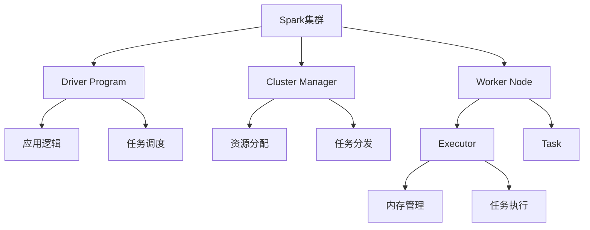

### 1.2 Spark核心抽象

<div className="card">
<div className="card__header">
<h4>Spark核心抽象</h4>
</div>
<div className="card__body">
<ol>
<li><strong>RDD</strong>：弹性分布式数据集，不可变的分布式对象集合</li>
<li><strong>DataFrame</strong>：基于RDD的分布式数据表，类似关系型数据库表</li>
<li><strong>Dataset</strong>：类型安全的DataFrame，结合了RDD和DataFrame的优点</li>
<li><strong>SparkContext</strong>：Spark应用的入口点，负责与集群通信</li>
</ol>
</div>
</div>

#### 1.2.1 Spark 3.x新特性
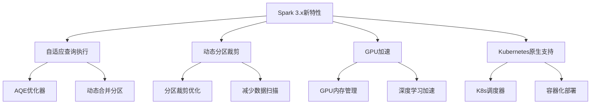

#### 1.2.2 RDD依赖关系管理
```java title="RDD依赖关系示例"
public class RDDDependencyExample {
    public void demonstrateDependencies(JavaSparkContext sc) {
        // 1. 窄依赖 - 一对一依赖
        JavaRDD<String> lines = sc.textFile("input.txt");
        JavaRDD<Integer> lengths = lines.map(String::length); // 窄依赖
        
        // 2. 宽依赖 - Shuffle依赖
        JavaPairRDD<String, Integer> pairs = lines.mapToPair(line -> 
            new Tuple2<>(line.split(" ")[0], 1));
        JavaPairRDD<String, Integer> counts = pairs.reduceByKey((a, b) -> a + b); // 宽依赖
        
        // 3. 检查依赖类型
        System.out.println("Lines RDD dependencies: " + lines.dependencies());
        System.out.println("Lengths RDD dependencies: " + lengths.dependencies());
        System.out.println("Counts RDD dependencies: " + counts.dependencies());
        
        // 4. 优化建议
        if (hasWideDependency(counts)) {
            System.out.println("Warning: Wide dependency detected. Consider repartitioning.");
        }
    }
    
    private boolean hasWideDependency(JavaPairRDD<String, Integer> rdd) {
        return rdd.dependencies().stream()
            .anyMatch(dep -> dep instanceof ShuffleDependency);
    }
}
```

#### RDD特性
```java title="RDD特性示例"
public class RDDFeatures {
    public static void main(String[] args) {
        // 1. 弹性（Resilient）
        System.out.println("RDD具有容错能力，可以从失败中恢复");
        
        // 2. 分布式（Distributed）
        System.out.println("RDD数据分布在集群的多个节点上");
        
        // 3. 数据集（Dataset）
        System.out.println("RDD是数据集合，支持多种数据类型");
        
        // 4. 不可变性（Immutable）
        System.out.println("RDD一旦创建就不能修改，只能通过转换生成新的RDD");
        
        // 5. 延迟计算（Lazy Evaluation）
        System.out.println("RDD转换操作是延迟的，只有遇到动作操作时才执行");
    }
}
```

## 2. Spark编程模型

### 2.1 RDD操作类型

Spark RDD支持两种类型的操作：

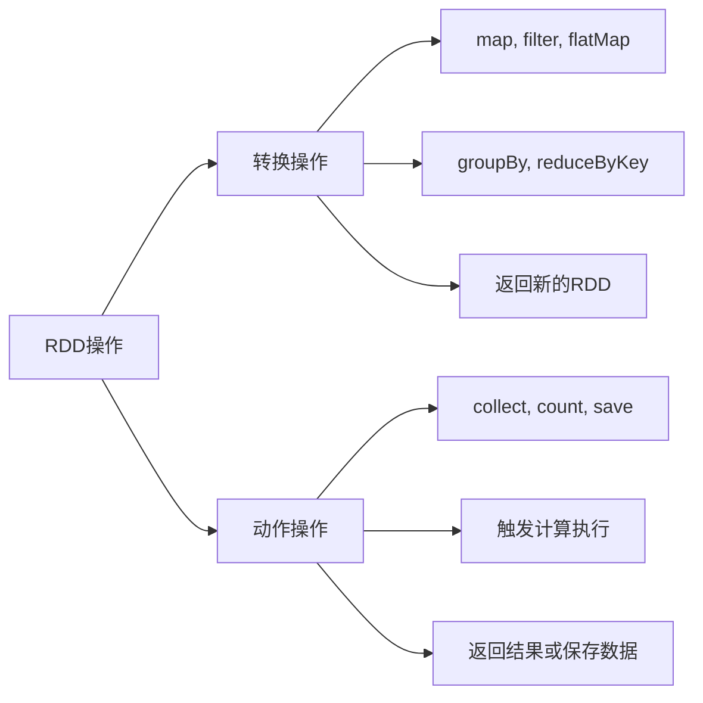

### 2.2 基本RDD操作

<Tabs>
  <TabItem value="transformations" label="转换操作" default>
  ```java title="RDD转换操作示例"
  public class RDDTransformations {
      public void demonstrateTransformations(JavaRDD<String> lines) {
          // 1. map - 一对一转换
          JavaRDD<Integer> lengths = lines.map(String::length);
          
          // 2. filter - 过滤数据
          JavaRDD<String> longLines = lines.filter(line -> line.length() > 100);
          
          // 3. flatMap - 一对多转换
          JavaRDD<String> words = lines.flatMap(line -> 
              Arrays.asList(line.split(" ")).iterator());
          
          // 4. distinct - 去重
          JavaRDD<String> uniqueWords = words.distinct();
          
          // 5. sample - 采样
          JavaRDD<String> sampledLines = lines.sample(false, 0.1);
      }
  }
  ```
  </TabItem>
  <TabItem value="actions" label="动作操作">
  ```java title="RDD动作操作示例"
  public class RDDActions {
      public void demonstrateActions(JavaRDD<String> lines) {
          // 1. collect - 收集所有数据到Driver
          List<String> allLines = lines.collect();
          
          // 2. count - 计算元素个数
          long lineCount = lines.count();
          
          // 3. take - 取前N个元素
          List<String> firstLines = lines.take(10);
          
          // 4. reduce - 归约操作
          String longestLine = lines.reduce((a, b) -> 
              a.length() > b.length() ? a : b);
          
          // 5. foreach - 对每个元素执行操作
          lines.foreach(line -> System.out.println("Processing: " + line));
      }
  }
  ```
  </TabItem>
  <TabItem value="keyvalue" label="键值对操作">
  ```java title="键值对RDD操作示例"
  public class KeyValueRDDOperations {
      public void demonstrateKeyValueOperations(JavaPairRDD<String, Integer> pairs) {
          // 1. reduceByKey - 按键归约
          JavaPairRDD<String, Integer> sums = pairs.reduceByKey((a, b) -> a + b);
          
          // 2. groupByKey - 按键分组
          JavaPairRDD<String, Iterable<Integer>> groups = pairs.groupByKey();
          
          // 3. sortByKey - 按键排序
          JavaPairRDD<String, Integer> sorted = pairs.sortByKey();
          
          // 4. join - 连接操作
          JavaPairRDD<String, Tuple2<Integer, String>> joined = 
              pairs.join(otherPairs);
          
          // 5. cogroup - 协同分组
          JavaPairRDD<String, Tuple2<Iterable<Integer>, Iterable<String>>> cogrouped = 
              pairs.cogroup(otherPairs);
      }
  }
  ```
  </TabItem>
</Tabs>

## 3. Spark SQL和DataFrame

### 3.1 DataFrame概念

DataFrame是Spark中处理结构化数据的核心抽象：

#### 3.1.1 Catalyst优化器工作原理
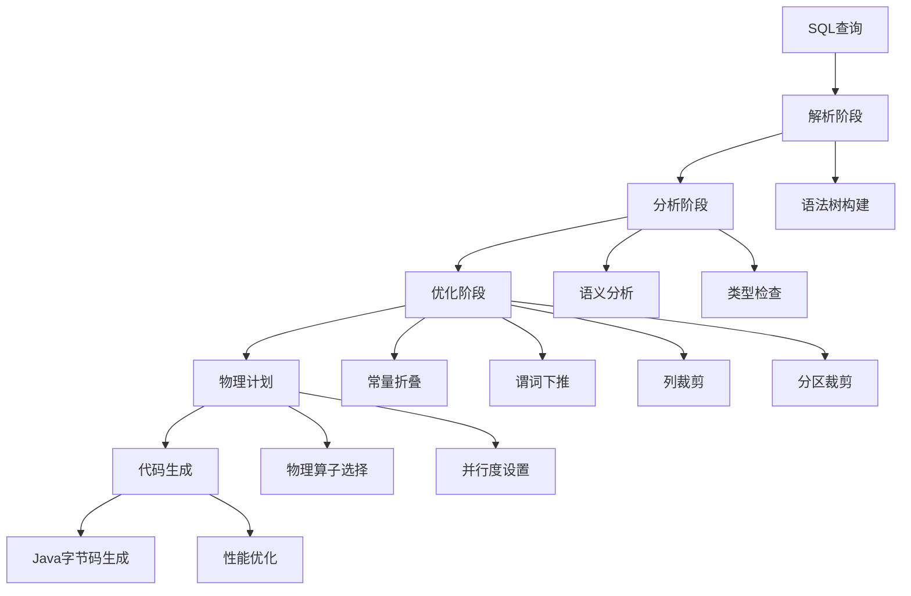

#### 3.1.2 自适应查询执行(AQE)
```java title="AQE优化示例"
public class AQEExample {
    public void demonstrateAQE(SparkSession spark) {
        // 启用AQE
        spark.conf().set("spark.sql.adaptive.enabled", "true");
        spark.conf().set("spark.sql.adaptive.coalescePartitions.enabled", "true");
        spark.conf().set("spark.sql.adaptive.skewJoin.enabled", "true");
        spark.conf().set("spark.sql.adaptive.localShuffleReader.enabled", "true");
        
        // 创建测试数据
        Dataset<Row> users = spark.createDataFrame(Arrays.asList(
            RowFactory.create("user1", "Alice", 25, "Engineer"),
            RowFactory.create("user2", "Bob", 30, "Manager"),
            RowFactory.create("user3", "Charlie", 35, "Director")
        ), new StructType()
            .add("id", DataTypes.StringType)
            .add("name", DataTypes.StringType)
            .add("age", DataTypes.IntegerType)
            .add("job", DataTypes.StringType));
        
        Dataset<Row> orders = spark.createDataFrame(Arrays.asList(
            RowFactory.create("order1", "user1", 100.0),
            RowFactory.create("order2", "user2", 200.0),
            RowFactory.create("order3", "user1", 150.0)
        ), new StructType()
            .add("orderId", DataTypes.StringType)
            .add("userId", DataTypes.StringType)
            .add("amount", DataTypes.DoubleType));
        
        // 复杂查询 - AQE会自动优化
        Dataset<Row> result = users.join(orders, users.col("id").equalTo(orders.col("userId")))
            .groupBy("job")
            .agg(functions.avg("amount").as("avg_amount"))
            .filter(col("avg_amount").gt(100));
        
        result.explain(true); // 显示优化后的执行计划
        result.show();
    }
}
```

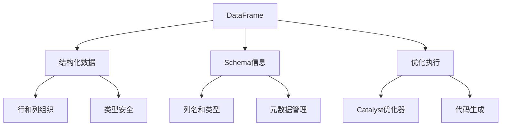

### 3.2 DataFrame操作示例

<div className="code-with-callout">

```java title="DataFrame操作示例"
public class DataFrameOperations {
    public void demonstrateDataFrameOperations(SparkSession spark) {
        // 1. 创建DataFrame
        List<Row> data = Arrays.asList(
            RowFactory.create("Alice", 25, "Engineer"),
            RowFactory.create("Bob", 30, "Manager"),
            RowFactory.create("Charlie", 35, "Director")
        );
        
        StructType schema = new StructType()
            .add("name", DataTypes.StringType)
            .add("age", DataTypes.IntegerType)
            .add("job", DataTypes.StringType);
        
        Dataset<Row> df = spark.createDataFrame(data, schema);
        
        // 2. 显示数据
        df.show();
        
        // 3. 过滤数据
        Dataset<Row> youngPeople = df.filter(col("age").lt(30));
        
        // 4. 选择列
        Dataset<Row> namesAndAges = df.select("name", "age");
        
        // 5. 分组聚合
        Dataset<Row> jobCounts = df.groupBy("job").count();
        
        // 6. SQL查询
        df.createOrReplaceTempView("people");
        Dataset<Row> sqlResult = spark.sql(
            "SELECT job, AVG(age) as avg_age FROM people GROUP BY job"
        );
    }
}
```

:::info DataFrame优势
DataFrame提供了类似SQL的查询接口，支持优化执行，比RDD操作性能更好，特别适合结构化数据处理。
:::
</div>

## 4. Spark Streaming

### 4.1 流处理架构

Spark Streaming将流式计算分解为一系列小批量的批处理作业：

#### 4.1.1 结构化流处理(Structured Streaming)
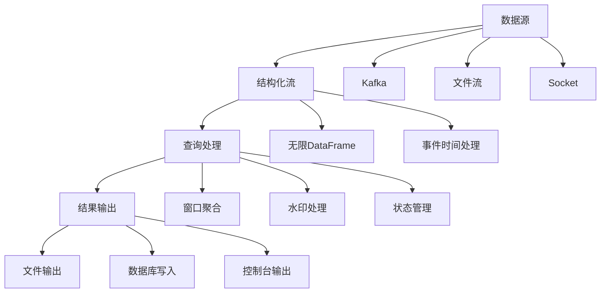

#### 4.1.2 结构化流处理示例
```java title="结构化流处理示例"
public class StructuredStreamingExample {
    public void buildStructuredStreaming(SparkSession spark) {
        // 1. 从Kafka读取流数据
        Dataset<Row> streamDF = spark
            .readStream()
            .format("kafka")
            .option("kafka.bootstrap.servers", "localhost:9092")
            .option("subscribe", "user-events")
            .option("startingOffsets", "latest")
            .load();
        
        // 2. 解析JSON数据
        Dataset<Row> parsedDF = streamDF
            .selectExpr("CAST(value AS STRING) as json")
            .select(functions.from_json(col("json"), getUserEventSchema()).as("data"))
            .select("data.*");
        
        // 3. 事件时间处理和水印
        Dataset<Row> withWatermark = parsedDF
            .withWatermark("timestamp", "10 minutes")
            .groupBy(
                functions.window(col("timestamp"), "5 minutes"),
                col("userId")
            )
            .agg(
                functions.count("*").as("event_count"),
                functions.avg("amount").as("avg_amount")
            );
        
        // 4. 输出到控制台
        StreamingQuery query = withWatermark
            .writeStream()
            .outputMode("append")
            .format("console")
            .option("truncate", false)
            .start();
        
        // 5. 等待查询终止
        query.awaitTermination();
    }
    
    private StructType getUserEventSchema() {
        return new StructType()
            .add("userId", DataTypes.StringType)
            .add("eventType", DataTypes.StringType)
            .add("amount", DataTypes.DoubleType)
            .add("timestamp", DataTypes.TimestampType);
    }
}

// 有状态流处理示例
public class StatefulStreamingExample {
    public void buildStatefulStreaming(SparkSession spark) {
        // 1. 从Kafka读取用户行为流
        Dataset<Row> userBehaviorStream = spark
            .readStream()
            .format("kafka")
            .option("kafka.bootstrap.servers", "localhost:9092")
            .option("subscribe", "user-behavior")
            .load();
        
        // 2. 解析用户行为
        Dataset<Row> behaviorDF = userBehaviorStream
            .selectExpr("CAST(value AS STRING) as json")
            .select(functions.from_json(col("json"), getBehaviorSchema()).as("data"))
            .select("data.*");
        
        // 3. 有状态聚合 - 用户会话统计
        Dataset<Row> sessionStats = behaviorDF
            .withWatermark("timestamp", "1 hour")
            .groupByKey((MapFunction<Row, String>) row -> row.getAs("userId"), Encoders.STRING())
            .flatMapGroupsWithState(
                new UserSessionAggregator(),
                OutputMode.Append(),
                Encoders.bean(UserSession.class),
                Encoders.bean(UserSession.class),
                GroupStateTimeout.ProcessingTimeTimeout()
            );
        
        // 4. 输出结果
        StreamingQuery query = sessionStats
            .writeStream()
            .outputMode("append")
            .format("console")
            .start();
        
        query.awaitTermination();
    }
}

// 用户会话聚合器
class UserSessionAggregator implements FlatMapGroupsWithStateFunction<String, Row, UserSession, UserSession> {
    @Override
    public Iterator<UserSession> call(String userId, Iterator<Row> events, GroupState<UserSession> state) {
        List<UserSession> results = new ArrayList<>();
        
        // 获取当前状态
        UserSession currentSession = state.exists() ? state.get() : new UserSession(userId);
        
        // 处理事件
        while (events.hasNext()) {
            Row event = events.next();
            currentSession.updateSession(event);
        }
        
        // 更新状态
        state.update(currentSession);
        
        // 如果会话完成，输出结果
        if (currentSession.isCompleted()) {
            results.add(currentSession);
            state.remove();
        }
        
        return results.iterator();
    }
}
```

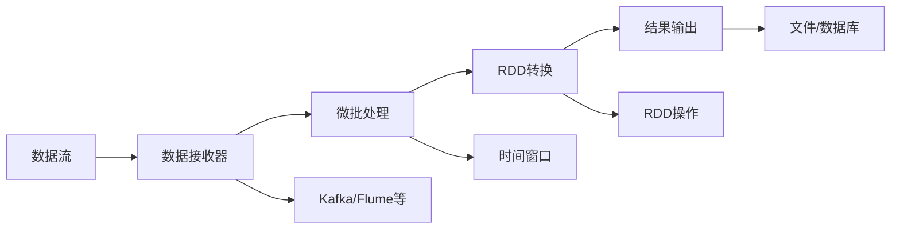

### 4.2 流处理示例

<Tabs>
  <TabItem value="basic" label="基础流处理" default>
  ```java title="基础流处理示例"
  public class BasicStreaming {
      public void processStream(SparkSession spark) {
          // 创建StreamingContext
          JavaStreamingContext ssc = new JavaStreamingContext(
              spark.sparkContext(), Durations.seconds(5));
          
          // 创建DStream
          JavaReceiverInputDStream<String> lines = ssc.socketTextStream(
              "localhost", 9999);
          
          // 处理数据流
          JavaDStream<String> words = lines.flatMap(line -> 
              Arrays.asList(line.split(" ")).iterator());
          
          JavaPairDStream<String, Integer> wordCounts = words
              .mapToPair(word -> new Tuple2<>(word, 1))
              .reduceByKey((a, b) -> a + b);
          
          // 输出结果
          wordCounts.print();
          
          // 启动流处理
          ssc.start();
          ssc.awaitTermination();
      }
  }
  ```
  </TabItem>
  <TabItem value="kafka" label="Kafka集成">
  ```java title="Kafka流处理示例"
  public class KafkaStreaming {
      public void processKafkaStream(SparkSession spark) {
          JavaStreamingContext ssc = new JavaStreamingContext(
              spark.sparkContext(), Durations.seconds(5));
          
          // Kafka配置
          Map<String, Object> kafkaParams = new HashMap<>();
          kafkaParams.put("bootstrap.servers", "localhost:9092");
          kafkaParams.put("key.deserializer", StringDeserializer.class);
          kafkaParams.put("value.deserializer", StringDeserializer.class);
          kafkaParams.put("group.id", "spark-streaming-group");
          kafkaParams.put("auto.offset.reset", "latest");
          
          // 创建Kafka DStream
          JavaInputDStream<ConsumerRecord<String, String>> stream = 
              KafkaUtils.createDirectStream(ssc, 
                  LocationStrategies.PreferConsistent(),
                  ConsumerStrategies.Subscribe(
                      Arrays.asList("input-topic"), kafkaParams));
          
          // 处理消息
          JavaDStream<String> lines = stream.map(record -> record.value());
          
          // 词频统计
          JavaPairDStream<String, Integer> wordCounts = lines
              .flatMap(line -> Arrays.asList(line.split(" ")).iterator())
              .mapToPair(word -> new Tuple2<>(word, 1))
              .reduceByKey((a, b) -> a + b);
          
          wordCounts.print();
          
          ssc.start();
          ssc.awaitTermination();
      }
  }
  ```
  </TabItem>
</Tabs>

## 5. Spark MLlib机器学习

### 5.1 MLlib组件

MLlib是Spark的机器学习库，提供了丰富的算法和工具：

#### 5.1.1 MLlib算法分类
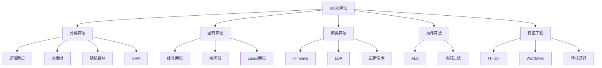

#### 5.1.2 特征工程Pipeline示例
```java title="特征工程Pipeline示例"
public class FeatureEngineeringPipeline {
    public PipelineModel buildFeaturePipeline(SparkSession spark) {
        // 1. 字符串索引化
        StringIndexer stringIndexer = new StringIndexer()
            .setInputCol("category")
            .setOutputCol("categoryIndex")
            .setHandleInvalid("skip");
        
        // 2. 独热编码
        OneHotEncoder oneHotEncoder = new OneHotEncoder()
            .setInputCol("categoryIndex")
            .setOutputCol("categoryOneHot");
        
        // 3. 数值特征标准化
        StandardScaler standardScaler = new StandardScaler()
            .setInputCol("numericalFeatures")
            .setOutputCol("scaledFeatures")
            .setWithStd(true)
            .setWithMean(true);
        
        // 4. 特征向量组装
        VectorAssembler assembler = new VectorAssembler()
            .setInputCols(new String[]{"categoryOneHot", "scaledFeatures", "otherFeatures"})
            .setOutputCol("features");
        
        // 5. 特征选择
        ChiSqSelector featureSelector = new ChiSqSelector()
            .setNumTopFeatures(20)
            .setFeaturesCol("features")
            .setLabelCol("label")
            .setOutputCol("selectedFeatures");
        
        // 6. 构建Pipeline
        Pipeline pipeline = new Pipeline()
            .setStages(new PipelineStage[]{
                stringIndexer, oneHotEncoder, standardScaler, assembler, featureSelector
            });
        
        return pipeline;
    }
}

// 完整的机器学习Pipeline示例
public class CompleteMLPipeline {
    public void buildCompletePipeline(SparkSession spark, Dataset<Row> trainingData) {
        // 1. 特征工程Pipeline
        FeatureEngineeringPipeline featurePipeline = new FeatureEngineeringPipeline();
        PipelineModel featureModel = featurePipeline.buildFeaturePipeline(spark);
        
        // 2. 机器学习算法
        RandomForestClassifier classifier = new RandomForestClassifier()
            .setLabelCol("label")
            .setFeaturesCol("selectedFeatures")
            .setNumTrees(100)
            .setMaxDepth(10)
            .setMaxBins(32)
            .setSeed(42);
        
        // 3. 模型评估器
        MulticlassClassificationEvaluator evaluator = new MulticlassClassificationEvaluator()
            .setLabelCol("label")
            .setPredictionCol("prediction")
            .setMetricName("accuracy");
        
        // 4. 交叉验证
        CrossValidator crossValidator = new CrossValidator()
            .setEstimator(new Pipeline().setStages(new PipelineStage[]{
                featureModel, classifier
            }))
            .setEvaluator(evaluator)
            .setNumFolds(5)
            .setParallelism(2);
        
        // 5. 训练模型
        CrossValidatorModel cvModel = crossValidator.fit(trainingData);
        
        // 6. 模型评估
        Dataset<Row> predictions = cvModel.transform(trainingData);
        double accuracy = evaluator.evaluate(predictions);
        System.out.println("Cross-validation accuracy: " + accuracy);
        
        // 7. 保存模型
        cvModel.save("models/random_forest_model");
        
        // 8. 特征重要性分析
        PipelineModel bestModel = (PipelineModel) cvModel.bestModel();
        RandomForestClassificationModel rfModel = (RandomForestClassificationModel) 
            bestModel.stages()[bestModel.stages().length - 1];
        
        System.out.println("Feature importances:");
        double[] importances = rfModel.featureImportances().toArray();
        for (int i = 0; i < importances.length; i++) {
            System.out.println("Feature " + i + ": " + importances[i]);
        }
    }
}
```

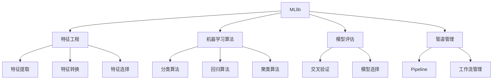

### 5.2 机器学习示例

<div className="code-with-callout">

```java title="机器学习Pipeline示例"
public class MLPipelineExample {
    public void buildMLPipeline(SparkSession spark, Dataset<Row> data) {
        // 1. 特征工程
        StringIndexer indexer = new StringIndexer()
            .setInputCol("category")
            .setOutputCol("categoryIndex");
        
        VectorAssembler assembler = new VectorAssembler()
            .setInputCols(new String[]{"feature1", "feature2", "categoryIndex"})
            .setOutputCol("features");
        
        // 2. 机器学习算法
        RandomForestClassifier classifier = new RandomForestClassifier()
            .setLabelCol("label")
            .setFeaturesCol("features")
            .setNumTrees(10);
        
        // 3. 构建Pipeline
        Pipeline pipeline = new Pipeline()
            .setStages(new PipelineStage[]{indexer, assembler, classifier});
        
        // 4. 训练模型
        PipelineModel model = pipeline.fit(data);
        
        // 5. 预测
        Dataset<Row> predictions = model.transform(data);
        predictions.show();
        
        // 6. 模型评估
        MulticlassClassificationEvaluator evaluator = 
            new MulticlassClassificationEvaluator()
                .setLabelCol("label")
                .setPredictionCol("prediction")
                .setMetricName("accuracy");
        
        double accuracy = evaluator.evaluate(predictions);
        System.out.println("Accuracy: " + accuracy);
    }
}
```

:::info MLlib优势
MLlib提供了分布式机器学习算法，支持大规模数据处理，与Spark生态系统无缝集成。
:::
</div>

## 6. Spark性能优化

### 6.1 内存管理

Spark内存管理是性能优化的关键：

#### 6.1.1 内存管理架构
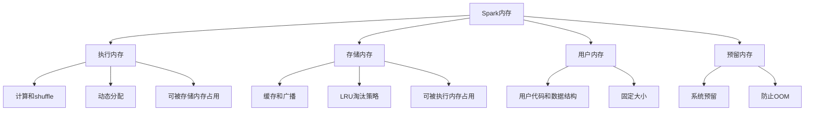

#### 6.1.2 内存调优策略
```java title="内存调优示例"
public class SparkMemoryOptimization {
    public void optimizeMemory(SparkConf conf) {
        // 1. 执行内存配置
        conf.set("spark.executor.memory", "8g");
        conf.set("spark.executor.memoryOverhead", "2g"); // 堆外内存
        conf.set("spark.memory.fraction", "0.8"); // 执行和存储内存占比
        conf.set("spark.memory.storageFraction", "0.3"); // 存储内存占比
        
        // 2. 序列化配置
        conf.set("spark.serializer", "org.apache.spark.serializer.KryoSerializer");
        conf.set("spark.kryo.registrationRequired", "false");
        conf.set("spark.kryo.registrator", "com.example.MyKryoRegistrator");
        
        // 3. 压缩配置
        conf.set("spark.sql.inMemoryColumnarStorage.compressed", "true");
        conf.set("spark.sql.inMemoryColumnarStorage.batchSize", "10000");
        
        // 4. 广播变量配置
        conf.set("spark.sql.autoBroadcastJoinThreshold", "10485760"); // 10MB
        
        // 5. 动态分配配置
        conf.set("spark.dynamicAllocation.enabled", "true");
        conf.set("spark.dynamicAllocation.minExecutors", "2");
        conf.set("spark.dynamicAllocation.maxExecutors", "20");
        conf.set("spark.dynamicAllocation.initialExecutors", "5");
        
        System.out.println("Memory optimization configured");
    }
    
    public void optimizeDataStructures(JavaRDD<String> data) {
        // 1. 使用广播变量减少数据传输
        List<String> stopWords = Arrays.asList("the", "a", "an", "and", "or", "but");
        Broadcast<List<String>> stopWordsBroadcast = data.context().broadcast(stopWords, 
            ClassTag$.MODULE$.apply(List.class));
        
        // 2. 使用累加器进行计数
        Accumulator<Integer> totalWords = data.context().accumulator(0, "TotalWords");
        Accumulator<Integer> filteredWords = data.context().accumulator(0, "FilteredWords");
        
        // 3. 优化RDD操作
        JavaRDD<String> optimizedData = data
            .mapPartitions(iterator -> {
                List<String> batch = new ArrayList<>();
                while (iterator.hasNext()) {
                    String line = iterator.next();
                    if (!stopWordsBroadcast.value().contains(line.toLowerCase())) {
                        batch.add(line);
                        filteredWords.add(1);
                    }
                    totalWords.add(1);
                }
                return batch.iterator();
            })
            .cache(); // 缓存中间结果
        
        // 4. 使用mapPartitions减少函数调用开销
        JavaRDD<String> processedData = optimizedData.mapPartitions(iterator -> {
            List<String> results = new ArrayList<>();
            while (iterator.hasNext()) {
                String word = iterator.next();
                results.add(word.toUpperCase());
            }
            return results.iterator();
        });
        
        System.out.println("Total words: " + totalWords.value());
        System.out.println("Filtered words: " + filteredWords.value());
    }
}

// 自定义Kryo序列化注册器
public class MyKryoRegistrator implements KryoRegistrator {
    @Override
    public void registerClasses(Kryo kryo) {
        // 注册自定义类
        kryo.register(User.class);
        kryo.register(Product.class);
        kryo.register(Order.class);
        
        // 注册集合类
        kryo.register(ArrayList.class);
        kryo.register(HashMap.class);
        kryo.register(HashSet.class);
    }
}
```

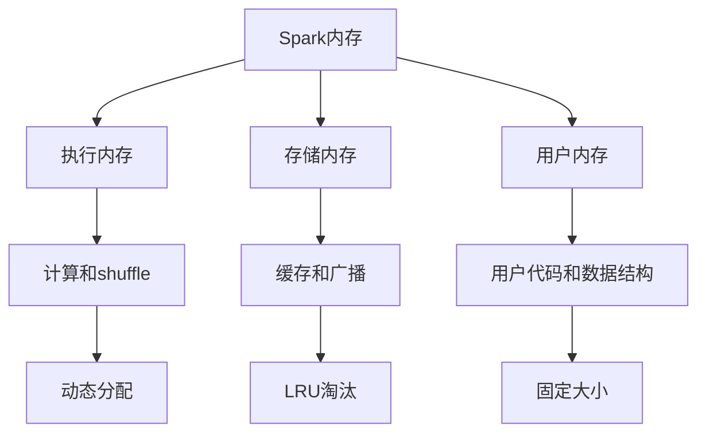

### 6.2 优化策略

<Tabs>
  <TabItem value="memory" label="内存优化" default>
  ```java
  // 1. 合理设置内存配置
  SparkConf conf = new SparkConf()
      .set("spark.executor.memory", "8g")
      .set("spark.storage.memoryFraction", "0.6")
      .set("spark.sql.adaptive.enabled", "true");
  ```
  </TabItem>
  <TabItem value="partition" label="分区优化">
  ```java
  // 2. 合理设置分区数
  JavaRDD<String> data = sc.textFile("input.txt");
  JavaRDD<String> repartitioned = data.repartition(100);
  
  // 3. 使用coalesce减少分区
  JavaRDD<String> coalesced = data.coalesce(50);
  ```
  </TabItem>
  <TabItem value="cache" label="缓存策略">
  ```java
  // 4. 合理使用缓存
  JavaRDD<String> cached = data.cache(); // 内存缓存
  JavaRDD<String> persisted = data.persist(StorageLevel.MEMORY_AND_DISK());
  
  // 5. 广播变量
  Broadcast<List<String>> broadcastVar = sc.broadcast(largeList);
  ```
  </TabItem>
</Tabs>

## 7. Spark部署和配置

### 7.1 部署模式

Spark支持多种部署模式：

#### 7.1.1 Kubernetes部署架构
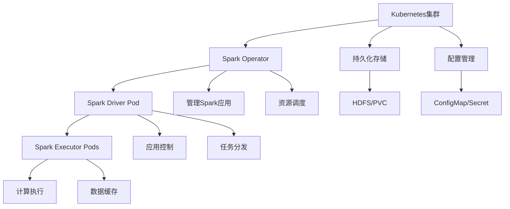

#### 7.1.2 云原生部署配置
```java title="Kubernetes部署配置示例"
public class KubernetesDeployment {
    public void configureKubernetesDeployment(SparkConf conf) {
        // 1. Kubernetes配置
        conf.set("spark.master", "k8s://https://kubernetes.default.svc");
        conf.set("spark.kubernetes.container.image", "spark:3.4.0");
        conf.set("spark.kubernetes.namespace", "spark-jobs");
        
        // 2. 资源配置
        conf.set("spark.executor.instances", "5");
        conf.set("spark.executor.memory", "4g");
        conf.set("spark.executor.cores", "2");
        conf.set("spark.driver.memory", "2g");
        conf.set("spark.driver.cores", "1");
        
        // 3. 存储配置
        conf.set("spark.kubernetes.volumes.persistentVolumeClaim.spark-local-dir-1.options.claimName", "spark-local-dir-1");
        conf.set("spark.kubernetes.volumes.persistentVolumeClaim.spark-local-dir-1.mount.path", "/tmp");
        conf.set("spark.kubernetes.volumes.persistentVolumeClaim.spark-local-dir-1.mount.readOnly", "false");
        
        // 4. 网络配置
        conf.set("spark.kubernetes.driver.serviceAccountName", "spark");
        conf.set("spark.kubernetes.executor.serviceAccountName", "spark");
        
        // 5. 安全配置
        conf.set("spark.kubernetes.authenticate.driver.serviceAccountName", "spark");
        conf.set("spark.kubernetes.authenticate.executor.serviceAccountName", "spark");
        
        System.out.println("Kubernetes deployment configured");
    }
    
    public void configureResourceQuotas() {
        // 配置资源配额
        String resourceQuota = 
            "apiVersion: v1\n" +
            "kind: ResourceQuota\n" +
            "metadata:\n" +
            "  name: spark-quota\n" +
            "  namespace: spark-jobs\n" +
            "spec:\n" +
            "  hard:\n" +
            "    requests.cpu: \"20\"\n" +
            "    requests.memory: 40Gi\n" +
            "    limits.cpu: \"40\"\n" +
            "    limits.memory: 80Gi\n" +
            "    persistentvolumeclaims: \"10\"";
        
        System.out.println("Resource quota configuration:");
        System.out.println(resourceQuota);
    }
}

// 监控和日志配置
public class MonitoringConfiguration {
    public void configureMonitoring(SparkConf conf) {
        // 1. 指标收集
        conf.set("spark.metrics.conf", "/opt/spark/conf/metrics.properties");
        conf.set("spark.sql.streaming.metricsEnabled", "true");
        
        // 2. 日志配置
        conf.set("spark.eventLog.enabled", "true");
        conf.set("spark.eventLog.dir", "hdfs://namenode:9000/spark-events");
        conf.set("spark.history.fs.logDirectory", "hdfs://namenode:9000/spark-events");
        
        // 3. 性能监控
        conf.set("spark.sql.adaptive.enabled", "true");
        conf.set("spark.sql.adaptive.coalescePartitions.enabled", "true");
        conf.set("spark.sql.adaptive.skewJoin.enabled", "true");
        
        // 4. 动态资源分配
        conf.set("spark.dynamicAllocation.enabled", "true");
        conf.set("spark.dynamicAllocation.minExecutors", "2");
        conf.set("spark.dynamicAllocation.maxExecutors", "20");
        conf.set("spark.dynamicAllocation.initialExecutors", "5");
        
        System.out.println("Monitoring and logging configured");
    }
}
```

| 部署模式 | 特点 | 适用场景 |
|----------|------|----------|
| **Local模式** | 单机运行，用于开发和测试 | 本地开发和调试 |
| **Standalone模式** | Spark自带的集群管理器 | 小规模集群 |
| **YARN模式** | 使用Hadoop YARN管理资源 | 生产环境，与Hadoop集成 |
| **Mesos模式** | 使用Apache Mesos管理资源 | 大规模集群，多框架支持 |
| **Kubernetes模式** | 使用K8s管理容器化部署 | 云原生环境 |

### 7.2 配置示例

<div className="code-with-callout">

```java title="Spark配置示例"
public class SparkConfiguration {
    public SparkSession createSparkSession() {
        SparkConf conf = new SparkConf()
            .setAppName("MySparkApp")
            .setMaster("yarn")
            .set("spark.executor.memory", "8g")
            .set("spark.executor.cores", "4")
            .set("spark.driver.memory", "4g")
            .set("spark.sql.adaptive.enabled", "true")
            .set("spark.sql.adaptive.coalescePartitions.enabled", "true")
            .set("spark.sql.adaptive.skewJoin.enabled", "true");
        
        return SparkSession.builder()
            .config(conf)
            .enableHiveSupport()
            .getOrCreate();
    }
}
```

:::info 配置建议
根据集群资源和应用需求合理配置Spark参数，特别是内存和CPU配置，对性能影响很大。
:::
</div>

## 8. 最佳实践

### 8.1 开发最佳实践

<div className="card">
<div className="card__body">
<ol>
<li><strong>合理使用缓存</strong>：对重复使用的RDD进行缓存</li>
<li><strong>避免shuffle</strong>：减少不必要的shuffle操作</li>
<li><strong>使用广播变量</strong>：减少数据传输开销</li>
<li><strong>合理分区</strong>：根据数据量设置合适的分区数</li>
<li><strong>监控性能</strong>：使用Spark UI监控应用性能</li>
</ol>
</div>
</div>

### 8.2 常见问题解决

<Tabs>
  <TabItem value="oom" label="内存溢出" default>
  ```java
  // 解决内存溢出问题
  // 1. 增加执行器内存
  .set("spark.executor.memory", "16g")
  
  // 2. 使用磁盘存储
  .set("spark.storage.memoryFraction", "0.3")
  
  // 3. 减少分区数
  data.repartition(100)
  ```
  </TabItem>
  <TabItem value="slow" label="性能问题">
  ```java
  // 解决性能问题
  // 1. 启用自适应查询执行
  .set("spark.sql.adaptive.enabled", "true")
  
  // 2. 使用动态分区裁剪
  .set("spark.sql.optimizer.dynamicPartitionPruning.enabled", "true")
  
  // 3. 启用代码生成
  .set("spark.sql.codegen.wholeStage", "true")
  ```
  </TabItem>
</Tabs>

## 9. 总结

Apache Spark是一个功能强大、性能优异的大数据处理引擎，它通过内存计算、统一平台和丰富的生态系统，为大数据处理提供了完整的解决方案。

### 学习建议

1. **理解核心概念**：深入理解RDD、DataFrame、Dataset等核心抽象
2. **掌握编程模型**：熟练使用转换操作和动作操作
3. **学习高级特性**：掌握Spark SQL、Streaming、MLlib等组件
4. **性能优化**：学习内存管理、分区策略等优化技术
5. **实践项目**：通过实际项目积累经验

Spark是大数据技术栈中的重要组成部分，掌握它将大大提升大数据处理能力。 