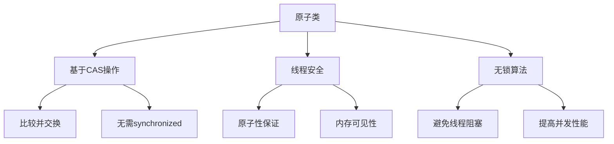
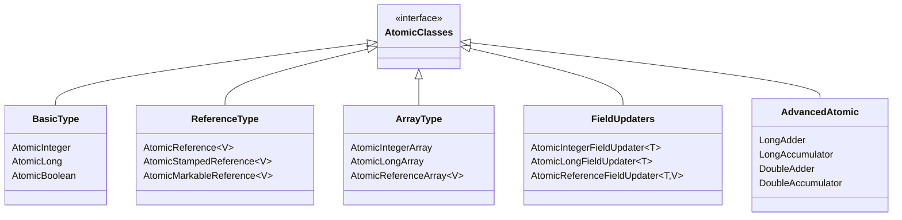
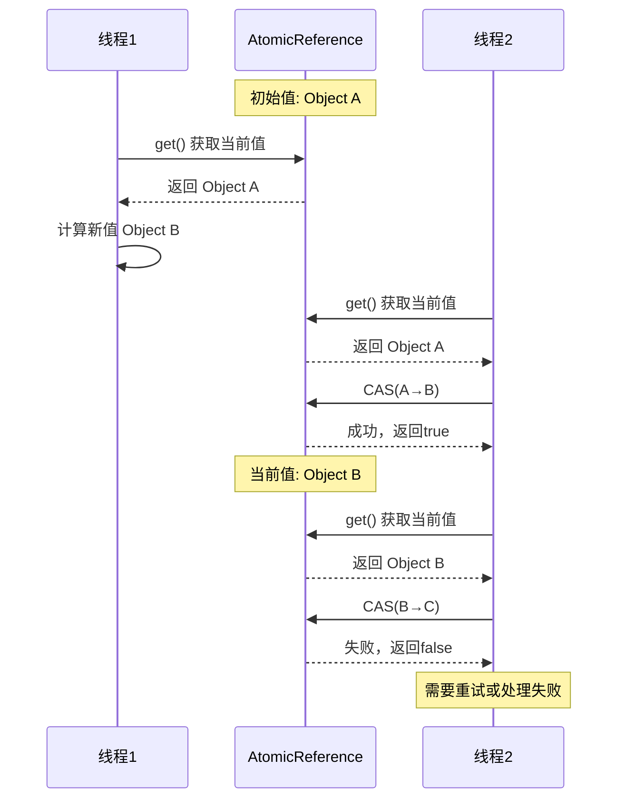
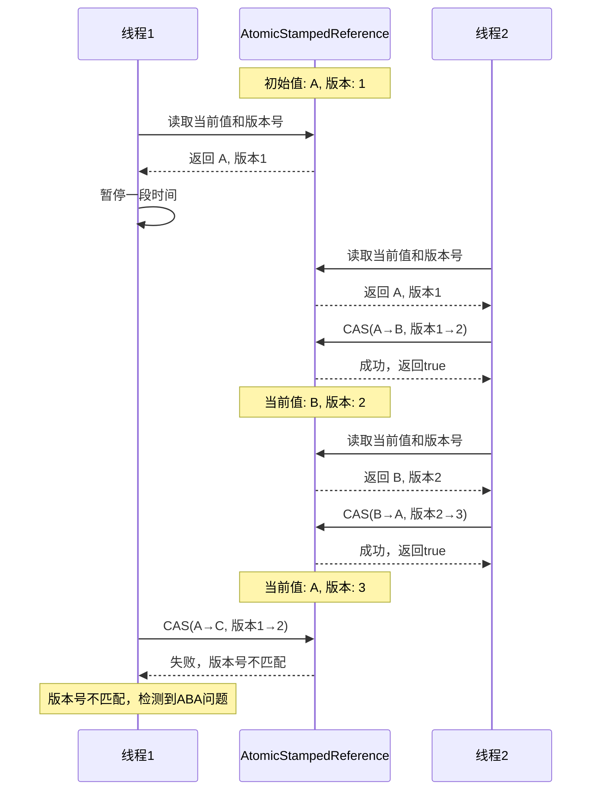

import Tabs from '@theme/Tabs';
import TabItem from '@theme/TabItem';
import TOCInline from '@theme/TOCInline';

# Java 原子类详解

原子类是Java并发包中提供的一组线程安全的工具类，它们基于CAS（Compare-And-Swap）操作实现，无需使用synchronized关键字。本文将详细介绍Java原子类的原理、使用方法和最佳实践。

:::info 本文内容概览
<TOCInline toc={toc} />
:::

:::tip 核心价值
**原子类 = 无锁并发 + 高性能 + 线程安全性 + 简洁API + 内存可见性**
- 🔄 **无锁操作**：基于CAS机制，避免传统锁带来的上下文切换开销
- 🚀 **高性能**：在低竞争环境下性能优于传统同步方式
- 🛡️ **线程安全**：保证操作的原子性，避免并发问题
- 📊 **精细控制**：支持复杂的原子性条件更新操作
- 🔍 **内存可见性**：保证多线程间的数据一致性
:::

## 1. 原子类概述

### 1.1 什么是原子类？



:::tip 核心概念
原子类是基于CAS（Compare-And-Swap）操作实现的线程安全工具类，它们提供原子性的读写操作，无需使用传统的同步机制，具有高性能、无阻塞的特点。
:::

### 1.2 CAS机制原理

<div className="card">
<div className="card__header">
<h4>CAS (Compare-And-Swap) 工作原理</h4>
</div>
<div className="card__body">

CAS是一种无锁算法，其核心是一条CPU原子指令，执行过程如下：

1. **比较(Compare)**：读取内存中当前值并与期望值比较
2. **交换(Swap)**：如果当前值等于期望值，则将值更新为新值；否则不更新
3. **返回结果**：返回比较结果，表明操作是否成功

CAS操作包含三个参数：
- **内存位置V (Variable)**：要更新的变量
- **期望值A (Expected)**：预期当前值
- **新值B (New)**：要设置的新值

CAS操作保证了原子性：要么完全成功，要么完全失败，不会出现中间状态。

</div>
</div>

<Tabs>
  <TabItem value="cas_code" label="CAS模拟实现" default>
  ```java
  public boolean compareAndSet(AtomicInteger value, int expect, int update) {
      // 这个方法是一个模拟，实际上CAS是由CPU原子指令实现的
      // 1. 读取当前值
      int current = value.get();
      
      // 2. 比较当前值与期望值
      if (current == expect) {
          // 3. 如果相等，则更新为新值
          value.set(update);
          return true;
      } else {
          // 4. 如果不相等，则更新失败
          return false;
      }
  }
  
  // 使用CAS实现自旋锁
  public void incrementUsingCAS(AtomicInteger value) {
      int oldValue;
      do {
          // 读取当前值
          oldValue = value.get();
          // 尝试CAS操作，直到成功
      } while (!value.compareAndSet(oldValue, oldValue + 1));
  }
  ```
  </TabItem>
  <TabItem value="cas_diagram" label="CAS执行流程">
  ```mermaid
  sequenceDiagram
      participant 线程
      participant CPU
      participant 内存
      
      线程->>内存: 1. 读取当前值(V)
      内存-->>线程: 返回当前值
      线程->>线程: 2. 计算新值
      线程->>CPU: 3. 发出CAS指令(V, A, B)
      
      alt 当前值等于期望值
          CPU->>内存: 4a. 更新值为新值B
          内存-->>CPU: 更新成功
          CPU-->>线程: 返回成功(true)
      else 当前值不等于期望值
          CPU->>内存: 4b. 不更新
          内存-->>CPU: 不变
          CPU-->>线程: 返回失败(false)
      end
      
      Note over 线程: 5. 根据CAS结果<br/>决定后续操作
  ```
  </TabItem>
  <TabItem value="cas_benefits" label="CAS优势">
  <div className="card">
  <div className="card__body">
  <ul>
  <li><strong>避免锁开销</strong>：不需要获取和释放锁，减少线程上下文切换</li>
  <li><strong>高性能</strong>：在低竞争环境下，性能显著优于传统锁机制</li>
  <li><strong>无阻塞</strong>：线程可以立即知道更新是否成功，而不是被阻塞等待</li>
  <li><strong>避免死锁</strong>：不使用锁，因此不会出现死锁问题</li>
  <li><strong>适合读多写少</strong>：在读操作远多于写操作的场景下特别高效</li>
  </ul>
  </div>
  </div>
  </TabItem>
  <TabItem value="cas_limitations" label="CAS局限性">
  <div className="card">
  <div className="card__body">
  <ol>
  <li><strong>ABA问题</strong>：值从A变为B又变回A，CAS无法检测到这种变化</li>
  <li><strong>只能保证单个变量操作的原子性</strong>：不支持多个变量的原子性更新</li>
  <li><strong>自旋消耗CPU</strong>：CAS失败时通常会自旋重试，可能消耗较多CPU资源</li>
  <li><strong>高竞争下性能下降</strong>：当多个线程频繁争用同一变量时，CAS失败率高</li>
  </ol>
  </div>
  </div>
  </TabItem>
</Tabs>

### 1.3 原子类分类

<div className="card">
<div className="card__header">
<h4>Java原子类家族</h4>
</div>
<div className="card__body">



</div>
</div>

<Tabs>
  <TabItem value="basic" label="基本类型原子类" default>
  <div className="card">
  <div className="card__body">
  
  **包含类：**
  - **AtomicInteger**：原子整型，提供对int值的原子操作
  - **AtomicLong**：原子长整型，提供对long值的原子操作
  - **AtomicBoolean**：原子布尔型，提供对boolean值的原子操作
  
  **常用场景：**
  - 计数器
  - 生成序列号
  - 标志位控制
  - 状态切换
  
  </div>
  </div>
  </TabItem>
  <TabItem value="reference" label="引用类型原子类">
  <div className="card">
  <div className="card__body">
  
  **包含类：**
  - **AtomicReference** `<V>`：原子更新一个对象引用
  - **AtomicStampedReference** `<V>`：带有版本号的原子引用，解决ABA问题
  - **AtomicMarkableReference** `<V>`：带有标记的原子引用，用于标记引用是否被更新过
  
  **常用场景：**
  - 原子更新对象
  - 解决CAS中的ABA问题
  - 状态标记和版本控制
  
  </div>
  </div>
  </TabItem>
  <TabItem value="array" label="数组类型原子类">
  <div className="card">
  <div className="card__body">
  
  **包含类：**
  - **AtomicIntegerArray**：原子整型数组，对int[]数组元素提供原子操作
  - **AtomicLongArray**：原子长整型数组，对long[]数组元素提供原子操作
  - **AtomicReferenceArray**：原子引用数组，对对象数组元素提供原子操作
  
  **常用场景：**
  - 并发计数器数组
  - 状态数组
  - 高并发环境下的数组更新
  
  </div>
  </div>
  </TabItem>
  <TabItem value="updater" label="字段更新器">
  <div className="card">
  <div className="card__body">
  
  **包含类：**
  - **AtomicIntegerFieldUpdater**：原子更新对象中int类型的字段
  - **AtomicLongFieldUpdater**：原子更新对象中long类型的字段
  - **AtomicReferenceFieldUpdater**：原子更新对象中引用类型的字段
  
  **常用场景：**
  - 避免创建额外的原子类实例
  - 为已有类添加原子性操作
  - 减少内存占用
  
  **限制条件：**
  - 字段必须是volatile修饰
  - 字段必须是对更新器可访问的
  - 类不能被加载器隐藏
  
  </div>
  </div>
  </TabItem>
</Tabs>

## 2. 基本类型原子类

### 2.1 AtomicInteger

<div className="card">
<div className="card__header">
<h4>AtomicInteger核心API</h4>
</div>
<div className="card__body">

| 方法 | 描述 | 等价同步代码 |
|------|------|-------------|
| **get()** | 获取当前值 | `return value;` |
| **set(int)** | 设置新值 | `value = newValue;` |
| **getAndSet(int)** | 设置新值并返回旧值 | `int old = value; value = newValue; return old;` |
| **compareAndSet(int, int)** | 比较并设置 | `if(value==expect){value=update; return true;} else return false;` |
| **getAndIncrement()** | 递增并返回旧值 | `int old = value; value++; return old;` |
| **getAndDecrement()** | 递减并返回旧值 | `int old = value; value--; return old;` |
| **incrementAndGet()** | 递增并返回新值 | `return ++value;` |
| **decrementAndGet()** | 递减并返回新值 | `return --value;` |
| **getAndAdd(int)** | 加上指定值并返回旧值 | `int old = value; value += delta; return old;` |
| **addAndGet(int)** | 加上指定值并返回新值 | `value += delta; return value;` |
| **updateAndGet(IntUnaryOp)** | 应用函数并返回新值 | `value = updateFunction(value); return value;` |
| **getAndUpdate(IntUnaryOp)** | 应用函数并返回旧值 | `int old = value; value = updateFunction(value); return old;` |

</div>
</div>

<Tabs>
  <TabItem value="basic_ops" label="基本操作" default>
  ```java
  import java.util.concurrent.atomic.AtomicInteger;
  
  // 创建AtomicInteger
  AtomicInteger counter = new AtomicInteger(); // 默认值为0
  AtomicInteger initializedCounter = new AtomicInteger(100); // 初始值为100
  
  // 获取当前值
  int current = counter.get(); // 0
  
  // 设置值
  counter.set(50);
  System.out.println(counter.get()); // 50
  
  // 原子递增/递减
  int prev = counter.getAndIncrement(); // 返回50，counter变为51
  int next = counter.incrementAndGet(); // counter变为52，返回52
  
  int prev2 = counter.getAndDecrement(); // 返回52，counter变为51
  int next2 = counter.decrementAndGet(); // counter变为50，返回50
  
  // 原子加法/减法
  int beforeAdd = counter.getAndAdd(15); // 返回50，counter变为65
  int afterAdd = counter.addAndGet(10); // counter变为75，返回75
  
  // 比较并设置
  boolean success = counter.compareAndSet(75, 100); // 如果当前值是75，则设为100
  System.out.println(success + ", 当前值: " + counter.get()); // true, 当前值: 100
  ```
  </TabItem>
  <TabItem value="advanced_ops" label="高级操作">
  ```java
  import java.util.concurrent.atomic.AtomicInteger;
  import java.util.function.IntUnaryOperator;
  
  AtomicInteger value = new AtomicInteger(10);
  
  // 使用函数式接口更新
  // 相当于：value = value * 2
  int doubled = value.updateAndGet(x -> x * 2); 
  System.out.println(doubled); // 20
  
  // 相当于：oldValue = value; value = value + 5; return oldValue;
  int oldValue = value.getAndUpdate(x -> x + 5); 
  System.out.println("旧值: " + oldValue + ", 新值: " + value.get()); // 旧值: 20, 新值: 25
  
  // 累积操作
  // 相当于：value = value + 3 * 2
  int result = value.accumulateAndGet(3, (x, y) -> x + y * 2);
  System.out.println(result); // 31 (25 + 3*2)
  
  // 自定义函数
  IntUnaryOperator powerOfTwo = x -> x * x;
  int squared = value.updateAndGet(powerOfTwo);
  System.out.println(squared); // 961 (31^2)
  ```
  </TabItem>
  <TabItem value="counter_example" label="计数器示例">
  ```java
  import java.util.concurrent.atomic.AtomicInteger;
  import java.util.concurrent.ExecutorService;
  import java.util.concurrent.Executors;
  import java.util.concurrent.TimeUnit;
  
  public class AtomicCounter {
      private final AtomicInteger count = new AtomicInteger(0);
      
      // 线程安全的增加方法
      public void increment() {
          count.incrementAndGet();
      }
      
      // 线程安全的获取方法
      public int getCount() {
          return count.get();
      }
      
      public static void main(String[] args) throws InterruptedException {
          final AtomicCounter counter = new AtomicCounter();
          ExecutorService executor = Executors.newFixedThreadPool(10);
          
          // 创建100个任务，每个任务增加计数器1000次
          for (int i = 0; i < 100; i++) {
              executor.submit(() -> {
                  for (int j = 0; j < 1000; j++) {
                      counter.increment();
                  }
              });
          }
          
          // 关闭线程池并等待所有任务完成
          executor.shutdown();
          executor.awaitTermination(10, TimeUnit.SECONDS);
          
          // 输出最终计数，应该为100,000
          System.out.println("Final count: " + counter.getCount());
      }
  }
  ```
  </TabItem>
  <TabItem value="cas_spin" label="自旋CAS">
  ```java
  import java.util.concurrent.atomic.AtomicInteger;
  
  public class CASExample {
      private final AtomicInteger value = new AtomicInteger(0);
      
      // 使用CAS手动实现自旋递增
      public void incrementWithCAS() {
          int oldValue;
          int newValue;
          do {
              // 读取当前值
              oldValue = value.get();
              newValue = oldValue + 1;
              // 尝试CAS操作，失败则重试
          } while (!value.compareAndSet(oldValue, newValue));
      }
      
      // 条件更新 - 只有当值为偶数时才递增
      public boolean incrementIfEven() {
          while (true) {
              int current = value.get();
              if (current % 2 != 0) {
                  return false; // 不是偶数，放弃操作
              }
              
              int next = current + 1;
              if (value.compareAndSet(current, next)) {
                  return true; // CAS成功
              }
              // CAS失败，重试
          }
      }
  }
  ```
  </TabItem>
</Tabs>

### 2.2 AtomicLong

<div className="card">
<div className="card__header">
<h4>AtomicLong特性</h4>
</div>
<div className="card__body">

**核心特点：**
- 提供对long类型变量的原子操作
- 64位原子操作，解决在32位系统上long/double操作非原子性问题
- JDK 8后内部优化使用了CPU的CAS指令
- 高并发场景可考虑使用LongAdder替代以提高性能

**应用场景：**
- 全局序列号生成
- 大数量计数
- 高精度统计
- ID生成器

</div>
</div>

<Tabs>
  <TabItem value="basic_long" label="基本用法" default>
  ```java
  import java.util.concurrent.atomic.AtomicLong;
  
  // 创建AtomicLong
  AtomicLong counter = new AtomicLong(0); // 初始值为0
  AtomicLong idGenerator = new AtomicLong(1000); // 初始值为1000
  
  // 基本操作
  long currentValue = counter.get(); // 获取当前值
  counter.set(100); // 设置新值
  
  // 原子增减
  long oldValue = counter.getAndIncrement(); // 返回0, counter变为1
  long newValue = counter.incrementAndGet(); // counter变为2, 返回2
  
  // 原子更新
  oldValue = counter.getAndAdd(10); // 返回2, counter变为12
  newValue = counter.addAndGet(8);  // counter变为20, 返回20
  
  // CAS操作
  boolean updated = counter.compareAndSet(20, 30); // true, counter变为30
  ```
  </TabItem>
  <TabItem value="id_generator" label="ID生成器">
  ```java
  import java.util.concurrent.atomic.AtomicLong;
  
  /**
   * 简单的分布式ID生成器
   * - 支持多线程安全地生成唯一ID
   * - 可指定起始值和步长
   */
  public class AtomicIdGenerator {
      private final AtomicLong sequenceNumber;
      private final String nodePrefix;
      private final int step;
      
      /**
       * 创建ID生成器
       * @param nodeId 节点ID (0-99)
       * @param startValue 起始值
       * @param step 步长
       */
      public AtomicIdGenerator(int nodeId, long startValue, int step) {
          // 保证节点ID为2位数字
          this.nodePrefix = String.format("%02d", nodeId % 100);
          this.sequenceNumber = new AtomicLong(startValue);
          this.step = step;
      }
      
      /**
       * 生成下一个ID
       * 格式: 节点前缀 + 当前时间戳 + 序列号
       */
      public String nextId() {
          long timestamp = System.currentTimeMillis();
          long sequence = sequenceNumber.getAndAdd(step);
          return nodePrefix + timestamp + sequence;
      }
      
      /**
       * 批量生成ID
       */
      public String[] batchIds(int batchSize) {
          String[] ids = new String[batchSize];
          for (int i = 0; i < batchSize; i++) {
              ids[i] = nextId();
          }
          return ids;
      }
      
      /**
       * 获取当前序列号
       */
      public long getCurrentSequence() {
          return sequenceNumber.get();
      }
      
      /**
       * 重置序列号
       */
      public void reset(long newValue) {
          sequenceNumber.set(newValue);
      }
  }
  
  // 使用示例
  AtomicIdGenerator idGen = new AtomicIdGenerator(1, 1000, 1);
  String id1 = idGen.nextId();
  String id2 = idGen.nextId();
  System.out.println("ID1: " + id1);
  System.out.println("ID2: " + id2);
  ```
  </TabItem>
  <TabItem value="perf_monitor" label="性能监控">
  ```java
  import java.util.concurrent.atomic.AtomicLong;
  import java.util.concurrent.TimeUnit;
  
  /**
   * 高性能统计监控类
   */
  public class PerformanceMonitor {
      private final AtomicLong requestCount = new AtomicLong(0);
      private final AtomicLong errorCount = new AtomicLong(0);
      private final AtomicLong totalResponseTime = new AtomicLong(0);
      private final AtomicLong minResponseTime = new AtomicLong(Long.MAX_VALUE);
      private final AtomicLong maxResponseTime = new AtomicLong(0);
      private final AtomicLong startTime = new AtomicLong(System.currentTimeMillis());
      
      /**
       * 记录请求
       */
      public void recordRequest(long responseTimeMs, boolean isSuccess) {
          requestCount.incrementAndGet();
          totalResponseTime.addAndGet(responseTimeMs);
          
          // 更新最小响应时间 (CAS自旋方式)
          while (true) {
              long currentMin = minResponseTime.get();
              if (responseTimeMs >= currentMin) break; // 当前值不是最小值
              if (minResponseTime.compareAndSet(currentMin, responseTimeMs)) break;
          }
          
          // 更新最大响应时间
          while (true) {
              long currentMax = maxResponseTime.get();
              if (responseTimeMs <= currentMax) break; // 当前值不是最大值
              if (maxResponseTime.compareAndSet(currentMax, responseTimeMs)) break;
          }
          
          if (!isSuccess) {
              errorCount.incrementAndGet();
          }
      }
      
      /**
       * 获取监控报告
       */
      public MonitorReport getReport() {
          long requests = requestCount.get();
          long errors = errorCount.get();
          long totalTime = totalResponseTime.get();
          long minTime = minResponseTime.get();
          long maxTime = maxResponseTime.get();
          long uptime = System.currentTimeMillis() - startTime.get();
          
          return new MonitorReport(
              requests,
              errors,
              requests > 0 ? totalTime / requests : 0,
              minTime == Long.MAX_VALUE ? 0 : minTime,
              maxTime,
              uptime
          );
      }
      
      /**
       * 重置统计数据
       */
      public void reset() {
          requestCount.set(0);
          errorCount.set(0);
          totalResponseTime.set(0);
          minResponseTime.set(Long.MAX_VALUE);
          maxResponseTime.set(0);
          startTime.set(System.currentTimeMillis());
      }
      
      public static class MonitorReport {
          public final long totalRequests;
          public final long errorRequests;
          public final long avgResponseTime;
          public final long minResponseTime;
          public final long maxResponseTime;
          public final long uptime;
          
          public MonitorReport(
                  long totalRequests, long errorRequests, 
                  long avgResponseTime, long minResponseTime, 
                  long maxResponseTime, long uptime) {
              this.totalRequests = totalRequests;
              this.errorRequests = errorRequests;
              this.avgResponseTime = avgResponseTime;
              this.minResponseTime = minResponseTime;
              this.maxResponseTime = maxResponseTime;
              this.uptime = uptime;
          }
          
          @Override
          public String toString() {
              return String.format(
                  "请求总数: %d, 错误: %d (%.2f%%), 平均响应时间: %dms, " +
                  "最小: %dms, 最大: %dms, 运行时间: %ds",
                  totalRequests,
                  errorRequests,
                  totalRequests > 0 ? (errorRequests * 100.0 / totalRequests) : 0.0,
                  avgResponseTime,
                  minResponseTime,
                  maxResponseTime,
                  TimeUnit.MILLISECONDS.toSeconds(uptime)
              );
          }
      }
  }
  ```
  </TabItem>
</Tabs>

### 2.3 AtomicBoolean

<div className="card">
<div className="card__header">
<h4>AtomicBoolean特性与应用</h4>
</div>
<div className="card__body">

**主要特点：**
- 原子性地更新boolean类型值
- 适合状态标志和开关控制场景
- 线程安全的初始化标记
- 原子开关操作

**常用方法：**
- `get()`: 获取当前值
- `set(boolean)`: 设置新值
- `getAndSet(boolean)`: 设置新值并返回旧值
- `compareAndSet(boolean, boolean)`: 比较并设置

**典型应用场景：**
- 一次性操作标志
- 服务开关控制
- 线程安全的初始化
- 状态标记

</div>
</div>

<Tabs>
  <TabItem value="basic_boolean" label="基本使用" default>
  ```java
  import java.util.concurrent.atomic.AtomicBoolean;
  
  // 创建AtomicBoolean，默认false
  AtomicBoolean flag = new AtomicBoolean();
  
  // 创建带初始值的AtomicBoolean
  AtomicBoolean enabledFlag = new AtomicBoolean(true);
  
  // 获取当前值
  boolean isEnabled = enabledFlag.get(); // true
  
  // 设置新值
  enabledFlag.set(false);
  
  // 原子地获取旧值并设置新值
  boolean oldValue = enabledFlag.getAndSet(true);
  System.out.println("旧值: " + oldValue + ", 新值: " + enabledFlag.get());
  // 输出: 旧值: false, 新值: true
  
  // CAS操作
  boolean wasUpdated = enabledFlag.compareAndSet(true, false);
  System.out.println("更新成功: " + wasUpdated + ", 当前值: " + enabledFlag.get());
  // 输出: 更新成功: true, 当前值: false
  ```
  </TabItem>
  <TabItem value="onetime_action" label="一次性操作">
  ```java
  import java.util.concurrent.atomic.AtomicBoolean;
  import java.util.concurrent.ExecutorService;
  import java.util.concurrent.Executors;
  
  /**
   * 使用AtomicBoolean确保某操作只执行一次
   */
  public class OneTimeAction {
      private final AtomicBoolean initialized = new AtomicBoolean(false);
      
      /**
       * 确保只初始化一次
       */
      public void initialize() {
          // compareAndSet方法原子性地检查和更新值，确保只有一个线程可以执行初始化
          if (initialized.compareAndSet(false, true)) {
              try {
                  System.out.println("执行初始化操作 - 由线程 " + 
                      Thread.currentThread().getName());
                  
                  // 模拟耗时的初始化操作
                  Thread.sleep(1000);
                  
                  System.out.println("初始化完成");
              } catch (InterruptedException e) {
                  // 如果初始化失败，重置标志
                  initialized.set(false);
                  Thread.currentThread().interrupt();
              }
          } else {
              System.out.println("已初始化 - 线程 " + 
                  Thread.currentThread().getName() + " 跳过");
          }
      }
      
      /**
       * 检查是否已初始化
       */
      public boolean isInitialized() {
          return initialized.get();
      }
      
      /**
       * 重置初始化状态
       */
      public void reset() {
          initialized.set(false);
      }
      
      public static void main(String[] args) {
          final OneTimeAction action = new OneTimeAction();
          ExecutorService executor = Executors.newFixedThreadPool(5);
          
          // 多个线程同时尝试初始化
          for (int i = 0; i < 10; i++) {
              executor.submit(action::initialize);
          }
          
          executor.shutdown();
      }
  }
  ```
  </TabItem>
  <TabItem value="circuit_breaker" label="熔断器实现">
  ```java
  import java.util.concurrent.atomic.AtomicBoolean;
  import java.util.concurrent.atomic.AtomicInteger;
  import java.util.concurrent.atomic.AtomicLong;
  
  /**
   * 简单的熔断器实现
   */
  public class CircuitBreaker {
      private final AtomicBoolean open = new AtomicBoolean(false);
      private final AtomicInteger failureCount = new AtomicInteger(0);
      private final AtomicLong lastFailureTime = new AtomicLong(0);
      
      private final int failureThreshold;
      private final long resetTimeoutMs;
      
      public CircuitBreaker(int failureThreshold, long resetTimeoutMs) {
          this.failureThreshold = failureThreshold;
          this.resetTimeoutMs = resetTimeoutMs;
      }
      
      /**
       * 检查熔断器是否打开
       */
      public boolean isOpen() {
          // 已经打开的情况下，检查是否可以尝试关闭
          if (open.get()) {
              // 超过重置时间后允许尝试恢复
              long currentTime = System.currentTimeMillis();
              if (currentTime - lastFailureTime.get() > resetTimeoutMs) {
                  // 重置为关闭状态(半开状态)
                  open.compareAndSet(true, false);
                  return false;
              }
              return true;
          }
          return false;
      }
      
      /**
       * 记录成功
       */
      public void recordSuccess() {
          // 成功后重置失败计数
          failureCount.set(0);
          // 如果处于半开状态，确保关闭熔断器
          open.set(false);
      }
      
      /**
       * 记录失败
       */
      public void recordFailure() {
          // 记录最后失败时间
          lastFailureTime.set(System.currentTimeMillis());
          
          // 增加失败计数
          int currentFailures = failureCount.incrementAndGet();
          
          // 如果达到阈值，打开熔断器
          if (currentFailures >= failureThreshold) {
              open.set(true);
          }
      }
      
      /**
       * 执行受保护的代码
       */
      public <T> T execute(Supplier<T> supplier, T fallback) {
          if (isOpen()) {
              // 熔断器打开，直接返回降级结果
              return fallback;
          }
          
          try {
              // 尝试执行操作
              T result = supplier.get();
              recordSuccess();
              return result;
          } catch (Exception e) {
              recordFailure();
              return fallback;
          }
      }
      
      // 简单的Supplier接口
      public interface Supplier<T> {
          T get() throws Exception;
      }
  }
  ```
  </TabItem>
</Tabs>

## 3. 引用类型原子类

<div className="card">
<div className="card__header">
<h4>引用类型原子类概述</h4>
</div>
<div className="card__body">

引用类型原子类用于原子性地更新对象引用，主要包括以下几个类：

- **AtomicReference**：原子更新一个对象引用
- **AtomicStampedReference**：带有版本号的原子引用，解决ABA问题
- **AtomicMarkableReference**：带有标记的原子引用，用于标记引用是否被更新过

这些类使得在不使用锁的情况下，安全地更新对象引用成为可能，特别适合于实现无锁数据结构和算法。

</div>
</div>

### 3.1 AtomicReference



<Tabs>
  <TabItem value="atomic_ref_basic" label="基本用法" default>
  ```java
  import java.util.concurrent.atomic.AtomicReference;
  
  // 创建带初始值的AtomicReference
  AtomicReference<String> atomicString = new AtomicReference<>("初始值");
  
  // 创建空的AtomicReference
  AtomicReference<User> atomicUser = new AtomicReference<>();
  
  // 获取引用
  String value = atomicString.get();
  System.out.println("当前值: " + value); // 当前值: 初始值
  
  // 设置新值
  atomicString.set("新值");
  System.out.println("更新后: " + atomicString.get()); // 更新后: 新值
  
  // 原子方式获取并设置
  String oldValue = atomicString.getAndSet("更新的值");
  System.out.println("旧值: " + oldValue + ", 当前值: " + atomicString.get());
  // 输出: 旧值: 新值, 当前值: 更新的值
  
  // 比较并设置
  boolean wasUpdated = atomicString.compareAndSet("更新的值", "最终值");
  System.out.println("更新是否成功: " + wasUpdated + ", 当前值: " + atomicString.get());
  // 输出: 更新是否成功: true, 当前值: 最终值
  
  // 使用函数更新
  atomicString.updateAndGet(current -> current + " - 附加内容");
  System.out.println("函数更新后: " + atomicString.get());
  // 输出: 函数更新后: 最终值 - 附加内容
  ```
  </TabItem>
  <TabItem value="atomic_ref_object" label="对象引用">
  ```java
  import java.util.concurrent.atomic.AtomicReference;
  
  class User {
      private final String name;
      private final int age;
      
      public User(String name, int age) {
          this.name = name;
          this.age = age;
      }
      
      public User withAge(int newAge) {
          return new User(this.name, newAge);
      }
      
      @Override
      public String toString() {
          return "User{name='" + name + "', age=" + age + "}";
      }
  }
  
  // 创建一个用户的原子引用
  AtomicReference<User> userRef = new AtomicReference<>(new User("张三", 20));
  
  // 打印当前用户
  System.out.println("当前用户: " + userRef.get());
  
  // 原子地更新用户年龄 - 使用CAS操作
  User user;
  User newUser;
  do {
      user = userRef.get();
      newUser = user.withAge(user.age + 1);
  } while (!userRef.compareAndSet(user, newUser));
  
  System.out.println("更新后用户: " + userRef.get());
  
  // 使用函数式更新
  userRef.updateAndGet(u -> u.withAge(u.age + 5));
  System.out.println("函数更新后: " + userRef.get());
  ```
  </TabItem>
  <TabItem value="atomic_ref_state" label="状态管理">
  ```java
  import java.util.concurrent.atomic.AtomicReference;
  import java.util.concurrent.TimeUnit;
  import java.util.concurrent.ExecutorService;
  import java.util.concurrent.Executors;
  
  /**
   * 使用AtomicReference实现状态机
   */
  public class StateMachine {
      // 定义可能的状态
      public enum State {
          INITIALIZING, RUNNING, PAUSED, SHUTTING_DOWN, TERMINATED
      }
      
      private final AtomicReference<State> state = 
          new AtomicReference<>(State.INITIALIZING);
      
      /**
       * 尝试转换状态
       * @param from 期望的当前状态
       * @param to 目标状态
       * @return 是否转换成功
       */
      public boolean transitionState(State from, State to) {
          return state.compareAndSet(from, to);
      }
      
      /**
       * 获取当前状态
       */
      public State getState() {
          return state.get();
      }
      
      public static void main(String[] args) throws InterruptedException {
          StateMachine machine = new StateMachine();
          ExecutorService executor = Executors.newFixedThreadPool(2);
          
          // 任务1: 初始化后运行
          executor.submit(() -> {
              if (machine.transitionState(State.INITIALIZING, State.RUNNING)) {
                  System.out.println("成功启动!");
              } else {
                  System.out.println("启动失败!");
              }
          });
          
          // 给任务1一点时间执行
          TimeUnit.MILLISECONDS.sleep(100);
          
          // 任务2: 尝试暂停
          executor.submit(() -> {
              if (machine.transitionState(State.RUNNING, State.PAUSED)) {
                  System.out.println("成功暂停!");
              } else {
                  System.out.println("暂停失败!");
              }
          });
          
          executor.shutdown();
      }
  }
  ```
  </TabItem>
</Tabs>

### 3.2 AtomicStampedReference

<div className="card">
<div className="card__header">
<h4>ABA 问题与解决方案</h4>
</div>
<div className="card__body">

**ABA问题是指：**
- 线程1读取共享变量的值为A
- 线程2将共享变量的值修改为B，然后又修改回A
- 线程1进行CAS操作，发现共享变量的值仍为A，认为没有被修改过，但实际上已经经历了 A→B→A 的变化

**AtomicStampedReference通过添加版本号解决ABA问题：**
- 每次更新引用的同时更新版本号
- CAS操作同时检查引用和版本号
- 即使引用值相同，若版本号不同，CAS操作也会失败

</div>
</div>



<Tabs>
  <TabItem value="atomic_stamped_basic" label="基本用法" default>
  ```java
  import java.util.concurrent.atomic.AtomicStampedReference;
  
  // 创建AtomicStampedReference，初始引用为"A"，初始版本号为1
  AtomicStampedReference<String> asr = 
      new AtomicStampedReference<>("A", 1);
  
  // 读取当前引用和版本号
  int[] stampHolder = new int[1];
  String value = asr.get(stampHolder);
  int stamp = stampHolder[0];
  
  System.out.println("初始值: " + value + ", 版本号: " + stamp);
  
  // 更新引用和版本号
  boolean success = asr.compareAndSet("A", "B", stamp, stamp + 1);
  System.out.println("更新结果: " + success);
  
  // 再次获取新的引用和版本号
  value = asr.get(stampHolder);
  stamp = stampHolder[0];
  System.out.println("更新后值: " + value + ", 版本号: " + stamp);
  
  // 尝试使用过期版本号更新，将会失败
  boolean outdatedSuccess = asr.compareAndSet("B", "C", 1, 2);
  System.out.println("使用旧版本号更新结果: " + outdatedSuccess);
  
  // 使用当前版本号更新，将会成功
  boolean currentSuccess = asr.compareAndSet("B", "C", stamp, stamp + 1);
  System.out.println("使用当前版本号更新结果: " + currentSuccess);
  System.out.println("最终值: " + asr.getReference() + ", 版本号: " + asr.getStamp());
  ```
  </TabItem>
  <TabItem value="aba_solution" label="ABA问题解决示例">
  ```java
  import java.util.concurrent.atomic.AtomicStampedReference;
  import java.util.concurrent.TimeUnit;
  
  /**
   * 使用AtomicStampedReference解决ABA问题的示例
   */
  public class ABAProblemSolution {
      private static final AtomicStampedReference<Integer> atomicStampedRef = 
          new AtomicStampedReference<>(100, 0);
  
      public static void main(String[] args) throws InterruptedException {
          System.out.println("===== ABA问题解决示例 =====");
          
          // 获取初始的版本号
          int initialStamp = atomicStampedRef.getStamp();
          Integer initialRef = atomicStampedRef.getReference();
          System.out.println("初始值: " + initialRef + ", 初始版本: " + initialStamp);
          
          // 线程1 - 模拟解决ABA问题
          Thread t1 = new Thread(() -> {
              System.out.println("线程1：读取初始值和版本号");
              int stamp = atomicStampedRef.getStamp();
              Integer ref = atomicStampedRef.getReference();
              
              try {
                  // 线程1暂停1秒，让线程2完成ABA操作
                  TimeUnit.SECONDS.sleep(1);
              } catch (InterruptedException e) {
                  Thread.currentThread().interrupt();
              }
              
              System.out.println("线程1：尝试更新 100 -> 101, 版本:" + stamp + " -> " + (stamp + 1));
              boolean success = atomicStampedRef.compareAndSet(
                  100, 101, stamp, stamp + 1);
              
              System.out.println("线程1：CAS " + (success ? "成功" : "失败") + 
                  ", 当前值: " + atomicStampedRef.getReference() + 
                  ", 当前版本: " + atomicStampedRef.getStamp());
          });
          
          // 线程2 - 模拟造成ABA问题的操作
          Thread t2 = new Thread(() -> {
              try {
                  // 让线程1先运行并读取值
                  TimeUnit.MILLISECONDS.sleep(100);
              } catch (InterruptedException e) {
                  Thread.currentThread().interrupt();
              }
              
              int stamp = atomicStampedRef.getStamp();
              System.out.println("线程2：当前版本 " + stamp);
              
              // 100 -> 200 -> 100，制造ABA
              System.out.println("线程2：100 -> 200");
              atomicStampedRef.compareAndSet(100, 200, stamp, stamp + 1);
              
              System.out.println("线程2：当前版本 " + atomicStampedRef.getStamp());
              
              // 再改回100
              System.out.println("线程2：200 -> 100");
              atomicStampedRef.compareAndSet(200, 100, 
                  atomicStampedRef.getStamp(), atomicStampedRef.getStamp() + 1);
              
              System.out.println("线程2：当前版本 " + atomicStampedRef.getStamp());
          });
          
          t1.start();
          t2.start();
          
          t1.join();
          t2.join();
          
          System.out.println("最终值: " + atomicStampedRef.getReference() + 
              ", 最终版本: " + atomicStampedRef.getStamp());
      }
  }
  ```
  </TabItem>
  <TabItem value="version_control" label="版本控制">
  ```java
  import java.util.concurrent.atomic.AtomicStampedReference;
  import java.util.concurrent.ConcurrentHashMap;
  
  /**
   * 使用AtomicStampedReference实现简单的版本控制缓存
   */
  public class VersionedCache<K, V> {
      private static class VersionedValue<V> {
          final V value;
          final long timestamp;
          
          VersionedValue(V value, long timestamp) {
              this.value = value;
              this.timestamp = timestamp;
          }
          
          @Override
          public String toString() {
              return value + " (v" + timestamp + ")";
          }
      }
      
      private final ConcurrentHashMap<K, AtomicStampedReference<VersionedValue<V>>> cache = 
          new ConcurrentHashMap<>();
      
      /**
       * 获取缓存值，返回值和版本号
       */
      public V get(K key, int[] versionHolder) {
          AtomicStampedReference<VersionedValue<V>> ref = cache.get(key);
          if (ref == null) {
              versionHolder[0] = 0;
              return null;
          }
          
          VersionedValue<V> versionedValue = ref.get(versionHolder);
          return versionedValue != null ? versionedValue.value : null;
      }
      
      /**
       * 更新缓存，仅当版本号匹配时
       * @return 是否更新成功
       */
      public boolean put(K key, V value, int expectedVersion) {
          long timestamp = System.currentTimeMillis();
          VersionedValue<V> newVersionedValue = new VersionedValue<>(value, timestamp);
          
          AtomicStampedReference<VersionedValue<V>> ref = cache.get(key);
          if (ref == null) {
              if (expectedVersion != 0) {
                  return false;  // 期望有版本号，但实际不存在
              }
              // 首次创建，版本为1
              ref = new AtomicStampedReference<>(newVersionedValue, 1);
              AtomicStampedReference<VersionedValue<V>> existing = 
                  cache.putIfAbsent(key, ref);
              return existing == null;
          }
          
          // 更新现有值，版本号加1
          return ref.compareAndSet(
              ref.getReference(), newVersionedValue, expectedVersion, expectedVersion + 1);
      }
      
      /**
       * 删除缓存
       * @return 是否删除成功
       */
      public boolean remove(K key, int expectedVersion) {
          AtomicStampedReference<VersionedValue<V>> ref = cache.get(key);
          if (ref == null) {
              return false;
          }
          
          int[] stampHolder = new int[1];
          ref.get(stampHolder);
          
          if (stampHolder[0] != expectedVersion) {
              return false;  // 版本不匹配
          }
          
          return cache.remove(key, ref);
      }
      
      /**
       * 获取当前键值数量
       */
      public int size() {
          return cache.size();
      }
  }
  ```
  </TabItem>
</Tabs>

### 3.3 AtomicMarkableReference

<div className="card">
<div className="card__header">
<h4>AtomicMarkableReference与AtomicStampedReference的对比</h4>
</div>
<div className="card__body">

| 特性 | AtomicMarkableReference | AtomicStampedReference |
|------|------------------------|----------------------|
| 标记类型 | 布尔值（标记/未标记） | 整数（版本号） |
| 内存占用 | 较小 | 较大 |
| 适用场景 | 只需要标记对象是否被修改过 | 需要完整的版本历史 |
| 解决ABA | 部分解决（只能检测到是否有过修改） | 完全解决（通过版本号区分） |
| API复杂度 | 较简单 | 较复杂 |

</div>
</div>

<Tabs>
  <TabItem value="markable_basic" label="基本用法" default>
  ```java
  import java.util.concurrent.atomic.AtomicMarkableReference;
  
  // 创建AtomicMarkableReference，初始引用为"数据"，初始标记为false
  AtomicMarkableReference<String> amr = 
      new AtomicMarkableReference<>("数据", false);
  
  // 获取当前值和标记
  boolean[] markHolder = new boolean[1];
  String value = amr.get(markHolder);
  boolean mark = markHolder[0];
  
  System.out.println("初始值: " + value + ", 标记: " + mark);
  
  // 更新引用并设置标记
  boolean success = amr.compareAndSet("数据", "新数据", false, true);
  System.out.println("更新结果: " + success);
  
  // 再次获取值和标记
  value = amr.get(markHolder);
  mark = markHolder[0];
  System.out.println("更新后值: " + value + ", 标记: " + mark);
  
  // 仅更新标记，不更新引用
  success = amr.attemptMark("新数据", false);
  System.out.println("仅更新标记结果: " + success);
  System.out.println("标记更新后: " + amr.isMarked());
  ```
  </TabItem>
  <TabItem value="logical_deletion" label="逻辑删除">
  ```java
  import java.util.concurrent.atomic.AtomicMarkableReference;
  
  /**
   * 使用AtomicMarkableReference实现链表节点的逻辑删除
   */
  public class LogicalDeletionExample {
      static class Node {
          String item;
          Node next;
          
          public Node(String item) {
              this.item = item;
          }
          
          @Override
          public String toString() {
              return item;
          }
      }
      
      /**
       * 链表节点的包装，带有逻辑删除标记
       */
      static class MarkedNode {
          private final AtomicMarkableReference<Node> reference;
          
          public MarkedNode(Node node) {
              this.reference = new AtomicMarkableReference<>(node, false);
          }
          
          /**
           * 获取节点（如果未被逻辑删除）
           */
          public Node get() {
              boolean[] marked = new boolean[1];
              Node node = reference.get(marked);
              return marked[0] ? null : node;  // 如果已标记删除，返回null
          }
          
          /**
           * 逻辑删除节点
           */
          public boolean delete() {
              boolean[] marked = new boolean[1];
              Node node = reference.get(marked);
              
              if (marked[0]) {
                  return false;  // 已经被删除
              }
              
              // 标记为已删除
              return reference.compareAndSet(node, node, false, true);
          }
          
          /**
           * 检查是否已删除
           */
          public boolean isDeleted() {
              return reference.isMarked();
          }
          
          /**
           * 恢复删除的节点（取消删除标记）
           */
          public boolean undelete() {
              boolean[] marked = new boolean[1];
              Node node = reference.get(marked);
              
              if (!marked[0]) {
                  return false;  // 没有被删除，无需恢复
              }
              
              // 取消删除标记
              return reference.compareAndSet(node, node, true, false);
          }
          
          /**
           * 更新节点（如果未被删除）
           */
          public boolean updateIfNotDeleted(Node newNode) {
              boolean[] marked = new boolean[1];
              Node oldNode = reference.get(marked);
              
              if (marked[0]) {
                  return false;  // 已被删除，不能更新
              }
              
              return reference.compareAndSet(oldNode, newNode, false, false);
          }
      }
      
      public static void main(String[] args) {
          Node node = new Node("节点1");
          MarkedNode markedNode = new MarkedNode(node);
          
          System.out.println("初始节点: " + markedNode.get());
          System.out.println("已删除? " + markedNode.isDeleted());
          
          // 逻辑删除节点
          boolean deleted = markedNode.delete();
          System.out.println("删除成功? " + deleted);
          System.out.println("已删除? " + markedNode.isDeleted());
          System.out.println("获取节点: " + markedNode.get());
          
          // 尝试更新已删除的节点
          boolean updated = markedNode.updateIfNotDeleted(new Node("节点2"));
          System.out.println("更新成功? " + updated);
          
          // 恢复节点
          boolean undeleted = markedNode.undelete();
          System.out.println("恢复成功? " + undeleted);
          System.out.println("已删除? " + markedNode.isDeleted());
          System.out.println("获取节点: " + markedNode.get());
          
          // 更新已恢复的节点
          updated = markedNode.updateIfNotDeleted(new Node("节点2"));
          System.out.println("更新成功? " + updated);
          System.out.println("更新后节点: " + markedNode.get());
      }
  }
  ```
  </TabItem>
</Tabs>

## 4. 数组原子类

<div className="card">
<div className="card__header">
<h4>数组原子类概述</h4>
</div>
<div className="card__body">

数组原子类提供对数组元素的原子操作，主要包括：

- **AtomicIntegerArray**：原子更新整型数组里的元素
- **AtomicLongArray**：原子更新长整型数组里的元素
- **AtomicReferenceArray**：原子更新引用类型数组里的元素

数组原子类保证对数组中每个元素的操作都是原子性的，但不保证对整个数组的操作是原子性的。

</div>
</div>

### 4.1 AtomicIntegerArray

```mermaid
sequenceDiagram
    participant Thread1 as 线程1
    participant AtomicIntArray as AtomicIntegerArray
    participant Thread2 as 线程2
    
    Note over AtomicIntArray: 初始值: [0, 0, 0, 0, 0]
    
    Thread1->>AtomicIntArray: get(0) 获取元素
    AtomicIntArray-->>Thread1: 返回 0
    Thread1->>Thread1: 计算新值 10
    
    Thread2->>AtomicIntArray: get(1) 获取元素
    AtomicIntArray-->>Thread2: 返回 0
    Thread2->>AtomicIntArray: compareAndSet(0, 10, 0, 1)
    AtomicIntArray-->>Thread2: 成功，返回true
    Note over AtomicIntArray: 当前值: [10, 10, 0, 0, 0]
    
    Thread2->>AtomicIntArray: get(1) 获取元素
    AtomicIntArray-->>Thread2: 返回 10
    Thread2->>AtomicIntArray: compareAndSet(10, 20, 1, 2)
    AtomicIntArray-->>Thread2: 成功，返回true
    Note over AtomicIntArray: 当前值: [10, 20, 0, 0, 0]
    
    Thread1->>AtomicIntArray: get(0) 获取元素
    AtomicIntArray-->>Thread1: 返回 10
    Thread1->>AtomicIntArray: incrementAndGet(0)
    AtomicIntArray-->>Thread1: 返回 11
    Note over AtomicIntArray: 当前值: [11, 20, 0, 0, 0]
    
    Thread2->>AtomicIntArray: get(1) 获取元素
    AtomicIntArray-->>Thread2: 返回 20
    Thread2->>AtomicIntArray: getAndDecrement(1)
    AtomicIntArray-->>Thread2: 返回 20
    Note over AtomicIntArray: 当前值: [11, 19, 0, 0, 0]
    
    Thread1->>AtomicIntArray: get(0) 获取元素
    AtomicIntArray-->>Thread1: 返回 11
    Thread1->>AtomicIntArray: addAndGet(0, 10)
    AtomicIntArray-->>Thread1: 返回 21
    Note over AtomicIntArray: 当前值: [21, 19, 0, 0, 0]
    
    Thread2->>AtomicIntArray: get(0) 获取元素
    AtomicIntArray-->>Thread2: 返回 21
    Thread2->>AtomicIntArray: getAndAdd(0, 10)
    AtomicIntArray-->>Thread2: 返回 21
    Note over AtomicIntArray: 当前值: [21, 19, 0, 0, 0]
  ```

<Tabs>
  <TabItem value="atomic_int_array_basic" label="基本操作" default>
  ```java
  import java.util.concurrent.atomic.AtomicIntegerArray;
  
  // 创建AtomicIntegerArray
  AtomicIntegerArray array = new AtomicIntegerArray(5); // 默认值为0
  AtomicIntegerArray initializedArray = new AtomicIntegerArray(new int[]{1, 2, 3, 4, 5}); // 初始值
  
  // 获取元素
  int value = array.get(0); // 0
  System.out.println("array[0]: " + value);
  
  // 设置元素
  array.set(0, 10);
  System.out.println("array[0] after set: " + array.get(0)); // 10
  
  // 原子递增/递减
  int prev = array.getAndIncrement(1); // 返回2, array[1]变为3
  int next = array.incrementAndGet(1); // array[1]变为4, 返回4
  
  prev = array.getAndDecrement(1); // 返回4, array[1]变为3
  next = array.decrementAndGet(1); // array[1]变为2, 返回2
  
  // 原子加法/减法
  prev = array.getAndAdd(2, 15); // 返回3, array[2]变为18
  next = array.addAndGet(2, 10); // array[2]变为28, 返回28
  
  // 比较并设置
  boolean success = array.compareAndSet(2, 28, 30); // 如果当前值是28，则设为30
  System.out.println("CAS成功: " + success + ", array[2]: " + array.get(2)); // true, array[2]: 30
  ```
  </TabItem>
  <TabItem value="atomic_int_array_batch" label="批量操作">
  ```java
  import java.util.concurrent.atomic.AtomicIntegerArray;
  
  // 创建AtomicIntegerArray
  AtomicIntegerArray array = new AtomicIntegerArray(5);
  
  // 批量递增
  array.getAndAdd(0, 10); // array[0]变为10
  array.getAndAdd(1, 20); // array[1]变为20
  array.getAndAdd(2, 30); // array[2]变为30
  
  // 批量递减
  array.getAndDecrement(3); // array[3]变为-1
  array.getAndDecrement(4); // array[4]变为-2
  
  // 批量加法
  array.addAndGet(0, 5); // array[0]变为15
  array.addAndGet(1, 10); // array[1]变为30
  array.addAndGet(2, 15); // array[2]变为45
  
  // 批量比较并设置
  boolean[] successFlags = new boolean[5];
  successFlags[0] = array.compareAndSet(0, 15, 20); // false
  successFlags[1] = array.compareAndSet(1, 30, 35); // true
  successFlags[2] = array.compareAndSet(2, 45, 50); // true
  successFlags[3] = array.compareAndSet(3, -1, 0); // true
  successFlags[4] = array.compareAndSet(4, -2, -3); // true
  
  System.out.println("批量操作后数组: " + array);
  for (int i = 0; i < successFlags.length; i++) {
      System.out.println("array[" + i + "] CAS成功: " + successFlags[i]);
  }
  ```
  </TabItem>
  <TabItem value="atomic_int_array_example" label="计数器数组示例">
  ```java
  import java.util.concurrent.atomic.AtomicIntegerArray;
  import java.util.concurrent.ExecutorService;
  import java.util.concurrent.Executors;
  import java.util.concurrent.TimeUnit;
  
  /**
   * 使用AtomicIntegerArray实现并发计数器数组
   */
  public class AtomicCounterArray {
      private final AtomicIntegerArray counters;
      
      public AtomicCounterArray(int size) {
          this.counters = new AtomicIntegerArray(size);
      }
      
      /**
       * 递增指定索引的计数器
       */
      public void increment(int index) {
          counters.incrementAndGet(index);
      }
      
      /**
       * 获取指定索引的计数器值
       */
      public int get(int index) {
          return counters.get(index);
      }
      
      /**
       * 批量递增多个计数器
       */
      public void batchIncrement(int[] indices, int increment) {
          for (int i : indices) {
              counters.addAndGet(i, increment);
          }
      }
      
      /**
       * 批量获取多个计数器值
       */
      public int[] getBatch(int[] indices) {
          int[] values = new int[indices.length];
          for (int i = 0; i < indices.length; i++) {
              values[i] = counters.get(indices[i]);
          }
          return values;
      }
      
      /**
       * 重置指定索引的计数器
       */
      public void reset(int index) {
          counters.set(index, 0);
      }
      
      /**
       * 批量重置多个计数器
       */
      public void resetBatch(int[] indices) {
          for (int i : indices) {
              counters.set(i, 0);
          }
      }
      
      public static void main(String[] args) throws InterruptedException {
          final AtomicCounterArray counterArray = new AtomicCounterArray(10);
          ExecutorService executor = Executors.newFixedThreadPool(10);
          
          // 创建10个任务，每个任务递增数组中10个随机索引的计数器1000次
          for (int i = 0; i < 10; i++) {
              executor.submit(() -> {
                  int[] indices = new int[10];
                  for (int j = 0; j < indices.length; j++) {
                      indices[j] = (int) (Math.random() * 10); // 随机索引
                  }
                  for (int k = 0; k < 1000; k++) {
                      counterArray.increment(indices[k % indices.length]); // 递增随机索引
                  }
              });
          }
          
          executor.shutdown();
          executor.awaitTermination(10, TimeUnit.SECONDS);
          
          // 输出最终计数
          System.out.println("最终计数数组: " + Arrays.toString(counterArray.getBatch(new int[]{0, 1, 2, 3, 4, 5, 6, 7, 8, 9})));
      }
  }
  ```
  </TabItem>
  <TabItem value="atomic_int_array_bitmap" label="位图实现">
  ```java
  import java.util.concurrent.atomic.AtomicIntegerArray;
  import java.util.Arrays;
  
  /**
   * 使用AtomicIntegerArray实现位图
   */
  public class AtomicBitmap {
      private final AtomicIntegerArray bits;
      private final int size;
      
      public AtomicBitmap(int size) {
          this.size = size;
          // 确保数组大小是32的倍数，或者向上取整
          this.bits = new AtomicIntegerArray((size + 31) / 32 * 32);
      }
      
      /**
       * 设置位
       */
      public void set(int index) {
          if (index < 0 || index >= size) {
              throw new IndexOutOfBoundsException("Index out of bounds: " + index);
          }
          
          int arrayIndex = index / 32;
          int bitIndex = index % 32;
          int mask = 1 << bitIndex;
          
          while (true) {
              int current = bits.get(arrayIndex);
              int updated = current | mask;
              if (bits.compareAndSet(arrayIndex, current, updated)) {
                  break;
              }
          }
      }
      
      /**
       * 清除位
       */
      public void clear(int index) {
          if (index < 0 || index >= size) {
              throw new IndexOutOfBoundsException("Index out of bounds: " + index);
          }
          
          int arrayIndex = index / 32;
          int bitIndex = index % 32;
          int mask = ~(1 << bitIndex);
          
          while (true) {
              int current = bits.get(arrayIndex);
              int updated = current & mask;
              if (bits.compareAndSet(arrayIndex, current, updated)) {
                  break;
              }
          }
      }
      
      /**
       * 获取位
       */
      public boolean get(int index) {
          if (index < 0 || index >= size) {
              throw new IndexOutOfBoundsException("Index out of bounds: " + index);
          }
          
          int arrayIndex = index / 32;
          int bitIndex = index % 32;
          int mask = 1 << bitIndex;
          
          return (bits.get(arrayIndex) & mask) != 0;
      }
      
      /**
       * 获取位图大小
       */
      public int size() {
          return size;
      }
      
      /**
       * 获取位图数组
       */
      public AtomicIntegerArray getBits() {
          return bits;
      }
      
      @Override
      public String toString() {
          StringBuilder sb = new StringBuilder();
          for (int i = 0; i < size; i++) {
              sb.append(get(i) ? 1 : 0);
              if ((i + 1) % 8 == 0) sb.append(" ");
              if ((i + 1) % 32 == 0) sb.append("\n");
          }
          return sb.toString();
      }
  }
  ```
  </TabItem>
</Tabs>

## 5. 字段更新器

### 5.1 字段更新器概述

字段更新器允许原子性地更新对象的volatile字段，无需将整个对象声明为原子类。

```mermaid
sequenceDiagram
    participant Thread1 as 线程1
    participant AtomicFieldUpdater as AtomicFieldUpdater
    participant TargetObject as 目标对象
    
    Note over TargetObject: 初始值: 100
    
    Thread1->>TargetObject: 获取当前值
    TargetObject-->>Thread1: 返回 100
    Thread1->>Thread1: 计算新值 101
    
    Thread1->>AtomicFieldUpdater: compareAndSet(100, 101)
    AtomicFieldUpdater-->>Thread1: 成功，返回true
    Note over TargetObject: 当前值: 101
    
    Thread1->>TargetObject: 获取当前值
    TargetObject-->>Thread1: 返回 101
    Thread1->>AtomicFieldUpdater: compareAndSet(101, 102)
    AtomicFieldUpdater-->>Thread1: 成功，返回true
    Note over TargetObject: 当前值: 102
    
    Thread1->>TargetObject: 获取当前值
    TargetObject-->>Thread1: 返回 102
    Thread1->>AtomicFieldUpdater: compareAndSet(102, 103)
    AtomicFieldUpdater-->>Thread1: 成功，返回true
    Note over TargetObject: 当前值: 103
  ```

<Tabs>
  <TabItem value="atomic_field_updater_basic" label="基本使用" default>
  ```java
  import java.util.concurrent.atomic.AtomicIntegerFieldUpdater;
  import java.util.concurrent.atomic.AtomicLongFieldUpdater;
  import java.util.concurrent.atomic.AtomicReferenceFieldUpdater;
  
  // 假设有一个类需要原子更新其int字段
  public class AtomicFieldUpdaterExample {
      public static class Counter {
          public volatile int count = 0;
          
          // 使用AtomicIntegerFieldUpdater
          private static final AtomicIntegerFieldUpdater<Counter> UPDATER =
              AtomicIntegerFieldUpdater.newUpdater(Counter.class, "count");
          
          public void increment() {
              UPDATER.incrementAndGet(this);
          }
          
          public int getCount() {
              return UPDATER.get(this);
          }
          
          public boolean compareAndSet(int expect, int update) {
              return UPDATER.compareAndSet(this, expect, update);
          }
      }
      
      public static void main(String[] args) {
          Counter counter = new Counter();
          
          // 多个线程同时递增计数器
          for (int i = 0; i < 10; i++) {
              new Thread(() -> {
                  for (int j = 0; j < 1000; j++) {
                      counter.increment();
                  }
              }).start();
          }
          
          try {
              Thread.sleep(1000); // 等待所有线程完成
          } catch (InterruptedException e) {
              Thread.currentThread().interrupt();
          }
          
          System.out.println("最终计数: " + counter.getCount());
      }
  }
  ```
  </TabItem>
  <TabItem value="atomic_field_updater_example" label="示例">
  ```java
  import java.util.concurrent.atomic.AtomicIntegerFieldUpdater;
  import java.util.concurrent.atomic.AtomicLongFieldUpdater;
  import java.util.concurrent.atomic.AtomicReferenceFieldUpdater;
  
  // 假设有一个类需要原子更新其int字段
  public class AtomicFieldUpdaterExample {
      public static class Counter {
          public volatile int count = 0;
          
          // 使用AtomicIntegerFieldUpdater
          private static final AtomicIntegerFieldUpdater<Counter> UPDATER =
              AtomicIntegerFieldUpdater.newUpdater(Counter.class, "count");
          
          public void increment() {
              UPDATER.incrementAndGet(this);
          }
          
          public int getCount() {
              return UPDATER.get(this);
          }
          
          public boolean compareAndSet(int expect, int update) {
              return UPDATER.compareAndSet(this, expect, update);
          }
      }
      
      public static void main(String[] args) {
          Counter counter = new Counter();
          
          // 多个线程同时递增计数器
          for (int i = 0; i < 10; i++) {
              new Thread(() -> {
                  for (int j = 0; j < 1000; j++) {
                      counter.increment();
                  }
              }).start();
          }
          
          try {
              Thread.sleep(1000); // 等待所有线程完成
          } catch (InterruptedException e) {
              Thread.currentThread().interrupt();
          }
          
          System.out.println("最终计数: " + counter.getCount());
      }
  }
  ```
  </TabItem>
  <TabItem value="atomic_field_updater_limitations" label="限制条件">
  ```java
  import java.util.concurrent.atomic.AtomicIntegerFieldUpdater;
  import java.util.concurrent.atomic.AtomicLongFieldUpdater;
  import java.util.concurrent.atomic.AtomicReferenceFieldUpdater;
  
  // 假设有一个类需要原子更新其int字段
  public class AtomicFieldUpdaterExample {
      public static class Counter {
          public volatile int count = 0;
          
          // 使用AtomicIntegerFieldUpdater
          private static final AtomicIntegerFieldUpdater<Counter> UPDATER =
              AtomicIntegerFieldUpdater.newUpdater(Counter.class, "count");
          
          public void increment() {
              UPDATER.incrementAndGet(this);
          }
          
          public int getCount() {
              return UPDATER.get(this);
          }
          
          public boolean compareAndSet(int expect, int update) {
              return UPDATER.compareAndSet(this, expect, update);
          }
      }
      
      public static void main(String[] args) {
          Counter counter = new Counter();
          
          // 多个线程同时递增计数器
          for (int i = 0; i < 10; i++) {
              new Thread(() -> {
                  for (int j = 0; j < 1000; j++) {
                      counter.increment();
                  }
              }).start();
          }
          
          try {
              Thread.sleep(1000); // 等待所有线程完成
          } catch (InterruptedException e) {
              Thread.currentThread().interrupt();
          }
          
          System.out.println("最终计数: " + counter.getCount());
      }
  }
  ```
  </TabItem>
</Tabs>

## 6. 原子类最佳实践

### 6.1 使用建议

:::tip 核心原则
使用原子类时需要考虑以下因素：
- **性能要求**：原子类适合高并发、低竞争场景
- **功能需求**：根据具体需求选择合适的原子类
- **ABA问题**：需要版本控制时使用AtomicStampedReference
- **内存开销**：原子类比普通变量占用更多内存
:::

### 6.2 性能优化

```mermaid
sequenceDiagram
    participant Thread1 as 线程1
    participant AtomicInteger as AtomicInteger
    participant Thread2 as 线程2
    
    Note over AtomicInteger: 初始值: 100
    
    Thread1->>AtomicInteger: get() 获取当前值
    AtomicInteger-->>Thread1: 返回 100
    Thread1->>Thread1: 计算新值 101
    
    Thread2->>AtomicInteger: get() 获取当前值
    AtomicInteger-->>Thread2: 返回 100
    Thread2->>AtomicInteger: compareAndSet(100, 101)
    AtomicInteger-->>Thread2: 失败，返回false
    Note over Thread2: 需要重试或处理失败
  ```

<Tabs>
  <TabItem value="atomic_optimization_basic" label="基本优化" default>
  ```java
  import java.util.concurrent.atomic.AtomicInteger;
  
  public class AtomicClassOptimization {
      private final AtomicInteger counter = new AtomicInteger(0);
      
      /**
       * 减少CAS失败
       */
      public void optimizedIncrement() {
          while (true) {
              int current = counter.get();
              int next = current + 1;
              if (counter.compareAndSet(current, next)) {
                  break;
              }
              // 可以添加退避策略
              Thread.yield();
          }
      }
      
      /**
       * 避免过度使用
       */
      public static class AvoidOveruse {
          // 不推荐：过度使用原子类
          private final AtomicInteger x = new AtomicInteger(0);
          private final AtomicInteger y = new AtomicInteger(0);
          private final AtomicInteger z = new AtomicInteger(0);
          
          // 推荐：使用复合对象
          public static class Point {
              private volatile int x, y, z;
              
              public synchronized void setCoordinates(int x, int y, int z) {
                  this.x = x;
                  this.y = y;
                  this.z = z;
              }
              
              public synchronized int[] getCoordinates() {
                  return new int[]{x, y, z};
              }
          }
      }
  }
  ```
  </TabItem>
  <TabItem value="atomic_optimization_performance" label="性能优化">
  ```java
  import java.util.concurrent.atomic.AtomicInteger;
  import java.util.concurrent.atomic.AtomicLong;
  import java.util.concurrent.atomic.AtomicBoolean;
  import java.util.concurrent.atomic.AtomicReference;
  import java.util.concurrent.atomic.AtomicStampedReference;
  import java.util.concurrent.atomic.AtomicMarkableReference;
  import java.util.concurrent.atomic.AtomicIntegerArray;
  import java.util.concurrent.atomic.AtomicLongArray;
  import java.util.concurrent.atomic.AtomicReferenceArray;
  import java.util.concurrent.atomic.AtomicIntegerFieldUpdater;
  import java.util.concurrent.atomic.AtomicLongFieldUpdater;
  import java.util.concurrent.atomic.AtomicReferenceFieldUpdater;
  
  public class AtomicClassOptimization {
      private final AtomicInteger counter = new AtomicInteger(0);
      private final AtomicLong longCounter = new AtomicLong(0);
      private final AtomicBoolean booleanFlag = new AtomicBoolean(false);
      private final AtomicReference<String> stringRef = new AtomicReference<>("initial");
      private final AtomicStampedReference<String> stampedRef = new AtomicStampedReference<>("A", 0);
      private final AtomicMarkableReference<String> markableRef = new AtomicMarkableReference<>("data", false);
      private final AtomicIntegerArray intArray = new AtomicIntegerArray(5);
      private final AtomicLongArray longArray = new AtomicLongArray(5);
      private final AtomicReferenceArray<String> refArray = new AtomicReferenceArray<>(5);
      private final AtomicIntegerFieldUpdater<AtomicClassOptimization> intUpdater =
          AtomicIntegerFieldUpdater.newUpdater(AtomicClassOptimization.class, "counter");
      private final AtomicLongFieldUpdater<AtomicClassOptimization> longUpdater =
          AtomicLongFieldUpdater.newUpdater(AtomicClassOptimization.class, "longCounter");
      private final AtomicReferenceFieldUpdater<AtomicClassOptimization, String> refUpdater =
          AtomicReferenceFieldUpdater.newUpdater(AtomicClassOptimization.class, String.class, "stringRef");
      
      /**
       * 减少CAS失败
       */
      public void optimizedIncrement() {
          while (true) {
              int current = counter.get();
              int next = current + 1;
              if (counter.compareAndSet(current, next)) {
                  break;
              }
              // 可以添加退避策略
              Thread.yield();
          }
      }
      
      /**
       * 避免过度使用
       */
      public static class AvoidOveruse {
          // 不推荐：过度使用原子类
          private final AtomicInteger x = new AtomicInteger(0);
          private final AtomicInteger y = new AtomicInteger(0);
          private final AtomicInteger z = new AtomicInteger(0);
          
          // 推荐：使用复合对象
          public static class Point {
              private volatile int x, y, z;
              
              public synchronized void setCoordinates(int x, int y, int z) {
                  this.x = x;
                  this.y = y;
                  this.z = z;
              }
              
              public synchronized int[] getCoordinates() {
                  return new int[]{x, y, z};
              }
          }
      }
  }
  ```
  </TabItem>
  <TabItem value="atomic_optimization_common_pitfalls" label="常见陷阱">
  ```java
  import java.util.concurrent.atomic.AtomicInteger;
  import java.util.concurrent.atomic.AtomicLong;
  import java.util.concurrent.atomic.AtomicBoolean;
  import java.util.concurrent.atomic.AtomicReference;
  import java.util.concurrent.atomic.AtomicStampedReference;
  import java.util.concurrent.atomic.AtomicMarkableReference;
  import java.util.concurrent.atomic.AtomicIntegerArray;
  import java.util.concurrent.atomic.AtomicLongArray;
  import java.util.concurrent.atomic.AtomicReferenceArray;
  import java.util.concurrent.atomic.AtomicIntegerFieldUpdater;
  import java.util.concurrent.atomic.AtomicLongFieldUpdater;
  import java.util.concurrent.atomic.AtomicReferenceFieldUpdater;
  
  public class AtomicClassOptimization {
      private final AtomicInteger counter = new AtomicInteger(0);
      private final AtomicLong longCounter = new AtomicLong(0);
      private final AtomicBoolean booleanFlag = new AtomicBoolean(false);
      private final AtomicReference<String> stringRef = new AtomicReference<>("initial");
      private final AtomicStampedReference<String> stampedRef = new AtomicStampedReference<>("A", 0);
      private final AtomicMarkableReference<String> markableRef = new AtomicMarkableReference<>("data", false);
      private final AtomicIntegerArray intArray = new AtomicIntegerArray(5);
      private final AtomicLongArray longArray = new AtomicLongArray(5);
      private final AtomicReferenceArray<String> refArray = new AtomicReferenceArray<>(5);
      private final AtomicIntegerFieldUpdater<AtomicClassOptimization> intUpdater =
          AtomicIntegerFieldUpdater.newUpdater(AtomicClassOptimization.class, "counter");
      private final AtomicLongFieldUpdater<AtomicClassOptimization> longUpdater =
          AtomicLongFieldUpdater.newUpdater(AtomicClassOptimization.class, "longCounter");
      private final AtomicReferenceFieldUpdater<AtomicClassOptimization, String> refUpdater =
          AtomicReferenceFieldUpdater.newUpdater(AtomicClassOptimization.class, String.class, "stringRef");
      
      /**
       * 减少CAS失败
       */
      public void optimizedIncrement() {
          while (true) {
              int current = counter.get();
              int next = current + 1;
              if (counter.compareAndSet(current, next)) {
                  break;
              }
              // 可以添加退避策略
              Thread.yield();
          }
      }
      
      /**
       * 避免过度使用
       */
      public static class AvoidOveruse {
          // 不推荐：过度使用原子类
          private final AtomicInteger x = new AtomicInteger(0);
          private final AtomicInteger y = new AtomicInteger(0);
          private final AtomicInteger z = new AtomicInteger(0);
          
          // 推荐：使用复合对象
          public static class Point {
              private volatile int x, y, z;
              
              public synchronized void setCoordinates(int x, int y, int z) {
                  this.x = x;
                  this.y = y;
                  this.z = z;
              }
              
              public synchronized int[] getCoordinates() {
                  return new int[]{x, y, z};
              }
          }
      }
  }
  ```
  </TabItem>
</Tabs>

## 7. 总结

原子类是Java并发编程中的重要工具，它们提供了高性能、无阻塞的线程安全操作。

### 7.1 关键要点

1. **CAS机制**：比较并交换，无锁算法的基础
2. **原子类分类**：基本类型、引用类型、数组类型、字段更新器
3. **ABA问题**：通过版本号或标记解决
4. **性能优化**：减少CAS失败、避免过度使用

### 7.2 选择建议

| 场景 | 推荐原子类 | 原因 |
|------|------------|------|
| **简单计数器** | AtomicInteger/AtomicLong | 性能高，使用简单 |
| **对象引用** | AtomicReference | 支持泛型，功能丰富 |
| **需要版本控制** | AtomicStampedReference | 解决ABA问题 |
| **需要标记** | AtomicMarkableReference | 支持布尔标记 |
| **数组操作** | AtomicIntegerArray等 | 原子数组操作 |
| **字段更新** | 字段更新器 | 无需修改类结构 |

### 7.3 学习建议

1. **理解原理**：深入理解CAS机制的工作原理
2. **实践验证**：通过编写代码验证不同原子类的效果
3. **性能测试**：对比原子类与同步机制的性能差异
4. **场景选择**：根据具体需求选择合适的原子类

通过深入理解和熟练运用这些原子类技术，我们能够构建出更加高效、健壮和可维护的Java并发应用程序。 