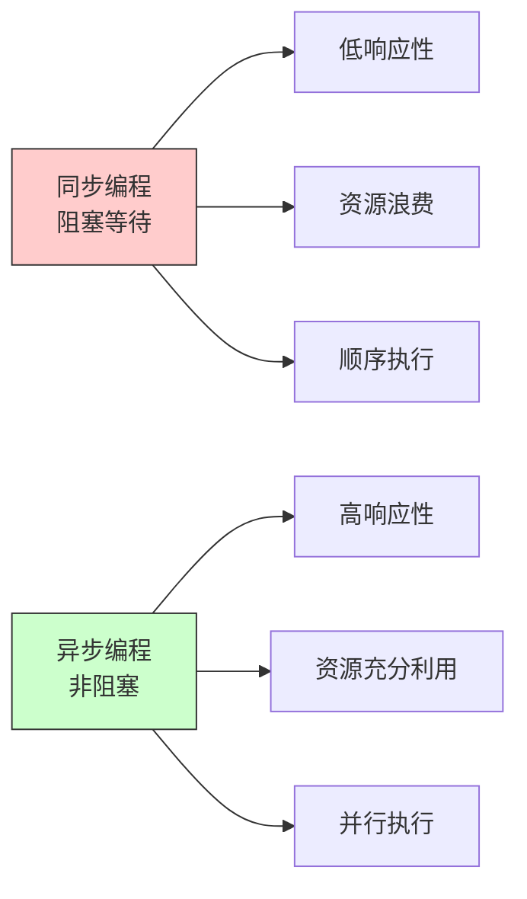
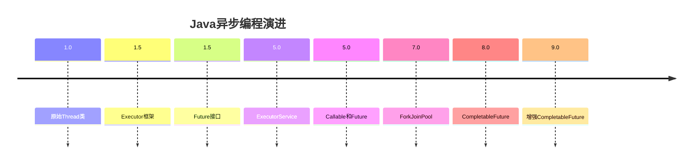
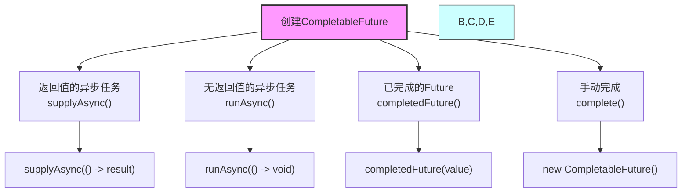
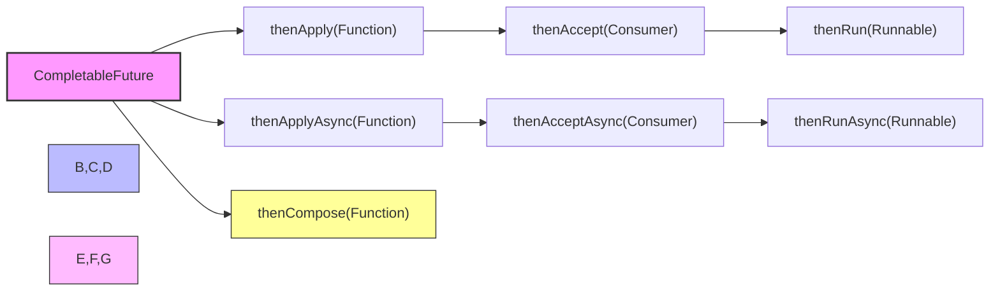

import Tabs from '@theme/Tabs';
import TabItem from '@theme/TabItem';
import TOCInline from '@theme/TOCInline';

# Java 异步编程与 CompletableFuture 详解

CompletableFuture是Java 8引入的异步编程工具，它实现了Future接口，并提供了丰富的API来支持异步编程、函数式编程和响应式编程。本文将详细介绍CompletableFuture的使用方法和最佳实践。

:::info 本文内容概览
<TOCInline toc={toc} />
:::

:::tip 核心价值
**CompletableFuture = 异步编程 + 函数式接口 + 任务编排 + 异常处理**
- 🚀 **高性能**：无需阻塞等待结果，提高程序吞吐量
- 🧩 **组合能力**：支持复杂的异步任务编排和组合
- ⚡ **响应性**：提高应用程序的响应性和用户体验
- 🛡️ **健壮性**：内置异常处理和超时控制机制
- 🔄 **流式API**：支持函数式编程和链式调用
:::

## 1. 异步编程概述

### 1.1 为什么需要异步编程？



:::tip 核心概念
异步编程是一种编程范式，允许程序在等待某个操作完成时继续执行其他任务，从而提高程序的响应性和吞吐量。
:::

### 1.2 同步 vs 异步

<div className="card">
<div className="card__header">
<h4>同步与异步编程对比</h4>
</div>
<div className="card__body">

| 特性 | 同步编程 | 异步编程 |
|------|----------|----------|
| **执行方式** | 顺序执行，阻塞等待 | 并发执行，非阻塞 |
| **响应性** | 低，容易阻塞 | 高，保持响应 |
| **资源利用** | 效率低，资源浪费 | 效率高，资源充分利用 |
| **编程复杂度** | 简单直观 | 相对复杂 |
| **调试难度** | 容易调试 | 调试困难 |

</div>
</div>

### 1.3 异步编程的优势

<Tabs>
  <TabItem value="sync_code" label="同步代码" default>
  ```java
  /**
   * 同步执行示例
   */
  public static class SynchronousExample {
      public static void main(String[] args) {
          long start = System.currentTimeMillis();
          
          // 同步执行，每个任务需要1秒
          String result1 = doTask1(); // 阻塞1秒
          String result2 = doTask2(); // 阻塞1秒
          String result3 = doTask3(); // 阻塞1秒
          
          // 总耗时3秒
          System.out.println("结果: " + result1 + ", " + result2 + ", " + result3);
          System.out.println("总耗时: " + (System.currentTimeMillis() - start) + "ms");
      }
      
      private static String doTask1() {
          try {
              Thread.sleep(1000); // 模拟耗时操作
          } catch (InterruptedException e) {
              Thread.currentThread().interrupt();
          }
          return "Task1完成";
      }
      
      private static String doTask2() {
          try {
              Thread.sleep(1000); // 模拟耗时操作
          } catch (InterruptedException e) {
              Thread.currentThread().interrupt();
          }
          return "Task2完成";
      }
      
      private static String doTask3() {
          try {
              Thread.sleep(1000); // 模拟耗时操作
          } catch (InterruptedException e) {
              Thread.currentThread().interrupt();
          }
          return "Task3完成";
      }
  }
  ```
  
  **同步代码特点：**
  - 顺序执行，前一个任务完成后才会执行下一个任务
  - 线程会阻塞等待每个任务完成
  - 总耗时是所有任务耗时的总和
  - 任务之间有明确的执行顺序
  - 代码简单直观，容易理解和调试
  
  </TabItem>
  <TabItem value="async_code" label="异步代码">
  ```java
  import java.util.concurrent.CompletableFuture;
  
  /**
   * 异步执行示例
   */
  public static class AsynchronousExample {
      public static void main(String[] args) {
          long start = System.currentTimeMillis();
          
          // 异步执行，所有任务并行运行
          CompletableFuture<String> future1 = CompletableFuture.supplyAsync(() -> doTask1());
          CompletableFuture<String> future2 = CompletableFuture.supplyAsync(() -> doTask2());
          CompletableFuture<String> future3 = CompletableFuture.supplyAsync(() -> doTask3());
          
          // 等待所有任务完成
          CompletableFuture<Void> allFutures = CompletableFuture.allOf(future1, future2, future3);
          
          // 当所有任务完成后处理结果
          allFutures.thenRun(() -> {
              try {
                  String result1 = future1.get(); // 此时已完成，不会阻塞
                  String result2 = future2.get();
                  String result3 = future3.get();
                  
                  System.out.println("结果: " + result1 + ", " + result2 + ", " + result3);
                  System.out.println("总耗时: " + (System.currentTimeMillis() - start) + "ms");
              } catch (Exception e) {
                  e.printStackTrace();
              }
          });
          
          // 等待完成
          allFutures.join();
      }
      
      // 任务方法同上
      private static String doTask1() { /* 同上 */ return "Task1完成"; }
      private static String doTask2() { /* 同上 */ return "Task2完成"; }
      private static String doTask3() { /* 同上 */ return "Task3完成"; }
  }
  ```
  
  **异步代码特点：**
  - 并行执行，所有任务同时启动
  - 主线程不会阻塞，可以执行其他操作
  - 总耗时接近最长任务的耗时
  - 任务之间的执行顺序不确定
  - 使用回调处理完成的任务
  
  </TabItem>
  <TabItem value="performance_comparison" label="性能对比">
  <div className="card">
  <div className="card__body">
  
  **同步与异步执行性能对比：**
  
  假设有10个相互独立的任务，每个任务执行时间为1秒：
  
  | 执行方式 | 执行时间 | CPU利用率 | 内存占用 | 线程数 |
  |---------|---------|----------|---------|--------|
  | **同步执行** | 10秒 | 低 | 低 | 1 |
  | **异步执行** | 1秒左右 | 高 | 略高 | 多个 |
  
  **异步编程的主要优势：**
  
  1. **性能提升**：并行处理多个任务，总体耗时减少
  2. **资源利用**：充分利用系统资源，提高吞吐量
  3. **响应性**：不阻塞主线程，保持UI响应或快速响应请求
  4. **可扩展性**：更容易处理大量并发操作
  
  **适用场景：**
  - 网络请求
  - 文件I/O操作
  - 多API调用
  - 复杂计算任务
  - 需要保持UI响应的应用
  
  </div>
  </div>
  </TabItem>
</Tabs>

### 1.4 Java中的异步编程模型



<div className="card">
<div className="card__header">
<h4>Java异步编程模型演进</h4>
</div>
<div className="card__body">

| 版本 | 特性 | 优缺点 |
|------|------|--------|
| **Java 1.0** | Thread类 | 直接操作线程，灵活但复杂 |
| **Java 1.5** | Executor框架 | 线程池管理，简化线程创建 |
| **Java 1.5** | Future接口 | 异步结果封装，但功能有限 |
| **Java 5** | ExecutorService | 提供更完整的线程池管理 |
| **Java 5** | Callable和Future | 支持有返回值的任务 |
| **Java 7** | ForkJoinPool | 支持工作窃取算法，适合递归任务 |
| **Java 8** | CompletableFuture | 支持函数式、链式异步编程 |
| **Java 9+** | 增强CompletableFuture | 添加超时控制等新功能 |

**从Future到CompletableFuture的提升:**
- Future只能通过阻塞的get()获取结果
- Future无法链式组合多个异步操作
- Future缺乏异常处理机制
- CompletableFuture解决了上述所有问题

</div>
</div>

## 2. CompletableFuture API 详解

### 2.1 创建 CompletableFuture



<Tabs>
  <TabItem value="creation_methods" label="创建方法" default>
  ```java
  import java.util.concurrent.CompletableFuture;
  import java.util.concurrent.ExecutorService;
  import java.util.concurrent.Executors;
  
  public class CompletableFutureCreation {
      public static void main(String[] args) throws Exception {
          // 1. 使用supplyAsync创建有返回值的异步任务
          CompletableFuture<String> future1 = CompletableFuture.supplyAsync(() -> {
              // 异步执行的代码
              try {
                  Thread.sleep(1000);
              } catch (InterruptedException e) {
                  Thread.currentThread().interrupt();
              }
              return "异步任务结果";
          });
          
          // 2. 使用runAsync创建无返回值的异步任务
          CompletableFuture<Void> future2 = CompletableFuture.runAsync(() -> {
              // 异步执行的代码，无返回值
              try {
                  Thread.sleep(1000);
              } catch (InterruptedException e) {
                  Thread.currentThread().interrupt();
              }
              System.out.println("异步任务执行完成");
          });
          
          // 3. 使用自定义线程池
          ExecutorService executor = Executors.newFixedThreadPool(3);
          CompletableFuture<String> future3 = CompletableFuture.supplyAsync(() -> {
              return "使用自定义线程池";
          }, executor);
          
          // 4. 手动完成Future
          CompletableFuture<String> future4 = new CompletableFuture<>();
          new Thread(() -> {
              try {
                  Thread.sleep(1000);
                  future4.complete("手动完成的结果");  // 正常完成
                  // 或者异常完成
                  // future4.completeExceptionally(new RuntimeException("出错了"));
              } catch (InterruptedException e) {
                  Thread.currentThread().interrupt();
                  future4.completeExceptionally(e);  // 异常完成
              }
          }).start();
          
          // 5. 使用completedFuture创建已完成的Future
          CompletableFuture<String> future5 = CompletableFuture.completedFuture("立即完成的结果");
          
          // 获取结果并打印
          System.out.println("Future1结果: " + future1.get());
          future2.get(); // 等待完成
          System.out.println("Future3结果: " + future3.get());
          System.out.println("Future4结果: " + future4.get());
          System.out.println("Future5结果: " + future5.get());
          
          // 关闭线程池
          executor.shutdown();
      }
  }
  ```
  </TabItem>
  <TabItem value="creation_comparison" label="创建方式对比">
  <div className="card">
  <div className="card__body">
  
  **不同创建方式对比：**
  
  | 创建方式 | 返回值 | 执行线程池 | 使用场景 | 示例 |
  |---------|-------|-----------|---------|------|
  | **supplyAsync()** | 有 | ForkJoinPool.commonPool() | 需要返回结果的任务 | `supplyAsync(() -> "result")` |
  | **supplyAsync(executor)** | 有 | 自定义线程池 | 定制线程池策略 | `supplyAsync(() -> "result", myExecutor)` |
  | **runAsync()** | 无 | ForkJoinPool.commonPool() | 不需要返回结果的任务 | `runAsync(() -> { doWork(); })` |
  | **runAsync(executor)** | 无 | 自定义线程池 | 定制线程池的无返回值任务 | `runAsync(() -> { doWork(); }, myExecutor)` |
  | **completedFuture()** | 有 | 不使用线程池 | 提供默认值或已知结果 | `completedFuture("default")` |
  | **new CompletableFuture()** | 取决于complete时提供的值 | 不使用线程池 | 手动控制完成时机 | `future.complete("result")` |
  
  **选择指南：**
  1. 有返回值使用`supplyAsync()`，无返回值使用`runAsync()`
  2. 高并发场景建议使用自定义线程池
  3. 已知结果时直接使用`completedFuture()`
  4. 需要精确控制完成时机时使用手动完成方式
  
  </div>
  </div>
  </TabItem>
  <TabItem value="executor_strategies" label="线程池策略">
  ```java
  import java.util.concurrent.ExecutorService;
  import java.util.concurrent.Executors;
  
  /**
   * 不同场景下的线程池策略
   */
  public static class ThreadPoolStrategies {
      // CPU密集型任务的线程池
      public static ExecutorService cpuIntensivePool() {
          int processors = Runtime.getRuntime().availableProcessors();
          return Executors.newFixedThreadPool(processors);
      }
      
      // IO密集型任务的线程池
      public static ExecutorService ioIntensivePool() {
          int processors = Runtime.getRuntime().availableProcessors();
          return Executors.newFixedThreadPool(processors * 2);
      }
      
      // 定时任务的线程池
      public static ExecutorService scheduledPool() {
          return Executors.newScheduledThreadPool(5);
      }
      
      // 使用示例
      public static void main(String[] args) {
          ExecutorService cpuPool = cpuIntensivePool();
          ExecutorService ioPool = ioIntensivePool();
          
          // CPU密集型任务
          CompletableFuture<Integer> cpuTask = CompletableFuture.supplyAsync(() -> {
              // 计算密集型任务
              return performComplexCalculation();
          }, cpuPool);
          
          // IO密集型任务
          CompletableFuture<String> ioTask = CompletableFuture.supplyAsync(() -> {
              // IO密集型任务
              return fetchDataFromNetwork();
          }, ioPool);
          
          // 不要忘记关闭线程池
          cpuPool.shutdown();
          ioPool.shutdown();
      }
      
      private static int performComplexCalculation() {
          // 模拟复杂计算
          return 42;
      }
      
      private static String fetchDataFromNetwork() {
          // 模拟网络请求
          return "data";
      }
  }
  ```
  </TabItem>
</Tabs>

### 2.2 链式调用



<div className="card">
<div className="card__header">
<h4>CompletableFuture常用链式方法</h4>
</div>
<div className="card__body">

**数据转换方法：**
- `thenApply(Function)` - 转换结果并返回新值
- `thenApplyAsync(Function)` - 异步线程中转换

**结果消费方法：**
- `thenAccept(Consumer)` - 消费结果但不返回新值
- `thenRun(Runnable)` - 完成后执行操作，不使用结果

**组合方法：**
- `thenCompose(Function)` - 链接两个CompletableFuture
- `thenCombine(CompletableFuture, BiFunction)` - 组合两个Future的结果

**执行线程选择：**
- 不带Async后缀的方法 - 使用上一阶段的线程执行
- 带Async后缀的方法 - 使用ForkJoinPool或指定线程池

</div>
</div>

<Tabs>
  <TabItem value="basic_chaining" label="基本链式调用" default>
  ```java
  import java.util.concurrent.CompletableFuture;
  
  /**
   * CompletableFuture链式调用示例
   */
  public static void main(String[] args) throws Exception {
      // 创建并链式调用CompletableFuture
      CompletableFuture<String> future = CompletableFuture
          .supplyAsync(() -> "Hello") // 返回Hello
          .thenApply(s -> s + " World") // 转换结果为"Hello World"
          .thenApply(s -> s + "!") // 转换结果为"Hello World!"
          .thenApply(String::toUpperCase); // 转换为大写
      
      // 获取最终结果
      String result = future.get();
      System.out.println("链式调用结果: " + result); // 输出: HELLO WORLD!
      
      // 演示thenAccept和thenRun
      CompletableFuture.supplyAsync(() -> "CompletableFuture")
          .thenApply(s -> s + " is awesome")
          .thenAccept(s -> System.out.println("消费结果: " + s)) // 消费结果
          .thenRun(() -> System.out.println("处理完成")); // 最后执行
  }
  ```
  </TabItem>
  <TabItem value="async_chaining" label="异步链式调用">
  ```java
  import java.util.concurrent.CompletableFuture;
  import java.util.concurrent.ExecutorService;
  import java.util.concurrent.Executors;
  
  /**
   * 异步链式调用示例
   */
  public static void main(String[] args) throws Exception {
      // 创建自定义线程池
      ExecutorService executor = Executors.newFixedThreadPool(3);
      
      // 异步链式调用
      CompletableFuture<String> asyncFuture = CompletableFuture
          .supplyAsync(() -> {
              System.out.println("第一步：" + Thread.currentThread().getName());
              return "第一步";
          }, executor)
          .thenApplyAsync(s -> {
              System.out.println("第二步：" + Thread.currentThread().getName());
              return s + " -> 第二步";
          }, executor)
          .thenApplyAsync(s -> {
              System.out.println("第三步：" + Thread.currentThread().getName());
              return s + " -> 第三步";
          }, executor);
      
      // 获取最终结果
      String result = asyncFuture.get();
      System.out.println("异步链式调用结果: " + result);
      
      // 关闭线程池
      executor.shutdown();
  }
  ```
  </TabItem>
  <TabItem value="method_comparison" label="方法对比">
  <div className="card">
  <div className="card__body">
  
  | 方法类别 | 方法名 | 入参 | 出参 | 常用场景 |
  |---------|--------|------|------|---------|
  | **转换类** | thenApply | Function | CompletableFuture | 将结果转换为新类型 |
  | **转换类** | thenApplyAsync | Function | CompletableFuture | 异步线程中转换结果 |
  | **消费类** | thenAccept | Consumer | CompletableFuture | 使用结果但不需要返回值 |
  | **消费类** | thenAcceptAsync | Consumer | CompletableFuture | 异步消费结果 |
  | **执行类** | thenRun | Runnable | CompletableFuture | 完成后执行，不使用结果 |
  | **执行类** | thenRunAsync | Runnable | CompletableFuture | 异步执行后续操作 |
  | **组合类** | thenCompose | Function | CompletableFuture | 链接两个Future |
  | **组合类** | thenCombine | CompletableFuture, BiFunction | CompletableFuture | 组合两个Future结果 |
  
  **代码示例：**
  
  ```java
  // thenApply - 转换结果
  CompletableFuture<Integer> future1 = 
      CompletableFuture.supplyAsync(() -> "42")
          .thenApply(Integer::parseInt);
          
  // thenAccept - 消费结果
  CompletableFuture<Void> future2 = 
      CompletableFuture.supplyAsync(() -> "Hello")
          .thenAccept(System.out::println);
          
  // thenRun - 完成后执行
  CompletableFuture<Void> future3 = 
      CompletableFuture.supplyAsync(() -> "Hello")
          .thenRun(() -> System.out.println("完成"));
          
  // thenCompose - 链接另一个Future
  CompletableFuture<String> future4 = 
      CompletableFuture.supplyAsync(() -> "Hello")
          .thenCompose(s -> CompletableFuture.supplyAsync(() -> s + " World"));
  ```
  
  </div>
  </div>
  </TabItem>
</Tabs>

### 2.3 组合多个 Future

```java title="CompletableFuture组合示例"
public class CompletableFutureCombination {
    
    /**
     * 组合多个Future
     */
    public static void main(String[] args) {
        System.out.println("=== CompletableFuture组合 ===");
        
        // 1. thenCombine - 组合两个Future的结果
        CompletableFuture<String> future1 = CompletableFuture.supplyAsync(() -> "Hello");
        CompletableFuture<String> future2 = CompletableFuture.supplyAsync(() -> "World");
        
        CompletableFuture<String> combined = future1.thenCombine(future2, (result1, result2) -> 
            result1 + " " + result2);
        
        try {
            System.out.println("组合结果: " + combined.get());
        } catch (Exception e) {
            e.printStackTrace();
        }
        
        // 2. thenCompose - 链式组合
        CompletableFuture<String> composed = future1.thenCompose(result -> 
            CompletableFuture.supplyAsync(() -> result + " 被处理"));
        
        try {
            System.out.println("链式组合结果: " + composed.get());
        } catch (Exception e) {
            e.printStackTrace();
        }
        
        // 3. allOf - 等待所有Future完成
        CompletableFuture<String> task1 = CompletableFuture.supplyAsync(() -> "任务1");
        CompletableFuture<String> task2 = CompletableFuture.supplyAsync(() -> "任务2");
        CompletableFuture<String> task3 = CompletableFuture.supplyAsync(() -> "任务3");
        
        CompletableFuture<Void> allTasks = CompletableFuture.allOf(task1, task2, task3);
        
        allTasks.thenRun(() -> {
            try {
                System.out.println("所有任务完成: " + task1.get() + ", " + task2.get() + ", " + task3.get());
            } catch (Exception e) {
                e.printStackTrace();
            }
        });
        
        allTasks.join();
        
        // 4. anyOf - 等待任意一个Future完成
        CompletableFuture<String> fastTask = CompletableFuture.supplyAsync(() -> {
            try {
                Thread.sleep(500);
            } catch (InterruptedException e) {
                Thread.currentThread().interrupt();
            }
            return "快速任务";
        });
        
        CompletableFuture<String> slowTask = CompletableFuture.supplyAsync(() -> {
            try {
                Thread.sleep(2000);
            } catch (InterruptedException e) {
                Thread.currentThread().interrupt();
            }
            return "慢速任务";
        });
        
        CompletableFuture<Object> anyTask = CompletableFuture.anyOf(fastTask, slowTask);
        try {
            System.out.println("第一个完成的任务: " + anyTask.get());
        } catch (Exception e) {
            e.printStackTrace();
        }
    }
}
```

### 2.4 异常处理

```java title="CompletableFuture异常处理示例"
public class CompletableFutureExceptionHandling {
    
    /**
     * 异常处理示例
     */
    public static void main(String[] args) {
        System.out.println("=== CompletableFuture异常处理 ===");
        
        // 1. exceptionally - 处理异常并返回默认值
        CompletableFuture<String> future1 = CompletableFuture.supplyAsync(() -> {
            if (Math.random() > 0.5) {
                throw new RuntimeException("随机异常");
            }
            return "成功结果";
        }).exceptionally(throwable -> {
            System.out.println("捕获异常: " + throwable.getMessage());
            return "默认值";
        });
        
        try {
            System.out.println("Future1结果: " + future1.get());
        } catch (Exception e) {
            e.printStackTrace();
        }
        
        // 2. handle - 处理成功和异常情况
        CompletableFuture<String> future2 = CompletableFuture.supplyAsync(() -> {
            if (Math.random() > 0.5) {
                throw new RuntimeException("随机异常");
            }
            return "成功结果";
        }).handle((result, throwable) -> {
            if (throwable != null) {
                System.out.println("处理异常: " + throwable.getMessage());
                return "异常时的默认值";
            } else {
                return result + " 处理成功";
            }
        });
        
        try {
            System.out.println("Future2结果: " + future2.get());
        } catch (Exception e) {
            e.printStackTrace();
        }
        
        // 3. whenComplete - 无论成功失败都执行
        CompletableFuture<String> future3 = CompletableFuture.supplyAsync(() -> {
            if (Math.random() > 0.5) {
                throw new RuntimeException("随机异常");
            }
            return "成功结果";
        }).whenComplete((result, throwable) -> {
            if (throwable != null) {
                System.out.println("任务失败: " + throwable.getMessage());
            } else {
                System.out.println("任务成功: " + result);
            }
        });
        
        try {
            future3.get();
        } catch (Exception e) {
            System.out.println("Future3抛出异常: " + e.getMessage());
        }
    }
}
```

## 3. 实际应用场景

### 3.1 并行数据处理

```java title="并行数据处理示例"
import java.util.Arrays;
import java.util.List;
import java.util.stream.Collectors;

public class ParallelDataProcessing {
    
    /**
     * 并行数据处理
     */
    public static void main(String[] args) {
        System.out.println("=== 并行数据处理 ===");
        
        List<String> data = Arrays.asList("数据1", "数据2", "数据3", "数据4", "数据5");
        
        // 并行处理数据
        List<CompletableFuture<String>> futures = data.stream()
            .map(item -> CompletableFuture.supplyAsync(() -> processData(item)))
            .collect(Collectors.toList());
        
        // 等待所有处理完成
        CompletableFuture<Void> allFutures = CompletableFuture.allOf(
            futures.toArray(new CompletableFuture[0]));
        
        allFutures.thenRun(() -> {
            List<String> results = futures.stream()
                .map(CompletableFuture::join)
                .collect(Collectors.toList());
            
            System.out.println("处理结果: " + results);
        });
        
        allFutures.join();
    }
    
    private static String processData(String data) {
        try {
            Thread.sleep(1000); // 模拟处理时间
        } catch (InterruptedException e) {
            Thread.currentThread().interrupt();
        }
        return data + " 已处理";
    }
}
```

### 3.2 异步API调用

```java title="异步API调用示例"
public class AsyncApiCall {
    
    /**
     * 异步API调用
     */
    public static void main(String[] args) {
        System.out.println("=== 异步API调用 ===");
        
        // 模拟异步API调用
        CompletableFuture<User> userFuture = getUserAsync(1L);
        CompletableFuture<Order> orderFuture = getOrderAsync(1L);
        CompletableFuture<Product> productFuture = getProductAsync(1L);
        
        // 组合多个API调用结果
        CompletableFuture<UserOrderInfo> combinedFuture = userFuture
            .thenCombine(orderFuture, (user, order) -> new UserOrderInfo(user, order))
            .thenCombine(productFuture, (userOrder, product) -> {
                userOrder.setProduct(product);
                return userOrder;
            });
        
        try {
            UserOrderInfo result = combinedFuture.get();
            System.out.println("组合结果: " + result);
        } catch (Exception e) {
            e.printStackTrace();
        }
    }
    
    private static CompletableFuture<User> getUserAsync(Long userId) {
        return CompletableFuture.supplyAsync(() -> {
            try {
                Thread.sleep(1000);
            } catch (InterruptedException e) {
                Thread.currentThread().interrupt();
            }
            return new User(userId, "用户" + userId);
        });
    }
    
    private static CompletableFuture<Order> getOrderAsync(Long orderId) {
        return CompletableFuture.supplyAsync(() -> {
            try {
                Thread.sleep(1000);
            } catch (InterruptedException e) {
                Thread.currentThread().interrupt();
            }
            return new Order(orderId, "订单" + orderId);
        });
    }
    
    private static CompletableFuture<Product> getProductAsync(Long productId) {
        return CompletableFuture.supplyAsync(() -> {
            try {
                Thread.sleep(1000);
            } catch (InterruptedException e) {
                Thread.currentThread().interrupt();
            }
            return new Product(productId, "产品" + productId);
        });
    }
    
    static class User {
        private Long id;
        private String name;
        
        public User(Long id, String name) {
            this.id = id;
            this.name = name;
        }
        
        @Override
        public String toString() {
            return "User{id=" + id + ", name='" + name + "'}";
        }
    }
    
    static class Order {
        private Long id;
        private String name;
        
        public Order(Long id, String name) {
            this.id = id;
            this.name = name;
        }
        
        @Override
        public String toString() {
            return "Order{id=" + id + ", name='" + name + "'}";
        }
    }
    
    static class Product {
        private Long id;
        private String name;
        
        public Product(Long id, String name) {
            this.id = id;
            this.name = name;
        }
        
        @Override
        public String toString() {
            return "Product{id=" + id + ", name='" + name + "'}";
        }
    }
    
    static class UserOrderInfo {
        private User user;
        private Order order;
        private Product product;
        
        public UserOrderInfo(User user, Order order) {
            this.user = user;
            this.order = order;
        }
        
        public void setProduct(Product product) {
            this.product = product;
        }
        
        @Override
        public String toString() {
            return "UserOrderInfo{user=" + user + ", order=" + order + ", product=" + product + "}";
        }
    }
}
```

### 3.3 超时控制

```java title="超时控制示例"
import java.util.concurrent.TimeUnit;
import java.util.concurrent.TimeoutException;

public class CompletableFutureTimeout {
    
    /**
     * 超时控制
     */
    public static void main(String[] args) {
        System.out.println("=== 超时控制 ===");
        
        // 创建可能超时的任务
        CompletableFuture<String> slowTask = CompletableFuture.supplyAsync(() -> {
            try {
                Thread.sleep(3000); // 3秒
            } catch (InterruptedException e) {
                Thread.currentThread().interrupt();
            }
            return "慢任务完成";
        });
        
        // 添加超时控制
        CompletableFuture<String> timeoutTask = slowTask
            .orTimeout(2, TimeUnit.SECONDS) // 2秒超时
            .exceptionally(throwable -> {
                if (throwable instanceof TimeoutException) {
                    return "任务超时";
                }
                return "其他异常: " + throwable.getMessage();
            });
        
        try {
            String result = timeoutTask.get();
            System.out.println("结果: " + result);
        } catch (Exception e) {
            e.printStackTrace();
        }
        
        // 使用completeOnTimeout设置超时时的默认值
        CompletableFuture<String> defaultTimeoutTask = CompletableFuture.supplyAsync(() -> {
            try {
                Thread.sleep(3000);
            } catch (InterruptedException e) {
                Thread.currentThread().interrupt();
            }
            return "慢任务完成";
        }).completeOnTimeout("超时默认值", 2, TimeUnit.SECONDS);
        
        try {
            String result = defaultTimeoutTask.get();
            System.out.println("超时默认值结果: " + result);
        } catch (Exception e) {
            e.printStackTrace();
        }
    }
}
```

## 4. 性能优化

### 4.1 使用自定义线程池

```java title="自定义线程池示例"
import java.util.concurrent.ExecutorService;
import java.util.concurrent.Executors;
import java.util.concurrent.ThreadPoolExecutor;

public class CompletableFutureOptimization {
    
    /**
     * 使用自定义线程池
     */
    public static void main(String[] args) {
        System.out.println("=== 自定义线程池优化 ===");
        
        // 创建专用线程池
        ExecutorService executor = Executors.newFixedThreadPool(10);
        
        // 使用自定义线程池
        CompletableFuture<String> future = CompletableFuture
            .supplyAsync(() -> "任务1", executor)
            .thenApplyAsync(s -> s + " 处理", executor)
            .thenApplyAsync(s -> s + " 完成", executor);
        
        try {
            System.out.println("结果: " + future.get());
        } catch (Exception e) {
            e.printStackTrace();
        }
        
        executor.shutdown();
    }
    
    /**
     * 线程池配置建议
     */
    public static class ThreadPoolConfig {
        
        // CPU密集型任务
        public static ExecutorService createCpuIntensivePool() {
            int processors = Runtime.getRuntime().availableProcessors();
            return Executors.newFixedThreadPool(processors + 1);
        }
        
        // I/O密集型任务
        public static ExecutorService createIoIntensivePool() {
            int processors = Runtime.getRuntime().availableProcessors();
            return Executors.newFixedThreadPool(processors * 2);
        }
        
        // 混合型任务
        public static ExecutorService createMixedPool() {
            int processors = Runtime.getRuntime().availableProcessors();
            return Executors.newFixedThreadPool(processors * 3);
        }
    }
}
```

### 4.2 避免阻塞操作

```java title="避免阻塞操作示例"
public class NonBlockingOperations {
    
    /**
     * 避免阻塞操作
     */
    public static void main(String[] args) {
        System.out.println("=== 避免阻塞操作 ===");
        
        // 避免在异步任务中使用阻塞操作
        CompletableFuture<String> future = CompletableFuture
            .supplyAsync(() -> "数据")
            .thenApplyAsync(data -> processData(data)) // 异步处理
            .thenAcceptAsync(result -> System.out.println("处理结果: " + result)); // 异步消费
        
        // 等待完成
        future.join();
    }
    
    private static String processData(String data) {
        // 模拟数据处理
        return data + " 已处理";
    }
    
    /**
     * 正确的异步处理方式
     */
    public static class CorrectAsyncProcessing {
        
        public static CompletableFuture<String> processAsync(String input) {
            return CompletableFuture.supplyAsync(() -> {
                // 异步处理逻辑
                return input + " 异步处理";
            });
        }
        
        public static CompletableFuture<String> processWithTimeout(String input, long timeout) {
            return CompletableFuture.supplyAsync(() -> {
                // 异步处理逻辑
                return input + " 异步处理";
            }).orTimeout(timeout, TimeUnit.SECONDS);
        }
    }
}
```

## 5. 最佳实践

### 5.1 异常处理最佳实践

```java title="异常处理最佳实践示例"
public class ExceptionHandlingBestPractices {
    
    /**
     * 异常处理最佳实践
     */
    public static void main(String[] args) {
        System.out.println("=== 异常处理最佳实践 ===");
        
        // 1. 使用exceptionally处理特定异常
        CompletableFuture<String> future1 = CompletableFuture
            .supplyAsync(() -> {
                if (Math.random() > 0.5) {
                    throw new RuntimeException("业务异常");
                }
                return "成功";
            })
            .exceptionally(throwable -> {
                if (throwable instanceof RuntimeException) {
                    return "处理业务异常: " + throwable.getMessage();
                }
                return "处理其他异常: " + throwable.getMessage();
            });
        
        // 2. 使用handle处理所有情况
        CompletableFuture<String> future2 = CompletableFuture
            .supplyAsync(() -> {
                if (Math.random() > 0.5) {
                    throw new RuntimeException("业务异常");
                }
                return "成功";
            })
            .handle((result, throwable) -> {
                if (throwable != null) {
                    return "异常处理: " + throwable.getMessage();
                }
                return "成功处理: " + result;
            });
        
        // 3. 使用whenComplete记录日志
        CompletableFuture<String> future3 = CompletableFuture
            .supplyAsync(() -> {
                if (Math.random() > 0.5) {
                    throw new RuntimeException("业务异常");
                }
                return "成功";
            })
            .whenComplete((result, throwable) -> {
                if (throwable != null) {
                    System.out.println("任务失败，记录日志: " + throwable.getMessage());
                } else {
                    System.out.println("任务成功，记录日志: " + result);
                }
            });
        
        try {
            System.out.println("Future1: " + future1.get());
            System.out.println("Future2: " + future2.get());
            future3.get();
        } catch (Exception e) {
            e.printStackTrace();
        }
    }
}
```

### 5.2 资源管理最佳实践

```java title="资源管理最佳实践示例"
public class ResourceManagementBestPractices {
    
    /**
     * 资源管理最佳实践
     */
    public static void main(String[] args) {
        System.out.println("=== 资源管理最佳实践 ===");
        
        ExecutorService executor = Executors.newFixedThreadPool(5);
        
        try {
            // 使用try-with-resources管理资源
            CompletableFuture<String> future = CompletableFuture
                .supplyAsync(() -> "任务", executor)
                .thenApplyAsync(result -> result + " 处理", executor);
            
            String result = future.get();
            System.out.println("结果: " + result);
            
        } catch (Exception e) {
            e.printStackTrace();
        } finally {
            // 确保线程池关闭
            executor.shutdown();
            try {
                if (!executor.awaitTermination(60, TimeUnit.SECONDS)) {
                    executor.shutdownNow();
                }
            } catch (InterruptedException e) {
                executor.shutdownNow();
                Thread.currentThread().interrupt();
            }
        }
    }
    
    /**
     * 自动资源管理
     */
    public static class AutoResourceManager {
        
        public static <T> CompletableFuture<T> withExecutor(
                Function<ExecutorService, CompletableFuture<T>> task,
                int poolSize) {
            
            ExecutorService executor = Executors.newFixedThreadPool(poolSize);
            
            return task.apply(executor)
                .whenComplete((result, throwable) -> {
                    executor.shutdown();
                    try {
                        if (!executor.awaitTermination(60, TimeUnit.SECONDS)) {
                            executor.shutdownNow();
                        }
                    } catch (InterruptedException e) {
                        executor.shutdownNow();
                        Thread.currentThread().interrupt();
                    }
                });
        }
    }
}
```

## 6. 面试题

### 6.1 基础概念

**Q: CompletableFuture和Future有什么区别？**

**A:**
- **Future**：只能通过get()方法获取结果，会阻塞
- **CompletableFuture**：支持链式调用和异步处理
- **CompletableFuture**：提供了丰富的API来处理异步操作
- **CompletableFuture**：支持异常处理和超时控制

**Q: thenApply和thenApplyAsync有什么区别？**

**A:**
- **thenApply**：在调用线程中执行
- **thenApplyAsync**：在ForkJoinPool.commonPool()中执行
- **thenApplyAsync**：可以指定自定义线程池
- **thenApplyAsync**：更适合CPU密集型任务

### 6.2 异常处理

**Q: 如何处理CompletableFuture中的异常？**

**A:**
- 使用exceptionally()处理异常并返回默认值
- 使用handle()同时处理成功和异常情况
- 使用whenComplete()无论成功失败都执行
- 使用completeExceptionally()手动完成异常

**Q: CompletableFuture.allOf和anyOf有什么区别？**

**A:**
- **allOf**：等待所有Future完成
- **anyOf**：等待任意一个Future完成
- **allOf**：返回Void类型
- **anyOf**：返回Object类型（第一个完成的Future的结果）

### 6.3 性能优化

**Q: 如何实现CompletableFuture的超时控制？**

**A:**
- 使用orTimeout()方法设置超时时间
- 使用completeOnTimeout()设置超时时的默认值
- 使用get()方法的超时版本
- 结合Timer或ScheduledExecutorService实现自定义超时

**Q: 如何选择合适的线程池？**

**A:**
- **CPU密集型**：线程数 = CPU核心数 + 1
- **I/O密集型**：线程数 = CPU核心数 × 2
- **混合型**：线程数 = CPU核心数 × 3
- 根据实际业务场景调整

### 6.4 实际应用

**Q: CompletableFuture在微服务架构中的应用？**

**A:**
- 并行调用多个微服务
- 异步处理用户请求
- 实现熔断和降级
- 提高系统响应性

**Q: 如何避免CompletableFuture中的常见陷阱？**

**A:**
- 及时处理异常
- 正确管理线程池资源
- 避免在异步任务中使用阻塞操作
- 合理设置超时时间

## 7. 总结

CompletableFuture为Java异步编程提供了强大而灵活的支持。

### 7.1 关键要点

1. **异步编程优势**：提高响应性、充分利用资源
2. **API丰富性**：支持链式调用、组合、异常处理
3. **性能优化**：使用自定义线程池、避免阻塞操作
4. **最佳实践**：正确异常处理、资源管理

### 7.2 使用建议

| 场景 | 推荐方式 | 原因 |
|------|----------|------|
| **简单异步任务** | supplyAsync/runAsync | 简单易用 |
| **复杂异步流程** | 链式调用 | 代码清晰 |
| **多个任务组合** | allOf/anyOf | 灵活控制 |
| **异常处理** | exceptionally/handle | 优雅处理 |
| **超时控制** | orTimeout | 防止阻塞 |

### 7.3 学习建议

1. **理解原理**：深入理解异步编程的工作原理
2. **实践验证**：通过编写代码验证不同API的效果
3. **性能测试**：对比不同实现方式的性能差异
4. **场景应用**：在实际项目中应用异步编程

通过深入理解和熟练运用CompletableFuture，我们能够构建出更加高效、健壮和可维护的Java异步应用程序。 