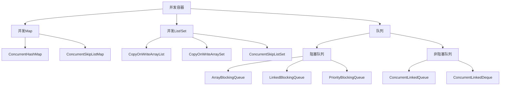
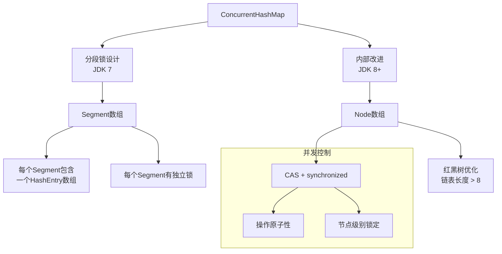
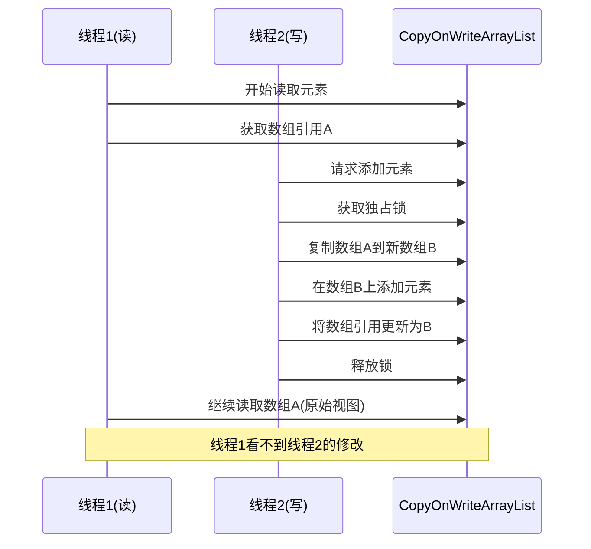
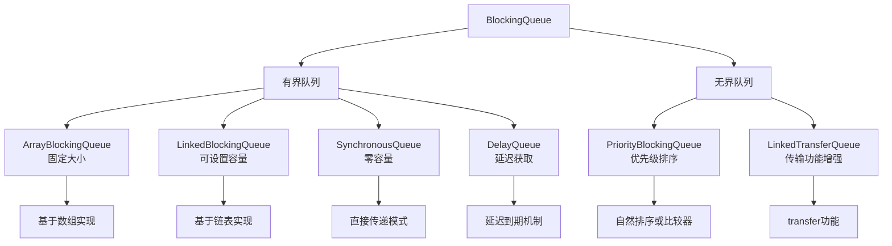
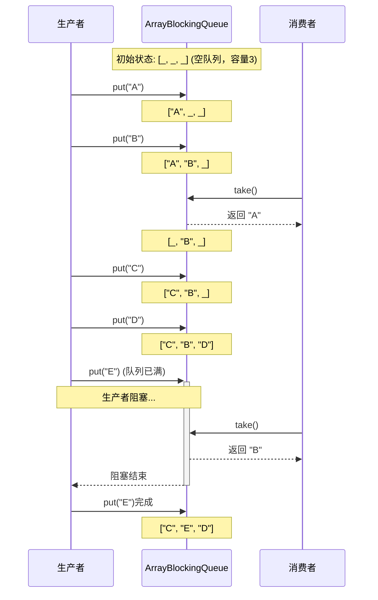
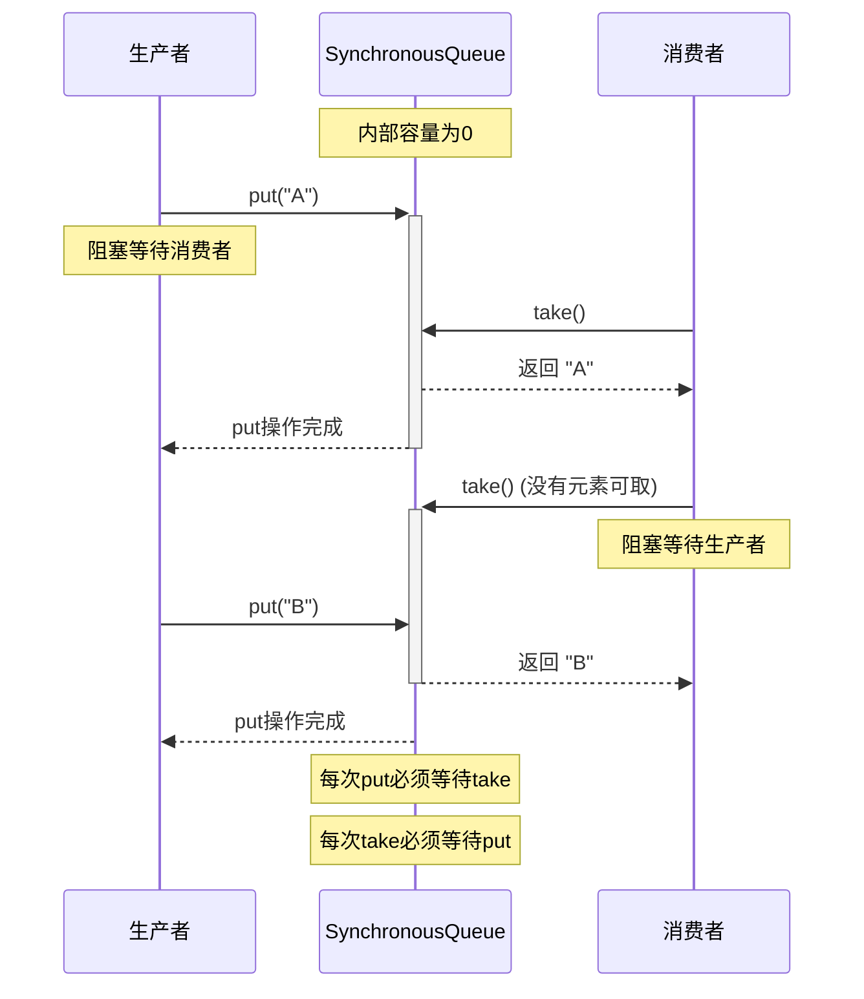

import Tabs from '@theme/Tabs';
import TabItem from '@theme/TabItem';
import TOCInline from '@theme/TOCInline';

# Java 并发容器详解

Java并发包提供了多种线程安全的容器类，这些容器专门为多线程环境设计，提供了比使用synchronized更高效的并发访问机制。本文将详细介绍各种并发容器的使用方法和最佳实践。

:::info 本文内容概览
<TOCInline toc={toc} />
:::

:::tip 核心价值
**并发容器 = 线程安全性 + 高性能访问 + 低竞争设计 + 功能扩展 + 便捷API**
- 🛡️ **线程安全**：无需额外同步，免除并发错误困扰
- ⚡ **高性能**：采用分段锁、无锁算法等现代并发技术
- 🔄 **一致性模型**：提供清晰的一致性保证
- 🚀 **扩展性强**：良好应对高并发负载场景
- 🔧 **功能丰富**：提供阻塞、超时等特性满足多样需求
:::

## 1. 并发容器概述

### 1.1 什么是并发容器？



:::tip 核心概念
并发容器是Java并发包中提供的线程安全集合类，它们通过不同的并发控制机制（如分段锁、CAS操作、读写锁等）实现线程安全，避免了使用synchronized的性能开销。
:::

### 1.2 并发容器与传统同步容器对比

<div className="card">
<div className="card__body">

| 特性 | 传统同步容器 | 并发容器 |
|------|------------|----------|
| **实现方式** | `Collections.synchronizedXxx` | `java.util.concurrent` 包 |
| **同步机制** | 方法级synchronized锁 | 分段锁、CAS、读写分离等 |
| **锁粒度** | 粗粒度（整个容器） | 细粒度（部分数据） |
| **性能** | 高并发下性能较差 | 高并发下性能更好 |
| **迭代器** | fail-fast机制 | 弱一致性或快照迭代 |
| **阻塞操作** | 不支持 | 部分容器支持 |
| **原子复合操作** | 需要额外同步 | 部分容器原生支持 |

</div>
</div>

### 1.3 并发容器分类

<Tabs>
  <TabItem value="map" label="并发Map" default>
  <div className="card">
  <div className="card__header">
  <h4>并发Map实现类</h4>
  </div>
  <div className="card__body">
  <ul>
  <li><strong>ConcurrentHashMap</strong>：分段锁实现的高性能线程安全哈希表</li>
  <li><strong>ConcurrentSkipListMap</strong>：基于跳表的有序并发Map，适合高并发读取</li>
  </ul>
  </div>
  </div>

  ```java
  // 创建并发Map
  Map<String, Integer> concurrentMap = new ConcurrentHashMap<>();
  // 线程安全操作
  concurrentMap.put("one", 1);
  concurrentMap.putIfAbsent("two", 2); // 原子性的"如果不存在则放入"
  // 复合操作
  concurrentMap.compute("three", (k, v) -> (v == null) ? 3 : v + 1);
  ```
  </TabItem>
  <TabItem value="list" label="并发List/Set">
  <div className="card">
  <div className="card__header">
  <h4>并发List/Set实现类</h4>
  </div>
  <div className="card__body">
  <ul>
  <li><strong>CopyOnWriteArrayList</strong>：写时复制的List实现，读多写少场景的理想选择</li>
  <li><strong>CopyOnWriteArraySet</strong>：基于CopyOnWriteArrayList的Set实现</li>
  <li><strong>ConcurrentSkipListSet</strong>：基于跳表的有序并发Set</li>
  </ul>
  </div>
  </div>

  ```java
  // 创建并发List
  List<String> concurrentList = new CopyOnWriteArrayList<>();
  // 安全的并发修改
  concurrentList.add("item1");
  // 遍历时不会抛出ConcurrentModificationException
  for (String item : concurrentList) {
      System.out.println(item);
      concurrentList.add("newItem"); // 在遍历时修改是安全的
  }
  ```
  </TabItem>
  <TabItem value="queue" label="并发队列">
  <div className="card">
  <div className="card__header">
  <h4>并发队列实现类</h4>
  </div>
  <div className="card__body">
  <h5>阻塞队列</h5>
  <ul>
  <li><strong>ArrayBlockingQueue</strong>：基于数组的有界阻塞队列</li>
  <li><strong>LinkedBlockingQueue</strong>：基于链表的可选有界阻塞队列</li>
  <li><strong>PriorityBlockingQueue</strong>：支持优先级的无界阻塞队列</li>
  <li><strong>DelayQueue</strong>：延迟元素队列，元素到期才能被取出</li>
  <li><strong>SynchronousQueue</strong>：没有内部容量的阻塞队列，直接传递</li>
  </ul>
  <h5>非阻塞队列</h5>
  <ul>
  <li><strong>ConcurrentLinkedQueue</strong>：基于链表的无界非阻塞队列</li>
  <li><strong>ConcurrentLinkedDeque</strong>：基于链表的无界非阻塞双端队列</li>
  </ul>
  </div>
  </div>
  
  ```java
  // 创建阻塞队列
  BlockingQueue<Task> taskQueue = new LinkedBlockingQueue<>(100);
  
  // 生产者 - 可以阻塞
  try {
      taskQueue.put(new Task()); // 如果队列满，会阻塞
  } catch (InterruptedException e) {
      Thread.currentThread().interrupt();
  }
  
  // 消费者 - 可以阻塞
  try {
      Task task = taskQueue.take(); // 如果队列空，会阻塞
      processTask(task);
  } catch (InterruptedException e) {
      Thread.currentThread().interrupt();
  }
  ```
  </TabItem>
</Tabs>

## 2. ConcurrentHashMap详解

### 2.1 ConcurrentHashMap 原理

<details>
<summary><strong>内部结构与工作原理</strong></summary>



**JDK 7实现**：
- 使用分段锁(Segment)机制，将数据分为多个段
- 每个段独立加锁，减少锁竞争
- Segment继承自ReentrantLock

**JDK 8+实现**：
- 移除Segment概念，采用Node数组+链表+红黑树结构
- 使用CAS操作和synchronized实现更细粒度锁
- 当链表长度超过阈值(8)时转换为红黑树，提升性能
- 对桶(bucket)级别加锁，进一步减少锁竞争

</details>

### 2.2 基本用法

<Tabs>
  <TabItem value="creation" label="创建与基本操作" default>
  ```java
  import java.util.concurrent.ConcurrentHashMap;
  
  // 创建ConcurrentHashMap
  ConcurrentHashMap<String, Integer> map = new ConcurrentHashMap<>();
  
  // 添加元素
  map.put("apple", 10);
  map.put("banana", 20);
  
  // 获取元素
  int appleCount = map.get("apple"); // 10
  
  // 原子性的"如果不存在则添加"
  map.putIfAbsent("orange", 15); // 添加成功，返回null
  map.putIfAbsent("apple", 25);  // 添加失败，返回10
  
  // 移除元素
  map.remove("banana"); // 返回20
  
  // 原子性的"如果值匹配则移除"
  boolean removed = map.remove("apple", 10); // 返回true，移除成功
  ```
  </TabItem>
  <TabItem value="atomic" label="原子操作">
  ```java
  // 原子性的替换操作
  map.replace("orange", 15, 25); // 仅当当前值为15时，替换为25
  
  // 计算API - 原子性的基于当前值计算新值
  map.compute("apple", (key, value) -> 
      (value == null) ? 100 : value + 50); // 如果不存在，设为100；否则增加50
  
  // 仅当键存在时计算
  map.computeIfPresent("orange", (key, value) -> value * 2);
  
  // 仅当键不存在时计算
  map.computeIfAbsent("grape", key -> 30);
  
  // 合并操作 - 结合现有值和给定值生成新值
  map.merge("apple", 10, (oldValue, value) -> oldValue + value);
  ```
  </TabItem>
  <TabItem value="bulk" label="批量操作">
  ```java
  // 批量添加
  ConcurrentHashMap<String, Integer> fruitPrices = new ConcurrentHashMap<>();
  fruitPrices.put("apple", 100);
  fruitPrices.put("banana", 80);
  
  map.putAll(fruitPrices);
  
  // 遍历 - 弱一致性
  map.forEach((key, value) -> 
      System.out.println(key + ": " + value));
  
  // 使用键值计算值
  map.forEach(2, (key, value) -> 
      key + "=" + value, // 转换函数
      results -> System.out.println("处理结果: " + results) // 结果处理
  );
  
  // 规约操作
  Integer sum = map.reduce(2, 
      (key, value) -> value, // 转换函数
      (v1, v2) -> v1 + v2    // 规约函数
  );
  ```
  </TabItem>
</Tabs>

### 2.3 性能特性与最佳实践

<Tabs>
  <TabItem value="perf" label="性能特性" default>
  <div className="card">
  <div className="card__body">
  
  **ConcurrentHashMap的性能特点：**
  
  1. **读操作完全并行**：多线程可以同时读取，无阻塞
  2. **写操作局部锁定**：仅锁定需要修改的部分，允许其他部分并发访问
  3. **弱一致性迭代器**：迭代时不会抛出ConcurrentModificationException，但可能不反映最新修改
  4. **高度优化的并发访问**：使用内部优化减少锁竞争
  5. **调整大小操作并发化**：多个线程可同时参与扩容过程
  
  </div>
  </div>
  </TabItem>
  
  <TabItem value="practice" label="最佳实践">
  ```java
  // 1. 避免对ConcurrentHashMap进行同步包装（没有必要且损害性能）
  Map<String, String> map = new ConcurrentHashMap<>();
  // 错误：不要这样做
  Map<String, String> syncMap = Collections.synchronizedMap(map);
  
  // 2. 使用原子操作替代"检查后执行"模式
  // 不好：非原子的检查再更新
  if (!map.containsKey("key")) {
      map.put("key", "value");
  }
  // 好：使用原子操作
  map.putIfAbsent("key", "value");
  
  // 3. 利用ConcurrentHashMap提供的原子复合操作
  map.compute("counter", (k, v) -> (v == null) ? 1 : Integer.parseInt(v) + 1);
  
  // 4. 合理设置初始容量，避免频繁扩容
  // 预计元素数量为500，负载因子默认0.75
  int initialCapacity = (int) (500 / 0.75) + 1;
  Map<String, Object> optimizedMap = new ConcurrentHashMap<>(initialCapacity);
  ```
  </TabItem>
  
  <TabItem value="avoid" label="常见陷阱">
  ```java
  ConcurrentHashMap<String, List<String>> mapOfLists = new ConcurrentHashMap<>();
  
  // 陷阱1: 虽然ConcurrentHashMap是线程安全的，但其中的值可能不是
  mapOfLists.putIfAbsent("cities", new ArrayList<>()); // ArrayList不是线程安全的
  // 正确做法：使用线程安全的集合作为值
  mapOfLists.putIfAbsent("cities", new CopyOnWriteArrayList<>());
  
  // 陷阱2: 复合操作仍需原子方法保护
  // 不安全：
  if (mapOfLists.containsKey("cities")) {
      mapOfLists.get("cities").add("New York"); // 不是原子操作
  }
  
  // 安全：使用原子性compute操作
  mapOfLists.compute("cities", (k, v) -> {
      List<String> cities = (v == null) ? new CopyOnWriteArrayList<>() : v;
      cities.add("New York");
      return cities;
  });
  
  // 陷阱3: 迭代器的弱一致性可能看不到最新修改
  // 迭代开始后的修改可能不会反映在当前迭代过程中
  ```
  </TabItem>
</Tabs>

## 3. CopyOnWriteArrayList 详解

### 3.1 写时复制机制

<details>
<summary><strong>CopyOnWriteArrayList工作原理</strong></summary>



**CopyOnWriteArrayList的核心特性**：
1. **写时复制**：每次修改操作都会创建底层数组的新副本
2. **读操作无锁**：读取操作不需要加锁，提供了最大程度的并发读取性能
3. **写操作同步**：写操作需要获取独占锁，一次只能有一个线程修改
4. **适用场景**：读多写少的场景，写操作频繁的场景性能较差
5. **内存开销**：每次修改都创建新数组，可能导致GC压力和内存使用增加

</details>

### 3.2 基本用法

<Tabs>
  <TabItem value="basic" label="基本操作" default>
  ```java
  import java.util.concurrent.CopyOnWriteArrayList;
  
  // 创建CopyOnWriteArrayList
  List<String> cowList = new CopyOnWriteArrayList<>();
  
  // 添加元素
  cowList.add("Java");
  cowList.add("Python");
  cowList.addAll(Arrays.asList("Go", "Rust"));
  
  // 获取元素
  String language = cowList.get(0); // "Java"
  
  // 迭代 - 安全，不会抛出ConcurrentModificationException
  for (String lang : cowList) {
      System.out.println(lang);
      // 即使此处修改cowList，迭代器仍然基于原始快照
      cowList.add("新语言"); // 不会影响当前迭代
  }
  
  // 修改元素
  cowList.set(1, "Python 3");
  
  // 删除元素
  cowList.remove("Go");
  cowList.remove(0); // 删除第一个元素
  ```
  </TabItem>
  <TabItem value="thread" label="多线程场景">
  ```java
  CopyOnWriteArrayList<String> safeList = new CopyOnWriteArrayList<>();
  
  // 多线程添加元素
  ExecutorService executor = Executors.newFixedThreadPool(10);
  
  for (int i = 0; i < 100; i++) {
      final int index = i;
      executor.submit(() -> {
          safeList.add("Item " + index);
      });
  }
  
  executor.shutdown();
  try {
      executor.awaitTermination(5, TimeUnit.SECONDS);
  } catch (InterruptedException e) {
      Thread.currentThread().interrupt();
  }
  
  // 线程安全的迭代
  for (String item : safeList) {
      System.out.println(item);
  }
  ```
  </TabItem>
  <TabItem value="iterator" label="快照迭代器">
  ```java
  CopyOnWriteArrayList<Integer> numbers = new CopyOnWriteArrayList<>(
      Arrays.asList(1, 2, 3, 4, 5));
  
  // 获取迭代器 - 它反映当前的快照
  Iterator<Integer> iterator = numbers.iterator();
  
  // 在获取迭代器后修改列表
  numbers.add(6);
  numbers.remove(0);
  
  // 迭代器仍然反映原始状态
  while (iterator.hasNext()) {
      Integer num = iterator.next();
      System.out.print(num + " "); // 输出 1 2 3 4 5
      
      // 注意：CopyOnWriteArrayList的迭代器不支持修改操作
      // iterator.remove(); // 将抛出UnsupportedOperationException
  }
  
  System.out.println();
  // 新迭代器会反映最新状态
  for (Integer num : numbers) {
      System.out.print(num + " "); // 输出 2 3 4 5 6
  }
  ```
  </TabItem>
</Tabs>

### 3.3 适用场景与最佳实践

<div className="code-with-callout">

```java
// 场景：事件监听器列表
public class EventManager {
    // 使用CopyOnWriteArrayList存储监听器 - 非常适合监听器模式
    private final List<EventListener> listeners = new CopyOnWriteArrayList<>();
    
    // 添加监听器 - 写操作，相对不频繁
    public void addListener(EventListener listener) {
        listeners.add(listener);
    }
    
    // 移除监听器 - 写操作，相对不频繁
    public void removeListener(EventListener listener) {
        listeners.remove(listener);
    }
    
    // 触发事件 - 读操作，频繁执行
    public void fireEvent(Event event) {
        // 安全迭代，即使有线程同时添加/移除监听器
        for (EventListener listener : listeners) {
            listener.onEvent(event);
        }
    }
}
```

:::warning 性能注意事项
CopyOnWriteArrayList 适用于读操作远多于写操作的场景。对于频繁写入的场景，它的性能会显著下降，因为：
1. 每次写操作都会复制整个底层数组
2. 写操作需要获取独占锁，导致写操作串行化
3. 内存使用率高，可能增加GC压力

在元素数量较大且修改频繁的场景，应考虑使用其他并发容器。
:::

</div>

## 4. 阻塞队列

### 4.1 BlockingQueue 接口

<details>
<summary><strong>阻塞队列的核心操作对比</strong></summary>

| 操作类型 | 抛出异常 | 返回特殊值 | 阻塞 | 超时 |
|---------|---------|----------|------|------|
| **插入** | add(e) | offer(e) | put(e) | offer(e, time, unit) |
| **移除** | remove() | poll() | take() | poll(time, unit) |
| **检查** | element() | peek() | 不适用 | 不适用 |

**操作行为说明**：
- **抛出异常**：队列满/空时抛出异常
- **返回特殊值**：队列满返回false，队列空返回null
- **阻塞**：队列满/空时阻塞等待
- **超时**：阻塞指定时间后仍无法操作则返回特殊值

</details>



<Tabs>
  <TabItem value="basic_usage" label="基本用法" default>
  ```java
  import java.util.concurrent.*;
  
  public class BlockingQueueExample {
      public static void main(String[] args) throws InterruptedException {
          // 创建有界阻塞队列 - 容量为5
          BlockingQueue<String> queue = new ArrayBlockingQueue<>(5);
          
          // 添加元素 - 多种方式
          queue.add("元素1");        // 成功添加，队列未满
          queue.offer("元素2");      // 成功添加，返回true
          queue.put("元素3");        // 添加元素，可能阻塞
          queue.offer("元素4", 1, TimeUnit.SECONDS); // 添加元素，最多等待1秒
          
          // 检索元素但不移除
          String peek = queue.peek();  // 查看队首元素
          System.out.println("队首元素: " + peek);
          
          // 移除元素 - 多种方式
          String item1 = queue.remove();  // 移除并返回队首元素，队列为空时抛异常
          String item2 = queue.poll();    // 移除并返回队首元素，队列为空时返回null
          String item3 = queue.take();    // 移除并返回队首元素，队列为空时阻塞
          String item4 = queue.poll(1, TimeUnit.SECONDS); // 移除元素，最多等待1秒
          
          System.out.println("已移除: " + item1 + ", " + item2 + ", " + item3 + ", " + item4);
          
          // 检查队列状态
          System.out.println("队列是否为空: " + queue.isEmpty());
          System.out.println("队列元素数量: " + queue.size());
          System.out.println("队列是否包含'元素1': " + queue.contains("元素1"));
      }
  }
  ```
  </TabItem>
  <TabItem value="producer_consumer" label="生产者-消费者">
  ```java
  import java.util.concurrent.*;
  import java.util.concurrent.atomic.AtomicInteger;
  
  public class ProducerConsumerExample {
      public static void main(String[] args) {
          // 创建有界阻塞队列
          BlockingQueue<Integer> queue = new ArrayBlockingQueue<>(10);
          
          // 创建生产者线程
          Thread producer = new Thread(new Producer(queue));
          
          // 创建消费者线程
          Thread consumer = new Thread(new Consumer(queue));
          
          // 启动线程
          producer.start();
          consumer.start();
      }
      
      // 生产者类
      static class Producer implements Runnable {
          private final BlockingQueue<Integer> queue;
          private final AtomicInteger counter = new AtomicInteger();
          
          public Producer(BlockingQueue<Integer> queue) {
              this.queue = queue;
          }
          
          @Override
          public void run() {
              try {
                  while (!Thread.currentThread().isInterrupted()) {
                      int num = counter.incrementAndGet();
                      // 使用put方法，如果队列满则阻塞
                      queue.put(num);
                      System.out.println("生产: " + num);
                      TimeUnit.MILLISECONDS.sleep(100); // 生产速率控制
                  }
              } catch (InterruptedException e) {
                  Thread.currentThread().interrupt();
              }
          }
      }
      
      // 消费者类
      static class Consumer implements Runnable {
          private final BlockingQueue<Integer> queue;
          
          public Consumer(BlockingQueue<Integer> queue) {
              this.queue = queue;
          }
          
          @Override
          public void run() {
              try {
                  while (!Thread.currentThread().isInterrupted()) {
                      // 使用take方法，如果队列空则阻塞
                      Integer value = queue.take();
                      System.out.println("消费: " + value);
                      TimeUnit.MILLISECONDS.sleep(200); // 消费速率控制
                  }
              } catch (InterruptedException e) {
                  Thread.currentThread().interrupt();
              }
          }
      }
  }
  ```
  </TabItem>
  <TabItem value="priority_queue" label="优先级队列">
  ```java
  import java.util.concurrent.*;
  import java.util.Comparator;
  
  public class PriorityBlockingQueueExample {
      public static void main(String[] args) throws InterruptedException {
          // 创建优先级阻塞队列，使用自定义比较器
          BlockingQueue<Task> priorityQueue = new PriorityBlockingQueue<>(
              11, Comparator.comparingInt(Task::getPriority).reversed());
          
          // 添加不同优先级的任务
          priorityQueue.put(new Task(5, "普通任务"));
          priorityQueue.put(new Task(1, "低优先级任务"));
          priorityQueue.put(new Task(10, "高优先级任务"));
          priorityQueue.put(new Task(7, "中高优先级任务"));
          priorityQueue.put(new Task(3, "中低优先级任务"));
          
          System.out.println("任务将按优先级顺序执行（高到低）:");
          
          // 取出并处理所有任务（会按优先级顺序取出）
          while (!priorityQueue.isEmpty()) {
              Task task = priorityQueue.take();
              System.out.println("执行: " + task);
              // 模拟任务执行
              TimeUnit.MILLISECONDS.sleep(100);
          }
      }
      
      // 带优先级的任务类
      static class Task {
          private final int priority;
          private final String name;
          
          public Task(int priority, String name) {
              this.priority = priority;
              this.name = name;
          }
          
          public int getPriority() {
              return priority;
          }
          
          @Override
          public String toString() {
              return name + " (优先级: " + priority + ")";
          }
      }
  }
  ```
  </TabItem>
</Tabs>

### 4.2 ArrayBlockingQueue

<div className="card">
<div className="card__header">
<h4>ArrayBlockingQueue特点</h4>
</div>
<div className="card__body">

**核心特性**：
- 基于数组实现的**有界**阻塞队列
- 创建时必须指定容量
- 按照FIFO(先进先出)原则对元素进行排序
- 使用单一的锁来控制对队列的访问
- 支持公平策略

**适用场景**：
- 明确知道队列大小上限的场景
- 需要FIFO顺序的场景
- 生产者和消费者速度相近的情况
- 需要限制系统资源使用的情况

</div>
</div>



### 4.3 LinkedBlockingQueue

<div className="card">
<div className="card__header">
<h4>LinkedBlockingQueue特点</h4>
</div>
<div className="card__body">

**核心特性**：
- 基于链表实现的可选有界阻塞队列
- 默认容量为`Integer.MAX_VALUE`（可视为无界）
- 可以指定容量使其成为有界队列
- 使用两个锁（takeLock和putLock）分别控制入队和出队操作
- 相比ArrayBlockingQueue，并发性能更好

**适用场景**：
- 不确定队列大小上限的场景
- 生产者和消费者速度差异较大的场景
- 需要更高并发吞吐量的场景

</div>
</div>

```java
// 创建无界LinkedBlockingQueue
BlockingQueue<String> unboundedQueue = new LinkedBlockingQueue<>();

// 创建有界LinkedBlockingQueue（容量1000）
BlockingQueue<String> boundedQueue = new LinkedBlockingQueue<>(1000);

// 两个独立的锁提高并发性
// putLock控制入队
// takeLock控制出队
// 两个操作可以并发执行
```

### 4.4 DelayQueue

<div className="card">
<div className="card__header">
<h4>DelayQueue特点</h4>
</div>
<div className="card__body">

**核心特性**：
- 无界阻塞延迟队列
- 元素只有在其指定的延迟时间到期后才能被取出
- 队列头部是延迟最先到期的元素
- 元素必须实现`Delayed`接口
- 如果没有元素到期，take()方法会阻塞

**适用场景**：
- 定时任务调度
- 缓存过期策略实现
- 请求超时处理
- 限流算法实现

</div>
</div>

<Tabs>
  <TabItem value="delay_queue_basic" label="基本用法" default>
  ```java
  import java.util.concurrent.*;
  
  public class DelayQueueExample {
      public static void main(String[] args) throws InterruptedException {
          // 创建DelayQueue
          DelayQueue<DelayedTask> delayQueue = new DelayQueue<>();
          
          // 添加延迟任务（当前时间 + 指定延迟）
          long now = System.currentTimeMillis();
          delayQueue.put(new DelayedTask("Task1", now + 2000)); // 延迟2秒
          delayQueue.put(new DelayedTask("Task2", now + 5000)); // 延迟5秒
          delayQueue.put(new DelayedTask("Task3", now + 1000)); // 延迟1秒
          delayQueue.put(new DelayedTask("Task4", now + 3000)); // 延迟3秒
          
          System.out.println("所有任务已添加到队列");
          
          // 按延迟时间顺序取出任务执行
          while (!delayQueue.isEmpty()) {
              // take() 会一直阻塞直到有可用元素
              DelayedTask task = delayQueue.take();
              System.out.println(System.currentTimeMillis() - now + 
                  "ms 后执行: " + task);
          }
      }
      
      // 实现Delayed接口的任务类
      static class DelayedTask implements Delayed {
          private final String name;
          private final long executeTime;
          
          public DelayedTask(String name, long executeTime) {
              this.name = name;
              this.executeTime = executeTime;
          }
          
          @Override
          public long getDelay(TimeUnit unit) {
              // 返回剩余延迟时间
              return unit.convert(executeTime - System.currentTimeMillis(), 
                  TimeUnit.MILLISECONDS);
          }
          
          @Override
          public int compareTo(Delayed other) {
              // 比较剩余延迟时间
              if (other == this) {
                  return 0;
              }
              
              if (other instanceof DelayedTask) {
                  DelayedTask otherTask = (DelayedTask) other;
                  return Long.compare(this.executeTime, otherTask.executeTime);
              }
              
              return Long.compare(this.getDelay(TimeUnit.MILLISECONDS), 
                  other.getDelay(TimeUnit.MILLISECONDS));
          }
          
          @Override
          public String toString() {
              return name;
          }
      }
  }
  ```
  </TabItem>
  <TabItem value="cache_implementation" label="缓存实现">
  ```java
  import java.util.concurrent.*;
  import java.util.Map;
  import java.util.HashMap;
  
  /**
   * 使用DelayQueue实现简单的缓存过期策略
   */
  public class DelayQueueCache<K, V> {
      // 存储缓存内容
      private final Map<K, V> cache = new ConcurrentHashMap<>();
      // 存储过期条目
      private final DelayQueue<DelayedItem<K>> expirationQueue = new DelayQueue<>();
      
      /**
       * 添加缓存项，并设置过期时间
       */
      public void put(K key, V value, long expiryTimeMillis) {
          // 移除已有的相同key的过期项
          removeIfExists(key);
          
          // 添加到缓存
          cache.put(key, value);
          
          // 添加过期条目到延迟队列
          expirationQueue.put(new DelayedItem<>(key, expiryTimeMillis));
      }
      
      /**
       * 获取缓存项，如果已过期则返回null
       */
      public V get(K key) {
          // 如果缓存中不存在，直接返回null
          if (!cache.containsKey(key)) {
              return null;
          }
          
          // 如果已过期，返回null
          if (isExpired(key)) {
              cache.remove(key);
              return null;
          }
          
          return cache.get(key);
      }
      
      /**
       * 检查是否已过期
       */
      private boolean isExpired(K key) {
          // 遍历所有已过期的条目并删除
          DelayedItem<K> delayedItem = expirationQueue.peek();
          while (delayedItem != null && delayedItem.getDelay(TimeUnit.MILLISECONDS) <= 0) {
              expirationQueue.poll(); // 移除过期条目
              cache.remove(delayedItem.getKey()); // 从缓存中删除
              
              // 如果这就是我们要找的key，说明已过期
              if (delayedItem.getKey().equals(key)) {
                  return true;
              }
              
              delayedItem = expirationQueue.peek();
          }
          
          return false;
      }
      
      /**
       * 移除现有的过期项
       */
      private void removeIfExists(K key) {
          // 先从缓存中移除
          cache.remove(key);
          
          // 尝试从过期队列中移除
          // 注意：DelayQueue无法通过键直接删除元素，需要创建专门的移除线程
          // 这里简化处理，实际应用中可以使用更高效的方法
      }
      
      /**
       * 清空过期缓存的任务
       */
      public void startExpiryProcessor() {
          Thread processor = new Thread(() -> {
              while (!Thread.currentThread().isInterrupted()) {
                  try {
                      // 取出并移除一个过期元素（如果没有过期元素，会阻塞）
                      DelayedItem<K> expiredItem = expirationQueue.take();
                      // 从缓存中删除
                      cache.remove(expiredItem.getKey());
                      System.out.println("过期移除: " + expiredItem.getKey());
                  } catch (InterruptedException e) {
                      Thread.currentThread().interrupt();
                  }
              }
          });
          
          // 设置为守护线程
          processor.setDaemon(true);
          processor.start();
      }
      
      /**
       * Delayed实现类，用于缓存过期
       */
      static class DelayedItem<T> implements Delayed {
          private final T key;
          private final long expiryTime;
          
          public DelayedItem(T key, long delayMillis) {
              this.key = key;
              this.expiryTime = System.currentTimeMillis() + delayMillis;
          }
          
          public T getKey() {
              return key;
          }
          
          @Override
          public long getDelay(TimeUnit unit) {
              return unit.convert(expiryTime - System.currentTimeMillis(), 
                  TimeUnit.MILLISECONDS);
          }
          
          @Override
          public int compareTo(Delayed other) {
              if (other == this) {
                  return 0;
              }
              
              long diff = getDelay(TimeUnit.MILLISECONDS) - 
                  other.getDelay(TimeUnit.MILLISECONDS);
              return Long.compare(diff, 0);
          }
      }
      
      // 示例用法
      public static void main(String[] args) throws InterruptedException {
          DelayQueueCache<String, String> cache = new DelayQueueCache<>();
          
          // 启动过期处理器
          cache.startExpiryProcessor();
          
          // 添加缓存项
          cache.put("key1", "value1", 2000);  // 2秒后过期
          cache.put("key2", "value2", 5000);  // 5秒后过期
          cache.put("key3", "value3", 1000);  // 1秒后过期
          
          // 读取缓存
          System.out.println("key1: " + cache.get("key1"));
          System.out.println("key2: " + cache.get("key2"));
          System.out.println("key3: " + cache.get("key3"));
          
          // 等待一段时间后再次读取
          Thread.sleep(3000);
          System.out.println("3秒后...");
          System.out.println("key1: " + cache.get("key1"));  // 已过期
          System.out.println("key2: " + cache.get("key2"));  // 未过期
          System.out.println("key3: " + cache.get("key3"));  // 已过期
          
          // 再次等待
          Thread.sleep(3000);
          System.out.println("再过3秒后...");
          System.out.println("key2: " + cache.get("key2"));  // 已过期
      }
  }
  ```
  </TabItem>
</Tabs>

### 4.5 SynchronousQueue

<div className="card">
<div className="card__header">
<h4>SynchronousQueue特点</h4>
</div>
<div className="card__body">

**核心特性**：
- 特殊的阻塞队列，内部容量为零
- 不存储元素，每个插入操作必须等待对应的移除操作
- 直接从生产者传递给消费者("直通车"队列)
- 支持公平和非公平两种模式
- 适用于"交接"场景

**适用场景**：
- 需要即时交付任务的场景
- 生产者和消费者需要"手递手"交接的场景
- Executors.newCachedThreadPool()使用SynchronousQueue作为工作队列

</div>
</div>



```java
// SynchronousQueue示例
public class SynchronousQueueExample {
    public static void main(String[] args) {
        // 创建SynchronousQueue (默认非公平模式)
        BlockingQueue<String> syncQueue = new SynchronousQueue<>();
        // 也可以指定为公平模式: new SynchronousQueue<>(true);
        
        // 消费者线程
        new Thread(() -> {
            try {
                // 模拟消费者延迟
                Thread.sleep(2000);
                
                // 取元素
                System.out.println("消费者准备取元素: " + System.currentTimeMillis());
                String item = syncQueue.take();
                System.out.println("消费者已取到元素: " + item + " - " + System.currentTimeMillis());
                
                // 再次取元素
                Thread.sleep(2000);
                System.out.println("消费者再次准备取元素: " + System.currentTimeMillis());
                item = syncQueue.take();
                System.out.println("消费者已取到元素: " + item + " - " + System.currentTimeMillis());
            } catch (InterruptedException e) {
                Thread.currentThread().interrupt();
            }
        }).start();
        
        // 生产者线程
        new Thread(() -> {
            try {
                // 存入元素
                System.out.println("生产者准备放入元素: " + System.currentTimeMillis());
                syncQueue.put("元素A");
                System.out.println("生产者已放入元素A - " + System.currentTimeMillis());
                
                // 再次存入元素
                System.out.println("生产者准备放入元素: " + System.currentTimeMillis());
                syncQueue.put("元素B");
                System.out.println("生产者已放入元素B - " + System.currentTimeMillis());
            } catch (InterruptedException e) {
                Thread.currentThread().interrupt();
            }
        }).start();
    }
}
```

## 5. ConcurrentLinkedQueue详解

### 5.1 ConcurrentLinkedQueue 基本概念

ConcurrentLinkedQueue是一个无界线程安全的队列，基于链表实现。

```java title="ConcurrentLinkedQueue基本用法示例"
import java.util.concurrent.ConcurrentLinkedQueue;
import java.util.concurrent.ExecutorService;
import java.util.concurrent.Executors;

public class ConcurrentLinkedQueueExamples {
    
    /**
     * ConcurrentLinkedQueue基本用法
     */
    public static class BasicUsage {
        public static void main(String[] args) {
            ConcurrentLinkedQueue<String> queue = new ConcurrentLinkedQueue<>();
            ExecutorService executor = Executors.newFixedThreadPool(4);
            
            System.out.println("=== ConcurrentLinkedQueue基本用法 ===");
            
            // 多个生产者
            for (int i = 0; i < 2; i++) {
                final int producerId = i;
                executor.submit(() -> {
                    for (int j = 0; j < 5; j++) {
                        String item = "Producer" + producerId + "-Item" + j;
                        queue.offer(item);
                        System.out.println("生产者" + producerId + "放入: " + item);
                        try {
                            Thread.sleep(200);
                        } catch (InterruptedException e) {
                            Thread.currentThread().interrupt();
                        }
                    }
                });
            }
            
            // 多个消费者
            for (int i = 0; i < 2; i++) {
                final int consumerId = i;
                executor.submit(() -> {
                    for (int j = 0; j < 5; j++) {
                        String item = queue.poll();
                        if (item != null) {
                            System.out.println("消费者" + consumerId + "取出: " + item);
                        }
                        try {
                            Thread.sleep(300);
                        } catch (InterruptedException e) {
                            Thread.currentThread().interrupt();
                        }
                    }
                });
            }
            
            executor.shutdown();
        }
    }
    
    /**
     * ConcurrentLinkedQueue实际应用场景
     */
    public static class PracticalApplications {
        
        /**
         * 消息队列实现
         */
        public static class MessageQueue {
            private final ConcurrentLinkedQueue<Message> queue = new ConcurrentLinkedQueue<>();
            
            public void sendMessage(Message message) {
                queue.offer(message);
            }
            
            public Message receiveMessage() {
                return queue.poll();
            }
            
            public boolean isEmpty() {
                return queue.isEmpty();
            }
            
            public int size() {
                return queue.size();
            }
            
            static class Message {
                private final String id;
                private final String content;
                private final long timestamp;
                
                public Message(String id, String content) {
                    this.id = id;
                    this.content = content;
                    this.timestamp = System.currentTimeMillis();
                }
                
                @Override
                public String toString() {
                    return "Message{id='" + id + "', content='" + content + "', timestamp=" + timestamp + "}";
                }
            }
        }
    }
}
```

## 6. 其他并发容器

### 6.1 ConcurrentSkipListMap

```java title="ConcurrentSkipListMap基本用法示例"
import java.util.concurrent.ConcurrentSkipListMap;

public class ConcurrentSkipListMapExamples {
    
    /**
     * ConcurrentSkipListMap基本用法
     */
    public static class BasicUsage {
        public static void main(String[] args) {
            ConcurrentSkipListMap<String, Integer> map = new ConcurrentSkipListMap<>();
            
            System.out.println("=== ConcurrentSkipListMap基本用法 ===");
            
            // 添加元素（自动排序）
            map.put("zebra", 1);
            map.put("apple", 2);
            map.put("banana", 3);
            map.put("cat", 4);
            
            System.out.println("排序后的Map:");
            map.forEach((key, value) -> System.out.println(key + " = " + value));
            
            // 获取第一个和最后一个元素
            System.out.println("第一个元素: " + map.firstKey());
            System.out.println("最后一个元素: " + map.lastKey());
            
            // 获取子Map
            System.out.println("a到c之间的元素:");
            map.subMap("a", "d").forEach((key, value) -> 
                System.out.println(key + " = " + value));
        }
    }
}
```

### 6.2 ConcurrentSkipListSet

```java title="ConcurrentSkipListSet基本用法示例"
import java.util.concurrent.ConcurrentSkipListSet;

public class ConcurrentSkipListSetExamples {
    
    /**
     * ConcurrentSkipListSet基本用法
     */
    public static class BasicUsage {
        public static void main(String[] args) {
            ConcurrentSkipListSet<String> set = new ConcurrentSkipListSet<>();
            
            System.out.println("=== ConcurrentSkipListSet基本用法 ===");
            
            // 添加元素（自动排序）
            set.add("zebra");
            set.add("apple");
            set.add("banana");
            set.add("cat");
            
            System.out.println("排序后的Set:");
            set.forEach(System.out::println);
            
            // 获取第一个和最后一个元素
            System.out.println("第一个元素: " + set.first());
            System.out.println("最后一个元素: " + set.last());
            
            // 获取子Set
            System.out.println("a到c之间的元素:");
            set.subSet("a", "d").forEach(System.out::println);
        }
    }
}
```

## 7. 性能比较

### 7.1 不同容器的性能特点

```java title="容器性能比较示例"
import java.util.*;
import java.util.concurrent.*;

public class ContainerPerformanceComparison {
    
    /**
     * 容器性能比较
     */
    public static void main(String[] args) {
        System.out.println("=== 容器性能比较 ===");
        
        // HashMap vs ConcurrentHashMap
        System.out.println("=== HashMap vs ConcurrentHashMap ===");
        
        // HashMap（非线程安全）
        Map<String, Integer> hashMap = new HashMap<>();
        long start = System.currentTimeMillis();
        for (int i = 0; i < 100000; i++) {
            hashMap.put("key" + i, i);
        }
        System.out.println("HashMap写入时间: " + (System.currentTimeMillis() - start) + "ms");
        
        // ConcurrentHashMap（线程安全）
        Map<String, Integer> concurrentHashMap = new ConcurrentHashMap<>();
        start = System.currentTimeMillis();
        for (int i = 0; i < 100000; i++) {
            concurrentHashMap.put("key" + i, i);
        }
        System.out.println("ConcurrentHashMap写入时间: " + (System.currentTimeMillis() - start) + "ms");
        
        // ArrayList vs CopyOnWriteArrayList
        System.out.println("\n=== ArrayList vs CopyOnWriteArrayList ===");
        
        // ArrayList（非线程安全）
        List<String> arrayList = new ArrayList<>();
        start = System.currentTimeMillis();
        for (int i = 0; i < 10000; i++) {
            arrayList.add("item" + i);
        }
        System.out.println("ArrayList写入时间: " + (System.currentTimeMillis() - start) + "ms");
        
        // CopyOnWriteArrayList（线程安全）
        List<String> copyOnWriteArrayList = new CopyOnWriteArrayList<>();
        start = System.currentTimeMillis();
        for (int i = 0; i < 10000; i++) {
            copyOnWriteArrayList.add("item" + i);
        }
        System.out.println("CopyOnWriteArrayList写入时间: " + (System.currentTimeMillis() - start) + "ms");
    }
}
```

## 8. 最佳实践

### 8.1 选择合适的容器

```java title="容器选择指南示例"
public class ContainerSelectionGuide {
    
    /**
     * 容器选择指南
     */
    public static void selectionGuide() {
        System.out.println("=== 并发容器选择指南 ===");
        
        // 高并发读写 - 使用ConcurrentHashMap
        System.out.println("1. 高并发读写 -> ConcurrentHashMap");
        System.out.println("   适用场景：缓存、计数器、配置管理");
        
        // 读多写少 - 使用CopyOnWriteArrayList
        System.out.println("2. 读多写少 -> CopyOnWriteArrayList");
        System.out.println("   适用场景：监听器列表、配置列表");
        
        // 生产者消费者 - 使用BlockingQueue
        System.out.println("3. 生产者消费者 -> BlockingQueue");
        System.out.println("   适用场景：任务队列、消息队列");
        
        // 需要排序 - 使用ConcurrentSkipListMap
        System.out.println("4. 需要排序 -> ConcurrentSkipListMap");
        System.out.println("   适用场景：有序缓存、排行榜");
        
        // 简单同步 - 使用Collections.synchronizedXXX()
        System.out.println("5. 简单同步 -> Collections.synchronizedXXX()");
        System.out.println("   适用场景：低并发场景");
    }
    
    // 高并发读写 - 使用ConcurrentHashMap
    public static <K, V> Map<K, V> createHighConcurrencyMap() {
        return new ConcurrentHashMap<>();
    }
    
    // 读多写少 - 使用CopyOnWriteArrayList
    public static <T> List<T> createReadHeavyList() {
        return new CopyOnWriteArrayList<>();
    }
    
    // 生产者消费者 - 使用BlockingQueue
    public static <T> BlockingQueue<T> createProducerConsumerQueue() {
        return new LinkedBlockingQueue<>();
    }
    
    // 需要排序 - 使用ConcurrentSkipListMap
    public static <K extends Comparable<K>, V> Map<K, V> createSortedMap() {
        return new ConcurrentSkipListMap<>();
    }
}
```

### 8.2 避免常见陷阱

```java title="常见陷阱示例"
public class CommonPitfalls {
    
    /**
     * 避免常见陷阱
     */
    public static void avoidPitfalls() {
        System.out.println("=== 避免常见陷阱 ===");
        
        // 错误：在迭代时修改集合
        System.out.println("1. 避免在迭代时修改集合");
        List<String> list = new CopyOnWriteArrayList<>();
        list.add("a");
        list.add("b");
        list.add("c");
        
        // 这样是安全的，因为CopyOnWriteArrayList在迭代时创建副本
        for (String item : list) {
            list.add("new"); // 不会影响当前迭代
        }
        
        // 正确：使用原子操作
        System.out.println("2. 使用原子操作");
        ConcurrentHashMap<String, Integer> map = new ConcurrentHashMap<>();
        
        // 使用原子操作而不是检查然后设置
        map.computeIfAbsent("key", k -> 1);
        
        // 而不是
        // if (!map.containsKey("key")) {
        //     map.put("key", 1);
        // }
        
        // 正确：避免过度同步
        System.out.println("3. 避免过度同步");
        // 使用并发容器而不是手动同步
        Map<String, String> safeMap = new ConcurrentHashMap<>();
        // 而不是
        // Map<String, String> unsafeMap = Collections.synchronizedMap(new HashMap<>());
    }
}
```

## 9. 面试题

### 9.1 基础概念

**Q: ConcurrentHashMap和Hashtable有什么区别？**

**A:**
- **Hashtable**：使用synchronized关键字，锁粒度大，性能较差
- **ConcurrentHashMap**：使用分段锁，锁粒度小，性能更好
- **Hashtable**：不允许null键值，ConcurrentHashMap允许null值
- **ConcurrentHashMap**：迭代器是弱一致性的

**Q: CopyOnWriteArrayList适用于什么场景？**

**A:**
- 读多写少的场景
- 监听器列表等需要频繁遍历但很少修改的场景
- 写操作会创建新副本，内存开销较大
- 迭代器不会抛出ConcurrentModificationException

### 9.2 性能相关

**Q: BlockingQueue的几种实现有什么区别？**

**A:**
- **ArrayBlockingQueue**：有界队列，基于数组
- **LinkedBlockingQueue**：有界或无界队列，基于链表
- **PriorityBlockingQueue**：无界优先级队列
- **SynchronousQueue**：不存储元素的阻塞队列

**Q: 如何选择合适的并发容器？**

**A:**
- 高并发读写：ConcurrentHashMap
- 读多写少：CopyOnWriteArrayList
- 生产者消费者：BlockingQueue
- 需要排序：ConcurrentSkipListMap
- 简单同步：Collections.synchronizedXXX()

### 9.3 实际应用

**Q: ConcurrentHashMap的size()方法是如何实现的？**

**A:**
- 遍历所有段，累加每个段的元素数量
- 由于并发修改，size()返回的是近似值
- 如果需要精确值，可以使用mappingCount()方法
- 在高并发环境下，size()的性能可能不如预期

**Q: 如何避免并发容器的常见问题？**

**A:**
- 使用原子操作而不是检查然后设置
- 避免在迭代时修改集合（除了CopyOnWriteArrayList）
- 合理选择容器类型
- 注意内存开销

## 10. 总结

Java并发容器为多线程编程提供了强大而高效的支持。

### 10.1 关键要点

1. **容器特性**：ConcurrentHashMap、CopyOnWriteArrayList、BlockingQueue等
2. **性能特点**：不同容器适用于不同场景
3. **选择原则**：根据读写比例、并发程度、功能需求选择
4. **最佳实践**：避免常见陷阱，合理使用

### 10.2 选择建议

| 场景 | 推荐容器 | 原因 |
|------|----------|------|
| **高并发读写** | ConcurrentHashMap | 分段锁，性能好 |
| **读多写少** | CopyOnWriteArrayList | 写时复制，读性能好 |
| **生产者消费者** | BlockingQueue | 阻塞操作，线程安全 |
| **需要排序** | ConcurrentSkipListMap | 自动排序，并发安全 |
| **简单同步** | Collections.synchronizedXXX() | 简单易用 |

### 10.3 学习建议

1. **理解原理**：深入理解各种容器的实现原理
2. **性能测试**：对比不同容器的性能差异
3. **场景应用**：在实际项目中应用合适的容器
4. **持续学习**：关注新的并发容器技术

通过深入理解和熟练运用这些并发容器，我们能够构建出更加高效、健壮和可维护的Java并发应用程序。 