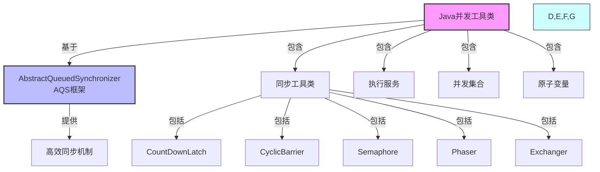
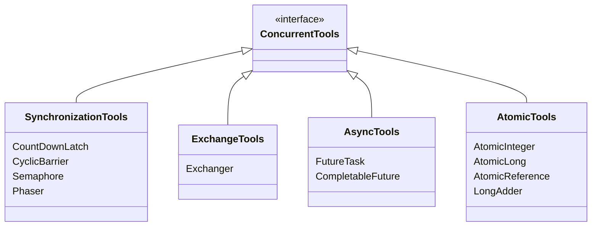
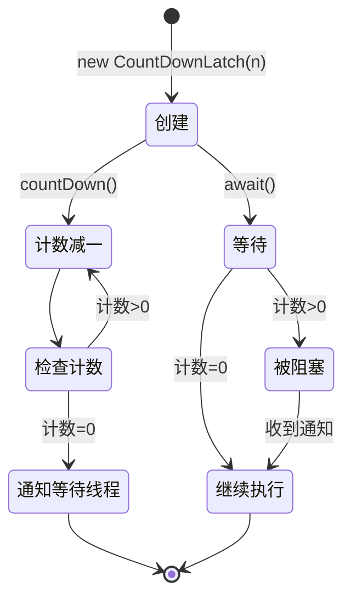
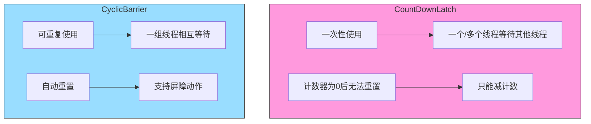
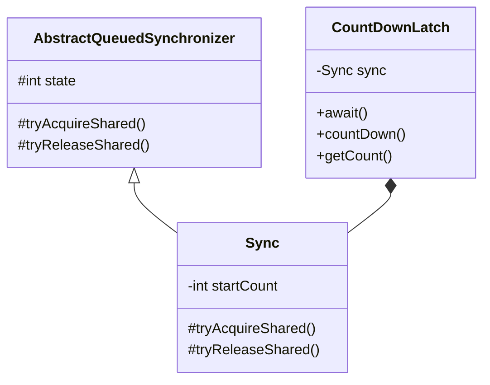

import Tabs from '@theme/Tabs';
import TabItem from '@theme/TabItem';
import TOCInline from '@theme/TOCInline';

# Java 并发工具类详解

Java并发包（java.util.concurrent）提供了丰富的并发工具类，用于简化多线程编程。这些工具类提供了比传统synchronized更灵活和高效的并发控制机制。本文将详细介绍各种并发工具类的使用方法和最佳实践。

:::info 本文内容概览
<TOCInline toc={toc} />
:::

:::tip 核心价值
**并发工具类 = 灵活同步 + 性能优化 + 易用性 + 丰富功能**
- 🔄 **灵活控制**：提供比synchronized更灵活的同步机制
- 🚀 **高性能**：采用更高效的算法和实现，优化竞争处理
- 🧩 **功能丰富**：针对不同场景提供专用工具
- 🛡️ **健壮性**：内置超时、中断、异常处理等机制
- 📊 **可伸缩性**：适应各种复杂并发场景
:::

## 1. 并发工具类概述

### 1.1 什么是并发工具类？



:::tip 核心概念
并发工具类是Java并发包中提供的一组高级同步工具，它们基于AQS（AbstractQueuedSynchronizer）实现，提供了比传统synchronized更灵活、更高效的并发控制机制。
:::

### 1.2 并发工具类的优势

<div className="card">
<div className="card__header">
<h4>并发工具类与传统同步机制对比</h4>
</div>
<div className="card__body">

| 优势 | 具体体现 | 业务价值 |
|------|----------|----------|
| **灵活性** | 支持超时、中断、公平性等特性 | 适应复杂业务场景 |
| **高性能** | 基于AQS实现，性能优于synchronized | 提高系统吞吐量 |
| **功能丰富** | 提供多种同步机制 | 简化编程复杂度 |
| **可扩展性** | 支持自定义同步器 | 满足特殊需求 |
| **可读性** | 语义清晰，代码易理解 | 提高代码质量 |

</div>
</div>

### 1.3 并发工具类分类



<Tabs>
  <TabItem value="sync_tools" label="同步工具类" default>
  <div className="card">
  <div className="card__body">
  
  **同步工具类主要用于协调多个线程的执行顺序和状态：**
  
  | 工具类 | 主要功能 | 特点 | 适用场景 |
  |-------|---------|------|----------|
  | **CountDownLatch** | 让一个或多个线程等待一组操作完成 | 一次性使用，计数器为0后无法重置 | 启动信号、资源初始化等待 |
  | **CyclicBarrier** | 让一组线程在某个点相互等待 | 可重复使用，自动重置计数 | 分阶段计算、并行迭代算法 |
  | **Semaphore** | 控制同时访问某个资源的线程数量 | 支持公平/非公平模式，可动态调整许可 | 连接池管理、资源限制 |
  | **Phaser** | 允许多阶段同步，动态调整参与方数量 | 功能最强大、最复杂 | 复杂多阶段并行任务 |
  
  </div>
  </div>
  </TabItem>
  
  <TabItem value="exchange_tools" label="交换工具类">
  <div className="card">
  <div className="card__body">
  
  **交换工具类用于线程间数据交换：**
  
  | 工具类 | 主要功能 | 特点 | 适用场景 |
  |-------|---------|------|----------|
  | **Exchanger** | 两个线程之间交换数据 | 双向交换，支持超时 | 生产者/消费者模式、双向数据流 |
  
  </div>
  </div>
  </TabItem>
  
  <TabItem value="async_tools" label="异步工具类">
  <div className="card">
  <div className="card__body">
  
  **异步工具类用于处理异步计算结果：**
  
  | 工具类 | 主要功能 | 特点 | 适用场景 |
  |-------|---------|------|----------|
  | **FutureTask** | 表示一个可取消的异步计算 | 可获取结果、检查状态、取消任务 | 单个异步任务处理 |
  | **CompletableFuture** | 支持组合式异步编程 | 支持任务链式处理、异常处理 | 复杂异步工作流 |
  
  </div>
  </div>
  </TabItem>
  
  <TabItem value="atomic_tools" label="原子工具类">
  <div className="card">
  <div className="card__body">
  
  **原子工具类用于原子操作：**
  
  | 工具类 | 主要功能 | 特点 | 适用场景 |
  |-------|---------|------|----------|
  | **AtomicInteger** | 原子更新整型值 | CAS操作，无锁 | 计数器、序列号生成 |
  | **AtomicReference** | 原子更新引用类型 | 支持引用的原子更新 | 原子更新对象 |
  | **LongAdder** | 高并发计数器 | 分段计数，减少竞争 | 高并发统计场景 |
  
  </div>
  </div>
  </TabItem>
</Tabs>

## 2. CountDownLatch（倒计时门闩）

### 2.1 CountDownLatch 基本概念



<div className="card">
<div className="card__header">
<h4>CountDownLatch核心特性</h4>
</div>
<div className="card__body">

**CountDownLatch**是一个同步工具类，允许一个或多个线程等待其他线程完成操作。

**关键特性：**
- 初始化时指定计数值
- 调用`countDown()`方法使计数值减1
- 调用`await()`方法等待计数值变为0
- **一次性使用**：计数值为0后无法重置
- 支持超时等待：`await(long timeout, TimeUnit unit)`

**主要应用场景：**
- 启动信号：等待所有服务就绪后再开始
- 任务分解：将大任务分解为多个小任务并行处理
- 资源初始化：等待多个资源初始化完成

</div>
</div>

<Tabs>
  <TabItem value="basic_usage" label="基本用法" default>
  ```java
  import java.util.concurrent.CountDownLatch;
  import java.util.concurrent.ExecutorService;
  import java.util.concurrent.Executors;
  
  /**
   * CountDownLatch基本用法
   */
  public static class BasicUsage {
      public static void main(String[] args) throws InterruptedException {
          int threadCount = 3;
          // 创建一个初始计数为3的CountDownLatch
          CountDownLatch latch = new CountDownLatch(threadCount);
          ExecutorService executor = Executors.newFixedThreadPool(threadCount);
          
          // 启动多个工作线程
          for (int i = 0; i < threadCount; i++) {
              final int taskId = i;
              executor.submit(() -> {
                  try {
                      System.out.println("任务 " + taskId + " 开始执行");
                      Thread.sleep(1000 + taskId * 500); // 模拟工作
                      System.out.println("任务 " + taskId + " 执行完成");
                  } catch (InterruptedException e) {
                      Thread.currentThread().interrupt();
                  } finally {
                      latch.countDown(); // 计数器减1
                      System.out.println("任务 " + taskId + " 计数器减1，剩余: " + latch.getCount());
                  }
              });
          }
          
          System.out.println("主线程等待所有任务完成...");
          latch.await(); // 等待所有任务完成
          System.out.println("所有任务已完成！");
              
          executor.shutdown();
      }
  }
  ```
  
  **工作原理：**
  1. 创建`CountDownLatch`并设置初始计数值
  2. 启动多个线程执行任务
  3. 每个任务完成后调用`countDown()`使计数值减1
  4. 主线程调用`await()`等待计数值变为0
  5. 当所有任务完成后，主线程继续执行
  
  </TabItem>
  <TabItem value="timeout_usage" label="超时等待">
  ```java
  import java.util.concurrent.CountDownLatch;
  import java.util.concurrent.TimeUnit;
  
  /**
   * CountDownLatch超时等待
   */
  public static class TimeoutUsage {
      public static void main(String[] args) throws InterruptedException {
          CountDownLatch latch = new CountDownLatch(3);
          
          // 启动工作线程
          for (int i = 0; i < 3; i++) {
              final int taskId = i;
              new Thread(() -> {
                  try {
                      // 每个任务执行时间不同
                      Thread.sleep(2000 + taskId * 1000); // 模拟长时间工作
                      System.out.println("任务 " + taskId + " 完成");
                      latch.countDown();
                  } catch (InterruptedException e) {
                      Thread.currentThread().interrupt();
                  }
              }).start();
          }
          
          // 最多等待5秒
          boolean completed = latch.await(5, TimeUnit.SECONDS);
          if (completed) {
              System.out.println("所有任务在超时时间内完成");
          } else {
              System.out.println("等待超时，还有 " + latch.getCount() + " 个任务未完成");
          }
      }
  }
  ```
  
  **超时处理的优势：**
  - 避免无限期等待
  - 提供失败快速路径
  - 增强系统鲁棒性
  - 支持优雅降级策略
  
  </TabItem>
  <TabItem value="practical_usage" label="实际应用">
  ```java
  import java.util.concurrent.CountDownLatch;
  
  /**
   * 数据加载场景
   */
  public static class DataLoader {
      public void loadData() throws InterruptedException {
          // 创建用于等待三类数据加载完成的CountDownLatch
          CountDownLatch latch = new CountDownLatch(3);
          
          // 并行加载不同类型的数据
          new Thread(() -> {
              try {
                  loadUserData();
                  System.out.println("用户数据加载完成");
              } finally {
                  latch.countDown();
              }
          }).start();
          
          new Thread(() -> {
              try {
                  loadProductData();
                  System.out.println("产品数据加载完成");
              } finally {
                  latch.countDown();
              }
          }).start();
          
          new Thread(() -> {
              try {
                  loadOrderData();
                  System.out.println("订单数据加载完成");
              } finally {
                  latch.countDown();
              }
          }).start();
          
          // 等待所有数据加载完成
          latch.await();
          System.out.println("所有数据加载完成，开始处理业务逻辑");
          processAllData();
      }
      
      // 数据加载和处理方法
      private void loadUserData() { /* 实现省略 */ }
      private void loadProductData() { /* 实现省略 */ }
      private void loadOrderData() { /* 实现省略 */ }
      private void processAllData() { /* 实现省略 */ }
  }
  ```
  
  **应用场景示例：**
  - **微服务启动**：等待多个依赖服务就绪
  - **并行数据处理**：分片处理大型数据集
  - **测试多线程**：确保多个线程同时开始执行
  - **资源初始化**：等待多个资源准备完毕
  
  </TabItem>
</Tabs>

### 2.2 CountDownLatch vs CyclicBarrier



<div className="card">
<div className="card__header">
<h4>CountDownLatch与CyclicBarrier对比</h4>
</div>
<div className="card__body">

| 特性 | CountDownLatch | CyclicBarrier |
|------|--------------|--------------|
| **等待方向** | 一个或多个线程等待其他线程 | 一组线程相互等待 |
| **重用性** | 一次性使用，不可重置 | 可重复使用，自动重置 |
| **计数操作** | `countDown()`减少计数 | 调用`await()`增加计数 |
| **回调动作** | 不支持 | 支持屏障动作（barrier action） |
| **超时支持** | 支持超时等待 | 支持超时等待 |
| **创建方式** | 指定计数值 | 指定参与线程数和可选的屏障动作 |
| **使用场景** | 启动信号、任务分解 | 分阶段计算、并行迭代 |

</div>
</div>

### 2.3 CountDownLatch 实现原理



<details>
<summary><strong>CountDownLatch内部实现细节</strong></summary>

CountDownLatch基于AQS（AbstractQueuedSynchronizer）实现，它使用AQS的共享模式：

1. **状态管理**：
   - AQS的state变量用作计数器
   - 初始化时设置为指定的计数值
   - 每次countDown()时将state减1
   - 当state变为0时，所有等待的线程被释放

2. **关键方法实现**：
   - `countDown()`：调用AQS的`releaseShared()`方法，减少计数
   - `await()`：调用AQS的`acquireShared()`方法，如果计数不为0则阻塞
   - `await(timeout, unit)`：调用AQS的`tryAcquireSharedNanos()`方法，支持超时

3. **线程排队机制**：
   - 使用AQS内部的FIFO队列来管理等待的线程
   - 当计数器变为0时，AQS会释放所有等待的线程

4. **为什么不可重用**：
   - CountDownLatch的计数器只能减不能增
   - 一旦计数器达到0，就无法恢复到初始状态
   - 这是设计决策，而非技术限制

</details>

## 3. CyclicBarrier（循环屏障）

### 3.1 CyclicBarrier 基本概念

CyclicBarrier是一个同步工具类，允许一组线程互相等待，直到所有线程都到达某个公共屏障点。

```java title="CyclicBarrier基本用法示例"
import java.util.concurrent.CyclicBarrier;
import java.util.concurrent.ExecutorService;
import java.util.concurrent.Executors;
import java.util.concurrent.BrokenBarrierException;

public class CyclicBarrierExamples {
    
    /**
     * CyclicBarrier基本用法
     */
    public static class BasicUsage {
    public static void main(String[] args) {
        int threadCount = 3;
        CyclicBarrier barrier = new CyclicBarrier(threadCount, () -> {
            System.out.println("所有线程都到达屏障点，开始下一轮");
        });
        
        ExecutorService executor = Executors.newFixedThreadPool(threadCount);
            
            System.out.println("=== CyclicBarrier基本用法 ===");
        
        for (int i = 0; i < threadCount; i++) {
            final int threadId = i;
            executor.submit(() -> {
                try {
                    for (int round = 0; round < 3; round++) {
                        System.out.println("线程 " + threadId + " 执行第 " + round + " 轮");
                            Thread.sleep(1000 + threadId * 200);
                        System.out.println("线程 " + threadId + " 到达屏障点");
                        barrier.await(); // 等待其他线程
                    }
                    } catch (InterruptedException | BrokenBarrierException e) {
                        Thread.currentThread().interrupt();
                }
            });
        }
        
        executor.shutdown();
    }
}
    
    /**
     * CyclicBarrier超时处理
     */
    public static class TimeoutUsage {
        public static void main(String[] args) {
            int threadCount = 3;
            CyclicBarrier barrier = new CyclicBarrier(threadCount);
            
            for (int i = 0; i < threadCount; i++) {
                final int threadId = i;
                new Thread(() -> {
                    try {
                        for (int round = 0; round < 2; round++) {
                            System.out.println("线程 " + threadId + " 开始第 " + round + " 轮");
                            
                            // 模拟不同线程的执行时间
                            Thread.sleep(1000 + threadId * 1000);
                            
                            try {
                                // 等待最多3秒
                                barrier.await(3, TimeUnit.SECONDS);
                                System.out.println("线程 " + threadId + " 第 " + round + " 轮完成");
                            } catch (TimeoutException e) {
                                System.out.println("线程 " + threadId + " 等待超时");
                                barrier.reset(); // 重置屏障
                                break;
                            }
                        }
                    } catch (InterruptedException | BrokenBarrierException e) {
                        Thread.currentThread().interrupt();
                    }
                }).start();
            }
        }
    }
    
    /**
     * CyclicBarrier实际应用场景
     */
    public static class PracticalApplications {
        
        /**
         * 矩阵处理场景
         */
        public static class MatrixProcessor {
            public void processMatrix(int[][] matrix) {
        int rows = matrix.length;
        CyclicBarrier barrier = new CyclicBarrier(rows, () -> {
            System.out.println("所有行处理完成，开始下一阶段");
        });
        
        for (int i = 0; i < rows; i++) {
            final int rowIndex = i;
            new Thread(() -> {
                try {
                            // 第一阶段：处理矩阵的每一行
                    processRow(matrix[rowIndex]);
                    barrier.await();
                    
                            // 第二阶段：等待所有行处理完成后，进行下一阶段
                    processRowPhase2(matrix[rowIndex]);
                    barrier.await();
                    
                            // 第三阶段：最终处理
                            processRowPhase3(matrix[rowIndex]);
                            barrier.await();
                            
                        } catch (InterruptedException | BrokenBarrierException e) {
                            Thread.currentThread().interrupt();
                }
            }).start();
        }
    }
    
    private void processRow(int[] row) {
                try {
                    System.out.println("处理行数据: " + Arrays.toString(row));
                    Thread.sleep(500);
                } catch (InterruptedException e) {
                    Thread.currentThread().interrupt();
                }
    }
    
    private void processRowPhase2(int[] row) {
                try {
                    System.out.println("第二阶段处理行数据: " + Arrays.toString(row));
                    Thread.sleep(300);
                } catch (InterruptedException e) {
                    Thread.currentThread().interrupt();
                }
            }
            
            private void processRowPhase3(int[] row) {
                try {
                    System.out.println("第三阶段处理行数据: " + Arrays.toString(row));
                    Thread.sleep(200);
                } catch (InterruptedException e) {
                    Thread.currentThread().interrupt();
                }
            }
        }
        
        /**
         * 游戏同步场景
         */
        public static class GameSynchronizer {
            public void startGame(int playerCount) {
                CyclicBarrier barrier = new CyclicBarrier(playerCount, () -> {
                    System.out.println("所有玩家准备就绪，开始新一轮");
                });
                
                for (int i = 0; i < playerCount; i++) {
                    final int playerId = i;
                    new Thread(() -> {
                        try {
                            for (int round = 0; round < 3; round++) {
                                System.out.println("玩家 " + playerId + " 准备第 " + round + " 轮");
                                Thread.sleep(1000 + playerId * 200);
                                
                                barrier.await();
                                
                                System.out.println("玩家 " + playerId + " 完成第 " + round + " 轮");
                            }
                        } catch (InterruptedException | BrokenBarrierException e) {
                            Thread.currentThread().interrupt();
                        }
                    }).start();
                }
            }
        }
    }
}
```

## 4. Semaphore（信号量）

### 4.1 Semaphore 基本概念

Semaphore是一个计数信号量，用于控制同时访问特定资源的线程数量。

```java title="Semaphore基本用法示例"
import java.util.concurrent.Semaphore;
import java.util.concurrent.ExecutorService;
import java.util.concurrent.Executors;
import java.util.concurrent.TimeUnit;

public class SemaphoreExamples {
    
    /**
     * Semaphore基本用法
     */
    public static class BasicUsage {
    public static void main(String[] args) {
        // 限制同时访问的线程数为2
        Semaphore semaphore = new Semaphore(2);
        ExecutorService executor = Executors.newFixedThreadPool(5);
            
            System.out.println("=== Semaphore基本用法 ===");
        
        for (int i = 0; i < 5; i++) {
            final int taskId = i;
            executor.submit(() -> {
                try {
                    System.out.println("任务 " + taskId + " 尝试获取许可");
                    semaphore.acquire(); // 获取许可
                    
                    System.out.println("任务 " + taskId + " 获得许可，开始执行");
                    Thread.sleep(2000); // 模拟工作
                    System.out.println("任务 " + taskId + " 执行完成");
                    
                } catch (InterruptedException e) {
                    Thread.currentThread().interrupt();
                } finally {
                    semaphore.release(); // 释放许可
                    System.out.println("任务 " + taskId + " 释放许可");
                }
            });
        }
        
        executor.shutdown();
    }
}
    
    /**
     * Semaphore公平模式
     */
    public static class FairUsage {
        public static void main(String[] args) {
            // 创建公平模式的信号量
            Semaphore semaphore = new Semaphore(2, true);
            
            for (int i = 0; i < 4; i++) {
                final int threadId = i;
                new Thread(() -> {
                    try {
                        System.out.println("线程 " + threadId + " 尝试获取许可");
                        semaphore.acquire();
                        
                        System.out.println("线程 " + threadId + " 获得许可");
                        Thread.sleep(1000);
                        
                    } catch (InterruptedException e) {
                        Thread.currentThread().interrupt();
                    } finally {
                        semaphore.release();
                        System.out.println("线程 " + threadId + " 释放许可");
                    }
                }).start();
            }
        }
    }
    
    /**
     * Semaphore超时控制
     */
    public static class TimeoutUsage {
        public static void main(String[] args) {
            Semaphore semaphore = new Semaphore(1);
            
            // 线程1：长时间持有许可
            new Thread(() -> {
                try {
                    semaphore.acquire();
                    System.out.println("线程1获得许可，开始长时间工作");
                    Thread.sleep(5000);
                    System.out.println("线程1完成工作");
                } catch (InterruptedException e) {
                    Thread.currentThread().interrupt();
                } finally {
                    semaphore.release();
                }
            }).start();
            
            // 线程2：尝试获取许可，但会超时
            new Thread(() -> {
                try {
                    System.out.println("线程2尝试获取许可");
                    boolean acquired = semaphore.tryAcquire(2, TimeUnit.SECONDS);
                    if (acquired) {
                        System.out.println("线程2获得许可");
                        semaphore.release();
                    } else {
                        System.out.println("线程2获取许可超时");
                    }
                } catch (InterruptedException e) {
                    Thread.currentThread().interrupt();
                }
            }).start();
        }
    }
    
    /**
     * Semaphore实际应用场景
     */
    public static class PracticalApplications {
        
        /**
         * 连接池实现
         */
        public static class ConnectionPool {
    private final Semaphore semaphore;
    private final List<Connection> connections;
    
    public ConnectionPool(int poolSize) {
        this.semaphore = new Semaphore(poolSize);
        this.connections = new ArrayList<>();
        
        // 初始化连接池
        for (int i = 0; i < poolSize; i++) {
            connections.add(new Connection("Connection-" + i));
        }
    }
    
    public Connection getConnection() throws InterruptedException {
        semaphore.acquire(); // 获取许可
        synchronized (connections) {
            return connections.remove(0);
        }
    }
    
    public void releaseConnection(Connection connection) {
        synchronized (connections) {
            connections.add(connection);
        }
        semaphore.release(); // 释放许可
    }
            
            public int getAvailableConnections() {
                return semaphore.availablePermits();
            }
    
    static class Connection {
        private final String name;
        
        public Connection(String name) {
            this.name = name;
        }
        
        public String getName() {
            return name;
                }
                
                @Override
                public String toString() {
                    return "Connection{name='" + name + "'}";
                }
            }
        }
        
        /**
         * 限流器实现
         */
        public static class RateLimiter {
            private final Semaphore semaphore;
            private final int maxPermits;
            
            public RateLimiter(int maxPermits) {
                this.maxPermits = maxPermits;
                this.semaphore = new Semaphore(maxPermits);
            }
            
            public boolean tryAcquire() {
                return semaphore.tryAcquire();
            }
            
            public boolean tryAcquire(long timeout, TimeUnit unit) {
                try {
                    return semaphore.tryAcquire(timeout, unit);
                } catch (InterruptedException e) {
                    Thread.currentThread().interrupt();
                    return false;
                }
            }
            
            public void acquire() throws InterruptedException {
                semaphore.acquire();
            }
            
            public void release() {
                semaphore.release();
            }
            
            public int getAvailablePermits() {
                return semaphore.availablePermits();
            }
            
            public void reset() {
                semaphore.drainPermits();
                semaphore.release(maxPermits);
            }
        }
    }
}
```

## 5. Exchanger（数据交换器）

### 5.1 Exchanger 基本概念

Exchanger是一个同步工具类，用于两个线程之间交换数据。

```java title="Exchanger基本用法示例"
import java.util.concurrent.Exchanger;
import java.util.concurrent.ExecutorService;
import java.util.concurrent.Executors;

public class ExchangerExamples {
    
    /**
     * Exchanger基本用法
     */
    public static class BasicUsage {
    public static void main(String[] args) {
        Exchanger<String> exchanger = new Exchanger<>();
        ExecutorService executor = Executors.newFixedThreadPool(2);
            
            System.out.println("=== Exchanger基本用法 ===");
        
        // 生产者线程
        executor.submit(() -> {
            try {
                String data = "生产者数据";
                System.out.println("生产者准备交换数据: " + data);
                String received = exchanger.exchange(data);
                System.out.println("生产者收到数据: " + received);
            } catch (InterruptedException e) {
                Thread.currentThread().interrupt();
            }
        });
        
        // 消费者线程
        executor.submit(() -> {
            try {
                Thread.sleep(1000); // 模拟处理时间
                String data = "消费者数据";
                System.out.println("消费者准备交换数据: " + data);
                String received = exchanger.exchange(data);
                System.out.println("消费者收到数据: " + received);
            } catch (InterruptedException e) {
                Thread.currentThread().interrupt();
            }
        });
        
        executor.shutdown();
    }
}
    
    /**
     * Exchanger超时控制
     */
    public static class TimeoutUsage {
        public static void main(String[] args) {
            Exchanger<String> exchanger = new Exchanger<>();
            
            // 线程1：立即交换
            new Thread(() -> {
                try {
                    String data = "数据1";
                    System.out.println("线程1准备交换: " + data);
                    String received = exchanger.exchange(data, 2, TimeUnit.SECONDS);
                    System.out.println("线程1收到: " + received);
                } catch (InterruptedException | TimeoutException e) {
                    System.out.println("线程1交换超时或中断");
                }
            }).start();
            
            // 线程2：延迟交换
            new Thread(() -> {
                try {
                    Thread.sleep(3000); // 延迟3秒
                    String data = "数据2";
                    System.out.println("线程2准备交换: " + data);
                    String received = exchanger.exchange(data);
                    System.out.println("线程2收到: " + received);
                } catch (InterruptedException e) {
                    Thread.currentThread().interrupt();
                }
            }).start();
        }
    }
    
    /**
     * Exchanger实际应用场景
     */
    public static class PracticalApplications {
        
        /**
         * 生产者消费者模式
         */
        public static class ProducerConsumer {
    public static void main(String[] args) {
        Exchanger<List<String>> exchanger = new Exchanger<>();
        
        // 生产者
        new Thread(() -> {
            try {
                List<String> buffer = new ArrayList<>();
                for (int i = 0; i < 5; i++) {
                    buffer.add("数据-" + i);
                    if (buffer.size() == 3) {
                        System.out.println("生产者交换缓冲区");
                        buffer = exchanger.exchange(buffer);
                        Thread.sleep(1000);
                    }
                }
            } catch (InterruptedException e) {
                Thread.currentThread().interrupt();
            }
        }).start();
        
        // 消费者
        new Thread(() -> {
            try {
                List<String> buffer = new ArrayList<>();
                for (int i = 0; i < 5; i++) {
                    if (buffer.isEmpty()) {
                        System.out.println("消费者等待数据");
                        buffer = exchanger.exchange(buffer);
                    }
                    String data = buffer.remove(0);
                    System.out.println("消费者处理: " + data);
                }
            } catch (InterruptedException e) {
                Thread.currentThread().interrupt();
            }
        }).start();
            }
        }
        
        /**
         * 数据校验场景
         */
        public static class DataValidator {
            public static void main(String[] args) {
                Exchanger<DataPacket> exchanger = new Exchanger<>();
                
                // 数据生成器
                new Thread(() -> {
                    try {
                        for (int i = 0; i < 3; i++) {
                            DataPacket packet = new DataPacket("数据包-" + i, i * 100);
                            System.out.println("生成数据包: " + packet);
                            
                            DataPacket validatedPacket = exchanger.exchange(packet);
                            System.out.println("收到校验结果: " + validatedPacket);
                        }
                    } catch (InterruptedException e) {
                        Thread.currentThread().interrupt();
                    }
                }).start();
                
                // 数据校验器
                new Thread(() -> {
                    try {
                        for (int i = 0; i < 3; i++) {
                            DataPacket packet = exchanger.exchange(null);
                            System.out.println("校验数据包: " + packet);
                            
                            // 模拟校验过程
                            Thread.sleep(500);
                            packet.setValidated(true);
                            
                            exchanger.exchange(packet);
                        }
                    } catch (InterruptedException e) {
                        Thread.currentThread().interrupt();
                    }
                }).start();
            }
            
            static class DataPacket {
                private String data;
                private int value;
                private boolean validated;
                
                public DataPacket(String data, int value) {
                    this.data = data;
                    this.value = value;
                    this.validated = false;
                }
                
                public void setValidated(boolean validated) {
                    this.validated = validated;
                }
                
                @Override
                public String toString() {
                    return "DataPacket{data='" + data + "', value=" + value + ", validated=" + validated + "}";
                }
            }
        }
    }
}
```

## 6. Phaser（阶段器）

### 6.1 Phaser 基本概念

Phaser是一个更灵活的同步工具类，可以动态调整参与同步的线程数量。

```java title="Phaser基本用法示例"
import java.util.concurrent.Phaser;

public class PhaserExamples {
    
    /**
     * Phaser基本用法
     */
    public static class BasicUsage {
    public static void main(String[] args) {
        Phaser phaser = new Phaser(3); // 初始参与线程数为3
            
            System.out.println("=== Phaser基本用法 ===");
        
        for (int i = 0; i < 3; i++) {
            final int threadId = i;
            new Thread(() -> {
                try {
                    System.out.println("线程 " + threadId + " 开始第一阶段");
                    Thread.sleep(1000);
                    phaser.arriveAndAwaitAdvance(); // 等待所有线程完成第一阶段
                    
                    System.out.println("线程 " + threadId + " 开始第二阶段");
                    Thread.sleep(1000);
                    phaser.arriveAndAwaitAdvance(); // 等待所有线程完成第二阶段
                    
                    System.out.println("线程 " + threadId + " 完成所有阶段");
                    phaser.arriveAndDeregister(); // 退出同步
                    
                } catch (InterruptedException e) {
                    Thread.currentThread().interrupt();
                }
            }).start();
        }
    }
}
    
    /**
     * Phaser动态注册
     */
    public static class DynamicRegistration {
        public static void main(String[] args) {
            Phaser phaser = new Phaser(1); // 主线程注册
            
            for (int i = 0; i < 3; i++) {
                final int threadId = i;
            new Thread(() -> {
                    phaser.register(); // 动态注册
                try {
                        System.out.println("线程 " + threadId + " 注册，当前参与数: " + phaser.getRegisteredParties());
                    
                        System.out.println("线程 " + threadId + " 开始工作");
                        Thread.sleep(1000);
                        
                        phaser.arriveAndDeregister(); // 完成工作并注销
                        System.out.println("线程 " + threadId + " 注销，当前参与数: " + phaser.getRegisteredParties());
                    
                } catch (InterruptedException e) {
                    Thread.currentThread().interrupt();
                }
            }).start();
        }
        
            // 主线程等待所有工作线程完成
            phaser.arriveAndAwaitAdvance();
            System.out.println("所有工作线程完成");
        }
    }
    
    /**
     * Phaser实际应用场景
     */
    public static class PracticalApplications {
        
        /**
         * 多阶段任务处理
         */
        public static class MultiPhaseProcessor {
            public void processMultiPhaseTask() {
                Phaser phaser = new Phaser(1);
                
                for (int i = 0; i < 3; i++) {
                    final int workerId = i;
        new Thread(() -> {
                        phaser.register();
                        try {
                            // 第一阶段：数据准备
                            System.out.println("工作者 " + workerId + " 开始数据准备");
                            Thread.sleep(1000);
                            phaser.arriveAndAwaitAdvance();
                            
                            // 第二阶段：数据处理
                            System.out.println("工作者 " + workerId + " 开始数据处理");
                            Thread.sleep(1500);
                            phaser.arriveAndAwaitAdvance();
                            
                            // 第三阶段：结果输出
                            System.out.println("工作者 " + workerId + " 开始结果输出");
                            Thread.sleep(800);
                            phaser.arriveAndDeregister();
                            
                        } catch (InterruptedException e) {
                            Thread.currentThread().interrupt();
                        }
                    }).start();
                }
                
                // 主线程等待所有阶段完成
                phaser.arriveAndAwaitAdvance();
                System.out.println("所有阶段完成");
            }
        }
        
        /**
         * 游戏回合制处理
         */
        public static class GameRoundProcessor {
            public void processGameRounds(int playerCount, int roundCount) {
                Phaser phaser = new Phaser(playerCount);
                
                for (int i = 0; i < playerCount; i++) {
                    final int playerId = i;
                    new Thread(() -> {
                        try {
                            for (int round = 0; round < roundCount; round++) {
                                System.out.println("玩家 " + playerId + " 开始第 " + round + " 轮");
                                
                                // 模拟玩家行动
                                Thread.sleep(500 + playerId * 100);
                                
                                System.out.println("玩家 " + playerId + " 完成第 " + round + " 轮");
                                phaser.arriveAndAwaitAdvance(); // 等待所有玩家完成当前轮
                }
            } catch (InterruptedException e) {
                Thread.currentThread().interrupt();
            }
        }).start();
                }
            }
        }
    }
}
```

## 7. 并发工具类最佳实践

### 7.1 工具类选择指南

:::tip 核心原则
选择合适的并发工具类需要考虑以下因素：
- **同步需求**：一次性等待还是循环等待
- **线程数量**：固定数量还是动态变化
- **超时要求**：是否需要超时控制
- **公平性**：是否需要公平性保证
:::

```java title="工具类选择指南示例"
public class ToolSelectionGuide {
    
    /**
     * 工具类选择指南
     */
    public static void selectionGuide() {
        System.out.println("=== 并发工具类选择指南 ===");
        
        // 1. 一次性等待多个任务完成
        System.out.println("1. 一次性等待多个任务完成 -> CountDownLatch");
        System.out.println("   适用场景：服务启动、数据加载、任务完成等待");
        
        // 2. 循环等待多个线程同步
        System.out.println("2. 循环等待多个线程同步 -> CyclicBarrier");
        System.out.println("   适用场景：多阶段处理、游戏回合、矩阵计算");
        
        // 3. 控制并发访问数量
        System.out.println("3. 控制并发访问数量 -> Semaphore");
        System.out.println("   适用场景：连接池、限流器、资源控制");
        
        // 4. 两个线程交换数据
        System.out.println("4. 两个线程交换数据 -> Exchanger");
        System.out.println("   适用场景：生产者消费者、数据校验、缓冲区交换");
        
        // 5. 动态调整参与线程数量
        System.out.println("5. 动态调整参与线程数量 -> Phaser");
        System.out.println("   适用场景：多阶段任务、游戏处理、复杂同步");
    }
}
```

### 7.2 性能优化技巧

```java title="性能优化示例"
public class PerformanceOptimization {
    
    /**
     * 避免过度同步
     */
    public static class AvoidOverSynchronization {
        public void optimizedApproach() {
            // 不推荐：过度使用同步
            CountDownLatch latch = new CountDownLatch(1);
            Semaphore semaphore = new Semaphore(1);
            
            // 推荐：选择合适的工具
            // 简单等待 -> CountDownLatch
            // 资源控制 -> Semaphore
            // 数据交换 -> Exchanger
        }
    }
    
    /**
     * 合理设置超时
     */
    public static class TimeoutOptimization {
        public void optimizedTimeout() {
            // 设置合理的超时时间
            Semaphore semaphore = new Semaphore(1);
            
            try {
                // 根据业务需求设置超时时间
                boolean acquired = semaphore.tryAcquire(5, TimeUnit.SECONDS);
                if (acquired) {
                    // 处理业务逻辑
                    semaphore.release();
                } else {
                    // 处理超时情况
                    System.out.println("获取资源超时");
                }
            } catch (InterruptedException e) {
                Thread.currentThread().interrupt();
            }
        }
    }
    
    /**
     * 避免死锁
     */
    public static class DeadlockPrevention {
        public void preventDeadlock() {
            // 1. 固定资源获取顺序
            Semaphore sem1 = new Semaphore(1);
            Semaphore sem2 = new Semaphore(1);
            
            // 总是先获取sem1，再获取sem2
    try {
        sem1.acquire();
        sem2.acquire();
        // 使用资源
    } finally {
        sem2.release();
        sem1.release();
            }
            
            // 2. 使用超时机制
            try {
                if (sem1.tryAcquire(1, TimeUnit.SECONDS)) {
                    if (sem2.tryAcquire(1, TimeUnit.SECONDS)) {
                        // 使用资源
                        sem2.release();
                    }
                    sem1.release();
                }
            } catch (InterruptedException e) {
                Thread.currentThread().interrupt();
            }
        }
    }
}
```

### 7.3 常见陷阱与解决方案

| 陷阱 | 问题 | 解决方案 |
|------|------|----------|
| **CountDownLatch重用** | CountDownLatch是一次性的 | 使用CyclicBarrier或Phaser |
| **CyclicBarrier线程数不匹配** | 线程数变化导致死锁 | 使用Phaser动态调整 |
| **Semaphore忘记释放** | 导致其他线程无法获取资源 | 使用try-finally确保释放 |
| **Exchanger超时处理** | 一个线程超时导致另一个线程阻塞 | 使用超时版本的exchange方法 |
| **Phaser过度注册** | 注册过多线程影响性能 | 合理控制注册数量 |

## 8. 总结

Java并发工具类为多线程编程提供了强大而灵活的支持。

### 8.1 关键要点

1. **工具类特性**：CountDownLatch、CyclicBarrier、Semaphore、Exchanger、Phaser
2. **使用场景**：根据具体需求选择合适的工具类
3. **性能优化**：避免过度同步、合理设置超时、防止死锁
4. **最佳实践**：正确使用、及时清理、异常处理

### 8.2 选择建议

| 场景 | 推荐工具类 | 原因 |
|------|------------|------|
| **等待多个任务完成** | CountDownLatch | 一次性等待，简单高效 |
| **循环同步** | CyclicBarrier | 支持重置，适合多轮处理 |
| **资源控制** | Semaphore | 控制并发数量，支持公平性 |
| **数据交换** | Exchanger | 专门用于两个线程交换数据 |
| **动态同步** | Phaser | 支持动态调整参与线程数量 |

### 8.3 学习建议

1. **理解原理**：深入理解各种工具类的工作原理
2. **实践验证**：通过编写代码验证不同工具类的效果
3. **场景选择**：根据具体需求选择合适的工具类
4. **性能测试**：对比不同实现方式的性能差异

通过深入理解和熟练运用这些并发工具类，我们能够构建出更加高效、健壮和可维护的Java并发应用程序。 