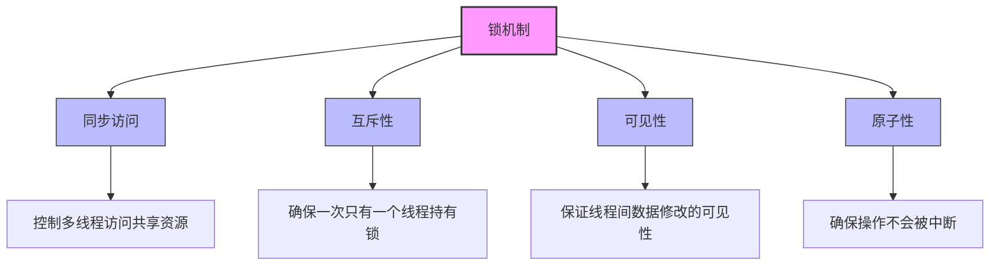
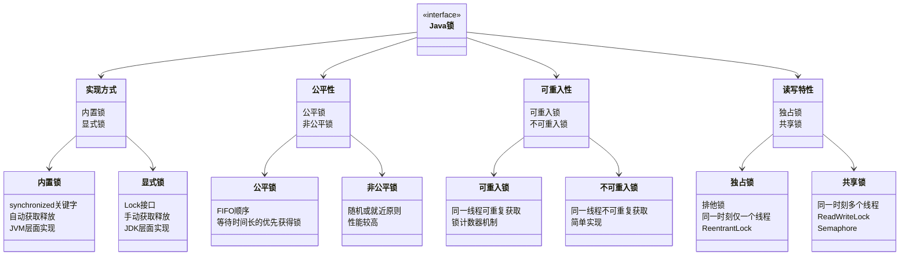
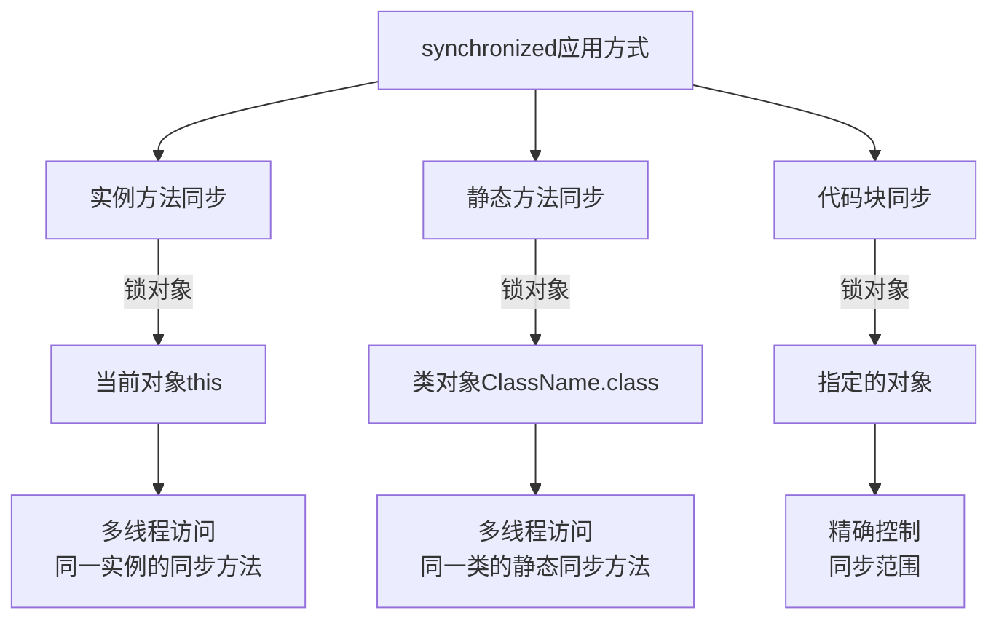
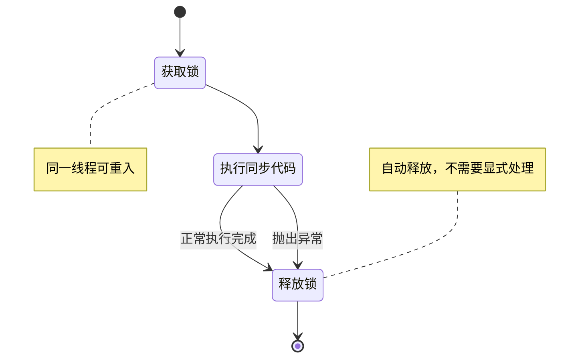
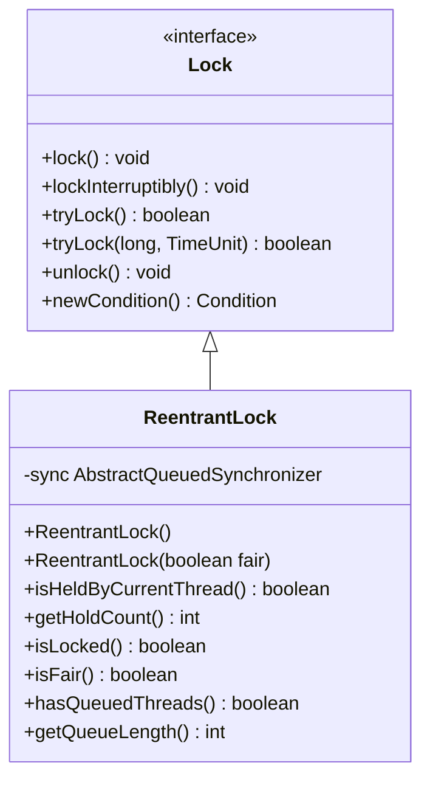
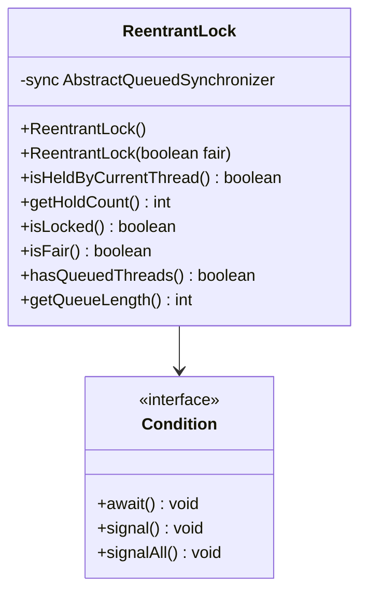
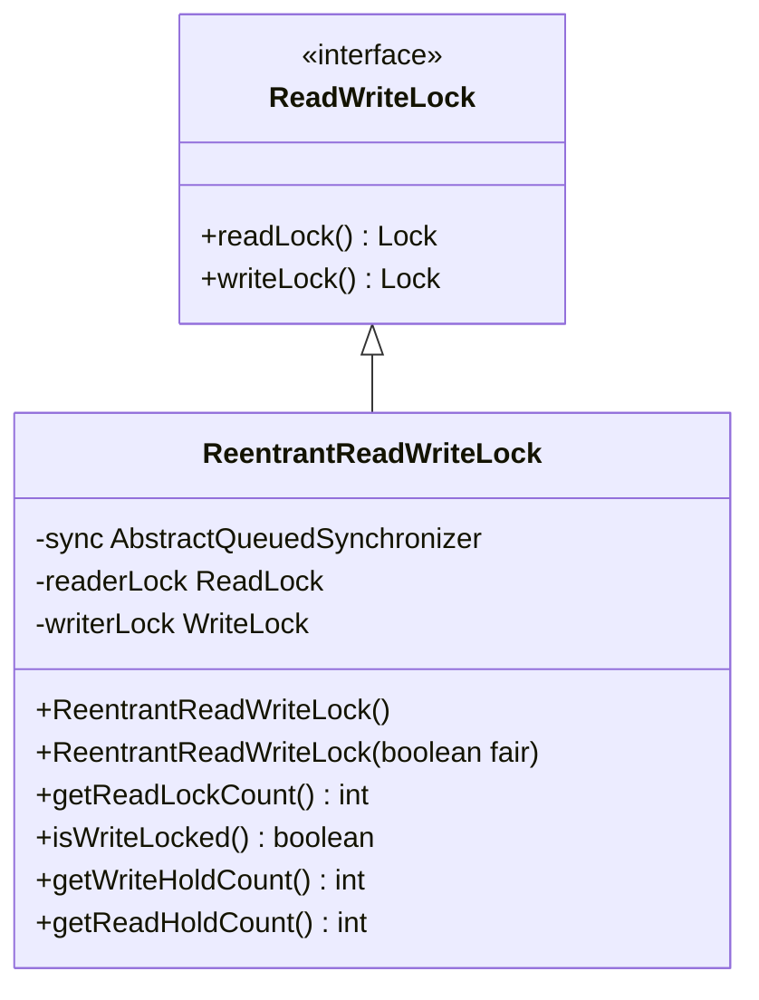
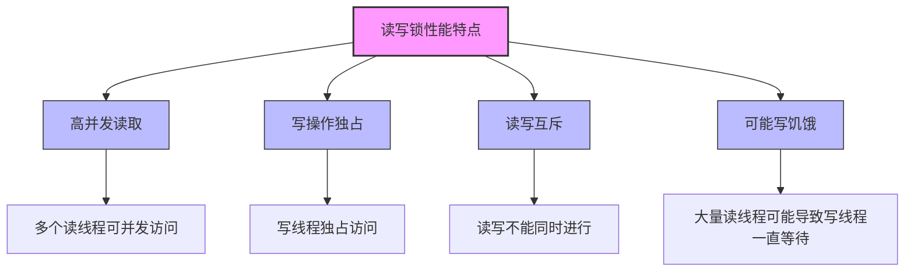

import Tabs from '@theme/Tabs';
import TabItem from '@theme/TabItem';
import TOCInline from '@theme/TOCInline';

# Java 锁机制详解

锁是Java并发编程中实现线程同步的核心机制，理解各种锁的特性和使用场景对于构建高性能的并发应用至关重要。本文将详细介绍Java中的各种锁机制。

:::info 本文内容概览
<TOCInline toc={toc} />
:::

:::tip 核心价值
**Java锁机制 = 线程同步 + 资源保护 + 执行顺序控制 + 内存可见性**
- 🔒 **同步访问**：确保共享资源的互斥访问
- 🛡️ **数据保护**：避免数据竞争和状态不一致
- ⚡ **高性能**：通过不同锁策略优化并发性能
- 🔄 **执行控制**：管理线程的执行顺序和时序关系
- 👁️ **可见性**：确保线程间数据修改的可见性
:::

## 1. 锁机制概述

### 1.1 什么是锁？



:::tip 核心概念
锁是一种同步机制，用于控制多个线程对共享资源的访问。锁确保在任意时刻只有一个线程能够访问被保护的资源，从而保证数据的一致性和完整性。
:::

### 1.2 锁的分类

<div className="card">
<div className="card__body">

| 分类维度 | 类型 | 特点 | 适用场景 |
|----------|------|------|----------|
| **实现方式** | synchronized | 内置锁，自动管理 | 简单同步需求 |
| | Lock接口 | 显式锁，手动管理 | 复杂同步需求 |
| **公平性** | 非公平锁 | 性能高，不保证顺序 | 一般场景 |
| | 公平锁 | 保证FIFO顺序 | 需要公平性场景 |
| **可重入性** | 可重入锁 | 同一线程可多次获取 | 递归调用场景 |
| | 不可重入锁 | 同一线程只能获取一次 | 简单场景 |
| **读写特性** | 独占锁 | 只允许一个线程访问 | 写操作 |
| | 读写锁 | 允许多个读，单个写 | 读多写少场景 |
| **乐观/悲观** | 悲观锁 | 假设会发生冲突，先获取锁 | 高并发写操作 |
| | 乐观锁 | 假设不会发生冲突，检测更新 | 读多写少场景 |

</div>
</div>

<details>
<summary><strong>锁分类详细图</strong></summary>



</details>

### 1.3 锁的性能特性

<Tabs>
  <TabItem value="comparison" label="锁类型性能对比" default>
  <div className="card">
  <div className="card__body">
  
  | 锁类型 | 性能 | 功能 | 使用复杂度 | 死锁风险 | 活跃性 |
  |--------|------|------|------------|----------|--------|
  | **synchronized** | 中等 | 基础功能 | 简单 | 中等 | 不可中断 |
  | **ReentrantLock** | 高 | 丰富 | 中等 | 低（可超时） | 可中断 |
  | **ReadWriteLock** | 读多写少场景高 | 分离读写 | 中等 | 中等 | 可中断 |
  | **StampedLock** | 非常高 | 乐观读 | 复杂 | 低 | 高 |
  | **乐观锁(CAS)** | 低竞争下高 | 无阻塞 | 复杂 | 无 | 高 |
  
  </div>
  </div>
  </TabItem>
  <TabItem value="metrics" label="关键性能指标">
  <div className="card">
  <div className="card__body">
  
  **锁的性能衡量指标：**
  
  1. **锁竞争开销**：多个线程同时请求锁时的性能损失
  2. **锁持有时间**：获取锁到释放锁的平均时间
  3. **等待队列长度**：等待获取锁的线程数量
  4. **上下文切换次数**：线程因为锁而被挂起和恢复的次数
  5. **内存开销**：锁机制所需的内存空间
  6. **CPU利用率**：锁实现机制对CPU的使用率
  7. **可伸缩性**：随着线程数增加，性能的变化趋势
  
  </div>
  </div>
  </TabItem>
  <TabItem value="scenarios" label="最佳场景">
  <div className="card">
  <div className="card__body">
  
  | 场景 | 推荐锁 | 原因 |
  |------|--------|------|
  | **简单同步** | synchronized | 简单易用，自动管理 |
  | **需要中断/超时** | ReentrantLock | 支持lockInterruptibly()和tryLock() |
  | **读多写少** | ReadWriteLock | 允许并发读，提高吞吐量 |
  | **高性能读场景** | StampedLock | 支持乐观读，无锁访问 |
  | **低竞争环境** | CAS操作 | 避免线程阻塞，性能高 |
  | **公平性要求** | ReentrantLock(true) | 支持公平调度 |
  | **可中断任务** | ReentrantLock | 支持中断等待 |
  | **递归调用** | synchronized/ReentrantLock | 支持重入 |
  
  </div>
  </div>
  </TabItem>
</Tabs>

## 2. synchronized 关键字

### 2.1 synchronized 基本用法



<Tabs>
  <TabItem value="instance_method" label="实例方法同步" default>
  ```java
  public class Counter {
      private int count = 0;
      
      // 实例方法同步 - 锁是当前实例(this)
      public synchronized void increment() {
          count++;
      }
      
      public synchronized int getCount() {
          return count;
      }
  }
  
  // 使用方式
  Counter counter = new Counter();
  // 多个线程调用同一实例的方法
  counter.increment(); // 线程安全
  
  // 注意: 不同实例之间的方法调用不受影响
  Counter counter1 = new Counter();
  Counter counter2 = new Counter();
  // 这两个调用可以并发执行，互不干扰
  counter1.increment();
  counter2.increment();
  ```
  </TabItem>
  <TabItem value="static_method" label="静态方法同步">
  ```java
  public class StaticCounter {
      private static int count = 0;
      
      // 静态方法同步 - 锁是类对象(StaticCounter.class)
      public static synchronized void increment() {
          count++;
      }
      
      public static synchronized int getCount() {
          return count;
      }
  }
  
  // 使用方式
  // 多个线程调用同一个类的静态方法
  StaticCounter.increment(); // 线程安全
  
  // 注意: 所有线程都会竞争同一个锁(类锁)，
  // 即使是不同实例的调用也会相互影响
  new Thread(() -> StaticCounter.increment()).start();
  new Thread(() -> StaticCounter.increment()).start();
  ```
  </TabItem>
  <TabItem value="synchronized_block" label="代码块同步">
  ```java
  public class BlockSynchronization {
      private int count = 0;
      private final Object lock = new Object(); // 显式锁对象
      
      public void increment() {
          // 只同步关键代码块，使用自定义锁对象
          synchronized (lock) {
              count++;
          }
          
          // 这里是非同步代码
          System.out.println("Current count: " + count);
      }
      
      public void otherMethod() {
          // 使用this作为锁对象
          synchronized (this) {
              // 这里的同步与synchronized实例方法效果相同
              System.out.println("Using this as lock");
          }
          
          // 使用类对象作为锁
          synchronized (BlockSynchronization.class) {
              // 这里的同步与synchronized静态方法效果相同
              System.out.println("Using class object as lock");
          }
      }
      
      // 特定对象锁的优点
      // 1. 更细粒度的锁控制
      // 2. 避免锁定整个对象
      // 3. 可以使用多个不同的锁对象控制不同的资源
      
      private final Object resourceALock = new Object();
      private final Object resourceBLock = new Object();
      
      public void updateResourceA() {
          synchronized (resourceALock) {
              // 更新资源A
          }
      }
      
      public void updateResourceB() {
          synchronized (resourceBLock) {
              // 更新资源B
          }
      }
      // 资源A和B可以并发访问，互不影响
  }
  ```
  </TabItem>
  <TabItem value="double_check" label="双重检查锁定">
  ```java
  public class Singleton {
      // volatile确保多线程可见性和防止指令重排序
      private volatile static Singleton instance;
      
      private Singleton() {}
      
      public static Singleton getInstance() {
          // 第一次检查 - 不需要同步
          if (instance == null) {
              // 同步块 - 只有需要创建实例时才同步
              synchronized (Singleton.class) {
                  // 第二次检查 - 防止多个线程都通过了第一次检查
                  if (instance == null) {
                      instance = new Singleton();
                  }
              }
          }
          return instance;
      }
      
      /* 
       * 为什么需要volatile?
       * 防止指令重排序导致的部分初始化对象问题:
       * 1. 分配内存空间
       * 2. 初始化对象
       * 3. 将引用指向内存空间
       * 
       * 如果发生2和3的重排序，其他线程可能会看到一个未完全初始化的对象
       */
  }
  ```
  </TabItem>
</Tabs>

### 2.2 synchronized 的特性



<Tabs>
  <TabItem value="reentrant" label="可重入性" default>
  <div className="card">
  <div className="card__body">
  
  **可重入性（Reentrancy）是指同一个线程可以多次获取同一把锁。**

  ```java
  public class ReentrantExample {
      // 可重入性示例
      public synchronized void outer() {
          System.out.println("Entering outer method");
          // 同一线程可以再次获取相同的锁
          inner();
          System.out.println("Exiting outer method");
      }
      
      public synchronized void inner() {
          System.out.println("Executing inner method");
      }
  }
  
  // 执行结果:
  // Entering outer method
  // Executing inner method  <-- 可以重入获取锁
  // Exiting outer method
  ```
  
  </div>
  </div>
  </TabItem>
  <TabItem value="auto_release" label="自动释放">
  <div className="card">
  <div className="card__body">
  
  **synchronized 会在以下情况自动释放锁:**
  
  1. 同步代码块执行完成
  2. 同步方法返回
  3. 同步代码块/方法中抛出未捕获的异常
  
  ```java
  public synchronized void safeMethod() {
      try {
          // 可能抛出异常的代码
          if (Math.random() < 0.5) {
              throw new RuntimeException("示例异常");
          }
          System.out.println("操作成功");
      } catch (Exception e) {
          System.out.println("捕获到异常: " + e.getMessage());
          // 即使抛出异常，锁也会被正确释放
      }
      // 无需手动释放锁
  }
  ```
  
  </div>
  </div>
  </TabItem>
  <TabItem value="memory" label="内存可见性">
  <div className="card">
  <div className="card__body">
  
  **synchronized 保证了内存可见性，确保一个线程对共享变量的修改对其他线程可见。**
  
  ```java
  public class MemoryVisibility {
      private int counter = 0;
      private boolean flag = false;
      
      public synchronized void write() {
          counter = 42;
          flag = true;
          // 退出同步块时，修改会刷新到主内存
      }
      
      public synchronized void read() {
          // 进入同步块时，会从主内存读取最新值
          if (flag) {
              // 一定能看到counter的最新值(42)
              System.out.println("Counter: " + counter);
          }
      }
  }
  ```
  
  **工作原理:**
  - 获取锁时，清空工作内存中的共享变量，从主内存重新加载
  - 释放锁时，将工作内存中的修改刷新到主内存
  
  </div>
  </div>
  </TabItem>
  <TabItem value="atomicity" label="原子性">
  <div className="card">
  <div className="card__body">
  
  **synchronized 确保了多个操作作为一个原子单元执行，不会被其他线程中断。**
  
  ```java
  public class AtomicityExample {
      private int counter = 0;
      private int total = 0;
      
      // 非原子操作变成了原子操作
      public synchronized void increment() {
          // counter++ 实际上是三个操作:
          // 1. 读取counter的值
          // 2. 加1
          // 3. 将结果写回counter
          counter++;
          total += counter;
          
          // 整个方法作为一个原子单元，其他线程无法在中间观察到部分更新的状态
      }
      
      public synchronized int[] getValues() {
          // 原子地返回当前状态的快照
          return new int[] { counter, total };
      }
  }
  ```
  
  </div>
  </div>
  </TabItem>
</Tabs>

### 2.3 synchronized 的局限性

<div className="card">
<div className="card__header">
<h4>synchronized 局限性概览</h4>
</div>
<div className="card__body">

| 局限性 | 描述 | 解决方案 |
|--------|------|----------|
| **无法中断等待** | 线程等待锁时无法响应中断 | 使用 ReentrantLock.lockInterruptibly() |
| **无法设置超时** | 无法设置获取锁的超时时间 | 使用 ReentrantLock.tryLock(time, unit) |
| **无法实现公平性** | 无法保证FIFO顺序 | 使用 ReentrantLock(true) 创建公平锁 |
| **无法实现读写分离** | 无法让多个读线程并行访问 | 使用 ReadWriteLock 读写锁 |
| **无法知道锁状态** | 无法查询锁是否被占用 | 使用 Lock 接口的相关方法 |

</div>
</div>

<Tabs>
  <TabItem value="non_interruptible" label="无法中断等待" default>
  ```java
  import java.util.concurrent.locks.Lock;
  import java.util.concurrent.locks.ReentrantLock;
  
  public class InterruptionExample {
      private final Object syncLock = new Object();
      private final Lock interruptibleLock = new ReentrantLock();
      
      public void synchronizedMethod() {
          // synchronized 不响应中断
          synchronized (syncLock) {
              try {
                  System.out.println("获取synchronized锁");
                  Thread.sleep(10000); // 持有锁10秒
              } catch (InterruptedException e) {
                  System.out.println("即使线程被中断，synchronized也会继续执行到完成");
                  Thread.currentThread().interrupt();
              }
          }
      }
      
      public void interruptibleMethod() {
          try {
              // ReentrantLock 可以响应中断
              interruptibleLock.lockInterruptibly();
              try {
                  System.out.println("获取可中断锁");
                  Thread.sleep(10000); // 尝试持有锁10秒
              } finally {
                  interruptibleLock.unlock();
              }
          } catch (InterruptedException e) {
              System.out.println("锁等待被中断，可以执行其他操作");
          }
      }
      
      public static void main(String[] args) throws InterruptedException {
          InterruptionExample example = new InterruptionExample();
          
          // 先占用锁
          Thread blocker = new Thread(() -> {
              example.synchronizedMethod();
          });
          blocker.start();
          Thread.sleep(100); // 确保blocker获得锁
          
          // 尝试获取锁并中断
          Thread waiter = new Thread(() -> {
              try {
                  System.out.println("等待锁...");
                  example.synchronizedMethod(); // 这里会被阻塞
              } finally {
                  System.out.println("waiter线程结束");
              }
          });
          
          waiter.start();
          Thread.sleep(1000); // 让waiter等待一段时间
          
          System.out.println("尝试中断waiter线程");
          waiter.interrupt(); // 中断waiter线程
          
          // 注意: waiter线程会一直等待，直到blocker释放锁
          // synchronized不响应中断
      }
  }
  ```
  </TabItem>
  <TabItem value="no_timeout" label="无法设置超时">
  ```java
  import java.util.concurrent.TimeUnit;
  import java.util.concurrent.locks.Lock;
  import java.util.concurrent.locks.ReentrantLock;
  
  public class TimeoutExample {
      private final Object syncLock = new Object();
      private final Lock timeoutLock = new ReentrantLock();
      
      public void synchronizedMethod() {
          // synchronized 无法设置超时
          synchronized (syncLock) {
              System.out.println("获取synchronized锁");
              sleep(5000); // 持有锁5秒
          }
      }
      
      public boolean timeoutMethod(long timeout) {
          try {
              // ReentrantLock 支持超时获取锁
              if (timeoutLock.tryLock(timeout, TimeUnit.MILLISECONDS)) {
                  try {
                      System.out.println("在超时时间内获取到锁");
                      return true;
                  } finally {
                      timeoutLock.unlock();
                  }
              } else {
                  System.out.println("获取锁超时");
                  return false;
              }
          } catch (InterruptedException e) {
              System.out.println("等待锁时被中断");
              return false;
          }
      }
      
      private void sleep(long millis) {
          try {
              Thread.sleep(millis);
          } catch (InterruptedException e) {
              Thread.currentThread().interrupt();
          }
      }
  }
  ```
  </TabItem>
  <TabItem value="no_fairness" label="无法实现公平性">
  ```java
  import java.util.concurrent.locks.Lock;
  import java.util.concurrent.locks.ReentrantLock;
  
  public class FairnessExample {
      // synchronized 无法设置公平性
      private final Object syncLock = new Object();
      
      // ReentrantLock 可以创建公平锁
      private final Lock fairLock = new ReentrantLock(true);
      private final Lock unfairLock = new ReentrantLock(false);
      
      public void testFairness() {
          // 创建多个线程竞争锁
          for (int i = 0; i < 5; i++) {
              final int threadId = i;
              new Thread(() -> {
                  for (int j = 0; j < 3; j++) {
                      // 使用公平锁
                      fairLock.lock();
                      try {
                          System.out.println("线程 " + threadId + 
                              " 获取公平锁，尝试次数 " + j);
                          sleep(100);
                      } finally {
                          fairLock.unlock();
                      }
                  }
              }).start();
          }
      }
      
      // 公平锁与非公平锁的区别:
      // 1. 公平锁: 按照FIFO顺序获取锁，等待时间最长的线程优先获取
      // 2. 非公平锁: 允许"插队"，新到达的线程可能比等待中的线程先获取锁
      // 3. synchronized 默认是非公平的，且无法配置为公平模式
      
      private void sleep(long millis) {
          try {
              Thread.sleep(millis);
          } catch (InterruptedException e) {
              Thread.currentThread().interrupt();
          }
      }
  }
  ```
  </TabItem>
</Tabs>

## 3. Lock 接口

### 3.1 Lock 接口基本用法



<Tabs>
  <TabItem value="basic_lock" label="基本用法" default>
  ```java
  import java.util.concurrent.locks.Lock;
  import java.util.concurrent.locks.ReentrantLock;
  
  public class LockBasicExample {
      private final Lock lock = new ReentrantLock();
      private int counter = 0;
      
      public void increment() {
          // 获取锁
          lock.lock();
          try {
              // 临界区 - 受锁保护的代码
              counter++;
          } finally {
              // 必须在finally块中释放锁
              lock.unlock();
          }
      }
      
      public int getCount() {
          lock.lock();
          try {
              return counter;
          } finally {
              lock.unlock();
          }
      }
      
      public static void main(String[] args) {
          LockBasicExample example = new LockBasicExample();
          
          // 创建多个线程并发增加计数器
          for (int i = 0; i < 10; i++) {
              new Thread(() -> {
                  for (int j = 0; j < 1000; j++) {
                      example.increment();
                  }
              }).start();
          }
          
          // 等待一段时间后查看结果
          try {
              Thread.sleep(1000);
          } catch (InterruptedException e) {
              Thread.currentThread().interrupt();
          }
          
          System.out.println("计数器最终值: " + example.getCount());
      }
  }
  ```
  </TabItem>
  <TabItem value="interruptible_lock" label="可中断锁">
  ```java
  import java.util.concurrent.locks.Lock;
  import java.util.concurrent.locks.ReentrantLock;
  
  public class InterruptibleLockExample {
      private final Lock lock = new ReentrantLock();
      
      public void methodWithInterruptibleLock() {
          System.out.println(Thread.currentThread().getName() + " 尝试获取锁");
          
          try {
              // 可中断的获取锁，允许响应中断
              lock.lockInterruptibly();
              try {
                  System.out.println(Thread.currentThread().getName() + " 获取到锁");
                  // 模拟长时间操作
                  Thread.sleep(5000);
              } finally {
                  lock.unlock();
                  System.out.println(Thread.currentThread().getName() + " 释放了锁");
              }
          } catch (InterruptedException e) {
              System.out.println(Thread.currentThread().getName() + " 在等待锁的过程中被中断");
          }
      }
      
      public static void main(String[] args) throws InterruptedException {
          InterruptibleLockExample example = new InterruptibleLockExample();
          
          // 线程1先获取锁
          Thread t1 = new Thread(example::methodWithInterruptibleLock, "Thread-1");
          t1.start();
          Thread.sleep(100); // 确保线程1获取到锁
          
          // 线程2尝试获取已经被占用的锁
          Thread t2 = new Thread(example::methodWithInterruptibleLock, "Thread-2");
          t2.start();
          Thread.sleep(1000); // 让线程2等待一段时间
          
          // 中断线程2
          System.out.println("主线程中断 Thread-2");
          t2.interrupt();
      }
  }
  ```
  </TabItem>
  <TabItem value="timeout_lock" label="超时锁">
  ```java
  import java.util.concurrent.TimeUnit;
  import java.util.concurrent.locks.Lock;
  import java.util.concurrent.locks.ReentrantLock;
  
  public class TimeoutLockExample {
      private final Lock lock = new ReentrantLock();
      
      public void methodWithTimeout(long timeout, TimeUnit unit) {
          System.out.println(Thread.currentThread().getName() + 
              " 尝试获取锁，超时时间: " + timeout + " " + unit);
          
          try {
              // 尝试在指定时间内获取锁
              boolean acquired = lock.tryLock(timeout, unit);
              if (acquired) {
                  try {
                      System.out.println(Thread.currentThread().getName() + " 获取到锁");
                      // 模拟操作
                      Thread.sleep(unit.toMillis(timeout / 2));
                  } finally {
                      lock.unlock();
                      System.out.println(Thread.currentThread().getName() + " 释放了锁");
                  }
              } else {
                  System.out.println(Thread.currentThread().getName() + " 获取锁超时");
                  // 执行替代逻辑
                  performAlternativeAction();
              }
          } catch (InterruptedException e) {
              System.out.println(Thread.currentThread().getName() + " 被中断");
          }
      }
      
      private void performAlternativeAction() {
          System.out.println(Thread.currentThread().getName() + " 执行替代操作");
      }
      
      public static void main(String[] args) throws InterruptedException {
          TimeoutLockExample example = new TimeoutLockExample();
          
          // 线程1获取锁并长时间持有
          Thread t1 = new Thread(() -> {
              example.methodWithTimeout(10, TimeUnit.SECONDS);
          }, "Thread-1");
          
          // 线程2尝试获取锁，但设置较短的超时时间
          Thread t2 = new Thread(() -> {
              example.methodWithTimeout(2, TimeUnit.SECONDS);
          }, "Thread-2");
          
          t1.start();
          Thread.sleep(100); // 确保线程1获取到锁
          t2.start(); // 线程2尝试获取锁但会超时
      }
  }
  ```
  </TabItem>
  <TabItem value="fair_lock" label="公平锁">
  ```java
  import java.util.concurrent.locks.Lock;
  import java.util.concurrent.locks.ReentrantLock;
  
  public class FairLockExample {
      // 创建公平锁 - 按照FIFO顺序获取
      private final Lock fairLock = new ReentrantLock(true);
      
      // 创建非公平锁(默认) - 不保证获取顺序
      private final Lock unfairLock = new ReentrantLock(false);
      
      public void useFairLock(int id) {
          fairLock.lock();
          try {
              System.out.println("线程 " + id + " 获取到公平锁");
              // 短暂持有锁
              Thread.sleep(100);
          } catch (InterruptedException e) {
              Thread.currentThread().interrupt();
          } finally {
              fairLock.unlock();
          }
      }
      
      public void useUnfairLock(int id) {
          unfairLock.lock();
          try {
              System.out.println("线程 " + id + " 获取到非公平锁");
              // 短暂持有锁
              Thread.sleep(100);
          } catch (InterruptedException e) {
              Thread.currentThread().interrupt();
          } finally {
              unfairLock.unlock();
          }
      }
      
      // 公平锁特点:
      // 1. 按照请求锁的顺序获得锁(FIFO)
      // 2. 等待时间长的线程优先获得锁
      // 3. 性能比非公平锁略低，但避免了"饥饿"问题
  }
  ```
  </TabItem>
</Tabs>

### 3.2 ReentrantLock 高级特性



<Tabs>
  <TabItem value="lock_info" label="获取锁信息">
  ```java
  import java.util.concurrent.locks.Lock;
  import java.util.concurrent.locks.ReentrantLock;
  
  public class LockInfoExample {
      private final ReentrantLock lock = new ReentrantLock();
      
      public void methodWithInfo() {
          lock.lock();
          try {
              System.out.println("当前线程: " + Thread.currentThread().getName());
              System.out.println("持有锁的线程: " + lock.getOwner());
              System.out.println("等待队列长度: " + lock.getQueueLength());
              System.out.println("是否有线程等待: " + lock.hasQueuedThreads());
              System.out.println("当前线程是否在等待队列中: " + lock.hasQueuedThread(Thread.currentThread()));
          } finally {
              lock.unlock();
          }
      }
  }
  ```
  </TabItem>
  <TabItem value="condition" label="条件变量">
  ```java
  import java.util.concurrent.locks.Lock;
  import java.util.concurrent.locks.ReentrantLock;
  import java.util.concurrent.locks.Condition;
  
  public class ConditionExample {
      private final ReentrantLock lock = new ReentrantLock();
      private final Condition condition = lock.newCondition();
      private boolean flag = false;
      
      public void await() {
          lock.lock();
          try {
              while (!flag) {
                  System.out.println("等待条件满足");
                  condition.await(); // 等待条件
              }
              System.out.println("条件满足，继续执行");
          } catch (InterruptedException e) {
              Thread.currentThread().interrupt();
          } finally {
              lock.unlock();
          }
      }
      
      public void signal() {
          lock.lock();
          try {
              flag = true;
              System.out.println("设置条件并通知");
              condition.signal(); // 通知等待的线程
          } finally {
              lock.unlock();
          }
      }
      
      public void signalAll() {
          lock.lock();
          try {
              flag = true;
              System.out.println("设置条件并通知所有等待线程");
              condition.signalAll(); // 通知所有等待的线程
          } finally {
              lock.unlock();
          }
      }
  }
  ```
  </TabItem>
  <TabItem value="multiple_conditions" label="多个条件变量">
  ```java
  import java.util.concurrent.locks.Lock;
  import java.util.concurrent.locks.ReentrantLock;
  import java.util.concurrent.locks.Condition;
  import java.util.Queue;
  import java.util.LinkedList;
  
  public class MultipleConditionExample {
      private final ReentrantLock lock = new ReentrantLock();
      private final Condition notEmpty = lock.newCondition();
      private final Condition notFull = lock.newCondition();
      private final int capacity = 10;
      private int count = 0;
      private final Queue<String> queue = new LinkedList<>();
      
      public void put(String item) {
          lock.lock();
          try {
              while (queue.size() >= capacity) {
                  System.out.println("队列已满，等待消费");
                  notFull.await();
              }
              queue.offer(item);
              System.out.println("生产一个元素，当前数量: " + count);
              notEmpty.signal(); // 通知消费者
          } catch (InterruptedException e) {
              Thread.currentThread().interrupt();
          } finally {
              lock.unlock();
          }
      }
      
      public void take() {
          lock.lock();
          try {
              while (queue.isEmpty()) {
                  System.out.println("队列为空，等待生产");
                  notEmpty.await(); // 等待而不是忙等待
              }
              String item = queue.poll();
              System.out.println("消费一个元素，当前数量: " + count);
              notFull.signal(); // 通知生产者
          } catch (InterruptedException e) {
              Thread.currentThread().interrupt();
          } finally {
              lock.unlock();
          }
      }
  }
  ```
  </TabItem>
</Tabs>

## 4. 读写锁 (ReadWriteLock)

### 4.1 读写锁基本用法



<div className="card">
<div className="card__header">
<h4>读写锁原理与特性</h4>
</div>
<div className="card__body">

**读写锁允许并发读取但互斥写入，适合读多写少场景：**

1. **读锁共享**：多个线程可以同时持有读锁
2. **写锁独占**：写锁是排他的，一次只能有一个线程持有
3. **读写互斥**：持有写锁时，其他线程无法获取读锁；持有读锁时，其他线程无法获取写锁
4. **写锁优先级**：在一些实现中，写锁优先级高于读锁，防止写入线程"饥饿"

**ReentrantReadWriteLock具有以下特性：**
- 可重入性
- 可选择公平/非公平锁
- 锁降级（写锁→读锁）支持
- 锁升级（读锁→写锁）不支持

</div>
</div>

<Tabs>
  <TabItem value="basic_rwlock" label="基本用法" default>
  ```java
  import java.util.concurrent.locks.ReadWriteLock;
  import java.util.concurrent.locks.ReentrantReadWriteLock;
  import java.util.concurrent.locks.Lock;
  
  public class ReadWriteLockBasic {
      private final ReadWriteLock rwLock = new ReentrantReadWriteLock();
      private final Lock readLock = rwLock.readLock();
      private final Lock writeLock = rwLock.writeLock();
      
      private String data = "初始数据";
      
      // 读操作 - 允许并发读取
      public String read() {
          readLock.lock(); // 获取读锁
          try {
              System.out.println(Thread.currentThread().getName() + " 读取数据: " + data);
              // 模拟读取操作耗时
              Thread.sleep(100);
              return data;
          } catch (InterruptedException e) {
              Thread.currentThread().interrupt();
              return null;
          } finally {
              readLock.unlock(); // 释放读锁
          }
      }
      
      // 写操作 - 独占访问
      public void write(String newData) {
          writeLock.lock(); // 获取写锁
          try {
              System.out.println(Thread.currentThread().getName() + " 写入数据: " + newData);
              // 模拟写入操作耗时
              Thread.sleep(200);
              data = newData;
          } catch (InterruptedException e) {
              Thread.currentThread().interrupt();
          } finally {
              writeLock.unlock(); // 释放写锁
          }
      }
      
      public static void main(String[] args) {
          final ReadWriteLockBasic example = new ReadWriteLockBasic();
          
          // 创建多个读线程
          for (int i = 0; i < 5; i++) {
              new Thread(example::read, "Reader-" + i).start();
          }
          
          // 创建写线程
          new Thread(() -> example.write("新数据"), "Writer-1").start();
          
          // 再创建读线程
          for (int i = 5; i < 10; i++) {
              new Thread(example::read, "Reader-" + i).start();
          }
      }
  }
  ```
  </TabItem>
  <TabItem value="cache_implementation" label="缓存实现">
  ```java
  import java.util.HashMap;
  import java.util.Map;
  import java.util.concurrent.locks.ReadWriteLock;
  import java.util.concurrent.locks.ReentrantReadWriteLock;
  import java.util.concurrent.locks.Lock;
  
  /**
   * 使用读写锁实现线程安全的缓存
   */
  public class ReadWriteLockCache<K, V> {
      private final Map<K, V> cache = new HashMap<>();
      private final ReadWriteLock rwLock = new ReentrantReadWriteLock();
      private final Lock readLock = rwLock.readLock();
      private final Lock writeLock = rwLock.writeLock();
      
      /**
       * 获取缓存值
       * 如果缓存未命中，则加载数据
       */
      public V get(K key) {
          V value = null;
          
          // 先尝试从缓存中读取，使用读锁
          readLock.lock();
          try {
              value = cache.get(key);
              if (value != null) {
                  System.out.println("缓存命中: " + key + " = " + value);
                  return value;
              }
          } finally {
              readLock.unlock();
          }
          
          // 缓存未命中，需要加载数据并写入缓存，使用写锁
          writeLock.lock();
          try {
              // 双重检查，防止其他线程已经加载
              value = cache.get(key);
              if (value == null) {
                  // 从数据源加载数据
                  value = loadFromDataSource(key);
                  cache.put(key, value);
                  System.out.println("缓存写入: " + key + " = " + value);
              }
              return value;
          } finally {
              writeLock.unlock();
          }
      }
      
      /**
       * 直接更新缓存
       */
      public void put(K key, V value) {
          writeLock.lock();
          try {
              cache.put(key, value);
              System.out.println("缓存更新: " + key + " = " + value);
          } finally {
              writeLock.unlock();
          }
      }
      
      /**
       * 删除缓存项
       */
      public V remove(K key) {
          writeLock.lock();
          try {
              V value = cache.remove(key);
              System.out.println("缓存移除: " + key);
              return value;
          } finally {
              writeLock.unlock();
          }
      }
      
      /**
       * 清空缓存
       */
      public void clear() {
          writeLock.lock();
          try {
              cache.clear();
              System.out.println("缓存已清空");
          } finally {
              writeLock.unlock();
          }
      }
      
      /**
       * 获取缓存大小
       */
      public int size() {
          readLock.lock();
          try {
              return cache.size();
          } finally {
              readLock.unlock();
          }
      }
      
      /**
       * 模拟从数据源加载数据
       */
      @SuppressWarnings("unchecked")
      private V loadFromDataSource(K key) {
          System.out.println("从数据源加载数据: " + key);
          // 模拟数据源访问延迟
          try {
              Thread.sleep(200);
          } catch (InterruptedException e) {
              Thread.currentThread().interrupt();
          }
          // 模拟数据，实际应用中应该是真实数据源
          return (V) ("Data_" + key);
      }
  }
  ```
  </TabItem>
  <TabItem value="lock_downgrade" label="锁降级">
  ```java
  import java.util.concurrent.locks.ReadWriteLock;
  import java.util.concurrent.locks.ReentrantReadWriteLock;
  import java.util.concurrent.locks.Lock;
  
  /**
   * 锁降级示例 - 从写锁降级到读锁
   */
  public class LockDowngradeExample {
      private final ReadWriteLock rwLock = new ReentrantReadWriteLock();
      private final Lock readLock = rwLock.readLock();
      private final Lock writeLock = rwLock.writeLock();
      
      private int data = 0;
      private boolean updated = false;
      
      /**
       * 锁降级 - 正确示例
       * 写锁 -> 获取读锁 -> 释放写锁 -> 使用读锁
       */
      public void processDataWithDowngrade() {
          // 首先获取写锁
          writeLock.lock();
          try {
              System.out.println("获取写锁，准备更新数据");
              // 更新数据
              data = (int)(Math.random() * 100);
              updated = true;
              
              // 在释放写锁之前，先获取读锁
              // 这是锁降级的关键步骤
              readLock.lock();
              System.out.println("获取读锁，进行锁降级");
          } finally {
              // 释放写锁，但仍持有读锁
              writeLock.unlock();
              System.out.println("释放写锁，完成锁降级");
          }
          
          // 这里只持有读锁，其他线程可以获取读锁，但不能获取写锁
          try {
              // 使用已更新的数据
              if (updated) {
                  System.out.println("使用已更新的数据: " + data);
              }
          } finally {
              // 最后释放读锁
              readLock.unlock();
              System.out.println("释放读锁");
          }
      }
      
      /**
       * 为什么需要锁降级？
       * 1. 保证数据可见性 - 当线程完成写操作后，可能需要读取刚写入的数据
       * 2. 避免数据不一致 - 如果直接释放写锁，其他线程可能修改数据
       * 3. 提高并发性能 - 锁降级允许其他读线程访问，提高并发性
       */
      
      /**
       * 锁升级是不允许的
       * 读锁 -> 写锁 会导致死锁
       */
      public void attemptLockUpgrade() {
          readLock.lock();
          try {
              System.out.println("获取读锁");
              
              // 尝试获取写锁 - 这会导致死锁
              boolean acquired = false;
              try {
                  System.out.println("尝试获取写锁（这会导致死锁）");
                  
                  // tryLock()可以避免死锁，但会获取失败
                  acquired = writeLock.tryLock();
                  
                  if (acquired) {
                      try {
                          System.out.println("成功获取写锁（实际上这行代码不会执行）");
                          data = 999;
                      } finally {
                          writeLock.unlock();
                      }
                  } else {
                      System.out.println("无法获取写锁，因为已经持有读锁");
                  }
              } finally {
                  if (acquired) {
                      writeLock.unlock();
                  }
              }
          } finally {
              readLock.unlock();
              System.out.println("释放读锁");
          }
      }
      
      public static void main(String[] args) {
          LockDowngradeExample example = new LockDowngradeExample();
          
          System.out.println("=== 锁降级示例 ===");
          example.processDataWithDowngrade();
          
          System.out.println("\n=== 尝试锁升级示例 ===");
          example.attemptLockUpgrade();
      }
  }
  ```
  </TabItem>
</Tabs>

### 4.2 读写锁的性能特性



<Tabs>
  <TabItem value="perf_test" label="性能测试" default>
  ```java
  import java.util.concurrent.ExecutorService;
  import java.util.concurrent.Executors;
  import java.util.concurrent.TimeUnit;
  import java.util.concurrent.atomic.AtomicInteger;
  import java.util.concurrent.locks.ReadWriteLock;
  import java.util.concurrent.locks.ReentrantReadWriteLock;
  import java.util.concurrent.locks.Lock;
  import java.util.concurrent.locks.ReentrantLock;
  
  /**
   * 读写锁与独占锁性能对比测试
   */
  public class ReadWriteLockPerformanceTest {
      // 测试数据
      private int sharedData = 0;
      
      // 计数器
      private final AtomicInteger readCount = new AtomicInteger(0);
      private final AtomicInteger writeCount = new AtomicInteger(0);
      
      // 读写锁
      private final ReadWriteLock readWriteLock = new ReentrantReadWriteLock();
      private final Lock readLock = readWriteLock.readLock();
      private final Lock writeLock = readWriteLock.writeLock();
      
      // 独占锁
      private final Lock exclusiveLock = new ReentrantLock();
      
      /**
       * 使用读写锁读取数据
       */
      public int readWithReadWriteLock() {
          readLock.lock();
          try {
              // 模拟读取操作
              Thread.sleep(1);
              readCount.incrementAndGet();
              return sharedData;
          } catch (InterruptedException e) {
              Thread.currentThread().interrupt();
              return 0;
          } finally {
              readLock.unlock();
          }
      }
      
      /**
       * 使用读写锁写入数据
       */
      public void writeWithReadWriteLock(int value) {
          writeLock.lock();
          try {
              // 模拟写入操作
              Thread.sleep(5);
              sharedData = value;
              writeCount.incrementAndGet();
          } catch (InterruptedException e) {
              Thread.currentThread().interrupt();
          } finally {
              writeLock.unlock();
          }
      }
      
      /**
       * 使用独占锁读取数据
       */
      public int readWithExclusiveLock() {
          exclusiveLock.lock();
          try {
              // 模拟读取操作
              Thread.sleep(1);
              readCount.incrementAndGet();
              return sharedData;
          } catch (InterruptedException e) {
              Thread.currentThread().interrupt();
              return 0;
          } finally {
              exclusiveLock.unlock();
          }
      }
      
      /**
       * 使用独占锁写入数据
       */
      public void writeWithExclusiveLock(int value) {
          exclusiveLock.lock();
          try {
              // 模拟写入操作
              Thread.sleep(5);
              sharedData = value;
              writeCount.incrementAndGet();
          } catch (InterruptedException e) {
              Thread.currentThread().interrupt();
          } finally {
              exclusiveLock.unlock();
          }
      }
      
      /**
       * 性能测试
       */
      public void performanceTest(int threadCount, int duration, boolean useReadWriteLock) {
          System.out.println("开始测试 " + 
              (useReadWriteLock ? "ReadWriteLock" : "ReentrantLock") + 
              " 线程数: " + threadCount);
          
          // 重置计数器
          readCount.set(0);
          writeCount.set(0);
          
          ExecutorService executor = Executors.newFixedThreadPool(threadCount);
          
          // 开始测试
          long startTime = System.currentTimeMillis();
          
          // 提交测试任务
          for (int i = 0; i < threadCount; i++) {
              final int threadId = i;
              executor.submit(() -> {
                  try {
                      while (System.currentTimeMillis() - startTime < duration) {
                          // 90%的概率进行读操作，10%的概率进行写操作
                          if (Math.random() < 0.9) {
                              // 读操作
                              if (useReadWriteLock) {
                                  readWithReadWriteLock();
                              } else {
                                  readWithExclusiveLock();
                              }
                          } else {
                              // 写操作
                              if (useReadWriteLock) {
                                  writeWithReadWriteLock(threadId);
                              } else {
                                  writeWithExclusiveLock(threadId);
                              }
                          }
                      }
                  } catch (Exception e) {
                      e.printStackTrace();
                  }
              });
          }
          
          // 等待测试完成
          executor.shutdown();
          try {
              executor.awaitTermination(duration + 1000, TimeUnit.MILLISECONDS);
          } catch (InterruptedException e) {
              Thread.currentThread().interrupt();
          }
          
          // 测试结果
          long endTime = System.currentTimeMillis();
          long totalTime = endTime - startTime;
          
          System.out.println("测试完成，用时: " + totalTime + "ms");
          System.out.println("读操作次数: " + readCount.get() + ", 读操作每秒: " + 
              (readCount.get() * 1000 / totalTime));
          System.out.println("写操作次数: " + writeCount.get() + ", 写操作每秒: " + 
              (writeCount.get() * 1000 / totalTime));
          System.out.println("总操作次数: " + (readCount.get() + writeCount.get()) + 
              ", 总操作每秒: " + ((readCount.get() + writeCount.get()) * 1000 / totalTime));
          System.out.println("--------------------------------------");
      }
      
      /**
       * 主测试方法
       */
      public static void main(String[] args) {
          ReadWriteLockPerformanceTest test = new ReadWriteLockPerformanceTest();
          
          // 测试参数
          int[] threadCounts = {4, 8, 16, 32};
          int testDuration = 5000; // 测试时间5秒
          
          System.out.println("===== ReadWriteLock vs ReentrantLock 性能测试 =====");
          System.out.println("读写比例: 90% 读, 10% 写");
          System.out.println("测试时间: " + testDuration + "ms");
          System.out.println("--------------------------------------");
          
          // 进行测试
          for (int threadCount : threadCounts) {
              // 测试独占锁
              test.performanceTest(threadCount, testDuration, false);
              
              // 测试读写锁
              test.performanceTest(threadCount, testDuration, true);
              
              System.out.println();
          }
      }
  }
  ```
  </TabItem>
  <TabItem value="use_cases" label="适用场景">
  <div className="card">
  <div className="card__body">
  
  **ReadWriteLock最适合以下场景:**
  
  1. **读多写少的应用**
     - 数据缓存
     - 配置管理
     - 状态监控
  
  2. **读操作耗时较长**
     - 复杂计算
     - 大数据集遍历
     - 资源密集型操作
  
  3. **不适合的场景**
     - 写操作频繁的应用
     - 读写操作次数接近的场景
     - 锁持有时间非常短的情况
  
  </div>
  </div>
  </TabItem>
  <TabItem value="comparison" label="锁类型对比">
  <div className="card">
  <div className="card__body">
  
  | 特性 | synchronized | ReentrantLock | ReadWriteLock |
  |------|------------|--------------|--------------|
  | **并发读取** | 不支持 | 不支持 | 支持 |
  | **锁获取方式** | 阻塞式 | 可中断/超时/阻塞 | 可中断/超时/阻塞 |
  | **公平性** | 不支持 | 支持 | 支持 |
  | **性能(读多写少)** | 低 | 中 | 高 |
  | **性能(写多读少)** | 中 | 高 | 中 |
  | **编程复杂度** | 低 | 中 | 高 |
  | **锁粒度控制** | 粗粒度 | 细粒度 | 更细粒度 |
  | **避免死锁能力** | 低 | 高 | 高 |
  
  </div>
  </div>
  </TabItem>
</Tabs>

## 5. 锁的最佳实践

### 5.1 锁的选择策略

:::tip 核心原则
选择合适的锁机制需要考虑以下因素：
- **简单场景**：优先使用synchronized
- **复杂需求**：使用Lock接口（中断、超时、公平性）
- **读多写少**：使用读写锁
- **性能要求**：考虑无锁数据结构
:::

### 5.2 避免死锁

```java title="避免死锁示例"
public class DeadlockPrevention {
    
    /**
     * 1. 固定锁顺序
     */
    public static class FixedLockOrder {
        private final Object lock1 = new Object();
        private final Object lock2 = new Object();
        
        public void method1() {
            synchronized (lock1) {
                synchronized (lock2) {
                    System.out.println("method1 执行");
                }
            }
        }
        
        public void method2() {
            // 使用相同的锁顺序
            synchronized (lock1) {
                synchronized (lock2) {
                    System.out.println("method2 执行");
                }
            }
        }
    }
    
    /**
     * 2. 使用超时机制
     */
    public static class TimeoutPrevention {
        private final ReentrantLock lock1 = new ReentrantLock();
        private final ReentrantLock lock2 = new ReentrantLock();
        
        public void method1() {
            if (lock1.tryLock()) {
                try {
                    if (lock2.tryLock(5, TimeUnit.SECONDS)) {
                        try {
                            System.out.println("method1 执行");
                        } finally {
                            lock2.unlock();
                        }
                    } else {
                        System.out.println("method1 获取锁2超时");
                    }
                } catch (InterruptedException e) {
                    Thread.currentThread().interrupt();
                } finally {
                    lock1.unlock();
                }
            }
        }
        
        public void method2() {
            if (lock2.tryLock()) {
                try {
                    if (lock1.tryLock(5, TimeUnit.SECONDS)) {
                        try {
                            System.out.println("method2 执行");
                        } finally {
                            lock1.unlock();
                        }
                    } else {
                        System.out.println("method2 获取锁1超时");
                    }
                } catch (InterruptedException e) {
                    Thread.currentThread().interrupt();
                } finally {
                    lock2.unlock();
                }
            }
        }
    }
    
    /**
     * 3. 使用锁的层次结构
     */
    public static class LockHierarchy {
        private final Object lock1 = new Object();
        private final Object lock2 = new Object();
        private final Object lock3 = new Object();
        
        public void method1() {
            synchronized (lock1) {
                synchronized (lock2) {
                    synchronized (lock3) {
                        System.out.println("method1 执行");
                    }
                }
            }
        }
        
        public void method2() {
            synchronized (lock1) {
                synchronized (lock2) {
                    System.out.println("method2 执行");
                }
            }
        }
        
        public void method3() {
            synchronized (lock1) {
                System.out.println("method3 执行");
            }
        }
    }
}
```

### 5.3 性能优化技巧

```java title="锁性能优化示例"
public class LockPerformanceOptimization {
    
    /**
     * 1. 减少锁的粒度
     */
    public static class FineGrainedLocking {
        private final Object[] locks = new Object[16];
        private final int[] counters = new int[16];
        
        public FineGrainedLocking() {
            for (int i = 0; i < locks.length; i++) {
                locks[i] = new Object();
            }
        }
        
        public void increment(int key) {
            int index = Math.abs(key % locks.length);
            synchronized (locks[index]) {
                counters[index]++;
            }
        }
        
        public int getTotal() {
            int total = 0;
            for (int i = 0; i < locks.length; i++) {
                synchronized (locks[i]) {
                    total += counters[i];
                }
            }
            return total;
        }
    }
    
    /**
     * 2. 使用读写锁提高并发性
     */
    public static class ReadWriteOptimization {
        private final ReadWriteLock lock = new ReentrantReadWriteLock();
        private final Lock readLock = lock.readLock();
        private final Lock writeLock = lock.writeLock();
        private final Map<String, String> data = new HashMap<>();
        
        public String get(String key) {
            readLock.lock();
            try {
                return data.get(key);
            } finally {
                readLock.unlock();
            }
        }
        
        public void put(String key, String value) {
            writeLock.lock();
            try {
                data.put(key, value);
            } finally {
                writeLock.unlock();
            }
        }
        
        public void putAll(Map<String, String> map) {
            writeLock.lock();
            try {
                data.putAll(map);
            } finally {
                writeLock.unlock();
            }
        }
    }
    
    /**
     * 3. 使用条件变量避免忙等待
     */
    public static class ConditionOptimization {
        private final ReentrantLock lock = new ReentrantLock();
        private final Condition notEmpty = lock.newCondition();
        private final Condition notFull = lock.newCondition();
        private final Queue<String> queue = new LinkedList<>();
        private final int capacity = 10;
        
        public void put(String item) {
            lock.lock();
            try {
                while (queue.size() >= capacity) {
                    notFull.await(); // 等待而不是忙等待
                }
                queue.offer(item);
                notEmpty.signal();
            } catch (InterruptedException e) {
                Thread.currentThread().interrupt();
            } finally {
                lock.unlock();
            }
        }
        
        public String take() {
            lock.lock();
            try {
                while (queue.isEmpty()) {
                    notEmpty.await(); // 等待而不是忙等待
                }
                String item = queue.poll();
                notFull.signal();
                return item;
            } catch (InterruptedException e) {
                Thread.currentThread().interrupt();
                return null;
            } finally {
                lock.unlock();
            }
        }
    }
}
```

## 6. 总结

Java锁机制是并发编程的核心，掌握各种锁的特性和使用场景对于构建高性能的并发应用至关重要。

### 6.1 关键要点

1. **锁的类型**：synchronized、Lock接口、读写锁
2. **锁的特性**：可重入性、公平性、中断性、超时性
3. **避免死锁**：固定锁顺序、超时机制、层次结构
4. **性能优化**：减少锁粒度、读写分离、条件变量

### 6.2 选择建议

| 场景 | 推荐锁类型 | 原因 |
|------|------------|------|
| **简单同步** | synchronized | 简单易用，自动管理 |
| **复杂需求** | ReentrantLock | 功能丰富，支持中断和超时 |
| **读多写少** | ReadWriteLock | 提高并发性能 |
| **高性能要求** | 无锁数据结构 | 避免锁竞争 |

### 6.3 学习建议

1. **理解原理**：深入理解各种锁的工作原理
2. **实践验证**：通过编写代码验证不同锁的效果
3. **性能测试**：对比不同锁的性能差异
4. **最佳实践**：遵循锁使用的最佳实践

通过深入理解和熟练运用这些锁机制，我们能够构建出更加高效、健壮和可维护的Java并发应用程序。 