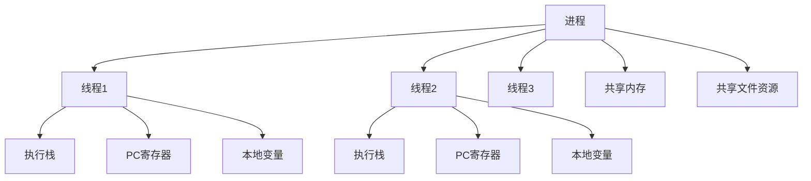
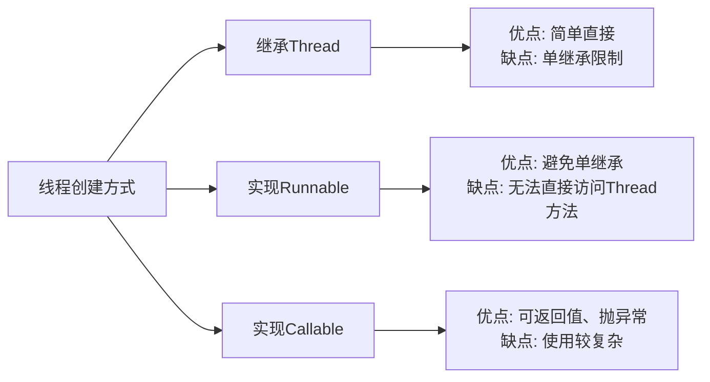
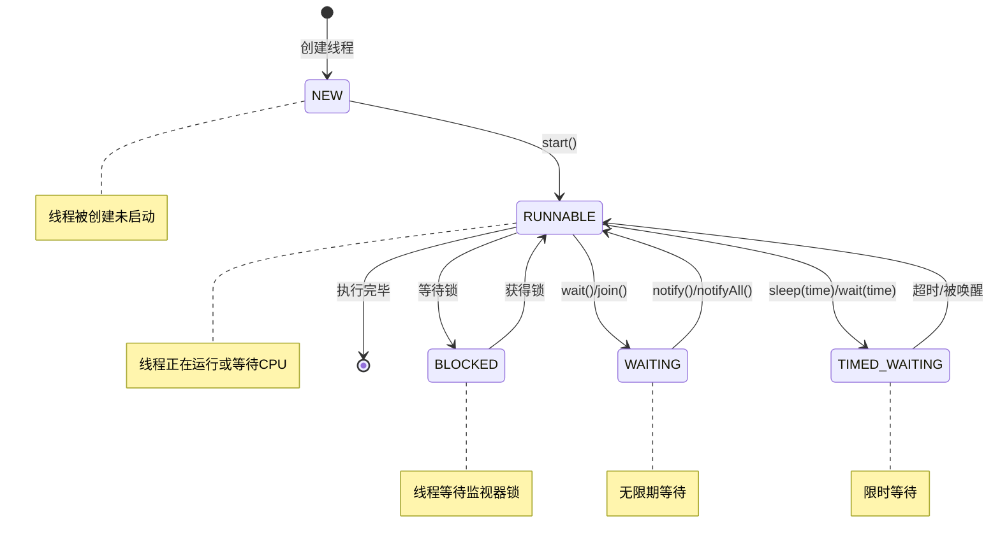
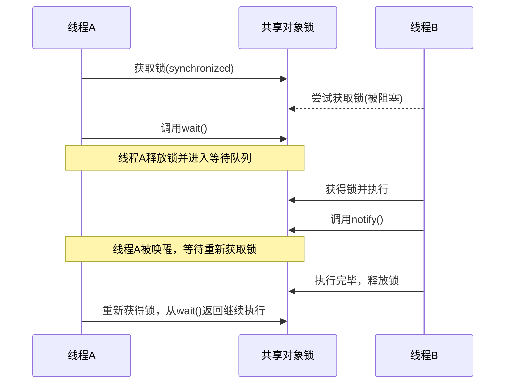
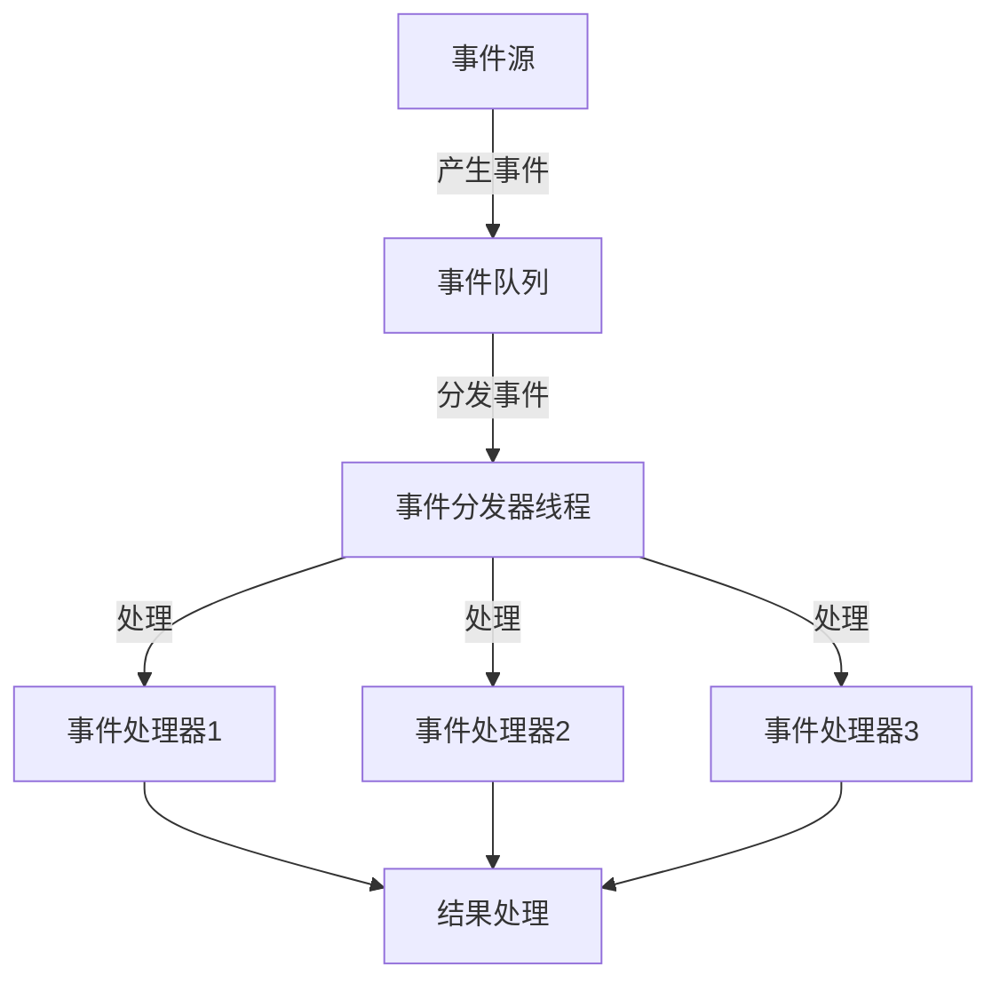
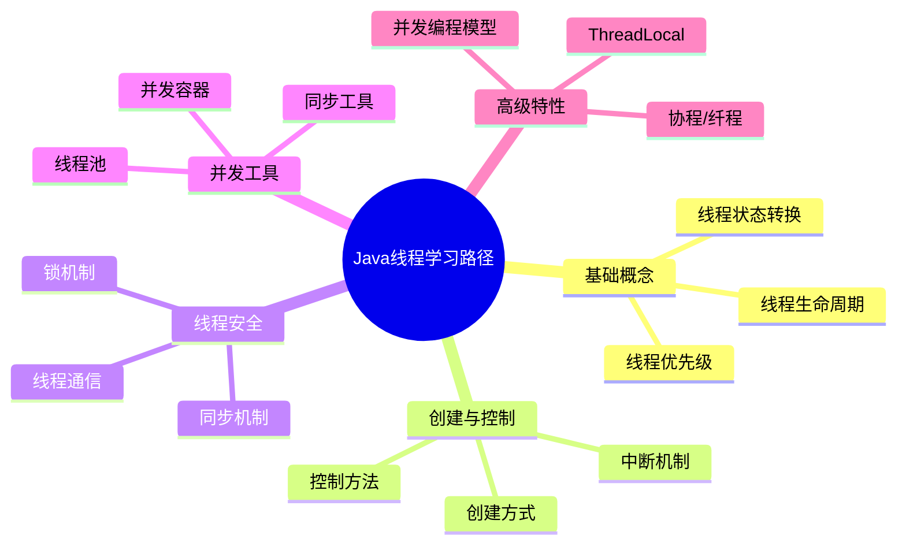

import Tabs from '@theme/Tabs';
import TabItem from '@theme/TabItem';
import TOCInline from '@theme/TOCInline';

# Java 线程基础详解

线程是Java并发编程的基础，理解线程的基本概念、创建方式、生命周期管理对于掌握并发编程至关重要。本文将详细介绍Java线程的核心知识。

:::info 本文内容概览
<TOCInline toc={toc} />
:::

:::tip 核心价值
**Java线程 = 轻量级处理单元 + 并发执行 + 资源共享 + 高效通信 + 可靠性保障**
- 🚀 **轻量级处理**：比进程创建更轻量，系统开销小
- 👥 **并发执行**：多线程并行处理任务，提高CPU利用率
- 🔄 **资源共享**：共享进程内存空间，减少通信开销
- ⚡ **响应性能**：提高应用响应性能，避免阻塞主线程
- 🛡️ **隔离性**：各线程独立执行，互不干扰
:::

## 1. 线程概述

### 1.1 什么是线程？



:::tip 核心概念
线程是程序执行的最小单位，是CPU调度的基本单元。一个进程可以包含多个线程，线程共享进程的内存空间，但拥有独立的执行栈。
:::

### 1.2 线程与进程的关系

<div className="card">
<div className="card__body">

| 特性 | 进程 | 线程 |
|------|------|------|
| **资源分配** | 操作系统分配资源的基本单位 | 共享进程的资源 |
| **内存空间** | 独立的内存空间 | 共享进程的内存空间 |
| **创建开销** | 较大 | 较小 |
| **通信方式** | 进程间通信(IPC) | 直接共享内存 |
| **切换开销** | 较大 | 较小 |
| **并发性** | 进程级并发 | 线程级并发 |
| **稳定性** | 一个进程崩溃不影响其他进程 | 一个线程崩溃可能导致整个进程崩溃 |

</div>
</div>

### 1.3 线程的优势

<Tabs>
  <TabItem value="responsive" label="提高响应性" default>
  ```java
  // 主线程保持UI响应
  SwingUtilities.invokeLater(() -> {
      // UI相关操作
      frame.setVisible(true);
  });
        
  // 工作线程处理耗时操作
  new Thread(() -> {
      // 处理耗时的数据加载
      loadLargeDataset();
      
      // 完成后更新UI
      SwingUtilities.invokeLater(() -> {
          updateUIWithResults();
      });
  }).start();
  ```
  </TabItem>
  <TabItem value="resource" label="资源共享">
  ```java
  // 共享数据
  SharedData sharedData = new SharedData();
    
  // 多个线程访问共享数据
  Thread thread1 = new Thread(() -> {
      sharedData.increment();
      System.out.println("线程1: " + sharedData.getValue());
  });
    
  Thread thread2 = new Thread(() -> {
      sharedData.increment();
      System.out.println("线程2: " + sharedData.getValue());
  });
    
  thread1.start();
  thread2.start();
  ```
  </TabItem>
  <TabItem value="efficient" label="经济性">
  ```java
  // 创建多个线程处理任务，比创建多个进程开销小
  for (int i = 0; i < 10; i++) {
      final int taskId = i;
      Thread thread = new Thread(() -> {
          System.out.println("处理任务: " + taskId);
          processTask(taskId);
      });
      thread.start();
  }
  ```
  </TabItem>
</Tabs>

## 2. 线程创建方式详解

<details>
<summary><strong>线程创建方法对比</strong></summary>



| 创建方式 | 优点 | 缺点 | 适用场景 |
|---------|------|------|----------|
| **继承Thread** | 简单直接，可访问线程方法 | 单继承限制，不能继承其他类 | 简单任务，需要直接操作线程 |
| **实现Runnable** | 避免单继承限制，更灵活 | 不能直接访问线程方法 | 大多数场景下的首选方式 |
| **实现Callable** | 可返回结果，可抛出异常 | 使用相对复杂，需要Future | 需要返回值或异常处理的任务 |

</details>

### 2.1 继承Thread类

<Tabs>
  <TabItem value="code" label="代码实现" default>
  ```java
  // 自定义线程类
  public class CustomThread extends Thread {
      private String threadName;
      
      public CustomThread(String threadName) {
          this.threadName = threadName;
      }
      
      @Override
      public void run() {
          System.out.println("线程 " + threadName + " 开始执行");
          // 线程任务代码...
          System.out.println("线程 " + threadName + " 执行完成");
      }
  }
  
  // 使用方式
  CustomThread thread = new CustomThread("工作线程");
  thread.start(); // 启动线程
  ```
  </TabItem>
  <TabItem value="features" label="特点分析">
  <div className="card">
  <div className="card__header">
  <h4>继承Thread类特点</h4>
  </div>
  <div className="card__body">
  <ul>
  <li><strong>优点</strong>：直接访问Thread的方法（如getName(), getPriority()等）</li>
  <li><strong>缺点</strong>：Java单继承限制，无法再继承其他类</li>
  <li><strong>控制</strong>：可以直接控制线程的行为</li>
  <li><strong>耦合度</strong>：任务逻辑与线程控制耦合在一起</li>
  </ul>
  </div>
  </div>
  </TabItem>
  <TabItem value="usage" label="使用示例">
  ```java
  public class ThreadExample {
      public static void main(String[] args) {
          // 创建线程实例
          CustomThread thread1 = new CustomThread("工作线程1");
          CustomThread thread2 = new CustomThread("工作线程2");
          
          // 设置线程属性
          thread1.setPriority(Thread.MAX_PRIORITY); // 最高优先级
          thread2.setPriority(Thread.MIN_PRIORITY); // 最低优先级
          
          // 启动线程
          thread1.start();
          thread2.start();
          
          try {
              thread1.join(); // 等待thread1完成
              thread2.join(); // 等待thread2完成
          } catch (InterruptedException e) {
              Thread.currentThread().interrupt();
          }
      }
  }
  ```
  </TabItem>
</Tabs>

### 2.2 实现Runnable接口

<Tabs>
  <TabItem value="basic" label="基本实现" default>
  ```java
  // 实现Runnable接口
  public class TaskRunnable implements Runnable {
      private String taskName;
      
      public TaskRunnable(String taskName) {
          this.taskName = taskName;
      }
      
      @Override
      public void run() {
          System.out.println("任务 " + taskName + " 开始执行");
          // 任务代码...
          System.out.println("任务 " + taskName + " 执行完成");
      }
  }
  
  // 使用方式
  TaskRunnable task = new TaskRunnable("数据处理");
  Thread thread = new Thread(task);
  thread.start();
  ```
  </TabItem>
  <TabItem value="lambda" label="Lambda表达式">
  ```java
  // 使用Lambda表达式创建线程
  Thread thread = new Thread(() -> {
      System.out.println("Lambda线程开始执行");
      // 任务代码...
      System.out.println("Lambda线程执行完成");
  });
  
  thread.start();
  ```
  </TabItem>
  <TabItem value="method" label="方法引用">
  ```java
  public class RunnableExample {
      // 任务方法
      public static void performTask() {
          System.out.println("方法引用任务开始执行");
          // 任务代码...
          System.out.println("方法引用任务执行完成");
      }
      
      public static void main(String[] args) {
          // 使用方法引用
          Thread thread = new Thread(RunnableExample::performTask);
          thread.start();
      }
  }
  ```
  </TabItem>
  <TabItem value="features" label="特点分析">
  <div className="card">
  <div className="card__header">
  <h4>Runnable接口特点</h4>
  </div>
  <div className="card__body">
  <ul>
  <li><strong>优点</strong>：避免单继承限制，可以继承其他类</li>
  <li><strong>灵活性</strong>：同一个Runnable可以被多个线程使用</li>
  <li><strong>分离关注点</strong>：将任务逻辑与线程控制分离</li>
  <li><strong>函数式风格</strong>：支持Lambda表达式，代码更简洁</li>
  <li><strong>缺点</strong>：无法直接访问Thread的方法，需要通过Thread.currentThread()</li>
  </ul>
  </div>
  </div>
  </TabItem>
</Tabs>

:::tip 最佳实践
在大多数情况下，实现Runnable接口是创建线程的推荐方式，它提供了更好的灵活性和可扩展性。
:::

### 2.3 实现Callable接口

<Tabs>
  <TabItem value="basic" label="基本实现" default>
  ```java
  import java.util.concurrent.Callable;
  import java.util.concurrent.FutureTask;
  
  // 实现Callable接口
  public class CalculationTask implements Callable<Integer> {
      private int number;
      
      public CalculationTask(int number) {
          this.number = number;
      }
      
      @Override
      public Integer call() throws Exception {
          System.out.println("计算任务开始");
          if (number < 0) {
              throw new IllegalArgumentException("负数不支持");
          }
          int result = number * number;
          System.out.println("计算结果: " + result);
          return result;
      }
  }
  
  // 使用方式
  CalculationTask task = new CalculationTask(10);
  FutureTask<Integer> futureTask = new FutureTask<>(task);
  Thread thread = new Thread(futureTask);
  thread.start();
  
  // 获取结果
  try {
      Integer result = futureTask.get(); // 阻塞等待结果
      System.out.println("获取到计算结果: " + result);
  } catch (Exception e) {
      e.printStackTrace();
  }
  ```
  </TabItem>
  <TabItem value="lambda" label="Lambda表达式">
  ```java
  import java.util.concurrent.Callable;
  import java.util.concurrent.FutureTask;
  
  // 使用Lambda表达式创建Callable
  Callable<String> callable = () -> {
      System.out.println("Callable任务开始执行");
      Thread.sleep(2000); // 模拟耗时操作
      return "任务执行结果";
  };
  
  FutureTask<String> futureTask = new FutureTask<>(callable);
  Thread thread = new Thread(futureTask);
  thread.start();
  
  // 获取结果
  try {
      String result = futureTask.get();
      System.out.println("结果: " + result);
  } catch (Exception e) {
      e.printStackTrace();
  }
  ```
  </TabItem>
  <TabItem value="timeout" label="超时处理">
  ```java
  import java.util.concurrent.Callable;
  import java.util.concurrent.FutureTask;
  import java.util.concurrent.TimeUnit;
  import java.util.concurrent.TimeoutException;
  
  // 长时间运行的任务
  Callable<String> longTask = () -> {
      Thread.sleep(10000); // 10秒
      return "长时间任务完成";
  };
  
  FutureTask<String> futureTask = new FutureTask<>(longTask);
  Thread thread = new Thread(futureTask);
  thread.start();
  
  try {
      // 设置5秒超时
      String result = futureTask.get(5, TimeUnit.SECONDS);
      System.out.println("任务结果: " + result);
  } catch (TimeoutException e) {
      System.out.println("任务超时");
      thread.interrupt(); // 中断线程
  } catch (Exception e) {
      e.printStackTrace();
  }
  ```
  </TabItem>
  <TabItem value="features" label="特点分析">
  <div className="card">
  <div className="card__header">
  <h4>Callable接口特点</h4>
  </div>
  <div className="card__body">
  <ul>
  <li><strong>返回值</strong>：可以返回任务执行结果</li>
  <li><strong>异常处理</strong>：可以抛出检查型异常</li>
  <li><strong>Future支持</strong>：支持获取结果、取消任务、检查完成状态</li>
  <li><strong>超时机制</strong>：支持设置等待结果的超时时间</li>
  <li><strong>缺点</strong>：使用较复杂，需要通过FutureTask包装</li>
  </ul>
  </div>
  </div>
  </TabItem>
</Tabs>

## 3. 线程生命周期详解

### 3.1 线程状态概述

<Tabs>
  <TabItem value="states" label="线程状态" default>
    <div className="card">
    <div className="card__header">
    <h4>Java线程的6种状态</h4>
    </div>
    <div className="card__body">
    <ol>
    <li><strong>NEW</strong>：新创建的线程，尚未启动</li>
    <li><strong>RUNNABLE</strong>：可运行状态，可能正在运行也可能在等待CPU资源</li>
    <li><strong>BLOCKED</strong>：阻塞状态，等待获取监视器锁</li>
    <li><strong>WAITING</strong>：等待状态，等待其他线程执行特定操作</li>
    <li><strong>TIMED_WAITING</strong>：超时等待状态，指定时间内等待其他线程</li>
    <li><strong>TERMINATED</strong>：终止状态，线程执行完毕</li>
    </ol>
    </div>
    </div>
  </TabItem>
  <TabItem value="code" label="状态检查">
  ```java
  Thread thread = new Thread(() -> {
      try {
          Thread.sleep(2000);
      } catch (InterruptedException e) {
          Thread.currentThread().interrupt();
      }
  });
  
  System.out.println("初始状态: " + thread.getState()); // NEW
  
  thread.start();
  System.out.println("启动后状态: " + thread.getState()); // RUNNABLE
  
  try {
      Thread.sleep(1000); // 让线程进入睡眠状态
      System.out.println("睡眠中状态: " + thread.getState()); // TIMED_WAITING
      
      thread.join(); // 等待线程结束
      System.out.println("结束后状态: " + thread.getState()); // TERMINATED
  } catch (InterruptedException e) {
      Thread.currentThread().interrupt();
  }
  ```
  </TabItem>
  <TabItem value="table" label="状态转换">
  | 当前状态 | 触发条件 | 目标状态 |
  |---------|----------|---------|
  | **NEW** | 调用start()方法 | RUNNABLE |
  | **RUNNABLE** | 获取synchronized锁失败 | BLOCKED |
  | **RUNNABLE** | 调用wait()方法 | WAITING |
  | **RUNNABLE** | 调用sleep(time)或wait(time)方法 | TIMED_WAITING |
  | **BLOCKED** | 获得锁 | RUNNABLE |
  | **WAITING** | 调用notify/notifyAll | RUNNABLE/BLOCKED |
  | **TIMED_WAITING** | 超时或被唤醒 | RUNNABLE/BLOCKED |
  | **RUNNABLE** | 执行完成 | TERMINATED |
  </TabItem>
</Tabs>

### 3.2 线程状态转换图



### 3.3 线程状态示例

<details>
<summary><strong>BLOCKED状态示例</strong></summary>

```java
public class BlockedStateExample {
    private static final Object lock = new Object();
    
    public static void main(String[] args) throws InterruptedException {
        Thread thread1 = new Thread(() -> {
            synchronized (lock) {
                System.out.println("线程1获得锁");
                try {
                    Thread.sleep(5000); // 持有锁5秒
                } catch (InterruptedException e) {
                    Thread.currentThread().interrupt();
                }
            }
        });
        
        // 线程2将被阻塞
        Thread thread2 = new Thread(() -> {
            synchronized (lock) {
                System.out.println("线程2获得锁");
            }
        });
        
        thread1.start();
        Thread.sleep(100); // 确保线程1先启动
        
        thread2.start();
        Thread.sleep(1000); // 给线程2时间进入BLOCKED状态
        
        System.out.println("线程2状态: " + thread2.getState()); // 输出BLOCKED
    }
}
```
</details>

<details>
<summary><strong>WAITING状态示例</strong></summary>

```java
public class WaitingStateExample {
    private static final Object lock = new Object();
    
    public static void main(String[] args) throws InterruptedException {
        Thread waitingThread = new Thread(() -> {
            synchronized (lock) {
                try {
                    System.out.println("等待线程进入等待状态");
                    lock.wait(); // 进入WAITING状态
                    System.out.println("等待线程被唤醒");
                } catch (InterruptedException e) {
                    Thread.currentThread().interrupt();
                }
            }
        });
        
        Thread notifyThread = new Thread(() -> {
            try {
                Thread.sleep(2000); // 等待2秒
                synchronized (lock) {
                    System.out.println("通知线程唤醒等待线程");
                    lock.notify();
                }
            } catch (InterruptedException e) {
                Thread.currentThread().interrupt();
            }
        });
        
        waitingThread.start();
        Thread.sleep(500); // 确保等待线程先执行
        System.out.println("等待线程状态: " + waitingThread.getState()); // 输出WAITING
        
        notifyThread.start();
    }
}
```
</details>

<details>
<summary><strong>TIMED_WAITING状态示例</strong></summary>

```java
public class TimedWaitingStateExample {
    public static void main(String[] args) throws InterruptedException {
        Thread sleepingThread = new Thread(() -> {
            try {
                System.out.println("线程开始睡眠5秒");
                Thread.sleep(5000);
                System.out.println("线程睡眠结束");
            } catch (InterruptedException e) {
                System.out.println("线程睡眠被中断");
                Thread.currentThread().interrupt();
            }
        });
        
        sleepingThread.start();
        Thread.sleep(1000); // 给线程时间进入TIMED_WAITING状态
        
        System.out.println("线程状态: " + sleepingThread.getState()); // 输出TIMED_WAITING
    }
}
```
</details>

## 4. 线程控制方法详解

### 4.1 线程控制核心方法

<div className="card">
<div className="card__body">

| 控制方法 | 描述 | 注意事项 |
|---------|------|---------|
| **start()** | 启动线程，使线程进入就绪状态 | 不能多次调用同一线程的start() |
| **join()** | 等待线程终止 | 可能导致调用线程阻塞 |
| **join(long)** | 等待线程终止，有超时时间 | 超时后继续执行，不管线程是否完成 |
| **sleep(long)** | 当前线程休眠指定时间 | 不会释放对象锁 |
| **yield()** | 提示线程调度器让出CPU执行权 | 只是提示，调度器可能忽略 |
| **interrupt()** | 中断线程 | 设置线程的中断状态 |
| **isInterrupted()** | 检查线程是否被中断 | 不会清除中断状态 |
| **interrupted()** | 检查当前线程是否被中断 | 会清除中断状态 |

</div>
</div>

### 4.2 线程中断机制

<Tabs>
  <TabItem value="basic" label="基本中断" default>
  ```java
  // 可中断的线程任务
  Thread thread = new Thread(() -> {
      while (!Thread.currentThread().isInterrupted()) {
          try {
              System.out.println("线程工作中...");
              Thread.sleep(1000);
          } catch (InterruptedException e) {
              System.out.println("线程被中断");
              // 重新设置中断状态（因为InterruptedException会清除中断状态）
              Thread.currentThread().interrupt();
              break;
          }
      }
      System.out.println("线程退出");
  });
  
  thread.start();
  
  // 等待一段时间后中断线程
  try {
      Thread.sleep(3000);
      thread.interrupt(); // 中断线程
  } catch (InterruptedException e) {
      Thread.currentThread().interrupt();
  }
  ```
  </TabItem>
  <TabItem value="polling" label="轮询中断状态">
  ```java
  Thread thread = new Thread(() -> {
      // 循环检查中断状态
      while (!Thread.currentThread().isInterrupted()) {
          // 执行一段非阻塞操作
          System.out.println("执行计算任务...");
          
          // 模拟计算工作
          long sum = 0;
          for (int i = 0; i < 1000000; i++) {
              sum += i;
          }
          
          // 在适当的检查点检查中断
          if (Thread.currentThread().isInterrupted()) {
              System.out.println("检测到中断，准备退出");
              break;
          }
      }
      System.out.println("线程正常退出");
  });
  
  thread.start();
  thread.interrupt(); // 中断线程
  ```
  </TabItem>
  <TabItem value="flag" label="自定义标志">
  ```java
  public class ControlledThread extends Thread {
      private volatile boolean running = true;
      
      public void stopThread() {
          running = false;
      }
      
      @Override
      public void run() {
          while (running) {
              System.out.println("线程运行中...");
              try {
                  Thread.sleep(500);
              } catch (InterruptedException e) {
                  System.out.println("睡眠被中断");
              }
          }
          System.out.println("线程停止");
      }
  }
  
  // 使用方式
  ControlledThread thread = new ControlledThread();
  thread.start();
  
  // 等待一段时间后停止线程
  try {
      Thread.sleep(2000);
      thread.stopThread(); // 优雅停止
  } catch (InterruptedException e) {
      Thread.currentThread().interrupt();
  }
  ```
  </TabItem>
</Tabs>

:::caution 注意事项
1. 永远不要使用已废弃的`Thread.stop()`、`Thread.suspend()`和`Thread.resume()`方法
2. 中断是一种**协作机制**，不会强制终止线程
3. 线程在`InterruptedException`异常处理中应当重新设置中断状态或传递异常
:::

### 4.3 线程等待与通知

<details>
<summary><strong>wait/notify机制详解</strong></summary>



**重要说明：**
1. `wait()`、`notify()`和`notifyAll()`方法必须在**同步代码块**或**同步方法**中调用
2. 这些方法是`Object`类的方法，不是`Thread`类的方法
3. `wait()`会释放锁，而`sleep()`不会释放锁
4. 调用`notify()`后，被通知的线程不会立即执行，而是需要等待当前线程释放锁

</details>

```java title="等待/通知示例"
public class WaitNotifyExample {
    private static final Object lock = new Object();
    private static boolean dataReady = false;
    private static String data = null;
    
    public static void main(String[] args) {
        // 消费者线程
        Thread consumer = new Thread(() -> {
            synchronized (lock) {
                System.out.println("消费者等待数据...");
                while (!dataReady) { // 使用循环检查条件防止虚假唤醒
                    try {
                        lock.wait(); // 释放锁并等待
                    } catch (InterruptedException e) {
                        Thread.currentThread().interrupt();
                        return;
                    }
                }
                System.out.println("消费者消费数据: " + data);
            }
        });
        
        // 生产者线程
        Thread producer = new Thread(() -> {
            try {
                Thread.sleep(2000); // 模拟耗时操作
            } catch (InterruptedException e) {
                Thread.currentThread().interrupt();
                return;
            }
            
            synchronized (lock) {
                data = "重要数据";
                dataReady = true;
                System.out.println("生产者准备数据: " + data);
                lock.notify(); // 通知等待的消费者
            }
        });
        
        consumer.start();
        producer.start();
    }
}
```

### 4.4 线程优先级和守护线程

<Tabs>
  <TabItem value="priority" label="线程优先级" default>
  ```java
  public class ThreadPriorityExample {
      public static void main(String[] args) {
          // 创建三个优先级不同的线程
          Thread lowPriority = new Thread(() -> {
              for (int i = 0; i < 5; i++) {
                  System.out.println("低优先级线程: " + i);
                  Thread.yield(); // 提示可以让出CPU
              }
          });
          
          Thread normalPriority = new Thread(() -> {
              for (int i = 0; i < 5; i++) {
                  System.out.println("普通优先级线程: " + i);
                  Thread.yield();
              }
          });
          
          Thread highPriority = new Thread(() -> {
              for (int i = 0; i < 5; i++) {
                  System.out.println("高优先级线程: " + i);
                  Thread.yield();
              }
          });
          
          // 设置优先级
          lowPriority.setPriority(Thread.MIN_PRIORITY); // 1
          normalPriority.setPriority(Thread.NORM_PRIORITY); // 5
          highPriority.setPriority(Thread.MAX_PRIORITY); // 10
          
          // 启动线程
          lowPriority.start();
          normalPriority.start();
          highPriority.start();
      }
  }
  ```
  </TabItem>
  <TabItem value="daemon" label="守护线程">
  ```java
  public class DaemonThreadExample {
      public static void main(String[] args) {
          // 创建守护线程
          Thread daemonThread = new Thread(() -> {
              while (true) {
                  try {
                      System.out.println("守护线程运行中...");
                      Thread.sleep(1000);
                  } catch (InterruptedException e) {
                      break;
                  }
              }
          });
          
          // 设置为守护线程（必须在start前设置）
          daemonThread.setDaemon(true);
          daemonThread.start();
          
          // 主线程（用户线程）
          try {
              System.out.println("主线程运行3秒后退出");
              Thread.sleep(3000);
          } catch (InterruptedException e) {
              Thread.currentThread().interrupt();
          }
          
          System.out.println("主线程退出，守护线程将自动终止");
      }
  }
  ```
  </TabItem>
</Tabs>

:::tip 守护线程特点
1. 守护线程的优先级较低，但具体调度取决于操作系统
2. 当JVM中只剩下守护线程时，JVM将退出
3. 典型的守护线程如垃圾回收器、JIT编译器线程
4. 守护线程创建的线程也是守护线程
:::

## 5. 实际应用场景

### 5.1 并行计算

<Tabs>
  <TabItem value="calculation" label="并行数组计算" default>
  ```java
  public class ParallelCalculation {
      public static void main(String[] args) {
          int[] numbers = new int[10_000_000]; // 一千万个数
          // 初始化数组
          for (int i = 0; i < numbers.length; i++) {
              numbers[i] = i + 1;
          }
          
          // 使用多线程并行计算
          int processors = Runtime.getRuntime().availableProcessors();
          System.out.println("CPU核心数: " + processors);
          
          // 创建线程池
          ParallelCalculator[] calculators = new ParallelCalculator[processors];
          Thread[] threads = new Thread[processors];
          int segmentSize = numbers.length / processors;
          
          long startTime = System.currentTimeMillis();
          
          // 分配任务并启动线程
          for (int i = 0; i < processors; i++) {
              int startIndex = i * segmentSize;
              int endIndex = (i == processors - 1) ? numbers.length : (i + 1) * segmentSize;
              
              calculators[i] = new ParallelCalculator(numbers, startIndex, endIndex);
              threads[i] = new Thread(calculators[i]);
              threads[i].start();
          }
          
          // 等待所有线程完成并合并结果
          long sum = 0;
          for (int i = 0; i < processors; i++) {
              try {
                  threads[i].join();
                  sum += calculators[i].getResult();
              } catch (InterruptedException e) {
                  Thread.currentThread().interrupt();
              }
          }
          
          long endTime = System.currentTimeMillis();
          System.out.println("并行计算结果: " + sum);
          System.out.println("耗时: " + (endTime - startTime) + "ms");
      }
      
      static class ParallelCalculator implements Runnable {
          private final int[] numbers;
          private final int startIndex;
          private final int endIndex;
          private long result = 0;
          
          public ParallelCalculator(int[] numbers, int startIndex, int endIndex) {
              this.numbers = numbers;
              this.startIndex = startIndex;
              this.endIndex = endIndex;
          }
          
          @Override
          public void run() {
              for (int i = startIndex; i < endIndex; i++) {
                  result += numbers[i];
              }
          }
          
          public long getResult() {
              return result;
          }
      }
  }
  ```
  </TabItem>
  <TabItem value="processing" label="并行文件处理">
  ```java
  import java.io.*;
  import java.nio.file.*;
  import java.util.concurrent.*;
  
  public class ParallelFileProcessor {
      public static void main(String[] args) {
          final Path directory = Paths.get("./data");
          final String searchKeyword = "important";
          
          try {
              // 获取目录中的所有文件
              if (!Files.exists(directory)) {
                  System.err.println("目录不存在: " + directory);
                  return;
              }
              
              File[] files = directory.toFile().listFiles();
              if (files == null || files.length == 0) {
                  System.out.println("没有找到文件");
                  return;
              }
              
              // 创建线程池并行处理文件
              int threadCount = Math.min(files.length, Runtime.getRuntime().availableProcessors());
              ExecutorService executor = Executors.newFixedThreadPool(threadCount);
              CountDownLatch latch = new CountDownLatch(files.length);
              
              // 提交搜索任务
              for (File file : files) {
                  if (file.isFile()) {
                      executor.submit(() -> {
                          try {
                              long occurrences = searchInFile(file, searchKeyword);
                              System.out.println("文件 " + file.getName() + 
                                               " 中找到 " + occurrences + " 个匹配项");
                          } finally {
                              latch.countDown();
                          }
                      });
                  } else {
                      latch.countDown();
                  }
              }
              
              // 等待所有任务完成
              latch.await();
              System.out.println("所有文件处理完成");
              
              // 关闭线程池
              executor.shutdown();
              
          } catch (IOException | InterruptedException e) {
              e.printStackTrace();
          }
      }
      
      private static long searchInFile(File file, String keyword) throws IOException {
          long count = 0;
          try (BufferedReader reader = new BufferedReader(new FileReader(file))) {
              String line;
              while ((line = reader.readLine()) != null) {
                  if (line.contains(keyword)) {
                      count++;
                  }
              }
          }
          return count;
      }
  }
  ```
  </TabItem>
</Tabs>

### 5.2 异步任务处理

<div className="code-with-callout">

```java
import java.util.concurrent.*;
import java.util.ArrayList;
import java.util.List;

public class AsyncTaskProcessing {
    private final int MAX_TASKS = 10;
    private final BlockingQueue<Runnable> taskQueue = new LinkedBlockingQueue<>();
    private final List<WorkerThread> workers = new ArrayList<>();
    private volatile boolean isRunning = true;
    
    public AsyncTaskProcessing(int workerCount) {
        // 创建并启动工作线程
        for (int i = 0; i < workerCount; i++) {
            WorkerThread worker = new WorkerThread("Worker-" + i);
            workers.add(worker);
            worker.start();
        }
    }
    
    // 提交任务
    public void submitTask(Runnable task) throws InterruptedException {
        if (!isRunning) {
            throw new RejectedExecutionException("任务处理器已关闭");
        }
        taskQueue.put(task);
    }
    
    // 关闭任务处理器
    public void shutdown() {
        isRunning = false;
        for (WorkerThread worker : workers) {
            worker.interrupt();
        }
    }
    
    // 工作线程
    private class WorkerThread extends Thread {
        public WorkerThread(String name) {
            super(name);
        }
        
        @Override
        public void run() {
            while (isRunning || !taskQueue.isEmpty()) {
                try {
                    Runnable task = taskQueue.poll(1, TimeUnit.SECONDS);
                    if (task != null) {
                        System.out.println(getName() + " 处理任务...");
                        task.run();
                    }
                } catch (InterruptedException e) {
                    System.out.println(getName() + " 被中断");
                    Thread.currentThread().interrupt();
                    break;
                } catch (Exception e) {
                    System.err.println(getName() + " 执行任务时出错: " + e.getMessage());
                }
            }
            System.out.println(getName() + " 已终止");
        }
    }
    
    // 使用示例
    public static void main(String[] args) {
        AsyncTaskProcessing processor = new AsyncTaskProcessing(3);
        
        try {
            // 提交多个任务
            for (int i = 0; i < 10; i++) {
                final int taskId = i;
                processor.submitTask(() -> {
                    try {
                        System.out.println("执行任务 " + taskId);
                        Thread.sleep((long) (Math.random() * 1000));
                        System.out.println("任务 " + taskId + " 完成");
                    } catch (InterruptedException e) {
                        Thread.currentThread().interrupt();
                    }
                });
            }
            
            // 等待一段时间后关闭处理器
            Thread.sleep(5000);
        } catch (InterruptedException e) {
            Thread.currentThread().interrupt();
        } finally {
            processor.shutdown();
        }
    }
}
```

:::info 异步任务处理的优势
1. **非阻塞操作**：提交任务后立即返回，不等待任务完成
2. **并发处理**：可同时处理多个任务，提高吞吐量
3. **资源控制**：通过工作线程数量限制并发量
4. **优雅关闭**：支持完成已提交任务后关闭
:::

</div>

### 5.3 实时事件处理

<details>
<summary><strong>实时事件处理架构</strong></summary>



**关键组件：**
1. **事件源**：产生需要处理的事件
2. **事件队列**：存储待处理的事件
3. **事件分发器**：独立线程，从队列取出事件并分发
4. **事件处理器**：处理特定类型的事件
5. **结果处理**：汇总处理结果

</details>

```java
public class EventProcessor {
    private final BlockingQueue<Event> eventQueue = new LinkedBlockingQueue<>();
    private final Map<EventType, EventHandler> handlers = new HashMap<>();
    private final Thread dispatcherThread;
    private volatile boolean running = true;
    
    public EventProcessor() {
        // 注册事件处理器
        handlers.put(EventType.USER_ACTION, new UserActionHandler());
        handlers.put(EventType.SYSTEM_ALERT, new SystemAlertHandler());
        handlers.put(EventType.DATA_CHANGE, new DataChangeHandler());
        
        // 创建分发线程
        dispatcherThread = new Thread(() -> {
            while (running) {
                try {
                    Event event = eventQueue.take();
                    processEvent(event);
                } catch (InterruptedException e) {
                    Thread.currentThread().interrupt();
                    break;
                }
            }
        }, "EventDispatcher");
        
        dispatcherThread.start();
    }
    
    public void submitEvent(Event event) {
        try {
            eventQueue.put(event);
        } catch (InterruptedException e) {
            Thread.currentThread().interrupt();
        }
    }
    
    private void processEvent(Event event) {
        EventHandler handler = handlers.get(event.getType());
        if (handler != null) {
            try {
                handler.handle(event);
            } catch (Exception e) {
                System.err.println("处理事件时出错: " + e.getMessage());
            }
        } else {
            System.out.println("未找到事件处理器: " + event.getType());
        }
    }
    
    public void shutdown() {
        running = false;
        dispatcherThread.interrupt();
    }
    
    // 事件类型和处理器接口 (为简化示例仅展示骨架)
    enum EventType { USER_ACTION, SYSTEM_ALERT, DATA_CHANGE }
    
    static class Event {
        private final EventType type;
        private final Object data;
        
        public Event(EventType type, Object data) {
            this.type = type;
            this.data = data;
        }
        
        public EventType getType() { return type; }
        public Object getData() { return data; }
    }
    
    interface EventHandler {
        void handle(Event event);
    }
    
    // 具体处理器实现
    static class UserActionHandler implements EventHandler {
        @Override
        public void handle(Event event) {
            System.out.println("处理用户动作: " + event.getData());
        }
    }
    
    static class SystemAlertHandler implements EventHandler {
        @Override
        public void handle(Event event) {
            System.out.println("处理系统警报: " + event.getData());
        }
    }
    
    static class DataChangeHandler implements EventHandler {
        @Override
        public void handle(Event event) {
            System.out.println("处理数据变更: " + event.getData());
        }
    }
}
```

## 6. 线程安全和最佳实践

### 6.1 线程安全问题

<Tabs>
  <TabItem value="problem" label="竞态条件问题" default>
  ```java
  // 非线程安全的计数器
  public class UnsafeCounter {
      private int count = 0;
      
      public void increment() {
          count++; // 非原子操作，可能导致竞态条件
      }
      
      public int getCount() {
          return count;
      }
      
      public static void main(String[] args) throws InterruptedException {
          UnsafeCounter counter = new UnsafeCounter();
          
          // 创建多个线程同时递增计数器
          Thread[] threads = new Thread[1000];
          for (int i = 0; i < threads.length; i++) {
              threads[i] = new Thread(() -> {
                  for (int j = 0; j < 1000; j++) {
                      counter.increment();
                  }
              });
              threads[i].start();
          }
          
          // 等待所有线程完成
          for (Thread thread : threads) {
              thread.join();
          }
          
          // 理论上结果应该是1,000,000，但实际可能小于这个值
          System.out.println("计数器最终值: " + counter.getCount());
      }
  }
  ```
  </TabItem>
  <TabItem value="solution" label="线程安全解决方案">
  ```java
  import java.util.concurrent.atomic.AtomicInteger;
  
  // 线程安全的计数器：使用synchronized
  public class ThreadSafeCounter {
      private int syncCount = 0;
      private final AtomicInteger atomicCount = new AtomicInteger(0);
      
      // 方案1: 使用synchronized
      public synchronized void incrementSync() {
          syncCount++;
      }
      
      public synchronized int getSyncCount() {
          return syncCount;
      }
      
      // 方案2: 使用AtomicInteger
      public void incrementAtomic() {
          atomicCount.incrementAndGet();
      }
      
      public int getAtomicCount() {
          return atomicCount.get();
      }
      
      public static void main(String[] args) throws InterruptedException {
          ThreadSafeCounter counter = new ThreadSafeCounter();
          
          // 创建多个线程
          Thread[] threads = new Thread[1000];
          for (int i = 0; i < threads.length; i++) {
              threads[i] = new Thread(() -> {
                  for (int j = 0; j < 1000; j++) {
                      counter.incrementSync();
                      counter.incrementAtomic();
                  }
              });
              threads[i].start();
          }
          
          // 等待所有线程完成
          for (Thread thread : threads) {
              thread.join();
          }
          
          System.out.println("synchronized计数器: " + counter.getSyncCount());
          System.out.println("AtomicInteger计数器: " + counter.getAtomicCount());
      }
  }
  ```
  </TabItem>
</Tabs>

### 6.2 线程安全性策略

<div className="card">
<div className="card__header">
<h4>确保线程安全的策略</h4>
</div>
<div className="card__body">

1. **不可变性**：使用不可变对象避免状态变化
2. **线程封闭**：将数据限制在单个线程内使用
3. **同步机制**：
   - 使用synchronized同步访问共享数据
   - 使用显式锁(ReentrantLock等)管理访问
   - volatile变量确保可见性
   - 原子类避免复合操作问题
4. **线程安全集合**：使用并发容器(ConcurrentHashMap等)
5. **安全发布**：确保对象安全地在线程之间传递

</div>
</div>

### 6.3 线程池最佳实践

:::tip 线程池使用建议
1. **合理设置大小**：线程池大小 = CPU核心数 * (1 + 等待时间/计算时间)
2. **区分任务类型**：CPU密集型任务池应小一些，IO密集型任务池可以大一些
3. **使用工厂方法**：使用ThreadFactory为线程池创建的线程设置有意义的名称
4. **处理异常**：捕获并处理提交任务内的所有异常
5. **优雅关闭**：使用shutdown()而非shutdownNow()，确保任务完成
6. **监控线程池**：跟踪活动线程数、完成任务数、队列大小等指标
:::

### 6.4 避免死锁的建议

```java
public class DeadlockAvoidance {
    // 规则1: 按固定顺序获取锁
    public void correctResourceAccess(Object resource1, Object resource2) {
        // 总是先获取resource1，再获取resource2
        synchronized (resource1) {
            System.out.println("获取第一个锁");
            synchronized (resource2) {
                System.out.println("获取第二个锁");
                // 使用资源...
            }
        }
    }
    
    // 规则2: 使用超时获取锁
    public boolean tryResourceAccess(Lock lock1, Lock lock2) {
        try {
            // 尝试获取锁，但不永远等待
            if (lock1.tryLock(1, TimeUnit.SECONDS)) {
                try {
                    if (lock2.tryLock(1, TimeUnit.SECONDS)) {
                        try {
                            // 使用资源...
                            return true;
                        } finally {
                            lock2.unlock();
                        }
                    }
                } finally {
                    lock1.unlock();
                }
            }
        } catch (InterruptedException e) {
            Thread.currentThread().interrupt();
        }
        return false; // 未能获取所有锁
    }
    
    // 规则3: 避免在持有锁时调用外部方法
    public void avoidNestedLocking(Object lock) {
        synchronized (lock) {
            // 不要在这里调用可能获取其他锁的方法
            safeOperation(); // 只调用不获取锁的安全方法
        }
    }
    
    private void safeOperation() {
        // 不获取任何锁的操作
    }
}
```

## 7. 总结

### 7.1 线程核心知识点总结

<div className="card">
<div className="card__body">

- **线程创建**：继承Thread、实现Runnable、实现Callable
- **线程状态**：NEW、RUNNABLE、BLOCKED、WAITING、TIMED_WAITING、TERMINATED
- **线程控制**：start()、join()、sleep()、yield()、interrupt()
- **线程通信**：wait()、notify()、notifyAll()
- **线程安全**：同步、锁、原子变量、线程安全集合
- **应用场景**：并行计算、异步任务、实时事件处理

</div>
</div>

### 7.2 学习路径与深入方向



### 7.3 性能与调试建议

1. **适量创建线程**：线程数不应远超CPU核心数
2. **避免过度同步**：仅在必要时进行同步
3. **使用线程栈**：利用线程栈快速定位问题
4. **善用JVM参数**：调整线程栈大小(`-Xss`)
5. **使用线程转储**：通过`jstack`获取线程转储分析死锁
6. **性能分析**：使用JVisualVM、YourKit等工具监控线程性能 