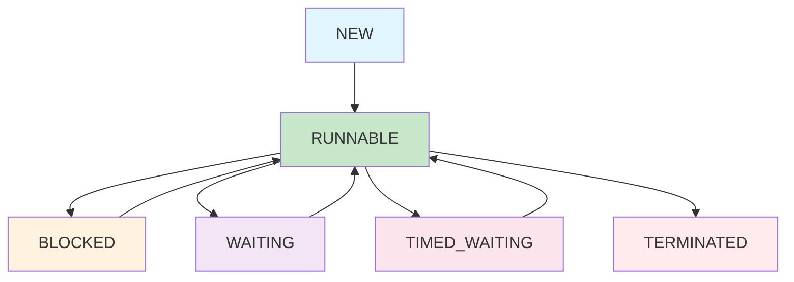

# Java 线程基础详解

线程是Java并发编程的基础，理解线程的基本概念、创建方式、生命周期管理对于掌握并发编程至关重要。本文将详细介绍Java线程的核心知识。

## 1. 线程概述

### 1.1 什么是线程？

:::tip 核心概念
线程是程序执行的最小单位，是CPU调度的基本单元。一个进程可以包含多个线程，线程共享进程的内存空间，但拥有独立的执行栈。
:::

### 1.2 线程与进程的关系

| 特性 | 进程 | 线程 |
|------|------|------|
| **资源分配** | 操作系统分配资源的基本单位 | 共享进程的资源 |
| **内存空间** | 独立的内存空间 | 共享进程的内存空间 |
| **创建开销** | 较大 | 较小 |
| **通信方式** | 进程间通信(IPC) | 直接共享内存 |
| **切换开销** | 较大 | 较小 |
| **并发性** | 进程级并发 | 线程级并发 |

### 1.3 线程的优势

```java title="线程优势示例"
public class ThreadAdvantages {
    
    /**
     * 1. 提高程序响应性
     * 主线程处理UI，工作线程处理耗时操作
     */
    public void responsiveExample() {
        // 主线程保持响应
        System.out.println("主线程开始处理用户界面");
        
        // 工作线程处理耗时操作
        Thread workerThread = new Thread(() -> {
            System.out.println("工作线程开始处理耗时任务");
            try {
                Thread.sleep(5000); // 模拟耗时操作
            } catch (InterruptedException e) {
                e.printStackTrace();
            }
            System.out.println("工作线程完成耗时任务");
        });
        workerThread.start();
        
        System.out.println("主线程继续响应用户操作");
    }
    
    /**
     * 2. 资源共享
     * 多个线程共享进程的内存空间
     */
    public void resourceSharingExample() {
        // 共享数据
        SharedData sharedData = new SharedData();
        
        // 多个线程访问共享数据
        Thread thread1 = new Thread(() -> {
            sharedData.increment();
            System.out.println("线程1: " + sharedData.getValue());
        });
        
        Thread thread2 = new Thread(() -> {
            sharedData.increment();
            System.out.println("线程2: " + sharedData.getValue());
        });
        
        thread1.start();
        thread2.start();
    }
    
    /**
     * 3. 经济性
     * 创建线程比创建进程开销小
     */
    public void economicalExample() {
        // 创建多个线程处理任务
        for (int i = 0; i < 10; i++) {
            final int taskId = i;
            Thread thread = new Thread(() -> {
                System.out.println("处理任务: " + taskId);
            });
            thread.start();
        }
    }
}

class SharedData {
    private int value = 0;
    
    public synchronized void increment() {
        value++;
    }
    
    public synchronized int getValue() {
        return value;
    }
}
```

## 2. 线程创建方式详解

### 2.1 继承Thread类

继承Thread类是最直接的线程创建方式，但限制了类的继承结构。

```java title="继承Thread类示例"
public class ThreadInheritanceExample {
    
    /**
     * 自定义线程类
     * 优点：简单直接，可以访问Thread类的所有方法
     * 缺点：Java单继承限制，无法继承其他类
     */
    public static class CustomThread extends Thread {
        private String threadName;
        private int sleepTime;
        
        public CustomThread(String threadName, int sleepTime) {
            this.threadName = threadName;
            this.sleepTime = sleepTime;
        }
        
    @Override
    public void run() {
            System.out.println("线程 " + threadName + " 开始执行");
            
            try {
                for (int i = 0; i < 5; i++) {
                    System.out.println(threadName + " - 计数: " + i);
                    Thread.sleep(sleepTime);
                }
            } catch (InterruptedException e) {
                System.out.println(threadName + " 被中断");
                Thread.currentThread().interrupt(); // 重新设置中断状态
            }
            
            System.out.println("线程 " + threadName + " 执行完成");
        }
    }
    
    public static void main(String[] args) {
        System.out.println("=== 继承Thread类示例 ===");
        
        // 创建线程实例
        CustomThread thread1 = new CustomThread("工作线程1", 1000);
        CustomThread thread2 = new CustomThread("工作线程2", 800);
        
        // 设置线程属性
        thread1.setPriority(Thread.MAX_PRIORITY); // 最高优先级
        thread2.setPriority(Thread.MIN_PRIORITY); // 最低优先级
        
        // 启动线程
        thread1.start();
        thread2.start();
        
        // 主线程等待子线程完成
        try {
            thread1.join(); // 等待thread1完成
            thread2.join(); // 等待thread2完成
        } catch (InterruptedException e) {
            e.printStackTrace();
        }
        
        System.out.println("所有线程执行完成");
    }
}
```

### 2.2 实现Runnable接口

实现Runnable接口是推荐的线程创建方式，避免了单继承限制。

```java title="实现Runnable接口示例"
public class RunnableImplementationExample {
    
    /**
     * 自定义Runnable实现
     * 优点：避免单继承限制，更灵活
     * 缺点：无法直接访问Thread类的方法
     */
    public static class TaskRunnable implements Runnable {
        private String taskName;
        private int taskCount;
        
        public TaskRunnable(String taskName, int taskCount) {
            this.taskName = taskName;
            this.taskCount = taskCount;
        }
        
        @Override
        public void run() {
            System.out.println("任务 " + taskName + " 开始执行");
            
            try {
                for (int i = 0; i < taskCount; i++) {
                    System.out.println(taskName + " - 执行步骤: " + (i + 1));
                    Thread.sleep(500);
                }
            } catch (InterruptedException e) {
                System.out.println(taskName + " 被中断");
                Thread.currentThread().interrupt();
            }
            
            System.out.println("任务 " + taskName + " 执行完成");
        }
    }
    
    /**
     * Lambda表达式创建Runnable
     * 简洁的匿名实现方式
     */
    public static void lambdaExample() {
        System.out.println("=== Lambda表达式示例 ===");
        
        // 使用Lambda表达式创建线程
Thread lambdaThread = new Thread(() -> {
            System.out.println("Lambda线程开始执行");
            for (int i = 0; i < 3; i++) {
                System.out.println("Lambda线程 - 步骤: " + (i + 1));
                try {
                    Thread.sleep(300);
                } catch (InterruptedException e) {
                    Thread.currentThread().interrupt();
                    break;
                }
            }
            System.out.println("Lambda线程执行完成");
        });
        
lambdaThread.start();
        
        try {
            lambdaThread.join();
        } catch (InterruptedException e) {
            e.printStackTrace();
        }
    }
    
    /**
     * 方法引用创建Runnable
     * 引用现有方法作为线程任务
     */
    public static void methodReferenceExample() {
        System.out.println("=== 方法引用示例 ===");
        
        // 使用方法引用
        Thread methodThread = new Thread(RunnableImplementationExample::performTask);
        methodThread.start();
        
        try {
            methodThread.join();
        } catch (InterruptedException e) {
            e.printStackTrace();
        }
    }
    
    public static void performTask() {
        System.out.println("方法引用任务开始执行");
        try {
            Thread.sleep(1000);
        } catch (InterruptedException e) {
            Thread.currentThread().interrupt();
        }
        System.out.println("方法引用任务执行完成");
    }
    
    public static void main(String[] args) {
        System.out.println("=== 实现Runnable接口示例 ===");
        
        // 创建Runnable实例
        TaskRunnable task1 = new TaskRunnable("数据处理", 3);
        TaskRunnable task2 = new TaskRunnable("文件操作", 4);
        
        // 创建线程并传入Runnable
        Thread thread1 = new Thread(task1, "数据处理线程");
        Thread thread2 = new Thread(task2, "文件操作线程");
        
        // 启动线程
        thread1.start();
        thread2.start();
        
        // 等待线程完成
        try {
            thread1.join();
            thread2.join();
        } catch (InterruptedException e) {
            e.printStackTrace();
        }
        
        // 演示其他创建方式
        lambdaExample();
        methodReferenceExample();
    }
}
```

### 2.3 实现Callable接口

Callable接口允许线程返回结果和抛出异常，是Future模式的基础。

```java title="实现Callable接口示例"
import java.util.concurrent.Callable;
import java.util.concurrent.ExecutionException;
import java.util.concurrent.FutureTask;
import java.util.concurrent.TimeUnit;
import java.util.concurrent.TimeoutException;

public class CallableImplementationExample {
    
    /**
     * 自定义Callable实现
     * 优点：可以返回结果，可以抛出异常
     * 缺点：需要FutureTask包装，使用相对复杂
     */
    public static class CalculationTask implements Callable<Integer> {
        private int start;
        private int end;
        private String taskName;
        
        public CalculationTask(String taskName, int start, int end) {
            this.taskName = taskName;
            this.start = start;
            this.end = end;
        }
        
        @Override
        public Integer call() throws Exception {
            System.out.println(taskName + " 开始计算");
            
            int sum = 0;
            for (int i = start; i <= end; i++) {
                sum += i;
                Thread.sleep(100); // 模拟计算时间
            }
            
            System.out.println(taskName + " 计算完成，结果: " + sum);
            return sum;
        }
    }
    
    /**
     * 带异常处理的Callable
     */
    public static class ExceptionTask implements Callable<String> {
        private boolean shouldThrowException;
        
        public ExceptionTask(boolean shouldThrowException) {
            this.shouldThrowException = shouldThrowException;
        }
        
    @Override
    public String call() throws Exception {
            if (shouldThrowException) {
                throw new RuntimeException("模拟异常");
            }
            return "任务执行成功";
        }
    }
    
    /**
     * 使用FutureTask获取结果
     */
    public static void futureTaskExample() {
        System.out.println("=== FutureTask示例 ===");
        
        // 创建Callable任务
        CalculationTask task = new CalculationTask("求和任务", 1, 10);
        
        // 使用FutureTask包装
        FutureTask<Integer> futureTask = new FutureTask<>(task);
        
        // 创建线程执行任务
        Thread thread = new Thread(futureTask);
        thread.start();
        
        try {
            // 获取结果（阻塞等待）
            Integer result = futureTask.get();
            System.out.println("计算结果: " + result);
            
            // 带超时的获取结果
            // Integer result = futureTask.get(5, TimeUnit.SECONDS);
            
        } catch (InterruptedException e) {
            System.out.println("等待被中断");
            Thread.currentThread().interrupt();
        } catch (ExecutionException e) {
            System.out.println("任务执行异常: " + e.getCause());
        }
    }
    
    /**
     * 异常处理示例
     */
    public static void exceptionHandlingExample() {
        System.out.println("=== 异常处理示例 ===");
        
        // 正常任务
        ExceptionTask normalTask = new ExceptionTask(false);
        FutureTask<String> normalFuture = new FutureTask<>(normalTask);
        Thread normalThread = new Thread(normalFuture);
        normalThread.start();
        
        // 异常任务
        ExceptionTask exceptionTask = new ExceptionTask(true);
        FutureTask<String> exceptionFuture = new FutureTask<>(exceptionTask);
        Thread exceptionThread = new Thread(exceptionFuture);
        exceptionThread.start();
        
        try {
            // 处理正常任务
            String normalResult = normalFuture.get();
            System.out.println("正常任务结果: " + normalResult);
            
            // 处理异常任务
            String exceptionResult = exceptionFuture.get();
            System.out.println("异常任务结果: " + exceptionResult);
            
        } catch (InterruptedException e) {
            Thread.currentThread().interrupt();
        } catch (ExecutionException e) {
            System.out.println("捕获到异常: " + e.getCause().getMessage());
        }
    }
    
    /**
     * 超时处理示例
     */
    public static void timeoutExample() {
        System.out.println("=== 超时处理示例 ===");
        
        // 创建长时间运行的任务
        Callable<String> longTask = () -> {
            Thread.sleep(10000); // 10秒
            return "长时间任务完成";
        };
        
        FutureTask<String> futureTask = new FutureTask<>(longTask);
Thread thread = new Thread(futureTask);
thread.start();

try {
            // 设置5秒超时
            String result = futureTask.get(5, TimeUnit.SECONDS);
            System.out.println("任务结果: " + result);
        } catch (TimeoutException e) {
            System.out.println("任务超时");
            thread.interrupt(); // 中断线程
        } catch (InterruptedException e) {
            Thread.currentThread().interrupt();
        } catch (ExecutionException e) {
            System.out.println("任务执行异常: " + e.getCause());
        }
    }
    
    public static void main(String[] args) {
        System.out.println("=== Callable接口示例 ===");
        
        // 基本使用示例
        futureTaskExample();
        
        // 异常处理示例
        exceptionHandlingExample();
        
        // 超时处理示例
        timeoutExample();
    }
}
```

## 3. 线程生命周期详解

### 3.1 线程状态

Java线程有6种状态，每种状态都有特定的含义和转换条件。

```java title="线程状态示例"
public class ThreadStateExample {
    
    /**
     * 演示线程的各种状态
     */
    public static void demonstrateThreadStates() {
        System.out.println("=== 线程状态演示 ===");
        
        // 1. NEW状态 - 线程被创建但未启动
        Thread thread = new Thread(() -> {
            try {
                Thread.sleep(2000);
            } catch (InterruptedException e) {
                Thread.currentThread().interrupt();
            }
        });
        
        System.out.println("创建后状态: " + thread.getState()); // NEW
        
        // 2. RUNNABLE状态 - 线程启动后
        thread.start();
        System.out.println("启动后状态: " + thread.getState()); // RUNNABLE
        
        // 3. TIMED_WAITING状态 - 线程睡眠
        try {
            Thread.sleep(1000);
            System.out.println("睡眠中状态: " + thread.getState()); // TIMED_WAITING
        } catch (InterruptedException e) {
            Thread.currentThread().interrupt();
        }
        
        // 4. TERMINATED状态 - 线程执行完成
        try {
            thread.join();
            System.out.println("执行完成后状态: " + thread.getState()); // TERMINATED
        } catch (InterruptedException e) {
            Thread.currentThread().interrupt();
        }
    }
    
    /**
     * 演示BLOCKED状态
     */
    public static void demonstrateBlockedState() {
        System.out.println("=== BLOCKED状态演示 ===");
        
        Object lock = new Object();
        
        // 线程1：获取锁并长时间持有
        Thread thread1 = new Thread(() -> {
            synchronized (lock) {
                System.out.println("线程1获得锁");
                try {
                    Thread.sleep(5000); // 持有锁5秒
                } catch (InterruptedException e) {
                    Thread.currentThread().interrupt();
                }
                System.out.println("线程1释放锁");
            }
        });
        
        // 线程2：尝试获取锁，会被阻塞
        Thread thread2 = new Thread(() -> {
            System.out.println("线程2尝试获取锁");
            synchronized (lock) {
                System.out.println("线程2获得锁");
            }
        });
        
        thread1.start();
        try {
            Thread.sleep(100); // 确保线程1先启动
        } catch (InterruptedException e) {
            Thread.currentThread().interrupt();
        }
        
        thread2.start();
        
        // 检查线程2的状态
        try {
            Thread.sleep(1000);
            System.out.println("线程2状态: " + thread2.getState()); // BLOCKED
        } catch (InterruptedException e) {
            Thread.currentThread().interrupt();
        }
        
        try {
            thread1.join();
            thread2.join();
        } catch (InterruptedException e) {
            Thread.currentThread().interrupt();
        }
    }
    
    /**
     * 演示WAITING状态
     */
    public static void demonstrateWaitingState() {
        System.out.println("=== WAITING状态演示 ===");
        
        Object lock = new Object();
        
        // 等待线程
        Thread waitingThread = new Thread(() -> {
            synchronized (lock) {
                try {
                    System.out.println("等待线程进入等待状态");
                    lock.wait(); // 进入WAITING状态
                    System.out.println("等待线程被唤醒");
                } catch (InterruptedException e) {
                    Thread.currentThread().interrupt();
                }
            }
        });
        
        // 通知线程
        Thread notifyThread = new Thread(() -> {
            try {
                Thread.sleep(2000); // 等待2秒
                synchronized (lock) {
                    System.out.println("通知线程唤醒等待线程");
                    lock.notify();
                }
            } catch (InterruptedException e) {
                Thread.currentThread().interrupt();
            }
        });
        
        waitingThread.start();
        notifyThread.start();
        
        // 检查等待线程的状态
        try {
            Thread.sleep(1000);
            System.out.println("等待线程状态: " + waitingThread.getState()); // WAITING
        } catch (InterruptedException e) {
            Thread.currentThread().interrupt();
        }
        
        try {
            waitingThread.join();
            notifyThread.join();
        } catch (InterruptedException e) {
            Thread.currentThread().interrupt();
        }
    }
    
    public static void main(String[] args) {
        demonstrateThreadStates();
        demonstrateBlockedState();
        demonstrateWaitingState();
    }
}
```

### 3.2 状态转换图



### 3.3 状态转换条件

| 状态转换 | 触发条件 | 示例 |
|----------|----------|------|
| NEW → RUNNABLE | 调用start()方法 | `thread.start()` |
| RUNNABLE → BLOCKED | 尝试获取锁失败 | `synchronized(lock)` |
| RUNNABLE → WAITING | 调用wait()方法 | `lock.wait()` |
| RUNNABLE → TIMED_WAITING | 调用sleep()或wait(timeout) | `Thread.sleep(1000)` |
| BLOCKED → RUNNABLE | 获得锁 | 锁被释放后获得 |
| WAITING → RUNNABLE | 被notify()唤醒 | `lock.notify()` |
| TIMED_WAITING → RUNNABLE | 超时或被唤醒 | 时间到期或notify() |
| RUNNABLE → TERMINATED | 执行完成或异常 | run()方法结束 |

## 4. 线程控制方法详解

### 4.1 基本控制方法

```java title="线程控制方法示例"
public class ThreadControlExample {
    
    /**
     * 线程中断机制
     * 中断是一种协作机制，不会强制停止线程
     */
    public static void interruptExample() {
        System.out.println("=== 线程中断示例 ===");
        
        Thread interruptibleThread = new Thread(() -> {
            System.out.println("可中断线程开始执行");
            
            while (!Thread.currentThread().isInterrupted()) {
                try {
                    System.out.println("线程正在工作...");
                    Thread.sleep(1000);
                } catch (InterruptedException e) {
                    System.out.println("线程被中断");
                    Thread.currentThread().interrupt(); // 重新设置中断状态
                    break;
                }
            }
            
            System.out.println("可中断线程结束");
        });
        
        interruptibleThread.start();
        
        try {
            Thread.sleep(3000); // 让线程工作3秒
            interruptibleThread.interrupt(); // 中断线程
            interruptibleThread.join();
        } catch (InterruptedException e) {
            Thread.currentThread().interrupt();
        }
    }
    
    /**
     * 线程等待和通知
     */
    public static void waitNotifyExample() {
        System.out.println("=== 等待通知示例 ===");
        
        Object lock = new Object();
        boolean[] condition = {false};
        
        // 等待线程
        Thread waiter = new Thread(() -> {
            synchronized (lock) {
                while (!condition[0]) {
                    try {
                        System.out.println("等待线程进入等待状态");
                        lock.wait(); // 释放锁并等待
                        System.out.println("等待线程被唤醒");
                    } catch (InterruptedException e) {
                        Thread.currentThread().interrupt();
                        break;
                    }
                }
                System.out.println("等待线程继续执行");
            }
        });
        
        // 通知线程
        Thread notifier = new Thread(() -> {
            try {
                Thread.sleep(2000); // 模拟工作
                synchronized (lock) {
                    condition[0] = true;
                    System.out.println("通知线程设置条件并通知");
                    lock.notify(); // 唤醒等待线程
                }
            } catch (InterruptedException e) {
                Thread.currentThread().interrupt();
            }
        });
        
        waiter.start();
        notifier.start();
        
        try {
            waiter.join();
            notifier.join();
        } catch (InterruptedException e) {
            Thread.currentThread().interrupt();
        }
    }
    
    /**
     * 线程优先级
     */
    public static void priorityExample() {
        System.out.println("=== 线程优先级示例 ===");
        
        // 高优先级线程
        Thread highPriority = new Thread(() -> {
            for (int i = 0; i < 5; i++) {
                System.out.println("高优先级线程: " + i);
                try {
                    Thread.sleep(100);
                } catch (InterruptedException e) {
                    Thread.currentThread().interrupt();
                    break;
                }
            }
        });
        
        // 低优先级线程
        Thread lowPriority = new Thread(() -> {
            for (int i = 0; i < 5; i++) {
                System.out.println("低优先级线程: " + i);
                try {
                    Thread.sleep(100);
                } catch (InterruptedException e) {
                    Thread.currentThread().interrupt();
                    break;
                }
            }
        });
        
        // 设置优先级
        highPriority.setPriority(Thread.MAX_PRIORITY); // 10
        lowPriority.setPriority(Thread.MIN_PRIORITY);  // 1
        
        System.out.println("高优先级线程优先级: " + highPriority.getPriority());
        System.out.println("低优先级线程优先级: " + lowPriority.getPriority());
        
        lowPriority.start();
        highPriority.start();
        
        try {
            highPriority.join();
            lowPriority.join();
        } catch (InterruptedException e) {
            Thread.currentThread().interrupt();
        }
    }
    
    /**
     * 守护线程
     */
    public static void daemonExample() {
        System.out.println("=== 守护线程示例 ===");
        
        // 守护线程
        Thread daemonThread = new Thread(() -> {
            while (true) {
                System.out.println("守护线程正在运行...");
                try {
                    Thread.sleep(1000);
                } catch (InterruptedException e) {
                    System.out.println("守护线程被中断");
                    break;
                }
            }
        });
        
        // 工作线程
        Thread workerThread = new Thread(() -> {
            for (int i = 0; i < 3; i++) {
                System.out.println("工作线程: " + i);
                try {
                    Thread.sleep(2000);
                } catch (InterruptedException e) {
                    Thread.currentThread().interrupt();
                    break;
                }
            }
            System.out.println("工作线程完成");
        });
        
        daemonThread.setDaemon(true); // 设置为守护线程
        daemonThread.start();
        workerThread.start();
        
        try {
            workerThread.join(); // 等待工作线程完成
        } catch (InterruptedException e) {
            Thread.currentThread().interrupt();
        }
        
        System.out.println("主线程结束，守护线程也会结束");
    }
    
    public static void main(String[] args) {
        interruptExample();
        waitNotifyExample();
        priorityExample();
        daemonExample();
    }
}
```

## 5. 实际应用场景

### 5.1 并行计算

```java title="并行计算示例"
public class ParallelComputationExample {
    
    /**
     * 并行数组求和
     */
    public static void parallelArraySum() {
        System.out.println("=== 并行数组求和 ===");
        
        int[] numbers = new int[1000000];
        for (int i = 0; i < numbers.length; i++) {
            numbers[i] = i + 1;
        }
        
        int threadCount = Runtime.getRuntime().availableProcessors();
        int chunkSize = numbers.length / threadCount;
        
        long startTime = System.currentTimeMillis();
        
        // 创建线程数组
        Thread[] threads = new Thread[threadCount];
        long[] partialSums = new long[threadCount];
        
        // 启动计算线程
        for (int i = 0; i < threadCount; i++) {
            final int start = i * chunkSize;
            final int end = (i == threadCount - 1) ? numbers.length : (i + 1) * chunkSize;
            final int threadIndex = i;
            
            threads[i] = new Thread(() -> {
                long sum = 0;
                for (int j = start; j < end; j++) {
                    sum += numbers[j];
                }
                partialSums[threadIndex] = sum;
                System.out.println("线程 " + threadIndex + " 计算完成，部分和: " + sum);
            });
            threads[i].start();
        }
        
        // 等待所有线程完成
        for (Thread thread : threads) {
            try {
                thread.join();
            } catch (InterruptedException e) {
                Thread.currentThread().interrupt();
            }
        }
        
        // 合并结果
        long totalSum = 0;
        for (long partialSum : partialSums) {
            totalSum += partialSum;
        }
        
        long endTime = System.currentTimeMillis();
        
        System.out.println("并行计算结果: " + totalSum);
        System.out.println("计算时间: " + (endTime - startTime) + "ms");
        
        // 验证结果
        long expectedSum = (long) numbers.length * (numbers.length + 1) / 2;
        System.out.println("期望结果: " + expectedSum);
        System.out.println("结果正确: " + (totalSum == expectedSum));
    }
    
    /**
     * 并行文件处理
     */
    public static void parallelFileProcessing() {
        System.out.println("=== 并行文件处理 ===");
        
        String[] files = {"file1.txt", "file2.txt", "file3.txt", "file4.txt"};
        
        Thread[] processors = new Thread[files.length];
        
        for (int i = 0; i < files.length; i++) {
            final String fileName = files[i];
            final int fileIndex = i;
            
            processors[i] = new Thread(() -> {
                System.out.println("开始处理文件: " + fileName);
                try {
                    // 模拟文件处理
                    Thread.sleep(1000 + (int)(Math.random() * 2000));
                    System.out.println("文件 " + fileName + " 处理完成");
                } catch (InterruptedException e) {
                    System.out.println("文件 " + fileName + " 处理被中断");
                    Thread.currentThread().interrupt();
                }
            });
            processors[i].start();
        }
        
        // 等待所有文件处理完成
        for (Thread processor : processors) {
            try {
                processor.join();
            } catch (InterruptedException e) {
                Thread.currentThread().interrupt();
            }
        }
        
        System.out.println("所有文件处理完成");
    }
    
    public static void main(String[] args) {
        parallelArraySum();
        parallelFileProcessing();
    }
}
```

### 5.2 异步任务处理

```java title="异步任务处理示例"
public class AsyncTaskProcessingExample {
    
    /**
     * 异步任务处理器
     */
    public static class AsyncTaskProcessor {
        private final int maxConcurrentTasks;
        private final Thread[] workers;
        private volatile boolean shutdown = false;
        
        public AsyncTaskProcessor(int maxConcurrentTasks) {
            this.maxConcurrentTasks = maxConcurrentTasks;
            this.workers = new Thread[maxConcurrentTasks];
            startWorkers();
        }
        
        private void startWorkers() {
            for (int i = 0; i < maxConcurrentTasks; i++) {
                workers[i] = new Thread(() -> {
                    while (!shutdown) {
                        // 模拟任务处理
                        try {
                            Thread.sleep(100);
                        } catch (InterruptedException e) {
                            Thread.currentThread().interrupt();
                            break;
                        }
                    }
                }, "Worker-" + i);
                workers[i].start();
            }
        }
        
        public void shutdown() {
            shutdown = true;
            for (Thread worker : workers) {
                worker.interrupt();
            }
        }
        
        public void awaitTermination() {
            for (Thread worker : workers) {
                try {
                    worker.join();
                } catch (InterruptedException e) {
                    Thread.currentThread().interrupt();
                }
            }
        }
    }
    
    /**
     * 异步任务示例
     */
    public static void asyncTaskExample() {
        System.out.println("=== 异步任务处理示例 ===");
        
        // 创建异步任务处理器
        AsyncTaskProcessor processor = new AsyncTaskProcessor(3);
        
        // 提交多个任务
        for (int i = 0; i < 10; i++) {
            final int taskId = i;
            new Thread(() -> {
                System.out.println("提交任务: " + taskId);
                try {
                    Thread.sleep(500 + (int)(Math.random() * 1000));
                    System.out.println("任务 " + taskId + " 完成");
                } catch (InterruptedException e) {
                    System.out.println("任务 " + taskId + " 被中断");
                    Thread.currentThread().interrupt();
                }
            }).start();
        }
        
        // 等待一段时间后关闭处理器
        try {
            Thread.sleep(5000);
        } catch (InterruptedException e) {
            Thread.currentThread().interrupt();
        }
        
        processor.shutdown();
        processor.awaitTermination();
        System.out.println("异步任务处理器已关闭");
    }
    
    public static void main(String[] args) {
        asyncTaskExample();
    }
}
```

## 6. 最佳实践总结

### 6.1 线程创建最佳实践

:::tip 核心原则
选择合适的线程创建方式需要考虑以下因素：
- **继承限制**：避免单继承限制，优先使用Runnable
- **返回值需求**：需要返回值时使用Callable
- **异常处理**：需要异常处理时使用Callable
- **代码简洁性**：简单任务可以使用Lambda表达式
:::

### 6.2 线程控制最佳实践

| 最佳实践 | 说明 | 示例 |
|----------|------|------|
| **正确的中断处理** | 检查中断状态并正确响应 | `Thread.currentThread().isInterrupted()` |
| **避免强制停止** | 不要使用stop()方法 | 使用中断机制协作停止 |
| **合理设置优先级** | 不要过度依赖优先级 | 仅在必要时调整优先级 |
| **使用守护线程** | 后台任务使用守护线程 | `thread.setDaemon(true)` |
| **正确处理异常** | 在run()方法中捕获异常 | 避免线程静默失败 |

### 6.3 性能优化建议

1. **避免创建过多线程**
   ```java
   // 不推荐：创建大量线程
   for (int i = 0; i < 10000; i++) {
       new Thread(() -> { /* 任务 */ }).start();
   }
   
   // 推荐：使用线程池
   ExecutorService executor = Executors.newFixedThreadPool(10);
   for (int i = 0; i < 10000; i++) {
       executor.submit(() -> { /* 任务 */ });
   }
   ```

2. **合理使用join()**
   ```java
   // 避免无限等待
   thread.join(); // 可能无限等待
   
   // 使用超时等待
   thread.join(5000); // 最多等待5秒
   ```

3. **避免线程泄漏**
   ```java
   // 确保线程正确结束
   try {
       thread.join();
   } catch (InterruptedException e) {
       thread.interrupt(); // 重新设置中断状态
   }
   ```

## 7. 常见问题与解决方案

### 7.1 线程安全问题

```java title="线程安全问题示例"
public class ThreadSafetyIssues {
    
    /**
     * 竞态条件示例
     */
    public static class RaceConditionExample {
        private int counter = 0;
        
        public void increment() {
            counter++; // 非原子操作
        }
        
        public int getCounter() {
            return counter;
        }
    }
    
    /**
     * 解决方案：使用同步
     */
    public static class SafeCounter {
        private int counter = 0;
        private final Object lock = new Object();
        
        public void increment() {
            synchronized (lock) {
                counter++;
            }
        }
        
        public int getCounter() {
            synchronized (lock) {
                return counter;
            }
        }
    }
}
```

### 7.2 死锁问题

```java title="死锁问题示例"
public class DeadlockExample {
    
    private final Object lock1 = new Object();
    private final Object lock2 = new Object();
    
    public void method1() {
        synchronized (lock1) {
            try {
                Thread.sleep(100);
            } catch (InterruptedException e) {
                Thread.currentThread().interrupt();
            }
            synchronized (lock2) {
                System.out.println("Method 1");
            }
        }
    }
        
    public void method2() {
        synchronized (lock2) {
            try {
                Thread.sleep(100);
            } catch (InterruptedException e) {
                Thread.currentThread().interrupt();
            }
            synchronized (lock1) {
                System.out.println("Method 2");
            }
        }
    }
    
    /**
     * 解决方案：固定锁顺序
     */
    public void safeMethod1() {
        synchronized (lock1) {
            synchronized (lock2) {
                System.out.println("Safe Method 1");
            }
        }
    }
    
    public void safeMethod2() {
        synchronized (lock1) { // 使用相同的锁顺序
            synchronized (lock2) {
                System.out.println("Safe Method 2");
            }
        }
    }
}
```

## 8. 总结

Java线程基础是并发编程的基石，掌握线程的创建、控制和生命周期管理对于构建高性能的并发应用至关重要。

### 8.1 关键要点

1. **线程创建方式**：继承Thread、实现Runnable、实现Callable
2. **线程状态**：NEW、RUNNABLE、BLOCKED、WAITING、TIMED_WAITING、TERMINATED
3. **线程控制**：中断、等待通知、优先级、守护线程
4. **最佳实践**：正确的中断处理、避免死锁、合理使用同步

### 8.2 学习建议

1. **理论结合实践**：理解概念后多写代码验证
2. **循序渐进**：从简单示例开始，逐步增加复杂度
3. **关注性能**：注意线程创建和销毁的开销
4. **重视安全**：始终考虑线程安全问题

通过深入理解和熟练运用这些线程基础知识，我们能够构建出更加高效、健壮和可维护的Java并发应用程序。 