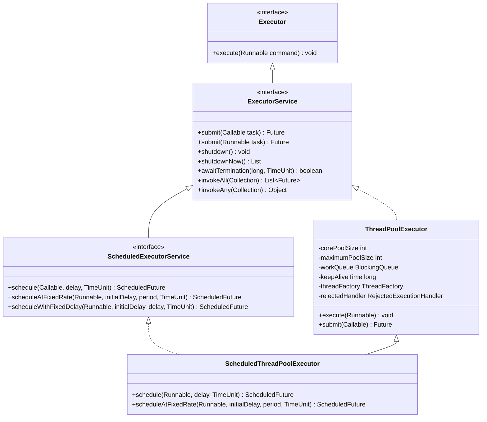
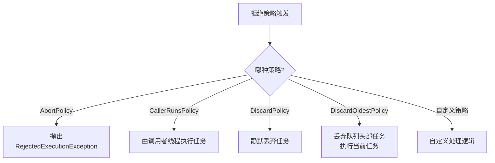
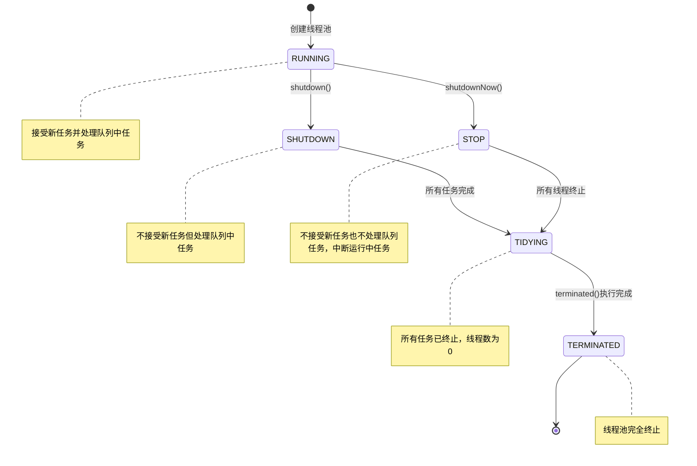

import Tabs from '@theme/Tabs';
import TabItem from '@theme/TabItem';
import TOCInline from '@theme/TOCInline';

# Java 线程池详解

线程池是Java并发编程中的重要组件，它通过复用线程来减少线程创建和销毁的开销，提高系统的性能和稳定性。本文将详细介绍Java线程池的原理、配置和最佳实践。

## 1. 线程池概述

### 1.1 什么是线程池？

:::tip 核心概念
线程池是一种线程复用机制，它预先创建一定数量的线程，并将这些线程放入池中。当有任务需要执行时，从池中取出一个线程来执行任务，任务执行完毕后，线程返回池中等待下一个任务。
:::

### 1.2 线程池的优势

| 优势 | 具体体现 | 业务价值 |
|------|----------|----------|
| **减少开销** | 避免频繁创建和销毁线程 | 提高系统性能 |
| **控制并发数** | 限制同时运行的线程数量 | 防止资源耗尽 |
| **提高响应速度** | 任务到达时立即执行 | 提升用户体验 |
| **统一管理** | 集中管理线程生命周期 | 简化编程模型 |
| **提供监控** | 可以监控线程池状态 | 便于运维管理 |

### 1.3 线程池的核心组件

```java title="线程池核心组件示例"
public class ThreadPoolComponents {
    
    /**
     * 线程池的核心组件
     */
    public static void explainComponents() {
        System.out.println("=== 线程池核心组件 ===");
        
        // 1. 核心线程数 (corePoolSize)
        // 线程池中会维护的最小线程数量
        int corePoolSize = 5;
        System.out.println("核心线程数: " + corePoolSize);
        
        // 2. 最大线程数 (maximumPoolSize)
        // 线程池中允许的最大线程数量
        int maximumPoolSize = 10;
        System.out.println("最大线程数: " + maximumPoolSize);
        
        // 3. 工作队列 (workQueue)
        // 用于存储等待执行的任务
        BlockingQueue<Runnable> workQueue = new LinkedBlockingQueue<>(100);
        System.out.println("工作队列容量: " + workQueue.remainingCapacity());
        
        // 4. 线程工厂 (threadFactory)
        // 用于创建新线程的工厂
        ThreadFactory threadFactory = r -> {
            Thread t = new Thread(r);
            t.setName("CustomThread-" + t.getId());
            return t;
        };
        System.out.println("线程工厂: " + threadFactory.getClass().getSimpleName());
        
        // 5. 拒绝策略 (rejectedExecutionHandler)
        // 当线程池和队列都满时的处理策略
        RejectedExecutionHandler rejectedHandler = new ThreadPoolExecutor.AbortPolicy();
        System.out.println("拒绝策略: " + rejectedHandler.getClass().getSimpleName());
        
        // 6. 线程存活时间 (keepAliveTime)
        // 非核心线程的空闲存活时间
        long keepAliveTime = 60L;
        System.out.println("线程存活时间: " + keepAliveTime + "秒");
    }
}
```

## 2. Executor 框架

### 2.1 Executor 接口体系



<Tabs>
  <TabItem value="executor" label="Executor" default>
  ```java
  // 最简单的Executor接口实现
  Executor directExecutor = new Executor() {
      @Override
      public void execute(Runnable command) {
          // 直接在当前线程执行任务
          command.run();
      }
  };
  
  // 使用Executor
  directExecutor.execute(() -> {
      System.out.println("在当前线程执行的任务");
  });
  ```
  </TabItem>
  <TabItem value="executorService" label="ExecutorService">
  ```java
  ExecutorService executorService = Executors.newFixedThreadPool(2);
  
  // 提交任务并获取Future
  Future<String> future = executorService.submit(() -> {
      Thread.sleep(1000);
      return "任务完成";
  });
  
  // 获取结果（阻塞等待）
  try {
      String result = future.get();
      System.out.println(result);
  } catch (Exception e) {
      e.printStackTrace();
  }
  
  // 生命周期管理
  executorService.shutdown();
  boolean terminated = executorService.awaitTermination(5, TimeUnit.SECONDS);
  System.out.println("是否在5秒内终止: " + terminated);
  
  // 如果需要立即终止
  if (!terminated) {
      List<Runnable> unfinishedTasks = executorService.shutdownNow();
      System.out.println("未完成的任务数: " + unfinishedTasks.size());
  }
  ```
  </TabItem>
  <TabItem value="scheduledExecutorService" label="ScheduledExecutorService">
  ```java
  ScheduledExecutorService scheduler = Executors.newScheduledThreadPool(1);
  
  // 延迟执行一次
  ScheduledFuture<?> delayedTask = scheduler.schedule(
      () -> System.out.println("延迟3秒执行"), 
      3, 
      TimeUnit.SECONDS
  );
  
  // 固定频率执行（从任务开始时计时）
  ScheduledFuture<?> fixedRateTask = scheduler.scheduleAtFixedRate(
      () -> System.out.println("每2秒执行一次"), 
      0,  // 初始延迟
      2,   // 周期
      TimeUnit.SECONDS
  );
  
  // 固定延迟执行（从上一次任务结束时计时）
  ScheduledFuture<?> fixedDelayTask = scheduler.scheduleWithFixedDelay(
      () -> System.out.println("上一次任务结束后延迟1秒再执行"), 
      0,  // 初始延迟
      1,   // 延迟时间
      TimeUnit.SECONDS
  );
  
  // 取消任务
  delayedTask.cancel(false);
  
  // 安全关闭
  scheduler.shutdown();
  ```
  </TabItem>
</Tabs>

### 2.2 预定义线程池

<details>
<summary><strong>线程池类型比较</strong></summary>

| 线程池类型 | 核心线程数 | 最大线程数 | 空闲线程生存时间 | 工作队列 | 适用场景 |
|-----------|----------|-----------|---------------|---------|---------|
| **FixedThreadPool** | 固定值n | 固定值n | 0秒 | LinkedBlockingQueue<br/>(无界) | 需要限制线程数的<br/>CPU密集型任务 |
| **CachedThreadPool** | 0 | Integer.MAX_VALUE | 60秒 | SynchronousQueue<br/>(同步交付) | 执行大量短生命周期的<br/>异步任务 |
| **SingleThreadExecutor** | 1 | 1 | 0秒 | LinkedBlockingQueue<br/>(无界) | 需要保证<br/>顺序执行的任务 |
| **ScheduledThreadPool** | 指定值n | Integer.MAX_VALUE | 0秒 | DelayedWorkQueue<br/>(延时队列) | 需要定时<br/>或周期性执行的任务 |
| **WorkStealingPool** | 并行度 | 并行度 | - | 工作窃取队列 | 需要充分利用<br/>多核CPU的任务 |

**重要说明**：
- FixedThreadPool使用无界队列可能导致OOM（队列过大）
- CachedThreadPool允许无限创建线程可能导致OOM（线程过多）
- SingleThreadExecutor使用无界队列可能导致OOM（队列过大）
- 实际生产环境中通常应该使用ThreadPoolExecutor自定义线程池参数

</details>

<Tabs>
  <TabItem value="fixed" label="FixedThreadPool" default>
  <div className="card">
  <div className="card__body">
  
  **特点**：
  - 固定数量线程池，核心线程数=最大线程数
  - 使用无界队列存储待执行任务
  - 线程不会超时终止（keepAliveTime = 0）
  - 任务顺序执行，不支持优先级
  
  **创建方式**：
  ```java
  // 创建含有5个线程的固定大小线程池
  ExecutorService fixedPool = Executors.newFixedThreadPool(5);
  
  // 指定线程工厂
  ExecutorService fixedPoolWithFactory = Executors.newFixedThreadPool(
      5,
      new ThreadFactory() {
          @Override
          public Thread newThread(Runnable r) {
              Thread t = new Thread(r);
              t.setName("CustomFixedPool-" + t.getId());
              return t;
          }
      }
  );
  ```
  
  **内部实现**：
  ```java
  // 等价于
  new ThreadPoolExecutor(
      nThreads,    // 核心线程数
      nThreads,    // 最大线程数
      0L, TimeUnit.MILLISECONDS, // 线程空闲时间(永不回收)
      new LinkedBlockingQueue<Runnable>() // 无界队列
  );
  ```
  
  </div>
  </div>
  </TabItem>
  <TabItem value="cached" label="CachedThreadPool">
  <div className="card">
  <div className="card__body">
  
  **特点**：
  - 可缓存的线程池，按需创建线程
  - 核心线程数为0，最大线程数为Integer.MAX_VALUE
  - 线程空闲60秒后回收
  - 使用SynchronousQueue直接交付任务给线程
  
  **创建方式**：
  ```java
  // 创建可缓存线程池
  ExecutorService cachedPool = Executors.newCachedThreadPool();
  
  // 指定线程工厂
  ExecutorService cachedPoolWithFactory = Executors.newCachedThreadPool(
      new ThreadFactory() {
          @Override
          public Thread newThread(Runnable r) {
              Thread t = new Thread(r);
              t.setDaemon(true); // 设置为守护线程
              return t;
          }
      }
  );
  ```
  
  **内部实现**：
  ```java
  // 等价于
  new ThreadPoolExecutor(
      0,                      // 核心线程数
      Integer.MAX_VALUE,      // 最大线程数
      60L, TimeUnit.SECONDS,  // 线程空闲时间
      new SynchronousQueue<Runnable>() // 同步队列(直接交付)
  );
  ```
  
  </div>
  </div>
  </TabItem>
  <TabItem value="single" label="SingleThreadExecutor">
  <div className="card">
  <div className="card__body">
  
  **特点**：
  - 单线程执行器，只有一个工作线程
  - 所有任务保证按提交顺序执行
  - 使用无界队列存储待执行任务
  - 任务串行执行，适合要求顺序的场景
  
  **创建方式**：
  ```java
  // 创建单线程执行器
  ExecutorService singlePool = Executors.newSingleThreadExecutor();
  
  // 指定线程工厂
  ExecutorService singlePoolWithFactory = Executors.newSingleThreadExecutor(
      r -> {
          Thread t = new Thread(r);
          t.setName("SingleWorker");
          return t;
      }
  );
  ```
  
  **内部实现**：
  ```java
  // 注意：实际上使用了FinalizableDelegatedExecutorService包装
  // 等价于
  new ThreadPoolExecutor(
      1,                      // 核心线程数
      1,                      // 最大线程数
      0L, TimeUnit.MILLISECONDS, // 线程空闲时间
      new LinkedBlockingQueue<Runnable>() // 无界队列
  );
  ```
  
  </div>
  </div>
  </TabItem>
  <TabItem value="scheduled" label="ScheduledThreadPool">
  <div className="card">
  <div className="card__body">
  
  **特点**：
  - 支持定时和周期性任务执行
  - 核心线程数固定，最大线程数无限
  - 使用DelayedWorkQueue存储定时任务
  - 可以替代Timer，更灵活且线程安全
  
  **创建方式**：
  ```java
  // 创建包含2个线程的定时任务线程池
  ScheduledExecutorService scheduledPool = Executors.newScheduledThreadPool(2);
  
  // 单线程定时执行器
  ScheduledExecutorService singleScheduledPool = Executors.newSingleThreadScheduledExecutor();
  ```
  
  **内部实现**：
  ```java
  // 等价于
  new ScheduledThreadPoolExecutor(
      corePoolSize,  // 核心线程数
      new ThreadPoolExecutor.AbortPolicy() // 拒绝策略
  );
  
  // ScheduledThreadPoolExecutor构造器
  public ScheduledThreadPoolExecutor(int corePoolSize) {
      super(corePoolSize, Integer.MAX_VALUE, 0, NANOSECONDS,
            new DelayedWorkQueue());
  }
  ```
  
  </div>
  </div>
  </TabItem>
  <TabItem value="workStealing" label="WorkStealingPool">
  <div className="card">
  <div className="card__body">
  
  **特点**：
  - 基于工作窃取算法的线程池
  - 每个线程有自己的任务队列
  - 当线程空闲时，会从其他繁忙线程队列窃取任务
  - 使用ForkJoinPool实现，适合并行计算
  
  **创建方式**：
  ```java
  // 创建基于当前可用处理器数量的工作窃取线程池
  ExecutorService stealingPool = Executors.newWorkStealingPool();
  
  // 指定并行度
  ExecutorService stealingPoolWithParallelism = Executors.newWorkStealingPool(4);
  ```
  
  **内部实现**：
  ```java
  // 等价于
  new ForkJoinPool(
      parallelism,  // 并行度
      ForkJoinPool.defaultForkJoinWorkerThreadFactory,
      null,
      true  // 异步模式
  );
  ```
  
  </div>
  </div>
  </TabItem>
</Tabs>

:::warning 预定义线程池的隐患
1. **FixedThreadPool** 和 **SingleThreadExecutor** 使用无界队列，当任务持续高速提交可能导致**内存溢出**
2. **CachedThreadPool** 允许创建无限数量的线程，线程数量激增可能导致**系统资源耗尽**
3. 在生产环境中应该使用 **ThreadPoolExecutor** 自定义线程池，避免使用Executors创建的预定义线程池
:::

```java title="生产环境线程池创建示例"
ThreadPoolExecutor productionPool = new ThreadPoolExecutor(
    5,                                   // 核心线程数
    10,                                  // 最大线程数
    60, TimeUnit.SECONDS,                // 线程空闲时间
    new ArrayBlockingQueue<>(100),       // 有界队列
    new ThreadFactoryBuilder()           // 自定义线程工厂
        .setNameFormat("prod-pool-%d")
        .setDaemon(false)
        .build(),
    new ThreadPoolExecutor.CallerRunsPolicy() // 拒绝策略
);
```

## 3. ThreadPoolExecutor 详解

### 3.1 核心参数与工作原理

<Tabs>
  <TabItem value="params" label="核心参数" default>
  ```mermaid
  classDiagram
      class ThreadPoolExecutor {
          -int corePoolSize
          -int maximumPoolSize
          -long keepAliveTime
          -TimeUnit unit
          -BlockingQueue~Runnable~ workQueue
          -ThreadFactory threadFactory
          -RejectedExecutionHandler handler
          +ThreadPoolExecutor(corePoolSize, maximumPoolSize, keepAliveTime, unit, workQueue, threadFactory, handler)
          +execute(Runnable command) void
          +submit(Runnable task) Future
      }
  ```
  
  <div className="card">
  <div className="card__header">
  <h4>ThreadPoolExecutor 构造参数</h4>
  </div>
  <div className="card__body">
  
  | 参数 | 描述 | 推荐配置 |
  |------|------|---------|
  | **corePoolSize** | 核心线程数，线程池中保持活动的最小线程数 | CPU密集型：N+1<br/>IO密集型：2N |
  | **maximumPoolSize** | 最大线程数，线程池允许的最大线程数 | 核心线程数的2-3倍 |
  | **keepAliveTime** | 空闲线程存活时间，超过核心线程数的空闲线程在等待新任务时的最长存活时间 | 根据业务和系统负载调整 |
  | **unit** | 时间单位，keepAliveTime的时间单位 | 通常使用秒或毫秒 |
  | **workQueue** | 工作队列，存放等待执行的任务 | 根据任务特性选择合适队列类型 |
  | **threadFactory** | 线程工厂，创建新线程的工厂 | 自定义命名和优先级 |
  | **handler** | 拒绝策略，线程池和队列都满时的处理策略 | 根据业务需求选择合适的策略 |
  
  </div>
  </div>
  </TabItem>
  <TabItem value="principle" label="工作原理">
  ```mermaid
  flowchart TD
      A[提交任务] --> B{线程数 < 核心线程数?}
      B -->|是| C[创建新的核心线程执行任务]
      B -->|否| D{工作队列未满?}
      D -->|是| E[放入工作队列]
      D -->|否| F{线程数 < 最大线程数?}
      F -->|是| G[创建新的非核心线程执行任务]
      F -->|否| H[触发拒绝策略]
      
      C --> I[任务执行完成]
      G --> I
      I --> J[线程是核心线程?]
      J -->|是| K[保留线程]
      J -->|否| L{空闲时间>keepAliveTime?}
      L -->|是| M[终止线程]
      L -->|否| N[保持等待]
      N --> L
      K --> O[等待新任务]
      O --> I
  ```
  
  **执行流程**：
  1. 当任务提交时，如果线程数小于核心线程数，创建新的核心线程执行任务
  2. 如果线程数已达到核心线程数，将任务放入工作队列
  3. 如果队列已满，但线程数小于最大线程数，创建新的非核心线程执行任务
  4. 如果队列已满且线程数已达到最大线程数，触发拒绝策略
  5. 非核心线程在空闲超过keepAliveTime后会被终止
  
  </TabItem>
  <TabItem value="queue" label="工作队列类型">
  <div className="card">
  <div className="card__body">
  
  **1. ArrayBlockingQueue**
  - 有界队列，基于数组
  - 需要指定容量
  - FIFO顺序处理任务
  - 适用于已知任务边界的场景
  
  ```java
  // 创建容量为100的有界队列
  BlockingQueue<Runnable> arrayQueue = new ArrayBlockingQueue<>(100);
  ```
  
  **2. LinkedBlockingQueue**
  - 可选有界/无界队列，基于链表
  - 不指定容量时为无界队列(Integer.MAX_VALUE)
  - FIFO顺序处理任务
  - 无界队列风险：可能导致OOM
  
  ```java
  // 有界队列
  BlockingQueue<Runnable> boundedQueue = new LinkedBlockingQueue<>(500);
  // 无界队列（不推荐）
  BlockingQueue<Runnable> unboundedQueue = new LinkedBlockingQueue<>();
  ```
  
  **3. SynchronousQueue**
  - 无容量的同步队列
  - 直接传递模式，没有实际存储
  - 适用于任务间直接传递或需要立即处理的场景
  
  ```java
  // 同步队列
  BlockingQueue<Runnable> syncQueue = new SynchronousQueue<>();
  ```
  
  **4. PriorityBlockingQueue**
  - 无界优先级队列
  - 根据任务优先级排序(需实现Comparable)
  - 适用于任务有优先级要求的场景
  
  ```java
  // 优先级队列
  BlockingQueue<Runnable> priorityQueue = new PriorityBlockingQueue<>();
  ```
  
  **5. DelayQueue**
  - 延时队列，元素在到期后才能被取出
  - 适用于定时任务或需要延迟执行的场景
  
  ```java
  // 延时队列
  BlockingQueue<Runnable> delayQueue = new DelayQueue<>();
  ```
  
  </div>
  </div>
  </TabItem>
  <TabItem value="threadfactory" label="线程工厂">
  ```java
  // 自定义线程工厂
  ThreadFactory threadFactory = new ThreadFactory() {
      private final AtomicInteger threadNumber = new AtomicInteger(1);
      private final String namePrefix = "MyApp-Worker-";
      
      @Override
      public Thread newThread(Runnable r) {
          Thread t = new Thread(r, namePrefix + threadNumber.getAndIncrement());
          
          // 设置为非守护线程
          t.setDaemon(false);
          
          // 设置优先级
          t.setPriority(Thread.NORM_PRIORITY);
          
          // 设置异常处理器
          t.setUncaughtExceptionHandler((thread, exception) -> {
              System.err.println("Thread " + thread.getName() + 
                               " encountered an exception: " + exception.getMessage());
              exception.printStackTrace();
          });
          
          return t;
      }
  };
  
  // 使用自定义线程工厂创建线程池
  ThreadPoolExecutor executor = new ThreadPoolExecutor(
      5, 10, 60, TimeUnit.SECONDS, 
      new ArrayBlockingQueue<>(100),
      threadFactory,
      new ThreadPoolExecutor.CallerRunsPolicy()
  );
  ```
  </TabItem>
</Tabs>

### 3.2 拒绝策略详解

<details>
<summary><strong>拒绝策略的工作原理</strong></summary>

当线程池无法接受任务（线程池已关闭或线程池和队列都已满）时，就会触发拒绝策略。Java提供了四种标准拒绝策略，也可以自定义拒绝策略。



每种策略的处理方式不同，需要根据业务需求选择合适的策略：

1. **线程池关闭后**：所有拒绝策略都会拒绝新的任务
2. **线程池和队列都满**：根据不同的拒绝策略进行处理

</details>

<Tabs>
  <TabItem value="abort" label="AbortPolicy" default>
  ```java
  // 中止策略：抛出异常（默认策略）
  ThreadPoolExecutor executor = new ThreadPoolExecutor(
      2, 2, 0, TimeUnit.SECONDS,
      new ArrayBlockingQueue<>(2),
      new ThreadPoolExecutor.AbortPolicy()
  );
  
  // 模拟任务提交
  try {
      // 提交5个任务，但线程池只能处理4个(2个线程+2个队列)
      for (int i = 1; i <= 5; i++) {
          final int taskId = i;
          executor.execute(() -> {
              try {
                  System.out.println("任务" + taskId + "开始执行");
                  Thread.sleep(1000);
              } catch (InterruptedException e) {
                  Thread.currentThread().interrupt();
              }
          });
          System.out.println("成功提交任务" + taskId);
      }
  } catch (RejectedExecutionException e) {
      System.err.println("任务被拒绝: " + e.getMessage());
  }
  ```
  
  **特点**：
  - 拒绝任务时抛出RejectedExecutionException
  - 调用者可以捕获异常进行处理
  - 适合需要立即感知任务被拒绝的场景
  </TabItem>
  <TabItem value="callerRuns" label="CallerRunsPolicy">
  ```java
  // 调用者运行策略：由提交任务的线程执行任务
  ThreadPoolExecutor executor = new ThreadPoolExecutor(
      2, 2, 0, TimeUnit.SECONDS,
      new ArrayBlockingQueue<>(2),
      new ThreadPoolExecutor.CallerRunsPolicy()
  );
  
  // 模拟任务提交
  for (int i = 1; i <= 10; i++) {
      final int taskId = i;
      System.out.println("准备提交任务" + taskId + 
                       ", 当前线程: " + Thread.currentThread().getName());
      
      executor.execute(() -> {
          String threadName = Thread.currentThread().getName();
          System.out.println("任务" + taskId + "开始执行, 线程: " + threadName);
          try {
              Thread.sleep(1000);
          } catch (InterruptedException e) {
              Thread.currentThread().interrupt();
          }
          System.out.println("任务" + taskId + "执行完成, 线程: " + threadName);
      });
  }
  ```
  
  **特点**：
  - 由调用者线程直接执行被拒绝的任务
  - 提供反馈压力机制，降低任务提交速度
  - 不会丢失任务，适合任务必须执行且可接受延迟的场景
  </TabItem>
  <TabItem value="discard" label="DiscardPolicy">
  ```java
  // 丢弃策略：静默丢弃被拒绝的任务
  ThreadPoolExecutor executor = new ThreadPoolExecutor(
      2, 2, 0, TimeUnit.SECONDS,
      new ArrayBlockingQueue<>(2),
      new ThreadPoolExecutor.DiscardPolicy()
  );
  
  // 监控线程池状态
  new Thread(() -> {
      while (!executor.isShutdown()) {
          System.out.println(
              "线程池状态: 活动线程=" + executor.getActiveCount() +
              ", 队列大小=" + executor.getQueue().size() +
              ", 已完成任务=" + executor.getCompletedTaskCount()
          );
          try {
              Thread.sleep(1000);
          } catch (InterruptedException e) {
              Thread.currentThread().interrupt();
          }
      }
  }).start();
  
  // 模拟任务提交
  for (int i = 1; i <= 10; i++) {
      final int taskId = i;
      System.out.println("提交任务" + taskId);
      executor.execute(() -> {
          try {
              System.out.println("执行任务" + taskId);
              Thread.sleep(2000);
          } catch (InterruptedException e) {
              Thread.currentThread().interrupt();
          }
      });
  }
  ```
  
  **特点**：
  - 静默丢弃被拒绝的任务，不做任何处理
  - 适合允许任务丢失的场景
  - 对任务重要性要求低的场景
  </TabItem>
  <TabItem value="discardOldest" label="DiscardOldestPolicy">
  ```java
  // 丢弃最旧任务策略：丢弃队列头部的任务，然后尝试执行当前任务
  ThreadPoolExecutor executor = new ThreadPoolExecutor(
      2, 2, 0, TimeUnit.SECONDS,
      new ArrayBlockingQueue<>(2),
      new ThreadPoolExecutor.DiscardOldestPolicy()
  );
  
  // 模拟任务提交
  for (int i = 1; i <= 10; i++) {
      final int taskId = i;
      System.out.println("提交任务" + taskId);
      executor.execute(() -> {
          try {
              System.out.println("执行任务" + taskId + 
                               ", 线程: " + Thread.currentThread().getName());
              Thread.sleep(1000);
          } catch (InterruptedException e) {
              Thread.currentThread().interrupt();
          }
      });
      
      // 让提交速度慢一点，观察效果
      try {
          Thread.sleep(100);
      } catch (InterruptedException e) {
          Thread.currentThread().interrupt();
      }
  }
  ```
  
  **特点**：
  - 丢弃队列中最旧的任务，执行当前任务
  - 队列头部任务被丢弃，队列尾部插入新任务
  - 适合更注重新任务，可以接受丢弃旧任务的场景
  </TabItem>
  <TabItem value="custom" label="自定义拒绝策略">
  ```java
  // 自定义拒绝策略
  RejectedExecutionHandler customHandler = new RejectedExecutionHandler() {
      @Override
      public void rejectedExecution(Runnable r, ThreadPoolExecutor executor) {
          // 1. 记录被拒绝的任务
          System.err.println("任务被拒绝，当前线程池状态：");
          System.err.println("  活动线程数：" + executor.getActiveCount());
          System.err.println("  已完成任务数：" + executor.getCompletedTaskCount());
          System.err.println("  工作队列大小：" + executor.getQueue().size());
          
          // 2. 可以尝试重新提交到其他线程池
          fallbackExecutor.execute(r);
          
          // 3. 或者尝试延迟后重试
          // 注意：这种方式可能导致调用栈增长
          /*
          try {
              Thread.sleep(1000); // 延迟1秒后重试
              executor.execute(r);
          } catch (InterruptedException | RejectedExecutionException e) {
              Thread.currentThread().interrupt();
          }
          */
          
          // 4. 或者保存到数据库等待后续处理
          // saveTaskToDatabase(r);
      }
  };
  
  // 创建一个备用线程池
  ExecutorService fallbackExecutor = Executors.newSingleThreadExecutor();
  
  // 使用自定义拒绝策略创建线程池
  ThreadPoolExecutor executor = new ThreadPoolExecutor(
      2, 2, 0, TimeUnit.SECONDS,
      new ArrayBlockingQueue<>(2),
      customHandler
  );
  
  // 模拟任务提交
  for (int i = 1; i <= 10; i++) {
      final int taskId = i;
      executor.execute(() -> {
          System.out.println("执行任务" + taskId);
          try {
              Thread.sleep(500);
          } catch (InterruptedException e) {
              Thread.currentThread().interrupt();
          }
      });
  }
  ```
  
  **自定义策略优势**：
  - 可以实现业务定制化的拒绝处理逻辑
  - 支持任务重试、日志记录、监控告警等复杂处理
  - 可以结合队列优先级处理重要任务
  </TabItem>
</Tabs>

### 3.3 线程池状态与生命周期



<div className="code-with-callout">

```java
ThreadPoolExecutor executor = new ThreadPoolExecutor(
    5, 10, 60, TimeUnit.SECONDS,
    new ArrayBlockingQueue<>(100)
);

// 使用线程池执行一些任务
for (int i = 0; i < 20; i++) {
    final int taskId = i;
    executor.execute(() -> {
        System.out.println("执行任务" + taskId);
        try {
            Thread.sleep(500);
        } catch (InterruptedException e) {
            Thread.currentThread().interrupt();
        }
    });
}

// 优雅关闭线程池
executor.shutdown();
System.out.println("线程池状态(shutdown后): " + executor.isShutdown());

// 等待任务完成
try {
    // 等待所有任务完成或超时
    boolean terminated = executor.awaitTermination(10, TimeUnit.SECONDS);
    System.out.println("所有任务是否已完成: " + terminated);
    
    if (!terminated) {
        // 强制关闭
        System.out.println("尚未完成的任务数: " + executor.getQueue().size());
        System.out.println("立即关闭线程池...");
        
        // 获取未完成的任务列表
        List<Runnable> unfinishedTasks = executor.shutdownNow();
        System.out.println("未执行的任务数: " + unfinishedTasks.size());
    }
} catch (InterruptedException e) {
    // 如果当前线程被中断，立即关闭线程池
    Thread.currentThread().interrupt();
    executor.shutdownNow();
}

System.out.println("线程池是否已终止: " + executor.isTerminated());
```

:::info 线程池生命周期状态
1. **RUNNING**: 初始状态，线程池能够接受新任务并处理排队任务
2. **SHUTDOWN**: 不再接受新任务，但仍会处理排队任务
3. **STOP**: 不接受新任务，不处理排队任务，中断进行中任务
4. **TIDYING**: 所有任务已终止，工作线程数量为0，即将运行terminated()方法
5. **TERMINATED**: terminated()方法执行完成，线程池完全终止
:::

</div>

## 4. 线程池监控与管理

### 4.1 线程池状态监控

```java title="线程池监控示例"
public class ThreadPoolMonitoring {
    
    /**
     * 线程池监控器
     */
    public static class ThreadPoolMonitor {
        private final ThreadPoolExecutor executor;
        private final ScheduledExecutorService monitor;
        
        public ThreadPoolMonitor(ThreadPoolExecutor executor) {
            this.executor = executor;
            this.monitor = Executors.newSingleThreadScheduledExecutor();
        }
        
        public void startMonitoring() {
            monitor.scheduleAtFixedRate(() -> {
                printStatus();
            }, 0, 1, TimeUnit.SECONDS);
        }
        
        public void printStatus() {
            System.out.println("=== 线程池状态 ===");
            System.out.println("核心线程数: " + executor.getCorePoolSize());
            System.out.println("最大线程数: " + executor.getMaximumPoolSize());
            System.out.println("当前池大小: " + executor.getPoolSize());
            System.out.println("活跃线程数: " + executor.getActiveCount());
            System.out.println("队列大小: " + executor.getQueue().size());
            System.out.println("已完成任务数: " + executor.getCompletedTaskCount());
            System.out.println("总任务数: " + executor.getTaskCount());
            System.out.println("是否关闭: " + executor.isShutdown());
            System.out.println("是否终止: " + executor.isTerminated());
            System.out.println("------------------------");
        }
        
        public void stopMonitoring() {
            monitor.shutdown();
        }
    }
    
    /**
     * 线程池性能统计
     */
    public static class ThreadPoolStatistics {
        private final ThreadPoolExecutor executor;
        private long startTime;
        private long totalTasks;
        private long completedTasks;
        
        public ThreadPoolStatistics(ThreadPoolExecutor executor) {
            this.executor = executor;
            this.startTime = System.currentTimeMillis();
        }
        
        public void recordTaskSubmission() {
            totalTasks++;
        }
        
        public void recordTaskCompletion() {
            completedTasks++;
        }
        
        public void printStatistics() {
            long currentTime = System.currentTimeMillis();
            long runningTime = currentTime - startTime;
            
            System.out.println("=== 线程池统计信息 ===");
            System.out.println("运行时间: " + runningTime + "ms");
            System.out.println("总提交任务: " + totalTasks);
            System.out.println("已完成任务: " + completedTasks);
            System.out.println("任务完成率: " + (totalTasks > 0 ? (completedTasks * 100.0 / totalTasks) : 0) + "%");
            System.out.println("平均任务处理时间: " + (completedTasks > 0 ? (runningTime / completedTasks) : 0) + "ms");
        }
    }
}
```

### 4.2 线程池生命周期管理

```java title="线程池生命周期管理示例"
public class ThreadPoolLifecycle {
    
    /**
     * 优雅关闭线程池
     */
    public static class GracefulShutdown {
        private final ThreadPoolExecutor executor;
        
        public GracefulShutdown(ThreadPoolExecutor executor) {
            this.executor = executor;
        }
        
        public void shutdownGracefully() {
            System.out.println("开始优雅关闭线程池...");
            
            // 1. 停止接受新任务
            executor.shutdown();
            
            try {
                // 2. 等待现有任务完成
                if (!executor.awaitTermination(60, TimeUnit.SECONDS)) {
                    System.out.println("等待超时，强制关闭...");
                    executor.shutdownNow();
                    
                    // 3. 再次等待
                    if (!executor.awaitTermination(60, TimeUnit.SECONDS)) {
                        System.err.println("线程池无法关闭");
                    }
                }
            } catch (InterruptedException e) {
                System.out.println("等待过程中被中断，强制关闭...");
                executor.shutdownNow();
                Thread.currentThread().interrupt();
            }
            
            System.out.println("线程池已关闭");
        }
    }
    
    /**
     * 线程池重启机制
     */
    public static class ThreadPoolRestart {
        private volatile ThreadPoolExecutor executor;
        private final Object lock = new Object();
        
        public ThreadPoolRestart() {
            this.executor = createNewExecutor();
        }
        
        private ThreadPoolExecutor createNewExecutor() {
            return new ThreadPoolExecutor(
                5, 10, 60L, TimeUnit.SECONDS,
                new ArrayBlockingQueue<>(100),
                new ThreadPoolExecutor.CallerRunsPolicy()
            );
        }
        
        public void restart() {
            synchronized (lock) {
                System.out.println("开始重启线程池...");
                
                // 1. 关闭旧线程池
                ThreadPoolExecutor oldExecutor = executor;
                oldExecutor.shutdown();
                
                try {
                    if (!oldExecutor.awaitTermination(30, TimeUnit.SECONDS)) {
                        oldExecutor.shutdownNow();
                    }
                } catch (InterruptedException e) {
                    oldExecutor.shutdownNow();
                    Thread.currentThread().interrupt();
                }
                
                // 2. 创建新线程池
                executor = createNewExecutor();
                System.out.println("线程池重启完成");
            }
        }
        
        public void submitTask(Runnable task) {
            synchronized (lock) {
                executor.submit(task);
            }
        }
    }
}
```

## 5. 线程池最佳实践

### 5.1 线程池配置策略

:::tip 核心原则
配置线程池时需要考虑以下因素：
- **任务类型**：CPU密集型、IO密集型、混合型
- **系统资源**：CPU核心数、内存大小
- **业务需求**：响应时间、吞吐量要求
- **监控能力**：线程池状态监控
:::

```java title="线程池配置最佳实践示例"
public class ThreadPoolBestPractices {
    
    /**
     * 1. CPU密集型任务配置
     */
    public static class CPUIntensiveConfig {
        public static ThreadPoolExecutor createCPUIntensivePool() {
            int cpuCores = Runtime.getRuntime().availableProcessors();
            return new ThreadPoolExecutor(
                cpuCores,                    // 核心线程数 = CPU核心数
                cpuCores,                    // 最大线程数 = CPU核心数
                0L, TimeUnit.MILLISECONDS,   // 不保留空闲线程
                new LinkedBlockingQueue<>(), // 无界队列
                new ThreadPoolExecutor.CallerRunsPolicy()
            );
        }
    }
    
    /**
     * 2. IO密集型任务配置
     */
    public static class IOIntensiveConfig {
        public static ThreadPoolExecutor createIOIntensivePool() {
            int cpuCores = Runtime.getRuntime().availableProcessors();
            return new ThreadPoolExecutor(
                cpuCores * 2,               // 核心线程数 = CPU核心数 * 2
                cpuCores * 4,               // 最大线程数 = CPU核心数 * 4
                60L, TimeUnit.SECONDS,      // 保留空闲线程60秒
                new ArrayBlockingQueue<>(1000), // 有界队列
            new ThreadPoolExecutor.CallerRunsPolicy()
        );
        }
    }
    
    /**
     * 3. 混合型任务配置
     */
    public static class MixedTaskConfig {
        public static ThreadPoolExecutor createMixedTaskPool() {
            int cpuCores = Runtime.getRuntime().availableProcessors();
            return new ThreadPoolExecutor(
                cpuCores,                    // 核心线程数 = CPU核心数
                cpuCores * 2,                // 最大线程数 = CPU核心数 * 2
                30L, TimeUnit.SECONDS,       // 保留空闲线程30秒
                new ArrayBlockingQueue<>(500), // 有界队列
                new ThreadPoolExecutor.CallerRunsPolicy()
            );
        }
    }
    
    /**
     * 4. 定时任务配置
     */
    public static class ScheduledTaskConfig {
        public static ScheduledExecutorService createScheduledPool() {
            int cpuCores = Runtime.getRuntime().availableProcessors();
            return Executors.newScheduledThreadPool(cpuCores);
        }
    }
}
```

### 5.2 任务提交最佳实践

```java title="任务提交最佳实践示例"
public class TaskSubmissionBestPractices {
    
    /**
     * 1. 使用合适的提交方法
     */
    public static class TaskSubmissionMethods {
        private final ExecutorService executor = Executors.newFixedThreadPool(5);
        
        public void demonstrateSubmissionMethods() {
            // 1. execute() - 不关心返回值
            executor.execute(() -> {
                System.out.println("使用execute提交任务");
            });
            
            // 2. submit() - 关心返回值
            Future<String> future = executor.submit(() -> {
                return "任务执行结果";
            });
            
            // 3. submit() - 提交Callable
            Future<Integer> result = executor.submit(() -> {
                return 42;
            });
            
            // 4. invokeAll() - 批量提交
            List<Callable<String>> tasks = Arrays.asList(
                () -> "任务1",
                () -> "任务2",
                () -> "任务3"
            );
            
            try {
                List<Future<String>> futures = executor.invokeAll(tasks);
                for (Future<String> f : futures) {
                    System.out.println("结果: " + f.get());
                }
            } catch (InterruptedException | ExecutionException e) {
                e.printStackTrace();
            }
        }
    }
    
    /**
     * 2. 异常处理
     */
    public static class ExceptionHandling {
        private final ExecutorService executor = Executors.newFixedThreadPool(5);
        
        public void handleExceptions() {
            // 1. 在任务内部处理异常
            executor.submit(() -> {
                try {
                    // 可能抛出异常的操作
                    throw new RuntimeException("任务异常");
                } catch (Exception e) {
                    System.err.println("任务内部处理异常: " + e.getMessage());
                }
            });
            
            // 2. 通过Future处理异常
            Future<String> future = executor.submit(() -> {
                throw new RuntimeException("任务异常");
            });
            
            try {
                String result = future.get();
            } catch (ExecutionException e) {
                System.err.println("通过Future捕获异常: " + e.getCause().getMessage());
            } catch (InterruptedException e) {
                Thread.currentThread().interrupt();
            }
        }
    }
    
    /**
     * 3. 任务取消
     */
    public static class TaskCancellation {
        private final ExecutorService executor = Executors.newFixedThreadPool(5);
        
        public void demonstrateCancellation() {
            Future<?> future = executor.submit(() -> {
                try {
                    Thread.sleep(10000); // 长时间运行的任务
                } catch (InterruptedException e) {
                    System.out.println("任务被中断");
                    Thread.currentThread().interrupt();
                }
            });
            
            // 取消任务
            boolean cancelled = future.cancel(true);
            System.out.println("任务取消结果: " + cancelled);
        }
    }
}
```

### 5.3 性能优化技巧

```java title="线程池性能优化示例"
public class ThreadPoolPerformanceOptimization {
    
    /**
     * 1. 任务分解
     */
    public static class TaskDecomposition {
        private final ExecutorService executor = Executors.newFixedThreadPool(5);
        
        public void decomposeLargeTask() {
            int[] data = new int[1000];
            // 初始化数据...
            
            // 将大任务分解为小任务
            int chunkSize = 100;
            List<Future<Integer>> futures = new ArrayList<>();
            
            for (int i = 0; i < data.length; i += chunkSize) {
                final int start = i;
                final int end = Math.min(i + chunkSize, data.length);
                
                Future<Integer> future = executor.submit(() -> {
                    int sum = 0;
                    for (int j = start; j < end; j++) {
                        sum += data[j];
                    }
                    return sum;
                });
                futures.add(future);
            }
            
            // 收集结果
            int totalSum = 0;
            for (Future<Integer> future : futures) {
                try {
                    totalSum += future.get();
                } catch (InterruptedException | ExecutionException e) {
                    e.printStackTrace();
                }
            }
        }
    }
    
    /**
     * 2. 任务优先级
     */
    public static class TaskPriority {
        private final ThreadPoolExecutor executor;
        
        public TaskPriority() {
            this.executor = new ThreadPoolExecutor(
                5, 10, 60L, TimeUnit.SECONDS,
                new PriorityBlockingQueue<>(),
                new ThreadPoolExecutor.CallerRunsPolicy()
            );
        }
        
        public void submitPriorityTasks() {
            // 高优先级任务
            executor.submit(new PriorityTask("高优先级任务", 1));
            
            // 低优先级任务
            executor.submit(new PriorityTask("低优先级任务", 3));
            
            // 中优先级任务
            executor.submit(new PriorityTask("中优先级任务", 2));
        }
        
        private static class PriorityTask implements Runnable, Comparable<PriorityTask> {
            private final String name;
            private final int priority;
            
            public PriorityTask(String name, int priority) {
                this.name = name;
                this.priority = priority;
            }
            
            @Override
            public void run() {
                System.out.println("执行任务: " + name + "，优先级: " + priority);
            }
            
            @Override
            public int compareTo(PriorityTask other) {
                return Integer.compare(this.priority, other.priority);
            }
        }
    }
    
    /**
     * 3. 线程池预热
     */
    public static class ThreadPoolWarmup {
        private final ThreadPoolExecutor executor;
        
        public ThreadPoolWarmup() {
            this.executor = new ThreadPoolExecutor(
                5, 10, 60L, TimeUnit.SECONDS,
                new ArrayBlockingQueue<>(100),
                new ThreadPoolExecutor.CallerRunsPolicy()
            );
        }
        
        public void warmup() {
            System.out.println("开始预热线程池...");
            
            // 提交一些轻量级任务来预热线程池
            for (int i = 0; i < 5; i++) {
                executor.submit(() -> {
                    System.out.println("预热任务执行");
                });
            }
            
            // 等待预热完成
            try {
                Thread.sleep(1000);
            } catch (InterruptedException e) {
                Thread.currentThread().interrupt();
            }
            
            System.out.println("线程池预热完成");
        }
    }
}
```

## 6. 总结

线程池是Java并发编程中的重要组件，合理使用线程池可以显著提高系统性能和稳定性。

### 6.1 关键要点

1. **线程池类型**：FixedThreadPool、CachedThreadPool、SingleThreadExecutor、ScheduledThreadPool
2. **配置参数**：核心线程数、最大线程数、队列类型、拒绝策略
3. **监控管理**：状态监控、生命周期管理、性能统计
4. **最佳实践**：合理配置、异常处理、任务分解、性能优化

### 6.2 选择建议

| 场景 | 推荐线程池 | 配置要点 |
|------|------------|----------|
| **固定并发数** | FixedThreadPool | 核心线程数 = 最大线程数 |
| **短期异步任务** | CachedThreadPool | 适合任务执行时间短 |
| **顺序执行** | SingleThreadExecutor | 保证任务顺序执行 |
| **定时任务** | ScheduledThreadPool | 支持延迟和周期性执行 |
| **自定义需求** | ThreadPoolExecutor | 完全控制配置参数 |

### 6.3 学习建议

1. **理解原理**：深入理解线程池的工作原理和参数含义
2. **实践验证**：通过编写代码验证不同配置的效果
3. **性能测试**：对比不同线程池配置的性能差异
4. **监控运维**：建立线程池监控和告警机制

通过深入理解和熟练运用线程池技术，我们能够构建出更加高效、健壮和可维护的Java并发应用程序。 