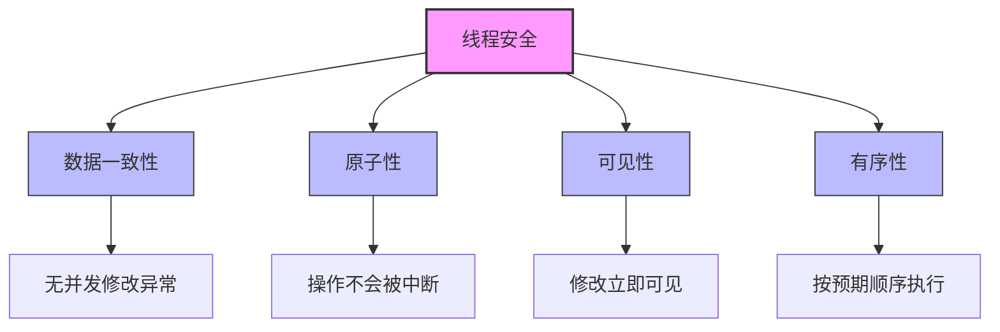
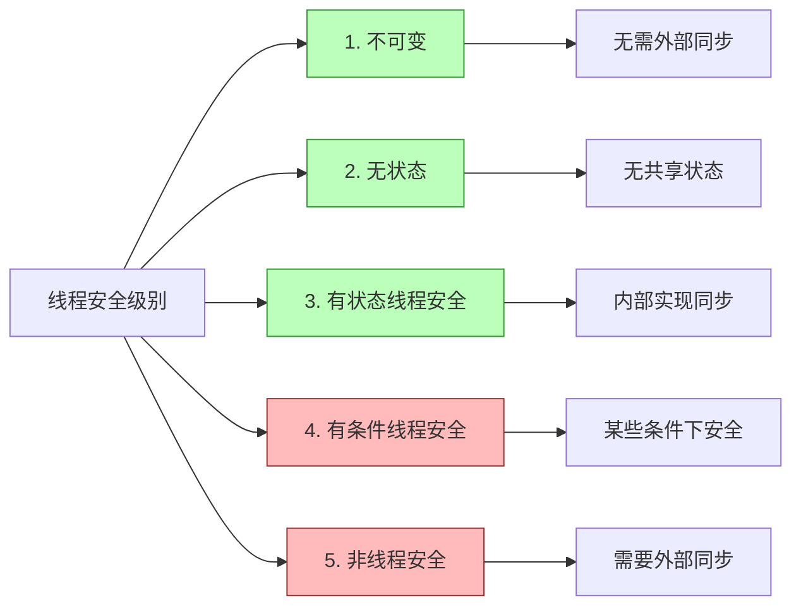
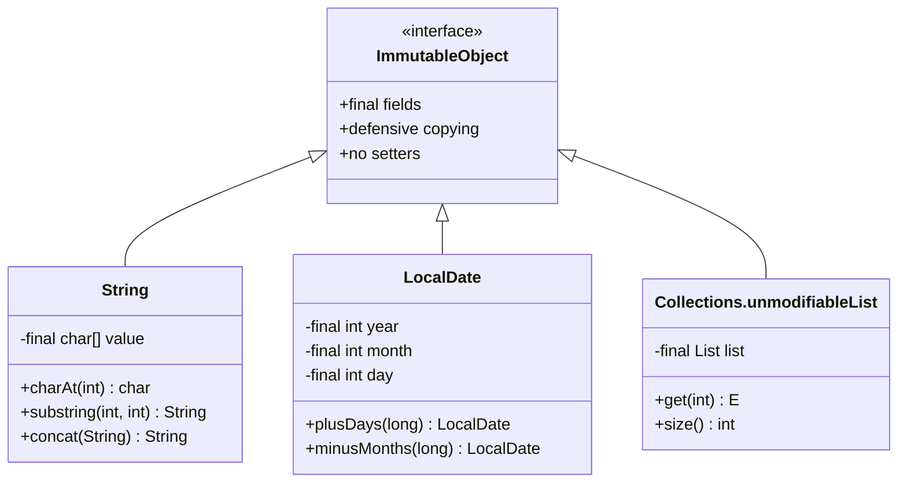
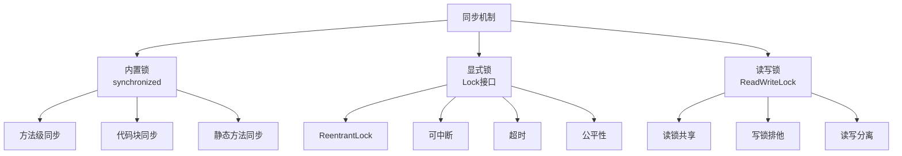
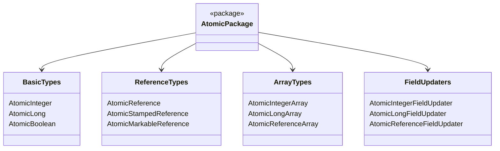
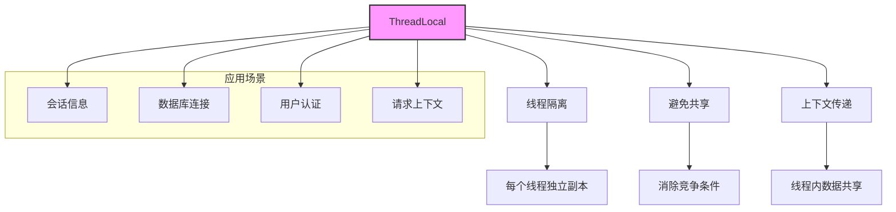

import Tabs from '@theme/Tabs';
import TabItem from '@theme/TabItem';
import TOCInline from '@theme/TOCInline';

# Java 线程安全详解

线程安全是多线程编程中的核心概念，指在多线程环境下，程序能够正确执行，不会出现数据不一致或异常结果。本文将详细介绍线程安全的实现策略、常见问题及解决方案。

:::info 本文内容概览
<TOCInline toc={toc} />
:::

:::tip 核心价值
**线程安全 = 并发正确性 + 数据一致性 + 可见性 + 原子性 + 有序性**
- 🔒 **并发控制**：确保多线程环境下数据操作的正确性
- 🛡️ **数据保护**：防止数据损坏和状态不一致
- 👁️ **可见性**：保证一个线程对数据的修改对其他线程可见
- ⚛️ **原子性**：确保操作要么完全执行，要么完全不执行
- 🔄 **有序性**：控制代码执行顺序，防止指令重排导致的问题
:::

## 1. 线程安全概述

### 1.1 什么是线程安全？



:::tip 核心概念
线程安全是指多线程环境下，程序能够正确执行，不会出现数据不一致或异常结果。线程安全的代码在多线程并发执行时，能够保证数据的正确性和一致性。
:::

### 1.2 线程安全的重要性

<div className="card">
<div className="card__header">
<h4>线程安全的业务价值</h4>
</div>
<div className="card__body">

| 重要性 | 具体体现 | 业务价值 |
|--------|----------|----------|
| **数据一致性** | 避免数据损坏和不一致 | 保证业务逻辑正确性 |
| **系统稳定性** | 防止程序崩溃和异常 | 提高系统可用性 |
| **性能优化** | 避免不必要的同步开销 | 提升系统性能 |
| **可维护性** | 代码逻辑清晰，易于调试 | 降低维护成本 |

</div>
</div>

### 1.3 线程安全级别



<Tabs>
  <TabItem value="immutable" label="不可变对象" default>
  ```java
  /**
   * 1. 不可变对象 - 最高级别的线程安全
   * 对象创建后状态永远不会改变
   */
  public static final class ImmutablePoint {
      private final int x;
      private final int y;
      
      public ImmutablePoint(int x, int y) {
          this.x = x;
          this.y = y;
      }
      
      public int getX() { return x; }
      public int getY() { return y; }
      
      // 返回新对象而不是修改现有对象
      public ImmutablePoint move(int dx, int dy) {
          return new ImmutablePoint(x + dx, y + dy);
      }
  }
  
  // 使用示例
  ImmutablePoint p1 = new ImmutablePoint(5, 10);
  // 移动点位，返回新对象，原对象不变
  ImmutablePoint p2 = p1.move(3, 4);
  // p1仍然是(5,10)，p2是(8,14)
  ```
  
  **特点：**
  - 所有字段都是final
  - 对象状态不可修改
  - 所有可变成员变量都进行防御性复制
  - 任何方法都不会修改对象状态
  - 绝对线程安全，无需同步
  
  </TabItem>
  <TabItem value="stateless" label="无状态对象">
  ```java
  /**
   * 2. 无状态对象 - 天然线程安全
   * 不包含任何状态信息
   */
  public static class StatelessCalculator {
      public int add(int a, int b) {
          return a + b;
      }
      
      public int multiply(int a, int b) {
          return a * b;
      }
  }
  
  // 使用示例
  StatelessCalculator calculator = new StatelessCalculator();
  // 多线程调用add和multiply方法是安全的
  // 因为没有共享状态可能被修改
  ```
  
  **特点：**
  - 不包含任何实例或类变量
  - 方法的执行结果只依赖于输入参数
  - 不依赖外部状态
  - 天然线程安全，无需同步
  
  </TabItem>
  <TabItem value="thread_safe" label="线程安全对象">
  ```java
  /**
   * 3. 有状态但线程安全的对象
   * 通过同步机制保护状态
   */
  public static class ThreadSafeCounter {
      private int count = 0;
      
      // 使用synchronized确保线程安全
      public synchronized void increment() {
          count++;
      }
      
      public synchronized int getCount() {
          return count;
      }
  }
  
  // 或者使用原子类
  public static class AtomicCounter {
      private AtomicInteger count = new AtomicInteger(0);
      
      public void increment() {
          count.incrementAndGet();
      }
      
      public int getCount() {
          return count.get();
      }
  }
  ```
  
  **特点：**
  - 包含可变状态
  - 通过同步机制（synchronized、Lock、原子类等）保护状态
  - 所有访问共享状态的方法都经过同步
  - 无需外部同步即可安全使用
  
  </TabItem>
  <TabItem value="unsafe" label="非线程安全对象">
  ```java
  /**
   * 4. 有状态且非线程安全的对象
   * 需要外部同步保护
   */
  public static class UnsafeCounter {
      private int count = 0;
      
      public void increment() {
          count++; // 非原子操作，线程不安全
      }
      
      public int getCount() {
          return count;
      }
  }
  
  // 使用示例 - 需要外部同步
  UnsafeCounter counter = new UnsafeCounter();
  
  // 不安全的多线程访问
  // new Thread(() -> counter.increment()).start();
  // new Thread(() -> counter.increment()).start();
  
  // 安全的使用方式
  synchronized(counter) {
      counter.increment();
  }
  ```
  
  **特点：**
  - 包含可变状态
  - 没有同步机制保护状态
  - 在多线程环境下可能导致数据不一致
  - 需要外部同步才能安全使用
  
  </TabItem>
</Tabs>

## 2. 线程安全实现策略

<div className="card">
<div className="card__header">
<h4>线程安全实现策略对比</h4>
</div>
<div className="card__body">

| 策略 | 描述 | 优点 | 缺点 | 适用场景 |
|------|------|------|------|----------|
| **不可变对象** | 创建后状态不可变 | 最简单安全、无需同步 | 每次操作创建新对象 | 小对象、配置类 |
| **同步机制** | 使用synchronized或Lock | 简单直接、保证原子性 | 性能开销、死锁风险 | 通用场景 |
| **原子变量** | 使用java.util.concurrent.atomic包 | 性能好、无锁 | 仅适用于简单操作 | 计数器、标志位 |
| **线程封闭** | 将数据限制在单线程内使用 | 无需同步 | 限制数据共享 | 请求范围内数据 |
| **线程本地存储** | 使用ThreadLocal | 线程隔离、无竞争 | 可能内存泄漏 | 线程级别缓存 |
| **写时复制** | 修改时创建副本 | 读操作无锁 | 写入开销大 | 读多写少 |
| **栅栏模式** | 使用CountDownLatch等 | 协调多线程执行 | 实现复杂 | 线程协作场景 |

</div>
</div>

### 2.1 不可变对象策略



<Tabs>
  <TabItem value="immutable_string" label="不可变字符串" default>
  ```java
  /**
   * 不可变字符串类
   */
  public static final class ImmutableString {
      private final char[] value; // final引用，确保不能重新赋值
      
      public ImmutableString(char[] value) {
          // 防御性复制，避免外部修改
          this.value = Arrays.copyOf(value, value.length);
      }
      
      public char[] getValue() {
          // 返回副本，避免外部修改
          return Arrays.copyOf(value, value.length);
      }
      
      public char charAt(int index) {
          if (index < 0 || index >= value.length) {
              throw new IndexOutOfBoundsException();
          }
          return value[index];
      }
      
      public int length() {
          return value.length;
      }
      
      // 字符串连接返回新对象，不修改原对象
      public ImmutableString concat(ImmutableString other) {
          char[] newValue = new char[value.length + other.value.length];
          System.arraycopy(value, 0, newValue, 0, value.length);
          System.arraycopy(other.value, 0, newValue, value.length, other.value.length);
          return new ImmutableString(newValue);
      }
  }
  ```
  </TabItem>
  <TabItem value="immutable_config" label="不可变配置">
  ```java
  /**
   * 不可变配置类
   */
  public static final class ImmutableConfig {
      private final Map<String, String> properties; // final引用
      
      public ImmutableConfig(Map<String, String> properties) {
          // 创建不可变Map - 两层防御
          // 1. 复制传入的Map，防止外部引用修改
          // 2. 使用Collections.unmodifiableMap确保返回的Map不可修改
          this.properties = Collections.unmodifiableMap(new HashMap<>(properties));
      }
      
      public String getProperty(String key) {
          return properties.get(key);
      }
      
      public Map<String, String> getAllProperties() {
          // 返回不可变视图，不需要再次复制
          // 因为在构造函数中已经使用了unmodifiableMap
          return properties;
      }
      
      // 添加新配置返回新对象，不修改原对象
      public ImmutableConfig withProperty(String key, String value) {
          Map<String, String> newProperties = new HashMap<>(properties);
          newProperties.put(key, value);
          return new ImmutableConfig(newProperties);
      }
  }
  ```
  </TabItem>
  <TabItem value="immutable_collection" label="不可变集合">
  ```java
  /**
   * 不可变集合类
   */
  public static final class ImmutableCollection<T> {
      private final List<T> elements; // final引用
      
      public ImmutableCollection(Collection<T> elements) {
          this.elements = Collections.unmodifiableList(new ArrayList<>(elements));
      }
      
      public List<T> getElements() {
          // 返回不可变视图
          return elements;
      }
      
      public T get(int index) {
          return elements.get(index);
      }
      
      public int size() {
          return elements.size();
      }
      
      // 添加元素返回新集合，不修改原集合
      public ImmutableCollection<T> add(T element) {
          List<T> newElements = new ArrayList<>(elements);
          newElements.add(element);
          return new ImmutableCollection<>(newElements);
      }
      
      // 移除元素返回新集合，不修改原集合
      public ImmutableCollection<T> remove(T element) {
          List<T> newElements = new ArrayList<>(elements);
          newElements.remove(element);
          return new ImmutableCollection<>(newElements);
      }
      
      // 创建一个Builder类来高效构建集合
      public static class Builder<T> {
          private final List<T> elements = new ArrayList<>();
          
          public Builder<T> add(T element) {
              elements.add(element);
              return this;
          }
          
          public Builder<T> addAll(Collection<T> collection) {
              elements.addAll(collection);
              return this;
          }
          
          public ImmutableCollection<T> build() {
              return new ImmutableCollection<>(elements);
          }
      }
  }
  ```
  </TabItem>
  <TabItem value="immutable_benefits" label="不可变优势">
  <div className="card">
  <div className="card__body">
  
  **不可变对象的优势:**
  
  1. **绝对线程安全**
     - 无需同步
     - 无竞态条件
     - 无并发修改问题
  
  2. **简化开发**
     - 不需要考虑锁和同步
     - 简化并发算法
     - 减少错误可能性
  
  3. **性能优势**
     - 无同步开销
     - 可以安全缓存
     - 适合做键值或Map的键
  
  4. **防御性编程**
     - 避免意外修改
     - 状态一致性保证
     - 内存泄漏风险降低
  
  </div>
  </div>
  </TabItem>
</Tabs>

### 2.2 同步机制策略



<Tabs>
  <TabItem value="sync_method" label="方法同步" default>
  ```java
  /**
   * 方法级同步
   */
  public static class MethodSynchronizedCounter {
      private int count = 0;
      
      // 整个方法同步，锁是this对象
      public synchronized void increment() {
          count++;
      }
      
      public synchronized void decrement() {
          count--;
      }
      
      public synchronized int getCount() {
          return count;
      }
      
      // 静态方法同步，锁是类对象(MethodSynchronizedCounter.class)
      public static synchronized void staticMethod() {
          System.out.println("静态同步方法");
          // 操作静态变量
      }
  }
  ```
  
  **方法同步特点：**
  - 锁对象是当前实例(`this`)或类对象(`Class`)
  - 整个方法体都被同步
  - 简单易用，但粒度较粗
  - 适合简单场景
  
  </TabItem>
  <TabItem value="sync_block" label="代码块同步">
  ```java
  /**
   * 代码块同步
   */
  public static class BlockSynchronizedCounter {
      private int count = 0;
      private final Object lock = new Object(); // 显式锁对象
      
      public void increment() {
          // 只同步关键代码块
          synchronized (lock) {
              count++;
          }
          // 这里是非同步代码，可以并发执行
          System.out.println("当前计数: " + count);
      }
      
      public void decrement() {
          synchronized (lock) {
              count--;
          }
      }
      
      public int getCount() {
          synchronized (lock) {
              return count;
          }
      }
      
      // 使用专用锁对象
      private final Object readLock = new Object();
      private final Object writeLock = new Object();
      
      public void complexOperation() {
          // 使用不同的锁对象实现更细粒度的控制
          synchronized (readLock) {
              // 读操作
              int currentValue = count;
              
              // 其他线程可以同时获取writeLock
              // 实现更高的并发性
              
              synchronized (writeLock) {
                  // 写操作
                  count = currentValue + 1;
              }
          }
      }
  }
  ```
  
  **代码块同步特点：**
  - 可以指定任意对象作为锁
  - 只锁定必要的代码段
  - 可以实现更细粒度的锁控制
  - 性能更好，并发性更高
  
  </TabItem>
  <TabItem value="reentrant_lock" label="ReentrantLock">
  ```java
  import java.util.concurrent.locks.ReentrantLock;
  import java.util.concurrent.TimeUnit;
  
  /**
   * 使用ReentrantLock
   */
  public static class ReentrantLockCounter {
      private int count = 0;
      private final ReentrantLock lock = new ReentrantLock();
      
      public void increment() {
          lock.lock(); // 获取锁
          try {
              count++;
          } finally {
              lock.unlock(); // 确保锁被释放
          }
      }
      
      public int getCount() {
          lock.lock();
          try {
              return count;
          } finally {
              lock.unlock();
          }
      }
      
      // Lock接口提供的额外功能
      
      // 1. 可中断获取锁
      public void incrementInterruptibly() throws InterruptedException {
          lock.lockInterruptibly(); // 可以响应中断
          try {
              count++;
          } finally {
              lock.unlock();
          }
      }
      
      // 2. 尝试获取锁
      public boolean tryIncrement() {
          if (lock.tryLock()) { // 尝试获取锁，立即返回结果
              try {
                  count++;
                  return true;
              } finally {
                  lock.unlock();
              }
          }
          return false; // 获取锁失败
      }
      
      // 3. 超时获取锁
      public boolean tryIncrementWithTimeout() {
          try {
              if (lock.tryLock(1, TimeUnit.SECONDS)) { // 尝试在1秒内获取锁
                  try {
                      count++;
                      return true;
                  } finally {
                      lock.unlock();
                  }
              }
          } catch (InterruptedException e) {
              Thread.currentThread().interrupt();
          }
          return false; // 获取锁超时或被中断
      }
  }
  ```
  
  **ReentrantLock特点：**
  - 比synchronized更灵活
  - 支持中断、超时、公平性
  - 可以查询锁状态
  - 需要显式获取和释放
  
  </TabItem>
  <TabItem value="read_write_lock" label="读写锁">
  ```java
  import java.util.HashMap;
  import java.util.Map;
  import java.util.concurrent.locks.ReadWriteLock;
  import java.util.concurrent.locks.ReentrantReadWriteLock;
  import java.util.concurrent.locks.Lock;
  
  /**
   * 读写锁分离
   */
  public static class ReadWriteLockCache {
      private final Map<String, String> cache = new HashMap<>();
      private final ReadWriteLock lock = new ReentrantReadWriteLock();
      private final Lock readLock = lock.readLock(); // 读锁 - 共享锁
      private final Lock writeLock = lock.writeLock(); // 写锁 - 排他锁
      
      // 使用读锁 - 允许并发读取
      public String get(String key) {
          readLock.lock();
          try {
              return cache.get(key);
          } finally {
              readLock.unlock();
          }
      }
      
      // 使用写锁 - 独占访问
      public void put(String key, String value) {
          writeLock.lock();
          try {
              cache.put(key, value);
          } finally {
              writeLock.unlock();
          }
      }
      
      // 复合操作 - 读取并有条件地更新
      public String getOrCreate(String key, String defaultValue) {
          // 首先尝试读取
          readLock.lock();
          try {
              String value = cache.get(key);
              if (value != null) {
                  return value;
              }
          } finally {
              readLock.unlock(); // 释放读锁
          }
          
          // 如果值不存在，获取写锁创建
          writeLock.lock();
          try {
              // 双重检查，避免在获取写锁期间其他线程已创建
              String value = cache.get(key);
              if (value == null) {
                  value = defaultValue;
                  cache.put(key, value);
              }
              return value;
          } finally {
              writeLock.unlock();
          }
      }
      
      // 查询缓存大小 - 只读操作
      public int size() {
          readLock.lock();
          try {
              return cache.size();
          } finally {
              readLock.unlock();
          }
      }
  }
  ```
  
  **读写锁特点：**
  - 读锁可以被多个线程同时持有
  - 写锁是独占的
  - 适合读多写少的场景
  - 提高并发性能
  
  </TabItem>
</Tabs>

### 2.3 原子操作策略



<Tabs>
  <TabItem value="atomic_basic" label="基本原子类" default>
  ```java
  import java.util.concurrent.atomic.AtomicInteger;
  import java.util.concurrent.atomic.AtomicLong;
  import java.util.concurrent.atomic.AtomicBoolean;
  
  /**
   * 基本类型原子类
   */
  public static class AtomicCounter {
      private final AtomicInteger count = new AtomicInteger(0);
      private final AtomicLong total = new AtomicLong(0);
      private final AtomicBoolean flag = new AtomicBoolean(false);
      
      // 简单原子操作
      public void increment() {
          count.incrementAndGet(); // 原子自增，返回新值
      }
      
      public void decrement() {
          count.decrementAndGet(); // 原子自减，返回新值
      }
      
      public int getCount() {
          return count.get();
      }
      
      // 复合原子操作
      public void addToTotal(long value) {
          total.addAndGet(value); // 原子加法，返回新值
      }
      
      public boolean setFlagIfNot(boolean expect, boolean update) {
          return flag.compareAndSet(expect, update); // 比较并设置
      }
      
      // 更复杂的原子操作
      public int incrementAndGetWithLimit(int limit) {
          return count.updateAndGet(current -> Math.min(current + 1, limit));
      }
      
      // 线程安全的统计操作
      public void updateStatistics(int value) {
          // 更新最大值
          count.accumulateAndGet(value, Math::max);
          
          // 更新总和
          total.addAndGet(value);
      }
  }
  ```
  </TabItem>
  <TabItem value="atomic_reference" label="引用类型原子类">
  ```java
  import java.util.concurrent.atomic.AtomicReference;
  import java.util.concurrent.atomic.AtomicStampedReference;
  
  /**
   * 引用类型原子类
   */
  public static class AtomicReferenceExample {
      // 使用AtomicReference存储对象引用
      private final AtomicReference<String> message = new AtomicReference<>("初始消息");
      
      // 使用AtomicStampedReference处理ABA问题
      private final AtomicStampedReference<Integer> account = 
          new AtomicStampedReference<>(100, 0); // 初始值100，版本号0
      
      public void updateMessage(String newMessage) {
          message.set(newMessage);
      }
      
      public String getMessage() {
          return message.get();
      }
      
      // 原子方式更新对象引用
      public boolean compareAndSetMessage(String expect, String update) {
          return message.compareAndSet(expect, update);
      }
      
      // 处理ABA问题的原子操作
      public boolean withdraw(int amount) {
          int[] stampHolder = new int[1]; // 用于保存当前版本号
          Integer currentBalance = account.get(stampHolder);
          int currentStamp = stampHolder[0];
          
          if (currentBalance >= amount) {
              // 确保余额和版本号都没有变化
              return account.compareAndSet(
                  currentBalance, 
                  currentBalance - amount,
                  currentStamp, 
                  currentStamp + 1 // 版本号+1
              );
          }
          
          return false;
      }
      
      // 更复杂的原子引用更新
      public void updateMessageIfNecessary(String newMessageIfEmpty) {
          message.updateAndGet(current -> 
              (current == null || current.isEmpty()) ? newMessageIfEmpty : current
          );
      }
  }
  ```
  </TabItem>
  <TabItem value="atomic_array" label="数组原子类">
  ```java
  import java.util.concurrent.atomic.AtomicIntegerArray;
  
  /**
   * 数组原子类
   */
  public static class AtomicArrayExample {
      // 线程安全的整数数组
      private final AtomicIntegerArray counters;
      
      public AtomicArrayExample(int size) {
          this.counters = new AtomicIntegerArray(size);
      }
      
      // 原子方式递增数组指定位置的值
      public int incrementAndGet(int index) {
          return counters.incrementAndGet(index);
      }
      
      // 获取数组元素
      public int get(int index) {
          return counters.get(index);
      }
      
      // 原子方式更新数组元素
      public boolean compareAndSet(int index, int expect, int update) {
          return counters.compareAndSet(index, expect, update);
      }
      
      // 原子方式添加值
      public int addAndGet(int index, int delta) {
          return counters.addAndGet(index, delta);
      }
      
      // 获取并重置某个位置的计数器
      public int getAndReset(int index) {
          return counters.getAndSet(index, 0);
      }
      
      // 打印所有计数器值
      public void printAll() {
          for (int i = 0; i < counters.length(); i++) {
              System.out.println("Counter[" + i + "] = " + counters.get(i));
          }
      }
  }
  ```
  </TabItem>
  <TabItem value="field_updater" label="字段更新器">
  ```java
  import java.util.concurrent.atomic.AtomicIntegerFieldUpdater;
  import java.util.concurrent.atomic.AtomicReferenceFieldUpdater;
  
  /**
   * 字段更新器 - 不创建新对象的情况下实现原子更新字段
   */
  public static class FieldUpdaterExample {
      // 需要更新的类
      public static class User {
          // 必须是volatile且访问级别对更新器可见
          public volatile int score;
          public volatile String name;
          
          public User(String name, int score) {
              this.name = name;
              this.score = score;
          }
          
          @Override
          public String toString() {
              return "User{name='" + name + "', score=" + score + '}';
          }
      }
      
      // 创建原子更新器
      private static final AtomicIntegerFieldUpdater<User> SCORE_UPDATER = 
          AtomicIntegerFieldUpdater.newUpdater(User.class, "score");
      
      private static final AtomicReferenceFieldUpdater<User, String> NAME_UPDATER =
          AtomicReferenceFieldUpdater.newUpdater(User.class, String.class, "name");
      
      // 原子方式增加分数
      public static void incrementScore(User user) {
          SCORE_UPDATER.incrementAndGet(user);
      }
      
      // 原子方式更新名称
      public static boolean updateName(User user, String expect, String update) {
          return NAME_UPDATER.compareAndSet(user, expect, update);
      }
      
      public static void main(String[] args) {
          User user = new User("Alice", 100);
          System.out.println("Initial: " + user);
          
          incrementScore(user);
          System.out.println("After increment: " + user);
          
          updateName(user, "Alice", "Alice_Updated");
          System.out.println("After name update: " + user);
      }
  }
  ```
  </TabItem>
</Tabs>

### 2.4 线程本地存储策略



<div className="card">
<div className="card__header">
<h4>ThreadLocal基本概念</h4>
</div>
<div className="card__body">

**ThreadLocal**是Java中的一种线程隔离机制，它为每个线程提供了一个独立的变量副本，使得每个线程都可以独立地改变自己的副本，而不会影响其他线程所对应的副本。

**主要特点：**

1. **线程隔离**：每个线程都有自己的独立副本
2. **避免同步**：不需要加锁就能保证线程安全
3. **上下文传递**：方便地在同一线程内的不同方法之间传递数据
4. **减少参数传递**：简化方法调用，减少参数传递

**使用场景：**

- 存储用户身份信息
- 数据库连接管理
- 事务管理
- 请求上下文
- 线程级别缓存

</div>
</div>

<Tabs>
  <TabItem value="basic_threadlocal" label="基本用法" default>
  ```java
  /**
   * 基本ThreadLocal使用
   */
  public static class ThreadLocalCounter {
      // 定义一个ThreadLocal变量，每个线程都有独立的计数器
      private static final ThreadLocal<Integer> counter = new ThreadLocal<>();
      
      public static void setCounter(int value) {
          counter.set(value);
      }
      
      public static int getCounter() {
          // 处理null值情况
          Integer value = counter.get();
          return value != null ? value : 0;
      }
      
      public static void increment() {
          // 获取当前线程的计数器值
          Integer current = counter.get();
          if (current == null) {
              current = 0;
          }
          // 更新当前线程的计数器值
          counter.set(current + 1);
      }
      
      // 非常重要：清除ThreadLocal值，防止内存泄漏
      public static void remove() {
          counter.remove();
      }
      
      public static void main(String[] args) {
          // 线程1
          new Thread(() -> {
              ThreadLocalCounter.setCounter(10);
              ThreadLocalCounter.increment();
              System.out.println("线程1计数器: " + ThreadLocalCounter.getCounter()); // 11
              ThreadLocalCounter.remove(); // 防止内存泄漏
          }).start();
          
          // 线程2
          new Thread(() -> {
              ThreadLocalCounter.setCounter(20);
              ThreadLocalCounter.increment();
              System.out.println("线程2计数器: " + ThreadLocalCounter.getCounter()); // 21
              ThreadLocalCounter.remove(); // 防止内存泄漏
          }).start();
      }
  }
  ```
  </TabItem>
  <TabItem value="initial_value" label="初始值">
  ```java
  /**
   * 带初始值的ThreadLocal
   */
  public static class ThreadLocalWithInitial {
      // 定义带初始值的ThreadLocal，避免空指针异常
      private static final ThreadLocal<Integer> counter = 
          ThreadLocal.withInitial(() -> 0);
      
      private static final ThreadLocal<List<String>> itemList =
          ThreadLocal.withInitial(ArrayList::new);
      
      public static void increment() {
          // 无需处理null值情况，因为有初始值
          counter.set(counter.get() + 1);
      }
      
      public static int getCounter() {
          return counter.get();
      }
      
      public static void addItem(String item) {
          // 直接使用线程本地的List，无需检查null
          itemList.get().add(item);
      }
      
      public static List<String> getItems() {
          return itemList.get();
      }
      
      public static void clear() {
          counter.remove();
          itemList.remove();
      }
  }
  ```
  </TabItem>
  <TabItem value="user_context" label="用户上下文">
  ```java
  /**
   * 用户上下文ThreadLocal
   */
  public static class UserContext {
      // 存储当前线程关联的用户信息
      private static final ThreadLocal<User> userHolder = new ThreadLocal<>();
      
      public static void setUser(User user) {
          userHolder.set(user);
      }
      
      public static User getUser() {
          return userHolder.get();
      }
      
      public static void clear() {
          userHolder.remove();
      }
      
      // 便捷方法，获取用户ID
      public static String getUserId() {
          User user = getUser();
          return user != null ? user.getId() : null;
      }
      
      // 便捷方法，检查用户权限
      public static boolean hasPermission(String permission) {
          User user = getUser();
          return user != null && user.hasPermission(permission);
      }
      
      // 上下文管理，使用try-with-resources模式
      public static class UserContextHolder implements AutoCloseable {
          public UserContextHolder(User user) {
              setUser(user);
          }
          
          @Override
          public void close() {
              clear();
          }
      }
      
      // 使用示例
      public static void processUserRequest(User user) {
          try (UserContextHolder holder = new UserContextHolder(user)) {
              // 在整个方法调用链中都可以访问用户信息
              service1();
              service2();
              service3();
          }
      }
      
      private static void service1() {
          System.out.println("Service1处理用户: " + getUserId());
      }
      
      private static void service2() {
          if (hasPermission("ADMIN")) {
              System.out.println("执行管理员操作");
          }
      }
      
      private static void service3() {
          System.out.println("Service3处理用户: " + getUser().getName());
      }
  }
  ```
  </TabItem>
  <TabItem value="inheritable" label="继承ThreadLocal">
  ```java
  /**
   * 可继承的ThreadLocal
   * 子线程可以继承父线程的值
   */
  public static class InheritableThreadLocalExample {
      // 普通ThreadLocal - 不会传递给子线程
      private static final ThreadLocal<String> threadLocal = 
          ThreadLocal.withInitial(() -> "初始值");
      
      // InheritableThreadLocal - 会传递给子线程
      private static final InheritableThreadLocal<String> inheritableThreadLocal = 
          new InheritableThreadLocal<String>() {
              @Override
              protected String initialValue() {
                  return "可继承的初始值";
              }
              
              @Override
              protected String childValue(String parentValue) {
                  // 可以自定义子线程的初始值
                  return parentValue + " (子线程继承)";
              }
          };
      
      public static void main(String[] args) {
          // 设置父线程的值
          threadLocal.set("父线程值");
          inheritableThreadLocal.set("父线程可继承值");
          
          // 创建子线程
          new Thread(() -> {
              // 普通ThreadLocal无法继承父线程的值
              System.out.println("子线程 threadLocal: " + threadLocal.get());
              // InheritableThreadLocal可以继承父线程的值
              System.out.println("子线程 inheritableThreadLocal: " + inheritableThreadLocal.get());
          }).start();
          
          // 父线程输出
          System.out.println("父线程 threadLocal: " + threadLocal.get());
          System.out.println("父线程 inheritableThreadLocal: " + inheritableThreadLocal.get());
      }
  }
  ```
  </TabItem>
  <TabItem value="memory_leak" label="内存泄漏问题">
  <div className="card">
  <div className="card__body">
  
  **ThreadLocal潜在的内存泄漏问题:**
  
  1. **问题原因**
     - ThreadLocal变量存储在Thread对象的ThreadLocalMap中
     - ThreadLocalMap使用ThreadLocal作为key的弱引用
     - 如果ThreadLocal没有强引用，但Thread仍存活，则可能导致内存泄漏
  
  2. **防止内存泄漏的最佳实践**
     - 在不需要ThreadLocal变量时，**务必调用remove()方法**
     - 使用try-finally确保remove()被调用
     - 对于线程池场景，特别要注意清理ThreadLocal变量
  
  ```java
  // 正确使用ThreadLocal的模式
  ThreadLocal<Resource> resourceHolder = new ThreadLocal<>();
  try {
      resourceHolder.set(createResource());
      // 使用资源
      useResource();
  } finally {
      // 关键: 不再需要时移除ThreadLocal变量
      resourceHolder.remove();
  }
  ```
  
  </div>
  </div>
  </TabItem>
</Tabs>

## 3. 常见线程安全问题

### 3.1 竞态条件（Race Condition）

竞态条件是指多个线程同时访问和修改共享数据时出现的问题。

```java title="竞态条件示例"
public class RaceConditionExamples {
    
    /**
     * 不安全的计数器 - 存在竞态条件
     */
    public static class UnsafeCounter {
    private int count = 0;
    
    public void increment() {
            // 非原子操作：读取 -> 修改 -> 写入
            count++;
        }
        
        public void decrement() {
            count--;
    }
    
    public int getCount() {
        return count;
    }
}

    /**
     * 安全的计数器 - 使用同步解决竞态条件
     */
    public static class SafeCounter {
        private int count = 0;
        private final Object lock = new Object();
        
        public void increment() {
            synchronized (lock) {
                count++;
            }
        }
        
        public void decrement() {
            synchronized (lock) {
                count--;
            }
        }
        
        public int getCount() {
            synchronized (lock) {
                return count;
            }
        }
    }
    
    /**
     * 使用原子类解决竞态条件
     */
    public static class AtomicCounter {
    private AtomicInteger count = new AtomicInteger(0);
    
    public void increment() {
        count.incrementAndGet();
    }
        
        public void decrement() {
            count.decrementAndGet();
    }
    
    public int getCount() {
        return count.get();
        }
    }
    
    /**
     * 复合操作的竞态条件
     */
    public static class UnsafeBankAccount {
        private double balance = 1000.0;
        
        public void withdraw(double amount) {
            if (balance >= amount) {
                // 检查和取款之间存在竞态条件
                try {
                    Thread.sleep(100); // 模拟处理时间
                } catch (InterruptedException e) {
                    Thread.currentThread().interrupt();
                }
                balance -= amount;
                System.out.println("取款成功: " + amount + ", 余额: " + balance);
            } else {
                System.out.println("余额不足");
            }
        }
        
        public double getBalance() {
            return balance;
        }
    }
    
    /**
     * 解决复合操作竞态条件
     */
    public static class SafeBankAccount {
        private double balance = 1000.0;
        private final Object lock = new Object();
        
        public void withdraw(double amount) {
            synchronized (lock) {
                if (balance >= amount) {
                    try {
                        Thread.sleep(100); // 模拟处理时间
                    } catch (InterruptedException e) {
                        Thread.currentThread().interrupt();
                    }
                    balance -= amount;
                    System.out.println("取款成功: " + amount + ", 余额: " + balance);
                } else {
                    System.out.println("余额不足");
                }
            }
        }
        
        public double getBalance() {
            synchronized (lock) {
                return balance;
            }
        }
    }
}
```

### 3.2 内存可见性问题

一个线程对共享变量的修改对其他线程不可见。

```java title="内存可见性问题示例"
public class VisibilityProblemExamples {
    
    /**
     * 可见性问题示例
     */
    public static class VisibilityProblem {
    private boolean flag = false;
    
    public void setFlag() {
        flag = true;
    }
    
    public boolean getFlag() {
        return flag;
    }
}

    /**
     * 使用volatile解决可见性问题
     */
    public static class VisibilitySolution {
    private volatile boolean flag = false;
    
    public void setFlag() {
        flag = true;
    }
    
    public boolean getFlag() {
        return flag;
        }
    }
    
    /**
     * 使用synchronized解决可见性问题
     */
    public static class SynchronizedVisibility {
        private boolean flag = false;
        private final Object lock = new Object();
        
        public void setFlag() {
            synchronized (lock) {
                flag = true;
            }
        }
        
        public boolean getFlag() {
            synchronized (lock) {
                return flag;
            }
        }
    }
    
    /**
     * 使用原子类解决可见性问题
     */
    public static class AtomicVisibility {
        private AtomicBoolean flag = new AtomicBoolean(false);
        
        public void setFlag() {
            flag.set(true);
        }
        
        public boolean getFlag() {
            return flag.get();
        }
    }
    
    /**
     * 双重检查锁定模式
     */
    public static class DoubleCheckedLocking {
        private volatile static DoubleCheckedLocking instance;
        
        private DoubleCheckedLocking() {}
        
        public static DoubleCheckedLocking getInstance() {
            if (instance == null) {
                synchronized (DoubleCheckedLocking.class) {
                    if (instance == null) {
                        instance = new DoubleCheckedLocking();
                    }
                }
            }
            return instance;
        }
    }
}
```

### 3.3 死锁问题

多个线程互相等待对方释放资源。

```java title="死锁问题示例"
public class DeadlockExamples {
    
    /**
     * 经典死锁示例
     */
    public static class DeadlockExample {
    private final Object lock1 = new Object();
    private final Object lock2 = new Object();
    
    public void method1() {
        synchronized (lock1) {
                System.out.println("线程 " + Thread.currentThread().getName() + " 获得锁1");
            try {
                    Thread.sleep(100); // 模拟处理时间
            } catch (InterruptedException e) {
                    Thread.currentThread().interrupt();
            }
                
            synchronized (lock2) {
                    System.out.println("线程 " + Thread.currentThread().getName() + " 获得锁2");
            }
        }
    }
    
    public void method2() {
        synchronized (lock2) {
                System.out.println("线程 " + Thread.currentThread().getName() + " 获得锁2");
                try {
                    Thread.sleep(100); // 模拟处理时间
                } catch (InterruptedException e) {
                    Thread.currentThread().interrupt();
                }
                
                synchronized (lock1) {
                    System.out.println("线程 " + Thread.currentThread().getName() + " 获得锁1");
                }
            }
        }
    }
    
    /**
     * 解决死锁 - 固定锁顺序
     */
    public static class SafeLockExample {
        private final Object lock1 = new Object();
        private final Object lock2 = new Object();
        
        public void method1() {
            synchronized (lock1) {
                System.out.println("线程 " + Thread.currentThread().getName() + " 获得锁1");
            try {
                Thread.sleep(100);
            } catch (InterruptedException e) {
                    Thread.currentThread().interrupt();
                }
                
                synchronized (lock2) {
                    System.out.println("线程 " + Thread.currentThread().getName() + " 获得锁2");
                }
            }
        }
        
        public void method2() {
            // 使用相同的锁顺序
            synchronized (lock1) {
                System.out.println("线程 " + Thread.currentThread().getName() + " 获得锁1");
                try {
                    Thread.sleep(100);
                } catch (InterruptedException e) {
                    Thread.currentThread().interrupt();
                }
                
                synchronized (lock2) {
                    System.out.println("线程 " + Thread.currentThread().getName() + " 获得锁2");
                }
            }
        }
    }
    
    /**
     * 解决死锁 - 使用超时机制
     */
    public static class TimeoutLockExample {
        private final ReentrantLock lock1 = new ReentrantLock();
        private final ReentrantLock lock2 = new ReentrantLock();
        
        public void method1() {
            if (lock1.tryLock()) {
                try {
                    System.out.println("线程 " + Thread.currentThread().getName() + " 获得锁1");
                    Thread.sleep(100);
                    
                    if (lock2.tryLock(5, TimeUnit.SECONDS)) {
                        try {
                            System.out.println("线程 " + Thread.currentThread().getName() + " 获得锁2");
                        } finally {
                            lock2.unlock();
                        }
                    } else {
                        System.out.println("线程 " + Thread.currentThread().getName() + " 获取锁2超时");
                    }
                } catch (InterruptedException e) {
                    Thread.currentThread().interrupt();
                } finally {
                    lock1.unlock();
                }
            }
        }
        
        public void method2() {
            if (lock2.tryLock()) {
                try {
                    System.out.println("线程 " + Thread.currentThread().getName() + " 获得锁2");
                    Thread.sleep(100);
                    
                    if (lock1.tryLock(5, TimeUnit.SECONDS)) {
                        try {
                            System.out.println("线程 " + Thread.currentThread().getName() + " 获得锁1");
                        } finally {
                            lock1.unlock();
                        }
                    } else {
                        System.out.println("线程 " + Thread.currentThread().getName() + " 获取锁1超时");
                    }
                } catch (InterruptedException e) {
                    Thread.currentThread().interrupt();
                } finally {
                    lock2.unlock();
                }
            }
        }
    }
}
```

## 4. 线程安全最佳实践

### 4.1 设计原则

:::tip 核心原则
设计线程安全代码时，应遵循以下原则：
- **优先使用不可变对象**：避免状态变化带来的复杂性
- **最小化同步范围**：只同步必要的代码块
- **使用线程安全的集合**：避免手动同步
- **避免嵌套锁**：防止死锁
- **正确使用volatile**：理解其局限性
:::

### 4.2 代码实践

```java title="线程安全最佳实践示例"
public class ThreadSafetyBestPractices {
    
    /**
     * 1. 优先使用不可变对象
     */
    public static final class ImmutableConfiguration {
        private final Map<String, String> config;
        
        public ImmutableConfiguration(Map<String, String> config) {
            this.config = Collections.unmodifiableMap(new HashMap<>(config));
        }
        
        public String getValue(String key) {
            return config.get(key);
        }
        
        public ImmutableConfiguration withValue(String key, String value) {
            Map<String, String> newConfig = new HashMap<>(config);
            newConfig.put(key, value);
            return new ImmutableConfiguration(newConfig);
        }
    }
    
    /**
     * 2. 使用线程安全的集合
     */
    public static class ThreadSafeCollections {
// 推荐：使用线程安全的集合
        private final Map<String, String> safeMap = new ConcurrentHashMap<>();
        private final List<String> safeList = Collections.synchronizedList(new ArrayList<>());
        private final Queue<String> safeQueue = new ConcurrentLinkedQueue<>();
        
        public void addToMap(String key, String value) {
            safeMap.put(key, value);
        }
        
        public void addToList(String item) {
            safeList.add(item);
        }
        
        public void addToQueue(String item) {
            safeQueue.offer(item);
        }
    }
    
    /**
     * 3. 最小化同步范围
     */
    public static class MinimizedSynchronization {
        private final Object lock = new Object();
        private int counter = 0;
        
        // 不推荐：同步整个方法
public synchronized void badMethod() {
    // 耗时操作
    try {
        Thread.sleep(1000);
    } catch (InterruptedException e) {
                Thread.currentThread().interrupt();
    }
            // 只有这一行需要同步
            counter++;
}

// 推荐：只同步必要的部分
public void goodMethod() {
            // 耗时操作不需要同步
    try {
        Thread.sleep(1000);
    } catch (InterruptedException e) {
                Thread.currentThread().interrupt();
    }
    
    // 只同步关键部分
            synchronized (lock) {
                counter++;
            }
        }
    }
    
    /**
     * 4. 使用原子类
     */
    public static class AtomicBestPractices {
        private final AtomicInteger counter = new AtomicInteger(0);
        private final AtomicReference<String> reference = new AtomicReference<>("initial");
    
    public void increment() {
        counter.incrementAndGet();
    }
    
    public void updateReference(String newValue) {
        reference.set(newValue);
        }
        
        public boolean compareAndSetReference(String expect, String update) {
            return reference.compareAndSet(expect, update);
        }
    }
    
    /**
     * 5. 正确的异常处理
     */
    public static class ExceptionHandling {
        private final ReentrantLock lock = new ReentrantLock();
        private int value = 0;
        
        public void safeIncrement() {
            lock.lock();
            try {
                value++;
                // 可能抛出异常的操作
                if (value > 100) {
                    throw new RuntimeException("值过大");
                }
            } finally {
                lock.unlock(); // 确保锁被释放
            }
        }
    }
}
```

## 5. 性能优化技巧

### 5.1 减少锁竞争

```java title="减少锁竞争示例"
public class LockContentionOptimization {
    
    /**
     * 锁分段技术
     */
    public static class StripedCounter {
        private final int segments = 16;
        private final Object[] locks = new Object[segments];
        private final int[] counters = new int[segments];
        
        public StripedCounter() {
            for (int i = 0; i < segments; i++) {
                locks[i] = new Object();
            }
        }
        
        public void increment(int key) {
            int segment = Math.abs(key % segments);
            synchronized (locks[segment]) {
                counters[segment]++;
            }
        }
        
        public int getTotal() {
            int total = 0;
            for (int i = 0; i < segments; i++) {
                synchronized (locks[i]) {
                    total += counters[i];
                }
            }
            return total;
        }
    }
    
    /**
     * 读写锁分离
     */
    public static class ReadWriteOptimizedCache {
        private final Map<String, String> cache = new HashMap<>();
        private final ReadWriteLock lock = new ReentrantReadWriteLock();
        private final Lock readLock = lock.readLock();
        private final Lock writeLock = lock.writeLock();
        
        public String get(String key) {
            readLock.lock();
            try {
                return cache.get(key);
            } finally {
                readLock.unlock();
            }
        }
        
        public void put(String key, String value) {
            writeLock.lock();
            try {
                cache.put(key, value);
            } finally {
                writeLock.unlock();
            }
        }
    }
}
```

### 5.2 无锁编程

```java title="无锁编程示例"
public class LockFreeProgramming {
    
    /**
     * 无锁栈实现
     */
    public static class LockFreeStack<T> {
        private AtomicReference<Node<T>> top = new AtomicReference<>();
        
        public void push(T item) {
            Node<T> newHead = new Node<>(item);
            Node<T> oldHead;
            do {
                oldHead = top.get();
                newHead.next = oldHead;
            } while (!top.compareAndSet(oldHead, newHead));
        }
        
        public T pop() {
            Node<T> oldHead;
            Node<T> newHead;
            do {
                oldHead = top.get();
                if (oldHead == null) {
                    return null;
                }
                newHead = oldHead.next;
            } while (!top.compareAndSet(oldHead, newHead));
            return oldHead.item;
        }
        
        private static class Node<T> {
            final T item;
            Node<T> next;
            
            Node(T item) {
                this.item = item;
            }
        }
    }
    
    /**
     * 无锁队列实现
     */
    public static class LockFreeQueue<T> {
        private AtomicReference<Node<T>> head = new AtomicReference<>();
        private AtomicReference<Node<T>> tail = new AtomicReference<>();
        
        public LockFreeQueue() {
            Node<T> dummy = new Node<>(null);
            head.set(dummy);
            tail.set(dummy);
        }
        
        public void enqueue(T item) {
            Node<T> newNode = new Node<>(item);
            while (true) {
                Node<T> last = tail.get();
                Node<T> next = last.next.get();
                if (last == tail.get()) {
                    if (next == null) {
                        if (last.next.compareAndSet(null, newNode)) {
                            tail.compareAndSet(last, newNode);
                            return;
                        }
                    } else {
                        tail.compareAndSet(last, next);
                    }
                }
            }
        }
        
        public T dequeue() {
            while (true) {
                Node<T> first = head.get();
                Node<T> last = tail.get();
                Node<T> next = first.next.get();
                if (first == head.get()) {
                    if (first == last) {
                        if (next == null) {
                            return null;
                        }
                        tail.compareAndSet(last, next);
                    } else {
                        T item = next.item;
                        if (head.compareAndSet(first, next)) {
                            return item;
                        }
                    }
                }
            }
        }
        
        private static class Node<T> {
            final T item;
            final AtomicReference<Node<T>> next = new AtomicReference<>();
            
            Node(T item) {
                this.item = item;
            }
        }
    }
}
```

## 6. 总结

线程安全是Java并发编程的核心概念，掌握线程安全的实现策略和最佳实践对于构建高质量的并发应用至关重要。

### 6.1 关键要点

1. **线程安全策略**：不可变对象、同步机制、原子操作、线程本地存储
2. **常见问题**：竞态条件、内存可见性、死锁
3. **最佳实践**：优先使用不可变对象、最小化同步范围、使用线程安全集合
4. **性能优化**：减少锁竞争、无锁编程、读写锁分离

### 6.2 学习建议

1. **理解原理**：深入理解各种线程安全机制的工作原理
2. **实践验证**：通过编写代码验证不同策略的效果
3. **性能测试**：对比不同实现方式的性能差异
4. **持续学习**：关注新的线程安全技术和最佳实践

通过深入理解和熟练运用这些线程安全技术，我们能够构建出更加高效、健壮和可维护的Java并发应用程序。 