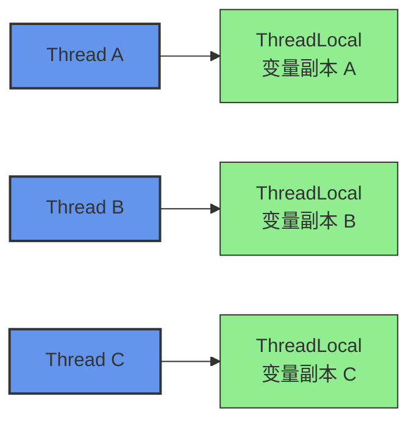
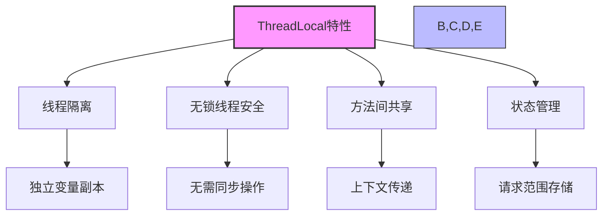
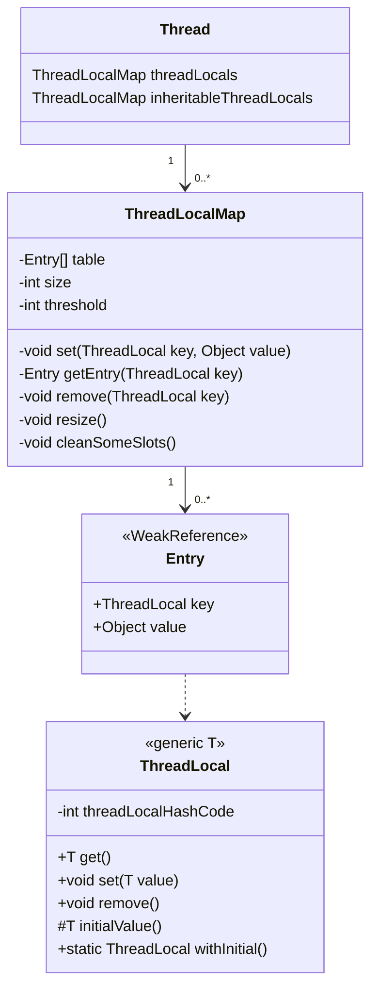
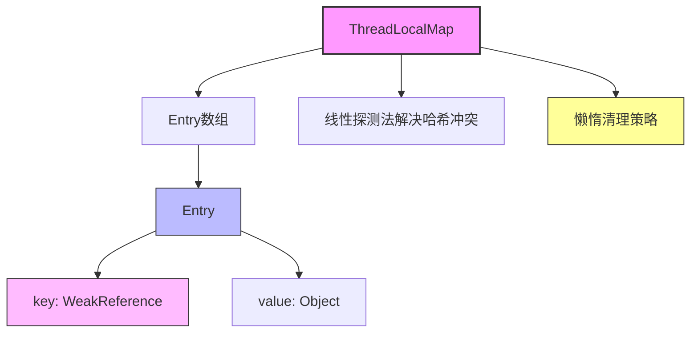
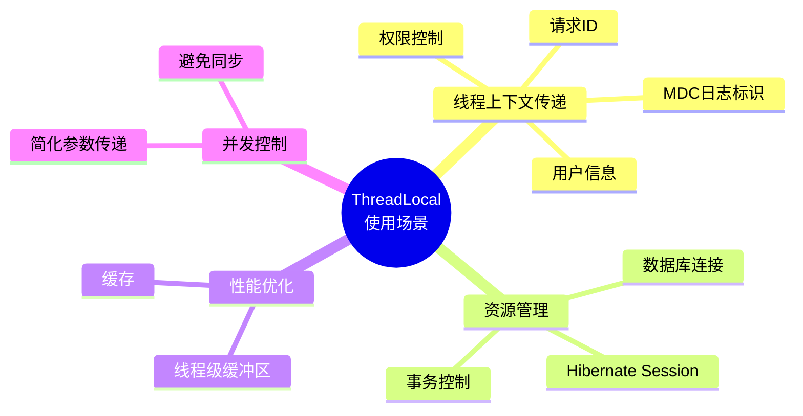

import Tabs from '@theme/Tabs';
import TabItem from '@theme/TabItem';
import TOCInline from '@theme/TOCInline';

# Java ThreadLocal 详解

ThreadLocal是Java中用于创建线程局部变量的类，每个线程都有自己独立的变量副本，线程间不会相互影响。本文将详细介绍ThreadLocal的原理、使用方法和最佳实践。

:::info 本文内容概览
<TOCInline toc={toc} />
:::

:::tip 核心价值
**ThreadLocal = 线程隔离 + 上下文传递 + 无锁并发 + 资源管理**
- 🧵 **线程隔离**：为每个线程提供独立的变量副本，避免共享冲突
- 🔄 **上下文传递**：在同一线程的不同方法之间传递数据
- 🚀 **无锁并发**：无需同步即可实现线程安全
- 📊 **资源管理**：管理线程级别的资源（如数据库连接、用户会话）
:::

## 1. ThreadLocal概述

### 1.1 什么是ThreadLocal？



:::tip 核心概念
ThreadLocal是Java中用于创建线程局部变量的类，它提供了线程隔离的存储机制，每个线程都有自己独立的变量副本，线程间不会相互影响。
:::

### 1.2 ThreadLocal的特点

<div className="card">
<div className="card__header">
<h4>ThreadLocal的关键特性</h4>
</div>
<div className="card__body">

| 特点 | 具体体现 | 业务价值 |
|------|----------|----------|
| **线程隔离** | 每个线程独立变量副本 | 避免线程间数据竞争 |
| **线程安全** | 天然线程安全，无需同步 | 简化编程，提高性能 |
| **内存泄漏风险** | 使用不当可能导致内存泄漏 | 需要正确管理生命周期 |
| **适用场景** | 线程上下文传递、数据库连接等 | 解决特定业务问题 |
| **性能影响** | 访问速度快，内存开销小 | 适合高频访问场景 |

</div>
</div>



### 1.3 ThreadLocal基本使用

<Tabs>
  <TabItem value="basic" label="基本使用" default>
  ```java
  /**
   * ThreadLocal基本使用示例
   */
  public static class BasicUsage {
      // 创建ThreadLocal变量
      private static final ThreadLocal<String> threadLocal = new ThreadLocal<>();
      
      public static void main(String[] args) {
          // 线程1
          Thread thread1 = new Thread(() -> {
              // 设置值 - 只影响当前线程
              threadLocal.set("Thread1-Value");
              // 获取值 - 只能获取当前线程设置的值
              System.out.println("Thread1: " + threadLocal.get());
              
              // 清理ThreadLocal - 防止内存泄漏
              threadLocal.remove();
          });
          
          // 线程2
          Thread thread2 = new Thread(() -> {
              // 线程2设置的值与线程1互不干扰
              threadLocal.set("Thread2-Value");
              System.out.println("Thread2: " + threadLocal.get());
              
              // 清理ThreadLocal
              threadLocal.remove();
          });
          
          // 启动线程
          thread1.start();
          thread2.start();
          
          try {
              thread1.join();
              thread2.join();
          } catch (InterruptedException e) {
              e.printStackTrace();
          }
      }
  }
  ```
  </TabItem>
  <TabItem value="initial_value" label="初始值">
  ```java
  /**
   * ThreadLocal初始值示例
   */
  public static class InitialValueUsage {
      // 使用withInitial方法提供初始值
      private static final ThreadLocal<Integer> counter = 
          ThreadLocal.withInitial(() -> 0);
      
      // 使用匿名内部类方式提供初始值
      private static final ThreadLocal<List<String>> itemList = 
          new ThreadLocal<List<String>>() {
              @Override
              protected List<String> initialValue() {
                  return new ArrayList<>();
              }
          };
      
      public static void main(String[] args) {
          // 多个线程访问ThreadLocal
          for (int i = 0; i < 3; i++) {
              final int threadId = i;
              new Thread(() -> {
                  // 获取初始值 - 无需检查null
                  System.out.println("线程" + threadId + "初始计数: " + counter.get()); // 0
                  
                  // 修改值
                  counter.set(counter.get() + 1);
                  System.out.println("线程" + threadId + "修改后计数: " + counter.get()); // 1
                  
                  // 使用itemList添加元素
                  itemList.get().add("Item-" + threadId);
                  System.out.println("线程" + threadId + "项目列表: " + itemList.get());
                  
                  // 清理ThreadLocal
                  counter.remove();
                  itemList.remove();
              }).start();
          }
      }
  }
  ```
  </TabItem>
  <TabItem value="using_helper" label="辅助类">
  ```java
  /**
   * ThreadLocal辅助类示例
   */
  public static class ThreadLocalHelper {
      // 定义一个静态工具类来管理ThreadLocal
      public static class UserContextHolder {
          private static final ThreadLocal<UserContext> CONTEXT = new ThreadLocal<>();
          
          public static void set(UserContext context) {
              CONTEXT.set(context);
          }
          
          public static UserContext get() {
              return CONTEXT.get();
          }
          
          public static void clear() {
              CONTEXT.remove();
          }
          
          // 使用try-with-resources模式自动清理
          public static class Context implements AutoCloseable {
              public Context(UserContext userContext) {
                  CONTEXT.set(userContext);
              }
              
              @Override
              public void close() {
                  CONTEXT.remove();
              }
          }
      }
      
      // 用户上下文类
      public static class UserContext {
          private final String userId;
          private final String username;
          
          public UserContext(String userId, String username) {
              this.userId = userId;
              this.username = username;
          }
          
          public String getUserId() {
              return userId;
          }
          
          public String getUsername() {
              return username;
          }
      }
      
      // 示例用法
      public static void main(String[] args) {
          // 使用try-with-resources自动清理
          try (UserContextHolder.Context ignored = 
                   new UserContextHolder.Context(new UserContext("123", "Alice"))) {
              
              // 在当前线程的任意位置访问用户上下文
              UserContext ctx = UserContextHolder.get();
              System.out.println("当前用户: " + ctx.getUsername());
              
              // 调用其他方法，无需传递参数
              processRequest();
          }
          
          // 此时ThreadLocal已自动清理
      }
      
      private static void processRequest() {
          // 获取当前用户上下文，无需通过参数传递
          UserContext ctx = UserContextHolder.get();
          if (ctx != null) {
              System.out.println("处理用户请求: " + ctx.getUserId());
          }
      }
  }
  ```
  </TabItem>
</Tabs>

## 2. ThreadLocal原理

### 2.1 ThreadLocal源码分析



<div className="card">
<div className="card__header">
<h4>ThreadLocal核心方法</h4>
</div>
<div className="card__body">

| 方法 | 描述 | 关键实现 |
|------|------|----------|
| **get()** | 获取当前线程对应的值 | 获取当前线程ThreadLocalMap，然后根据ThreadLocal查找对应的Entry |
| **set(T)** | 设置当前线程对应的值 | 获取当前线程ThreadLocalMap，如果不存在则创建，然后添加或更新Entry |
| **remove()** | 移除当前线程对应的值 | 获取当前线程ThreadLocalMap，如果存在则移除对应的Entry |
| **initialValue()** | 返回初始值 | 默认返回null，子类可覆盖提供初始值 |
| **withInitial()** | 创建带初始值的ThreadLocal | 返回带有指定Supplier的ThreadLocal实现 |

</div>
</div>

<Tabs>
  <TabItem value="get_method" label="get()方法" default>
  ```java
  /**
   * 获取当前线程对应的值
   */
  public T get() {
      // 获取当前线程
      Thread t = Thread.currentThread();
      // 获取当前线程的ThreadLocalMap
      ThreadLocalMap map = getMap(t);
      if (map != null) {
          // 如果map存在，则查找当前ThreadLocal对应的Entry
          ThreadLocalMap.Entry e = map.getEntry(this);
          if (e != null) {
              @SuppressWarnings("unchecked")
              T result = (T)e.value;
              return result;
          }
      }
      // 如果没有找到值，则初始化
      return setInitialValue();
  }
  
  // 初始化值
  private T setInitialValue() {
      // 获取初始值（默认为null，子类可以重写）
      T value = initialValue();
      Thread t = Thread.currentThread();
      ThreadLocalMap map = getMap(t);
      if (map != null) {
          // 如果map存在，设置初始值
          map.set(this, value);
      } else {
          // 否则创建ThreadLocalMap
          createMap(t, value);
      }
      return value;
  }
  ```
  
  **工作流程：**
  1. 获取当前线程
  2. 获取线程中的ThreadLocalMap
  3. 如果map存在且找到Entry，返回对应的值
  4. 否则初始化一个值并返回
  
  </TabItem>
  <TabItem value="set_method" label="set()方法">
  ```java
  /**
   * 设置当前线程对应的值
   */
  public void set(T value) {
      // 获取当前线程
      Thread t = Thread.currentThread();
      // 获取当前线程的ThreadLocalMap
      ThreadLocalMap map = getMap(t);
      if (map != null) {
          // 如果map存在，更新值
          map.set(this, value);
      } else {
          // 否则创建ThreadLocalMap
          createMap(t, value);
      }
  }
  
  // 创建ThreadLocalMap
  void createMap(Thread t, T firstValue) {
      // 创建ThreadLocalMap，并将当前ThreadLocal和值作为第一个Entry
      t.threadLocals = new ThreadLocalMap(this, firstValue);
  }
  ```
  
  **工作流程：**
  1. 获取当前线程
  2. 获取线程中的ThreadLocalMap
  3. 如果map存在，设置或更新Entry
  4. 否则创建新的ThreadLocalMap
  
  </TabItem>
  <TabItem value="remove_method" label="remove()方法">
  ```java
  /**
   * 移除当前线程对应的值
   */
  public void remove() {
      // 获取当前线程的ThreadLocalMap
      ThreadLocalMap m = getMap(Thread.currentThread());
      if (m != null) {
          // 从map中移除当前ThreadLocal对应的Entry
          m.remove(this);
      }
  }
  ```
  
  **工作流程：**
  1. 获取当前线程的ThreadLocalMap
  2. 如果map存在，移除对应的Entry
  3. 这一步很重要，能够避免内存泄漏
  
  </TabItem>
</Tabs>

### 2.2 ThreadLocalMap结构



<Tabs>
  <TabItem value="entry_structure" label="Entry结构" default>
  ```java
  /**
   * ThreadLocalMap的Entry继承自WeakReference
   */
  static class Entry extends WeakReference<ThreadLocal<?>> {
      /** 与这个ThreadLocal关联的值 */
      Object value;
  
      Entry(ThreadLocal<?> k, Object v) {
          super(k);  // key作为弱引用传给父类
          value = v; // value是强引用
      }
  }
  ```
  
  **关键特性：**
  - Entry继承自WeakReference，key是ThreadLocal的弱引用
  - 当ThreadLocal对象没有强引用时，key会被垃圾收集器回收
  - 但value仍然是强引用，可能导致内存泄漏
  - 这就是为什么必须调用remove()的原因
  
  </TabItem>
  <TabItem value="hash_algorithm" label="哈希算法">
  ```java
  /**
   * ThreadLocal中的哈希码生成
   */
  private final int threadLocalHashCode = nextHashCode();
  
  // 原子更新下一个哈希码
  private static AtomicInteger nextHashCode = new AtomicInteger();
  
  // 魔数 - 黄金分割数 * 2^32
  private static final int HASH_INCREMENT = 0x61c88647;
  
  // 生成下一个哈希码
  private static int nextHashCode() {
      return nextHashCode.getAndAdd(HASH_INCREMENT);
  }
  
  /**
   * ThreadLocalMap中的哈希计算
   */
  int i = key.threadLocalHashCode & (table.length - 1);
  ```
  
  **特点：**
  1. 使用斐波那契散列（黄金分割数）
  2. 通过AtomicInteger生成递增哈希码
  3. 每个ThreadLocal实例获取唯一哈希码
  4. 哈希码均匀分布，减少冲突
  5. 哈希表大小必须是2的幂，通过位与操作计算索引
  
  </TabItem>
  <TabItem value="hash_collision" label="哈希冲突">
  ```java
  /**
   * ThreadLocalMap处理哈希冲突的方法
   */
  private void set(ThreadLocal<?> key, Object value) {
      Entry[] tab = table;
      int len = tab.length;
      // 计算初始索引
      int i = key.threadLocalHashCode & (len-1);
  
      // 线性探测查找可用位置
      for (Entry e = tab[i]; e != null; e = tab[i = nextIndex(i, len)]) {
          ThreadLocal<?> k = e.get();
          
          // 找到对应的Entry，更新值
          if (k == key) {
              e.value = value;
              return;
          }
          
          // 清理已被GC回收的key
          if (k == null) {
              replaceStaleEntry(key, value, i);
              return;
          }
      }
      
      // 创建新Entry
      tab[i] = new Entry(key, value);
      // 增加size并检查是否需要扩容
      // ...
  }
  
  // 计算下一个索引（线性探测）
  private static int nextIndex(int i, int len) {
      return ((i + 1 < len) ? i + 1 : 0);
  }
  ```
  
  **线性探测策略:**
  1. 发生冲突时，查找下一个位置
  2. 遇到表尾则从头开始
  3. 同时处理过期Entry
  4. 按需扩容数组
  
  </TabItem>
  <TabItem value="entry_cleanup" label="Entry清理">
  ```java
  /**
   * ThreadLocalMap清理过期Entry的方法
   */
  private boolean cleanSomeSlots(int i, int n) {
      boolean removed = false;
      Entry[] tab = table;
      int len = tab.length;
      do {
          i = nextIndex(i, len);
          Entry e = tab[i];
          // 如果找到key为null的Entry
          if (e != null && e.get() == null) {
              // 进行更彻底的清理
              n = len;
              removed = true;
              i = expungeStaleEntry(i);
          }
      } while ((n >>>= 1) != 0);
      return removed;
  }
  
  // 彻底清理过期的Entry
  private int expungeStaleEntry(int staleSlot) {
      Entry[] tab = table;
      int len = tab.length;
      
      // 移除指定位置的Entry
      tab[staleSlot].value = null;
      tab[staleSlot] = null;
      size--;
      
      // 重新哈希后面的Entry
      // ...
      
      return i;
  }
  ```
  
  **清理策略:**
  1. 在set、get、remove操作时触发清理
  2. 清理key为null的Entry
  3. 同时进行重哈希，保持表的紧凑
  4. 减少内存泄漏风险
  
  </TabItem>
</Tabs>

## 3. ThreadLocal使用场景



### 3.1 线程上下文传递

<div className="card">
<div className="card__header">
<h4>线程上下文传递的价值</h4>
</div>
<div className="card__body">

**线程上下文传递**是ThreadLocal最常见的应用场景之一。它允许我们在同一线程内的不同方法之间传递数据，而无需通过方法参数显式传递。

**主要优势：**
- **简化API设计**：避免方法参数膨胀和层层传递
- **代码解耦**：各层可以独立访问上下文信息
- **方便跨方法访问**：任何方法都可以访问当前线程的上下文
- **无需同步**：每个线程有自己的副本，避免同步开销

**常见上下文信息：**
- 用户身份和权限信息
- 请求追踪ID
- 事务上下文
- 本地化设置（如语言、时区）
- 安全上下文

</div>
</div>

<Tabs>
  <TabItem value="user_context" label="用户上下文" default>
  ```java
  /**
   * 用户上下文传递
   */
  public class UserContextExample {
      // 用户上下文类
      public static class UserContext {
          private final String userId;
          private final String userName;
          private final Set<String> roles;
          private final String locale;
          
          public UserContext(String userId, String userName, Set<String> roles, String locale) {
              this.userId = userId;
              this.userName = userName;
              this.roles = Collections.unmodifiableSet(new HashSet<>(roles));
              this.locale = locale;
          }
          
          public String getUserId() { return userId; }
          public String getUserName() { return userName; }
          public Set<String> getRoles() { return roles; }
          public String getLocale() { return locale; }
          public boolean hasRole(String role) { return roles.contains(role); }
          
          @Override
          public String toString() {
              return String.format("UserContext{userId='%s', userName='%s', roles=%s, locale='%s'}",
                                 userId, userName, roles, locale);
          }
      }
      
      // ThreadLocal存储用户上下文
      private static final ThreadLocal<UserContext> userContextHolder = new ThreadLocal<>();
      
      // 创建可自动清理的上下文辅助类
      public static class UserContextScope implements AutoCloseable {
          public UserContextScope(UserContext context) {
              userContextHolder.set(context);
          }
          
          @Override
          public void close() {
              userContextHolder.remove();
          }
      }
      
      // 设置用户上下文
      public static void setUserContext(UserContext userContext) {
          userContextHolder.set(userContext);
      }
      
      // 获取用户上下文
      public static UserContext getUserContext() {
          return userContextHolder.get();
      }
      
      // 清除用户上下文
      public static void clearUserContext() {
          userContextHolder.remove();
      }
      
      // 业务服务层方法
      public static class UserService {
          public void processRequest(String action) {
              UserContext ctx = getUserContext();
              System.out.println("处理请求: " + action);
              System.out.println("当前用户: " + ctx.getUserName());
              
              if ("admin".equals(action) && !ctx.hasRole("ADMIN")) {
                  throw new SecurityException("需要管理员权限");
              }
              
              // 调用其他方法，无需传递用户上下文
              auditLog("执行操作: " + action);
          }
          
          private void auditLog(String message) {
              UserContext ctx = getUserContext();
              System.out.println("审计日志: [用户=" + ctx.getUserId() + "] " + message);
          }
      }
      
      // 示例用法
      public static void main(String[] args) {
          UserService userService = new UserService();
          
          // 模拟普通用户请求
          Set<String> userRoles = new HashSet<>(Arrays.asList("USER"));
          UserContext userCtx = new UserContext("user123", "Alice", userRoles, "en_US");
          
          // 使用try-with-resources自动清理ThreadLocal
          try (UserContextScope ignored = new UserContextScope(userCtx)) {
              userService.processRequest("view");
              // 尝试执行需要管理员权限的操作
              try {
                  userService.processRequest("admin");
              } catch (SecurityException e) {
                  System.out.println("错误: " + e.getMessage());
              }
          }
          
          // 模拟管理员请求
          Set<String> adminRoles = new HashSet<>(Arrays.asList("USER", "ADMIN"));
          UserContext adminCtx = new UserContext("admin456", "Bob", adminRoles, "en_US");
          
          try (UserContextScope ignored = new UserContextScope(adminCtx)) {
              userService.processRequest("admin");
          }
      }
  }
  ```
  </TabItem>
  <TabItem value="request_trace" label="请求追踪">
  ```java
  /**
   * 请求追踪上下文
   */
  public class RequestTraceExample {
      // 请求追踪上下文
      public static class TraceContext {
          private final String requestId;
          private final long startTime;
          private final Map<String, String> attributes;
          
          public TraceContext(String requestId) {
              this.requestId = requestId;
              this.startTime = System.currentTimeMillis();
              this.attributes = new ConcurrentHashMap<>();
          }
          
          public String getRequestId() {
              return requestId;
          }
          
          public long getStartTime() {
              return startTime;
          }
          
          public long getElapsedTime() {
              return System.currentTimeMillis() - startTime;
          }
          
          public void setAttribute(String key, String value) {
              attributes.put(key, value);
          }
          
          public String getAttribute(String key) {
              return attributes.get(key);
          }
      }
      
      // ThreadLocal存储请求追踪上下文
      private static final ThreadLocal<TraceContext> traceContextHolder = new ThreadLocal<>();
      
      // 初始化请求上下文
      public static void initTrace(String requestId) {
          traceContextHolder.set(new TraceContext(requestId));
      }
      
      // 获取追踪上下文
      public static TraceContext getTraceContext() {
          return traceContextHolder.get();
      }
      
      // 清除追踪上下文
      public static void clearTraceContext() {
          traceContextHolder.remove();
      }
      
      // 日志工具类
      public static class Logger {
          public static void info(String message) {
              TraceContext ctx = getTraceContext();
              if (ctx != null) {
                  System.out.println(String.format("[%s] [%dms] %s",
                                                 ctx.getRequestId(),
                                                 ctx.getElapsedTime(),
                                                 message));
              } else {
                  System.out.println(message);
              }
          }
      }
      
      // 服务类
      public static class OrderService {
          public void createOrder(String productId) {
              Logger.info("开始创建订单: " + productId);
              
              // 设置追踪属性
              TraceContext ctx = getTraceContext();
              ctx.setAttribute("productId", productId);
              
              // 调用其他服务
              validateInventory(productId);
              processPayment();
              
              Logger.info("订单创建完成");
          }
          
          private void validateInventory(String productId) {
              Logger.info("验证库存: " + productId);
              try {
                  Thread.sleep(50); // 模拟处理时间
              } catch (InterruptedException e) {
                  Thread.currentThread().interrupt();
              }
          }
          
          private void processPayment() {
              Logger.info("处理支付");
              TraceContext ctx = getTraceContext();
              Logger.info("处理商品: " + ctx.getAttribute("productId"));
              
              try {
                  Thread.sleep(100); // 模拟处理时间
              } catch (InterruptedException e) {
                  Thread.currentThread().interrupt();
              }
          }
      }
      
      // 示例用法
      public static void main(String[] args) {
          for (int i = 1; i <= 3; i++) {
              final String requestId = "REQ-" + i;
              final String productId = "PROD-" + (100 + i);
              
              new Thread(() -> {
                  try {
                      initTrace(requestId);
                      Logger.info("接收请求");
                      
                      OrderService orderService = new OrderService();
                      orderService.createOrder(productId);
                      
                      Logger.info("请求处理完成");
                  } finally {
                      clearTraceContext();
                  }
              }).start();
          }
      }
  }
  ```
  </TabItem>
  <TabItem value="mdc_logging" label="日志上下文">
  ```java
  /**
   * MDC日志上下文示例
   * MDC: Mapped Diagnostic Context
   */
  public class MdcLoggingExample {
      // 简化版MDC实现
      public static class MDC {
          private static final ThreadLocal<Map<String, String>> contextMap = 
              ThreadLocal.withInitial(HashMap::new);
          
          public static void put(String key, String value) {
              contextMap.get().put(key, value);
          }
          
          public static String get(String key) {
              return contextMap.get().get(key);
          }
          
          public static void remove(String key) {
              contextMap.get().remove(key);
          }
          
          public static void clear() {
              contextMap.remove();
          }
          
          public static Map<String, String> getCopyOfContextMap() {
              return new HashMap<>(contextMap.get());
          }
      }
      
      // 日志工具类
      public static class Logger {
          private final String name;
          
          public Logger(String name) {
              this.name = name;
          }
          
          public void info(String message) {
              // 格式: [时间戳] [线程名] [类名] [traceId] [userId] - 消息
              String threadName = Thread.currentThread().getName();
              String traceId = MDC.get("traceId");
              String userId = MDC.get("userId");
              
              System.out.println(String.format("[%tT] [%s] [%s] [%s] [%s] - %s",
                  new Date(), threadName, name, traceId, userId, message));
          }
      }
      
      // Web请求过滤器示例
      public static class RequestFilter {
          public static void doFilter(String userId, String requestUri, Runnable next) {
              String traceId = "TRACE-" + System.nanoTime();
              
              try {
                  // 设置MDC上下文
                  MDC.put("traceId", traceId);
                  MDC.put("userId", userId);
                  
                  Logger logger = new Logger("RequestFilter");
                  logger.info("开始处理请求: " + requestUri);
                  
                  // 执行请求
                  next.run();
                  
                  logger.info("请求处理完成: " + requestUri);
              } finally {
                  // 清理MDC上下文
                  MDC.clear();
              }
          }
      }
      
      // 服务类
      public static class UserService {
          private static final Logger logger = new Logger("UserService");
          
          public void findUserById(String id) {
              logger.info("查找用户: " + id);
              // 模拟数据库操作
              try {
                  Thread.sleep(100);
              } catch (InterruptedException e) {
                  Thread.currentThread().interrupt();
              }
              
              // 调用其他服务
              AuditService.logAccess("USER", id);
          }
      }
      
      // 审计服务
      public static class AuditService {
          private static final Logger logger = new Logger("AuditService");
          
          public static void logAccess(String entityType, String entityId) {
              // 日志中自动包含当前用户和追踪ID
              logger.info("记录访问: " + entityType + ":" + entityId);
          }
      }
      
      // 示例用法
      public static void main(String[] args) {
          for (int i = 1; i <= 3; i++) {
              final String userId = "user" + i;
              Thread thread = new Thread(() -> {
                  RequestFilter.doFilter(userId, "/api/users/" + userId, () -> {
                      UserService userService = new UserService();
                      userService.findUserById(userId);
                  });
              }, "Thread-" + i);
              
              thread.start();
          }
      }
  }
  ```
  </TabItem>
</Tabs>

### 3.2 数据库连接管理

```java title="数据库连接管理示例"
import java.sql.Connection;
import java.sql.DriverManager;
import java.sql.SQLException;

public class DatabaseConnectionExamples {
    
    /**
     * 数据库连接管理
     */
    public static class DatabaseConnectionManager {
        
        // ThreadLocal存储数据库连接
        private static ThreadLocal<Connection> connectionHolder = new ThreadLocal<>();
        
        // 获取数据库连接
        public static Connection getConnection() throws SQLException {
            Connection connection = connectionHolder.get();
            if (connection == null || connection.isClosed()) {
                connection = createConnection();
                connectionHolder.set(connection);
            }
            return connection;
        }
        
        // 创建数据库连接
        private static Connection createConnection() throws SQLException {
            // 这里应该使用真实的数据库连接配置
            return DriverManager.getConnection("jdbc:mysql://localhost:3306/test", "user", "password");
        }
        
        // 关闭数据库连接
        public static void closeConnection() {
            Connection connection = connectionHolder.get();
            if (connection != null) {
                try {
                    connection.close();
                } catch (SQLException e) {
                    e.printStackTrace();
                } finally {
                    connectionHolder.remove();
                }
            }
        }
        
        // 事务管理
        public static void executeInTransaction(Runnable task) {
            try {
                Connection connection = getConnection();
                connection.setAutoCommit(false);
                
                try {
                    task.run();
                    connection.commit();
                } catch (Exception e) {
                    connection.rollback();
                    throw e;
                } finally {
                    closeConnection();
                }
            } catch (SQLException e) {
                throw new RuntimeException("数据库操作失败", e);
            }
        }
        
        public static void main(String[] args) {
            System.out.println("=== 数据库连接管理 ===");
            
            // 模拟多线程数据库操作
            for (int i = 1; i <= 3; i++) {
                final int threadId = i;
                new Thread(() -> {
                    try {
                        executeInTransaction(() -> {
                            System.out.println("线程" + threadId + "执行数据库操作");
                            // 模拟数据库操作
                            try {
                                Thread.sleep(500);
                            } catch (InterruptedException e) {
                                Thread.currentThread().interrupt();
                            }
                        });
                    } catch (Exception e) {
                        System.err.println("线程" + threadId + "操作失败: " + e.getMessage());
                    }
                }).start();
            }
        }
    }
}
```

### 3.3 事务管理

```java title="事务管理示例"
public class TransactionManagementExamples {
    
    /**
     * 事务管理
     */
    public static class TransactionManager {
        
        // ThreadLocal存储事务信息
        private static ThreadLocal<TransactionInfo> transactionHolder = new ThreadLocal<>();
        
        // 事务信息
        public static class TransactionInfo {
            private String transactionId;
            private long startTime;
            private boolean active;
            
            public TransactionInfo(String transactionId) {
                this.transactionId = transactionId;
                this.startTime = System.currentTimeMillis();
                this.active = true;
            }
            
            public String getTransactionId() { return transactionId; }
            public long getStartTime() { return startTime; }
            public boolean isActive() { return active; }
            public void setActive(boolean active) { this.active = active; }
        }
        
        // 开始事务
        public static void beginTransaction() {
            String transactionId = "TXN-" + System.currentTimeMillis();
            transactionHolder.set(new TransactionInfo(transactionId));
            System.out.println("开始事务: " + transactionId);
        }
        
        // 提交事务
        public static void commitTransaction() {
            TransactionInfo info = transactionHolder.get();
            if (info != null && info.isActive()) {
                info.setActive(false);
                System.out.println("提交事务: " + info.getTransactionId());
            }
        }
        
        // 回滚事务
        public static void rollbackTransaction() {
            TransactionInfo info = transactionHolder.get();
            if (info != null && info.isActive()) {
                info.setActive(false);
                System.out.println("回滚事务: " + info.getTransactionId());
            }
        }
        
        // 获取当前事务ID
        public static String getCurrentTransactionId() {
            TransactionInfo info = transactionHolder.get();
            return info != null ? info.getTransactionId() : null;
        }
        
        // 清理事务信息
        public static void clearTransaction() {
            transactionHolder.remove();
        }
        
        public static void main(String[] args) {
            System.out.println("=== 事务管理 ===");
            
            // 模拟多线程事务操作
            for (int i = 1; i <= 3; i++) {
                final int threadId = i;
                new Thread(() -> {
                    try {
                        beginTransaction();
                        System.out.println("线程" + threadId + "执行业务操作");
                        
                        // 模拟业务操作
                        Thread.sleep(1000);
                        
                        if (Math.random() > 0.5) {
                            commitTransaction();
                        } else {
                            rollbackTransaction();
                        }
                        
                    } catch (InterruptedException e) {
                        rollbackTransaction();
                        Thread.currentThread().interrupt();
                    } finally {
                        clearTransaction();
                    }
                }).start();
            }
        }
    }
}
```

## 4. ThreadLocal内存泄漏

### 4.1 内存泄漏原因

```java title="内存泄漏原因分析示例"
public class MemoryLeakAnalysis {
    
    /**
     * 内存泄漏原因分析
     */
    public static class MemoryLeakCauses {
        
        /**
         * 内存泄漏示例
         */
        public static void demonstrateMemoryLeak() {
            System.out.println("=== ThreadLocal内存泄漏原因 ===");
            
            // 可能导致内存泄漏的ThreadLocal
            ThreadLocal<byte[]> threadLocal = new ThreadLocal<>();
            
            // 创建大量线程，每个线程都设置ThreadLocal
            for (int i = 0; i < 1000; i++) {
                Thread thread = new Thread(() -> {
                    // 设置大对象
                    threadLocal.set(new byte[1024 * 1024]); // 1MB
                    
                    // 线程结束，但没有清理ThreadLocal
                    // 这会导致内存泄漏
                });
                thread.start();
            }
            
            System.out.println("问题：线程结束后，ThreadLocalMap中的Entry仍然存在");
            System.out.println("虽然ThreadLocal被回收，但value仍然被强引用");
        }
        
        /**
         * 内存泄漏原理
         */
        public static void explainMemoryLeakPrinciple() {
            System.out.println("=== 内存泄漏原理 ===");
            System.out.println("1. ThreadLocalMap.Entry的key是ThreadLocal的弱引用");
            System.out.println("2. 当ThreadLocal被回收时，key变为null");
            System.out.println("3. 但value仍然是强引用，无法被回收");
            System.out.println("4. 导致内存泄漏");
            System.out.println("5. 只有在ThreadLocalMap被清理时才能回收value");
        }
    }
}
```

### 4.2 防止内存泄漏

```java title="防止内存泄漏示例"
public class MemoryLeakPrevention {
    
    /**
     * 防止内存泄漏的最佳实践
     */
    public static class BestPractices {
        
        /**
         * 使用try-finally确保清理
         */
        public static void safeThreadLocalUsage() {
            System.out.println("=== 安全的ThreadLocal使用 ===");
            
            ThreadLocal<String> threadLocal = new ThreadLocal<>();
            
            try {
                threadLocal.set("some value");
                // 使用ThreadLocal
                System.out.println(threadLocal.get());
            } finally {
                // 确保清理ThreadLocal
                threadLocal.remove();
            }
        }
        
        /**
         * 使用ThreadLocal.withInitial()提供初始值
         */
        public static void threadLocalWithInitial() {
            System.out.println("=== 使用withInitial ===");
            
            ThreadLocal<String> threadLocal = ThreadLocal.withInitial(() -> "default value");
            
            // 不需要手动设置初始值
            System.out.println(threadLocal.get()); // 输出: default value
        }
        
        /**
         * 在线程池中使用ThreadLocal
         */
        public static void threadLocalInThreadPool() {
            System.out.println("=== 线程池中的ThreadLocal使用 ===");
            
            ThreadLocal<String> threadLocal = new ThreadLocal<>();
            ExecutorService executor = Executors.newFixedThreadPool(5);
            
            for (int i = 0; i < 10; i++) {
                final int taskId = i;
                executor.submit(() -> {
                    try {
                        threadLocal.set("Task-" + taskId);
                        System.out.println("执行任务: " + threadLocal.get());
                    } finally {
                        // 在线程池中必须清理ThreadLocal
                        threadLocal.remove();
                    }
                });
            }
            
            executor.shutdown();
        }
    }
}
```

## 5. ThreadLocal最佳实践

### 5.1 正确使用ThreadLocal

```java title="ThreadLocal最佳实践示例"
public class ThreadLocalBestPractices {
    
    /**
     * ThreadLocal最佳实践
     */
    public static class BestPractices {
        
        // 1. 使用静态final修饰ThreadLocal
        private static final ThreadLocal<UserContext> USER_CONTEXT = new ThreadLocal<>();
        
        // 2. 提供便捷的访问方法
        public static void setUserContext(UserContext context) {
            USER_CONTEXT.set(context);
        }
        
        public static UserContext getUserContext() {
            return USER_CONTEXT.get();
        }
        
        public static void clearUserContext() {
            USER_CONTEXT.remove();
        }
        
        // 3. 使用try-finally确保清理
        public static void executeWithUserContext(UserContext context, Runnable task) {
            try {
                setUserContext(context);
                task.run();
            } finally {
                clearUserContext();
            }
        }
        
        // 4. 在线程池中使用ThreadLocal
        public static void executeInThreadPool() {
            ExecutorService executor = Executors.newFixedThreadPool(5);
            
            for (int i = 0; i < 10; i++) {
                final int userId = i;
                executor.submit(() -> {
                    UserContext context = new UserContext("user" + userId, "User" + userId, "session" + userId);
                    executeWithUserContext(context, () -> {
                        System.out.println("当前用户: " + getUserContext().getUserName());
                    });
                });
            }
            
            executor.shutdown();
        }
        
        // 用户上下文类
        public static class UserContext {
            private String userId;
            private String userName;
            private String sessionId;
            
            public UserContext(String userId, String userName, String sessionId) {
                this.userId = userId;
                this.userName = userName;
                this.sessionId = sessionId;
            }
            
            public String getUserId() { return userId; }
            public String getUserName() { return userName; }
            public String getSessionId() { return sessionId; }
        }
    }
}
```

### 5.2 ThreadLocal工具类

```java title="ThreadLocal工具类示例"
public class ThreadLocalUtils {
    
    /**
     * ThreadLocal工具类
     */
    public static class ThreadLocalManager {
        
        // 用户上下文ThreadLocal
        private static final ThreadLocal<UserContext> USER_CONTEXT = new ThreadLocal<>();
        
        // 请求ID ThreadLocal
        private static final ThreadLocal<String> REQUEST_ID = new ThreadLocal<>();
        
        // 事务连接ThreadLocal
        private static final ThreadLocal<Connection> TRANSACTION_CONNECTION = new ThreadLocal<>();
        
        // 用户上下文相关方法
        public static void setUserContext(UserContext context) {
            USER_CONTEXT.set(context);
        }
        
        public static UserContext getUserContext() {
            return USER_CONTEXT.get();
        }
        
        public static void clearUserContext() {
            USER_CONTEXT.remove();
        }
        
        // 请求ID相关方法
        public static void setRequestId(String requestId) {
            REQUEST_ID.set(requestId);
        }
        
        public static String getRequestId() {
            return REQUEST_ID.get();
        }
        
        public static void clearRequestId() {
            REQUEST_ID.remove();
        }
        
        // 事务连接相关方法
        public static void setTransactionConnection(Connection connection) {
            TRANSACTION_CONNECTION.set(connection);
        }
        
        public static Connection getTransactionConnection() {
            return TRANSACTION_CONNECTION.get();
        }
        
        public static void clearTransactionConnection() {
            TRANSACTION_CONNECTION.remove();
        }
        
        // 清理所有ThreadLocal
        public static void clearAll() {
            USER_CONTEXT.remove();
            REQUEST_ID.remove();
            TRANSACTION_CONNECTION.remove();
        }
        
        // 用户上下文类
        public static class UserContext {
            private String userId;
            private String userName;
            
            public UserContext(String userId, String userName) {
                this.userId = userId;
                this.userName = userName;
            }
            
            public String getUserId() { return userId; }
            public String getUserName() { return userName; }
        }
        
        // 模拟Connection类
        public static class Connection {
            private String name;
            
            public Connection(String name) {
                this.name = name;
            }
            
            public String getName() {
                return name;
            }
        }
    }
}
```

## 6. 面试题

### 6.1 基础概念

**Q: ThreadLocal的作用是什么？**

**A:**
ThreadLocal用于创建线程局部变量，每个线程都有自己独立的变量副本，线程间不会相互影响。

**Q: ThreadLocal的原理是什么？**

**A:**
1. **ThreadLocalMap**：每个Thread都有一个ThreadLocalMap
2. **Entry数组**：ThreadLocalMap内部使用Entry数组存储数据
3. **弱引用**：Entry的key是ThreadLocal的弱引用
4. **哈希算法**：使用ThreadLocal的hashCode确定存储位置

### 6.2 内存泄漏

**Q: ThreadLocal的内存泄漏问题？**

**A:**
**原因**：
- ThreadLocal被回收后，Entry的key变为null
- 但Entry的value仍然被强引用
- 导致value无法被回收

**解决方案**：
- 及时调用remove()方法清理
- 使用try-finally确保清理
- 在线程池中特别注意清理

**Q: 如何避免ThreadLocal内存泄漏？**

**A:**
- 使用完ThreadLocal后立即调用remove()
- 在线程池中使用ThreadLocal时要特别注意清理
- 使用try-finally确保清理
- 避免存储大对象

### 6.3 使用场景

**Q: ThreadLocal的使用场景？**

**A:**
1. **线程上下文传递**：传递用户信息、请求ID等
2. **数据库连接管理**：每个线程独立的数据库连接
3. **事务管理**：线程级别的事务控制
4. **请求追踪**：记录请求处理过程

**Q: ThreadLocal和synchronized的区别？**

**A:**
**ThreadLocal**：
- 线程隔离，每个线程独立变量
- 无需同步，天然线程安全
- 适合线程上下文传递

**synchronized**：
- 线程间共享变量
- 需要同步机制
- 适合线程间协作

### 6.4 最佳实践

**Q: 如何正确使用ThreadLocal？**

**A:**
```java
// 正确的使用方式
public class CorrectThreadLocalUsage {
    private static final ThreadLocal<String> threadLocal = new ThreadLocal<>();
    
    public static void correctUsage() {
        try {
            threadLocal.set("value");
            // 使用ThreadLocal
            System.out.println(threadLocal.get());
        } finally {
            // 确保清理
            threadLocal.remove();
        }
    }
}
```

**Q: ThreadLocal在线程池中的问题？**

**A:**
**问题**：
- 线程池中的线程会重复使用
- ThreadLocal的值可能被上一个任务污染

**解决方案**：
- 在任务开始时清理ThreadLocal
- 在任务结束时清理ThreadLocal
- 使用try-finally确保清理

### 6.5 高级特性

**Q: ThreadLocal的替代方案？**

**A:**
1. **InheritableThreadLocal**：子线程继承父线程的值
2. **TransmittableThreadLocal**：支持线程池传递
3. **ThreadLocalRandom**：线程安全的随机数生成器
4. **自定义上下文传递**：使用参数传递

**Q: ThreadLocal的性能影响？**

**A:**
**优点**：
- 无需同步，性能好
- 线程隔离，避免竞争

**缺点**：
- 内存占用较大
- 可能导致内存泄漏
- 调试困难

## 7. 总结

ThreadLocal为Java多线程编程提供了线程隔离的存储机制。

### 7.1 关键要点

1. **线程隔离**：每个线程独立的变量副本
2. **内存管理**：正确使用和清理，避免内存泄漏
3. **使用场景**：线程上下文传递、数据库连接、事务管理
4. **最佳实践**：及时清理、在线程池中特别注意

### 7.2 使用建议

| 场景 | 推荐方式 | 原因 |
|------|----------|------|
| **线程上下文传递** | ThreadLocal | 天然线程安全 |
| **数据库连接管理** | ThreadLocal | 线程隔离 |
| **事务管理** | ThreadLocal | 线程级别控制 |
| **请求追踪** | ThreadLocal | 简单易用 |

### 7.3 学习建议

1. **理解原理**：深入理解ThreadLocal的工作原理
2. **实践验证**：通过编写代码验证ThreadLocal的效果
3. **内存管理**：特别注意内存泄漏问题
4. **最佳实践**：掌握正确的使用方式

通过深入理解和熟练运用ThreadLocal，我们能够构建出更加高效、健壮和可维护的Java多线程应用程序。 