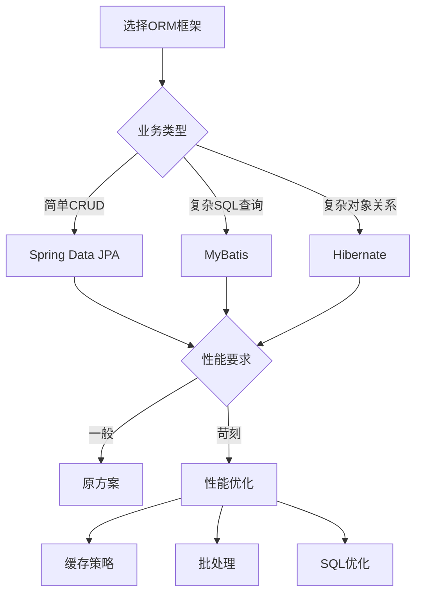

# 数据库与ORM技术总结

数据库是后端系统的核心组件，负责数据的存储、管理和检索。ORM（对象关系映射）框架则简化了应用代码与数据库的交互，提高了开发效率。本文档全面总结了数据库设计和ORM框架的核心概念、最佳实践和面试重点。

:::tip 核心要点
数据库设计 = 规范化 + 性能优化 + 数据一致性 + 可扩展性
ORM框架 = 简化开发 + 类型安全 + 数据库无关 + 性能平衡
:::

## 1. 数据库设计体系

### 1.1 关系型数据库设计

关系型数据库是最传统和广泛使用的数据库类型，基于关系模型组织数据。

#### 设计层次
```sql title="数据库设计层次"
-- 1. 概念设计层：实体关系模型（ER图）
-- 识别实体、属性和关系
-- 绘制ER图，确定实体间的联系

-- 2. 逻辑设计层：关系模式设计
-- 将ER图转换为关系模式
-- 应用规范化理论优化设计

-- 3. 物理设计层：存储和索引设计
-- 选择存储引擎和文件组织
-- 设计索引策略和分区方案
```

#### 规范化理论
```sql title="规范化理论"
-- 第一范式（1NF）：原子性
-- 每个字段都是不可分割的原子值
CREATE TABLE users (
    id INT PRIMARY KEY,
    name VARCHAR(100),  -- 原子值
    email VARCHAR(100)  -- 原子值
);

-- 第二范式（2NF）：消除部分依赖
-- 非主键字段完全依赖于主键
CREATE TABLE orders (
    id INT PRIMARY KEY,
    user_id INT,
    order_date DATE,
    total_amount DECIMAL(10,2)
);

CREATE TABLE order_items (
    id INT PRIMARY KEY,
    order_id INT,
    product_id INT,
    quantity INT,
    price DECIMAL(10,2),
    FOREIGN KEY (order_id) REFERENCES orders(id)
);

-- 第三范式（3NF）：消除传递依赖
-- 非主键字段不依赖于其他非主键字段
CREATE TABLE users (
    id INT PRIMARY KEY,
    name VARCHAR(100),
    department_id INT,
    FOREIGN KEY (department_id) REFERENCES departments(id)
);

CREATE TABLE departments (
    id INT PRIMARY KEY,
    name VARCHAR(100),
    location VARCHAR(100)
);
```

#### 索引设计原则
```sql title="索引设计原则"
-- 1. 主键索引（自动创建）
CREATE TABLE users (
    id INT PRIMARY KEY AUTO_INCREMENT,  -- 自动创建主键索引
    username VARCHAR(50) UNIQUE,
    email VARCHAR(100)
);

-- 2. 唯一索引（业务唯一性约束）
CREATE UNIQUE INDEX idx_users_email ON users(email);
CREATE UNIQUE INDEX idx_users_username ON users(username);

-- 3. 普通索引（查询优化）
CREATE INDEX idx_users_department_id ON users(department_id);
CREATE INDEX idx_users_created_at ON users(created_at);

-- 4. 复合索引（多字段查询优化）
CREATE INDEX idx_users_department_status ON users(department_id, status);
CREATE INDEX idx_users_name_email ON users(last_name, first_name, email);

-- 5. 部分索引（条件索引）
CREATE INDEX idx_active_users ON users(email) WHERE status = 'active';
```

### 1.2 非关系型数据库设计

NoSQL数据库提供了更灵活的数据模型和更好的可扩展性。

#### 数据模型分类
```javascript title="NoSQL数据模型"
// 1. 键值存储（Key-Value）
// Redis、Memcached、DynamoDB
{
  "user:1001": "John Doe",
  "user:1002": "Jane Smith",
  "session:abc123": "{userId: 1001, loginTime: '2023-08-07'}"
}

// 2. 文档存储（Document）
// MongoDB、CouchDB、Elasticsearch
{
  "_id": "1001",
  "name": "John Doe",
  "email": "john@example.com",
  "profile": {
    "age": 30,
    "address": {
      "street": "123 Main St",
      "city": "New York"
    }
  },
  "orders": [
    {"orderId": "ORD001", "amount": 150.00},
    {"orderId": "ORD002", "amount": 200.00}
  ]
}

// 3. 列族存储（Column Family）
// Cassandra、HBase、ScyllaDB
// 按列族组织数据，支持宽行和窄行

// 4. 图数据库（Graph）
// Neo4j、ArangoDB、Amazon Neptune
// 以节点和边表示实体和关系
```

#### 设计原则
```javascript title="NoSQL设计原则"
// 1. 数据模型设计
// 根据查询模式设计数据模型
// 避免复杂的关联查询

// 2. 分片策略
// 水平分片：按数据范围或哈希值分片
// 垂直分片：按功能模块分片

// 3. 一致性模型
// 强一致性：ACID事务
// 最终一致性：BASE理论
// 因果一致性：部分顺序保证

// 4. 可用性设计
// 多副本：主从复制、多主复制
// 故障转移：自动检测和切换
// 负载均衡：读写分离、分片路由
```

### 1.3 关系型与NoSQL数据库特性对比

在选择数据库时，需要根据应用场景和需求考虑不同类型数据库的特性。

#### 数据库类型对比

| 特性 | MySQL | PostgreSQL | MongoDB | Redis |
|------|-------|------------|---------|-------|
| **数据模型** | 关系表 | 关系表+JSON | 文档(BSON) | 键值+数据结构 |
| **查询语言** | SQL | SQL+JSON | 类JSON查询 | 命令+Lua |
| **事务支持** | 完整ACID | 完整ACID | 4.0+支持多文档事务 | 有限支持(Redis 7.0+) |
| **一致性** | 强一致性 | 强一致性 | 可配置一致性 | 单机强一致/集群弱一致 |
| **可扩展性** | 主从复制 | 主从复制+逻辑复制 | 分片+副本集 | 集群模式 |
| **数据类型** | 标准类型 | 丰富类型+扩展 | 灵活模式+BSON类型 | 多种数据结构 |
| **索引支持** | B+树 | B+树+GIN/GiST | B树+多种索引 | 有限索引 |
| **特色功能** | 简单易用 | PostGIS/JSON/全文搜索 | 文档灵活性/地理查询 | 高性能/数据结构 |
| **适用场景** | 通用应用 | 复杂查询/地理信息 | 大数据/灵活模式 | 缓存/实时应用 |

#### PostgreSQL核心特性

PostgreSQL是一个功能强大的开源对象关系型数据库系统，提供了众多企业级特性：

```sql title="PostgreSQL特性"
-- 1. JSON/JSONB支持
CREATE TABLE products (
  id SERIAL PRIMARY KEY,
  name TEXT NOT NULL,
  attributes JSONB
);

-- 查询JSONB数据
SELECT * FROM products 
WHERE attributes @> '{"color": "red", "size": "large"}';

-- 2. 高级数据类型
CREATE TABLE location_data (
  id SERIAL PRIMARY KEY,
  name TEXT,
  location GEOGRAPHY(POINT),  -- 地理类型
  time_range TSRANGE,         -- 时间范围
  tags TEXT[]                 -- 数组类型
);

-- 3. 全文搜索
CREATE TABLE articles (
  id SERIAL PRIMARY KEY,
  title TEXT,
  body TEXT,
  ts_vector TSVECTOR  -- 全文搜索向量
);

CREATE INDEX idx_articles_fts ON articles USING GIN(ts_vector);

SELECT title FROM articles 
WHERE ts_vector @@ to_tsquery('english', 'database & performance');

-- 4. 表继承
CREATE TABLE devices (
  id SERIAL PRIMARY KEY,
  name TEXT NOT NULL
);

CREATE TABLE phones (
  carrier TEXT,
  model TEXT
) INHERITS (devices);

-- 5. 物化视图
CREATE MATERIALIZED VIEW sales_summary AS
SELECT 
  product_id, 
  SUM(quantity) as total_sold, 
  AVG(price) as avg_price
FROM sales
GROUP BY product_id;

-- 6. 扩展系统
CREATE EXTENSION postgis;  -- 地理信息系统
CREATE EXTENSION pg_stat_statements;  -- SQL统计
```

#### MongoDB核心特性

MongoDB是领先的文档数据库，具有高可扩展性和灵活的数据模型：

```javascript title="MongoDB特性"
// 1. 文档数据模型
db.users.insertOne({
  name: "John Doe",
  email: "john@example.com",
  profile: {
    age: 30,
    interests: ["coding", "music", "hiking"],
    address: {
      city: "New York",
      zip: "10001"
    }
  },
  created_at: new Date()
});

// 2. 灵活模式
// 同一集合中的文档可以有不同的字段
db.products.insertMany([
  { name: "Phone", price: 699, specs: { ram: "8GB", storage: "128GB" } },
  { name: "Laptop", price: 1299, specs: { cpu: "i7", ram: "16GB" }, colors: ["silver", "black"] }
]);

// 3. 强大的查询语言
db.orders.find({
  status: "completed",
  "customer.country": "US",
  total: { $gt: 100 },
  items: { $elemMatch: { product_id: "xyz123", quantity: { $gte: 2 } } }
}).sort({ created_at: -1 }).limit(10);

// 4. 聚合框架
db.sales.aggregate([
  { $match: { date: { $gte: ISODate("2023-01-01") } } },
  { $group: {
      _id: "$product_id",
      totalSales: { $sum: "$amount" },
      count: { $sum: 1 }
  }},
  { $sort: { totalSales: -1 } },
  { $limit: 5 }
]);

// 5. 索引支持
db.users.createIndex({ email: 1 }, { unique: true });  // 单字段索引
db.products.createIndex({ category: 1, name: 1 });  // 复合索引
db.stores.createIndex({ location: "2dsphere" });  // 地理空间索引
db.articles.createIndex({ title: "text", content: "text" });  // 全文索引

// 6. 分片集群
// 水平扩展能力
sh.shardCollection("database.collection", { shardKey: 1 });
```

## 2. ORM框架体系

### 2.1 JPA规范

JPA（Java Persistence API）是Java EE的持久化规范，定义了对象关系映射的标准。

#### 核心注解
```java title="JPA核心注解"
// 1. 实体映射
@Entity
@Table(name = "users")
public class User {
    @Id
    @GeneratedValue(strategy = GenerationType.IDENTITY)
    private Long id;
    
    @Column(name = "username", nullable = false, length = 50)
    private String username;
    
    @Column(name = "email", nullable = false, unique = true)
    private String email;
    
    @Column(name = "created_at")
    @Temporal(TemporalType.TIMESTAMP)
    private Date createdAt;
}

// 2. 关系映射
@Entity
public class User {
    @Id
    private Long id;
    
    // 一对一关系
    @OneToOne(cascade = CascadeType.ALL)
    @JoinColumn(name = "profile_id")
    private UserProfile profile;
    
    // 一对多关系
    @OneToMany(mappedBy = "user", cascade = CascadeType.ALL)
    private List<Order> orders;
    
    // 多对一关系
    @ManyToOne
    @JoinColumn(name = "department_id")
    private Department department;
    
    // 多对多关系
    @ManyToMany
    @JoinTable(
        name = "user_roles",
        joinColumns = @JoinColumn(name = "user_id"),
        inverseJoinColumns = @JoinColumn(name = "role_id")
    )
    private Set<Role> roles;
}
```

#### 查询方式
```java title="JPA查询方式"
// 1. JPQL查询
@Query("SELECT u FROM User u WHERE u.email = :email")
User findByEmail(@Param("email") String email);

@Query("SELECT u FROM User u WHERE u.department.name = :deptName")
List<User> findByDepartmentName(@Param("deptName") String deptName);

// 2. 原生SQL查询
@Query(value = "SELECT * FROM users WHERE created_at >= :startDate", nativeQuery = true)
List<User> findUsersCreatedAfter(@Param("startDate") Date startDate);

// 3. 命名查询
@NamedQuery(name = "User.findByStatus", query = "SELECT u FROM User u WHERE u.status = :status")
List<User> findByStatus(@Param("status") String status);

// 4. Criteria API
public List<User> findUsersByCriteria(String username, String email) {
    CriteriaBuilder cb = entityManager.getCriteriaBuilder();
    CriteriaQuery<User> query = cb.createQuery(User.class);
    Root<User> user = query.from(User.class);
    
    List<Predicate> predicates = new ArrayList<>();
    if (username != null) {
        predicates.add(cb.like(user.get("username"), "%" + username + "%"));
    }
    if (email != null) {
        predicates.add(cb.equal(user.get("email"), email));
    }
    
    query.where(predicates.toArray(new Predicate[0]));
    return entityManager.createQuery(query).getResultList();
}
```

### 2.2 主流ORM框架对比

#### 框架特性对比
| 特性 | Hibernate | MyBatis | JPA | Spring Data JPA | Spring Data MongoDB |
|------|-----------|---------|-----|-----------------|---------------------|
| **类型** | 全功能ORM | 半自动ORM | 规范 | 数据访问抽象 | MongoDB数据访问 |
| **SQL控制** | 自动生成 | 手动编写 | 自动生成 | 自动生成 | MongoDB查询 |
| **学习成本** | 高 | 低 | 中 | 低 | 低 |
| **性能** | 中等 | 高 | 中等 | 中等 | 高 |
| **灵活性** | 中等 | 高 | 中等 | 中等 | 高 |
| **适用场景** | 复杂业务 | 复杂查询 | 标准CRUD | 快速开发 | 文档存储 |
| **数据库支持** | 多种关系型 | 多种关系型 | 多种关系型 | 多种关系型 | MongoDB |
| **缓存机制** | 多级缓存 | 一级缓存 | 依赖实现 | 依赖实现 | 无内置缓存 |
| **关系映射** | 强大完整 | 需手动配置 | 完整标准 | 继承JPA | 文档引用 |
| **代码生成** | 不擅长 | 擅长 | 不擅长 | 不擅长 | 不擅长 |

#### Hibernate特性
```java title="Hibernate特性"
// 1. 自动SQL生成
@Entity
public class User {
    @Id
    @GeneratedValue(strategy = GenerationType.IDENTITY)
    private Long id;
    
    private String name;
    private String email;
    
    // Hibernate自动生成SQL
    // INSERT INTO users (name, email) VALUES (?, ?)
}

// 2. 缓存机制
@Entity
@Cache(usage = CacheConcurrencyStrategy.READ_WRITE)
public class User {
    // 二级缓存配置
}

// 3. 延迟加载
@Entity
public class User {
    @OneToMany(fetch = FetchType.LAZY)
    private List<Order> orders;  // 延迟加载
}

// 4. 批量操作
Session session = sessionFactory.openSession();
session.beginTransaction();

for (int i = 0; i < 1000; i++) {
    User user = new User("User" + i, "user" + i + "@example.com");
    session.save(user);
    
    if (i % 50 == 0) {
        session.flush();
        session.clear();
    }
}

session.getTransaction().commit();
session.close();

// 5. 对象生命周期管理
// 瞬时态：新创建的对象，未持久化
User newUser = new User("张三");

// 持久态：通过Session保存或查询获取的对象
User persistedUser = session.get(User.class, 1L);
persistedUser.setName("李四"); // 自动检测和同步到数据库

// 游离态：Session关闭后的对象
session.close();
// persistedUser现在是游离态

// 6. 继承映射策略
@Entity
@Inheritance(strategy = InheritanceType.JOINED)
public abstract class Payment {
    @Id
    private Long id;
    private BigDecimal amount;
}

@Entity
public class CreditCardPayment extends Payment {
    private String cardNumber;
}
```

#### MyBatis特性
```xml title="MyBatis特性"
<!-- 1. 动态SQL -->
<select id="findByCondition" parameterType="UserQuery" resultType="User">
    SELECT * FROM users
    <where>
        <if test="username != null and username != ''">
            AND username LIKE CONCAT('%', #{username}, '%')
        </if>
        <if test="email != null and email != ''">
            AND email = #{email}
        </if>
        <if test="status != null">
            AND status = #{status}
        </if>
    </where>
    ORDER BY created_at DESC
</select>

<!-- 2. 结果映射 -->
<resultMap id="UserResultMap" type="User">
    <id column="id" property="id"/>
    <result column="username" property="username"/>
    <result column="email" property="email"/>
    <association property="profile" javaType="UserProfile">
        <id column="profile_id" property="id"/>
        <result column="real_name" property="realName"/>
    </association>
    <collection property="orders" ofType="Order">
        <id column="order_id" property="id"/>
        <result column="order_amount" property="amount"/>
    </collection>
</resultMap>

<!-- 3. 插件机制 -->
<plugins>
    <plugin interceptor="com.example.interceptor.PerformanceInterceptor"/>
    <plugin interceptor="com.github.pagehelper.PageInterceptor">
        <property name="helperDialect" value="mysql"/>
    </plugin>
</plugins>
```

#### JPA规范与实现
```java title="JPA特性"
// 1. 标准实体定义
@Entity
@Table(name = "products")
public class Product {
    @Id
    @GeneratedValue(strategy = GenerationType.IDENTITY)
    private Long id;
    
    @Column(nullable = false)
    private String name;
    
    @Column(precision = 10, scale = 2)
    private BigDecimal price;
    
    @Enumerated(EnumType.STRING)
    private ProductStatus status;
    
    @Temporal(TemporalType.TIMESTAMP)
    private Date createdAt;
    
    // 关系映射
    @ManyToOne
    @JoinColumn(name = "category_id")
    private Category category;
    
    // JPA生命周期回调
    @PrePersist
    protected void onCreate() {
        createdAt = new Date();
    }
}

// 2. JPQL查询
EntityManager em = entityManagerFactory.createEntityManager();

// 基本查询
TypedQuery<Product> query = em.createQuery(
    "SELECT p FROM Product p WHERE p.price > :minPrice", Product.class);
query.setParameter("minPrice", new BigDecimal("100.00"));
List<Product> products = query.getResultList();

// 使用Criteria API构建动态查询
CriteriaBuilder cb = em.getCriteriaBuilder();
CriteriaQuery<Product> cq = cb.createQuery(Product.class);
Root<Product> root = cq.from(Product.class);
cq.select(root).where(cb.equal(root.get("status"), ProductStatus.ACTIVE));
List<Product> activeProducts = em.createQuery(cq).getResultList();

// 3. Spring Data JPA
public interface ProductRepository extends JpaRepository<Product, Long> {
    // 方法名自动生成查询
    List<Product> findByPriceGreaterThanAndStatusEquals(
        BigDecimal minPrice, ProductStatus status);
        
    // 使用@Query定义JPQL
    @Query("SELECT p FROM Product p WHERE p.category.name = :categoryName")
    List<Product> findByCategoryName(@Param("categoryName") String categoryName);
    
    // 分页查询
    Page<Product> findAll(Pageable pageable);
}
```

#### MongoDB数据访问
```java title="Spring Data MongoDB"
// 1. 文档映射
@Document(collection = "users")
public class User {
    @Id
    private String id;
    
    private String name;
    private String email;
    
    @Field("created_date")
    private Date createdAt;
    
    @DBRef
    private List<Order> orders;
    
    // 嵌入式文档
    private Address address;
}

// 2. MongoDB仓库
public interface UserRepository extends MongoRepository<User, String> {
    // 自动实现基本CRUD
    
    // 基于方法名的查询定义
    List<User> findByNameLikeAndEmailLike(String name, String email);
    
    // 基于@Query注解的查询
    @Query("{ 'address.city': ?0, 'age': { $gte: ?1 } }")
    List<User> findByCityAndAgeGreaterThan(String city, int age);
    
    // 聚合查询
    @Aggregation("{ $match: { 'status': ?0 } }, { $group: { _id: '$department', count: { $sum: 1 } } }")
    List<CountResult> countByStatus(String status);
}

// 3. MongoTemplate使用
@Autowired
private MongoTemplate mongoTemplate;

public List<User> findActiveUsersByCity(String city) {
    Query query = new Query();
    query.addCriteria(Criteria.where("address.city").is(city)
                            .and("status").is("active"));
    return mongoTemplate.find(query, User.class);
}
```

### 2.3 ORM框架选型对比

在实际项目中，ORM框架的选择应考虑以下因素：

1. **业务复杂度**：
   - 简单CRUD操作：Spring Data JPA
   - 复杂业务逻辑：Hibernate
   - 复杂查询和性能要求：MyBatis

2. **团队技术栈**：
   - Java传统企业应用：JPA/Hibernate
   - 互联网公司：MyBatis
   - 微服务架构：Spring Data JPA

3. **灵活性与控制力**：
   - 高度控制SQL：MyBatis
   - 快速开发：Spring Data JPA
   - 复杂对象图：Hibernate

4. **性能要求**：
   - 极致性能：JDBC/MyBatis
   - 均衡性能：JPA/Hibernate + 缓存
   - 读写分离：自定义数据源 + ORM



## 3. 数据库性能优化

### 3.1 索引优化

#### 索引策略
```sql title="索引优化策略"
-- 1. 索引选择策略
-- 高选择性列优先
CREATE INDEX idx_users_email ON users(email);  -- 高选择性
CREATE INDEX idx_users_gender ON users(gender);  -- 低选择性

-- 查询频率高的列
CREATE INDEX idx_users_status ON users(status);  -- 经常按状态查询

-- 外键列
CREATE INDEX idx_orders_user_id ON orders(user_id);  -- 加速JOIN

-- 排序和分组列
CREATE INDEX idx_users_created_at ON users(created_at);  -- 加速ORDER BY

-- 2. 复合索引设计
CREATE INDEX idx_users_department_status_created ON users(department_id, status, created_at);

-- 可以使用索引的查询
SELECT * FROM users WHERE department_id = 1;
SELECT * FROM users WHERE department_id = 1 AND status = 'active';
SELECT * FROM users WHERE department_id = 1 AND status = 'active' AND created_at > '2023-01-01';

-- 不能使用索引的查询
SELECT * FROM users WHERE status = 'active';  -- 缺少department_id
SELECT * FROM users WHERE department_id = 1 AND created_at > '2023-01-01';  -- 缺少status

-- 3. 索引优化技巧
-- 避免在索引列上使用函数
SELECT * FROM users WHERE YEAR(created_at) = 2023;  -- 无法使用索引
SELECT * FROM users WHERE created_at >= '2023-01-01' AND created_at < '2024-01-01';  -- 可以使用索引

-- 避免使用!=或<>操作符
SELECT * FROM users WHERE status != 'inactive';  -- 无法使用索引
SELECT * FROM users WHERE status IN ('active', 'pending', 'suspended');  -- 可以使用索引
```

### 3.2 SQL优化

#### 查询优化技巧
```sql title="SQL优化技巧"
-- 1. 避免SELECT *
SELECT id, name, email FROM users WHERE department_id = 1;  -- 推荐
SELECT * FROM users WHERE department_id = 1;  -- 不推荐

-- 2. 使用LIMIT限制结果集
SELECT * FROM orders ORDER BY created_at DESC LIMIT 10;

-- 3. 优化JOIN查询
-- 使用INNER JOIN而不是逗号连接
SELECT u.name, o.order_number 
FROM users u INNER JOIN orders o ON u.id = o.user_id 
WHERE u.status = 'active';  -- 推荐

SELECT u.name, o.order_number 
FROM users u, orders o 
WHERE u.id = o.user_id AND u.status = 'active';  -- 不推荐

-- 4. 子查询优化
-- 将子查询转换为JOIN
SELECT u.* FROM users u
JOIN departments d ON u.department_id = d.id
WHERE d.name = 'IT';  -- 推荐

SELECT * FROM users 
WHERE department_id IN (SELECT id FROM departments WHERE name = 'IT');  -- 不推荐

-- 5. 使用EXISTS代替IN（大数据量时）
SELECT * FROM customers c
WHERE EXISTS (SELECT 1 FROM orders o WHERE o.customer_id = c.id);  -- 推荐

SELECT * FROM customers 
WHERE id IN (SELECT DISTINCT customer_id FROM orders);  -- 不推荐
```

### 3.3 缓存策略

#### 缓存模式
```java title="缓存策略"
// 1. Cache-Aside模式
public User getUser(Long userId) {
    // 先从缓存获取
    String key = "user:" + userId;
    User user = redisTemplate.opsForValue().get(key);
    
    if (user != null) {
        return user;
    }
    
    // 缓存未命中，从数据库获取
    user = userRepository.findById(userId);
    
    if (user != null) {
        // 写入缓存
        redisTemplate.opsForValue().set(key, user, 1, TimeUnit.HOURS);
    }
    
    return user;
}

// 2. Write-Through模式
public void updateUser(User user) {
    // 先更新数据库
    userRepository.save(user);
    
    // 再更新缓存
    String key = "user:" + user.getId();
    redisTemplate.opsForValue().set(key, user, 1, TimeUnit.HOURS);
}

// 3. Write-Behind模式
public void updateUserAsync(User user) {
    // 先更新缓存
    String key = "user:" + user.getId();
    redisTemplate.opsForValue().set(key, user, 1, TimeUnit.HOURS);
    
    // 异步更新数据库
    CompletableFuture.runAsync(() -> {
        userRepository.save(user);
    });
}
```

## 4. 事务管理

### 4.1 ACID特性

#### 事务特性详解
```java title="ACID特性"
// 1. 原子性（Atomicity）
@Transactional
public void transferMoney(Long fromAccountId, Long toAccountId, BigDecimal amount) {
    // 所有操作要么全部成功，要么全部失败
    Account fromAccount = accountRepository.findById(fromAccountId);
    Account toAccount = accountRepository.findById(toAccountId);
    
    fromAccount.setBalance(fromAccount.getBalance().subtract(amount));
    toAccount.setBalance(toAccount.getBalance().add(amount));
    
    accountRepository.save(fromAccount);
    accountRepository.save(toAccount);
    
    // 如果任何一步失败，整个事务回滚
}

// 2. 一致性（Consistency）
// 事务执行前后数据库状态一致
// 转账前后总金额保持不变

// 3. 隔离性（Isolation）
@Transactional(isolation = Isolation.READ_COMMITTED)
public User getUser(Long userId) {
    // 事务之间相互隔离
    return userRepository.findById(userId);
}

// 4. 持久性（Durability）
// 事务提交后永久保存
// 即使系统崩溃，已提交的事务不会丢失
```

### 4.2 事务隔离级别

#### 隔离级别详解
```java title="事务隔离级别"
// 1. READ UNCOMMITTED（读未提交）
@Transactional(isolation = Isolation.READ_UNCOMMITTED)
public User getUser(Long userId) {
    // 可能读取到未提交的数据（脏读）
    return userRepository.findById(userId);
}

// 2. READ COMMITTED（读已提交）
@Transactional(isolation = Isolation.READ_COMMITTED)
public User getUser(Long userId) {
    // 避免脏读，可能出现不可重复读
    return userRepository.findById(userId);
}

// 3. REPEATABLE READ（可重复读）
@Transactional(isolation = Isolation.REPEATABLE_READ)
public User getUser(Long userId) {
    // 避免不可重复读，可能出现幻读
    return userRepository.findById(userId);
}

// 4. SERIALIZABLE（串行化）
@Transactional(isolation = Isolation.SERIALIZABLE)
public User getUser(Long userId) {
    // 完全避免并发问题，性能最低
    return userRepository.findById(userId);
}
```

## 5. 面试题精选

### 5.1 数据库设计题

**Q: 数据库设计的三个范式是什么？如何应用？**

A: 三个范式分别是：
- **第一范式（1NF）**：每个字段都是不可分割的原子值
- **第二范式（2NF）**：在1NF基础上，非主键字段完全依赖于主键
- **第三范式（3NF）**：在2NF基础上，非主键字段不依赖于其他非主键字段

应用原则：根据业务需求适度规范化，避免过度规范化影响性能。

**Q: 如何设计数据库索引？有哪些注意事项？**

A: 索引设计原则：
1. **高选择性列优先**：不同值数量多，重复值少
2. **查询频率高的列**：为频繁查询的列创建索引
3. **外键列**：外键列通常需要索引以加速JOIN操作
4. **排序和分组列**：为ORDER BY和GROUP BY的列创建索引
5. **避免过多索引**：索引会占用存储空间，影响写入性能

### 5.2 ORM框架题

**Q: Hibernate和MyBatis的区别是什么？如何选择？**

A: 主要区别：
- **Hibernate**：全功能ORM，自动生成SQL，学习成本高，适合复杂业务
- **MyBatis**：半自动ORM，手动编写SQL，学习成本低，适合复杂查询

选择原则：根据项目需求选择，复杂查询选择MyBatis，标准CRUD选择Hibernate。

**Q: JPA的实体关系映射有哪些？如何使用？**

A: JPA关系映射包括：
- **@OneToOne**：一对一关系
- **@OneToMany**：一对多关系
- **@ManyToOne**：多对一关系
- **@ManyToMany**：多对多关系

使用要点：合理设置级联操作、延迟加载和关联查询策略。

### 5.3 性能优化题

**Q: 如何优化数据库查询性能？**

A: 优化策略包括：
1. **索引优化**：创建合适的索引，避免在索引列上使用函数
2. **SQL优化**：避免SELECT *，使用LIMIT，合理使用JOIN
3. **查询重写**：将子查询转换为JOIN，使用EXISTS代替IN
4. **缓存策略**：合理使用缓存，避免缓存穿透、击穿、雪崩
5. **分页查询**：避免大结果集查询，使用分页

**Q: 什么是缓存穿透、击穿、雪崩？如何解决？**

A: 缓存问题及解决方案：
- **缓存穿透**：查询不存在的数据，解决方案：布隆过滤器、缓存空值
- **缓存击穿**：热点数据过期，解决方案：互斥锁、热点数据永不过期
- **缓存雪崩**：大量缓存同时过期，解决方案：随机过期时间、多级缓存

### 5.4 事务管理题

**Q: 数据库事务的ACID特性是什么？**

A: ACID特性：
- **原子性（Atomicity）**：事务是不可分割的工作单位
- **一致性（Consistency）**：事务执行前后数据库状态一致
- **隔离性（Isolation）**：事务之间相互隔离
- **持久性（Durability）**：事务提交后永久保存

**Q: 事务隔离级别有哪些？各有什么特点？**

A: 事务隔离级别：
- **READ UNCOMMITTED**：读未提交，可能出现脏读
- **READ COMMITTED**：读已提交，可能出现不可重复读
- **REPEATABLE READ**：可重复读，可能出现幻读
- **SERIALIZABLE**：串行化，完全避免并发问题

### 5.5 高可用题

**Q: 如何实现数据库的高可用？**

A: 高可用方案包括：
1. **主从复制**：一主多从，读写分离
2. **集群模式**：数据分片，自动故障转移
3. **负载均衡**：使用代理或中间件分发请求
4. **数据备份**：定期备份，支持快速恢复
5. **监控告警**：实时监控，及时发现问题

**Q: 分库分表的策略有哪些？**

A: 分库分表策略：
- **水平分表**：按行分割，如按时间、ID范围分表
- **垂直分表**：按列分割，将大表拆分为多个小表
- **水平分库**：按数据库分割
- **垂直分库**：按业务模块分割
- **分片策略**：取模、范围、哈希等

### 5.6 PostgreSQL与MongoDB面试题

**Q: PostgreSQL和MySQL有哪些主要区别？如何选择？**

A: PostgreSQL与MySQL的主要区别：
1. **功能丰富度**：PostgreSQL提供更丰富的数据类型、更强大的索引类型和更多的SQL扩展
2. **扩展性**：PostgreSQL有完善的扩展机制，如PostGIS地理信息扩展
3. **事务处理**：PostgreSQL提供更完善的事务隔离和MVCC支持
4. **复杂查询**：PostgreSQL更适合处理复杂查询和数据分析
5. **合规性**：PostgreSQL对SQL标准的遵循度更高

选择标准：
- 简单应用且易于管理优先考虑MySQL
- 复杂应用、空间数据、分析型应用优先考虑PostgreSQL

**Q: MongoDB适合什么场景？不适合什么场景？**

A: MongoDB适合场景：
1. **非结构化或半结构化数据**：灵活的文档模型适合变化的数据结构
2. **高写入量**：高性能写入和水平扩展能力
3. **大数据存储**：通过分片可扩展到TB级数据
4. **敏捷开发**：模式灵活支持快速迭代
5. **内容管理**：适合博客、文章等内容存储

不适合场景：
1. **复杂事务**：多文档事务支持仍有限制
2. **复杂关联查询**：JOIN操作不如关系型数据库高效
3. **强一致性要求**：最终一致性可能不适合某些业务场景
4. **固定结构数据**：高度规范化的数据可能更适合关系型数据库

**Q: 如何优化PostgreSQL和MongoDB性能？**

A: PostgreSQL性能优化：
1. **索引优化**：合理使用B-tree、GIN、BRIN等不同类型索引
2. **查询优化**：EXPLAIN分析、查询重写和物化视图
3. **配置调整**：shared_buffers、work_mem、effective_cache_size等参数调优
4. **表分区**：大表使用表分区提高性能
5. **并行查询**：利用多CPU并行处理大型查询

MongoDB性能优化：
1. **索引策略**：创建正确的索引支持常用查询
2. **文档结构**：设计合理的文档结构避免深层嵌套
3. **分片策略**：选择良好的分片键实现数据均衡分布
4. **读写分离**：利用读取偏好从次要节点读取
5. **批量操作**：使用批量插入/更新而非单条操作

### 5.7 Hibernate与JPA面试题

**Q: Hibernate的Session和JPA的EntityManager有什么异同？**

A: Hibernate Session与JPA EntityManager的比较：
1. **关系**：EntityManager是JPA规范的接口，Session是Hibernate的接口，EntityManager在Hibernate中的实现内部使用了Session
2. **功能相似性**：两者都提供实体的基本CRUD操作、查询功能和事务支持
3. **API差异**：
   - Session提供save()、update()、saveOrUpdate()等方法
   - EntityManager提供persist()、merge()、remove()等方法
4. **缓存操作**：Session提供更多的缓存控制API，如evict()、clear()
5. **查询API**：Session有更丰富的查询API，如createCriteria()

**Q: Hibernate的对象状态转换是怎样的？**

A: Hibernate对象状态：
1. **瞬时态(Transient)**：新创建的对象，没有持久化标识符，未与Session关联
2. **持久态(Persistent)**：与当前Session关联的对象，有持久化标识符，修改会自动同步到数据库
3. **游离态(Detached)**：曾经持久化，但当前未与任何Session关联的对象
4. **删除态(Removed)**：被标记为删除的对象

状态转换：
- 瞬时态→持久态：`session.save()`, `session.persist()`
- 持久态→游离态：`session.evict()`, `session.clear()`, `session.close()`
- 游离态→持久态：`session.update()`, `session.merge()`, `session.saveOrUpdate()`
- 持久态→删除态：`session.delete()`

**Q: Hibernate的一级缓存和二级缓存有什么区别？如何优化？**

A: Hibernate缓存比较：
1. **一级缓存(Session缓存)**：
   - 作用域：单个Session
   - 生命周期：Session开启到关闭
   - 特点：强制启用，不能禁用
   - 数据一致性：自动管理，与事务绑定

2. **二级缓存(SessionFactory缓存)**：
   - 作用域：应用级别，所有Session共享
   - 生命周期：应用程序生命周期
   - 特点：需要显式配置，可选择缓存提供者(EhCache, Infinispan等)
   - 数据一致性：需要配置合适的缓存并发策略

优化策略：
1. 合理设置缓存对象，只缓存不经常变化的数据
2. 为频繁查询的实体启用二级缓存
3. 为只读数据配置READ_ONLY策略，提高性能
4. 合理设置缓存过期时间和大小
5. 监控缓存命中率，调整缓存策略

**Q: JPA与Spring Data JPA的区别是什么？**

A: JPA与Spring Data JPA的区别：
1. **定义**：
   - JPA(Java Persistence API)是Java持久化的标准规范
   - Spring Data JPA是在JPA基础上的更高抽象，简化数据访问层开发

2. **功能对比**：
   - JPA提供基本的对象关系映射和实体管理
   - Spring Data JPA提供方法名生成查询、分页排序、自动实现Repository等功能

3. **使用方式**：
   - JPA需要编写实现类和查询代码
   - Spring Data JPA只需定义接口，无需编写实现类

4. **扩展性**：
   - Spring Data JPA支持多种数据存储(MongoDB, Redis等)
   - JPA主要针对关系型数据库

**Q: 如何处理Hibernate的N+1查询问题？**

A: N+1查询问题解决方案：
1. **使用JOIN FETCH**：
   ```java
   // 解决N+1问题
   String hql = "SELECT o FROM Order o JOIN FETCH o.items WHERE o.status = :status";
   ```

2. **使用EntityGraph**：
   ```java
   @EntityGraph(attributePaths = {"items", "customer"})
   Order findById(Long id);
   ```

3. **使用批量获取**：
   ```java
   // 在实体类上配置
   @BatchSize(size = 20)
   @OneToMany(mappedBy = "order")
   private Set<OrderItem> items;
   
   // 或全局配置
   <property name="hibernate.default_batch_fetch_size" value="20" />
   ```

4. **在查询中预先指定加载关系**：
   ```java
   Criteria criteria = session.createCriteria(Order.class);
   criteria.setFetchMode("items", FetchMode.JOIN);
   ```

:::tip 学习要点总结
1. **掌握数据库设计原则**：理解规范化理论，合理设计表结构
2. **熟悉ORM框架特性**：掌握JPA、Hibernate、MyBatis、Spring Data的使用
3. **学会性能优化技巧**：掌握索引优化、SQL优化、缓存策略
4. **理解事务管理机制**：掌握ACID特性、隔离级别、锁机制
5. **了解高可用架构**：掌握主从复制、集群模式、分库分表
6. **掌握NoSQL特性**：理解文档数据库和键值数据库的场景与用法
7. **深入ORM原理**：理解对象状态、缓存机制、延迟加载
:::

---

通过本章的学习，你应该已经全面掌握了数据库设计和ORM框架的核心概念、最佳实践和面试重点。数据库是后端系统的核心，合理的设计和优化能够显著提升系统性能和用户体验。在实际项目中，需要根据业务需求选择合适的数据库类型和ORM框架，并持续优化数据库性能。 