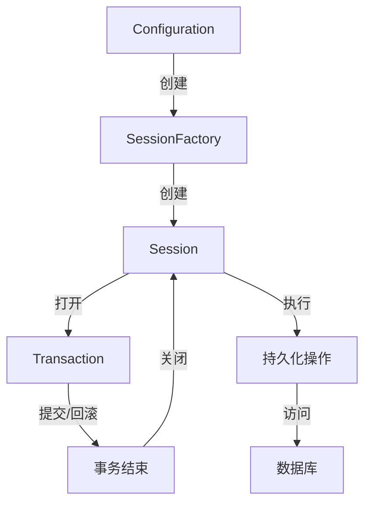

import Tabs from '@theme/Tabs';
import TabItem from '@theme/TabItem';
import CodeBlock from '@theme/CodeBlock';

# Hibernate详解

Hibernate是一个成熟、强大的开源ORM（对象关系映射）框架，为Java应用程序提供了对象与关系型数据库之间的映射能力。作为JPA规范的参考实现，Hibernate不仅简化了数据库访问，还提供了缓存、延迟加载、批处理等多种高级特性，帮助开发者构建高效、可维护的数据访问层。

:::tip 核心价值
**Hibernate = 对象关系映射 + 透明持久化 + 缓存机制 + 查询优化**
- 🔄 **对象关系映射**：无需编写SQL，自动转换对象与关系模型
- 🛡️ **透明持久化**：对象状态自动同步到数据库，减少样板代码
- 🚀 **多级缓存**：一级缓存、二级缓存、查询缓存提升性能
- 💡 **懒加载**：按需加载关联数据，优化内存使用
- 🔌 **方言系统**：支持几乎所有主流关系型数据库
:::

## 1. Hibernate基础与架构

### 1.1 ORM概念与Hibernate定位

ORM（Object-Relational Mapping，对象关系映射）是一种将对象与关系数据库表之间建立映射关系的技术，目的是解决面向对象编程语言与关系数据库之间的阻抗不匹配问题。

Hibernate是Java生态中最成熟的ORM解决方案之一，具有以下特点：

- **完全屏蔽SQL**：开发者可以使用面向对象的方式操作数据库，无需编写SQL语句
- **自动管理对象状态**：追踪对象变化，自动同步到数据库
- **透明持久化**：持久化操作对业务逻辑几乎不可见
- **JPA规范实现**：同时支持原生API和标准JPA API
- **丰富的映射策略**：支持各种复杂的对象关系映射

#### 1.1.1 Hibernate与其他ORM框架对比

| 特性 | Hibernate | MyBatis | JPA | JDBC |
|------|-----------|---------|-----|------|
| **抽象级别** | 高 | 中 | 高 | 低 |
| **SQL控制** | 自动生成 | 手动编写 | 自动生成 | 手动编写 |
| **学习曲线** | 陡峭 | 平缓 | 中等 | 简单 |
| **性能控制** | 较低 | 较高 | 中等 | 完全控制 |
| **对象映射** | 自动完成 | 手动映射 | 自动完成 | 手动映射 |
| **缓存机制** | 多级缓存 | 一级缓存 | 二级缓存 | 无内置缓存 |
| **数据库移植** | 极佳 | 一般 | 良好 | 较差 |
| **适用场景** | 复杂对象模型 | SQL优化场景 | 标准化应用 | 性能极限场景 |

### 1.2 Hibernate架构

Hibernate采用分层架构设计，主要包括以下核心组件：


#### 1.2.1 核心组件

1. **Configuration**：配置管理，负责读取配置文件和创建SessionFactory
2. **SessionFactory**：会话工厂，线程安全的共享对象，负责创建Session
3. **Session**：核心接口，代表与数据库的一次会话，提供CRUD操作
4. **Transaction**：事务管理，控制原子性操作
5. **ConnectionProvider**：连接提供者，管理数据库连接
6. **TransactionFactory**：事务工厂，创建Transaction对象
7. **PersistentManager**：持久化管理器，负责对象状态管理

#### 1.2.2 工作流程



Hibernate的典型工作流程如下：

1. 加载配置创建SessionFactory（应用启动时一次性完成）
2. 从SessionFactory获取Session（每次数据库操作获取）
3. 开启事务（保证数据一致性）
4. 执行持久化操作（增删改查）
5. 提交事务（或出错时回滚）
6. 关闭Session（释放资源）

### 1.3 Hibernate对象生命周期

Hibernate管理的实体对象在其生命周期中可能处于以下四种状态之一：

#### 1.3.1 对象状态

1. **瞬时态（Transient）**：
   - 刚创建的对象，未与Session关联
   - 没有持久化标识符（数据库主键）
   - 对此对象的修改不会影响数据库

```java
// 瞬时态对象
User user = new User();
user.setName("张三");
// 此时对象不在Session管理下，对其修改不会反映到数据库
```

2. **持久态（Persistent）**：
   - 已与Session关联，有持久化标识符
   - 对该对象的修改会被Session跟踪
   - 事务提交时自动同步到数据库

```java
Session session = sessionFactory.openSession();
Transaction tx = session.beginTransaction();

// 通过save()方法使对象进入持久态
session.save(user);
// 或通过get()方法获取的对象直接处于持久态
User persistentUser = session.get(User.class, 1L);

// 持久态对象的修改会被自动跟踪
persistentUser.setEmail("zhangsan@example.com");
// 不需要显式update，修改会在事务提交时同步到数据库

tx.commit();
```

3. **游离态（Detached）**：
   - 曾经处于持久态，但当前不在Session管理下
   - 有持久化标识符，但修改不会同步到数据库

```java
// Session关闭后，持久态对象变为游离态
session.close();
// 此时persistentUser已经是游离态
persistentUser.setPhone("13800138000");
// 这个修改不会被同步到数据库
```

4. **删除态（Removed）**：
   - 已被Session标记为删除的对象
   - 事务提交后从数据库中删除

```java
Session session = sessionFactory.openSession();
Transaction tx = session.beginTransaction();

User user = session.get(User.class, 1L);
// 标记对象为删除态
session.delete(user);
// 事务提交后，数据会从数据库中删除
tx.commit();
```

#### 1.3.2 状态转换

以下是对象状态转换的主要方法：

- **瞬时态→持久态**：`save()`, `saveOrUpdate()`, `persist()`
- **持久态→游离态**：`evict()`, `clear()`, session关闭
- **游离态→持久态**：`update()`, `saveOrUpdate()`, `lock()`, `merge()`
- **持久态→删除态**：`delete()`
- **游离态→删除态**：`delete()`

```java
Session session = sessionFactory.openSession();
Transaction tx = session.beginTransaction();

// 瞬时态 -> 持久态
User user = new User("李四", "lisi@example.com");
session.save(user);

// 持久态 -> 游离态
session.evict(user);

// 游离态 -> 持久态
user.setName("李四(已更新)");
session.update(user);

// 持久态 -> 删除态
session.delete(user);

tx.commit();
session.close();
```

### 1.4 环境搭建与基础配置

#### 1.4.1 添加依赖

在Maven项目中添加Hibernate依赖：

```xml
<!-- Hibernate核心 -->
<dependency>
    <groupId>org.hibernate</groupId>
    <artifactId>hibernate-core</artifactId>
    <version>5.6.15.Final</version>
</dependency>

<!-- 数据库驱动（以MySQL为例） -->
<dependency>
    <groupId>mysql</groupId>
    <artifactId>mysql-connector-java</artifactId>
    <version>8.0.30</version>
</dependency>

<!-- 连接池（可选） -->
<dependency>
    <groupId>com.zaxxer</groupId>
    <artifactId>HikariCP</artifactId>
    <version>5.0.1</version>
</dependency>
```

#### 1.4.2 XML配置方式

创建`hibernate.cfg.xml`配置文件：

```xml
<!DOCTYPE hibernate-configuration PUBLIC
        "-//Hibernate/Hibernate Configuration DTD 3.0//EN"
        "http://www.hibernate.org/dtd/hibernate-configuration-3.0.dtd">
<hibernate-configuration>
    <session-factory>
        <!-- 数据库连接设置 -->
        <property name="hibernate.connection.driver_class">com.mysql.cj.jdbc.Driver</property>
        <property name="hibernate.connection.url">jdbc:mysql://localhost:3306/test?useSSL=false&amp;serverTimezone=UTC</property>
        <property name="hibernate.connection.username">root</property>
        <property name="hibernate.connection.password">password</property>
        
        <!-- 方言配置 -->
        <property name="hibernate.dialect">org.hibernate.dialect.MySQL8Dialect</property>
        
        <!-- 输出SQL -->
        <property name="hibernate.show_sql">true</property>
        <property name="hibernate.format_sql">true</property>
        
        <!-- 自动建表 -->
        <property name="hibernate.hbm2ddl.auto">update</property>
        
        <!-- 连接池配置（使用HikariCP） -->
        <property name="hibernate.connection.provider_class">org.hibernate.hikaricp.internal.HikariCPConnectionProvider</property>
        <property name="hibernate.hikari.minimumIdle">5</property>
        <property name="hibernate.hikari.maximumPoolSize">10</property>
        <property name="hibernate.hikari.idleTimeout">30000</property>
        
        <!-- 二级缓存配置 -->
        <property name="hibernate.cache.use_second_level_cache">true</property>
        <property name="hibernate.cache.region.factory_class">org.hibernate.cache.jcache.JCacheRegionFactory</property>
        <property name="hibernate.javax.cache.provider">org.ehcache.jsr107.EhcacheCachingProvider</property>
        
        <!-- 映射文件 -->
        <mapping resource="com/example/model/User.hbm.xml"/>
        <!-- 或使用注解映射 -->
        <mapping class="com.example.model.User"/>
    </session-factory>
</hibernate-configuration>
```

#### 1.4.3 Java配置方式

使用Java代码进行配置：

```java
import org.hibernate.SessionFactory;
import org.hibernate.boot.Metadata;
import org.hibernate.boot.MetadataSources;
import org.hibernate.boot.registry.StandardServiceRegistry;
import org.hibernate.boot.registry.StandardServiceRegistryBuilder;

public class HibernateUtil {
    private static StandardServiceRegistry registry;
    private static SessionFactory sessionFactory;
    
    public static SessionFactory getSessionFactory() {
        if (sessionFactory == null) {
            try {
                // 创建注册表
                registry = new StandardServiceRegistryBuilder()
                    .configure() // 加载hibernate.cfg.xml
                    .build();
                
                // 创建MetadataSources
                MetadataSources sources = new MetadataSources(registry);
                
                // 添加实体类
                sources.addAnnotatedClass(User.class);
                
                // 创建Metadata
                Metadata metadata = sources.getMetadataBuilder().build();
                
                // 创建SessionFactory
                sessionFactory = metadata.getSessionFactoryBuilder().build();
            } catch (Exception e) {
                if (registry != null) {
                    StandardServiceRegistryBuilder.destroy(registry);
                }
                throw e;
            }
        }
        return sessionFactory;
    }
    
    public static void shutdown() {
        if (registry != null) {
            StandardServiceRegistryBuilder.destroy(registry);
        }
    }
}
```

#### 1.4.4 主要配置选项说明

| 配置项 | 说明 | 常用值 |
|-------|------|-------|
| `hibernate.dialect` | 数据库方言 | MySQL8Dialect, PostgreSQLDialect, Oracle12cDialect |
| `hibernate.show_sql` | 显示SQL语句 | true, false |
| `hibernate.format_sql` | 格式化SQL | true, false |
| `hibernate.hbm2ddl.auto` | 自动建表策略 | create, update, validate, create-drop, none |
| `hibernate.cache.use_second_level_cache` | 启用二级缓存 | true, false |
| `hibernate.cache.use_query_cache` | 启用查询缓存 | true, false |
| `hibernate.current_session_context_class` | Session上下文管理 | thread, jta |
| `hibernate.jdbc.batch_size` | JDBC批处理大小 | 10-50 (视情况) |
| `hibernate.connection.isolation` | 事务隔离级别 | 1(读未提交), 2(读已提交), 4(可重复读), 8(串行化) |

## 2. 实体映射技术

Hibernate的核心功能是实现对象关系映射，将Java对象映射到关系数据库表。

### 2.1 注解映射

在现代Hibernate应用中，注解是最常用的映射方式，它直接在实体类上定义映射关系。

#### 2.1.1 基本注解

```java
import javax.persistence.*;
import java.util.Date;

@Entity // 声明这是一个实体类
@Table(name = "users") // 映射到数据库中的表名
public class User {
    
    @Id // 声明主键
    @GeneratedValue(strategy = GenerationType.IDENTITY) // 主键生成策略
    private Long id;
    
    @Column(name = "username", nullable = false, length = 50) // 列定义
    private String username;
    
    @Column(name = "email", unique = true)
    private String email;
    
    @Temporal(TemporalType.TIMESTAMP) // 日期类型映射
    @Column(name = "created_at")
    private Date createdAt;
    
    @Enumerated(EnumType.STRING) // 枚举类型映射
    @Column(name = "status")
    private UserStatus status;
    
    @Transient // 非持久化字段
    private String temporaryData;
    
    // 构造函数、Getter和Setter省略...
}

// 枚举类
public enum UserStatus {
    ACTIVE, INACTIVE, SUSPENDED
}
```

#### 2.1.2 主键生成策略

Hibernate支持多种主键生成策略，通过`@GeneratedValue`注解配置：

```java
// 自增长（依赖数据库的自增特性）
@Id
@GeneratedValue(strategy = GenerationType.IDENTITY)
private Long id;

// 序列生成器（适用于Oracle等支持序列的数据库）
@Id
@GeneratedValue(strategy = GenerationType.SEQUENCE, generator = "user_seq")
@SequenceGenerator(name = "user_seq", sequenceName = "USER_SEQ", allocationSize = 1)
private Long id;

// 表生成器（独立于特定数据库）
@Id
@GeneratedValue(strategy = GenerationType.TABLE, generator = "user_gen")
@TableGenerator(name = "user_gen", table = "id_generator", 
                pkColumnName = "gen_name", pkColumnValue = "user_id",
                valueColumnName = "gen_value", allocationSize = 1)
private Long id;

// UUID生成器（使用自定义生成器）
@Id
@GenericGenerator(name = "uuid", strategy = "uuid2")
@GeneratedValue(generator = "uuid")
@Column(columnDefinition = "VARCHAR(36)")
private String id;
```

### 2.2 关联关系映射

Hibernate能够处理各种类型的对象关系映射，包括一对一、一对多、多对一和多对多关系。

#### 2.2.1 一对一关系(One-to-One)

一对一关系可以通过外键或共享主键实现：

```java
// 基于外键的一对一映射
@Entity
@Table(name = "users")
public class User {
    @Id
    @GeneratedValue(strategy = GenerationType.IDENTITY)
    private Long id;
    
    private String username;
    
    // 用户和用户详情的一对一关系
    @OneToOne(cascade = CascadeType.ALL, fetch = FetchType.LAZY)
    @JoinColumn(name = "profile_id")
    private UserProfile profile;
    
    // Getters和Setters省略...
}

@Entity
@Table(name = "user_profiles")
public class UserProfile {
    @Id
    @GeneratedValue(strategy = GenerationType.IDENTITY)
    private Long id;
    
    private String biography;
    private String avatarUrl;
    
    // 双向关联（可选）
    @OneToOne(mappedBy = "profile")
    private User user;
    
    // Getters和Setters省略...
}
```

#### 2.2.2 一对多/多对一关系(One-to-Many/Many-to-One)

一对多是最常见的关联关系：

```java
// 部门与员工的一对多关系
@Entity
@Table(name = "departments")
public class Department {
    @Id
    @GeneratedValue(strategy = GenerationType.IDENTITY)
    private Long id;
    
    private String name;
    
    // 一个部门有多个员工
    @OneToMany(mappedBy = "department", cascade = CascadeType.ALL, orphanRemoval = true)
    private List<Employee> employees = new ArrayList<>();
    
    // 便捷方法管理关系
    public void addEmployee(Employee employee) {
        employees.add(employee);
        employee.setDepartment(this);
    }
    
    public void removeEmployee(Employee employee) {
        employees.remove(employee);
        employee.setDepartment(null);
    }
    
    // Getters和Setters省略...
}

@Entity
@Table(name = "employees")
public class Employee {
    @Id
    @GeneratedValue(strategy = GenerationType.IDENTITY)
    private Long id;
    
    private String name;
    private String position;
    
    // 多个员工属于一个部门
    @ManyToOne(fetch = FetchType.LAZY)
    @JoinColumn(name = "department_id")
    private Department department;
    
    // Getters和Setters省略...
}
```

#### 2.2.3 多对多关系(Many-to-Many)

多对多关系通常通过中间表实现：

```java
// 学生和课程的多对多关系
@Entity
@Table(name = "students")
public class Student {
    @Id
    @GeneratedValue(strategy = GenerationType.IDENTITY)
    private Long id;
    
    private String name;
    
    @ManyToMany(cascade = {CascadeType.PERSIST, CascadeType.MERGE})
    @JoinTable(
        name = "student_course", 
        joinColumns = @JoinColumn(name = "student_id"),
        inverseJoinColumns = @JoinColumn(name = "course_id")
    )
    private Set<Course> courses = new HashSet<>();
    
    // 便捷方法管理关系
    public void addCourse(Course course) {
        courses.add(course);
        course.getStudents().add(this);
    }
    
    public void removeCourse(Course course) {
        courses.remove(course);
        course.getStudents().remove(this);
    }
    
    // Getters和Setters省略...
}

@Entity
@Table(name = "courses")
public class Course {
    @Id
    @GeneratedValue(strategy = GenerationType.IDENTITY)
    private Long id;
    
    private String name;
    private int credits;
    
    @ManyToMany(mappedBy = "courses")
    private Set<Student> students = new HashSet<>();
    
    // Getters和Setters省略...
}
```

#### 2.2.4 级联操作与孤儿删除

Hibernate通过级联（Cascade）选项控制关联对象的操作传播：

```java
// 级联所有操作（创建、更新、删除等）
@OneToMany(mappedBy = "parent", cascade = CascadeType.ALL)

// 级联特定操作
@OneToMany(mappedBy = "parent", 
           cascade = {CascadeType.PERSIST, CascadeType.MERGE})

// 孤儿删除（当子对象不再被引用时自动删除）
@OneToMany(mappedBy = "parent", orphanRemoval = true)
```

主要的级联选项：
- **CascadeType.PERSIST**：级联保存
- **CascadeType.MERGE**：级联更新
- **CascadeType.REMOVE**：级联删除
- **CascadeType.REFRESH**：级联刷新
- **CascadeType.DETACH**：级联脱管
- **CascadeType.ALL**：包含所有级联操作

### 2.3 继承映射策略

Hibernate提供了多种实现Java类继承关系的映射策略。

#### 2.3.1 单表策略(Single Table)

将整个继承层次结构映射到单个数据库表，使用判别列区分不同类型。

```java
@Entity
@Inheritance(strategy = InheritanceType.SINGLE_TABLE)
@DiscriminatorColumn(name = "type")
public abstract class Payment {
    @Id
    @GeneratedValue(strategy = GenerationType.IDENTITY)
    private Long id;
    
    private BigDecimal amount;
    private LocalDateTime paymentDate;
    
    // Getters和Setters省略...
}

@Entity
@DiscriminatorValue("CC")
public class CreditCardPayment extends Payment {
    private String cardNumber;
    private String cardHolderName;
    private YearMonth expiryDate;
    
    // Getters和Setters省略...
}

@Entity
@DiscriminatorValue("BA")
public class BankAccountPayment extends Payment {
    private String accountNumber;
    private String bankName;
    private String swiftCode;
    
    // Getters和Setters省略...
}
```

**优点**：
- 查询效率高，不需要联接
- 适合简单的继承层次结构

**缺点**：
- 子类特有的字段不能设为非空
- 表可能包含许多空值，浪费空间

#### 2.3.2 连接表策略(Joined)

每个类都有自己的表，子类表只包含特有属性和指向父类的外键。

```java
@Entity
@Inheritance(strategy = InheritanceType.JOINED)
public abstract class Vehicle {
    @Id
    @GeneratedValue(strategy = GenerationType.IDENTITY)
    private Long id;
    
    private String manufacturer;
    private String model;
    private Integer yearOfManufacture;
    
    // Getters和Setters省略...
}

@Entity
@PrimaryKeyJoinColumn(name = "vehicle_id")
public class Car extends Vehicle {
    private Integer numberOfDoors;
    private Integer engineCapacity;
    
    // Getters和Setters省略...
}

@Entity
@PrimaryKeyJoinColumn(name = "vehicle_id")
public class Motorcycle extends Vehicle {
    private Boolean hasSideCar;
    
    // Getters和Setters省略...
}
```

**优点**：
- 数据完整性更好，子类特有字段可设为非空
- 表结构符合规范化原则

**缺点**：
- 查询子类需要连接，性能较低
- 插入/更新需要操作多张表

#### 2.3.3 每个类一张表策略(Table Per Class)

每个具体类都有自己的表，包含所有属性(包括继承的属性)。

```java
@Entity
@Inheritance(strategy = InheritanceType.TABLE_PER_CLASS)
public abstract class Account {
    @Id
    @GeneratedValue(strategy = GenerationType.TABLE)
    private Long id;
    
    private String owner;
    private BigDecimal balance;
    
    // Getters和Setters省略...
}

@Entity
public class SavingsAccount extends Account {
    private Double interestRate;
    
    // Getters和Setters省略...
}

@Entity
public class CheckingAccount extends Account {
    private BigDecimal overdraftLimit;
    
    // Getters和Setters省略...
}
```

**优点**：
- 每个表是完全独立的，表结构直观
- 子类特有字段可设为非空

**缺点**：
- 多态查询性能差
- 可能导致数据重复
- 主键生成策略受限 

## 3. Hibernate核心API与操作

### 3.1 SessionFactory

`SessionFactory`是Hibernate的核心接口之一，它是线程安全的，通常在应用程序启动时创建一次，并在整个应用程序生命周期中共享使用。

主要功能：
- 创建Session实例
- 保存数据库连接配置
- 维护二级缓存
- 保存映射元数据

```java
// 创建SessionFactory
StandardServiceRegistry registry = new StandardServiceRegistryBuilder()
        .configure() // 从hibernate.cfg.xml加载设置
        .build();
SessionFactory sessionFactory = new MetadataSources(registry)
        .buildMetadata()
        .buildSessionFactory();

// 获取Session
Session session = sessionFactory.openSession();

// 获取当前Session（如果配置了当前Session上下文）
Session currentSession = sessionFactory.getCurrentSession();

// 应用关闭时释放资源
sessionFactory.close();
```

### 3.2 Session

`Session`是Hibernate的主要工作接口，代表与数据库的一次会话。它是一个轻量级、非线程安全的对象，通常在执行一组操作时创建，完成后关闭。

#### 3.2.1 基本CRUD操作

```java
// 开启会话
Session session = sessionFactory.openSession();
Transaction tx = null;

try {
    // 开始事务
    tx = session.beginTransaction();
    
    // 创建(Create)
    User newUser = new User("王五", "wangwu@example.com");
    Long userId = (Long) session.save(newUser);
    
    // 读取(Read)
    User user = session.get(User.class, userId);
    // 或使用load方法（返回代理对象，可能触发懒加载）
    User lazyUser = session.load(User.class, userId);
    
    // 更新(Update)
    user.setEmail("wangwu_new@example.com");
    session.update(user);
    // 或使用saveOrUpdate方法（自动判断是保存还是更新）
    user.setName("王五(已更新)");
    session.saveOrUpdate(user);
    
    // 删除(Delete)
    session.delete(user);
    
    // 提交事务
    tx.commit();
} catch (Exception e) {
    // 回滚事务
    if (tx != null) tx.rollback();
    e.printStackTrace();
} finally {
    // 关闭会话
    session.close();
}
```

#### 3.2.2 批量操作

为提高性能，Hibernate支持批量处理：

```java
Session session = sessionFactory.openSession();
Transaction tx = session.beginTransaction();

try {
    // 设置JDBC批处理大小
    session.setJdbcBatchSize(20);
    
    // 批量插入
    for (int i = 0; i < 100; i++) {
        User user = new User("用户" + i, "user" + i + "@example.com");
        session.save(user);
        
        // 每20条清理缓存，避免内存溢出
        if (i > 0 && i % 20 == 0) {
            session.flush();
            session.clear();
        }
    }
    
    tx.commit();
} catch (Exception e) {
    tx.rollback();
    throw e;
} finally {
    session.close();
}
```

#### 3.2.3 刷新与清理

```java
// 刷新：将Session缓存中的变更同步到数据库
session.flush();

// 刷新特定实体：从数据库重新加载实体数据
session.refresh(user);

// 清理Session缓存
session.clear();

// 从Session缓存中移除特定实体
session.evict(user);
```

### 3.3 事务管理

Hibernate支持多种事务管理方式，包括本地事务和JTA事务。

#### 3.3.1 本地事务

```java
Session session = sessionFactory.openSession();
Transaction tx = null;

try {
    tx = session.beginTransaction();
    
    // 业务操作...
    
    // 提交事务
    tx.commit();
} catch (Exception e) {
    // 回滚事务
    if (tx != null) tx.rollback();
    throw e;
} finally {
    session.close();
}
```

#### 3.3.2 使用当前Session和事务

当配置了`hibernate.current_session_context_class`为`thread`或`jta`时，可以使用当前Session：

```java
// 使用线程绑定的当前Session
Session session = sessionFactory.getCurrentSession();
session.beginTransaction();

try {
    // 业务操作...
    
    // 提交事务
    session.getTransaction().commit();
} catch (Exception e) {
    // 回滚事务
    session.getTransaction().rollback();
    throw e;
    // 注意：使用getCurrentSession()时，事务提交或回滚后Session会自动关闭
}
```

#### 3.3.3 事务隔离级别

Hibernate允许设置事务隔离级别：

```java
// 在配置中设置
cfg.setProperty("hibernate.connection.isolation", "2"); // READ_COMMITTED

// 或在获取连接时设置
session.doWork(connection -> {
    connection.setTransactionIsolation(Connection.TRANSACTION_SERIALIZABLE);
});
```

### 3.4 查询方式

Hibernate提供了多种查询数据的API，每种都有各自的优缺点。

<Tabs>
<TabItem value="hql" label="HQL">

```java
// 基本HQL查询
String hql = "FROM User u WHERE u.email LIKE :pattern ORDER BY u.name";
List<User> users = session.createQuery(hql, User.class)
        .setParameter("pattern", "%@gmail.com")
        .list();

// 分页查询
List<User> pagedUsers = session.createQuery("FROM User", User.class)
        .setFirstResult(0)    // 起始位置（0为第一条）
        .setMaxResults(20)    // 每页记录数
        .list();

// 聚合函数
Long count = (Long) session.createQuery("SELECT COUNT(u) FROM User u")
        .uniqueResult();

// 连接查询
String joinHql = "SELECT u, o FROM User u JOIN u.orders o WHERE o.status = :status";
List<Object[]> userOrders = session.createQuery(joinHql)
        .setParameter("status", OrderStatus.COMPLETED)
        .list();
for (Object[] result : userOrders) {
    User user = (User) result[0];
    Order order = (Order) result[1];
    // 处理结果...
}

// 命名查询（在实体类上定义）
List<User> activeUsers = session.createNamedQuery("User.findActive", User.class)
        .setMaxResults(10)
        .list();
```

</TabItem>
<TabItem value="criteria" label="Criteria API">

```java
// JPA Criteria API
CriteriaBuilder builder = session.getCriteriaBuilder();
CriteriaQuery<User> query = builder.createQuery(User.class);
Root<User> root = query.from(User.class);

// 构建条件
query.select(root)
     .where(
         builder.and(
             builder.equal(root.get("status"), UserStatus.ACTIVE),
             builder.greaterThan(root.get("registrationDate"), LocalDate.now().minusDays(30))
         )
     )
     .orderBy(builder.desc(root.get("lastLoginTime")));

// 执行查询
List<User> recentActiveUsers = session.createQuery(query).getResultList();

// 复杂条件示例
CriteriaBuilder cb = session.getCriteriaBuilder();
CriteriaQuery<User> criteriaQuery = cb.createQuery(User.class);
Root<User> userRoot = criteriaQuery.from(User.class);

// 连接
Join<User, Order> orderJoin = userRoot.join("orders", JoinType.LEFT);

// 子查询
Subquery<Long> subquery = criteriaQuery.subquery(Long.class);
Root<Order> subRoot = subquery.from(Order.class);
subquery.select(cb.count(subRoot))
        .where(cb.equal(subRoot.get("user"), userRoot));

// 组合条件
Predicate conditions = cb.and(
    cb.like(userRoot.get("email"), "%.com"),
    cb.greaterThanOrEqualTo(subquery, 1L)
);

criteriaQuery.select(userRoot).where(conditions);
List<User> usersWithOrders = session.createQuery(criteriaQuery).getResultList();
```

</TabItem>
<TabItem value="native" label="原生SQL">

```java
// 原生SQL查询
String sql = "SELECT * FROM users WHERE registration_date > :date";
List<User> newUsers = session.createNativeQuery(sql, User.class)
        .setParameter("date", java.sql.Date.valueOf(LocalDate.now().minusDays(7)))
        .list();

// 原生SQL查询返回非实体结果
String sqlReport = "SELECT u.name, COUNT(o.id) as order_count, SUM(o.total) as total_amount " +
                  "FROM users u LEFT JOIN orders o ON u.id = o.user_id " +
                  "GROUP BY u.id";
List<Object[]> reportData = session.createNativeQuery(sqlReport)
        .list();
for (Object[] row : reportData) {
    String name = (String) row[0];
    Long orderCount = ((Number) row[1]).longValue();
    BigDecimal totalAmount = (BigDecimal) row[2];
    // 处理结果...
}

// 映射原生SQL结果到DTO
String sqlQuery = "SELECT u.id as user_id, u.name as user_name, " +
                  "COUNT(o.id) as order_count " +
                  "FROM users u LEFT JOIN orders o ON u.id = o.user_id " +
                  "GROUP BY u.id";
List<UserStatsDTO> stats = session.createNativeQuery(sqlQuery)
        .setResultTransformer(Transformers.aliasToBean(UserStatsDTO.class))
        .list();
```

</TabItem>
<TabItem value="queryDSL" label="QueryDSL">

```java
// 使用QueryDSL（需要额外依赖）
JPAQuery<User> query = new JPAQuery<>(session);
QUser user = QUser.user;
QOrder order = QOrder.order;

List<User> premiumUsers = query
        .select(user)
        .from(user)
        .leftJoin(user.orders, order)
        .where(user.type.eq(UserType.PREMIUM)
            .and(order.total.gt(new BigDecimal("1000"))))
        .orderBy(user.name.asc())
        .fetch();
```

</TabItem>
</Tabs>

### 3.5 锁定策略

Hibernate提供了多种锁定策略以支持并发访问控制：

#### 3.5.1 悲观锁

悲观锁通过数据库锁机制实现，适用于高并发场景。

```java
// 使用LockMode枚举
User user = session.get(User.class, userId, LockMode.PESSIMISTIC_WRITE);

// 在HQL中使用锁
List<Product> products = session.createQuery("FROM Product p WHERE p.stock > 0", Product.class)
        .setLockMode(LockModeType.PESSIMISTIC_WRITE)
        .list();

// JPA锁定模式
session.find(Order.class, orderId, LockModeType.PESSIMISTIC_READ);
```

#### 3.5.2 乐观锁

乐观锁通过版本检查实现，适用于并发冲突较少的场景。

```java
@Entity
public class Product {
    @Id
    private Long id;
    
    private String name;
    private BigDecimal price;
    
    @Version  // 版本字段，自动处理乐观锁
    private Integer version;
    
    // ...
}
```

#### 3.5.3 自然锁

利用数据库事务隔离级别提供的锁定行为。

```java
// 开始事务
Transaction tx = session.beginTransaction();

// 在READ_COMMITTED或更高隔离级别下，更新操作会获取行锁
Product product = session.get(Product.class, productId);
product.setStock(product.getStock() - 1);
session.update(product);

// 提交事务并释放锁
tx.commit();
```

### 3.6 批量处理与性能优化

#### 3.6.1 批量插入和更新

```java
Session session = sessionFactory.openSession();
Transaction tx = session.beginTransaction();

try {
    int batchSize = 30;
    
    for (int i = 0; i < 1000; i++) {
        Product product = new Product();
        product.setName("Product " + i);
        product.setPrice(new BigDecimal(random.nextDouble() * 100));
        session.save(product);
        
        // 每batchSize条记录刷新一次会话并清理缓存
        if (i > 0 && i % batchSize == 0) {
            session.flush();
            session.clear();
            System.out.println("Batch " + (i / batchSize) + " completed");
        }
    }
    
    tx.commit();
} catch (Exception e) {
    if (tx != null) tx.rollback();
    throw e;
} finally {
    session.close();
}
```

#### 3.6.2 批量HQL操作

```java
// 批量更新
int updatedEntities = session.createQuery(
        "UPDATE User SET status = :newStatus WHERE lastLoginDate < :date")
        .setParameter("newStatus", UserStatus.INACTIVE)
        .setParameter("date", LocalDate.now().minusMonths(6))
        .executeUpdate();

// 批量删除
int deletedEntities = session.createQuery(
        "DELETE FROM TempData WHERE creationDate < :date")
        .setParameter("date", LocalDate.now().minusDays(7))
        .executeUpdate();

// 注意：批量操作会绕过Session缓存和生命周期事件
```

#### 3.6.3 StatelessSession

对于大批量操作，可以使用`StatelessSession`以获得更好的性能：

```java
StatelessSession statelessSession = sessionFactory.openStatelessSession();
Transaction tx = statelessSession.beginTransaction();

try {
    ScrollableResults scrollableResults = statelessSession.createQuery(
            "FROM LargeEntity")
            .scroll(ScrollMode.FORWARD_ONLY);
    
    int count = 0;
    while (scrollableResults.next()) {
        LargeEntity entity = (LargeEntity) scrollableResults.get(0);
        // 处理实体
        entity.setProcessed(true);
        statelessSession.update(entity);
        
        if (++count % 100 == 0) {
            // 定期提交以释放内存
            tx.commit();
            tx = statelessSession.beginTransaction();
        }
    }
    
    tx.commit();
} catch (Exception e) {
    if (tx != null) tx.rollback();
    throw e;
} finally {
    statelessSession.close();
}
```

**StatelessSession特点**：
- 不维护一级缓存
- 不进行脏检查
- 不级联操作
- 不管理双向关系
- 直接操作数据库，绕过生命周期回调 

## 4. Hibernate缓存机制

Hibernate提供了复杂而强大的多级缓存系统，通过合理配置缓存可以显著提升应用程序性能。

### 4.1 一级缓存（Session缓存）

Session级别的缓存是Hibernate的核心特性，始终处于活动状态，无法禁用。

特点：
- 作用域限于单个Session
- 自动管理，不需要显式配置
- 同一Session中重复获取相同对象时，直接从缓存返回
- 事务提交或Session关闭时失效

```java
Session session = sessionFactory.openSession();

// 第一次查询，从数据库加载
User user1 = session.get(User.class, 1L); // 执行SQL查询

// 第二次查询相同ID，直接从一级缓存返回
User user2 = session.get(User.class, 1L); // 不执行SQL查询

// user1和user2是同一个对象实例
System.out.println(user1 == user2); // 输出true

session.close();
```

一级缓存管理操作：

```java
// 清除特定实体的缓存
session.evict(user);

// 清除所有缓存
session.clear();

// 将缓存中的修改立即同步到数据库
session.flush();

// 从数据库重新加载实体，更新缓存
session.refresh(user);
```

### 4.2 二级缓存（SessionFactory缓存）

SessionFactory级别的缓存在所有Session之间共享，能够显著减少数据库访问，但需要谨慎配置以确保数据一致性。

#### 4.2.1 二级缓存架构


#### 4.2.2 启用二级缓存

**Maven依赖**：

```xml
<!-- JCache API -->
<dependency>
    <groupId>javax.cache</groupId>
    <artifactId>cache-api</artifactId>
    <version>1.1.1</version>
</dependency>

<!-- EhCache实现 -->
<dependency>
    <groupId>org.ehcache</groupId>
    <artifactId>ehcache</artifactId>
    <version>3.9.9</version>
</dependency>

<!-- Hibernate EhCache集成 -->
<dependency>
    <groupId>org.hibernate</groupId>
    <artifactId>hibernate-jcache</artifactId>
    <version>5.6.15.Final</version>
</dependency>
```

**XML配置**：

```xml
<property name="hibernate.cache.use_second_level_cache">true</property>
<property name="hibernate.cache.region.factory_class">org.hibernate.cache.jcache.JCacheRegionFactory</property>
<property name="hibernate.javax.cache.provider">org.ehcache.jsr107.EhcacheCachingProvider</property>
<property name="hibernate.cache.use_query_cache">true</property>
```

**Java代码配置**：

```java
StandardServiceRegistryBuilder registryBuilder = new StandardServiceRegistryBuilder()
    .configure()
    .applySetting("hibernate.cache.use_second_level_cache", "true")
    .applySetting("hibernate.cache.region.factory_class", "org.hibernate.cache.jcache.JCacheRegionFactory")
    .applySetting("hibernate.javax.cache.provider", "org.ehcache.jsr107.EhcacheCachingProvider")
    .applySetting("hibernate.javax.cache.uri", "classpath:ehcache.xml");
```

#### 4.2.3 配置实体缓存

实体类级别配置：

```java
@Entity
@Cacheable
@org.hibernate.annotations.Cache(
    usage = CacheConcurrencyStrategy.READ_WRITE,
    region = "userCache"
)
public class User {
    // 实体属性
}

// 集合缓存
@Entity
public class Department {
    // ...
    
    @OneToMany(mappedBy = "department")
    @org.hibernate.annotations.Cache(
        usage = CacheConcurrencyStrategy.READ_WRITE,
        region = "departmentEmployeesCache"
    )
    private Set<Employee> employees = new HashSet<>();
}
```

不同的缓存并发策略：

| 策略 | 描述 | 适用场景 |
|------|------|---------|
| **READ_ONLY** | 只读访问，不允许更新 | 静态数据，如参考数据、配置数据 |
| **NONSTRICT_READ_WRITE** | 非严格读写，适合偶尔更新 | 很少更新的数据，可接受短暂的不一致 |
| **READ_WRITE** | 读写访问，使用软锁保证一致性 | 频繁读取、偶尔更新的数据 |
| **TRANSACTIONAL** | 支持事务，强一致性 | 需要JTA兼容缓存实现，如应用于集群环境 |

#### 4.2.4 查询缓存

针对查询结果的缓存：

```java
// 启用特定查询的缓存
List<Product> products = session.createQuery("FROM Product p WHERE p.category = :category", Product.class)
        .setParameter("category", "Electronics")
        .setCacheable(true)          // 启用查询缓存
        .setCacheRegion("productsByCategory")  // 指定缓存区域
        .list();
```

注意：
- 查询缓存只缓存ID列表，实际实体仍需从二级缓存或数据库获取
- 当相关表有更新时，缓存会自动失效
- 查询缓存适用于重复执行的参数化查询

#### 4.2.5 缓存失效和管理

```java
// 获取缓存工厂
SessionFactory sessionFactory = // ...
Cache cache = sessionFactory.getCache();

// 清除特定实体类的缓存
cache.evictEntityRegion(User.class);

// 清除特定实体实例的缓存
cache.evictEntity(User.class, userId);

// 清除特定集合缓存
cache.evictCollection("com.example.Department.employees", departmentId);

// 清除查询缓存区域
cache.evictQueryRegion("productsByCategory");

// 清除所有数据
cache.evictAllRegions();
```

#### 4.2.6 自定义缓存配置

EhCache配置文件（ehcache.xml）：

```xml
<config xmlns='http://www.ehcache.org/v3'>
    <!-- 默认缓存配置 -->
    <cache-template name="defaultTemplate">
        <expiry>
            <ttl unit="minutes">30</ttl>
        </expiry>
        <resources>
            <heap>1000</heap>
            <offheap unit="MB">10</offheap>
        </resources>
    </cache-template>
    
    <!-- 实体缓存区域 -->
    <cache alias="userCache" uses-template="defaultTemplate">
        <expiry>
            <ttl unit="minutes">60</ttl>
        </expiry>
        <resources>
            <heap>2000</heap>
        </resources>
    </cache>
    
    <!-- 集合缓存区域 -->
    <cache alias="departmentEmployeesCache" uses-template="defaultTemplate">
        <resources>
            <heap>500</heap>
        </resources>
    </cache>
    
    <!-- 查询缓存区域 -->
    <cache alias="productsByCategory" uses-template="defaultTemplate">
        <expiry>
            <ttl unit="minutes">15</ttl>
        </expiry>
    </cache>
</config>
```

Java中加载缓存配置：

```java
Properties properties = new Properties();
properties.put("hibernate.cache.use_second_level_cache", "true");
properties.put("hibernate.cache.region.factory_class", "org.hibernate.cache.jcache.JCacheRegionFactory");
properties.put("hibernate.javax.cache.provider", "org.ehcache.jsr107.EhcacheCachingProvider");
properties.put("hibernate.javax.cache.uri", "classpath:ehcache.xml");
```

### 4.3 缓存最佳实践

1. **选择性缓存**：只缓存频繁访问且很少修改的数据
2. **合理的缓存策略**：根据数据的使用模式选择适当的缓存并发策略
3. **监控缓存性能**：使用工具监控缓存命中率，及时调整缓存配置
4. **合理设置缓存大小**：避免缓存过大导致内存压力
5. **设置适当的TTL**：为缓存条目设置合理的过期时间
6. **分布式环境注意事项**：在集群环境中使用分布式缓存或缓存同步机制
7. **避免缓存大结果集**：不要缓存包含大量数据的查询结果

## 5. 与Spring Boot集成

Hibernate可以无缝集成到Spring Boot应用程序中，成为Spring Data JPA的底层实现。

### 5.1 基本集成

#### 5.1.1 添加依赖

```xml
<!-- Spring Boot Starter Data JPA 自动包含Hibernate -->
<dependency>
    <groupId>org.springframework.boot</groupId>
    <artifactId>spring-boot-starter-data-jpa</artifactId>
</dependency>

<!-- 数据库驱动 -->
<dependency>
    <groupId>mysql</groupId>
    <artifactId>mysql-connector-java</artifactId>
</dependency>
```

#### 5.1.2 配置数据源和JPA属性

application.yml:

```yaml
spring:
  datasource:
    url: jdbc:mysql://localhost:3306/testdb?useSSL=false&serverTimezone=UTC
    username: root
    password: password
    driver-class-name: com.mysql.cj.jdbc.Driver
  
  jpa:
    hibernate:
      ddl-auto: update
    show-sql: true
    properties:
      hibernate:
        dialect: org.hibernate.dialect.MySQL8Dialect
        format_sql: true
        # 二级缓存配置
        cache:
          use_second_level_cache: true
          region.factory_class: org.hibernate.cache.jcache.JCacheRegionFactory
          use_query_cache: true
        javax.cache.provider: org.ehcache.jsr107.EhcacheCachingProvider
```

#### 5.1.3 创建实体类

```java
@Entity
@Table(name = "users")
@Cacheable
@org.hibernate.annotations.Cache(usage = CacheConcurrencyStrategy.READ_WRITE)
public class User {
    @Id
    @GeneratedValue(strategy = GenerationType.IDENTITY)
    private Long id;
    
    @Column(nullable = false)
    private String username;
    
    @Email
    @Column(unique = true)
    private String email;
    
    @CreationTimestamp
    private LocalDateTime createdAt;
    
    @UpdateTimestamp
    private LocalDateTime updatedAt;
    
    // Getters、Setters、构造函数...
}
```

#### 5.1.4 创建Repository

```java
public interface UserRepository extends JpaRepository<User, Long> {
    
    List<User> findByEmailContaining(String emailPattern);
    
    @Query("FROM User u WHERE u.createdAt > :date")
    List<User> findRecentUsers(@Param("date") LocalDateTime date);
    
    @Modifying
    @Query("UPDATE User u SET u.active = false WHERE u.lastLogin < :date")
    int deactivateInactiveUsers(@Param("date") LocalDateTime date);
}
```

### 5.2 高级配置

#### 5.2.1 自定义EntityManager

```java
@Configuration
public class JpaConfig {
    
    @PersistenceContext
    private EntityManager entityManager;
    
    @Bean
    public SessionFactory hibernateSessionFactory() {
        if (entityManager == null || 
            !(entityManager.getDelegate() instanceof Session)) {
            throw new IllegalStateException("EntityManager不是Hibernate实现");
        }
        
        return entityManager.unwrap(Session.class).getSessionFactory();
    }
}
```

#### 5.2.2 使用原生Hibernate API

```java
@Service
public class ProductService {
    
    @PersistenceContext
    private EntityManager entityManager;
    
    // 使用Hibernate Session
    public void processLargeDataSet() {
        Session session = entityManager.unwrap(Session.class);
        
        // 使用StatelessSession进行批处理
        StatelessSession statelessSession = session.getSessionFactory().openStatelessSession();
        Transaction tx = statelessSession.beginTransaction();
        
        try {
            ScrollableResults results = statelessSession.createQuery("FROM Product")
                    .scroll(ScrollMode.FORWARD_ONLY);
            
            int count = 0;
            while (results.next()) {
                Product product = (Product) results.get(0);
                // 处理产品...
                statelessSession.update(product);
                
                if (++count % 50 == 0) {
                    tx.commit();
                    tx = statelessSession.beginTransaction();
                }
            }
            
            tx.commit();
        } catch (Exception e) {
            if (tx != null) tx.rollback();
            throw e;
        } finally {
            statelessSession.close();
        }
    }
}
```

#### 5.2.3 配置多数据源

```java
@Configuration
@EnableTransactionManagement
@EnableJpaRepositories(
    basePackages = "com.example.primary.repository",
    entityManagerFactoryRef = "primaryEntityManagerFactory",
    transactionManagerRef = "primaryTransactionManager"
)
public class PrimaryDbConfig {
    
    @Primary
    @Bean
    @ConfigurationProperties("spring.datasource.primary")
    public DataSource primaryDataSource() {
        return DataSourceBuilder.create().build();
    }
    
    @Primary
    @Bean
    public LocalContainerEntityManagerFactoryBean primaryEntityManagerFactory(
            EntityManagerFactoryBuilder builder,
            @Qualifier("primaryDataSource") DataSource dataSource) {
        return builder
            .dataSource(dataSource)
            .packages("com.example.primary.entity")
            .persistenceUnit("primary")
            .properties(hibernateProperties())
            .build();
    }
    
    @Primary
    @Bean
    public PlatformTransactionManager primaryTransactionManager(
            @Qualifier("primaryEntityManagerFactory") EntityManagerFactory entityManagerFactory) {
        return new JpaTransactionManager(entityManagerFactory);
    }
    
    private Map<String, Object> hibernateProperties() {
        Map<String, Object> properties = new HashMap<>();
        properties.put("hibernate.dialect", "org.hibernate.dialect.MySQL8Dialect");
        properties.put("hibernate.hbm2ddl.auto", "update");
        return properties;
    }
}

// 类似地定义第二个数据源配置...
```

### 5.3 事务管理

Spring Boot与Hibernate结合时，事务管理主要通过Spring的事务抽象实现。

#### 5.3.1 声明式事务

```java
@Service
public class UserService {
    
    @Autowired
    private UserRepository userRepository;
    
    @Transactional
    public User registerUser(User user) {
        // 检查用户名是否存在
        if (userRepository.existsByUsername(user.getUsername())) {
            throw new UsernameAlreadyExistsException("用户名已存在");
        }
        
        // 保存用户
        return userRepository.save(user);
        // 如果发生异常，事务会自动回滚
    }
    
    @Transactional(readOnly = true)
    public User getUserDetails(Long id) {
        return userRepository.findById(id)
            .orElseThrow(() -> new UserNotFoundException("用户不存在"));
    }
    
    @Transactional(propagation = Propagation.REQUIRES_NEW)
    public void logUserActivity(UserActivity activity) {
        // 即使外层事务失败，此操作也会在新事务中提交
    }
    
    @Transactional(noRollbackFor = NotFoundException.class)
    public void processUserData(Long userId) {
        // 即使抛出NotFoundException，事务也不会回滚
    }
}
```

#### 5.3.2 编程式事务

```java
@Service
public class OrderService {
    
    @Autowired
    private PlatformTransactionManager transactionManager;
    
    @Autowired
    private OrderRepository orderRepository;
    
    public void processOrder(Order order) {
        TransactionTemplate transactionTemplate = new TransactionTemplate(transactionManager);
        
        // 定义事务属性
        transactionTemplate.setIsolationLevel(TransactionDefinition.ISOLATION_READ_COMMITTED);
        transactionTemplate.setTimeout(30); // 30秒超时
        
        // 执行事务
        Order savedOrder = transactionTemplate.execute(status -> {
            try {
                return orderRepository.save(order);
            } catch (Exception e) {
                status.setRollbackOnly();
                throw e;
            }
        });
    }
}
```

#### 5.3.3 事务隔离级别

```java
@Transactional(isolation = Isolation.READ_COMMITTED)
public void updateUserProfile(UserProfile profile) {
    // 使用READ_COMMITTED隔离级别执行更新
}
```

Spring支持的隔离级别：
- **DEFAULT**：使用数据库默认隔离级别
- **READ_UNCOMMITTED**：读未提交（最低隔离级别）
- **READ_COMMITTED**：读已提交
- **REPEATABLE_READ**：可重复读
- **SERIALIZABLE**：串行化（最高隔离级别） 

## 6. Hibernate性能优化

Hibernate在提供便捷的对象关系映射同时，也引入了性能开销。以下是一些提高Hibernate应用性能的策略。

### 6.1 查询优化

#### 6.1.1 选择适当的获取策略

```java
// 即时加载：立即获取关联数据
@OneToMany(fetch = FetchType.EAGER)
private Set<OrderItem> items;

// 懒加载：仅在访问时获取关联数据
@ManyToOne(fetch = FetchType.LAZY)
@JoinColumn(name = "customer_id")
private Customer customer;
```

**最佳实践**：
- 对于单个实体或很少变化的小集合，可以使用即时加载
- 对于大型集合或复杂关联，应使用懒加载
- 设计细粒度API，避免不必要的数据加载

#### 6.1.2 批量获取

配置批量获取可以减少N+1查询问题：

```java
@Entity
public class Order {
    @Id
    private Long id;
    
    @OneToMany(mappedBy = "order")
    @BatchSize(size = 25)  // 当加载多个Order时，批量加载每个Order的items
    private Set<OrderItem> items;
}

// 或者在全局配置中设置
// hibernate.default_batch_fetch_size=25
```

#### 6.1.3 连接查询和DTOs

对于需要关联数据的查询，可以使用连接和DTOs：

```java
// 使用JOIN FETCH预加载关联数据
@Query("SELECT o FROM Order o JOIN FETCH o.customer JOIN FETCH o.items WHERE o.status = :status")
List<Order> findActiveOrdersWithDetails(@Param("status") OrderStatus status);

// 使用投影返回仅需的字段，避免加载整个实体
@Query("SELECT new com.example.dto.OrderSummaryDTO(o.id, o.orderDate, c.name) " +
       "FROM Order o JOIN o.customer c WHERE o.status = :status")
List<OrderSummaryDTO> findOrderSummaries(@Param("status") OrderStatus status);
```

### 6.2 会话管理

#### 6.2.1 控制Session大小

```java
// 清理Session缓存，防止内存溢出
public void processManyEntities() {
    Session session = sessionFactory.openSession();
    Transaction tx = session.beginTransaction();
    
    ScrollableResults results = session.createQuery("FROM LargeEntity")
            .scroll(ScrollMode.FORWARD_ONLY);
    
    int count = 0;
    while (results.next()) {
        LargeEntity entity = (LargeEntity) results.get(0);
        processEntity(entity);
        
        // 每100条记录清理一次Session缓存
        if (++count % 100 == 0) {
            session.flush();
            session.clear();
        }
    }
    
    tx.commit();
    session.close();
}
```

#### 6.2.2 使用有状态与无状态会话

```java
// 大批量操作使用StatelessSession
public void batchImport(List<Product> products) {
    StatelessSession statelessSession = sessionFactory.openStatelessSession();
    Transaction tx = statelessSession.beginTransaction();
    
    try {
        for (Product product : products) {
            statelessSession.insert(product);
        }
        tx.commit();
    } catch (Exception e) {
        tx.rollback();
        throw e;
    } finally {
        statelessSession.close();
    }
}
```

### 6.3 实体设计优化

#### 6.3.1 使用派生属性

对于经常需要计算的属性，可以在数据库级别计算并存储：

```java
@Entity
public class Order {
    @Column(name = "total_amount")
    private BigDecimal totalAmount;
    
    @OneToMany(mappedBy = "order", cascade = CascadeType.ALL)
    private Set<OrderItem> items = new HashSet<>();
    
    // 在添加/移除项目时维护总金额
    public void addItem(OrderItem item) {
        items.add(item);
        item.setOrder(this);
        this.totalAmount = this.totalAmount.add(item.getSubtotal());
    }
    
    public void removeItem(OrderItem item) {
        items.remove(item);
        item.setOrder(null);
        this.totalAmount = this.totalAmount.subtract(item.getSubtotal());
    }
}
```

#### 6.3.2 避免深层关联

过深的关联关系容易导致性能问题：

```java
// 不好的设计：深层级级联
@Entity
public class Company {
    @OneToMany(cascade = CascadeType.ALL, fetch = FetchType.EAGER)
    private Set<Department> departments;
}

@Entity
public class Department {
    @OneToMany(cascade = CascadeType.ALL, fetch = FetchType.EAGER)
    private Set<Employee> employees;
}

@Entity
public class Employee {
    @OneToMany(cascade = CascadeType.ALL, fetch = FetchType.EAGER)
    private Set<Task> tasks;
}

// 改进：根据访问模式设计合理的关联与加载策略
@Entity
public class Company {
    @OneToMany(mappedBy = "company", cascade = CascadeType.ALL, fetch = FetchType.LAZY)
    private Set<Department> departments;
}

// 使用专门的DTO和查询处理跨多级的数据需求
```

### 6.4 缓存优化

#### 6.4.1 选择性启用二级缓存

```java
// 适合缓存的实体（变化少，访问频繁）
@Entity
@Cacheable
@org.hibernate.annotations.Cache(usage = CacheConcurrencyStrategy.READ_WRITE)
public class Product {
    // ...
}

// 不适合缓存的实体（频繁变化）
@Entity
public class StockLevel {
    // 没有添加缓存注解
}
```

#### 6.4.2 查询缓存和结果转换器

```java
// 经常执行的相同查询可以缓存
@QueryHints({
    @QueryHint(name = "org.hibernate.cacheable", value = "true"),
    @QueryHint(name = "org.hibernate.cacheRegion", value = "productQueries")
})
@Query("FROM Product p WHERE p.category = :category")
List<Product> findByCategory(@Param("category") String category);
```

### 6.5 批处理操作

#### 6.5.1 JDBC批处理

```java
// 启用JDBC批处理
<property name="hibernate.jdbc.batch_size">30</property>
<property name="hibernate.order_inserts">true</property>
<property name="hibernate.order_updates">true</property>

// 代码中使用批处理
Session session = sessionFactory.openSession();
Transaction tx = session.beginTransaction();

try {
    for (int i = 0; i < 10000; i++) {
        Product product = new Product("Product " + i);
        session.save(product);
        
        if (i % 30 == 0) { 
            // 每30条记录刷新并清理会话
            session.flush();
            session.clear();
        }
    }
    tx.commit();
} catch (Exception e) {
    tx.rollback();
    throw e;
} finally {
    session.close();
}
```

#### 6.5.2 多版本并发控制

```java
@Entity
public class Account {
    @Id
    private Long id;
    
    private BigDecimal balance;
    
    @Version
    private Integer version;
    
    // ...
}

// 使用乐观锁进行高并发更新
public void transfer(Long fromId, Long toId, BigDecimal amount) {
    Session session = sessionFactory.openSession();
    Transaction tx = session.beginTransaction();
    
    try {
        Account from = session.get(Account.class, fromId);
        Account to = session.get(Account.class, toId);
        
        from.setBalance(from.getBalance().subtract(amount));
        to.setBalance(to.getBalance().add(amount));
        
        // 保存更改，如果version已变更，抛出StaleObjectStateException
        session.update(from);
        session.update(to);
        
        tx.commit();
    } catch (StaleObjectStateException e) {
        // 处理乐观锁冲突，例如重试或通知用户
        tx.rollback();
        throw new ConcurrentModificationException("数据已被其他事务修改，请重试");
    } catch (Exception e) {
        tx.rollback();
        throw e;
    } finally {
        session.close();
    }
}
```

### 6.6 SQL优化

#### 6.6.1 使用SQL提示

```java
// 使用SQL提示优化查询
@QueryHint(name = "org.hibernate.comment", value = "索引提示")
@Query(value = "SELECT * FROM products p USE INDEX (idx_category) WHERE p.category = :category", nativeQuery = true)
List<Product> findProductsByCategoryOptimized(@Param("category") String category);
```

#### 6.6.2 批量更新和删除

```java
// 使用HQL进行批量操作
@Modifying
@Query("UPDATE Product p SET p.price = p.price * 1.1 WHERE p.category = :category")
int increasePriceForCategory(@Param("category") String category);

// 使用原生SQL进行复杂批量操作
@Modifying
@Query(value = "UPDATE products p JOIN product_stats s ON p.id = s.product_id " +
               "SET p.featured = true WHERE s.views > 1000", nativeQuery = true)
int markHighViewProductsAsFeatured();
```

## 7. 常见问题与解决方案

### 7.1 N+1查询问题

**问题**：当加载一个集合时，Hibernate为集合中的每个元素单独执行查询。

```java
// N+1查询问题示例
List<Department> departments = session.createQuery("FROM Department").list(); // 1次查询
for (Department dept : departments) {
    // 每次访问employees集合时会触发1次新的查询
    dept.getEmployees().size(); // N次额外查询
}
```

**解决方案**：

1. **使用JOIN FETCH**：
```java
// 使用JOIN FETCH预加载关联集合
List<Department> departments = session.createQuery(
        "FROM Department d JOIN FETCH d.employees")
        .list();

// 现在访问employees不会触发额外查询
for (Department dept : departments) {
    dept.getEmployees().size(); // 不会执行额外查询
}
```

2. **使用批量获取**：
```java
// 在Department类上添加
@Entity
public class Department {
    @OneToMany(mappedBy = "department")
    @BatchSize(size = 20)  // 每次加载最多20个部门的员工
    private Set<Employee> employees;
}

// 或在全局配置中设置
// <property name="hibernate.default_batch_fetch_size">20</property>
```

3. **使用子查询**：
```java
@Entity
public class Department {
    @OneToMany(mappedBy = "department")
    @org.hibernate.annotations.Fetch(FetchMode.SUBSELECT)
    private Set<Employee> employees;
}
```

### 7.2 懒加载异常

**问题**：在Session关闭后访问懒加载属性时抛出LazyInitializationException。

```java
// 问题代码
Session session = sessionFactory.openSession();
Department dept = session.get(Department.class, 1L);
session.close();

// 异常产生点
dept.getEmployees().size(); // LazyInitializationException
```

**解决方案**：

1. **开放会话视图模式**：
```java
// Spring中配置OpenSessionInViewFilter
@Bean
public FilterRegistrationBean<OpenSessionInViewFilter> openSessionInViewFilter() {
    FilterRegistrationBean<OpenSessionInViewFilter> bean = new FilterRegistrationBean<>();
    bean.setFilter(new OpenSessionInViewFilter());
    bean.addUrlPatterns("/*");
    return bean;
}
```

2. **预加载需要的数据**：
```java
// 查询时预加载
Department dept = session.createQuery(
        "FROM Department d JOIN FETCH d.employees WHERE d.id = :id", Department.class)
        .setParameter("id", 1L)
        .uniqueResult();
session.close();
dept.getEmployees().size(); // 安全，已预加载
```

3. **分离DTO**：
```java
// 创建DTO，只包含需要的数据
public class DepartmentDTO {
    private Long id;
    private String name;
    private int employeeCount;
    
    // 构造函数、Getters、Setters...
}

// 查询直接返回DTO
@Query("SELECT new com.example.dto.DepartmentDTO(d.id, d.name, SIZE(d.employees)) " +
       "FROM Department d WHERE d.id = :id")
DepartmentDTO getDepartmentSummary(@Param("id") Long id);
```

### 7.3 缓存相关问题

**问题**：缓存一致性和数据陈旧问题。

**解决方案**：

1. **适当的缓存策略**：
```java
// 针对不同数据类型选择合适的缓存策略
@Cacheable
@org.hibernate.annotations.Cache(usage = CacheConcurrencyStrategy.READ_ONLY)
public class Country {
    // 静态参考数据，很少变化
}

@Cacheable
@org.hibernate.annotations.Cache(usage = CacheConcurrencyStrategy.READ_WRITE)
public class Product {
    // 经常读取，偶尔更新的数据
}
```

2. **显式清除缓存**：
```java
// 在关键数据更新后主动清除缓存
SessionFactory sessionFactory = // ...
sessionFactory.getCache().evictEntityRegion(Product.class);
// 或者更精确地清除特定实体
sessionFactory.getCache().evictEntity(Product.class, productId);
```

3. **设置合理的过期时间**：
```xml
<cache alias="productCache" uses-template="defaultTemplate">
    <expiry>
        <ttl unit="minutes">15</ttl>  <!-- 15分钟后过期 -->
    </expiry>
</cache>
```

### 7.4 性能问题

**问题**：Hibernate应用出现性能瓶颈。

**解决方案**：

1. **使用分析工具**：
```java
// 启用统计信息
<property name="hibernate.generate_statistics">true</property>

// 获取统计信息
Statistics stats = sessionFactory.getStatistics();
System.out.println("查询执行次数: " + stats.getQueryExecutionCount());
System.out.println("二级缓存命中率: " + stats.getSecondLevelCacheHitRatio());
```

2. **使用原生SQL处理复杂查询**：
```java
// 对于复杂查询，考虑使用原生SQL
@Query(value = "SELECT p.* FROM products p " +
               "JOIN inventory i ON p.id = i.product_id " +
               "WHERE i.stock > 0 AND p.price < :maxPrice " +
               "ORDER BY p.popularity DESC LIMIT 10", 
       nativeQuery = true)
List<Product> findBestSellingProducts(@Param("maxPrice") BigDecimal maxPrice);
```

3. **避免不必要的连接**：
```java
// 不好的实践：加载实体并进行过滤
List<Order> orders = orderRepository.findAll();
List<Order> recentOrders = orders.stream()
        .filter(o -> o.getOrderDate().isAfter(LocalDateTime.now().minusDays(7)))
        .collect(Collectors.toList());

// 好的实践：在查询中进行过滤
@Query("SELECT o FROM Order o WHERE o.orderDate > :date")
List<Order> findOrdersAfterDate(@Param("date") LocalDateTime date);
```

### 7.5 事务和并发问题

**问题**：事务隔离级别不当导致并发问题。

**解决方案**：

1. **选择适当的事务隔离级别**：
```java
// 读已提交：允许不可重复读，但防止脏读
@Transactional(isolation = Isolation.READ_COMMITTED)
public void updateUserData(User user) {
    // ...
}

// 可重复读：防止不可重复读
@Transactional(isolation = Isolation.REPEATABLE_READ)
public void generateReport(Long userId) {
    // ...
}
```

2. **乐观锁与悲观锁**：
```java
// 乐观锁：适用于冲突较少的情况
@Entity
public class Inventory {
    @Version
    private Integer version;
    // ...
}

// 悲观锁：适用于高并发冲突场景
@Lock(LockModeType.PESSIMISTIC_WRITE)
@Query("SELECT i FROM Inventory i WHERE i.productId = :id")
Inventory findWithLock(@Param("id") Long productId);
```

## 8. 最佳实践和总结

### 8.1 设计最佳实践

1. **领域模型设计**：
   - 使用充血模型，将业务逻辑封装在实体中
   - 遵循单一职责原则，每个实体只关注自己的核心职责
   - 合理使用继承和组合关系

2. **映射策略**：
   - 选择合适的ID生成策略（如自增、UUID）
   - 合理设置关联关系的级联特性
   - 谨慎使用双向关联，只在必要时使用

3. **查询设计**：
   - 优先使用命名查询或存储过程处理复杂逻辑
   - 使用投影DTO减少数据传输量
   - 根据查询频率和复杂性选择HQL或原生SQL

### 8.2 性能最佳实践

1. **会话管理**：
   - 保持Session生命周期短，避免长会话
   - 定期清理Session缓存，防止内存溢出
   - 使用StatelessSession处理批量操作

2. **批处理优化**：
   - 配置合适的批处理大小（通常10-50）
   - 对相似操作进行排序以提高批处理效率
   - 使用多线程处理大批量数据

3. **缓存策略**：
   - 为读多写少的数据启用二级缓存
   - 为频繁执行的查询启用查询缓存
   - 设置合理的缓存区域和过期策略

### 8.3 开发工具和调试

1. **日志配置**：
```xml
<property name="hibernate.show_sql">true</property>
<property name="hibernate.format_sql">true</property>
<property name="hibernate.use_sql_comments">true</property>
```

2. **调试工具**：
   - 使用p6spy等工具拦截和分析SQL
   - 使用JPA Buddy、Hibernate Tools等IDE插件
   - 使用Hibernate Profiler监控性能

3. **测试策略**：
   - 使用内存数据库（H2、HSQLDB）进行单元测试
   - 使用测试容器（Testcontainers）进行集成测试
   - 创建专用测试环境模拟生产负载

### 8.4 Hibernate与其他技术集成

1. **与Spring Boot集成**：
   - 使用Spring Data JPA简化数据访问层
   - 利用Spring的事务管理和AOP功能
   - 使用Spring Profiles管理不同环境配置

2. **与查询框架集成**：
   - 使用QueryDSL实现类型安全查询
   - 使用JOOQ进行复杂SQL操作
   - 使用Blaze-Persistence进行高级查询优化

3. **与NoSQL集成**：
   - 使用Hibernate OGM连接MongoDB、Neo4j等
   - 使用Spring Data同时处理关系型和非关系型数据库
   - 实现多模型持久化策略

### 8.5 总结与展望

Hibernate作为一个成熟的ORM框架，为Java开发者提供了丰富的数据持久化能力。正确使用Hibernate需要理解其核心概念和内部机制，并在不同场景下应用适当的策略。

随着微服务架构和云原生应用的兴起，Hibernate也在不断演进，例如通过Hibernate Reactive提供对响应式编程的支持，以及增强对原生SQL的处理能力，以满足现代应用的需求。

在选择使用Hibernate时，应充分考虑项目需求、团队经验和性能要求，并与其他数据访问技术（如MyBatis、jOOQ）进行比较，选择最适合的解决方案。

:::tip 学习建议
掌握Hibernate需要：
1. 深入理解对象关系映射原理
2. 熟悉缓存机制和查询优化策略
3. 掌握性能调优和问题排查方法
4. 结合实际项目练习不同场景的应用
5. 关注社区动态和版本更新
:::

## 9. 面试题与解答

### 9.1 基础概念

**Q: Hibernate中实体的生命周期有哪几种状态？各自有什么特点？**

A: Hibernate实体有四种状态：
- **瞬时态(Transient)**: 新创建的对象，未与Session关联，没有持久化标识符
- **持久态(Persistent)**: 与Session关联，有持久化标识符，对象的变更会被自动同步到数据库
- **游离态(Detached)**: 曾经处于持久态，现在与Session分离，有持久化标识符，但变更不会同步到数据库
- **删除态(Removed)**: 已被Session标记为删除，事务提交后将从数据库中删除

**Q: Hibernate的一级缓存和二级缓存有什么区别？**

A: 
- **一级缓存**：Session级别，强制启用，生命周期与Session相同，单线程适用
- **二级缓存**：SessionFactory级别，可选配置，跨Session共享，适用于多线程/集群环境
- 主要区别：作用范围不同（单Session vs 多Session），生命周期不同（短期 vs 长期），并发控制策略不同

### 9.2 高级特性

**Q: 如何解决Hibernate中的N+1查询问题？**

A: 解决N+1查询问题的方法：
1. 使用JOIN FETCH预加载关联数据
2. 配置@BatchSize进行批量加载
3. 使用@Fetch(FetchMode.SUBSELECT)子查询策略
4. 使用DTO投影只获取必要字段
5. 在全局配置中设置hibernate.default_batch_fetch_size

**Q: 乐观锁和悲观锁在Hibernate中如何实现？各适用于什么场景？**

A:
- **乐观锁**: 通过@Version注解实现，适用于读多写少、冲突较少的场景
```java
@Entity
public class Product {
    @Version
    private Integer version;
}
```
- **悲观锁**: 通过LockMode或LockModeType实现，适用于写操作频繁、冲突较多的场景
```java
session.get(Product.class, id, LockMode.PESSIMISTIC_WRITE);
```

### 9.3 性能调优

**Q: 如何优化Hibernate的性能？**

A: Hibernate性能优化策略：
1. 合理设计实体关系和加载策略
2. 使用批处理减少数据库交互次数
3. 适当配置二级缓存和查询缓存
4. 使用投影查询和DTO减少数据传输
5. 分析和优化生成的SQL
6. 使用StatelessSession处理大批量操作
7. 配置适当的数据库连接池和事务隔离级别

**Q: StatelessSession与普通Session有何不同？何时使用？**

A: StatelessSession与普通Session的区别：
- 不维护一级缓存
- 不进行脏检查
- 不级联操作
- 不管理双向关系
- 直接操作数据库，绕过生命周期回调
- 适用场景：大批量数据处理、ETL操作、直接数据库操作等性能敏感场景

### 9.4 实践问题

**Q: Hibernate与Spring Boot集成的最佳实践是什么？**

A: Hibernate与Spring Boot集成最佳实践：
1. 使用spring-boot-starter-data-jpa简化配置
2. 合理设置数据源和Hibernate属性
3. 使用Spring Data Repository简化DAO层
4. 利用Spring的@Transactional管理事务
5. 为不同环境配置不同的Hibernate设置
6. 结合Spring Boot Actuator监控性能
7. 使用Spring Profiles和配置属性管理不同环境设置

**Q: 如何处理Hibernate中的LazyInitializationException？**

A: 处理LazyInitializationException的方法：
1. 使用JOIN FETCH预加载需要的关联数据
2. 在访问懒加载属性之前确保Session仍然打开
3. 配置OpenSessionInViewFilter延长Session生命周期（仅在Web层使用）
4. 使用DTO传输必要的数据，避免懒加载
5. 使用Hibernate.initialize()方法显式初始化懒加载集合 