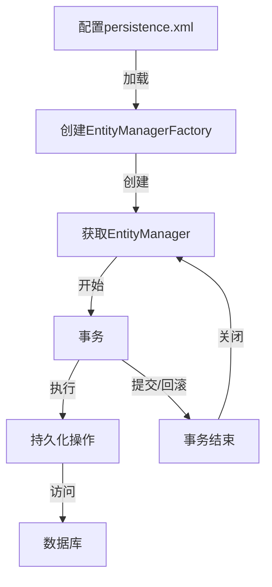

import Tabs from '@theme/Tabs';
import TabItem from '@theme/TabItem';
import CodeBlock from '@theme/CodeBlock';

# JPA详解

JPA（Java Persistence API）是Java EE标准中定义的ORM规范，为开发者提供了持久化对象与关系型数据库之间映射的标准方法。作为一套规范而非具体实现，JPA通过各种提供者（如Hibernate、EclipseLink、OpenJPA等）实际实现其功能，使应用程序能够以统一的方式访问不同的ORM框架。

:::tip 核心价值
**JPA = 标准化API + ORM映射规范 + JPQL查询语言 + 生命周期管理**
- 🔄 **标准化接口**：提供统一的对象关系映射API，减少特定ORM实现依赖
- 📊 **简化数据访问**：通过注解和XML配置映射对象与数据库表
- 🔍 **强大查询能力**：JPQL和Criteria API提供类型安全的查询构建
- 🚀 **可移植性**：应用代码可在不同JPA实现间迁移
:::

## 1. JPA基础与架构

### 1.1 JPA概念与定位

JPA（Java Persistence API）是在JDK 5.0中引入的Java EE标准规范，旨在简化和标准化Java应用中的对象关系映射（ORM）开发。它解决了Java应用程序与关系型数据库之间的阻抗不匹配问题，使开发者可以使用面向对象的方式处理关系数据。

JPA的主要目标是：
- 定义标准化的ORM接口，减少应用程序对特定ORM实现的依赖
- 简化数据访问层的开发，提高代码可维护性
- 提供统一的查询语言和对象管理功能
- 实现应用程序在不同持久化提供者之间的可移植性

#### 1.1.1 JPA与其他持久化技术对比

| 特性 | JPA | Hibernate | MyBatis | 纯JDBC |
|------|-----|-----------|---------|--------|
| **类型** | 规范 | 框架(JPA实现) | SQL映射框架 | 底层API |
| **抽象级别** | 高 | 高 | 中 | 低 |
| **学习曲线** | 中等 | 陡峭 | 平缓 | 简单 |
| **标准化程度** | 标准规范 | 遵循JPA规范 | 非标准 | 标准API |
| **SQL控制** | 自动生成 | 自动生成 | 手动编写 | 完全手动 |
| **性能控制** | 中等 | 中等 | 高 | 完全控制 |
| **配置方式** | 注解/XML | 注解/XML | XML/注解 | 代码配置 |
| **可移植性** | 高 | 中 | 低 | 高 |
| **适用场景** | 企业应用 | 复杂对象模型 | SQL优化场景 | 底层控制 |

### 1.2 JPA架构与核心组件

JPA定义了一套完整的对象关系映射组件和API，包括：

#### 1.2.1 核心接口

:::info JPA核心接口架构
JPA的核心接口体系包括：
- **EntityManagerFactory**：创建EntityManager实例的工厂
- **EntityManager**：管理实体生命周期的核心接口
- **EntityTransaction**：控制事务操作
- **Query**与**TypedQuery**：执行查询操作
- **Persistence**：引导类，创建EntityManagerFactory
:::

1. **EntityManagerFactory**：
   - 创建EntityManager实例的工厂
   - 线程安全，通常在应用程序启动时创建一次
   - 对应一个持久化单元（persistence unit）
   - 初始化成本高，应被缓存并重用

2. **EntityManager**：
   - JPA的核心接口，管理实体的持久化操作
   - 相当于Hibernate的Session
   - 非线程安全，通常与事务绑定
   - 提供实体的CRUD操作、查询功能和事务管理

3. **EntityTransaction**：
   - 管理资源层事务操作
   - 控制事务的开始、提交和回滚
   - 仅在非JTA环境中使用

4. **Query**与**TypedQuery**：
   - 执行JPQL查询和原生SQL查询
   - TypedQuery提供类型安全的查询结果

5. **Persistence**：
   - 引导类，用于获取EntityManagerFactory
   - 读取persistence.xml配置文件

#### 1.2.2 JPA实现

JPA只是一套规范，需要具体的实现才能使用。市场上主要的JPA实现包括：

| 实现 | 组织 | 特点 | 市场份额 |
|-----|-----|------|---------|
| **Hibernate** | Red Hat | 最成熟、功能最丰富的JPA实现 | 高 |
| **EclipseLink** | Eclipse Foundation | JPA参考实现，来自TopLink | 中 |
| **OpenJPA** | Apache Software Foundation | 轻量级实现，扩展性好 | 低 |
| **DataNucleus** | DataNucleus | 支持多种数据存储类型 | 低 |

#### 1.2.3 工作流程

JPA的典型工作流程如下：



1. 配置persistence.xml定义持久化单元
2. 通过Persistence类创建EntityManagerFactory
3. 从EntityManagerFactory获取EntityManager
4. 开始事务
5. 执行持久化操作（CRUD）
6. 提交或回滚事务
7. 关闭EntityManager

### 1.3 JPA实体生命周期

JPA定义了实体对象的四种状态，描述实体在持久化过程中的不同阶段。

#### 1.3.1 实体状态

1. **新建态(New/Transient)**：
   - 刚创建的对象，未与EntityManager关联
   - 没有持久化标识符或数据库表示
   - 对此对象的更改不会影响数据库

```java
// 新建态实体
User user = new User();
user.setName("张三");
// 此时对象不在EntityManager管理下，对其修改不会反映到数据库
```

2. **托管态(Managed)**：
   - 与当前EntityManager上下文关联的实体
   - 有持久化标识符，对象状态被EntityManager跟踪
   - 对托管态实体的更改会在事务提交时同步到数据库

```java
EntityManager em = emf.createEntityManager();
EntityTransaction tx = em.getTransaction();
tx.begin();

// 通过persist()方法使对象进入托管态
em.persist(user);
// 或通过find()方法获取的对象直接处于托管态
User managedUser = em.find(User.class, 1L);

// 托管态对象的修改会被自动跟踪
managedUser.setEmail("zhangsan@example.com");
// 不需要显式update，修改会在事务提交时同步到数据库

tx.commit();
```

3. **游离态(Detached)**：
   - 曾经处于托管态，但当前不在EntityManager管理下
   - 有持久化标识符，但修改不会同步到数据库
   - 通过显式调用merge()方法可重新变为托管态

```java
// EntityManager关闭后，托管态对象变为游离态
em.close();
// 此时managedUser已经是游离态
managedUser.setPhone("13800138000");
// 这个修改不会被同步到数据库

// 重新获取EntityManager
EntityManager newEm = emf.createEntityManager();
EntityTransaction newTx = newEm.getTransaction();
newTx.begin();

// 将游离态对象重新变为托管态
User mergedUser = newEm.merge(managedUser);
// 现在mergedUser是托管态，而managedUser仍然是游离态

newTx.commit();
newEm.close();
```

4. **移除态(Removed)**：
   - 被EntityManager标记为待删除的实体
   - 事务提交后将从数据库中删除

```java
EntityManager em = emf.createEntityManager();
EntityTransaction tx = em.getTransaction();
tx.begin();

User user = em.find(User.class, 1L);
// 标记对象为移除态
em.remove(user);
// 事务提交后，数据会从数据库中删除
tx.commit();
em.close();
```

#### 1.3.2 状态转换

以下是对象状态转换的主要方法：

- **新建态→托管态**：`persist()`
- **托管态→游离态**：`clear()`, `close()`, `detach()`
- **游离态→托管态**：`merge()`
- **托管态→移除态**：`remove()`
- **新建态/游离态→托管态**：`merge()`

:::info JPA实体生命周期
实体生命周期状态图：
1. **新建态(New/Transient)** - 刚创建的对象，未与持久化上下文关联
2. **托管态(Managed)** - 被EntityManager管理的对象，自动跟踪变更
3. **游离态(Detached)** - 曾经被管理但当前不在持久化上下文中的对象
4. **移除态(Removed)** - 被标记为删除的对象，事务提交时将从数据库中删除

状态转换由EntityManager的方法触发，如persist()、merge()、remove()等。
:::

### 1.4 环境搭建与配置

#### 1.4.1 Maven依赖

在Maven项目中添加JPA依赖：

```xml
<!-- JPA API -->
<dependency>
    <groupId>jakarta.persistence</groupId>
    <artifactId>jakarta.persistence-api</artifactId>
    <version>3.1.0</version>
</dependency>

<!-- Hibernate实现（或其他JPA实现） -->
<dependency>
    <groupId>org.hibernate</groupId>
    <artifactId>hibernate-core-jakarta</artifactId>
    <version>5.6.15.Final</version>
</dependency>

<!-- 数据库驱动（以MySQL为例） -->
<dependency>
    <groupId>mysql</groupId>
    <artifactId>mysql-connector-java</artifactId>
    <version>8.0.30</version>
</dependency>
```

#### 1.4.2 配置persistence.xml

创建`src/main/resources/META-INF/persistence.xml`文件：

```xml
<persistence xmlns="https://jakarta.ee/xml/ns/persistence"
             xmlns:xsi="http://www.w3.org/2001/XMLSchema-instance"
             xsi:schemaLocation="https://jakarta.ee/xml/ns/persistence
                                 https://jakarta.ee/xml/ns/persistence/persistence_3_0.xsd"
             version="3.0">
    <persistence-unit name="myPersistenceUnit" transaction-type="RESOURCE_LOCAL">
        <!-- JPA提供者 -->
        <provider>org.hibernate.jpa.HibernatePersistenceProvider</provider>
        
        <!-- 实体类 -->
        <class>com.example.entity.User</class>
        <class>com.example.entity.Order</class>
        
        <properties>
            <!-- 数据库连接配置 -->
            <property name="jakarta.persistence.jdbc.driver" value="com.mysql.cj.jdbc.Driver" />
            <property name="jakarta.persistence.jdbc.url" value="jdbc:mysql://localhost:3306/testdb?useSSL=false&amp;serverTimezone=UTC" />
            <property name="jakarta.persistence.jdbc.user" value="root" />
            <property name="jakarta.persistence.jdbc.password" value="password" />
            
            <!-- 特定于Hibernate的属性 -->
            <property name="hibernate.dialect" value="org.hibernate.dialect.MySQL8Dialect" />
            <property name="hibernate.show_sql" value="true" />
            <property name="hibernate.format_sql" value="true" />
            
            <!-- 自动生成数据库模式 -->
            <property name="hibernate.hbm2ddl.auto" value="update" />
        </properties>
    </persistence-unit>
</persistence>
```

#### 1.4.3 创建EntityManager

```java
// 创建EntityManagerFactory
EntityManagerFactory emf = Persistence.createEntityManagerFactory("myPersistenceUnit");

// 获取EntityManager
EntityManager em = emf.createEntityManager();

try {
    // 使用EntityManager执行操作
    EntityTransaction tx = em.getTransaction();
    tx.begin();
    
    // 执行持久化操作...
    
    tx.commit();
} catch (Exception e) {
    if (em.getTransaction().isActive()) {
        em.getTransaction().rollback();
    }
    e.printStackTrace();
} finally {
    // 关闭EntityManager
    em.close();
}

// 应用关闭时关闭EntityManagerFactory
emf.close();
```

#### 1.4.4 主要配置选项

| 配置项 | 说明 | 示例值 |
|-------|------|-------|
| `jakarta.persistence.jdbc.driver` | JDBC驱动类 | com.mysql.cj.jdbc.Driver |
| `jakarta.persistence.jdbc.url` | 数据库连接URL | jdbc:mysql://localhost:3306/testdb |
| `jakarta.persistence.jdbc.user` | 数据库用户名 | root |
| `jakarta.persistence.jdbc.password` | 数据库密码 | password |
| `hibernate.dialect` | 数据库方言 | org.hibernate.dialect.MySQL8Dialect |
| `hibernate.show_sql` | 显示SQL | true, false |
| `hibernate.format_sql` | 格式化SQL | true, false |
| `hibernate.hbm2ddl.auto` | 自动生成模式 | create, update, validate, none |
| `hibernate.connection.pool_size` | 连接池大小 | 5, 10, 20 |
| `jakarta.persistence.schema-generation.database.action` | 标准模式生成选项 | none, create, drop-and-create |

## 2. JPA实体映射

JPA提供了丰富的注解和XML配置，用于将Java类映射到数据库表。实体映射是JPA的核心功能之一。

### 2.1 基本注解映射

#### 2.1.1 实体类定义

```java
import jakarta.persistence.*;
import java.time.LocalDateTime;

@Entity // 声明这是一个实体类
@Table(name = "users") // 映射到数据库中的表名
public class User {
    
    @Id // 声明主键
    @GeneratedValue(strategy = GenerationType.IDENTITY) // 主键生成策略
    private Long id;
    
    @Column(name = "username", nullable = false, length = 50) // 列定义
    private String username;
    
    @Column(name = "email", unique = true)
    private String email;
    
    @Temporal(TemporalType.TIMESTAMP) // 时态类型（JPA 2.1之前的日期类型映射）
    @Column(name = "created_at")
    private java.util.Date legacyDate;
    
    // JPA 2.2+支持Java 8日期时间API
    @Column(name = "registration_date")
    private LocalDateTime registrationDate;
    
    @Enumerated(EnumType.STRING) // 枚举类型映射
    @Column(name = "status")
    private UserStatus status;
    
    @Transient // 非持久化字段
    private String temporaryData;
    
    @Basic(fetch = FetchType.LAZY) // 懒加载的基本字段
    @Column(name = "bio", length = 5000)
    private String biography;
    
    // 构造函数、Getter和Setter省略...
}

// 枚举类
public enum UserStatus {
    ACTIVE, INACTIVE, SUSPENDED
}
```

#### 2.1.2 主键生成策略

JPA支持多种主键生成策略：

```java
// 自增长（依赖数据库的自增特性）
@Id
@GeneratedValue(strategy = GenerationType.IDENTITY)
private Long id;

// 序列生成器（适用于Oracle等支持序列的数据库）
@Id
@GeneratedValue(strategy = GenerationType.SEQUENCE, generator = "user_seq")
@SequenceGenerator(name = "user_seq", sequenceName = "USER_SEQ", allocationSize = 1)
private Long id;

// 表生成器（独立于特定数据库）
@Id
@GeneratedValue(strategy = GenerationType.TABLE, generator = "user_gen")
@TableGenerator(name = "user_gen", table = "id_generator", 
                pkColumnName = "gen_name", pkColumnValue = "user_id",
                valueColumnName = "gen_value", allocationSize = 1)
private Long id;

// 自动选择（让JPA提供者选择适当的策略）
@Id
@GeneratedValue(strategy = GenerationType.AUTO)
private Long id;

// UUID生成（需要自定义实现）
@Id
@Column(length = 36)
private String id;

@PrePersist
protected void onCreate() {
    if (id == null) {
        id = UUID.randomUUID().toString();
    }
}
```

#### 2.1.3 字段映射

JPA提供了多种字段映射注解：

```java
@Entity
public class Product {
    // 基本类型映射
    @Column(name = "product_name", nullable = false, length = 100)
    private String name;
    
    @Column(precision = 10, scale = 2) // 数值精度
    private BigDecimal price;
    
    // 大文本映射
    @Lob
    @Column(name = "description")
    private String description;
    
    // 大二进制对象
    @Lob
    @Basic(fetch = FetchType.LAZY) // 懒加载
    private byte[] image;
    
    // 枚举映射（按名称）
    @Enumerated(EnumType.STRING)
    private ProductCategory category;
    
    // 枚举映射（按序号）
    @Enumerated(EnumType.ORDINAL)
    private ProductStatus status;
    
    // 日期时间映射（Java 8+）
    private LocalDate releaseDate;
    private LocalDateTime lastUpdated;
    private Instant createdAt;
    
    // 内嵌对象
    @Embedded
    private Audit audit;
}

@Embeddable
public class Audit {
    @Column(name = "created_by")
    private String createdBy;
    
    @Column(name = "created_at")
    private LocalDateTime createdAt;
    
    @Column(name = "updated_by")
    private String updatedBy;
    
    @Column(name = "updated_at")
    private LocalDateTime updatedAt;
}
```

### 2.2 关联关系映射

JPA支持定义实体间的多种关系类型。

#### 2.2.1 一对一关系(@OneToOne)

```java
// 基于外键的一对一映射
@Entity
@Table(name = "users")
public class User {
    @Id
    @GeneratedValue(strategy = GenerationType.IDENTITY)
    private Long id;
    
    private String username;
    
    // 用户和用户详情的一对一关系
    @OneToOne(cascade = CascadeType.ALL, fetch = FetchType.LAZY)
    @JoinColumn(name = "profile_id")
    private UserProfile profile;
    
    // Getters和Setters省略...
}

@Entity
@Table(name = "user_profiles")
public class UserProfile {
    @Id
    @GeneratedValue(strategy = GenerationType.IDENTITY)
    private Long id;
    
    private String biography;
    private String avatarUrl;
    
    // 双向关联（可选）
    @OneToOne(mappedBy = "profile")
    private User user;
    
    // Getters和Setters省略...
}
```

#### 2.2.2 一对多/多对一关系(@OneToMany/@ManyToOne)

```java
// 部门与员工的一对多关系
@Entity
@Table(name = "departments")
public class Department {
    @Id
    @GeneratedValue(strategy = GenerationType.IDENTITY)
    private Long id;
    
    private String name;
    
    // 一个部门有多个员工
    @OneToMany(mappedBy = "department", cascade = CascadeType.ALL, orphanRemoval = true)
    private List<Employee> employees = new ArrayList<>();
    
    // 便捷方法管理关系
    public void addEmployee(Employee employee) {
        employees.add(employee);
        employee.setDepartment(this);
    }
    
    public void removeEmployee(Employee employee) {
        employees.remove(employee);
        employee.setDepartment(null);
    }
    
    // Getters和Setters省略...
}

@Entity
@Table(name = "employees")
public class Employee {
    @Id
    @GeneratedValue(strategy = GenerationType.IDENTITY)
    private Long id;
    
    private String name;
    private String position;
    
    // 多个员工属于一个部门
    @ManyToOne(fetch = FetchType.LAZY)
    @JoinColumn(name = "department_id")
    private Department department;
    
    // Getters和Setters省略...
}
```

#### 2.2.3 多对多关系(@ManyToMany)

```java
// 学生和课程的多对多关系
@Entity
@Table(name = "students")
public class Student {
    @Id
    @GeneratedValue(strategy = GenerationType.IDENTITY)
    private Long id;
    
    private String name;
    
    @ManyToMany(cascade = {CascadeType.PERSIST, CascadeType.MERGE})
    @JoinTable(
        name = "student_course", 
        joinColumns = @JoinColumn(name = "student_id"),
        inverseJoinColumns = @JoinColumn(name = "course_id")
    )
    private Set<Course> courses = new HashSet<>();
    
    // 便捷方法管理关系
    public void addCourse(Course course) {
        courses.add(course);
        course.getStudents().add(this);
    }
    
    public void removeCourse(Course course) {
        courses.remove(course);
        course.getStudents().remove(this);
    }
    
    // Getters和Setters省略...
}

@Entity
@Table(name = "courses")
public class Course {
    @Id
    @GeneratedValue(strategy = GenerationType.IDENTITY)
    private Long id;
    
    private String name;
    private int credits;
    
    @ManyToMany(mappedBy = "courses")
    private Set<Student> students = new HashSet<>();
    
    // Getters和Setters省略...
}
```

#### 2.2.4 级联操作与孤儿删除

JPA通过级联（Cascade）选项控制关联对象的操作传播：

```java
// 级联所有操作（创建、更新、删除等）
@OneToMany(mappedBy = "parent", cascade = CascadeType.ALL)

// 级联特定操作
@OneToMany(mappedBy = "parent", 
           cascade = {CascadeType.PERSIST, CascadeType.MERGE})

// 孤儿删除（当子对象不再被引用时自动删除）
@OneToMany(mappedBy = "parent", orphanRemoval = true)
```

主要的级联选项：
- **CascadeType.PERSIST**：级联保存
- **CascadeType.MERGE**：级联更新
- **CascadeType.REMOVE**：级联删除
- **CascadeType.REFRESH**：级联刷新
- **CascadeType.DETACH**：级联脱管
- **CascadeType.ALL**：包含所有级联操作 