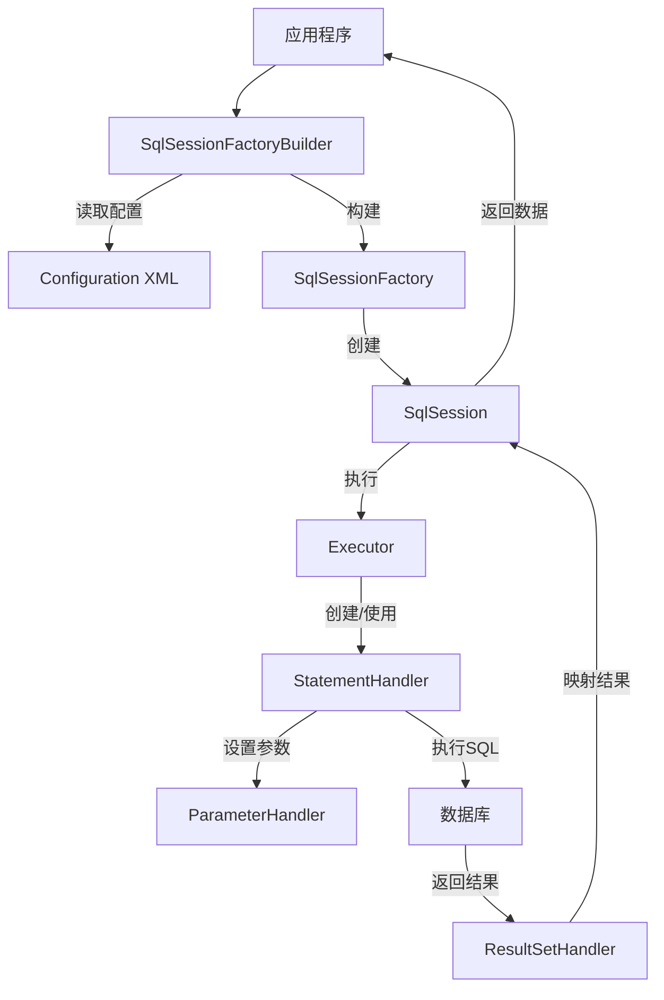
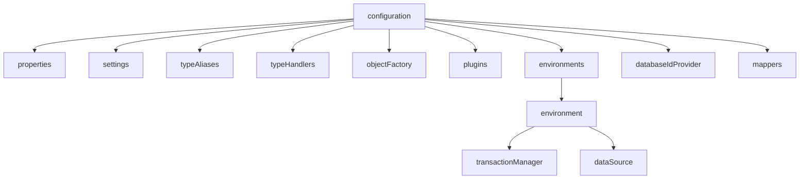
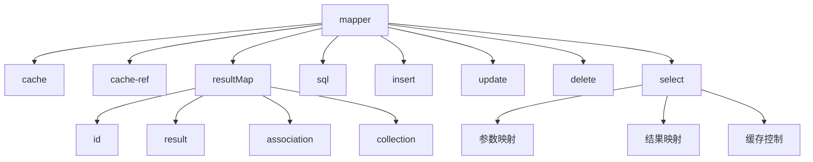
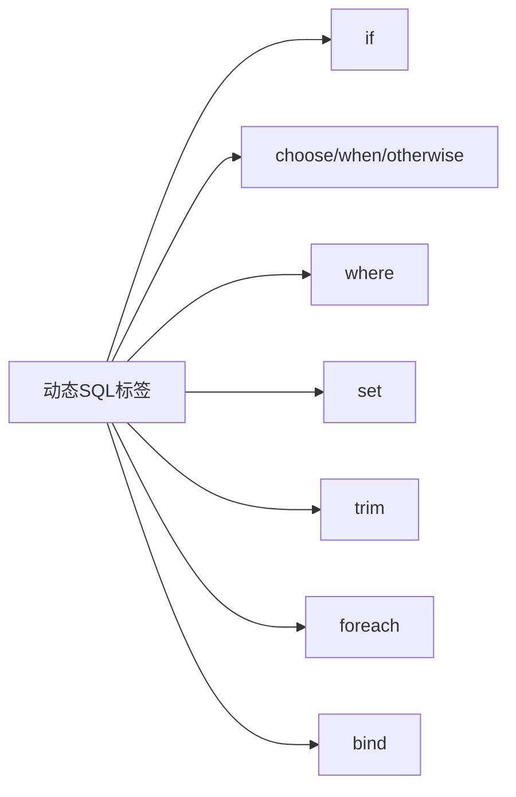
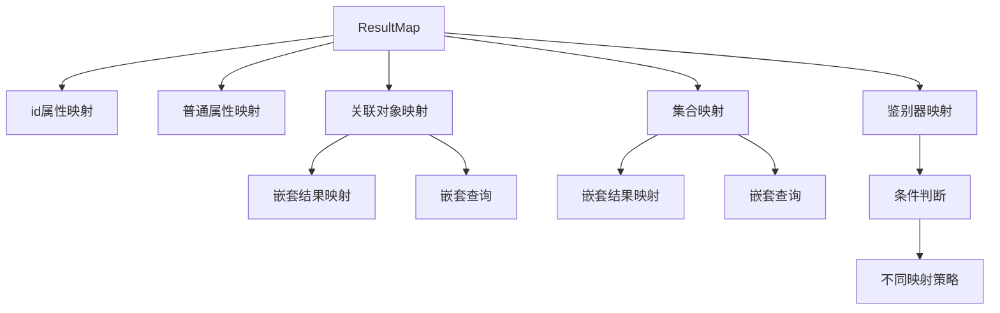
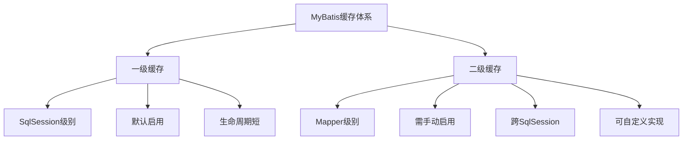
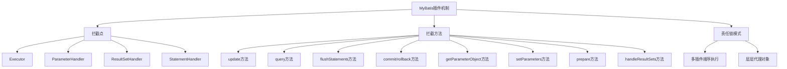

import Tabs from '@theme/Tabs';
import TabItem from '@theme/TabItem';
import CodeBlock from '@theme/CodeBlock';

# MyBatis框架详解

MyBatis是一款优秀的持久层框架，支持自定义SQL、存储过程以及高级映射。MyBatis避免了几乎所有的JDBC代码和手动设置参数以及获取结果集，通过简单的XML配置或注解，将接口与SQL语句进行映射，专注于SQL本身，赋予开发者更多的控制权和灵活性。

:::tip 核心价值
**MyBatis = 灵活SQL + 简化JDBC + 优雅映射 + 动态查询**
- 🚀 **半自动ORM**：手写SQL，自动映射结果集，控制与灵活并存
- 🎯 **动态SQL**：强大的条件判断、循环、分支能力，生成复杂查询
- 💡 **优雅设计**：接口与实现分离，仅需定义接口，无需实现类
- 🔧 **可插拔架构**：插件机制支持自定义拦截和处理，易于扩展
- 🛡️ **缓存支持**：一级缓存与二级缓存，提升查询性能
:::

## 1. MyBatis核心原理与架构

MyBatis是一个优秀的持久层框架，其核心设计理念是将SQL与代码分离，同时提供简单而强大的映射机制。理解MyBatis的架构和原理对于正确高效地使用它至关重要。



### 1.1 MyBatis工作原理

MyBatis的工作流程可以概括为以下几个关键步骤：

<Tabs>
<TabItem value="build" label="构建阶段">

```java title="SqlSessionFactory构建过程"
// 1. 创建SqlSessionFactoryBuilder对象
SqlSessionFactoryBuilder builder = new SqlSessionFactoryBuilder();

// 2. 加载mybatis-config.xml配置文件
InputStream inputStream = Resources.getResourceAsStream("mybatis-config.xml");

// 3. 构建SqlSessionFactory对象
SqlSessionFactory factory = builder.build(inputStream);
```

在构建阶段，MyBatis会完成以下工作：
1. 解析配置文件中的标签
2. 创建Configuration对象
3. 加载映射文件和注解配置
4. 初始化内置组件
5. 创建SqlSessionFactory实例

</TabItem>
<TabItem value="runtime" label="运行阶段">

```java title="SqlSession使用过程"
// 1. 获取SqlSession
try (SqlSession session = factory.openSession()) {
    // 2. 获取Mapper接口
    UserMapper mapper = session.getMapper(UserMapper.class);
    
    // 3. 执行SQL
    User user = mapper.getUserById(1);
    
    // 4. 提交事务
    session.commit();
}
```

在运行阶段，MyBatis会完成以下工作：
1. 创建SqlSession实例
2. 创建Executor执行器
3. 创建StatementHandler处理SQL语句
4. 参数映射和设置
5. 执行SQL并获取结果
6. 结果集映射转换
7. 返回业务对象

</TabItem>
</Tabs>

MyBatis通过动态代理技术实现了只需定义接口而无需编写实现类的便利特性。当我们调用Mapper接口方法时，MyBatis会拦截该调用，找到对应的SQL语句并执行，然后将结果映射为指定的对象。

### 1.2 核心组件剖析

MyBatis的核心组件构成了其完整的功能体系，每个组件负责特定的功能：

| 核心组件 | 主要功能 | 生命周期 | 关键特性 |
|--------|---------|---------|---------|
| **Configuration** | 全局配置信息 | 全局唯一 | 包含所有配置和映射信息 |
| **SqlSessionFactory** | 创建SqlSession | 全局唯一 | 线程安全，可重用 |
| **SqlSession** | 提供SQL执行方法 | 请求级别 | 非线程安全，短暂 |
| **Executor** | 执行器 | 请求级别 | 维护缓存，执行SQL |
| **StatementHandler** | 处理SQL语句 | 方法级别 | 创建Statement对象 |
| **ParameterHandler** | 处理SQL参数 | 方法级别 | 设置预编译参数 |
| **ResultSetHandler** | 处理结果集映射 | 方法级别 | 将结果集转为对象 |
| **TypeHandler** | 类型转换 | 全局可用 | Java与JDBC类型转换 |
| **MappedStatement** | 映射语句 | 全局可用 | 封装SQL和映射信息 |

:::tip 组件关系要点
- **SqlSessionFactory**：单例模式，应用级生命周期
- **SqlSession**：非线程安全，需要在方法作用域内使用
- **Mapper**：由SqlSession创建的代理对象，依赖于SqlSession生命周期
:::

### 1.3 执行流程详解

MyBatis的执行流程可以详细分解为以下步骤：

1. **初始化阶段**
   - 解析配置文件创建Configuration对象
   - 加载Mapper映射文件或注解
   - 解析SQL语句创建MappedStatement对象
   - 构建SqlSessionFactory实例

2. **执行阶段**
   - 通过SqlSessionFactory创建SqlSession
   - 通过SqlSession获取Mapper代理对象
   - 调用Mapper方法执行SQL
   - SqlSession将请求转交给Executor执行器
   - Executor调用StatementHandler处理SQL语句
   - ParameterHandler设置参数
   - 执行SQL语句
   - ResultSetHandler将结果集转换为对象
   - 返回执行结果给调用者

<CodeBlock language="java" title="完整执行流程示例">
{`// 1. 读取MyBatis配置文件
String resource = "mybatis-config.xml";
InputStream inputStream = Resources.getResourceAsStream(resource);

// 2. 构建SqlSessionFactory
SqlSessionFactory sqlSessionFactory = new SqlSessionFactoryBuilder().build(inputStream);

// 3. 获取SqlSession
try (SqlSession sqlSession = sqlSessionFactory.openSession()) {
    // 4. 获取Mapper代理对象
    UserMapper mapper = sqlSession.getMapper(UserMapper.class);
    
    // 5. 执行SQL
    User user = mapper.getUserById(1);
    
    // 6. 处理结果
    System.out.println(user);
    
    // 7. 提交事务
    sqlSession.commit();
}`}
</CodeBlock>

当调用`mapper.getUserById(1)`时，MyBatis内部会：
1. 通过动态代理拦截该方法调用
2. 根据方法签名找到对应的MappedStatement
3. 创建SqlSource生成SQL语句
4. 设置参数并执行SQL
5. 将结果集映射为User对象
6. 返回结果给调用者

## 2. 配置体系详解

MyBatis的配置体系是其灵活性和可扩展性的关键。全局配置文件是MyBatis配置的入口，包含了多种配置元素，可以根据不同环境和需求进行定制。

### 2.1 全局配置文件

MyBatis全局配置文件（通常命名为mybatis-config.xml）结构清晰，各元素有严格的顺序要求：



<CodeBlock language="xml" title="mybatis-config.xml完整示例">
{`<?xml version="1.0" encoding="UTF-8" ?>
<!DOCTYPE configuration
  PUBLIC "-//mybatis.org//DTD Config 3.0//EN"
  "http://mybatis.org/dtd/mybatis-3-config.dtd">
<configuration>
  <!-- 引入外部属性文件 -->
  <properties resource="db.properties">
    <property name="username" value="dev_user"/>
    <property name="password" value="dev_password"/>
  </properties>
  
  <!-- 全局设置 -->
  <settings>
    <setting name="cacheEnabled" value="true"/>
    <setting name="lazyLoadingEnabled" value="true"/>
    <setting name="mapUnderscoreToCamelCase" value="true"/>
  </settings>
  
  <!-- 类型别名 -->
  <typeAliases>
    <package name="com.example.model"/>
  </typeAliases>
  
  <!-- 类型处理器 -->
  <typeHandlers>
    <typeHandler handler="com.example.handler.JsonTypeHandler"/>
  </typeHandlers>
  
  <!-- 插件 -->
  <plugins>
    <plugin interceptor="com.example.plugin.PageInterceptor">
      <property name="dialect" value="mysql"/>
    </plugin>
  </plugins>
  
  <!-- 环境配置 -->
  <environments default="development">
    <environment id="development">
              <transactionManager type="JDBC"/>
        <dataSource type="POOLED">
          <property name="driver" value="com.mysql.cj.jdbc.Driver"/>
          <property name="url" value="jdbc:mysql://localhost:3306/mydb"/>
          <property name="username" value="root"/>
          <property name="password" value="password"/>
      </dataSource>
    </environment>
  </environments>
  
  <!-- 数据库厂商标识 -->
  <databaseIdProvider type="DB_VENDOR">
    <property name="MySQL" value="mysql"/>
    <property name="Oracle" value="oracle"/>
    <property name="SQL Server" value="sqlserver"/>
  </databaseIdProvider>
  
  <!-- 映射器 -->
  <mappers>
    <mapper resource="com/example/mapper/UserMapper.xml"/>
    <package name="com.example.mapper"/>
  </mappers>
</configuration>`}
</CodeBlock>

:::warning 注意
配置元素必须按照上述顺序定义，否则MyBatis会抛出异常！
:::

### 2.2 环境与数据源配置

MyBatis支持多环境配置，可以为不同的开发阶段（开发、测试、生产）配置不同的数据源和事务管理器。

<Tabs>
<TabItem value="environments" label="环境配置">

```xml title="多环境配置"
<environments default="development">
  <!-- 开发环境 -->
  <environment id="development">
    <transactionManager type="JDBC"/>
    <dataSource type="POOLED">
      <property name="driver" value="com.mysql.cj.jdbc.Driver"/>
      <property name="url" value="jdbc:mysql://localhost:3306/dev_db"/>
      <property name="username" value="dev_user"/>
      <property name="password" value="dev_password"/>
    </dataSource>
  </environment>
  
  <!-- 测试环境 -->
  <environment id="test">
    <transactionManager type="JDBC"/>
    <dataSource type="POOLED">
      <property name="driver" value="com.mysql.cj.jdbc.Driver"/>
      <property name="url" value="jdbc:mysql://test-server:3306/test_db"/>
      <property name="username" value="test_user"/>
      <property name="password" value="test_password"/>
    </dataSource>
  </environment>
  
  <!-- 生产环境 -->
  <environment id="production">
    <transactionManager type="MANAGED"/>
    <dataSource type="JNDI">
      <property name="data_source" value="java:comp/env/jdbc/ProductionDB"/>
    </dataSource>
  </environment>
</environments>
```

</TabItem>
<TabItem value="transaction" label="事务管理器">

MyBatis支持两种类型的事务管理器：

1. **JDBC**：直接使用JDBC的事务管理机制，依赖于数据库连接的commit和rollback
```xml
<transactionManager type="JDBC"/>
```

2. **MANAGED**：将事务管理交给容器（如Spring或JEE容器）
```xml
<transactionManager type="MANAGED">
  <property name="closeConnection" value="false"/>
</transactionManager>
```

</TabItem>
<TabItem value="datasource" label="数据源配置">

MyBatis内置了三种数据源类型：

1. **UNPOOLED**：不使用连接池，每次请求时打开和关闭连接
```xml
<dataSource type="UNPOOLED">
  <property name="driver" value="com.mysql.cj.jdbc.Driver"/>
  <property name="url" value="jdbc:mysql://localhost:3306/mydb"/>
  <property name="username" value="root"/>
  <property name="password" value="password"/>
</dataSource>
```

2. **POOLED**：使用MyBatis内置的简单数据库连接池
```xml
<dataSource type="POOLED">
  <property name="driver" value="com.mysql.cj.jdbc.Driver"/>
  <property name="url" value="jdbc:mysql://localhost:3306/mydb"/>
  <property name="username" value="root"/>
  <property name="password" value="password"/>
  <property name="poolMaximumActiveConnections" value="10"/>
  <property name="poolMaximumIdleConnections" value="5"/>
</dataSource>
```

3. **JNDI**：通过JNDI查找数据源，主要用于应用服务器环境
```xml
<dataSource type="JNDI">
  <property name="data_source" value="java:comp/env/jdbc/MyDataSource"/>
</dataSource>
```

</TabItem>
</Tabs>

在实际项目中，可以通过在构建SqlSessionFactory时指定环境ID来选择使用哪个环境：

```java
String resource = "mybatis-config.xml";
InputStream inputStream = Resources.getResourceAsStream(resource);
// 使用production环境
SqlSessionFactory factory = new SqlSessionFactoryBuilder().build(inputStream, "production");
```

### 2.3 类型处理器与别名

类型别名和类型处理器是MyBatis简化代码和扩展类型转换能力的两个重要机制。

<Tabs>
<TabItem value="aliases" label="类型别名">

类型别名为Java类型设置一个简短的名字，减少冗长类名的重复输入。

```xml title="类型别名配置"
<typeAliases>
  <!-- 单个别名定义 -->
  <typeAlias alias="User" type="com.example.model.User"/>
  
  <!-- 批量定义包下所有类的别名 -->
  <package name="com.example.model"/>
</typeAliases>
```

MyBatis内置了常见Java类型的别名：

| 别名 | 映射的类型 |
|-----|-----------|
| string | String |
| long | Long |
| int | Integer |
| boolean | Boolean |
| date | Date |
| decimal | BigDecimal |
| map | Map |
| list | List |

</TabItem>
<TabItem value="handlers" label="类型处理器">

类型处理器用于Java类型与JDBC类型之间的转换，MyBatis内置了常见类型的处理器，也支持自定义：

```xml title="类型处理器配置"
<typeHandlers>
  <!-- 注册单个类型处理器 -->
  <typeHandler handler="com.example.handler.JsonTypeHandler" javaType="Object" jdbcType="VARCHAR"/>
  
  <!-- 注册包中所有类型处理器 -->
  <package name="com.example.handler"/>
</typeHandlers>
```

自定义类型处理器示例：

```java title="自定义JSON类型处理器"
public class JsonTypeHandler<T> extends BaseTypeHandler<T> {
    private Class<T> clazz;
    private ObjectMapper objectMapper = new ObjectMapper();
    
    public JsonTypeHandler(Class<T> clazz) {
        this.clazz = clazz;
    }
    
    @Override
    public void setNonNullParameter(PreparedStatement ps, int i, T parameter, JdbcType jdbcType) throws SQLException {
        try {
            ps.setString(i, objectMapper.writeValueAsString(parameter));
        } catch (JsonProcessingException e) {
            throw new SQLException("Error converting JSON", e);
        }
    }
    
    @Override
    public T getNullableResult(ResultSet rs, String columnName) throws SQLException {
        return parseJson(rs.getString(columnName));
    }
    
    @Override
    public T getNullableResult(ResultSet rs, int columnIndex) throws SQLException {
        return parseJson(rs.getString(columnIndex));
    }
    
    @Override
    public T getNullableResult(CallableStatement cs, int columnIndex) throws SQLException {
        return parseJson(cs.getString(columnIndex));
    }
    
    private T parseJson(String json) throws SQLException {
        if (json == null) return null;
        try {
            return objectMapper.readValue(json, clazz);
        } catch (IOException e) {
            throw new SQLException("Error parsing JSON", e);
        }
    }
}
```

</TabItem>
</Tabs>

### 2.4 插件与日志配置

MyBatis提供了强大的插件机制和灵活的日志配置，可以扩展核心功能并监控SQL执行情况。

<Tabs>
<TabItem value="plugins" label="插件配置">

MyBatis插件是通过拦截器模式实现的，可以拦截核心组件的方法调用：

```xml title="插件配置"
<plugins>
  <!-- 分页插件 -->
  <plugin interceptor="com.github.pagehelper.PageInterceptor">
    <property name="helperDialect" value="mysql"/>
    <property name="reasonable" value="true"/>
  </plugin>
  
  <!-- SQL性能监控插件 -->
  <plugin interceptor="com.example.plugin.SqlPerformanceInterceptor">
    <property name="slowSqlThreshold" value="1000"/>
  </plugin>
</plugins>
```

自定义插件需要实现Interceptor接口，并通过@Intercepts注解指定拦截点：

```java title="SQL执行时间监控插件"
@Intercepts({
    @Signature(type = Executor.class, method = "update", args = {MappedStatement.class, Object.class}),
    @Signature(type = Executor.class, method = "query", args = {MappedStatement.class, Object.class, RowBounds.class, ResultHandler.class})
})
public class SqlPerformanceInterceptor implements Interceptor {
    private long slowSqlThreshold;
    
    @Override
    public Object intercept(Invocation invocation) throws Throwable {
        MappedStatement ms = (MappedStatement) invocation.getArgs()[0];
        Object parameter = invocation.getArgs()[1];
        
        BoundSql boundSql = ms.getBoundSql(parameter);
        String sql = boundSql.getSql();
        
        long start = System.currentTimeMillis();
        Object result = invocation.proceed();
        long end = System.currentTimeMillis();
        long time = end - start;
        
        if (time > slowSqlThreshold) {
            String logMsg = String.format("Slow SQL: %s, Time: %dms", sql, time);
            System.err.println(logMsg);
        }
        
        return result;
    }
    
    @Override
    public Object plugin(Object target) {
        return Plugin.wrap(target, this);
    }
    
    @Override
    public void setProperties(Properties properties) {
        this.slowSqlThreshold = Long.parseLong(properties.getProperty("slowSqlThreshold", "1000"));
    }
}
```

</TabItem>
<TabItem value="logging" label="日志配置">

MyBatis支持多种日志框架，按照查找顺序排列：SLF4J → Log4j2 → Log4j → JDK logging

```xml title="日志配置"
<settings>
  <!-- 指定日志实现 -->
  <setting name="logImpl" value="SLF4J"/>
  
  <!-- 日志前缀 -->
  <setting name="logPrefix" value="MyBatis"/>
</settings>
```

针对特定Mapper或语句的详细日志配置：

```xml title="日志级别配置 (log4j2.xml)"
<Loggers>
  <!-- 为特定Mapper设置日志级别 -->
  <Logger name="com.example.mapper.UserMapper" level="TRACE"/>
  
  <!-- 为所有MyBatis SQL日志设置级别 -->
  <Logger name="org.apache.ibatis" level="DEBUG"/>
</Loggers>
```

通过设置日志级别为TRACE，可以看到以下详细信息：
- SQL语句
- 参数值
- 返回结果
- 性能统计

</TabItem>
</Tabs>

:::tip 配置最佳实践
1. **属性外部化**：使用properties文件存储数据库连接信息
2. **灵活环境配置**：为不同环境（开发、测试、生产）配置不同数据源
3. **启用驼峰命名映射**：设置mapUnderscoreToCamelCase为true
4. **合理使用缓存**：根据业务需求配置二级缓存
5. **适当的日志级别**：开发环境使用DEBUG级别，生产环境使用INFO级别
:::

## 3. 映射文件与SQL构建

MyBatis的核心功能是将SQL语句与Java方法关联起来，提供了XML和注解两种方式来定义SQL映射关系。这种分离式设计使得SQL语句和Java代码能够独立管理和优化。

### 3.1 XML映射文件详解

XML映射文件是MyBatis中定义SQL语句的主要方式，提供了丰富的配置选项和灵活的表达能力。



<CodeBlock language="xml" title="完整的XML映射文件示例">
{`<?xml version="1.0" encoding="UTF-8" ?>
<!DOCTYPE mapper
  PUBLIC "-//mybatis.org//DTD Mapper 3.0//EN"
  "http://mybatis.org/dtd/mybatis-3-mapper.dtd">
<mapper namespace="com.example.mapper.UserMapper">
  <!-- 缓存配置 -->
  <cache
    eviction="LRU"
    flushInterval="60000"
    size="512"
    readOnly="false"/>
  
  <!-- 可重用SQL片段 -->
  <sql id="Base_Column_List">
    id, username, email, phone, create_time, update_time
  </sql>
  
  <!-- 结果映射 -->
  <resultMap id="UserResultMap" type="com.example.model.User">
    <id property="id" column="id" />
    <result property="username" column="username" />
    <result property="email" column="email" />
    <result property="phone" column="phone" />
    <result property="createTime" column="create_time" />
    <result property="updateTime" column="update_time" />
    <!-- 一对一关联 -->
    <association property="profile" javaType="com.example.model.UserProfile">
      <id property="id" column="profile_id" />
      <result property="address" column="address" />
      <result property="avatar" column="avatar" />
    </association>
    <!-- 一对多关联 -->
    <collection property="orders" ofType="com.example.model.Order">
      <id property="id" column="order_id" />
      <result property="orderNo" column="order_no" />
      <result property="amount" column="amount" />
    </collection>
  </resultMap>
  
  <!-- 查询语句 -->
  <select id="getUserById" resultMap="UserResultMap" parameterType="long">
    SELECT 
      u.*, 
      p.id as profile_id, 
      p.address, 
      p.avatar
    FROM user u
    LEFT JOIN user_profile p ON u.id = p.user_id
    WHERE u.id = #{id}
  </select>
  
  <!-- 插入语句 -->
  <insert id="insertUser" parameterType="com.example.model.User" useGeneratedKeys="true" keyProperty="id">
    INSERT INTO user (username, email, phone, create_time)
    VALUES (#{username}, #{email}, #{phone}, #{createTime})
  </insert>
  
  <!-- 更新语句 -->
  <update id="updateUser" parameterType="com.example.model.User">
    UPDATE user
    SET username = #{username},
        email = #{email},
        phone = #{phone},
        update_time = #{updateTime}
    WHERE id = #{id}
  </update>
  
  <!-- 删除语句 -->
  <delete id="deleteUser" parameterType="long">
    DELETE FROM user WHERE id = #{id}
  </delete>
</mapper>`}
</CodeBlock>

<Tabs>
<TabItem value="select" label="查询语句">

查询语句是最常用的SQL操作，MyBatis提供了丰富的配置选项：

```xml title="查询语句详解"
<select 
    id="findUserByCondition"          <!-- 唯一标识，对应Mapper接口方法名 -->
    parameterType="map"               <!-- 参数类型 -->
    resultType="User"                 <!-- 结果类型 -->
    resultMap="UserResultMap"         <!-- 结果映射引用 -->
    flushCache="false"                <!-- 是否刷新缓存 -->
    useCache="true"                   <!-- 是否使用缓存 -->
    timeout="10000"                   <!-- 超时时间(毫秒) -->
    fetchSize="100"                   <!-- 结果集大小 -->
    statementType="PREPARED"          <!-- 语句类型(STATEMENT/PREPARED/CALLABLE) -->
    resultSetType="FORWARD_ONLY">     <!-- 结果集类型 -->
  SELECT 
    <include refid="Base_Column_List"/>
  FROM user
  <where>
    <if test="username != null">
      username LIKE CONCAT('%', #{username}, '%')
    </if>
    <if test="email != null">
      AND email = #{email}
    </if>
    <if test="startTime != null">
      AND create_time >= #{startTime}
    </if>
  </where>
  ORDER BY create_time DESC
  LIMIT #{offset}, #{limit}
</select>
```

</TabItem>
<TabItem value="insert" label="插入语句">

插入语句用于向数据库添加记录，支持自动生成主键：

```xml title="插入语句详解"
<insert 
    id="insertUser"                   <!-- 唯一标识 -->
    parameterType="User"              <!-- 参数类型 -->
    flushCache="true"                 <!-- 是否刷新缓存 -->
    timeout="20000"                   <!-- 超时时间(毫秒) -->
    useGeneratedKeys="true"           <!-- 是否使用自动生成的主键 -->
    keyProperty="id"                  <!-- 自动生成的主键赋值给参数对象的属性 -->
    keyColumn="id">                   <!-- 自动生成主键的列名 -->
  INSERT INTO user (
    username, 
    email, 
    password,
    status,
    create_time
  ) VALUES (
    #{username},
    #{email},
    #{password},
    #{status},
    #{createTime}
  )
</insert>

<!-- 批量插入 -->
<insert id="batchInsertUsers" parameterType="list">
  INSERT INTO user (username, email, password, status, create_time)
  VALUES 
  <foreach collection="list" item="user" separator=",">
    (#{user.username}, #{user.email}, #{user.password}, #{user.status}, #{user.createTime})
  </foreach>
</insert>
```

</TabItem>
<TabItem value="update" label="更新语句">

更新语句用于修改数据库记录：

```xml title="更新语句详解"
<update 
    id="updateUser"                   <!-- 唯一标识 -->
    parameterType="User"              <!-- 参数类型 -->
    flushCache="true"                 <!-- 是否刷新缓存 -->
    timeout="20000">                  <!-- 超时时间(毫秒) -->
  UPDATE user
  <set>
    <if test="username != null">username = #{username},</if>
    <if test="email != null">email = #{email},</if>
    <if test="password != null">password = #{password},</if>
    <if test="status != null">status = #{status},</if>
    update_time = #{updateTime}
  </set>
  WHERE id = #{id}
</update>

<!-- 批量更新 -->
<update id="batchUpdateStatus" parameterType="map">
  UPDATE user
  SET status = #{status}
  WHERE id IN 
  <foreach collection="ids" item="id" open="(" separator="," close=")">
    #{id}
  </foreach>
</update>
```

</TabItem>
<TabItem value="delete" label="删除语句">

删除语句用于删除数据库记录：

```xml title="删除语句详解"
<delete 
    id="deleteUser"                   <!-- 唯一标识 -->
    parameterType="long"              <!-- 参数类型 -->
    flushCache="true"                 <!-- 是否刷新缓存 -->
    timeout="20000">                  <!-- 超时时间(毫秒) -->
  DELETE FROM user
  WHERE id = #{id}
</delete>

<!-- 批量删除 -->
<delete id="batchDeleteUsers" parameterType="list">
  DELETE FROM user
  WHERE id IN
  <foreach collection="list" item="id" open="(" separator="," close=")">
    #{id}
  </foreach>
</delete>
```

</TabItem>
</Tabs>

### 3.2 注解映射方式

MyBatis支持使用Java注解来定义SQL映射，适合于简单的SQL语句，不需要XML文件。

```java title="注解映射示例"
public interface UserMapper {
    
    @Select("SELECT * FROM user WHERE id = #{id}")
    User getUserById(Long id);
    
    @Insert("INSERT INTO user (username, email, phone, create_time) " +
           "VALUES (#{username}, #{email}, #{phone}, #{createTime})")
    @Options(useGeneratedKeys = true, keyProperty = "id")
    int insertUser(User user);
    
    @Update("UPDATE user SET username = #{username}, email = #{email}, " +
           "phone = #{phone}, update_time = #{updateTime} WHERE id = #{id}")
    int updateUser(User user);
    
    @Delete("DELETE FROM user WHERE id = #{id}")
    int deleteUser(Long id);
    
    // 结果映射
    @Select("SELECT * FROM user WHERE id = #{id}")
    @Results(id = "userResultMap", value = {
        @Result(property = "id", column = "id", id = true),
        @Result(property = "username", column = "username"),
        @Result(property = "email", column = "email"),
        @Result(property = "createTime", column = "create_time"),
        @Result(property = "updateTime", column = "update_time")
    })
    User getUserWithMapping(Long id);
    
    // 一对一关联
    @Select("SELECT u.*, p.id as profile_id, p.address, p.avatar FROM user u " +
           "LEFT JOIN user_profile p ON u.id = p.user_id WHERE u.id = #{id}")
    @Results({
        @Result(property = "id", column = "id", id = true),
        @Result(property = "username", column = "username"),
        @Result(property = "email", column = "email"),
        @Result(property = "profile", javaType = UserProfile.class, 
                column = "id", one = @One(select = "getProfileByUserId"))
    })
    User getUserWithProfile(Long id);
    
    @Select("SELECT * FROM user_profile WHERE user_id = #{userId}")
    UserProfile getProfileByUserId(Long userId);
    
    // 一对多关联
    @Select("SELECT * FROM user WHERE id = #{id}")
    @Results({
        @Result(property = "id", column = "id", id = true),
        @Result(property = "username", column = "username"),
        @Result(property = "orders", javaType = List.class, 
                column = "id", many = @Many(select = "getOrdersByUserId"))
    })
    User getUserWithOrders(Long id);
    
    @Select("SELECT * FROM orders WHERE user_id = #{userId}")
    List<Order> getOrdersByUserId(Long userId);
}
```

### 3.3 两种映射方式对比

XML映射和注解映射各有优缺点，选择合适的方式取决于项目需求和团队偏好。

| 特性 | XML映射 | 注解映射 | 说明 |
|-----|---------|---------|------|
| **可读性** | ⭐⭐⭐⭐⭐ | ⭐⭐⭐ | XML更适合大型复杂SQL |
| **维护性** | ⭐⭐⭐⭐ | ⭐⭐⭐ | XML分离SQL与代码，更易维护 |
| **动态SQL** | ⭐⭐⭐⭐⭐ | ⭐⭐ | XML对动态SQL支持更全面 |
| **复杂映射** | ⭐⭐⭐⭐⭐ | ⭐⭐⭐ | XML适合复杂结果映射 |
| **开发效率** | ⭐⭐⭐ | ⭐⭐⭐⭐⭐ | 注解简单快捷 |
| **SQL重用** | ⭐⭐⭐⭐⭐ | ⭐⭐ | XML可提取公共SQL片段 |
| **编译时检查** | ⭐⭐ | ⭐⭐⭐⭐ | 注解可在编译时检查 |
| **适用场景** | 复杂SQL，多表关联 | 简单CRUD，单表操作 | - |

:::tip 最佳实践建议
1. **混合使用**：根据SQL复杂度选择合适的方式
2. **简单操作**：单表的CRUD操作使用注解
3. **复杂查询**：多表关联、动态条件使用XML
4. **团队统一**：项目中保持一致的风格，避免混乱
:::

### 3.4 SQL构建器使用

对于中等复杂度的SQL，MyBatis提供了SQL构建器API，可以通过Java代码动态构建SQL语句，比XML更灵活，比注解更强大。

```java title="SQL构建器示例"
public interface UserMapper {
    
    @SelectProvider(type = UserSqlProvider.class, method = "findByCondition")
    List<User> findByCondition(UserQuery query);
    
    @InsertProvider(type = UserSqlProvider.class, method = "insert")
    @Options(useGeneratedKeys = true, keyProperty = "id")
    int insert(User user);
    
    @UpdateProvider(type = UserSqlProvider.class, method = "update")
    int update(User user);
    
    @DeleteProvider(type = UserSqlProvider.class, method = "deleteById")
    int deleteById(Long id);
}

class UserSqlProvider {
    
    public String findByCondition(UserQuery query) {
        return new SQL() {{
            SELECT("id, username, email, phone, status, create_time, update_time");
            FROM("user");
            
            if (query.getUsername() != null) {
                WHERE("username LIKE CONCAT('%', #{username}, '%')");
            }
            
            if (query.getStatus() != null) {
                WHERE("status = #{status}");
            }
            
            if (query.getStartTime() != null) {
                WHERE("create_time >= #{startTime}");
            }
            
            if (query.getEndTime() != null) {
                WHERE("create_time <= #{endTime}");
            }
            
            ORDER_BY("create_time DESC");
        }}.toString();
    }
    
    public String insert(User user) {
        return new SQL() {{
            INSERT_INTO("user");
            VALUES("username", "#{username}");
            VALUES("email", "#{email}");
            VALUES("phone", "#{phone}");
            VALUES("password", "#{password}");
            VALUES("status", "#{status}");
            VALUES("create_time", "#{createTime}");
        }}.toString();
    }
    
    public String update(User user) {
        return new SQL() {{
            UPDATE("user");
            
            if (user.getUsername() != null) {
                SET("username = #{username}");
            }
            
            if (user.getEmail() != null) {
                SET("email = #{email}");
            }
            
            if (user.getPhone() != null) {
                SET("phone = #{phone}");
            }
            
            if (user.getStatus() != null) {
                SET("status = #{status}");
            }
            
            SET("update_time = #{updateTime}");
            WHERE("id = #{id}");
        }}.toString();
    }
    
    public String deleteById(Long id) {
        return new SQL() {{
            DELETE_FROM("user");
            WHERE("id = #{id}");
        }}.toString();
    }
}
```

SQL构建器API的主要优势：

1. **类型安全**：使用Java代码构建SQL，可以在编译时检查
2. **代码重用**：可以封装常用的SQL片段为方法
3. **灵活动态**：比注解更灵活，比XML更直观
4. **易于调试**：可以在构建过程中添加日志或断点

SQL构建器的方法列表：

- `SELECT(String)`: 添加列到SELECT子句
- `SELECT_DISTINCT(String)`: 添加DISTINCT列到SELECT子句
- `FROM(String)`: 添加表到FROM子句
- `JOIN(String)`: 添加JOIN子句
- `INNER_JOIN(String)`: 添加INNER JOIN子句
- `LEFT_OUTER_JOIN(String)`: 添加LEFT OUTER JOIN子句
- `RIGHT_OUTER_JOIN(String)`: 添加RIGHT OUTER JOIN子句
- `WHERE(String)`: 添加WHERE条件
- `OR()`: 添加OR连接符
- `AND()`: 添加AND连接符
- `GROUP_BY(String)`: 添加GROUP BY子句
- `HAVING(String)`: 添加HAVING条件
- `ORDER_BY(String)`: 添加ORDER BY子句
- `INSERT_INTO(String)`: 设置INSERT目标表
- `VALUES(String, String)`: 添加INSERT值
- `UPDATE(String)`: 设置UPDATE目标表
- `SET(String)`: 添加SET子句
- `DELETE_FROM(String)`: 设置DELETE目标表

## 4. 动态SQL与复杂查询

动态SQL是MyBatis最强大的特性之一，允许根据参数条件动态生成不同的SQL语句，极大地简化了复杂查询的构建过程。



### 4.1 条件查询构建

条件查询是最常见的动态SQL场景，MyBatis提供了多种标签来处理条件逻辑。

<Tabs>
<TabItem value="if" label="if标签">

`if`标签是最基本的条件标签，根据测试条件决定是否包含标签体内的SQL片段：

```xml title="if标签示例"
<select id="findUsers" resultType="User">
  SELECT * FROM user
  WHERE 1=1
  <if test="username != null and username != ''">
    AND username LIKE CONCAT('%', #{username}, '%')
  </if>
  <if test="status != null">
    AND status = #{status}
  </if>
  <if test="startDate != null">
    AND create_time >= #{startDate}
  </if>
  <if test="endDate != null">
    AND create_time <= #{endDate}
  </if>
</select>
```

</TabItem>
<TabItem value="where" label="where标签">

`where`标签会智能处理条件语句，自动添加WHERE关键字，并去除多余的AND/OR前缀：

```xml title="where标签示例"
<select id="findUsers" resultType="User">
  SELECT * FROM user
  <where>
    <if test="username != null and username != ''">
      username LIKE CONCAT('%', #{username}, '%')
    </if>
    <if test="status != null">
      AND status = #{status}
    </if>
    <if test="startDate != null">
      AND create_time >= #{startDate}
    </if>
    <if test="endDate != null">
      AND create_time <= #{endDate}
    </if>
  </where>
</select>
```

</TabItem>
<TabItem value="choose" label="choose标签">

`choose`标签类似于Java中的switch语句，提供多个条件中选择一个的能力：

```xml title="choose标签示例"
<select id="findUsersBySort" resultType="User">
  SELECT * FROM user
  <where>
    <if test="status != null">
      status = #{status}
    </if>
  </where>
  <choose>
    <when test="sortBy == 'username'">
      ORDER BY username
    </when>
    <when test="sortBy == 'createTime'">
      ORDER BY create_time
    </when>
    <otherwise>
      ORDER BY id
    </otherwise>
  </choose>
</select>
```

</TabItem>
<TabItem value="trim" label="trim标签">

`trim`标签提供了更灵活的前缀/后缀处理能力：

```xml title="trim标签示例"
<select id="findUsers" resultType="User">
  SELECT * FROM user
  <trim prefix="WHERE" prefixOverrides="AND|OR">
    <if test="username != null and username != ''">
      AND username LIKE CONCAT('%', #{username}, '%')
    </if>
    <if test="status != null">
      AND status = #{status}
    </if>
  </trim>
</select>
```

</TabItem>
</Tabs>

OGNL表达式是MyBatis动态SQL的核心，用于条件测试和参数访问：

| OGNL表达式 | 描述 | 示例 |
|-----------|------|------|
| 属性访问 | 访问JavaBean属性 | `username != null` |
| 嵌套属性 | 访问嵌套属性 | `user.address.city == 'Beijing'` |
| 集合访问 | 访问List/Map元素 | `users[0].name == 'admin'` |
| 方法调用 | 调用对象方法 | `username.length() > 5` |
| 静态方法 | 调用静态方法 | `@java.lang.Math@max(id1, id2)` |
| 逻辑运算符 | 逻辑组合 | `age > 18 and age < 60` |
| 三元运算符 | 条件选择 | `isVip ? price*0.8 : price` |

### 4.2 循环与批量操作

`foreach`标签是处理集合参数的强大工具，适用于IN条件、批量插入等场景。

<Tabs>
<TabItem value="in" label="IN条件查询">

```xml title="IN条件查询"
<select id="findUsersByIds" resultType="User">
  SELECT * FROM user
  WHERE id IN
  <foreach collection="list" item="id" open="(" separator="," close=")">
    #{id}
  </foreach>
</select>
```

</TabItem>
<TabItem value="batch-insert" label="批量插入">

```xml title="批量插入"
<insert id="batchInsert" parameterType="list">
  INSERT INTO user (username, email, status, create_time)
  VALUES
  <foreach collection="list" item="user" separator=",">
    (#{user.username}, #{user.email}, #{user.status}, #{user.createTime})
  </foreach>
</insert>
```

</TabItem>
<TabItem value="batch-update" label="批量更新">

```xml title="批量更新"
<update id="batchUpdate" parameterType="list">
  <foreach collection="list" item="item" separator=";">
    UPDATE user
    <set>
      username = #{item.username},
      email = #{item.email},
      update_time = #{item.updateTime}
    </set>
    WHERE id = #{item.id}
  </foreach>
</update>
```

</TabItem>
<TabItem value="complex-param" label="复杂参数处理">

```xml title="复杂参数处理"
<select id="findUsersByFilter" resultType="User">
  SELECT * FROM user
  <where>
    <if test="filter.nameList != null and filter.nameList.size() > 0">
      username IN
      <foreach collection="filter.nameList" item="name" open="(" separator="," close=")">
        #{name}
      </foreach>
    </if>
    <if test="filter.statusMap != null and filter.statusMap.size() > 0">
      AND
      <foreach collection="filter.statusMap" index="key" item="value" open="(" separator="OR" close=")">
        (${key} = #{value})
      </foreach>
    </if>
  </where>
</select>
```

</TabItem>
</Tabs>

foreach标签的属性解析：

- `collection`: 要迭代的集合名称（list、array、map等）
- `item`: 当前迭代的元素
- `index`: 当前迭代的索引（List）或键（Map）
- `open`: 拼接开始的字符串
- `close`: 拼接结束的字符串
- `separator`: 元素之间的分隔符

### 4.3 动态表名与列名

在某些场景下，需要动态指定表名或列名，MyBatis也提供了相应的解决方案。

:::warning 注意
动态表名和列名使用`${}`语法，会有SQL注入风险，必须确保参数来源安全可控！
:::

<Tabs>
<TabItem value="table" label="动态表名">

```xml title="动态表名"
<select id="selectFromTable" resultType="map">
  SELECT * FROM ${tableName} WHERE id = #{id}
</select>
```

```java
// 使用示例
Map<String, Object> data = mapper.selectFromTable("user_20230101", 1001);
```

</TabItem>
<TabItem value="column" label="动态列名">

```xml title="动态列名"
<select id="getUserSortedBy" resultType="User">
  SELECT * FROM user ORDER BY ${columnName} ${order}
</select>
```

```java
// 使用示例 - 必须确保参数值安全
List<User> users = mapper.getUserSortedBy("create_time", "DESC");
```

</TabItem>
<TabItem value="safe-approach" label="安全处理方式">

对于动态表名和列名，建议使用白名单方式保证安全：

```java title="安全处理示例"
public List<User> getUserSortedBy(String columnName, String order) {
    // 列名白名单
    Set<String> allowedColumns = new HashSet<>(Arrays.asList(
        "id", "username", "email", "create_time", "update_time"));
        
    // 排序方式白名单
    Set<String> allowedOrders = new HashSet<>(Arrays.asList("ASC", "DESC"));
    
    // 安全检查
    if (!allowedColumns.contains(columnName)) {
        columnName = "id"; // 默认值
    }
    
    if (!allowedOrders.contains(order.toUpperCase())) {
        order = "ASC"; // 默认值
    }
    
    return mapper.getUserSortedBy(columnName, order);
}
```

</TabItem>
<TabItem value="advanced-scenarios" label="高级场景">

对于更复杂的动态SQL需求，可以使用SQL构建器或自定义SQL提供者：

```java title="高级动态SQL"
@SelectProvider(type = DynamicQueryProvider.class, method = "buildQuery")
<T> List<T> executeCustomQuery(@Param("table") String table, 
                             @Param("columns") String[] columns,
                             @Param("conditions") Map<String, Object> conditions,
                             @Param("resultType") Class<T> resultType);

public class DynamicQueryProvider {
    public String buildQuery(@Param("table") String table, 
                           @Param("columns") String[] columns,
                           @Param("conditions") Map<String, Object> conditions) {
        // 安全检查
        validateTable(table);
        validateColumns(columns);
        
        SQL sql = new SQL();
        
        // 构建查询列
        if (columns != null && columns.length > 0) {
            for (String column : columns) {
                sql.SELECT(column);
            }
        } else {
            sql.SELECT("*");
        }
        
        // 添加表名
        sql.FROM(table);
        
        // 添加条件
        if (conditions != null && !conditions.isEmpty()) {
            for (Map.Entry<String, Object> entry : conditions.entrySet()) {
                if (entry.getValue() != null) {
                    sql.WHERE(entry.getKey() + " = #{conditions." + entry.getKey() + "}");
                }
            }
        }
        
        return sql.toString();
    }
    
    private void validateTable(String table) {
        // 表名白名单检查
        Set<String> allowedTables = new HashSet<>(Arrays.asList(
            "user", "order", "product", "category"));
        if (!allowedTables.contains(table)) {
            throw new IllegalArgumentException("Invalid table name: " + table);
        }
    }
    
    private void validateColumns(String[] columns) {
        // 列名白名单检查
        if (columns == null) return;
        
        Set<String> allowedColumns = new HashSet<>(Arrays.asList(
            "id", "name", "price", "create_time", "update_time"));
        for (String column : columns) {
            if (!allowedColumns.contains(column)) {
                throw new IllegalArgumentException("Invalid column name: " + column);
            }
        }
    }
}
```

</TabItem>
</Tabs>

### 4.4 多数据库支持

MyBatis提供了DatabaseIdProvider机制，可以根据不同数据库类型选择不同的SQL语句，实现跨数据库兼容。

首先在配置文件中定义数据库厂商标识：

```xml title="mybatis-config.xml"
<databaseIdProvider type="DB_VENDOR">
  <property name="MySQL" value="mysql"/>
  <property name="Oracle" value="oracle"/>
  <property name="SQL Server" value="sqlserver"/>
  <property name="PostgreSQL" value="postgresql"/>
</databaseIdProvider>
```

然后在Mapper XML中使用databaseId属性区分不同数据库的SQL：

```xml title="多数据库支持示例"
<!-- MySQL版本 -->
<select id="findUsers" resultType="User" databaseId="mysql">
  SELECT * FROM user
  <where>
    <if test="createDate != null">
      AND DATE(create_time) = #{createDate}
    </if>
  </where>
  LIMIT #{offset}, #{limit}
</select>

<!-- Oracle版本 -->
<select id="findUsers" resultType="User" databaseId="oracle">
  SELECT * FROM 
  (
    SELECT ROWNUM rn, u.* FROM user u
    <where>
      <if test="createDate != null">
        AND TRUNC(create_time) = #{createDate}
      </if>
    </where>
    WHERE ROWNUM &lt;= #{offset} + #{limit}
  )
  WHERE rn > #{offset}
</select>

<!-- SQL Server版本 -->
<select id="findUsers" resultType="User" databaseId="sqlserver">
  SELECT * FROM user
  <where>
    <if test="createDate != null">
      AND CONVERT(date, create_time) = #{createDate}
    </if>
  </where>
  ORDER BY id
  OFFSET #{offset} ROWS FETCH NEXT #{limit} ROWS ONLY
</select>
```

针对不同数据库的主要差异处理：

| 功能 | MySQL | Oracle | SQL Server | PostgreSQL |
|-----|-------|--------|------------|------------|
| **分页查询** | `LIMIT offset, limit` | `ROWNUM` 或 `ROW_NUMBER()` | `OFFSET-FETCH` | `LIMIT-OFFSET` |
| **日期处理** | `DATE(field)` | `TRUNC(field)` | `CONVERT(date, field)` | `field::date` |
| **字符串连接** | `CONCAT()` | `\|\|` | `+` 或 `CONCAT()` | `\|\|` |
| **自增主键** | `AUTO_INCREMENT` | `SEQUENCE` | `IDENTITY` | `SERIAL` |
| **批量插入** | 多值语法 | 联合查询 | 表变量 | 多值语法 |
| **NULL排序** | `IS NULL DESC` | `NULLS LAST` | `CASE WHEN` | `NULLS LAST` |

:::tip 数据库兼容最佳实践
1. **抽象公共SQL**：将共同部分提取为SQL片段
2. **数据库版本检测**：根据databaseId选择适当的SQL
3. **封装特殊处理**：将数据库特定功能封装到辅助方法
4. **分页插件**：使用PageHelper等插件统一分页处理
5. **方言配置**：通过配置文件管理不同数据库方言
:::

## 5. 结果映射与关联查询

结果映射是MyBatis的核心功能之一，它负责将查询结果集转换为Java对象，处理属性名与列名的映射关系，以及管理复杂的关联对象映射。



### 5.1 基础结果映射

基础结果映射处理简单的列名到属性名的映射，MyBatis提供了自动映射和手动配置两种方式。

<Tabs>
<TabItem value="auto" label="自动映射">

当Java属性名与数据库列名匹配或符合驼峰命名转换规则时，MyBatis可以自动映射：

```xml title="自动映射示例"
<!-- 启用驼峰命名转换 (mybatis-config.xml) -->
<settings>
  <setting name="mapUnderscoreToCamelCase" value="true"/>
</settings>

<!-- 使用自动映射 -->
<select id="getUser" resultType="com.example.model.User">
  SELECT 
    id,
    username,
    email,
    phone,
    create_time,  <!-- 会自动映射到createTime属性 -->
    update_time   <!-- 会自动映射到updateTime属性 -->
  FROM user
  WHERE id = #{id}
</select>
```

```java title="对应实体类"
public class User {
    private Long id;
    private String username;
    private String email;
    private String phone;
    private Date createTime;  // 对应create_time列
    private Date updateTime;  // 对应update_time列
    
    // getter和setter
}
```

</TabItem>
<TabItem value="manual" label="手动映射">

当列名与属性名不匹配或需要特殊处理时，可以使用resultMap进行手动映射：

```xml title="手动映射示例"
<!-- 定义结果映射 -->
<resultMap id="UserResultMap" type="com.example.model.User">
  <id property="id" column="user_id" />  <!-- 主键映射 -->
  <result property="username" column="user_name" />  <!-- 普通属性映射 -->
  <result property="email" column="user_email" />
  <result property="phoneNumber" column="phone" />
  <result property="createTime" column="gmt_create" />
  <result property="updateTime" column="gmt_modified" />
</resultMap>

<!-- 使用结果映射 -->
<select id="getUser" resultMap="UserResultMap">
  SELECT 
    user_id,
    user_name,
    user_email,
    phone,
    gmt_create,
    gmt_modified
  FROM t_user
  WHERE user_id = #{id}
</select>
```

</TabItem>
</Tabs>

#### resultMap属性详解

| 属性 | 描述 | 用法示例 |
|-----|-----|---------|
| **id** | 主键映射，用于区分相同ID的对象 | `<id property="id" column="user_id"/>` |
| **result** | 普通属性映射 | `<result property="username" column="user_name"/>` |
| **constructor** | 使用构造函数注入属性 | `<constructor><idArg/><arg/></constructor>` |
| **association** | 一对一关联映射 | `<association property="profile" javaType="UserProfile"/>` |
| **collection** | 一对多关联映射 | `<collection property="orders" ofType="Order"/>` |
| **discriminator** | 鉴别器映射，根据列值选择映射方式 | `<discriminator javaType="int" column="type"/>` |

#### 类型转换

MyBatis会自动处理Java类型与数据库类型之间的转换，也可以通过typeHandler指定自定义类型处理：

```xml title="类型处理器示例"
<resultMap id="UserMap" type="User">
  <id property="id" column="id"/>
  <result property="createdAt" column="created_at" 
          typeHandler="com.example.handler.LocalDateTimeHandler"/>
  <result property="status" column="status" 
          typeHandler="org.apache.ibatis.type.EnumOrdinalTypeHandler"/>
  <result property="settings" column="settings" 
          typeHandler="com.example.handler.JsonTypeHandler"/>
</resultMap>
```

### 5.2 一对一关联查询

MyBatis提供了强大的一对一关联查询能力，支持嵌套结果和嵌套查询两种方式。

<Tabs>
<TabItem value="nested-result" label="嵌套结果映射">

嵌套结果映射通过一次SQL查询获取主对象和关联对象的所有数据：

```xml title="嵌套结果映射示例"
<resultMap id="UserWithProfileMap" type="User">
  <id property="id" column="user_id"/>
  <result property="username" column="username"/>
  <result property="email" column="email"/>
  
  <!-- 嵌套结果映射 - 一对一关联 -->
  <association property="profile" javaType="UserProfile">
    <id property="id" column="profile_id"/>
    <result property="address" column="address"/>
    <result property="phone" column="phone"/>
    <result property="avatar" column="avatar"/>
  </association>
</resultMap>

<select id="getUserWithProfile" resultMap="UserWithProfileMap">
  SELECT 
    u.id as user_id,
    u.username,
    u.email,
    p.id as profile_id,
    p.address,
    p.phone,
    p.avatar
  FROM user u
  LEFT JOIN user_profile p ON u.id = p.user_id
  WHERE u.id = #{id}
</select>
```

</TabItem>
<TabItem value="nested-query" label="嵌套查询">

嵌套查询通过执行额外的SQL语句来加载关联对象：

```xml title="嵌套查询示例"
<resultMap id="UserMap" type="User">
  <id property="id" column="id"/>
  <result property="username" column="username"/>
  <result property="email" column="email"/>
  
  <!-- 嵌套查询 - 一对一关联 -->
  <association property="profile" 
               column="id" 
               select="getProfileByUserId"
               fetchType="lazy"/>
</resultMap>

<select id="getUser" resultMap="UserMap">
  SELECT id, username, email FROM user WHERE id = #{id}
</select>

<select id="getProfileByUserId" resultType="UserProfile">
  SELECT id, address, phone, avatar 
  FROM user_profile
  WHERE user_id = #{userId}
</select>
```

</TabItem>
<TabItem value="composite-key" label="复合主键关联">

处理复合主键关联的情况：

```xml title="复合主键关联示例"
<resultMap id="OrderResultMap" type="Order">
  <id property="id" column="order_id"/>
  <result property="orderNo" column="order_no"/>
  <result property="createTime" column="create_time"/>
  
  <!-- 复合主键关联 -->
  <association property="shippingAddress" javaType="Address">
    <id property="orderId" column="order_id"/>
    <id property="type" column="address_type"/>
    <result property="street" column="street"/>
    <result property="city" column="city"/>
    <result property="country" column="country"/>
    <result property="zipCode" column="zip_code"/>
  </association>
</resultMap>

<select id="getOrderWithAddress" resultMap="OrderResultMap">
  SELECT
    o.id as order_id,
    o.order_no,
    o.create_time,
    a.type as address_type,
    a.street,
    a.city,
    a.country,
    a.zip_code
  FROM orders o
  LEFT JOIN address a ON o.id = a.order_id AND a.type = 'SHIPPING'
  WHERE o.id = #{id}
</select>
```

</TabItem>
<TabItem value="auto-mapping" label="自动映射组合">

结合自动映射和手动映射的混合使用：

```xml title="自动映射组合示例"
<resultMap id="UserWithProfileMap" type="User" autoMapping="true">
  <id property="id" column="id"/>
  <!-- 其他User属性自动映射 -->
  
  <association property="profile" javaType="UserProfile" autoMapping="true">
    <id property="id" column="profile_id"/>
    <!-- 其他Profile属性自动映射，前缀相同 -->
  </association>
</resultMap>

<select id="getUserWithProfile" resultMap="UserWithProfileMap">
  SELECT 
    u.id,
    u.username,
    u.email,
    u.create_time,
    p.id AS profile_id,
    p.address AS profile_address,
    p.phone AS profile_phone
  FROM user u
  LEFT JOIN user_profile p ON u.id = p.user_id
  WHERE u.id = #{id}
</select>
```

</TabItem>
</Tabs>

### 5.3 一对多关联查询

一对多关联处理一个对象关联多个子对象的情况，例如用户拥有多个订单。

<Tabs>
<TabItem value="nested-result" label="嵌套结果映射">

嵌套结果映射方式加载一对多关联：

```xml title="一对多嵌套结果映射"
<resultMap id="UserWithOrdersMap" type="User">
  <id property="id" column="user_id"/>
  <result property="username" column="username"/>
  <result property="email" column="email"/>
  
  <!-- 一对多关联 -->
  <collection property="orders" ofType="Order">
    <id property="id" column="order_id"/>
    <result property="orderNo" column="order_no"/>
    <result property="amount" column="amount"/>
    <result property="createTime" column="order_create_time"/>
    <result property="status" column="order_status"/>
  </collection>
</resultMap>

<select id="getUserWithOrders" resultMap="UserWithOrdersMap">
  SELECT 
    u.id as user_id,
    u.username,
    u.email,
    o.id as order_id,
    o.order_no,
    o.amount,
    o.create_time as order_create_time,
    o.status as order_status
  FROM user u
  LEFT JOIN orders o ON u.id = o.user_id
  WHERE u.id = #{id}
  ORDER BY o.create_time DESC
</select>
```

</TabItem>
<TabItem value="nested-query" label="嵌套查询">

嵌套查询方式加载一对多关联：

```xml title="一对多嵌套查询"
<resultMap id="UserMap" type="User">
  <id property="id" column="id"/>
  <result property="username" column="username"/>
  <result property="email" column="email"/>
  
  <!-- 一对多嵌套查询 -->
  <collection property="orders" 
              column="id" 
              select="getOrdersByUserId"
              fetchType="lazy"/>
</resultMap>

<select id="getUser" resultMap="UserMap">
  SELECT id, username, email FROM user WHERE id = #{id}
</select>

<select id="getOrdersByUserId" resultType="Order">
  SELECT id, order_no, amount, create_time, status
  FROM orders
  WHERE user_id = #{userId}
  ORDER BY create_time DESC
</select>
```

</TabItem>
<TabItem value="multi-level" label="多级嵌套">

处理多级嵌套关联的情况：

```xml title="多级嵌套关联"
<resultMap id="UserWithOrdersAndItemsMap" type="User">
  <id property="id" column="user_id"/>
  <result property="username" column="username"/>
  
  <!-- 一级嵌套：用户的订单 -->
  <collection property="orders" ofType="Order">
    <id property="id" column="order_id"/>
    <result property="orderNo" column="order_no"/>
    <result property="amount" column="amount"/>
    
    <!-- 二级嵌套：订单的商品项 -->
    <collection property="items" ofType="OrderItem">
      <id property="id" column="item_id"/>
      <result property="productId" column="product_id"/>
      <result property="quantity" column="quantity"/>
      <result property="price" column="price"/>
      
      <!-- 三级嵌套：商品信息 -->
      <association property="product" javaType="Product">
        <id property="id" column="product_id"/>
        <result property="name" column="product_name"/>
        <result property="image" column="product_image"/>
      </association>
    </collection>
  </collection>
</resultMap>

<select id="getUserWithOrdersAndItems" resultMap="UserWithOrdersAndItemsMap">
  SELECT 
    u.id as user_id,
    u.username,
    o.id as order_id,
    o.order_no,
    o.amount,
    i.id as item_id,
    i.product_id,
    i.quantity,
    i.price,
    p.name as product_name,
    p.image as product_image
  FROM user u
  LEFT JOIN orders o ON u.id = o.user_id
  LEFT JOIN order_item i ON o.id = i.order_id
  LEFT JOIN product p ON i.product_id = p.id
  WHERE u.id = #{id}
  ORDER BY o.create_time DESC, i.id ASC
</select>
```

</TabItem>
</Tabs>

:::warning 性能注意事项
1. **N+1问题**：嵌套查询可能导致大量额外查询，降低性能
2. **延迟加载**：适当使用fetchType="lazy"可以按需加载关联对象
3. **结果集过大**：复杂嵌套结果映射可能返回大量冗余数据
4. **内存消耗**：多级嵌套映射会消耗更多内存资源
:::

### 5.4 鉴别器映射

鉴别器映射允许根据某列的值来决定如何映射结果集，类似于Java中的switch语句。

<Tabs>
<TabItem value="basic" label="基础用法">

根据类型字段选择不同的映射方式：

```xml title="鉴别器基础用法"
<resultMap id="VehicleResultMap" type="Vehicle">
  <id property="id" column="id"/>
  <result property="name" column="name"/>
  <result property="price" column="price"/>
  
  <!-- 根据vehicle_type列值确定映射方式 -->
  <discriminator javaType="int" column="vehicle_type">
    <case value="1" resultType="Car">
      <result property="engineType" column="engine_type"/>
      <result property="doors" column="doors"/>
    </case>
    <case value="2" resultType="Motorcycle">
      <result property="engineCapacity" column="engine_capacity"/>
      <result property="hasSideCar" column="has_side_car"/>
    </case>
    <case value="3" resultType="Bicycle">
      <result property="frameType" column="frame_type"/>
      <result property="gears" column="gears"/>
    </case>
  </discriminator>
</resultMap>

<select id="getVehicleById" resultMap="VehicleResultMap">
  SELECT 
    id, name, price, vehicle_type,
    engine_type, doors, engine_capacity,
    has_side_car, frame_type, gears
  FROM vehicle
  WHERE id = #{id}
</select>
```

</TabItem>
<TabItem value="nested-maps" label="嵌套映射">

鉴别器结合嵌套映射的复杂用法：

```xml title="鉴别器嵌套映射"
<resultMap id="PaymentResultMap" type="Payment">
  <id property="id" column="payment_id"/>
  <result property="amount" column="amount"/>
  <result property="paymentDate" column="payment_date"/>
  
  <!-- 根据支付方式确定映射方式 -->
  <discriminator javaType="string" column="payment_type">
    <case value="CREDIT_CARD" resultMap="CreditCardPaymentMap"/>
    <case value="PAYPAL" resultMap="PayPalPaymentMap"/>
    <case value="BANK_TRANSFER" resultMap="BankTransferPaymentMap"/>
    <case value="CASH" resultMap="CashPaymentMap"/>
  </discriminator>
</resultMap>

<!-- 信用卡支付映射 -->
<resultMap id="CreditCardPaymentMap" type="CreditCardPayment" extends="PaymentResultMap">
  <result property="cardNumber" column="card_number"/>
  <result property="expiryDate" column="expiry_date"/>
  <result property="cardType" column="card_type"/>
</resultMap>

<!-- PayPal支付映射 -->
<resultMap id="PayPalPaymentMap" type="PayPalPayment" extends="PaymentResultMap">
  <result property="emailAddress" column="email_address"/>
  <result property="accountId" column="account_id"/>
</resultMap>

<!-- 银行转账映射 -->
<resultMap id="BankTransferPaymentMap" type="BankTransferPayment" extends="PaymentResultMap">
  <result property="bankName" column="bank_name"/>
  <result property="accountNumber" column="account_number"/>
  <result property="referenceNumber" column="reference_number"/>
</resultMap>

<!-- 现金支付映射 -->
<resultMap id="CashPaymentMap" type="CashPayment" extends="PaymentResultMap">
  <result property="receiptNumber" column="receipt_number"/>
</resultMap>
```

</TabItem>
<TabItem value="custom-type" label="自定义类型映射">

鉴别器结合类型处理器的高级用法：

```xml title="自定义类型映射"
<resultMap id="ProductResultMap" type="Product">
  <id property="id" column="id"/>
  <result property="name" column="name"/>
  <result property="price" column="price"/>
  <result property="categoryId" column="category_id"/>
  
  <!-- 根据产品类型决定如何处理attributes字段 -->
  <discriminator javaType="string" column="product_type">
    <case value="ELECTRONIC" resultType="ElectronicProduct">
      <result property="attributes" column="attributes" 
              typeHandler="com.example.handler.ElectronicAttributesHandler"/>
    </case>
    <case value="CLOTHING" resultType="ClothingProduct">
      <result property="attributes" column="attributes" 
              typeHandler="com.example.handler.ClothingAttributesHandler"/>
    </case>
    <case value="FOOD" resultType="FoodProduct">
      <result property="attributes" column="attributes" 
              typeHandler="com.example.handler.FoodAttributesHandler"/>
      <result property="expiryDate" column="expiry_date"/>
    </case>
  </discriminator>
</resultMap>
```

</TabItem>
</Tabs>

鉴别器映射的主要适用场景：

1. **继承关系映射**：处理不同子类的差异化字段
2. **多态对象处理**：根据类型字段返回不同类型的对象
3. **条件字段映射**：根据状态决定如何处理某些字段
4. **复杂业务逻辑**：根据业务规则选择不同的映射策略

:::tip 结果映射最佳实践
1. **优先使用自动映射**：当列名符合命名规则时，启用自动映射
2. **组合使用策略**：根据复杂度选择合适的映射方式
3. **延迟加载**：使用fetchType="lazy"避免不必要的数据加载
4. **结果缓存**：为复杂查询启用缓存，提高性能
5. **预加载关联**：对于经常一起使用的关联数据，使用嵌套结果映射
:::

## 6. 缓存机制与性能优化

MyBatis提供了完善的缓存机制，通过合理使用缓存，可以显著提升查询性能，减少数据库访问次数。MyBatis的缓存分为一级缓存和二级缓存两个层次。



### 6.1 一级缓存机制

一级缓存是SqlSession级别的缓存，默认启用，生命周期仅限于单个SqlSession。

<Tabs>
<TabItem value="basic" label="基本原理">

一级缓存的工作原理：

1. **作用范围**：SqlSession级别，同一个SqlSession中的相同查询会使用缓存
2. **缓存键**：基于Statement ID + SQL + 参数值 + RowBounds计算
3. **自动管理**：默认开启，无需额外配置
4. **生命周期**：SqlSession关闭后缓存失效

```java title="一级缓存示例"
// 获取SqlSession
try (SqlSession session = sqlSessionFactory.openSession()) {
    UserMapper mapper = session.getMapper(UserMapper.class);
    
    // 第一次查询，访问数据库
    User user1 = mapper.getUserById(1001L);
    
    // 第二次查询，使用一级缓存
    User user2 = mapper.getUserById(1001L);
    
    // user1和user2是同一个对象引用
    System.out.println(user1 == user2);  // true
}
```

</TabItem>
<TabItem value="clear" label="清除缓存">

一级缓存在以下情况会被清除：

1. 调用`SqlSession.clearCache()`方法
2. 执行UPDATE、INSERT、DELETE等修改操作
3. 调用带有`flushCache=true`属性的查询
4. SqlSession执行提交或回滚操作
5. SqlSession关闭

```java title="清除一级缓存"
try (SqlSession session = sqlSessionFactory.openSession()) {
    UserMapper mapper = session.getMapper(UserMapper.class);
    
    // 第一次查询
    User user1 = mapper.getUserById(1001L);
    
    // 清除一级缓存
    session.clearCache();
    
    // 第二次查询，会再次访问数据库
    User user2 = mapper.getUserById(1001L);
    
    // user1和user2不是同一个对象
    System.out.println(user1 == user2);  // false
}
```

```xml title="查询语句配置清除缓存"
<!-- flushCache=true会清除一级缓存和二级缓存 -->
<select id="getUserByEmail" resultType="User" flushCache="true">
  SELECT * FROM user WHERE email = #{email}
</select>
```

</TabItem>
<TabItem value="config" label="配置选项">

一级缓存的配置选项：

```xml title="mybatis-config.xml"
<settings>
  <!-- 设置一级缓存的作用范围:
       SESSION (默认): 同一个SqlSession内有效
       STATEMENT: 语句级别，相当于禁用一级缓存
  -->
  <setting name="localCacheScope" value="SESSION"/>
</settings>
```

当`localCacheScope`设为`STATEMENT`时，一级缓存仅对单个语句有效，每次查询完成后都会清空缓存，相当于禁用了一级缓存。

</TabItem>
<TabItem value="considerations" label="使用考量">

一级缓存使用注意事项：

1. **适用场景**：适用于单个方法内多次查询相同数据的场景
2. **事务隔离**：一级缓存不跨SqlSession，不会有数据一致性问题
3. **对象一致性**：同一SqlSession内相同查询返回的是同一个对象引用
4. **性能影响**：通常有助于减少重复查询，但对整体性能影响有限
5. **安全关注点**：在并发环境中，如果共享SqlSession可能导致数据混乱

```java title="一级缓存注意事项示例"
// 正确使用方式 - 每个线程独立的SqlSession
@Service
public class UserService {
    @Autowired
    private SqlSessionFactory sqlSessionFactory;
    
    public User getUserById(Long id) {
        try (SqlSession session = sqlSessionFactory.openSession()) {
            UserMapper mapper = session.getMapper(UserMapper.class);
            return mapper.getUserById(id);
        }
    }
    
    // 在同一个事务中使用一级缓存
    public void processUserData(Long id) {
        try (SqlSession session = sqlSessionFactory.openSession()) {
            UserMapper mapper = session.getMapper(UserMapper.class);
            
            // 第一次查询
            User user = mapper.getUserById(id);
            // 处理用户数据...
            
            // 第二次查询利用一级缓存
            User sameUser = mapper.getUserById(id);
            // 继续处理...
            
            session.commit();
        }
    }
}
```

</TabItem>
</Tabs>

### 6.2 二级缓存配置

二级缓存是Mapper级别的缓存，可以跨越多个SqlSession共享，需要手动启用。

<Tabs>
<TabItem value="config" label="基本配置">

启用二级缓存的步骤：

1. 全局配置文件中启用缓存

```xml title="mybatis-config.xml"
<settings>
  <setting name="cacheEnabled" value="true"/>  <!-- 默认就是true -->
</settings>
```

2. 在Mapper XML中配置缓存

```xml title="UserMapper.xml"
<mapper namespace="com.example.mapper.UserMapper">
  <!-- 启用该命名空间的二级缓存 -->
  <cache 
    eviction="LRU"           <!-- 缓存淘汰策略：LRU/FIFO/SOFT/WEAK -->
    flushInterval="60000"    <!-- 刷新间隔(毫秒)，不设置则不自动刷新 -->
    size="512"               <!-- 缓存对象数量上限 -->
    readOnly="false"/>       <!-- false允许修改对象，但需要可序列化 -->
    
  <!-- 映射语句... -->
</mapper>
```

3. 确保实体类实现Serializable接口

```java title="可序列化实体类"
public class User implements Serializable {
    private static final long serialVersionUID = 1L;
    
    private Long id;
    private String username;
    // 其他属性...
}
```

</TabItem>
<TabItem value="control" label="缓存控制">

控制单个语句的缓存行为：

```xml title="缓存控制属性"
<!-- 使用缓存（默认值为true） -->
<select id="getUserById" resultType="User" useCache="true">
  SELECT * FROM user WHERE id = #{id}
</select>

<!-- 禁用缓存 -->
<select id="getUserForUpdate" resultType="User" useCache="false">
  SELECT * FROM user WHERE id = #{id}
</select>

<!-- 清除缓存（默认对修改操作为true，查询为false） -->
<select id="getUserByEmail" resultType="User" flushCache="true">
  SELECT * FROM user WHERE email = #{email}
</select>

<update id="updateUser" flushCache="true">
  UPDATE user SET username = #{username} WHERE id = #{id}
</update>
```

二级缓存的作用范围是namespace级别的，如果要在多个Mapper之间共享缓存，可以使用`<cache-ref>`：

```xml title="缓存引用"
<mapper namespace="com.example.mapper.OrderMapper">
  <!-- 引用UserMapper的缓存配置 -->
  <cache-ref namespace="com.example.mapper.UserMapper"/>
  
  <!-- 映射语句... -->
</mapper>
```

</TabItem>
<TabItem value="eviction" label="淘汰策略">

MyBatis二级缓存支持四种淘汰策略：

1. **LRU** (Least Recently Used)：最近最少使用，移除最长时间未使用的对象，默认值
2. **FIFO** (First In First Out)：先进先出，按对象进入缓存的顺序移除
3. **SOFT**：软引用，基于垃圾回收器的状态和软引用规则移除对象
4. **WEAK**：弱引用，更积极地基于垃圾回收器和弱引用规则移除对象

```xml title="不同淘汰策略示例"
<!-- LRU淘汰策略 -->
<cache eviction="LRU" size="1024"/>

<!-- FIFO淘汰策略 -->
<cache eviction="FIFO" size="1024"/>

<!-- 基于软引用 - 内存不足时回收 -->
<cache eviction="SOFT"/>

<!-- 基于弱引用 - 下次GC时立即回收 -->
<cache eviction="WEAK"/>
```

</TabItem>
<TabItem value="annotations" label="注解配置">

使用注解方式配置二级缓存：

```java title="注解配置缓存"
@CacheNamespace(
    eviction = FifoCache.class,
    flushInterval = 60000,
    size = 512,
    readWrite = false
)
public interface UserMapper {
    
    @Select("SELECT * FROM user WHERE id = #{id}")
    @Options(useCache = true)
    User getUserById(Long id);
    
    @Update("UPDATE user SET username = #{username} WHERE id = #{id}")
    @Options(flushCache = Options.FlushCachePolicy.TRUE)
    int updateUser(User user);
}

// 缓存引用
@CacheNamespaceRef(UserMapper.class)
public interface OrderMapper {
    // ...
}
```

</TabItem>
</Tabs>

### 6.3 自定义缓存实现

MyBatis支持自定义缓存实现，可以集成第三方缓存，如Redis、Ehcache等。

<Tabs>
<TabItem value="custom" label="自定义缓存">

自定义缓存需要实现MyBatis的`Cache`接口：

```java title="自定义缓存实现"
package com.example.cache;

import org.apache.ibatis.cache.Cache;

public class CustomCache implements Cache {
    private final String id;
    private final Map<Object, Object> cache = new ConcurrentHashMap<>();
    
    public CustomCache(String id) {
        this.id = id;
    }
    
    @Override
    public String getId() {
        return id;
    }
    
    @Override
    public void putObject(Object key, Object value) {
        cache.put(key, value);
    }
    
    @Override
    public Object getObject(Object key) {
        return cache.get(key);
    }
    
    @Override
    public Object removeObject(Object key) {
        return cache.remove(key);
    }
    
    @Override
    public void clear() {
        cache.clear();
    }
    
    @Override
    public int getSize() {
        return cache.size();
    }
}
```

在Mapper中使用自定义缓存：

```xml title="使用自定义缓存"
<mapper namespace="com.example.mapper.UserMapper">
  <cache type="com.example.cache.CustomCache">
    <property name="cacheType" value="LRU"/>
    <property name="maxSize" value="1000"/>
  </cache>
  
  <!-- 映射语句... -->
</mapper>
```

</TabItem>
<TabItem value="redis" label="Redis缓存集成">

集成Redis作为MyBatis的二级缓存：

1. 添加依赖

```xml title="pom.xml"
<dependency>
    <groupId>org.mybatis.caches</groupId>
    <artifactId>mybatis-redis</artifactId>
    <version>1.0.0-beta2</version>
</dependency>
```

2. 配置Redis连接属性

```properties title="redis.properties"
redis.host=localhost
redis.port=6379
redis.connectionTimeout=5000
redis.password=
redis.database=0
```

3. 在Mapper中使用Redis缓存

```xml title="使用Redis缓存"
<mapper namespace="com.example.mapper.UserMapper">
  <cache type="org.mybatis.caches.redis.RedisCache">
    <property name="timeToLive" value="3600000"/> <!-- 缓存过期时间(毫秒) -->
    <property name="configurationPropertiesFile" value="redis.properties"/>
  </cache>
  
  <!-- 映射语句... -->
</mapper>
```

4. 自定义Redis缓存实现

```java title="自定义Redis缓存"
public class CustomRedisCache implements Cache {
    private final String id;
    private static JedisPool jedisPool;
    
    // 初始化Redis连接池
    static {
        JedisPoolConfig config = new JedisPoolConfig();
        config.setMaxTotal(100);
        config.setMaxIdle(20);
        jedisPool = new JedisPool(config, "localhost", 6379);
    }
    
    public CustomRedisCache(String id) {
        this.id = id;
    }
    
    @Override
    public String getId() {
        return this.id;
    }
    
    @Override
    public void putObject(Object key, Object value) {
        try (Jedis jedis = jedisPool.getResource()) {
            jedis.set(serializeKey(key), SerializeUtil.serialize(value));
            jedis.expire(serializeKey(key), 3600); // 1小时过期
        }
    }
    
    @Override
    public Object getObject(Object key) {
        try (Jedis jedis = jedisPool.getResource()) {
            byte[] value = jedis.get(serializeKey(key));
            return value != null ? SerializeUtil.unserialize(value) : null;
        }
    }
    
    @Override
    public Object removeObject(Object key) {
        try (Jedis jedis = jedisPool.getResource()) {
            return jedis.del(serializeKey(key));
        }
    }
    
    @Override
    public void clear() {
        try (Jedis jedis = jedisPool.getResource()) {
            jedis.flushDB();
        }
    }
    
    @Override
    public int getSize() {
        try (Jedis jedis = jedisPool.getResource()) {
            return jedis.dbSize().intValue();
        }
    }
    
    private byte[] serializeKey(Object key) {
        if (key instanceof String) {
            return (this.id + ":" + key).getBytes();
        }
        return (this.id + ":" + key.hashCode()).getBytes();
    }
}
```

</TabItem>
<TabItem value="spring" label="Spring集成">

在Spring环境中使用MyBatis缓存：

```java title="Spring MyBatis配置"
@Configuration
@MapperScan("com.example.mapper")
public class MyBatisConfig {
    
    @Bean
    public SqlSessionFactory sqlSessionFactory(DataSource dataSource) throws Exception {
        SqlSessionFactoryBean factoryBean = new SqlSessionFactoryBean();
        factoryBean.setDataSource(dataSource);
        
        // 设置MyBatis配置
        org.apache.ibatis.session.Configuration configuration = new org.apache.ibatis.session.Configuration();
        configuration.setCacheEnabled(true); // 启用二级缓存
        configuration.setLocalCacheScope(LocalCacheScope.SESSION); // 设置一级缓存作用域
        factoryBean.setConfiguration(configuration);
        
        return factoryBean.getObject();
    }
    
    // 配置事务管理器
    @Bean
    public DataSourceTransactionManager transactionManager(DataSource dataSource) {
        return new DataSourceTransactionManager(dataSource);
    }
}

// Service层配置
@Service
@Transactional
public class UserService {
    @Autowired
    private UserMapper userMapper;
    
    // 在事务中，同一个SqlSession会被重用
    // 一级缓存在整个事务中有效
    public User getUserById(Long id) {
        return userMapper.getUserById(id);
    }
}
```

</TabItem>
</Tabs>

### 6.4 性能优化策略

除了缓存，MyBatis还有多种性能优化策略，可以显著提高系统性能。

<Tabs>
<TabItem value="strategies" label="通用策略">

常见的MyBatis性能优化策略：

1. **SQL优化**
   - 仅查询必要的列，避免SELECT *
   - 合理使用索引
   - 优化JOIN操作和子查询
   - 分页查询大数据集

2. **参数处理**
   - 使用批量操作减少数据库交互
   - 合理设置PreparedStatement的参数
   - 对于IN条件，限制参数数量

3. **结果映射**
   - 使用ResultMap避免重复定义列映射
   - 合理配置延迟加载
   - 避免复杂的嵌套查询

4. **配置优化**
   - 使用连接池管理数据库连接
   - 优化日志配置，生产环境关闭详细日志
   - 适当设置缓存大小和刷新间隔

```xml title="SQL优化示例"
<!-- 避免SELECT * -->
<select id="getUsers" resultType="User">
  SELECT id, username, email FROM user
  WHERE status = #{status}
  LIMIT #{offset}, #{limit}
</select>

<!-- 使用批量操作 -->
<insert id="batchInsert" parameterType="list">
  INSERT INTO user (username, email, status)
  VALUES
  <foreach collection="list" item="user" separator=",">
    (#{user.username}, #{user.email}, #{user.status})
  </foreach>
</insert>
```

</TabItem>
<TabItem value="lazy-loading" label="延迟加载">

MyBatis的延迟加载可以显著提高性能，特别是在处理复杂对象关系时：

```xml title="延迟加载配置"
<!-- 全局配置 -->
<settings>
  <setting name="lazyLoadingEnabled" value="true"/>
  <setting name="aggressiveLazyLoading" value="false"/>
  <setting name="lazyLoadTriggerMethods" value="equals,clone,hashCode"/>
</settings>

<!-- 特定关联的延迟加载配置 -->
<resultMap id="UserMap" type="User">
  <id property="id" column="id"/>
  <result property="username" column="username"/>
  
  <!-- 延迟加载用户订单 -->
  <collection property="orders" 
              select="getOrdersByUserId" 
              column="id" 
              fetchType="lazy"/>
</resultMap>

<!-- 覆盖全局配置，不使用延迟加载 -->
<resultMap id="UserProfileMap" type="User">
  <id property="id" column="id"/>
  <association property="profile" 
               select="getProfileByUserId" 
               column="id" 
               fetchType="eager"/>
</resultMap>
```

</TabItem>
<TabItem value="pagination" label="分页优化">

处理大数据集时，分页查询是重要的优化手段：

1. 使用MyBatis内置的RowBounds（内存分页）

```java title="RowBounds分页"
// 不建议用于大数据量场景
public List<User> getUsersByPage(int offset, int limit) {
    return sqlSession.selectList("getUserList", null, new RowBounds(offset, limit));
}
```

2. 使用物理分页（推荐）

```xml title="SQL分页查询"
<select id="getUsersByPage" resultType="User">
  SELECT * FROM user
  ORDER BY id
  LIMIT #{offset}, #{limit}
</select>
```

3. 使用PageHelper插件（推荐）

```xml title="pom.xml依赖"
<dependency>
    <groupId>com.github.pagehelper</groupId>
    <artifactId>pagehelper</artifactId>
    <version>5.2.0</version>
</dependency>
```

```java title="PageHelper用法"
// 在查询前设置分页参数
PageHelper.startPage(pageNum, pageSize);
List<User> users = userMapper.getAllUsers();

// 获取分页信息
PageInfo<User> pageInfo = new PageInfo<>(users);
```

</TabItem>
<TabItem value="batch" label="批量处理">

批量操作可以显著提高大量数据处理的性能：

1. 使用foreach进行批量插入

```xml title="批量插入"
<insert id="batchInsert" parameterType="list">
  INSERT INTO user (username, email, status)
  VALUES
  <foreach collection="list" item="user" separator=",">
    (#{user.username}, #{user.email}, #{user.status})
  </foreach>
</insert>
```

2. 使用JDBC批处理

```java title="JDBC批处理"
@Update({"<script>",
         "UPDATE user",
         "<set>",
         "status = #{status}",
         "</set>",
         "WHERE id IN",
         "<foreach collection='ids' item='id' open='(' separator=',' close=')'>",
         "#{id}",
         "</foreach>",
         "</script>"})
@Options(useGeneratedKeys = false, flushCache = Options.FlushCachePolicy.TRUE, 
         statementType = StatementType.PREPARED)
void batchUpdateUserStatus(@Param("ids") List<Long> ids, @Param("status") int status);

// 在Spring配置中启用批处理
@Bean
public SqlSessionFactory sqlSessionFactory(DataSource dataSource) throws Exception {
    SqlSessionFactoryBean factoryBean = new SqlSessionFactoryBean();
    factoryBean.setDataSource(dataSource);
    
    // 先构建SqlSessionFactory
    SqlSessionFactory factory = factoryBean.getObject();
    // 再配置ExecutorType
    factory.getConfiguration().setDefaultExecutorType(ExecutorType.BATCH);
    
    return factory;
}

// 使用批处理执行器
public void batchUpdateUsers(List<User> users) {
    try (SqlSession sqlSession = sqlSessionFactory.openSession(ExecutorType.BATCH)) {
        UserMapper mapper = sqlSession.getMapper(UserMapper.class);
        
        for (User user : users) {
            mapper.updateUser(user);
        }
        
        // 批量提交
        sqlSession.flushStatements();
        sqlSession.commit();
    }
}
```

</TabItem>
</Tabs>

:::warning 性能优化注意事项
1. **合理使用缓存**：缓存不是万能的，需要考虑数据一致性
2. **避免过度优化**：先找出真正的性能瓶颈，再有针对性地优化
3. **监控与测试**：引入性能监控，验证优化效果
4. **内存消耗**：缓存会增加内存使用，需要平衡配置
5. **定期维护**：清理不必要的缓存，执行必要的数据库优化
:::

:::tip MyBatis性能优化清单
1. **使用二级缓存**：为频繁查询且很少更新的数据配置缓存
2. **延迟加载**：只在需要时加载复杂关联对象
3. **批量操作**：减少数据库往返次数
4. **分页查询**：避免一次性加载大量数据
5. **SQL优化**：编写高效SQL，善用索引
6. **结果集处理**：只查询必要的字段
7. **连接池配置**：优化数据库连接池参数
8. **避免N+1问题**：使用关联查询替代多次单独查询
:::

## 7. 插件开发与定制扩展

MyBatis提供了强大的插件机制，可以在SQL执行的关键节点进行拦截并添加自定义行为。插件机制是MyBatis灵活性和可扩展性的重要体现。



### 7.1 插件机制原理

MyBatis插件基于动态代理和责任链模式设计，通过拦截核心组件的方法调用实现功能扩展。

<Tabs>
<TabItem value="intercept-points" label="拦截点">

MyBatis提供了四个拦截点，对应核心组件的不同处理阶段：

1. **Executor**：负责执行SQL的核心组件，包括创建Statement、参数设置、执行SQL、处理结果等
   - `update`: 执行插入/更新/删除操作
   - `query`: 执行查询操作
   - `flushStatements`: 刷新语句
   - `commit`: 提交事务
   - `rollback`: 回滚事务
   - `getTransaction`: 获取事务
   - `close`: 关闭executor
   - `isClosed`: 检查executor是否关闭

2. **StatementHandler**：负责处理JDBC Statement的组件
   - `prepare`: 准备Statement
   - `parameterize`: 设置参数
   - `batch`: 批处理
   - `update`: 执行更新
   - `query`: 执行查询

3. **ParameterHandler**：负责处理SQL参数的组件
   - `getParameterObject`: 获取参数对象
   - `setParameters`: 设置参数

4. **ResultSetHandler**：负责处理查询结果集的组件
   - `handleResultSets`: 处理结果集
   - `handleOutputParameters`: 处理输出参数

```java title="拦截点注解示例"
@Intercepts({
    // 拦截Executor的update方法
    @Signature(
        type = Executor.class,
        method = "update",
        args = {MappedStatement.class, Object.class}
    ),
    // 拦截Executor的query方法
    @Signature(
        type = Executor.class,
        method = "query",
        args = {MappedStatement.class, Object.class, RowBounds.class, ResultHandler.class}
    ),
    // 拦截StatementHandler的prepare方法
    @Signature(
        type = StatementHandler.class,
        method = "prepare",
        args = {Connection.class, Integer.class}
    )
})
public class ExamplePlugin implements Interceptor {
    // 实现拦截逻辑...
}
```

</TabItem>
<TabItem value="proxy-mechanism" label="代理机制">

MyBatis插件使用JDK动态代理实现方法拦截：

1. **插件注册**：在MyBatis初始化时，通过`InterceptorChain`注册所有插件
2. **创建代理**：为每个目标对象创建代理，代理会拦截特定方法调用
3. **责任链执行**：按照插件注册顺序依次执行拦截器链中的插件
4. **参数访问**：通过`Invocation`对象访问被拦截方法的参数和目标对象
5. **控制流程**：插件可以修改参数、执行额外逻辑、修改返回结果，甚至不执行原方法

```java title="插件执行流程"
// 初始化插件链
InterceptorChain interceptorChain = new InterceptorChain();
interceptorChain.addInterceptor(new LoggingPlugin());
interceptorChain.addInterceptor(new PaginationPlugin());
interceptorChain.addInterceptor(new PerformancePlugin());

// 创建代理对象
Executor target = new SimpleExecutor();
Executor proxy = (Executor) interceptorChain.pluginAll(target);

// 执行方法时，会触发插件链
// 3. PerformancePlugin.intercept()
//   2. PaginationPlugin.intercept()
//     1. LoggingPlugin.intercept()
//       target.query() // 原方法执行
//     1. 返回结果
//   2. 返回结果
// 3. 返回结果
proxy.query(...);
```

</TabItem>
<TabItem value="plugin-annotation" label="插件注解">

`@Intercepts`和`@Signature`注解用于声明拦截点：

```java title="插件注解详解"
@Documented
@Retention(RetentionPolicy.RUNTIME)
@Target(ElementType.TYPE)
public @interface Intercepts {
  Signature[] value();
}

@Documented
@Retention(RetentionPolicy.RUNTIME)
@Target({})
public @interface Signature {
  Class<?> type();  // 拦截的接口类型
  String method();  // 拦截的方法名
  Class<?>[] args();  // 拦截的方法参数类型
}
```

拦截点的完整匹配规则：
1. 被拦截对象必须是`@Signature.type`指定的类型
2. 被拦截方法必须是`@Signature.method`指定的方法名
3. 被拦截方法的参数必须与`@Signature.args`指定的参数类型列表一致

</TabItem>
<TabItem value="plugin-loading" label="插件加载">

MyBatis加载和初始化插件的过程：

1. **配置解析**：解析`mybatis-config.xml`中的`plugins`节点
2. **实例化插件**：根据配置创建插件实例，并设置属性
3. **注册插件**：将插件添加到`InterceptorChain`中
4. **包装目标对象**：在创建核心组件时，通过`InterceptorChain.pluginAll()`方法包装目标对象

```xml title="插件配置"
<plugins>
  <plugin interceptor="com.example.plugin.LoggingPlugin">
    <property name="level" value="DEBUG"/>
  </plugin>
  <plugin interceptor="com.example.plugin.PaginationPlugin">
    <property name="dialect" value="mysql"/>
  </plugin>
</plugins>
```

```java title="插件加载过程"
// 1. 配置解析
List<InterceptorConfig> interceptorConfigs = parseConfig(root.evalNode("plugins"));

// 2. 实例化插件
for (InterceptorConfig config : interceptorConfigs) {
    Interceptor interceptor = (Interceptor) resolveClass(config.getInterceptorClass()).newInstance();
    interceptor.setProperties(config.getProperties());
    
    // 3. 注册插件
    configuration.addInterceptor(interceptor);
}

// 4. 包装目标对象（示例：创建Executor）
public Executor newExecutor(Transaction transaction, ExecutorType executorType) {
    Executor executor;
    if (ExecutorType.BATCH == executorType) {
        executor = new BatchExecutor(this, transaction);
    } else if (ExecutorType.REUSE == executorType) {
        executor = new ReuseExecutor(this, transaction);
    } else {
        executor = new SimpleExecutor(this, transaction);
    }
    
    // 包装Executor
    return (Executor) interceptorChain.pluginAll(executor);
}
```

</TabItem>
</Tabs>

### 7.2 自定义插件开发

开发MyBatis插件需要实现`Interceptor`接口，通过拦截点进行功能扩展。以下是常见的插件开发场景。

<Tabs>
<TabItem value="basic" label="插件基本结构">

实现一个MyBatis插件需要完成以下步骤：

1. 实现`org.apache.ibatis.plugin.Interceptor`接口
2. 使用`@Intercepts`和`@Signature`注解定义拦截点
3. 在`intercept()`方法中实现拦截逻辑
4. 在`plugin()`方法中包装目标对象
5. 实现`setProperties()`方法处理插件配置属性

```java title="插件基本结构"
@Intercepts({
    @Signature(
        type = Executor.class,
        method = "update",
        args = {MappedStatement.class, Object.class}
    )
})
public class ExamplePlugin implements Interceptor {
    
    private Properties properties = new Properties();
    
    @Override
    public Object intercept(Invocation invocation) throws Throwable {
        // 在方法执行前添加逻辑
        Object target = invocation.getTarget(); // 目标对象
        Method method = invocation.getMethod(); // 被拦截的方法
        Object[] args = invocation.getArgs();   // 方法参数
        
        // 执行原方法
        Object result = invocation.proceed();
        
        // 在方法执行后添加逻辑
        
        return result;
    }
    
    @Override
    public Object plugin(Object target) {
        // 包装目标对象为代理对象
        return Plugin.wrap(target, this);
    }
    
    @Override
    public void setProperties(Properties properties) {
        // 设置插件属性
        this.properties = properties;
    }
}
```

</TabItem>
<TabItem value="sql-logger" label="SQL日志插件">

实现一个SQL日志记录插件，记录SQL执行时间和参数：

```java title="SQL日志插件"
@Intercepts({
    @Signature(
        type = StatementHandler.class,
        method = "query",
        args = {Statement.class, ResultHandler.class}
    ),
    @Signature(
        type = StatementHandler.class,
        method = "update",
        args = {Statement.class}
    )
})
public class SqlLoggerPlugin implements Interceptor {
    
    private static final Logger logger = LoggerFactory.getLogger(SqlLoggerPlugin.class);
    private boolean showSql = true;
    private boolean showParams = true;
    private boolean showTime = true;
    
    @Override
    public Object intercept(Invocation invocation) throws Throwable {
        StatementHandler handler = (StatementHandler) invocation.getTarget();
        long startTime = System.currentTimeMillis();
        
        try {
            // 执行SQL
            Object result = invocation.proceed();
            
            // 记录日志
            if (showSql || showParams || showTime) {
                BoundSql boundSql = handler.getBoundSql();
                String sql = boundSql.getSql().replaceAll("\\s+", " ");
                Object parameterObject = boundSql.getParameterObject();
                long elapsed = System.currentTimeMillis() - startTime;
                
                StringBuilder logBuilder = new StringBuilder();
                if (showSql) {
                    logBuilder.append("SQL: ").append(sql);
                }
                
                if (showParams) {
                    logBuilder.append("\nParameters: ").append(parameterObject);
                }
                
                if (showTime) {
                    logBuilder.append("\nExecution Time: ").append(elapsed).append("ms");
                }
                
                logger.debug(logBuilder.toString());
            }
            
            return result;
        } catch (Throwable e) {
            long elapsed = System.currentTimeMillis() - startTime;
            logger.error("SQL execution error, Time: {}ms", elapsed, e);
            throw e;
        }
    }
    
    @Override
    public Object plugin(Object target) {
        return Plugin.wrap(target, this);
    }
    
    @Override
    public void setProperties(Properties properties) {
        this.showSql = Boolean.parseBoolean(properties.getProperty("showSql", "true"));
        this.showParams = Boolean.parseBoolean(properties.getProperty("showParams", "true"));
        this.showTime = Boolean.parseBoolean(properties.getProperty("showTime", "true"));
    }
}
```

配置SQL日志插件：

```xml title="插件配置"
<plugin interceptor="com.example.plugin.SqlLoggerPlugin">
  <property name="showSql" value="true"/>
  <property name="showParams" value="true"/>
  <property name="showTime" value="true"/>
</plugin>
```

</TabItem>
<TabItem value="param-encrypt" label="参数加密插件">

实现一个参数加密插件，自动对指定参数进行加密：

```java title="参数加密插件"
@Intercepts({
    @Signature(
        type = ParameterHandler.class,
        method = "setParameters",
        args = {PreparedStatement.class}
    )
})
public class ParameterEncryptPlugin implements Interceptor {
    
    private Set<String> encryptFields = new HashSet<>();
    private EncryptionService encryptionService;
    
    @Override
    public Object intercept(Invocation invocation) throws Throwable {
        ParameterHandler handler = (ParameterHandler) invocation.getTarget();
        
        // 获取参数对象
        Field parameterObjectField = handler.getClass().getDeclaredField("parameterObject");
        parameterObjectField.setAccessible(true);
        Object parameterObject = parameterObjectField.get(handler);
        
        // 加密参数
        if (parameterObject != null) {
            if (parameterObject instanceof Map) {
                // 处理Map参数
                Map<String, Object> paramMap = (Map<String, Object>) parameterObject;
                for (String field : encryptFields) {
                    if (paramMap.containsKey(field) && paramMap.get(field) != null) {
                        String value = paramMap.get(field).toString();
                        paramMap.put(field, encryptionService.encrypt(value));
                    }
                }
            } else {
                // 处理JavaBean参数
                for (String field : encryptFields) {
                    try {
                        PropertyDescriptor descriptor = new PropertyDescriptor(field, parameterObject.getClass());
                        Method getter = descriptor.getReadMethod();
                        Method setter = descriptor.getWriteMethod();
                        
                        if (getter != null && setter != null) {
                            Object value = getter.invoke(parameterObject);
                            if (value != null && value instanceof String) {
                                setter.invoke(parameterObject, encryptionService.encrypt((String) value));
                            }
                        }
                    } catch (Exception e) {
                        // 忽略不存在的属性
                    }
                }
            }
        }
        
        // 执行原方法
        return invocation.proceed();
    }
    
    @Override
    public Object plugin(Object target) {
        return Plugin.wrap(target, this);
    }
    
    @Override
    public void setProperties(Properties properties) {
        String fields = properties.getProperty("encryptFields", "");
        for (String field : fields.split(",")) {
            field = field.trim();
            if (!field.isEmpty()) {
                encryptFields.add(field);
            }
        }
        
        // 实际项目中应使用依赖注入
        encryptionService = new AESEncryptionService();
    }
}

// 加密服务接口和实现
interface EncryptionService {
    String encrypt(String data);
    String decrypt(String encryptedData);
}

class AESEncryptionService implements EncryptionService {
    private static final String KEY = "1234567890abcdef";
    
    @Override
    public String encrypt(String data) {
        // AES加密实现...
        return "ENCRYPTED:" + data;
    }
    
    @Override
    public String decrypt(String encryptedData) {
        // AES解密实现...
        return encryptedData.substring("ENCRYPTED:".length());
    }
}
```

配置参数加密插件：

```xml title="插件配置"
<plugin interceptor="com.example.plugin.ParameterEncryptPlugin">
  <property name="encryptFields" value="password,creditCard,idNumber"/>
</plugin>
```

</TabItem>
</Tabs>

### 7.3 分页插件实现

分页是应用中常见的需求，通过插件机制可以实现统一的分页功能，避免手动编写分页代码。

<Tabs>
<TabItem value="custom" label="自定义分页插件">

实现一个基础的分页插件：

```java title="自定义分页插件"
@Intercepts({
    @Signature(
        type = Executor.class,
        method = "query",
        args = {MappedStatement.class, Object.class, RowBounds.class, ResultHandler.class}
    )
})
public class PaginationPlugin implements Interceptor {
    
    private String databaseType;
    
    @Override
    public Object intercept(Invocation invocation) throws Throwable {
        Object[] args = invocation.getArgs();
        MappedStatement ms = (MappedStatement) args[0];
        Object parameterObject = args[1];
        RowBounds rowBounds = (RowBounds) args[2];
        
        // 判断是否需要分页
        if (rowBounds == null || rowBounds == RowBounds.DEFAULT) {
            // 不需要分页，执行原方法
            return invocation.proceed();
        }
        
        // 获取原始SQL
        BoundSql boundSql = ms.getBoundSql(parameterObject);
        String sql = boundSql.getSql().trim();
        
        // 构建分页SQL
        String pageSql = buildPageSql(sql, rowBounds);
        
        // 创建新的BoundSql
        BoundSql newBoundSql = copyBoundSql(ms, boundSql, pageSql);
        
        // 创建新的MappedStatement
        MappedStatement newMs = copyMappedStatement(ms, newBoundSql);
        
        // 清除RowBounds，避免MyBatis内存分页
        args[0] = newMs;
        args[2] = RowBounds.DEFAULT;
        
        // 执行分页查询
        return invocation.proceed();
    }
    
    /**
     * 根据数据库类型构建分页SQL
     */
    private String buildPageSql(String sql, RowBounds rowBounds) {
        int offset = rowBounds.getOffset();
        int limit = rowBounds.getLimit();
        
        StringBuilder pageSql = new StringBuilder(sql.length() + 100);
        
        if ("mysql".equalsIgnoreCase(databaseType)) {
            pageSql.append(sql)
                   .append(" LIMIT ")
                   .append(offset)
                   .append(", ")
                   .append(limit);
        } else if ("oracle".equalsIgnoreCase(databaseType)) {
            pageSql.append("SELECT * FROM ( ")
                   .append("SELECT TMP.*, ROWNUM ROW_ID FROM ( ")
                   .append(sql)
                   .append(" ) TMP WHERE ROWNUM <= ")
                   .append(offset + limit)
                   .append(" ) WHERE ROW_ID > ")
                   .append(offset);
        } else if ("sqlserver".equalsIgnoreCase(databaseType)) {
            // SQL Server 2012+
            pageSql.append(sql)
                   .append(" OFFSET ")
                   .append(offset)
                   .append(" ROWS FETCH NEXT ")
                   .append(limit)
                   .append(" ROWS ONLY");
        } else {
            // 默认使用MySQL语法
            pageSql.append(sql)
                   .append(" LIMIT ")
                   .append(offset)
                   .append(", ")
                   .append(limit);
        }
        
        return pageSql.toString();
    }
    
    /**
     * 创建新的BoundSql
     */
    private BoundSql copyBoundSql(MappedStatement ms, BoundSql boundSql, String sql) {
        // 复制BoundSql的实现...
        // 实际代码需要复制boundSql的所有属性和参数映射
        
        return new BoundSql(
            ms.getConfiguration(),
            sql,
            boundSql.getParameterMappings(),
            boundSql.getParameterObject()
        );
    }
    
    /**
     * 创建新的MappedStatement
     */
    private MappedStatement copyMappedStatement(MappedStatement ms, BoundSql boundSql) {
        // 复制MappedStatement的实现...
        // 实际代码需要使用MappedStatement.Builder来构建新的MappedStatement
        
        return new MappedStatement.Builder(
            ms.getConfiguration(),
            ms.getId(),
            new StaticSqlSource(ms.getConfiguration(), boundSql.getSql(), boundSql.getParameterMappings()),
            ms.getSqlCommandType()
        ).cache(ms.getCache())
         .fetchSize(ms.getFetchSize())
         .flushCacheRequired(ms.isFlushCacheRequired())
         .useCache(ms.isUseCache())
         .resultMaps(ms.getResultMaps())
         .resultSetType(ms.getResultSetType())
         .statementType(ms.getStatementType())
         .timeout(ms.getTimeout())
         .parameterMap(ms.getParameterMap())
         .build();
    }
    
    @Override
    public Object plugin(Object target) {
        return Plugin.wrap(target, this);
    }
    
    @Override
    public void setProperties(Properties properties) {
        this.databaseType = properties.getProperty("databaseType", "mysql");
    }
}
```

配置分页插件：

```xml title="插件配置"
<plugin interceptor="com.example.plugin.PaginationPlugin">
  <property name="databaseType" value="mysql"/>
</plugin>
```

使用分页插件：

```java title="分页查询"
// 创建分页参数（offset, limit）
RowBounds rowBounds = new RowBounds(20, 10); // 从第21条开始，获取10条

// 执行分页查询
List<User> users = sqlSession.selectList("getUserList", parameter, rowBounds);
```

</TabItem>
<TabItem value="pagehelper" label="PageHelper插件">

PageHelper是MyBatis最流行的分页插件，提供了更加简便的分页API：

1. 添加PageHelper依赖

```xml title="pom.xml"
<dependency>
    <groupId>com.github.pagehelper</groupId>
    <artifactId>pagehelper</artifactId>
    <version>5.2.0</version>
</dependency>
```

2. 配置PageHelper插件

```xml title="mybatis-config.xml"
<plugins>
  <plugin interceptor="com.github.pagehelper.PageInterceptor">
    <property name="helperDialect" value="mysql"/>
    <property name="reasonable" value="true"/>
    <property name="supportMethodsArguments" value="true"/>
  </plugin>
</plugins>
```

或者在Spring Boot中配置：

```java title="MyBatisConfig.java"
@Configuration
public class MyBatisConfig {
    @Bean
    public PageInterceptor pageInterceptor() {
        PageInterceptor pageInterceptor = new PageInterceptor();
        Properties properties = new Properties();
        properties.setProperty("helperDialect", "mysql");
        properties.setProperty("reasonable", "true");
        properties.setProperty("supportMethodsArguments", "true");
        pageInterceptor.setProperties(properties);
        return pageInterceptor;
    }
}
```

3. 使用PageHelper进行分页

```java title="分页查询"
// 方式1：使用PageHelper.startPage开始分页
PageHelper.startPage(1, 10);  // 第1页，每页10条
List<User> users = userMapper.getAllUsers();

// 获取分页信息
PageInfo<User> pageInfo = new PageInfo<>(users);
System.out.println("总记录数: " + pageInfo.getTotal());
System.out.println("总页数: " + pageInfo.getPages());
System.out.println("当前页: " + pageInfo.getPageNum());
System.out.println("每页记录数: " + pageInfo.getPageSize());

// 方式2：使用PageHelper.offsetPage指定偏移量和限制数
PageHelper.offsetPage(20, 10);  // 偏移20条，限制10条
List<User> users = userMapper.getAllUsers();
```

</TabItem>
</Tabs>

### 7.4 性能监控插件

通过插件机制可以实现SQL性能监控和统计功能，帮助识别和优化慢查询。

<Tabs>
<TabItem value="sql-stats" label="SQL性能监控">

实现一个监控SQL执行时间的插件：

```java title="SQL性能监控插件"
@Intercepts({
    @Signature(
        type = Executor.class,
        method = "update",
        args = {MappedStatement.class, Object.class}
    ),
    @Signature(
        type = Executor.class,
        method = "query",
        args = {MappedStatement.class, Object.class, RowBounds.class, ResultHandler.class}
    )
})
public class SqlPerformancePlugin implements Interceptor {
    
    private static final Logger logger = LoggerFactory.getLogger(SqlPerformancePlugin.class);
    private long slowSqlThreshold = 1000; // 慢查询阈值，单位毫秒
    
    // 记录SQL执行统计信息
    private final ConcurrentHashMap<String, SqlStats> sqlStatsMap = new ConcurrentHashMap<>();
    
    @Override
    public Object intercept(Invocation invocation) throws Throwable {
        MappedStatement ms = (MappedStatement) invocation.getArgs()[0];
        Object parameter = invocation.getArgs()[1];
        
        String sqlId = ms.getId();
        BoundSql boundSql = ms.getBoundSql(parameter);
        String sql = boundSql.getSql();
        
        long startTime = System.currentTimeMillis();
        Object result = null;
        boolean success = false;
        
        try {
            // 执行SQL
            result = invocation.proceed();
            success = true;
            return result;
        } catch (Throwable e) {
            throw e;
        } finally {
            long endTime = System.currentTimeMillis();
            long costTime = endTime - startTime;
            
            // 更新统计信息
            updateStats(sqlId, costTime, success);
            
            // 记录慢查询
            if (costTime > slowSqlThreshold) {
                logger.warn("Slow SQL detected: {} ms, SQL ID: {}, SQL: {}", costTime, sqlId, getSqlWithParams(boundSql));
            }
        }
    }
    
    private void updateStats(String sqlId, long costTime, boolean success) {
        SqlStats stats = sqlStatsMap.computeIfAbsent(sqlId, k -> new SqlStats());
        
        stats.incrementCount();
        stats.addExecutionTime(costTime);
        
        if (costTime > stats.getMaxTime()) {
            stats.setMaxTime(costTime);
        }
        
        if (costTime < stats.getMinTime() || stats.getMinTime() == 0) {
            stats.setMinTime(costTime);
        }
        
        if (!success) {
            stats.incrementErrorCount();
        }
    }
    
    private String getSqlWithParams(BoundSql boundSql) {
        // 获取SQL语句和参数的实现
        // 实际代码需要解析参数映射和参数对象
        
        return boundSql.getSql();
    }
    
    /**
     * 获取SQL统计信息
     */
    public Map<String, SqlStats> getSqlStats() {
        return new HashMap<>(sqlStatsMap);
    }
    
    /**
     * 重置统计信息
     */
    public void resetStats() {
        sqlStatsMap.clear();
    }
    
    @Override
    public Object plugin(Object target) {
        return Plugin.wrap(target, this);
    }
    
    @Override
    public void setProperties(Properties properties) {
        String threshold = properties.getProperty("slowSqlThreshold");
        if (threshold != null) {
            this.slowSqlThreshold = Long.parseLong(threshold);
        }
    }
    
    /**
     * SQL统计信息类
     */
    public static class SqlStats {
        private final AtomicLong count = new AtomicLong(0);
        private final AtomicLong totalTime = new AtomicLong(0);
        private final AtomicLong errorCount = new AtomicLong(0);
        private volatile long minTime = 0;
        private volatile long maxTime = 0;
        
        public void incrementCount() {
            count.incrementAndGet();
        }
        
        public void addExecutionTime(long time) {
            totalTime.addAndGet(time);
        }
        
        public void incrementErrorCount() {
            errorCount.incrementAndGet();
        }
        
        public long getCount() {
            return count.get();
        }
        
        public long getTotalTime() {
            return totalTime.get();
        }
        
        public long getErrorCount() {
            return errorCount.get();
        }
        
        public double getAverageTime() {
            long countVal = count.get();
            return countVal == 0 ? 0 : (double) totalTime.get() / countVal;
        }
        
        public long getMinTime() {
            return minTime;
        }
        
        public void setMinTime(long minTime) {
            this.minTime = minTime;
        }
        
        public long getMaxTime() {
            return maxTime;
        }
        
        public void setMaxTime(long maxTime) {
            this.maxTime = maxTime;
        }
    }
}
```

配置性能监控插件：

```xml title="插件配置"
<plugin interceptor="com.example.plugin.SqlPerformancePlugin">
  <property name="slowSqlThreshold" value="1000"/>
</plugin>
```

使用监控插件收集的统计信息：

```java title="获取性能统计数据"
@RestController
@RequestMapping("/admin/monitoring")
public class MonitoringController {
    
    @Autowired
    private SqlPerformancePlugin sqlPerformancePlugin;
    
    @GetMapping("/sql-stats")
    public Map<String, SqlStats> getSqlStats() {
        return sqlPerformancePlugin.getSqlStats();
    }
    
    @PostMapping("/reset-stats")
    public ResponseEntity<Void> resetStats() {
        sqlPerformancePlugin.resetStats();
        return ResponseEntity.ok().build();
    }
}
```

</TabItem>
<TabItem value="p6spy" label="P6Spy集成">

P6Spy是一个SQL监控框架，可以与MyBatis结合使用：

1. 添加P6Spy依赖

```xml title="pom.xml"
<dependency>
    <groupId>p6spy</groupId>
    <artifactId>p6spy</artifactId>
    <version>3.9.1</version>
</dependency>
```

2. 配置P6Spy数据源

```java title="数据源配置"
@Configuration
public class DataSourceConfig {
    
    @Bean
    @Primary
    public DataSource dataSource() {
        // 原始数据源
        HikariDataSource dataSource = new HikariDataSource();
        dataSource.setJdbcUrl("jdbc:mysql://localhost:3306/mydb");
        dataSource.setUsername("root");
        dataSource.setPassword("password");
        
        // 包装为P6Spy数据源
        return new P6DataSource(dataSource);
    }
}
```

3. 配置P6Spy (spy.properties)

```properties title="spy.properties"
# 使用自定义的日志格式
appender=com.p6spy.engine.spy.appender.Slf4JLogger
logMessageFormat=com.p6spy.engine.spy.appender.CustomLineFormat
customLogMessageFormat=%(currentTime)|%(executionTime)|%(category)|%(sqlSingleLine)

# 设置执行时间记录阈值（毫秒）
executionThreshold=1000

# 设置日期格式
dateformat=yyyy-MM-dd HH:mm:ss

# 启用/禁用模块
excludecategories=info,debug,result,resultset

# 排除特定SQL语句
exclude=SELECT NOW()
```

4. 自定义P6Spy监听器

```java title="自定义P6Spy事件监听器"
public class CustomP6SpyListener extends JdbcEventListener {
    
    private static final Logger logger = LoggerFactory.getLogger(CustomP6SpyListener.class);
    private ThreadLocal<Long> startTimeThreadLocal = new ThreadLocal<>();
    
    @Override
    public void onBeforeAnyExecute(StatementInformation statementInformation) {
        startTimeThreadLocal.set(System.currentTimeMillis());
    }
    
    @Override
    public void onAfterAnyExecute(StatementInformation statementInformation, long timeElapsedNanos, SQLException e) {
        Long startTime = startTimeThreadLocal.get();
        if (startTime != null) {
            long executionTime = System.currentTimeMillis() - startTime;
            startTimeThreadLocal.remove();
            
            if (executionTime > 1000) {  // 大于1秒的查询
                String sql = statementInformation.getSqlWithValues();
                logger.warn("Slow SQL detected: {} ms, SQL: {}", executionTime, sql);
            }
        }
    }
}
```

5. 注册自定义监听器

```java title="P6Spy监听器注册"
@PostConstruct
public void initP6Spy() {
    P6SpyOptions.getActiveInstance().setJdbcEventListenerFactory(() -> new CustomP6SpyListener());
}
```

</TabItem>
</Tabs>

:::tip 插件开发最佳实践
1. **专注单一功能**：每个插件只做一件事，便于维护和组合
2. **性能考虑**：插件会影响SQL执行性能，应尽量减少开销
3. **异常处理**：确保在异常情况下正确传递异常，不干扰正常流程
4. **线程安全**：多线程环境下插件需要注意线程安全
5. **插件顺序**：多个插件同时使用时，注意配置顺序（先配置的后执行）
6. **可配置性**：提供足够的配置选项，适应不同场景
7. **优先使用现成插件**：对于常见功能，优先使用成熟的社区插件
:::

## 8. MyBatis实战应用场景

MyBatis在实际项目中有着广泛的应用，从简单的CRUD操作到复杂的多表查询、存储过程调用、批量处理等场景都能很好地支持。本节将展示MyBatis在各种实战场景中的应用。

### 8.1 多表复杂查询

在实际业务中，经常需要进行多表关联查询，MyBatis提供了多种方式处理复杂查询。

<Tabs>
<TabItem value="joins" label="多表JOIN查询">

使用JOIN进行多表关联查询：

```xml title="多表JOIN查询"
<select id="getOrderDetails" resultMap="OrderDetailMap">
  SELECT 
    o.id AS order_id,
    o.order_no,
    o.create_time,
    o.status,
    o.total_amount,
    u.id AS user_id,
    u.username,
    u.email,
    p.id AS product_id,
    p.name AS product_name,
    p.price,
    oi.quantity,
    oi.subtotal
  FROM orders o
  LEFT JOIN user u ON o.user_id = u.id
  LEFT JOIN order_item oi ON o.id = oi.order_id
  LEFT JOIN product p ON oi.product_id = p.id
  WHERE o.id = #{orderId}
</select>

<resultMap id="OrderDetailMap" type="OrderDetail">
  <id property="orderId" column="order_id"/>
  <result property="orderNo" column="order_no"/>
  <result property="createTime" column="create_time"/>
  <result property="status" column="status"/>
  <result property="totalAmount" column="total_amount"/>
  
  <association property="user" javaType="User">
    <id property="id" column="user_id"/>
    <result property="username" column="username"/>
    <result property="email" column="email"/>
  </association>
  
  <collection property="items" ofType="OrderItemDetail">
    <id property="productId" column="product_id"/>
    <result property="productName" column="product_name"/>
    <result property="price" column="price"/>
    <result property="quantity" column="quantity"/>
    <result property="subtotal" column="subtotal"/>
  </collection>
</resultMap>
```

</TabItem>
<TabItem value="sub-queries" label="子查询">

使用子查询处理复杂查询需求：

```xml title="子查询示例"
<select id="getHighValueCustomers" resultType="User">
  SELECT u.* FROM user u
  WHERE u.id IN (
    SELECT DISTINCT o.user_id
    FROM orders o
    WHERE o.total_amount > #{minAmount}
    AND o.create_time BETWEEN #{startDate} AND #{endDate}
    GROUP BY o.user_id
    HAVING SUM(o.total_amount) > #{totalSpending}
  )
  ORDER BY u.created_time DESC
</select>
```

</TabItem>
<TabItem value="nested" label="嵌套查询">

使用嵌套查询分步获取关联数据：

```xml title="嵌套查询示例"
<!-- 获取订单主信息 -->
<select id="getOrderById" resultMap="OrderMap">
  SELECT id, order_no, user_id, status, total_amount, create_time
  FROM orders
  WHERE id = #{id}
</select>

<resultMap id="OrderMap" type="Order">
  <id property="id" column="id"/>
  <result property="orderNo" column="order_no"/>
  <result property="status" column="status"/>
  <result property="totalAmount" column="total_amount"/>
  <result property="createTime" column="create_time"/>
  
  <!-- 关联用户信息 -->
  <association property="user" column="user_id"
               select="getUserById" fetchType="eager"/>
  
  <!-- 关联订单项 -->
  <collection property="items" column="id"
              select="getOrderItemsByOrderId" fetchType="lazy"/>
</resultMap>

<!-- 获取用户信息 -->
<select id="getUserById" resultType="User">
  SELECT id, username, email, phone
  FROM user
  WHERE id = #{userId}
</select>

<!-- 获取订单项 -->
<select id="getOrderItemsByOrderId" resultMap="OrderItemMap">
  SELECT 
    oi.id, oi.order_id, oi.product_id, 
    oi.quantity, oi.price, oi.subtotal,
    p.name as product_name, p.image as product_image
  FROM order_item oi
  LEFT JOIN product p ON oi.product_id = p.id
  WHERE oi.order_id = #{orderId}
</select>

<resultMap id="OrderItemMap" type="OrderItem">
  <id property="id" column="id"/>
  <result property="orderId" column="order_id"/>
  <result property="productId" column="product_id"/>
  <result property="quantity" column="quantity"/>
  <result property="price" column="price"/>
  <result property="subtotal" column="subtotal"/>
  
  <association property="product" javaType="Product">
    <id property="id" column="product_id"/>
    <result property="name" column="product_name"/>
    <result property="image" column="product_image"/>
  </association>
</resultMap>
```

</TabItem>
<TabItem value="complex" label="复杂条件查询">

实现包含多条件、分组、排序、聚合等复杂查询：

```xml title="复杂条件查询"
<select id="searchProducts" resultType="ProductVO">
  SELECT 
    p.id, 
    p.name, 
    p.price,
    p.stock,
    c.name as category_name,
    b.name as brand_name,
    ROUND(AVG(r.rating), 1) as avg_rating,
    COUNT(r.id) as review_count
  FROM product p
  LEFT JOIN category c ON p.category_id = c.id
  LEFT JOIN brand b ON p.brand_id = b.id
  LEFT JOIN review r ON p.id = r.product_id
  <where>
    <if test="keyword != null and keyword != ''">
      AND (
        p.name LIKE CONCAT('%', #{keyword}, '%')
        OR p.description LIKE CONCAT('%', #{keyword}, '%')
      )
    </if>
    <if test="categoryIds != null and categoryIds.size() > 0">
      AND p.category_id IN
      <foreach collection="categoryIds" item="catId" open="(" separator="," close=")">
        #{catId}
      </foreach>
    </if>
    <if test="brandIds != null and brandIds.size() > 0">
      AND p.brand_id IN
      <foreach collection="brandIds" item="brandId" open="(" separator="," close=")">
        #{brandId}
      </foreach>
    </if>
    <if test="minPrice != null">
      AND p.price >= #{minPrice}
    </if>
    <if test="maxPrice != null">
      AND p.price <= #{maxPrice}
    </if>
    <if test="inStock != null and inStock == true">
      AND p.stock > 0
    </if>
    <if test="minRating != null">
      HAVING AVG(r.rating) >= #{minRating}
    </if>
  </where>
  GROUP BY p.id, p.name, p.price, p.stock, c.name, b.name
  <choose>
    <when test="sortBy == 'price' and sortDir == 'asc'">
      ORDER BY p.price ASC
    </when>
    <when test="sortBy == 'price' and sortDir == 'desc'">
      ORDER BY p.price DESC
    </when>
    <when test="sortBy == 'rating'">
      ORDER BY avg_rating DESC, review_count DESC
    </when>
    <when test="sortBy == 'newest'">
      ORDER BY p.create_time DESC
    </when>
    <otherwise>
      ORDER BY 
      CASE WHEN p.is_featured = 1 THEN 0 ELSE 1 END,
      p.sort_order
    </otherwise>
  </choose>
  LIMIT #{offset}, #{limit}
</select>
```

</TabItem>
</Tabs>

### 8.2 存储过程调用

MyBatis支持调用数据库存储过程，为特定场景提供高效的处理能力。

<Tabs>
<TabItem value="basic" label="基本调用">

调用不带参数的简单存储过程：

```xml title="简单存储过程调用"
<select id="callGetSystemDate" statementType="CALLABLE" resultType="Date">
  {call get_system_date()}
</select>
```

调用带输入参数的存储过程：

```xml title="带输入参数的存储过程"
<select id="getUserOrders" parameterType="int" statementType="CALLABLE" resultMap="OrderMap">
  {call get_user_orders(#{userId,jdbcType=INTEGER})}
</select>
```

</TabItem>
<TabItem value="in-out" label="输入输出参数">

调用带输入输出参数的存储过程：

```xml title="带输入输出参数的存储过程"
<parameterMap id="processOrderParam" type="map">
  <parameter property="orderId" mode="IN" jdbcType="INTEGER"/>
  <parameter property="status" mode="IN" jdbcType="VARCHAR"/>
  <parameter property="result" mode="OUT" jdbcType="INTEGER"/>
  <parameter property="message" mode="OUT" jdbcType="VARCHAR"/>
</parameterMap>

<update id="processOrder" parameterMap="processOrderParam" statementType="CALLABLE">
  {call process_order(?, ?, ?, ?)}
</update>
```

Java代码调用带输出参数的存储过程：

```java title="调用带输出参数的存储过程"
public String processOrder(Long orderId, String status) {
    Map<String, Object> params = new HashMap<>();
    params.put("orderId", orderId);
    params.put("status", status);
    params.put("result", null);  // 输出参数
    params.put("message", null); // 输出参数
    
    orderMapper.processOrder(params);
    
    Integer result = (Integer) params.get("result");
    String message = (String) params.get("message");
    
    if (result == 1) {
        return "处理成功: " + message;
    } else {
        return "处理失败: " + message;
    }
}
```

</TabItem>
<TabItem value="cursor" label="游标结果">

处理返回游标的存储过程：

```xml title="返回游标的存储过程"
<resultMap id="ProductMap" type="Product">
  <id property="id" column="id"/>
  <result property="name" column="name"/>
  <result property="price" column="price"/>
  <result property="stock" column="stock"/>
</resultMap>

<parameterMap id="categoryProductsParam" type="map">
  <parameter property="categoryId" mode="IN" jdbcType="INTEGER"/>
  <parameter property="productCursor" mode="OUT" jdbcType="CURSOR" resultMap="ProductMap"/>
</parameterMap>

<select id="getCategoryProducts" parameterMap="categoryProductsParam" statementType="CALLABLE">
  {call get_category_products(?, ?)}
</select>
```

Java代码处理游标结果：

```java title="处理游标结果"
public List<Product> getCategoryProducts(Integer categoryId) {
    Map<String, Object> params = new HashMap<>();
    params.put("categoryId", categoryId);
    params.put("productCursor", null); // 输出参数-游标
    
    orderMapper.getCategoryProducts(params);
    
    // 处理游标结果
    List<Product> products = new ArrayList<>();
    try (Cursor<Product> cursor = (Cursor<Product>) params.get("productCursor")) {
        cursor.forEach(products::add);
    }
    
    return products;
}
```

</TabItem>
<TabItem value="batch" label="批处理存储过程">

使用批处理方式调用存储过程处理大量数据：

```java title="批处理存储过程"
@Transactional
public void batchProcessOrders(List<Order> orders) {
    try (SqlSession sqlSession = sqlSessionFactory.openSession(ExecutorType.BATCH)) {
        OrderMapper mapper = sqlSession.getMapper(OrderMapper.class);
        
        for (Order order : orders) {
            Map<String, Object> params = new HashMap<>();
            params.put("orderId", order.getId());
            params.put("status", order.getStatus());
            params.put("result", null);
            params.put("message", null);
            
            mapper.processOrder(params);
        }
        
        // 提交批处理
        sqlSession.flushStatements();
        sqlSession.commit();
    }
}
```

</TabItem>
</Tabs>

### 8.3 批量数据处理

在处理大量数据时，批量操作可以显著提高性能，减少数据库交互次数。

<Tabs>
<TabItem value="batch-insert" label="批量插入">

使用`foreach`实现批量插入：

```xml title="批量插入"
<insert id="batchInsertUsers" parameterType="list">
  INSERT INTO user (username, email, password, status, create_time)
  VALUES
  <foreach collection="list" item="user" separator=",">
    (
      #{user.username},
      #{user.email},
      #{user.password},
      #{user.status},
      #{user.createTime}
    )
  </foreach>
</insert>
```

</TabItem>
<TabItem value="batch-update" label="批量更新">

批量更新有两种常见方式：

1. 使用`case when`语法：

```xml title="批量更新-CASE WHEN方式"
<update id="batchUpdateUserStatus" parameterType="map">
  UPDATE user
  SET status = 
  <foreach collection="userStatusList" item="item" open="CASE id" close="END">
    WHEN #{item.userId} THEN #{item.status}
  </foreach>
  WHERE id IN
  <foreach collection="userStatusList" item="item" open="(" separator="," close=")">
    #{item.userId}
  </foreach>
</update>
```

2. 使用多语句执行：

```xml title="批量更新-多语句方式"
<update id="batchUpdateUsers" parameterType="list">
  <foreach collection="list" item="user" separator=";">
    UPDATE user
    <set>
      <if test="user.username != null">username = #{user.username},</if>
      <if test="user.email != null">email = #{user.email},</if>
      <if test="user.status != null">status = #{user.status},</if>
      update_time = #{user.updateTime}
    </set>
    WHERE id = #{user.id}
  </foreach>
</update>
```

注意：多语句执行需要在JDBC连接URL中启用：
```
jdbc:mysql://localhost:3306/mydb?allowMultiQueries=true
```

</TabItem>
<TabItem value="batch-executor" label="批处理执行器">

使用MyBatis的批处理执行器：

```java title="批处理执行器"
@Service
public class UserService {
    
    @Autowired
    private SqlSessionFactory sqlSessionFactory;
    
    @Transactional
    public void batchUpdateUsers(List<User> users) {
        try (SqlSession sqlSession = sqlSessionFactory.openSession(ExecutorType.BATCH)) {
            UserMapper mapper = sqlSession.getMapper(UserMapper.class);
            
            for (int i = 0; i < users.size(); i++) {
                mapper.updateUser(users.get(i));
                
                // 每500条提交一次，避免批量过大
                if (i > 0 && i % 500 == 0) {
                    sqlSession.flushStatements();
                }
            }
            
            // 最后提交剩余的
            sqlSession.flushStatements();
        }
    }
}
```

</TabItem>
<TabItem value="optimize" label="批量处理优化">

批量处理的几种优化策略：

1. 分批处理大量数据：

```java title="分批处理"
public void processMassiveData(List<User> allUsers) {
    int batchSize = 1000;
    int totalUsers = allUsers.size();
    
    for (int i = 0; i < totalUsers; i += batchSize) {
        int endIndex = Math.min(i + batchSize, totalUsers);
        List<User> userBatch = allUsers.subList(i, endIndex);
        
        // 处理当前批次
        batchUpdateUsers(userBatch);
        
        // 清理资源，避免内存溢出
        System.gc();
    }
}
```

2. 使用多线程并行处理：

```java title="多线程批量处理"
public void parallelProcessData(List<User> allUsers) {
    int batchSize = 1000;
    int totalUsers = allUsers.size();
    int processors = Runtime.getRuntime().availableProcessors();
    
    // 创建线程池
    ExecutorService executorService = Executors.newFixedThreadPool(processors);
    CountDownLatch latch = new CountDownLatch(totalUsers / batchSize + (totalUsers % batchSize > 0 ? 1 : 0));
    
    for (int i = 0; i < totalUsers; i += batchSize) {
        int startIndex = i;
        int endIndex = Math.min(i + batchSize, totalUsers);
        
        executorService.submit(() -> {
            try {
                List<User> userBatch = allUsers.subList(startIndex, endIndex);
                batchUpdateUsers(userBatch);
            } finally {
                latch.countDown();
            }
        });
    }
    
    try {
        latch.await(); // 等待所有批次处理完成
    } catch (InterruptedException e) {
        Thread.currentThread().interrupt();
    } finally {
        executorService.shutdown();
    }
}
```

</TabItem>
</Tabs>

### 8.4 动态权限SQL

在企业应用中，数据权限控制是一个常见需求，MyBatis的动态SQL特性可以很好地实现基于用户角色和权限的动态查询。

<Tabs>
<TabItem value="dept-permission" label="部门数据权限">

实现基于用户部门的数据权限控制：

```xml title="部门数据权限SQL"
<select id="getUserList" resultType="User">
  SELECT u.* FROM sys_user u
  LEFT JOIN sys_dept d ON u.dept_id = d.id
  <where>
    <!-- 根据用户权限类型动态生成SQL -->
    <choose>
      <!-- 全部数据权限 -->
      <when test="user.dataScope == 'ALL'">
      </when>
      
      <!-- 本部门及以下数据权限 -->
      <when test="user.dataScope == 'DEPT_AND_CHILD'">
        AND (d.id = #{user.deptId} OR d.parent_ids LIKE CONCAT('%,', #{user.deptId}, ',%'))
      </when>
      
      <!-- 本部门数据权限 -->
      <when test="user.dataScope == 'DEPT'">
        AND d.id = #{user.deptId}
      </when>
      
      <!-- 仅个人数据权限 -->
      <when test="user.dataScope == 'SELF'">
        AND u.create_by = #{user.userId}
      </when>
      
      <!-- 自定义数据权限 -->
      <when test="user.dataScope == 'CUSTOM' and user.deptIds != null and user.deptIds.size() > 0">
        AND d.id IN
        <foreach collection="user.deptIds" item="deptId" open="(" separator="," close=")">
          #{deptId}
        </foreach>
      </when>
      
      <!-- 默认无权限 -->
      <otherwise>
        AND 1=2
      </otherwise>
    </choose>
    
    <!-- 其他查询条件 -->
    <if test="username != null and username != ''">
      AND u.username LIKE CONCAT('%', #{username}, '%')
    </if>
    <if test="status != null">
      AND u.status = #{status}
    </if>
  </where>
  ORDER BY u.create_time DESC
</select>
```

</TabItem>
<TabItem value="interceptor" label="权限拦截器">

使用MyBatis插件实现自动化的权限控制：

```java title="权限拦截器"
@Intercepts({
    @Signature(
        type = StatementHandler.class,
        method = "prepare",
        args = {Connection.class, Integer.class}
    )
})
public class DataPermissionInterceptor implements Interceptor {
    
    @Override
    public Object intercept(Invocation invocation) throws Throwable {
        StatementHandler handler = (StatementHandler) invocation.getTarget();
        MetaObject metaObject = SystemMetaObject.forObject(handler);
        
        // 获取SQL信息
        MappedStatement mappedStatement = (MappedStatement) metaObject.getValue("delegate.mappedStatement");
        String id = mappedStatement.getId();
        
        // 判断是否需要进行数据权限控制
        if (!isDataPermissionEnabled(id)) {
            return invocation.proceed();
        }
        
        // 获取当前用户权限信息
        LoginUser loginUser = getLoginUser();
        if (loginUser == null) {
            return invocation.proceed();
        }
        
        // 获取原始SQL
        BoundSql boundSql = handler.getBoundSql();
        String originalSql = boundSql.getSql();
        
        // 构建数据权限SQL
        String permissionSql = buildPermissionSql(originalSql, loginUser);
        
        // 替换原始SQL
        metaObject.setValue("delegate.boundSql.sql", permissionSql);
        
        return invocation.proceed();
    }
    
    /**
     * 构建数据权限SQL
     */
    private String buildPermissionSql(String originalSql, LoginUser loginUser) {
        // 解析SQL，找到适合注入权限条件的位置
        
        // 根据用户权限类型构建不同的权限条件
        StringBuilder permissionBuilder = new StringBuilder();
        
        if ("ALL".equals(loginUser.getDataScope())) {
            // 全部数据权限，不做处理
            return originalSql;
        } else if ("DEPT_AND_CHILD".equals(loginUser.getDataScope())) {
            // 本部门及以下数据权限
            permissionBuilder.append(" AND (d.id = '")
                            .append(loginUser.getDeptId())
                            .append("' OR d.parent_ids LIKE '%,")
                            .append(loginUser.getDeptId())
                            .append(",%')");
        } else if ("DEPT".equals(loginUser.getDataScope())) {
            // 本部门数据权限
            permissionBuilder.append(" AND d.id = '")
                            .append(loginUser.getDeptId())
                            .append("'");
        } else if ("SELF".equals(loginUser.getDataScope())) {
            // 仅个人数据权限
            permissionBuilder.append(" AND u.create_by = '")
                            .append(loginUser.getUserId())
                            .append("'");
        } else if ("CUSTOM".equals(loginUser.getDataScope()) && 
                   loginUser.getDeptIds() != null && !loginUser.getDeptIds().isEmpty()) {
            // 自定义数据权限
            permissionBuilder.append(" AND d.id IN (");
            for (int i = 0; i < loginUser.getDeptIds().size(); i++) {
                if (i > 0) {
                    permissionBuilder.append(",");
                }
                permissionBuilder.append("'").append(loginUser.getDeptIds().get(i)).append("'");
            }
            permissionBuilder.append(")");
        } else {
            // 默认无权限
            permissionBuilder.append(" AND 1=2");
        }
        
        // 注入权限条件到SQL
        int whereIndex = originalSql.toUpperCase().indexOf(" WHERE ");
        if (whereIndex > 0) {
            // SQL中已有WHERE子句
            return originalSql.substring(0, whereIndex + 7) + 
                   "(" + originalSql.substring(whereIndex + 7) + ")" + 
                   permissionBuilder.toString();
        } else {
            // SQL中没有WHERE子句
            int orderByIndex = originalSql.toUpperCase().indexOf(" ORDER BY ");
            if (orderByIndex > 0) {
                return originalSql.substring(0, orderByIndex) + 
                       " WHERE " + permissionBuilder.toString().substring(5) + 
                       originalSql.substring(orderByIndex);
            } else {
                return originalSql + " WHERE " + permissionBuilder.toString().substring(5);
            }
        }
    }
    
    /**
     * 判断是否启用数据权限
     */
    private boolean isDataPermissionEnabled(String statementId) {
        // 可以通过注解或配置判断是否需要数据权限控制
        return statementId.contains("getUserList") || 
               statementId.contains("getEmployeeList") ||
               statementId.contains("getOrderList");
    }
    
    /**
     * 获取当前登录用户
     */
    private LoginUser getLoginUser() {
        // 从Spring Security或ThreadLocal中获取当前用户信息
        return SecurityUtils.getLoginUser();
    }
    
    @Override
    public Object plugin(Object target) {
        return Plugin.wrap(target, this);
    }
    
    @Override
    public void setProperties(Properties properties) {
    }
}
```

</TabItem>
<TabItem value="role-based" label="角色权限控制">

基于用户角色的动态SQL权限控制：

```xml title="基于角色的动态SQL"
<select id="getMenuList" resultType="Menu">
  SELECT
    m.id, m.parent_id, m.name, m.path, m.component, m.visible, m.status
  FROM
    sys_menu m
  LEFT JOIN
    sys_role_menu rm ON m.id = rm.menu_id
  <where>
    <!-- 管理员显示所有菜单 -->
    <if test="user.roles.contains('ROLE_ADMIN')">
      AND m.status = 0
    </if>
    <!-- 非管理员只显示有权限的菜单 -->
    <if test="!user.roles.contains('ROLE_ADMIN')">
      AND rm.role_id IN
      <foreach collection="user.roleIds" item="roleId" open="(" separator="," close=")">
        #{roleId}
      </foreach>
      AND m.status = 0
    </if>
  </where>
  ORDER BY m.parent_id, m.order_num
</select>
```

</TabItem>
<TabItem value="field-permission" label="字段级权限">

实现字段级的权限控制：

```xml title="字段级权限控制"
<select id="getUserInfo" resultType="map">
  SELECT 
    u.id,
    u.username,
    u.email,
    <!-- 根据权限控制敏感字段显示 -->
    <if test="hasPermission('user:view:phone')">
      u.phone,
    </if>
    <if test="hasPermission('user:view:idcard')">
      u.id_card,
    </if>
    <if test="hasPermission('user:view:salary')">
      u.salary,
    </if>
    u.status,
    u.create_time
  FROM
    sys_user u
  WHERE
    u.id = #{userId}
</select>
```

自定义权限判断方法：

```java title="自定义权限判断方法"
@Component
public class SecurityFunction {
    
    @Autowired
    private PermissionService permissionService;
    
    /**
     * 判断当前用户是否拥有指定权限
     */
    public boolean hasPermission(String permission) {
        return permissionService.hasPermission(permission);
    }
}

// 注册自定义方法到MyBatis配置
@Configuration
public class MyBatisConfig {
    
    @Autowired
    private SecurityFunction securityFunction;
    
    @PostConstruct
    public void init() {
        // 将权限判断方法注册为MyBatis的方法引用
        Configuration configuration = sqlSessionFactory.getConfiguration();
        configuration.getTypeHandlerRegistry()
            .setDefaultEnumTypeHandler(EnumOrdinalTypeHandler.class);
        
        // 注册自定义方法
        configuration.getLanguageRegistry()
            .getDefaultDriverConfig()
            .getLanguageDriver()
            .createParameterHandler(null, null, null)
            .setParameter(null, "hasPermission", 
                (key, val) -> securityFunction.hasPermission(String.valueOf(val)));
    }
}
```

</TabItem>
</Tabs>

## 9. 总结与最佳实践

经过前面章节的学习，我们已经全面了解了MyBatis的各个方面。在实际项目中，为了更好地使用MyBatis，需要遵循一些最佳实践和规范，以确保代码质量和系统性能。

### 9.1 MyBatis使用规范

制定合理的MyBatis使用规范可以提高代码质量、可维护性和性能。

<Tabs>
<TabItem value="naming" label="命名规范">

良好的命名规范有助于提高代码可读性和可维护性：

1. **命名空间(namespace)**：使用完整的包名+类名，保持与Mapper接口一致
   ```xml
   <mapper namespace="com.example.mapper.UserMapper">
   ```

2. **SQL语句ID**：使用有意义的名称，动词+名词形式，与Mapper接口方法名一致
   ```xml
   <select id="getUserById">...</select>
   <insert id="insertUser">...</insert>
   <update id="updateUserStatus">...</update>
   <delete id="deleteUserBatch">...</delete>
   ```

3. **参数名称**：使用有意义的参数名，与业务实体属性名保持一致
   ```xml
   #{userId}, #{userName}, #{startTime}, #{endTime}
   ```

4. **结果映射ID**：使用Entity名+Result/Map后缀
   ```xml
   <resultMap id="UserResultMap" type="User">...</resultMap>
   <resultMap id="OrderDetailMap" type="OrderDetail">...</resultMap>
   ```

5. **SQL片段ID**：使用功能描述+Fragment/Column/Where后缀
   ```xml
   <sql id="BaseColumnList">...</sql>
   <sql id="CommonWhereFragment">...</sql>
   ```

</TabItem>
<TabItem value="code-structure" label="代码组织">

良好的代码组织结构有助于项目管理和团队协作：

1. **接口与实现分离**
   - Mapper接口：`src/main/java/com/example/mapper/`
   - XML映射文件：`src/main/resources/mapper/`

2. **模块化组织**
   - 按业务模块组织Mapper文件
   - 大型项目可以按子模块进一步拆分

3. **公共SQL提取**
   - 提取公共列名列表：
     ```xml
     <sql id="Base_Column_List">id, name, email, phone, status, create_time, update_time</sql>
     ```
   
   - 提取公共WHERE条件：
     ```xml
     <sql id="Common_Where_Clause">
       <where>
         <if test="status != null">AND status = #{status}</if>
         <if test="startDate != null">AND create_time >= #{startDate}</if>
       </where>
     </sql>
     ```

   - 在SQL语句中引用：
     ```xml
     <select id="selectUsers" resultMap="UserResultMap">
       SELECT <include refid="Base_Column_List" />
       FROM user
       <include refid="Common_Where_Clause" />
     </select>
     ```

4. **合理拆分文件**
   - 单表操作一个Mapper文件
   - 复杂查询可以单独创建Mapper文件
   - 避免过大的XML文件，建议不超过1000行

</TabItem>
<TabItem value="sql-practices" label="SQL编写规范">

优质的SQL编写规范可以提高可读性和性能：

1. **SQL格式化**
   - 关键字大写（SELECT, FROM, WHERE, AND等）
   - 合理使用缩进和换行
   - 子句分行编写，增强可读性

   ```xml
   <select id="getOrderSummary" resultType="OrderSummary">
     SELECT
       o.id,
       o.order_no,
       o.create_time,
       SUM(oi.price * oi.quantity) AS total_amount,
       COUNT(oi.id) AS item_count
     FROM
       orders o
     LEFT JOIN
       order_item oi ON o.id = oi.order_id
     WHERE
       o.status = #{status}
       AND o.create_time BETWEEN #{startDate} AND #{endDate}
     GROUP BY
       o.id, o.order_no, o.create_time
     ORDER BY
       o.create_time DESC
   </select>
   ```

2. **SQL优化原则**
   - 只查询必要的列，避免`SELECT *`
   - 合理使用索引
   - 避免在WHERE子句中对字段进行函数操作
   - 合理使用JOIN，避免过多表关联
   - 适当添加SQL注释，说明复杂查询的目的

3. **动态SQL编写**
   - 优先使用`<where>`而非`WHERE 1=1`
   - 合理使用`<choose>`, `<when>`, `<otherwise>`处理互斥条件
   - 使用`<set>`替代手动拼接SET子句和逗号
   - 批量操作使用`<foreach>`标签

</TabItem>
<TabItem value="security" label="安全规范">

安全规范可以防止SQL注入和数据泄露：

1. **防止SQL注入**
   - 使用`#{}`参数绑定，避免`${}`拼接（除非必要）
   - 必须使用`${}`时（如表名、列名），进行严格校验或白名单过滤
   - 敏感操作添加权限验证

   ```xml
   <!-- 安全的写法 -->
   <select id="getUserByUsername" resultType="User">
     SELECT * FROM user WHERE username = #{username}
   </select>
   
   <!-- 不安全的写法，可能导致SQL注入 -->
   <select id="getUserByUsername" resultType="User">
     SELECT * FROM user WHERE username = '${username}'
   </select>
   ```

2. **敏感数据处理**
   - 敏感信息（密码、证件号等）不直接返回
   - 使用加密/脱敏处理敏感数据
   - 日志中避免打印敏感信息

3. **权限控制**
   - 实现数据行级权限
   - 字段级别权限控制
   - 操作权限验证

</TabItem>
</Tabs>

### 9.2 常见问题解决方案

在使用MyBatis过程中，经常会遇到一些常见问题，这里提供一些解决方案。

<Tabs>
<TabItem value="n-plus-1" label="#1 问题">

N+1查询问题是MyBatis中最常见的性能问题之一：

**问题描述**：当查询一个列表数据，然后遍历列表查询关联数据时，会产生N+1次查询。

```java
// 产生N+1查询的代码
List<User> users = userMapper.getAllUsers(); // 1次查询
for (User user : users) {
    List<Order> orders = orderMapper.getOrdersByUserId(user.getId()); // N次查询
    user.setOrders(orders);
}
```

**解决方案**：

1. **使用嵌套结果映射**（推荐）
   ```xml
   <select id="getUsersWithOrders" resultMap="UserWithOrdersMap">
     SELECT u.*, o.* FROM user u LEFT JOIN orders o ON u.id = o.user_id
   </select>
   ```

2. **使用延迟加载**（适用于关联数据使用率低的场景）
   ```xml
   <!-- 配置启用延迟加载 -->
   <setting name="lazyLoadingEnabled" value="true"/>
   <setting name="aggressiveLazyLoading" value="false"/>
   
   <resultMap id="userMap" type="User">
     <id property="id" column="id"/>
     <result property="name" column="name"/>
     <collection property="orders" select="getOrdersByUserId" column="id" fetchType="lazy"/>
   </resultMap>
   ```

3. **使用批量查询**
   ```java
   // 先获取用户列表
   List<User> users = userMapper.getAllUsers();
   
   // 提取所有用户ID
   List<Long> userIds = users.stream().map(User::getId).collect(Collectors.toList());
   
   // 批量查询订单
   Map<Long, List<Order>> orderMap = orderMapper.getOrdersByUserIds(userIds).stream()
       .collect(Collectors.groupingBy(Order::getUserId));
   
   // 设置订单数据
   users.forEach(user -> user.setOrders(orderMap.getOrDefault(user.getId(), Collections.emptyList())));
   ```

</TabItem>
<TabItem value="type-handling" label="类型处理">

处理Java类型与数据库类型的映射问题：

**问题描述**：特殊类型（如枚举、JSON、日期时间等）在Java与数据库之间的转换。

**解决方案**：

1. **枚举类型处理**
   ```java
   // 枚举定义
   public enum UserStatus {
       ACTIVE(1, "活跃"),
       INACTIVE(0, "非活跃"),
       LOCKED(-1, "锁定");
       
       private final int value;
       private final String desc;
       
       UserStatus(int value, String desc) {
           this.value = value;
           this.desc = desc;
       }
       
       public int getValue() {
           return value;
       }
       
       public String getDesc() {
           return desc;
       }
       
       public static UserStatus fromValue(int value) {
           for (UserStatus status : values()) {
               if (status.value == value) {
                   return status;
               }
           }
           throw new IllegalArgumentException("Invalid status value: " + value);
       }
   }
   
   // 自定义TypeHandler
   public class UserStatusTypeHandler extends BaseTypeHandler<UserStatus> {
       @Override
       public void setNonNullParameter(PreparedStatement ps, int i, UserStatus parameter, JdbcType jdbcType) throws SQLException {
           ps.setInt(i, parameter.getValue());
       }
       
       @Override
       public UserStatus getNullableResult(ResultSet rs, String columnName) throws SQLException {
           int value = rs.getInt(columnName);
           return rs.wasNull() ? null : UserStatus.fromValue(value);
       }
       
       @Override
       public UserStatus getNullableResult(ResultSet rs, int columnIndex) throws SQLException {
           int value = rs.getInt(columnIndex);
           return rs.wasNull() ? null : UserStatus.fromValue(value);
       }
       
       @Override
       public UserStatus getNullableResult(CallableStatement cs, int columnIndex) throws SQLException {
           int value = cs.getInt(columnIndex);
           return cs.wasNull() ? null : UserStatus.fromValue(value);
       }
   }
   ```

2. **JSON类型处理**
   ```java
   public class JsonTypeHandler<T> extends BaseTypeHandler<T> {
       private final Class<T> clazz;
       private static final ObjectMapper MAPPER = new ObjectMapper();
       
       public JsonTypeHandler(Class<T> clazz) {
           this.clazz = clazz;
       }
       
       @Override
       public void setNonNullParameter(PreparedStatement ps, int i, T parameter, JdbcType jdbcType) throws SQLException {
           try {
               ps.setString(i, MAPPER.writeValueAsString(parameter));
           } catch (JsonProcessingException e) {
               throw new SQLException("Error converting object to JSON", e);
           }
       }
       
       @Override
       public T getNullableResult(ResultSet rs, String columnName) throws SQLException {
           return parseJSON(rs.getString(columnName));
       }
       
       @Override
       public T getNullableResult(ResultSet rs, int columnIndex) throws SQLException {
           return parseJSON(rs.getString(columnIndex));
       }
       
       @Override
       public T getNullableResult(CallableStatement cs, int columnIndex) throws SQLException {
           return parseJSON(cs.getString(columnIndex));
       }
       
       private T parseJSON(String json) throws SQLException {
           if (json == null) return null;
           try {
               return MAPPER.readValue(json, clazz);
           } catch (IOException e) {
               throw new SQLException("Error parsing JSON", e);
           }
       }
   }
   ```

3. **LocalDateTime类型处理**
   ```java
   public class LocalDateTimeTypeHandler extends BaseTypeHandler<LocalDateTime> {
       @Override
       public void setNonNullParameter(PreparedStatement ps, int i, LocalDateTime parameter, JdbcType jdbcType) throws SQLException {
           ps.setTimestamp(i, Timestamp.valueOf(parameter));
       }
       
       @Override
       public LocalDateTime getNullableResult(ResultSet rs, String columnName) throws SQLException {
           Timestamp timestamp = rs.getTimestamp(columnName);
           return timestamp != null ? timestamp.toLocalDateTime() : null;
       }
       
       @Override
       public LocalDateTime getNullableResult(ResultSet rs, int columnIndex) throws SQLException {
           Timestamp timestamp = rs.getTimestamp(columnIndex);
           return timestamp != null ? timestamp.toLocalDateTime() : null;
       }
       
       @Override
       public LocalDateTime getNullableResult(CallableStatement cs, int columnIndex) throws SQLException {
           Timestamp timestamp = cs.getTimestamp(columnIndex);
           return timestamp != null ? timestamp.toLocalDateTime() : null;
       }
   }
   ```

</TabItem>
<TabItem value="performance" label="性能优化">

解决MyBatis常见性能问题：

1. **一级缓存问题**：一级缓存可能导致脏读

   **解决方案**：
   - 调整缓存级别为STATEMENT
     ```xml
     <setting name="localCacheScope" value="STATEMENT"/>
     ```
   - 手动清除缓存
     ```java
     sqlSession.clearCache();
     ```

2. **二级缓存问题**：二级缓存可能导致数据一致性问题

   **解决方案**：
   - 合理设置刷新间隔
     ```xml
     <cache flushInterval="60000"/>
     ```
   - 针对写操作频繁的表禁用二级缓存
   - 使用自定义缓存（如Redis）替代默认二级缓存

3. **大数据量分页问题**：普通LIMIT分页在数据量大时性能下降

   **解决方案**：
   - 使用主键分页
     ```xml
     <select id="getPagedUsers">
       SELECT * FROM user
       WHERE id > #{lastId}
       ORDER BY id ASC
       LIMIT #{pageSize}
     </select>
     ```
   - 使用覆盖索引
     ```xml
     <select id="getPagedUserIds">
       SELECT id FROM user
       WHERE status = #{status}
       ORDER BY create_time DESC
       LIMIT #{offset}, #{limit}
     </select>
     
     <select id="getUsersByIds">
       SELECT * FROM user
       WHERE id IN
       <foreach collection="ids" item="id" open="(" close=")" separator=",">
         #{id}
       </foreach>
     </select>
     ```

4. **复杂条件查询优化**

   **解决方案**：
   - 使用子查询代替多表JOIN
   - 合理使用索引
   - 查询条件提前过滤，减少JOIN表的数据量
   - 使用EXISTS代替IN适用于外表小内表大的情况

</TabItem>
<TabItem value="spring-integration" label="Spring集成问题">

解决与Spring集成时的常见问题：

1. **事务管理问题**

   **问题**：事务未生效或出现异常回滚不完整

   **解决方案**：
   - 确保使用正确的事务管理器
     ```java
     @Bean
     public PlatformTransactionManager transactionManager(DataSource dataSource) {
         return new DataSourceTransactionManager(dataSource);
     }
     ```
   - 设置正确的事务传播特性
     ```java
     @Transactional(propagation = Propagation.REQUIRED, rollbackFor = Exception.class)
     ```
   - 避免自调用导致事务失效
     ```java
     // 错误方式 - 事务不会生效
     @Service
     public class UserService {
         public void createUser() {
             // 代码...
             this.updateRelatedData(); // 调用同类中的@Transactional方法
         }
         
         @Transactional
         public void updateRelatedData() {
             // 事务不会生效
         }
     }
     
     // 正确方式
     @Service
     public class UserService {
         @Autowired
         private UserService self; // 注入自身代理
         
         public void createUser() {
             // 代码...
             self.updateRelatedData(); // 通过代理调用
         }
         
         @Transactional
         public void updateRelatedData() {
             // 事务生效
         }
     }
     ```

2. **多数据源配置问题**

   **解决方案**：
   ```java
   @Configuration
   public class DataSourceConfig {
       
       @Bean
       @ConfigurationProperties("spring.datasource.primary")
       public DataSourceProperties primaryDataSourceProperties() {
           return new DataSourceProperties();
       }
       
       @Bean
       @ConfigurationProperties("spring.datasource.secondary")
       public DataSourceProperties secondaryDataSourceProperties() {
           return new DataSourceProperties();
       }
       
       @Bean
       @Primary
       public DataSource primaryDataSource() {
           return primaryDataSourceProperties().initializeDataSourceBuilder().build();
       }
       
       @Bean
       public DataSource secondaryDataSource() {
           return secondaryDataSourceProperties().initializeDataSourceBuilder().build();
       }
       
       @Bean
       @Primary
       public SqlSessionFactory primarySqlSessionFactory() throws Exception {
           SqlSessionFactoryBean factoryBean = new SqlSessionFactoryBean();
           factoryBean.setDataSource(primaryDataSource());
           factoryBean.setMapperLocations(new PathMatchingResourcePatternResolver()
               .getResources("classpath:mapper/primary/**/*.xml"));
           return factoryBean.getObject();
       }
       
       @Bean
       public SqlSessionFactory secondarySqlSessionFactory() throws Exception {
           SqlSessionFactoryBean factoryBean = new SqlSessionFactoryBean();
           factoryBean.setDataSource(secondaryDataSource());
           factoryBean.setMapperLocations(new PathMatchingResourcePatternResolver()
               .getResources("classpath:mapper/secondary/**/*.xml"));
           return factoryBean.getObject();
       }
       
       @Bean
       @Primary
       public SqlSessionTemplate primarySqlSessionTemplate() throws Exception {
           return new SqlSessionTemplate(primarySqlSessionFactory());
       }
       
       @Bean
       public SqlSessionTemplate secondarySqlSessionTemplate() throws Exception {
           return new SqlSessionTemplate(secondarySqlSessionFactory());
       }
   }
   
   @Configuration
   @MapperScan(basePackages = "com.example.mapper.primary", sqlSessionTemplateRef = "primarySqlSessionTemplate")
   public class PrimaryDbConfig {
   }
   
   @Configuration
   @MapperScan(basePackages = "com.example.mapper.secondary", sqlSessionTemplateRef = "secondarySqlSessionTemplate")
   public class SecondaryDbConfig {
   }
   ```

</TabItem>
</Tabs>

### 9.3 MyBatis技术栈扩展

MyBatis生态系统非常丰富，有多种扩展和工具可以简化开发，提高效率。

<Tabs>
<TabItem value="mybatis-plus" label="MyBatis-Plus">

[MyBatis-Plus](https://baomidou.com/)是基于MyBatis的增强工具，简化了开发，提供了更多强大的功能。

**主要特性**：

1. **通用CRUD**：无需编写SQL即可实现基本CRUD操作
   ```java
   @Mapper
   public interface UserMapper extends BaseMapper<User> {
       // 已内置通用CRUD方法
       // insert, deleteById, updateById, selectById, selectList等
   }
   
   // 使用示例
   userMapper.insert(user);
   userMapper.selectById(1);
   userMapper.deleteById(1);
   ```

2. **条件构造器**：强大的查询条件构造
   ```java
   // 查询条件构造
   LambdaQueryWrapper<User> queryWrapper = new LambdaQueryWrapper<>();
   queryWrapper
       .eq(User::getStatus, 1)
       .like(User::getUsername, "张")
       .between(User::getCreateTime, startDate, endDate)
       .orderByDesc(User::getCreateTime);
   
   List<User> users = userMapper.selectList(queryWrapper);
   ```

3. **分页插件**：简化分页查询
   ```java
   // 配置
   @Bean
   public MybatisPlusInterceptor mybatisPlusInterceptor() {
       MybatisPlusInterceptor interceptor = new MybatisPlusInterceptor();
       interceptor.addInnerInterceptor(new PaginationInnerInterceptor(DbType.MYSQL));
       return interceptor;
   }
   
   // 使用
   Page<User> page = new Page<>(1, 10);
   Page<User> resultPage = userMapper.selectPage(page, queryWrapper);
   
   // 获取分页信息
   long total = resultPage.getTotal();
   long pages = resultPage.getPages();
   List<User> records = resultPage.getRecords();
   ```

4. **自动填充**：自动处理创建时间、更新时间等字段
   ```java
   @TableField(fill = FieldFill.INSERT)
   private LocalDateTime createTime;
   
   @TableField(fill = FieldFill.INSERT_UPDATE)
   private LocalDateTime updateTime;
   
   // 元数据处理器
   @Component
   public class MyMetaObjectHandler implements MetaObjectHandler {
       @Override
       public void insertFill(MetaObject metaObject) {
           this.strictInsertFill(metaObject, "createTime", LocalDateTime.class, LocalDateTime.now());
           this.strictInsertFill(metaObject, "updateTime", LocalDateTime.class, LocalDateTime.now());
       }
       
       @Override
       public void updateFill(MetaObject metaObject) {
           this.strictUpdateFill(metaObject, "updateTime", LocalDateTime.class, LocalDateTime.now());
       }
   }
   ```

5. **代码生成器**：快速生成Entity、Mapper、Service、Controller
   ```java
   // 代码生成示例
   AutoGenerator generator = new AutoGenerator();
   
   // 数据源配置
   generator.setDataSource(dataSourceConfig);
   
   // 全局配置
   generator.setGlobalConfig(globalConfig);
   
   // 包配置
   generator.setPackageInfo(packageConfig);
   
   // 策略配置
   generator.setStrategy(strategyConfig);
   
   // 执行
   generator.execute();
   ```

6. **乐观锁插件**：支持乐观锁机制
   ```java
   @Version
   private Integer version;
   
   // 配置乐观锁插件
   @Bean
   public MybatisPlusInterceptor mybatisPlusInterceptor() {
       MybatisPlusInterceptor interceptor = new MybatisPlusInterceptor();
       interceptor.addInnerInterceptor(new OptimisticLockerInnerInterceptor());
       return interceptor;
   }
   ```

</TabItem>
<TabItem value="tk-mapper" label="通用Mapper">

[通用Mapper](https://github.com/abel533/Mapper)是一个MyBatis的增强工具，提供通用的CRUD操作。

**主要特性**：

1. **基础CRUD**：提供通用的CRUD操作
   ```java
   @Mapper
   public interface UserMapper extends tk.mybatis.mapper.common.Mapper<User> {
       // 已内置通用方法
   }
   
   // 使用
   userMapper.insert(user);
   userMapper.selectByPrimaryKey(1);
   userMapper.updateByPrimaryKey(user);
   userMapper.delete(user);
   ```

2. **条件查询**：Example查询条件
   ```java
   Example example = new Example(User.class);
   example.createCriteria()
       .andEqualTo("status", 1)
       .andLike("username", "%张%")
       .andBetween("createTime", startDate, endDate);
   
   example.orderBy("createTime").desc();
   
   List<User> users = userMapper.selectByExample(example);
   ```

3. **特殊操作**：提供多种特殊操作接口
   ```java
   // 组合接口
   public interface UserMapper extends 
       Mapper<User>,               // 基础CRUD
       IdsMapper<User>,            // 根据主键批量操作
       ConditionMapper<User>,      // 条件查询
       ExampleMapper<User>,        // Example查询
       RowBoundsMapper<User> {     // 分页查询
   }
   
   // 批量操作
   List<Integer> ids = Arrays.asList(1, 2, 3);
   userMapper.deleteByIds(StringUtils.join(ids, ","));
   
   // 条件查询
   User condition = new User();
   condition.setStatus(1);
   List<User> users = userMapper.selectByCondition(condition);
   ```

</TabItem>
<TabItem value="pagehelper" label="PageHelper">

[PageHelper](https://github.com/pagehelper/Mybatis-PageHelper)是MyBatis的分页插件，简化分页查询操作。

**主要特性**：

1. **简单配置**
   ```java
   @Configuration
   public class MybatisConfig {
       @Bean
       public PageInterceptor pageInterceptor() {
           PageInterceptor pageInterceptor = new PageInterceptor();
           Properties properties = new Properties();
           properties.setProperty("reasonable", "true");
           properties.setProperty("helperDialect", "mysql");
           pageInterceptor.setProperties(properties);
           return pageInterceptor;
       }
   }
   ```

2. **开始分页**
   ```java
   // 方法一：使用PageHelper.startPage
   PageHelper.startPage(pageNum, pageSize);
   List<User> users = userMapper.selectUsers(condition);
   
   // 方法二：使用PageHelper.offsetPage
   PageHelper.offsetPage(offset, limit);
   List<User> users = userMapper.selectUsers(condition);
   ```

3. **获取分页信息**
   ```java
   // 方法一：使用PageInfo包装
   PageInfo<User> pageInfo = new PageInfo<>(users);
   
   // 获取分页信息
   long total = pageInfo.getTotal();
   int pages = pageInfo.getPages();
   List<User> list = pageInfo.getList();
   
   // 方法二：使用Page对象
   Page<User> page = (Page<User>) users;
   long total = page.getTotal();
   int pages = page.getPages();
   ```

4. **排序**
   ```java
   // 分页并排序
   PageHelper.startPage(pageNum, pageSize, "create_time desc");
   
   // 或者
   PageHelper.startPage(pageNum, pageSize);
   PageHelper.orderBy("create_time desc");
   ```

5. **合理化**
   ```java
   // 设置reasonable为true，当页数超过总页数时，自动查询最后一页
   PageHelper.startPage(pageNum, pageSize, true);
   ```

</TabItem>
<TabItem value="dynamic-datasource" label="动态数据源">

[dynamic-datasource](https://github.com/baomidou/dynamic-datasource-spring-boot-starter)是一个支持多数据源动态切换的组件。

**主要特性**：

1. **配置多数据源**
   ```yml
   spring:
     datasource:
       dynamic:
         primary: master
         strict: false
         datasource:
           master:
             url: jdbc:mysql://localhost:3306/master
             username: root
             password: root
             driver-class-name: com.mysql.cj.jdbc.Driver
           slave_1:
             url: jdbc:mysql://localhost:3307/slave
             username: root
             password: root
             driver-class-name: com.mysql.cj.jdbc.Driver
           slave_2:
             url: jdbc:mysql://localhost:3308/slave
             username: root
             password: root
             driver-class-name: com.mysql.cj.jdbc.Driver
   ```

2. **使用注解切换数据源**
   ```java
   @DS("slave_1")
   @Service
   public class UserServiceImpl implements UserService {
       @Autowired
       private UserMapper userMapper;
       
       @Override
       public List<User> listUsers() {
           return userMapper.selectList(null);
       }
       
       @DS("slave_2")
       @Override
       public User getUserById(Long id) {
           return userMapper.selectById(id);
       }
       
       @DS("master")
       @Override
       public boolean updateUser(User user) {
           return userMapper.updateById(user) > 0;
       }
   }
   ```

3. **分组策略**
   ```java
   // 配置
   @Bean
   public DynamicDataSourceProvider dynamicDataSourceProvider() {
       Map<String, DataSourceProperty> dataSourcePropertiesMap = new HashMap<>();
       // 主库
       dataSourcePropertiesMap.put("master", masterDataSourceProperty());
       // 从库组
       dataSourcePropertiesMap.put("slave_1", slave1DataSourceProperty());
       dataSourcePropertiesMap.put("slave_2", slave2DataSourceProperty());
       return new YmlDynamicDataSourceProvider(dataSourcePropertiesMap);
   }
   
   @Bean
   public DynamicDataSourceStrategy loadBalanceDynamicDataSourceStrategy() {
       return new LoadBalanceDynamicDataSourceStrategy();
   }
   
   // 使用
   @DS("slave") // slave组，会自动在slave_1和slave_2中负载均衡
   public List<User> listUsers() {
       return userMapper.selectList(null);
   }
   ```

4. **事务支持**
   ```java
   @DS("master")
   @Transactional
   public void createUser(User user) {
       userMapper.insert(user);
       // 在同一个事务中，数据源保持一致
       userRoleMapper.insertUserRole(user.getId(), roleId);
   }
   ```

</TabItem>
</Tabs>

:::tip MyBatis最佳实践总结
1. **命名规范**：保持SQL ID与Mapper接口方法名一致，使用有意义的命名
2. **模块化**：按业务模块组织代码，提取公共SQL片段
3. **SQL优化**：只查询必要的列，合理使用索引，避免过多JOIN
4. **安全防护**：使用参数绑定防止SQL注入，敏感数据加密处理
5. **性能优化**：合理使用缓存，避免N+1查询，批量处理大量数据
6. **集成扩展**：根据需求选择合适的MyBatis扩展工具
7. **面向接口**：遵循面向接口编程原则，降低代码耦合度
8. **单一职责**：每个Mapper接口专注于单一实体的操作
9. **测试覆盖**：编写单元测试，确保SQL语句正确
10. **版本管理**：使用数据库版本管理工具（如Flyway、Liquibase）管理数据库变更
:::

## 10. 面试题精选

MyBatis是Java面试中常见的持久层框架话题，以下是一些常见面试题及其详细解答。

### 10.1 基础原理面试题

<Tabs>
<TabItem value="principle" label="核心原理">

**Q: MyBatis的核心工作原理是什么？**

A: MyBatis的核心工作原理可以概括为：

1. **配置解析阶段**：
   - 读取XML配置文件或注解配置
   - 创建Configuration对象，包含所有配置信息
   - 解析映射文件，创建MappedStatement对象

2. **初始化阶段**：
   - 创建SqlSessionFactory实例
   - 注册所有Mapper接口

3. **执行阶段**：
   - 通过SqlSessionFactory创建SqlSession
   - 通过动态代理创建Mapper接口实现类
   - 执行SQL，映射结果

这个过程的核心是通过动态代理将接口方法调用转换为SQL执行，再将结果集映射为Java对象。

**Q: SqlSession和SqlSessionFactory的区别是什么？**

A: 
- **SqlSessionFactory**：
  - 负责创建SqlSession实例
  - 线程安全，可供多个线程共享
  - 全局唯一，应用级生命周期
  - 类似于数据库连接池，是一个重量级对象

- **SqlSession**：
  - 提供执行SQL的API
  - 非线程安全，不能在多线程中共享
  - 会话级生命周期，使用后需关闭
  - 类似于数据库连接，是一个轻量级对象

**Q: MyBatis的工作流程是怎样的？**

A: MyBatis完整工作流程如下：

1. 读取配置文件，创建SqlSessionFactoryBuilder对象
2. SqlSessionFactoryBuilder解析配置，创建SqlSessionFactory对象
3. 从SqlSessionFactory获取SqlSession
4. 通过SqlSession获取Mapper接口的代理实现
5. 通过Mapper接口调用方法
6. SqlSession将请求转发给Executor
7. Executor通过StatementHandler创建Statement对象
8. ParameterHandler设置参数
9. Statement执行SQL
10. ResultSetHandler处理结果集，转换为Java对象
11. 返回结果，关闭SqlSession

</TabItem>
<TabItem value="comparison" label="框架对比">

**Q: MyBatis与Hibernate有什么区别？**

A: MyBatis和Hibernate的主要区别：

| 特性 | MyBatis | Hibernate |
|-----|---------|-----------|
| **级别** | 半自动ORM | 全自动ORM |
| **SQL控制** | 手写SQL，灵活性高 | 自动生成SQL，控制性低 |
| **学习曲线** | 较低，接近JDBC | 较高，概念较多 |
| **性能** | 较高（直接SQL优化） | 较低（自动生成SQL） |
| **开发效率** | 需编写SQL，效率较低 | 无需编写SQL，效率高 |
| **适用场景** | 复杂SQL查询，性能要求高 | 简单CRUD，快速开发 |
| **映射复杂度** | 灵活，支持复杂映射 | 完善，支持复杂关联 |
| **缓存机制** | 简单的一二级缓存 | 复杂的多级缓存 |

**Q: MyBatis相比JDBC有什么优势？**

A: MyBatis相比JDBC的优势：

1. **代码量减少**：无需手动管理连接、设置参数、处理结果集
2. **参数映射**：自动将Java对象映射为SQL参数
3. **结果映射**：自动将结果集映射为Java对象
4. **SQL分离**：SQL与代码分离，便于维护
5. **动态SQL**：支持条件判断、循环等动态SQL构建
6. **缓存机制**：内置一二级缓存，提升性能
7. **事务管理**：简化事务管理
8. **插件机制**：支持插件扩展
9. **日志支持**：详细的日志记录

**Q: MyBatis和JPA各有什么优缺点？**

A: MyBatis和JPA的优缺点：

**MyBatis优点**：
- SQL控制灵活，可优化复杂查询
- 学习成本低，接近原生SQL
- 性能可控，便于调优
- 适合复杂业务和报表查询

**MyBatis缺点**：
- 需要手写SQL，开发效率低
- 数据库移植性较差
- 对象关系映射功能简单

**JPA优点**：
- 无需编写SQL，提高开发效率
- 数据库无关性好，便于切换数据库
- 丰富的对象关系映射
- 标准化规范，学习一次可用多处

**JPA缺点**：
- 复杂查询难以优化
- 学习曲线陡峭
- 对数据库特性支持有限
- 性能调优困难

</TabItem>
</Tabs>

### 10.2 配置与映射面试题

<Tabs>
<TabItem value="config" label="配置问题">

**Q: #{}和${}的区别是什么？**

A: 这两种符号用于SQL参数传递，但有本质区别：

- **#{}**：
  - 参数占位符，使用PreparedStatement
  - 会自动添加引号（如字符串）
  - 防止SQL注入
  - 支持类型转换
  - 例：`WHERE id = #{id}` → `WHERE id = ?`

- **${}**：
  - 文本替换，直接拼接SQL
  - 不会添加引号
  - 存在SQL注入风险
  - 不支持类型转换
  - 例：`ORDER BY ${column}` → `ORDER BY column_name`

**何时使用${}**：
- 动态表名：`FROM ${tableName}`
- 动态列名：`ORDER BY ${columnName}`
- 动态SQL片段：`${sqlFragment}`

**安全建议**：尽量使用#{}，必须使用${}时要进行严格参数校验。

**Q: MyBatis的配置文件中有哪些重要元素？**

A: MyBatis配置文件的重要元素（按顺序）：

1. **properties**：定义可重用的属性
2. **settings**：修改MyBatis行为的重要设置
3. **typeAliases**：为Java类型设置别名
4. **typeHandlers**：类型处理器，处理Java与JDBC类型转换
5. **objectFactory**：创建结果对象的工厂
6. **plugins**：插件拦截器
7. **environments**：环境配置
   - environment：特定环境配置
   - transactionManager：事务管理器配置
   - dataSource：数据源配置
8. **databaseIdProvider**：数据库厂商标识
9. **mappers**：映射器配置

**Q: MyBatis的常用设置有哪些？**

A: 常用设置：

1. **cacheEnabled**：是否启用缓存（默认true）
2. **lazyLoadingEnabled**：是否开启延迟加载（默认false）
3. **aggressiveLazyLoading**：是否积极加载对象所有属性（默认false）
4. **multipleResultSetsEnabled**：是否允许单一语句返回多结果集（默认true）
5. **useColumnLabel**：使用列标签代替列名（默认true）
6. **useGeneratedKeys**：使用JDBC的getGeneratedKeys（默认false）
7. **autoMappingBehavior**：自动映射结果集（NONE/PARTIAL/FULL）
8. **defaultExecutorType**：默认执行器类型（SIMPLE/REUSE/BATCH）
9. **mapUnderscoreToCamelCase**：下划线转驼峰命名（默认false）
10. **localCacheScope**：本地缓存作用域（SESSION/STATEMENT）
11. **jdbcTypeForNull**：NULL值的JDBC类型（默认OTHER）
12. **logImpl**：指定日志实现（SLF4J/LOG4J/LOG4J2等）

</TabItem>
<TabItem value="mapping" label="映射问题">

**Q: MyBatis映射文件中常用元素有哪些？**

A: 常用元素：

1. **resultMap**：结果映射定义
2. **sql**：可重用的SQL片段
3. **insert**：插入语句
4. **update**：更新语句
5. **delete**：删除语句
6. **select**：查询语句

每种元素都有丰富的属性和子元素，例如：

```xml
<select id="getUser" 
        parameterType="int" 
        resultType="User" 
        flushCache="false" 
        useCache="true" 
        timeout="10000" 
        fetchSize="256" 
        statementType="PREPARED">
  SELECT * FROM user WHERE id = #{id}
</select>
```

**Q: resultType和resultMap的区别是什么？**

A: 两者都用于指定查询结果的映射方式：

- **resultType**：
  - 指定返回结果的Java类型
  - 要求列名和属性名相同（或配置驼峰映射）
  - 简单映射的首选方式
  - 例：`resultType="com.example.User"`

- **resultMap**：
  - 自定义结果映射规则
  - 处理列名和属性名不匹配情况
  - 处理复杂关联关系（一对一、一对多等）
  - 例：`resultMap="UserResultMap"`

**Q: MyBatis如何实现一对一和一对多关联查询？**

A: MyBatis提供了两种实现关联查询的方式：

1. **嵌套结果映射**（单次查询）：
   ```xml
   <!-- 一对一关联 -->
   <resultMap id="userWithProfile" type="User">
     <id property="id" column="id"/>
     <result property="username" column="username"/>
     <association property="profile" javaType="Profile">
       <id property="id" column="profile_id"/>
       <result property="address" column="address"/>
     </association>
   </resultMap>
   
   <!-- 一对多关联 -->
   <resultMap id="userWithOrders" type="User">
     <id property="id" column="id"/>
     <result property="username" column="username"/>
     <collection property="orders" ofType="Order">
       <id property="id" column="order_id"/>
       <result property="amount" column="amount"/>
     </collection>
   </resultMap>
   ```

2. **嵌套查询**（多次查询）：
   ```xml
   <!-- 一对一关联 -->
   <resultMap id="userWithProfile" type="User">
     <id property="id" column="id"/>
     <result property="username" column="username"/>
     <association property="profile" 
                  column="id" 
                  select="getProfileByUserId"/>
   </resultMap>
   
   <!-- 一对多关联 -->
   <resultMap id="userWithOrders" type="User">
     <id property="id" column="id"/>
     <result property="username" column="username"/>
     <collection property="orders" 
                 column="id" 
                 select="getOrdersByUserId"/>
   </resultMap>
   ```

</TabItem>
</Tabs>

### 10.3 缓存与性能面试题

<Tabs>
<TabItem value="cache" label="缓存问题">

**Q: MyBatis的缓存机制是怎样的？**

A: MyBatis有两级缓存机制：

1. **一级缓存**：
   - SqlSession级别的缓存
   - 默认开启，无法关闭
   - 作用范围：同一SqlSession内
   - 生命周期：SqlSession关闭时结束
   - 清除条件：
     - 执行UPDATE、INSERT、DELETE操作
     - 调用clearCache()方法
     - 调用close()方法
     - 事务提交或回滚操作

2. **二级缓存**：
   - Mapper级别的缓存（namespace）
   - 默认关闭，需手动配置
   - 作用范围：同一namespace内的所有SqlSession共享
   - 生命周期：应用运行期间
   - 启用方式：
     ```xml
     <!-- 全局配置 -->
     <setting name="cacheEnabled" value="true"/>
     
     <!-- Mapper配置 -->
     <cache 
       eviction="LRU" 
       flushInterval="60000" 
       size="512" 
       readOnly="false"/>
     ```

**Q: 什么情况下不应使用二级缓存？**

A: 以下情况不适合使用二级缓存：

1. 写操作频繁的场景
2. 多表关联查询（可能导致脏数据）
3. 分布式系统（缓存不一致）
4. 需要实时数据的场景
5. 对数据一致性要求高的业务
6. 表之间存在复杂关联关系

在这些情况下，建议使用Redis等外部缓存代替MyBatis内置的二级缓存。

**Q: MyBatis的一级缓存为什么会出现脏读？如何避免？**

A: 一级缓存可能导致脏读的原因：

1. 同一SqlSession内，两次查询之间数据被其他会话修改
2. 缓存中的对象被程序修改，但未同步到数据库

避免一级缓存脏读的方法：

1. 调整缓存级别为STATEMENT：
   ```xml
   <setting name="localCacheScope" value="STATEMENT"/>
   ```
2. 关键查询前清空缓存：
   ```java
   sqlSession.clearCache();
   ```
3. 避免共享SqlSession
4. 敏感查询使用flushCache="true"：
   ```xml
   <select id="getUser" flushCache="true">
     SELECT * FROM user WHERE id = #{id}
   </select>
   ```

</TabItem>
<TabItem value="performance" label="性能问题">

**Q: 如何优化MyBatis的性能？**

A: MyBatis性能优化策略：

1. **合理使用缓存**：
   - 配置二级缓存
   - 使用自定义缓存如Redis
   - 避免频繁刷新缓存

2. **SQL优化**：
   - 只查询必要的列
   - 添加合适的索引
   - 避免SELECT *
   - 分页查询大数据集

3. **延迟加载**：
   ```xml
   <setting name="lazyLoadingEnabled" value="true"/>
   <setting name="aggressiveLazyLoading" value="false"/>
   ```

4. **批量操作**：
   - 使用批处理执行器
     ```java
     SqlSession session = sqlSessionFactory.openSession(ExecutorType.BATCH);
     ```
   - 使用批量插入
     ```xml
     <insert id="batchInsert">
       INSERT INTO table (col1, col2) VALUES 
       <foreach collection="list" item="item" separator=",">
         (#{item.col1}, #{item.col2})
       </foreach>
     </insert>
     ```

5. **结果集处理**：
   - 限制结果集大小
   - 使用流式查询处理大结果集
   - 合理设置fetchSize

6. **避免N+1问题**：
   - 使用嵌套结果映射代替嵌套查询
   - 使用JOIN代替多次单独查询

7. **使用插件**：
   - 分页插件如PageHelper
   - 性能监控插件

**Q: 什么是MyBatis中的N+1问题？如何解决？**

A: N+1问题是指：

查询N条主记录，然后针对每条主记录再查询关联记录，总共产生N+1次查询。

```java
// N+1问题示例
List<User> users = userMapper.getAllUsers(); // 1次查询
for (User user : users) {
    List<Order> orders = orderMapper.getOrdersByUserId(user.getId()); // N次查询
    user.setOrders(orders);
}
```

解决N+1问题的方法：

1. **使用嵌套结果映射**（推荐）：
   ```xml
   <select id="getUsersWithOrders" resultMap="userOrderMap">
     SELECT u.*, o.*
     FROM user u
     LEFT JOIN orders o ON u.id = o.user_id
   </select>
   
   <resultMap id="userOrderMap" type="User">
     <id property="id" column="id"/>
     <result property="name" column="name"/>
     <collection property="orders" ofType="Order">
       <id property="id" column="order_id"/>
       <result property="amount" column="amount"/>
     </collection>
   </resultMap>
   ```

2. **延迟加载**（适用于关联数据使用率低的场景）：
   ```xml
   <setting name="lazyLoadingEnabled" value="true"/>
   <setting name="aggressiveLazyLoading" value="false"/>
   
   <resultMap id="userMap" type="User">
     <id property="id" column="id"/>
     <result property="name" column="name"/>
     <collection property="orders" 
                 select="getOrdersByUserId" 
                 column="id" 
                 fetchType="lazy"/>
   </resultMap>
   ```

3. **批量查询**：
   ```java
   // 先获取用户列表
   List<User> users = userMapper.getAllUsers();
   
   // 提取所有用户ID
   List<Long> userIds = users.stream()
                            .map(User::getId)
                            .collect(Collectors.toList());
   
   // 一次查询所有订单
   List<Order> allOrders = orderMapper.getOrdersByUserIds(userIds);
   
   // 按用户ID分组
   Map<Long, List<Order>> orderMap = allOrders.stream()
                                            .collect(Collectors.groupingBy(Order::getUserId));
   
   // 设置订单到用户对象
   users.forEach(user -> user.setOrders(
       orderMap.getOrDefault(user.getId(), Collections.emptyList())
   ));
   ```

</TabItem>
</Tabs>

### 10.4 插件与扩展面试题

<Tabs>
<TabItem value="plugin" label="插件机制">

**Q: MyBatis的插件机制是如何工作的？**

A: MyBatis插件机制基于拦截器模式和责任链模式：

1. **原理**：使用JDK动态代理，在四大核心对象的方法调用前后进行拦截
2. **拦截点**：
   - Executor：执行器，负责SQL执行
   - ParameterHandler：参数处理器
   - ResultSetHandler：结果集处理器
   - StatementHandler：语句处理器

3. **实现步骤**：
   - 实现Interceptor接口
   - 使用@Intercepts和@Signature注解定义拦截点
   - 实现intercept方法处理拦截逻辑
   - 在配置文件中注册插件

4. **工作流程**：
   - 在MyBatis初始化时，解析插件配置
   - 创建拦截器链InterceptorChain
   - 当创建四大核心对象时，调用InterceptorChain.pluginAll()包装对象
   - 执行目标方法时，按插件注册顺序逆序执行拦截器

**Q: 如何开发一个自定义MyBatis插件？**

A: 开发自定义插件的步骤：

1. **定义插件类**：
```java
@Intercepts({
    @Signature(
        type = Executor.class,
        method = "update",
        args = {MappedStatement.class, Object.class}
    ),
    @Signature(
        type = Executor.class,
        method = "query",
        args = {MappedStatement.class, Object.class, RowBounds.class, ResultHandler.class}
    )
})
public class ExamplePlugin implements Interceptor {
    
    private Properties properties;
    
    @Override
    public Object intercept(Invocation invocation) throws Throwable {
        // 执行前处理
        Object target = invocation.getTarget(); // 被代理对象
        Method method = invocation.getMethod(); // 被拦截方法
        Object[] args = invocation.getArgs();   // 方法参数
        
        // 执行原方法
        Object result = invocation.proceed();
        
        // 执行后处理
        
        return result;
    }
    
    @Override
    public Object plugin(Object target) {
        // 包装目标对象
        return Plugin.wrap(target, this);
    }
    
    @Override
    public void setProperties(Properties properties) {
        // 设置插件属性
        this.properties = properties;
    }
}
```

2. **注册插件**：
```xml
<plugins>
  <plugin interceptor="com.example.plugin.ExamplePlugin">
    <property name="someProperty" value="100"/>
  </plugin>
</plugins>
```

**Q: 为什么MyBatis的插件只能拦截这四种接口？**

A: MyBatis只允许拦截这四个接口是基于以下考虑：

1. **架构设计**：这四个接口是MyBatis执行SQL的核心组件，覆盖了SQL执行的完整生命周期
2. **安全性**：限制拦截点减少对核心功能的干扰
3. **可控性**：避免过度的扩展导致框架行为不可预测
4. **性能考虑**：减少代理层级，降低性能开销

这四个接口足以满足大多数扩展需求：
- Executor：整体SQL执行过程（缓存、事务等）
- StatementHandler：SQL语句处理（预处理、执行）
- ParameterHandler：参数设置（类型转换、参数映射）
- ResultSetHandler：结果集处理（结果映射、对象创建）

如需更深层次的定制，可以通过继承或修改MyBatis源码实现。

</TabItem>
<TabItem value="extensions" label="常用扩展">

**Q: 常用的MyBatis扩展有哪些？**

A: 常用的MyBatis扩展：

1. **MyBatis-Plus**：
   - 增强的CRUD操作
   - 条件构造器
   - 分页插件
   - 代码生成器
   - 乐观锁插件
   - 字段自动填充

2. **PageHelper**：
   - 强大的分页插件
   - 多数据库支持
   - 简单的API
   - 灵活的分页参数

3. **通用Mapper**：
   - 通用的CRUD方法
   - Example查询条件
   - 批量操作支持
   - 灵活的条件查询

4. **MyBatis-Spring**：
   - 集成Spring事务管理
   - 自动Mapper扫描
   - SqlSession管理
   - 依赖注入支持

5. **MyBatis-Dynamic-SQL**：
   - 类型安全的SQL构建
   - 动态条件支持
   - 避免硬编码SQL

**Q: 分页插件PageHelper的工作原理是什么？**

A: PageHelper分页插件的工作原理：

1. **拦截执行器**：拦截Executor的query方法
2. **获取分页参数**：从ThreadLocal中获取Page对象
3. **解析原SQL**：使用JSqlParser解析SQL
4. **构造分页SQL**：根据数据库类型添加分页语法
5. **执行分页查询**：先执行count查询获取总数，再执行分页查询
6. **设置分页结果**：将分页信息设置到Page对象

工作流程示意：
```
调用PageHelper.startPage() → 创建Page对象并存入ThreadLocal →
执行查询方法 → 插件拦截 → 构建分页SQL → 
执行count查询 → 执行分页查询 → 返回结果 →
清除ThreadLocal
```

**Q: 如何实现自定义的结果集处理？**

A: 自定义结果集处理有以下方式：

1. **自定义TypeHandler**：
```java
public class JsonTypeHandler<T> extends BaseTypeHandler<T> {
    private Class<T> clazz;
    private ObjectMapper objectMapper = new ObjectMapper();
    
    public JsonTypeHandler(Class<T> clazz) {
        this.clazz = clazz;
    }
    
    @Override
    public void setNonNullParameter(PreparedStatement ps, int i, T parameter, JdbcType jdbcType) throws SQLException {
        // 实现参数设置逻辑
    }
    
    @Override
    public T getNullableResult(ResultSet rs, String columnName) throws SQLException {
        // 实现结果获取逻辑
    }
    
    // 其他方法实现...
}

// 注册TypeHandler
<typeHandlers>
  <typeHandler handler="com.example.JsonTypeHandler" javaType="com.example.Config" jdbcType="VARCHAR"/>
</typeHandlers>
```

2. **自定义ResultHandler**：
```java
public class CustomResultHandler implements ResultHandler<User> {
    private List<User> users = new ArrayList<>();
    
    @Override
    public void handleResult(ResultContext<? extends User> resultContext) {
        User user = resultContext.getResultObject();
        // 自定义处理逻辑
        users.add(user);
        
        // 可以提前停止结果集处理
        if (users.size() >= 100) {
            resultContext.stop();
        }
    }
    
    public List<User> getUsers() {
        return users;
    }
}

// 使用自定义ResultHandler
CustomResultHandler handler = new CustomResultHandler();
sqlSession.select("getUserList", params, handler);
List<User> users = handler.getUsers();
```

3. **拦截ResultSetHandler**：
```java
@Intercepts({
    @Signature(
        type = ResultSetHandler.class,
        method = "handleResultSets",
        args = {Statement.class}
    )
})
public class ResultSetInterceptor implements Interceptor {
    @Override
    public Object intercept(Invocation invocation) throws Throwable {
        // 拦截结果集处理过程
        Statement stmt = (Statement) invocation.getArgs()[0];
        
        // 执行原方法
        Object result = invocation.proceed();
        
        // 处理结果
        if (result instanceof List) {
            List<?> list = (List<?>) result;
            // 对结果进行后处理
        }
        
        return result;
    }
    
    // 其他方法实现...
}
```

</TabItem>
</Tabs>

:::tip 面试技巧
1. **理解原理**：深入理解MyBatis的核心原理和执行流程
2. **对比框架**：了解MyBatis与其他ORM框架的区别和适用场景
3. **性能优化**：掌握常见的性能问题和优化方法
4. **实践案例**：准备实际项目中的使用案例和问题解决方案
5. **源码分析**：对关键组件的源码有基本了解
6. **扩展机制**：熟悉插件机制和常用扩展
:::