import Tabs from '@theme/Tabs';
import TabItem from '@theme/TabItem';
import CodeBlock from '@theme/CodeBlock';

# MySQL数据库详解

MySQL是一个开源的关系型数据库管理系统，由瑞典MySQL AB公司开发，现属于Oracle公司。它是世界上最流行的开源数据库之一，以其可靠性、性能和易用性著称，广泛应用于Web应用程序、企业级系统和云服务中。

:::tip 核心价值
**MySQL = 高性能 + 高可靠性 + 高扩展性 + 开源免费**
- 🚀 **卓越性能**：优化的SQL执行引擎，支持多种索引类型
- 🔒 **强大事务**：支持ACID事务，多种隔离级别
- 🔍 **丰富索引**：B+树索引、哈希索引、全文索引等
- 🔄 **高可用架构**：主从复制、组复制、集群方案
- 🛠️ **丰富功能**：存储过程、触发器、视图、分区表
:::

## 1. MySQL基础架构与特性

MySQL采用客户端/服务器架构模式，由连接层、服务层和存储引擎层组成，每一层都有其独特的功能和特点。

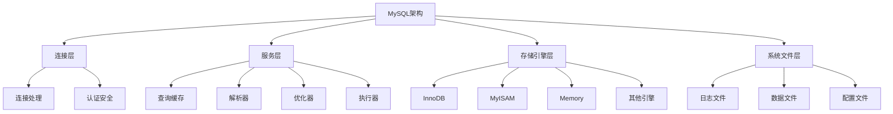

### 1.1 MySQL架构组成

MySQL数据库系统由以下几个关键组件构成：

<Tabs>
<TabItem value="connection" label="连接层">

连接层负责客户端与MySQL服务器之间的通信，主要功能包括：

- **连接处理**：处理客户端连接请求，建立和管理连接
- **认证安全**：验证用户身份，检查权限，确保访问安全
- **协议支持**：支持TCP/IP、Unix套接字、命名管道等通信协议
- **连接池管理**：维护活跃连接池，实现连接复用

```sql
-- 查看当前连接数
SHOW STATUS LIKE 'Threads_connected';

-- 查看最大连接数
SHOW VARIABLES LIKE 'max_connections';

-- 查看当前用户连接信息
SHOW PROCESSLIST;
```

</TabItem>
<TabItem value="service" label="服务层">

服务层是MySQL的核心，负责SQL解析和执行：

- **查询缓存**：缓存SELECT查询结果（MySQL 8.0已移除）
- **解析器**：解析SQL语句，建立语法树
- **预处理器**：检查表和字段是否存在
- **优化器**：选择最佳执行计划，优化查询策略
- **执行器**：与存储引擎交互，执行SQL并返回结果

```sql
-- 查看查询执行计划
EXPLAIN SELECT * FROM users WHERE user_id = 1;

-- 查看优化器跟踪信息
SET optimizer_trace = 'enabled=on';
SELECT * FROM users WHERE user_id = 1;
SELECT * FROM information_schema.OPTIMIZER_TRACE;
```

</TabItem>
<TabItem value="engine" label="存储引擎层">

存储引擎层负责数据的存储和提取：

- **可插拔架构**：MySQL支持多种存储引擎
- **独立的事务处理**：每个存储引擎可以有自己的事务处理机制
- **数据存取接口**：定义了表的存储格式和访问方法
- **灵活选择**：可以根据需求选择合适的存储引擎

```sql
-- 查看支持的存储引擎
SHOW ENGINES;

-- 查看表使用的存储引擎
SHOW CREATE TABLE users;

-- 修改表的存储引擎
ALTER TABLE users ENGINE = InnoDB;
```

</TabItem>
<TabItem value="file" label="系统文件层">

系统文件层管理MySQL的各种物理文件：

- **数据文件**：`.ibd`（表数据）、`.frm`（8.0前的表结构）
- **日志文件**：`ib_logfile`（重做日志）、`binlog`（二进制日志）
- **配置文件**：`my.cnf`/`my.ini`（MySQL配置）
- **状态文件**：`ibdata`（系统表空间）、`ib_buffer_pool`（缓冲池状态）

```bash
# Linux系统文件位置示例
/var/lib/mysql/         # 数据目录
/var/log/mysql/         # 日志目录
/etc/mysql/my.cnf       # 配置文件
```

</TabItem>
</Tabs>

### 1.2 存储引擎对比

MySQL支持多种存储引擎，其中InnoDB和MyISAM最为常用。不同存储引擎具有不同的特性和适用场景：

| 特性 | InnoDB | MyISAM | Memory | Archive | NDB |
|------|--------|--------|--------|---------|-----|
| **事务支持** | 支持 | 不支持 | 不支持 | 不支持 | 支持 |
| **锁机制** | 行锁(MVCC) | 表锁 | 表锁 | 行锁 | 行锁 |
| **外键约束** | 支持 | 不支持 | 不支持 | 不支持 | 支持(8.0+) |
| **全文索引** | 支持(5.6+) | 支持 | 不支持 | 不支持 | 不支持 |
| **数据缓存** | 缓存数据和索引 | 仅缓存索引 | 全内存 | 不缓存 | 磁盘+内存 |
| **崩溃恢复** | 自动恢复 | 可能丢失数据 | 重启丢失 | 一般 | 高可用 |
| **适用场景** | 事务处理<br/>高并发写入 | 读密集型<br/>低写入需求 | 临时表<br/>高速查询 | 日志<br/>数据归档 | 高可用<br/>集群 |

<Tabs>
<TabItem value="innodb" label="InnoDB">

**InnoDB是MySQL的默认存储引擎**，具有以下特点：

- **事务ACID**：完全支持事务的ACID特性
- **行级锁**：支持行级锁，提高高并发性能
- **外键约束**：支持外键，保证数据完整性
- **崩溃恢复**：支持崩溃恢复，数据安全性高
- **MVCC**：多版本并发控制，读写不阻塞

```sql
-- 创建InnoDB表
CREATE TABLE users (
    id INT PRIMARY KEY AUTO_INCREMENT,
    name VARCHAR(100) NOT NULL,
    email VARCHAR(100) UNIQUE,
    created_at TIMESTAMP DEFAULT CURRENT_TIMESTAMP
) ENGINE=InnoDB;

-- 事务操作示例
START TRANSACTION;
INSERT INTO users (name, email) VALUES ('John', 'john@example.com');
UPDATE users SET email = 'john.doe@example.com' WHERE name = 'John';
COMMIT;
```

</TabItem>
<TabItem value="myisam" label="MyISAM">

**MyISAM是MySQL 5.5之前的默认引擎**，具有以下特点：

- **高速读取**：读取性能很好，适合查询密集型应用
- **全文索引**：较早支持全文索引功能
- **表锁定**：仅支持表级锁，并发写入性能较差
- **无事务**：不支持事务，不保证数据完整性
- **延迟索引更新**：支持延迟索引更新，提高批量插入性能

```sql
-- 创建MyISAM表
CREATE TABLE articles (
    id INT PRIMARY KEY AUTO_INCREMENT,
    title VARCHAR(200) NOT NULL,
    content TEXT,
    tags VARCHAR(200),
    FULLTEXT(title, content, tags)
) ENGINE=MyISAM;

-- 全文索引搜索示例
SELECT * FROM articles 
WHERE MATCH(title, content, tags) AGAINST('MySQL tutorial');
```

</TabItem>
<TabItem value="memory" label="Memory">

**Memory引擎将数据存储在内存中**，具有以下特点：

- **超高速**：所有数据存储在内存，访问速度极快
- **临时性**：服务器重启后数据丢失
- **表锁**：仅支持表级锁
- **哈希索引**：默认使用哈希索引，等值查询性能极高
- **固定长度**：使用固定长度行存储格式

```sql
-- 创建Memory表
CREATE TABLE cache (
    key_id VARCHAR(100) PRIMARY KEY,
    value VARCHAR(1000),
    expires_at TIMESTAMP
) ENGINE=MEMORY;

-- 用于临时计算的示例
CREATE TEMPORARY TABLE temp_results 
ENGINE=MEMORY 
SELECT id, COUNT(*) as count 
FROM orders 
GROUP BY customer_id;
```

</TabItem>
<TabItem value="others" label="其他引擎">

**其他特殊用途的存储引擎**：

1. **Archive引擎**：
   - 高度压缩，适合存储和归档历史数据
   - 只支持INSERT和SELECT，不支持DELETE和UPDATE
   - 不支持索引，适合日志和归档数据

2. **CSV引擎**：
   - 以CSV格式存储数据
   - 便于与其他应用程序交换数据
   - 不支持索引，性能有限

3. **Blackhole引擎**：
   - 接收数据但不存储
   - 常用于数据复制拓扑测试
   - 记录二进制日志但不保存数据

4. **NDB (MySQL Cluster)**：
   - 分布式存储引擎
   - 高可用性，自动分片
   - 适合需要高可用性的场景

```sql
-- Archive引擎示例（用于日志）
CREATE TABLE access_logs (
    id INT AUTO_INCREMENT PRIMARY KEY,
    access_time TIMESTAMP,
    ip_address VARCHAR(15),
    url VARCHAR(255),
    status_code SMALLINT
) ENGINE=ARCHIVE;

-- CSV引擎示例（用于数据交换）
CREATE TABLE exported_data (
    id INT,
    name VARCHAR(50),
    value DECIMAL(10,2)
) ENGINE=CSV;
```

</TabItem>
</Tabs>

### 1.3 MySQL版本特性

MySQL从最初发布至今经历了多个重要版本迭代，每个版本都带来了功能改进和性能优化：

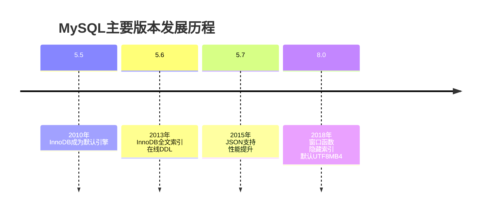

<Tabs>
<TabItem value="5.7" label="MySQL 5.7">

**MySQL 5.7是一个广泛使用的稳定版本**（2015年发布）：

- **JSON支持**：原生支持JSON数据类型和函数
- **性能提升**：InnoDB性能大幅提升，优化器改进
- **安全增强**：默认密码策略增强，SSL改进
- **复制增强**：多源复制，增强型GTID，基于组的复制
- **系统表格式**：系统表使用InnoDB存储引擎

```sql
-- JSON数据类型示例
CREATE TABLE products (
    id INT PRIMARY KEY AUTO_INCREMENT,
    name VARCHAR(100),
    attributes JSON
);

INSERT INTO products (name, attributes) VALUES 
('Smartphone', '{"color": "black", "storage": 128, "features": ["camera", "wifi", "bluetooth"]}');

-- JSON查询
SELECT id, name, 
       JSON_EXTRACT(attributes, '$.color') AS color,
       JSON_EXTRACT(attributes, '$.storage') AS storage
FROM products;

-- 或使用->操作符
SELECT id, name, attributes->'$.color' AS color
FROM products;
```

</TabItem>
<TabItem value="8.0" label="MySQL 8.0">

**MySQL 8.0是当前最新的主要版本**（2018年发布）：

- **窗口函数**：支持SQL标准窗口函数
- **隐藏索引**：支持禁用和启用索引而不删除
- **默认字符集**：默认UTF8MB4字符集
- **改进的数据字典**：原子DDL，元数据存储在InnoDB中
- **资源管理**：资源组管理功能
- **直方图统计**：优化器使用直方图统计
- **提升安全性**：强化密码安全，角色管理
- **移除查询缓存**：完全移除了查询缓存功能

```sql
-- 窗口函数示例
SELECT 
    department_id, 
    employee_name, 
    salary,
    RANK() OVER (PARTITION BY department_id ORDER BY salary DESC) as salary_rank,
    AVG(salary) OVER (PARTITION BY department_id) as dept_avg_salary
FROM employees;

-- 隐藏索引
CREATE INDEX idx_email ON customers(email) INVISIBLE;
ALTER TABLE customers ALTER INDEX idx_email VISIBLE;

-- 创建和管理角色
CREATE ROLE 'app_read', 'app_write';
GRANT SELECT ON app_db.* TO 'app_read';
GRANT INSERT, UPDATE ON app_db.* TO 'app_write';
GRANT 'app_read' TO 'app_user'@'localhost';
SET DEFAULT ROLE 'app_read' TO 'app_user'@'localhost';
```

</TabItem>
<TabItem value="5.6" label="MySQL 5.6">

**MySQL 5.6版本**（2013年发布）带来了重要的特性：

- **InnoDB全文索引**：InnoDB引擎支持全文索引
- **在线DDL**：支持在线架构变更，减少停机时间
- **复制增强**：基于GTID的复制，崩溃安全复制
- **优化器改进**：子查询优化，执行计划改进
- **性能架构**：改进的性能架构，更好的监控功能

```sql
-- InnoDB全文索引示例
CREATE TABLE articles (
    id INT PRIMARY KEY AUTO_INCREMENT,
    title VARCHAR(200),
    body TEXT,
    FULLTEXT INDEX (title, body)
) ENGINE=InnoDB;

-- 全文检索
SELECT * FROM articles 
WHERE MATCH(title, body) AGAINST('MySQL performance' IN BOOLEAN MODE);

-- 在线DDL示例
ALTER TABLE customers ADD COLUMN phone VARCHAR(20), ALGORITHM=INPLACE, LOCK=NONE;
```

</TabItem>
<TabItem value="latest" label="新版特性">

**MySQL最新版本**（8.0.30+）引入的部分特性：

- **原子DDL**：确保DDL操作的原子性
- **即时添加列**：立即添加列而无需重建表
- **多值索引**：支持JSON数组的多值索引
- **数据复制优化**：改进的复制机制
- **SQL增强**：增强的CTE功能，REGEXP功能改进
- **JSON增强**：改进的JSON功能和性能
- **InnoDB增强**：临时表性能提升，空间索引改进

```sql
-- 多值索引示例
CREATE TABLE products (
    id INT PRIMARY KEY,
    name VARCHAR(100),
    tags JSON
);

-- 创建多值索引
CREATE INDEX idx_tags ON products((CAST(tags->'$[*]' AS CHAR(50) ARRAY)));

-- 使用多值索引查询
SELECT * FROM products WHERE 'wireless' MEMBER OF(tags);

-- 带有递归的CTE
WITH RECURSIVE employee_paths (id, name, path) AS (
  SELECT id, name, CAST(name AS CHAR(500))
  FROM employees
  WHERE manager_id IS NULL
  UNION ALL
  SELECT e.id, e.name, CONCAT(ep.path, ' -> ', e.name)
  FROM employee_paths AS ep
  JOIN employees AS e ON ep.id = e.manager_id
)
SELECT * FROM employee_paths ORDER BY path;
```

</TabItem>
</Tabs>

## 2. 索引原理与优化

索引是提高MySQL查询性能的最重要手段，合理设计和使用索引可以让查询速度提升几个数量级。MySQL支持多种索引类型，它们基于不同的数据结构实现，具有各自的优缺点和适用场景。

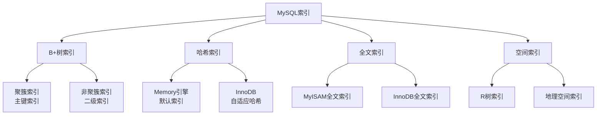

### 2.1 索引数据结构

MySQL中主要使用的索引数据结构是B+树，但也支持哈希索引、全文索引和空间索引等其他类型。

<Tabs>
<TabItem value="btree" label="B+树索引">

**B+树是MySQL中最常用的索引数据结构**，特别是在InnoDB和MyISAM引擎中：

- **平衡多路搜索树**：每个节点可以有多个子节点（扇出因子大）
- **叶子节点包含所有数据**：非叶子节点只包含键值和指针
- **叶子节点形成有序链表**：支持范围查询和排序
- **多级索引结构**：减少I/O次数，提高查询效率

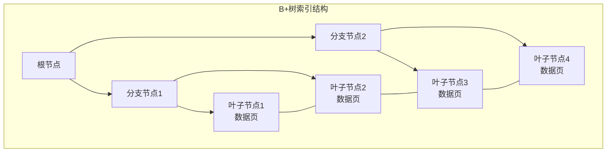

B+树索引的主要优势：
1. **高效查找**：平均查询时间复杂度为O(log n)
2. **范围查询优化**：叶子节点链表支持高效范围扫描
3. **结构稳定**：平衡树结构确保各路径长度一致
4. **适合磁盘存储**：节点大小可优化为磁盘块大小

```sql
-- 创建B+树索引示例
CREATE TABLE customers (
    id INT PRIMARY KEY,            -- 聚簇索引
    name VARCHAR(100),
    email VARCHAR(100),
    created_at TIMESTAMP,
    INDEX idx_email (email),       -- 普通B+树索引
    INDEX idx_created (created_at) -- 用于范围查询的B+树索引
);
```

</TabItem>
<TabItem value="hash" label="哈希索引">

**哈希索引是基于哈希表实现的**，主要用于精确匹配查询：

- **哈希函数**：通过哈希函数将键值转换为哈希值
- **哈希表**：存储哈希值和指向数据行的指针
- **极速等值查询**：理想情况下O(1)复杂度
- **不支持排序和范围查询**：只能用于等值比较

哈希索引主要存在于：
1. **Memory存储引擎**：默认使用哈希索引
2. **InnoDB自适应哈希索引**：根据访问模式自动创建

```sql
-- Memory引擎使用哈希索引
CREATE TABLE cache_data (
    key_id VARCHAR(100) PRIMARY KEY,
    value TEXT,
    expires_at DATETIME
) ENGINE=MEMORY;

-- 查看InnoDB自适应哈希索引状态
SHOW ENGINE INNODB STATUS\G
```

**哈希索引的优缺点**：

| 优点 | 缺点 |
|------|------|
| 等值查询极速 | 不支持范围查询 |
| 内存占用相对较小 | 不支持部分键查询 |
| 查询复杂度为O(1) | 不支持排序 |
|  | 可能存在哈希冲突 |

</TabItem>
<TabItem value="fulltext" label="全文索引">

**全文索引专为搜索大文本内容而设计**：

- **倒排索引结构**：词项到文档的映射
- **支持自然语言搜索**：更符合人类搜索习惯
- **支持布尔搜索模式**：使用操作符组合搜索条件
- **支持短语搜索**：搜索特定词语序列

MySQL支持的全文索引：
1. **MyISAM全文索引**：早期实现
2. **InnoDB全文索引**：MySQL 5.6+支持

```sql
-- 创建全文索引
CREATE TABLE articles (
    id INT PRIMARY KEY AUTO_INCREMENT,
    title VARCHAR(200),
    content TEXT,
    FULLTEXT INDEX ft_content (title, content)
) ENGINE=InnoDB;

-- 自然语言模式搜索
SELECT * FROM articles 
WHERE MATCH(title, content) AGAINST('database optimization');

-- 布尔模式搜索（使用操作符）
SELECT * FROM articles 
WHERE MATCH(title, content) 
AGAINST('+MySQL -Oracle "database performance"' IN BOOLEAN MODE);
```

**全文索引配置**：
- `innodb_ft_min_token_size`：最小索引词长度（默认3）
- `innodb_ft_max_token_size`：最大索引词长度（默认84）
- `ft_stopword_file`：停用词文件

</TabItem>
<TabItem value="spatial" label="空间索引">

**空间索引用于地理空间数据**：

- **R树结构**：用于多维空间数据检索
- **最小边界矩形(MBR)**：用矩形包围空间对象
- **支持地理位置查询**：点、线、多边形等
- **空间关系运算**：包含、相交、距离等

MySQL 5.7+的InnoDB引擎支持空间索引：

```sql
-- 创建包含地理空间数据的表
CREATE TABLE locations (
    id INT PRIMARY KEY,
    name VARCHAR(100),
    location POINT NOT NULL,
    SPATIAL INDEX idx_location (location)
) ENGINE=InnoDB;

-- 插入点数据
INSERT INTO locations VALUES 
(1, 'Coffee Shop', ST_GeomFromText('POINT(40.7128 -74.0060)'));

-- 空间查询示例
-- 找出指定点附近5公里内的地点
SELECT id, name, 
       ST_Distance_Sphere(location, 
                         ST_GeomFromText('POINT(40.7128 -74.0060)')) as distance
FROM locations
WHERE ST_Distance_Sphere(location, 
                        ST_GeomFromText('POINT(40.7128 -74.0060)')) <= 5000
ORDER BY distance;
```

**空间索引适用场景**：
- 地理信息系统(GIS)
- 位置服务应用
- 地图应用
- 路径规划

</TabItem>
</Tabs>

### 2.2 索引类型详解

从功能和结构角度看，MySQL支持多种类型的索引，每种都有特定的用途和优化场景。

<Tabs>
<TabItem value="primary" label="聚簇索引">

**聚簇索引（主键索引）**是InnoDB表的核心组织方式：

- **数据存储方式**：表数据按主键顺序物理存储
- **一表一个**：每个InnoDB表只有一个聚簇索引
- **自动创建**：如果定义主键则使用主键，否则使用唯一非空索引，如果都没有则使用隐藏的行ID
- **叶子节点**：包含整行数据记录

```sql
-- 显式定义聚簇索引
CREATE TABLE orders (
    order_id INT PRIMARY KEY,  -- 这将成为聚簇索引
    customer_id INT,
    order_date DATE,
    total_amount DECIMAL(10,2)
);

-- 优化聚簇索引示例：自增主键通常是最优选择
CREATE TABLE products (
    id INT AUTO_INCREMENT PRIMARY KEY,  -- 自增主键作为聚簇索引
    sku VARCHAR(50) UNIQUE,
    name VARCHAR(100),
    price DECIMAL(10,2)
);
```

**聚簇索引的优缺点**：

| 优点 | 缺点 |
|------|------|
| 相关数据聚集存储，提高查询效率 | 插入速度依赖于主键是否顺序增长 |
| 通过主键访问数据非常快 | 更新主键代价很高 |
| 可减少I/O操作 | 可能导致页分裂 |
| 范围查询性能好 | 二级索引需要回表 |

</TabItem>
<TabItem value="secondary" label="二级索引">

**二级索引（非聚簇索引/辅助索引）**是除主键外的其他索引：

- **独立索引结构**：与聚簇索引分离
- **回表查询**：叶子节点存储主键值，需要二次查询聚簇索引
- **覆盖索引**：如果索引包含查询所需的所有字段，则不需回表
- **可多个**：一个表可以有多个二级索引

```sql
-- 创建普通二级索引
CREATE INDEX idx_customer_id ON orders(customer_id);

-- 创建组合索引（多列）
CREATE INDEX idx_order_date_status ON orders(order_date, status);

-- 创建前缀索引（节省空间）
CREATE INDEX idx_name_prefix ON products(name(20));
```

**回表查询过程**：
1. 通过二级索引找到满足条件的记录的主键值
2. 通过主键值回表到聚簇索引获取完整记录

**覆盖索引优化**：
```sql
-- 索引覆盖示例：索引包含所有需要的字段
CREATE INDEX idx_customer_date ON orders(customer_id, order_date);

-- 该查询可以只使用索引而无需回表
SELECT customer_id, order_date FROM orders WHERE customer_id = 100;
```

</TabItem>
<TabItem value="composite" label="组合索引">

**组合索引（复合索引/联合索引）**在多个列上创建的索引：

- **多列组合**：联合多个列构成索引键
- **左前缀匹配原则**：按照索引定义顺序使用
- **选择性原则**：一般将选择性高的列放在前面
- **索引合并**：可能替代多个单列索引

```sql
-- 创建组合索引
CREATE TABLE employees (
    id INT PRIMARY KEY,
    department_id INT,
    status VARCHAR(20),
    hire_date DATE,
    salary DECIMAL(10,2),
    INDEX idx_dept_status_date (department_id, status, hire_date)
);
```

**左前缀匹配规则示例**：
- 以上索引对这些WHERE条件有效：
  - `WHERE department_id = 5`
  - `WHERE department_id = 5 AND status = 'active'`
  - `WHERE department_id = 5 AND status = 'active' AND hire_date > '2020-01-01'`
  
- 但对这些条件无效（不使用索引或只使用部分索引）：
  - `WHERE status = 'active'` （不使用索引）
  - `WHERE hire_date > '2020-01-01'` （不使用索引）
  - `WHERE department_id = 5 AND hire_date > '2020-01-01'` （只使用department_id部分）

```sql
-- 组合索引最佳实践示例
CREATE INDEX idx_search_filter ON products(category_id, brand_id, price);

-- 可有效利用该索引的查询
SELECT * FROM products 
WHERE category_id = 10 AND brand_id = 25 AND price > 1000;
```

</TabItem>
<TabItem value="special" label="特殊索引类型">

MySQL还支持多种特殊类型的索引：

**1. 唯一索引**：
- 确保索引列的值唯一
- 可以在多个列上建立唯一约束
```sql
CREATE UNIQUE INDEX idx_email ON users(email);
```

**2. 前缀索引**：
- 只索引字符串的前缀部分
- 节省索引空间，适用于长字符串
```sql
CREATE INDEX idx_title ON articles(title(50));
```

**3. 函数索引（表达式索引）**：
- MySQL 8.0+支持
- 在表达式或函数结果上创建索引
```sql
-- 函数索引示例
CREATE INDEX idx_lower_email ON users((LOWER(email)));
SELECT * FROM users WHERE LOWER(email) = 'user@example.com';
```

**4. 隐藏索引**：
- MySQL 8.0+支持
- 保持索引结构但不使用它，用于测试索引删除的影响
```sql
CREATE INDEX idx_status ON orders(status) INVISIBLE;
ALTER TABLE orders ALTER INDEX idx_status VISIBLE;
```

**5. 降序索引**：
- MySQL 8.0+支持真正的降序索引
- 对排序优化有帮助
```sql
CREATE INDEX idx_created_desc ON logs(created_at DESC);
```

**6. 多值索引**：
- MySQL 8.0.17+支持
- 用于JSON数组
```sql
CREATE TABLE products (
    id INT PRIMARY KEY,
    tags JSON,
    INDEX idx_tags ((CAST(tags->'$[*]' AS CHAR(50) ARRAY)))
);
```

</TabItem>
</Tabs>

### 2.3 索引设计原则

良好的索引设计对于数据库性能至关重要，但过多或不恰当的索引也会带来问题。

<Tabs>
<TabItem value="principles" label="基本原则">

**索引设计的基本原则**：

1. **选择性原则**：
   - 选择区分度高的列建立索引
   - 计算选择性：`COUNT(DISTINCT column) / COUNT(*)`
   - 选择性接近1的列是理想的索引列

2. **最左前缀原则**：
   - 复合索引按照定义顺序使用
   - 查询条件应包含索引最左列才能使用该索引

3. **最小化索引数量**：
   - 避免创建重复或冗余索引
   - 合理使用复合索引减少索引数量

4. **避免过宽的索引**：
   - 索引列不要过多或过宽
   - 考虑使用前缀索引减少索引大小

5. **常用查询优先**：
   - 优先考虑频繁查询、排序和分组的列
   - 权衡查询频率和写入开销

6. **覆盖索引设计**：
   - 尽可能设计能覆盖常用查询的索引
   - 减少回表操作提高性能

```sql
-- 计算列选择性
SELECT COUNT(DISTINCT email) / COUNT(*) AS selectivity FROM users;

-- 检查冗余索引
SELECT * FROM information_schema.STATISTICS 
WHERE table_schema = 'your_database' AND table_name = 'your_table';
```

</TabItem>
<TabItem value="antipatterns" label="常见误区">

**索引设计中的常见误区**：

1. **过度索引**：
   - 每个索引都会占用存储空间
   - 写操作需要维护所有索引
   - 优化器可能难以选择最佳索引

2. **重复索引**：
   - 创建了功能重叠的索引
   - 例如：对同一列创建单独索引，也将其包含在组合索引的首列

3. **索引不常用列**：
   - 很少在查询条件中使用的列
   - 维护成本大于查询收益

4. **无视列基数**：
   - 在基数很低的列上建立索引
   - 例如：性别列只有几个不同值，索引效果有限

5. **索引长字符列**：
   - 不考虑使用前缀索引
   - 导致索引占用过多空间

6. **忽视写性能**：
   - 只关注查询性能，忽略索引对写入的影响
   - 批量插入前未考虑临时禁用索引

**案例分析**：
```sql
-- 重复索引示例（应避免）
CREATE INDEX idx_email ON customers(email);
CREATE INDEX idx_email_name ON customers(email, name);  -- email列重复

-- 更好的做法：只保留组合索引
CREATE INDEX idx_email_name ON customers(email, name);

-- 低效索引示例（基数低）
CREATE INDEX idx_gender ON employees(gender);  -- 可能只有M/F两个值

-- 更好的组合方式
CREATE INDEX idx_dept_gender ON employees(department_id, gender);
```

</TabItem>
<TabItem value="scenarios" label="场景选择">

**不同场景的索引选择策略**：

1. **OLTP系统（在线事务处理）**：
   - 优先考虑高选择性的单列或少量列复合索引
   - 主键使用自增ID以避免页分裂
   - 平衡读写性能，避免过度索引

2. **OLAP系统（在线分析处理）**：
   - 优先考虑支持复杂分析查询的宽索引
   - 覆盖索引设计减少回表
   - 可使用更多的索引支持各种分析路径

3. **读多写少系统**：
   - 可以创建更多索引提升查询速度
   - 优先考虑覆盖索引减少I/O

4. **写密集系统**：
   - 减少索引数量降低写入开销
   - 考虑使用分区表和分区索引
   - 批量写入时可临时禁用索引

5. **混合负载系统**：
   - 找到读写平衡点
   - 优先为核心查询路径创建索引
   - 定期分析索引使用情况并优化

**针对业务场景的索引设计示例**：

```sql
-- 电商商品表索引设计
CREATE TABLE products (
    id INT AUTO_INCREMENT PRIMARY KEY,  -- 聚簇索引
    sku VARCHAR(50) UNIQUE,             -- 唯一索引，产品查找
    name VARCHAR(200),
    brand_id INT,
    category_id INT,
    price DECIMAL(10,2),
    stock INT,
    status ENUM('active', 'inactive'),
    created_at TIMESTAMP DEFAULT CURRENT_TIMESTAMP,
    
    -- 商品浏览/搜索（高频读取）
    INDEX idx_category_brand_status (category_id, brand_id, status),
    
    -- 价格筛选/排序（常用于过滤和排序）
    INDEX idx_category_price (category_id, price),
    
    -- 库存管理（频繁更新，慎重考虑）
    INDEX idx_stock_status (stock, status),
    
    -- 全文搜索需求
    FULLTEXT INDEX ft_name (name)
);
```

</TabItem>
<TabItem value="monitoring" label="索引监控">

**索引使用情况监控和调优**：

1. **查看索引使用情况**：
   - MySQL 8.0+的索引使用统计
   - Performance Schema中的索引统计

2. **分析未使用的索引**：
   - 识别从未使用的索引
   - 考虑删除长期未使用的索引

3. **分析查询执行计划**：
   - 使用EXPLAIN分析索引使用
   - 确保关键查询正确使用索引

4. **索引碎片监控和优化**：
   - 监控索引碎片情况
   - 定期重建高碎片率的索引

```sql
-- MySQL 8.0+ 查看索引使用情况
SELECT * FROM performance_schema.table_io_waits_summary_by_index_usage
WHERE object_schema = 'your_database'
ORDER BY count_star DESC;

-- 查找未使用的索引
SELECT * FROM performance_schema.table_io_waits_summary_by_index_usage
WHERE index_name IS NOT NULL
AND count_star = 0;

-- 分析表和索引碎片
ANALYZE TABLE orders;
SHOW TABLE STATUS LIKE 'orders';

-- 重建索引或优化表
ALTER TABLE orders DROP INDEX idx_name, ADD INDEX idx_name (name);
-- 或
OPTIMIZE TABLE orders;
```

**索引监控最佳实践**：

1. 定期运行索引使用分析
2. 基于真实负载测试索引性能
3. 逐步进行索引变更，并监控效果
4. 对历史数据进行索引使用趋势分析
5. 设置索引监控告警，如未使用索引的查询占比过高

</TabItem>
</Tabs>

### 2.4 索引优化实践

将理论应用到实践中，这里提供一些常见的索引优化技术和案例。

<Tabs>
<TabItem value="query-optimization" label="查询优化">

**利用索引优化不同类型的查询**：

1. **等值查询优化**：
   ```sql
   -- 适合单列索引
   CREATE INDEX idx_email ON users(email);
   SELECT * FROM users WHERE email = 'user@example.com';
   ```

2. **范围查询优化**：
   ```sql
   -- 范围查询索引
   CREATE INDEX idx_created_at ON orders(created_at);
   SELECT * FROM orders WHERE created_at BETWEEN '2023-01-01' AND '2023-01-31';
   ```

3. **排序优化**：
   ```sql
   -- 支持排序的索引
   CREATE INDEX idx_user_created ON posts(user_id, created_at);
   SELECT * FROM posts WHERE user_id = 100 ORDER BY created_at DESC LIMIT 10;
   ```

4. **JOIN优化**：
   ```sql
   -- 为JOIN条件创建索引
   CREATE INDEX idx_customer_id ON orders(customer_id);
   SELECT o.*, c.name FROM orders o 
   JOIN customers c ON o.customer_id = c.id;
   ```

5. **分组优化**：
   ```sql
   -- 支持GROUP BY的索引
   CREATE INDEX idx_status_date ON orders(status, order_date);
   SELECT status, COUNT(*), SUM(amount) 
   FROM orders 
   GROUP BY status;
   ```

6. **覆盖索引优化**：
   ```sql
   -- 创建覆盖索引，包含查询所需的所有列
   CREATE INDEX idx_cover_all ON orders(customer_id, order_date, status, amount);
   
   -- 可直接从索引获取所有数据（无需回表）
   SELECT customer_id, order_date, status, amount 
   FROM orders 
   WHERE customer_id = 100;
   ```

</TabItem>
<TabItem value="advanced-techniques" label="高级技巧">

**一些高级索引优化技术**：

1. **前缀索引优化**：
   ```sql
   -- 分析最优前缀长度
   SELECT COUNT(DISTINCT LEFT(email, 10)) / COUNT(*) AS selectivity10,
          COUNT(DISTINCT LEFT(email, 15)) / COUNT(*) AS selectivity15,
          COUNT(DISTINCT LEFT(email, 20)) / COUNT(*) AS selectivity20
   FROM users;
   
   -- 创建最优前缀索引
   CREATE INDEX idx_email_prefix ON users(email(15));
   ```

2. **使用函数索引**：
   ```sql
   -- MySQL 8.0+函数索引
   CREATE INDEX idx_lower_email ON users((LOWER(email)));
   
   -- 使用函数索引的查询
   SELECT * FROM users WHERE LOWER(email) = 'john.doe@example.com';
   ```

3. **索引提示使用**：
   ```sql
   -- 强制使用特定索引
   SELECT * FROM products USE INDEX (idx_category_price)
   WHERE category_id = 5 AND price > 100;
   
   -- 忽略特定索引
   SELECT * FROM products IGNORE INDEX (idx_brand)
   WHERE brand_id = 10;
   ```

4. **索引合并优化**：
   ```sql
   -- 索引合并示例（MySQL可能使用多个单列索引组合）
   CREATE INDEX idx_brand ON products(brand_id);
   CREATE INDEX idx_category ON products(category_id);
   
   -- 可能使用索引合并
   SELECT * FROM products 
   WHERE brand_id = 5 AND category_id = 10;
   ```

5. **部分索引（MySQL 8.0+）**：
   ```sql
   -- 仅为活跃产品创建索引
   CREATE INDEX idx_active_products ON products(name)
   WHERE status = 'active';
   ```

</TabItem>
<TabItem value="case-studies" label="案例分析">

**实际索引优化案例分析**：

**案例1：电商订单查询优化**

问题：订单查询页面加载缓慢，特别是按状态和日期过滤时。

```sql
-- 原始查询（执行慢）
SELECT * FROM orders 
WHERE customer_id = 10003 
  AND status = 'shipped' 
  AND order_date BETWEEN '2023-01-01' AND '2023-03-31'
ORDER BY order_date DESC
LIMIT 20;

-- EXPLAIN显示全表扫描或使用了次优索引
```

优化方案：
```sql
-- 创建针对性索引
CREATE INDEX idx_customer_status_date ON orders(customer_id, status, order_date);

-- 查询性能显著提升
-- EXPLAIN显示使用了新索引，并且符合ORDER BY排序
```

**案例2：日志表查询优化**

问题：大型日志表（上亿行）的按时间和级别查询非常慢。

```sql
-- 日志表结构
CREATE TABLE logs (
    id BIGINT AUTO_INCREMENT PRIMARY KEY,
    app_id INT,
    level ENUM('debug', 'info', 'warn', 'error', 'fatal'),
    message TEXT,
    created_at TIMESTAMP
);

-- 慢查询
SELECT * FROM logs 
WHERE app_id = 5 
  AND level IN ('error', 'fatal')
  AND created_at > DATE_SUB(NOW(), INTERVAL 1 DAY)
ORDER BY created_at DESC
LIMIT 100;
```

优化方案：
```sql
-- 创建优化索引
CREATE INDEX idx_app_level_date ON logs(app_id, level, created_at);

-- 考虑分区优化
ALTER TABLE logs
PARTITION BY RANGE (TO_DAYS(created_at)) (
    PARTITION p202301 VALUES LESS THAN (TO_DAYS('2023-02-01')),
    PARTITION p202302 VALUES LESS THAN (TO_DAYS('2023-03-01')),
    PARTITION p202303 VALUES LESS THAN (TO_DAYS('2023-04-01'))
    -- 更多分区...
);
```

**案例3：模糊查询优化**

问题：产品搜索中的LIKE查询性能很差。

```sql
-- 搜索查询（非常慢）
SELECT * FROM products 
WHERE name LIKE '%keyword%';  -- 无法使用传统索引
```

优化方案：
```sql
-- 全文索引解决方案
CREATE FULLTEXT INDEX ft_name_description 
ON products(name, description);

-- 使用全文检索替代LIKE
SELECT * FROM products 
WHERE MATCH(name, description) AGAINST('keyword' IN NATURAL LANGUAGE MODE);
```

</TabItem>
<TabItem value="common-issues" label="常见问题">

**索引使用中的常见问题及解决方案**：

1. **索引失效问题**：

   **索引字段使用函数**
   ```sql
   -- 索引失效示例
   SELECT * FROM users WHERE YEAR(created_at) = 2023;  -- 使用了YEAR函数
   
   -- 优化方案
   SELECT * FROM users 
   WHERE created_at >= '2023-01-01' AND created_at < '2024-01-01';
   ```
   
   **隐式类型转换**
   ```sql
   -- 创建索引
   CREATE INDEX idx_mobile ON users(mobile);
   
   -- 索引失效查询（隐式类型转换）
   SELECT * FROM users WHERE mobile = 12345678901;  -- mobile是字符串类型
   
   -- 正确做法
   SELECT * FROM users WHERE mobile = '12345678901';
   ```
   
   **使用不等于或NOT条件**
   ```sql
   -- 可能不使用索引的查询
   SELECT * FROM products WHERE category_id != 5;
   SELECT * FROM orders WHERE status NOT IN ('completed', 'shipped');
   ```

2. **回表问题与优化**：

   ```sql
   -- 需要回表的查询
   SELECT * FROM products WHERE category_id = 10;
   
   -- 使用覆盖索引避免回表
   CREATE INDEX idx_category_cover ON products(category_id, name, price);
   
   -- 现在不需要回表
   SELECT name, price FROM products WHERE category_id = 10;
   ```

3. **长度限制问题**：

   ```sql
   -- 可能超出索引长度限制
   CREATE INDEX idx_long_text ON articles(content);  -- 可能会失败
   
   -- 解决方案
   CREATE INDEX idx_content_prefix ON articles(content(200));
   ```

4. **选择性不足问题**：

   ```sql
   -- 低选择性列的索引效果有限
   CREATE INDEX idx_status ON orders(status);  -- 如果status只有少数几个值
   
   -- 改进方案：复合索引
   CREATE INDEX idx_status_date ON orders(status, order_date);
   ```

5. **过多索引导致写入性能下降**：

   ```sql
   -- 检查表的所有索引
   SHOW INDEX FROM orders;
   
   -- 删除不必要的索引
   ALTER TABLE orders DROP INDEX idx_rarely_used;
   ```

</TabItem>
</Tabs>

## 3. 事务与锁机制

事务和锁机制是MySQL数据库保证数据一致性和并发控制的核心机制，特别是在InnoDB引擎中，它们共同工作以提供可靠的数据处理能力。

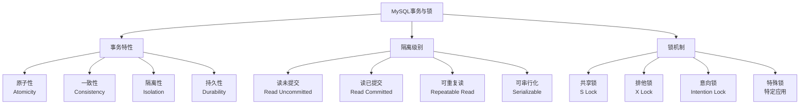

### 3.1 事务ACID特性

事务是一系列操作的集合，它们要么全部执行成功，要么全部回滚，确保数据库从一个一致性状态转变到另一个一致性状态。

<Tabs>
<TabItem value="atomicity" label="原子性(Atomicity)">

**事务的原子性确保事务中的所有操作作为一个整体执行**：

- **全部成功或全部失败**：事务中的所有操作要么全部执行成功，要么全部不执行
- **不可分割**：事务作为一个工作单元不可再分割
- **回滚机制**：当事务失败时，能够回滚到事务开始前的状态

**InnoDB中的原子性实现**：
- 使用undo日志记录修改前的数据
- 事务失败时，通过undo日志撤销更改

```sql
-- 原子性示例
START TRANSACTION;
    UPDATE accounts SET balance = balance - 100 WHERE id = 1; -- 从账户1扣款
    UPDATE accounts SET balance = balance + 100 WHERE id = 2; -- 账户2收款
COMMIT;
-- 如果任一步骤失败，整个转账操作将被回滚
```

</TabItem>
<TabItem value="consistency" label="一致性(Consistency)">

**一致性确保数据库从一个一致性状态转变到另一个一致性状态**：

- **完整性约束**：事务执行前后必须满足所有数据库定义的完整性约束
- **业务规则**：事务必须遵守应用程序定义的业务规则
- **数据有效性**：事务的结果必须保持数据库的有效性

**一致性维护方式**：
- 通过约束(主键、外键、唯一性、检查约束等)
- 通过触发器
- 通过应用程序逻辑

```sql
-- 一致性约束示例
CREATE TABLE accounts (
    id INT PRIMARY KEY,
    balance DECIMAL(10,2) NOT NULL,
    CONSTRAINT check_positive_balance CHECK (balance >= 0)
);

-- 以下事务将会失败，因为违反了CHECK约束
START TRANSACTION;
    UPDATE accounts SET balance = -100 WHERE id = 1; -- 违反非负余额约束
COMMIT;
```

</TabItem>
<TabItem value="isolation" label="隔离性(Isolation)">

**隔离性确保并发事务之间互不干扰**：

- **并发控制**：多个事务同时执行时不会互相影响
- **隔离级别**：通过不同的隔离级别控制事务间的可见性
- **避免并发问题**：防止脏读、不可重复读和幻读等问题

**InnoDB中的隔离性实现**：
- 基于MVCC(多版本并发控制)技术
- 锁机制(行锁、表锁、意向锁等)
- 支持四种标准隔离级别

```sql
-- 设置会话隔离级别
SET SESSION TRANSACTION ISOLATION LEVEL REPEATABLE READ;

-- 查看当前隔离级别
SELECT @@transaction_isolation;
```

</TabItem>
<TabItem value="durability" label="持久性(Durability)">

**持久性确保一旦事务提交，其结果将永久保存在数据库中**：

- **永久保存**：即使系统崩溃或断电，已提交的事务也不会丢失
- **写入存储**：提交的数据被物理写入持久性存储介质
- **故障恢复**：系统重启后能够恢复到正确的状态

**InnoDB中的持久性实现**：
- 重做日志(redo log)：记录事务的所有修改操作
- 双写缓冲(doublewrite buffer)：防止部分页写入导致的数据损坏
- 日志先行(WAL, Write-Ahead Logging)：确保日志先于数据持久化

```sql
-- 影响持久性的配置参数
SHOW VARIABLES LIKE 'innodb_flush_log_at_trx_commit';
-- 1 = 每次事务提交都写入并刷新日志(最安全，默认)
-- 0 = 每秒写入并刷新日志(性能最好，但可能丢失1秒数据)
-- 2 = 每次提交写入，但每秒才刷新(折中方案)

-- 双写缓冲配置
SHOW VARIABLES LIKE 'innodb_doublewrite';
```

</TabItem>
</Tabs>

### 3.2 事务隔离级别

事务隔离级别定义了一个事务可能受其他并发事务影响的程度，不同级别提供不同的保护，也有不同的性能特点。

<Tabs>
<TabItem value="isolation-levels" label="四种隔离级别">

MySQL支持SQL标准定义的四种隔离级别，每个级别解决特定的并发问题：

| 隔离级别 | 脏读 | 不可重复读 | 幻读 | 性能影响 | 锁实现 |
|---------|------|-----------|-----|---------|-------|
| **读未提交**<br />(Read Uncommitted) | 可能 | 可能 | 可能 | 最小 | 几乎无锁 |
| **读已提交**<br />(Read Committed) | 不可能 | 可能 | 可能 | 较小 | 记录锁 |
| **可重复读**<br />(Repeatable Read) | 不可能 | 不可能 | 可能<br />(InnoDB中不可能) | 中等 | 记录锁+间隙锁 |
| **可串行化**<br />(Serializable) | 不可能 | 不可能 | 不可能 | 最大 | 全表锁定 |

**InnoDB的默认隔离级别是可重复读(REPEATABLE READ)**，但它通过Next-Key Locks扩展实现，实际上也防止了幻读。

```sql
-- 设置系统默认隔离级别
SET GLOBAL TRANSACTION ISOLATION LEVEL READ COMMITTED;

-- 设置当前会话隔离级别
SET SESSION TRANSACTION ISOLATION LEVEL REPEATABLE READ;

-- 查看当前隔离级别
SELECT @@global.transaction_isolation, @@session.transaction_isolation;
```

</TabItem>
<TabItem value="concurrency-issues" label="并发问题">

**事务隔离级别旨在解决三类主要的并发问题**：

1. **脏读(Dirty Read)**：
   - 定义：一个事务读取了另一个未提交事务修改过的数据
   - 问题：可能读取到最终会被回滚的数据
   - 示例：
   ```
   事务A修改某行数据但未提交
   事务B读取该行数据(读取到了未提交的修改)
   事务A回滚
   事务B使用的数据现在变得无效
   ```

2. **不可重复读(Non-repeatable Read)**：
   - 定义：同一事务内多次读取同一数据集返回不同结果
   - 问题：事务执行过程中，其他事务对数据的修改可见
   - 示例：
   ```
   事务A读取某行数据
   事务B修改该行数据并提交
   事务A再次读取同一行，发现数据已经变了
   ```

3. **幻读(Phantom Read)**：
   - 定义：同一事务内多次执行同一查询返回不同行集合
   - 问题：主要是插入和删除操作引起的行集变化
   - 示例：
   ```
   事务A查询满足条件的所有行
   事务B插入一行新数据，满足事务A的查询条件，并提交
   事务A再次查询，发现结果集中出现了新行("幻行")
   ```

```sql
-- 脏读示例(在Read Uncommitted级别)
-- 会话A
START TRANSACTION;
UPDATE products SET price = price * 1.1 WHERE id = 101;
-- 此时未提交

-- 会话B (Read Uncommitted)
SELECT price FROM products WHERE id = 101; -- 会看到提高10%的价格
-- 如果会话A回滚，则会话B读取的是临时且错误的数据
```

</TabItem>
<TabItem value="isolation-examples" label="隔离级别实例">

**不同隔离级别的实际行为示例**：

**1. 读未提交(Read Uncommitted)**
```sql
-- 会话A
SET SESSION TRANSACTION ISOLATION LEVEL READ UNCOMMITTED;
START TRANSACTION;

-- 会话B
START TRANSACTION;
UPDATE accounts SET balance = balance + 100 WHERE id = 1;
-- 未提交

-- 会话A
SELECT balance FROM accounts WHERE id = 1; -- 会读到会话B未提交的修改
COMMIT;
```

**2. 读已提交(Read Committed)**
```sql
-- 会话A
SET SESSION TRANSACTION ISOLATION LEVEL READ COMMITTED;
START TRANSACTION;
SELECT balance FROM accounts WHERE id = 1; -- 读取初始余额

-- 会话B
UPDATE accounts SET balance = balance + 100 WHERE id = 1;
COMMIT; -- 提交修改

-- 会话A
SELECT balance FROM accounts WHERE id = 1; -- 读取更新后的余额(不可重复读)
COMMIT;
```

**3. 可重复读(Repeatable Read)**
```sql
-- 会话A
SET SESSION TRANSACTION ISOLATION LEVEL REPEATABLE READ;
START TRANSACTION;
SELECT balance FROM accounts WHERE id = 1; -- 读取初始余额

-- 会话B
UPDATE accounts SET balance = balance + 100 WHERE id = 1;
COMMIT; -- 提交修改

-- 会话A
SELECT balance FROM accounts WHERE id = 1; -- 仍然读取到初始余额
COMMIT;
```

**4. 可串行化(Serializable)**
```sql
-- 会话A
SET SESSION TRANSACTION ISOLATION LEVEL SERIALIZABLE;
START TRANSACTION;
SELECT * FROM accounts WHERE balance > 1000;

-- 会话B
START TRANSACTION;
INSERT INTO accounts(id, name, balance) VALUES(10, 'New Account', 5000);
-- 会被阻塞直到会话A提交或回滚

-- 会话A
SELECT * FROM accounts WHERE balance > 1000; -- 不会看到新插入的行
COMMIT;

-- 会话B的INSERT此时才能完成
```

</TabItem>
<TabItem value="choosing-level" label="选择隔离级别">

**如何选择合适的事务隔离级别**：

不同的隔离级别适用于不同的应用场景，选择时需要平衡数据一致性和性能需求：

1. **读未提交(Read Uncommitted)**
   - 适用场景：几乎不适用于生产环境
   - 可能用于：不要求数据一致性的批量报表生成
   - 风险：数据不一致，可能读取到会被回滚的数据

2. **读已提交(Read Committed)**
   - 适用场景：大多数OLTP应用，并发要求较高
   - 常见于：Oracle、SQL Server、PostgreSQL默认配置
   - 优点：减少锁定，提高并发性能
   - 缺点：可能出现不可重复读和幻读问题

3. **可重复读(Repeatable Read)**
   - 适用场景：需要高一致性的金融系统、库存系统
   - MySQL InnoDB默认级别
   - 优点：提供强一致性保证，避免大多数并发问题
   - 缺点：增加锁定，可能影响并发性能

4. **可串行化(Serializable)**
   - 适用场景：要求极高数据一致性的关键系统
   - 例如：金融交易、账户转账等
   - 优点：提供最高级别的一致性保证
   - 缺点：严重影响并发性能，容易发生锁等待和死锁

**选择建议**：
- 优先考虑数据库默认设置（MySQL为REPEATABLE READ）
- 如果应用有高并发需求，考虑READ COMMITTED
- 如果应用有特殊一致性要求，考虑SERIALIZABLE
- 在应用级别实现必要的并发控制，减轻数据库负担

```sql
-- 可以针对不同表或操作设置不同的隔离级别
-- 例如：报表查询使用较低级别，财务操作使用较高级别

-- 财务转账事务
SET SESSION TRANSACTION ISOLATION LEVEL SERIALIZABLE;
START TRANSACTION;
-- 转账操作
COMMIT;

-- 日常查询
SET SESSION TRANSACTION ISOLATION LEVEL READ COMMITTED;
START TRANSACTION;
-- 查询操作
COMMIT;
```

</TabItem>
</Tabs>

### 3.3 锁类型与应用

MySQL的锁机制是实现事务隔离和并发控制的关键手段，尤其是在InnoDB存储引擎中，有着丰富的锁类型和应用场景。

<Tabs>
<TabItem value="lock-types" label="锁的分类">

**根据锁的粒度和功能，MySQL的锁可分为多种类型**：

1. **按粒度分类**：
   - **表级锁(Table Lock)**：锁定整个表，MyISAM的主要锁类型
   - **行级锁(Row Lock)**：锁定单行记录，InnoDB的特性
   - **页级锁(Page Lock)**：锁定数据页，早期InnoDB使用
   - **记录锁(Record Lock)**：锁定索引记录
   - **间隙锁(Gap Lock)**：锁定索引记录之间的间隙
   - **Next-Key Lock**：记录锁+间隙锁的组合

2. **按功能分类**：
   - **共享锁(Shared Lock/S Lock)**：读锁，多个事务可同时获得
   - **排他锁(Exclusive Lock/X Lock)**：写锁，一次只能一个事务获得
   - **意向锁(Intention Lock)**：表明事务将在表的行上设置共享或排他锁
   - **AUTO-INC锁**：用于自增列的特殊表级锁

```sql
-- 显式加锁示例
-- 共享锁(读锁)
SELECT * FROM products WHERE id = 101 LOCK IN SHARE MODE;
-- 或MySQL 8.0+的新语法
SELECT * FROM products WHERE id = 101 FOR SHARE;

-- 排他锁(写锁)
SELECT * FROM products WHERE id = 101 FOR UPDATE;

-- 查看当前锁状态(MySQL 8.0+)
SELECT * FROM performance_schema.data_locks;
SELECT * FROM performance_schema.data_lock_waits;
```

</TabItem>
<TabItem value="innodb-locks" label="InnoDB锁详解">

**InnoDB锁机制是其MVCC并发控制的核心部分**：

1. **行锁(Row-Level Locking)**：
   - **原理**：锁定单个行记录，而非整个表
   - **优点**：粒度小，并发性能高
   - **缺点**：锁管理复杂，可能出现死锁
   - **实现**：通过锁定索引记录实现

2. **记录锁(Record Lock)**：
   - 锁定单个索引记录
   - 防止其他事务修改或删除该记录
   - 使用唯一索引等值查询时使用

3. **间隙锁(Gap Lock)**：
   - 锁定索引记录之间的间隙
   - 防止其他事务在间隙中插入记录
   - 解决幻读问题
   - 在REPEATABLE READ隔离级别下使用

4. **Next-Key Lock**：
   - 记录锁与间隙锁的组合
   - 锁定索引记录及其前面的间隙
   - InnoDB默认的锁定方式
   - 可完全避免幻读

5. **意向锁(Intention Lock)**：
   - 表级锁，指示事务稍后要获取的锁类型
   - 意向共享锁(IS)：打算在表的行上设置共享锁
   - 意向排他锁(IX)：打算在表的行上设置排他锁
   - 提高表锁和行锁的兼容性判断效率

```sql
-- 不同查询类型的锁定行为示例

-- 主键等值查询：仅记录锁
SELECT * FROM users WHERE id = 10 FOR UPDATE;

-- 唯一索引等值查询：仅记录锁
SELECT * FROM users WHERE email = 'user@example.com' FOR UPDATE;

-- 非唯一索引等值查询：Next-Key Lock
SELECT * FROM users WHERE status = 'active' FOR UPDATE;

-- 范围查询：多个Next-Key Lock
SELECT * FROM users WHERE id BETWEEN 10 AND 20 FOR UPDATE;
```

</TabItem>
<TabItem value="lock-strategies" label="锁定策略">

**有效的锁定策略可以提高系统的并发性能**：

1. **锁升级/锁降级**：
   - 锁升级：从较小粒度锁转变为较大粒度锁
   - 锁降级：从较大粒度锁转变为较小粒度锁
   - InnoDB不自动执行锁升级，以维持高并发性能

2. **锁持有时间优化**：
   - 尽量减少锁的持有时间
   - 将耗时操作移至事务开始前或提交后
   - 避免在持有锁时进行用户交互或网络I/O

3. **选择合适的锁类型**：
   - 只读查询无需显式加锁
   - 需要一致性读取但无更新的情况使用SHARE MODE
   - 更新前检查使用FOR UPDATE防止并发更新

4. **避免锁冲突的方法**：
   - 合理设计索引，减少锁定范围
   - 按照固定顺序访问记录，减少死锁概率
   - 拆分大事务为多个小事务，减少锁持有时间
   - 适当使用乐观锁代替悲观锁

```sql
-- 优化锁定范围的示例

-- 不推荐：锁定整表
UPDATE products SET in_stock = true WHERE category_id = 5;

-- 推荐：先确定具体ID，再更新(减少锁定范围)
START TRANSACTION;
SELECT id FROM products WHERE category_id = 5 FOR UPDATE;
-- 仅对上述查询返回的ID进行更新
UPDATE products SET in_stock = true WHERE id IN (101, 102, 103);
COMMIT;

-- 乐观锁示例(基于版本号)
UPDATE products SET 
    stock = stock - 1, 
    version = version + 1
WHERE id = 101 AND version = 5;
-- 如果version已变更，表示已被其他事务修改，更新将失败
```

</TabItem>
<TabItem value="monitoring-locks" label="锁监控与故障排除">

**MySQL提供多种工具和视图用于锁监控和故障排除**：

1. **锁监控工具**：
   - **Performance Schema表**（MySQL 8.0+）
   - **InnoDB监控输出**
   - **Information Schema表**
   - **SHOW ENGINE INNODB STATUS**命令

2. **锁等待监控**：
   - 设置锁等待超时限制
   - 监控长时间锁等待
   - 识别锁冲突模式

3. **锁故障排除**：
   - 识别被阻塞的查询
   - 确定持有锁的事务
   - 必要时终止阻塞事务

```sql
-- 锁监控查询示例

-- 查看当前锁等待情况(MySQL 8.0+)
SELECT * FROM performance_schema.data_lock_waits;

-- 查看锁详情
SELECT * FROM performance_schema.data_locks;

-- 查看当前事务
SELECT * FROM information_schema.INNODB_TRX;

-- InnoDB状态，包括锁信息
SHOW ENGINE INNODB STATUS\G

-- 检查阻塞的事务和被阻塞的事务
SELECT 
    r.trx_id waiting_trx_id,
    r.trx_mysql_thread_id waiting_thread,
    r.trx_query waiting_query,
    b.trx_id blocking_trx_id,
    b.trx_mysql_thread_id blocking_thread,
    b.trx_query blocking_query
FROM information_schema.innodb_lock_waits w
JOIN information_schema.innodb_trx b ON b.trx_id = w.blocking_trx_id
JOIN information_schema.innodb_trx r ON r.trx_id = w.requesting_trx_id;

-- 终止长时间运行的事务
-- 首先找到进程ID
SHOW PROCESSLIST;
-- 然后终止它
KILL [process_id];
```

</TabItem>
</Tabs>

### 3.4 死锁问题分析

死锁是数据库系统中的一种常见并发问题，当两个或多个事务互相持有对方需要的锁而形成循环等待时，就会发生死锁。

<Tabs>
<TabItem value="deadlock-basics" label="死锁原理">

**死锁的基本概念和形成条件**：

1. **死锁定义**：
   - 两个或多个事务相互等待对方释放资源(锁)，形成环路等待
   - 如果没有外部干预，这些事务永远无法完成

2. **死锁形成的四个必要条件**：
   - **互斥条件**：一个资源每次只能被一个事务使用
   - **持有并等待条件**：事务持有资源的同时等待获取其他资源
   - **不可剥夺条件**：事务自愿释放资源前，其他事务不能强制获取
   - **环路等待条件**：存在一个事务等待链，形成闭环

3. **典型死锁场景**：
   - 事务A和B以不同顺序访问相同记录
   - 范围锁定和插入操作之间的冲突
   - 外键约束导致的隐式锁定
   - 锁升级过程中的冲突

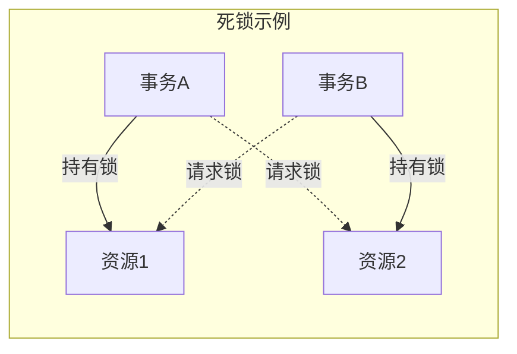

```sql
-- 典型的死锁示例

-- 会话A
START TRANSACTION;
UPDATE accounts SET balance = balance - 100 WHERE id = 1;
-- 此时持有id=1记录的X锁

-- 会话B
START TRANSACTION;
UPDATE accounts SET balance = balance - 200 WHERE id = 2;
-- 此时持有id=2记录的X锁

-- 会话A
UPDATE accounts SET balance = balance + 100 WHERE id = 2;
-- 请求id=2记录的X锁，被阻塞

-- 会话B
UPDATE accounts SET balance = balance + 200 WHERE id = 1;
-- 请求id=1记录的X锁，形成死锁
-- MySQL将检测到死锁并回滚其中一个事务
```

</TabItem>
<TabItem value="deadlock-detection" label="死锁检测与处理">

**MySQL具有内置的死锁检测和处理机制**：

1. **死锁检测机制**：
   - InnoDB有自动死锁检测功能
   - 通过建立等待图(wait-for graph)检测环路等待
   - 检测频率可配置

2. **死锁处理策略**：
   - **超时解决**：事务等待锁的时间超过`innodb_lock_wait_timeout`设置(默认50秒)时回滚
   - **死锁检测**：检测到死锁后立即选择一个事务回滚，让其他事务继续
   - **事务回滚选择**：通常选择回滚较小的事务(修改行数少，耗费资源少的)

3. **死锁日志记录**：
   - 死锁信息记录在错误日志中
   - 通过`SHOW ENGINE INNODB STATUS`查看最近的死锁信息

```sql
-- 相关配置参数
SHOW VARIABLES LIKE 'innodb_deadlock_detect';      -- 死锁检测开关(默认ON)
SHOW VARIABLES LIKE 'innodb_lock_wait_timeout';    -- 锁等待超时时间(默认50秒)

-- 调整死锁检测和超时设置
SET GLOBAL innodb_deadlock_detect = ON;           -- 启用死锁检测
SET GLOBAL innodb_lock_wait_timeout = 20;         -- 设置锁等待超时为20秒

-- 查看死锁信息
SHOW ENGINE INNODB STATUS\G

-- 死锁相关错误示例
-- 错误号: 1213
-- 错误信息: Deadlock found when trying to get lock; try restarting transaction
```

</TabItem>
<TabItem value="deadlock-prevention" label="死锁预防">

**通过合理的应用设计和事务管理，可以显著减少死锁发生**：

1. **访问资源顺序一致化**：
   - 所有事务按照相同的顺序访问表和行
   - 例如：总是先操作ID较小的记录，再操作ID较大的记录

2. **减少事务范围和持续时间**：
   - 将大事务拆分成多个小事务
   - 只在必要时才启动事务
   - 尽快提交事务，减少持有锁的时间

3. **使用合适的隔离级别**：
   - 考虑使用READ COMMITTED而非REPEATABLE READ以减少锁范围
   - 避免不必要的SERIALIZABLE隔离级别

4. **避免热点行更新**：
   - 例如避免使用集中式计数器
   - 可考虑分布式计数或异步更新

5. **使用乐观锁替代悲观锁**：
   - 通过版本号或时间戳实现乐观并发控制
   - 适用于读多写少的场景

```sql
-- 按固定顺序访问资源
-- 不好的实践(可能导致死锁)
START TRANSACTION;
UPDATE accounts SET balance = balance - 100 WHERE id = account_from;
UPDATE accounts SET balance = balance + 100 WHERE id = account_to;
COMMIT;

-- 好的实践(避免死锁)
START TRANSACTION;
-- 确保按ID升序操作
SET @id1 = LEAST(account_from, account_to);
SET @id2 = GREATEST(account_from, account_to);

UPDATE accounts SET balance = balance + (CASE WHEN id = account_from THEN -100 ELSE 100 END) 
WHERE id = @id1;

UPDATE accounts SET balance = balance + (CASE WHEN id = account_from THEN -100 ELSE 100 END) 
WHERE id = @id2;
COMMIT;
```

</TabItem>
<TabItem value="case-studies" label="死锁案例分析">

**分析和解决真实场景中的死锁问题**：

**案例1: 并发更新导致的死锁**

问题描述：电商系统中，订单处理和库存更新同时进行时频繁出现死锁。

死锁日志：
```
------------------------
LATEST DETECTED DEADLOCK
------------------------
2023-08-15 14:25:30 0x7f8a4c3bb700
*** (1) TRANSACTION:
TRANSACTION 10795, ACTIVE 0 sec starting index read
mysql tables in use 1, locked 1
LOCK WAIT 3 lock struct(s), heap size 1136, 2 row lock(s)
MySQL thread id 115, OS thread handle 139929774170880, query id 42041 localhost root updating
UPDATE inventory SET stock = stock - 1 WHERE product_id = 101 AND stock > 0

*** (2) TRANSACTION:
TRANSACTION 10794, ACTIVE 0 sec starting index read, thread declared inside InnoDB 5000
mysql tables in use 2, locked 2
4 lock struct(s), heap size 1136, 3 row lock(s)
MySQL thread id 114, OS thread handle 139929773891328, query id 42036 localhost root updating
UPDATE orders SET status = 'Processing' WHERE id = 5001 AND product_id = 101

*** (1) HOLDS THE LOCK(S):
RECORD LOCKS space id 10 page no 4 n bits 72 index PRIMARY of table `shop`.`orders` trx id 10795
*** (2) HOLDS THE LOCK(S):
RECORD LOCKS space id 11 page no 5 n bits 72 index PRIMARY of table `shop`.`inventory` trx id 10794
*** (1) WAITING FOR THIS LOCK TO BE GRANTED:
RECORD LOCKS space id 11 page no 5 n bits 72 index PRIMARY of table `shop`.`inventory` trx id 10795
*** (2) WAITING FOR THIS LOCK TO BE GRANTED:
RECORD LOCKS space id 10 page no 4 n bits 72 index PRIMARY of table `shop`.`orders` trx id 10794
```

解决方案：
1. 统一访问顺序：先更新inventory表，再更新orders表
2. 事务拆分：将库存检查和订单创建分为两个独立事务
3. 使用乐观锁：库存更新时使用条件检查而不是锁定读

```sql
-- 改进后的代码
-- 先检查库存
START TRANSACTION;
SELECT stock FROM inventory WHERE product_id = 101 FOR UPDATE;
-- 如果库存足够，更新库存并提交
UPDATE inventory SET stock = stock - 1 WHERE product_id = 101;
COMMIT;

-- 再处理订单
START TRANSACTION;
UPDATE orders SET status = 'Processing' WHERE id = 5001;
COMMIT;
```

**案例2: 外键约束导致的死锁**

问题描述：包含外键关系的表在并发插入和更新时产生死锁。

解决方案：
1. 减少外键约束或考虑在应用层实现约束
2. 按照一致的顺序访问相关表
3. 优化表结构，减少级联更新和删除

```sql
-- 检查外键定义
SHOW CREATE TABLE child_table;

-- 考虑修改外键选项
ALTER TABLE child_table 
DROP FOREIGN KEY fk_constraint_name,
ADD CONSTRAINT fk_constraint_name
FOREIGN KEY (parent_id) REFERENCES parent_table(id)
ON DELETE NO ACTION  -- 替代CASCADE
ON UPDATE NO ACTION; -- 替代CASCADE

-- 或在应用代码中实现约束逻辑
```

</TabItem>
</Tabs>

## 4. 查询优化与执行计划

MySQL查询优化和执行计划分析是提高数据库性能的关键技术，它涉及理解查询执行流程、解读执行计划并采用合适的优化策略。

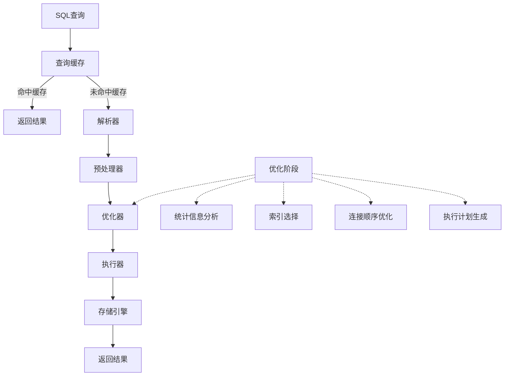

### 4.1 SQL执行流程

MySQL处理SQL查询时会经过一系列步骤，从解析到执行，每个阶段都有重要的性能影响。

<Tabs>
<TabItem value="execution-flow" label="查询执行流程">

**MySQL查询执行的完整流程包括以下几个阶段**：

1. **查询缓存检查（MySQL 8.0已移除）**：
   - 检查查询是否完全匹配缓存中的查询
   - 如果命中缓存，直接返回结果，流程结束
   - MySQL 8.0已移除查询缓存功能

2. **解析阶段**：
   - 词法分析：识别SQL语句中的关键字、表名、列名等
   - 语法分析：检查SQL语法是否正确
   - 生成解析树：创建SQL语句的内部表示结构

3. **预处理阶段**：
   - 检查表和列是否存在
   - 检查权限
   - 解析名称并将其与实际对象关联
   - 检查语句的语义是否有效

4. **优化阶段**：
   - 统计信息分析：评估表大小、列的基数、索引分布等
   - 索引选择：确定最佳索引访问方法
   - 连接顺序优化：决定多表连接的最佳顺序
   - 生成执行计划：创建SQL语句执行的详细步骤

5. **执行阶段**：
   - 根据执行计划执行SQL操作
   - 与存储引擎交互获取数据
   - 处理结果集
   - 返回结果给客户端

```sql
-- 查看查询执行各阶段时间
SET profiling = 1;
SELECT * FROM users WHERE status = 'active';
SHOW PROFILE;

-- 查看查询优化器的跟踪信息
SET optimizer_trace = 'enabled=on';
SELECT * FROM users WHERE status = 'active' ORDER BY created_at DESC LIMIT 10;
SELECT * FROM information_schema.OPTIMIZER_TRACE;
```

</TabItem>
<TabItem value="parser" label="解析与预处理">

**解析与预处理阶段是SQL执行的基础**：

1. **词法分析**：
   - 将SQL语句分解为标记（tokens）
   - 识别关键字、标识符、操作符、常量等
   - 处理字符集和编码

2. **语法分析**：
   - 根据MySQL语法规则检查SQL语句
   - 构建解析树（parse tree）
   - 报告语法错误

3. **预处理**：
   - 表名和列名解析：将名称映射到实际数据库对象
   - 权限检查：验证用户是否有权执行该查询
   - 语义分析：检查查询的逻辑有效性

**常见解析错误与解决方法**：

| 错误类型 | 示例错误信息 | 解决方法 |
|---------|------------|---------|
| 语法错误 | You have an error in your SQL syntax | 检查SQL语法，特别是括号、关键字拼写 |
| 表不存在 | Table 'db.table' doesn't exist | 确认表名和数据库名称 |
| 列不存在 | Unknown column 'column' in 'field list' | 检查列名是否正确，或该列是否存在 |
| 权限问题 | Access denied for user | 检查用户权限 |

```sql
-- 语法检查（不执行）
EXPLAIN FORMAT=JSON 
SELECT * FROM users WHERE id = 1;

-- 预处理命令查看
PREPARE stmt FROM 'SELECT * FROM users WHERE id = ?';
EXECUTE stmt USING 1;
DEALLOCATE PREPARE stmt;
```

</TabItem>
<TabItem value="optimizer" label="优化器">

**优化器负责生成最高效的执行计划**：

1. **优化器类型**：
   - **基于规则的优化（RBO）**：使用预定义规则选择执行策略
   - **基于成本的优化（CBO）**：评估多个执行计划的成本，选择成本最低的

2. **优化器的主要工作**：
   - **条件化简**：简化和转换WHERE条件
   - **索引选择**：选择最佳索引访问路径
   - **连接优化**：确定最佳表连接顺序和方法
   - **子查询转换**：尝试将子查询转换为更高效的形式
   - **排序优化**：决定如何处理ORDER BY子句

3. **统计信息的作用**：
   - 表行数、大小和分布统计
   - 索引基数和选择性
   - 列值分布
   - 用于成本估算和索引选择

```sql
-- 收集表统计信息
ANALYZE TABLE users;

-- 查看表统计信息
SHOW TABLE STATUS LIKE 'users';

-- 查看索引统计信息
SHOW INDEX FROM users;

-- MySQL 8.0+查看直方图统计
SELECT * FROM information_schema.COLUMN_STATISTICS 
WHERE SCHEMA_NAME = 'your_database' 
AND TABLE_NAME = 'users';

-- 控制优化器行为
SET optimizer_switch = 'index_merge=on,index_merge_union=on';

-- 优化器提示(MySQL 8.0+)
SELECT /*+ INDEX(users idx_email) */ * 
FROM users WHERE email LIKE 'a%';
```

</TabItem>
<TabItem value="execution" label="执行器">

**执行器负责按照优化器生成的计划执行查询**：

1. **执行器流程**：
   - 打开表：为涉及的每个表初始化处理器
   - 权限验证：再次检查表级权限
   - 执行操作：按照执行计划进行表扫描、连接等操作
   - 结果处理：返回或存储查询结果

2. **操作类型**：
   - 表扫描操作：全表扫描、索引扫描
   - 连接操作：嵌套循环连接、哈希连接等
   - 排序操作：内存排序、文件排序
   - 聚合操作：分组和聚合计算

3. **存储引擎接口**：
   - 执行器通过存储引擎API获取数据
   - 不同引擎实现不同的访问方法
   - 常见调用：索引读取、范围扫描、全表扫描

```sql
-- 执行统计信息
SHOW STATUS LIKE 'Handler%';

-- 查询执行状态
SHOW PROCESSLIST;

-- 慢查询监控
SHOW VARIABLES LIKE 'slow_query_log%';
SHOW VARIABLES LIKE 'long_query_time';

-- 终止长时间运行的查询
-- 先获取查询ID
SHOW PROCESSLIST;
-- 然后终止
KILL QUERY <query_id>;
```

</TabItem>
</Tabs>

### 4.2 执行计划解读

EXPLAIN命令是MySQL中分析和优化查询性能的重要工具，它揭示了MySQL如何执行查询，包括表的访问方法、连接类型和索引使用情况。

<Tabs>
<TabItem value="explain-basics" label="EXPLAIN基础">

**EXPLAIN命令的基本用法**：

```sql
-- 基本语法
EXPLAIN SELECT * FROM users WHERE status = 'active' ORDER BY created_at DESC LIMIT 10;

-- MySQL 8.0增强语法
EXPLAIN FORMAT=JSON SELECT * FROM users WHERE status = 'active';
EXPLAIN ANALYZE SELECT * FROM users WHERE status = 'active';
```

**EXPLAIN输出的关键列**：

| 列名 | 说明 | 重要值 |
|------|------|-------|
| **id** | 查询中SELECT的序号 | 数字越大越先执行；相同则从上往下 |
| **select_type** | SELECT查询类型 | SIMPLE, PRIMARY, SUBQUERY, DERIVED等 |
| **table** | 表名 | 实际表名或别名 |
| **type** | 访问类型 | system > const > eq_ref > ref > range > index > ALL |
| **possible_keys** | 可能使用的索引 | 可能使用的索引列表 |
| **key** | 实际使用的索引 | 实际选择的索引 |
| **key_len** | 使用的索引长度 | 使用索引字节长度 |
| **ref** | 索引比较的列 | 哪些列与索引进行比较 |
| **rows** | 估计检查的行数 | 估算的记录数，越少越好 |
| **filtered** | 按条件过滤的百分比 | 越高越好 |
| **Extra** | 附加信息 | Using index, Using filesort等 |

</TabItem>
<TabItem value="access-types" label="访问类型">

**type列表示表的访问方法，是判断查询好坏的重要依据**：

1. **system**：
   - 表中只有一行记录
   - 性能最优
   - 非常罕见

2. **const**：
   - 通过主键或唯一索引访问确定唯一一行数据
   - 非常快
   - 例：`WHERE id = 1`

3. **eq_ref**：
   - 连接查询中使用主键或唯一索引关联
   - 每个索引键值只读取一行数据
   - 例：`t1 JOIN t2 ON t1.id = t2.id`

4. **ref**：
   - 非唯一索引访问，可能找到多个匹配行
   - 例：`WHERE status = 'active'`（status有索引）

5. **range**：
   - 索引范围扫描
   - 例：`WHERE id BETWEEN 1 AND 10`

6. **index**：
   - 全索引扫描，扫描整个索引而非表
   - 例：索引覆盖查询，但无法使用索引过滤

7. **ALL**：
   - 全表扫描
   - 性能最差
   - 需要优化的首要目标

```sql
-- const访问类型
EXPLAIN SELECT * FROM users WHERE id = 1;

-- eq_ref访问类型
EXPLAIN SELECT * FROM orders o JOIN users u ON o.user_id = u.id;

-- ref访问类型
EXPLAIN SELECT * FROM users WHERE status = 'active';

-- range访问类型
EXPLAIN SELECT * FROM users WHERE id BETWEEN 1 AND 100;

-- ALL访问类型(全表扫描，通常需优化)
EXPLAIN SELECT * FROM users WHERE name LIKE '%John%';
```

</TabItem>
<TabItem value="extra-info" label="Extra信息">

**Extra列包含关于MySQL如何解析查询的重要信息**：

1. **Using index**：
   - 使用覆盖索引，不需要回表
   - 性能很好
   - 例：所有需要的列都在索引中

2. **Using where**：
   - 存储引擎返回的记录需要在server层过滤
   - 例：部分WHERE条件无法使用索引

3. **Using temporary**：
   - 需要创建临时表
   - 性能开销大
   - 例：查询包含GROUP BY/DISTINCT和ORDER BY不同列

4. **Using filesort**：
   - 需要额外的排序操作
   - 性能开销较大
   - 例：ORDER BY子句中的列不在索引中或顺序不一致

5. **Using index condition**：
   - 索引条件下推(ICP)，在存储引擎层过滤数据
   - MySQL 5.6+特性
   - 提高性能

6. **Using join buffer**：
   - 使用连接缓冲
   - 通常表示连接不高效
   - 例：没有使用索引的表连接

```sql
-- 覆盖索引示例
EXPLAIN SELECT id, status FROM users WHERE status = 'active';
-- Extra: Using index

-- 使用临时表示例
EXPLAIN SELECT status, COUNT(*) FROM users GROUP BY status ORDER BY created_at;
-- Extra: Using temporary; Using filesort

-- 索引条件下推示例
EXPLAIN SELECT * FROM users WHERE name LIKE 'Jo%' AND status = 'active';
-- Extra: Using index condition

-- 多重排序示例
EXPLAIN SELECT * FROM users ORDER BY status, name;
-- 可能显示：Using filesort
```

</TabItem>
<TabItem value="json-format" label="JSON格式解析">

**MySQL 8.0的EXPLAIN FORMAT=JSON提供了更详细的执行计划信息**：

```sql
EXPLAIN FORMAT=JSON 
SELECT u.*, o.order_id 
FROM users u 
JOIN orders o ON u.id = o.user_id 
WHERE u.status = 'active';
```

**JSON格式的关键优势**：

1. **成本估算详情**：
   - 查询成本细节
   - 访问方法评估
   - 索引使用细节

2. **嵌套循环细节**：
   - 循环迭代信息
   - 条件评估
   - 过滤率

3. **缓冲使用情况**：
   - 临时表信息
   - 排序缓冲细节
   - 连接缓冲配置

4. **索引选择理由**：
   - 显示为何选择特定索引
   - 为何拒绝其他索引
   - 基于成本的决策

**EXPLAIN ANALYZE**（MySQL 8.0.18+）:
```sql
EXPLAIN ANALYZE 
SELECT * FROM users WHERE status = 'active' 
ORDER BY created_at DESC LIMIT 10;
```

此命令不仅显示执行计划，还会实际执行查询并显示执行时间和实际行数，是优化查询的强大工具。

</TabItem>
</Tabs>

### 4.3 查询优化策略

良好的查询优化策略可以显著提高数据库性能，包括SQL语句优化、索引优化和查询重写技术。

<Tabs>
<TabItem value="sql-optimization" label="SQL语句优化">

**基本的SQL优化原则**：

1. **只查询需要的列**：
   ```sql
   -- 不推荐
   SELECT * FROM users WHERE status = 'active';
   
   -- 推荐
   SELECT id, name, email FROM users WHERE status = 'active';
   ```

2. **限制结果集大小**：
   ```sql
   -- 使用LIMIT控制返回行数
   SELECT * FROM logs ORDER BY created_at DESC LIMIT 100;
   
   -- 分页查询优化
   SELECT * FROM products 
   WHERE id > 10000 -- 上次查询的最后ID
   ORDER BY id LIMIT 20;
   ```

3. **避免全表扫描**：
   ```sql
   -- 不推荐(全表扫描)
   SELECT * FROM users WHERE YEAR(created_at) = 2023;
   
   -- 推荐(使用索引)
   SELECT * FROM users 
   WHERE created_at >= '2023-01-01' AND created_at < '2024-01-01';
   ```

4. **优化子查询**：
   ```sql
   -- 不推荐(相关子查询)
   SELECT * FROM orders o WHERE EXISTS (
       SELECT 1 FROM order_items oi WHERE oi.order_id = o.id AND oi.price > 100
   );
   
   -- 推荐(使用JOIN)
   SELECT DISTINCT o.* 
   FROM orders o
   JOIN order_items oi ON o.id = oi.order_id
   WHERE oi.price > 100;
   ```

5. **避免隐式类型转换**：
   ```sql
   -- 不推荐(导致索引失效)
   SELECT * FROM users WHERE id = '10';
   
   -- 推荐(保持类型一致)
   SELECT * FROM users WHERE id = 10;
   ```

</TabItem>
<TabItem value="index-optimization" label="索引优化">

**有效利用索引的策略**：

1. **为常用查询添加合适的索引**：
   ```sql
   -- 针对常见查询创建复合索引
   CREATE INDEX idx_status_created 
   ON users(status, created_at);
   
   -- 常用查询现在可以高效执行
   SELECT * FROM users 
   WHERE status = 'active' 
   ORDER BY created_at DESC LIMIT 10;
   ```

2. **覆盖索引优化**：
   ```sql
   -- 创建包含所有需要列的索引
   CREATE INDEX idx_product_cover 
   ON products(category_id, status, name, price);
   
   -- 查询只使用索引中的列，避免回表
   SELECT name, price FROM products
   WHERE category_id = 5 AND status = 'active';
   ```

3. **前缀索引优化**：
   ```sql
   -- 对长字符串列使用前缀索引
   CREATE INDEX idx_email_prefix ON users(email(10));
   
   -- 查找前缀选择性
   SELECT 
     COUNT(DISTINCT LEFT(email, 5))/COUNT(*) AS sel5,
     COUNT(DISTINCT LEFT(email, 10))/COUNT(*) AS sel10,
     COUNT(DISTINCT LEFT(email, 15))/COUNT(*) AS sel15
   FROM users;
   ```

4. **索引提示**：
   ```sql
   -- 强制使用特定索引
   SELECT * FROM products USE INDEX(idx_category) 
   WHERE category_id = 5;
   
   -- 忽略特定索引
   SELECT * FROM products IGNORE INDEX(idx_status) 
   WHERE category_id = 5 AND status = 'active';
   ```

5. **延迟关联优化**：
   ```sql
   -- 使用覆盖索引和延迟关联处理大结果集
   SELECT u.* FROM users u
   JOIN (
     SELECT id FROM users 
     WHERE status = 'active'
     ORDER BY created_at DESC
     LIMIT 1000
   ) tmp ON u.id = tmp.id;
   ```

</TabItem>
<TabItem value="query-rewrite" label="查询重写技术">

**查询重写技术可以改变查询的形式但保持功能等价**：

1. **IN子句替换OR**：
   ```sql
   -- 不推荐
   SELECT * FROM products 
   WHERE category_id = 1 OR category_id = 2 OR category_id = 3;
   
   -- 推荐
   SELECT * FROM products 
   WHERE category_id IN (1, 2, 3);
   ```

2. **UNION ALL替换UNION**：
   ```sql
   -- 使用UNION（执行去重）
   SELECT * FROM orders_2022
   UNION
   SELECT * FROM orders_2023;
   
   -- 使用UNION ALL（不去重，性能更好）
   SELECT * FROM orders_2022
   UNION ALL
   SELECT * FROM orders_2023;
   ```

3. **派生表优化**：
   ```sql
   -- 原始查询
   SELECT * FROM orders o
   WHERE o.amount > (
       SELECT AVG(amount) FROM orders
   );
   
   -- 优化后（派生表）
   SELECT o.* FROM orders o,
   (SELECT AVG(amount) AS avg_amount FROM orders) t
   WHERE o.amount > t.avg_amount;
   ```

4. **利用EXISTS替代IN子查询**：
   ```sql
   -- 使用IN子查询
   SELECT * FROM orders 
   WHERE customer_id IN (
       SELECT id FROM customers WHERE country = 'USA'
   );
   
   -- 使用EXISTS（通常更高效）
   SELECT * FROM orders o
   WHERE EXISTS (
       SELECT 1 FROM customers c 
       WHERE c.id = o.customer_id AND c.country = 'USA'
   );
   ```

5. **使用WITH子句（CTE）优化复杂查询**：
   ```sql
   -- 使用CTE简化复杂查询（MySQL 8.0+）
   WITH customer_stats AS (
       SELECT customer_id, COUNT(*) AS order_count, 
       SUM(amount) AS total_spent
       FROM orders
       GROUP BY customer_id
   )
   SELECT c.name, cs.order_count, cs.total_spent
   FROM customers c
   JOIN customer_stats cs ON c.id = cs.customer_id
   WHERE cs.total_spent > 10000;
   ```

</TabItem>
<TabItem value="common-mistakes" label="常见错误">

**避免这些常见的查询性能误区**：

1. **SELECT ***：
   - 问题：检索不需要的列，增加I/O和网络开销
   - 解决：只选择需要的列
   ```sql
   -- 避免
   SELECT * FROM large_table;
   -- 优化
   SELECT id, name FROM large_table;
   ```

2. **函数作用于索引列**：
   - 问题：导致索引失效
   - 解决：避免在索引列上使用函数
   ```sql
   -- 避免
   SELECT * FROM orders WHERE MONTH(order_date) = 6;
   -- 优化
   SELECT * FROM orders 
   WHERE order_date >= '2023-06-01' AND order_date < '2023-07-01';
   ```

3. **隐式类型转换**：
   - 问题：导致索引失效，执行全表扫描
   - 解决：保持类型一致性
   ```sql
   -- 避免
   SELECT * FROM users WHERE status = 1; -- status是VARCHAR
   -- 优化
   SELECT * FROM users WHERE status = '1';
   ```

4. **大表JOIN无索引**：
   - 问题：导致性能灾难
   - 解决：确保JOIN列有适当的索引
   ```sql
   -- 在JOIN前确保索引
   CREATE INDEX idx_user_id ON orders(user_id);
   ```

5. **不必要的ORDER BY**：
   - 问题：导致额外排序操作
   - 解决：只在需要时使用ORDER BY
   ```sql
   -- 避免(如果应用不关心顺序)
   SELECT * FROM users ORDER BY created_at;
   -- 优化
   SELECT * FROM users; -- 没有ORDER BY
   ```

6. **LIMIT不带ORDER BY**：
   - 问题：结果不确定
   - 解决：使用ORDER BY确保结果一致性
   ```sql
   -- 避免
   SELECT * FROM users LIMIT 10;
   -- 优化
   SELECT * FROM users ORDER BY id LIMIT 10;
   ```

</TabItem>
</Tabs>

### 4.4 JOIN优化技巧

连接查询是SQL中最强大也最容易导致性能问题的操作之一，合理优化JOIN操作可以显著提高查询性能。

<Tabs>
<TabItem value="join-types" label="连接类型">

**MySQL支持多种JOIN类型和实现算法**：

1. **内连接(INNER JOIN)**：
   - 仅返回两表中匹配的行
   ```sql
   SELECT u.name, o.order_id
   FROM users u
   INNER JOIN orders o ON u.id = o.user_id;
   ```

2. **左外连接(LEFT JOIN)**：
   - 返回左表所有行，右表不匹配则为NULL
   ```sql
   SELECT u.name, o.order_id
   FROM users u
   LEFT JOIN orders o ON u.id = o.user_id;
   ```

3. **右外连接(RIGHT JOIN)**：
   - 返回右表所有行，左表不匹配则为NULL
   ```sql
   SELECT u.name, o.order_id
   FROM users u
   RIGHT JOIN orders o ON u.id = o.user_id;
   ```

4. **连接算法**：
   - **嵌套循环连接(Nested-Loop Join)**：MySQL的主要连接算法
   - **哈希连接(Hash Join)**：MySQL 8.0.18+支持
   - **块嵌套循环(Block Nested-Loop)**：使用连接缓冲区的优化

```sql
-- 查看连接使用的算法
EXPLAIN FORMAT=JSON
SELECT u.name, o.order_id
FROM users u
JOIN orders o ON u.id = o.user_id
WHERE u.status = 'active';
```

</TabItem>
<TabItem value="join-optimization" label="JOIN优化策略">

**有效的JOIN优化策略**：

1. **确保JOIN条件列有索引**：
   ```sql
   -- 创建连接列上的索引
   ALTER TABLE orders ADD INDEX idx_user_id (user_id);
   ```

2. **小表驱动大表**：
   - 通过调整表顺序使小表作为驱动表
   ```sql
   -- 推荐（如果users表比orders小）
   SELECT u.name, o.order_id
   FROM users u
   JOIN orders o ON u.id = o.user_id;
   ```

3. **使用JOIN而非子查询**：
   ```sql
   -- 不推荐（子查询）
   SELECT * FROM users
   WHERE id IN (SELECT user_id FROM orders WHERE amount > 1000);
   
   -- 推荐（JOIN）
   SELECT DISTINCT u.*
   FROM users u
   JOIN orders o ON u.id = o.user_id
   WHERE o.amount > 1000;
   ```

4. **限制JOIN表数量**：
   - 避免一次JOIN过多表（通常不超过5个）
   - 考虑拆分复杂查询

5. **优化JOIN缓冲区**：
   ```sql
   -- 查看和调整join_buffer_size
   SHOW VARIABLES LIKE 'join_buffer_size';
   SET SESSION join_buffer_size = 4194304; -- 设置为4MB
   ```

</TabItem>
<TabItem value="subquery-vs-join" label="子查询与JOIN">

**了解何时使用子查询和JOIN**：

1. **相关子查询与JOIN对比**：
   ```sql
   -- 使用子查询
   SELECT * FROM departments d
   WHERE EXISTS (
       SELECT 1 FROM employees e
       WHERE e.department_id = d.id AND e.salary > 50000
   );
   
   -- 使用JOIN
   SELECT DISTINCT d.*
   FROM departments d
   JOIN employees e ON d.id = e.department_id
   WHERE e.salary > 50000;
   ```

2. **派生表的使用**：
   ```sql
   -- 使用派生表优化复杂查询
   SELECT e.*, avg_dept.avg_salary
   FROM employees e
   JOIN (
       SELECT department_id, AVG(salary) AS avg_salary
       FROM employees
       GROUP BY department_id
   ) avg_dept ON e.department_id = avg_dept.department_id
   WHERE e.salary > avg_dept.avg_salary;
   ```

3. **JOIN替代多表子查询**：
   ```sql
   -- 不推荐（多表子查询）
   SELECT * FROM products
   WHERE category_id IN (
       SELECT id FROM categories
       WHERE parent_id IN (
           SELECT id FROM categories WHERE name = 'Electronics'
       )
   );
   
   -- 推荐（多表JOIN）
   SELECT p.*
   FROM products p
   JOIN categories c1 ON p.category_id = c1.id
   JOIN categories c2 ON c1.parent_id = c2.id
   WHERE c2.name = 'Electronics';
   ```

4. **LATERAL JOIN（MySQL 8.0.14+）**：
   - 允许在FROM子句中引用前面表的列
   ```sql
   SELECT u.name, r.*
   FROM users u,
   LATERAL (
       SELECT * FROM reviews r
       WHERE r.user_id = u.id
       ORDER BY r.created_at DESC
       LIMIT 3
   ) r;
   ```

</TabItem>
<TabItem value="advanced-techniques" label="高级技术">

**复杂查询的高级优化技术**：

1. **使用STRAIGHT_JOIN控制连接顺序**：
   - 强制优化器按照FROM子句中表的顺序执行连接
   ```sql
   SELECT STRAIGHT_JOIN u.name, o.order_id
   FROM small_table s
   JOIN large_table l ON s.id = l.s_id;
   ```

2. **分治法解决大表连接**：
   - 将大表JOIN拆分为多个小查询
   ```sql
   -- 代替一次大JOIN
   SELECT * FROM orders o
   JOIN users u ON o.user_id = u.id
   WHERE o.created_at BETWEEN '2023-01-01' AND '2023-01-31';
   
   -- 可以按时间分区执行多个查询
   -- 查询第1周
   SELECT * FROM orders o
   JOIN users u ON o.user_id = u.id
   WHERE o.created_at BETWEEN '2023-01-01' AND '2023-01-07';
   -- 查询第2周...以此类推
   ```

3. **使用临时表优化复杂JOIN**：
   ```sql
   -- 第1步：创建临时表存储中间结果
   CREATE TEMPORARY TABLE tmp_results AS
   SELECT user_id, SUM(amount) AS total_spent
   FROM orders
   GROUP BY user_id;
   
   -- 第2步：为临时表创建索引
   ALTER TABLE tmp_results ADD INDEX (user_id);
   
   -- 第3步：与临时表JOIN
   SELECT u.*, t.total_spent
   FROM users u
   JOIN tmp_results t ON u.id = t.user_id;
   ```

4. **使用联合索引优化JOIN和WHERE条件**：
   ```sql
   -- 创建包含JOIN列和WHERE条件列的联合索引
   CREATE INDEX idx_user_status ON orders(user_id, status);
   
   -- 优化查询
   SELECT u.name, o.*
   FROM users u
   JOIN orders o ON u.id = o.user_id
   WHERE o.status = 'completed';
   ```

5. **使用哈希连接（MySQL 8.0.18+）**：
   ```sql
   -- 启用哈希连接
   SET optimizer_switch='block_nested_loop=off,hash_join=on';
   
   -- 适合无索引等值连接的查询
   SELECT *
   FROM large_table1 t1
   JOIN large_table2 t2 ON t1.attr = t2.attr;
   ```

</TabItem>
</Tabs>

## 5. 性能监控与调优

MySQL性能监控与调优是数据库管理的核心任务，通过监控关键指标和优化配置参数，可以显著提升数据库性能。

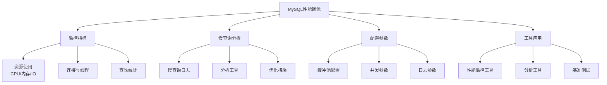

### 5.1 性能监控指标

有效的性能监控是优化的基础，通过监控关键指标可以及时发现潜在问题。

<Tabs>
<TabItem value="resource-metrics" label="资源指标">

**关键资源指标监控**：

| 指标类别 | 关键指标 | 说明 | 问题表现 |
|---------|---------|------|---------|
| **CPU** | 使用率 | MySQL服务器CPU使用率 | 持续超过70%需要关注 |
| | 查询线程CPU | 单个查询CPU占用 | 异常高可能有性能问题 |
| **内存** | 缓冲池使用率 | InnoDB缓冲池使用情况 | 低命中率表示配置不足 |
| | Swap使用 | 系统交换空间使用 | 大量使用表示内存不足 |
| **磁盘IO** | IOPS | 每秒I/O操作数 | 接近硬件上限表示I/O瓶颈 |
| | 等待时间 | I/O操作等待时间 | 高等待表示存储系统问题 |
| **网络** | 吞吐量 | 网络流入/流出速率 | 接近带宽上限表示网络瓶颈 |

```sql
-- 查看系统状态变量
SHOW GLOBAL STATUS LIKE 'Innodb_buffer_pool_%';
SHOW GLOBAL STATUS LIKE 'Threads_%';
SHOW GLOBAL STATUS LIKE 'Bytes_%';

-- 查看InnoDB状态
SHOW ENGINE INNODB STATUS\G
```

</TabItem>
<TabItem value="connection-metrics" label="连接与线程">

**连接与线程指标**：

1. **活跃连接数**：
   - 当前正在处理的连接数
   - 持续高值表示可能需要增加max_connections或检查连接泄漏

2. **线程统计**：
   - 运行中线程：正在执行的查询数
   - 连接中线程：已建立连接的线程数
   - 缓存线程：线程池中等待连接的线程

3. **连接错误**：
   - 拒绝的连接
   - 中断的连接

```sql
-- 查看当前连接
SHOW PROCESSLIST;

-- 连接统计
SHOW STATUS LIKE 'Threads_%';
SHOW STATUS LIKE '%connection%';

-- 最大连接设置
SHOW VARIABLES LIKE 'max_connections';
```

</TabItem>
<TabItem value="query-metrics" label="查询性能指标">

**查询性能关键指标**：

1. **查询吞吐量**：
   - Questions：服务器执行的查询数
   - Com_select/insert/update/delete：各类型SQL语句执行数
   - Queries per second (QPS)：每秒查询数

2. **查询效率指标**：
   - 慢查询数：执行时间超过long_query_time的查询数量
   - 全表扫描数：执行全表扫描的查询数量
   - 临时表创建数：查询执行过程中创建的临时表数量

3. **缓存指标**：
   - InnoDB缓冲池命中率
   - 表缓存命中率

```sql
-- 查询执行统计
SHOW GLOBAL STATUS LIKE 'Com_%';
SHOW GLOBAL STATUS LIKE 'Slow_queries';
SHOW GLOBAL STATUS LIKE 'Handler_%';

-- 计算QPS
SELECT VARIABLE_VALUE / UNIX_TIMESTAMP() - (
    SELECT VARIABLE_VALUE 
    FROM performance_schema.global_status 
    WHERE VARIABLE_NAME = 'UPTIME'
) AS QPS
FROM performance_schema.global_status 
WHERE VARIABLE_NAME = 'QUERIES';
```

</TabItem>
</Tabs>

### 5.2 慢查询分析

慢查询分析是优化数据库性能的重要手段，通过识别和优化慢SQL可以快速提升系统整体性能。

<Tabs>
<TabItem value="slow-log" label="慢查询日志">

**启用和配置慢查询日志**：

```sql
-- 查看慢查询日志配置
SHOW VARIABLES LIKE 'slow_query%';
SHOW VARIABLES LIKE 'long_query_time';

-- 启用慢查询日志
SET GLOBAL slow_query_log = 'ON';
SET GLOBAL long_query_time = 1;  -- 设置为1秒
SET GLOBAL slow_query_log_file = '/var/log/mysql/slow.log';
SET GLOBAL log_queries_not_using_indexes = 'ON';  -- 记录未使用索引的查询
```

**慢查询日志内容示例**：
```
# Time: 2023-08-11T10:15:30.123456Z
# User@Host: user[user] @ localhost []
# Query_time: 2.000123  Lock_time: 0.000012  Rows_sent: 1000  Rows_examined: 1000000
SET timestamp=1628675730;
SELECT * FROM large_table WHERE non_indexed_column = 'value';
```

**慢查询日志字段说明**：
- Query_time：查询执行时间（秒）
- Lock_time：获取锁的时间（秒）
- Rows_sent：返回给客户端的行数
- Rows_examined：检查的行数
- SQL语句本身

</TabItem>
<TabItem value="analysis-tools" label="分析工具">

**常用慢查询分析工具**：

1. **mysqldumpslow**：
   MySQL自带的分析工具，用于分析慢查询日志
   ```bash
   # 显示出现次数最多的10个慢查询
   mysqldumpslow -t 10 /var/log/mysql/slow.log
   
   # 按总执行时间排序
   mysqldumpslow -t 10 -s t /var/log/mysql/slow.log
   ```

2. **pt-query-digest**：
   Percona Toolkit中的工具，功能更强大
   ```bash
   # 分析慢查询日志
   pt-query-digest /var/log/mysql/slow.log
   
   # 直接分析MySQL进程
   pt-query-digest --processlist h=localhost
   ```

3. **MySQL Workbench**：
   图形化工具，包含性能仪表盘和查询分析功能

4. **Performance Schema**：
   MySQL内置的性能监控框架（MySQL 5.6+）
   ```sql
   -- 启用Performance Schema
   SET GLOBAL performance_schema = ON;
   
   -- 查看最耗时的SQL语句
   SELECT DIGEST_TEXT, COUNT_STAR, SUM_TIMER_WAIT
   FROM performance_schema.events_statements_summary_by_digest
   ORDER BY SUM_TIMER_WAIT DESC LIMIT 10;
   ```

</TabItem>
<TabItem value="optimization-steps" label="优化步骤">

**慢查询优化的一般步骤**：

1. **分析SQL问题**：
   - 使用EXPLAIN分析执行计划
   - 检查是否使用了适当的索引
   - 检查扫描的行数是否过多
   - 检查是否有临时表或排序操作

2. **添加合适的索引**：
   - 根据WHERE条件、JOIN条件、排序和分组字段添加索引
   - 考虑使用覆盖索引减少回表

3. **优化SQL语句**：
   - 只查询需要的列，避免SELECT *
   - 优化WHERE条件，确保可以使用索引
   - 简化JOIN，减少表数量
   - 使用LIMIT限制结果集大小

4. **表结构优化**：
   - 使用适当的数据类型（尽量小、尽量简单）
   - 考虑表分区
   - 规范化或反规范化设计，取决于查询模式

5. **服务器参数调整**：
   - 调整InnoDB缓冲池大小
   - 调整排序和连接缓冲区大小
   - 优化IO相关参数

</TabItem>
</Tabs>

### 5.3 配置参数优化

合理的MySQL配置参数对性能有着重要影响，需要根据服务器硬件资源和业务负载特点进行调整。

<Tabs>
<TabItem value="memory-config" label="内存相关参数">

**InnoDB缓冲池配置**：

```sql
-- 查看当前内存配置
SHOW VARIABLES LIKE 'innodb_buffer_pool_size';
SHOW VARIABLES LIKE '%buffer%';
```

**关键内存参数**：

| 参数 | 说明 | 建议值 |
|------|------|--------|
| **innodb_buffer_pool_size** | InnoDB缓冲池大小，缓存表和索引数据 | 服务器物理内存的50%-70% |
| **innodb_buffer_pool_instances** | 缓冲池实例数量，减少内部竞争 | 每实例不少于1GB |
| **sort_buffer_size** | 排序操作的缓冲区大小 | 256KB-4MB，过大反而有害 |
| **join_buffer_size** | 连接操作的缓冲区大小 | 256KB-4MB，不宜过大 |
| **read_buffer_size** | 顺序读取操作的缓冲区大小 | 128KB-8MB |
| **read_rnd_buffer_size** | 随机读取操作的缓冲区大小 | 128KB-8MB |
| **tmp_table_size** | 内存临时表的最大大小 | 16MB-64MB |

**配置示例**：
```ini
[mysqld]
# 假设服务器有32GB内存
innodb_buffer_pool_size = 20G
innodb_buffer_pool_instances = 8
sort_buffer_size = 2M
join_buffer_size = 2M
read_buffer_size = 1M
read_rnd_buffer_size = 1M
tmp_table_size = 32M
max_heap_table_size = 32M
```

</TabItem>
<TabItem value="io-config" label="I/O相关参数">

**I/O和日志相关参数**：

```sql
-- 查看I/O和日志配置
SHOW VARIABLES LIKE 'innodb_flush%';
SHOW VARIABLES LIKE 'innodb_log%';
```

**关键I/O参数**：

| 参数 | 说明 | 建议值 |
|------|------|--------|
| **innodb_flush_log_at_trx_commit** | 控制日志刷新到磁盘的频率 | 1最安全，0或2性能更好但可能丢数据 |
| **innodb_flush_method** | InnoDB数据和日志文件的刷新方法 | O_DIRECT绕过OS缓存，减少双重缓冲 |
| **innodb_log_file_size** | 重做日志文件大小 | 128MB-2GB，大值减少检查点频率 |
| **innodb_log_buffer_size** | 日志缓冲区大小 | 8MB-64MB |
| **innodb_io_capacity** | InnoDB后台I/O操作的上限 | 根据磁盘IOPS能力设置，SSD可设高值 |
| **innodb_write_io_threads** | InnoDB写I/O线程数 | 4-16，SSD可设更高 |
| **innodb_read_io_threads** | InnoDB读I/O线程数 | 4-16，SSD可设更高 |

**配置示例**：
```ini
[mysqld]
# SSD存储的配置
innodb_flush_log_at_trx_commit = 1
innodb_flush_method = O_DIRECT
innodb_log_file_size = 512M
innodb_log_buffer_size = 16M
innodb_io_capacity = 2000
innodb_io_capacity_max = 4000
innodb_write_io_threads = 8
innodb_read_io_threads = 8
```

</TabItem>
<TabItem value="concurrency-config" label="并发相关参数">

**并发控制参数**：

```sql
-- 查看并发相关配置
SHOW VARIABLES LIKE 'max_connections';
SHOW VARIABLES LIKE 'innodb_thread%';
SHOW VARIABLES LIKE '%timeout%';
```

**关键并发参数**：

| 参数 | 说明 | 建议值 |
|------|------|--------|
| **max_connections** | 最大客户端连接数 | 500-2000，取决于负载和硬件 |
| **thread_cache_size** | 线程缓存大小 | 8-16（小规模），32-64（大规模） |
| **innodb_thread_concurrency** | InnoDB并发线程数限制 | 0（无限制）或设为CPU核心数的2倍 |
| **innodb_lock_wait_timeout** | 事务等待行锁的超时时间 | 50（默认），高并发可调低 |
| **wait_timeout** | 非交互式连接超时时间 | 默认28800秒，可减小到300-1800 |
| **interactive_timeout** | 交互式连接超时时间 | 与wait_timeout相同 |

**配置示例**：
```ini
[mysqld]
max_connections = 1000
thread_cache_size = 32
innodb_thread_concurrency = 0
innodb_lock_wait_timeout = 30
wait_timeout = 600
interactive_timeout = 600
```

</TabItem>
</Tabs>

### 5.4 性能调优工具

MySQL生态系统提供了多种工具，帮助DBA和开发者监控、分析和优化数据库性能。

<Tabs>
<TabItem value="mysql-tools" label="MySQL内置工具">

**MySQL自带的性能工具**：

1. **Performance Schema**：
   - MySQL 5.6+内置性能监控系统
   - 收集服务器事件的低级信息
   - 几乎无性能影响
   ```sql
   -- 查看消耗资源最多的SQL
   SELECT DIGEST_TEXT, COUNT_STAR, AVG_TIMER_WAIT
   FROM performance_schema.events_statements_summary_by_digest
   ORDER BY AVG_TIMER_WAIT DESC LIMIT 10;
   
   -- 查看索引使用情况
   SELECT * FROM performance_schema.table_io_waits_summary_by_index_usage
   WHERE INDEX_NAME IS NOT NULL
   ORDER BY COUNT_STAR DESC;
   ```

2. **Information Schema**：
   - 提供数据库元数据的访问
   - 包含表、索引、进程等信息
   ```sql
   -- 查看表大小信息
   SELECT table_name, table_rows, data_length, index_length
   FROM information_schema.tables
   WHERE table_schema = 'your_database'
   ORDER BY data_length DESC;
   
   -- 查看正在执行的事务
   SELECT * FROM information_schema.innodb_trx;
   ```

3. **sys Schema**：
   - MySQL 5.7+提供
   - 简化Performance Schema使用的视图集合
   ```sql
   -- 查找IO密集型查询
   SELECT * FROM sys.io_global_by_file_by_bytes;
   
   -- 未使用的索引
   SELECT * FROM sys.schema_unused_indexes;
   ```

</TabItem>
<TabItem value="third-party-tools" label="第三方工具">

**流行的第三方监控和分析工具**：

1. **Percona Toolkit**：
   - 开源的MySQL管理和优化工具集
   - 包含pt-query-digest（慢查询分析）、pt-online-schema-change（在线表结构变更）等工具

2. **MySQL Workbench**：
   - Oracle官方图形化管理工具
   - 提供性能仪表盘、查询分析和可视化执行计划

3. **PMM (Percona Monitoring and Management)**：
   - 开源的MySQL监控解决方案
   - 提供实时监控仪表盘和性能分析

4. **ProxySQL**：
   - 高性能MySQL代理
   - 提供查询路由、连接池和监控功能

5. **监控集成工具**：
   - Prometheus + Grafana：流行的监控和可视化组合
   - Zabbix：企业级监控解决方案，有MySQL监控模板

</TabItem>
<TabItem value="benchmarking" label="基准测试">

**基准测试工具和方法**：

1. **基准测试目的**：
   - 评估服务器性能容量
   - 验证配置更改效果
   - 比较不同硬件或设置的性能差异
   - 发现性能瓶颈

2. **常用工具**：
   - **sysbench**：多线程性能基准测试工具
   - **mysqlslap**：MySQL内置的基准测试工具
   - **JMeter**：可用于模拟真实用户负载

3. **基准测试最佳实践**：
   - 使用与生产环境相似的数据量和分布
   - 测试多种并发用户场景
   - 测试不同类型的查询（读密集、写密集、混合）
   - 监控所有相关系统指标（CPU、内存、IO、网络）
   - 保持除测试变量外的所有配置不变

```bash
# sysbench OLTP读写测试示例
sysbench --db-driver=mysql --mysql-user=user --mysql-password=pass \
  --mysql-db=test --table-size=1000000 \
  /usr/share/sysbench/oltp_read_write.lua prepare

sysbench --db-driver=mysql --mysql-user=user --mysql-password=pass \
  --mysql-db=test --table-size=1000000 --threads=16 --time=60 \
  /usr/share/sysbench/oltp_read_write.lua run

# mysqlslap并发测试示例
mysqlslap --user=user --password=pass --host=localhost \
  --concurrency=50,100,200 --iterations=3 \
  --create-schema=test \
  --query="SELECT * FROM users WHERE status='active' LIMIT 100;"
```

</TabItem>
</Tabs>

## 6. 备份与恢复策略

数据库备份与恢复是保障数据安全的关键环节，完善的备份策略和定期的恢复演练可以有效降低数据丢失风险。

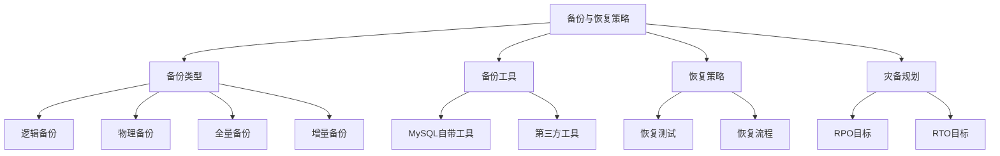

### 6.1 备份类型与方法

MySQL支持多种备份方法，需要根据数据量、可用时间窗口和恢复需求选择合适的备份类型。

<Tabs>
<TabItem value="backup-types" label="备份类型">

**MySQL备份类型对比**：

| 备份类型 | 特点 | 优势 | 劣势 | 适用场景 |
|---------|------|------|------|----------|
| **逻辑备份** | 导出SQL语句 | 可读性好，可跨版本 | 恢复慢，大数据量效率低 | 小型数据库，需要编辑备份内容 |
| **物理备份** | 复制数据文件 | 备份和恢复速度快 | 通常依赖特定版本 | 大型数据库，要求快速恢复 |
| **全量备份** | 备份全部数据 | 恢复简单直接 | 耗时长，占用空间大 | 定期基础备份 |
| **增量备份** | 仅备份变化数据 | 备份速度快，节省空间 | 恢复复杂，依赖前序备份 | 频繁备份，节省资源 |
| **差异备份** | 备份自上次全备后的所有变化 | 恢复比增量简单 | 备份体积随时间增大 | 平衡备份速度和恢复简便性 |

**其他备份分类维度**：

1. **热备份 vs 冷备份**：
   - 热备份：在线备份，不影响业务
   - 冷备份：离线备份，需要停止服务

2. **本地备份 vs 远程备份**：
   - 本地备份：存储在本地文件系统
   - 远程备份：存储在远程服务器或云存储

3. **压缩与不压缩**：
   - 压缩备份：节省存储空间，但增加CPU开销
   - 不压缩备份：备份速度更快，但占用更多空间

</TabItem>
<TabItem value="backup-methods" label="备份方法">

**常用的MySQL备份方法**：

1. **mysqldump（逻辑备份）**：
   - MySQL自带工具，导出SQL语句
   - 适合中小型数据库
   ```bash
   # 全库备份
   mysqldump -u root -p --all-databases > full_backup.sql
   
   # 单个数据库备份
   mysqldump -u root -p database_name > db_backup.sql
   
   # 备份特定表
   mysqldump -u root -p database_name table1 table2 > tables_backup.sql
   
   # 备份结构不备份数据
   mysqldump -u root -p --no-data database_name > schema_only.sql
   ```

2. **物理文件复制**：
   - 直接复制MySQL的数据文件
   - 必须在停止MySQL或锁表的情况下操作
   - 速度快，适合大数据量
   ```bash
   # 停止MySQL服务
   systemctl stop mysql
   
   # 复制数据目录
   cp -r /var/lib/mysql /backup/mysql_data
   
   # 启动MySQL服务
   systemctl start mysql
   ```

3. **使用InnoDB的在线备份**：
   - 利用InnoDB的表空间复制
   - 热备份，不影响业务运行
   - 通常需要特定工具支持（如Percona XtraBackup）
   
4. **二进制日志备份**：
   - 记录数据库的所有变更
   - 用于时间点恢复和增量备份
   ```bash
   # 启用二进制日志
   # my.cnf中添加：
   # log-bin=mysql-bin
   
   # 查看二进制日志列表
   mysqlbinlog --list
   
   # 备份二进制日志
   cp /var/lib/mysql/mysql-bin.* /backup/binlogs/
   ```

5. **数据库复制**：
   - 使用MySQL的复制功能作为备份策略
   - 实时同步数据到从服务器
   - 提供快速的故障切换能力

</TabItem>
<TabItem value="backup-strategy" label="备份策略">

**制定有效的备份策略**：

1. **备份频率**：
   - 根据数据变化频率和业务需求设置
   - 典型策略：每日全量 + 每小时增量

2. **备份轮换**：
   - 保留多个时间点的备份
   - 例如：保留最近7天的每日备份，最近4周的每周备份，最近12个月的每月备份

3. **存储位置**：
   - 遵循3-2-1原则：3份不同备份，2种存储介质，1份异地存储
   - 考虑使用云存储作为异地备份解决方案

4. **备份验证**：
   - 定期验证备份的完整性
   - 周期性执行恢复测试
   - 检查备份文件的有效性

5. **备份监控**：
   - 监控备份任务成功执行
   - 检查备份大小异常
   - 监控备份存储空间使用情况

**示例备份策略**：

```bash
# 每日凌晨全量备份脚本示例
#!/bin/bash
DATE=$(date +%Y%m%d)
mysqldump -u backup_user -ppassword --single-transaction --all-databases | gzip > /backup/daily/mysql_all_$DATE.sql.gz

# 复制备份到远程存储
rsync -avz /backup/daily/mysql_all_$DATE.sql.gz backup-server:/remote/backup/

# 保留最近30天的备份
find /backup/daily/ -name "mysql_all_*.sql.gz" -type f -mtime +30 -delete
```

</TabItem>
</Tabs>

### 6.2 备份工具对比

多种备份工具各有特点，选择合适的工具可以简化备份流程并提高可靠性。

<Tabs>
<TabItem value="mysql-tools" label="MySQL原生工具">

**MySQL自带的备份工具**：

1. **mysqldump**：
   - 最常用的逻辑备份工具
   - 优点：简单易用，跨版本兼容
   - 缺点：大数据量时性能较差
   - 适用场景：中小型数据库，需要可读备份

   ```bash
   # 增强的mysqldump选项
   mysqldump -u root -p \
     --single-transaction \    # 一致性快照，不锁表
     --routines \              # 包含存储过程和函数
     --triggers \              # 包含触发器
     --events \                # 包含事件
     --all-databases > full_backup.sql
   ```

2. **mysqlpump (MySQL 5.7+)**：
   - mysqldump的增强版
   - 支持并行备份多个数据库或表
   - 内置压缩功能
   - 更好的进度报告

   ```bash
   # 使用并行处理提高备份速度
   mysqlpump -u root -p \
     --parallel-schemas=4 \    # 并行备份4个schema
     --compress-output=zlib \  # 使用zlib压缩
     --all-databases > backup.sql.gz
   ```

3. **MySQL Shell Utilities (MySQL 8.0+)**：
   - 提供实例备份和表导出功能
   - 支持并行处理和压缩
   - 现代CLI界面

   ```bash
   # MySQL Shell中使用util.dumpInstance()
   mysqlsh -- util dumpInstance('/backup/dump', {
     'ocimds': true,
     'compression': 'zstd',
     'threads': 8
   })
   ```

4. **MySQL Enterprise Backup**：
   - Oracle商业版工具
   - 支持热备份InnoDB表
   - 支持增量备份
   - 加密备份支持

</TabItem>
<TabItem value="third-party" label="第三方备份工具">

**流行的第三方备份工具**：

1. **Percona XtraBackup**：
   - 开源的物理热备份工具
   - 支持InnoDB的在线备份
   - 全量和增量备份支持
   - 直接备份物理文件，速度快

   ```bash
   # 全量备份
   xtrabackup --backup --target-dir=/backup/full
   
   # 准备备份（使备份一致）
   xtrabackup --prepare --target-dir=/backup/full
   
   # 增量备份
   xtrabackup --backup --target-dir=/backup/inc1 \
     --incremental-basedir=/backup/full
   ```

2. **MariaDB Backup (mariabackup)**：
   - 基于XtraBackup的分支
   - 专为MariaDB优化
   - 功能与XtraBackup类似

3. **mydumper/myloader**：
   - 高性能的多线程备份工具
   - 比mysqldump快数倍
   - 支持表级并行备份和恢复

   ```bash
   # 并行备份
   mydumper -u root -p password -o /backup/mydumper \
     --threads=8 --compress --regex '^(?!(mysql|information_schema|performance_schema))'
   
   # 并行恢复
   myloader -u root -p password -d /backup/mydumper --threads=8
   ```

4. **业务自定义备份脚本**：
   - 结合多种工具定制备份流程
   - 集成监控和告警
   - 适应特定业务需求

</TabItem>
<TabItem value="comparison" label="工具对比">

**备份工具综合对比**：

| 工具 | 备份类型 | 速度 | 适用规模 | 在线备份 | 增量备份 | 易用性 | 开源 |
|------|---------|-----|---------|---------|---------|--------|------|
| **mysqldump** | 逻辑 | 慢 | 小/中 | 是* | 否 | 高 | 是 |
| **mysqlpump** | 逻辑 | 中 | 中 | 是* | 否 | 高 | 是 |
| **MySQL Shell** | 逻辑 | 中 | 中 | 是* | 否 | 中 | 是 |
| **XtraBackup** | 物理 | 快 | 中/大 | 是 | 是 | 中 | 是 |
| **mydumper** | 逻辑 | 中/快 | 中/大 | 是* | 否 | 中 | 是 |
| **Enterprise Backup** | 物理 | 快 | 中/大 | 是 | 是 | 中 | 否 |

* 使用`--single-transaction`选项在InnoDB表上实现无锁备份

**选择备份工具的考虑因素**：

1. **数据库大小**：
   - 数据量大时优先考虑物理备份或并行逻辑备份

2. **可用维护窗口**：
   - 维护窗口短时选择在线备份工具

3. **恢复时间要求**：
   - RTO要求低时优先考虑物理备份

4. **预算限制**：
   - 商业工具vs开源工具

5. **技术团队能力**：
   - 工具的学习曲线和团队熟悉度

6. **特殊需求**：
   - 跨版本迁移、部分数据恢复等

</TabItem>
</Tabs>

### 6.3 恢复策略与演练

有效的恢复策略和定期的恢复演练能够确保在灾难发生时能够快速恢复数据。

<Tabs>
<TabItem value="recovery-types" label="恢复类型">

**MySQL支持多种恢复类型**：

1. **完整数据库恢复**：
   - 恢复整个数据库实例
   - 通常用于灾难恢复

   ```bash
   # 从mysqldump恢复
   mysql -u root -p < full_backup.sql
   
   # 从XtraBackup恢复
   xtrabackup --copy-back --target-dir=/backup/full
   chown -R mysql:mysql /var/lib/mysql
   ```

2. **特定数据库恢复**：
   - 只恢复特定的数据库
   - 适用于单个数据库损坏或误删

   ```bash
   # 恢复单个数据库
   mysql -u root -p database_name < database_backup.sql
   ```

3. **表级恢复**：
   - 恢复特定的表
   - 适用于表损坏或数据错误

   ```bash
   # 恢复单个表
   mysql -u root -p database_name < table_backup.sql
   
   # 或者使用导入导出
   mysqldump -u root -p database_name table_name > table_backup.sql
   mysql -u root -p database_name < table_backup.sql
   ```

4. **时间点恢复(PITR)**：
   - 恢复到特定时间点的状态
   - 结合全量备份和二进制日志
   - 适用于数据错误或逻辑损坏

   ```bash
   # 1. 先恢复全量备份
   mysql -u root -p < full_backup.sql
   
   # 2. 应用二进制日志到特定时间点
   mysqlbinlog --stop-datetime="2023-08-11 14:30:00" \
     /var/lib/mysql/mysql-bin.000001 | mysql -u root -p
   ```

</TabItem>
<TabItem value="recovery-process" label="恢复流程">

**标准化的恢复流程**：

1. **评估与准备**：
   - 明确恢复目标和范围
   - 确定最佳恢复方法
   - 准备恢复环境（服务器、存储等）
   - 确认备份文件可用性

2. **执行恢复前的步骤**：
   - 停止受影响的服务（如需要）
   - 备份当前数据（防止恢复过程造成进一步损失）
   - 准备足够的磁盘空间

3. **执行恢复**：
   - 遵循预定的恢复程序
   - 记录恢复过程
   - 监控恢复进度

4. **验证恢复结果**：
   - 检查数据完整性
   - 验证应用程序功能
   - 确认数据一致性

5. **恢复后操作**：
   - 重新启动服务
   - 通知相关方恢复完成
   - 记录恢复时间和结果
   - 更新监控系统

**恢复流程文档示例**：
```
数据库恢复程序

1. 准备阶段
   - 确认备份文件位置：/backup/daily/mysql_all_20230810.sql.gz
   - 验证备份文件的完整性：md5sum /backup/daily/mysql_all_20230810.sql.gz
   - 确保恢复目标服务器磁盘空间充足

2. 执行恢复
   - 停止MySQL服务：systemctl stop mysql
   - 清理目标数据目录（如需要）：rm -rf /var/lib/mysql/*
   - 恢复数据：
     zcat /backup/daily/mysql_all_20230810.sql.gz | mysql -u root -p

3. 验证恢复
   - 启动MySQL服务：systemctl start mysql
   - 检查数据库状态：mysqladmin -u root -p status
   - 检查表数量：mysql -u root -p -e "SELECT COUNT(*) FROM information_schema.tables WHERE table_schema NOT IN ('information_schema', 'performance_schema', 'mysql');"
   - 检查关键表数据：mysql -u root -p -e "SELECT COUNT(*) FROM database.important_table;"

4. 记录结果
   - 记录恢复开始时间和结束时间
   - 记录恢复过程中的任何异常
   - 更新恢复记录文档
```

</TabItem>
<TabItem value="recovery-testing" label="恢复演练">

**恢复演练的重要性和方法**：

1. **演练目的**：
   - 验证备份的有效性和完整性
   - 测试恢复流程的可行性
   - 识别流程中的问题和瓶颈
   - 确保团队熟悉恢复步骤
   - 评估实际恢复时间（RTO）

2. **演练频率**：
   - 常规演练：每季度或半年一次
   - 关键系统：更频繁（如每月一次）
   - 流程变更后：应立即进行演练测试

3. **演练类型**：
   - **桌面演练**：模拟场景，讨论恢复步骤
   - **沙盒恢复**：在隔离环境中进行实际恢复
   - **全面演练**：模拟真实灾难，执行完整恢复流程
   - **随机测试**：不预先通知的恢复测试

4. **演练步骤**：
   - 定义演练目标和场景（如整库恢复、表恢复）
   - 准备测试环境
   - 执行恢复步骤
   - 验证恢复结果
   - 记录问题和改进点
   - 更新恢复文档

5. **演练评估指标**：
   - 恢复时间（与RTO目标对比）
   - 数据丢失量（与RPO目标对比）
   - 过程中遇到的问题
   - 团队协作效果

</TabItem>
</Tabs>

### 6.4 灾难恢复计划

完善的灾难恢复计划(DRP)是确保业务连续性的关键组成部分，为严重数据丢失或系统故障提供系统化的应对方案。

<Tabs>
<TabItem value="drp-basics" label="灾难恢复基础">

**灾难恢复关键概念**：

1. **恢复点目标(RPO)**：
   - 定义：可接受的最大数据丢失时间范围
   - 示例：RPO=1小时意味着最多可能丢失1小时的数据
   - 影响因素：备份频率、复制延迟

2. **恢复时间目标(RTO)**：
   - 定义：系统恢复到可用状态的目标时间
   - 示例：RTO=4小时意味着系统应在4小时内恢复服务
   - 影响因素：恢复过程复杂度、数据量、硬件可用性

3. **灾难恢复级别**：
   | 级别 | 描述 | RPO | RTO | 成本 |
   |------|------|-----|-----|------|
   | 0 | 无计划/仅备份 | 天/周 | 天/周 | 最低 |
   | 1 | 冷备用站点 | 小时/天 | 天 | 低 |
   | 2 | 温备用站点 | 小时 | 小时 | 中 |
   | 3 | 热备用站点 | 分钟 | 分钟/小时 | 高 |
   | 4 | 双活站点 | 秒/零 | 秒/零 | 最高 |

4. **灾难类型**：
   - 硬件故障：服务器、存储系统故障
   - 软件故障：数据库崩溃、配置错误
   - 人为错误：意外删除、错误操作
   - 自然灾害：火灾、水灾、地震等
   - 网络故障：网络中断、DDoS攻击
   - 数据中心故障：电力中断、制冷系统故障

</TabItem>
<TabItem value="drp-strategies" label="恢复策略">

**常用的MySQL灾难恢复策略**：

1. **备份恢复策略**：
   - 定期备份，灾难后从备份恢复
   - 优点：成本低，实现简单
   - 缺点：RPO和RTO较高，数据丢失风险大
   - 适用场景：非核心业务系统

2. **主从复制策略**：
   - 通过MySQL主从复制提供热备用系统
   - 优点：RPO较低，切换相对快速
   - 缺点：复制延迟导致部分数据丢失，需手动切换
   - 适用场景：重要业务系统

   ```ini
   # 主从复制配置(主服务器)
   [mysqld]
   server-id = 1
   log-bin = mysql-bin
   binlog-format = ROW
   sync-binlog = 1
   
   # 从服务器配置
   [mysqld]
   server-id = 2
   relay-log = relay-bin
   read_only = ON
   ```

3. **半同步复制策略**：
   - 在主从复制基础上增加同步确认
   - 优点：降低数据丢失风险
   - 缺点：增加写操作延迟，性能有所降低
   - 适用场景：需要更高数据安全保证的系统

   ```sql
   -- 主服务器安装并启用半同步复制
   INSTALL PLUGIN rpl_semi_sync_master SONAME 'semisync_master.so';
   SET GLOBAL rpl_semi_sync_master_enabled = 1;
   
   -- 从服务器安装并启用
   INSTALL PLUGIN rpl_semi_sync_slave SONAME 'semisync_slave.so';
   SET GLOBAL rpl_semi_sync_slave_enabled = 1;
   ```

4. **组复制策略(MySQL 5.7.17+)**：
   - 多节点同步复制，自动选主
   - 优点：高可用性，自动故障转移
   - 缺点：配置复杂，对网络要求高
   - 适用场景：核心业务系统

5. **双活数据中心策略**：
   - 两个数据中心同时提供读写服务
   - 实现方式：主-主复制或分布式数据库
   - 优点：RPO和RTO接近零
   - 缺点：成本高，复杂度高
   - 适用场景：关键业务系统

</TabItem>
<TabItem value="drp-implementation" label="实施建议">

**灾难恢复计划的实施建议**：

1. **文档化DRP流程**：
   - 灾难类型识别与响应流程
   - 清晰的责任分配
   - 详细的恢复步骤和检查清单
   - 恢复优先级定义
   - 联系人信息

2. **自动化恢复流程**：
   - 编写自动化恢复脚本
   - 使用监控工具自动检测故障
   - 减少人工干预降低错误风险

   ```bash
   #!/bin/bash
   # MySQL故障自动切换脚本示例
   
   # 检查主库状态
   if ! mysql -h master -u monitor -ppassword -e "SELECT 1" &>/dev/null; then
     echo "Master is down, initiating failover..."
     
     # 确认从库复制状态
     SLAVE_STATUS=$(mysql -h slave -u monitor -ppassword -e "SHOW SLAVE STATUS\G")
     
     if echo "$SLAVE_STATUS" | grep -q "Slave_IO_Running: Yes" && \
        echo "$SLAVE_STATUS" | grep -q "Slave_SQL_Running: Yes"; then
       
       # 从库提升为主库
       mysql -h slave -u root -ppassword -e "STOP SLAVE; RESET SLAVE ALL;"
       
       # 更新应用程序连接信息
       # ...
       
       echo "Failover completed successfully."
     else
       echo "Slave is not in sync, manual intervention required."
     fi
   fi
   ```

3. **分层恢复策略**：
   - 根据业务重要性分类系统
   - 为不同级别系统制定不同恢复策略
   - 核心系统：高可用方案，极低RTO/RPO
   - 一般系统：主从复制，适中RTO/RPO
   - 非关键系统：备份恢复，可接受较高RTO/RPO

4. **多层次备份策略**：
   - 本地备份：快速恢复
   - 远程备份：防止本地灾难
   - 云存储备份：长期归档，全球访问
   - 离线备份：防止勒索软件等逻辑攻击

5. **持续测试和改进**：
   - 定期的恢复演练
   - 根据演练结果更新DRP
   - 跟踪技术变化，持续现代化DRP

</TabItem>
</Tabs>

## 7. 高可用架构设计

高可用（High Availability，HA）是现代数据库架构的核心需求，它确保系统在面对故障时能够持续提供服务，最小化停机时间和数据丢失。

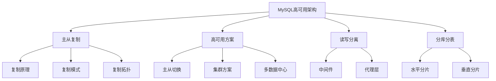

### 7.1 主从复制原理

主从复制是MySQL高可用架构的基础，它通过将主库的数据变更异步或同步地复制到从库，实现数据备份、读写分离和故障切换能力。

<Tabs>
<TabItem value="replication-basics" label="复制基础">

**MySQL复制的基本原理**：

1. **复制流程**：
   - 主库记录所有数据变更到二进制日志(binlog)
   - 从库的I/O线程读取主库的binlog并写入中继日志(relay log)
   - 从库的SQL线程重放中继日志中的事件，应用数据变更

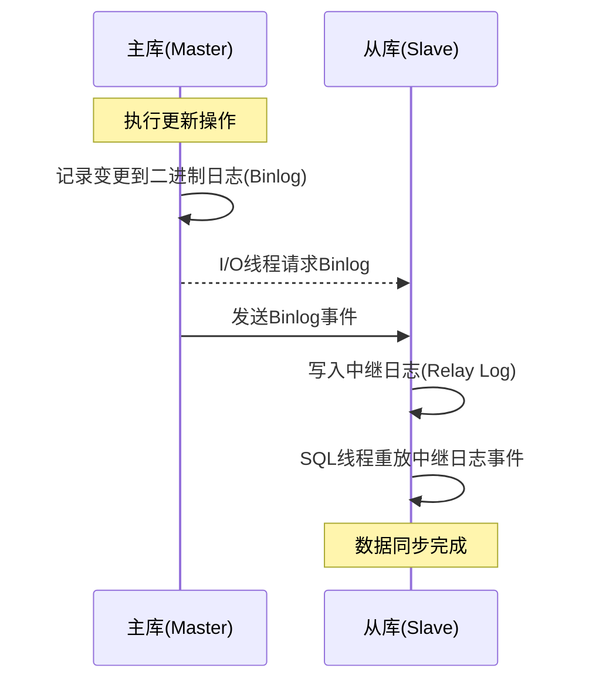

2. **复制方式**：
   - **基于语句的复制(SBR)**：复制SQL语句
   - **基于行的复制(RBR)**：复制行数据变更
   - **混合模式(MBR)**：根据情况选择SBR或RBR

3. **复制配置**：
   ```ini
   # 主库配置
   [mysqld]
   server-id = 1
   log-bin = mysql-bin
   binlog-format = ROW   # 推荐行格式复制
   
   # 从库配置
   [mysqld]
   server-id = 2
   relay-log = mysql-relay
   read_only = ON
   ```

4. **建立复制**：
   ```sql
   -- 在主库创建复制用户
   CREATE USER 'repl_user'@'%' IDENTIFIED BY 'password';
   GRANT REPLICATION SLAVE ON *.* TO 'repl_user'@'%';
   
   -- 获取主库状态
   SHOW MASTER STATUS;
   
   -- 在从库配置连接
   CHANGE MASTER TO
     MASTER_HOST='master_ip',
     MASTER_USER='repl_user',
     MASTER_PASSWORD='password',
     MASTER_LOG_FILE='mysql-bin.000001',
     MASTER_LOG_POS=123;
   
   -- 启动从库复制
   START SLAVE;
   
   -- 检查从库状态
   SHOW SLAVE STATUS\G
   ```

</TabItem>
<TabItem value="replication-types" label="复制类型">

**MySQL支持多种复制类型**：

1. **异步复制(Asynchronous Replication)**：
   - 默认的复制模式
   - 主库不等待从库确认就提交事务
   - 优点：性能高，对主库几乎无影响
   - 缺点：可能丢失数据，从库延迟

2. **半同步复制(Semi-synchronous Replication)**：
   - 主库等待至少一个从库确认接收事件后再提交事务
   - 优点：降低数据丢失风险
   - 缺点：略微增加响应延迟
   ```sql
   -- 在主库启用半同步复制
   INSTALL PLUGIN rpl_semi_sync_master SONAME 'semisync_master.so';
   SET GLOBAL rpl_semi_sync_master_enabled = 1;
   
   -- 在从库启用
   INSTALL PLUGIN rpl_semi_sync_slave SONAME 'semisync_slave.so';
   SET GLOBAL rpl_semi_sync_slave_enabled = 1;
   ```

3. **组复制(Group Replication)**：
   - MySQL 5.7.17+引入的多主复制技术
   - 基于分布式一致性原理(Paxos变种)
   - 支持单主模式和多主模式
   - 优点：自动故障检测和成员管理
   - 缺点：配置复杂，要求网络质量高
   ```sql
   -- 组复制配置示例(简化)
   [mysqld]
   server_id=1
   gtid_mode=ON
   enforce_gtid_consistency=ON
   binlog_checksum=NONE
   plugin_load='group_replication.so'
   group_replication_group_name="aaaaaaaa-bbbb-cccc-dddd-eeeeeeeeeeee"
   group_replication_start_on_boot=OFF
   group_replication_bootstrap_group=OFF
   ```

4. **基于GTID的复制**：
   - 全局事务标识符(Global Transaction Identifier)
   - 每个事务分配唯一的ID
   - 优点：简化复制管理，自动定位复制位置
   ```sql
   -- 启用GTID复制
   [mysqld]
   gtid_mode=ON
   enforce_gtid_consistency=ON
   
   -- 使用GTID配置从库
   CHANGE MASTER TO 
     MASTER_HOST='master_ip',
     MASTER_USER='repl_user',
     MASTER_PASSWORD='password',
     MASTER_AUTO_POSITION=1;  -- 使用GTID定位
   ```

</TabItem>
<TabItem value="replication-topologies" label="复制拓扑">

**常见的MySQL复制拓扑结构**：

1. **单主-单从复制**：
   - 最简单的复制结构
   - 一个主库，一个从库
   - 适用：小规模系统，基本高可用需求


2. **单主-多从复制**：
   - 一个主库，多个从库
   - 支持读扩展，分担读负载
   - 适用：读多写少的应用

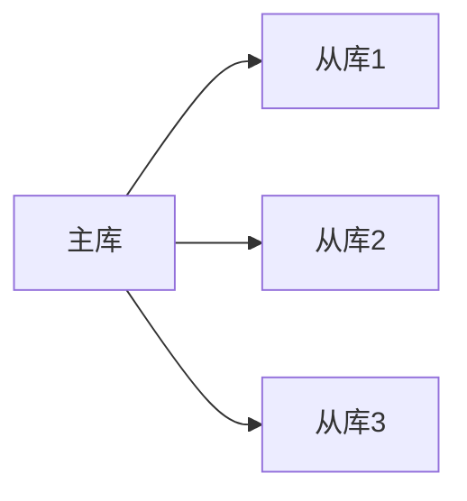

3. **级联复制**：
   - 从库作为其他从库的主库
   - 减轻主库的复制压力
   - 适用：大量从库场景，跨地域复制

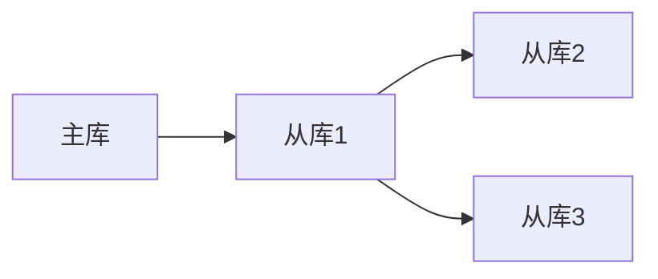

4. **主-主复制**：
   - 两个服务器互为主从
   - 支持双向写入
   - 适用：需要双活的场景
   - 挑战：需要避免冲突


5. **环形复制**：
   - 多个服务器形成环形结构
   - 每个节点既是主库也是从库
   - 适用：多地域写入需求
   - 挑战：复杂的冲突处理


6. **组复制拓扑**：
   - 基于组复制技术
   - 支持单主模式和多主模式
   - 适用：需要自动故障转移的核心系统

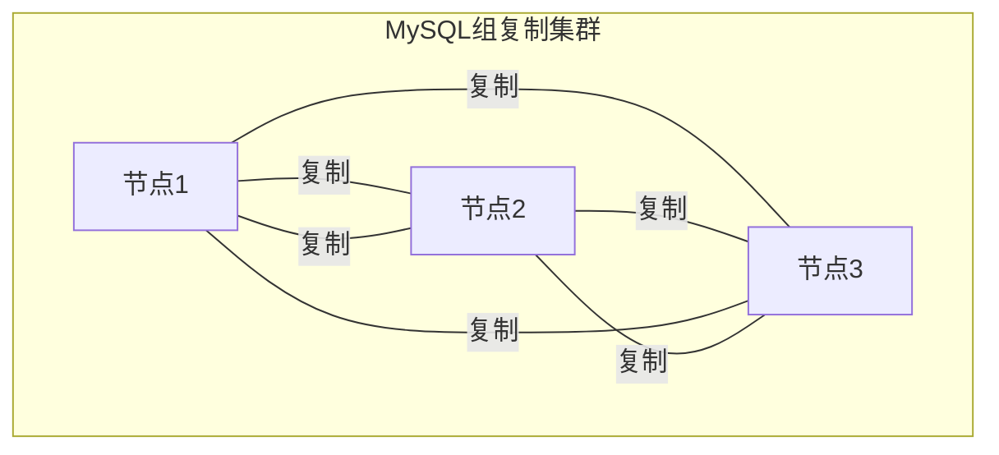

</TabItem>
</Tabs>

### 7.2 高可用架构方案

高可用架构通过合理的组件设计，确保在单点故障时系统能够快速恢复，保证服务的连续性。

<Tabs>
<TabItem value="ha-solutions" label="高可用方案">

**MySQL常见的高可用解决方案**：

1. **主从切换方案**：
   - 基于主从复制，故障时手动或自动切换主库
   - 特点：实现简单，广泛适用
   - 缺点：切换有延迟，可能丢失数据

2. **MMM (Master-Master replication Manager)**：
   - 用于管理和监控主-主复制
   - 提供自动故障检测和切换
   - 通过VIP漂移实现应用透明访问
   - 现已较少使用，被更现代的工具取代

3. **MHA (Master High Availability)**：
   - 日本DeNA公司开发的开源工具
   - 监控主库，自动进行故障转移
   - 特点：快速故障检测，尝试保留所有事务
   - 适用：对主库可用性要求高的场景

4. **MySQL InnoDB Cluster**：
   - MySQL官方的高可用解决方案
   - 基于组复制、MySQL Router和MySQL Shell
   - 特点：自动化部署和管理，内置读写分离
   - 适用：需要官方支持的企业环境

5. **Percona XtraDB Cluster (PXC)**：
   - 基于Galera集群技术
   - 支持多主模式，同步复制
   - 特点：强一致性，无数据丢失，自动成员管理
   - 适用：对数据一致性要求高的场景

6. **MariaDB Galera Cluster**：
   - MariaDB基于Galera的集群解决方案
   - 类似于Percona XtraDB Cluster
   - 特点：多主架构，同步复制
   - 适用：高可用性和强一致性需求

</TabItem>
<TabItem value="failover" label="故障转移">

**故障转移(Failover)机制**：

1. **故障检测**：
   - 心跳检测：定期发送心跳包
   - 状态监控：监控主库状态
   - 复制延迟：监控复制延迟

2. **手动故障转移**：
   - 管理员手动执行主从切换
   - 步骤：提升从库、更新路由配置、通知应用
   ```sql
   -- 在从库执行
   STOP SLAVE;
   RESET SLAVE ALL;
   
   -- 更新应用连接配置
   -- 通知应用重新连接
   ```

3. **自动故障转移**：
   - 自动检测故障并执行切换
   - 需要解决的问题：
     - 脑裂(Split Brain)：双主情况
     - 数据一致性：确保无数据丢失
     - 客户端路由：切换后连接重定向

4. **MHA故障转移流程**：
   ```mermaid
   sequenceDiagram
       participant MHA as MHA Manager
       participant M as 主库
       participant S1 as 从库1
       participant S2 as 从库2
       
       MHA->>M: 心跳检测
       Note over MHA,M: 主库故障
       MHA->>S1: 检查复制状态
       MHA->>S2: 检查复制状态
       MHA->>S1: 应用未传输的事务
       MHA->>S1: 提升为新主库
       MHA->>S2: 指向新主库
       Note over MHA: 更新VIP/DNS
   ```

5. **故障转移考虑因素**：
   - 数据一致性：确保无数据丢失
   - 转移时间：最小化停机时间
   - 应用透明：应用无需感知切换
   - 自动恢复：原主库恢复后的角色

</TabItem>
<TabItem value="ha-implementation" label="实现要点">

**高可用架构实现的关键要点**：

1. **VIP(虚拟IP)漂移**：
   - 将服务IP绑定到当前主库
   - 切换时将IP迁移到新主库
   - 对应用透明，无需修改连接参数
   ```bash
   # VIP切换示例(Linux)
   ip addr add 192.168.1.100/24 dev eth0
   arping -U -I eth0 192.168.1.100
   ```

2. **负载均衡器**：
   - 使用负载均衡器检测节点状态
   - 故障时自动切换流量
   - 例如：HAProxy, Nginx, LVS

3. **DNS切换**：
   - 修改DNS记录指向新主库
   - 优点：简单实现
   - 缺点：受DNS缓存影响，切换不及时

4. **分布式共识**：
   - 使用ZooKeeper, etcd等管理集群状态
   - 防止脑裂，确保节点一致性视图
   - 存储当前主库位置信息

5. **监控与告警**：
   - 全面监控复制状态
   - 监控关键指标：复制延迟、线程状态
   - 设置告警阈值，及时通知异常

6. **高可用测试**：
   - 定期进行故障演练
   - 验证故障转移机制
   - 测试不同故障场景的恢复能力

</TabItem>
<TabItem value="comparison" label="方案对比">

**MySQL高可用方案对比**：

| 方案 | 复制模式 | 自动故障转移 | 一致性级别 | 读扩展 | 写扩展 | 复杂度 | 适用场景 |
|------|---------|------------|-----------|-------|-------|-------|---------|
| **主从+手动切换** | 异步/半同步 | 否 | 最终一致 | 是 | 否 | 低 | 小型系统，可接受短暂停机 |
| **MHA** | 异步/半同步 | 是 | 最终一致 | 是 | 否 | 中 | 需要自动故障转移的系统 |
| **InnoDB Cluster** | 组复制 | 是 | 强一致 | 是 | 单主模式下否 | 中高 | 企业级应用，需要官方支持 |
| **Percona XtraDB Cluster** | 同步复制 | 是 | 强一致 | 是 | 是 | 高 | 对一致性要求高的关键系统 |
| **MariaDB Galera Cluster** | 同步复制 | 是 | 强一致 | 是 | 是 | 高 | 高并发读写，无数据丢失要求 |
| **MySQL NDB Cluster** | 同步 | 是 | 强一致 | 是 | 是 | 最高 | 高性能、高可用性要求的大型系统 |

**选择高可用方案的考虑因素**：

1. **业务需求**：
   - RTO/RPO要求
   - 数据一致性要求
   - 读写分离需求
   - 地理分布需求

2. **技术约束**：
   - 基础设施支持
   - 网络延迟
   - 技术团队能力
   - 现有系统集成

3. **成本因素**：
   - 硬件投入
   - 许可成本
   - 运维复杂度
   - 培训成本

</TabItem>
</Tabs>

### 7.3 读写分离实现

读写分离是MySQL高可用架构中的常用策略，通过将读请求分发到从库，写请求发送到主库，有效提升系统的并发处理能力。

<Tabs>
<TabItem value="rw-basics" label="原理与实现">

**读写分离的基本原理**：

1. **核心思想**：
   - 写操作(INSERT/UPDATE/DELETE)发送到主库
   - 读操作(SELECT)分发到多个从库
   - 提高系统整体并发处理能力

2. **实现方式**：
   - **应用层实现**：应用程序根据操作类型选择连接
   - **中间件实现**：通过代理拦截并路由SQL
   - **数据库代理**：专用数据库代理实现透明路由

3. **基础架构**：
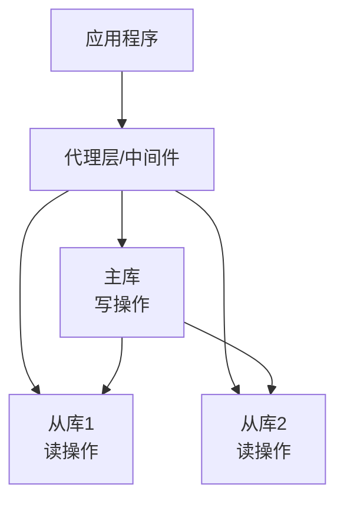

4. **核心问题**：
   - **主从延迟**：复制延迟导致从库数据不是最新
   - **数据一致性**：如何处理写后立即读的情况
   - **负载均衡**：如何在多个从库间分配读请求
   - **故障处理**：从库故障时如何调整路由

</TabItem>
<TabItem value="middleware" label="中间件方案">

**读写分离中间件**：

1. **MySQL Router**：
   - Oracle官方提供的轻量级中间件
   - 集成在MySQL InnoDB Cluster中
   - 支持自动故障转移
   - 简单配置，易于部署
   ```ini
   # MySQL Router配置示例
   [routing:primary]
   bind_address=0.0.0.0
   bind_port=7001
   destinations=primary
   routing_strategy=first-available
   
   [routing:secondary]
   bind_address=0.0.0.0
   bind_port=7002
   destinations=secondary
   routing_strategy=round-robin
   ```

2. **ProxySQL**：
   - 高性能MySQL代理
   - 支持复杂查询路由规则
   - 内置查询缓存和连接池
   - 高级负载均衡和监控功能
   ```cnf
   # ProxySQL简化配置示例
   mysql_servers =
   (
       { address="master.example.com", port=3306, hostgroup=0, max_connections=200 },
       { address="slave1.example.com", port=3306, hostgroup=1, max_connections=200 },
       { address="slave2.example.com", port=3306, hostgroup=1, max_connections=200 }
   )
   
   mysql_query_rules =
   (
       {
           rule_id=1, active=1,
           match_pattern="^SELECT.*FOR UPDATE$",
           destination_hostgroup=0,
           apply=1
       },
       {
           rule_id=2, active=1,
           match_pattern="^SELECT",
           destination_hostgroup=1,
           apply=1
       },
       {
           rule_id=3, active=1,
           destination_hostgroup=0,
           apply=1
       }
   )
   ```

3. **MyCat**：
   - Java开发的开源数据库中间件
   - 支持读写分离和分库分表
   - 兼容多种数据库
   - 提供复杂的查询拆分能力

4. **HAProxy**：
   - 高性能TCP/HTTP负载均衡器
   - 可用于MySQL连接路由
   - 支持健康检查和故障转移
   - 功能相对简单，主要提供负载均衡

</TabItem>
<TabItem value="application" label="应用层方案">

**应用层读写分离实现**：

1. **多数据源配置**：
   - 在应用中配置主从数据源
   - 根据操作类型选择数据源
   - 优点：灵活控制，减少额外组件
   - 缺点：耦合业务逻辑，增加开发复杂度

2. **Java示例(Spring)**：
```java
@Configuration
public class DataSourceConfig {
    
    @Bean
    @ConfigurationProperties("spring.datasource.master")
    public DataSource masterDataSource() {
        return DataSourceBuilder.create().build();
    }
    
    @Bean
    @ConfigurationProperties("spring.datasource.slave")
    public DataSource slaveDataSource() {
        return DataSourceBuilder.create().build();
    }
    
    @Primary
    @Bean
    public DataSource routingDataSource() {
        ReadWriteRoutingDataSource proxy = new ReadWriteRoutingDataSource();
        
        Map<Object, Object> targetDataSources = new HashMap<>();
        targetDataSources.put(DbType.MASTER, masterDataSource());
        targetDataSources.put(DbType.SLAVE, slaveDataSource());
        
        proxy.setDefaultTargetDataSource(masterDataSource());
        proxy.setTargetDataSources(targetDataSources);
        
        return proxy;
    }
}

public class ReadWriteRoutingDataSource extends AbstractRoutingDataSource {
    @Override
    protected Object determineCurrentLookupKey() {
        return TransactionSynchronizationManager.isCurrentTransactionReadOnly() 
               ? DbType.SLAVE : DbType.MASTER;
    }
}
```

3. **注解式路由**：
```java
@Service
public class UserService {
    
    @Transactional(readOnly = true)  // 使用从库
    public User findById(Long id) {
        return userRepository.findById(id).orElse(null);
    }
    
    @Transactional  // 使用主库
    public User save(User user) {
        return userRepository.save(user);
    }
}
```

4. **一致性处理策略**：
   - **强一致读**：重要查询固定走主库
   - **会话一致读**：写操作后的同一会话读走主库
   - **延时容忍**：接受一定的数据延迟
   - **提示选择**：允许客户端指定路由规则

</TabItem>
<TabItem value="best-practices" label="最佳实践">

**读写分离最佳实践**：

1. **从库复制方案**：
   - 考虑使用半同步复制减少数据丢失风险
   - 监控复制延迟，设置合理的告警阈值
   - 复制过滤器配置：只复制必要的数据库

2. **主从库配置差异**：
   - 主库：优化写入性能，确保数据安全
   - 从库：优化查询性能，增大读缓存
   ```ini
   # 主库配置
   innodb_flush_log_at_trx_commit = 1  # 确保数据安全
   sync_binlog = 1                     # 确保binlog安全
   
   # 从库配置
   innodb_buffer_pool_size = 12G       # 较大的缓冲池
   read_only = ON                      # 防止意外写入
   ```

3. **从库负载均衡策略**：
   - **轮询(Round Robin)**：平均分配查询
   - **加权轮询**：按能力分配负载
   - **最少连接**：发送到最空闲的从库
   - **响应时间**：发送到响应最快的从库

4. **解决主从延迟问题**：
   - **写后读主库**：关键查询直接读主库
   - **延迟检测**：检测从库延迟，超阈值切到主库
   - **版本号机制**：记录数据版本，等从库同步
   - **队列延迟**：写入后等待一定时间再查询

5. **监控指标**：
   - 从库复制延迟
   - 从库复制状态
   - 读写查询分布比例
   - 各从库负载均衡情况
   - 关键SQL的响应时间

6. **故障恢复计划**：
   - 从库故障：自动从负载均衡池移除
   - 主库故障：自动故障转移和路由更新
   - 定期演练故障场景，验证恢复机制

</TabItem>
</Tabs>

### 7.4 分库分表方案

随着数据量和访问量的增长，单个MySQL实例可能无法满足性能需求，此时需要通过分库分表实现水平扩展。

<Tabs>
<TabItem value="sharding-basics" label="分片基础">

**分库分表基本概念**：

1. **分库分表的类型**：
   - **垂直分库**：按业务拆分到不同数据库实例
   - **水平分库**：同一业务数据分散到多个数据库实例
   - **垂直分表**：按列拆分成多个表
   - **水平分表**：按行拆分成多个表

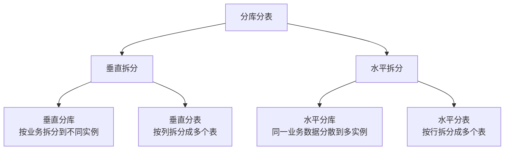

2. **分片策略**：
   - **范围分片**：按数据范围划分，如按ID范围
   - **哈希分片**：按哈希值划分，如用户ID哈希
   - **列表分片**：按固定列表值划分，如按地区
   - **复合分片**：结合多种策略，如月份+哈希

3. **分片键选择**：
   - 分片键应具有良好的分布性
   - 避免频繁跨片查询的字段
   - 考虑业务访问模式和增长趋势
   - 常用分片键：用户ID、订单ID、时间等

</TabItem>
<TabItem value="sharding-tools" label="分片工具">

**常用的MySQL分库分表工具**：

1. **ShardingSphere**：
   - Apache顶级项目，原Sharding-JDBC
   - 提供JDBC、Proxy和Sidecar三种模式
   - 支持分库分表、读写分离、分布式事务
   - Java生态系统中使用广泛
   ```yaml
   # ShardingSphere-JDBC配置示例
   dataSources:
     ds0: !!org.apache.commons.dbcp.BasicDataSource
       driverClassName: com.mysql.jdbc.Driver
       url: jdbc:mysql://localhost:3306/ds0
       username: root
       password: root
     ds1: !!org.apache.commons.dbcp.BasicDataSource
       driverClassName: com.mysql.jdbc.Driver
       url: jdbc:mysql://localhost:3306/ds1
       username: root
       password: root
   
   shardingRule:
     tables:
       t_order:
         actualDataNodes: ds${0..1}.t_order${0..1}
         databaseStrategy:
           inline:
             shardingColumn: user_id
             algorithmExpression: ds${user_id % 2}
         tableStrategy:
           inline:
             shardingColumn: order_id
             algorithmExpression: t_order${order_id % 2}
   ```

2. **MyCat**：
   - 基于Cobar的分布式数据库中间件
   - 支持分库分表、读写分离、SQL路由
   - 独立部署，支持多种语言客户端
   ```xml
   <!-- MyCat配置示例 -->
   <schema name="TESTDB" checkSQLschema="false" sqlMaxLimit="100">
     <table name="travelrecord" primaryKey="ID" dataNode="dn1,dn2" rule="auto-sharding-long" />
   </schema>
   
   <dataNode name="dn1" dataHost="localhost1" database="db1" />
   <dataNode name="dn2" dataHost="localhost1" database="db2" />
   
   <dataHost name="localhost1" maxCon="1000" minCon="10" balance="0" writeType="0" dbType="mysql" dbDriver="native">
     <heartbeat>select user()</heartbeat>
     <writeHost host="hostM1" url="localhost:3306" user="root" password="root">
       <readHost host="hostS1" url="localhost:3307" user="root" password="root" />
     </writeHost>
   </dataHost>
   ```

3. **Vitess**：
   - YouTube开发的开源MySQL数据库集群系统
   - 支持水平扩展、主从复制管理
   - 基于Go语言，适合超大规模部署
   - 被Kubernetes原生支持

4. **数据库自身分区**：
   - MySQL内置的表分区功能
   - 对应用透明，不需要修改代码
   - 支持范围、列表、哈希等分区类型
   - 单实例内部分区，不是真正的分布式

</TabItem>
<TabItem value="challenges" label="挑战与解决">

**分库分表面临的挑战及解决方案**：

1. **分布式事务问题**：
   - **挑战**：跨库事务一致性难保证
   - **解决方案**：
     - 柔性事务：最终一致性模型
     - XA事务：基于两阶段提交
     - 业务补偿：通过补偿机制修正错误
     - 避免跨库事务：调整业务设计

2. **跨库关联查询**：
   - **挑战**：无法直接JOIN跨库表
   - **解决方案**：
     - 冗余字段：适度数据冗余
     - 字段冗余：减少关联查询
     - 应用层组装：多次查询在应用层聚合
     - 数据集中层：使用数据仓库聚合分析

3. **全局唯一ID**：
   - **挑战**：跨库表需要全局唯一ID
   - **解决方案**：
     - UUID：简单但性能不佳
     - 雪花算法(Snowflake)：高性能分布式ID
     - 数据库序列：单独的序列服务
     - 号段模式：批量获取ID段

4. **分页排序问题**：
   - **挑战**：跨库分页和排序复杂
   - **解决方案**：
     - 最简单分页：仅按分片键排序
     - 全局排序：在应用层合并结果
     - 流式查询：使用游标分批获取
     - 二次查询：先获取ID再查详情

5. **扩容与数据迁移**：
   - **挑战**：在线扩容不影响业务
   - **解决方案**：
     - 双写方案：写新旧库，逐步迁移读
     - 迁移工具：如gh-ost, pt-online-schema-change
     - 按批次迁移：分批次小规模迁移
     - 使用专业迁移平台

</TabItem>
<TabItem value="best-practices" label="最佳实践">

**分库分表最佳实践**：

1. **何时考虑分库分表**：
   - 单表数据量超过500万~1000万行
   - 单表数据量超过10GB
   - 单表增长速度快，预计1年内超过上述阈值
   - 查询性能明显下降且优化空间有限

2. **分片键选择原则**：
   - 选择业务无关的字段，如自增ID
   - 避免使用频繁变更的字段
   - 考虑数据均匀分布
   - 尽量覆盖常见查询条件

3. **分片数量规划**：
   - 当前容量的2~4倍，为增长预留空间
   - 考虑单表最佳性能规模
   - 平衡管理复杂度和扩展性
   - 预留未来扩容空间

4. **业务设计适配**：
   - 避免强事务依赖
   - 使用消息队列异步处理跨库操作
   - 合理使用缓存减少数据库访问
   - 设计支持数据异构查询的方案

5. **数据迁移策略**：
   - 制定详细的迁移计划和回滚方案
   - 优先迁移非核心或访问量小的数据
   - 采用双写策略确保数据一致性
   - 灰度迁移，逐步切换流量

6. **监控与告警**：
   - 监控各分片数据量分布
   - 监控跨分片操作频率和性能
   - 设置容量告警阈值
   - 监控分片间数据倾斜

</TabItem>
</Tabs>