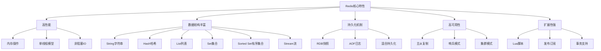
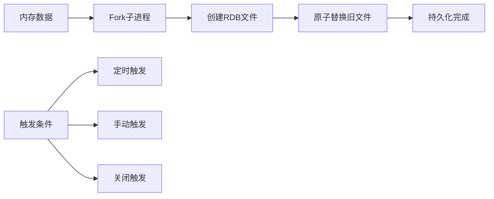
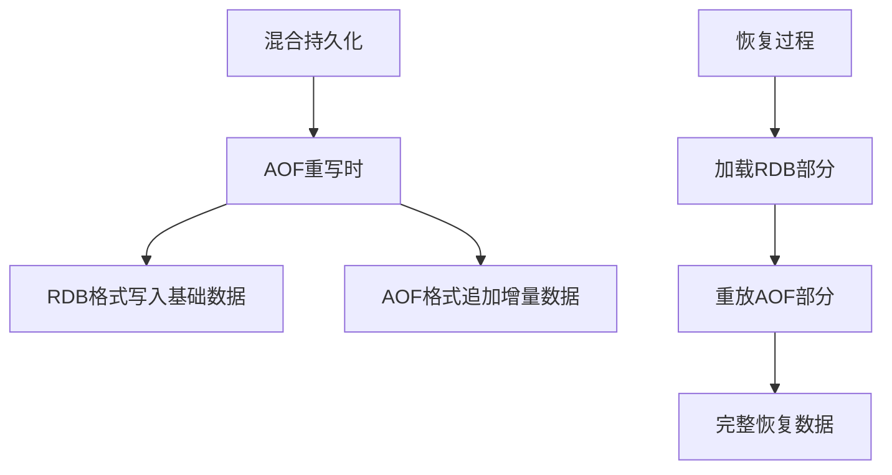
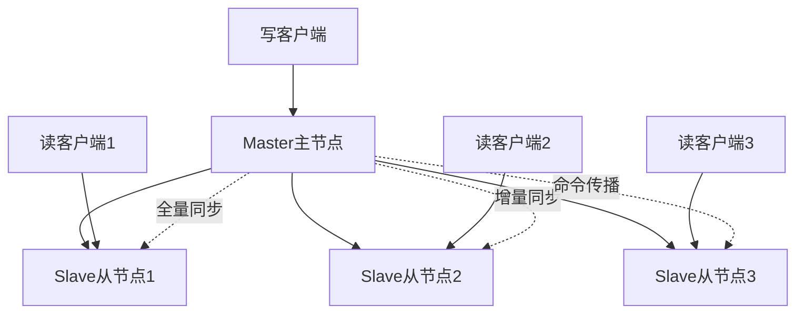
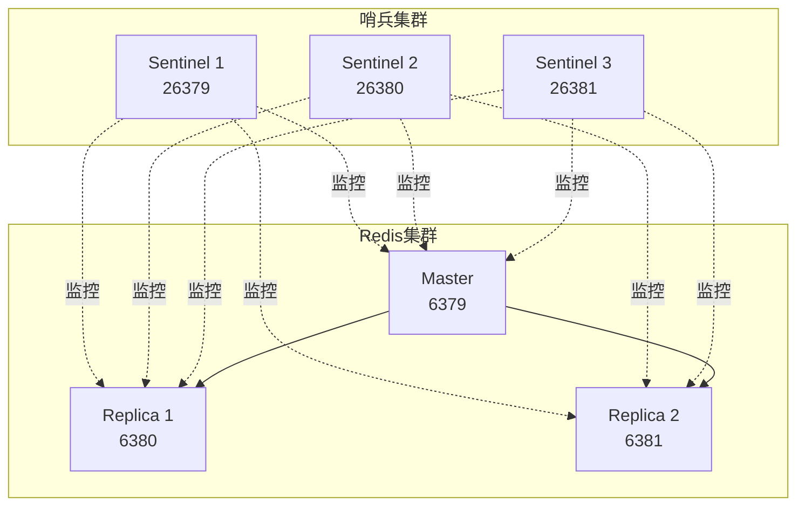
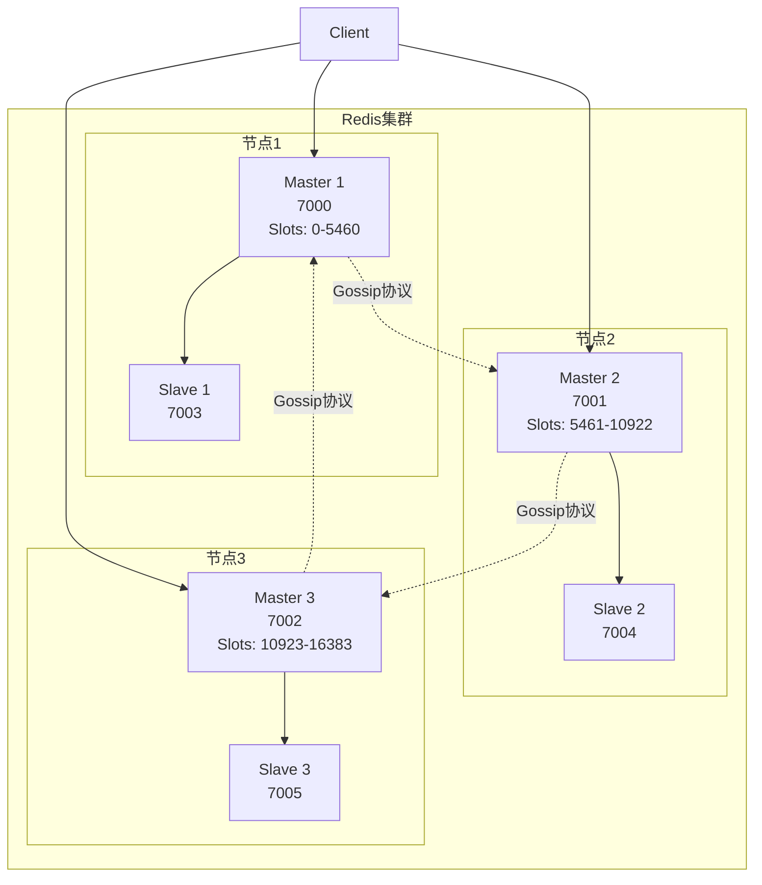
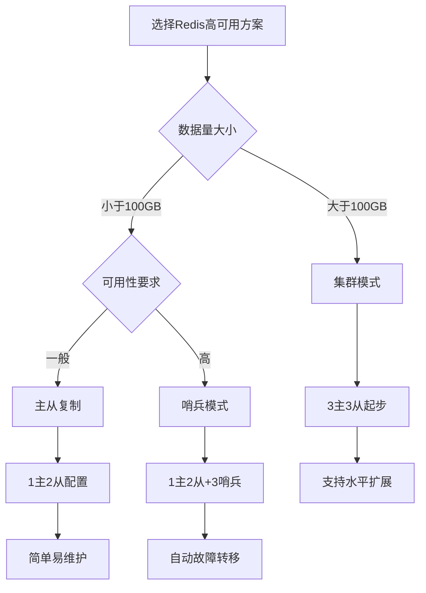

import Tabs from '@theme/Tabs';
import TabItem from '@theme/TabItem';
import CodeBlock from '@theme/CodeBlock';

# Redis缓存数据库详解

Redis（Remote Dictionary Server）是一个开源的内存数据结构存储系统，可以用作数据库、缓存和消息中间件。它支持多种数据结构，具有高性能、高可用性和丰富的功能特性，是现代Web应用架构中不可或缺的组件。

:::tip 核心价值
**Redis = 高性能内存存储 + 丰富数据结构 + 持久化机制 + 高可用架构**
- 🚀 **极致性能**：基于内存操作，单线程模型，QPS可达10万+
- 🎯 **数据结构丰富**：String、Hash、List、Set、Sorted Set、Stream等
- 💾 **持久化保障**：RDB快照 + AOF日志 + 混合持久化
- 🔄 **高可用架构**：主从复制 + 哨兵模式 + 集群分片
- 🛠️ **应用场景广泛**：缓存、会话、排行榜、分布式锁、消息队列
:::

## 1. Redis基础架构与特性

### 1.1 Redis核心特性

Redis作为内存数据库，具有以下核心特性：



### 1.2 Redis应用场景对比

| 应用场景 | 数据结构 | 典型用例 | 性能特点 | 适用规模 |
|---------|---------|---------|---------|---------|
| **缓存系统** | String/Hash | 用户信息、商品详情、页面缓存 | 读写极快，支持过期 | 中大型应用 |
| **会话存储** | String/Hash | 用户登录状态、购物车 | 高并发读写 | 所有Web应用 |
| **计数统计** | String/Hash | 访问量、点赞数、库存 | 原子操作，实时性强 | 高并发场景 |
| **排行榜** | Sorted Set | 游戏排行、热搜榜、评分系统 | 自动排序，范围查询 | 实时排名需求 |
| **消息队列** | List/Stream | 任务队列、事件通知 | 阻塞操作，顺序保证 | 异步处理场景 |
| **分布式锁** | String | 资源互斥、防重复提交 | 原子操作，过期机制 | 分布式系统 |
| **地理位置** | Geo | 附近的人、配送范围 | 地理计算，距离查询 | LBS应用 |

## 2. Redis数据结构深度解析

### 2.1 String（字符串）- 最基础的数据类型

String是Redis最基本的数据类型，可以存储字符串、整数或浮点数，是其他数据结构的基础。

<Tabs>
<TabItem value="basic" label="基本操作">

```bash title="String基本操作"
# 基本设置和获取
SET user:1001 "John Doe"
GET user:1001                    # 返回: "John Doe"
GETSET user:1001 "Jane Doe"      # 设置新值并返回旧值
DEL user:1001                    # 删除键
EXISTS user:1001                 # 检查键是否存在

# 批量操作 - 提高性能
MSET user:1001 "John" user:1002 "Jane" user:1003 "Bob"
MGET user:1001 user:1002 user:1003
# 返回: ["John", "Jane", "Bob"]

# 条件设置
SET lock:resource1 "owner1" NX EX 30  # 不存在时设置，30秒过期
SET config:timeout "5000" XX          # 存在时才设置
```

</TabItem>
<TabItem value="numeric" label="数值操作">

```bash title="数值操作"
# 计数器操作
SET counter 0
INCR counter                     # 递增1，返回: 1
INCRBY counter 5                 # 递增5，返回: 6
DECR counter                     # 递减1，返回: 5
DECRBY counter 3                 # 递减3，返回: 2

# 浮点数操作
SET price 99.99
INCRBYFLOAT price 0.01           # 返回: "100"
INCRBYFLOAT price -10.5          # 返回: "89.5"

# 应用示例：文章阅读量统计
INCR article:1001:views          # 每次访问递增
GET article:1001:views           # 获取总阅读量
```

</TabItem>
<TabItem value="string-ops" label="字符串操作">

```bash title="字符串操作"
# 字符串拼接和截取
SET message "Hello"
APPEND message " World"          # 返回: 11 (新长度)
GET message                      # 返回: "Hello World"
STRLEN message                   # 返回: 11

# 子字符串操作
GETRANGE message 0 4             # 返回: "Hello"
SETRANGE message 6 "Redis"       # 替换部分字符串
GET message                      # 返回: "Hello Redis"

# 位操作 - 适用于布尔标记
SETBIT user:1001:flags 0 1       # 设置第0位为1
GETBIT user:1001:flags 0         # 获取第0位的值
BITCOUNT user:1001:flags         # 统计1的个数
```

</TabItem>
</Tabs>

#### String应用实践

```java title="Java中的String操作实践"
@Service
public class RedisStringService {
    
    @Autowired
    private RedisTemplate<String, String> redisTemplate;
    
    /**
     * 缓存用户信息
     */
    public void cacheUserInfo(Long userId, User user) {
        String key = "user:info:" + userId;
        String userJson = JSON.toJSONString(user);
        
        // 缓存1小时
        redisTemplate.opsForValue().set(key, userJson, 1, TimeUnit.HOURS);
    }
    
    /**
     * 获取用户信息
     */
    public User getUserInfo(Long userId) {
        String key = "user:info:" + userId;
        String userJson = redisTemplate.opsForValue().get(key);
        
        return userJson != null ? JSON.parseObject(userJson, User.class) : null;
    }
    
    /**
     * 文章阅读量统计
     */
    public Long incrementArticleViews(Long articleId) {
        String key = "article:views:" + articleId;
        return redisTemplate.opsForValue().increment(key);
    }
    
    /**
     * 分布式锁实现
     */
    public boolean tryLock(String lockKey, String lockValue, long timeout) {
        Boolean result = redisTemplate.opsForValue()
            .setIfAbsent(lockKey, lockValue, timeout, TimeUnit.SECONDS);
        return Boolean.TRUE.equals(result);
    }
    
    /**
     * 限流器实现 - 滑动窗口
     */
    public boolean isAllowed(String key, int maxRequests, int windowSeconds) {
        String script = 
            "local current = redis.call('incr', KEYS[1]) " +
            "if tonumber(current) == 1 then " +
            "    redis.call('expire', KEYS[1], ARGV[1]) " +
            "end " +
            "return tonumber(current) <= tonumber(ARGV[2])";
        
        Long result = redisTemplate.execute(
            new DefaultRedisScript<>(script, Long.class),
            Collections.singletonList(key),
            String.valueOf(windowSeconds),
            String.valueOf(maxRequests)
        );
        
        return Long.valueOf(1).equals(result);
    }
}
```

### 2.2 Hash（哈希）- 对象存储的最佳选择

Hash是一个键值对集合，特别适合存储对象数据，相比String存储JSON有更好的性能和灵活性。

<Tabs>
<TabItem value="basic" label="基本操作">

```bash title="Hash基本操作"
# 单个字段操作
HSET user:1001 name "John Doe"
HSET user:1001 age 25
HSET user:1001 email "john@example.com"

HGET user:1001 name              # 返回: "John Doe"
HGETALL user:1001                # 返回所有字段和值
HDEL user:1001 age               # 删除age字段
HEXISTS user:1001 name           # 检查字段是否存在

# 批量操作
HMSET user:1002 name "Jane" age 30 email "jane@example.com" city "Beijing"
HMGET user:1002 name age email   # 批量获取指定字段
```

</TabItem>
<TabItem value="advanced" label="高级操作">

```bash title="Hash高级操作"
# 数值操作
HSET product:1001 price 99.99
HSET product:1001 stock 100
HINCRBY product:1001 stock -1    # 库存减1
HINCRBYFLOAT product:1001 price 0.01  # 价格增加0.01

# 字段信息获取
HKEYS user:1001                  # 获取所有字段名
HVALS user:1001                  # 获取所有字段值
HLEN user:1001                   # 获取字段数量

# 条件设置
HSETNX user:1001 phone "1234567890"  # 字段不存在时才设置
```

</TabItem>
<TabItem value="use-cases" label="应用场景">

```bash title="Hash典型应用场景"
# 1. 用户信息存储
HMSET user:1001 
    name "John Doe" 
    age 25 
    email "john@example.com" 
    phone "1234567890"
    created_at "2025-01-01"
    last_login "2025-08-11"

# 2. 购物车实现
HSET cart:user:1001 product:1001 2    # 商品1001，数量2
HSET cart:user:1001 product:1002 1    # 商品1002，数量1
HINCRBY cart:user:1001 product:1001 1 # 增加商品1001数量
HGETALL cart:user:1001                # 获取整个购物车

# 3. 商品信息缓存
HMSET product:1001 
    name "iPhone 15" 
    price 5999 
    stock 100 
    category "electronics"
    brand "Apple"
    
# 4. 配置信息管理
HMSET config:app 
    name "MyApp" 
    version "1.0.0" 
    port 8080 
    debug true
    max_connections 1000
```

</TabItem>
</Tabs>

#### Hash vs String 性能对比

| 对比维度 | Hash | String (JSON) | 优势分析 |
|---------|------|---------------|---------|
| **内存使用** | 更节省 | 较多 | Hash避免了JSON序列化开销 |
| **部分更新** | 支持 | 需要全量更新 | Hash可以只更新单个字段 |
| **查询性能** | 单字段快 | 全量解析 | Hash支持字段级别的操作 |
| **数据类型** | 原生支持 | 字符串 | Hash支持数值操作 |
| **复杂查询** | 有限 | 灵活 | JSON支持复杂嵌套结构 |

### 2.3 List（列表）- 有序数据的理想选择

List是一个双向链表，支持从两端添加或删除元素，适合实现队列、栈和时间线等场景。

<Tabs>
<TabItem value="basic" label="基本操作">

```bash title="List基本操作"
# 添加元素
LPUSH mylist "item1"             # 左端添加
RPUSH mylist "item2" "item3"     # 右端添加多个元素
LINSERT mylist BEFORE "item2" "new_item"  # 在指定元素前插入

# 获取元素
LRANGE mylist 0 -1               # 获取所有元素
LINDEX mylist 0                  # 获取指定位置的元素
LLEN mylist                      # 获取列表长度

# 删除元素
LPOP mylist                      # 左端弹出
RPOP mylist                      # 右端弹出
LREM mylist 1 "item1"            # 删除指定数量的元素
LTRIM mylist 0 99                # 保留指定范围的元素
```

</TabItem>
<TabItem value="blocking" label="阻塞操作">

```bash title="List阻塞操作"
# 阻塞弹出 - 实现消息队列
BLPOP queue:tasks 10             # 阻塞10秒等待左端弹出
BRPOP queue:tasks 0              # 无限等待右端弹出
BRPOPLPUSH source dest 5         # 从source弹出并推入dest

# 生产者-消费者模式
# 生产者
LPUSH queue:emails "email1@example.com"
LPUSH queue:emails "email2@example.com"

# 消费者
BRPOP queue:emails 0             # 阻塞等待邮件任务
```

</TabItem>
<TabItem value="applications" label="应用场景">

```bash title="List应用场景"
# 1. 消息队列实现
LPUSH queue:notifications "user:1001:login"
LPUSH queue:notifications "order:2001:created"
BRPOP queue:notifications 0      # 消费者获取通知

# 2. 用户动态时间线
LPUSH user:1001:timeline "post:3001"
LPUSH user:1001:timeline "post:3002"
LRANGE user:1001:timeline 0 9    # 获取最新10条动态

# 3. 最近访问记录
LPUSH user:1001:recent_pages "page:home"
LPUSH user:1001:recent_pages "page:product:1001"
LTRIM user:1001:recent_pages 0 19  # 只保留最近20条记录

# 4. 任务队列
LPUSH tasks:high_priority "task:urgent:1001"
LPUSH tasks:normal "task:normal:2001"
BRPOP tasks:high_priority tasks:normal 0  # 优先处理高优先级任务
```

</TabItem>
</Tabs>

### 2.4 Set（集合）- 去重和集合运算

Set是一个无序的字符串集合，不允许重复元素，支持集合间的交集、并集、差集运算。

<Tabs>
<TabItem value="basic" label="基本操作">

```bash title="Set基本操作"
# 添加和删除
SADD myset "member1" "member2" "member3"
SREM myset "member1"             # 删除成员
SMEMBERS myset                   # 获取所有成员
SCARD myset                      # 获取成员数量
SISMEMBER myset "member2"        # 检查成员是否存在

# 随机操作
SRANDMEMBER myset 2              # 随机获取2个成员
SPOP myset                       # 随机弹出并删除一个成员
```

</TabItem>
<TabItem value="set-ops" label="集合运算">

```bash title="Set集合运算"
# 创建测试集合
SADD set1 "a" "b" "c" "d"
SADD set2 "b" "c" "e" "f"
SADD set3 "c" "d" "g" "h"

# 交集运算
SINTER set1 set2                 # 返回: ["b", "c"]
SINTERSTORE result set1 set2     # 交集结果存储到result

# 并集运算
SUNION set1 set2                 # 返回: ["a", "b", "c", "d", "e", "f"]
SUNIONSTORE result set1 set2 set3

# 差集运算
SDIFF set1 set2                  # 返回: ["a", "d"] (set1中有但set2中没有)
SDIFFSTORE result set1 set2
```

</TabItem>
<TabItem value="use-cases" label="应用场景">

```bash title="Set应用场景"
# 1. 用户标签系统
SADD user:1001:tags "java" "redis" "mysql" "spring"
SADD user:1002:tags "python" "redis" "mongodb" "django"
SINTER user:1001:tags user:1002:tags  # 共同技能标签

# 2. 好友关系
SADD user:1001:friends "user:1002" "user:1003" "user:1004"
SADD user:1002:friends "user:1001" "user:1005" "user:1006"
SINTER user:1001:friends user:1002:friends  # 共同好友

# 3. 文章点赞用户
SADD article:1001:likes "user:1001" "user:1002" "user:1003"
SCARD article:1001:likes         # 点赞总数
SISMEMBER article:1001:likes "user:1001"  # 检查用户是否点赞

# 4. 在线用户统计
SADD online:users "user:1001" "user:1002"
SCARD online:users               # 在线用户数
SREM online:users "user:1001"    # 用户下线

# 5. 抽奖系统
SADD lottery:participants "user:1001" "user:1002" "user:1003"
SPOP lottery:participants        # 随机抽取获奖者
```

</TabItem>
</Tabs>

### 2.5 Sorted Set（有序集合）- 排序和排名

Sorted Set是一个有序的字符串集合，每个成员都有一个分数，按分数排序，适合实现排行榜、优先级队列等。

<Tabs>
<TabItem value="basic" label="基本操作">

```bash title="Sorted Set基本操作"
# 添加成员
ZADD leaderboard 1000 "player1"
ZADD leaderboard 1200 "player2" 800 "player3"

# 获取信息
ZSCORE leaderboard "player1"     # 获取分数: 1000
ZRANK leaderboard "player1"      # 获取排名(升序): 1
ZREVRANK leaderboard "player1"   # 获取排名(降序): 1
ZCARD leaderboard                # 获取成员总数

# 范围查询
ZRANGE leaderboard 0 -1          # 获取所有成员(升序)
ZREVRANGE leaderboard 0 -1       # 获取所有成员(降序)
ZRANGE leaderboard 0 -1 WITHSCORES  # 包含分数
```

</TabItem>
<TabItem value="advanced" label="高级操作">

```bash title="Sorted Set高级操作"
# 分数范围查询
ZRANGEBYSCORE leaderboard 800 1200        # 分数在800-1200之间
ZREVRANGEBYSCORE leaderboard 1200 800     # 降序
ZCOUNT leaderboard 800 1200               # 统计范围内成员数

# 删除操作
ZREM leaderboard "player1"                # 删除成员
ZREMRANGEBYRANK leaderboard 0 2           # 删除排名前3的成员
ZREMRANGEBYSCORE leaderboard 0 500        # 删除分数0-500的成员

# 分数操作
ZINCRBY leaderboard 100 "player1"         # 增加分数
ZINCRBY leaderboard -50 "player2"         # 减少分数

# 集合运算
ZUNIONSTORE result 2 set1 set2 WEIGHTS 1 2  # 并集，set2权重为2
ZINTERSTORE result 2 set1 set2 AGGREGATE MAX # 交集，取最大分数
```

</TabItem>
<TabItem value="use-cases" label="应用场景">

```bash title="Sorted Set应用场景"
# 1. 游戏排行榜
ZADD game:leaderboard 15000 "player:1001"
ZADD game:leaderboard 12000 "player:1002"
ZADD game:leaderboard 18000 "player:1003"
ZREVRANGE game:leaderboard 0 9 WITHSCORES  # 获取前10名

# 2. 热搜排行
ZADD trending:topics 1500 "Redis教程"
ZADD trending:topics 1200 "Java面试"
ZADD trending:topics 1800 "Spring Boot"
ZREVRANGE trending:topics 0 4             # 获取前5个热搜

# 3. 时间线排序
ZADD user:1001:timeline 1640995200 "post:1001"
ZADD user:1001:timeline 1640995300 "post:1002"
ZREVRANGE user:1001:timeline 0 9          # 获取最新10条动态

# 4. 优先级任务队列
ZADD tasks:queue 1 "low_priority_task"
ZADD tasks:queue 5 "high_priority_task"
ZADD tasks:queue 3 "medium_priority_task"
ZREVRANGE tasks:queue 0 0                 # 获取最高优先级任务

# 5. 商品销量排行
ZADD products:sales 500 "product:1001"
ZADD products:sales 800 "product:1002"
ZINCRBY products:sales 1 "product:1001"   # 销量+1
ZREVRANGE products:sales 0 9 WITHSCORES   # 销量排行榜
```

</TabItem>
</Tabs>

### 2.6 Stream（流）- 现代消息队列解决方案

Stream是Redis 5.0引入的新数据类型，专门用于构建消息队列和事件流处理系统，支持消费者组、消息确认等高级特性。

<Tabs>
<TabItem value="basic" label="基本操作">

```bash title="Stream基本操作"
# 添加消息
XADD user_events * user_id 1001 action "login" timestamp 1640995200
XADD user_events * user_id 1002 action "logout" timestamp 1640995300
XADD user_events 1640995400000-0 user_id 1003 action "purchase" amount 99.99

# 读取消息
XREAD COUNT 10 STREAMS user_events 0      # 从开始读取10条消息
XREAD BLOCK 5000 STREAMS user_events $    # 阻塞5秒等待新消息
XREAD STREAMS user_events order_events 0-0 0-0  # 从多个流读取

# 范围查询
XRANGE user_events - +                    # 获取所有消息
XRANGE user_events 1640995200000 1640995400000  # 时间范围查询
XREVRANGE user_events + - COUNT 5         # 反向获取最新5条消息

# 流信息
XLEN user_events                          # 获取消息数量
XINFO STREAM user_events                  # 获取流详细信息
```

</TabItem>
<TabItem value="consumer-group" label="消费者组">

```bash title="Stream消费者组"
# 创建消费者组
XGROUP CREATE user_events analytics_group $     # 从最新消息开始
XGROUP CREATE user_events backup_group 0        # 从头开始消费

# 消费者读取消息
XREADGROUP GROUP analytics_group consumer1 COUNT 1 STREAMS user_events >
XREADGROUP GROUP analytics_group consumer2 COUNT 5 STREAMS user_events >

# 消息确认
XACK user_events analytics_group 1640995200000-0

# 查看待确认消息
XPENDING user_events analytics_group              # 查看组的待确认消息
XPENDING user_events analytics_group - + 10 consumer1  # 查看特定消费者的待确认消息

# 声明消息所有权（处理故障消费者的消息）
XCLAIM user_events analytics_group consumer2 3600000 1640995200000-0

# 删除消息
XDEL user_events 1640995200000-0
XTRIM user_events MAXLEN 1000              # 保留最新1000条消息
```

</TabItem>
<TabItem value="use-cases" label="应用场景">

```bash title="Stream应用场景"
# 1. 用户行为事件流
XADD user_behavior * user_id 1001 page "home" action "view" timestamp 1640995200
XADD user_behavior * user_id 1001 page "product" action "click" product_id 2001
XADD user_behavior * user_id 1001 action "purchase" order_id 3001 amount 299.99

# 消费者组处理不同业务
XGROUP CREATE user_behavior analytics_group $    # 数据分析组
XGROUP CREATE user_behavior recommendation_group $  # 推荐系统组

# 2. 订单状态变更流
XADD order_events * order_id 1001 status "created" user_id 2001
XADD order_events * order_id 1001 status "paid" payment_id 3001
XADD order_events * order_id 1001 status "shipped" tracking_no "SF123456"

# 3. 系统日志流
XADD system_logs * level "ERROR" service "user-service" message "Database connection failed"
XADD system_logs * level "INFO" service "order-service" message "Order processed successfully"

# 4. 实时通知流
XADD notifications * user_id 1001 type "order_shipped" title "您的订单已发货"
XADD notifications * user_id 1001 type "friend_request" from_user 2001
```

</TabItem>
</Tabs>

#### Stream vs 传统消息队列对比

| 特性 | Redis Stream | RabbitMQ | Kafka | 适用场景 |
|------|-------------|----------|-------|---------|
| **消息持久化** | 支持 | 支持 | 支持 | 所有场景 |
| **消费者组** | 支持 | 支持 | 支持 | 多消费者场景 |
| **消息确认** | 支持 | 支持 | 支持 | 可靠性要求高 |
| **消息回溯** | 支持 | 有限 | 支持 | 需要重新处理历史消息 |
| **性能** | 极高 | 高 | 极高 | 高并发场景 |
| **运维复杂度** | 低 | 中 | 高 | 简单部署需求 |
| **生态系统** | Redis生态 | 丰富 | 丰富 | 已有Redis基础设施 |

## 3. Redis持久化机制详解

Redis作为内存数据库，提供了多种持久化机制来保证数据的安全性和可恢复性。

### 3.1 RDB持久化 - 快照备份

RDB（Redis Database）通过创建数据快照来实现持久化，是Redis的默认持久化方式。



<Tabs>
<TabItem value="config" label="RDB配置">

```bash title="RDB配置详解"
# redis.conf 配置
save 900 1          # 900秒内至少1个key变化时保存
save 300 10         # 300秒内至少10个key变化时保存  
save 60 10000       # 60秒内至少10000个key变化时保存

# 其他RDB配置
stop-writes-on-bgsave-error yes    # RDB保存失败时停止写入
rdbcompression yes                 # 启用RDB文件压缩
rdbchecksum yes                    # 启用RDB文件校验
dbfilename dump.rdb                # RDB文件名
dir /var/lib/redis                 # RDB文件保存目录

# 手动触发RDB
SAVE                               # 同步保存（阻塞）
BGSAVE                            # 异步保存（非阻塞）
LASTSAVE                          # 获取最后保存时间
```

</TabItem>
<TabItem value="process" label="RDB过程">

```bash title="RDB持久化过程"
# 1. 触发条件检查
# - 定时检查save配置条件
# - 手动执行SAVE/BGSAVE命令
# - 服务器关闭时自动保存

# 2. Fork子进程（BGSAVE）
# - 主进程fork出子进程
# - 子进程继承主进程的内存快照
# - 主进程继续处理客户端请求

# 3. 写入RDB文件
# - 子进程将内存数据写入临时RDB文件
# - 使用二进制格式，高度压缩
# - 包含数据库选择、键值对、过期时间等信息

# 4. 原子替换
# - 写入完成后，原子性地替换旧RDB文件
# - 确保RDB文件的完整性

# RDB文件结构示例
REDIS0009       # Redis版本和RDB版本
$6              # 数据库编号
redis-ver$5     # Redis版本信息
redis-bits$2    # 架构信息
ctime$10        # 创建时间
used-mem$8      # 使用内存
...             # 键值对数据
$FF             # 结束标记
$8              # 校验和
```

</TabItem>
<TabItem value="pros-cons" label="优缺点分析">

```bash title="RDB优缺点分析"
# ✅ RDB优点
# 1. 文件紧凑：高度压缩的二进制文件，适合备份和传输
# 2. 恢复速度快：直接加载到内存，启动速度快
# 3. 性能影响小：使用fork子进程，对主进程影响最小
# 4. 适合灾备：可以定期备份到远程存储

# ❌ RDB缺点  
# 1. 数据丢失风险：两次快照间的数据可能丢失
# 2. Fork开销：大数据集时fork可能耗时较长
# 3. 不适合实时：无法做到秒级的数据持久化
# 4. 版本兼容性：不同Redis版本的RDB格式可能不兼容

# 适用场景
# - 对数据丢失容忍度较高的场景
# - 需要定期备份的场景  
# - 主从复制的全量同步
# - 快速重启恢复的场景
```

</TabItem>
</Tabs>

### 3.2 AOF持久化 - 操作日志

AOF（Append Only File）通过记录每个写操作命令来实现持久化，提供更好的数据安全性。

<Tabs>
<TabItem value="config" label="AOF配置">

```bash title="AOF配置详解"
# redis.conf 配置
appendonly yes                          # 启用AOF持久化
appendfilename "appendonly.aof"         # AOF文件名
appendfsync everysec                    # 同步策略

# 同步策略选项
# appendfsync always      # 每个写命令都同步到磁盘（最安全，性能最低）
# appendfsync everysec    # 每秒同步一次（平衡安全性和性能）
# appendfsync no          # 由操作系统决定何时同步（性能最高，安全性最低）

# AOF重写配置
auto-aof-rewrite-percentage 100        # 当AOF文件大小比上次重写后增长100%时触发重写
auto-aof-rewrite-min-size 64mb         # AOF文件最小64MB时才考虑重写
aof-load-truncated yes                 # 启动时加载被截断的AOF文件
aof-rewrite-incremental-fsync yes      # 重写时增量同步

# 手动触发AOF重写
BGREWRITEAOF                           # 后台重写AOF文件
```

</TabItem>
<TabItem value="rewrite" label="AOF重写">

```bash title="AOF重写机制"
# AOF重写前后对比
# 原始AOF文件内容：
SET counter 1
INCR counter        # counter = 2
INCR counter        # counter = 3  
INCR counter        # counter = 4
DEL counter
SET counter 100
EXPIRE counter 3600

# 重写后AOF文件内容：
SET counter 100
EXPIRE counter 3600

# AOF重写过程
# 1. Fork子进程
#    - 主进程继续处理客户端请求
#    - 子进程基于当前内存状态生成新AOF文件

# 2. 重写缓冲区
#    - 主进程将重写期间的新命令写入重写缓冲区
#    - 确保重写过程中的数据不丢失

# 3. 替换AOF文件
#    - 子进程完成重写后，主进程将缓冲区内容追加到新AOF文件
#    - 原子性地替换旧AOF文件

# 4. 清理工作
#    - 清空重写缓冲区
#    - 更新AOF文件描述符
```

</TabItem>
<TabItem value="format" label="AOF格式">

```bash title="AOF文件格式"
# AOF文件采用Redis协议格式
# 示例命令：SET mykey myvalue

*3              # 数组长度为3
$3              # 第一个元素长度为3
SET             # 命令名
$5              # 第二个元素长度为5  
mykey           # 键名
$7              # 第三个元素长度为7
myvalue         # 值

# 复杂命令示例：HMSET user:1001 name "John" age 25
*6              # 数组长度为6
$5              # HMSET
HMSET
$9              # user:1001
user:1001  
$4              # name
name
$4              # "John"
John
$3              # age  
age
$2              # 25
25

# AOF文件特点
# - 纯文本格式，可读性强
# - 严格按照Redis协议格式
# - 支持手动编辑和修复
# - 文件大小通常比RDB大
```

</TabItem>
</Tabs>

### 3.3 混合持久化 - 最佳实践

Redis 4.0引入混合持久化，结合RDB和AOF的优点，是目前推荐的持久化方案。



<Tabs>
<TabItem value="config" label="混合持久化配置">

```bash title="混合持久化配置"
# redis.conf 配置
appendonly yes                          # 启用AOF
aof-use-rdb-preamble yes               # 启用混合持久化

# 工作原理
# 1. AOF重写时，将当前数据库状态以RDB格式写入AOF文件开头
# 2. 重写后的新写操作以AOF格式追加到文件末尾
# 3. 恢复时先加载RDB部分，再重放AOF部分

# 文件结构示例
# +-------+-------+-------+
# |  RDB  |  AOF  |  AOF  |
# | 基础  | 增量1 | 增量2 |
# | 数据  | 数据  | 数据  |
# +-------+-------+-------+
```

</TabItem>
<TabItem value="comparison" label="持久化方案对比">

```bash title="持久化方案全面对比"
# 📊 性能对比
# RDB：        ⭐⭐⭐⭐⭐ (性能最高)
# AOF：        ⭐⭐⭐ (中等性能)  
# 混合持久化：   ⭐⭐⭐⭐ (较高性能)

# 🛡️ 数据安全性对比
# RDB：        ⭐⭐ (可能丢失较多数据)
# AOF：        ⭐⭐⭐⭐⭐ (数据最安全)
# 混合持久化：   ⭐⭐⭐⭐ (较安全)

# 💾 文件大小对比
# RDB：        ⭐⭐⭐⭐⭐ (文件最小)
# AOF：        ⭐⭐ (文件较大)
# 混合持久化：   ⭐⭐⭐⭐ (文件适中)

# ⚡ 恢复速度对比  
# RDB：        ⭐⭐⭐⭐⭐ (恢复最快)
# AOF：        ⭐⭐ (恢复较慢)
# 混合持久化：   ⭐⭐⭐⭐ (恢复较快)
```

</TabItem>
<TabItem value="best-practices" label="最佳实践">

```bash title="持久化最佳实践"
# 🎯 推荐配置方案

# 方案一：高性能场景（可容忍少量数据丢失）
save 900 1
save 300 10  
save 60 10000
appendonly no

# 方案二：高可靠性场景（不能容忍数据丢失）
appendonly yes
appendfsync everysec
aof-use-rdb-preamble yes

# 方案三：平衡方案（推荐）
save 900 1
appendonly yes  
appendfsync everysec
aof-use-rdb-preamble yes
auto-aof-rewrite-percentage 100
auto-aof-rewrite-min-size 64mb

# 🔧 运维最佳实践
# 1. 定期备份RDB文件到远程存储
# 2. 监控AOF文件大小，及时触发重写
# 3. 测试恢复流程，确保备份可用
# 4. 根据业务特点选择合适的持久化策略
# 5. 在从节点关闭持久化，减少主节点压力

# 📈 性能优化建议
# 1. 将RDB和AOF文件放在不同磁盘上
# 2. 使用SSD存储提高I/O性能
# 3. 合理设置AOF重写阈值
# 4. 在业务低峰期执行BGSAVE和BGREWRITEAOF
# 5. 监控fork操作的耗时，避免阻塞主进程
```

</TabItem>
</Tabs>

## 4. Redis高可用架构设计

Redis高可用架构是保证服务稳定运行的关键，包括主从复制、哨兵模式和集群模式三种主要方案。

### 4.1 主从复制 - 读写分离基础

主从复制是Redis高可用的基础，通过数据同步实现读写分离和数据备份。



<Tabs>
<TabItem value="config" label="主从配置">

```bash title="主从复制配置"
# 主节点配置 (redis-master.conf)
bind 0.0.0.0
port 6379
daemonize yes
pidfile /var/run/redis_6379.pid
logfile /var/log/redis_6379.log
dir /var/lib/redis

# 安全配置
requirepass master_password
masterauth master_password

# 从节点配置 (redis-slave.conf)  
bind 0.0.0.0
port 6380
daemonize yes
pidfile /var/run/redis_6380.pid
logfile /var/log/redis_6380.log
dir /var/lib/redis

# 主从关系配置
replicaof 192.168.1.100 6379        # 指定主节点
masterauth master_password           # 主节点密码
replica-read-only yes                # 从节点只读
replica-serve-stale-data yes         # 连接断开时继续服务

# 动态配置主从关系
REPLICAOF 192.168.1.100 6379        # 设置为从节点
REPLICAOF NO ONE                     # 取消从节点身份，升级为主节点
```

</TabItem>
<TabItem value="sync-process" label="同步过程">

```bash title="主从同步详细过程"
# 1️⃣ 建立连接阶段
# 从节点 -> 主节点: PING
# 主节点 -> 从节点: PONG
# 从节点 -> 主节点: AUTH <password>
# 主节点 -> 从节点: OK

# 2️⃣ 数据同步阶段
# 从节点 -> 主节点: PSYNC <runid> <offset>
# 
# 情况A：全量同步
# 主节点 -> 从节点: FULLRESYNC <runid> <offset>
# 主节点执行BGSAVE生成RDB文件
# 主节点发送RDB文件给从节点
# 从节点清空数据库并加载RDB文件
# 主节点发送同步期间的写命令缓冲区
#
# 情况B：部分同步  
# 主节点 -> 从节点: CONTINUE
# 主节点发送复制积压缓冲区中的数据

# 3️⃣ 命令传播阶段
# 主节点接收写命令后：
# 1. 执行命令
# 2. 发送命令给所有从节点
# 3. 从节点执行命令保持数据一致

# 复制相关命令
INFO replication                     # 查看复制信息
ROLE                                # 查看节点角色
REPLICAOF NO ONE                    # 停止复制
```

</TabItem>
<TabItem value="optimization" label="复制优化">

```bash title="主从复制优化配置"
# 复制性能优化
repl-diskless-sync no               # 是否启用无盘复制
repl-diskless-sync-delay 5          # 无盘复制延迟时间
repl-ping-replica-period 10         # 从节点ping主节点间隔
repl-timeout 60                     # 复制超时时间

# 复制积压缓冲区配置
repl-backlog-size 1mb               # 积压缓冲区大小
repl-backlog-ttl 3600               # 缓冲区保留时间

# 从节点配置优化
replica-priority 100                # 从节点优先级（哨兵选主时使用）
replica-announce-ip 192.168.1.101  # 从节点公告IP
replica-announce-port 6380          # 从节点公告端口

# 最小从节点配置（防止数据丢失）
min-replicas-to-write 1             # 至少1个从节点才允许写入
min-replicas-max-lag 10             # 从节点最大延迟10秒

# 监控复制状态
# 主节点监控
redis-cli -p 6379 INFO replication
# connected_slaves:2
# slave0:ip=192.168.1.101,port=6380,state=online,offset=1234,lag=0
# slave1:ip=192.168.1.102,port=6380,state=online,offset=1234,lag=1

# 从节点监控  
redis-cli -p 6380 INFO replication
# role:slave
# master_host:192.168.1.100
# master_port:6379
# master_link_status:up
# master_last_io_seconds_ago:0
```

</TabItem>
</Tabs>

### 4.2 哨兵模式 - 自动故障转移

Redis Sentinel是Redis的高可用解决方案，提供监控、通知、自动故障转移和配置提供者功能。



<Tabs>
<TabItem value="config" label="哨兵配置">

```bash title="哨兵配置详解"
# sentinel.conf 配置文件
port 26379                                    # 哨兵端口
daemonize yes                                # 后台运行
pidfile /var/run/redis-sentinel.pid         # PID文件
logfile /var/log/redis-sentinel.log         # 日志文件
dir /var/lib/redis                          # 工作目录

# 监控主节点配置
sentinel monitor mymaster 192.168.1.100 6379 2
# mymaster: 主节点名称
# 192.168.1.100 6379: 主节点地址和端口  
# 2: 判断主节点下线需要的哨兵数量（quorum）

# 认证配置
sentinel auth-pass mymaster master_password

# 故障转移配置
sentinel down-after-milliseconds mymaster 5000    # 5秒无响应判定下线
sentinel failover-timeout mymaster 15000          # 故障转移超时时间
sentinel parallel-syncs mymaster 1                # 同时同步的从节点数量

# 通知脚本配置
sentinel notification-script mymaster /opt/scripts/notify.sh
sentinel client-reconfig-script mymaster /opt/scripts/reconfig.sh

# 启动哨兵
redis-sentinel /etc/redis/sentinel.conf
# 或者
redis-server /etc/redis/sentinel.conf --sentinel
```

</TabItem>
<TabItem value="failover" label="故障转移流程">

```bash title="哨兵故障转移详细流程"
# 1️⃣ 主观下线（Subjectively Down）
# 单个哨兵检测到主节点无响应超过down-after-milliseconds
# 标记主节点为主观下线状态（SDOWN）

# 2️⃣ 客观下线（Objectively Down）  
# 哨兵询问其他哨兵对主节点的状态判断
# 当超过quorum数量的哨兵认为主节点下线时
# 标记主节点为客观下线状态（ODOWN）

# 3️⃣ 选举领导者哨兵
# 哨兵之间进行Raft算法选举
# 选出负责故障转移的领导者哨兵
# 需要获得超过半数哨兵的投票

# 4️⃣ 选择新的主节点
# 领导者哨兵从从节点中选择新主节点
# 选择规则（按优先级）：
# a) replica-priority最小的从节点
# b) 复制偏移量最大的从节点（数据最新）
# c) run_id最小的从节点

# 5️⃣ 执行故障转移
# 向选中的从节点发送REPLICAOF NO ONE命令
# 向其他从节点发送REPLICAOF <new_master_ip> <new_master_port>
# 更新哨兵配置文件中的主节点信息
# 通过发布订阅通知客户端主节点变更

# 故障转移相关命令
SENTINEL masters                              # 查看所有被监控的主节点
SENTINEL slaves mymaster                      # 查看指定主节点的从节点
SENTINEL sentinels mymaster                   # 查看监控指定主节点的哨兵
SENTINEL get-master-addr-by-name mymaster     # 获取主节点地址
SENTINEL failover mymaster                    # 手动触发故障转移
SENTINEL reset mymaster                       # 重置指定主节点的状态
```

</TabItem>
<TabItem value="client" label="客户端连接">

```java title="Java客户端哨兵连接"
@Configuration
public class RedisConfig {
    
    @Bean
    public LettuceConnectionFactory redisConnectionFactory() {
        // 哨兵配置
        RedisSentinelConfiguration sentinelConfig = 
            new RedisSentinelConfiguration()
                .master("mymaster")  // 主节点名称
                .sentinel("192.168.1.100", 26379)  // 哨兵1
                .sentinel("192.168.1.101", 26379)  // 哨兵2  
                .sentinel("192.168.1.102", 26379); // 哨兵3
        
        // 设置密码
        sentinelConfig.setPassword("master_password");
        
        // 连接池配置
        GenericObjectPoolConfig poolConfig = new GenericObjectPoolConfig();
        poolConfig.setMaxTotal(50);
        poolConfig.setMaxIdle(10);
        poolConfig.setMinIdle(5);
        poolConfig.setMaxWaitMillis(3000);
        
        LettucePoolingClientConfiguration clientConfig = 
            LettucePoolingClientConfiguration.builder()
                .poolConfig(poolConfig)
                .build();
        
        return new LettuceConnectionFactory(sentinelConfig, clientConfig);
    }
    
    @Bean
    public RedisTemplate<String, Object> redisTemplate(
            LettuceConnectionFactory connectionFactory) {
        RedisTemplate<String, Object> template = new RedisTemplate<>();
        template.setConnectionFactory(connectionFactory);
        
        // 序列化配置
        template.setKeySerializer(new StringRedisSerializer());
        template.setValueSerializer(new GenericJackson2JsonRedisSerializer());
        template.setHashKeySerializer(new StringRedisSerializer());
        template.setHashValueSerializer(new GenericJackson2JsonRedisSerializer());
        
        return template;
    }
}

// 客户端故障转移处理
@Component
public class RedisFailoverHandler implements MessageListener {
    
    private static final Logger logger = LoggerFactory.getLogger(RedisFailoverHandler.class);
    
    @Override
    public void onMessage(Message message, byte[] pattern) {
        String channel = new String(message.getChannel());
        String msg = new String(message.getBody());
        
        if ("+switch-master".equals(channel)) {
            logger.info("主节点切换通知: {}", msg);
            // 处理主节点切换逻辑
            handleMasterSwitch(msg);
        }
    }
    
    private void handleMasterSwitch(String message) {
        // 解析切换信息：mymaster 192.168.1.100 6379 192.168.1.101 6380
        String[] parts = message.split(" ");
        String masterName = parts[0];
        String oldMasterHost = parts[1];
        int oldMasterPort = Integer.parseInt(parts[2]);
        String newMasterHost = parts[3];
        int newMasterPort = Integer.parseInt(parts[4]);
        
        logger.info("主节点从 {}:{} 切换到 {}:{}", 
            oldMasterHost, oldMasterPort, newMasterHost, newMasterPort);
        
        // 更新应用程序配置或重新初始化连接池
        // 大多数Redis客户端会自动处理这种切换
    }
}
```

</TabItem>
<TabItem value="monitoring" label="监控运维">

```bash title="哨兵监控与运维"
# 哨兵状态监控
redis-cli -p 26379 SENTINEL masters
# name=mymaster,status=ok,address=192.168.1.100:6379,slaves=2,sentinels=3

redis-cli -p 26379 SENTINEL slaves mymaster
# 显示所有从节点信息

redis-cli -p 26379 SENTINEL sentinels mymaster  
# 显示所有哨兵信息

# 哨兵日志分析
tail -f /var/log/redis-sentinel.log
# +monitor master mymaster 192.168.1.100 6379 quorum 2
# +slave slave 192.168.1.101:6380 192.168.1.101 6380 @ mymaster 192.168.1.100 6379
# +sdown master mymaster 192.168.1.100 6379
# +odown master mymaster 192.168.1.100 6379 #quorum 2/2
# +new-epoch 1
# +try-failover master mymaster 192.168.1.100 6379
# +vote-for-leader 192.168.1.100:26379 1
# +elected-leader master mymaster 192.168.1.100 6379
# +failover-state-select-slave master mymaster 192.168.1.100 6379
# +selected-slave slave 192.168.1.101:6380 192.168.1.101 6380 @ mymaster 192.168.1.100 6379
# +failover-state-send-slaveof-noone slave 192.168.1.101:6380 192.168.1.101 6380 @ mymaster 192.168.1.100 6379
# +failover-state-wait-promotion slave 192.168.1.101:6380 192.168.1.101 6380 @ mymaster 192.168.1.100 6379
# +promoted-slave slave 192.168.1.101:6380 192.168.1.101 6380 @ mymaster 192.168.1.100 6379
# +failover-state-reconf-slaves master mymaster 192.168.1.100 6379
# +slave-reconf-sent slave 192.168.1.102:6380 192.168.1.102 6380 @ mymaster 192.168.1.100 6379
# +slave-reconf-inprog slave 192.168.1.102:6380 192.168.1.102 6380 @ mymaster 192.168.1.100 6379
# +slave-reconf-done slave 192.168.1.102:6380 192.168.1.102 6380 @ mymaster 192.168.1.100 6379
# +failover-end master mymaster 192.168.1.100 6379
# +switch-master mymaster 192.168.1.100 6379 192.168.1.101 6380

# 性能监控指标
# 1. 哨兵响应时间
# 2. 故障转移时间
# 3. 主从延迟
# 4. 哨兵之间的网络延迟
# 5. 误判率（频繁故障转移）

# 运维最佳实践
# 1. 部署奇数个哨兵节点（至少3个）
# 2. 哨兵部署在不同的物理机器上
# 3. 合理设置down-after-milliseconds（避免网络抖动误判）
# 4. 监控哨兵日志，及时发现问题
# 5. 定期测试故障转移流程
# 6. 客户端要支持哨兵模式的自动切换
```

</TabItem>
</Tabs>

### 4.3 集群模式 - 水平扩展方案

Redis Cluster是Redis的分布式解决方案，支持数据分片、自动故障转移和水平扩展。



<Tabs>
<TabItem value="setup" label="集群搭建">

```bash title="Redis集群搭建"
# 1. 节点配置文件 (redis-7000.conf)
port 7000
cluster-enabled yes                    # 启用集群模式
cluster-config-file nodes-7000.conf   # 集群配置文件
cluster-node-timeout 5000             # 节点超时时间
cluster-announce-ip 192.168.1.100     # 节点公告IP
cluster-announce-port 7000             # 节点公告端口
cluster-announce-bus-port 17000        # 集群总线端口

# 持久化配置
appendonly yes
appendfilename "appendonly-7000.aof"

# 其他配置
daemonize yes
pidfile /var/run/redis_7000.pid
logfile /var/log/redis_7000.log
dir /var/lib/redis/7000

# 2. 启动所有节点
redis-server /etc/redis/redis-7000.conf
redis-server /etc/redis/redis-7001.conf  
redis-server /etc/redis/redis-7002.conf
redis-server /etc/redis/redis-7003.conf
redis-server /etc/redis/redis-7004.conf
redis-server /etc/redis/redis-7005.conf

# 3. 创建集群
redis-cli --cluster create \
  192.168.1.100:7000 192.168.1.100:7001 192.168.1.100:7002 \
  192.168.1.100:7003 192.168.1.100:7004 192.168.1.100:7005 \
  --cluster-replicas 1

# 4. 验证集群状态
redis-cli -c -p 7000 cluster nodes
redis-cli -c -p 7000 cluster info
```

</TabItem>
<TabItem value="slots" label="槽位分配">

```bash title="Redis集群槽位机制"
# Redis集群槽位概念
# - 集群共有16384个槽位（0-16383）
# - 每个主节点负责一部分槽位
# - 通过CRC16算法计算key所属槽位：HASH_SLOT = CRC16(key) mod 16384

# 槽位分配示例
# 节点1：0-5460     (5461个槽位)
# 节点2：5461-10922 (5462个槽位)  
# 节点3：10923-16383(5461个槽位)

# 查看槽位分配
redis-cli -p 7000 cluster slots
# 0-5460 192.168.1.100:7000 192.168.1.100:7003
# 5461-10922 192.168.1.100:7001 192.168.1.100:7004
# 10923-16383 192.168.1.100:7002 192.168.1.100:7005

# 计算key的槽位
redis-cli -p 7000 cluster keyslot "user:1001"
# (integer) 9189

# 查看槽位中的key数量
redis-cli -p 7000 cluster countkeysinslot 9189
# (integer) 1

# 获取槽位中的key
redis-cli -p 7000 cluster getkeysinslot 9189 10
# 1) "user:1001"

# Hash Tag机制 - 确保相关key在同一槽位
SET user:{1001}:profile "John Doe"
SET user:{1001}:settings "theme:dark"
SET user:{1001}:preferences "lang:en"
# 这些key都会被分配到同一个槽位，因为都包含{1001}

# 槽位迁移（在线扩容/缩容时使用）
redis-cli --cluster reshard 192.168.1.100:7000
# 交互式迁移槽位到新节点
```

</TabItem>
<TabItem value="operations" label="集群操作">

```bash title="Redis集群常用操作"
# 集群信息查看
redis-cli -c -p 7000 cluster info
# cluster_state:ok
# cluster_slots_assigned:16384
# cluster_slots_ok:16384
# cluster_slots_pfail:0
# cluster_slots_fail:0
# cluster_known_nodes:6
# cluster_size:3

redis-cli -c -p 7000 cluster nodes
# 显示所有节点信息，包括ID、角色、状态、槽位等

# 数据操作（客户端重定向）
redis-cli -c -p 7000
127.0.0.1:7000> SET user:1001 "John"
-> Redirected to slot [9189] located at 192.168.1.100:7001
OK
192.168.1.100:7001> GET user:1001
"John"

# 批量操作限制
# 不支持跨槽位的多key操作
MSET user:1001 "John" user:1002 "Jane"  # 可能失败
# (error) CROSSSLOT Keys in request don't hash to the same slot

# 使用Hash Tag解决
MSET user:{group1}:1001 "John" user:{group1}:1002 "Jane"  # 成功

# 节点管理
redis-cli --cluster add-node 192.168.1.100:7006 192.168.1.100:7000
# 添加新节点到集群

redis-cli --cluster del-node 192.168.1.100:7000 <node-id>
# 从集群中删除节点

redis-cli --cluster rebalance 192.168.1.100:7000
# 重新平衡槽位分配

# 故障转移
redis-cli -p 7003 cluster failover
# 手动触发故障转移，将从节点提升为主节点

redis-cli -p 7003 cluster failover force
# 强制故障转移（即使主节点正常）
```

</TabItem>
<TabItem value="client-code" label="客户端代码">

```java title="Java集群客户端"
@Configuration
public class RedisClusterConfig {
    
    @Bean
    public LettuceConnectionFactory redisConnectionFactory() {
        // 集群节点配置
        List<RedisNode> nodes = Arrays.asList(
            new RedisNode("192.168.1.100", 7000),
            new RedisNode("192.168.1.100", 7001),
            new RedisNode("192.168.1.100", 7002),
            new RedisNode("192.168.1.100", 7003),
            new RedisNode("192.168.1.100", 7004),
            new RedisNode("192.168.1.100", 7005)
        );
        
        RedisClusterConfiguration clusterConfig = 
            new RedisClusterConfiguration();
        clusterConfig.setClusterNodes(nodes);
        clusterConfig.setMaxRedirects(3);  // 最大重定向次数
        
        // 连接池配置
        GenericObjectPoolConfig poolConfig = new GenericObjectPoolConfig();
        poolConfig.setMaxTotal(100);
        poolConfig.setMaxIdle(20);
        poolConfig.setMinIdle(10);
        poolConfig.setMaxWaitMillis(3000);
        
        LettucePoolingClientConfiguration clientConfig = 
            LettucePoolingClientConfiguration.builder()
                .poolConfig(poolConfig)
                .build();
        
        return new LettuceConnectionFactory(clusterConfig, clientConfig);
    }
    
    @Bean
    public RedisTemplate<String, Object> redisTemplate(
            LettuceConnectionFactory connectionFactory) {
        RedisTemplate<String, Object> template = new RedisTemplate<>();
        template.setConnectionFactory(connectionFactory);
        
        // 序列化配置
        template.setKeySerializer(new StringRedisSerializer());
        template.setValueSerializer(new GenericJackson2JsonRedisSerializer());
        template.setHashKeySerializer(new StringRedisSerializer());
        template.setHashValueSerializer(new GenericJackson2JsonRedisSerializer());
        
        return template;
    }
}

// 集群操作服务
@Service
public class RedisClusterService {
    
    @Autowired
    private RedisTemplate<String, Object> redisTemplate;
    
    /**
     * 批量操作 - 使用Hash Tag确保key在同一槽位
     */
    public void batchOperationWithHashTag(String groupId, Map<String, Object> data) {
        Map<String, Object> hashTaggedData = new HashMap<>();
        
        for (Map.Entry<String, Object> entry : data.entrySet()) {
            String key = String.format("data:{%s}:%s", groupId, entry.getKey());
            hashTaggedData.put(key, entry.getValue());
        }
        
        redisTemplate.opsForValue().multiSet(hashTaggedData);
    }
    
    /**
     * 分布式计数器 - 利用集群的分片特性
     */
    public Long distributedIncrement(String counterName, String shardKey) {
        String key = String.format("counter:%s:{%s}", counterName, shardKey);
        return redisTemplate.opsForValue().increment(key);
    }
    
    /**
     * 集群状态监控
     */
    public Map<String, Object> getClusterInfo() {
        return redisTemplate.execute((RedisCallback<Map<String, Object>>) connection -> {
            if (connection instanceof JedisClusterConnection) {
                JedisClusterConnection clusterConnection = (JedisClusterConnection) connection;
                // 获取集群信息的具体实现
                Map<String, Object> info = new HashMap<>();
                info.put("cluster_state", "ok");
                info.put("cluster_size", 3);
                return info;
            }
            return Collections.emptyMap();
        });
    }
}
```

</TabItem>
</Tabs>

### 4.4 高可用方案对比与选择

| 方案 | 数据一致性 | 可用性 | 扩展性 | 复杂度 | 适用场景 |
|------|-----------|--------|--------|--------|---------|
| **主从复制** | 最终一致 | 中等 | 读扩展 | 低 | 读多写少，简单架构 |
| **哨兵模式** | 最终一致 | 高 | 读扩展 | 中等 | 高可用要求，自动故障转移 |
| **集群模式** | 最终一致 | 高 | 读写扩展 | 高 | 大数据量，高并发，水平扩展 |



## 5. Redis性能优化实战

Redis性能优化是一个系统工程，涉及内存、网络、持久化、数据结构等多个方面。

### 5.1 内存优化策略

内存是Redis最宝贵的资源，合理的内存使用策略直接影响系统性能。

<Tabs>
<TabItem value="memory-config" label="内存配置">

```bash title="Redis内存配置优化"
# 基础内存配置
maxmemory 8gb                           # 设置最大内存限制
maxmemory-policy allkeys-lru            # 内存淘汰策略

# 内存淘汰策略详解
# noeviction：不淘汰，内存满时写入报错（默认）
# allkeys-lru：从所有key中使用LRU算法淘汰
# volatile-lru：从设置了过期时间的key中使用LRU算法淘汰
# allkeys-random：从所有key中随机淘汰
# volatile-random：从设置了过期时间的key中随机淘汰
# volatile-ttl：淘汰即将过期的key
# allkeys-lfu：从所有key中使用LFU算法淘汰（Redis 4.0+）
# volatile-lfu：从设置了过期时间的key中使用LFU算法淘汰（Redis 4.0+）

# LRU配置优化
maxmemory-samples 5                     # LRU采样数量，越大越精确但性能越低

# 内存使用监控
redis-cli INFO memory
# used_memory:8589934592                # 已使用内存（字节）
# used_memory_human:8.00G               # 已使用内存（人类可读）
# used_memory_rss:9663676416            # 系统分配内存
# used_memory_peak:8589934592           # 内存使用峰值
# used_memory_peak_human:8.00G          # 内存使用峰值（人类可读）
# maxmemory:8589934592                  # 最大内存限制
# maxmemory_human:8.00G                 # 最大内存限制（人类可读）
# maxmemory_policy:allkeys-lru          # 内存淘汰策略
```

</TabItem>
<TabItem value="data-structure" label="数据结构优化">

```bash title="数据结构内存优化"
# 1. String vs Hash 对比
# 不推荐：使用String存储用户信息
SET user:1001:name "John"               # 占用内存：~50字节
SET user:1001:age "25"                  # 占用内存：~45字节  
SET user:1001:email "john@example.com"  # 占用内存：~65字节
# 总计：~160字节

# 推荐：使用Hash存储用户信息
HMSET user:1001 name "John" age "25" email "john@example.com"
# 总计：~80字节，节省50%内存

# 2. 小对象压缩配置
# Hash压缩配置
hash-max-ziplist-entries 512           # 字段数量小于512时使用ziplist
hash-max-ziplist-value 64              # 字段值小于64字节时使用ziplist

# List压缩配置  
list-max-ziplist-size -2               # 每个节点最大8KB
list-compress-depth 0                  # 不压缩头尾节点

# Set压缩配置
set-max-intset-entries 512             # 整数集合最大512个元素

# Sorted Set压缩配置
zset-max-ziplist-entries 128           # 元素数量小于128时使用ziplist
zset-max-ziplist-value 64              # 元素值小于64字节时使用ziplist

# 3. 内存碎片优化
# 启用内存碎片整理（Redis 4.0+）
activedefrag yes                        # 启用主动碎片整理
active-defrag-ignore-bytes 100mb       # 碎片小于100MB时不整理
active-defrag-threshold-lower 10       # 碎片率低于10%时不整理
active-defrag-threshold-upper 100      # 碎片率高于100%时积极整理
active-defrag-cycle-min 5              # 最小CPU使用率5%
active-defrag-cycle-max 75             # 最大CPU使用率75%
```

</TabItem>
<TabItem value="key-design" label="键设计优化">

```bash title="Redis键设计最佳实践"
# 1. 键命名规范
# 推荐格式：业务:对象:ID:属性
user:profile:1001:basic                 # 用户基础信息
user:profile:1001:settings              # 用户设置信息
order:detail:2001:items                 # 订单商品信息
cache:product:3001:info                 # 商品缓存信息

# 2. 避免过长的键名
# 不推荐
SET "this_is_a_very_long_key_name_that_wastes_memory_and_affects_performance" "value"

# 推荐  
SET "user:1001:profile" "value"

# 3. 使用合适的过期时间
SET cache:user:1001 "data" EX 3600      # 1小时过期
SET session:abc123 "data" EX 1800       # 30分钟过期
SET temp:data:xyz "data" EX 300         # 5分钟过期

# 4. 批量操作优化
# 不推荐：多次单独操作
SET user:1001:name "John"
SET user:1001:age "25"  
SET user:1001:email "john@example.com"

# 推荐：批量操作
MSET user:1001:name "John" user:1001:age "25" user:1001:email "john@example.com"

# 或者使用Hash
HMSET user:1001 name "John" age "25" email "john@example.com"

# 5. 大key拆分
# 不推荐：单个大Hash
HMSET big_hash field1 value1 field2 value2 ... field10000 value10000

# 推荐：拆分为多个小Hash
HMSET hash:1 field1 value1 field2 value2 ... field100 value100
HMSET hash:2 field101 value101 field102 value102 ... field200 value200
```

</TabItem>
<TabItem value="monitoring" label="内存监控">

```java title="Java内存监控实现"
@Component
public class RedisMemoryMonitor {
    
    @Autowired
    private RedisTemplate<String, Object> redisTemplate;
    
    private static final Logger logger = LoggerFactory.getLogger(RedisMemoryMonitor.class);
    
    /**
     * 获取内存使用信息
     */
    public Map<String, Object> getMemoryInfo() {
        return redisTemplate.execute((RedisCallback<Map<String, Object>>) connection -> {
            Properties info = connection.info("memory");
            Map<String, Object> memoryInfo = new HashMap<>();
            
            memoryInfo.put("used_memory", info.getProperty("used_memory"));
            memoryInfo.put("used_memory_human", info.getProperty("used_memory_human"));
            memoryInfo.put("used_memory_rss", info.getProperty("used_memory_rss"));
            memoryInfo.put("used_memory_peak", info.getProperty("used_memory_peak"));
            memoryInfo.put("maxmemory", info.getProperty("maxmemory"));
            memoryInfo.put("maxmemory_policy", info.getProperty("maxmemory_policy"));
            
            return memoryInfo;
        });
    }
    
    /**
     * 计算内存使用率
     */
    public double getMemoryUsageRatio() {
        Map<String, Object> memoryInfo = getMemoryInfo();
        long usedMemory = Long.parseLong((String) memoryInfo.get("used_memory"));
        long maxMemory = Long.parseLong((String) memoryInfo.get("maxmemory"));
        
        if (maxMemory == 0) {
            return 0.0;
        }
        
        return (double) usedMemory / maxMemory * 100;
    }
    
    /**
     * 内存告警检查
     */
    @Scheduled(fixedRate = 60000) // 每分钟检查一次
    public void checkMemoryUsage() {
        double usageRatio = getMemoryUsageRatio();
        
        if (usageRatio > 80) {
            logger.warn("Redis内存使用率过高: {}%", String.format("%.2f", usageRatio));
            // 发送告警通知
            sendAlert("Redis内存使用率告警", "当前使用率: " + String.format("%.2f", usageRatio) + "%");
        }
    }
    
    /**
     * 分析大key
     */
    public List<String> findBigKeys() {
        return redisTemplate.execute((RedisCallback<List<String>>) connection -> {
            List<String> bigKeys = new ArrayList<>();
            
            // 使用SCAN命令遍历所有key
            ScanOptions options = ScanOptions.scanOptions().count(100).build();
            Cursor<byte[]> cursor = connection.scan(options);
            
            while (cursor.hasNext()) {
                byte[] keyBytes = cursor.next();
                String key = new String(keyBytes);
                
                // 检查key的内存使用
                Long memoryUsage = connection.memoryUsage(keyBytes);
                if (memoryUsage != null && memoryUsage > 1024 * 1024) { // 大于1MB
                    bigKeys.add(key + " (" + formatBytes(memoryUsage) + ")");
                }
            }
            
            return bigKeys;
        });
    }
    
    private String formatBytes(long bytes) {
        if (bytes < 1024) return bytes + " B";
        if (bytes < 1024 * 1024) return String.format("%.2f KB", bytes / 1024.0);
        if (bytes < 1024 * 1024 * 1024) return String.format("%.2f MB", bytes / (1024.0 * 1024));
        return String.format("%.2f GB", bytes / (1024.0 * 1024 * 1024));
    }
    
    private void sendAlert(String title, String message) {
        // 实现告警通知逻辑（邮件、短信、钉钉等）
        logger.error("告警: {} - {}", title, message);
    }
}
```

</TabItem>
</Tabs>

### 5.2 网络与连接优化

网络和连接配置直接影响Redis的响应时间和并发处理能力。

<Tabs>
<TabItem value="network-config" label="网络配置">

```bash title="Redis网络配置优化"
# 基础网络配置
bind 0.0.0.0                           # 绑定所有网络接口
port 6379                              # 监听端口
tcp-backlog 511                        # TCP监听队列长度
timeout 0                              # 客户端空闲超时时间（0表示不超时）

# TCP配置优化
tcp-keepalive 300                      # TCP keepalive时间（秒）
# 建议设置为300秒，可以及时发现断开的连接

# 客户端连接配置
maxclients 10000                       # 最大客户端连接数
# 默认10000，根据服务器性能和内存调整

# 输出缓冲区配置
client-output-buffer-limit normal 0 0 0                    # 普通客户端无限制
client-output-buffer-limit replica 256mb 64mb 60           # 从节点客户端
client-output-buffer-limit pubsub 32mb 8mb 60              # 发布订阅客户端

# 网络性能监控
redis-cli INFO clients
# connected_clients:100              # 当前连接的客户端数量
# client_recent_max_input_buffer:2   # 最近客户端最大输入缓冲区
# client_recent_max_output_buffer:0  # 最近客户端最大输出缓冲区
# blocked_clients:0                  # 被阻塞的客户端数量

redis-cli INFO stats
# total_connections_received:1000    # 总连接数
# total_commands_processed:50000     # 总命令数
# instantaneous_ops_per_sec:100      # 当前每秒操作数
# instantaneous_input_kbps:10.5      # 当前输入速率(KB/s)
# instantaneous_output_kbps:15.2     # 当前输出速率(KB/s)
```

</TabItem>
<TabItem value="connection-pool" label="连接池优化">

```java title="Java连接池配置优化"
@Configuration
public class RedisConnectionPoolConfig {
    
    @Bean
    public LettuceConnectionFactory redisConnectionFactory() {
        // 单机配置
        RedisStandaloneConfiguration config = new RedisStandaloneConfiguration();
        config.setHostName("192.168.1.100");
        config.setPort(6379);
        config.setPassword("your_password");
        config.setDatabase(0);
        
        // 连接池配置
        GenericObjectPoolConfig<Object> poolConfig = new GenericObjectPoolConfig<>();
        
        // 连接池大小配置
        poolConfig.setMaxTotal(200);                    // 最大连接数
        poolConfig.setMaxIdle(50);                      // 最大空闲连接数
        poolConfig.setMinIdle(10);                      // 最小空闲连接数
        
        // 连接获取配置
        poolConfig.setMaxWaitMillis(3000);              // 最大等待时间(ms)
        poolConfig.setBlockWhenExhausted(true);         // 连接耗尽时是否阻塞
        
        // 连接验证配置
        poolConfig.setTestOnBorrow(true);               // 获取连接时验证
        poolConfig.setTestOnReturn(false);              // 归还连接时验证
        poolConfig.setTestWhileIdle(true);              // 空闲时验证连接
        poolConfig.setTimeBetweenEvictionRunsMillis(30000); // 空闲检测间隔(ms)
        poolConfig.setMinEvictableIdleTimeMillis(60000);    // 最小空闲时间(ms)
        poolConfig.setNumTestsPerEvictionRun(3);            // 每次检测连接数
        
        // Lettuce客户端配置
        LettucePoolingClientConfiguration clientConfig = 
            LettucePoolingClientConfiguration.builder()
                .poolConfig(poolConfig)
                .commandTimeout(Duration.ofSeconds(5))      // 命令超时时间
                .shutdownTimeout(Duration.ofSeconds(10))    // 关闭超时时间
                .build();
        
        return new LettuceConnectionFactory(config, clientConfig);
    }
    
    @Bean
    public RedisTemplate<String, Object> redisTemplate(
            LettuceConnectionFactory connectionFactory) {
        RedisTemplate<String, Object> template = new RedisTemplate<>();
        template.setConnectionFactory(connectionFactory);
        
        // 序列化配置
        Jackson2JsonRedisSerializer<Object> serializer = 
            new Jackson2JsonRedisSerializer<>(Object.class);
        ObjectMapper objectMapper = new ObjectMapper();
        objectMapper.setVisibility(PropertyAccessor.ALL, JsonAutoDetect.Visibility.ANY);
        objectMapper.activateDefaultTyping(LaissezFaireSubTypeValidator.instance, 
            ObjectMapper.DefaultTyping.NON_FINAL);
        serializer.setObjectMapper(objectMapper);
        
        template.setKeySerializer(new StringRedisSerializer());
        template.setValueSerializer(serializer);
        template.setHashKeySerializer(new StringRedisSerializer());
        template.setHashValueSerializer(serializer);
        
        template.afterPropertiesSet();
        return template;
    }
}

// 连接池监控
@Component
public class RedisConnectionPoolMonitor {
    
    @Autowired
    private LettuceConnectionFactory connectionFactory;
    
    private static final Logger logger = LoggerFactory.getLogger(RedisConnectionPoolMonitor.class);
    
    @Scheduled(fixedRate = 60000) // 每分钟监控一次
    public void monitorConnectionPool() {
        try {
            // 获取连接池统计信息
            GenericObjectPool<Object> pool = 
                (GenericObjectPool<Object>) connectionFactory.getClientConfiguration();
            
            if (pool != null) {
                int activeConnections = pool.getNumActive();
                int idleConnections = pool.getNumIdle();
                int totalConnections = activeConnections + idleConnections;
                
                logger.info("Redis连接池状态 - 活跃连接: {}, 空闲连接: {}, 总连接: {}", 
                    activeConnections, idleConnections, totalConnections);
                
                // 连接池使用率告警
                double usageRatio = (double) activeConnections / pool.getMaxTotal() * 100;
                if (usageRatio > 80) {
                    logger.warn("Redis连接池使用率过高: {}%", String.format("%.2f", usageRatio));
                }
            }
        } catch (Exception e) {
            logger.error("监控Redis连接池失败", e);
        }
    }
}
```

</TabItem>
<TabItem value="pipeline" label="Pipeline优化">

```java title="Pipeline批量操作优化"
@Service
public class RedisPipelineService {
    
    @Autowired
    private RedisTemplate<String, Object> redisTemplate;
    
    /**
     * 使用Pipeline批量设置数据
     */
    public void batchSetWithPipeline(Map<String, Object> data) {
        redisTemplate.executePipelined((RedisCallback<Object>) connection -> {
            for (Map.Entry<String, Object> entry : data.entrySet()) {
                connection.set(
                    entry.getKey().getBytes(), 
                    serialize(entry.getValue())
                );
            }
            return null;
        });
    }
    
    /**
     * 使用Pipeline批量获取数据
     */
    public List<Object> batchGetWithPipeline(List<String> keys) {
        return redisTemplate.executePipelined((RedisCallback<Object>) connection -> {
            for (String key : keys) {
                connection.get(key.getBytes());
            }
            return null;
        });
    }
    
    /**
     * 性能对比测试
     */
    public void performanceComparison() {
        Map<String, Object> testData = new HashMap<>();
        for (int i = 0; i < 1000; i++) {
            testData.put("test:key:" + i, "value" + i);
        }
        
        // 普通方式
        long start1 = System.currentTimeMillis();
        for (Map.Entry<String, Object> entry : testData.entrySet()) {
            redisTemplate.opsForValue().set(entry.getKey(), entry.getValue());
        }
        long time1 = System.currentTimeMillis() - start1;
        
        // Pipeline方式
        long start2 = System.currentTimeMillis();
        batchSetWithPipeline(testData);
        long time2 = System.currentTimeMillis() - start2;
        
        System.out.println("普通方式耗时: " + time1 + "ms");
        System.out.println("Pipeline方式耗时: " + time2 + "ms");
        System.out.println("性能提升: " + (time1 / (double) time2) + "倍");
    }
    
    /**
     * 智能批量操作 - 自动分批处理
     */
    public void smartBatchOperation(Map<String, Object> data, int batchSize) {
        List<Map.Entry<String, Object>> entries = new ArrayList<>(data.entrySet());
        
        for (int i = 0; i < entries.size(); i += batchSize) {
            int endIndex = Math.min(i + batchSize, entries.size());
            List<Map.Entry<String, Object>> batch = entries.subList(i, endIndex);
            
            redisTemplate.executePipelined((RedisCallback<Object>) connection -> {
                for (Map.Entry<String, Object> entry : batch) {
                    connection.set(
                        entry.getKey().getBytes(), 
                        serialize(entry.getValue())
                    );
                }
                return null;
            });
        }
    }
    
    private byte[] serialize(Object obj) {
        // 实现序列化逻辑
        return obj.toString().getBytes();
    }
}

// Lua脚本优化
@Service
public class RedisLuaScriptService {
    
    @Autowired
    private RedisTemplate<String, Object> redisTemplate;
    
    // 原子性增加库存的Lua脚本
    private static final String STOCK_SCRIPT = 
        "local key = KEYS[1] " +
        "local delta = tonumber(ARGV[1]) " +
        "local current = redis.call('GET', key) " +
        "if current == false then " +
        "    current = 0 " +
        "else " +
        "    current = tonumber(current) " +
        "end " +
        "local newValue = current + delta " +
        "if newValue >= 0 then " +
        "    redis.call('SET', key, newValue) " +
        "    return newValue " +
        "else " +
        "    return -1 " +
        "end";
    
    /**
     * 原子性库存操作
     */
    public Long atomicStockOperation(String productId, int delta) {
        DefaultRedisScript<Long> script = new DefaultRedisScript<>();
        script.setScriptText(STOCK_SCRIPT);
        script.setResultType(Long.class);
        
        return redisTemplate.execute(script, 
            Collections.singletonList("stock:" + productId), 
            String.valueOf(delta));
    }
    
    // 分布式限流Lua脚本
    private static final String RATE_LIMIT_SCRIPT =
        "local key = KEYS[1] " +
        "local window = tonumber(ARGV[1]) " +
        "local limit = tonumber(ARGV[2]) " +
        "local current = redis.call('INCR', key) " +
        "if current == 1 then " +
        "    redis.call('EXPIRE', key, window) " +
        "end " +
        "if current <= limit then " +
        "    return 1 " +
        "else " +
        "    return 0 " +
        "end";
    
    /**
     * 分布式限流
     */
    public boolean rateLimitCheck(String key, int windowSeconds, int limit) {
        DefaultRedisScript<Long> script = new DefaultRedisScript<>();
        script.setScriptText(RATE_LIMIT_SCRIPT);
        script.setResultType(Long.class);
        
        Long result = redisTemplate.execute(script, 
            Collections.singletonList(key), 
            String.valueOf(windowSeconds), 
            String.valueOf(limit));
        
        return Long.valueOf(1).equals(result);
    }
}
```

</TabItem>
</Tabs>

### 5.3 持久化性能优化

持久化配置直接影响Redis的写入性能和数据安全性，需要根据业务需求进行平衡。

<Tabs>
<TabItem value="rdb-optimization" label="RDB优化">

```bash title="RDB持久化性能优化"
# RDB触发条件优化
# 根据业务特点调整save配置
save 900 1                             # 15分钟内至少1个key变化
save 300 10                            # 5分钟内至少10个key变化
save 60 10000                          # 1分钟内至少10000个key变化

# 高写入场景的配置
save 3600 1                            # 1小时内至少1个key变化
save 1800 100                          # 30分钟内至少100个key变化
save 300 10000                         # 5分钟内至少10000个key变化

# 低写入场景的配置
save 300 1                             # 5分钟内至少1个key变化
save 60 10                             # 1分钟内至少10个key变化
save 10 1000                           # 10秒内至少1000个key变化

# RDB性能配置
stop-writes-on-bgsave-error yes        # BGSAVE失败时停止写入
rdbcompression yes                     # 启用RDB压缩（CPU换存储）
rdbchecksum yes                        # 启用RDB校验（安全性）
rdb-save-incremental-fsync yes         # 增量fsync（减少IO阻塞）

# 监控RDB性能
redis-cli LASTSAVE                     # 最后一次保存时间
redis-cli INFO persistence
# rdb_changes_since_last_save:1000     # 上次保存后的变化数
# rdb_bgsave_in_progress:0             # 是否正在进行BGSAVE
# rdb_last_save_time:1640995200        # 最后保存时间戳
# rdb_last_bgsave_status:ok            # 最后BGSAVE状态
# rdb_last_bgsave_time_sec:2           # 最后BGSAVE耗时
```

</TabItem>
<TabItem value="aof-optimization" label="AOF优化">

```bash title="AOF持久化性能优化"
# AOF基础配置
appendonly yes                         # 启用AOF
appendfilename "appendonly.aof"        # AOF文件名
appendfsync everysec                   # 每秒同步（推荐）

# AOF同步策略对比
# appendfsync always    - 每个写命令都同步，最安全但性能最低
# appendfsync everysec  - 每秒同步一次，平衡安全性和性能（推荐）
# appendfsync no        - 由OS决定同步时机，性能最高但可能丢失数据

# AOF重写优化配置
auto-aof-rewrite-percentage 100       # AOF文件增长100%时重写
auto-aof-rewrite-min-size 64mb        # AOF文件最小64MB时才重写
aof-rewrite-incremental-fsync yes     # 重写时增量同步
aof-load-truncated yes                # 加载截断的AOF文件

# 混合持久化（推荐）
aof-use-rdb-preamble yes              # AOF重写时使用RDB格式

# 监控AOF性能
redis-cli INFO persistence
# aof_enabled:1                        # AOF是否启用
# aof_rewrite_in_progress:0            # 是否正在重写
# aof_rewrite_scheduled:0              # 是否计划重写
# aof_last_rewrite_time_sec:3          # 最后重写耗时
# aof_current_rewrite_time_sec:-1      # 当前重写耗时
# aof_last_bgrewrite_status:ok         # 最后重写状态
# aof_current_size:1024000             # 当前AOF文件大小
# aof_base_size:512000                 # 基础AOF文件大小
```

</TabItem>
<TabItem value="persistence-monitoring" label="持久化监控">

```java title="持久化性能监控"
@Component
public class RedisPersistenceMonitor {
    
    @Autowired
    private RedisTemplate<String, Object> redisTemplate;
    
    private static final Logger logger = LoggerFactory.getLogger(RedisPersistenceMonitor.class);
    
    /**
     * 监控持久化状态
     */
    @Scheduled(fixedRate = 300000) // 每5分钟检查一次
    public void monitorPersistence() {
        Map<String, Object> persistenceInfo = getPersistenceInfo();
        
        // 检查RDB状态
        checkRdbStatus(persistenceInfo);
        
        // 检查AOF状态
        checkAofStatus(persistenceInfo);
        
        // 检查持久化性能
        checkPersistencePerformance(persistenceInfo);
    }
    
    private Map<String, Object> getPersistenceInfo() {
        return redisTemplate.execute((RedisCallback<Map<String, Object>>) connection -> {
            Properties info = connection.info("persistence");
            Map<String, Object> result = new HashMap<>();
            
            for (String key : info.stringPropertyNames()) {
                result.put(key, info.getProperty(key));
            }
            
            return result;
        });
    }
    
    private void checkRdbStatus(Map<String, Object> info) {
        String rdbStatus = (String) info.get("rdb_last_bgsave_status");
        if (!"ok".equals(rdbStatus)) {
            logger.error("RDB持久化状态异常: {}", rdbStatus);
            sendAlert("RDB持久化告警", "RDB状态: " + rdbStatus);
        }
        
        // 检查RDB耗时
        String rdbTimeStr = (String) info.get("rdb_last_bgsave_time_sec");
        if (rdbTimeStr != null && !"-1".equals(rdbTimeStr)) {
            int rdbTime = Integer.parseInt(rdbTimeStr);
            if (rdbTime > 60) { // 超过60秒
                logger.warn("RDB持久化耗时过长: {}秒", rdbTime);
            }
        }
    }
    
    private void checkAofStatus(Map<String, Object> info) {
        String aofEnabled = (String) info.get("aof_enabled");
        if ("1".equals(aofEnabled)) {
            String aofStatus = (String) info.get("aof_last_bgrewrite_status");
            if (!"ok".equals(aofStatus)) {
                logger.error("AOF重写状态异常: {}", aofStatus);
                sendAlert("AOF持久化告警", "AOF重写状态: " + aofStatus);
            }
            
            // 检查AOF文件大小增长
            String currentSizeStr = (String) info.get("aof_current_size");
            String baseSizeStr = (String) info.get("aof_base_size");
            
            if (currentSizeStr != null && baseSizeStr != null) {
                long currentSize = Long.parseLong(currentSizeStr);
                long baseSize = Long.parseLong(baseSizeStr);
                
                if (baseSize > 0) {
                    double growthRatio = (double) (currentSize - baseSize) / baseSize * 100;
                    if (growthRatio > 200) { // 增长超过200%
                        logger.warn("AOF文件增长过快: {}%", String.format("%.2f", growthRatio));
                    }
                }
            }
        }
    }
    
    private void checkPersistencePerformance(Map<String, Object> info) {
        // 检查是否有持久化操作正在进行
        String rdbInProgress = (String) info.get("rdb_bgsave_in_progress");
        String aofInProgress = (String) info.get("aof_rewrite_in_progress");
        
        if ("1".equals(rdbInProgress)) {
            logger.info("RDB持久化正在进行中");
        }
        
        if ("1".equals(aofInProgress)) {
            logger.info("AOF重写正在进行中");
            
            String rewriteTimeStr = (String) info.get("aof_current_rewrite_time_sec");
            if (rewriteTimeStr != null && !"-1".equals(rewriteTimeStr)) {
                int rewriteTime = Integer.parseInt(rewriteTimeStr);
                if (rewriteTime > 300) { // 超过5分钟
                    logger.warn("AOF重写耗时过长: {}秒", rewriteTime);
                }
            }
        }
    }
    
    /**
     * 手动触发持久化操作
     */
    public void triggerPersistence(String type) {
        redisTemplate.execute((RedisCallback<Object>) connection -> {
            switch (type.toLowerCase()) {
                case "rdb":
                    connection.bgSave();
                    logger.info("手动触发RDB持久化");
                    break;
                case "aof":
                    connection.bgReWriteAof();
                    logger.info("手动触发AOF重写");
                    break;
                default:
                    logger.warn("未知的持久化类型: {}", type);
            }
            return null;
        });
    }
    
    /**
     * 获取持久化性能统计
     */
    public Map<String, Object> getPersistenceStats() {
        Map<String, Object> info = getPersistenceInfo();
        Map<String, Object> stats = new HashMap<>();
        
        // RDB统计
        stats.put("rdb_last_save_time", info.get("rdb_last_save_time"));
        stats.put("rdb_changes_since_last_save", info.get("rdb_changes_since_last_save"));
        stats.put("rdb_last_bgsave_time_sec", info.get("rdb_last_bgsave_time_sec"));
        
        // AOF统计
        if ("1".equals(info.get("aof_enabled"))) {
            stats.put("aof_current_size", info.get("aof_current_size"));
            stats.put("aof_base_size", info.get("aof_base_size"));
            stats.put("aof_last_rewrite_time_sec", info.get("aof_last_rewrite_time_sec"));
        }
        
        return stats;
    }
    
    private void sendAlert(String title, String message) {
        // 实现告警通知逻辑
        logger.error("告警: {} - {}", title, message);
    }
}
```

</TabItem>
</Tabs>

## 6. Redis实战应用场景

Redis在实际项目中有着广泛的应用场景，以下是一些典型的实战案例。

### 6.1 缓存系统设计

缓存是Redis最常见的应用场景，合理的缓存策略可以显著提升系统性能。

<Tabs>
<TabItem value="cache-patterns" label="缓存模式">

```java title="缓存模式实现"
@Service
public class CacheService {
    
    @Autowired
    private RedisTemplate<String, Object> redisTemplate;
    
    @Autowired
    private UserRepository userRepository;
    
    /**
     * Cache-Aside模式（旁路缓存）
     * 应用程序直接管理缓存
     */
    public User getUserCacheAside(Long userId) {
        String cacheKey = "user:cache:" + userId;
        
        // 1. 先查缓存
        User user = (User) redisTemplate.opsForValue().get(cacheKey);
        if (user != null) {
            return user;
        }
        
        // 2. 缓存未命中，查数据库
        user = userRepository.findById(userId).orElse(null);
        if (user != null) {
            // 3. 写入缓存，设置过期时间
            redisTemplate.opsForValue().set(cacheKey, user, 1, TimeUnit.HOURS);
        }
        
        return user;
    }
    
    /**
     * Write-Through模式（写穿透）
     * 写操作同时更新缓存和数据库
     */
    public void updateUserWriteThrough(User user) {
        String cacheKey = "user:cache:" + user.getId();
        
        // 1. 更新数据库
        userRepository.save(user);
        
        // 2. 更新缓存
        redisTemplate.opsForValue().set(cacheKey, user, 1, TimeUnit.HOURS);
    }
    
    /**
     * Write-Behind模式（写回）
     * 先更新缓存，异步更新数据库
     */
    public void updateUserWriteBehind(User user) {
        String cacheKey = "user:cache:" + user.getId();
        
        // 1. 立即更新缓存
        redisTemplate.opsForValue().set(cacheKey, user, 1, TimeUnit.HOURS);
        
        // 2. 异步更新数据库
        CompletableFuture.runAsync(() -> {
            try {
                Thread.sleep(100); // 模拟延迟
                userRepository.save(user);
            } catch (Exception e) {
                // 处理异常，可能需要回滚缓存
                redisTemplate.delete(cacheKey);
                throw new RuntimeException("数据库更新失败", e);
            }
        });
    }
    
    /**
     * 缓存预热
     */
    @PostConstruct
    public void warmUpCache() {
        // 预加载热点数据
        List<User> hotUsers = userRepository.findHotUsers();
        for (User user : hotUsers) {
            String cacheKey = "user:cache:" + user.getId();
            redisTemplate.opsForValue().set(cacheKey, user, 2, TimeUnit.HOURS);
        }
    }
    
    /**
     * 缓存穿透防护 - 布隆过滤器
     */
    public User getUserWithBloomFilter(Long userId) {
        // 1. 布隆过滤器检查
        if (!bloomFilterContains("user:bloom", userId.toString())) {
            return null; // 确定不存在
        }
        
        // 2. 查缓存
        String cacheKey = "user:cache:" + userId;
        User user = (User) redisTemplate.opsForValue().get(cacheKey);
        if (user != null) {
            return user;
        }
        
        // 3. 查数据库
        user = userRepository.findById(userId).orElse(null);
        if (user != null) {
            redisTemplate.opsForValue().set(cacheKey, user, 1, TimeUnit.HOURS);
        } else {
            // 缓存空值，防止缓存穿透
            redisTemplate.opsForValue().set(cacheKey, "NULL", 5, TimeUnit.MINUTES);
        }
        
        return user;
    }
    
    /**
     * 缓存击穿防护 - 分布式锁
     */
    public User getUserWithLock(Long userId) {
        String cacheKey = "user:cache:" + userId;
        String lockKey = "user:lock:" + userId;
        
        // 1. 查缓存
        User user = (User) redisTemplate.opsForValue().get(cacheKey);
        if (user != null) {
            return user;
        }
        
        // 2. 获取分布式锁
        String lockValue = UUID.randomUUID().toString();
        Boolean lockAcquired = redisTemplate.opsForValue()
            .setIfAbsent(lockKey, lockValue, 10, TimeUnit.SECONDS);
        
        if (Boolean.TRUE.equals(lockAcquired)) {
            try {
                // 3. 双重检查
                user = (User) redisTemplate.opsForValue().get(cacheKey);
                if (user != null) {
                    return user;
                }
                
                // 4. 查数据库
                user = userRepository.findById(userId).orElse(null);
                if (user != null) {
                    redisTemplate.opsForValue().set(cacheKey, user, 1, TimeUnit.HOURS);
                }
                
                return user;
            } finally {
                // 5. 释放锁
                releaseLock(lockKey, lockValue);
            }
        } else {
            // 等待其他线程加载数据
            try {
                Thread.sleep(100);
                return getUserWithLock(userId); // 递归重试
            } catch (InterruptedException e) {
                Thread.currentThread().interrupt();
                return null;
            }
        }
    }
    
    private boolean bloomFilterContains(String filterKey, String value) {
        // 简化的布隆过滤器实现
        // 实际项目中建议使用Redisson的布隆过滤器
        return true; // 假设存在
    }
    
    private void releaseLock(String lockKey, String lockValue) {
        String script = 
            "if redis.call('get', KEYS[1]) == ARGV[1] then " +
            "return redis.call('del', KEYS[1]) " +
            "else return 0 end";
        
        redisTemplate.execute(
            new DefaultRedisScript<>(script, Long.class),
            Collections.singletonList(lockKey),
            lockValue
        );
    }
}
```

</TabItem>
<TabItem value="cache-strategy" label="缓存策略">

```java title="多级缓存策略"
@Service
public class MultiLevelCacheService {
    
    @Autowired
    private RedisTemplate<String, Object> redisTemplate;
    
    // 本地缓存
    private final Cache<String, Object> localCache = Caffeine.newBuilder()
        .maximumSize(1000)
        .expireAfterWrite(5, TimeUnit.MINUTES)
        .build();
    
    /**
     * 多级缓存查询
     * L1: 本地缓存 -> L2: Redis缓存 -> L3: 数据库
     */
    public Object getWithMultiLevelCache(String key, Supplier<Object> dataLoader) {
        // L1: 本地缓存
        Object value = localCache.getIfPresent(key);
        if (value != null) {
            return value;
        }
        
        // L2: Redis缓存
        value = redisTemplate.opsForValue().get(key);
        if (value != null) {
            localCache.put(key, value);
            return value;
        }
        
        // L3: 数据库
        value = dataLoader.get();
        if (value != null) {
            // 写入Redis缓存
            redisTemplate.opsForValue().set(key, value, 1, TimeUnit.HOURS);
            // 写入本地缓存
            localCache.put(key, value);
        }
        
        return value;
    }
    
    /**
     * 缓存更新策略
     */
    public void updateCache(String key, Object value) {
        // 1. 删除本地缓存
        localCache.invalidate(key);
        
        // 2. 更新Redis缓存
        redisTemplate.opsForValue().set(key, value, 1, TimeUnit.HOURS);
        
        // 3. 通知其他节点删除本地缓存
        redisTemplate.convertAndSend("cache:invalidate", key);
    }
    
    /**
     * 缓存失效监听
     */
    @EventListener
    public void handleCacheInvalidate(String key) {
        localCache.invalidate(key);
    }
}

// 缓存注解实现
@Component
@Aspect
public class CacheAspect {
    
    @Autowired
    private RedisTemplate<String, Object> redisTemplate;
    
    @Around("@annotation(cacheable)")
    public Object cache(ProceedingJoinPoint joinPoint, Cacheable cacheable) throws Throwable {
        String key = generateKey(joinPoint, cacheable.key());
        
        // 查缓存
        Object cachedValue = redisTemplate.opsForValue().get(key);
        if (cachedValue != null) {
            return cachedValue;
        }
        
        // 执行方法
        Object result = joinPoint.proceed();
        
        // 写缓存
        if (result != null) {
            redisTemplate.opsForValue().set(key, result, 
                cacheable.expire(), TimeUnit.SECONDS);
        }
        
        return result;
    }
    
    private String generateKey(ProceedingJoinPoint joinPoint, String keyExpression) {
        // 简化的key生成逻辑
        return joinPoint.getSignature().getName() + ":" + 
               Arrays.toString(joinPoint.getArgs());
    }
}

// 自定义缓存注解
@Target(ElementType.METHOD)
@Retention(RetentionPolicy.RUNTIME)
public @interface Cacheable {
    String key() default "";
    int expire() default 3600;
}
```

</TabItem>
</Tabs>

### 6.2 分布式锁实现

分布式锁是分布式系统中的重要组件，Redis提供了简单高效的实现方案。

<Tabs>
<TabItem value="distributed-lock" label="分布式锁">

```java title="Redis分布式锁实现"
@Component
public class RedisDistributedLock {
    
    @Autowired
    private RedisTemplate<String, String> redisTemplate;
    
    private static final String LOCK_PREFIX = "distributed:lock:";
    private static final String UNLOCK_SCRIPT = 
        "if redis.call('get', KEYS[1]) == ARGV[1] then " +
        "return redis.call('del', KEYS[1]) " +
        "else return 0 end";
    
    /**
     * 尝试获取锁
     */
    public boolean tryLock(String lockKey, String lockValue, long expireTime, TimeUnit timeUnit) {
        String key = LOCK_PREFIX + lockKey;
        Boolean result = redisTemplate.opsForValue()
            .setIfAbsent(key, lockValue, expireTime, timeUnit);
        return Boolean.TRUE.equals(result);
    }
    
    /**
     * 释放锁
     */
    public boolean releaseLock(String lockKey, String lockValue) {
        String key = LOCK_PREFIX + lockKey;
        Long result = redisTemplate.execute(
            new DefaultRedisScript<>(UNLOCK_SCRIPT, Long.class),
            Collections.singletonList(key),
            lockValue
        );
        return Long.valueOf(1).equals(result);
    }
    
    /**
     * 可重入锁实现
     */
    private static final String REENTRANT_LOCK_SCRIPT = 
        "local key = KEYS[1] " +
        "local value = ARGV[1] " +
        "local expire = ARGV[2] " +
        "local current = redis.call('HGET', key, 'owner') " +
        "if current == false then " +
        "    redis.call('HSET', key, 'owner', value) " +
        "    redis.call('HSET', key, 'count', 1) " +
        "    redis.call('EXPIRE', key, expire) " +
        "    return 1 " +
        "elseif current == value then " +
        "    local count = redis.call('HINCRBY', key, 'count', 1) " +
        "    redis.call('EXPIRE', key, expire) " +
        "    return 1 " +
        "else " +
        "    return 0 " +
        "end";
    
    private static final String REENTRANT_UNLOCK_SCRIPT = 
        "local key = KEYS[1] " +
        "local value = ARGV[1] " +
        "local current = redis.call('HGET', key, 'owner') " +
        "if current == value then " +
        "    local count = redis.call('HINCRBY', key, 'count', -1) " +
        "    if count == 0 then " +
        "        redis.call('DEL', key) " +
        "        return 1 " +
        "    else " +
        "        return 1 " +
        "    end " +
        "else " +
        "    return 0 " +
        "end";
    
    /**
     * 可重入锁 - 获取锁
     */
    public boolean tryReentrantLock(String lockKey, String lockValue, long expireTime) {
        String key = LOCK_PREFIX + lockKey;
        Long result = redisTemplate.execute(
            new DefaultRedisScript<>(REENTRANT_LOCK_SCRIPT, Long.class),
            Collections.singletonList(key),
            lockValue,
            String.valueOf(expireTime)
        );
        return Long.valueOf(1).equals(result);
    }
    
    /**
     * 可重入锁 - 释放锁
     */
    public boolean releaseReentrantLock(String lockKey, String lockValue) {
        String key = LOCK_PREFIX + lockKey;
        Long result = redisTemplate.execute(
            new DefaultRedisScript<>(REENTRANT_UNLOCK_SCRIPT, Long.class),
            Collections.singletonList(key),
            lockValue
        );
        return Long.valueOf(1).equals(result);
    }
}

// 分布式锁注解
@Component
@Aspect
public class DistributedLockAspect {
    
    @Autowired
    private RedisDistributedLock distributedLock;
    
    @Around("@annotation(lockAnnotation)")
    public Object around(ProceedingJoinPoint joinPoint, DistributedLock lockAnnotation) throws Throwable {
        String lockKey = generateLockKey(joinPoint, lockAnnotation.key());
        String lockValue = UUID.randomUUID().toString();
        
        boolean acquired = distributedLock.tryLock(
            lockKey, 
            lockValue, 
            lockAnnotation.expireTime(), 
            lockAnnotation.timeUnit()
        );
        
        if (!acquired) {
            if (lockAnnotation.waitTime() > 0) {
                // 等待获取锁
                return waitAndRetry(joinPoint, lockAnnotation, lockKey, lockValue);
            } else {
                throw new RuntimeException("获取分布式锁失败: " + lockKey);
            }
        }
        
        try {
            return joinPoint.proceed();
        } finally {
            distributedLock.releaseLock(lockKey, lockValue);
        }
    }
    
    private Object waitAndRetry(ProceedingJoinPoint joinPoint, DistributedLock lockAnnotation, 
                               String lockKey, String lockValue) throws Throwable {
        long waitTime = lockAnnotation.waitTime();
        long startTime = System.currentTimeMillis();
        
        while (System.currentTimeMillis() - startTime < waitTime) {
            boolean acquired = distributedLock.tryLock(
                lockKey, 
                lockValue, 
                lockAnnotation.expireTime(), 
                lockAnnotation.timeUnit()
            );
            
            if (acquired) {
                try {
                    return joinPoint.proceed();
                } finally {
                    distributedLock.releaseLock(lockKey, lockValue);
                }
            }
            
            try {
                Thread.sleep(100); // 等待100ms后重试
            } catch (InterruptedException e) {
                Thread.currentThread().interrupt();
                throw new RuntimeException("等待锁被中断", e);
            }
        }
        
        throw new RuntimeException("等待分布式锁超时: " + lockKey);
    }
    
    private String generateLockKey(ProceedingJoinPoint joinPoint, String keyExpression) {
        if (keyExpression.isEmpty()) {
            return joinPoint.getSignature().toShortString();
        }
        
        // 简化的SpEL表达式解析
        Object[] args = joinPoint.getArgs();
        return keyExpression.replace("#args[0]", String.valueOf(args[0]));
    }
}

// 分布式锁注解定义
@Target(ElementType.METHOD)
@Retention(RetentionPolicy.RUNTIME)
public @interface DistributedLock {
    String key() default "";
    long expireTime() default 30;
    TimeUnit timeUnit() default TimeUnit.SECONDS;
    long waitTime() default 0;
}

// 使用示例
@Service
public class OrderService {
    
    @DistributedLock(key = "order:create:#args[0]", expireTime = 10, waitTime = 5000)
    public void createOrder(String userId, OrderRequest request) {
        // 创建订单的业务逻辑
        // 同一用户同时只能创建一个订单
    }
    
    @DistributedLock(key = "inventory:reduce:#args[0]", expireTime = 30)
    public void reduceInventory(String productId, int quantity) {
        // 减库存的业务逻辑
        // 同一商品的库存操作需要串行化
    }
}
```

</TabItem>
</Tabs>

### 6.3 限流器实现

限流是保护系统稳定性的重要手段，Redis提供了多种限流算法的实现方案。

<Tabs>
<TabItem value="rate-limiter" label="限流算法">

```java title="Redis限流器实现"
@Component
public class RedisRateLimiter {
    
    @Autowired
    private RedisTemplate<String, String> redisTemplate;
    
    /**
     * 固定窗口限流
     */
    private static final String FIXED_WINDOW_SCRIPT = 
        "local key = KEYS[1] " +
        "local window = tonumber(ARGV[1]) " +
        "local limit = tonumber(ARGV[2]) " +
        "local current = redis.call('INCR', key) " +
        "if current == 1 then " +
        "    redis.call('EXPIRE', key, window) " +
        "end " +
        "if current <= limit then " +
        "    return {1, current, limit - current} " +
        "else " +
        "    return {0, current, 0} " +
        "end";
    
    public RateLimitResult fixedWindowLimit(String key, int windowSeconds, int limit) {
        List<Long> result = redisTemplate.execute(
            new DefaultRedisScript<>(FIXED_WINDOW_SCRIPT, List.class),
            Collections.singletonList("rate_limit:fixed:" + key),
            String.valueOf(windowSeconds),
            String.valueOf(limit)
        );
        
        return new RateLimitResult(
            result.get(0) == 1,
            result.get(1).intValue(),
            result.get(2).intValue()
        );
    }
    
    /**
     * 滑动窗口限流
     */
    private static final String SLIDING_WINDOW_SCRIPT = 
        "local key = KEYS[1] " +
        "local window = tonumber(ARGV[1]) " +
        "local limit = tonumber(ARGV[2]) " +
        "local now = tonumber(ARGV[3]) " +
        "local clearBefore = now - window * 1000 " +
        "redis.call('ZREMRANGEBYSCORE', key, 0, clearBefore) " +
        "local current = redis.call('ZCARD', key) " +
        "if current < limit then " +
        "    redis.call('ZADD', key, now, now) " +
        "    redis.call('EXPIRE', key, window) " +
        "    return {1, current + 1, limit - current - 1} " +
        "else " +
        "    return {0, current, 0} " +
        "end";
    
    public RateLimitResult slidingWindowLimit(String key, int windowSeconds, int limit) {
        long now = System.currentTimeMillis();
        List<Long> result = redisTemplate.execute(
            new DefaultRedisScript<>(SLIDING_WINDOW_SCRIPT, List.class),
            Collections.singletonList("rate_limit:sliding:" + key),
            String.valueOf(windowSeconds),
            String.valueOf(limit),
            String.valueOf(now)
        );
        
        return new RateLimitResult(
            result.get(0) == 1,
            result.get(1).intValue(),
            result.get(2).intValue()
        );
    }
    
    /**
     * 令牌桶限流
     */
    private static final String TOKEN_BUCKET_SCRIPT = 
        "local key = KEYS[1] " +
        "local capacity = tonumber(ARGV[1]) " +
        "local tokens = tonumber(ARGV[2]) " +
        "local interval = tonumber(ARGV[3]) " +
        "local requested = tonumber(ARGV[4]) " +
        "local now = tonumber(ARGV[5]) " +
        
        "local bucket = redis.call('HMGET', key, 'tokens', 'last_refill') " +
        "local current_tokens = tonumber(bucket[1]) or capacity " +
        "local last_refill = tonumber(bucket[2]) or now " +
        
        "local elapsed = now - last_refill " +
        "local tokens_to_add = math.floor(elapsed / interval * tokens) " +
        "current_tokens = math.min(capacity, current_tokens + tokens_to_add) " +
        
        "if current_tokens >= requested then " +
        "    current_tokens = current_tokens - requested " +
        "    redis.call('HMSET', key, 'tokens', current_tokens, 'last_refill', now) " +
        "    redis.call('EXPIRE', key, 3600) " +
        "    return {1, current_tokens, requested} " +
        "else " +
        "    redis.call('HMSET', key, 'tokens', current_tokens, 'last_refill', now) " +
        "    redis.call('EXPIRE', key, 3600) " +
        "    return {0, current_tokens, 0} " +
        "end";
    
    public RateLimitResult tokenBucketLimit(String key, int capacity, int tokensPerSecond, int requested) {
        long now = System.currentTimeMillis();
        List<Long> result = redisTemplate.execute(
            new DefaultRedisScript<>(TOKEN_BUCKET_SCRIPT, List.class),
            Collections.singletonList("rate_limit:token:" + key),
            String.valueOf(capacity),
            String.valueOf(tokensPerSecond),
            String.valueOf(1000), // 1秒的毫秒数
            String.valueOf(requested),
            String.valueOf(now)
        );
        
        return new RateLimitResult(
            result.get(0) == 1,
            result.get(1).intValue(),
            result.get(2).intValue()
        );
    }
    
    /**
     * 漏桶限流
     */
    private static final String LEAKY_BUCKET_SCRIPT = 
        "local key = KEYS[1] " +
        "local capacity = tonumber(ARGV[1]) " +
        "local leak_rate = tonumber(ARGV[2]) " +
        "local requested = tonumber(ARGV[3]) " +
        "local now = tonumber(ARGV[4]) " +
        
        "local bucket = redis.call('HMGET', key, 'volume', 'last_leak') " +
        "local current_volume = tonumber(bucket[1]) or 0 " +
        "local last_leak = tonumber(bucket[2]) or now " +
        
        "local elapsed = now - last_leak " +
        "local leaked = math.floor(elapsed / 1000 * leak_rate) " +
        "current_volume = math.max(0, current_volume - leaked) " +
        
        "if current_volume + requested <= capacity then " +
        "    current_volume = current_volume + requested " +
        "    redis.call('HMSET', key, 'volume', current_volume, 'last_leak', now) " +
        "    redis.call('EXPIRE', key, 3600) " +
        "    return {1, current_volume, capacity - current_volume} " +
        "else " +
        "    redis.call('HMSET', key, 'volume', current_volume, 'last_leak', now) " +
        "    redis.call('EXPIRE', key, 3600) " +
        "    return {0, current_volume, capacity - current_volume} " +
        "end";
    
    public RateLimitResult leakyBucketLimit(String key, int capacity, int leakRate, int requested) {
        long now = System.currentTimeMillis();
        List<Long> result = redisTemplate.execute(
            new DefaultRedisScript<>(LEAKY_BUCKET_SCRIPT, List.class),
            Collections.singletonList("rate_limit:leaky:" + key),
            String.valueOf(capacity),
            String.valueOf(leakRate),
            String.valueOf(requested),
            String.valueOf(now)
        );
        
        return new RateLimitResult(
            result.get(0) == 1,
            result.get(1).intValue(),
            result.get(2).intValue()
        );
    }
    
    // 限流结果类
    public static class RateLimitResult {
        private final boolean allowed;
        private final int current;
        private final int remaining;
        
        public RateLimitResult(boolean allowed, int current, int remaining) {
            this.allowed = allowed;
            this.current = current;
            this.remaining = remaining;
        }
        
        // getters
        public boolean isAllowed() { return allowed; }
        public int getCurrent() { return current; }
        public int getRemaining() { return remaining; }
    }
}

// 限流注解实现
@Component
@Aspect
public class RateLimitAspect {
    
    @Autowired
    private RedisRateLimiter rateLimiter;
    
    @Around("@annotation(rateLimit)")
    public Object around(ProceedingJoinPoint joinPoint, RateLimit rateLimit) throws Throwable {
        String key = generateKey(joinPoint, rateLimit);
        
        RedisRateLimiter.RateLimitResult result;
        switch (rateLimit.algorithm()) {
            case FIXED_WINDOW:
                result = rateLimiter.fixedWindowLimit(key, rateLimit.window(), rateLimit.limit());
                break;
            case SLIDING_WINDOW:
                result = rateLimiter.slidingWindowLimit(key, rateLimit.window(), rateLimit.limit());
                break;
            case TOKEN_BUCKET:
                result = rateLimiter.tokenBucketLimit(key, rateLimit.limit(), rateLimit.tokensPerSecond(), 1);
                break;
            case LEAKY_BUCKET:
                result = rateLimiter.leakyBucketLimit(key, rateLimit.limit(), rateLimit.leakRate(), 1);
                break;
            default:
                result = rateLimiter.fixedWindowLimit(key, rateLimit.window(), rateLimit.limit());
        }
        
        if (!result.isAllowed()) {
            throw new RateLimitExceededException("请求频率过高，请稍后重试");
        }
        
        // 在响应头中添加限流信息
        HttpServletResponse response = getCurrentResponse();
        if (response != null) {
            response.setHeader("X-RateLimit-Limit", String.valueOf(rateLimit.limit()));
            response.setHeader("X-RateLimit-Remaining", String.valueOf(result.getRemaining()));
            response.setHeader("X-RateLimit-Reset", String.valueOf(System.currentTimeMillis() + rateLimit.window() * 1000));
        }
        
        return joinPoint.proceed();
    }
    
    private String generateKey(ProceedingJoinPoint joinPoint, RateLimit rateLimit) {
        String baseKey = rateLimit.key();
        if (baseKey.isEmpty()) {
            baseKey = joinPoint.getSignature().toShortString();
        }
        
        // 根据限流维度生成key
        switch (rateLimit.dimension()) {
            case IP:
                return baseKey + ":" + getCurrentClientIp();
            case USER:
                return baseKey + ":" + getCurrentUserId();
            case GLOBAL:
                return baseKey;
            default:
                return baseKey;
        }
    }
    
    private String getCurrentClientIp() {
        HttpServletRequest request = getCurrentRequest();
        if (request != null) {
            String xForwardedFor = request.getHeader("X-Forwarded-For");
            if (xForwardedFor != null && !xForwardedFor.isEmpty()) {
                return xForwardedFor.split(",")[0].trim();
            }
            return request.getRemoteAddr();
        }
        return "unknown";
    }
    
    private String getCurrentUserId() {
        // 从安全上下文获取用户ID
        return "user123"; // 简化实现
    }
    
    private HttpServletRequest getCurrentRequest() {
        RequestAttributes requestAttributes = RequestContextHolder.getRequestAttributes();
        if (requestAttributes instanceof ServletRequestAttributes) {
            return ((ServletRequestAttributes) requestAttributes).getRequest();
        }
        return null;
    }
    
    private HttpServletResponse getCurrentResponse() {
        RequestAttributes requestAttributes = RequestContextHolder.getRequestAttributes();
        if (requestAttributes instanceof ServletRequestAttributes) {
            return ((ServletRequestAttributes) requestAttributes).getResponse();
        }
        return null;
    }
}

// 限流注解定义
@Target(ElementType.METHOD)
@Retention(RetentionPolicy.RUNTIME)
public @interface RateLimit {
    String key() default "";
    int limit() default 100;
    int window() default 60;
    RateLimitAlgorithm algorithm() default RateLimitAlgorithm.FIXED_WINDOW;
    RateLimitDimension dimension() default RateLimitDimension.IP;
    int tokensPerSecond() default 10;
    int leakRate() default 10;
}

// 限流算法枚举
public enum RateLimitAlgorithm {
    FIXED_WINDOW,    // 固定窗口
    SLIDING_WINDOW,  // 滑动窗口
    TOKEN_BUCKET,    // 令牌桶
    LEAKY_BUCKET     // 漏桶
}

// 限流维度枚举
public enum RateLimitDimension {
    IP,      // 按IP限流
    USER,    // 按用户限流
    GLOBAL   // 全局限流
}

// 限流异常
public class RateLimitExceededException extends RuntimeException {
    public RateLimitExceededException(String message) {
        super(message);
    }
}

// 使用示例
@RestController
public class ApiController {
    
    @GetMapping("/api/data")
    @RateLimit(key = "api:data", limit = 100, window = 60, algorithm = RateLimitAlgorithm.SLIDING_WINDOW)
    public ResponseEntity<String> getData() {
        return ResponseEntity.ok("data");
    }
    
    @PostMapping("/api/upload")
    @RateLimit(key = "api:upload", limit = 10, window = 60, dimension = RateLimitDimension.USER)
    public ResponseEntity<String> uploadFile() {
        return ResponseEntity.ok("uploaded");
    }
    
    @GetMapping("/api/search")
    @RateLimit(key = "api:search", limit = 1000, tokensPerSecond = 50, algorithm = RateLimitAlgorithm.TOKEN_BUCKET)
    public ResponseEntity<String> search() {
        return ResponseEntity.ok("search results");
    }
}
```

</TabItem>
<TabItem value="rate-limit-comparison" label="限流算法对比">

```java title="限流算法性能对比"
@Component
public class RateLimitPerformanceTest {
    
    @Autowired
    private RedisRateLimiter rateLimiter;
    
    /**
     * 限流算法性能测试
     */
    public void performanceTest() {
        int testCount = 10000;
        String testKey = "performance_test";
        
        // 固定窗口测试
        long start1 = System.currentTimeMillis();
        for (int i = 0; i < testCount; i++) {
            rateLimiter.fixedWindowLimit(testKey + "_fixed", 60, 1000);
        }
        long time1 = System.currentTimeMillis() - start1;
        
        // 滑动窗口测试
        long start2 = System.currentTimeMillis();
        for (int i = 0; i < testCount; i++) {
            rateLimiter.slidingWindowLimit(testKey + "_sliding", 60, 1000);
        }
        long time2 = System.currentTimeMillis() - start2;
        
        // 令牌桶测试
        long start3 = System.currentTimeMillis();
        for (int i = 0; i < testCount; i++) {
            rateLimiter.tokenBucketLimit(testKey + "_token", 1000, 100, 1);
        }
        long time3 = System.currentTimeMillis() - start3;
        
        // 漏桶测试
        long start4 = System.currentTimeMillis();
        for (int i = 0; i < testCount; i++) {
            rateLimiter.leakyBucketLimit(testKey + "_leaky", 1000, 100, 1);
        }
        long time4 = System.currentTimeMillis() - start4;
        
        System.out.println("限流算法性能测试结果（" + testCount + "次请求）：");
        System.out.println("固定窗口: " + time1 + "ms");
        System.out.println("滑动窗口: " + time2 + "ms");
        System.out.println("令牌桶: " + time3 + "ms");
        System.out.println("漏桶: " + time4 + "ms");
    }
}
```

| 算法 | 优点 | 缺点 | 适用场景 | 性能 |
|------|------|------|---------|------|
| **固定窗口** | 实现简单，性能最高 | 边界突刺问题 | 粗粒度限流 | ⭐⭐⭐⭐⭐ |
| **滑动窗口** | 平滑限流，精确控制 | 内存占用较高 | 精确限流需求 | ⭐⭐⭐ |
| **令牌桶** | 允许突发流量 | 实现复杂 | 需要处理突发请求 | ⭐⭐⭐⭐ |
| **漏桶** | 流量整形，平滑输出 | 不允许突发 | 需要平滑流量 | ⭐⭐⭐⭐ |

</TabItem>
</Tabs>

### 6.4 排行榜系统

基于Redis Sorted Set实现的排行榜系统，支持实时更新和多维度排序。

<Tabs>
<TabItem value="leaderboard" label="排行榜实现">

```java title="Redis排行榜系统"
@Service
public class LeaderboardService {
    
    @Autowired
    private RedisTemplate<String, Object> redisTemplate;
    
    private static final String LEADERBOARD_PREFIX = "leaderboard:";
    
    /**
     * 更新用户分数
     */
    public void updateScore(String leaderboardName, String userId, double score) {
        String key = LEADERBOARD_PREFIX + leaderboardName;
        redisTemplate.opsForZSet().add(key, userId, score);
        
        // 设置过期时间（可选）
        redisTemplate.expire(key, 7, TimeUnit.DAYS);
    }
    
    /**
     * 增加用户分数
     */
    public Double incrementScore(String leaderboardName, String userId, double increment) {
        String key = LEADERBOARD_PREFIX + leaderboardName;
        return redisTemplate.opsForZSet().incrementScore(key, userId, increment);
    }
    
    /**
     * 获取用户分数
     */
    public Double getUserScore(String leaderboardName, String userId) {
        String key = LEADERBOARD_PREFIX + leaderboardName;
        return redisTemplate.opsForZSet().score(key, userId);
    }
    
    /**
     * 获取用户排名（从1开始）
     */
    public Long getUserRank(String leaderboardName, String userId) {
        String key = LEADERBOARD_PREFIX + leaderboardName;
        Long rank = redisTemplate.opsForZSet().reverseRank(key, userId);
        return rank != null ? rank + 1 : null;
    }
    
    /**
     * 获取排行榜前N名
     */
    public List<LeaderboardEntry> getTopN(String leaderboardName, int n) {
        String key = LEADERBOARD_PREFIX + leaderboardName;
        Set<ZSetOperations.TypedTuple<Object>> tuples = 
            redisTemplate.opsForZSet().reverseRangeWithScores(key, 0, n - 1);
        
        List<LeaderboardEntry> result = new ArrayList<>();
        int rank = 1;
        for (ZSetOperations.TypedTuple<Object> tuple : tuples) {
            result.add(new LeaderboardEntry(
                rank++,
                (String) tuple.getValue(),
                tuple.getScore()
            ));
        }
        
        return result;
    }
    
    /**
     * 获取指定排名范围的用户
     */
    public List<LeaderboardEntry> getRangeByRank(String leaderboardName, long start, long end) {
        String key = LEADERBOARD_PREFIX + leaderboardName;
        Set<ZSetOperations.TypedTuple<Object>> tuples = 
            redisTemplate.opsForZSet().reverseRangeWithScores(key, start - 1, end - 1);
        
        List<LeaderboardEntry> result = new ArrayList<>();
        long rank = start;
        for (ZSetOperations.TypedTuple<Object> tuple : tuples) {
            result.add(new LeaderboardEntry(
                rank++,
                (String) tuple.getValue(),
                tuple.getScore()
            ));
        }
        
        return result;
    }
    
    /**
     * 获取指定分数范围的用户
     */
    public List<LeaderboardEntry> getRangeByScore(String leaderboardName, double minScore, double maxScore) {
        String key = LEADERBOARD_PREFIX + leaderboardName;
        Set<ZSetOperations.TypedTuple<Object>> tuples = 
            redisTemplate.opsForZSet().reverseRangeByScoreWithScores(key, minScore, maxScore);
        
        List<LeaderboardEntry> result = new ArrayList<>();
        for (ZSetOperations.TypedTuple<Object> tuple : tuples) {
            Long rank = redisTemplate.opsForZSet().reverseRank(key, tuple.getValue());
            result.add(new LeaderboardEntry(
                rank != null ? rank + 1 : 0,
                (String) tuple.getValue(),
                tuple.getScore()
            ));
        }
        
        return result;
    }
    
    /**
     * 获取用户周围的排名
     */
    public List<LeaderboardEntry> getUserNeighbors(String leaderboardName, String userId, int count) {
        Long userRank = getUserRank(leaderboardName, userId);
        if (userRank == null) {
            return Collections.emptyList();
        }
        
        long start = Math.max(1, userRank - count / 2);
        long end = start + count - 1;
        
        return getRangeByRank(leaderboardName, start, end);
    }
    
    /**
     * 删除用户
     */
    public void removeUser(String leaderboardName, String userId) {
        String key = LEADERBOARD_PREFIX + leaderboardName;
        redisTemplate.opsForZSet().remove(key, userId);
    }
    
    /**
     * 获取排行榜总人数
     */
    public Long getTotalCount(String leaderboardName) {
        String key = LEADERBOARD_PREFIX + leaderboardName;
        return redisTemplate.opsForZSet().zCard(key);
    }
    
    /**
     * 批量更新分数
     */
    public void batchUpdateScores(String leaderboardName, Map<String, Double> userScores) {
        String key = LEADERBOARD_PREFIX + leaderboardName;
        
        Set<ZSetOperations.TypedTuple<Object>> tuples = new HashSet<>();
        for (Map.Entry<String, Double> entry : userScores.entrySet()) {
            tuples.add(new DefaultTypedTuple<>(entry.getKey(), entry.getValue()));
        }
        
        redisTemplate.opsForZSet().add(key, tuples);
    }
    
    /**
     * 多维度排行榜合并
     */
    public void mergeLeaderboards(String targetLeaderboard, List<String> sourceLeaderboards, List<Double> weights) {
        String targetKey = LEADERBOARD_PREFIX + targetLeaderboard;
        
        List<String> sourceKeys = sourceLeaderboards.stream()
            .map(name -> LEADERBOARD_PREFIX + name)
            .collect(Collectors.toList());
        
        // 使用ZUNIONSTORE合并多个排行榜
        ZSetOperations.Aggregate aggregate = ZSetOperations.Aggregate.SUM;
        redisTemplate.opsForZSet().unionAndStore(sourceKeys.get(0), sourceKeys.subList(1, sourceKeys.size()), targetKey, aggregate, weights.toArray(new Double[0]));
        
        // 设置过期时间
        redisTemplate.expire(targetKey, 1, TimeUnit.HOURS);
    }
    
    // 排行榜条目类
    public static class LeaderboardEntry {
        private final long rank;
        private final String userId;
        private final double score;
        
        public LeaderboardEntry(long rank, String userId, double score) {
            this.rank = rank;
            this.userId = userId;
            this.score = score;
        }
        
        // getters
        public long getRank() { return rank; }
        public String getUserId() { return userId; }
        public double getScore() { return score; }
    }
}

// 排行榜管理器
@Service
public class LeaderboardManager {
    
    @Autowired
    private LeaderboardService leaderboardService;
    
    /**
     * 游戏排行榜示例
     */
    public void gameLeaderboardExample() {
        String leaderboard = "game:global";
        
        // 更新玩家分数
        leaderboardService.updateScore(leaderboard, "player1", 1500);
        leaderboardService.updateScore(leaderboard, "player2", 1200);
        leaderboardService.updateScore(leaderboard, "player3", 1800);
        
        // 获取前10名
        List<LeaderboardService.LeaderboardEntry> top10 = 
            leaderboardService.getTopN(leaderboard, 10);
        
        System.out.println("游戏排行榜前10名：");
        for (LeaderboardService.LeaderboardEntry entry : top10) {
            System.out.printf("第%d名: %s (分数: %.0f)\n", 
                entry.getRank(), entry.getUserId(), entry.getScore());
        }
    }
    
    /**
     * 实时活动排行榜
     */
    public void activityLeaderboardExample() {
        String leaderboard = "activity:2025_spring";
        
        // 用户完成任务，增加积分
        leaderboardService.incrementScore(leaderboard, "user1", 100);
        leaderboardService.incrementScore(leaderboard, "user2", 150);
        leaderboardService.incrementScore(leaderboard, "user3", 80);
        
        // 获取用户排名和周围用户
        String userId = "user1";
        Long userRank = leaderboardService.getUserRank(leaderboard, userId);
        List<LeaderboardService.LeaderboardEntry> neighbors = 
            leaderboardService.getUserNeighbors(leaderboard, userId, 5);
        
        System.out.println("用户" + userId + "当前排名: " + userRank);
        System.out.println("周围用户排名：");
        for (LeaderboardService.LeaderboardEntry entry : neighbors) {
            System.out.printf("第%d名: %s (积分: %.0f)\n", 
                entry.getRank(), entry.getUserId(), entry.getScore());
        }
    }
    
    /**
     * 多维度排行榜示例
     */
    public void multiDimensionLeaderboardExample() {
        // 创建不同维度的排行榜
        String scoreBoard = "game:score";
        String timeBoard = "game:time";
        String comboBoard = "game:combo";
        
        // 更新各维度数据
        leaderboardService.updateScore(scoreBoard, "player1", 1500);
        leaderboardService.updateScore(timeBoard, "player1", 120); // 用时120秒
        leaderboardService.updateScore(comboBoard, "player1", 50); // 连击50次
        
        // 合并排行榜（综合排名）
        List<String> sourceBoards = Arrays.asList(scoreBoard, timeBoard, comboBoard);
        List<Double> weights = Arrays.asList(0.5, -0.3, 0.2); // 分数权重0.5，时间权重-0.3（越少越好），连击权重0.2
        
        leaderboardService.mergeLeaderboards("game:comprehensive", sourceBoards, weights);
        
        // 获取综合排行榜
        List<LeaderboardService.LeaderboardEntry> comprehensive = 
            leaderboardService.getTopN("game:comprehensive", 10);
        
        System.out.println("综合排行榜：");
        for (LeaderboardService.LeaderboardEntry entry : comprehensive) {
            System.out.printf("第%d名: %s (综合分: %.2f)\n", 
                entry.getRank(), entry.getUserId(), entry.getScore());
        }
    }
}
```

</TabItem>
<TabItem value="leaderboard-optimization" label="排行榜优化">

```java title="排行榜性能优化"
@Service
public class OptimizedLeaderboardService {
    
    @Autowired
    private RedisTemplate<String, Object> redisTemplate;
    
    /**
     * 分页排行榜 - 避免大量数据传输
     */
    public PageResult<LeaderboardEntry> getLeaderboardPage(String leaderboardName, int page, int size) {
        String key = LEADERBOARD_PREFIX + leaderboardName;
        
        long total = redisTemplate.opsForZSet().zCard(key);
        long start = (page - 1) * size;
        long end = start + size - 1;
        
        Set<ZSetOperations.TypedTuple<Object>> tuples = 
            redisTemplate.opsForZSet().reverseRangeWithScores(key, start, end);
        
        List<LeaderboardEntry> entries = new ArrayList<>();
        long rank = start + 1;
        for (ZSetOperations.TypedTuple<Object> tuple : tuples) {
            entries.add(new LeaderboardEntry(
                rank++,
                (String) tuple.getValue(),
                tuple.getScore()
            ));
        }
        
        return new PageResult<>(entries, page, size, total);
    }
    
    /**
     * 缓存用户排名 - 减少重复计算
     */
    private final Cache<String, Long> rankCache = Caffeine.newBuilder()
        .maximumSize(10000)
        .expireAfterWrite(5, TimeUnit.MINUTES)
        .build();
    
    public Long getCachedUserRank(String leaderboardName, String userId) {
        String cacheKey = leaderboardName + ":" + userId;
        
        return rankCache.get(cacheKey, key -> {
            String redisKey = LEADERBOARD_PREFIX + leaderboardName;
            Long rank = redisTemplate.opsForZSet().reverseRank(redisKey, userId);
            return rank != null ? rank + 1 : null;
        });
    }
    
    /**
     * 批量获取用户排名
     */
    public Map<String, Long> batchGetUserRanks(String leaderboardName, List<String> userIds) {
        String key = LEADERBOARD_PREFIX + leaderboardName;
        Map<String, Long> result = new HashMap<>();
        
        // 使用Pipeline批量获取
        List<Object> ranks = redisTemplate.executePipelined((RedisCallback<Object>) connection -> {
            for (String userId : userIds) {
                connection.zRevRank(key.getBytes(), userId.getBytes());
            }
            return null;
        });
        
        for (int i = 0; i < userIds.size(); i++) {
            Long rank = (Long) ranks.get(i);
            result.put(userIds.get(i), rank != null ? rank + 1 : null);
        }
        
        return result;
    }
    
    /**
     * 定时排行榜快照
     */
    @Scheduled(cron = "0 0 * * * ?") // 每小时执行一次
    public void createLeaderboardSnapshot() {
        String sourceKey = LEADERBOARD_PREFIX + "game:realtime";
        String snapshotKey = LEADERBOARD_PREFIX + "game:snapshot:" + 
            LocalDateTime.now().format(DateTimeFormatter.ofPattern("yyyyMMddHH"));
        
        // 复制排行榜数据
        redisTemplate.opsForZSet().unionAndStore(sourceKey, Collections.emptyList(), snapshotKey);
        
        // 设置快照过期时间（保留7天）
        redisTemplate.expire(snapshotKey, 7, TimeUnit.DAYS);
    }
    
    /**
     * 排行榜数据清理
     */
    public void cleanupLeaderboard(String leaderboardName, int keepTopN) {
        String key = LEADERBOARD_PREFIX + leaderboardName;
        
        // 只保留前N名
        redisTemplate.opsForZSet().removeRange(key, 0, -keepTopN - 1);
    }
    
    /**
     * 排行榜统计信息
     */
    public LeaderboardStats getLeaderboardStats(String leaderboardName) {
        String key = LEADERBOARD_PREFIX + leaderboardName;
        
        Long totalUsers = redisTemplate.opsForZSet().zCard(key);
        
        // 获取最高分和最低分
        Set<ZSetOperations.TypedTuple<Object>> highest = 
            redisTemplate.opsForZSet().reverseRangeWithScores(key, 0, 0);
        Set<ZSetOperations.TypedTuple<Object>> lowest = 
            redisTemplate.opsForZSet().rangeWithScores(key, 0, 0);
        
        Double maxScore = highest.isEmpty() ? 0.0 : highest.iterator().next().getScore();
        Double minScore = lowest.isEmpty() ? 0.0 : lowest.iterator().next().getScore();
        
        // 计算平均分（简化实现）
        Double avgScore = (maxScore + minScore) / 2;
        
        return new LeaderboardStats(totalUsers, maxScore, minScore, avgScore);
    }
    
    // 分页结果类
    public static class PageResult<T> {
        private final List<T> data;
        private final int page;
        private final int size;
        private final long total;
        private final int totalPages;
        
        public PageResult(List<T> data, int page, int size, long total) {
            this.data = data;
            this.page = page;
            this.size = size;
            this.total = total;
            this.totalPages = (int) Math.ceil((double) total / size);
        }
        
        // getters
        public List<T> getData() { return data; }
        public int getPage() { return page; }
        public int getSize() { return size; }
        public long getTotal() { return total; }
        public int getTotalPages() { return totalPages; }
    }
    
    // 排行榜统计类
    public static class LeaderboardStats {
        private final long totalUsers;
        private final double maxScore;
        private final double minScore;
        private final double avgScore;
        
        public LeaderboardStats(long totalUsers, double maxScore, double minScore, double avgScore) {
            this.totalUsers = totalUsers;
            this.maxScore = maxScore;
            this.minScore = minScore;
            this.avgScore = avgScore;
        }
        
        // getters
        public long getTotalUsers() { return totalUsers; }
        public double getMaxScore() { return maxScore; }
        public double getMinScore() { return minScore; }
        public double getAvgScore() { return avgScore; }
    }
}
```

</TabItem>
</Tabs>

## 7. Redis面试题精选

### 7.1 基础概念题

**Q1: Redis为什么这么快？**

A: Redis高性能的原因包括：
1. **内存操作**：数据存储在内存中，避免磁盘I/O
2. **单线程模型**：避免线程切换和锁竞争开销
3. **高效数据结构**：针对不同场景优化的数据结构
4. **非阻塞I/O**：使用epoll等高效I/O多路复用
5. **优化的网络协议**：简单高效的RESP协议

**Q2: Redis的数据类型有哪些？分别适用于什么场景？**

A: Redis支持以下数据类型：
- **String**：缓存、计数器、分布式锁
- **Hash**：对象存储、购物车
- **List**：消息队列、时间线、最新列表
- **Set**：标签系统、好友关系、去重
- **Sorted Set**：排行榜、优先级队列、范围查询
- **Stream**：消息流、事件溯源

**Q3: Redis持久化方式有哪些？各有什么优缺点？**

A: Redis支持三种持久化方式：

| 方式 | 优点 | 缺点 | 适用场景 |
|------|------|------|---------|
| **RDB** | 文件小、恢复快、性能影响小 | 可能丢失数据、fork耗时 | 备份、主从同步 |
| **AOF** | 数据安全、可读性强 | 文件大、恢复慢 | 数据安全要求高 |
| **混合持久化** | 兼顾性能和安全 | 复杂度较高 | 生产环境推荐 |

### 7.2 架构设计题

**Q4: Redis如何实现高可用？**

A: Redis高可用方案：
1. **主从复制**：数据备份和读写分离
2. **哨兵模式**：自动故障检测和转移
3. **集群模式**：数据分片和水平扩展
4. **客户端容错**：连接池、重试机制

**Q5: Redis集群的数据分片原理是什么？**

A: Redis集群使用一致性哈希的变种：
- 16384个槽位（slot）
- CRC16(key) % 16384 计算槽位
- 每个主节点负责一部分槽位
- 使用Hash Tag确保相关key在同一槽位

**Q6: 如何解决Redis缓存穿透、击穿、雪崩问题？**

A: 解决方案：

| 问题 | 原因 | 解决方案 |
|------|------|---------|
| **缓存穿透** | 查询不存在的数据 | 布隆过滤器、缓存空值 |
| **缓存击穿** | 热点key过期 | 分布式锁、永不过期 |
| **缓存雪崩** | 大量key同时过期 | 过期时间随机化、多级缓存 |

### 7.3 性能优化题

**Q7: 如何优化Redis性能？**

A: 性能优化策略：
1. **内存优化**：合适的数据结构、内存淘汰策略
2. **网络优化**：连接池、Pipeline、批量操作
3. **持久化优化**：合理配置RDB和AOF参数
4. **架构优化**：读写分离、分片、多级缓存

**Q8: Redis的内存淘汰策略有哪些？**

A: Redis支持8种内存淘汰策略：
- **noeviction**：不淘汰，写入报错
- **allkeys-lru/lfu**：从所有key中淘汰
- **volatile-lru/lfu**：从过期key中淘汰
- **allkeys-random**：随机淘汰所有key
- **volatile-random**：随机淘汰过期key
- **volatile-ttl**：淘汰即将过期的key

### 7.4 实战应用题

**Q9: 如何使用Redis实现分布式锁？需要注意什么问题？**

A: 分布式锁实现要点：
1. **原子性**：使用SET NX EX命令
2. **唯一性**：使用UUID作为锁值
3. **过期时间**：防止死锁
4. **安全释放**：Lua脚本确保原子性
5. **可重入性**：使用Hash结构记录重入次数

**Q10: 如何设计一个高性能的Redis缓存系统？**

A: 设计要点：
1. **缓存策略**：Cache-Aside、Write-Through等
2. **数据结构选择**：根据场景选择合适的数据类型
3. **过期策略**：合理设置TTL，避免雪崩
4. **监控告警**：内存使用率、命中率、响应时间
5. **容灾备份**：主从复制、定期备份

:::tip Redis学习建议
1. **理论基础**：深入理解Redis的数据结构和实现原理
2. **实践应用**：多做项目实战，掌握常见应用场景
3. **性能调优**：学会分析性能瓶颈，掌握优化技巧
4. **架构设计**：了解高可用方案，能够设计分布式缓存架构
5. **持续学习**：关注Redis新版本特性，学习最佳实践
:::

---

通过本章的深入学习，你应该已经全面掌握了Redis的核心概念、数据结构、持久化机制、高可用架构和性能优化技巧。Redis作为现代应用架构中的重要组件，在缓存、会话存储、消息队列、分布式锁等场景中发挥着关键作用。

在实际项目中，合理使用Redis不仅能显著提升系统性能，还能简化架构设计。希望这份详细的Redis指南能够帮助你在技术面试和实际工作中游刃有余！