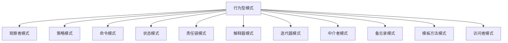
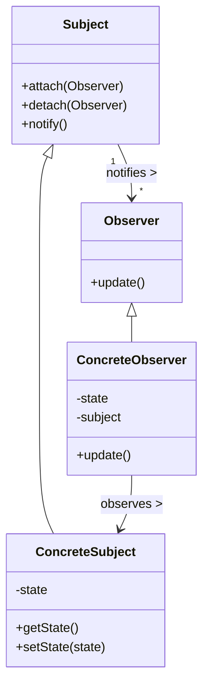
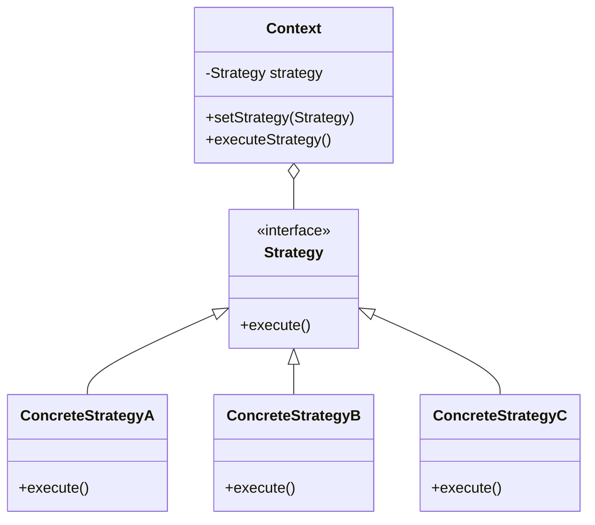
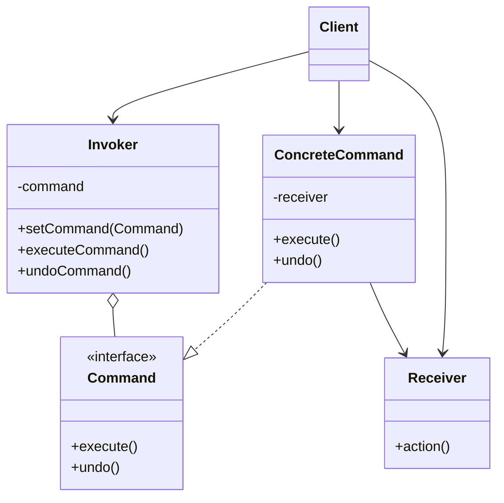
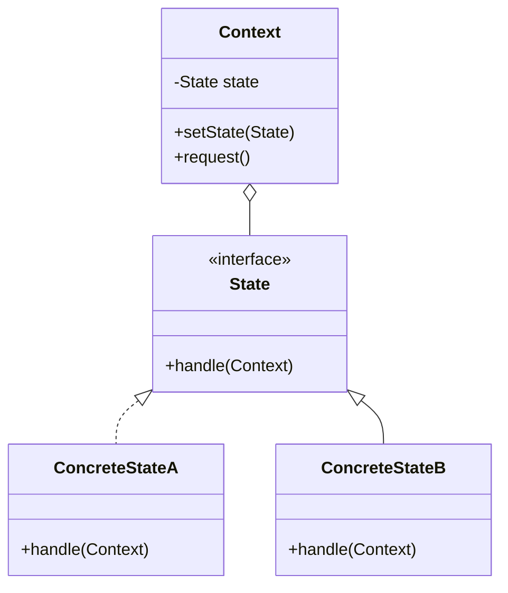
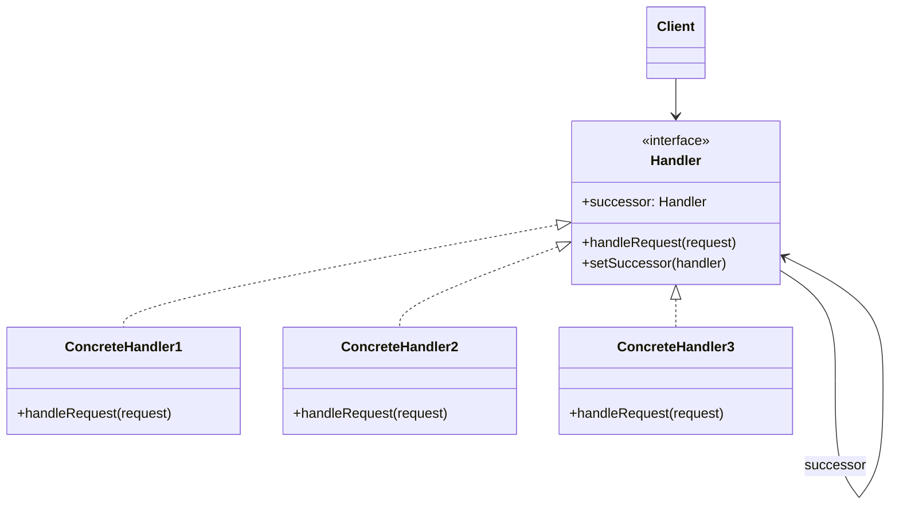

import Tabs from '@theme/Tabs';
import TabItem from '@theme/TabItem';
import CodeBlock from '@theme/CodeBlock';

# 行为型设计模式详解

行为型设计模式关注对象之间的通信机制，解决对象间责任分配和算法封装的问题。这类模式描述对象如何协作完成单个对象无法完成的任务，以及如何分配职责使对象间的耦合度最小。

:::tip 核心价值
行为型模式 = 对象通信 + 责任分配 + 算法封装 + 松耦合设计
:::

## 行为型模式概览

行为型设计模式主要包括以下11种模式，各自针对不同的行为交互场景：



| 模式名称 | 核心意图 | 关键特征 | 典型应用场景 |
|---------|---------|---------|------------|
| 观察者模式 | 定义对象间的一种一对多依赖关系 | 发布-订阅机制、松耦合通知 | 事件处理系统、UI更新、消息推送 |
| 策略模式 | 定义一系列算法，使其可以互相替换 | 算法封装、运行时切换 | 支付方式选择、排序算法切换 |
| 命令模式 | 将请求封装为对象，支持撤销等操作 | 行为参数化、请求队列 | 事务处理、命令撤销、GUI操作 |
| 状态模式 | 允许对象在内部状态改变时改变行为 | 状态驱动行为、状态转换 | 工作流系统、游戏状态管理 |
| 责任链模式 | 多个处理对象组成链，依次处理请求 | 动态链构建、请求传递 | 审批流程、异常处理、过滤器 |
| 解释器模式 | 定义语言语法表示，并解释其句子 | 语法树构建、规则解析 | 表达式计算、SQL解析、正则表达式 |
| 迭代器模式 | 提供顺序访问集合元素的方法 | 遍历与实现分离、内部迭代器 | 集合遍历、数据流处理 |
| 中介者模式 | 封装一组对象如何交互 | 中心化通信、多对多解耦 | 聊天室、航空管制、GUI组件交互 |
| 备忘录模式 | 在不违反封装的前提下保存对象状态 | 状态捕获、历史回溯 | 编辑器撤销功能、游戏存档 |
| 模板方法模式 | 定义算法骨架，允许子类重定义特定步骤 | 算法复用、钩子方法 | 构建流程、数据处理流程 |
| 访问者模式 | 将算法与对象结构分离 | 双分派、结构与操作分离 | 复杂对象操作、报表生成 | 

## 观察者模式 (Observer Pattern)

观察者模式是一种行为设计模式，它定义了对象间的一种一对多依赖关系，使得当一个对象状态改变时，所有依赖于它的对象都会得到通知并自动更新。



<Tabs>
  <TabItem value="适用场景" label="适用场景">
    - 当一个对象的状态变化需要通知其他多个对象时
    - 当应用中某些对象需要观察其他对象时，但仅在有限时间内或特定情况下
    - 当对象间存在一对多依赖，而且依赖关系不是永久性的
    - 需要建立一套触发机制的场景
  </TabItem>
  <TabItem value="优点" label="优点">
    - 遵循开闭原则，可以在不修改主题的情况下添加观察者
    - 建立了对象之间的松耦合关系
    - 支持广播通信，一个主题可以通知多个观察者
    - 可以在运行时建立和解除对象间的关联
  </TabItem>
  <TabItem value="缺点" label="缺点">
    - 观察者被通知的顺序是随机的，难以控制
    - 如果观察者之间存在循环依赖，可能导致系统崩溃
    - 观察者模式实现不当容易引起内存泄漏
    - 如果观察者过多或处理逻辑过重，可能导致性能问题
  </TabItem>
</Tabs>

### 观察者模式结构

观察者模式主要由以下几个角色组成：

1. **主题（Subject）**：定义添加、删除和通知观察者的接口
2. **具体主题（ConcreteSubject）**：实现主题接口，维护观察者列表，状态变更时通知观察者
3. **观察者（Observer）**：定义接收通知时的更新接口
4. **具体观察者（ConcreteObserver）**：实现观察者接口，维护与主题的一致性，存储感兴趣的状态

### 观察者模式实现

下面是一个典型的观察者模式实现：

```java title="观察者模式基本实现"
// 观察者接口
public interface Observer {
    void update(String message);
}

// 主题接口
public interface Subject {
    void attach(Observer observer);
    void detach(Observer observer);
    void notifyObservers();
}

// 具体主题
public class NewsAgency implements Subject {
    private List<Observer> observers = new ArrayList<>();
    private String news;
    
    @Override
    public void attach(Observer observer) {
        observers.add(observer);
    }
    
    @Override
    public void detach(Observer observer) {
        observers.remove(observer);
    }
    
    @Override
    public void notifyObservers() {
        for (Observer observer : observers) {
            observer.update(news);
        }
    }
    
    public void setNews(String news) {
        this.news = news;
        notifyObservers();
    }
}

// 具体观察者
public class NewsChannel implements Observer {
    private String name;
    
    public NewsChannel(String name) {
        this.name = name;
    }
    
    @Override
    public void update(String news) {
        System.out.println(name + " 收到新闻: " + news);
    }
}

// 使用示例
public class ObserverDemo {
    public static void main(String[] args) {
        NewsAgency agency = new NewsAgency();
        
        Observer tv1 = new NewsChannel("CCTV");
        Observer tv2 = new NewsChannel("BBC");
        Observer tv3 = new NewsChannel("CNN");
        
        agency.attach(tv1);
        agency.attach(tv2);
        agency.attach(tv3);
        
        agency.setNews("重大新闻：观察者模式发布!");
        
        agency.detach(tv2); // BBC退订
        
        agency.setNews("后续报道：观察者模式运行良好!");
    }
}
```

### 观察者模式变体

<Tabs>
  <TabItem value="推模型" label="推模型 (Push)">
    推模型是观察者模式的标准实现，主题将所有状态变化推送给观察者：

```java
// 推模型 - 主题将所有数据推送给观察者
public interface Observer {
    void update(String message, LocalDateTime timestamp, String category);
}

public class ConcreteObserver implements Observer {
    @Override
    public void update(String message, LocalDateTime timestamp, String category) {
        System.out.println("收到消息: " + message);
        System.out.println("时间: " + timestamp);
        System.out.println("类别: " + category);
    }
}
```
  </TabItem>
  <TabItem value="拉模型" label="拉模型 (Pull)">
    拉模型中主题仅通知观察者有变化，观察者按需获取数据：

```java
// 拉模型 - 观察者主动从主题获取需要的数据
public interface Observer {
    void update(Subject subject);
}

public interface Subject {
    String getMessage();
    LocalDateTime getTimestamp();
    String getCategory();
    // 其他获取方法...
}

public class ConcreteObserver implements Observer {
    @Override
    public void update(Subject subject) {
        // 只获取需要的数据
        String message = subject.getMessage();
        System.out.println("收到消息: " + message);
        
        // 按需获取其他数据
        if (needTimestamp()) {
            LocalDateTime timestamp = subject.getTimestamp();
            System.out.println("时间: " + timestamp);
        }
    }
    
    private boolean needTimestamp() {
        return true; // 根据实际需要决定
    }
}
```
  </TabItem>
  <TabItem value="事件驱动" label="事件驱动模型">
    事件驱动模型使用专门的事件对象来传递信息：

```java
// 事件类
public class NewsEvent {
    private final String message;
    private final LocalDateTime timestamp;
    private final String category;
    
    public NewsEvent(String message, String category) {
        this.message = message;
        this.timestamp = LocalDateTime.now();
        this.category = category;
    }
    
    // getter方法...
}

public interface EventListener {
    void onEvent(NewsEvent event);
}

public class EventSource {
    private List<EventListener> listeners = new ArrayList<>();
    
    public void addListener(EventListener listener) {
        listeners.add(listener);
    }
    
    public void removeListener(EventListener listener) {
        listeners.remove(listener);
    }
    
    public void fireEvent(NewsEvent event) {
        for (EventListener listener : listeners) {
            listener.onEvent(event);
        }
    }
}
```
  </TabItem>
</Tabs>

### 观察者模式应用实例

<Tabs>
  <TabItem value="事件处理系统" label="事件处理系统">
    ```java
    // 事件处理系统中的观察者模式
    public interface EventListener {
        void handleEvent(Event event);
    }
    
    public class UIButton {
        private List<EventListener> clickListeners = new ArrayList<>();
        
        public void addClickListener(EventListener listener) {
            clickListeners.add(listener);
        }
        
        public void removeClickListener(EventListener listener) {
            clickListeners.remove(listener);
        }
        
        public void click() {
            Event event = new Event("click", this);
            for (EventListener listener : clickListeners) {
                listener.handleEvent(event);
            }
        }
    }
    
    // 具体监听器
    public class SaveButtonListener implements EventListener {
        @Override
        public void handleEvent(Event event) {
            if (event.getType().equals("click")) {
                System.out.println("保存文档...");
                saveDocument();
            }
        }
        
        private void saveDocument() {
            // 保存文档的逻辑
        }
    }
    
    // 使用示例
    public static void main(String[] args) {
        UIButton saveButton = new UIButton();
        saveButton.addClickListener(new SaveButtonListener());
        
        // 用户点击按钮
        saveButton.click();
    }
    ```
  </TabItem>
  <TabItem value="消息订阅系统" label="消息订阅系统">
    ```java
    // 基于主题的消息订阅系统
    public class MessageBroker {
        private Map<String, List<Subscriber>> subscribers = new HashMap<>();
        
        public void subscribe(String topic, Subscriber subscriber) {
            subscribers.computeIfAbsent(topic, k -> new ArrayList<>()).add(subscriber);
        }
        
        public void unsubscribe(String topic, Subscriber subscriber) {
            if (subscribers.containsKey(topic)) {
                subscribers.get(topic).remove(subscriber);
            }
        }
        
        public void publish(String topic, String message) {
            if (subscribers.containsKey(topic)) {
                for (Subscriber subscriber : subscribers.get(topic)) {
                    subscriber.receive(topic, message);
                }
            }
        }
    }
    
    public interface Subscriber {
        void receive(String topic, String message);
    }
    
    public class EmailNotifier implements Subscriber {
        private String email;
        
        public EmailNotifier(String email) {
            this.email = email;
        }
        
        @Override
        public void receive(String topic, String message) {
            System.out.println("向 " + email + " 发送关于 " + topic + " 的邮件通知: " + message);
        }
    }
    
    public class SMSNotifier implements Subscriber {
        private String phoneNumber;
        
        public SMSNotifier(String phoneNumber) {
            this.phoneNumber = phoneNumber;
        }
        
        @Override
        public void receive(String topic, String message) {
            System.out.println("向 " + phoneNumber + " 发送关于 " + topic + " 的短信通知: " + message);
        }
    }
    
    // 使用示例
    public static void main(String[] args) {
        MessageBroker broker = new MessageBroker();
        
        Subscriber emailSub = new EmailNotifier("user@example.com");
        Subscriber smsSub = new SMSNotifier("13800138000");
        
        broker.subscribe("sports", emailSub);
        broker.subscribe("tech", emailSub);
        broker.subscribe("tech", smsSub);
        
        broker.publish("tech", "新型AI技术发布");
        broker.publish("sports", "世界杯最新赛况");
    }
    ```
  </TabItem>
</Tabs>

### 观察者模式与其他模式比较

| 模式 | 区别 | 组合使用场景 |
|------|------|------------|
| 观察者模式 vs 中介者模式 | 观察者模式中观察者知道主题的存在，而中介者模式中组件通过中介者间接通信 | 中介者可以作为观察者实现，或者使用观察者模式监听中介者状态 |
| 观察者模式 vs 发布-订阅模式 | 发布-订阅通常有一个事件通道作为中间层，发布者和订阅者互不了解 | 可以使用观察者模式实现发布-订阅模式的核心机制 |
| 观察者模式 vs 命令模式 | 命令模式封装请求为对象，观察者模式处理对象间的事件通知 | 命令对象可以作为观察者，在事件发生时执行特定命令 |

### 观察者模式实现要点

1. **线程安全考虑**：在多线程环境中，观察者列表和通知机制需要考虑同步问题
   ```java
   // 线程安全的观察者列表
   private final List<Observer> observers = 
       Collections.synchronizedList(new ArrayList<>());
       
   // 或使用并发集合
   private final CopyOnWriteArrayList<Observer> observers = 
       new CopyOnWriteArrayList<>();
   ```

2. **防止内存泄漏**：弱引用可以防止观察者持有导致的内存泄漏
   ```java
   // 使用弱引用存储观察者
   private final List<WeakReference<Observer>> observers = new ArrayList<>();
   
   public void notifyObservers() {
       Iterator<WeakReference<Observer>> iterator = observers.iterator();
       while (iterator.hasNext()) {
           Observer observer = iterator.next().get();
           if (observer != null) {
               observer.update(this.state);
           } else {
               // 移除已被垃圾收集的观察者引用
               iterator.remove();
           }
       }
   }
   ```

3. **异常处理**：观察者处理过程中的异常不应影响其他观察者
   ```java
   public void notifyObservers() {
       for (Observer observer : observers) {
           try {
               observer.update(this.state);
           } catch (Exception e) {
               // 记录异常但继续通知其他观察者
               logger.error("通知观察者时发生错误", e);
           }
       }
   }
   ```

:::tip 观察者模式最佳实践
- 明确定义观察者和主题的接口，保持关注点分离
- 考虑使用JDK内置的Observable类和Observer接口
- 对于复杂系统，考虑使用事件总线或消息中间件实现
- 避免在观察者的update方法中执行耗时操作
- 当观察者数量庞大时，考虑使用批处理或异步通知
::: 

## 策略模式 (Strategy Pattern)

策略模式是一种行为设计模式，它定义了算法家族，分别封装起来，让它们之间可以互相替换，此模式让算法的变化独立于使用算法的客户端。



<Tabs>
  <TabItem value="适用场景" label="适用场景">
    - 当需要使用不同变体的算法时
    - 当需要隐藏算法实现细节时
    - 当类中包含许多行为，这些行为以多个条件语句的形式存在
    - 当算法的选择依赖于调用者的上下文时
  </TabItem>
  <TabItem value="优点" label="优点">
    - 可以在运行时切换算法
    - 将算法的实现与使用算法的代码隔离
    - 用组合代替继承，更加灵活
    - 符合开闭原则，增加新策略无需修改上下文
  </TabItem>
  <TabItem value="缺点" label="缺点">
    - 客户端必须知道所有策略类及其区别
    - 增加了对象数量
    - 如果策略很少且很少改变，使用此模式可能增加不必要的复杂性
  </TabItem>
</Tabs>

### 策略模式结构

策略模式包含以下几个角色：

1. **策略（Strategy）**：定义所有支持的算法的公共接口
2. **具体策略（ConcreteStrategy）**：实现策略接口的具体算法
3. **上下文（Context）**：维护一个策略引用，使用该引用调用具体策略

### 策略模式实现

下面是一个典型的策略模式实现：

```java title="策略模式基本实现"
// 策略接口
public interface PaymentStrategy {
    void pay(int amount);
}

// 具体策略A
public class CreditCardPayment implements PaymentStrategy {
    private String cardNumber;
    private String name;
    private String cvv;
    private String dateOfExpiry;
    
    public CreditCardPayment(String cardNumber, String name, String cvv, String dateOfExpiry) {
        this.cardNumber = cardNumber;
        this.name = name;
        this.cvv = cvv;
        this.dateOfExpiry = dateOfExpiry;
    }
    
    @Override
    public void pay(int amount) {
        System.out.println(amount + " 元已通过信用卡支付");
    }
}

// 具体策略B
public class PayPalPayment implements PaymentStrategy {
    private String emailId;
    private String password;
    
    public PayPalPayment(String email, String password) {
        this.emailId = email;
        this.password = password;
    }
    
    @Override
    public void pay(int amount) {
        System.out.println(amount + " 元已通过PayPal支付");
    }
}

// 具体策略C
public class WeChatPayment implements PaymentStrategy {
    private String id;
    
    public WeChatPayment(String id) {
        this.id = id;
    }
    
    @Override
    public void pay(int amount) {
        System.out.println(amount + " 元已通过微信支付");
    }
}

// 上下文
public class ShoppingCart {
    private PaymentStrategy paymentStrategy;
    
    public void setPaymentStrategy(PaymentStrategy paymentStrategy) {
        this.paymentStrategy = paymentStrategy;
    }
    
    public void checkout(int amount) {
        paymentStrategy.pay(amount);
    }
}

// 使用示例
public class StrategyDemo {
    public static void main(String[] args) {
        ShoppingCart cart = new ShoppingCart();
        
        // 用户选择信用卡支付
        cart.setPaymentStrategy(new CreditCardPayment(
            "1234567890123456", "张三", "123", "12/25"));
        cart.checkout(1000);
        
        // 用户选择PayPal支付
        cart.setPaymentStrategy(new PayPalPayment("zhangsan@example.com", "password"));
        cart.checkout(500);
        
        // 用户选择微信支付
        cart.setPaymentStrategy(new WeChatPayment("zhangsan123"));
        cart.checkout(300);
    }
}
```

### 策略模式变体

<Tabs>
  <TabItem value="函数式策略" label="函数式策略">
    使用Java 8函数式接口和Lambda表达式可以简化策略模式的实现：

```java
// 使用函数式接口定义策略
public interface DiscountStrategy {
    double applyDiscount(double amount);
}

public class PriceCalculator {
    private DiscountStrategy discountStrategy;
    
    public void setDiscountStrategy(DiscountStrategy discountStrategy) {
        this.discountStrategy = discountStrategy;
    }
    
    public double calculateFinalPrice(double price) {
        return discountStrategy.applyDiscount(price);
    }
}

// 使用Lambda表达式作为策略
public class FunctionalStrategyDemo {
    public static void main(String[] args) {
        PriceCalculator calculator = new PriceCalculator();
        
        // 无折扣策略
        calculator.setDiscountStrategy(amount -> amount);
        System.out.println("原价: " + calculator.calculateFinalPrice(100));
        
        // 固定金额折扣策略
        calculator.setDiscountStrategy(amount -> amount - 20);
        System.out.println("满减20: " + calculator.calculateFinalPrice(100));
        
        // 百分比折扣策略
        calculator.setDiscountStrategy(amount -> amount * 0.8);
        System.out.println("8折优惠: " + calculator.calculateFinalPrice(100));
        
        // 条件折扣策略
        calculator.setDiscountStrategy(amount -> 
            amount > 200 ? amount * 0.8 : amount * 0.9);
        System.out.println("满200打8折，否则9折: " + calculator.calculateFinalPrice(250));
    }
}
```
  </TabItem>
  <TabItem value="策略工厂" label="策略工厂">
    结合工厂模式，可以根据条件动态选择合适的策略：

```java
// 策略接口
public interface TaxStrategy {
    double calculateTax(double income);
}

// 具体策略
public class PersonalTaxStrategy implements TaxStrategy {
    @Override
    public double calculateTax(double income) {
        return income * 0.1; // 个人所得税10%
    }
}

public class CorporateTaxStrategy implements TaxStrategy {
    @Override
    public double calculateTax(double income) {
        return income * 0.25; // 企业所得税25%
    }
}

public class NonProfitTaxStrategy implements TaxStrategy {
    @Override
    public double calculateTax(double income) {
        return income * 0.05; // 非盈利组织5%
    }
}

// 策略工厂
public class TaxStrategyFactory {
    public static TaxStrategy createStrategy(String type) {
        switch (type.toLowerCase()) {
            case "personal":
                return new PersonalTaxStrategy();
            case "corporate":
                return new CorporateTaxStrategy();
            case "nonprofit":
                return new NonProfitTaxStrategy();
            default:
                throw new IllegalArgumentException("未知的税务类型: " + type);
        }
    }
}

// 上下文类使用工厂
public class TaxCalculator {
    public double calculateTax(String type, double income) {
        TaxStrategy strategy = TaxStrategyFactory.createStrategy(type);
        return strategy.calculateTax(income);
    }
}

// 使用示例
public class StrategyFactoryDemo {
    public static void main(String[] args) {
        TaxCalculator calculator = new TaxCalculator();
        
        System.out.println("个人税: " + calculator.calculateTax("personal", 10000));
        System.out.println("企业税: " + calculator.calculateTax("corporate", 100000));
        System.out.println("非盈利组织税: " + calculator.calculateTax("nonprofit", 50000));
    }
}
```
  </TabItem>
</Tabs>

### 策略模式应用实例

<Tabs>
  <TabItem value="排序策略" label="排序策略">
    ```java
    // 排序策略接口
    public interface SortStrategy<T> {
        List<T> sort(List<T> dataset);
    }
    
    // 具体排序策略
    public class QuickSortStrategy<T extends Comparable<T>> implements SortStrategy<T> {
        @Override
        public List<T> sort(List<T> dataset) {
            // 快速排序实现
            System.out.println("使用快速排序");
            List<T> result = new ArrayList<>(dataset);
            // 排序逻辑...
            return result;
        }
    }
    
    public class MergeSortStrategy<T extends Comparable<T>> implements SortStrategy<T> {
        @Override
        public List<T> sort(List<T> dataset) {
            // 归并排序实现
            System.out.println("使用归并排序");
            List<T> result = new ArrayList<>(dataset);
            // 排序逻辑...
            return result;
        }
    }
    
    public class BubbleSortStrategy<T extends Comparable<T>> implements SortStrategy<T> {
        @Override
        public List<T> sort(List<T> dataset) {
            // 冒泡排序实现
            System.out.println("使用冒泡排序");
            List<T> result = new ArrayList<>(dataset);
            // 排序逻辑...
            return result;
        }
    }
    
    // 上下文类
    public class Sorter<T extends Comparable<T>> {
        private SortStrategy<T> strategy;
        
        public void setSortStrategy(SortStrategy<T> strategy) {
            this.strategy = strategy;
        }
        
        public List<T> sort(List<T> dataset) {
            return strategy.sort(dataset);
        }
    }
    
    // 基于数据特性自动选择排序策略的增强上下文
    public class SmartSorter<T extends Comparable<T>> {
        private SortStrategy<T> quickSort = new QuickSortStrategy<>();
        private SortStrategy<T> mergeSort = new MergeSortStrategy<>();
        private SortStrategy<T> bubbleSort = new BubbleSortStrategy<>();
        
        public List<T> sort(List<T> dataset) {
            // 根据数据大小选择合适的排序算法
            if (dataset.size() <= 10) {
                return bubbleSort.sort(dataset);
            } else if (dataset.size() <= 1000) {
                return quickSort.sort(dataset);
            } else {
                return mergeSort.sort(dataset);
            }
        }
    }
    ```
  </TabItem>
  <TabItem value="文本压缩策略" label="文本压缩策略">
    ```java
    // 压缩策略接口
    public interface CompressionStrategy {
        byte[] compress(String data);
        String decompress(byte[] data);
    }
    
    // GZIP压缩
    public class GZIPCompressionStrategy implements CompressionStrategy {
        @Override
        public byte[] compress(String data) {
            try (ByteArrayOutputStream bos = new ByteArrayOutputStream();
                 GZIPOutputStream gzipOS = new GZIPOutputStream(bos)) {
                gzipOS.write(data.getBytes("UTF-8"));
                gzipOS.close();
                return bos.toByteArray();
            } catch (IOException e) {
                throw new RuntimeException(e);
            }
        }
        
        @Override
        public String decompress(byte[] data) {
            try (GZIPInputStream gis = new GZIPInputStream(new ByteArrayInputStream(data));
                 ByteArrayOutputStream bos = new ByteArrayOutputStream()) {
                byte[] buffer = new byte[1024];
                int len;
                while ((len = gis.read(buffer)) != -1) {
                    bos.write(buffer, 0, len);
                }
                return bos.toString("UTF-8");
            } catch (IOException e) {
                throw new RuntimeException(e);
            }
        }
    }
    
    // ZIP压缩
    public class ZIPCompressionStrategy implements CompressionStrategy {
        @Override
        public byte[] compress(String data) {
            // ZIP压缩实现...
            return new byte[0]; // 简化示例
        }
        
        @Override
        public String decompress(byte[] data) {
            // ZIP解压缩实现...
            return ""; // 简化示例
        }
    }
    
    // 不压缩(用于小文件或已压缩内容)
    public class NoCompressionStrategy implements CompressionStrategy {
        @Override
        public byte[] compress(String data) {
            return data.getBytes(StandardCharsets.UTF_8);
        }
        
        @Override
        public String decompress(byte[] data) {
            return new String(data, StandardCharsets.UTF_8);
        }
    }
    
    // 上下文类
    public class Compressor {
        private CompressionStrategy strategy;
        
        public Compressor(CompressionStrategy strategy) {
            this.strategy = strategy;
        }
        
        public void setStrategy(CompressionStrategy strategy) {
            this.strategy = strategy;
        }
        
        public byte[] compress(String data) {
            return strategy.compress(data);
        }
        
        public String decompress(byte[] data) {
            return strategy.decompress(data);
        }
    }
    
    // 使用示例
    public class CompressionExample {
        public static void main(String[] args) {
            String data = "这是一段需要压缩的文本，可能很长...";
            
            // 使用GZIP压缩
            Compressor gzipCompressor = new Compressor(new GZIPCompressionStrategy());
            byte[] compressed = gzipCompressor.compress(data);
            System.out.println("GZIP压缩后大小: " + compressed.length);
            
            // 解压缩
            String decompressed = gzipCompressor.decompress(compressed);
            System.out.println("解压后内容: " + decompressed);
            
            // 切换为无压缩策略
            gzipCompressor.setStrategy(new NoCompressionStrategy());
            byte[] noCompression = gzipCompressor.compress(data);
            System.out.println("不压缩大小: " + noCompression.length);
        }
    }
    ```
  </TabItem>
</Tabs>

### 策略模式与其他模式比较

| 模式 | 区别 | 组合使用场景 |
|------|------|------------|
| 策略模式 vs 状态模式 | 状态模式允许对象随着状态改变而改变行为，策略模式专注于不同算法的互换 | 策略模式可以用来实现状态模式中的不同状态行为 |
| 策略模式 vs 命令模式 | 命令模式封装执行行为的请求，策略模式封装不同的算法实现 | 命令可以使用不同的策略执行请求 |
| 策略模式 vs 模板方法模式 | 模板方法使用继承来更改算法的部分内容，策略使用组合来更换整个算法 | 模板方法的钩子方法可以使用策略模式提供不同实现 |

### 策略模式实现要点

1. **上下文和策略的关系**：上下文不应过度依赖具体策略的内部细节

2. **策略的动态选择**：基于条件自动选择策略可以提高灵活性
   ```java
   public PaymentStrategy chooseStrategy(String paymentType, Map<String, String> paymentDetails) {
       switch(paymentType) {
           case "CREDIT_CARD":
               return new CreditCardPayment(
                   paymentDetails.get("cardNumber"),
                   paymentDetails.get("name"),
                   paymentDetails.get("cvv"),
                   paymentDetails.get("expiryDate"));
           case "PAYPAL":
               return new PayPalPayment(
                   paymentDetails.get("email"),
                   paymentDetails.get("password"));
           case "WECHAT":
               return new WeChatPayment(
                   paymentDetails.get("id"));
           default:
               throw new IllegalArgumentException("不支持的支付类型");
       }
   }
   ```

3. **策略接口定义**：策略接口应该保持简单，仅包含必要方法
   ```java
   // 好的做法：接口简洁
   public interface ValidationStrategy {
       boolean validate(String text);
   }
   
   // 避免的做法：接口过于复杂
   public interface ComplexValidationStrategy {
       boolean validate(String text);
       boolean validateFormat(String format);
       void setValidationRules(List<Rule> rules);
       List<String> getValidationErrors();
       // 其他不必要的方法...
   }
   ```

4. **性能考虑**：避免频繁创建和切换策略对象

:::tip 策略模式最佳实践
- 使用策略模式代替复杂的条件语句
- 当有多个算法只有微小变化时，考虑使用lambda表达式或匿名类
- 结合工厂模式可以隐藏客户端对具体策略的直接依赖
- 策略对象应该是无状态的，以便可以在多个上下文间共享
- 在合适的情况下使用枚举实现简单的策略模式
::: 

## 命令模式 (Command Pattern)

命令模式是一种行为设计模式，它将请求封装为一个对象，从而可以用不同的请求对客户进行参数化，对请求排队或记录请求日志，以及支持可撤销的操作。



<Tabs>
  <TabItem value="适用场景" label="适用场景">
    - 需要将操作参数化时
    - 需要将操作放入队列中、操作的执行需要延迟或者操作需要远程执行时
    - 需要支持撤销操作时
    - 需要支持事务操作，将一系列操作作为一个整体执行或回滚
    - 需要实现操作的日志记录、审计或历史记录
  </TabItem>
  <TabItem value="优点" label="优点">
    - 解耦命令发送者和接收者
    - 可以轻松添加新命令
    - 支持撤销/重做操作
    - 支持宏命令（组合命令）
    - 支持命令队列和延迟执行
  </TabItem>
  <TabItem value="缺点" label="缺点">
    - 可能导致系统中有过多的具体命令类
    - 复杂命令可能需要保存更多状态来支持撤销
    - 如果命令接口过于复杂，可能增加客户端负担
  </TabItem>
</Tabs>

### 命令模式结构

命令模式包含以下几个角色：

1. **命令（Command）**：声明执行操作的接口，通常包含execute()方法和可选的undo()方法
2. **具体命令（ConcreteCommand）**：定义命令与接收者之间的绑定，实现execute()方法，调用接收者的相关操作
3. **调用者（Invoker）**：要求命令执行请求
4. **接收者（Receiver）**：知道如何实施与执行请求相关的操作
5. **客户端（Client）**：创建具体命令对象并设置其接收者

### 命令模式实现

下面是一个命令模式的基本实现：

```java title="命令模式基本实现"
// 命令接口
public interface Command {
    void execute();
    void undo();
}

// 接收者
public class Light {
    private boolean isOn = false;
    private String location;
    
    public Light(String location) {
        this.location = location;
    }
    
    public void turnOn() {
        isOn = true;
        System.out.println(location + " 灯已打开");
    }
    
    public void turnOff() {
        isOn = false;
        System.out.println(location + " 灯已关闭");
    }
    
    public boolean isOn() {
        return isOn;
    }
}

// 具体命令
public class LightOnCommand implements Command {
    private Light light;
    
    public LightOnCommand(Light light) {
        this.light = light;
    }
    
    @Override
    public void execute() {
        light.turnOn();
    }
    
    @Override
    public void undo() {
        light.turnOff();
    }
}

public class LightOffCommand implements Command {
    private Light light;
    
    public LightOffCommand(Light light) {
        this.light = light;
    }
    
    @Override
    public void execute() {
        light.turnOff();
    }
    
    @Override
    public void undo() {
        light.turnOn();
    }
}

// 调用者
public class RemoteControl {
    private Command command;
    
    public void setCommand(Command command) {
        this.command = command;
    }
    
    public void pressButton() {
        command.execute();
    }
    
    public void pressUndoButton() {
        command.undo();
    }
}

// 客户端
public class CommandDemo {
    public static void main(String[] args) {
        // 创建接收者
        Light livingRoomLight = new Light("客厅");
        
        // 创建命令
        Command livingRoomLightOn = new LightOnCommand(livingRoomLight);
        Command livingRoomLightOff = new LightOffCommand(livingRoomLight);
        
        // 创建调用者
        RemoteControl remote = new RemoteControl();
        
        // 执行命令
        remote.setCommand(livingRoomLightOn);
        remote.pressButton(); // 打开客厅灯
        
        remote.setCommand(livingRoomLightOff);
        remote.pressButton(); // 关闭客厅灯
        
        remote.pressUndoButton(); // 撤销关灯，灯重新打开
    }
}
```

### 命令模式变体

<Tabs>
  <TabItem value="宏命令" label="宏命令">
    宏命令允许将多个命令组合成一个命令：

```java
// 宏命令 - 组合多个命令
public class MacroCommand implements Command {
    private List<Command> commands;
    
    public MacroCommand() {
        this.commands = new ArrayList<>();
    }
    
    public void addCommand(Command command) {
        commands.add(command);
    }
    
    @Override
    public void execute() {
        for (Command command : commands) {
            command.execute();
        }
    }
    
    @Override
    public void undo() {
        // 逆序撤销
        for (int i = commands.size() - 1; i >= 0; i--) {
            commands.get(i).undo();
        }
    }
}

// 使用宏命令
public static void main(String[] args) {
    Light livingRoomLight = new Light("客厅");
    Light kitchenLight = new Light("厨房");
    
    Command livingRoomLightOn = new LightOnCommand(livingRoomLight);
    Command kitchenLightOn = new LightOnCommand(kitchenLight);
    
    MacroCommand allLightsOn = new MacroCommand();
    allLightsOn.addCommand(livingRoomLightOn);
    allLightsOn.addCommand(kitchenLightOn);
    
    RemoteControl remote = new RemoteControl();
    
    // 一次性打开所有灯
    remote.setCommand(allLightsOn);
    remote.pressButton();
    
    // 一次性关闭所有灯
    remote.pressUndoButton();
}
```
  </TabItem>
  <TabItem value="命令队列" label="命令队列">
    命令队列允许命令的异步执行或延迟执行：

```java
// 命令队列
public class CommandQueue {
    private Queue<Command> commandQueue = new LinkedList<>();
    
    public void addCommand(Command command) {
        commandQueue.offer(command);
    }
    
    public void processCommands() {
        while (!commandQueue.isEmpty()) {
            Command command = commandQueue.poll();
            command.execute();
        }
    }
}

// 使用命令队列
public static void main(String[] args) {
    Light livingRoomLight = new Light("客厅");
    Command livingRoomLightOn = new LightOnCommand(livingRoomLight);
    Command livingRoomLightOff = new LightOffCommand(livingRoomLight);
    
    CommandQueue queue = new CommandQueue();
    queue.addCommand(livingRoomLightOn);
    queue.addCommand(livingRoomLightOff);
    queue.addCommand(livingRoomLightOn);
    
    // 批量处理命令
    queue.processCommands();
}
```
  </TabItem>
  <TabItem value="命令历史" label="命令历史">
    维护命令历史，支持多步撤销：

```java
// 带历史记录的调用者
public class HistoryRemoteControl {
    private Command command;
    private Stack<Command> history = new Stack<>();
    
    public void setCommand(Command command) {
        this.command = command;
    }
    
    public void pressButton() {
        if (command != null) {
            command.execute();
            history.push(command);
        }
    }
    
    public void pressUndoButton() {
        if (!history.isEmpty()) {
            Command lastCommand = history.pop();
            lastCommand.undo();
        }
    }
}

// 使用带历史的遥控器
public static void main(String[] args) {
    Light livingRoomLight = new Light("客厅");
    Light kitchenLight = new Light("厨房");
    
    Command livingRoomLightOn = new LightOnCommand(livingRoomLight);
    Command kitchenLightOn = new LightOnCommand(kitchenLight);
    
    HistoryRemoteControl remote = new HistoryRemoteControl();
    
    remote.setCommand(livingRoomLightOn);
    remote.pressButton();
    
    remote.setCommand(kitchenLightOn);
    remote.pressButton();
    
    // 撤销打开厨房灯
    remote.pressUndoButton();
    
    // 撤销打开客厅灯
    remote.pressUndoButton();
}
```
  </TabItem>
</Tabs>

### 命令模式应用实例

<Tabs>
  <TabItem value="编辑器操作" label="编辑器操作">
    ```java
    // 文本编辑器中的命令模式
    public class Document {
        private StringBuilder content = new StringBuilder();
        
        public void insert(int position, String text) {
            if (position <= content.length()) {
                content.insert(position, text);
                System.out.println("已插入文本：" + text);
            }
        }
        
        public String delete(int position, int length) {
            if (position < content.length() && position + length <= content.length()) {
                String deletedText = content.substring(position, position + length);
                content.delete(position, position + length);
                System.out.println("已删除文本：" + deletedText);
                return deletedText;
            }
            return "";
        }
        
        public String getContent() {
            return content.toString();
        }
    }
    
    public interface EditorCommand extends Command {
        // Command接口中已定义execute和undo方法
    }
    
    public class InsertCommand implements EditorCommand {
        private Document document;
        private int position;
        private String text;
        
        public InsertCommand(Document document, int position, String text) {
            this.document = document;
            this.position = position;
            this.text = text;
        }
        
        @Override
        public void execute() {
            document.insert(position, text);
        }
        
        @Override
        public void undo() {
            document.delete(position, text.length());
        }
    }
    
    public class DeleteCommand implements EditorCommand {
        private Document document;
        private int position;
        private int length;
        private String deletedText; // 用于撤销
        
        public DeleteCommand(Document document, int position, int length) {
            this.document = document;
            this.position = position;
            this.length = length;
        }
        
        @Override
        public void execute() {
            deletedText = document.delete(position, length);
        }
        
        @Override
        public void undo() {
            document.insert(position, deletedText);
        }
    }
    
    public class Editor {
        private Document document = new Document();
        private Stack<EditorCommand> undoStack = new Stack<>();
        private Stack<EditorCommand> redoStack = new Stack<>();
        
        public void executeCommand(EditorCommand command) {
            command.execute();
            undoStack.push(command);
            redoStack.clear(); // 执行新命令后清空重做栈
        }
        
        public void undo() {
            if (!undoStack.isEmpty()) {
                EditorCommand command = undoStack.pop();
                command.undo();
                redoStack.push(command);
            }
        }
        
        public void redo() {
            if (!redoStack.isEmpty()) {
                EditorCommand command = redoStack.pop();
                command.execute();
                undoStack.push(command);
            }
        }
        
        public String getContent() {
            return document.getContent();
        }
    }
    
    // 使用示例
    public static void main(String[] args) {
        Editor editor = new Editor();
        
        // 插入文本
        editor.executeCommand(new InsertCommand(editor.document, 0, "Hello, "));
        editor.executeCommand(new InsertCommand(editor.document, 7, "World!"));
        
        System.out.println("当前内容: " + editor.getContent()); // Hello, World!
        
        // 删除部分文本
        editor.executeCommand(new DeleteCommand(editor.document, 7, 6));
        
        System.out.println("删除后: " + editor.getContent()); // Hello, !
        
        // 撤销删除
        editor.undo();
        System.out.println("撤销后: " + editor.getContent()); // Hello, World!
        
        // 重做删除
        editor.redo();
        System.out.println("重做后: " + editor.getContent()); // Hello, !
    }
    ```
  </TabItem>
  <TabItem value="事务管理" label="事务管理">
    ```java
    // 数据库事务中的命令模式
    public class BankAccount {
        private String accountId;
        private double balance;
        
        public BankAccount(String accountId, double initialBalance) {
            this.accountId = accountId;
            this.balance = initialBalance;
        }
        
        public void deposit(double amount) {
            balance += amount;
            System.out.println("账户 " + accountId + " 存入 " + amount + "，余额: " + balance);
        }
        
        public boolean withdraw(double amount) {
            if (balance >= amount) {
                balance -= amount;
                System.out.println("账户 " + accountId + " 取出 " + amount + "，余额: " + balance);
                return true;
            } else {
                System.out.println("账户 " + accountId + " 余额不足，无法取出 " + amount);
                return false;
            }
        }
    }
    
    // 转账命令
    public class TransferCommand implements Command {
        private BankAccount sourceAccount;
        private BankAccount targetAccount;
        private double amount;
        private boolean executed = false;
        
        public TransferCommand(BankAccount sourceAccount, BankAccount targetAccount, double amount) {
            this.sourceAccount = sourceAccount;
            this.targetAccount = targetAccount;
            this.amount = amount;
        }
        
        @Override
        public void execute() {
            if (sourceAccount.withdraw(amount)) {
                targetAccount.deposit(amount);
                executed = true;
            }
        }
        
        @Override
        public void undo() {
            if (executed) {
                targetAccount.withdraw(amount);
                sourceAccount.deposit(amount);
                executed = false;
            }
        }
    }
    
    // 事务管理器
    public class TransactionManager {
        private List<Command> commands = new ArrayList<>();
        
        public void addCommand(Command cmd) {
            commands.add(cmd);
        }
        
        public boolean executeTransaction() {
            List<Command> executedCommands = new ArrayList<>();
            try {
                // 执行所有命令
                for (Command cmd : commands) {
                    cmd.execute();
                    executedCommands.add(cmd);
                }
                return true;
            } catch (Exception e) {
                // 回滚已执行的命令
                System.out.println("事务失败，开始回滚...");
                for (int i = executedCommands.size() - 1; i >= 0; i--) {
                    executedCommands.get(i).undo();
                }
                return false;
            }
        }
    }
    
    // 使用示例
    public static void main(String[] args) {
        BankAccount accountA = new BankAccount("A001", 1000);
        BankAccount accountB = new BankAccount("B001", 500);
        
        TransactionManager transactionManager = new TransactionManager();
        
        // 创建两个转账命令
        Command transfer1 = new TransferCommand(accountA, accountB, 300);
        Command transfer2 = new TransferCommand(accountB, accountA, 100);
        
        transactionManager.addCommand(transfer1);
        transactionManager.addCommand(transfer2);
        
        // 执行事务
        boolean success = transactionManager.executeTransaction();
        System.out.println("事务执行" + (success ? "成功" : "失败"));
    }
    ```
  </TabItem>
</Tabs>

### 命令模式与其他模式比较

| 模式 | 区别 | 组合使用场景 |
|------|------|------------|
| 命令模式 vs 策略模式 | 命令模式关注的是请求的封装，策略模式关注的是算法的封装 | 命令可以使用不同策略执行请求 |
| 命令模式 vs 备忘录模式 | 命令可以存储系统状态的变化过程，备忘录存储的是系统在某一时刻的完整状态 | 可以使用备忘录模式来存储命令执行前的状态 |
| 命令模式 vs 原型模式 | 命令对象可以通过克隆来创建副本 | 通过原型模式复制命令对象以支持命令的重用 |

### 命令模式实现要点

1. **智能命令与简单命令**：
   - 简单命令只负责调用接收者的方法
   - 智能命令自己包含业务逻辑，不依赖接收者

2. **命令参数化**：
   ```java
   // 参数化命令
   public class ParameterizedCommand implements Command {
       private Receiver receiver;
       private Object[] parameters;
       
       public ParameterizedCommand(Receiver receiver, Object... parameters) {
           this.receiver = receiver;
           this.parameters = parameters;
       }
       
       @Override
       public void execute() {
           // 根据参数执行不同操作
           receiver.action(parameters);
       }
       
       @Override
       public void undo() {
           // 撤销操作
       }
   }
   ```

3. **命令序列化**：
   ```java
   // 可序列化命令，支持持久化
   public class SerializableCommand implements Command, Serializable {
       private static final long serialVersionUID = 1L;
       private transient Receiver receiver; // transient表示不序列化此字段
       private String actionName;
       private Map<String, Serializable> parameters;
       
       // 构造方法和execute/undo实现
       // ...
       
       // 保存命令到文件
       public static void saveCommand(Command command, String filename) throws IOException {
           try (ObjectOutputStream out = new ObjectOutputStream(new FileOutputStream(filename))) {
               out.writeObject(command);
           }
       }
       
       // 从文件加载命令
       public static Command loadCommand(String filename) throws IOException, ClassNotFoundException {
           try (ObjectInputStream in = new ObjectInputStream(new FileInputStream(filename))) {
               return (Command) in.readObject();
           }
       }
   }
   ```

4. **命令模式与函数式编程**：
   ```java
   // 使用函数式接口
   @FunctionalInterface
   public interface ActionCommand {
       void execute();
       
       // Java 8默认方法
       default ActionCommand andThen(ActionCommand after) {
           return () -> {
               this.execute();
               after.execute();
           };
       }
   }
   
   // 使用示例
   public static void main(String[] args) {
       Light light = new Light("客厅");
       
       ActionCommand turnOn = light::turnOn;
       ActionCommand turnOff = light::turnOff;
       
       // 组合命令
       ActionCommand flashLight = turnOn.andThen(turnOff).andThen(turnOn).andThen(turnOff);
       
       // 执行命令
       flashLight.execute();
   }
   ```

:::tip 命令模式最佳实践
- 为命令定义清晰的生命周期：创建、执行、撤销和销毁
- 考虑命令对象的可重用性，避免重复创建相同的命令
- 对于复杂操作，使用宏命令组合多个命令
- 在需要持久化、远程执行或延迟执行操作时，考虑使用命令模式
- 命令模式特别适合实现撤销/重做、事务处理和操作日志
::: 

## 状态模式 (State Pattern)

状态模式是一种行为设计模式，它允许对象在内部状态改变时改变它的行为，使对象看起来好像修改了它的类。状态模式是对象行为随状态改变而改变的场景的解决方案。



<Tabs>
  <TabItem value="适用场景" label="适用场景">
    - 对象的行为取决于它的状态，且必须在运行时根据状态改变其行为
    - 代码中包含大量与对象状态有关的条件语句，如多个if-else或switch-case
    - 状态转换规则复杂且频繁变化
    - 需要消除"状态判断"的条件语句时
  </TabItem>
  <TabItem value="优点" label="优点">
    - 单一职责原则，将状态特定的行为局部化
    - 开闭原则，无需修改上下文就能引入新状态
    - 消除了庞大的条件判断语句
    - 使状态转换更加明确
    - 状态对象可以共享
  </TabItem>
  <TabItem value="缺点" label="缺点">
    - 如果状态机只有很少的几个状态或很少变化，使用此模式可能过度设计
    - 会增加类的数量
    - 如果状态转换逻辑分散在状态类中，可能难以掌握整个状态机的逻辑
  </TabItem>
</Tabs>

### 状态模式结构

状态模式包含以下几个角色：

1. **上下文（Context）**：维护一个对当前状态对象的引用，并将与状态相关的操作委托给当前状态对象
2. **状态（State）**：定义一个接口，封装与上下文的特定状态相关的行为
3. **具体状态（ConcreteState）**：实现状态接口，提供与上下文特定状态相关的行为

### 状态模式实现

下面是一个典型的状态模式实现：

```java title="状态模式基本实现"
// 状态接口
public interface State {
    void handle(Context context);
    String getStateName();
}

// 具体状态A
public class ConcreteStateA implements State {
    @Override
    public void handle(Context context) {
        System.out.println("当前在状态A，处理完毕后切换到状态B");
        context.setState(new ConcreteStateB());
    }
    
    @Override
    public String getStateName() {
        return "State A";
    }
}

// 具体状态B
public class ConcreteStateB implements State {
    @Override
    public void handle(Context context) {
        System.out.println("当前在状态B，处理完毕后切换到状态A");
        context.setState(new ConcreteStateA());
    }
    
    @Override
    public String getStateName() {
        return "State B";
    }
}

// 上下文
public class Context {
    private State currentState;
    
    public Context() {
        // 默认状态
        currentState = new ConcreteStateA();
    }
    
    public void setState(State state) {
        this.currentState = state;
        System.out.println("状态变为: " + state.getStateName());
    }
    
    public void request() {
        currentState.handle(this);
    }
}

// 客户端
public class StatePatternDemo {
    public static void main(String[] args) {
        Context context = new Context();
        
        context.request(); // A -> B
        context.request(); // B -> A
        context.request(); // A -> B
    }
}
```

### 状态模式变体

<Tabs>
  <TabItem value="状态驱动转换" label="状态驱动转换">
    状态自身决定下一个状态，适合状态转换逻辑复杂的场景：

```java
// 状态接口
public interface State {
    void handle(Context context);
}

// 具体状态实现，自己负责状态转换
public class PlayingState implements State {
    @Override
    public void handle(Context context) {
        System.out.println("播放中：可以暂停或停止");
        
        // 模拟用户点击暂停按钮
        if (userClickedPause()) {
            context.setState(new PausedState());
        }
        
        // 模拟播放结束
        if (playbackFinished()) {
            context.setState(new StoppedState());
        }
    }
}
```
  </TabItem>
  <TabItem value="表驱动状态机" label="表驱动状态机">
    使用状态转换表来管理状态转换，适合转换规则频繁变化的场景：

```java
// 事件枚举
public enum Event {
    PLAY, PAUSE, STOP
}

// 状态转换表
public class StateMachine {
    private Map<State, Map<Event, State>> transitions = new HashMap<>();
    private State currentState;
    
    public StateMachine(State initialState) {
        this.currentState = initialState;
    }
    
    public void addTransition(State from, Event event, State to) {
        if (!transitions.containsKey(from)) {
            transitions.put(from, new HashMap<>());
        }
        transitions.get(from).put(event, to);
    }
    
    public void processEvent(Event event) {
        Map<Event, State> stateTransitions = transitions.get(currentState);
        if (stateTransitions.containsKey(event)) {
            State nextState = stateTransitions.get(event);
            System.out.println("从 " + currentState.getStateName() + 
                " 转换到 " + nextState.getStateName());
            currentState = nextState;
            currentState.enter();
        } else {
            System.out.println("在状态 " + currentState.getStateName() + 
                " 不能处理事件 " + event);
        }
    }
}

// 使用示例
public void setupMusicPlayer() {
    State stopped = new StoppedState();
    State playing = new PlayingState();
    State paused = new PausedState();
    
    StateMachine playerStateMachine = new StateMachine(stopped);
    
    playerStateMachine.addTransition(stopped, Event.PLAY, playing);
    playerStateMachine.addTransition(playing, Event.PAUSE, paused);
    playerStateMachine.addTransition(playing, Event.STOP, stopped);
    playerStateMachine.addTransition(paused, Event.PLAY, playing);
    playerStateMachine.addTransition(paused, Event.STOP, stopped);
    
    // 处理事件
    playerStateMachine.processEvent(Event.PLAY);  // 停止 -> 播放
    playerStateMachine.processEvent(Event.PAUSE); // 播放 -> 暂停
    playerStateMachine.processEvent(Event.PLAY);  // 暂停 -> 播放
    playerStateMachine.processEvent(Event.STOP);  // 播放 -> 停止
}
```
  </TabItem>
  <TabItem value="状态模式与枚举" label="状态模式与枚举">
    使用枚举实现状态模式，适合状态和行为相对固定的场景：

```java
// 使用枚举实现状态模式
public enum TrafficLightState {
    RED {
        @Override
        public void handle(TrafficLight trafficLight) {
            System.out.println("红灯亮起，禁止通行");
            try {
                Thread.sleep(5000); // 红灯持续5秒
            } catch (InterruptedException e) {
                Thread.currentThread().interrupt();
            }
            trafficLight.setState(GREEN);
        }
    },
    YELLOW {
        @Override
        public void handle(TrafficLight trafficLight) {
            System.out.println("黄灯亮起，准备停止");
            try {
                Thread.sleep(2000); // 黄灯持续2秒
            } catch (InterruptedException e) {
                Thread.currentThread().interrupt();
            }
            trafficLight.setState(RED);
        }
    },
    GREEN {
        @Override
        public void handle(TrafficLight trafficLight) {
            System.out.println("绿灯亮起，可以通行");
            try {
                Thread.sleep(5000); // 绿灯持续5秒
            } catch (InterruptedException e) {
                Thread.currentThread().interrupt();
            }
            trafficLight.setState(YELLOW);
        }
    };
    
    public abstract void handle(TrafficLight trafficLight);
}

public class TrafficLight {
    private TrafficLightState state = TrafficLightState.RED;
    
    public void setState(TrafficLightState state) {
        this.state = state;
    }
    
    public void change() {
        state.handle(this);
    }
}

// 使用示例
public static void main(String[] args) {
    TrafficLight trafficLight = new TrafficLight();
    
    for (int i = 0; i < 3; i++) {
        trafficLight.change();
    }
}
```
  </TabItem>
</Tabs>

### 状态模式应用实例

<Tabs>
  <TabItem value="订单状态管理" label="订单状态管理">
    ```java
    // 订单状态管理中的状态模式
    public interface OrderState {
        void processOrder(Order order);
        void cancelOrder(Order order);
        void payOrder(Order order);
        void shipOrder(Order order);
        void deliverOrder(Order order);
    }
    
    // 新建订单状态
    public class NewOrderState implements OrderState {
        @Override
        public void processOrder(Order order) {
            System.out.println("订单已创建，等待付款");
        }
        
        @Override
        public void cancelOrder(Order order) {
            System.out.println("取消新订单");
            order.setState(new CancelledOrderState());
        }
        
        @Override
        public void payOrder(Order order) {
            System.out.println("订单已付款");
            order.setState(new PaidOrderState());
        }
        
        @Override
        public void shipOrder(Order order) {
            System.out.println("错误：未付款订单不能发货");
        }
        
        @Override
        public void deliverOrder(Order order) {
            System.out.println("错误：未发货订单不能交付");
        }
    }
    
    // 已付款订单状态
    public class PaidOrderState implements OrderState {
        @Override
        public void processOrder(Order order) {
            System.out.println("订单已付款，等待发货");
        }
        
        @Override
        public void cancelOrder(Order order) {
            System.out.println("取消已付款订单，需要退款");
            order.setState(new CancelledOrderState());
            // 处理退款逻辑
        }
        
        @Override
        public void payOrder(Order order) {
            System.out.println("错误：订单已支付");
        }
        
        @Override
        public void shipOrder(Order order) {
            System.out.println("订单已发货");
            order.setState(new ShippedOrderState());
        }
        
        @Override
        public void deliverOrder(Order order) {
            System.out.println("错误：未发货订单不能交付");
        }
    }
    
    // 已发货订单状态
    public class ShippedOrderState implements OrderState {
        @Override
        public void processOrder(Order order) {
            System.out.println("订单正在运送中");
        }
        
        @Override
        public void cancelOrder(Order order) {
            System.out.println("错误：已发货订单不能取消");
        }
        
        @Override
        public void payOrder(Order order) {
            System.out.println("错误：订单已支付");
        }
        
        @Override
        public void shipOrder(Order order) {
            System.out.println("错误：订单已发货");
        }
        
        @Override
        public void deliverOrder(Order order) {
            System.out.println("订单已交付");
            order.setState(new DeliveredOrderState());
        }
    }
    
    // 已交付订单状态
    public class DeliveredOrderState implements OrderState {
        // 实现方法...
    }
    
    // 已取消订单状态
    public class CancelledOrderState implements OrderState {
        // 实现方法...
    }
    
    // 订单上下文
    public class Order {
        private String orderNumber;
        private OrderState state;
        
        public Order(String orderNumber) {
            this.orderNumber = orderNumber;
            this.state = new NewOrderState();
        }
        
        public void setState(OrderState state) {
            this.state = state;
        }
        
        public void processOrder() {
            state.processOrder(this);
        }
        
        public void cancelOrder() {
            state.cancelOrder(this);
        }
        
        public void payOrder() {
            state.payOrder(this);
        }
        
        public void shipOrder() {
            state.shipOrder(this);
        }
        
        public void deliverOrder() {
            state.deliverOrder(this);
        }
    }
    
    // 使用示例
    public static void main(String[] args) {
        Order order = new Order("ORD-12345");
        order.processOrder(); // 订单已创建，等待付款
        
        order.payOrder();     // 订单已付款
        order.processOrder(); // 订单已付款，等待发货
        
        order.shipOrder();    // 订单已发货
        order.processOrder(); // 订单正在运送中
        
        order.deliverOrder(); // 订单已交付
    }
    ```
  </TabItem>
  <TabItem value="游戏角色状态" label="游戏角色状态">
    ```java
    // 游戏角色状态管理
    public interface CharacterState {
        void handleInput(Character character, Input input);
        void update(Character character);
        String getStateName();
    }
    
    // 站立状态
    public class StandingState implements CharacterState {
        @Override
        public void handleInput(Character character, Input input) {
            if (input == Input.PRESS_LEFT || input == Input.PRESS_RIGHT) {
                character.setState(new WalkingState());
            } else if (input == Input.PRESS_UP) {
                character.setState(new JumpingState());
            } else if (input == Input.PRESS_DOWN) {
                character.setState(new DuckingState());
            }
        }
        
        @Override
        public void update(Character character) {
            // 站立时的更新逻辑
        }
        
        @Override
        public String getStateName() {
            return "站立";
        }
    }
    
    // 行走状态
    public class WalkingState implements CharacterState {
        @Override
        public void handleInput(Character character, Input input) {
            if (input == Input.RELEASE_LEFT_RIGHT) {
                character.setState(new StandingState());
            } else if (input == Input.PRESS_UP) {
                character.setState(new JumpingState());
            } else if (input == Input.PRESS_DOWN) {
                character.setState(new DuckingState());
            } else if (input == Input.PRESS_DASH) {
                character.setState(new RunningState());
            }
        }
        
        @Override
        public void update(Character character) {
            // 行走时的更新逻辑
            character.move(character.getFacingDirection(), character.getWalkSpeed());
        }
        
        @Override
        public String getStateName() {
            return "行走";
        }
    }
    
    // 跳跃状态
    public class JumpingState implements CharacterState {
        private int framesInAir = 0;
        private final int MAX_JUMP_FRAMES = 30;
        
        @Override
        public void handleInput(Character character, Input input) {
            // 跳跃中的输入处理有限
            if (input == Input.PRESS_DOWN) {
                character.setState(new DivingState());
            }
        }
        
        @Override
        public void update(Character character) {
            framesInAir++;
            
            // 跳跃物理计算
            double jumpForce = calculateJumpForce(framesInAir);
            character.setVelocityY(jumpForce);
            
            // 更新角色位置
            character.move(character.getFacingDirection(), character.getWalkSpeed());
            character.moveVertically();
            
            // 检测是否落地
            if (framesInAir >= MAX_JUMP_FRAMES || character.isOnGround()) {
                character.setState(new StandingState());
            }
        }
        
        private double calculateJumpForce(int framesInAir) {
            // 初始向上力逐渐减少，然后变为向下力（重力）
            return 10.0 - (framesInAir * 0.7);
        }
        
        @Override
        public String getStateName() {
            return "跳跃";
        }
    }
    
    // 其他状态：蹲下、奔跑、俯冲等...
    
    // 游戏角色（上下文）
    public class Character {
        private CharacterState state;
        private int x, y;
        private int facingDirection; // -1左，1右
        private boolean onGround;
        private double velocityY;
        private final int walkSpeed = 3;
        
        public Character(int startX, int startY) {
            this.x = startX;
            this.y = startY;
            this.state = new StandingState();
            this.facingDirection = 1;
            this.onGround = true;
        }
        
        public void setState(CharacterState state) {
            System.out.println("角色从 " + this.state.getStateName() + 
                               " 状态变为 " + state.getStateName());
            this.state = state;
        }
        
        public void handleInput(Input input) {
            state.handleInput(this, input);
        }
        
        public void update() {
            state.update(this);
        }
        
        public void move(int direction, int speed) {
            this.x += direction * speed;
        }
        
        public void moveVertically() {
            this.y += velocityY;
            // 简单地检测与地面的碰撞
            if (this.y <= 0) {
                this.y = 0;
                this.onGround = true;
            } else {
                this.onGround = false;
            }
        }
        
        // Getters和Setters
        public int getFacingDirection() { return facingDirection; }
        public void setFacingDirection(int direction) { this.facingDirection = direction; }
        public boolean isOnGround() { return onGround; }
        public int getWalkSpeed() { return walkSpeed; }
        public void setVelocityY(double velocityY) { this.velocityY = velocityY; }
    }
    
    // 输入枚举
    public enum Input {
        PRESS_UP, PRESS_DOWN, PRESS_LEFT, PRESS_RIGHT,
        RELEASE_LEFT_RIGHT, PRESS_DASH
    }
    
    // 使用示例
    public static void main(String[] args) {
        Character player = new Character(100, 0);
        
        // 模拟游戏循环
        player.handleInput(Input.PRESS_RIGHT); // 开始行走
        player.update();
        
        player.handleInput(Input.PRESS_UP); // 跳跃
        player.update();
        
        // 多次更新跳跃状态
        for (int i = 0; i < 10; i++) {
            player.update();
        }
    }
    ```
  </TabItem>
</Tabs>

### 状态模式与其他模式比较

| 模式 | 区别 | 组合使用场景 |
|------|------|------------|
| 状态模式 vs 策略模式 | 状态模式关注对象状态变化引起的行为变化，策略模式专注于不同算法的互换 | 可以使用策略模式来实现不同状态下的不同算法 |
| 状态模式 vs 命令模式 | 命令模式封装执行行为的请求，策略模式封装不同的算法实现 | 可以根据当前状态选择不同的命令对象 |
| 状态模式 vs 备忘录模式 | 状态模式改变对象行为，备忘录模式保存历史状态 | 可以用备忘录记录状态对象的状态，实现状态恢复 |

### 状态模式实现要点

1. **谁来负责状态转换**：状态模式有两种实现方式：
   - 上下文驱动：状态转换逻辑由上下文控制
   - 状态自驱动：状态转换逻辑由状态类自身控制

2. **状态共享**：如果状态不包含内部状态，可以将状态对象设计为共享的：
   ```java
   // 状态对象共享
   public class Context {
       // 静态共享状态对象
       private static final State STATE_A = new ConcreteStateA();
       private static final State STATE_B = new ConcreteStateB();
       
       private State currentState = STATE_A;
       
       public void setState(State state) {
           this.currentState = state;
       }
       
       public void switchToStateA() {
           setState(STATE_A);
       }
       
       public void switchToStateB() {
           setState(STATE_B);
       }
   }
   ```

3. **状态历史记录**：记录状态变化历史，支持状态回退：
   ```java
   public class ContextWithHistory {
       private State currentState;
       private Stack<State> history = new Stack<>();
       
       public void setState(State state) {
           history.push(currentState);
           currentState = state;
       }
       
       public void undo() {
           if (!history.isEmpty()) {
               currentState = history.pop();
           }
       }
   }
   ```

4. **状态转换表**：使用状态转换表管理复杂的状态转换规则：
   ```java
   public class StateMachineContext {
       private Map<StateEvent, State> stateTransitionTable = new HashMap<>();
       private State currentState;
       
       public void registerTransition(State fromState, Event event, State toState) {
           StateEvent stateEvent = new StateEvent(fromState, event);
           stateTransitionTable.put(stateEvent, toState);
       }
       
       public void handleEvent(Event event) {
           StateEvent stateEvent = new StateEvent(currentState, event);
           State nextState = stateTransitionTable.get(stateEvent);
           
           if (nextState != null) {
               currentState = nextState;
           }
       }
   }
   
   // 复合键：状态+事件
   public class StateEvent {
       private State state;
       private Event event;
       
       // 构造函数、equals和hashCode方法...
   }
   ```

:::tip 状态模式最佳实践
- 首先识别所有可能的状态和它们之间的转换关系
- 明确状态转换的触发条件
- 使用状态图或状态转换表来可视化状态机
- 对于简单状态机，可以考虑使用枚举实现
- 对于复杂状态机，将状态转换逻辑放在状态类中
- 避免在状态类中引入上下文特定的数据，保持状态类的独立性
- 当状态数量少且状态逻辑简单时，可能使用策略模式更合适
::: 

## 责任链模式 (Chain of Responsibility Pattern)

责任链模式是一种行为设计模式，它为请求创建了一个接收者对象的链。这种模式给予请求的类型，对请求的发送者和接收者进行解耦。请求沿着链传递，直到有一个接收者处理它为止。



<Tabs>
  <TabItem value="适用场景" label="适用场景">
    - 有多个对象可以处理同一个请求，但具体由哪个对象处理需要在运行时决定
    - 想要在不明确接收者的情况下向多个对象中的一个提交请求
    - 处理请求的对象集合需要被动态指定
    - 需要按照顺序执行多个处理器的场景
  </TabItem>
  <TabItem value="优点" label="优点">
    - 降低了请求发送者和接收者之间的耦合度
    - 符合单一职责原则，每个处理器只关心自己能处理的请求
    - 符合开闭原则，可以在不修改现有代码的情况下增加新的处理器
    - 可以动态地组合和修改处理流程
  </TabItem>
  <TabItem value="缺点" label="缺点">
    - 请求可能无人处理，需要额外的兜底逻辑
    - 请求处理路径难以追踪，不易调试
    - 责任链过长可能导致性能问题
    - 链路配置不当可能导致循环引用
  </TabItem>
</Tabs>

### 责任链模式结构

责任链模式包含以下几个角色：

1. **处理者（Handler）**：定义处理请求的接口，包括设置下一个处理者的方法
2. **具体处理者（ConcreteHandler）**：实现处理请求的方法，如果自己无法处理，则将请求转发给后继者
3. **客户端（Client）**：创建处理者对象并组织责任链，然后将请求发送给链的第一个处理者

### 责任链模式实现

下面是一个典型的责任链模式实现：

```java title="责任链模式基本实现"
// 请求类
public class Request {
    private String type;
    private String content;
    private int priority;
    
    public Request(String type, String content, int priority) {
        this.type = type;
        this.content = content;
        this.priority = priority;
    }
    
    // getter方法
    public String getType() { return type; }
    public String getContent() { return content; }
    public int getPriority() { return priority; }
}

// 处理者接口
public abstract class Handler {
    protected Handler successor;
    
    public void setSuccessor(Handler successor) {
        this.successor = successor;
    }
    
    public abstract void handleRequest(Request request);
}

// 具体处理者A
public class ConcreteHandlerA extends Handler {
    @Override
    public void handleRequest(Request request) {
        if ("TypeA".equals(request.getType())) {
            System.out.println("处理者A处理请求：" + request.getContent());
        } else if (successor != null) {
            System.out.println("处理者A无法处理，转发给下一个处理者");
            successor.handleRequest(request);
        } else {
            System.out.println("没有处理者能处理该请求");
        }
    }
}

// 具体处理者B
public class ConcreteHandlerB extends Handler {
    @Override
    public void handleRequest(Request request) {
        if ("TypeB".equals(request.getType())) {
            System.out.println("处理者B处理请求：" + request.getContent());
        } else if (successor != null) {
            System.out.println("处理者B无法处理，转发给下一个处理者");
            successor.handleRequest(request);
        } else {
            System.out.println("没有处理者能处理该请求");
        }
    }
}

// 具体处理者C
public class ConcreteHandlerC extends Handler {
    @Override
    public void handleRequest(Request request) {
        if (request.getPriority() > 10) {
            System.out.println("处理者C处理高优先级请求：" + request.getContent());
        } else if (successor != null) {
            System.out.println("处理者C无法处理，转发给下一个处理者");
            successor.handleRequest(request);
        } else {
            System.out.println("没有处理者能处理该请求");
        }
    }
}

// 客户端
public class ChainOfResponsibilityDemo {
    public static void main(String[] args) {
        // 创建处理者
        Handler handlerA = new ConcreteHandlerA();
        Handler handlerB = new ConcreteHandlerB();
        Handler handlerC = new ConcreteHandlerC();
        
        // 构建责任链
        handlerA.setSuccessor(handlerB);
        handlerB.setSuccessor(handlerC);
        
        // 创建请求
        Request requestA = new Request("TypeA", "处理A类型请求", 5);
        Request requestB = new Request("TypeB", "处理B类型请求", 8);
        Request requestC = new Request("TypeC", "处理高优先级请求", 15);
        Request requestD = new Request("TypeD", "无人能处理的请求", 2);
        
        // 处理请求
        handlerA.handleRequest(requestA); // 由处理者A处理
        handlerA.handleRequest(requestB); // 由处理者B处理
        handlerA.handleRequest(requestC); // 由处理者C处理
        handlerA.handleRequest(requestD); // 无人处理
    }
}
```

### 责任链模式变体

<Tabs>
  <TabItem value="纯责任链" label="纯责任链">
    纯的责任链模式中，一个请求只会被链中的一个处理者处理：

```java
// 纯责任链模式
public abstract class PureHandler {
    protected PureHandler successor;
    
    public void setSuccessor(PureHandler successor) {
        this.successor = successor;
    }
    
    public abstract boolean handleRequest(Request request);
}

public class ConcreteHandlerX extends PureHandler {
    @Override
    public boolean handleRequest(Request request) {
        if ("TypeX".equals(request.getType())) {
            System.out.println("处理者X处理请求：" + request.getContent());
            return true; // 请求已处理，不再传递
        } else if (successor != null) {
            return successor.handleRequest(request);
        }
        return false; // 请求未被处理
    }
}

// 使用示例
public static void main(String[] args) {
    PureHandler handlerX = new ConcreteHandlerX();
    PureHandler handlerY = new ConcreteHandlerY();
    
    handlerX.setSuccessor(handlerY);
    
    boolean handled = handlerX.handleRequest(new Request("TypeX", "请求内容", 1));
    System.out.println("请求是否被处理：" + handled);
}
```
  </TabItem>
  <TabItem value="多级处理链" label="多级处理链">
    多级处理链允许一个请求被链中的多个处理者按顺序处理：

```java
// 多级处理链
public interface MultiHandler {
    boolean handle(Request request);
    void setNext(MultiHandler next);
}

public class BaseMultiHandler implements MultiHandler {
    private MultiHandler next;
    
    @Override
    public void setNext(MultiHandler next) {
        this.next = next;
    }
    
    @Override
    public boolean handle(Request request) {
        boolean handled = doHandle(request);
        
        // 无论是否处理成功，都传递给下一个处理者
        if (next != null) {
            return handled | next.handle(request);
        }
        
        return handled;
    }
    
    protected boolean doHandle(Request request) {
        // 由子类实现具体处理逻辑
        return false;
    }
}

// 日志处理器
public class LoggingHandler extends BaseMultiHandler {
    @Override
    protected boolean doHandle(Request request) {
        System.out.println("日志记录请求：" + request.getContent());
        return true;
    }
}

// 认证处理器
public class AuthHandler extends BaseMultiHandler {
    @Override
    protected boolean doHandle(Request request) {
        if (request.getContent().contains("authorized")) {
            System.out.println("认证通过");
            return true;
        }
        System.out.println("认证失败，终止处理");
        return false;
    }
}

// 使用示例
public static void main(String[] args) {
    MultiHandler logger = new LoggingHandler();
    MultiHandler auth = new AuthHandler();
    MultiHandler processor = new RequestProcessor();
    
    logger.setNext(auth);
    auth.setNext(processor);
    
    Request request = new Request("API", "authorized api call", 1);
    logger.handle(request); // 请求会被所有三个处理者处理
}
```
  </TabItem>
  <TabItem value="函数式责任链" label="函数式责任链">
    使用函数式接口实现责任链，使代码更加简洁：

```java
// 使用Function实现责任链
public class FunctionalChain {
    public static void main(String[] args) {
        // 使用函数组合创建责任链
        Function<Request, Request> chain = request -> {
            System.out.println("处理日志...");
            return request;
        }.andThen(request -> {
            if (request.getContent().contains("authorized")) {
                System.out.println("认证成功...");
                return request;
            } else {
                System.out.println("认证失败");
                return null;
            }
        }).andThen(request -> {
            if (request != null) {
                System.out.println("处理业务逻辑...");
                return request;
            }
            return null;
        });
        
        // 处理请求
        Request result = chain.apply(new Request("API", "authorized call", 1));
        System.out.println("请求处理结果：" + (result != null ? "成功" : "失败"));
    }
}

// 使用Optional和Stream实现责任链
public class StreamChain {
    public static void main(String[] args) {
        List<Function<Request, Optional<Request>>> handlers = Arrays.asList(
            request -> {
                System.out.println("日志处理");
                return Optional.of(request);
            },
            request -> {
                if (request.getPriority() > 5) {
                    System.out.println("优先级处理");
                    return Optional.of(request);
                } else {
                    return Optional.empty();
                }
            },
            request -> {
                System.out.println("最终处理");
                return Optional.of(request);
            }
        );
        
        Request initialRequest = new Request("Type", "Content", 10);
        
        Optional<Request> result = handlers.stream()
            .reduce(
                Optional.of(initialRequest),
                (req, handler) -> req.flatMap(handler),
                (a, b) -> a.isPresent() ? a : b
            );
        
        System.out.println("处理结果：" + result.isPresent());
    }
}
```
  </TabItem>
</Tabs>

### 责任链模式应用实例

<Tabs>
  <TabItem value="过滤器链" label="过滤器链">
    ```java
    // Web应用中的过滤器责任链
    public interface Filter {
        void doFilter(Request request, Response response, FilterChain chain);
    }
    
    public class FilterChain {
        private List<Filter> filters = new ArrayList<>();
        private int index = 0;
        
        public FilterChain addFilter(Filter filter) {
            filters.add(filter);
            return this;
        }
        
        public void doFilter(Request request, Response response) {
            if (index < filters.size()) {
                Filter filter = filters.get(index);
                index++;
                filter.doFilter(request, response, this);
            }
        }
    }
    
    // 安全过滤器
    public class SecurityFilter implements Filter {
        @Override
        public void doFilter(Request request, Response response, FilterChain chain) {
            // 检查请求中的安全凭证
            String token = request.getParameter("token");
            if (token != null && validateToken(token)) {
                System.out.println("SecurityFilter: 安全验证通过");
                // 继续传递请求给下一个过滤器
                chain.doFilter(request, response);
            } else {
                System.out.println("SecurityFilter: 安全验证失败");
                response.setStatus(403); // Forbidden
            }
        }
        
        private boolean validateToken(String token) {
            return "valid_token".equals(token);
        }
    }
    
    // 日志过滤器
    public class LoggingFilter implements Filter {
        @Override
        public void doFilter(Request request, Response response, FilterChain chain) {
            System.out.println("LoggingFilter: 请求开始处理 - " + request.getUrl());
            
            // 继续传递请求给下一个过滤器
            chain.doFilter(request, response);
            
            System.out.println("LoggingFilter: 请求处理完成 - 状态: " + response.getStatus());
        }
    }
    
    // 缓存过滤器
    public class CacheFilter implements Filter {
        private Map<String, String> cache = new HashMap<>();
        
        @Override
        public void doFilter(Request request, Response response, FilterChain chain) {
            String url = request.getUrl();
            
            if (cache.containsKey(url)) {
                System.out.println("CacheFilter: 从缓存返回响应");
                response.setContent(cache.get(url));
                return; // 不再继续传递请求
            }
            
            System.out.println("CacheFilter: 未找到缓存，继续处理");
            chain.doFilter(request, response);
            
            // 缓存响应内容
            if (response.getStatus() == 200) {
                cache.put(url, response.getContent());
                System.out.println("CacheFilter: 响应已缓存");
            }
        }
    }
    
    // 简化的请求和响应类
    public class Request {
        private String url;
        private Map<String, String> parameters = new HashMap<>();
        
        public Request(String url) {
            this.url = url;
        }
        
        public void addParameter(String name, String value) {
            parameters.put(name, value);
        }
        
        public String getParameter(String name) {
            return parameters.get(name);
        }
        
        public String getUrl() {
            return url;
        }
    }
    
    public class Response {
        private int status = 200;
        private String content = "";
        
        public void setStatus(int status) {
            this.status = status;
        }
        
        public int getStatus() {
            return status;
        }
        
        public void setContent(String content) {
            this.content = content;
        }
        
        public String getContent() {
            return content;
        }
    }
    
    // 使用示例
    public static void main(String[] args) {
        FilterChain chain = new FilterChain();
        chain.addFilter(new LoggingFilter())
             .addFilter(new SecurityFilter())
             .addFilter(new CacheFilter());
        
        // 创建一个带有有效token的请求
        Request request1 = new Request("http://example.com/api/data");
        request1.addParameter("token", "valid_token");
        Response response1 = new Response();
        
        // 处理请求
        chain.doFilter(request1, response1);
        
        // 重置过滤器链，再次处理相同的URL（将使用缓存）
        chain = new FilterChain();
        chain.addFilter(new LoggingFilter())
             .addFilter(new SecurityFilter())
             .addFilter(new CacheFilter());
        
        Request request2 = new Request("http://example.com/api/data");
        request2.addParameter("token", "valid_token");
        Response response2 = new Response();
        
        chain.doFilter(request2, response2);
    }
    ```
  </TabItem>
  <TabItem value="审批流程" label="审批流程">
    ```java
    // 企业审批流程中的责任链模式
    public class ApprovalRequest {
        private String type;
        private double amount;
        private String description;
        
        public ApprovalRequest(String type, double amount, String description) {
            this.type = type;
            this.amount = amount;
            this.description = description;
        }
        
        public String getType() { return type; }
        public double getAmount() { return amount; }
        public String getDescription() { return description; }
    }
    
    public abstract class Approver {
        protected Approver successor;
        protected String name;
        
        public Approver(String name) {
            this.name = name;
        }
        
        public void setSuccessor(Approver successor) {
            this.successor = successor;
        }
        
        public abstract void processRequest(ApprovalRequest request);
    }
    
    // 部门经理 - 可以审批1000元以下的请求
    public class DepartmentManager extends Approver {
        public DepartmentManager(String name) {
            super(name);
        }
        
        @Override
        public void processRequest(ApprovalRequest request) {
            if (request.getAmount() <= 1000) {
                System.out.println(String.format(
                    "部门经理 %s 审批了 %.2f 元的 %s: %s", 
                    name, request.getAmount(), request.getType(), request.getDescription()
                ));
            } else if (successor != null) {
                System.out.println(String.format(
                    "部门经理 %s 无权审批，转交给上级", name
                ));
                successor.processRequest(request);
            } else {
                System.out.println("请求无法被审批");
            }
        }
    }
    
    // 副总裁 - 可以审批10000元以下的请求
    public class VicePresident extends Approver {
        public VicePresident(String name) {
            super(name);
        }
        
        @Override
        public void processRequest(ApprovalRequest request) {
            if (request.getAmount() <= 10000) {
                System.out.println(String.format(
                    "副总裁 %s 审批了 %.2f 元的 %s: %s", 
                    name, request.getAmount(), request.getType(), request.getDescription()
                ));
            } else if (successor != null) {
                System.out.println(String.format(
                    "副总裁 %s 无权审批，转交给上级", name
                ));
                successor.processRequest(request);
            } else {
                System.out.println("请求无法被审批");
            }
        }
    }
    
    // 总裁 - 可以审批50000元以下的请求
    public class President extends Approver {
        public President(String name) {
            super(name);
        }
        
        @Override
        public void processRequest(ApprovalRequest request) {
            if (request.getAmount() <= 50000) {
                System.out.println(String.format(
                    "总裁 %s 审批了 %.2f 元的 %s: %s", 
                    name, request.getAmount(), request.getType(), request.getDescription()
                ));
            } else if (successor != null) {
                System.out.println(String.format(
                    "总裁 %s 无权审批，转交给董事会", name
                ));
                successor.processRequest(request);
            } else {
                System.out.println("请求无法被审批");
            }
        }
    }
    
    // 董事会 - 可以审批任何金额的请求
    public class BoardOfDirectors extends Approver {
        public BoardOfDirectors(String name) {
            super(name);
        }
        
        @Override
        public void processRequest(ApprovalRequest request) {
            System.out.println(String.format(
                "董事会 %s 审批了 %.2f 元的 %s: %s", 
                name, request.getAmount(), request.getType(), request.getDescription()
            ));
        }
    }
    
    // 使用示例
    public static void main(String[] args) {
        // 创建审批人
        Approver manager = new DepartmentManager("张经理");
        Approver vp = new VicePresident("王副总");
        Approver president = new President("李总裁");
        Approver board = new BoardOfDirectors("董事会");
        
        // 构建责任链
        manager.setSuccessor(vp);
        vp.setSuccessor(president);
        president.setSuccessor(board);
        
        // 创建不同金额的报销请求
        ApprovalRequest request1 = new ApprovalRequest("差旅费", 800, "出差上海");
        ApprovalRequest request2 = new ApprovalRequest("设备采购", 8000, "购买笔记本电脑");
        ApprovalRequest request3 = new ApprovalRequest("项目投资", 30000, "市场推广活动");
        ApprovalRequest request4 = new ApprovalRequest("并购支出", 100000, "收购初创公司");
        
        // 处理请求
        manager.processRequest(request1); // 由部门经理审批
        manager.processRequest(request2); // 由副总裁审批
        manager.processRequest(request3); // 由总裁审批
        manager.processRequest(request4); // 由董事会审批
    }
    ```
  </TabItem>
</Tabs>

### 责任链模式与其他模式比较

| 模式 | 区别 | 组合使用场景 |
|------|------|------------|
| 责任链模式 vs 命令模式 | 责任链关注的是谁来处理请求，命令模式关注的是如何封装请求 | 可以在责任链中使用命令对象代表具体请求 |
| 责任链模式 vs 装饰器模式 | 责任链处理者可以选择是否将请求传递给后续处理者，装饰器总是将请求传递给被装饰对象 | 装饰器可以用于增强责任链的处理能力 |
| 责任链模式 vs 组合模式 | 责任链通常是线性结构，组合模式是树形结构 | 可以使用组合模式构建树形责任链 |

### 责任链模式实现要点

1. **处理链的构建方式**：
   - 显式构建（手动设置后继者）
   - 自动构建（使用依赖注入或配置文件）

2. **传递机制选择**：
   - 纯责任链：一个请求只由一个处理者处理
   - 多级处理链：一个请求可以被多个处理者处理

3. **动态调整责任链**：
   ```java
   // 动态调整责任链
   public class DynamicChain {
       private List<Handler> handlers = new ArrayList<>();
       private Map<String, Integer> handlerPriority = new HashMap<>();
       
       public void addHandler(String name, Handler handler, int priority) {
           handlers.add(handler);
           handlerPriority.put(name, priority);
           
           // 按优先级排序
           handlers.sort((h1, h2) -> {
               String name1 = h1.getClass().getSimpleName();
               String name2 = h2.getClass().getSimpleName();
               return handlerPriority.get(name1) - handlerPriority.get(name2);
           });
           
           // 重新构建链
           for (int i = 0; i < handlers.size() - 1; i++) {
               handlers.get(i).setSuccessor(handlers.get(i + 1));
           }
       }
       
       public void removeHandler(String name) {
           handlers.removeIf(h -> h.getClass().getSimpleName().equals(name));
           handlerPriority.remove(name);
           
           // 重新构建链
           for (int i = 0; i < handlers.size() - 1; i++) {
               handlers.get(i).setSuccessor(handlers.get(i + 1));
           }
       }
       
       public void handleRequest(Request request) {
           if (!handlers.isEmpty()) {
               handlers.get(0).handleRequest(request);
           }
       }
   }
   ```

4. **异常处理**：
   ```java
   // 处理链中的异常处理
   public class HandlerWithExceptionHandling extends Handler {
       @Override
       public void handleRequest(Request request) {
           try {
               // 尝试处理请求
               doHandle(request);
           } catch (Exception e) {
               // 处理异常
               handleException(request, e);
           } finally {
               // 无论是否异常，都继续传递给下一个处理者
               if (successor != null) {
                   successor.handleRequest(request);
               }
           }
       }
       
       protected void doHandle(Request request) throws Exception {
           // 具体处理逻辑
       }
       
       protected void handleException(Request request, Exception e) {
           System.out.println("处理请求时发生异常: " + e.getMessage());
           // 记录异常日志或执行其他异常处理操作
       }
   }
   ```

5. **返回处理结果**：
   ```java
   // 带返回结果的处理链
   public interface ResultHandler<T, R> {
       R handle(T request, HandlerChain<T, R> chain);
   }
   
   public class HandlerChain<T, R> {
       private List<ResultHandler<T, R>> handlers = new ArrayList<>();
       private int index = 0;
       private R defaultResult;
       
       public HandlerChain(R defaultResult) {
           this.defaultResult = defaultResult;
       }
       
       public void addHandler(ResultHandler<T, R> handler) {
           handlers.add(handler);
       }
       
       public R handle(T request) {
           if (index < handlers.size()) {
               ResultHandler<T, R> handler = handlers.get(index++);
               return handler.handle(request, this);
           }
           return defaultResult;
       }
   }
   ```

:::tip 责任链模式最佳实践
- 明确每个处理者的职责范围和处理条件
- 避免责任链过长，导致请求处理延迟
- 为无法处理的请求提供默认处理机制
- 考虑使用返回值表示处理状态，方便调试和追踪
- 责任链适合流程处理，可以和状态模式结合实现复杂流程
- 使用责任链代替复杂的if-else或switch语句
- 结合命令模式可以实现可撤销的责任链
:::