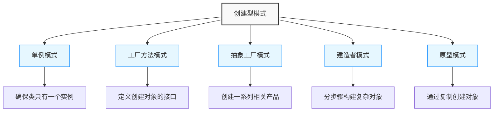
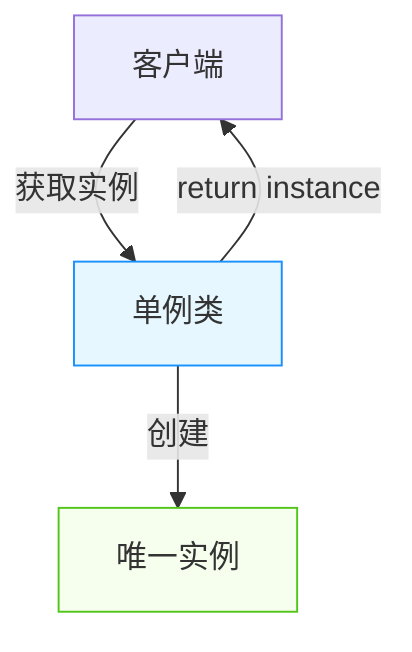
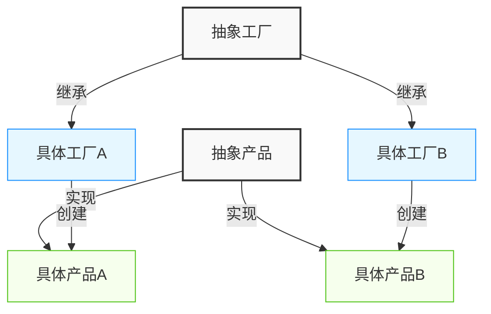
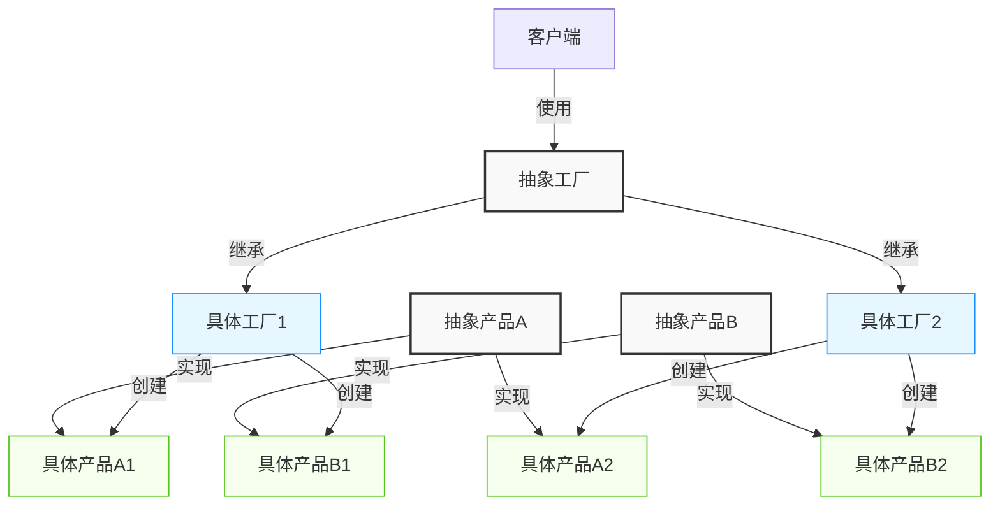
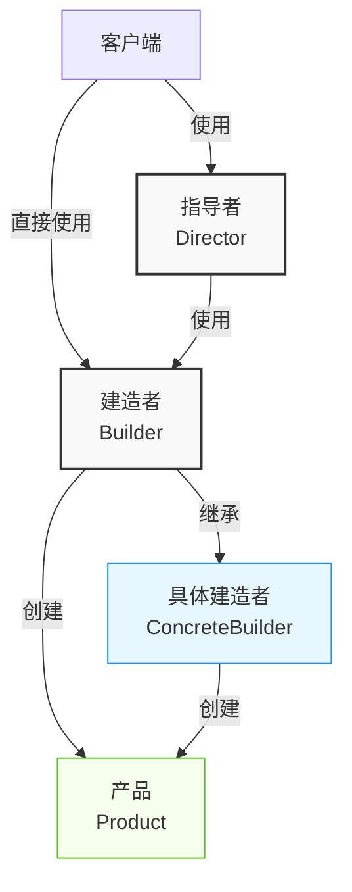
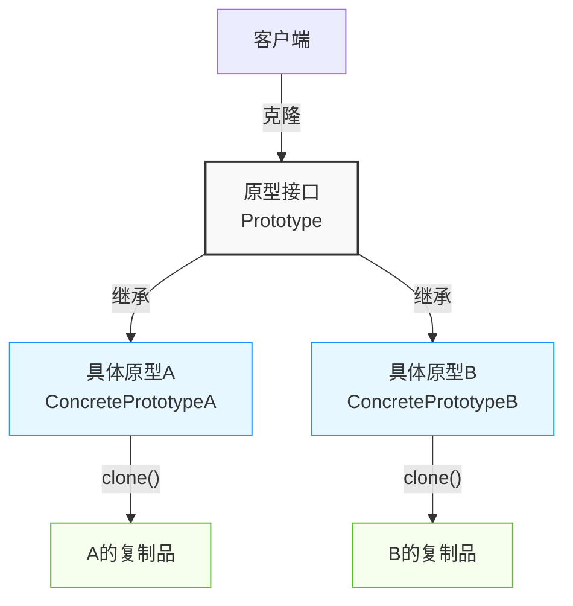
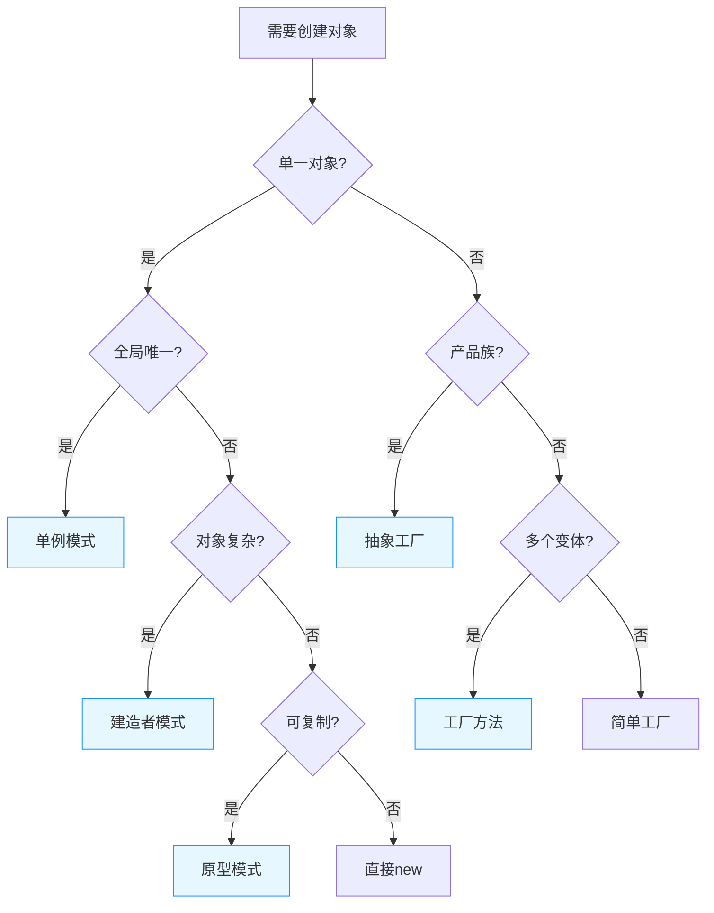

import Tabs from '@theme/Tabs';
import TabItem from '@theme/TabItem';
import CodeBlock from '@theme/CodeBlock';

# 创建型模式详解

创建型模式关注对象的创建过程，将对象的创建与使用分离，提供灵活的对象创建机制。本章将深入探讨五种创建型模式的原理、实现方式和实际应用。

:::tip 核心价值
**创建型模式 = 封装对象创建 + 灵活实例化 + 创建与使用分离**
- 🔍 **隐藏实现细节**：屏蔽对象的实例化过程，使系统更专注于业务逻辑
- 🔄 **提高可扩展性**：在不修改客户端代码的情况下引入新的具体类型
- 🛠️ **增强代码复用**：避免代码重复，提高代码质量和可维护性
- 🧩 **降低系统耦合度**：减少系统各部分的相互依赖
:::

## 创建型模式概览



## 1. 单例模式（Singleton）

### 1.1 模式定义

单例模式确保一个类只有一个实例，并提供一个全局访问点。



<Tabs>
<TabItem value="when-to-use" label="适用场景">

- **资源共享**：当需要共享昂贵的资源时（如数据库连接池）
- **全局状态管理**：需要维护全局状态或配置时
- **协调操作**：需要协调系统行为的场景（如日志记录器）

</TabItem>
<TabItem value="benefits" label="优点">

- **节省资源**：避免重复创建对象，减少内存占用
- **全局访问点**：提供统一的访问入口
- **协调行为**：可以协调系统中的行为和资源

</TabItem>
<TabItem value="drawbacks" label="缺点">

- **全局状态**：可能造成全局状态难以调试和测试
- **单一职责违反**：既要管理自身实例，又要完成业务逻辑
- **隐藏依赖**：客户端与单例存在隐式依赖，不利于依赖注入

</TabItem>
</Tabs>

### 1.2 实现方式

#### 饿汉式单例
```java title="饿汉式单例"
public class EagerSingleton {
    // 类加载时就初始化，线程安全
    private static final EagerSingleton instance = new EagerSingleton();
    
    // 私有构造函数
    private EagerSingleton() {
        // 防止反射攻击
        if (instance != null) {
            throw new RuntimeException("单例模式不允许创建多个实例");
        }
    }
    
    // 全局访问点
    public static EagerSingleton getInstance() {
        return instance;
    }
    
    // 业务方法
    public void doSomething() {
        System.out.println("饿汉式单例执行操作");
    }
}
```

#### 懒汉式单例
```java title="懒汉式单例"
public class LazySingleton {
    // 延迟初始化
    private static volatile LazySingleton instance;
    
    private LazySingleton() {}
    
    // 双重检查锁定（Double-Checked Locking）
    public static LazySingleton getInstance() {
        if (instance == null) {
            synchronized (LazySingleton.class) {
                if (instance == null) {
                    instance = new LazySingleton();
                }
            }
        }
        return instance;
    }
    
    public void doSomething() {
        System.out.println("懒汉式单例执行操作");
    }
}
```

#### 静态内部类单例
```java title="静态内部类单例"
public class StaticInnerSingleton {
    private StaticInnerSingleton() {}
    
    // 静态内部类
    private static class SingletonHolder {
        private static final StaticInnerSingleton INSTANCE = new StaticInnerSingleton();
    }
    
    public static StaticInnerSingleton getInstance() {
        return SingletonHolder.INSTANCE;
    }
    
    public void doSomething() {
        System.out.println("静态内部类单例执行操作");
    }
}
```

#### 枚举单例（推荐）
```java title="枚举单例"
public enum EnumSingleton {
    INSTANCE;
    
    public void doSomething() {
        System.out.println("枚举单例执行操作");
    }
    
    // 可以添加其他方法
    public void anotherMethod() {
        System.out.println("枚举单例的其他方法");
    }
}
```

### 1.3 单例模式实现对比

| 实现方式 | 线程安全 | 延迟加载 | 序列化安全 | 防反射攻击 | JVM保证 | 推荐指数 |
|---------|---------|---------|-----------|----------|--------|---------|
| **饿汉式** | ✅ | ❌ | ❌ | ✅ | ✅ | ⭐⭐⭐ |
| **懒汉式** | ✅ | ✅ | ❌ | ❌ | ❌ | ⭐⭐ |
| **静态内部类** | ✅ | ✅ | ❌ | ❌ | ✅ | ⭐⭐⭐⭐ |
| **枚举方式** | ✅ | ❌ | ✅ | ✅ | ✅ | ⭐⭐⭐⭐⭐ |

### 1.4 应用场景

<Tabs>
<TabItem value="config" label="配置管理器">

```java title="配置管理器"
public class ConfigurationManager {
    private static volatile ConfigurationManager instance;
    private Properties properties;
    
    private ConfigurationManager() {
        loadConfiguration();
    }
    
    public static ConfigurationManager getInstance() {
        if (instance == null) {
            synchronized (ConfigurationManager.class) {
                if (instance == null) {
                    instance = new ConfigurationManager();
                }
            }
        }
        return instance;
    }
    
    private void loadConfiguration() {
        properties = new Properties();
        try (InputStream input = getClass().getClassLoader()
                .getResourceAsStream("config.properties")) {
            properties.load(input);
        } catch (IOException e) {
            throw new RuntimeException("Failed to load configuration", e);
        }
    }
    
    public String getProperty(String key) {
        return properties.getProperty(key);
    }
}
```

</TabItem>
<TabItem value="db-pool" label="数据库连接池">

```java title="数据库连接池"
public class DatabaseConnectionPool {
    private static DatabaseConnectionPool instance;
    private final Queue<Connection> connectionPool;
    private final int maxConnections;
    
    private DatabaseConnectionPool(int maxConnections) {
        this.maxConnections = maxConnections;
        this.connectionPool = new LinkedList<>();
        initializePool();
    }
    
    public static synchronized DatabaseConnectionPool getInstance() {
        if (instance == null) {
            instance = new DatabaseConnectionPool(10);
        }
        return instance;
    }
    
    private void initializePool() {
        for (int i = 0; i < maxConnections; i++) {
            connectionPool.offer(createConnection());
        }
    }
    
    private Connection createConnection() {
        // 创建数据库连接的逻辑
        return null; // 简化示例
    }
    
    public Connection getConnection() {
        return connectionPool.poll();
    }
    
    public void releaseConnection(Connection connection) {
        if (connectionPool.size() < maxConnections) {
            connectionPool.offer(connection);
        }
    }
}
```

</TabItem>
<TabItem value="logger" label="日志记录器">

```java title="日志记录器"
public class LoggerSingleton {
    private static final LoggerSingleton INSTANCE = new LoggerSingleton();
    private final BufferedWriter writer;
    
    private LoggerSingleton() {
        try {
            writer = new BufferedWriter(new FileWriter("application.log", true));
        } catch (IOException e) {
            throw new RuntimeException("无法初始化日志文件", e);
        }
    }
    
    public static LoggerSingleton getInstance() {
        return INSTANCE;
    }
    
    public void log(String message) {
        try {
            writer.write(LocalDateTime.now() + ": " + message);
            writer.newLine();
            writer.flush();
        } catch (IOException e) {
            System.err.println("日志写入失败: " + e.getMessage());
        }
    }
    
    // 确保资源释放
    @Override
    protected void finalize() throws Throwable {
        writer.close();
        super.finalize();
    }
}
```

</TabItem>
</Tabs>

### 1.5 实现注意事项

:::warning 多线程安全性
单例模式在多线程环境中实现时需要特别注意线程安全问题：
- **懒汉式**需要使用双重检查锁定并加上`volatile`关键字
- **饿汉式**和**枚举方式**天生是线程安全的
- 避免使用没有同步措施的懒加载方式
:::

:::tip 最佳实践
- **推荐优先使用枚举实现单例**，简洁且有JVM保证的线程和序列化安全
- 需要延迟加载时，使用静态内部类方式
- 考虑使用依赖注入框架来管理单例，而不是手动实现
:::

## 2. 工厂方法模式（Factory Method）

### 2.1 模式定义

工厂方法模式定义了一个创建对象的接口，但由子类决定实例化的类是哪一个。工厂方法将类的实例化推迟到子类中进行。



<Tabs>
<TabItem value="when-to-use" label="适用场景">

- **创建逻辑复杂**：当对象的创建逻辑较为复杂时
- **类型多变**：当需要创建的对象类型可能在运行时变化时
- **依赖倒置**：想依赖抽象而非具体类时
- **框架设计**：框架需要为用户提供扩展点时

</TabItem>
<TabItem value="benefits" label="优点">

- **解耦**：将产品的创建与使用解耦
- **单一职责**：将创建逻辑集中到专门的工厂类
- **开闭原则**：可以引入新的产品类而无需修改现有代码
- **可定制**：子类可以改变工厂方法的返回类型

</TabItem>
<TabItem value="drawbacks" label="缺点">

- **类爆炸**：每添加一个产品就需要添加一个具体工厂类
- **复杂度**：引入了额外的抽象层，增加了理解难度
- **继承约束**：通常需要创建子类来使用工厂方法

</TabItem>
</Tabs>

### 2.2 实现方式

#### 基本工厂方法模式

```java title="工厂方法模式"
// 抽象产品
public interface Product {
    void operation();
}

// 具体产品A
public class ConcreteProductA implements Product {
    @Override
    public void operation() {
        System.out.println("产品A的操作");
    }
}

// 具体产品B
public class ConcreteProductB implements Product {
    @Override
    public void operation() {
        System.out.println("产品B的操作");
    }
}

// 抽象工厂
public abstract class Creator {
    // 工厂方法
    public abstract Product createProduct();
    
    // 模板方法
    public void someOperation() {
        Product product = createProduct();
        product.operation();
    }
}

// 具体工厂A
public class ConcreteCreatorA extends Creator {
    @Override
    public Product createProduct() {
        return new ConcreteProductA();
    }
}

// 具体工厂B
public class ConcreteCreatorB extends Creator {
    @Override
    public Product createProduct() {
        return new ConcreteProductB();
    }
}
```

#### 参数化工厂方法

```java title="参数化工厂方法"
public abstract class Creator {
    public Product createProduct(String type) {
        Product product = createProductImpl(type);
        // 可以在这里添加通用的初始化逻辑
        return product;
    }
    
    protected abstract Product createProductImpl(String type);
}

public class ConcreteCreator extends Creator {
    @Override
    protected Product createProductImpl(String type) {
        switch (type) {
            case "A":
                return new ConcreteProductA();
            case "B":
                return new ConcreteProductB();
            default:
                throw new IllegalArgumentException("Unknown product type: " + type);
        }
    }
}
```

### 2.3 工厂方法模式变体

<Tabs>
<TabItem value="simple-factory" label="简单工厂">

```java title="简单工厂（非GoF设计模式）"
public class SimpleFactory {
    public static Product createProduct(String type) {
        switch (type) {
            case "A":
                return new ConcreteProductA();
            case "B":
                return new ConcreteProductB();
            default:
                throw new IllegalArgumentException("Unknown product type: " + type);
        }
    }
}

// 使用示例
public class Client {
    public void doSomething() {
        Product product = SimpleFactory.createProduct("A");
        product.operation();
    }
}
```

简单工厂不属于GoF设计模式，但常作为工厂方法的简化版本使用。

</TabItem>
<TabItem value="static-factory" label="静态工厂方法">

```java title="静态工厂方法"
public class Product {
    private Product() { }
    
    public void operation() {
        System.out.println("产品操作");
    }
    
    // 静态工厂方法
    public static Product createProductA() {
        return new Product();
    }
    
    public static Product createProductWithName(String name) {
        Product product = new Product();
        // 设置产品名称
        return product;
    }
}

// 使用示例
public class Client {
    public void doSomething() {
        Product product = Product.createProductA();
        product.operation();
    }
}
```

静态工厂方法是面向对象编程中常见的实现技巧，通常在一个类中提供静态方法来创建对象。

</TabItem>
</Tabs>

### 2.4 工厂方法vs简单工厂

| 特性 | 工厂方法 | 简单工厂 |
|------|----------|---------|
| **类型** | GoF设计模式 | 编程习惯 |
| **创建方式** | 通过继承 | 通过条件判断 |
| **扩展方式** | 添加新的工厂子类 | 修改工厂类代码 |
| **开闭原则** | 符合 | 不完全符合 |
| **复杂度** | 较高 | 较低 |
| **灵活性** | 更灵活 | 较简单 |
| **适用场景** | 复杂对象创建、框架设计 | 简单对象创建、小型应用 |

### 2.5 应用场景

<Tabs>
<TabItem value="db-connection" label="数据库连接">

```java title="数据库连接工厂"
// 数据库连接接口
public interface DatabaseConnection {
    void connect();
    void disconnect();
}

// MySQL连接实现
public class MySQLConnection implements DatabaseConnection {
    @Override
    public void connect() {
        System.out.println("连接MySQL数据库");
    }
    
    @Override
    public void disconnect() {
        System.out.println("断开MySQL数据库连接");
    }
}

// PostgreSQL连接实现
public class PostgreSQLConnection implements DatabaseConnection {
    @Override
    public void connect() {
        System.out.println("连接PostgreSQL数据库");
    }
    
    @Override
    public void disconnect() {
        System.out.println("断开PostgreSQL数据库连接");
    }
}

// 数据库连接工厂接口
public abstract class DatabaseConnectionFactory {
    public abstract DatabaseConnection createConnection();
    
    public DatabaseConnection getConnection() {
        DatabaseConnection connection = createConnection();
        // 可以在这里添加连接池管理逻辑
        return connection;
    }
}

// MySQL连接工厂
public class MySQLConnectionFactory extends DatabaseConnectionFactory {
    @Override
    public DatabaseConnection createConnection() {
        return new MySQLConnection();
    }
}

// PostgreSQL连接工厂
public class PostgreSQLConnectionFactory extends DatabaseConnectionFactory {
    @Override
    public DatabaseConnection createConnection() {
        return new PostgreSQLConnection();
    }
}
```

</TabItem>
<TabItem value="logger-factory" label="日志记录器">

```java title="日志记录工厂"
// 日志接口
public interface Logger {
    void log(String message);
}

// 控制台日志
public class ConsoleLogger implements Logger {
    @Override
    public void log(String message) {
        System.out.println("控制台日志: " + message);
    }
}

// 文件日志
public class FileLogger implements Logger {
    private String filePath;
    
    public FileLogger(String filePath) {
        this.filePath = filePath;
    }
    
    @Override
    public void log(String message) {
        System.out.println("写入文件日志: " + filePath + " - " + message);
    }
}

// 日志工厂
public abstract class LoggerFactory {
    public abstract Logger createLogger();
}

// 控制台日志工厂
public class ConsoleLoggerFactory extends LoggerFactory {
    @Override
    public Logger createLogger() {
        return new ConsoleLogger();
    }
}

// 文件日志工厂
public class FileLoggerFactory extends LoggerFactory {
    private String filePath;
    
    public FileLoggerFactory(String filePath) {
        this.filePath = filePath;
    }
    
    @Override
    public Logger createLogger() {
        return new FileLogger(filePath);
    }
}
```

</TabItem>
<TabItem value="ui-elements" label="UI元素创建">

```java title="UI元素工厂"
// UI元素接口
public interface UIElement {
    void render();
}

// 按钮元素
public class Button implements UIElement {
    @Override
    public void render() {
        System.out.println("渲染按钮");
    }
}

// 文本框元素
public class TextField implements UIElement {
    @Override
    public void render() {
        System.out.println("渲染文本框");
    }
}

// UI元素工厂
public abstract class UIElementFactory {
    public abstract UIElement createElement();
}

// 按钮工厂
public class ButtonFactory extends UIElementFactory {
    @Override
    public UIElement createElement() {
        return new Button();
    }
}

// 文本框工厂
public class TextFieldFactory extends UIElementFactory {
    @Override
    public UIElement createElement() {
        return new TextField();
    }
}
```

</TabItem>
</Tabs>

:::tip 工厂方法模式最佳实践
1. **命名清晰**：为工厂方法使用描述性名称，如`createXXX`、`newXXX`、`getXXX`
2. **预初始化**：可以在工厂方法中对创建的对象进行预初始化或验证
3. **层次平衡**：避免创建过深的工厂继承层次
4. **单一职责**：一个工厂类只负责创建一种类型的产品
5. **参数控制**：根据需要选择使用参数化工厂方法或专用工厂子类
:::

## 3. 抽象工厂模式（Abstract Factory）

### 3.1 模式定义

抽象工厂模式提供一个创建一系列相关或相互依赖对象的接口，而无需指定它们的具体类。它是工厂方法模式的扩展，用于创建产品族。



<Tabs>
<TabItem value="when-to-use" label="适用场景">

- **产品族创建**：需要创建一系列相关产品时
- **一致性保证**：需要确保创建的产品彼此兼容
- **平台独立**：系统需要与多个平台或技术集成
- **隔离变化**：隔离产品创建的具体细节

</TabItem>
<TabItem value="benefits" label="优点">

- **一致性**：保证了一系列相关产品的兼容性
- **隔离具体类**：客户端与具体产品解耦
- **易于切换**：可以整体切换产品族
- **开闭原则**：增加新的产品族不需要修改已有代码

</TabItem>
<TabItem value="drawbacks" label="缺点">

- **难以扩展产品种类**：添加新产品类型需要修改抽象工厂接口
- **复杂度**：引入了大量的接口和类
- **产品族约束**：所有产品必须同时被支持

</TabItem>
</Tabs>

### 3.2 实现示例

```java title="抽象工厂模式"
// 抽象产品A
public interface AbstractProductA {
    void operationA();
}

// 抽象产品B
public interface AbstractProductB {
    void operationB();
}

// 具体产品A1
public class ConcreteProductA1 implements AbstractProductA {
    @Override
    public void operationA() {
        System.out.println("产品A1的操作");
    }
}

// 具体产品A2
public class ConcreteProductA2 implements AbstractProductA {
    @Override
    public void operationA() {
        System.out.println("产品A2的操作");
    }
}

// 具体产品B1
public class ConcreteProductB1 implements AbstractProductB {
    @Override
    public void operationB() {
        System.out.println("产品B1的操作");
    }
}

// 具体产品B2
public class ConcreteProductB2 implements AbstractProductB {
    @Override
    public void operationB() {
        System.out.println("产品B2的操作");
    }
}

// 抽象工厂
public interface AbstractFactory {
    AbstractProductA createProductA();
    AbstractProductB createProductB();
}

// 具体工厂1
public class ConcreteFactory1 implements AbstractFactory {
    @Override
    public AbstractProductA createProductA() {
        return new ConcreteProductA1();
    }
    
    @Override
    public AbstractProductB createProductB() {
        return new ConcreteProductB1();
    }
}

// 具体工厂2
public class ConcreteFactory2 implements AbstractFactory {
    @Override
    public AbstractProductA createProductA() {
        return new ConcreteProductA2();
    }
    
    @Override
    public AbstractProductB createProductB() {
        return new ConcreteProductB2();
    }
}
```

### 3.3 抽象工厂与工厂方法对比

| 特性 | 抽象工厂 | 工厂方法 |
|------|----------|----------|
| **目的** | 创建产品族 | 创建单个产品 |
| **接口** | 多个创建方法 | 单个创建方法 |
| **扩展产品族** | 容易（增加工厂类） | 不适用 |
| **扩展产品种类** | 困难（修改接口） | 容易（增加产品类） |
| **抽象层次** | 更高 | 较低 |
| **复杂度** | 更复杂 | 较简单 |
| **适用场景** | 多系列产品集成 | 单一产品创建 |

### 3.4 应用场景

<Tabs>
<TabItem value="ui-components" label="UI组件">

```java title="UI组件抽象工厂"
// 按钮接口
public interface Button {
    void render();
    void onClick();
}

// 复选框接口
public interface Checkbox {
    void render();
    boolean isChecked();
}

// Windows风格按钮
public class WindowsButton implements Button {
    @Override
    public void render() {
        System.out.println("渲染Windows风格按钮");
}

    @Override
    public void onClick() {
        System.out.println("Windows按钮点击事件");
    }
}

// Windows风格复选框
public class WindowsCheckbox implements Checkbox {
    private boolean checked = false;
    
    @Override
    public void render() {
        System.out.println("渲染Windows风格复选框");
    }
    
    @Override
    public boolean isChecked() {
        return checked;
    }
}

// macOS风格按钮
public class MacButton implements Button {
    @Override
    public void render() {
        System.out.println("渲染macOS风格按钮");
    }
    
    @Override
    public void onClick() {
        System.out.println("macOS按钮点击事件");
    }
}

// macOS风格复选框
public class MacCheckbox implements Checkbox {
    private boolean checked = false;
    
    @Override
    public void render() {
        System.out.println("渲染macOS风格复选框");
    }
    
    @Override
    public boolean isChecked() {
        return checked;
    }
}

// UI工厂接口
public interface UIFactory {
    Button createButton();
    Checkbox createCheckbox();
}

// Windows UI工厂
public class WindowsUIFactory implements UIFactory {
    @Override
    public Button createButton() {
        return new WindowsButton();
    }
    
    @Override
    public Checkbox createCheckbox() {
        return new WindowsCheckbox();
    }
}

// macOS UI工厂
public class MacUIFactory implements UIFactory {
    @Override
    public Button createButton() {
        return new MacButton();
    }
    
    @Override
    public Checkbox createCheckbox() {
        return new MacCheckbox();
    }
}

// 客户端应用
public class Application {
    private Button button;
    private Checkbox checkbox;
    
    public Application(UIFactory factory) {
        button = factory.createButton();
        checkbox = factory.createCheckbox();
    }
    
    public void render() {
        button.render();
        checkbox.render();
    }
}

// 根据操作系统选择工厂
public class ApplicationRunner {
    public static void main(String[] args) {
        UIFactory factory;
        String osName = System.getProperty("os.name").toLowerCase();
        
        if (osName.contains("windows")) {
            factory = new WindowsUIFactory();
        } else {
            factory = new MacUIFactory();
        }
        
        Application app = new Application(factory);
        app.render();
    }
}
```

</TabItem>
<TabItem value="db-connections" label="数据库连接">

```java title="数据库抽象工厂"
// 数据库连接接口
public interface Connection {
    void open();
    void close();
    void executeQuery(String query);
}

// 事务接口
public interface Transaction {
    void begin();
    void commit();
    void rollback();
}

// MySQL连接
public class MySQLConnection implements Connection {
    @Override
    public void open() {
        System.out.println("打开MySQL连接");
    }
    
    @Override
    public void close() {
        System.out.println("关闭MySQL连接");
    }
    
    @Override
    public void executeQuery(String query) {
        System.out.println("MySQL执行查询: " + query);
    }
}

// MySQL事务
public class MySQLTransaction implements Transaction {
    @Override
    public void begin() {
        System.out.println("开始MySQL事务");
    }
    
    @Override
    public void commit() {
        System.out.println("提交MySQL事务");
    }
    
    @Override
    public void rollback() {
        System.out.println("回滚MySQL事务");
    }
}

// PostgreSQL连接
public class PostgreSQLConnection implements Connection {
    @Override
    public void open() {
        System.out.println("打开PostgreSQL连接");
    }
    
    @Override
    public void close() {
        System.out.println("关闭PostgreSQL连接");
    }
    
    @Override
    public void executeQuery(String query) {
        System.out.println("PostgreSQL执行查询: " + query);
    }
}

// PostgreSQL事务
public class PostgreSQLTransaction implements Transaction {
    @Override
    public void begin() {
        System.out.println("开始PostgreSQL事务");
    }
    
    @Override
    public void commit() {
        System.out.println("提交PostgreSQL事务");
    }
    
    @Override
    public void rollback() {
        System.out.println("回滚PostgreSQL事务");
    }
}

// 数据库抽象工厂
public interface DatabaseFactory {
    Connection createConnection();
    Transaction createTransaction();
}

// MySQL工厂
public class MySQLFactory implements DatabaseFactory {
    @Override
    public Connection createConnection() {
        return new MySQLConnection();
    }
    
    @Override
    public Transaction createTransaction() {
        return new MySQLTransaction();
    }
}

// PostgreSQL工厂
public class PostgreSQLFactory implements DatabaseFactory {
    @Override
    public Connection createConnection() {
        return new PostgreSQLConnection();
    }
    
    @Override
    public Transaction createTransaction() {
        return new PostgreSQLTransaction();
    }
}
```

</TabItem>
</Tabs>

### 3.5 抽象工厂模式的变体

#### 带有工厂方法的抽象工厂

```java title="带有工厂方法的抽象工厂"
public abstract class AbstractFactory {
    public abstract Button createButton();
    public abstract Checkbox createCheckbox();
    
    // 静态工厂方法
    public static AbstractFactory getFactory(String type) {
        if ("windows".equalsIgnoreCase(type)) {
            return new WindowsUIFactory();
        } else if ("mac".equalsIgnoreCase(type)) {
            return new MacUIFactory();
        } else {
            throw new IllegalArgumentException("Unknown UI type: " + type);
        }
    }
}
```

#### 使用反射的抽象工厂

```java title="使用反射的抽象工厂"
public class ReflectiveFactory implements AbstractFactory {
    private Class<?> buttonClass;
    private Class<?> checkboxClass;
    
    public ReflectiveFactory(String buttonClassName, String checkboxClassName) 
            throws ClassNotFoundException {
        this.buttonClass = Class.forName(buttonClassName);
        this.checkboxClass = Class.forName(checkboxClassName);
    }
    
    @Override
    public Button createButton() {
        try {
            return (Button) buttonClass.newInstance();
        } catch (Exception e) {
            throw new RuntimeException("Cannot create button", e);
        }
    }
    
    @Override
    public Checkbox createCheckbox() {
        try {
            return (Checkbox) checkboxClass.newInstance();
        } catch (Exception e) {
            throw new RuntimeException("Cannot create checkbox", e);
        }
    }
}
```

:::tip 抽象工厂最佳实践
1. **产品族划分**：按照产品之间的关联性和一致性进行合理划分
2. **接口设计**：设计清晰、内聚的接口，避免过于臃肿的抽象工厂接口
3. **工厂扩展**：考虑使用工厂方法或简单工厂来创建抽象工厂实例
4. **产品扩展**：预留产品种类扩展的机制，例如使用默认实现或可选方法
5. **配置驱动**：考虑使用配置文件或反射机制来动态选择工厂实现
:::

## 4. 建造者模式（Builder）

### 4.1 模式定义

建造者模式将一个复杂对象的构建与它的表示分离，使得同样的构建过程可以创建不同的表示。它允许我们分步骤创建复杂对象，并能轻松控制创建过程。



<Tabs>
<TabItem value="when-to-use" label="适用场景">

- **复杂对象创建**：对象具有复杂的内部结构或多个组成部分
- **不同表示**：同一个对象在不同场景下有不同的表示形式
- **分步构建**：需要对象的创建过程可控且灵活
- **参数校验**：需要在对象创建时进行复杂的参数校验

</TabItem>
<TabItem value="benefits" label="优点">

- **分步创建**：将复杂对象的创建过程分解为多个步骤
- **链式调用**：支持流式接口，提高可读性
- **封装细节**：隐藏产品的内部结构和组装细节
- **代码复用**：相同的构建过程可以创建不同的产品表示

</TabItem>
<TabItem value="drawbacks" label="缺点">

- **代码量增加**：需要创建多个新的类
- **特定场景**：仅适用于对象相对复杂且创建过程稳定的情况
- **耦合风险**：具体建造者可能与产品类存在较强的耦合

</TabItem>
</Tabs>

### 4.2 实现方式

#### 基本建造者模式

```java title="建造者模式"
// 产品类
public class Computer {
    private String cpu;
    private String memory;
    private String storage;
    private String graphics;
    private String motherboard;
    
    // 私有构造函数
    private Computer() {}
    
    // Getter方法
    public String getCpu() { return cpu; }
    public String getMemory() { return memory; }
    public String getStorage() { return storage; }
    public String getGraphics() { return graphics; }
    public String getMotherboard() { return motherboard; }
    
    @Override
    public String toString() {
        return String.format("Computer{cpu='%s', memory='%s', storage='%s', graphics='%s', motherboard='%s'}", 
                           cpu, memory, storage, graphics, motherboard);
    }
    
    // 静态内部建造者类
    public static class Builder {
        private Computer computer = new Computer();
        
        public Builder cpu(String cpu) {
            computer.cpu = cpu;
            return this;
        }
        
        public Builder memory(String memory) {
            computer.memory = memory;
            return this;
        }
        
        public Builder storage(String storage) {
            computer.storage = storage;
            return this;
        }
        
        public Builder graphics(String graphics) {
            computer.graphics = graphics;
            return this;
        }
        
        public Builder motherboard(String motherboard) {
            computer.motherboard = motherboard;
            return this;
        }
        
        public Computer build() {
            // 参数校验
            validate();
            return computer;
        }
        
        private void validate() {
            if (computer.cpu == null) {
                throw new IllegalArgumentException("CPU不能为空");
            }
            if (computer.memory == null) {
                throw new IllegalArgumentException("内存不能为空");
            }
            if (computer.storage == null) {
                throw new IllegalArgumentException("存储不能为空");
            }
        }
    }
}
```

#### 使用指导者的建造者模式

```java title="带指导者的建造者模式"
// 产品类
public class House {
    private String foundation;
    private String structure;
    private String roof;
    private String interior;
    
    public void setFoundation(String foundation) {
        this.foundation = foundation;
    }
    
    public void setStructure(String structure) {
        this.structure = structure;
    }
    
    public void setRoof(String roof) {
        this.roof = roof;
    }
    
    public void setInterior(String interior) {
        this.interior = interior;
    }
    
    @Override
    public String toString() {
        return String.format("House{foundation='%s', structure='%s', roof='%s', interior='%s'}", 
                           foundation, structure, roof, interior);
    }
}

// 抽象建造者
public interface HouseBuilder {
    void buildFoundation();
    void buildStructure();
    void buildRoof();
    void buildInterior();
    House getResult();
}

// 具体建造者 - 砖房
public class BrickHouseBuilder implements HouseBuilder {
    private House house = new House();
    
    @Override
    public void buildFoundation() {
        house.setFoundation("混凝土地基");
    }
    
    @Override
    public void buildStructure() {
        house.setStructure("砖墙结构");
    }
    
    @Override
    public void buildRoof() {
        house.setRoof("平屋顶");
    }
    
    @Override
    public void buildInterior() {
        house.setInterior("标准内部装修");
    }
    
    @Override
    public House getResult() {
        return house;
    }
}

// 具体建造者 - 木房
public class WoodenHouseBuilder implements HouseBuilder {
    private House house = new House();
    
    @Override
    public void buildFoundation() {
        house.setFoundation("条形地基");
    }
    
    @Override
    public void buildStructure() {
        house.setStructure("木质框架结构");
    }
    
    @Override
    public void buildRoof() {
        house.setRoof("坡屋顶");
    }
    
    @Override
    public void buildInterior() {
        house.setInterior("木质内部装修");
    }
    
    @Override
    public House getResult() {
        return house;
    }
}

// 指导者
public class HouseDirector {
    private HouseBuilder builder;
    
    public HouseDirector(HouseBuilder builder) {
        this.builder = builder;
    }
    
    public void changeBuilder(HouseBuilder builder) {
        this.builder = builder;
    }
    
    // 构建完整的房子
    public House buildFullFeaturedHouse() {
        builder.buildFoundation();
        builder.buildStructure();
        builder.buildRoof();
        builder.buildInterior();
        return builder.getResult();
    }
    
    // 构建简易的房子
    public House buildMinimalHouse() {
        builder.buildFoundation();
        builder.buildStructure();
        builder.buildRoof();
        return builder.getResult();
    }
}

// 客户端代码
public class BuilderPatternDemo {
    public static void main(String[] args) {
        HouseBuilder brickBuilder = new BrickHouseBuilder();
        HouseBuilder woodenBuilder = new WoodenHouseBuilder();
        
        HouseDirector director = new HouseDirector(brickBuilder);
        
        // 构建砖房
        House brickHouse = director.buildFullFeaturedHouse();
        System.out.println("砖房: " + brickHouse);
        
        // 切换建造者，构建木房
        director.changeBuilder(woodenBuilder);
        House woodenHouse = director.buildMinimalHouse();
        System.out.println("简易木房: " + woodenHouse);
    }
}
```

### 4.3 建造者模式变体

#### 流式建造者模式（链式调用）

```java title="流式建造者"
// 使用示例
public class BuilderExample {
    public static void main(String[] args) {
        // 构建高性能电脑
        Computer gamingComputer = new Computer.Builder()
                .cpu("Intel i9-12900K")
                .memory("32GB DDR5")
                .storage("2TB NVMe SSD")
                .graphics("RTX 4090")
                .motherboard("Z690")
                .build();
        
        System.out.println("游戏电脑: " + gamingComputer);
        
        // 构建办公电脑
        Computer officeComputer = new Computer.Builder()
                .cpu("Intel i5-12400")
                .memory("16GB DDR4")
                .storage("512GB SSD")
                .graphics("集成显卡")
                .motherboard("B660")
                .build();
        
        System.out.println("办公电脑: " + officeComputer);
    }
}
```

#### 步进式建造者模式

```java title="步进式建造者"
public class StepBuilder {
    // 步进接口
    public interface CpuStep {
        MemoryStep cpu(String cpu);
    }
    
    public interface MemoryStep {
        StorageStep memory(String memory);
    }
    
    public interface StorageStep {
        OptionalStep storage(String storage);
    }
    
    public interface OptionalStep {
        OptionalStep graphics(String graphics);
        OptionalStep motherboard(String motherboard);
        Computer build();
    }
    
    // 实现类
    public static class ComputerBuilder implements CpuStep, MemoryStep, StorageStep, OptionalStep {
        private Computer computer = new Computer();
        
        private ComputerBuilder() {}
        
        public static CpuStep newBuilder() {
            return new ComputerBuilder();
        }
        
        @Override
        public MemoryStep cpu(String cpu) {
            computer.setCpu(cpu);
            return this;
        }
        
        @Override
        public StorageStep memory(String memory) {
            computer.setMemory(memory);
            return this;
        }
        
        @Override
        public OptionalStep storage(String storage) {
            computer.setStorage(storage);
            return this;
        }
        
        @Override
        public OptionalStep graphics(String graphics) {
            computer.setGraphics(graphics);
            return this;
        }
        
        @Override
        public OptionalStep motherboard(String motherboard) {
            computer.setMotherboard(motherboard);
            return this;
        }
        
        @Override
        public Computer build() {
            return computer;
        }
    }
}

// 使用步进式建造者
Computer computer = StepBuilder.ComputerBuilder.newBuilder()
    .cpu("Intel i7")      // 必须的
    .memory("16GB DDR4")  // 必须的
    .storage("1TB SSD")   // 必须的
    .graphics("RTX 3080") // 可选的
    .build();
```

### 4.4 应用场景

<Tabs>
<TabItem value="config" label="数据库配置构建器">

```java title="数据库配置建造者"
public class DatabaseConfig {
    private String host;
    private int port;
    private String database;
    private String username;
    private String password;
    private int maxConnections;
    private int timeout;
    
    private DatabaseConfig() {}
    
    // Getter方法...
    
    public static class Builder {
        private DatabaseConfig config = new DatabaseConfig();
        
        public Builder host(String host) {
            config.host = host;
            return this;
        }
        
        public Builder port(int port) {
            config.port = port;
            return this;
        }
        
        public Builder database(String database) {
            config.database = database;
            return this;
        }
        
        public Builder username(String username) {
            config.username = username;
            return this;
        }
        
        public Builder password(String password) {
            config.password = password;
            return this;
        }
        
        public Builder maxConnections(int maxConnections) {
            config.maxConnections = maxConnections;
            return this;
        }
        
        public Builder timeout(int timeout) {
            config.timeout = timeout;
            return this;
        }
        
        public DatabaseConfig build() {
            // 设置默认值
            if (config.port == 0) {
                config.port = 3306;
            }
            if (config.maxConnections == 0) {
                config.maxConnections = 10;
            }
            if (config.timeout == 0) {
                config.timeout = 30;
            }
            
            validate();
            return config;
        }
        
        private void validate() {
            if (config.host == null || config.host.trim().isEmpty()) {
                throw new IllegalArgumentException("主机地址不能为空");
            }
            if (config.database == null || config.database.trim().isEmpty()) {
                throw new IllegalArgumentException("数据库名不能为空");
            }
            if (config.username == null || config.username.trim().isEmpty()) {
                throw new IllegalArgumentException("用户名不能为空");
            }
        }
    }
}

// 使用示例
DatabaseConfig config = new DatabaseConfig.Builder()
    .host("localhost")
    .port(3306)
    .database("mydb")
    .username("user")
    .password("pass")
    .maxConnections(20)
    .build();
```

</TabItem>
<TabItem value="http-client" label="HTTP客户端构建器">

```java title="HTTP客户端构建器"
public class HttpClient {
    private String baseUrl;
    private int connectionTimeout;
    private int readTimeout;
    private Map<String, String> headers;
    private String authToken;
    private boolean followRedirects;
    private int maxRetries;
    
    private HttpClient() {
        this.headers = new HashMap<>();
    }
    
    // 静态内部建造者类
    public static class Builder {
        private HttpClient client = new HttpClient();
        
        public Builder baseUrl(String baseUrl) {
            client.baseUrl = baseUrl;
            return this;
        }
        
        public Builder connectionTimeout(int connectionTimeout) {
            client.connectionTimeout = connectionTimeout;
            return this;
        }
        
        public Builder readTimeout(int readTimeout) {
            client.readTimeout = readTimeout;
            return this;
        }
        
        public Builder header(String key, String value) {
            client.headers.put(key, value);
            return this;
        }
        
        public Builder authToken(String authToken) {
            client.authToken = authToken;
            return this;
        }
        
        public Builder followRedirects(boolean followRedirects) {
            client.followRedirects = followRedirects;
            return this;
        }
        
        public Builder maxRetries(int maxRetries) {
            client.maxRetries = maxRetries;
            return this;
        }
        
        public HttpClient build() {
            // 设置默认值
            if (client.connectionTimeout == 0) {
                client.connectionTimeout = 5000;
            }
            if (client.readTimeout == 0) {
                client.readTimeout = 10000;
            }
            
            // 验证必要参数
            validate();
            
            return client;
        }
        
        private void validate() {
            if (client.baseUrl == null || client.baseUrl.trim().isEmpty()) {
                throw new IllegalArgumentException("基础URL不能为空");
            }
        }
    }
    
    public void execute(String path, String method) {
        System.out.println("执行HTTP请求：" + method + " " + baseUrl + path);
        System.out.println("连接超时：" + connectionTimeout + "ms，读取超时：" + readTimeout + "ms");
        System.out.println("头部信息：" + headers);
        if (authToken != null) {
            System.out.println("授权令牌：" + authToken);
        }
    }
}

// 使用示例
HttpClient client = new HttpClient.Builder()
    .baseUrl("https://api.example.com")
    .connectionTimeout(3000)
    .readTimeout(5000)
    .header("Content-Type", "application/json")
    .header("Accept", "application/json")
    .authToken("my-auth-token")
    .followRedirects(true)
    .maxRetries(3)
    .build();

client.execute("/users", "GET");
```

</TabItem>
<TabItem value="document-builder" label="文档构建器">

```java title="文档构建器"
public class Document {
    private String title;
    private String header;
    private String content;
    private String footer;
    private List<String> sections;
    private String author;
    private LocalDate creationDate;
    
    private Document() {
        this.sections = new ArrayList<>();
        this.creationDate = LocalDate.now();
    }
    
    // Getter方法...
    
    public static class Builder {
        private Document document = new Document();
        
        public Builder title(String title) {
            document.title = title;
            return this;
        }
        
        public Builder header(String header) {
            document.header = header;
            return this;
        }
        
        public Builder content(String content) {
            document.content = content;
            return this;
        }
        
        public Builder footer(String footer) {
            document.footer = footer;
            return this;
        }
        
        public Builder addSection(String section) {
            document.sections.add(section);
            return this;
        }
        
        public Builder author(String author) {
            document.author = author;
            return this;
        }
        
        public Builder creationDate(LocalDate creationDate) {
            document.creationDate = creationDate;
            return this;
        }
        
        public Document build() {
            validate();
            return document;
        }
        
        private void validate() {
            if (document.title == null || document.title.trim().isEmpty()) {
                throw new IllegalArgumentException("文档标题不能为空");
            }
            if (document.content == null || document.content.trim().isEmpty()) {
                throw new IllegalArgumentException("文档内容不能为空");
            }
        }
    }
}

// 使用示例
Document report = new Document.Builder()
    .title("季度销售报告")
    .header("2023年第三季度")
    .content("销售额达到1000万元...")
    .addSection("销售分析")
    .addSection("市场趋势")
    .addSection("未来展望")
    .footer("报告结束")
    .author("张三")
    .build();
```

</TabItem>
</Tabs>

### 4.5 建造者模式与其他模式的对比

| 特性 | 建造者模式 | 工厂方法 | 抽象工厂 |
|-----|----------|---------|---------|
| **目的** | 分步创建复杂对象 | 创建单个产品 | 创建产品族 |
| **关注点** | 创建过程和步骤 | 产品类型 | 产品族和兼容性 |
| **可控性** | 高（分步构建） | 低（一次创建） | 中（关联创建） |
| **复杂度** | 中等 | 较低 | 高 |
| **链式API** | 支持 | 通常不支持 | 通常不支持 |
| **参数校验** | 集中处理 | 分散处理 | 分散处理 |

:::tip 建造者模式最佳实践
1. **适当的封装**：使用私有构造函数强制通过建造者创建对象
2. **参数校验**：在`build()`方法中集中进行参数验证
3. **默认值处理**：为非必须参数提供合理的默认值
4. **方法命名**：使用描述性的方法名，使构建过程更易读
5. **建造者内置**：考虑将建造者类设计为产品类的内部类
6. **流式接口**：支持方法链（链式调用）以提高代码可读性
:::

## 5. 原型模式（Prototype）

### 5.1 模式定义

原型模式通过复制现有对象来创建新对象，而不是通过实例化类。当创建对象的成本较高，且对象之间存在相似性时，使用原型模式可以提高性能并简化对象创建过程。



<Tabs>
<TabItem value="when-to-use" label="适用场景">

- **创建成本高**：当对象创建过程复杂或代价高昂时
- **避免继承**：当系统应该独立于产品创建、组合和表示时
- **动态配置**：运行时需要动态添加和移除产品时
- **避免重复初始化**：需要创建与现有对象相似的对象时

</TabItem>
<TabItem value="benefits" label="优点">

- **性能优化**：避免了重复的初始化过程
- **动态创建**：在运行时指定创建的对象
- **对象复制**：复制对象而不依赖具体类
- **创建预配置对象**：可以创建预配置的对象模板

</TabItem>
<TabItem value="drawbacks" label="缺点">

- **深拷贝复杂**：包含循环引用或复杂对象的深拷贝实现困难
- **构造函数限制**：克隆过程绕过了构造函数
- **状态一致性**：难以维护对象间的关联和状态一致性

</TabItem>
</Tabs>

### 5.2 实现方式

#### 基本原型模式

```java title="原型模式"
// 原型接口
public interface Prototype extends Cloneable {
    Prototype clone();
    void display();
}

// 具体原型
public class ConcretePrototype implements Prototype {
    private String name;
    private List<String> attributes = new ArrayList<>();
    
    public ConcretePrototype(String name) {
        this.name = name;
        this.attributes.add("属性1");
        this.attributes.add("属性2");
    }
    
    @Override
    public Prototype clone() {
        try {
            ConcretePrototype clone = (ConcretePrototype) super.clone();
            // 深拷贝
            clone.attributes = new ArrayList<>(this.attributes);
            return clone;
        } catch (CloneNotSupportedException e) {
            throw new RuntimeException(e);
        }
    }
    
    @Override
    public void display() {
        System.out.println("原型名称: " + name);
        System.out.println("属性: " + attributes);
    }
    
    public void addAttribute(String attribute) {
        this.attributes.add(attribute);
    }
    
    public void setName(String name) {
        this.name = name;
    }
}
```

#### 原型管理器

```java title="原型管理器"
public class PrototypeManager {
    private Map<String, Prototype> prototypes = new HashMap<>();
    
    public void addPrototype(String key, Prototype prototype) {
        prototypes.put(key, prototype);
    }
    
    public Prototype getPrototype(String key) {
        Prototype prototype = prototypes.get(key);
        if (prototype != null) {
            return prototype.clone();
        }
        return null;
    }
    
    public void removePrototype(String key) {
        prototypes.remove(key);
    }
}

// 使用示例
public class PrototypeExample {
    public static void main(String[] args) {
        PrototypeManager manager = new PrototypeManager();
        
        // 添加原型
        ConcretePrototype prototype1 = new ConcretePrototype("原型1");
        manager.addPrototype("type1", prototype1);
        
        // 克隆原型
        Prototype clone1 = manager.getPrototype("type1");
        Prototype clone2 = manager.getPrototype("type1");
        
        // 修改克隆对象
        if (clone1 instanceof ConcretePrototype) {
            ((ConcretePrototype) clone1).setName("克隆1");
            ((ConcretePrototype) clone1).addAttribute("新属性");
        }
        
        // 显示结果
        prototype1.display();
        clone1.display();
        clone2.display();
    }
}
```

### 5.3 深拷贝与浅拷贝

<Tabs>
<TabItem value="shallow" label="浅拷贝">

```java title="浅拷贝实现"
public class ShallowCopy implements Cloneable {
    private String name;
    private List<String> items;
    
    public ShallowCopy(String name) {
        this.name = name;
        this.items = new ArrayList<>();
    }
    
    public void addItem(String item) {
        items.add(item);
    }
    
    @Override
    public ShallowCopy clone() {
        try {
            // 浅拷贝：引用类型成员变量共享引用
            return (ShallowCopy) super.clone();
        } catch (CloneNotSupportedException e) {
            throw new RuntimeException(e);
        }
    }
    
    @Override
    public String toString() {
        return "ShallowCopy{name='" + name + "', items=" + items + "}";
    }
    
    // Getter和Setter方法
    public String getName() { return name; }
    public void setName(String name) { this.name = name; }
    public List<String> getItems() { return items; }
}

// 使用示例
ShallowCopy original = new ShallowCopy("原始对象");
original.addItem("条目1");
original.addItem("条目2");

ShallowCopy clone = original.clone();
clone.setName("克隆对象");
clone.getItems().add("条目3"); // 修改克隆对象的列表

System.out.println("原始对象: " + original); // 输出也包含"条目3"
System.out.println("克隆对象: " + clone);
```

</TabItem>
<TabItem value="deep" label="深拷贝">

```java title="深拷贝实现"
public class DeepCopy implements Cloneable {
    private String name;
    private List<String> items;
    
    public DeepCopy(String name) {
        this.name = name;
        this.items = new ArrayList<>();
    }
    
    public void addItem(String item) {
        items.add(item);
    }
    
    @Override
    public DeepCopy clone() {
        try {
            DeepCopy clone = (DeepCopy) super.clone();
            // 深拷贝：创建引用类型成员变量的新实例
            clone.items = new ArrayList<>(this.items);
            return clone;
        } catch (CloneNotSupportedException e) {
            throw new RuntimeException(e);
        }
    }
    
    @Override
    public String toString() {
        return "DeepCopy{name='" + name + "', items=" + items + "}";
    }
    
    // Getter和Setter方法
    public String getName() { return name; }
    public void setName(String name) { this.name = name; }
    public List<String> getItems() { return items; }
}

// 使用示例
DeepCopy original = new DeepCopy("原始对象");
original.addItem("条目1");
original.addItem("条目2");

DeepCopy clone = original.clone();
clone.setName("克隆对象");
clone.getItems().add("条目3"); // 修改克隆对象的列表

System.out.println("原始对象: " + original); // 不包含"条目3"
System.out.println("克隆对象: " + clone);
```

</TabItem>
<TabItem value="serialization" label="序列化实现深拷贝">

```java title="通过序列化实现深拷贝"
public class SerializableDeepCopy implements Serializable {
    private static final long serialVersionUID = 1L;
    
    private String name;
    private List<String> items;
    
    public SerializableDeepCopy(String name) {
        this.name = name;
        this.items = new ArrayList<>();
    }
    
    public void addItem(String item) {
        items.add(item);
    }
    
    // 通过序列化实现深拷贝
    public SerializableDeepCopy deepCopy() {
        try {
            ByteArrayOutputStream bos = new ByteArrayOutputStream();
            ObjectOutputStream oos = new ObjectOutputStream(bos);
            oos.writeObject(this);
            
            ByteArrayInputStream bis = new ByteArrayInputStream(bos.toByteArray());
            ObjectInputStream ois = new ObjectInputStream(bis);
            return (SerializableDeepCopy) ois.readObject();
        } catch (Exception e) {
            throw new RuntimeException(e);
        }
    }
    
    @Override
    public String toString() {
        return "SerializableDeepCopy{name='" + name + "', items=" + items + "}";
    }
    
    // Getter和Setter方法
    public String getName() { return name; }
    public void setName(String name) { this.name = name; }
    public List<String> getItems() { return items; }
}
```

</TabItem>
</Tabs>

### 5.4 应用场景

<Tabs>
<TabItem value="document-template" label="文档模板系统">

```java title="文档模板系统"
public abstract class Document implements Cloneable {
    protected String title;
    protected String content;
    protected List<String> sections = new ArrayList<>();
    
    public abstract void display();
    
    @Override
    public Document clone() {
        try {
            Document clone = (Document) super.clone();
            // 深拷贝
            clone.sections = new ArrayList<>(this.sections);
            return clone;
        } catch (CloneNotSupportedException e) {
            throw new RuntimeException(e);
        }
    }
    
    public void setTitle(String title) {
        this.title = title;
    }
    
    public void setContent(String content) {
        this.content = content;
    }
    
    public void addSection(String section) {
        this.sections.add(section);
    }
}

public class ReportDocument extends Document {
    @Override
    public void display() {
        System.out.println("报告文档: " + title);
        System.out.println("内容: " + content);
        System.out.println("章节: " + sections);
    }
}

public class ProposalDocument extends Document {
    @Override
    public void display() {
        System.out.println("提案文档: " + title);
        System.out.println("内容: " + content);
        System.out.println("章节: " + sections);
    }
}

// 文档模板管理器
public class DocumentTemplateManager {
    private Map<String, Document> templates = new HashMap<>();
    
    public void addTemplate(String name, Document template) {
        templates.put(name, template);
    }
    
    public Document createDocument(String templateName) {
        Document template = templates.get(templateName);
        if (template != null) {
            return template.clone();
        }
        return null;
    }
}
```

</TabItem>
<TabItem value="configuration" label="配置复制">

```java title="配置复制系统"
public class AppConfig implements Cloneable {
    private Map<String, Object> settings = new HashMap<>();
    private List<String> features = new ArrayList<>();
    
    // 初始化默认配置
    public AppConfig() {
        settings.put("timeout", 3000);
        settings.put("maxConnections", 100);
        settings.put("cacheEnabled", true);
        
        features.add("basic");
    }
    
    public void addSetting(String key, Object value) {
        settings.put(key, value);
    }
    
    public Object getSetting(String key) {
        return settings.get(key);
    }
    
    public void enableFeature(String feature) {
        features.add(feature);
    }
    
    @Override
    public AppConfig clone() {
        try {
            AppConfig clone = (AppConfig) super.clone();
            // 深拷贝
            clone.settings = new HashMap<>(this.settings);
            clone.features = new ArrayList<>(this.features);
            return clone;
        } catch (CloneNotSupportedException e) {
            throw new RuntimeException(e);
        }
    }
    
    @Override
    public String toString() {
        return "AppConfig{settings=" + settings + ", features=" + features + "}";
    }
}

// 使用示例
public class ConfigExample {
    public static void main(String[] args) {
        // 创建基本配置
        AppConfig baseConfig = new AppConfig();
        
        // 创建开发环境配置
        AppConfig devConfig = baseConfig.clone();
        devConfig.addSetting("debugEnabled", true);
        devConfig.enableFeature("development");
        
        // 创建生产环境配置
        AppConfig prodConfig = baseConfig.clone();
        prodConfig.addSetting("debugEnabled", false);
        prodConfig.addSetting("timeout", 1000);
        prodConfig.enableFeature("monitoring");
        
        System.out.println("开发环境配置: " + devConfig);
        System.out.println("生产环境配置: " + prodConfig);
    }
}
```

</TabItem>
<TabItem value="gui-shapes" label="图形编辑器">

```java title="图形编辑器"
public abstract class Shape implements Cloneable {
    private int x;
    private int y;
    private String color;
    
    public Shape(int x, int y, String color) {
        this.x = x;
        this.y = y;
        this.color = color;
    }
    
    public abstract void draw();
    
    @Override
    public Shape clone() {
        try {
            return (Shape) super.clone();
        } catch (CloneNotSupportedException e) {
            throw new RuntimeException(e);
        }
    }
    
    // Getter和Setter方法
    public int getX() { return x; }
    public void setX(int x) { this.x = x; }
    public int getY() { return y; }
    public void setY(int y) { this.y = y; }
    public String getColor() { return color; }
    public void setColor(String color) { this.color = color; }
}

public class Circle extends Shape {
    private int radius;
    
    public Circle(int x, int y, String color, int radius) {
        super(x, y, color);
        this.radius = radius;
    }
    
    @Override
    public void draw() {
        System.out.println("绘制圆形: 坐标(" + getX() + "," + getY() + 
                         "), 颜色=" + getColor() + ", 半径=" + radius);
    }
    
    public int getRadius() { return radius; }
    public void setRadius(int radius) { this.radius = radius; }
}

public class Rectangle extends Shape {
    private int width;
    private int height;
    
    public Rectangle(int x, int y, String color, int width, int height) {
        super(x, y, color);
        this.width = width;
        this.height = height;
    }
    
    @Override
    public void draw() {
        System.out.println("绘制矩形: 坐标(" + getX() + "," + getY() + 
                         "), 颜色=" + getColor() + 
                         ", 宽=" + width + ", 高=" + height);
    }
    
    public int getWidth() { return width; }
    public void setWidth(int width) { this.width = width; }
    public int getHeight() { return height; }
    public void setHeight(int height) { this.height = height; }
}

// 图形编辑器
public class GraphicEditor {
    private Map<String, Shape> shapeTemplates = new HashMap<>();
    
    public GraphicEditor() {
        // 初始化形状模板
        shapeTemplates.put("circle", new Circle(0, 0, "red", 10));
        shapeTemplates.put("rectangle", new Rectangle(0, 0, "blue", 20, 10));
    }
    
    public Shape createShape(String type) {
        Shape template = shapeTemplates.get(type);
        if (template != null) {
            return template.clone();
        }
        return null;
    }
}
```

</TabItem>
</Tabs>

### 5.5 原型模式与其他模式对比

| 特性 | 原型模式 | 工厂方法 | 建造者模式 |
|------|---------|---------|-----------|
| **创建机制** | 克隆现有对象 | 创建新对象 | 分步构建对象 |
| **复杂度** | 低（直接复制） | 中等 | 高（多步骤） |
| **使用时机** | 避免重复初始化 | 封装创建逻辑 | 复杂对象构建 |
| **实现方法** | 实现clone()方法 | 子类化创建者 | 构建器或指导者 |
| **优势** | 性能好，避免初始化 | 扩展性好 | 灵活性高，参数控制 |
| **劣势** | 深拷贝复杂 | 类爆炸 | 代码量增加 |

:::tip 原型模式最佳实践
1. **优先使用深拷贝**：确保对象及其内部对象都被正确克隆
2. **处理特殊引用**：注意处理循环引用和不可克隆的对象
3. **使用序列化**：对于复杂对象，可以使用序列化实现深拷贝
4. **避免副作用**：确保克隆操作不会对原对象产生副作用
5. **模板注册中心**：使用原型管理器注册和管理原型对象
:::

## 6. 创建型模式对比

### 6.1 模式选择指南



| 模式 | 适用场景 | 优点 | 缺点 |
|------|----------|------|------|
| **单例模式** | 全局唯一实例 | 节省内存，全局访问 | 可能成为全局状态 |
| **工厂方法** | 延迟实例化，扩展产品 | 符合开闭原则 | 增加类的数量 |
| **抽象工厂** | 产品族创建 | 保证产品兼容性 | 扩展新产品族困难 |
| **建造者** | 复杂对象构建 | 参数校验，链式调用 | 增加代码复杂度 |
| **原型** | 对象克隆 | 避免重复初始化 | 深拷贝开销 |

### 6.2 性能考虑

创建型模式在性能上各有优劣，选择合适的模式需要考虑应用场景和性能需求：

```java title="性能对比示例"
// 单例模式 - 内存占用最小
public class SingletonExample {
    private static SingletonExample instance;
    
    public static SingletonExample getInstance() {
        if (instance == null) {
            instance = new SingletonExample();
        }
        return instance;
    }
}

// 工厂模式 - 对象创建开销
public class FactoryExample {
    public Product createProduct(String type) {
        // 每次调用都可能创建新对象
        switch (type) {
            case "A": return new ProductA();
            case "B": return new ProductB();
            default: throw new IllegalArgumentException();
        }
    }
}

// 原型模式 - 克隆开销
public class PrototypeExample implements Cloneable {
    private List<String> data = new ArrayList<>();
    
    @Override
    public PrototypeExample clone() {
        try {
            PrototypeExample clone = (PrototypeExample) super.clone();
            // 深拷贝开销
            clone.data = new ArrayList<>(this.data);
            return clone;
        } catch (CloneNotSupportedException e) {
            throw new RuntimeException(e);
        }
    }
}
```

<Tabs>
<TabItem value="memory" label="内存使用">

| 模式 | 内存使用 | 描述 |
|------|---------|------|
| 单例 | ⭐⭐⭐⭐⭐ | 最优（只有一个实例） |
| 工厂方法 | ⭐⭐⭐ | 中等（每次创建新对象） |
| 抽象工厂 | ⭐⭐⭐ | 中等（每个产品族创建多个对象） |
| 建造者 | ⭐⭐ | 较高（中间状态占用内存） |
| 原型 | ⭐⭐⭐⭐ | 良好（复用现有对象结构） |

</TabItem>
<TabItem value="cpu" label="CPU使用">

| 模式 | CPU使用 | 描述 |
|------|--------|------|
| 单例 | ⭐⭐⭐⭐⭐ | 最优（仅初始化一次） |
| 工厂方法 | ⭐⭐⭐ | 中等（每次创建需初始化） |
| 抽象工厂 | ⭐⭐⭐ | 中等（创建多个相关对象） |
| 建造者 | ⭐⭐ | 较高（多步骤创建） |
| 原型 | ⭐⭐⭐⭐ | 良好（避免重复初始化） |

</TabItem>
<TabItem value="complexity" label="代码复杂度">

| 模式 | 代码复杂度 | 描述 |
|------|-----------|------|
| 单例 | ⭐⭐⭐⭐⭐ | 最简单（实现简洁） |
| 工厂方法 | ⭐⭐⭐ | 中等（需要抽象工厂和子类） |
| 抽象工厂 | ⭐⭐ | 复杂（需要多个抽象产品和实现） |
| 建造者 | ⭐⭐⭐ | 中等（需要builder类和多个方法） |
| 原型 | ⭐⭐⭐⭐ | 较简单（主要处理克隆逻辑） |

</TabItem>
</Tabs>

### 6.3 设计模式组合使用

创建型模式常常组合使用以获取更好的设计效果：

1. **工厂方法+单例**：工厂本身是单例，确保工厂全局唯一
2. **抽象工厂+工厂方法**：用工厂方法实现抽象工厂
3. **建造者+原型**：用原型模式复制建造者创建的基础对象
4. **单例+原型**：单例管理器存储原型对象
5. **抽象工厂+建造者**：工厂创建建造者对象

```java title="组合模式示例"
// 单例工厂示例
public class SingletonFactory {
    private static SingletonFactory instance = new SingletonFactory();
    private Map<String, Product> products = new HashMap<>();
    
    private SingletonFactory() {
        // 注册产品原型
        products.put("default", new ConcreteProduct());
    }
    
    public static SingletonFactory getInstance() {
        return instance;
    }
    
    public Product createProduct(String type) {
        Product prototype = products.get(type);
        if (prototype == null) {
            prototype = products.get("default");
        }
        // 使用原型模式创建产品
        return prototype.clone();
    }
}
```

:::tip 创建型模式选择原则
1. **单例模式**：需要全局唯一实例时使用
2. **工厂方法**：需要延迟实例化时使用
3. **抽象工厂**：需要创建产品族时使用
4. **建造者模式**：需要构建复杂对象时使用
5. **原型模式**：需要对象克隆时使用
:::

---

通过本章的学习，你应该已经掌握了五种创建型模式的原理、实现方式和应用场景。在实际项目中，要根据具体需求选择合适的创建型模式，并注意线程安全和性能优化问题。
