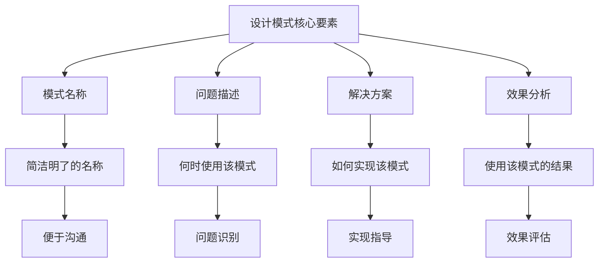
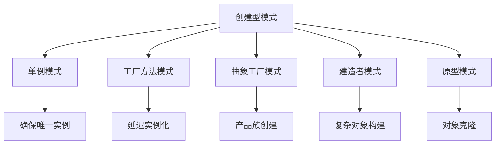
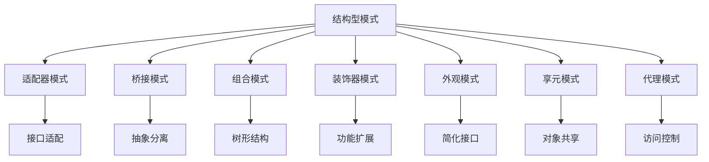
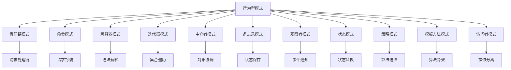

# 设计模式总结详解

设计模式是软件开发中的重要概念，提供了解决常见设计问题的标准方案。本文档系统梳理了设计模式的核心概念、分类体系、实际应用和面试重点，帮助你在实际项目中正确应用设计模式。

:::tip 学习目标
通过本章学习，你将掌握：
- 设计模式的基本概念和分类体系
- 23种经典设计模式的原理和应用
- SOLID设计原则和最佳实践
- 设计模式在实际项目中的应用场景
- 面试中常见的设计模式问题
:::

## 1. 设计模式基本概念

### 1.1 什么是设计模式？

设计模式是软件开发中常见问题的最佳实践解决方案，它描述了在软件开发过程中不断重复发生的问题，以及该问题的解决方案的核心。

:::info 设计模式的定义
设计模式是一套被反复使用、多数人知晓的、经过分类编目的、代码设计经验的总结。使用设计模式是为了可重用代码、让代码更容易被他人理解、保证代码可靠性。
:::

### 1.2 设计模式的作用

| 作用 | 说明 | 示例 |
|------|------|------|
| **代码复用** | 提供可重用的解决方案 | 单例模式确保全局唯一实例 |
| **提高可维护性** | 标准化的代码结构 | 工厂模式统一对象创建 |
| **增强可扩展性** | 支持功能扩展 | 装饰器模式动态添加功能 |
| **降低耦合度** | 减少模块间依赖 | 观察者模式解耦事件处理 |
| **提高可读性** | 清晰的代码意图 | 策略模式明确算法选择 |

### 1.3 设计模式的核心要素



## 2. 设计模式分类体系

### 2.1 按目的分类

设计模式按照其目的可以分为三大类：

#### 创建型模式（Creational Patterns）


#### 结构型模式（Structural Patterns）


#### 行为型模式（Behavioral Patterns）


### 2.2 按范围分类

#### 类模式 vs 对象模式

| 分类 | 特点 | 示例 |
|------|------|------|
| **类模式** | 处理类与子类之间的关系，通过继承建立 | 模板方法模式、工厂方法模式 |
| **对象模式** | 处理对象间的关系，通过组合建立 | 策略模式、观察者模式、装饰器模式 |

:::tip 选择原则
- **类模式**：静态关系，编译时确定
- **对象模式**：动态关系，运行时确定
- 优先选择对象模式，因为组合比继承更灵活
:::

## 3. 创建型模式详解

### 3.1 单例模式（Singleton）

#### 模式定义
确保一个类只有一个实例，并提供一个全局访问点。

#### 实现方式
```java title="线程安全的单例模式"
public class Singleton {
    // 私有静态实例，使用volatile保证可见性
    private static volatile Singleton instance;
    
    // 私有构造函数，防止外部实例化
    private Singleton() {
        // 防止反射攻击
        if (instance != null) {
            throw new RuntimeException("单例模式不允许创建多个实例");
        }
    }
    
    // 双重检查锁定（Double-Checked Locking）
    public static Singleton getInstance() {
        if (instance == null) {
            synchronized (Singleton.class) {
                if (instance == null) {
                    instance = new Singleton();
                }
            }
        }
        return instance;
    }
    
    // 业务方法
    public void doSomething() {
        System.out.println("单例模式执行操作");
    }
}
```

#### 枚举实现（推荐）
```java title="枚举单例模式"
public enum SingletonEnum {
    INSTANCE;
    
    public void doSomething() {
        System.out.println("枚举单例模式执行操作");
    }
}
```

#### 应用场景
- 配置管理器
- 数据库连接池
- 日志记录器
- 缓存管理器

### 3.2 工厂方法模式（Factory Method）

#### 模式定义
定义一个创建对象的接口，让子类决定实例化哪一个类。

#### 实现示例
```java title="工厂方法模式"
// 抽象产品
public interface Product {
    void operation();
}

// 具体产品A
public class ConcreteProductA implements Product {
    @Override
    public void operation() {
        System.out.println("产品A的操作");
    }
}

// 具体产品B
public class ConcreteProductB implements Product {
    @Override
    public void operation() {
        System.out.println("产品B的操作");
    }
}

// 抽象工厂
public abstract class Creator {
    // 工厂方法
    public abstract Product createProduct();
    
    // 模板方法
    public void someOperation() {
        Product product = createProduct();
        product.operation();
    }
}

// 具体工厂A
public class ConcreteCreatorA extends Creator {
    @Override
    public Product createProduct() {
        return new ConcreteProductA();
    }
}

// 具体工厂B
public class ConcreteCreatorB extends Creator {
    @Override
    public Product createProduct() {
        return new ConcreteProductB();
    }
}
```

#### 应用场景
- 数据库连接工厂
- 日志记录器工厂
- 图形界面组件工厂

### 3.3 抽象工厂模式（Abstract Factory）

#### 模式定义
提供一个创建一系列相关或相互依赖对象的接口，而无需指定它们的具体类。

#### 实现示例
```java title="抽象工厂模式"
// 抽象产品A
public interface AbstractProductA {
    void operationA();
}

// 抽象产品B
public interface AbstractProductB {
    void operationB();
}

// 具体产品A1
public class ConcreteProductA1 implements AbstractProductA {
    @Override
    public void operationA() {
        System.out.println("产品A1的操作");
    }
}

// 具体产品B1
public class ConcreteProductB1 implements AbstractProductB {
    @Override
    public void operationB() {
        System.out.println("产品B1的操作");
    }
}

// 抽象工厂
public interface AbstractFactory {
    AbstractProductA createProductA();
    AbstractProductB createProductB();
}

// 具体工厂1
public class ConcreteFactory1 implements AbstractFactory {
    @Override
    public AbstractProductA createProductA() {
        return new ConcreteProductA1();
    }
    
    @Override
    public AbstractProductB createProductB() {
        return new ConcreteProductB1();
    }
}
```

#### 应用场景
- 跨平台UI组件
- 数据库访问层
- 操作系统API

### 3.4 建造者模式（Builder）

#### 模式定义
将一个复杂对象的构建与它的表示分离，使得同样的构建过程可以创建不同的表示。

#### 实现示例
```java title="建造者模式"
// 产品类
public class Computer {
    private String cpu;
    private String memory;
    private String storage;
    private String graphics;
    
    // 私有构造函数
    private Computer() {}
    
    // Getter方法
    public String getCpu() { return cpu; }
    public String getMemory() { return memory; }
    public String getStorage() { return storage; }
    public String getGraphics() { return graphics; }
    
    // 静态内部建造者类
    public static class Builder {
        private Computer computer = new Computer();
        
        public Builder cpu(String cpu) {
            computer.cpu = cpu;
            return this;
        }
        
        public Builder memory(String memory) {
            computer.memory = memory;
            return this;
        }
        
        public Builder storage(String storage) {
            computer.storage = storage;
            return this;
        }
        
        public Builder graphics(String graphics) {
            computer.graphics = graphics;
            return this;
        }
        
        public Computer build() {
            // 参数校验
            if (computer.cpu == null) {
                throw new IllegalArgumentException("CPU不能为空");
            }
            if (computer.memory == null) {
                throw new IllegalArgumentException("内存不能为空");
            }
            return computer;
        }
    }
}
```

#### 使用示例
```java title="建造者模式使用"
public class BuilderExample {
    public static void main(String[] args) {
        Computer computer = new Computer.Builder()
                .cpu("Intel i7")
                .memory("16GB")
                .storage("512GB SSD")
                .graphics("RTX 3080")
                .build();
        
        System.out.println("CPU: " + computer.getCpu());
        System.out.println("内存: " + computer.getMemory());
    }
}
```

#### 应用场景
- 复杂对象构建
- 参数校验
- 不可变对象创建

### 3.5 原型模式（Prototype）

#### 模式定义
用原型实例指定创建对象的种类，并且通过拷贝这些原型创建新的对象。

#### 实现示例
```java title="原型模式"
// 原型接口
public interface Prototype extends Cloneable {
    Prototype clone();
    void display();
}

// 具体原型
public class ConcretePrototype implements Prototype {
    private String name;
    private List<String> attributes = new ArrayList<>();
    
    public ConcretePrototype(String name) {
        this.name = name;
        this.attributes.add("属性1");
        this.attributes.add("属性2");
    }
    
    @Override
    public Prototype clone() {
        try {
            ConcretePrototype clone = (ConcretePrototype) super.clone();
            // 深拷贝
            clone.attributes = new ArrayList<>(this.attributes);
            return clone;
        } catch (CloneNotSupportedException e) {
            throw new RuntimeException(e);
        }
    }
    
    @Override
    public void display() {
        System.out.println("原型名称: " + name);
        System.out.println("属性: " + attributes);
    }
    
    public void addAttribute(String attribute) {
        this.attributes.add(attribute);
    }
}
```

#### 应用场景
- 对象克隆
- 配置复制
- 模板复制

:::tip 创建型模式选择
1. **单例模式**：需要全局唯一实例时
2. **工厂方法**：需要延迟实例化时
3. **抽象工厂**：需要创建产品族时
4. **建造者模式**：需要构建复杂对象时
5. **原型模式**：需要对象克隆时
::: 

## 4. 结构型模式详解

### 4.1 适配器模式（Adapter）

#### 模式定义
将一个类的接口转换成客户希望的另外一个接口，使得原本由于接口不兼容而不能一起工作的那些类可以一起工作。

#### 类适配器实现
```java title="类适配器模式"
// 目标接口
public interface Target {
    void request();
}

// 被适配的类
public class Adaptee {
    public void specificRequest() {
        System.out.println("被适配类的特殊请求");
    }
}

// 类适配器
public class ClassAdapter extends Adaptee implements Target {
    @Override
    public void request() {
        // 调用被适配类的方法
        specificRequest();
    }
}
```

#### 对象适配器实现
```java title="对象适配器模式"
// 对象适配器
public class ObjectAdapter implements Target {
    private Adaptee adaptee;
    
    public ObjectAdapter(Adaptee adaptee) {
        this.adaptee = adaptee;
    }
    
    @Override
    public void request() {
        adaptee.specificRequest();
    }
}
```

#### 应用场景
- 第三方库集成
- 接口兼容性
- 遗留系统改造

### 4.2 桥接模式（Bridge）

#### 模式定义
将抽象部分与实现部分分离，使它们都可以独立地变化。

#### 实现示例
```java title="桥接模式"
// 实现者接口
public interface Implementor {
    void operationImpl();
}

// 具体实现者A
public class ConcreteImplementorA implements Implementor {
    @Override
    public void operationImpl() {
        System.out.println("具体实现者A的操作");
    }
}

// 具体实现者B
public class ConcreteImplementorB implements Implementor {
    @Override
    public void operationImpl() {
        System.out.println("具体实现者B的操作");
    }
}

// 抽象类
public abstract class Abstraction {
    protected Implementor implementor;
    
    public Abstraction(Implementor implementor) {
        this.implementor = implementor;
    }
    
    public abstract void operation();
}

// 精确抽象类
public class RefinedAbstraction extends Abstraction {
    public RefinedAbstraction(Implementor implementor) {
        super(implementor);
    }
    
    @Override
    public void operation() {
        System.out.println("精确抽象类的操作");
        implementor.operationImpl();
    }
}
```

#### 应用场景
- 跨平台开发
- 数据库驱动
- 图形渲染引擎

### 4.3 组合模式（Composite）

#### 模式定义
将对象组合成树形结构以表示"部分-整体"的层次结构，使得用户对单个对象和组合对象的使用具有一致性。

#### 实现示例
```java title="组合模式"
// 抽象组件
public abstract class Component {
    protected String name;
    
    public Component(String name) {
        this.name = name;
    }
    
    public abstract void add(Component component);
    public abstract void remove(Component component);
    public abstract void display(int depth);
}

// 叶子节点
public class Leaf extends Component {
    public Leaf(String name) {
        super(name);
    }
    
    @Override
    public void add(Component component) {
        throw new UnsupportedOperationException("叶子节点不能添加子节点");
    }
    
    @Override
    public void remove(Component component) {
        throw new UnsupportedOperationException("叶子节点不能删除子节点");
    }
    
    @Override
    public void display(int depth) {
        StringBuilder prefix = new StringBuilder();
        for (int i = 0; i < depth; i++) {
            prefix.append("  ");
        }
        System.out.println(prefix + "- " + name);
    }
}

// 复合节点
public class Composite extends Component {
    private List<Component> children = new ArrayList<>();
    
    public Composite(String name) {
        super(name);
    }
    
    @Override
    public void add(Component component) {
        children.add(component);
    }
    
    @Override
    public void remove(Component component) {
        children.remove(component);
    }
    
    @Override
    public void display(int depth) {
        StringBuilder prefix = new StringBuilder();
        for (int i = 0; i < depth; i++) {
            prefix.append("  ");
        }
        System.out.println(prefix + "+ " + name);
        
        for (Component child : children) {
            child.display(depth + 1);
        }
    }
}
```

#### 应用场景
- 文件系统
- 组织架构
- 菜单系统

### 4.4 装饰器模式（Decorator）

#### 模式定义
动态地给一个对象添加一些额外的职责，就增加功能来说，装饰器模式比生成子类更为灵活。

#### 实现示例
```java title="装饰器模式"
// 抽象组件
public interface Component {
    void operation();
}

// 具体组件
public class ConcreteComponent implements Component {
    @Override
    public void operation() {
        System.out.println("具体组件的操作");
    }
}

// 抽象装饰器
public abstract class Decorator implements Component {
    protected Component component;
    
    public Decorator(Component component) {
        this.component = component;
    }
    
    @Override
    public void operation() {
        component.operation();
    }
}

// 具体装饰器A
public class ConcreteDecoratorA extends Decorator {
    public ConcreteDecoratorA(Component component) {
        super(component);
    }
    
    @Override
    public void operation() {
        super.operation();
        addedBehavior();
    }
    
    private void addedBehavior() {
        System.out.println("装饰器A添加的行为");
    }
}

// 具体装饰器B
public class ConcreteDecoratorB extends Decorator {
    public ConcreteDecoratorB(Component component) {
        super(component);
    }
    
    @Override
    public void operation() {
        super.operation();
        addedBehavior();
    }
    
    private void addedBehavior() {
        System.out.println("装饰器B添加的行为");
    }
}
```

#### 使用示例
```java title="装饰器模式使用"
public class DecoratorExample {
    public static void main(String[] args) {
        Component component = new ConcreteComponent();
        Component decoratedA = new ConcreteDecoratorA(component);
        Component decoratedB = new ConcreteDecoratorB(decoratedA);
        
        decoratedB.operation();
        // 输出：
        // 具体组件的操作
        // 装饰器A添加的行为
        // 装饰器B添加的行为
    }
}
```

#### 应用场景
- IO流处理
- 缓存装饰
- 权限控制

### 4.5 外观模式（Facade）

#### 模式定义
为子系统中的一组接口提供一个一致的界面，外观模式定义了一个高层接口，这个接口使得这一子系统更加容易使用。

#### 实现示例
```java title="外观模式"
// 子系统A
public class SubsystemA {
    public void operationA() {
        System.out.println("子系统A的操作");
    }
}

// 子系统B
public class SubsystemB {
    public void operationB() {
        System.out.println("子系统B的操作");
    }
}

// 子系统C
public class SubsystemC {
    public void operationC() {
        System.out.println("子系统C的操作");
    }
}

// 外观类
public class Facade {
    private SubsystemA subsystemA;
    private SubsystemB subsystemB;
    private SubsystemC subsystemC;
    
    public Facade() {
        this.subsystemA = new SubsystemA();
        this.subsystemB = new SubsystemB();
        this.subsystemC = new SubsystemC();
    }
    
    public void operation() {
        System.out.println("外观模式开始操作");
        subsystemA.operationA();
        subsystemB.operationB();
        subsystemC.operationC();
        System.out.println("外观模式结束操作");
    }
}
```

#### 应用场景
- 系统集成
- 复杂API封装
- 第三方服务调用

### 4.6 享元模式（Flyweight）

#### 模式定义
运用共享技术有效地支持大量细粒度对象的复用。

#### 实现示例
```java title="享元模式"
// 抽象享元
public abstract class Flyweight {
    public abstract void operation(String extrinsicState);
}

// 具体享元
public class ConcreteFlyweight extends Flyweight {
    private String intrinsicState;
    
    public ConcreteFlyweight(String intrinsicState) {
        this.intrinsicState = intrinsicState;
    }
    
    @Override
    public void operation(String extrinsicState) {
        System.out.println("具体享元: " + intrinsicState + ", 外部状态: " + extrinsicState);
    }
}

// 享元工厂
public class FlyweightFactory {
    private Map<String, Flyweight> flyweights = new HashMap<>();
    
    public Flyweight getFlyweight(String key) {
        Flyweight flyweight = flyweights.get(key);
        if (flyweight == null) {
            flyweight = new ConcreteFlyweight(key);
            flyweights.put(key, flyweight);
        }
        return flyweight;
    }
    
    public int getFlyweightCount() {
        return flyweights.size();
    }
}
```

#### 应用场景
- 字符串池
- 数据库连接池
- 图形对象缓存

### 4.7 代理模式（Proxy）

#### 模式定义
为其他对象提供一种代理以控制对这个对象的访问。

#### 静态代理实现
```java title="静态代理模式"
// 抽象主题
public interface Subject {
    void request();
}

// 真实主题
public class RealSubject implements Subject {
    @Override
    public void request() {
        System.out.println("真实主题的请求");
    }
}

// 代理类
public class Proxy implements Subject {
    private RealSubject realSubject;
    
    public Proxy() {
        this.realSubject = new RealSubject();
    }
    
    @Override
    public void request() {
        preRequest();
        realSubject.request();
        postRequest();
    }
    
    private void preRequest() {
        System.out.println("代理前置处理");
    }
    
    private void postRequest() {
        System.out.println("代理后置处理");
    }
}
```

#### 动态代理实现
```java title="动态代理模式"
public class DynamicProxy implements InvocationHandler {
    private Object target;
    
    public DynamicProxy(Object target) {
        this.target = target;
    }
    
    @Override
    public Object invoke(Object proxy, Method method, Object[] args) throws Throwable {
        System.out.println("动态代理前置处理");
        Object result = method.invoke(target, args);
        System.out.println("动态代理后置处理");
        return result;
    }
    
    public static Object createProxy(Object target) {
        return Proxy.newProxyInstance(
            target.getClass().getClassLoader(),
            target.getClass().getInterfaces(),
            new DynamicProxy(target)
        );
    }
}
```

#### 应用场景
- 远程代理
- 虚拟代理
- 保护代理
- 缓存代理

## 5. 行为型模式详解

### 5.1 责任链模式（Chain of Responsibility）

#### 模式定义
使多个对象都有机会处理请求，从而避免请求的发送者和接收者之间的耦合关系。

#### 实现示例
```java title="责任链模式"
// 抽象处理器
public abstract class Handler {
    protected Handler successor;
    
    public void setSuccessor(Handler successor) {
        this.successor = successor;
    }
    
    public abstract void handleRequest(int request);
}

// 具体处理器A
public class ConcreteHandlerA extends Handler {
    @Override
    public void handleRequest(int request) {
        if (request >= 0 && request < 10) {
            System.out.println("处理器A处理请求: " + request);
        } else if (successor != null) {
            successor.handleRequest(request);
        }
    }
}

// 具体处理器B
public class ConcreteHandlerB extends Handler {
    @Override
    public void handleRequest(int request) {
        if (request >= 10 && request < 20) {
            System.out.println("处理器B处理请求: " + request);
        } else if (successor != null) {
            successor.handleRequest(request);
        }
    }
}

// 具体处理器C
public class ConcreteHandlerC extends Handler {
    @Override
    public void handleRequest(int request) {
        if (request >= 20 && request < 30) {
            System.out.println("处理器C处理请求: " + request);
        } else if (successor != null) {
            successor.handleRequest(request);
        } else {
            System.out.println("没有处理器能处理请求: " + request);
        }
    }
}
```

#### 应用场景
- 权限验证链
- 异常处理链
- 日志处理链

### 5.2 命令模式（Command）

#### 模式定义
将一个请求封装为一个对象，从而使你可用不同的请求对客户进行参数化，对请求排队或记录请求日志，以及支持可撤销的操作。

#### 实现示例
```java title="命令模式"
// 抽象命令
public interface Command {
    void execute();
    void undo();
}

// 具体命令
public class ConcreteCommand implements Command {
    private Receiver receiver;
    
    public ConcreteCommand(Receiver receiver) {
        this.receiver = receiver;
    }
    
    @Override
    public void execute() {
        receiver.action();
    }
    
    @Override
    public void undo() {
        receiver.undoAction();
    }
}

// 接收者
public class Receiver {
    public void action() {
        System.out.println("接收者执行操作");
    }
    
    public void undoAction() {
        System.out.println("接收者撤销操作");
    }
}

// 调用者
public class Invoker {
    private List<Command> commands = new ArrayList<>();
    
    public void addCommand(Command command) {
        commands.add(command);
    }
    
    public void executeCommands() {
        for (Command command : commands) {
            command.execute();
        }
    }
    
    public void undoCommands() {
        for (int i = commands.size() - 1; i >= 0; i--) {
            commands.get(i).undo();
        }
    }
}
```

#### 应用场景
- 菜单系统
- 宏命令
- 事务处理

### 5.3 观察者模式（Observer）

#### 模式定义
定义对象间的一种一对多的依赖关系，当一个对象的状态发生改变时，所有依赖于它的对象都得到通知并被自动更新。

#### 实现示例
```java title="观察者模式"
// 抽象观察者
public interface Observer {
    void update(String message);
}

// 具体观察者A
public class ConcreteObserverA implements Observer {
    @Override
    public void update(String message) {
        System.out.println("观察者A收到消息: " + message);
    }
}

// 具体观察者B
public class ConcreteObserverB implements Observer {
    @Override
    public void update(String message) {
        System.out.println("观察者B收到消息: " + message);
    }
}

// 抽象主题
public abstract class Subject {
    protected List<Observer> observers = new ArrayList<>();
    
    public void attach(Observer observer) {
        observers.add(observer);
    }
    
    public void detach(Observer observer) {
        observers.remove(observer);
    }
    
    public abstract void notifyObservers();
}

// 具体主题
public class ConcreteSubject extends Subject {
    private String state;
    
    public void setState(String state) {
        this.state = state;
        notifyObservers();
    }
    
    @Override
    public void notifyObservers() {
        for (Observer observer : observers) {
            observer.update(state);
        }
    }
}
```

#### 应用场景
- 事件处理
- 消息推送
- 数据绑定

### 5.4 策略模式（Strategy）

#### 模式定义
定义一系列的算法，把它们一个个封装起来，并且使它们可以互相替换。

#### 实现示例
```java title="策略模式"
// 抽象策略
public interface Strategy {
    int doOperation(int num1, int num2);
}

// 具体策略A：加法
public class OperationAdd implements Strategy {
    @Override
    public int doOperation(int num1, int num2) {
        return num1 + num2;
    }
}

// 具体策略B：减法
public class OperationSubtract implements Strategy {
    @Override
    public int doOperation(int num1, int num2) {
        return num1 - num2;
    }
}

// 具体策略C：乘法
public class OperationMultiply implements Strategy {
    @Override
    public int doOperation(int num1, int num2) {
        return num1 * num2;
    }
}

// 上下文
public class Context {
    private Strategy strategy;
    
    public Context(Strategy strategy) {
        this.strategy = strategy;
    }
    
    public void setStrategy(Strategy strategy) {
        this.strategy = strategy;
    }
    
    public int executeStrategy(int num1, int num2) {
        return strategy.doOperation(num1, num2);
    }
}
```

#### 应用场景
- 算法选择
- 支付方式
- 排序策略

### 5.5 状态模式（State）

#### 模式定义
允许对象在内部状态发生改变时改变它的行为，对象看起来好像修改了它的类。

#### 实现示例
```java title="状态模式"
// 抽象状态
public abstract class State {
    protected Context context;
    
    public void setContext(Context context) {
        this.context = context;
    }
    
    public abstract void handle();
}

// 具体状态A
public class ConcreteStateA extends State {
    @Override
    public void handle() {
        System.out.println("状态A处理");
        context.setState(new ConcreteStateB());
    }
}

// 具体状态B
public class ConcreteStateB extends State {
    @Override
    public void handle() {
        System.out.println("状态B处理");
        context.setState(new ConcreteStateA());
    }
}

// 上下文
public class Context {
    private State state;
    
    public Context(State state) {
        this.state = state;
        this.state.setContext(this);
    }
    
    public void setState(State state) {
        this.state = state;
        this.state.setContext(this);
    }
    
    public void request() {
        state.handle();
    }
}
```

#### 应用场景
- 订单状态管理
- 游戏状态
- 工作流状态

:::tip 行为型模式选择
1. **责任链模式**：需要处理请求链时
2. **命令模式**：需要封装请求时
3. **观察者模式**：需要事件通知时
4. **策略模式**：需要算法选择时
5. **状态模式**：需要状态转换时
::: 

## 6. 设计原则详解

### 6.1 SOLID原则

#### 单一职责原则（Single Responsibility Principle, SRP）
```java title="单一职责原则示例"
// 违反SRP的类
public class UserManager {
    public void createUser(String username, String password) {
        // 用户创建逻辑
    }
    
    public void sendEmail(String to, String subject, String content) {
        // 邮件发送逻辑
    }
    
    public void saveToDatabase(User user) {
        // 数据库保存逻辑
    }
}

// 符合SRP的类
public class UserService {
    public void createUser(String username, String password) {
        // 用户创建逻辑
    }
}

public class EmailService {
    public void sendEmail(String to, String subject, String content) {
        // 邮件发送逻辑
    }
}

public class UserRepository {
    public void save(User user) {
        // 数据库保存逻辑
    }
}
```

#### 开闭原则（Open-Closed Principle, OCP）
```java title="开闭原则示例"
// 抽象形状
public abstract class Shape {
    public abstract double calculateArea();
}

// 具体形状
public class Rectangle extends Shape {
    private double width;
    private double height;
    
    public Rectangle(double width, double height) {
        this.width = width;
        this.height = height;
    }
    
    @Override
    public double calculateArea() {
        return width * height;
    }
}

public class Circle extends Shape {
    private double radius;
    
    public Circle(double radius) {
        this.radius = radius;
    }
    
    @Override
    public double calculateArea() {
        return Math.PI * radius * radius;
    }
}

// 面积计算器（对扩展开放，对修改关闭）
public class AreaCalculator {
    public double calculateTotalArea(List<Shape> shapes) {
        double totalArea = 0;
        for (Shape shape : shapes) {
            totalArea += shape.calculateArea();
        }
        return totalArea;
    }
}
```

#### 里氏替换原则（Liskov Substitution Principle, LSP）
```java title="里氏替换原则示例"
// 基类
public class Bird {
    public void fly() {
        System.out.println("鸟在飞行");
    }
}

// 子类应该能够替换父类
public class Sparrow extends Bird {
    @Override
    public void fly() {
        System.out.println("麻雀在飞行");
    }
}

// 违反LSP的子类
public class Penguin extends Bird {
    @Override
    public void fly() {
        throw new UnsupportedOperationException("企鹅不能飞行");
    }
}

// 正确的设计
public abstract class Bird {
    public abstract void move();
}

public class FlyingBird extends Bird {
    @Override
    public void move() {
        fly();
    }
    
    protected void fly() {
        System.out.println("鸟在飞行");
    }
}

public class NonFlyingBird extends Bird {
    @Override
    public void move() {
        walk();
    }
    
    protected void walk() {
        System.out.println("鸟在行走");
    }
}
```

#### 接口隔离原则（Interface Segregation Principle, ISP）
```java title="接口隔离原则示例"
// 违反ISP的胖接口
public interface Worker {
    void work();
    void eat();
    void sleep();
}

// 符合ISP的细粒度接口
public interface Workable {
    void work();
}

public interface Eatable {
    void eat();
}

public interface Sleepable {
    void sleep();
}

// 具体实现
public class Human implements Workable, Eatable, Sleepable {
    @Override
    public void work() {
        System.out.println("人类工作");
    }
    
    @Override
    public void eat() {
        System.out.println("人类吃饭");
    }
    
    @Override
    public void sleep() {
        System.out.println("人类睡觉");
    }
}

public class Robot implements Workable {
    @Override
    public void work() {
        System.out.println("机器人工作");
    }
}
```

#### 依赖倒置原则（Dependency Inversion Principle, DIP）
```java title="依赖倒置原则示例"
// 违反DIP的设计
public class EmailNotifier {
    public void sendEmail(String message) {
        System.out.println("发送邮件: " + message);
    }
}

public class OrderService {
    private EmailNotifier emailNotifier = new EmailNotifier();
    
    public void placeOrder(String order) {
        // 处理订单
        emailNotifier.sendEmail("订单已创建: " + order);
    }
}

// 符合DIP的设计
public interface Notifier {
    void notify(String message);
}

public class EmailNotifier implements Notifier {
    @Override
    public void notify(String message) {
        System.out.println("发送邮件: " + message);
    }
}

public class SMSNotifier implements Notifier {
    @Override
    public void notify(String message) {
        System.out.println("发送短信: " + message);
    }
}

public class OrderService {
    private Notifier notifier;
    
    public OrderService(Notifier notifier) {
        this.notifier = notifier;
    }
    
    public void placeOrder(String order) {
        // 处理订单
        notifier.notify("订单已创建: " + order);
    }
}
```

### 6.2 其他重要原则

#### 迪米特法则（Law of Demeter, LoD）
```java title="迪米特法则示例"
// 违反LoD
public class Customer {
    private Wallet wallet;
    
    public Wallet getWallet() {
        return wallet;
    }
}

public class Wallet {
    private double money;
    
    public double getMoney() {
        return money;
    }
}

// 客户端代码违反LoD
Customer customer = new Customer();
double money = customer.getWallet().getMoney(); // 违反LoD

// 符合LoD
public class Customer {
    private Wallet wallet;
    
    public double getMoney() {
        return wallet.getMoney();
    }
}

// 客户端代码符合LoD
Customer customer = new Customer();
double money = customer.getMoney(); // 符合LoD
```

#### 组合优于继承
```java title="组合优于继承示例"
// 使用继承（不推荐）
public class Bird {
    public void fly() {
        System.out.println("飞行");
    }
}

public class Duck extends Bird {
    public void swim() {
        System.out.println("游泳");
    }
}

// 使用组合（推荐）
public interface Flyable {
    void fly();
}

public interface Swimmable {
    void swim();
}

public class Duck {
    private Flyable flyable;
    private Swimmable swimmable;
    
    public Duck(Flyable flyable, Swimmable swimmable) {
        this.flyable = flyable;
        this.swimmable = swimmable;
    }
    
    public void fly() {
        flyable.fly();
    }
    
    public void swim() {
        swimmable.swim();
    }
}
```

## 7. 实际应用场景

### 7.1 框架中的应用

#### Spring框架中的设计模式
```java title="Spring中的设计模式"
// 工厂模式 - BeanFactory
public interface BeanFactory {
    Object getBean(String name);
    <T> T getBean(Class<T> requiredType);
}

// 单例模式 - ApplicationContext
public class ApplicationContext {
    private static ApplicationContext instance;
    
    public static ApplicationContext getInstance() {
        if (instance == null) {
            instance = new ApplicationContext();
        }
        return instance;
    }
}

// 代理模式 - AOP
@Aspect
@Component
public class LoggingAspect {
    @Around("@annotation(Loggable)")
    public Object logAround(ProceedingJoinPoint joinPoint) throws Throwable {
        System.out.println("方法执行前");
        Object result = joinPoint.proceed();
        System.out.println("方法执行后");
        return result;
    }
}

// 观察者模式 - 事件机制
@Component
public class OrderEventListener implements ApplicationListener<OrderEvent> {
    @Override
    public void onApplicationEvent(OrderEvent event) {
        System.out.println("处理订单事件: " + event.getOrderId());
    }
}
```

#### Java集合框架中的设计模式
```java title="Java集合中的设计模式"
// 迭代器模式
public class CustomCollection<T> implements Iterable<T> {
    private List<T> elements = new ArrayList<>();
    
    public void add(T element) {
        elements.add(element);
    }
    
    @Override
    public Iterator<T> iterator() {
        return new CustomIterator();
    }
    
    private class CustomIterator implements Iterator<T> {
        private int index = 0;
        
        @Override
        public boolean hasNext() {
            return index < elements.size();
        }
        
        @Override
        public T next() {
            if (!hasNext()) {
                throw new NoSuchElementException();
            }
            return elements.get(index++);
        }
    }
}

// 装饰器模式
public class SynchronizedList<E> implements List<E> {
    private final List<E> list;
    
    public SynchronizedList(List<E> list) {
        this.list = list;
    }
    
    @Override
    public synchronized boolean add(E e) {
        return list.add(e);
    }
    
    @Override
    public synchronized E get(int index) {
        return list.get(index);
    }
    
    // 其他方法类似...
}
```

### 7.2 业务场景应用

#### 用户权限系统
```java title="权限系统中的设计模式"
// 责任链模式 - 权限验证链
public abstract class PermissionHandler {
    protected PermissionHandler nextHandler;
    
    public void setNext(PermissionHandler handler) {
        this.nextHandler = handler;
    }
    
    public abstract boolean handle(PermissionRequest request);
}

public class AuthenticationHandler extends PermissionHandler {
    @Override
    public boolean handle(PermissionRequest request) {
        if (!isAuthenticated(request)) {
            return false;
        }
        return nextHandler != null ? nextHandler.handle(request) : true;
    }
}

public class AuthorizationHandler extends PermissionHandler {
    @Override
    public boolean handle(PermissionRequest request) {
        if (!hasPermission(request)) {
            return false;
        }
        return nextHandler != null ? nextHandler.handle(request) : true;
    }
}

// 策略模式 - 不同验证策略
public interface ValidationStrategy {
    boolean validate(String input);
}

public class EmailValidationStrategy implements ValidationStrategy {
    @Override
    public boolean validate(String input) {
        return input.matches("^[A-Za-z0-9+_.-]+@(.+)$");
    }
}

public class PhoneValidationStrategy implements ValidationStrategy {
    @Override
    public boolean validate(String input) {
        return input.matches("^1[3-9]\\d{9}$");
    }
}

// 代理模式 - 权限控制代理
public class PermissionProxy implements UserService {
    private UserService userService;
    private PermissionService permissionService;
    
    public PermissionProxy(UserService userService, PermissionService permissionService) {
        this.userService = userService;
        this.permissionService = permissionService;
    }
    
    @Override
    public void updateUser(User user) {
        if (permissionService.hasPermission("UPDATE_USER")) {
            userService.updateUser(user);
        } else {
            throw new SecurityException("没有更新用户的权限");
        }
    }
}
```

#### 订单系统
```java title="订单系统中的设计模式"
// 状态模式 - 订单状态管理
public abstract class OrderState {
    protected Order order;
    
    public void setOrder(Order order) {
        this.order = order;
    }
    
    public abstract void confirm();
    public abstract void ship();
    public abstract void deliver();
    public abstract void cancel();
}

public class PendingState extends OrderState {
    @Override
    public void confirm() {
        order.setState(new ConfirmedState());
        System.out.println("订单已确认");
    }
    
    @Override
    public void ship() {
        throw new IllegalStateException("待确认订单不能发货");
    }
    
    @Override
    public void deliver() {
        throw new IllegalStateException("待确认订单不能交付");
    }
    
    @Override
    public void cancel() {
        order.setState(new CancelledState());
        System.out.println("订单已取消");
    }
}

// 观察者模式 - 订单事件通知
public class OrderEvent {
    private String orderId;
    private String eventType;
    private Date timestamp;
    
    // 构造函数、getter、setter
}

public class OrderService {
    private List<OrderEventListener> listeners = new ArrayList<>();
    
    public void addListener(OrderEventListener listener) {
        listeners.add(listener);
    }
    
    public void placeOrder(Order order) {
        // 处理订单逻辑
        notifyListeners(new OrderEvent(order.getId(), "ORDER_PLACED"));
    }
    
    private void notifyListeners(OrderEvent event) {
        for (OrderEventListener listener : listeners) {
            listener.onOrderEvent(event);
        }
    }
}

// 命令模式 - 订单操作
public interface OrderCommand {
    void execute();
    void undo();
}

public class PlaceOrderCommand implements OrderCommand {
    private OrderService orderService;
    private Order order;
    
    public PlaceOrderCommand(OrderService orderService, Order order) {
        this.orderService = orderService;
        this.order = order;
    }
    
    @Override
    public void execute() {
        orderService.placeOrder(order);
    }
    
    @Override
    public void undo() {
        orderService.cancelOrder(order.getId());
    }
}
```

## 8. 性能考虑

### 8.1 模式选择对性能的影响

#### 创建型模式性能分析
```java title="创建型模式性能对比"
// 单例模式 - 内存占用最小
public class Singleton {
    private static Singleton instance;
    
    public static Singleton getInstance() {
        if (instance == null) {
            instance = new Singleton();
        }
        return instance;
    }
}

// 工厂模式 - 对象创建开销
public class Factory {
    public Product createProduct(String type) {
        switch (type) {
            case "A": return new ProductA();
            case "B": return new ProductB();
            default: throw new IllegalArgumentException();
        }
    }
}

// 原型模式 - 克隆开销
public class Prototype implements Cloneable {
    private List<String> data = new ArrayList<>();
    
    @Override
    public Prototype clone() {
        try {
            Prototype clone = (Prototype) super.clone();
            clone.data = new ArrayList<>(this.data); // 深拷贝开销
            return clone;
        } catch (CloneNotSupportedException e) {
            throw new RuntimeException(e);
        }
    }
}
```

#### 结构型模式性能分析
```java title="结构型模式性能对比"
// 代理模式 - 方法调用开销
public class Proxy implements Subject {
    private RealSubject realSubject;
    
    @Override
    public void request() {
        // 前置处理
        long start = System.currentTimeMillis();
        
        realSubject.request();
        
        // 后置处理
        long end = System.currentTimeMillis();
        System.out.println("方法执行时间: " + (end - start) + "ms");
    }
}

// 装饰器模式 - 对象包装开销
public class Decorator implements Component {
    private Component component;
    
    @Override
    public void operation() {
        // 装饰逻辑
        component.operation();
        // 装饰逻辑
    }
}

// 享元模式 - 内存优化
public class FlyweightFactory {
    private Map<String, Flyweight> flyweights = new HashMap<>();
    
    public Flyweight getFlyweight(String key) {
        return flyweights.computeIfAbsent(key, k -> new ConcreteFlyweight(k));
    }
}
```

### 8.2 优化策略

#### 对象池模式
```java title="对象池实现"
public class ObjectPool<T> {
    private final Supplier<T> factory;
    private final Queue<T> pool;
    private final int maxSize;
    
    public ObjectPool(Supplier<T> factory, int maxSize) {
        this.factory = factory;
        this.maxSize = maxSize;
        this.pool = new ConcurrentLinkedQueue<>();
    }
    
    public T borrow() {
        T object = pool.poll();
        return object != null ? object : factory.get();
    }
    
    public void release(T object) {
        if (pool.size() < maxSize) {
            pool.offer(object);
        }
    }
}

// 使用示例
ObjectPool<Connection> connectionPool = new ObjectPool<>(
    () -> createConnection(), 
    10
);

Connection conn = connectionPool.borrow();
try {
    // 使用连接
} finally {
    connectionPool.release(conn);
}
```

#### 延迟加载
```java title="延迟加载实现"
public class LazySingleton {
    private static volatile LazySingleton instance;
    
    public static LazySingleton getInstance() {
        if (instance == null) {
            synchronized (LazySingleton.class) {
                if (instance == null) {
                    instance = new LazySingleton();
                }
            }
        }
        return instance;
    }
}

public class LazyInitialization {
    private volatile ExpensiveObject expensiveObject;
    
    public ExpensiveObject getExpensiveObject() {
        if (expensiveObject == null) {
            synchronized (this) {
                if (expensiveObject == null) {
                    expensiveObject = new ExpensiveObject();
                }
            }
        }
        return expensiveObject;
    }
}
```

## 9. 面试题精选

### 9.1 基础概念题

#### Q1: 设计模式的分类和特点是什么？

**答**: 设计模式按目的分为三大类：

**创建型模式**：
- 解决对象创建问题
- 包括：单例、工厂方法、抽象工厂、建造者、原型
- 特点：封装对象创建过程，提高系统灵活性

**结构型模式**：
- 解决对象组合问题
- 包括：适配器、桥接、组合、装饰器、外观、享元、代理
- 特点：关注对象间的组合关系

**行为型模式**：
- 解决对象交互问题
- 包括：责任链、命令、解释器、迭代器、中介者、备忘录、观察者、状态、策略、模板方法、访问者
- 特点：关注对象间的通信机制

#### Q2: SOLID原则的含义是什么？

**答**: SOLID是面向对象设计的五个基本原则：

1. **S - 单一职责原则**：一个类应该只有一个变化的原因
2. **O - 开闭原则**：对扩展开放，对修改关闭
3. **L - 里氏替换原则**：子类应该能够替换父类
4. **I - 接口隔离原则**：客户端不应该依赖它不需要的接口
5. **D - 依赖倒置原则**：依赖抽象而不是具体实现

#### Q3: 设计模式和设计原则的区别是什么？

**答**: 
- **设计原则**：是指导设计的基本准则，如SOLID原则
- **设计模式**：是解决特定问题的具体方案，如23种经典模式
- **关系**：设计模式是设计原则的具体应用和体现

### 9.2 具体模式题

#### Q4: 单例模式的线程安全实现有哪些？

**答**: 
1. **饿汉式**：类加载时就初始化，线程安全
```java
public class Singleton {
    private static final Singleton instance = new Singleton();
    private Singleton() {}
    public static Singleton getInstance() { return instance; }
}
```

2. **双重检查锁定**：延迟加载，线程安全
```java
public class Singleton {
    private static volatile Singleton instance;
    private Singleton() {}
    public static Singleton getInstance() {
        if (instance == null) {
            synchronized (Singleton.class) {
                if (instance == null) {
                    instance = new Singleton();
                }
            }
        }
        return instance;
    }
}
```

3. **枚举实现**：最简单，自动线程安全
```java
public enum Singleton {
    INSTANCE;
    public void doSomething() {}
}
```

#### Q5: 工厂模式和抽象工厂的区别是什么？

**答**: 
**工厂方法模式**：
- 定义一个创建对象的接口，让子类决定实例化哪个类
- 适用于单一产品族
- 扩展新产品时需要修改工厂类

**抽象工厂模式**：
- 提供一个创建一系列相关对象的接口
- 适用于多个产品族
- 扩展新产品族时需要修改抽象工厂接口

#### Q6: 装饰器模式和代理模式的区别是什么？

**答**: 
**装饰器模式**：
- 目的：动态添加功能
- 关系：装饰器与被装饰对象实现相同接口
- 特点：可以多层装饰，功能叠加

**代理模式**：
- 目的：控制对象访问
- 关系：代理与被代理对象实现相同接口
- 特点：通常只有一层代理，控制访问

### 9.3 实际应用题

#### Q7: 如何在项目中应用设计模式？

**答**: 
1. **识别问题**：分析代码中的重复问题和不合理设计
2. **选择模式**：根据问题类型选择合适的模式
3. **重构代码**：逐步重构，保持向后兼容
4. **测试验证**：确保重构后功能正确
5. **文档记录**：记录模式应用的原因和效果

#### Q8: 如何避免过度设计？

**答**: 
1. **YAGNI原则**：You Aren't Gonna Need It，不要过早优化
2. **简单优先**：优先使用简单直接的解决方案
3. **实际需求**：只在确实需要时才使用设计模式
4. **团队共识**：确保团队理解模式的使用
5. **持续重构**：随着需求变化调整设计

#### Q9: 如何评估设计模式的效果？

**答**: 
1. **代码质量**：可读性、可维护性、可扩展性
2. **性能影响**：内存使用、执行效率
3. **复杂度**：代码复杂度是否合理
4. **团队接受度**：团队成员是否理解和使用
5. **业务价值**：是否解决了实际问题

### 9.4 性能优化题

#### Q10: 设计模式对性能的影响有哪些？

**答**: 
**正面影响**：
- 提高代码复用性，减少重复代码
- 优化对象创建和销毁
- 改善内存使用模式

**负面影响**：
- 增加代码复杂度
- 引入额外的对象和方法调用
- 可能增加内存占用

**优化策略**：
- 合理选择模式，避免过度使用
- 使用对象池减少创建开销
- 采用延迟加载优化初始化
- 考虑缓存机制提高性能

:::tip 设计模式学习要点
1. **理解原理**：深入理解每个模式的核心思想
2. **实践应用**：在实际项目中应用设计模式
3. **权衡取舍**：根据具体场景选择合适的模式
4. **持续学习**：关注新的设计模式和最佳实践
5. **团队协作**：与团队分享和交流设计经验
:::

---

通过本章的学习，你应该已经掌握了设计模式的核心概念、分类体系、实际应用和最佳实践。设计模式是提高代码质量的重要工具，但需要根据具体场景合理使用，避免过度设计。在实际项目中，要结合业务需求和团队能力，选择合适的设计模式，并持续优化和改进。 