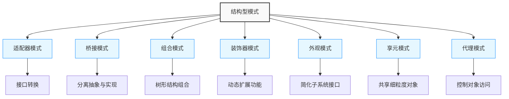
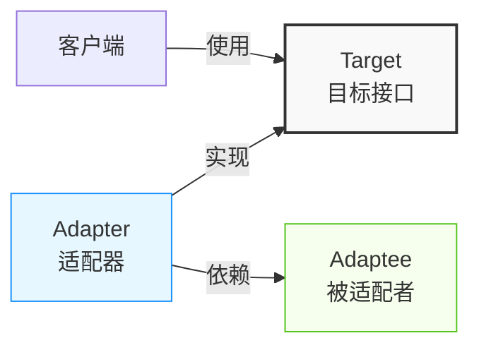
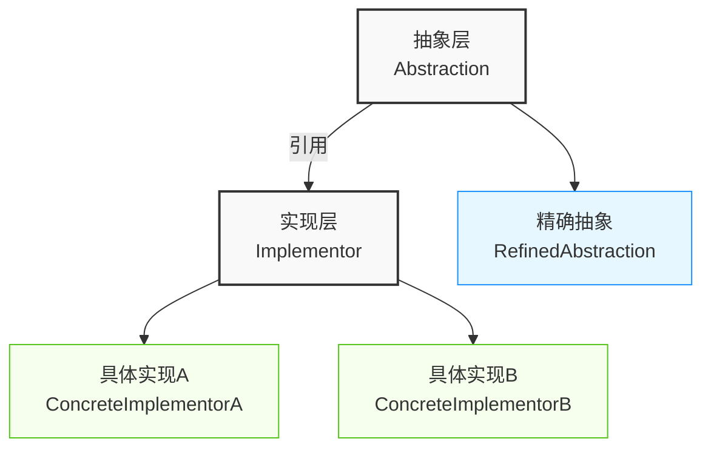
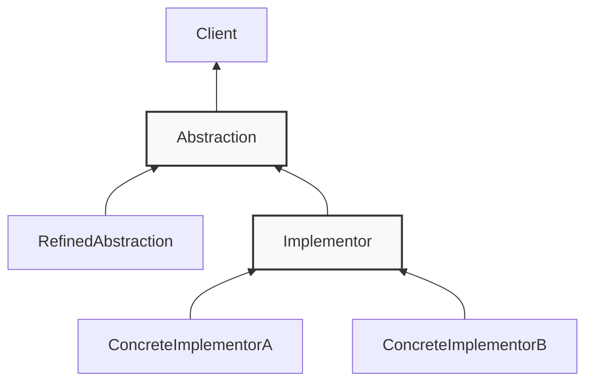
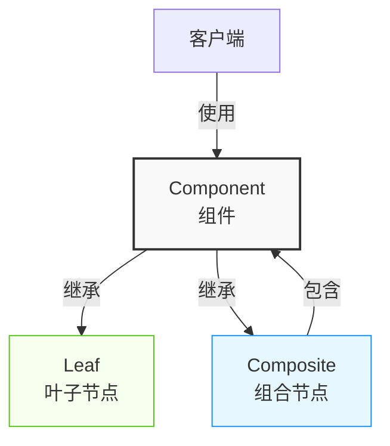
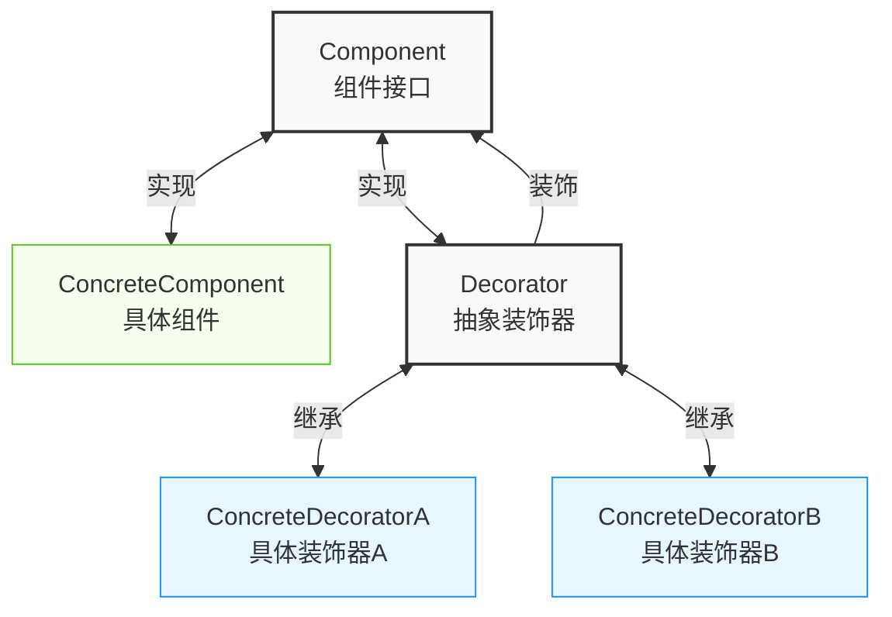
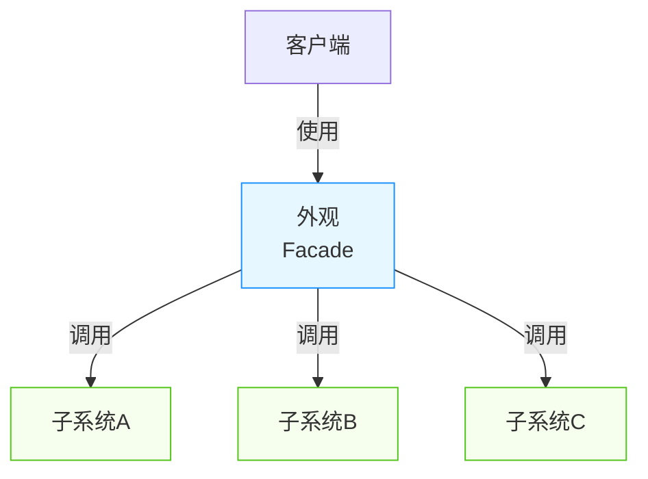
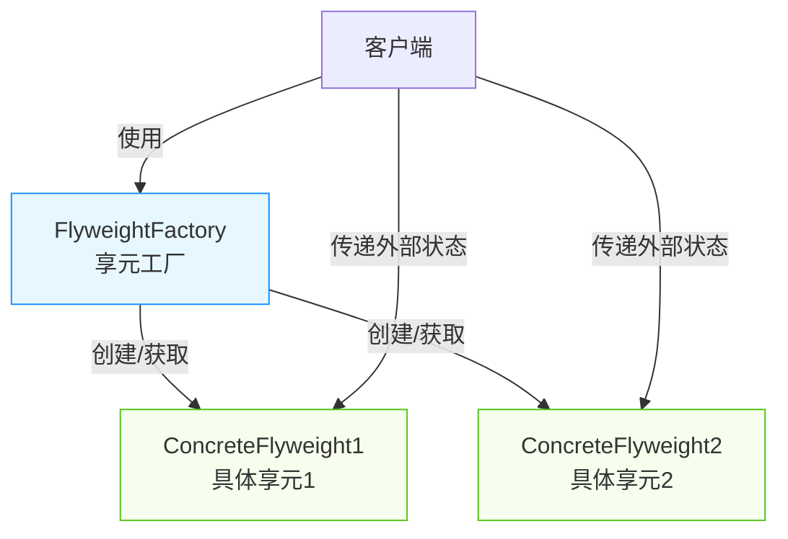
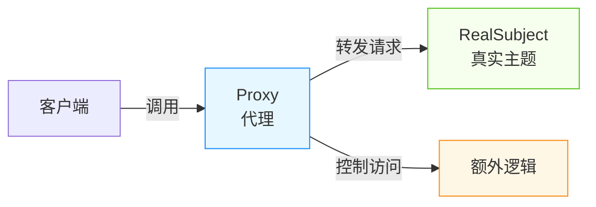

import Tabs from '@theme/Tabs';
import TabItem from '@theme/TabItem';
import CodeBlock from '@theme/CodeBlock';

# 结构型模式详解

结构型模式关注类和对象的组合，通过组合机制来创建更复杂的结构。本章将深入探讨七种结构型模式的原理、实现方式和实际应用。

:::tip 核心价值
**结构型模式 = 灵活组合 + 职责分离 + 接口转换**
- 🧩 **灵活组合**：将对象组合成更复杂的结构，而无需改变其接口
- 🔄 **接口适配**：使不兼容的接口能够协同工作
- 📦 **封装变化**：将系统中易变部分与稳定部分隔离
- 🚪 **简化接口**：为复杂子系统提供简单统一的访问接口
:::

## 结构型模式概览



| 模式 | 核心意图 | 关键特点 | 典型应用 |
|------|---------|---------|---------|
| **适配器模式** | 接口转换 | 使不兼容接口协同工作 | 第三方库集成、旧系统兼容 |
| **桥接模式** | 分离抽象与实现 | 抽象与实现独立变化 | UI渲染、驱动程序 |
| **组合模式** | 部分-整体结构 | 统一处理单个和组合对象 | 文件系统、菜单系统 |
| **装饰器模式** | 动态扩展功能 | 运行时添加职责 | I/O流、UI组件扩展 |
| **外观模式** | 简化接口 | 统一访问复杂子系统 | API网关、库封装 |
| **享元模式** | 共享细粒度对象 | 减少内存使用 | 字符渲染、缓存池 |
| **代理模式** | 控制对象访问 | 为对象提供替代品 | 远程代理、权限控制 |

## 1. 适配器模式（Adapter）

### 1.1 模式定义

适配器模式将一个类的接口转换成客户期望的另一个接口，使原本不兼容的类可以协同工作。它充当了两个不同接口之间的桥梁，就像现实世界中的电源适配器一样。



<Tabs>
<TabItem value="when-to-use" label="适用场景">

- **接口不兼容**：需要集成不兼容的接口时
- **复用现有类**：希望复用现有类，但其接口与系统不匹配
- **中间层适配**：在不同系统之间构建中间层
- **第三方库集成**：集成第三方库或旧系统时

</TabItem>
<TabItem value="benefits" label="优点">

- **兼容性**：使原本不兼容的类能够一起工作
- **复用性**：可以复用现有的类，无需修改其代码
- **灵活性**：允许在不修改原有代码的情况下扩展功能
- **开闭原则**：不修改原有代码即可集成新功能

</TabItem>
<TabItem value="drawbacks" label="缺点">

- **复杂性增加**：引入新的类和间接层
- **效率问题**：可能会引入一定的性能开销
- **过度使用**：过度使用会导致系统难以理解和维护
- **调试困难**：添加的中间层可能增加调试难度

</TabItem>
</Tabs>

### 1.2 实现方式

#### 类适配器模式

类适配器模式通过继承来实现，适配器同时继承被适配者并实现目标接口。

```java title="类适配器模式"
// 目标接口
public interface Target {
    void request();
}

// 被适配的类
public class Adaptee {
    public void specificRequest() {
        System.out.println("被适配类的特殊请求");
    }
}

// 类适配器
public class ClassAdapter extends Adaptee implements Target {
    @Override
    public void request() {
        // 调用被适配类的方法
        specificRequest();
    }
}
```

类适配器使用了Java的继承机制，所以只能继承一个类，但可以实现多个接口。这种方式的优点是可以覆盖被适配类的方法，缺点是它与Java的单继承机制冲突，限制了适配器的灵活性。

#### 对象适配器模式

对象适配器模式通过组合来实现，适配器包含一个被适配者的实例。

```java title="对象适配器模式"
// 对象适配器
public class ObjectAdapter implements Target {
    private Adaptee adaptee;
    
    public ObjectAdapter(Adaptee adaptee) {
        this.adaptee = adaptee;
    }
    
    @Override
    public void request() {
        adaptee.specificRequest();
    }
}
```

对象适配器使用了对象组合的方式，将一个对象包装在适配器中。这种方式更加灵活，符合"组合优于继承"的原则，被广泛应用于实际开发中。

### 1.3 适配器模式对比

| 特性 | 类适配器 | 对象适配器 |
|------|---------|-----------|
| **实现方式** | 继承 | 组合 |
| **灵活性** | 较低 | 较高 |
| **适用场景** | 适配少量接口 | 适用多个被适配者 |
| **是否能覆盖被适配者方法** | 可以 | 不可以 |
| **是否能对被适配者子类适配** | 不能 | 可以 |
| **代码复杂度** | 较简单 | 适中 |
| **符合原则** | 违背"组合优于继承" | 符合"组合优于继承" |

### 1.4 应用场景

<Tabs>
<TabItem value="payment" label="支付系统适配">

```java title="支付系统适配"
// 第三方支付接口适配
public interface PaymentProcessor {
    void processPayment(double amount);
    boolean isPaymentSuccessful();
}

// 第三方支付库
public class ThirdPartyPayment {
    public void pay(double amount) {
        System.out.println("第三方支付处理: " + amount);
    }
    
    public boolean getPaymentStatus() {
        return true;
    }
}

// 支付适配器
public class PaymentAdapter implements PaymentProcessor {
    private ThirdPartyPayment thirdPartyPayment;
    
    public PaymentAdapter(ThirdPartyPayment thirdPartyPayment) {
        this.thirdPartyPayment = thirdPartyPayment;
    }
    
    @Override
    public void processPayment(double amount) {
        thirdPartyPayment.pay(amount);
    }
    
    @Override
    public boolean isPaymentSuccessful() {
        return thirdPartyPayment.getPaymentStatus();
    }
}

// 使用示例
public class PaymentService {
    public void processPayment(PaymentProcessor processor, double amount) {
        processor.processPayment(amount);
        if (processor.isPaymentSuccessful()) {
            System.out.println("支付成功");
        } else {
            System.out.println("支付失败");
        }
    }
}
```

在这个例子中，PaymentAdapter适配器将第三方支付库的接口转换为系统内部统一的PaymentProcessor接口，使得系统可以无缝集成第三方支付功能。

</TabItem>
<TabItem value="legacy" label="旧系统集成">

```java title="旧系统集成"
// 新系统接口
public interface NewUserService {
    User getUserById(Long id);
    List<User> getAllUsers();
    void saveUser(User user);
    void deleteUser(Long id);
}

// 旧系统类
public class LegacyUserSystem {
    public UserData findUserById(int userId) {
        System.out.println("旧系统查找用户: " + userId);
        return new UserData(userId, "user" + userId);
    }
    
    public UserData[] getAllUserData() {
        System.out.println("旧系统获取所有用户");
        return new UserData[] { 
            new UserData(1, "user1"), 
            new UserData(2, "user2") 
        };
    }
    
    public void updateUserData(UserData userData) {
        System.out.println("旧系统更新用户: " + userData.getId());
    }
    
    public void removeUser(int userId) {
        System.out.println("旧系统删除用户: " + userId);
    }
}

// 用户数据类
public class UserData {
    private int id;
    private String name;
    
    public UserData(int id, String name) {
        this.id = id;
        this.name = name;
    }
    
    public int getId() { return id; }
    public String getName() { return name; }
}

// 新系统用户类
public class User {
    private Long id;
    private String username;
    
    // 构造函数、getter和setter
}

// 适配器
public class LegacyUserSystemAdapter implements NewUserService {
    private LegacyUserSystem legacySystem;
    
    public LegacyUserSystemAdapter(LegacyUserSystem legacySystem) {
        this.legacySystem = legacySystem;
    }
    
    @Override
    public User getUserById(Long id) {
        UserData userData = legacySystem.findUserById(id.intValue());
        return convertToUser(userData);
    }
    
    @Override
    public List<User> getAllUsers() {
        UserData[] userDataArray = legacySystem.getAllUserData();
        List<User> users = new ArrayList<>();
        for (UserData userData : userDataArray) {
            users.add(convertToUser(userData));
        }
        return users;
    }
    
    @Override
    public void saveUser(User user) {
        legacySystem.updateUserData(convertToUserData(user));
    }
    
    @Override
    public void deleteUser(Long id) {
        legacySystem.removeUser(id.intValue());
    }
    
    private User convertToUser(UserData userData) {
        User user = new User();
        user.setId((long)userData.getId());
        user.setUsername(userData.getName());
        return user;
    }
    
    private UserData convertToUserData(User user) {
        return new UserData(user.getId().intValue(), user.getUsername());
    }
}
```

这个示例展示了如何通过适配器模式集成旧系统的功能，将旧接口转换为新系统所期望的接口格式，并处理数据转换。

</TabItem>
<TabItem value="java-collections" label="Java集合框架">

```java title="Java集合框架中的适配器"
import java.util.*;

public class CollectionAdapterExample {
    public static void main(String[] args) {
        // Arrays.asList() 是一个适配器，将数组转换为List接口
        String[] strArray = {"A", "B", "C"};
        List<String> stringList = Arrays.asList(strArray);
        
        // Collections.enumeration() 将List适配为Enumeration
        Enumeration<String> enumeration = Collections.enumeration(stringList);
        
        // Collections.list() 将Enumeration适配回List
        List<String> newList = Collections.list(enumeration);
        
        // 输出结果
        System.out.println("Original Array: " + Arrays.toString(strArray));
        System.out.println("Adapted List: " + stringList);
        System.out.println("Converted back List: " + newList);
        
        // 展示如何使用适配器进行迭代
        while (enumeration.hasMoreElements()) {
            System.out.println("Element: " + enumeration.nextElement());
        }
    }
}
```

Java集合框架中包含多个适配器实现，如Arrays.asList()将数组适配为List接口，Collections.enumeration()将Collection适配为Enumeration接口等。这些适配器使得不同类型的集合能够协同工作。

</TabItem>
</Tabs>

### 1.5 适配器模式与其他模式的区别

| 模式 | 主要目的 | 应用情景 | 结构特点 |
|------|---------|---------|---------|
| **适配器模式** | 接口转换 | 使不兼容的接口协同工作 | 包装一个类，转换其接口 |
| **装饰器模式** | 增加功能 | 动态添加职责 | 包装一个类，增加其行为 |
| **外观模式** | 简化接口 | 提供子系统的简化接口 | 为多个类提供一个统一接口 |
| **代理模式** | 控制访问 | 控制对对象的访问 | 包装一个类，控制对它的访问 |

:::tip 适配器模式最佳实践
1. **对象适配器优先**：优先使用对象适配器，它更加灵活且符合"组合优于继承"原则
2. **职责清晰**：适配器只负责接口转换，不应添加额外业务逻辑
3. **考虑双向适配**：必要时实现双向适配，允许客户端使用不同的接口
4. **适度使用**：避免过度使用适配器，可能导致系统难以理解
5. **异常处理**：适配器中要处理可能的异常转换
:::

## 2. 桥接模式（Bridge）

### 2.1 模式定义

桥接模式将抽象部分与实现部分分离，使它们都可以独立地变化。它通过组合优于继承的设计原则，解决了多层继承带来的类爆炸问题，并提高了系统的可扩展性。



<Tabs>
<TabItem value="when-to-use" label="适用场景">

- **多维度变化**：当一个类有两个或多个独立变化的维度时
- **避免继承爆炸**：需要避免由于多层继承导致的子类数量剧增
- **运行时切换实现**：需要在运行时切换不同实现
- **跨平台应用**：需要实现跨平台应用，如驱动程序、图形渲染等

</TabItem>
<TabItem value="benefits" label="优点">

- **分离抽象与实现**：抽象和实现可以独立变化，不会互相影响
- **提高可扩展性**：可以独立扩展抽象层和实现层
- **隐藏实现细节**：客户端只需关心抽象层接口
- **避免类爆炸**：组合替代继承，减少类的数量

</TabItem>
<TabItem value="drawbacks" label="缺点">

- **增加复杂度**：引入额外的抽象层和间接调用
- **设计难度**：需要正确识别出两个独立变化的维度
- **初始成本高**：相比于单一类层次结构，初始设计成本更高
- **调试困难**：组合关系比继承关系更难以理解和调试

</TabItem>
</Tabs>

### 2.2 桥接模式结构

```java title="桥接模式"
// 实现者接口
public interface Implementor {
    void operationImpl();
}

// 具体实现者A
public class ConcreteImplementorA implements Implementor {
    @Override
    public void operationImpl() {
        System.out.println("具体实现者A的操作");
    }
}

// 具体实现者B
public class ConcreteImplementorB implements Implementor {
    @Override
    public void operationImpl() {
        System.out.println("具体实现者B的操作");
    }
}

// 抽象类
public abstract class Abstraction {
    protected Implementor implementor;
    
    public Abstraction(Implementor implementor) {
        this.implementor = implementor;
    }
    
    public abstract void operation();
}

// 精确抽象类
public class RefinedAbstraction extends Abstraction {
    public RefinedAbstraction(Implementor implementor) {
        super(implementor);
    }
    
    @Override
    public void operation() {
        System.out.println("精确抽象类的操作");
        implementor.operationImpl();
    }
}
```

### 2.3 应用场景

<Tabs>
<TabItem value="renderer" label="图形渲染系统">

```java title="图形渲染系统"
// 渲染器接口 - 实现部分
public interface Renderer {
    void renderCircle(double x, double y, double radius);
    void renderRectangle(double x, double y, double width, double height);
}

// 矢量渲染器 - 具体实现
public class VectorRenderer implements Renderer {
    @Override
    public void renderCircle(double x, double y, double radius) {
        System.out.println("矢量渲染圆形: (" + x + ", " + y + "), 半径: " + radius);
    }
    
    @Override
    public void renderRectangle(double x, double y, double width, double height) {
        System.out.println("矢量渲染矩形: (" + x + ", " + y + "), 尺寸: " + width + "x" + height);
    }
}

// 光栅渲染器 - 具体实现
public class RasterRenderer implements Renderer {
    @Override
    public void renderCircle(double x, double y, double radius) {
        System.out.println("光栅渲染圆形: (" + x + ", " + y + "), 半径: " + radius);
    }
    
    @Override
    public void renderRectangle(double x, double y, double width, double height) {
        System.out.println("光栅渲染矩形: (" + x + ", " + y + "), 尺寸: " + width + "x" + height);
    }
}

// 形状类 - 抽象部分
public abstract class Shape {
    protected Renderer renderer;
    
    public Shape(Renderer renderer) {
        this.renderer = renderer;
    }
    
    public abstract void draw();
    public abstract void resize(double scale);
}

// 圆形 - 精确抽象
public class Circle extends Shape {
    private double x, y, radius;
    
    public Circle(Renderer renderer, double x, double y, double radius) {
        super(renderer);
        this.x = x;
        this.y = y;
        this.radius = radius;
    }
    
    @Override
    public void draw() {
        renderer.renderCircle(x, y, radius);
    }
    
    @Override
    public void resize(double scale) {
        radius *= scale;
    }
}

// 矩形 - 精确抽象
public class Rectangle extends Shape {
    private double x, y, width, height;
    
    public Rectangle(Renderer renderer, double x, double y, double width, double height) {
        super(renderer);
        this.x = x;
        this.y = y;
        this.width = width;
        this.height = height;
    }
    
    @Override
    public void draw() {
        renderer.renderRectangle(x, y, width, height);
    }
    
    @Override
    public void resize(double scale) {
        width *= scale;
        height *= scale;
    }
}

// 客户端代码
public class BridgePatternDemo {
    public static void main(String[] args) {
        // 创建不同的渲染器
        Renderer vectorRenderer = new VectorRenderer();
        Renderer rasterRenderer = new RasterRenderer();
        
        // 使用矢量渲染器创建形状
        Shape circle1 = new Circle(vectorRenderer, 10, 10, 5);
        Shape rectangle1 = new Rectangle(vectorRenderer, 20, 20, 15, 10);
        
        // 使用光栅渲染器创建形状
        Shape circle2 = new Circle(rasterRenderer, 10, 10, 5);
        Shape rectangle2 = new Rectangle(rasterRenderer, 20, 20, 15, 10);
        
        // 绘制形状
        circle1.draw();      // 使用矢量渲染器绘制圆形
        rectangle1.draw();   // 使用矢量渲染器绘制矩形
        circle2.draw();      // 使用光栅渲染器绘制圆形
        rectangle2.draw();   // 使用光栅渲染器绘制矩形
        
        // 调整大小并再次绘制
        circle1.resize(2);
        circle1.draw();
    }
}
```

这个示例中，我们有两个独立变化的维度：
1. 形状（圆形、矩形）- 抽象部分
2. 渲染方式（矢量、光栅）- 实现部分

通过桥接模式，我们可以任意组合这两个维度而不需要为每个组合创建一个类。

</TabItem>
<TabItem value="devices" label="远程控制设备">

```java title="远程控制设备"
// 设备接口 - 实现部分
public interface Device {
    boolean isEnabled();
    void enable();
    void disable();
    int getVolume();
    void setVolume(int volume);
    int getChannel();
    void setChannel(int channel);
}

// 电视 - 具体实现
public class TV implements Device {
    private boolean on = false;
    private int volume = 30;
    private int channel = 1;
    
    @Override
    public boolean isEnabled() {
        return on;
    }
    
    @Override
    public void enable() {
        on = true;
        System.out.println("电视已打开");
    }
    
    @Override
    public void disable() {
        on = false;
        System.out.println("电视已关闭");
    }
    
    @Override
    public int getVolume() {
        return volume;
    }
    
    @Override
    public void setVolume(int volume) {
        this.volume = Math.min(Math.max(volume, 0), 100);
        System.out.println("电视音量设置为: " + this.volume);
    }
    
    @Override
    public int getChannel() {
        return channel;
    }
    
    @Override
    public void setChannel(int channel) {
        this.channel = channel;
        System.out.println("电视频道切换至: " + this.channel);
    }
}

// 收音机 - 具体实现
public class Radio implements Device {
    private boolean on = false;
    private int volume = 20;
    private int channel = 88;
    
    @Override
    public boolean isEnabled() {
        return on;
    }
    
    @Override
    public void enable() {
        on = true;
        System.out.println("收音机已打开");
    }
    
    @Override
    public void disable() {
        on = false;
        System.out.println("收音机已关闭");
    }
    
    @Override
    public int getVolume() {
        return volume;
    }
    
    @Override
    public void setVolume(int volume) {
        this.volume = Math.min(Math.max(volume, 0), 100);
        System.out.println("收音机音量设置为: " + this.volume);
    }
    
    @Override
    public int getChannel() {
        return channel;
    }
    
    @Override
    public void setChannel(int channel) {
        this.channel = channel;
        System.out.println("收音机调频至: " + this.channel);
    }
}

// 远程控制 - 抽象部分
public abstract class RemoteControl {
    protected Device device;
    
    public RemoteControl(Device device) {
        this.device = device;
    }
    
    public void togglePower() {
        if (device.isEnabled()) {
            device.disable();
        } else {
            device.enable();
        }
    }
    
    public void volumeUp() {
        device.setVolume(device.getVolume() + 10);
    }
    
    public void volumeDown() {
        device.setVolume(device.getVolume() - 10);
    }
    
    public void channelUp() {
        device.setChannel(device.getChannel() + 1);
    }
    
    public void channelDown() {
        device.setChannel(device.getChannel() - 1);
    }
}

// 高级远程控制 - 精确抽象
public class AdvancedRemoteControl extends RemoteControl {
    public AdvancedRemoteControl(Device device) {
        super(device);
    }
    
    public void mute() {
        device.setVolume(0);
        System.out.println("已静音");
    }
    
    public void setChannel(int channel) {
        device.setChannel(channel);
        System.out.println("直接切换至频道: " + channel);
    }
}

// 客户端代码
public class RemoteControlDemo {
    public static void main(String[] args) {
        // 创建设备
        Device tv = new TV();
        Device radio = new Radio();
        
        // 创建标准遥控器
        RemoteControl tvRemote = new RemoteControl(tv);
        tvRemote.togglePower();   // 打开电视
        tvRemote.volumeUp();      // 增加音量
        tvRemote.channelUp();     // 切换频道
        
        // 创建高级遥控器
        AdvancedRemoteControl radioAdvancedRemote = new AdvancedRemoteControl(radio);
        radioAdvancedRemote.togglePower();   // 打开收音机
        radioAdvancedRemote.setChannel(104); // 直接设置频道
        radioAdvancedRemote.mute();          // 静音
    }
}
```

这个例子展示了桥接模式如何将远程控制（抽象部分）与设备（实现部分）分离，允许它们独立变化。我们可以有不同类型的遥控器和不同类型的设备，并且可以自由组合它们。

</TabItem>
</Tabs>

### 2.4 桥接模式与其他模式比较

| 模式 | 桥接模式 | 适配器模式 | 策略模式 | 组合模式 |
|------|---------|-----------|---------|---------|
| **目的** | 分离抽象与实现 | 转换接口 | 封装算法 | 组织对象层次结构 |
| **关注点** | 处理多维度变化 | 使不兼容接口兼容 | 提供可替换算法 | 部分-整体关系 |
| **设计时机** | 设计前期 | 设计后期/集成期 | 设计中期 | 设计中期 |
| **类数量** | 中等 | 少 | 中等 | 少 |
| **复杂度** | 中高 | 低 | 中 | 中 |

### 2.5 实现要点

#### 类层次结构

桥接模式创建了两个独立的类层次结构：
1. **抽象层**: Abstraction及其子类
2. **实现层**: Implementor及其实现类



#### 设计步骤

1. 识别系统中的独立变化维度
2. 分离抽象部分和实现部分
3. 创建抽象类及其派生类
4. 创建实现接口及其实现类
5. 在抽象类中维护对实现接口的引用

:::tip 桥接模式最佳实践
1. **尽早设计**：在系统设计初期就应考虑使用桥接模式
2. **明确分离**：确保抽象和实现真正独立且可以单独扩展
3. **注意粒度**：实现接口应该足够抽象，以允许不同的具体实现
4. **考虑依赖注入**：结合依赖注入框架实现桥接模式
5. **处理异常情况**：设计实现类时考虑可能的异常和边界情况
:::

## 3. 组合模式（Composite）

### 3.1 模式定义

组合模式将对象组合成树形结构以表示"部分-整体"的层次结构，使得客户端对单个对象和组合对象的使用具有一致性。它允许客户端统一处理单个对象和对象组合，而无需关心其内部复杂结构。



<Tabs>
<TabItem value="when-to-use" label="适用场景">

- **表示部分-整体层次结构**：需要表示对象的部分-整体层次结构
- **统一处理**：希望客户端忽略复合对象与单个对象的差异
- **树形结构**：需要处理树形结构，如文件系统、菜单系统等
- **递归组合**：需要递归组合对象以形成更复杂的结构

</TabItem>
<TabItem value="benefits" label="优点">

- **简化客户端代码**：客户端可以一致地处理单个对象和组合对象
- **方便添加新组件**：可以方便地添加新类型的组件而不影响已有代码
- **符合开闭原则**：系统更易于扩展，无需修改现有代码
- **灵活组合**：可以灵活地组合对象，形成更复杂的树形结构

</TabItem>
<TabItem value="drawbacks" label="缺点">

- **限制组件类型**：很难限制组合中的组件类型
- **设计过于一般化**：为了统一接口，可能会让设计变得过于一般化
- **性能考量**：对组件的遍历操作可能会影响性能
- **难以确保安全性**：在透明性和安全性之间需要做出权衡

</TabItem>
</Tabs>

### 3.2 组合模式结构

```java title="组合模式"
// 抽象组件
public abstract class Component {
    protected String name;
    
    public Component(String name) {
        this.name = name;
    }
    
    public abstract void add(Component component);
    public abstract void remove(Component component);
    public abstract void display(int depth);
    public abstract void operation();
}

// 叶子节点
public class Leaf extends Component {
    public Leaf(String name) {
        super(name);
    }
    
    @Override
    public void add(Component component) {
        throw new UnsupportedOperationException("叶子节点不能添加子节点");
    }
    
    @Override
    public void remove(Component component) {
        throw new UnsupportedOperationException("叶子节点不能删除子节点");
    }
    
    @Override
    public void display(int depth) {
        StringBuilder prefix = new StringBuilder();
        for (int i = 0; i < depth; i++) {
            prefix.append("  ");
        }
        System.out.println(prefix + "- " + name);
    }
    
    @Override
    public void operation() {
        System.out.println("叶子节点操作: " + name);
    }
}

// 复合节点
public class Composite extends Component {
    private List<Component> children = new ArrayList<>();
    
    public Composite(String name) {
        super(name);
    }
    
    @Override
    public void add(Component component) {
        children.add(component);
    }
    
    @Override
    public void remove(Component component) {
        children.remove(component);
    }
    
    @Override
    public void display(int depth) {
        StringBuilder prefix = new StringBuilder();
        for (int i = 0; i < depth; i++) {
            prefix.append("  ");
        }
        System.out.println(prefix + "+ " + name);
        
        for (Component child : children) {
            child.display(depth + 1);
        }
    }
    
    @Override
    public void operation() {
        System.out.println("复合节点操作: " + name);
        for (Component child : children) {
            child.operation();
        }
    }
}
```

### 3.3 组合模式变体

#### 透明组合模式

透明组合模式在抽象组件中定义所有管理子组件的方法，包括叶子节点和组合节点，这使得客户端可以统一对待所有组件，但叶子节点必须实现一些并不适用的方法。

```java title="透明组合模式"
public abstract class Component {
    protected String name;
    
    public Component(String name) {
        this.name = name;
    }
    
    // 所有子类都必须实现这些方法
    public abstract void add(Component component);
    public abstract void remove(Component component);
    public abstract Component getChild(int index);
    public abstract void display(int depth);
    public abstract void operation();
}
```

#### 安全组合模式

安全组合模式只在抽象组件中定义共同操作，而将管理子组件的方法放在组合节点类中，这样可以避免叶子节点实现不必要的方法，但客户端需要区分叶子和组合节点。

```java title="安全组合模式"
public abstract class Component {
    protected String name;
    
    public Component(String name) {
        this.name = name;
    }
    
    // 所有组件共有的方法
    public abstract void display(int depth);
    public abstract void operation();
    
    // 叶子节点不需要实现这些方法
}

public class Composite extends Component {
    private List<Component> children = new ArrayList<>();
    
    // 组合节点特有的方法
    public void add(Component component) {
        children.add(component);
    }
    
    public void remove(Component component) {
        children.remove(component);
    }
    
    public Component getChild(int index) {
        return children.get(index);
    }
    
    // 其他实现...
}
```

### 3.4 应用场景

<Tabs>
<TabItem value="file-system" label="文件系统">

```java title="文件系统"
// 文件系统项抽象
public abstract class FileSystemItem {
    protected String name;
    protected long size;
    
    public FileSystemItem(String name, long size) {
        this.name = name;
        this.size = size;
    }
    
    public String getName() {
        return name;
    }
    
    public abstract void display(int depth);
    public abstract long getSize();
    public abstract void add(FileSystemItem item);
    public abstract void remove(FileSystemItem item);
    public abstract List<FileSystemItem> getChildren();
}

// 文件
public class File extends FileSystemItem {
    public File(String name, long size) {
        super(name, size);
    }
    
    @Override
    public void display(int depth) {
        StringBuilder prefix = new StringBuilder();
        for (int i = 0; i < depth; i++) {
            prefix.append("  ");
        }
        System.out.println(prefix + "📄 " + name + " (" + formatSize(size) + ")");
    }
    
    @Override
    public long getSize() {
        return size;
    }
    
    @Override
    public void add(FileSystemItem item) {
        throw new UnsupportedOperationException("文件不能添加子项");
    }
    
    @Override
    public void remove(FileSystemItem item) {
        throw new UnsupportedOperationException("文件不能删除子项");
    }
    
    @Override
    public List<FileSystemItem> getChildren() {
        return Collections.emptyList();
    }
    
    private String formatSize(long size) {
        if (size < 1024) {
            return size + " bytes";
        } else if (size < 1024 * 1024) {
            return String.format("%.2f KB", size / 1024.0);
        } else if (size < 1024 * 1024 * 1024) {
            return String.format("%.2f MB", size / (1024.0 * 1024));
        } else {
            return String.format("%.2f GB", size / (1024.0 * 1024 * 1024));
        }
    }
}

// 目录
public class Directory extends FileSystemItem {
    private List<FileSystemItem> children = new ArrayList<>();
    
    public Directory(String name) {
        super(name, 0);
    }
    
    @Override
    public void display(int depth) {
        StringBuilder prefix = new StringBuilder();
        for (int i = 0; i < depth; i++) {
            prefix.append("  ");
        }
        System.out.println(prefix + "📁 " + name + " (" + formatSize(getSize()) + ")");
        
        for (FileSystemItem child : children) {
            child.display(depth + 1);
        }
    }
    
    @Override
    public long getSize() {
        long totalSize = 0;
        for (FileSystemItem child : children) {
            totalSize += child.getSize();
        }
        return totalSize;
    }
    
    @Override
    public void add(FileSystemItem item) {
        children.add(item);
    }
    
    @Override
    public void remove(FileSystemItem item) {
        children.remove(item);
    }
    
    @Override
    public List<FileSystemItem> getChildren() {
        return new ArrayList<>(children);
    }
    
    private String formatSize(long size) {
        if (size < 1024) {
            return size + " bytes";
        } else if (size < 1024 * 1024) {
            return String.format("%.2f KB", size / 1024.0);
        } else if (size < 1024 * 1024 * 1024) {
            return String.format("%.2f MB", size / (1024.0 * 1024));
        } else {
            return String.format("%.2f GB", size / (1024.0 * 1024 * 1024));
        }
    }
}

// 客户端代码
public class FileSystemDemo {
    public static void main(String[] args) {
        // 创建根目录
        Directory root = new Directory("root");
        
        // 创建子目录和文件
        Directory docs = new Directory("documents");
        Directory pics = new Directory("pictures");
        
        File readme = new File("README.txt", 2048);
        File config = new File("config.xml", 1024);
        
        // 添加到根目录
        root.add(docs);
        root.add(pics);
        root.add(readme);
        root.add(config);
        
        // 添加子目录内容
        docs.add(new File("document1.docx", 5120));
        docs.add(new File("document2.docx", 7168));
        
        Directory vacationPics = new Directory("vacation");
        pics.add(vacationPics);
        pics.add(new File("photo1.jpg", 2048));
        
        vacationPics.add(new File("vacation1.jpg", 4096));
        vacationPics.add(new File("vacation2.jpg", 3072));
        
        // 显示文件系统结构
        root.display(0);
        
        // 计算总大小
        System.out.println("\n总大小: " + formatSize(root.getSize()));
    }
    
    private static String formatSize(long size) {
        if (size < 1024) {
            return size + " bytes";
        } else if (size < 1024 * 1024) {
            return String.format("%.2f KB", size / 1024.0);
        } else if (size < 1024 * 1024 * 1024) {
            return String.format("%.2f MB", size / (1024.0 * 1024));
        } else {
            return String.format("%.2f GB", size / (1024.0 * 1024 * 1024));
        }
    }
}
```

这个示例模拟了一个简单的文件系统，包含目录和文件。目录可以包含其他目录和文件，而文件是叶子节点。通过组合模式，客户端代码可以统一处理文件和目录。

</TabItem>
<TabItem value="menu-system" label="菜单系统">

```java title="菜单系统"
// 菜单组件
public abstract class MenuComponent {
    protected String name;
    protected String description;
    
    public MenuComponent(String name, String description) {
        this.name = name;
        this.description = description;
    }
    
    public String getName() {
        return name;
    }
    
    public String getDescription() {
        return description;
    }
    
    public abstract void add(MenuComponent menuComponent);
    public abstract void remove(MenuComponent menuComponent);
    public abstract MenuComponent getChild(int i);
    public abstract void print(int depth);
    public abstract boolean isVegetarian();
    public abstract double getPrice();
}

// 菜单项（叶子节点）
public class MenuItem extends MenuComponent {
    private boolean vegetarian;
    private double price;
    
    public MenuItem(String name, String description, boolean vegetarian, double price) {
        super(name, description);
        this.vegetarian = vegetarian;
        this.price = price;
    }
    
    @Override
    public void add(MenuComponent menuComponent) {
        throw new UnsupportedOperationException("菜单项不支持添加子菜单");
    }
    
    @Override
    public void remove(MenuComponent menuComponent) {
        throw new UnsupportedOperationException("菜单项不支持删除子菜单");
    }
    
    @Override
    public MenuComponent getChild(int i) {
        throw new UnsupportedOperationException("菜单项没有子菜单");
    }
    
    @Override
    public void print(int depth) {
        StringBuilder prefix = new StringBuilder();
        for (int i = 0; i < depth; i++) {
            prefix.append("  ");
        }
        System.out.print(prefix + "🍽️ " + getName());
        if (isVegetarian()) {
            System.out.print("(V)");
        }
        System.out.println(", " + getPrice() + "¥ -- " + getDescription());
    }
    
    @Override
    public boolean isVegetarian() {
        return vegetarian;
    }
    
    @Override
    public double getPrice() {
        return price;
    }
}

// 菜单（组合节点）
public class Menu extends MenuComponent {
    private List<MenuComponent> menuComponents = new ArrayList<>();
    
    public Menu(String name, String description) {
        super(name, description);
    }
    
    @Override
    public void add(MenuComponent menuComponent) {
        menuComponents.add(menuComponent);
    }
    
    @Override
    public void remove(MenuComponent menuComponent) {
        menuComponents.remove(menuComponent);
    }
    
    @Override
    public MenuComponent getChild(int i) {
        return menuComponents.get(i);
    }
    
    @Override
    public void print(int depth) {
        StringBuilder prefix = new StringBuilder();
        for (int i = 0; i < depth; i++) {
            prefix.append("  ");
        }
        System.out.println(prefix + "📖 " + getName() + " -- " + getDescription());
        System.out.println(prefix + "--------------------------------");
        
        for (MenuComponent menuComponent : menuComponents) {
            menuComponent.print(depth + 1);
        }
    }
    
    @Override
    public boolean isVegetarian() {
        // 如果所有子项都是素食，则菜单为素食
        return menuComponents.stream().allMatch(MenuComponent::isVegetarian);
    }
    
    @Override
    public double getPrice() {
        // 计算菜单总价格
        return menuComponents.stream()
                .mapToDouble(MenuComponent::getPrice)
                .sum();
    }
}

// 客户端代码
public class MenuSystemDemo {
    public static void main(String[] args) {
        // 创建主菜单
        MenuComponent mainMenu = new Menu("主菜单", "餐厅主菜单");
        
        // 创建子菜单
        MenuComponent breakfastMenu = new Menu("早餐菜单", "早餐选项");
        MenuComponent lunchMenu = new Menu("午餐菜单", "午餐选项");
        MenuComponent dinnerMenu = new Menu("晚餐菜单", "晚餐选项");
        MenuComponent dessertMenu = new Menu("甜点菜单", "甜点选项");
        
        // 添加子菜单到主菜单
        mainMenu.add(breakfastMenu);
        mainMenu.add(lunchMenu);
        mainMenu.add(dinnerMenu);
        
        // 添加菜单项到早餐菜单
        breakfastMenu.add(new MenuItem("煎饼", "香脆可口的煎饼", true, 10.0));
        breakfastMenu.add(new MenuItem("培根蛋饼", "培根和鸡蛋做成的饼", false, 15.0));
        breakfastMenu.add(new MenuItem("水果沙拉", "新鲜水果沙拉", true, 12.0));
        
        // 添加菜单项到午餐菜单
        lunchMenu.add(new MenuItem("素食汉堡", "全麦面包搭配素食汉堡", true, 20.0));
        lunchMenu.add(new MenuItem("牛肉汉堡", "牛肉汉堡配芝士和生菜", false, 25.0));
        lunchMenu.add(new MenuItem("薯条", "脆皮薯条", true, 8.0));
        
        // 添加菜单项到晚餐菜单
        dinnerMenu.add(new MenuItem("意大利面", "意大利面配番茄酱", true, 22.0));
        dinnerMenu.add(new MenuItem("牛排", "美味的牛排", false, 40.0));
        dinnerMenu.add(new MenuItem("海鲜饭", "新鲜的海鲜饭", false, 35.0));
        
        // 添加甜点菜单到晚餐菜单
        dinnerMenu.add(dessertMenu);
        
        // 添加菜单项到甜点菜单
        dessertMenu.add(new MenuItem("提拉米苏", "经典意大利甜点", true, 15.0));
        dessertMenu.add(new MenuItem("芝士蛋糕", "纽约风格芝士蛋糕", true, 18.0));
        
        // 打印整个菜单
        mainMenu.print(0);
        
        // 计算总价
        System.out.println("\n全部菜单总价: " + mainMenu.getPrice() + "¥");
        
        // 打印仅素食菜单
        System.out.println("\n素食菜单:");
        printVegetarianMenu(mainMenu, 0);
    }
    
    private static void printVegetarianMenu(MenuComponent menuComponent, int depth) {
        if (menuComponent.isVegetarian()) {
            menuComponent.print(depth);
        } else if (!(menuComponent instanceof MenuItem)) {
            // 如果是菜单，递归检查子项
            for (int i = 0; i < menuComponent.getChild(i) != null; i++) {
                try {
                    MenuComponent child = menuComponent.getChild(i);
                    printVegetarianMenu(child, depth + 1);
                } catch (IndexOutOfBoundsException e) {
                    break;
                }
            }
        }
    }
}
```

此示例展示了一个餐厅菜单系统，使用组合模式来表示菜单和菜单项。菜单可以包含子菜单和菜单项，而菜单项是叶子节点。客户端可以递归地遍历整个菜单结构。

</TabItem>
<TabItem value="organization" label="组织架构">

```java title="组织架构"
// 组织组件
public abstract class OrganizationComponent {
    protected String name;
    protected String description;
    
    public OrganizationComponent(String name, String description) {
        this.name = name;
        this.description = description;
    }
    
    public String getName() {
        return name;
    }
    
    public String getDescription() {
        return description;
    }
    
    public abstract void add(OrganizationComponent component);
    public abstract void remove(OrganizationComponent component);
    public abstract void display(int depth);
    public abstract int getEmployeeCount();
}

// 员工（叶子节点）
public class Employee extends OrganizationComponent {
    private String position;
    private double salary;
    
    public Employee(String name, String position, double salary) {
        super(name, "员工: " + position);
        this.position = position;
        this.salary = salary;
    }
    
    public String getPosition() {
        return position;
    }
    
    public double getSalary() {
        return salary;
    }
    
    @Override
    public void add(OrganizationComponent component) {
        throw new UnsupportedOperationException("员工无法添加下属");
    }
    
    @Override
    public void remove(OrganizationComponent component) {
        throw new UnsupportedOperationException("员工无法移除下属");
    }
    
    @Override
    public void display(int depth) {
        StringBuilder prefix = new StringBuilder();
        for (int i = 0; i < depth; i++) {
            prefix.append("  ");
        }
        System.out.println(prefix + "👤 " + getName() + " - " + getPosition() + " (薪资: " + salary + ")");
    }
    
    @Override
    public int getEmployeeCount() {
        return 1;
    }
}

// 部门（组合节点）
public class Department extends OrganizationComponent {
    private List<OrganizationComponent> subordinates = new ArrayList<>();
    
    public Department(String name, String description) {
        super(name, description);
    }
    
    @Override
    public void add(OrganizationComponent component) {
        subordinates.add(component);
    }
    
    @Override
    public void remove(OrganizationComponent component) {
        subordinates.remove(component);
    }
    
    @Override
    public void display(int depth) {
        StringBuilder prefix = new StringBuilder();
        for (int i = 0; i < depth; i++) {
            prefix.append("  ");
        }
        System.out.println(prefix + "🏢 " + getName() + " - " + getDescription() + 
                          " (员工数: " + getEmployeeCount() + ")");
        
        for (OrganizationComponent component : subordinates) {
            component.display(depth + 1);
        }
    }
    
    @Override
    public int getEmployeeCount() {
        return subordinates.stream()
                .mapToInt(OrganizationComponent::getEmployeeCount)
                .sum();
    }
}

// 客户端代码
public class OrganizationDemo {
    public static void main(String[] args) {
        // 创建组织架构
        OrganizationComponent company = new Department("科技公司", "一家创新科技公司");
        
        // 创建部门
        OrganizationComponent rd = new Department("研发部", "负责产品开发");
        OrganizationComponent marketing = new Department("市场部", "负责市场营销");
        OrganizationComponent finance = new Department("财务部", "负责财务管理");
        
        // 添加部门到公司
        company.add(rd);
        company.add(marketing);
        company.add(finance);
        
        // 创建研发子部门
        OrganizationComponent frontend = new Department("前端组", "负责前端开发");
        OrganizationComponent backend = new Department("后端组", "负责后端开发");
        
        // 添加研发子部门
        rd.add(frontend);
        rd.add(backend);
        
        // 添加员工到前端组
        frontend.add(new Employee("张三", "高级前端工程师", 20000));
        frontend.add(new Employee("李四", "前端工程师", 15000));
        frontend.add(new Employee("王五", "初级前端工程师", 10000));
        
        // 添加员工到后端组
        backend.add(new Employee("赵六", "高级后端工程师", 22000));
        backend.add(new Employee("钱七", "后端工程师", 16000));
        
        // 添加员工到市场部
        marketing.add(new Employee("孙八", "市场总监", 25000));
        marketing.add(new Employee("周九", "市场专员", 12000));
        
        // 添加员工到财务部
        finance.add(new Employee("吴十", "财务总监", 24000));
        finance.add(new Employee("郑十一", "会计", 14000));
        
        // 显示整个组织架构
        company.display(0);
        
        // 显示研发部架构
        System.out.println("\n研发部架构:");
        rd.display(0);
        
        // 显示员工总数
        System.out.println("\n公司总员工数: " + company.getEmployeeCount());
        System.out.println("研发部员工数: " + rd.getEmployeeCount());
    }
}
```

这个例子展示了一个组织架构系统，使用组合模式来表示公司的部门层级结构。部门可以包含子部门和员工，而员工是叶子节点。通过组合模式，我们可以轻松计算任何级别的员工数量。

</TabItem>
</Tabs>

### 3.5 组合模式的实现考量

#### 安全性与透明性的权衡

在组合模式实现中，需要权衡安全性和透明性：

1. **透明性**：抽象组件中定义所有操作，使客户端可以统一处理
   - 优点：客户端代码简单，不需要区分叶子和组合节点
   - 缺点：叶子节点必须实现不适用的方法，违反接口隔离原则

2. **安全性**：抽象组件只定义共同操作，管理子组件的方法只在组合节点中定义
   - 优点：叶子节点不需要实现不适用的方法
   - 缺点：客户端需要区分叶子和组合节点，增加类型检查

#### 应对常见挑战

1. **组件排序**：为了支持组件排序，可以在Component中添加getOrder()和setOrder()方法
2. **访问父组件**：在需要向上遍历的场景中，可以在Component中添加对父组件的引用
3. **缓存优化**：为了提高性能，可以缓存组合节点的计算结果，如大小、计数等

```java title="带缓存的组合模式"
public class CachingComposite extends Component {
    private List<Component> children = new ArrayList<>();
    private long cachedSize = -1;
    private boolean dirty = true;
    
    @Override
    public long getSize() {
        if (dirty) {
            cachedSize = calculateSize();
            dirty = false;
        }
        return cachedSize;
    }
    
    private long calculateSize() {
        return children.stream().mapToLong(Component::getSize).sum();
    }
    
    @Override
    public void add(Component component) {
        children.add(component);
        dirty = true;
    }
    
    @Override
    public void remove(Component component) {
        children.remove(component);
        dirty = true;
    }
}
```

:::tip 组合模式最佳实践
1. **决定安全性与透明性**：根据项目需求，选择透明性或安全性实现
2. **组件排序**：需要排序时，添加排序相关方法和属性
3. **性能优化**：对频繁访问的属性使用缓存策略
4. **访问控制**：考虑是否需要父节点引用，以及访问控制策略
5. **迭代器实现**：提供遍历组合结构的迭代器，简化客户端代码
:::

## 4. 装饰器模式（Decorator）

### 4.1 模式定义

装饰器模式动态地给一个对象添加额外的职责，是继承的一种灵活替代方案。它通过组合而非继承来扩展对象的功能，在不修改原有对象的情况下为其添加新的行为。



<Tabs>
<TabItem value="when-to-use" label="适用场景">

- **动态扩展功能**：在不改变对象结构的前提下动态地给对象添加职责
- **避免子类爆炸**：当使用继承会导致子类数量剧增时
- **运行时配置**：需要在运行时动态组合多种行为
- **责任链构建**：需要构建多层次的责任链

</TabItem>
<TabItem value="benefits" label="优点">

- **灵活性强**：比继承更加灵活，可以动态添加或删除职责
- **遵循开闭原则**：无需修改现有代码即可扩展功能
- **层次结构清晰**：每个装饰器专注于单一职责
- **运行时组合**：支持在运行时组合多种行为

</TabItem>
<TabItem value="drawbacks" label="缺点">

- **小对象数量多**：会创建很多小对象，增加系统复杂度
- **调试困难**：多层装饰使得调试变得复杂
- **过度使用**：可能导致系统难以理解和维护
- **复杂配置**：组合装饰器的顺序可能会影响最终行为

</TabItem>
</Tabs>

### 4.2 装饰器模式结构

```java title="装饰器模式结构"
// 组件接口
public interface Component {
    void operation();
}

// 具体组件
public class ConcreteComponent implements Component {
    @Override
    public void operation() {
        System.out.println("具体组件的操作");
    }
}

// 抽象装饰器
public abstract class Decorator implements Component {
    protected Component component;
    
    public Decorator(Component component) {
        this.component = component;
    }
    
    @Override
    public void operation() {
        component.operation();
    }
}

// 具体装饰器A
public class ConcreteDecoratorA extends Decorator {
    public ConcreteDecoratorA(Component component) {
        super(component);
    }
    
    @Override
    public void operation() {
        super.operation();
        addedBehavior();
    }
    
    private void addedBehavior() {
        System.out.println("装饰器A添加的行为");
    }
}

// 具体装饰器B
public class ConcreteDecoratorB extends Decorator {
    public ConcreteDecoratorB(Component component) {
        super(component);
    }
    
    @Override
    public void operation() {
        System.out.println("装饰器B的前置处理");
        super.operation();
        System.out.println("装饰器B的后置处理");
    }
}

// 客户端代码
public class DecoratorPatternDemo {
    public static void main(String[] args) {
        // 创建具体组件
        Component component = new ConcreteComponent();
        
        // 用装饰器A装饰
        Component decoratedA = new ConcreteDecoratorA(component);
        decoratedA.operation();
        
        System.out.println("\n==================\n");
        
        // 用装饰器B装饰
        Component decoratedB = new ConcreteDecoratorB(component);
        decoratedB.operation();
        
        System.out.println("\n==================\n");
        
        // 多层装饰：先用A装饰，再用B装饰
        Component decoratedBA = new ConcreteDecoratorB(
            new ConcreteDecoratorA(component)
        );
        decoratedBA.operation();
    }
}
```

### 4.3 应用场景

<Tabs>
<TabItem value="io-streams" label="IO流装饰器">

```java title="Java IO流装饰器"
// 基础输入流接口
public interface DataSource {
    String read();
    void write(String data);
}

// 具体组件：文件数据源
public class FileDataSource implements DataSource {
    private String filename;
    
    public FileDataSource(String filename) {
        this.filename = filename;
    }
    
    @Override
    public String read() {
        System.out.println("从文件读取数据: " + filename);
        return "文件内容";
    }
    
    @Override
    public void write(String data) {
        System.out.println("向文件写入数据: " + filename);
        System.out.println("内容: " + data);
    }
}

// 抽象装饰器
public abstract class DataSourceDecorator implements DataSource {
    protected DataSource wrappee;
    
    public DataSourceDecorator(DataSource source) {
        this.wrappee = source;
    }
    
    @Override
    public String read() {
        return wrappee.read();
    }
    
    @Override
    public void write(String data) {
        wrappee.write(data);
    }
}

// 加密装饰器
public class EncryptionDecorator extends DataSourceDecorator {
    public EncryptionDecorator(DataSource source) {
        super(source);
    }
    
    @Override
    public String read() {
        String data = super.read();
        return decrypt(data);
    }
    
    @Override
    public void write(String data) {
        super.write(encrypt(data));
    }
    
    private String encrypt(String data) {
        // 简单的加密实现（实际应用中应使用更安全的算法）
        System.out.println("应用加密");
        StringBuilder result = new StringBuilder();
        for (char c : data.toCharArray()) {
            result.append((char) (c + 1)); // 简单位移加密
        }
        return result.toString();
    }
    
    private String decrypt(String data) {
        // 解密实现
        System.out.println("应用解密");
        StringBuilder result = new StringBuilder();
        for (char c : data.toCharArray()) {
            result.append((char) (c - 1));
        }
        return result.toString();
    }
}

// 压缩装饰器
public class CompressionDecorator extends DataSourceDecorator {
    public CompressionDecorator(DataSource source) {
        super(source);
    }
    
    @Override
    public String read() {
        String data = super.read();
        return decompress(data);
    }
    
    @Override
    public void write(String data) {
        super.write(compress(data));
    }
    
    private String compress(String data) {
        // 简单的压缩实现（实际应用中应使用真实的压缩算法）
        System.out.println("应用压缩");
        return data.replaceAll("\\s+", ""); // 简单地删除所有空白字符
    }
    
    private String decompress(String data) {
        // 解压缩实现
        System.out.println("应用解压缩");
        return data; // 简化示例
    }
}

// 缓冲装饰器
public class BufferedDecorator extends DataSourceDecorator {
    private StringBuilder buffer = new StringBuilder();
    
    public BufferedDecorator(DataSource source) {
        super(source);
    }
    
    @Override
    public String read() {
        System.out.println("从缓冲区读取");
        if (buffer.length() == 0) {
            buffer.append(super.read());
        }
        return buffer.toString();
    }
    
    @Override
    public void write(String data) {
        System.out.println("使用缓冲写入");
        buffer.append(data);
        if (buffer.length() >= 1024) { // 假设缓冲区大小为1024
            flush();
        }
    }
    
    public void flush() {
        System.out.println("刷新缓冲区");
        super.write(buffer.toString());
        buffer.setLength(0);
    }
}

// 客户端代码
public class IODecoratorDemo {
    public static void main(String[] args) {
        // 基础数据源
        DataSource source = new FileDataSource("data.txt");
        
        // 用加密装饰
        DataSource encrypted = new EncryptionDecorator(source);
        encrypted.write("这是加密的数据");
        System.out.println(encrypted.read());
        
        System.out.println("\n==================\n");
        
        // 多层装饰：压缩 + 加密
        DataSource compressedEncrypted = new CompressionDecorator(
            new EncryptionDecorator(source)
        );
        compressedEncrypted.write("这是压缩并加密的数据");
        System.out.println(compressedEncrypted.read());
        
        System.out.println("\n==================\n");
        
        // 多层装饰：缓冲 + 压缩 + 加密
        DataSource bufferedCompressedEncrypted = new BufferedDecorator(
            new CompressionDecorator(
                new EncryptionDecorator(source)
            )
        );
        bufferedCompressedEncrypted.write("这是缓冲、压缩并加密的数据");
        System.out.println(bufferedCompressedEncrypted.read());
        
        // 刷新缓冲区
        ((BufferedDecorator)bufferedCompressedEncrypted).flush();
    }
}
```

Java的I/O流库是装饰器模式的经典应用。例如，你可以通过组合不同的流装饰器来创建具有多种功能的流：
```java
// 创建一个带缓冲、压缩和加密功能的文件输入流
InputStream input = new BufferedInputStream(
    new GZIPInputStream(
        new CipherInputStream(
            new FileInputStream("data.gz"), 
            getCipher()
        )
    )
);
```

</TabItem>
<TabItem value="ui-components" label="UI组件装饰器">

```java title="UI组件装饰器"
// 基础UI组件接口
public interface UIComponent {
    void draw();
    String getDescription();
}

// 具体UI组件
public class TextField implements UIComponent {
    @Override
    public void draw() {
        System.out.println("绘制文本框");
    }
    
    @Override
    public String getDescription() {
        return "文本框";
    }
}

public class Button implements UIComponent {
    @Override
    public void draw() {
        System.out.println("绘制按钮");
    }
    
    @Override
    public String getDescription() {
        return "按钮";
    }
}

// UI装饰器抽象类
public abstract class UIDecorator implements UIComponent {
    protected UIComponent component;
    
    public UIDecorator(UIComponent component) {
        this.component = component;
    }
    
    @Override
    public void draw() {
        component.draw();
    }
    
    @Override
    public String getDescription() {
        return component.getDescription();
    }
}

// 边框装饰器
public class BorderDecorator extends UIDecorator {
    private int borderWidth;
    private String borderColor;
    
    public BorderDecorator(UIComponent component, int borderWidth, String borderColor) {
        super(component);
        this.borderWidth = borderWidth;
        this.borderColor = borderColor;
    }
    
    @Override
    public void draw() {
        super.draw();
        System.out.println("添加边框: 宽度=" + borderWidth + ", 颜色=" + borderColor);
    }
    
    @Override
    public String getDescription() {
        return super.getDescription() + " 带" + borderColor + "边框";
    }
}

// 滚动条装饰器
public class ScrollBarDecorator extends UIDecorator {
    private String orientation;
    
    public ScrollBarDecorator(UIComponent component, String orientation) {
        super(component);
        this.orientation = orientation;
    }
    
    @Override
    public void draw() {
        super.draw();
        System.out.println("添加" + orientation + "滚动条");
    }
    
    @Override
    public String getDescription() {
        return super.getDescription() + " 带" + orientation + "滚动条";
    }
}

// 工具提示装饰器
public class TooltipDecorator extends UIDecorator {
    private String tooltipText;
    
    public TooltipDecorator(UIComponent component, String tooltipText) {
        super(component);
        this.tooltipText = tooltipText;
    }
    
    @Override
    public void draw() {
        super.draw();
        System.out.println("添加工具提示: " + tooltipText);
    }
    
    @Override
    public String getDescription() {
        return super.getDescription() + " 带工具提示";
    }
    
    public void showTooltip() {
        System.out.println("显示工具提示: " + tooltipText);
    }
}

// 客户端代码
public class UIDecoratorDemo {
    public static void main(String[] args) {
        // 创建基础组件
        UIComponent textField = new TextField();
        UIComponent button = new Button();
        
        System.out.println("基础组件:");
        System.out.println("组件描述: " + textField.getDescription());
        textField.draw();
        System.out.println();
        
        // 添加边框装饰
        UIComponent borderedTextField = new BorderDecorator(textField, 2, "蓝色");
        System.out.println("装饰后的组件:");
        System.out.println("组件描述: " + borderedTextField.getDescription());
        borderedTextField.draw();
        System.out.println();
        
        // 多层装饰：边框 + 滚动条
        UIComponent scrollableBorderedTextField = new ScrollBarDecorator(
            new BorderDecorator(textField, 2, "蓝色"),
            "垂直"
        );
        System.out.println("多层装饰的组件:");
        System.out.println("组件描述: " + scrollableBorderedTextField.getDescription());
        scrollableBorderedTextField.draw();
        System.out.println();
        
        // 多层装饰：边框 + 工具提示 + 按钮
        UIComponent decoratedButton = new TooltipDecorator(
            new BorderDecorator(button, 1, "红色"),
            "点击提交表单"
        );
        System.out.println("装饰后的按钮:");
        System.out.println("组件描述: " + decoratedButton.getDescription());
        decoratedButton.draw();
        
        // 使用特定装饰器的方法
        if (decoratedButton instanceof TooltipDecorator) {
            ((TooltipDecorator) decoratedButton).showTooltip();
        }
    }
}
```

</TabItem>
<TabItem value="coffee-shop" label="咖啡店点单系统">

```java title="咖啡店点单系统"
// 基础饮料接口
public interface Beverage {
    String getDescription();
    double cost();
}

// 具体饮料类
public class Espresso implements Beverage {
    @Override
    public String getDescription() {
        return "浓缩咖啡";
    }
    
    @Override
    public double cost() {
        return 15.0;
    }
}

public class HouseBlend implements Beverage {
    @Override
    public String getDescription() {
        return "综合咖啡";
    }
    
    @Override
    public double cost() {
        return 12.0;
    }
}

public class DarkRoast implements Beverage {
    @Override
    public String getDescription() {
        return "深度烘焙咖啡";
    }
    
    @Override
    public double cost() {
        return 13.0;
    }
}

// 调料装饰器抽象类
public abstract class CondimentDecorator implements Beverage {
    protected Beverage beverage;
    
    public CondimentDecorator(Beverage beverage) {
        this.beverage = beverage;
    }
    
    @Override
    public String getDescription() {
        return beverage.getDescription();
    }
}

// 牛奶装饰器
public class Milk extends CondimentDecorator {
    public Milk(Beverage beverage) {
        super(beverage);
    }
    
    @Override
    public String getDescription() {
        return beverage.getDescription() + ", 牛奶";
    }
    
    @Override
    public double cost() {
        return beverage.cost() + 2.0;
    }
}

// 摩卡装饰器
public class Mocha extends CondimentDecorator {
    public Mocha(Beverage beverage) {
        super(beverage);
    }
    
    @Override
    public String getDescription() {
        return beverage.getDescription() + ", 摩卡";
    }
    
    @Override
    public double cost() {
        return beverage.cost() + 3.0;
    }
}

// 奶泡装饰器
public class Whip extends CondimentDecorator {
    public Whip(Beverage beverage) {
        super(beverage);
    }
    
    @Override
    public String getDescription() {
        return beverage.getDescription() + ", 奶泡";
    }
    
    @Override
    public double cost() {
        return beverage.cost() + 1.5;
    }
}

// 大豆奶装饰器
public class Soy extends CondimentDecorator {
    public Soy(Beverage beverage) {
        super(beverage);
    }
    
    @Override
    public String getDescription() {
        return beverage.getDescription() + ", 大豆奶";
    }
    
    @Override
    public double cost() {
        return beverage.cost() + 1.5;
    }
}

// 客户端代码
public class CoffeeShopDemo {
    public static void main(String[] args) {
        // 点一杯浓缩咖啡
        Beverage beverage1 = new Espresso();
        System.out.println(beverage1.getDescription() + " ¥" + beverage1.cost());
        
        // 点一杯深度烘焙咖啡，加双倍摩卡和奶泡
        Beverage beverage2 = new DarkRoast();
        beverage2 = new Mocha(beverage2);  // 加摩卡
        beverage2 = new Mocha(beverage2);  // 再加一份摩卡
        beverage2 = new Whip(beverage2);   // 加奶泡
        System.out.println(beverage2.getDescription() + " ¥" + beverage2.cost());
        
        // 点一杯综合咖啡，加大豆奶、摩卡和奶泡
        Beverage beverage3 = new HouseBlend();
        beverage3 = new Soy(beverage3);    // 加大豆奶
        beverage3 = new Mocha(beverage3);  // 加摩卡
        beverage3 = new Whip(beverage3);   // 加奶泡
        System.out.println(beverage3.getDescription() + " ¥" + beverage3.cost());
    }
}
```

</TabItem>
</Tabs>

### 4.4 装饰器模式与其他模式对比

| 特性 | 装饰器模式 | 代理模式 | 组合模式 | 策略模式 |
|------|-----------|---------|---------|---------|
| **目的** | 动态添加功能 | 控制对象访问 | 组织树形结构 | 封装可替换算法 |
| **关系类型** | 包装关系 | 代表关系 | 包含关系 | 组合关系 |
| **透明性** | 对客户端透明 | 对客户端透明 | 对客户端透明 | 需要显式选择 |
| **运行时变化** | 可动态添加职责 | 通常固定 | 可动态组合 | 可动态替换 |
| **接口增强** | 可增强接口 | 通常相同接口 | 统一接口 | 完全替换实现 |

### 4.5 装饰器模式实现要点

#### 透明性与非透明性装饰器

1. **透明性装饰器**：装饰器完全实现组件接口，对客户端透明
   ```java
   // 透明装饰器示例
   Component component = new ConcreteComponent();
   component = new ConcreteDecoratorA(component);
   component = new ConcreteDecoratorB(component);
   component.operation(); // 客户端仅使用Component接口
   ```

2. **非透明性装饰器**：装饰器添加了原组件没有的新方法
   ```java
   // 非透明装饰器示例
   public class LoggingDecorator extends Decorator {
       public LoggingDecorator(Component component) {
           super(component);
       }
       
       @Override
       public void operation() {
           super.operation();
       }
       
       // 新增方法
       public void enableLogging() {
           System.out.println("启用日志记录");
       }
   }
   
   // 客户端需要知道具体装饰器类型
   LoggingDecorator decorator = new LoggingDecorator(new ConcreteComponent());
   decorator.operation();
   decorator.enableLogging(); // 调用装饰器特有方法
   ```

#### 装饰顺序影响

装饰器的应用顺序可能会影响最终结果，特别是对于依赖执行顺序的操作。

```java
// 顺序1：先压缩后加密
DataSource compressedEncrypted = new EncryptionDecorator(new CompressionDecorator(source));

// 顺序2：先加密后压缩
DataSource encryptedCompressed = new CompressionDecorator(new EncryptionDecorator(source));
```

:::tip 装饰器模式最佳实践
1. **单一职责**：每个装饰器只负责一个功能，保持简单明确
2. **基类稳定**：确保组件接口稳定，避免频繁变化
3. **注意性能**：装饰器嵌套层次过多可能影响性能
4. **顺序敏感性**：注意装饰器的应用顺序对结果的影响
5. **避免过度装饰**：过多的装饰层会使系统难以理解和调试
:::

## 5. 外观模式（Facade）

### 5.1 模式定义

外观模式为子系统中的一组接口提供一个统一的高层接口，使得子系统更容易使用。它定义了一个高层接口，这个接口使得子系统更加容易访问，降低了客户端与子系统之间的耦合度。



<Tabs>
<TabItem value="when-to-use" label="适用场景">

- **复杂子系统**：当需要简化复杂子系统的访问时
- **分层系统**：在分层系统中，使用外观定义每层的入口点
- **子系统独立**：将客户端代码与子系统组件解耦
- **统一接口**：为子系统提供一个简单的统一接口

</TabItem>
<TabItem value="benefits" label="优点">

- **简化接口**：为复杂子系统提供简单的接口
- **降低耦合度**：减少客户端与子系统组件的直接依赖
- **隐藏实现**：隐藏子系统的实现细节
- **提高安全性**：通过外观控制对子系统的访问

</TabItem>
<TabItem value="drawbacks" label="缺点">

- **上帝对象**：可能会变成上帝对象，承担过多责任
- **性能开销**：引入额外的间接层，可能增加性能开销
- **适应性差**：一旦定义，不易适应子系统的变化
- **抽象程度**：为提供简单接口可能损失一些灵活性

</TabItem>
</Tabs>

### 5.2 外观模式结构

```java title="外观模式结构"
// 子系统A
public class SubsystemA {
    public void operationA() {
        System.out.println("子系统A的操作");
    }
}

// 子系统B
public class SubsystemB {
    public void operationB() {
        System.out.println("子系统B的操作");
    }
}

// 子系统C
public class SubsystemC {
    public void operationC() {
        System.out.println("子系统C的操作");
    }
}

// 外观类
public class Facade {
    private SubsystemA subsystemA;
    private SubsystemB subsystemB;
    private SubsystemC subsystemC;
    
    public Facade() {
        this.subsystemA = new SubsystemA();
        this.subsystemB = new SubsystemB();
        this.subsystemC = new SubsystemC();
    }
    
    // 提供简化的接口
    public void operation() {
        System.out.println("=== 外观开始组合操作 ===");
        subsystemA.operationA();
        subsystemB.operationB();
        subsystemC.operationC();
        System.out.println("=== 外观结束组合操作 ===");
    }
    
    // 提供特定的操作组合
    public void operationAB() {
        System.out.println("=== 外观开始AB操作 ===");
        subsystemA.operationA();
        subsystemB.operationB();
        System.out.println("=== 外观结束AB操作 ===");
    }
    
    // 提供另一种操作组合
    public void operationBC() {
        System.out.println("=== 外观开始BC操作 ===");
        subsystemB.operationB();
        subsystemC.operationC();
        System.out.println("=== 外观结束BC操作 ===");
    }
}

// 客户端代码
public class FacadePatternDemo {
    public static void main(String[] args) {
        // 使用外观
        Facade facade = new Facade();
        facade.operation();
        
        System.out.println("\n执行特定组合操作：");
        facade.operationAB();
        facade.operationBC();
        
        // 不使用外观（直接与子系统交互）
        System.out.println("\n不使用外观模式：");
        SubsystemA subsystemA = new SubsystemA();
        SubsystemB subsystemB = new SubsystemB();
        SubsystemC subsystemC = new SubsystemC();
        
        subsystemA.operationA();
        subsystemB.operationB();
        subsystemC.operationC();
    }
}
```

### 5.3 外观模式变体

#### 多层外观

在大型系统中，可能需要多个外观类形成层次结构，每个外观负责系统的不同部分。

```java title="多层外观"
// 第一层外观
public class FirstLevelFacade {
    private SubsystemA subsystemA;
    private SubsystemB subsystemB;
    
    public FirstLevelFacade() {
        this.subsystemA = new SubsystemA();
        this.subsystemB = new SubsystemB();
    }
    
    public void operation() {
        subsystemA.operationA();
        subsystemB.operationB();
    }
}

// 第二层外观
public class SecondLevelFacade {
    private FirstLevelFacade firstLevelFacade;
    private SubsystemC subsystemC;
    
    public SecondLevelFacade() {
        this.firstLevelFacade = new FirstLevelFacade();
        this.subsystemC = new SubsystemC();
    }
    
    public void operation() {
        firstLevelFacade.operation();
        subsystemC.operationC();
    }
}
```

#### 子系统外观

每个子系统可以有自己的外观类，以简化对该子系统的访问。

```java title="子系统外观"
// 数据库子系统外观
public class DatabaseFacade {
    private Connection connection;
    private Statement statement;
    private ResultSet resultSet;
    
    public List<String> executeQuery(String query) {
        List<String> results = new ArrayList<>();
        try {
            // 简化数据库操作
            connection = DriverManager.getConnection("jdbc:mysql://localhost:3306/db", "user", "password");
            statement = connection.createStatement();
            resultSet = statement.executeQuery(query);
            
            while (resultSet.next()) {
                results.add(resultSet.getString(1));
            }
        } catch (SQLException e) {
            e.printStackTrace();
        } finally {
            // 关闭资源
            close();
        }
        return results;
    }
    
    private void close() {
        try {
            if (resultSet != null) resultSet.close();
            if (statement != null) statement.close();
            if (connection != null) connection.close();
        } catch (SQLException e) {
            e.printStackTrace();
        }
    }
}
```

### 5.4 应用场景

<Tabs>
<TabItem value="home-theater" label="家庭影院系统">

```java title="家庭影院外观"
// 家庭影院组件
public class Amplifier {
    public void on() {
        System.out.println("放大器已开启");
    }
    
    public void setVolume(int level) {
        System.out.println("设置音量为 " + level);
    }
    
    public void off() {
        System.out.println("放大器已关闭");
    }
}

public class DvdPlayer {
    public void on() {
        System.out.println("DVD播放器已开启");
    }
    
    public void play(String movie) {
        System.out.println("播放电影：" + movie);
    }
    
    public void stop() {
        System.out.println("DVD播放停止");
    }
    
    public void eject() {
        System.out.println("DVD弹出");
    }
    
    public void off() {
        System.out.println("DVD播放器已关闭");
    }
}

public class Projector {
    public void on() {
        System.out.println("投影仪已开启");
    }
    
    public void wideScreenMode() {
        System.out.println("投影仪设置为宽屏模式");
    }
    
    public void off() {
        System.out.println("投影仪已关闭");
    }
}

public class TheaterLights {
    public void dim(int level) {
        System.out.println("将灯光调暗至 " + level + "%");
    }
    
    public void on() {
        System.out.println("灯光已开启");
    }
}

public class Screen {
    public void down() {
        System.out.println("屏幕降下");
    }
    
    public void up() {
        System.out.println("屏幕升起");
    }
}

public class PopcornPopper {
    public void on() {
        System.out.println("爆米花机已开启");
    }
    
    public void pop() {
        System.out.println("爆米花机开始制作爆米花");
    }
    
    public void off() {
        System.out.println("爆米花机已关闭");
    }
}

// 家庭影院外观
public class HomeTheaterFacade {
    private Amplifier amplifier;
    private DvdPlayer dvdPlayer;
    private Projector projector;
    private TheaterLights lights;
    private Screen screen;
    private PopcornPopper popper;
    
    public HomeTheaterFacade(
            Amplifier amplifier,
            DvdPlayer dvdPlayer,
            Projector projector,
            TheaterLights lights,
            Screen screen,
            PopcornPopper popper) {
        this.amplifier = amplifier;
        this.dvdPlayer = dvdPlayer;
        this.projector = projector;
        this.lights = lights;
        this.screen = screen;
        this.popper = popper;
    }
    
    public void watchMovie(String movie) {
        System.out.println("=== 准备观看电影 ===");
        popper.on();
        popper.pop();
        lights.dim(10);
        screen.down();
        projector.on();
        projector.wideScreenMode();
        amplifier.on();
        amplifier.setVolume(5);
        dvdPlayer.on();
        dvdPlayer.play(movie);
        System.out.println("=== 开始观看电影：" + movie + " ===");
    }
    
    public void endMovie() {
        System.out.println("=== 结束观看电影 ===");
        popper.off();
        lights.on();
        screen.up();
        projector.off();
        amplifier.off();
        dvdPlayer.stop();
        dvdPlayer.eject();
        dvdPlayer.off();
        System.out.println("=== 家庭影院系统已关闭 ===");
    }
}

// 客户端代码
public class HomeTheaterDemo {
    public static void main(String[] args) {
        // 创建组件
        Amplifier amplifier = new Amplifier();
        DvdPlayer dvdPlayer = new DvdPlayer();
        Projector projector = new Projector();
        TheaterLights lights = new TheaterLights();
        Screen screen = new Screen();
        PopcornPopper popper = new PopcornPopper();
        
        // 创建外观
        HomeTheaterFacade homeTheater = new HomeTheaterFacade(
            amplifier, dvdPlayer, projector, lights, screen, popper);
        
        // 使用外观简化操作
        homeTheater.watchMovie("《复仇者联盟》");
        
        System.out.println("\n电影播放中...\n");
        
        homeTheater.endMovie();
    }
}
```

</TabItem>
<TabItem value="compiler" label="编译器外观">

```java title="编译器外观"
// 编译器子系统
public class Scanner {
    public void scan(String sourceCode) {
        System.out.println("词法分析：扫描源代码");
    }
    
    public List<String> getTokens() {
        List<String> tokens = new ArrayList<>();
        // 添加一些示例token
        tokens.add("int");
        tokens.add("main");
        tokens.add("(");
        tokens.add(")");
        return tokens;
    }
}

public class Parser {
    public void parse(List<String> tokens) {
        System.out.println("语法分析：解析token列表");
        System.out.println("构建语法树");
    }
    
    public Object getSyntaxTree() {
        return new Object(); // 简化的语法树
    }
}

public class SemanticAnalyzer {
    public void analyze(Object syntaxTree) {
        System.out.println("语义分析：检查类型和作用域");
    }
    
    public Object getAnnotatedTree() {
        return new Object(); // 简化的带注释语法树
    }
}

public class CodeGenerator {
    public void generate(Object annotatedTree) {
        System.out.println("代码生成：生成目标代码");
    }
    
    public String getObjectCode() {
        return "010101..."; // 简化的机器码
    }
}

public class Optimizer {
    public void optimize(Object annotatedTree) {
        System.out.println("优化：执行代码优化");
    }
    
    public Object getOptimizedTree() {
        return new Object(); // 简化的优化后语法树
    }
}

// 编译器外观
public class CompilerFacade {
    private Scanner scanner;
    private Parser parser;
    private SemanticAnalyzer semanticAnalyzer;
    private Optimizer optimizer;
    private CodeGenerator codeGenerator;
    
    public CompilerFacade() {
        this.scanner = new Scanner();
        this.parser = new Parser();
        this.semanticAnalyzer = new SemanticAnalyzer();
        this.optimizer = new Optimizer();
        this.codeGenerator = new CodeGenerator();
    }
    
    public String compile(String sourceCode) {
        System.out.println("=== 开始编译过程 ===");
        
        // 1. 词法分析
        scanner.scan(sourceCode);
        List<String> tokens = scanner.getTokens();
        
        // 2. 语法分析
        parser.parse(tokens);
        Object syntaxTree = parser.getSyntaxTree();
        
        // 3. 语义分析
        semanticAnalyzer.analyze(syntaxTree);
        Object annotatedTree = semanticAnalyzer.getAnnotatedTree();
        
        // 4. 优化
        optimizer.optimize(annotatedTree);
        Object optimizedTree = optimizer.getOptimizedTree();
        
        // 5. 代码生成
        codeGenerator.generate(optimizedTree);
        String objectCode = codeGenerator.getObjectCode();
        
        System.out.println("=== 编译过程完成 ===");
        return objectCode;
    }
    
    // 只执行前端编译（词法、语法、语义分析）
    public Object frontEndCompile(String sourceCode) {
        System.out.println("=== 开始前端编译 ===");
        
        scanner.scan(sourceCode);
        List<String> tokens = scanner.getTokens();
        
        parser.parse(tokens);
        Object syntaxTree = parser.getSyntaxTree();
        
        semanticAnalyzer.analyze(syntaxTree);
        Object annotatedTree = semanticAnalyzer.getAnnotatedTree();
        
        System.out.println("=== 前端编译完成 ===");
        return annotatedTree;
    }
}

// 客户端代码
public class CompilerDemo {
    public static void main(String[] args) {
        CompilerFacade compiler = new CompilerFacade();
        
        String sourceCode = "int main() { return 0; }";
        
        // 使用外观进行完整编译
        String objectCode = compiler.compile(sourceCode);
        System.out.println("生成的目标代码：" + objectCode);
        
        // 使用外观只进行前端编译
        Object ast = compiler.frontEndCompile(sourceCode);
        System.out.println("生成的抽象语法树：" + ast);
    }
}
```

</TabItem>
<TabItem value="api-gateway" label="API网关">

```java title="API网关外观"
// 微服务组件
public class AuthService {
    public boolean authenticate(String token) {
        System.out.println("认证服务：验证token");
        return token != null && !token.isEmpty();
    }
    
    public String getUserId(String token) {
        return "user123";
    }
}

public class UserService {
    public String getUserInfo(String userId) {
        System.out.println("用户服务：获取用户信息，用户ID = " + userId);
        return "{'id':'" + userId + "','name':'张三','email':'zhangsan@example.com'}";
    }
}

public class ProductService {
    public String getProducts() {
        System.out.println("产品服务：获取产品列表");
        return "[{'id':'p1','name':'笔记本电脑'},{'id':'p2','name':'智能手机'}]";
    }
    
    public String getProductDetails(String productId) {
        System.out.println("产品服务：获取产品详情，产品ID = " + productId);
        return "{'id':'" + productId + "','name':'笔记本电脑','price':5999,'stock':100}";
    }
}

public class OrderService {
    public String createOrder(String userId, String productId) {
        System.out.println("订单服务：创建订单，用户ID = " + userId + ", 产品ID = " + productId);
        return "{'orderId':'o12345','userId':'" + userId + "','productId':'" + productId + "','status':'created'}";
    }
    
    public String getOrderHistory(String userId) {
        System.out.println("订单服务：获取订单历史，用户ID = " + userId);
        return "[{'orderId':'o12345','productId':'p1','date':'2023-01-01'},{'orderId':'o12346','productId':'p2','date':'2023-02-01'}]";
    }
}

// API网关外观
public class APIGateway {
    private AuthService authService;
    private UserService userService;
    private ProductService productService;
    private OrderService orderService;
    
    public APIGateway() {
        this.authService = new AuthService();
        this.userService = new UserService();
        this.productService = new ProductService();
        this.orderService = new OrderService();
    }
    
    // 统一的API入口点
    public String handleRequest(String path, String method, String token, Map<String, String> params) {
        System.out.println("API网关：接收请求 " + method + " " + path);
        
        // 身份验证（除了产品列表外的所有请求）
        if (!path.equals("/products") && !authService.authenticate(token)) {
            return "{'error':'unauthorized','message':'身份验证失败'}";
        }
        
        // 路由请求到相应的服务
        switch (path) {
            case "/user":
                String userId = authService.getUserId(token);
                return userService.getUserInfo(userId);
                
            case "/products":
                return productService.getProducts();
                
            case "/product":
                String productId = params.get("id");
                if (productId == null) {
                    return "{'error':'bad_request','message':'缺少产品ID'}";
                }
                return productService.getProductDetails(productId);
                
            case "/orders":
                userId = authService.getUserId(token);
                return orderService.getOrderHistory(userId);
                
            case "/order/create":
                if (method.equals("POST")) {
                    userId = authService.getUserId(token);
                    productId = params.get("productId");
                    if (productId == null) {
                        return "{'error':'bad_request','message':'缺少产品ID'}";
                    }
                    return orderService.createOrder(userId, productId);
                } else {
                    return "{'error':'method_not_allowed','message':'不支持的HTTP方法'}";
                }
                
            default:
                return "{'error':'not_found','message':'资源不存在'}";
        }
    }
}

// 客户端代码
public class APIGatewayDemo {
    public static void main(String[] args) {
        APIGateway gateway = new APIGateway();
        
        // 模拟请求
        String token = "valid_token";
        Map<String, String> params = new HashMap<>();
        
        // 1. 获取产品列表（无需认证）
        String productsResponse = gateway.handleRequest("/products", "GET", null, params);
        System.out.println("产品列表响应：" + productsResponse);
        
        // 2. 获取产品详情
        params.put("id", "p1");
        String productResponse = gateway.handleRequest("/product", "GET", token, params);
        System.out.println("产品详情响应：" + productResponse);
        
        // 3. 获取用户信息
        String userResponse = gateway.handleRequest("/user", "GET", token, new HashMap<>());
        System.out.println("用户信息响应：" + userResponse);
        
        // 4. 创建订单
        params.clear();
        params.put("productId", "p1");
        String orderResponse = gateway.handleRequest("/order/create", "POST", token, params);
        System.out.println("创建订单响应：" + orderResponse);
        
        // 5. 获取订单历史
        String ordersResponse = gateway.handleRequest("/orders", "GET", token, new HashMap<>());
        System.out.println("订单历史响应：" + ordersResponse);
        
        // 6. 无效请求
        String invalidResponse = gateway.handleRequest("/invalid", "GET", token, new HashMap<>());
        System.out.println("无效请求响应：" + invalidResponse);
    }
}
```

</TabItem>
</Tabs>

### 5.5 外观模式与其他模式的关系

| 模式 | 外观模式 | 适配器模式 | 中介者模式 | 代理模式 |
|------|---------|----------|-----------|---------|
| **目的** | 简化接口 | 转换接口 | 解耦对象 | 控制访问 |
| **适用范围** | 多个对象 | 单个对象 | 多个对象 | 单个对象 |
| **交互方式** | 单向调用 | 适配调用 | 协调通信 | 透明代理 |
| **侧重点** | 简化复杂性 | 解决不兼容 | 减少耦合 | 增加控制 |
| **时机** | 子系统设计后期 | 已有接口不兼容时 | 系统设计初期 | 扩展现有对象 |

:::tip 外观模式最佳实践
1. **接口设计**：外观应提供简单、直观的接口，隐藏子系统复杂性
2. **子系统独立**：保持子系统独立，不要让外观成为它们的唯一入口
3. **多层外观**：在大型系统中，考虑使用多层外观分解复杂性
4. **避免上帝对象**：不要让外观承担过多责任，保持单一职责
5. **组合使用**：外观可以与其他模式组合使用，如适配器和策略模式
:::

## 6. 享元模式（Flyweight）

### 6.1 模式定义

享元模式运用共享技术来高效地支持大量细粒度对象。它通过共享相同状态的对象实例，减少内存消耗并提高性能，尤其在需要创建大量相似对象的系统中非常有用。



<Tabs>
<TabItem value="when-to-use" label="适用场景">

- **大量相似对象**：系统中存在大量相似的对象，造成内存开销
- **外部状态分离**：对象的状态可以分为内部状态和外部状态
- **对象标识不重要**：对象的标识对客户端不重要
- **常量池**：需要缓存和重用对象实例，如字符串常量池

</TabItem>
<TabItem value="benefits" label="优点">

- **减少内存消耗**：共享对象减少对象实例数量
- **降低创建成本**：避免重复创建相同对象
- **提高应用性能**：减少内存使用和垃圾回收压力
- **降低系统复杂度**：将内部状态和外部状态分离

</TabItem>
<TabItem value="drawbacks" label="缺点">

- **复杂性增加**：需要区分内部状态和外部状态
- **线程安全**：共享对象可能引发线程安全问题
- **上下文切换**：在不同上下文间切换共享对象可能带来开销
- **调试困难**：共享对象使得系统行为难以理解和调试

</TabItem>
</Tabs>

### 6.2 享元模式结构

```java title="享元模式结构"
// 享元接口
public interface Flyweight {
    void operation(String extrinsicState);
}

// 具体享元
public class ConcreteFlyweight implements Flyweight {
    private final String intrinsicState; // 内部状态，不会改变且可共享
    
    public ConcreteFlyweight(String intrinsicState) {
        this.intrinsicState = intrinsicState;
        System.out.println("创建具体享元: " + intrinsicState);
    }
    
    @Override
    public void operation(String extrinsicState) {
        System.out.println("具体享元 [" + intrinsicState + "] 执行操作，外部状态: " + extrinsicState);
    }
}

// 不共享的具体享元
public class UnsharedConcreteFlyweight implements Flyweight {
    private final String allState; // 所有状态，不共享
    
    public UnsharedConcreteFlyweight(String allState) {
        this.allState = allState;
        System.out.println("创建不共享的具体享元: " + allState);
    }
    
    @Override
    public void operation(String extrinsicState) {
        System.out.println("不共享的具体享元 [" + allState + "] 执行操作，外部状态: " + extrinsicState);
    }
}

// 享元工厂
public class FlyweightFactory {
    private final Map<String, Flyweight> flyweights = new HashMap<>();
    
    // 获取享元对象，如果存在则共享，否则创建新的
    public Flyweight getFlyweight(String key) {
        return flyweights.computeIfAbsent(key, ConcreteFlyweight::new);
        }
    
    // 获取不共享的享元对象
    public Flyweight getUnsharedFlyweight(String key) {
        return new UnsharedConcreteFlyweight(key);
    }
    
    // 获取享元对象数量
    public int getFlyweightCount() {
        return flyweights.size();
    }
    
    // 获取所有享元对象的内部状态
    public List<String> getFlyweightKeys() {
        return new ArrayList<>(flyweights.keySet());
    }
}

// 客户端代码
public class FlyweightPatternDemo {
    public static void main(String[] args) {
        FlyweightFactory factory = new FlyweightFactory();
        
        // 获取共享的享元对象
        Flyweight fw1 = factory.getFlyweight("A");
        fw1.operation("First call");
        
        Flyweight fw2 = factory.getFlyweight("B");
        fw2.operation("Second call");
        
        Flyweight fw3 = factory.getFlyweight("A"); // 重用已存在的对象
        fw3.operation("Third call");
        
        // 获取不共享的享元对象
        Flyweight unsharedFw = factory.getUnsharedFlyweight("X");
        unsharedFw.operation("Unshared call");
        
        // 显示共享对象的数量
        System.out.println("共享的享元对象数量: " + factory.getFlyweightCount());
        System.out.println("共享的享元对象键: " + factory.getFlyweightKeys());
    }
}
```

### 6.3 内部状态与外部状态

享元模式的核心在于将对象的状态分为内部状态和外部状态：

1. **内部状态（Intrinsic State）**
   - 存储在享元对象内部
   - 可以被多个对象共享
   - 独立于对象的使用场景
   - 通常是不可变的

2. **外部状态（Extrinsic State）**
   - 不存储在享元对象内部
   - 由客户端代码提供
   - 根据使用场景而变化
   - 不可共享

```java title="内部与外部状态示例"
// 带有清晰分离的内部和外部状态的享元
public class CharacterFlyweight {
    // 内部状态 - 不可变且可共享
    private final char character;
    private final String fontFamily;
    private final int fontSize;
    
    public CharacterFlyweight(char character, String fontFamily, int fontSize) {
        this.character = character;
        this.fontFamily = fontFamily;
        this.fontSize = fontSize;
    }
    
    // 使用外部状态渲染字符
    public void render(int x, int y, String color) {
        System.out.printf("渲染字符 '%c' 在位置(%d, %d)，使用字体 %s，大小 %d，颜色 %s%n",
                character, x, y, fontFamily, fontSize, color);
    }
    
    // 重写equals和hashCode方法，用于在Map中正确地识别相同的享元
    @Override
    public boolean equals(Object o) {
        if (this == o) return true;
        if (o == null || getClass() != o.getClass()) return false;
        CharacterFlyweight that = (CharacterFlyweight) o;
        return character == that.character &&
               fontSize == that.fontSize &&
               Objects.equals(fontFamily, that.fontFamily);
    }
    
    @Override
    public int hashCode() {
        return Objects.hash(character, fontFamily, fontSize);
    }
}
```

### 6.4 应用场景

<Tabs>
<TabItem value="text-editor" label="文本编辑器">

```java title="文本编辑器享元"
// 字符享元
public class CharacterFlyweight {
    private final char symbol;
    private final String fontName;
    private final int fontSize;
    
    public CharacterFlyweight(char symbol, String fontName, int fontSize) {
        this.symbol = symbol;
        this.fontName = fontName;
        this.fontSize = fontSize;
    }
    
    public void display(int x, int y, String color) {
        System.out.printf("显示字符 '%c' 在位置(%d, %d)，使用字体 %s，大小 %d，颜色 %s%n",
                symbol, x, y, fontName, fontSize, color);
    }
}

// 字符享元工厂
public class CharacterFlyweightFactory {
    private final Map<String, CharacterFlyweight> characters = new HashMap<>();
    
    public CharacterFlyweight getCharacter(char symbol, String fontName, int fontSize) {
        String key = String.format("%c-%s-%d", symbol, fontName, fontSize);
        
        return characters.computeIfAbsent(key, k -> 
            new CharacterFlyweight(symbol, fontName, fontSize)
        );
    }
    
    public int getCharacterCount() {
        return characters.size();
    }
}

// 文本文档类，使用享元模式
public class TextDocument {
    private final CharacterFlyweightFactory factory;
    private final List<Character> characters = new ArrayList<>();
    private final List<Integer> xCoords = new ArrayList<>();
    private final List<Integer> yCoords = new ArrayList<>();
    private final List<String> colors = new ArrayList<>();
    
    public TextDocument(CharacterFlyweightFactory factory) {
        this.factory = factory;
    }
    
    // 添加字符到文档
    public void addCharacter(char symbol, int x, int y, String fontName, int fontSize, String color) {
        CharacterFlyweight characterFlyweight = factory.getCharacter(symbol, fontName, fontSize);
        
        // 存储外部状态
        characters.add(symbol);
        xCoords.add(x);
        yCoords.add(y);
        colors.add(color);
    }
    
    // 渲染整个文档
    public void render() {
        System.out.println("渲染文档...");
        for (int i = 0; i < characters.size(); i++) {
            char symbol = characters.get(i);
            int x = xCoords.get(i);
            int y = yCoords.get(i);
            String color = colors.get(i);
            
            // 获取对应的享元对象
            CharacterFlyweight characterFlyweight = factory.getCharacter(symbol, "Arial", 12);
            characterFlyweight.display(x, y, color);
        }
    }
}

// 客户端代码
public class TextEditorDemo {
    public static void main(String[] args) {
        CharacterFlyweightFactory factory = new CharacterFlyweightFactory();
        TextDocument document = new TextDocument(factory);
        
        // 添加文本到文档，每个字符有自己的位置和颜色（外部状态）
        String text = "Hello, World!";
        int x = 10;
        int y = 20;
        
        for (int i = 0; i < text.length(); i++) {
            char c = text.charAt(i);
            String color = (i % 2 == 0) ? "black" : "blue"; // 交替颜色
            document.addCharacter(c, x, y, "Arial", 12, color);
            x += 10; // 移动到下一个位置
        }
        
        // 再次添加相同文本，但位置和颜色不同
        x = 10;
        y = 40;
        
        for (int i = 0; i < text.length(); i++) {
            char c = text.charAt(i);
            String color = (i % 2 == 0) ? "red" : "green"; // 交替颜色
            document.addCharacter(c, x, y, "Arial", 12, color);
            x += 10; // 移动到下一个位置
        }
        
        // 渲染文档
        document.render();
        
        // 显示享元对象数量
        System.out.println("\n共创建了 " + factory.getCharacterCount() + " 个享元对象");
        // 虽然有26个字符被渲染，但只创建了不同字符的享元对象
    }
}
```

</TabItem>
<TabItem value="game-objects" label="游戏粒子系统">

```java title="游戏粒子系统享元"
// 粒子类型 - 内部状态
public class ParticleType {
    private final String texture;      // 粒子纹理
    private final int animationFrames; // 动画帧数
    private final boolean collidable;  // 是否可碰撞
    
    public ParticleType(String texture, int animationFrames, boolean collidable) {
        this.texture = texture;
        this.animationFrames = animationFrames;
        this.collidable = collidable;
        System.out.println("创建新的粒子类型: " + texture);
    }
    
    public void render(float x, float y, float scale, float rotation, String color) {
        System.out.printf("渲染粒子：纹理=%s, 位置=(%.1f, %.1f), 缩放=%.1f, 旋转=%.1f, 颜色=%s%n",
                texture, x, y, scale, rotation, color);
    }
    
    public boolean isCollidable() {
        return collidable;
    }
}

// 粒子类型工厂
public class ParticleTypeFactory {
    private final Map<String, ParticleType> particleTypes = new HashMap<>();
    
    public ParticleType getParticleType(String texture, int animationFrames, boolean collidable) {
        String key = String.format("%s-%d-%b", texture, animationFrames, collidable);
        
        return particleTypes.computeIfAbsent(key, k -> 
            new ParticleType(texture, animationFrames, collidable)
        );
    }
    
    public int getParticleTypeCount() {
        return particleTypes.size();
    }
}

// 粒子 - 包含内部状态引用和外部状态
public class Particle {
    // 引用到共享的粒子类型（内部状态）
    private final ParticleType type;
    
    // 外部状态 - 每个粒子实例特有的
    private float x;
    private float y;
    private float scale;
    private float rotation;
    private String color;
    private float velocityX;
    private float velocityY;
    
    public Particle(ParticleType type, float x, float y) {
        this.type = type;
        this.x = x;
        this.y = y;
        this.scale = 1.0f;
        this.rotation = 0.0f;
        this.color = "white";
        this.velocityX = 0.0f;
        this.velocityY = 0.0f;
    }
    
    // 设置速度
    public void setVelocity(float vx, float vy) {
        this.velocityX = vx;
        this.velocityY = vy;
    }
    
    // 设置颜色
    public void setColor(String color) {
        this.color = color;
    }
    
    // 更新粒子状态
    public void update(float deltaTime) {
        x += velocityX * deltaTime;
        y += velocityY * deltaTime;
        rotation += 0.1f * deltaTime; // 简单的旋转
    }
    
    // 渲染粒子
    public void render() {
        type.render(x, y, scale, rotation, color);
    }
    
    // 检查是否可碰撞
    public boolean isCollidable() {
        return type.isCollidable();
    }
}

// 粒子系统
public class ParticleSystem {
    private final ParticleTypeFactory typeFactory;
    private final List<Particle> activeParticles = new ArrayList<>();
    private final Random random = new Random();
    
    public ParticleSystem() {
        this.typeFactory = new ParticleTypeFactory();
    }
    
    // 创建爆炸效果
    public void createExplosion(float x, float y, int particleCount) {
        System.out.println("创建爆炸效果，位置: (" + x + ", " + y + ")");
        ParticleType fireType = typeFactory.getParticleType("fire", 8, false);
        ParticleType smokeType = typeFactory.getParticleType("smoke", 5, false);
        
        // 创建火焰粒子
        for (int i = 0; i < particleCount / 2; i++) {
            float offsetX = random.nextFloat() * 10 - 5;
            float offsetY = random.nextFloat() * 10 - 5;
            
            Particle particle = new Particle(fireType, x + offsetX, y + offsetY);
            particle.setVelocity(
                (random.nextFloat() - 0.5f) * 20,
                (random.nextFloat() - 0.5f) * 20
            );
            particle.setColor("orange");
            activeParticles.add(particle);
        }
        
        // 创建烟雾粒子
        for (int i = 0; i < particleCount / 2; i++) {
            float offsetX = random.nextFloat() * 15 - 7.5f;
            float offsetY = random.nextFloat() * 15 - 7.5f;
            
            Particle particle = new Particle(smokeType, x + offsetX, y + offsetY);
            particle.setVelocity(
                (random.nextFloat() - 0.5f) * 10,
                (random.nextFloat() - 0.3f) * 15 - 5 // 烟雾主要向上移动
            );
            particle.setColor("gray");
            activeParticles.add(particle);
        }
    }
    
    // 创建雨滴效果
    public void createRainEffect(int width, int height, int particleCount) {
        System.out.println("创建雨滴效果");
        ParticleType rainType = typeFactory.getParticleType("rain", 1, false);
        
        for (int i = 0; i < particleCount; i++) {
            float x = random.nextFloat() * width;
            float y = random.nextFloat() * height;
            
            Particle particle = new Particle(rainType, x, y);
            particle.setVelocity(0, 30 + random.nextFloat() * 20); // 雨滴向下移动
            particle.setColor("blue");
            activeParticles.add(particle);
        }
    }
    
    // 更新所有粒子
    public void update(float deltaTime) {
        Iterator<Particle> iterator = activeParticles.iterator();
        while (iterator.hasNext()) {
            Particle particle = iterator.next();
            particle.update(deltaTime);
            
            // 简单的生命周期管理 - 如果粒子移出屏幕则移除
            if (particle.getX() < -100 || particle.getX() > 800 || 
                particle.getY() < -100 || particle.getY() > 600) {
                iterator.remove();
            }
        }
    }
    
    // 渲染所有粒子
    public void render() {
        for (Particle particle : activeParticles) {
            particle.render();
        }
    }
    
    // 获取活跃粒子数量
    public int getActiveParticleCount() {
        return activeParticles.size();
    }
    
    // 获取粒子类型数量
    public int getParticleTypeCount() {
        return typeFactory.getParticleTypeCount();
    }
}

// 客户端代码
public class GameDemo {
    public static void main(String[] args) {
        ParticleSystem particleSystem = new ParticleSystem();
        
        // 创建多个爆炸效果
        particleSystem.createExplosion(100, 100, 50);
        particleSystem.createExplosion(400, 300, 30);
        particleSystem.createExplosion(200, 400, 40);
        
        // 创建雨滴效果
        particleSystem.createRainEffect(800, 600, 100);
        
        // 模拟游戏循环
        System.out.println("\n开始游戏循环...");
        float deltaTime = 0.016f; // 约60帧每秒
        
        for (int frame = 0; frame < 3; frame++) {
            System.out.println("\n=== 帧 " + frame + " ===");
            particleSystem.update(deltaTime);
            particleSystem.render();
            
            System.out.println("活跃粒子数: " + particleSystem.getActiveParticleCount());
            System.out.println("粒子类型数: " + particleSystem.getParticleTypeCount());
        }
        
        System.out.println("\n通过享元模式，我们只创建了 " + particleSystem.getParticleTypeCount() + 
                         " 种粒子类型，但渲染了 " + particleSystem.getActiveParticleCount() + " 个粒子实例。");
    }
}
```

</TabItem>
<TabItem value="connection-pool" label="数据库连接池">

```java title="数据库连接池享元"
// 数据库连接接口
public interface DatabaseConnection {
    void executeQuery(String query);
    void close();
    boolean isOpen();
}

// 具体数据库连接
public class ConcreteDatabaseConnection implements DatabaseConnection {
    private final String connectionString;
    private boolean isOpen;
    private final int connectionId;
    
    public ConcreteDatabaseConnection(String connectionString, int connectionId) {
        this.connectionString = connectionString;
        this.connectionId = connectionId;
        this.isOpen = false;
        System.out.println("创建新的数据库连接 #" + connectionId + " 到 " + connectionString);
    }
    
    public void open() {
        if (!isOpen) {
            isOpen = true;
            System.out.println("打开数据库连接 #" + connectionId);
        }
    }
    
    @Override
    public void executeQuery(String query) {
        if (!isOpen) {
            open();
        }
        System.out.println("连接 #" + connectionId + " 执行查询: " + query);
    }
    
    @Override
    public void close() {
        if (isOpen) {
            isOpen = false;
            System.out.println("关闭数据库连接 #" + connectionId);
        }
    }
    
    @Override
    public boolean isOpen() {
        return isOpen;
    }
}

// 数据库连接池
public class DatabaseConnectionPool {
    private final String connectionString;
    private final List<DatabaseConnection> availableConnections;
    private final List<DatabaseConnection> usedConnections;
    private final int maxConnections;
    private int nextConnectionId = 1;
    
    public DatabaseConnectionPool(String connectionString, int initialPoolSize, int maxConnections) {
        this.connectionString = connectionString;
        this.maxConnections = maxConnections;
        this.availableConnections = new ArrayList<>();
        this.usedConnections = new ArrayList<>();
        
        // 初始化连接池
        for (int i = 0; i < initialPoolSize; i++) {
            availableConnections.add(createConnection());
        }
    }
    
    // 创建新连接
    private DatabaseConnection createConnection() {
        return new ConcreteDatabaseConnection(connectionString, nextConnectionId++);
    }
    
    // 获取连接
    public synchronized DatabaseConnection getConnection() {
        DatabaseConnection connection;
        
        if (availableConnections.isEmpty()) {
            // 如果没有可用连接，并且未达到最大连接数，则创建新连接
            if (usedConnections.size() < maxConnections) {
                connection = createConnection();
            } else {
                // 如果已达到最大连接数，则等待
                System.out.println("达到最大连接数，等待连接释放...");
                try {
                    wait(1000); // 等待1秒
                    return getConnection(); // 递归调用
                } catch (InterruptedException e) {
                    Thread.currentThread().interrupt();
                    throw new RuntimeException("获取连接被中断", e);
                }
            }
        } else {
            // 使用池中的可用连接
            connection = availableConnections.remove(availableConnections.size() - 1);
        }
        
        usedConnections.add(connection);
        return connection;
    }
    
    // 释放连接
    public synchronized void releaseConnection(DatabaseConnection connection) {
        if (usedConnections.remove(connection)) {
            availableConnections.add(connection);
            notifyAll(); // 通知等待连接的线程
            System.out.println("连接返回到池中");
        }
    }
    
    // 获取连接池统计信息
    public synchronized String getStatistics() {
        return String.format("连接池统计: 可用连接=%d, 已用连接=%d, 总连接=%d, 最大连接数=%d",
                availableConnections.size(), usedConnections.size(),
                availableConnections.size() + usedConnections.size(), maxConnections);
    }
    
    // 关闭所有连接
    public synchronized void closeAll() {
        for (DatabaseConnection connection : availableConnections) {
            connection.close();
        }
        availableConnections.clear();
        
        for (DatabaseConnection connection : usedConnections) {
            connection.close();
        }
        usedConnections.clear();
        
        System.out.println("所有连接已关闭");
    }
}

// 客户端代码
public class ConnectionPoolDemo {
    public static void main(String[] args) {
        // 创建连接池，初始大小为3，最大连接数为5
        DatabaseConnectionPool pool = new DatabaseConnectionPool(
            "jdbc:mysql://localhost:3306/mydb", 3, 5);
        
        System.out.println(pool.getStatistics());
        
        // 模拟多个客户端使用连接
        System.out.println("\n--- 客户端1获取连接 ---");
        DatabaseConnection conn1 = pool.getConnection();
        conn1.executeQuery("SELECT * FROM users WHERE id = 1");
        System.out.println(pool.getStatistics());
        
        System.out.println("\n--- 客户端2获取连接 ---");
        DatabaseConnection conn2 = pool.getConnection();
        conn2.executeQuery("SELECT * FROM products WHERE category = 'Electronics'");
        System.out.println(pool.getStatistics());
        
        System.out.println("\n--- 客户端3获取连接 ---");
        DatabaseConnection conn3 = pool.getConnection();
        conn3.executeQuery("SELECT * FROM orders WHERE date > '2023-01-01'");
        System.out.println(pool.getStatistics());
        
        System.out.println("\n--- 客户端1释放连接 ---");
        pool.releaseConnection(conn1);
        System.out.println(pool.getStatistics());
        
        System.out.println("\n--- 客户端4获取连接 ---");
        DatabaseConnection conn4 = pool.getConnection();
        conn4.executeQuery("SELECT * FROM customers WHERE country = 'China'");
        System.out.println(pool.getStatistics());
        
        System.out.println("\n--- 客户端5获取连接 ---");
        DatabaseConnection conn5 = pool.getConnection();
        conn5.executeQuery("INSERT INTO logs (message) VALUES ('System check')");
        System.out.println(pool.getStatistics());
        
        // 释放所有连接
        System.out.println("\n--- 释放所有连接 ---");
        pool.releaseConnection(conn2);
        pool.releaseConnection(conn3);
        pool.releaseConnection(conn4);
        pool.releaseConnection(conn5);
        System.out.println(pool.getStatistics());
        
        // 关闭连接池
        System.out.println("\n--- 关闭连接池 ---");
        pool.closeAll();
    }
}
```

</TabItem>
</Tabs>

### 6.5 享元模式与其他模式比较

| 特性 | 享元模式 | 单例模式 | 对象池模式 |
|------|---------|---------|-----------|
| **目的** | 共享细粒度对象 | 保证唯一实例 | 重用对象实例 |
| **共享级别** | 多个相似对象 | 单一对象 | 同类型对象集合 |
| **状态处理** | 内外状态分离 | 内部状态 | 重置内部状态 |
| **创建时机** | 首次请求时 | 加载或首次请求 | 池初始化时 |
| **适用场景** | 大量相似对象 | 全局唯一资源 | 创建开销大的对象 |

:::tip 享元模式最佳实践
1. **明确区分状态**：清晰划分内部状态和外部状态
2. **不可变内部状态**：享元对象的内部状态应该是不可变的
3. **高效键生成**：为享元工厂设计高效的对象查找机制
4. **懒加载创建**：按需创建享元对象，避免预先创建所有可能的对象
5. **线程安全**：在多线程环境中确保享元工厂的线程安全
:::

## 7. 代理模式（Proxy）

### 7.1 模式定义

代理模式为其他对象提供一种代理以控制对这个对象的访问。代理模式创建一个代表另一个对象的替代对象，以控制对原始对象的访问，这种控制可以在客户端和目标对象之间插入其他逻辑。



<Tabs>
<TabItem value="when-to-use" label="适用场景">

- **延迟初始化**：当目标对象的创建开销很大时，推迟到真正需要时才创建
- **访问控制**：控制对原始对象的访问权限
- **附加功能**：添加额外操作，如日志记录、性能监控
- **远程代理**：为远程对象提供本地代表
- **智能引用**：在访问对象时执行额外操作，如引用计数

</TabItem>
<TabItem value="benefits" label="优点">

- **控制访问**：可以控制对目标对象的访问
- **开闭原则**：不修改目标类的情况下扩展功能
- **延迟加载**：按需创建开销大的对象
- **安全性**：通过代理限制对敏感对象的访问
- **远程交互**：可以隐藏底层网络通信的复杂性

</TabItem>
<TabItem value="drawbacks" label="缺点">

- **性能开销**：代理层会带来额外的间接调用
- **复杂性增加**：引入额外的类和间接层
- **实现困难**：某些代理模式（如远程代理）实现复杂
- **接口同步**：代理和实际对象需保持接口一致
- **响应延迟**：可能导致操作延迟

</TabItem>
</Tabs>

### 7.2 代理模式分类

#### 静态代理

静态代理在编译时就已经确定了代理与真实主题的关系，通过组合实现。

```java title="静态代理模式"
// 抽象主题
public interface Subject {
    void request();
}

// 真实主题
public class RealSubject implements Subject {
    @Override
    public void request() {
        System.out.println("真实主题处理请求");
    }
}

// 代理类
public class Proxy implements Subject {
    private RealSubject realSubject;
    
    public Proxy() {
        // 可以延迟初始化
    }
    
    @Override
    public void request() {
        // 前置处理
        System.out.println("代理前置处理");
        
        // 懒加载
        if (realSubject == null) {
            realSubject = new RealSubject();
    }
    
        // 调用真实主题
        realSubject.request();
        
        // 后置处理
        System.out.println("代理后置处理");
    }
}

// 客户端
public class Client {
    public static void main(String[] args) {
        Subject proxy = new Proxy();
        proxy.request();
    }
}
```

#### 动态代理

动态代理在运行时动态创建代理类，Java中常用的有JDK动态代理和CGLIB。

```java title="JDK动态代理"
import java.lang.reflect.InvocationHandler;
import java.lang.reflect.Method;
import java.lang.reflect.Proxy;

// JDK动态代理处理器
public class DynamicProxyHandler implements InvocationHandler {
    private Object target;
    
    public DynamicProxyHandler(Object target) {
        this.target = target;
    }
    
    @Override
    public Object invoke(Object proxy, Method method, Object[] args) throws Throwable {
        // 前置处理
        System.out.println("动态代理前置处理: " + method.getName());
        
        // 调用目标方法
        Object result = method.invoke(target, args);
        
        // 后置处理
        System.out.println("动态代理后置处理: " + method.getName());
        
        return result;
    }
    
    // 创建代理对象
    public static Object createProxy(Object target) {
        return Proxy.newProxyInstance(
            target.getClass().getClassLoader(),
            target.getClass().getInterfaces(),
            new DynamicProxyHandler(target)
        );
    }
}

// 客户端
public class DynamicProxyDemo {
    public static void main(String[] args) {
        // 创建真实主题
        Subject realSubject = new RealSubject();
        
        // 创建动态代理
        Subject proxy = (Subject) DynamicProxyHandler.createProxy(realSubject);
        
        // 通过代理调用方法
        proxy.request();
        
        // 如果Subject接口有多个方法，都会被代理
        // 例如：proxy.anotherMethod();
    }
}
```

#### CGLIB代理

CGLIB代理通过生成目标类的子类实现代理，可以代理没有实现接口的类。

```java title="CGLIB代理"
import net.sf.cglib.proxy.Enhancer;
import net.sf.cglib.proxy.MethodInterceptor;
import net.sf.cglib.proxy.MethodProxy;

// CGLIB方法拦截器
public class CglibProxy implements MethodInterceptor {
    
    // 创建代理对象
    public static Object createProxy(Class<?> targetClass) {
        Enhancer enhancer = new Enhancer();
        enhancer.setSuperclass(targetClass);
        enhancer.setCallback(new CglibProxy());
        return enhancer.create();
    }
    
    @Override
    public Object intercept(Object obj, Method method, Object[] args, MethodProxy proxy) throws Throwable {
        // 前置处理
        System.out.println("CGLIB代理前置处理: " + method.getName());
        
        // 调用目标方法
        Object result = proxy.invokeSuper(obj, args);
        
        // 后置处理
        System.out.println("CGLIB代理后置处理: " + method.getName());
        
        return result;
    }
}

// 不需要实现接口的目标类
public class TargetObject {
    public void request() {
        System.out.println("目标对象处理请求");
    }
}

// 客户端
public class CglibProxyDemo {
    public static void main(String[] args) {
        // 创建代理
        TargetObject proxy = (TargetObject) CglibProxy.createProxy(TargetObject.class);
        
        // 通过代理调用方法
        proxy.request();
    }
}
```

### 7.3 代理模式的类型

<Tabs>
<TabItem value="virtual-proxy" label="虚拟代理">

虚拟代理延迟创建开销大的对象，直到真正需要它时才创建。

```java title="图片加载虚拟代理"
// 图片接口
public interface Image {
    void display();
}

// 真实图片 - 代价昂贵的对象
public class RealImage implements Image {
    private String filename;
    
    public RealImage(String filename) {
        this.filename = filename;
        loadFromDisk();  // 开销大的操作
    }
    
    private void loadFromDisk() {
        System.out.println("从磁盘加载图片: " + filename);
        // 模拟加载延迟
        try {
            Thread.sleep(1000);
        } catch (InterruptedException e) {
            e.printStackTrace();
        }
    }
    
    @Override
    public void display() {
        System.out.println("显示图片: " + filename);
    }
}

// 虚拟代理
public class ProxyImage implements Image {
    private String filename;
    private RealImage realImage;
    
    public ProxyImage(String filename) {
        this.filename = filename;
    }
    
    @Override
    public void display() {
        if (realImage == null) {
            System.out.println("首次访问，初始化RealImage");
            realImage = new RealImage(filename);
        }
        realImage.display();
    }
}

// 客户端
public class VirtualProxyDemo {
    public static void main(String[] args) {
        // 使用代理创建图片
        System.out.println("创建代理对象...");
        Image image = new ProxyImage("sample.jpg");
        
        // 图片未加载
        System.out.println("代理创建完成，但RealImage尚未加载");
        
        // 首次显示图片时，代理会加载RealImage
        System.out.println("第一次调用display()...");
        image.display();
        
        // 第二次显示图片时，不会重新加载
        System.out.println("\n第二次调用display()...");
        image.display();
    }
}
```

</TabItem>
<TabItem value="protection-proxy" label="保护代理">

保护代理控制对原始对象的访问，通常用于权限控制。

```java title="用户服务保护代理"
// 用户实体
public class User {
    private String id;
    private String name;
    private String role;
    
    public User(String id, String name, String role) {
        this.id = id;
        this.name = name;
        this.role = role;
    }
    
    public String getId() { return id; }
    public String getName() { return name; }
    public String getRole() { return role; }
    
    @Override
    public String toString() {
        return "User{id='" + id + "', name='" + name + "', role='" + role + "'}";
    }
}

// 用户服务接口
public interface UserService {
    User getUser(String id);
    void updateUser(User user);
    void deleteUser(String id);
}

// 真实用户服务
public class UserServiceImpl implements UserService {
    private Map<String, User> users = new HashMap<>();
    
    public UserServiceImpl() {
        // 初始化一些用户
        users.put("1", new User("1", "管理员", "admin"));
        users.put("2", new User("2", "普通用户", "user"));
        users.put("3", new User("3", "访客", "guest"));
    }
    
    @Override
    public User getUser(String id) {
        System.out.println("获取用户信息: " + id);
        return users.get(id);
    }
    
    @Override
    public void updateUser(User user) {
        System.out.println("更新用户: " + user);
        users.put(user.getId(), user);
    }
    
    @Override
    public void deleteUser(String id) {
        System.out.println("删除用户: " + id);
        users.remove(id);
    }
}

// 保护代理
public class UserServiceProxy implements UserService {
    private UserService userService;
    private User currentUser;
    
    public UserServiceProxy(UserService userService, User currentUser) {
        this.userService = userService;
        this.currentUser = currentUser;
    }
    
    @Override
    public User getUser(String id) {
        // 所有用户都可以获取用户信息
        return userService.getUser(id);
    }
    
    @Override
    public void updateUser(User user) {
        // 只有管理员或用户本人可以更新用户信息
        if ("admin".equals(currentUser.getRole()) || currentUser.getId().equals(user.getId())) {
            userService.updateUser(user);
        } else {
            throw new SecurityException("无权限更新用户: " + user.getId());
        }
    }
    
    @Override
    public void deleteUser(String id) {
        // 只有管理员可以删除用户
        if ("admin".equals(currentUser.getRole())) {
            userService.deleteUser(id);
        } else {
            throw new SecurityException("无权限删除用户: " + id);
        }
    }
}

// 客户端
public class ProtectionProxyDemo {
    public static void main(String[] args) {
        // 创建真实服务
        UserService realService = new UserServiceImpl();
        
        // 以管理员身份创建代理
        User adminUser = new User("1", "管理员", "admin");
        UserService adminProxy = new UserServiceProxy(realService, adminUser);
        
        // 以普通用户身份创建代理
        User normalUser = new User("2", "普通用户", "user");
        UserService userProxy = new UserServiceProxy(realService, normalUser);
        
        // 管理员操作
        System.out.println("=== 管理员操作 ===");
        System.out.println("获取用户: " + adminProxy.getUser("3"));
        adminProxy.updateUser(new User("3", "访客更新", "guest"));
        adminProxy.deleteUser("3");
        
        try {
            // 普通用户操作
            System.out.println("\n=== 普通用户操作 ===");
            System.out.println("获取用户: " + userProxy.getUser("1"));
            
            // 更新自己的信息（允许）
            userProxy.updateUser(new User("2", "普通用户更新", "user"));
            
            // 尝试更新他人信息（不允许）
            userProxy.updateUser(new User("1", "尝试更新管理员", "admin"));
        } catch (SecurityException e) {
            System.out.println("权限错误: " + e.getMessage());
        }
        
        try {
            // 尝试删除用户（不允许）
            userProxy.deleteUser("1");
        } catch (SecurityException e) {
            System.out.println("权限错误: " + e.getMessage());
        }
    }
}
```

</TabItem>
<TabItem value="remote-proxy" label="远程代理">

远程代理为远程对象提供本地代表，隐藏网络通信的复杂性。

```java title="远程代理示例"
// 假设这是远程接口
public interface RemoteService {
    String getData(String param);
    void processData(String data);
}

// 远程服务实现（模拟）
public class RemoteServiceImpl implements RemoteService {
    @Override
    public String getData(String param) {
        return "远程数据: " + param;
    }
    
    @Override
    public void processData(String data) {
        System.out.println("远程处理数据: " + data);
    }
}

// 远程代理
public class RemoteServiceProxy implements RemoteService {
    private String serviceUrl;
    
    public RemoteServiceProxy(String serviceUrl) {
        this.serviceUrl = serviceUrl;
    }
    
    @Override
    public String getData(String param) {
        System.out.println("发送远程请求到: " + serviceUrl + "/getData");
        
        // 模拟网络延迟
        try {
            Thread.sleep(500);
        } catch (InterruptedException e) {
            e.printStackTrace();
        }
        
        // 在实际应用中，这里会执行HTTP请求
        // 这里为了演示，直接创建远程服务的实例
        RemoteService remoteService = new RemoteServiceImpl();
        String result = remoteService.getData(param);
        
        System.out.println("接收远程响应");
        return result;
    }
    
    @Override
    public void processData(String data) {
        System.out.println("发送远程请求到: " + serviceUrl + "/processData");
        
        // 模拟网络延迟
        try {
            Thread.sleep(500);
        } catch (InterruptedException e) {
            e.printStackTrace();
        }
        
        // 在实际应用中，这里会执行HTTP请求
        RemoteService remoteService = new RemoteServiceImpl();
        remoteService.processData(data);
        
        System.out.println("远程调用完成");
    }
}

// 客户端
public class RemoteProxyDemo {
    public static void main(String[] args) {
        // 创建远程服务代理
        RemoteService service = new RemoteServiceProxy("http://example.com/api");
        
        // 获取远程数据
        String data = service.getData("test");
        System.out.println("获取的数据: " + data);
        
        // 处理数据
        service.processData("处理测试数据");
    }
}
```

</TabItem>
<TabItem value="logging-proxy" label="日志代理">

日志代理添加日志记录功能，而不修改原始对象。

```java title="日志代理"
// 日志代理使用JDK动态代理实现
public class LoggingProxyHandler implements InvocationHandler {
    private Object target;
    private Logger logger;
    
    public LoggingProxyHandler(Object target) {
        this.target = target;
        this.logger = Logger.getLogger(target.getClass().getName());
    }
    
    @Override
    public Object invoke(Object proxy, Method method, Object[] args) throws Throwable {
        // 记录方法调用
        logger.info("调用方法: " + method.getName());
        
        // 记录参数
        if (args != null) {
            for (int i = 0; i < args.length; i++) {
                logger.info("参数 " + (i + 1) + ": " + args[i]);
            }
        }
        
        try {
            // 调用目标方法
            long startTime = System.currentTimeMillis();
            Object result = method.invoke(target, args);
            long endTime = System.currentTimeMillis();
            
            // 记录返回值和执行时间
            logger.info("方法 " + method.getName() + " 返回: " + result);
            logger.info("执行时间: " + (endTime - startTime) + "ms");
            
            return result;
        } catch (Exception e) {
            // 记录异常
            logger.severe("方法 " + method.getName() + " 抛出异常: " + e.getCause());
            throw e.getCause();
        }
    }
    
    // 创建代理
    public static <T> T createProxy(T target, Class<?>... interfaces) {
        return (T) Proxy.newProxyInstance(
            target.getClass().getClassLoader(),
            interfaces,
            new LoggingProxyHandler(target)
        );
    }
}

// 业务服务
public interface OrderService {
    Order createOrder(String productId, int quantity);
    boolean cancelOrder(String orderId);
}

// 业务服务实现
public class OrderServiceImpl implements OrderService {
    @Override
    public Order createOrder(String productId, int quantity) {
        // 模拟创建订单
        Order order = new Order("ORD-" + System.currentTimeMillis(), productId, quantity);
        System.out.println("创建订单: " + order);
        return order;
    }
    
    @Override
    public boolean cancelOrder(String orderId) {
        // 模拟取消订单
        System.out.println("取消订单: " + orderId);
        return true;
    }
}

// 订单实体
public class Order {
    private String orderId;
    private String productId;
    private int quantity;
    
    public Order(String orderId, String productId, int quantity) {
        this.orderId = orderId;
        this.productId = productId;
        this.quantity = quantity;
    }
    
    @Override
    public String toString() {
        return "Order{orderId='" + orderId + "', productId='" + productId + "', quantity=" + quantity + "}";
    }
}

// 客户端
public class LoggingProxyDemo {
    public static void main(String[] args) {
        // 创建真实服务
        OrderService orderService = new OrderServiceImpl();
        
        // 创建日志代理
        OrderService proxiedService = LoggingProxyHandler.createProxy(orderService, OrderService.class);
        
        // 通过代理调用服务
        Order order = proxiedService.createOrder("PROD-1", 5);
        
        // 取消订单
        boolean cancelled = proxiedService.cancelOrder(order.getOrderId());
    }
}
```

</TabItem>
</Tabs>

### 7.4 代理模式与AOP

代理模式是面向切面编程（AOP）的基础，Spring AOP就是通过动态代理实现的。

```java title="简化的AOP框架"
// 切面接口
public interface Aspect {
    void before(Method method, Object[] args);
    void after(Method method, Object result);
    void afterThrowing(Method method, Exception e);
}

// 日志切面
public class LoggingAspect implements Aspect {
    @Override
    public void before(Method method, Object[] args) {
        System.out.println("调用前 - 方法: " + method.getName());
    }
    
    @Override
    public void after(Method method, Object result) {
        System.out.println("调用后 - 方法: " + method.getName() + ", 结果: " + result);
    }
    
    @Override
    public void afterThrowing(Method method, Exception e) {
        System.out.println("异常发生 - 方法: " + method.getName() + ", 异常: " + e.getMessage());
    }
}

// AOP代理处理器
public class AopProxyHandler implements InvocationHandler {
    private Object target;
    private List<Aspect> aspects;
    
    public AopProxyHandler(Object target) {
        this.target = target;
        this.aspects = new ArrayList<>();
    }
    
    public void addAspect(Aspect aspect) {
        aspects.add(aspect);
    }
    
    @Override
    public Object invoke(Object proxy, Method method, Object[] args) throws Throwable {
        // 调用所有切面的before方法
        for (Aspect aspect : aspects) {
            aspect.before(method, args);
        }
        
        try {
            // 调用目标方法
            Object result = method.invoke(target, args);
            
            // 调用所有切面的after方法
            for (Aspect aspect : aspects) {
                aspect.after(method, result);
            }
            
            return result;
        } catch (InvocationTargetException e) {
            // 调用所有切面的afterThrowing方法
            for (Aspect aspect : aspects) {
                aspect.afterThrowing(method, (Exception)e.getCause());
            }
            throw e.getCause();
        }
    }
    
    // 创建AOP代理
    public static <T> T createProxy(T target, Class<?>... interfaces) {
        AopProxyHandler handler = new AopProxyHandler(target);
        return (T) Proxy.newProxyInstance(
            target.getClass().getClassLoader(),
            interfaces,
            handler
        );
    }
}

// 简单AOP框架演示
public class SimpleAopDemo {
    public static void main(String[] args) {
        // 创建真实服务
        OrderService orderService = new OrderServiceImpl();
        
        // 创建AOP代理处理器
        AopProxyHandler handler = new AopProxyHandler(orderService);
        
        // 添加日志切面
        handler.addAspect(new LoggingAspect());
        
        // 创建代理
        OrderService proxiedService = (OrderService) Proxy.newProxyInstance(
            orderService.getClass().getClassLoader(),
            new Class<?>[]{OrderService.class},
            handler
        );
        
        // 通过代理调用服务
        Order order = proxiedService.createOrder("PROD-1", 5);
        
        System.out.println();
        
        // 取消订单
        boolean cancelled = proxiedService.cancelOrder(order.getOrderId());
    }
}
```

### 7.5 代理模式与其他模式比较

| 特性 | 代理模式 | 装饰器模式 | 适配器模式 | 外观模式 |
|------|---------|-----------|----------|---------|
| **目的** | 控制访问 | 动态添加职责 | 接口转换 | 简化接口 |
| **实现方式** | 组合或继承 | 组合 | 组合或继承 | 组合 |
| **关系类型** | 一对一 | 一对一 | 一对一 | 一对多 |
| **透明度** | 可透明，可不透明 | 透明 | 不透明 | 不透明 |
| **创建时机** | 编译时或运行时 | 运行时 | 编译时 | 编译时 |
| **功能扩展** | 访问控制 | 功能扩展 | 接口适配 | 接口简化 |

:::tip 代理模式最佳实践
1. **选择合适的代理类型**：根据需求选择静态代理、JDK动态代理或CGLIB
2. **遵循接口设计**：确保代理和真实主题实现相同的接口
3. **关注点分离**：代理负责控制访问，真实主题负责业务逻辑
4. **性能考虑**：动态代理可能带来性能开销，在性能敏感场景谨慎使用
5. **组合使用**：可以将不同类型的代理组合使用，如虚拟代理+保护代理
:::

## 8. 结构型模式对比

### 8.1 模式选择指南

| 模式 | 适用场景 | 优点 | 缺点 |
|------|----------|------|------|
| **适配器** | 接口不兼容 | 提高复用性 | 增加复杂度 |
| **桥接** | 多维度变化 | 避免继承爆炸 | 增加抽象层 |
| **组合** | 树形结构 | 统一接口 | 类型检查困难 |
| **装饰器** | 动态扩展 | 灵活扩展 | 产生小对象 |
| **外观** | 简化接口 | 降低耦合 | 可能成为上帝类 |
| **享元** | 大量对象 | 节省内存 | 增加复杂度 |
| **代理** | 访问控制 | 控制访问 | 增加间接层 |

### 8.2 模式组合使用

```java title="模式组合示例"
// 组合模式 + 装饰器模式
public abstract class FileSystemItem {
    public abstract void display(int depth);
    public abstract void add(FileSystemItem item);
    public abstract void remove(FileSystemItem item);
}

public class File extends FileSystemItem {
    private String name;
    
    public File(String name) {
        this.name = name;
    }
    
    @Override
    public void display(int depth) {
        StringBuilder prefix = new StringBuilder();
        for (int i = 0; i < depth; i++) {
            prefix.append("  ");
        }
        System.out.println(prefix + "文件: " + name);
    }
    
    @Override
    public void add(FileSystemItem item) {
        throw new UnsupportedOperationException();
    }
    
    @Override
    public void remove(FileSystemItem item) {
        throw new UnsupportedOperationException();
    }
}

// 装饰器
public abstract class FileSystemDecorator extends FileSystemItem {
    protected FileSystemItem component;
    
    public FileSystemDecorator(FileSystemItem component) {
        this.component = component;
    }
    
    @Override
    public void display(int depth) {
        component.display(depth);
    }
    
    @Override
    public void add(FileSystemItem item) {
        component.add(item);
    }
    
    @Override
    public void remove(FileSystemItem item) {
        component.remove(item);
    }
}

public class ReadOnlyDecorator extends FileSystemDecorator {
    public ReadOnlyDecorator(FileSystemItem component) {
        super(component);
    }
    
    @Override
    public void add(FileSystemItem item) {
        throw new UnsupportedOperationException("只读文件系统不能添加文件");
    }
    
    @Override
    public void remove(FileSystemItem item) {
        throw new UnsupportedOperationException("只读文件系统不能删除文件");
    }
}
```

:::tip 结构型模式选择原则
1. **适配器模式**：需要接口兼容时使用
2. **桥接模式**：需要多维度变化时使用
3. **组合模式**：需要树形结构时使用
4. **装饰器模式**：需要动态扩展功能时使用
5. **外观模式**：需要简化复杂接口时使用
6. **享元模式**：需要大量对象共享时使用
7. **代理模式**：需要控制对象访问时使用
:::

---

通过本章的学习，你应该已经掌握了七种结构型模式的原理、实现方式和应用场景。在实际项目中，要根据具体需求选择合适的结构型模式，并注意模式间的组合使用。

通过本章的学习，你应该已经掌握了七种结构型模式的原理、实现方式和应用场景。在实际项目中，要根据具体需求选择合适的结构型模式，并注意模式间的组合使用。
