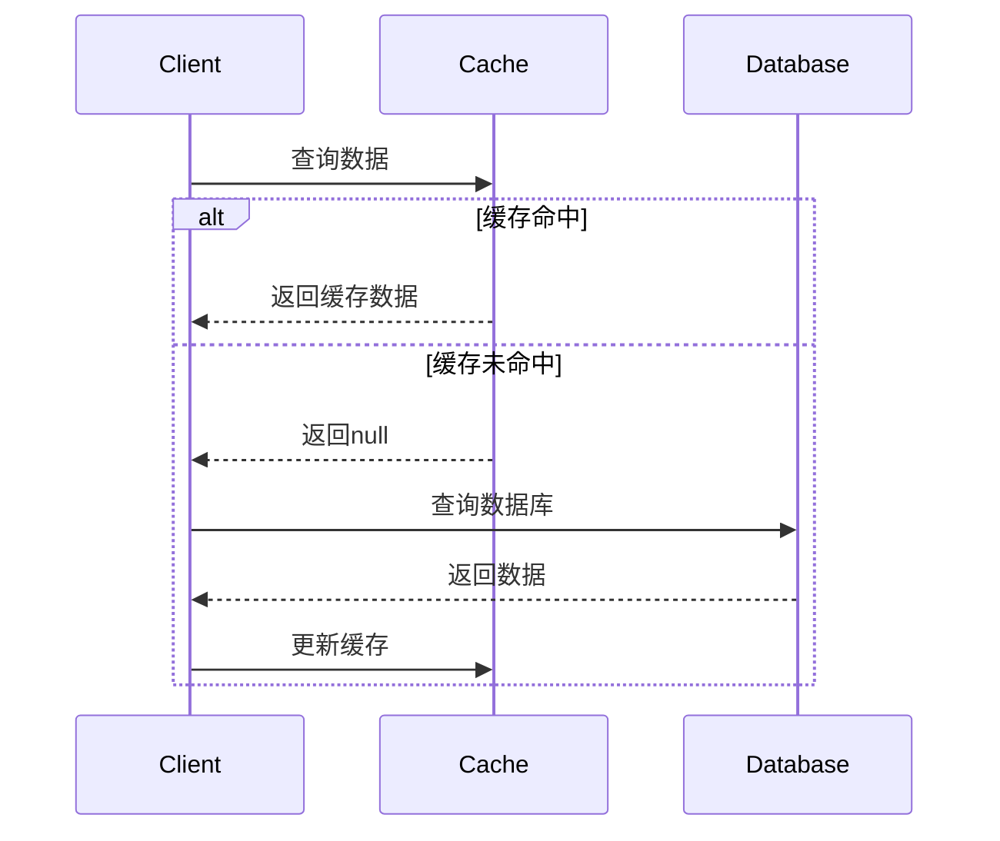
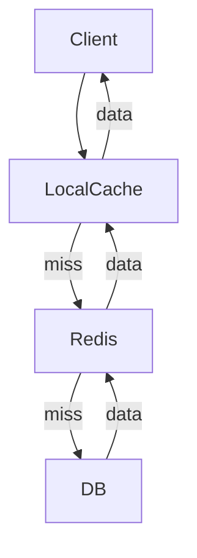
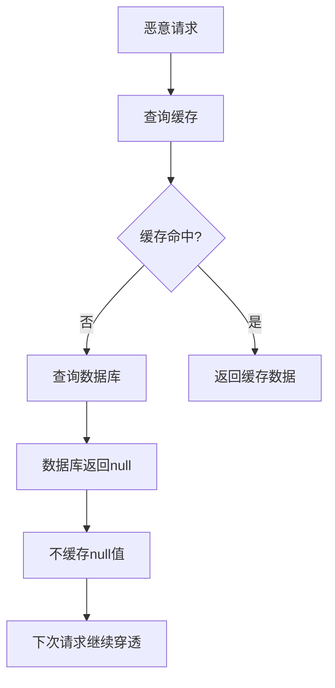
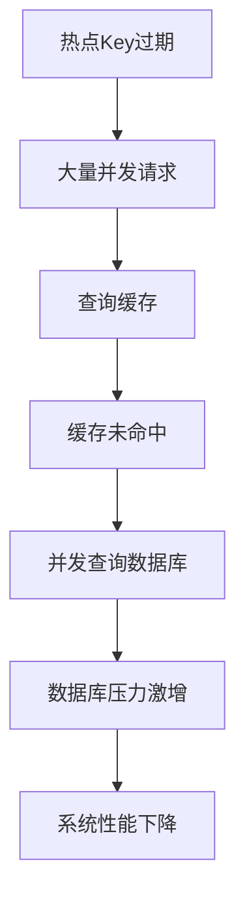
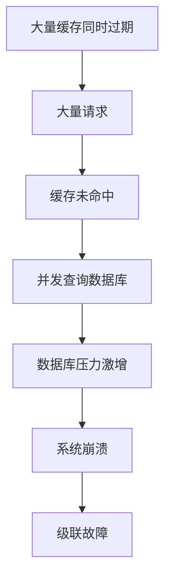

# 分布式缓存架构详解

分布式缓存是现代互联网应用的核心组件，用于提升读性能、削峰填谷与降低后端压力。本章将详细介绍分布式缓存的架构设计、一致性策略、性能优化和最佳实践。

:::tip 缓存的价值
- **性能提升**：将热点数据存储在内存中，大幅提升访问速度
- **压力缓解**：减少对数据库的直接访问，降低数据库压力
- **成本优化**：通过缓存减少昂贵的数据库查询和计算
- **用户体验**：提升系统响应速度，改善用户体验
:::

## 1. 缓存架构设计

### 1.1 缓存分类

分布式缓存按照部署位置和访问方式可以分为以下几类：

#### 本地缓存（Local Cache）
- **特点**：进程内缓存，访问速度极快，容量有限
- **实现**：Guava Caches、Caffeine、Ehcache
- **适用场景**：高频访问的配置信息、计算结果

```java title="本地缓存示例"
public class LocalCacheExample {
    // 使用Caffeine构建高性能本地缓存
    private final Cache<String, User> userCache = Caffeine.newBuilder()
        .maximumSize(10_000)                    // 最大容量
        .expireAfterWrite(1, TimeUnit.HOURS)    // 写入后1小时过期
        .expireAfterAccess(30, TimeUnit.MINUTES) // 访问后30分钟过期
        .recordStats()                          // 记录统计信息
        .build();
    
    public User getUser(String userId) {
        return userCache.get(userId, key -> {
            // 缓存未命中时的加载逻辑
            return loadUserFromDatabase(key);
        });
    }
    
    private User loadUserFromDatabase(String userId) {
        // 从数据库加载用户信息
        return userRepository.findById(userId);
    }
}
```

#### 远程缓存（Remote Cache）
- **特点**：集中管理的分布式缓存，容量大，支持集群
- **实现**：Redis、Memcached、Hazelcast
- **适用场景**：跨服务共享数据、大规模数据缓存

```java title="Redis缓存示例"
@Service
public class RedisCacheService {
    @Autowired
    private RedisTemplate<String, Object> redisTemplate;
    
    public User getUser(String userId) {
        String key = "user:" + userId;
        
        // 先从缓存获取
        User user = (User) redisTemplate.opsForValue().get(key);
        if (user != null) {
            return user;
        }
        
        // 缓存未命中，从数据库加载
        user = userRepository.findById(userId);
        if (user != null) {
            // 设置缓存，过期时间30分钟
            redisTemplate.opsForValue().set(key, user, 30, TimeUnit.MINUTES);
        }
        
        return user;
    }
}
```

#### 多级缓存（Multi-Level Cache）
- **特点**：本地缓存 + 远程缓存的组合，形成缓存层次
- **优势**：结合本地缓存的快速访问和远程缓存的大容量
- **挑战**：缓存一致性的保证

```java title="多级缓存示例"
public class MultiLevelCache {
    private final Cache<String, Object> localCache;  // 本地缓存
    private final RedisTemplate<String, Object> redisCache; // 远程缓存
    
    public Object get(String key) {
        // 第一级：本地缓存
        Object value = localCache.getIfPresent(key);
        if (value != null) {
            return value;
        }
        
        // 第二级：远程缓存
        value = redisCache.opsForValue().get(key);
        if (value != null) {
            // 回填本地缓存
            localCache.put(key, value);
            return value;
        }
        
        // 第三级：数据库
        value = loadFromDatabase(key);
        if (value != null) {
            // 同时更新两级缓存
            redisCache.opsForValue().set(key, value, 30, TimeUnit.MINUTES);
            localCache.put(key, value);
        }
        
        return value;
    }
}
```

### 1.2 缓存读写模式

#### Cache-Aside模式（旁路缓存）
- **原理**：应用程序直接管理缓存，先查缓存，未命中则查数据库
- **优点**：实现简单，缓存策略灵活
- **缺点**：需要手动管理缓存一致性



```java title="Cache-Aside模式示例"
@Service
public class CacheAsideService {
    
    public User getUser(String userId) {
        // 1. 先查缓存
        String cacheKey = "user:" + userId;
        User user = (User) redisTemplate.opsForValue().get(cacheKey);
        
        if (user != null) {
            return user;
        }
        
        // 2. 缓存未命中，查数据库
        user = userRepository.findById(userId);
        
        if (user != null) {
            // 3. 更新缓存
            redisTemplate.opsForValue().set(cacheKey, user, 30, TimeUnit.MINUTES);
        }
        
        return user;
    }
    
    public void updateUser(User user) {
        // 1. 更新数据库
        userRepository.save(user);
        
        // 2. 删除缓存（Cache-Aside的写策略）
        String cacheKey = "user:" + user.getId();
        redisTemplate.delete(cacheKey);
    }
}
```

#### Read/Write-Through模式（读写穿透）
- **原理**：缓存作为数据库的代理，所有读写都经过缓存
- **优点**：缓存一致性容易保证
- **缺点**：增加了系统复杂性

```java title="Read/Write-Through模式示例"
@Service
public class WriteThroughService {
    
    public User getUser(String userId) {
        // 直接通过缓存读取，缓存负责与数据库交互
        return cacheManager.getUser(userId);
    }
    
    public void updateUser(User user) {
        // 直接写入缓存，缓存负责同步到数据库
        cacheManager.updateUser(user);
    }
}
```

#### Write-Behind模式（异步写入）
- **原理**：写操作先更新缓存，然后异步批量写入数据库
- **优点**：写入性能高，减少数据库压力
- **缺点**：数据可能丢失，一致性较弱

```java title="Write-Behind模式示例"
@Service
public class WriteBehindService {
    private final Queue<WriteOperation> writeQueue = new ConcurrentLinkedQueue<>();
    
    public void updateUser(User user) {
        // 1. 立即更新缓存
        String cacheKey = "user:" + user.getId();
        redisTemplate.opsForValue().set(cacheKey, user);
        
        // 2. 异步写入数据库
        writeQueue.offer(new WriteOperation(user));
    }
    
    @Scheduled(fixedRate = 5000) // 每5秒批量写入
    public void batchWrite() {
        List<WriteOperation> operations = new ArrayList<>();
        WriteOperation op;
        
        // 收集待写入的操作
        while ((op = writeQueue.poll()) != null) {
            operations.add(op);
        }
        
        // 批量写入数据库
        if (!operations.isEmpty()) {
            userRepository.saveAll(operations.stream()
                .map(WriteOperation::getUser)
                .collect(Collectors.toList()));
        }
    }
}
```



## 2. 缓存策略与优化

### 2.1 缓存键设计

良好的缓存键设计是缓存系统成功的关键因素之一。

#### 键命名规范
- **层级结构**：使用冒号分隔，形成层级关系
- **业务标识**：包含业务模块、实体类型、ID等信息
- **版本控制**：支持缓存版本升级和批量失效

```java title="缓存键设计示例"
public class CacheKeyGenerator {
    
    // 用户信息缓存键
    public static String userKey(String userId) {
        return String.format("user:info:%s", userId);
    }
    
    // 用户权限缓存键
    public static String userPermissionKey(String userId) {
        return String.format("user:permission:%s", userId);
    }
    
    // 商品详情缓存键
    public static String productKey(String productId) {
        return String.format("product:detail:%s", productId);
    }
    
    // 商品列表缓存键（支持分页）
    public static String productListKey(int page, int size, String category) {
        return String.format("product:list:%s:%d:%d", category, page, size);
    }
    
    // 带版本的缓存键
    public static String versionedKey(String baseKey, String version) {
        return String.format("%s:v%s", baseKey, version);
    }
}
```

#### 键长度优化
```java title="键长度优化示例"
public class CompactCacheKeyGenerator {
    
    // 使用短前缀
    private static final String USER_PREFIX = "u";
    private static final String PRODUCT_PREFIX = "p";
    private static final String ORDER_PREFIX = "o";
    
    // 压缩的键格式
    public static String compactUserKey(String userId) {
        return String.format("%s:%s", USER_PREFIX, userId);
    }
    
    public static String compactProductKey(String productId) {
        return String.format("%s:%s", PRODUCT_PREFIX, productId);
    }
    
    // 使用哈希值减少键长度
    public static String hashedKey(String originalKey) {
        return String.valueOf(originalKey.hashCode());
    }
}
```

### 2.2 过期策略

#### TTL（Time To Live）策略
- **固定TTL**：所有缓存项使用相同的过期时间
- **动态TTL**：根据数据特性设置不同的过期时间
- **随机抖动**：避免缓存雪崩，错峰过期

```java title="TTL策略示例"
public class TTLStrategy {
    
    // 固定TTL
    public static final Duration DEFAULT_TTL = Duration.ofMinutes(30);
    
    // 动态TTL策略
    public static Duration getTTL(String key, Object value) {
        if (key.startsWith("user:")) {
            return Duration.ofHours(1);  // 用户信息1小时
        } else if (key.startsWith("product:")) {
            return Duration.ofMinutes(10); // 商品信息10分钟
        } else if (key.startsWith("config:")) {
            return Duration.ofDays(1);   // 配置信息1天
        }
        return DEFAULT_TTL;
    }
    
    // 随机抖动TTL
    public static Duration getRandomizedTTL(Duration baseTTL) {
        long baseSeconds = baseTTL.getSeconds();
        long randomOffset = (long) (baseSeconds * 0.1 * Math.random()); // 10%随机偏移
        return Duration.ofSeconds(baseSeconds + randomOffset);
    }
    
    // 基于访问频率的TTL
    public static Duration getFrequencyBasedTTL(int accessCount) {
        if (accessCount > 1000) {
            return Duration.ofHours(2);  // 高频访问，延长TTL
        } else if (accessCount > 100) {
            return Duration.ofMinutes(30); // 中频访问，标准TTL
        } else {
            return Duration.ofMinutes(5);  // 低频访问，短TTL
        }
    }
}
```

### 2.3 热点保护策略

#### 互斥锁保护
防止缓存击穿，确保同一时间只有一个线程重建缓存。

```java title="互斥锁保护示例"
@Service
public class MutexCacheService {
    private final Map<String, ReentrantLock> locks = new ConcurrentHashMap<>();
    
    public User getUser(String userId) {
        String cacheKey = "user:" + userId;
        
        // 先查缓存
        User user = (User) redisTemplate.opsForValue().get(cacheKey);
        if (user != null) {
            return user;
        }
        
        // 获取该key的互斥锁
        ReentrantLock lock = locks.computeIfAbsent(cacheKey, k -> new ReentrantLock());
        
        try {
            lock.lock();
            
            // 双重检查，防止在获取锁期间其他线程已经重建了缓存
            user = (User) redisTemplate.opsForValue().get(cacheKey);
            if (user != null) {
                return user;
            }
            
            // 重建缓存
            user = userRepository.findById(userId);
            if (user != null) {
                redisTemplate.opsForValue().set(cacheKey, user, 30, TimeUnit.MINUTES);
            }
            
            return user;
        } finally {
            lock.unlock();
        }
    }
}
```

#### SingleFlight模式
使用SingleFlight模式，确保同一时间只有一个请求重建缓存，其他请求等待结果。

```java title="SingleFlight模式示例"
@Service
public class SingleFlightCacheService {
    private final Map<String, CompletableFuture<User>> flightMap = new ConcurrentHashMap<>();
    
    public User getUser(String userId) {
        String cacheKey = "user:" + userId;
        
        // 先查缓存
        User user = (User) redisTemplate.opsForValue().get(cacheKey);
        if (user != null) {
            return user;
        }
        
        // 检查是否已有重建任务在进行
        CompletableFuture<User> future = flightMap.get(cacheKey);
        if (future != null) {
            try {
                return future.get(5, TimeUnit.SECONDS); // 等待结果
            } catch (Exception e) {
                // 超时或异常，移除future并重新尝试
                flightMap.remove(cacheKey);
            }
        }
        
        // 创建新的重建任务
        future = CompletableFuture.supplyAsync(() -> {
            try {
                User loadedUser = userRepository.findById(userId);
                if (loadedUser != null) {
                    redisTemplate.opsForValue().set(cacheKey, loadedUser, 30, TimeUnit.MINUTES);
                }
                return loadedUser;
            } finally {
                // 任务完成后移除future
                flightMap.remove(cacheKey);
            }
        });
        
        flightMap.put(cacheKey, future);
        
        try {
            return future.get(5, TimeUnit.SECONDS);
        } catch (Exception e) {
            flightMap.remove(cacheKey);
            throw new RuntimeException("Failed to load user", e);
        }
    }
}
```

### 2.4 缓存一致性策略

#### 失效策略（Cache-Aside）
写操作时删除缓存，读操作时重建缓存。

```java title="失效策略示例"
@Service
public class InvalidationStrategy {
    
    public void updateUser(User user) {
        // 1. 更新数据库
        userRepository.save(user);
        
        // 2. 删除缓存
        String cacheKey = "user:" + user.getId();
        redisTemplate.delete(cacheKey);
        
        // 3. 可选：延迟双删，避免并发问题
        scheduleDelayedDelete(cacheKey, 100); // 100ms后再次删除
    }
    
    private void scheduleDelayedDelete(String key, long delayMs) {
        CompletableFuture.runAsync(() -> {
            try {
                Thread.sleep(delayMs);
                redisTemplate.delete(key);
            } catch (InterruptedException e) {
                Thread.currentThread().interrupt();
            }
        });
    }
}
```

#### 更新策略
写操作时同时更新缓存和数据库。

```java title="更新策略示例"
@Service
public class UpdateStrategy {
    
    @Transactional
    public void updateUser(User user) {
        // 1. 更新数据库
        userRepository.save(user);
        
        // 2. 更新缓存
        String cacheKey = "user:" + user.getId();
        redisTemplate.opsForValue().set(cacheKey, user, 30, TimeUnit.MINUTES);
    }
    
    // 使用分布式锁保证更新原子性
    public void updateUserWithLock(User user) {
        String lockKey = "lock:user:" + user.getId();
        String cacheKey = "user:" + user.getId();
        
        try {
            // 获取分布式锁
            if (acquireLock(lockKey, 10, TimeUnit.SECONDS)) {
                // 更新数据库
                userRepository.save(user);
                
                // 更新缓存
                redisTemplate.opsForValue().set(cacheKey, user, 30, TimeUnit.MINUTES);
            }
        } finally {
            // 释放锁
            releaseLock(lockKey);
        }
    }
}
```

```yaml
# Redis淘汰策略（redis.conf）
maxmemory 1gb
maxmemory-policy allkeys-lru
```

## 缓存一致性

- 最终一致：写库后删缓存（或更新缓存），允许短暂不一致
- 强一致：写入链路串行化（先删后写 + 同步更新），成本高
- 订阅通知：通过发布订阅/流通知各副本失效

双删示例：

```java
public void updateThenEvict(User user) {
    // 先更新DB
    userRepository.save(user);
    // 删缓存
    redisTemplate.delete("user:" + user.getId());
    // 延迟双删，避免并发读写穿透旧值
    java.util.concurrent.CompletableFuture.runAsync(() -> {
        try { Thread.sleep(300); } catch (InterruptedException ignored) {}
        redisTemplate.delete("user:" + user.getId());
    });
}
```

## 3. 缓存问题与解决方案

### 3.1 缓存穿透（Cache Penetration）

缓存穿透是指查询一个不存在的数据，由于缓存中没有，每次请求都会打到数据库。

#### 问题分析


#### 解决方案

**1. 布隆过滤器**
```java title="布隆过滤器解决方案"
@Service
public class BloomFilterCacheService {
    private final BloomFilter<String> bloomFilter;
    private final RedisTemplate<String, Object> redisTemplate;
    
    public BloomFilterCacheService() {
        // 创建布隆过滤器，预期元素数量100万，误判率0.01
        this.bloomFilter = BloomFilter.create(
            Funnels.stringFunnel(Charset.defaultCharset()), 
            1_000_000, 
            0.01
        );
    }
    
    public User getUser(String userId) {
        // 1. 布隆过滤器检查
        if (!bloomFilter.mightContain(userId)) {
            return null; // 肯定不存在
        }
        
        // 2. 查询缓存
        String cacheKey = "user:" + userId;
        User user = (User) redisTemplate.opsForValue().get(cacheKey);
        if (user != null) {
            return user;
        }
        
        // 3. 查询数据库
        user = userRepository.findById(userId);
        
        if (user != null) {
            // 4. 更新缓存和布隆过滤器
            redisTemplate.opsForValue().set(cacheKey, user, 30, TimeUnit.MINUTES);
            bloomFilter.put(userId);
        } else {
            // 5. 缓存空值，防止穿透
            redisTemplate.opsForValue().set(cacheKey, null, 5, TimeUnit.MINUTES);
        }
        
        return user;
    }
}
```

**2. 缓存空值**
```java title="缓存空值解决方案"
@Service
public class NullValueCacheService {
    
    public User getUser(String userId) {
        String cacheKey = "user:" + userId;
        
        // 查询缓存
        Object cached = redisTemplate.opsForValue().get(cacheKey);
        if (cached != null) {
            // 检查是否是空值标记
            if (cached instanceof NullValue) {
                return null;
            }
            return (User) cached;
        }
        
        // 查询数据库
        User user = userRepository.findById(userId);
        
        if (user != null) {
            // 缓存用户数据
            redisTemplate.opsForValue().set(cacheKey, user, 30, TimeUnit.MINUTES);
        } else {
            // 缓存空值标记，短TTL
            redisTemplate.opsForValue().set(cacheKey, new NullValue(), 5, TimeUnit.MINUTES);
        }
        
        return user;
    }
    
    // 空值标记类
    private static class NullValue {
        // 用于标识空值的标记类
    }
}
```

### 3.2 缓存击穿（Cache Breakdown）

缓存击穿是指热点key在缓存过期的一瞬间，大量并发请求直接打到数据库。

#### 问题分析


#### 解决方案

**1. 互斥锁保护**
```java title="互斥锁解决方案"
@Service
public class MutexLockCacheService {
    private final Map<String, ReentrantLock> locks = new ConcurrentHashMap<>();
    
    public User getHotUser(String userId) {
        String cacheKey = "user:" + userId;
        
        // 先查缓存
        User user = (User) redisTemplate.opsForValue().get(cacheKey);
        if (user != null) {
            return user;
        }
        
        // 获取该key的互斥锁
        ReentrantLock lock = locks.computeIfAbsent(cacheKey, k -> new ReentrantLock());
        
        try {
            // 尝试获取锁，设置超时时间
            if (lock.tryLock(3, TimeUnit.SECONDS)) {
                try {
                    // 双重检查
                    user = (User) redisTemplate.opsForValue().get(cacheKey);
                    if (user != null) {
                        return user;
                    }
                    
                    // 重建缓存
                    user = userRepository.findById(userId);
                    if (user != null) {
                        redisTemplate.opsForValue().set(cacheKey, user, 30, TimeUnit.MINUTES);
                    }
                    
                    return user;
                } finally {
                    lock.unlock();
                }
            } else {
                // 获取锁失败，等待一段时间后重试
                Thread.sleep(100);
                return getHotUser(userId);
            }
        } catch (InterruptedException e) {
            Thread.currentThread().interrupt();
            throw new RuntimeException("Interrupted while waiting for lock", e);
        }
    }
}
```

**2. 逻辑永不过期**
```java title="逻辑永不过期解决方案"
@Service
public class LogicalExpirationCacheService {
    
    public User getHotUser(String userId) {
        String cacheKey = "user:" + userId;
        
        // 查询缓存
        CacheEntry<User> entry = (CacheEntry<User>) redisTemplate.opsForValue().get(cacheKey);
        
        if (entry != null && !entry.isExpired()) {
            return entry.getData();
        }
        
        // 缓存过期或不存在，异步重建
        if (entry == null || entry.isExpired()) {
            CompletableFuture.runAsync(() -> {
                try {
                    User user = userRepository.findById(userId);
                    if (user != null) {
                        // 设置逻辑过期时间
                        CacheEntry<User> newEntry = new CacheEntry<>(user, 
                            System.currentTimeMillis() + 30 * 60 * 1000); // 30分钟后逻辑过期
                        redisTemplate.opsForValue().set(cacheKey, newEntry);
                    }
                } catch (Exception e) {
                    log.error("Failed to rebuild cache for user: " + userId, e);
                }
            });
        }
        
        // 返回旧数据（如果存在）
        return entry != null ? entry.getData() : null;
    }
    
    // 缓存条目类
    private static class CacheEntry<T> {
        private final T data;
        private final long expireTime;
        
        public CacheEntry(T data, long expireTime) {
            this.data = data;
            this.expireTime = expireTime;
        }
        
        public T getData() { return data; }
        public boolean isExpired() { return System.currentTimeMillis() > expireTime; }
    }
}
```

### 3.3 缓存雪崩（Cache Avalanche）

缓存雪崩是指大量缓存同时过期，导致大量请求直接打到数据库。

#### 问题分析


#### 解决方案

**1. TTL随机抖动**
```java title="TTL随机抖动解决方案"
public class RandomTTLStrategy {
    
    public static Duration getRandomizedTTL(Duration baseTTL) {
        long baseSeconds = baseTTL.getSeconds();
        // 在基础TTL基础上增加随机偏移，避免同时过期
        long randomOffset = (long) (baseSeconds * 0.2 * Math.random()); // 20%随机偏移
        return Duration.ofSeconds(baseSeconds + randomOffset);
    }
    
    public void setCacheWithRandomTTL(String key, Object value) {
        Duration ttl = getRandomizedTTL(Duration.ofMinutes(30));
        redisTemplate.opsForValue().set(key, value, ttl);
    }
}
```

**2. 缓存预热**
```java title="缓存预热解决方案"
@Service
public class CacheWarmupService {
    
    @PostConstruct
    public void warmupCache() {
        // 系统启动时预热热点数据
        List<String> hotUserIds = getHotUserIds();
        
        for (String userId : hotUserIds) {
            CompletableFuture.runAsync(() -> {
                try {
                    User user = userRepository.findById(userId);
                    if (user != null) {
                        String cacheKey = "user:" + userId;
                        Duration ttl = getRandomizedTTL(Duration.ofMinutes(30));
                        redisTemplate.opsForValue().set(cacheKey, user, ttl);
                    }
                } catch (Exception e) {
                    log.error("Failed to warmup cache for user: " + userId, e);
                }
            });
        }
    }
    
    private List<String> getHotUserIds() {
        // 获取热点用户ID列表
        return Arrays.asList("user1", "user2", "user3", "user4", "user5");
    }
}
```

**3. 熔断降级**
```java title="熔断降级解决方案"
@Service
public class CircuitBreakerCacheService {
    private final CircuitBreaker circuitBreaker;
    
    public CircuitBreakerCacheService() {
        this.circuitBreaker = CircuitBreaker.builder()
            .failureRateThreshold(50) // 失败率阈值50%
            .waitDurationInOpenState(Duration.ofSeconds(10)) // 熔断时间10秒
            .ringBufferSizeInHalfOpenState(2) // 半开状态下的请求数
            .ringBufferSizeInClosedState(10) // 关闭状态下的请求数
            .build();
    }
    
    public User getUser(String userId) {
        return circuitBreaker.executeSupplier(() -> {
            String cacheKey = "user:" + userId;
            
            // 先查缓存
            User user = (User) redisTemplate.opsForValue().get(cacheKey);
            if (user != null) {
                return user;
            }
            
            // 缓存未命中，查询数据库
            user = userRepository.findById(userId);
            if (user != null) {
                redisTemplate.opsForValue().set(cacheKey, user, 30, TimeUnit.MINUTES);
            }
            
            return user;
        });
    }
}
```

逻辑永不过期：

```java
class CacheEntry`<T>` { T data; long expireAt; }
public CacheEntry`<User>` getUser(long id) {
    CacheEntry`<User>` entry = localCache.get(id);
    if (entry != null && System.currentTimeMillis() < entry.expireAt) {
        return entry; // 命中新鲜数据
    }
    // 过期则触发后台刷新，但继续返回旧值（若存在）
    backgroundRefresh(id);
    return entry; // 旧值容忍
}
```

## 4. 缓存监控与运维

### 4.1 关键监控指标

#### 性能指标
- **命中率（Hit Rate）**：缓存命中次数 / 总请求次数
- **平均延迟（Average Latency）**：缓存操作的平均响应时间
- **P99延迟**：99%请求的响应时间
- **失败率（Error Rate）**：缓存操作失败的比例

#### 容量指标
- **内存使用率**：缓存占用的内存比例
- **连接数**：当前活跃的客户端连接数
- **带宽使用**：网络传输的数据量

#### 业务指标
- **热点Key排行**：访问频率最高的缓存键
- **慢查询**：响应时间超过阈值的查询
- **大Key**：占用内存较大的缓存项

```java title="缓存监控示例"
@Service
public class CacheMonitorService {
    
    @EventListener
    public void onCacheEvent(CacheEvent event) {
        // 记录缓存事件
        recordCacheEvent(event);
        
        // 更新监控指标
        updateMetrics(event);
    }
    
    private void recordCacheEvent(CacheEvent event) {
        // 记录缓存命中/未命中
        if (event.getType() == CacheEventType.HIT) {
            hitCounter.increment();
        } else if (event.getType() == CacheEventType.MISS) {
            missCounter.increment();
        }
        
        // 记录响应时间
        latencyHistogram.record(event.getLatency());
    }
    
    private void updateMetrics(CacheEvent event) {
        // 更新热点Key统计
        hotKeyCounter.increment(event.getKey());
        
        // 检查大Key
        if (event.getValueSize() > 1024 * 1024) { // 1MB
            bigKeyAlert.alert(event.getKey(), event.getValueSize());
        }
    }
    
    // 获取缓存命中率
    public double getHitRate() {
        long hits = hitCounter.get();
        long misses = missCounter.get();
        long total = hits + misses;
        return total > 0 ? (double) hits / total : 0.0;
    }
    
    // 获取P99延迟
    public long getP99Latency() {
        return latencyHistogram.getSnapshot().get99thPercentile();
    }
}
```

### 4.2 告警策略

```java title="缓存告警示例"
@Component
public class CacheAlertService {
    
    @Scheduled(fixedRate = 60000) // 每分钟检查一次
    public void checkCacheHealth() {
        // 检查命中率
        double hitRate = cacheMonitorService.getHitRate();
        if (hitRate < 0.8) { // 命中率低于80%
            alertService.sendAlert("Cache hit rate is low: " + hitRate);
        }
        
        // 检查延迟
        long p99Latency = cacheMonitorService.getP99Latency();
        if (p99Latency > 100) { // P99延迟超过100ms
            alertService.sendAlert("Cache P99 latency is high: " + p99Latency + "ms");
        }
        
        // 检查内存使用率
        double memoryUsage = cacheMonitorService.getMemoryUsage();
        if (memoryUsage > 0.9) { // 内存使用率超过90%
            alertService.sendAlert("Cache memory usage is high: " + memoryUsage);
        }
    }
}
```

### 4.3 运维最佳实践

#### 容量规划
```java title="容量规划示例"
public class CapacityPlanningService {
    
    public CacheConfig calculateOptimalConfig(int expectedQPS, int dataSize) {
        // 根据预期QPS和数据大小计算最优配置
        int optimalConnections = Math.max(10, expectedQPS / 1000);
        long optimalMemory = dataSize * 2; // 预留2倍空间
        
        return CacheConfig.builder()
            .maxConnections(optimalConnections)
            .maxMemory(optimalMemory)
            .build();
    }
    
    public void scaleCache(int currentQPS, int targetQPS) {
        // 根据QPS变化自动扩缩容
        if (targetQPS > currentQPS * 1.5) {
            // 扩容
            scaleUp();
        } else if (targetQPS < currentQPS * 0.5) {
            // 缩容
            scaleDown();
        }
    }
}
```

## 5. 分布式缓存面试题精选

### 5.1 基础概念

#### Q1: 什么是分布式缓存？它的主要作用是什么？

**答**: 分布式缓存是一种将数据存储在多个节点上的缓存系统，用于提升系统性能和可扩展性。

**主要作用**:
- **性能提升**：将热点数据存储在内存中，大幅提升访问速度
- **压力缓解**：减少对数据库的直接访问，降低数据库压力
- **高可用性**：通过多节点部署提高系统可用性
- **水平扩展**：支持动态添加节点来提升容量和性能

#### Q2: 本地缓存和分布式缓存的区别是什么？

**答**: 
| 特性 | 本地缓存 | 分布式缓存 |
|------|----------|------------|
| **部署位置** | 应用进程内 | 独立服务器 |
| **访问速度** | 极快（内存访问） | 较快（网络访问） |
| **容量** | 有限（受JVM内存限制） | 大（可扩展） |
| **一致性** | 难以保证 | 相对容易保证 |
| **适用场景** | 高频访问的配置信息 | 跨服务共享数据 |

### 5.2 缓存策略

#### Q3: Cache-Aside、Write-Through、Write-Behind三种缓存模式的区别是什么？

**答**:
1. **Cache-Aside（旁路缓存）**：
   - 应用程序直接管理缓存
   - 读：先查缓存，未命中则查数据库并更新缓存
   - 写：先更新数据库，再删除缓存
   - 优点：实现简单，缓存策略灵活
   - 缺点：需要手动管理缓存一致性

2. **Write-Through（读写穿透）**：
   - 缓存作为数据库的代理
   - 所有读写都经过缓存
   - 优点：缓存一致性容易保证
   - 缺点：增加了系统复杂性

3. **Write-Behind（异步写入）**：
   - 写操作先更新缓存，然后异步批量写入数据库
   - 优点：写入性能高，减少数据库压力
   - 缺点：数据可能丢失，一致性较弱

#### Q4: 如何解决缓存穿透问题？

**答**: 缓存穿透是指查询不存在的数据，每次请求都打到数据库。

**解决方案**:
1. **布隆过滤器**：快速判断数据是否存在，避免无效查询
2. **缓存空值**：将空结果也缓存，设置较短的TTL
3. **参数校验**：在应用层进行参数校验，过滤无效请求
4. **限流措施**：对异常请求进行限流

```java title="布隆过滤器解决方案"
public User getUser(String userId) {
    // 1. 布隆过滤器检查
    if (!bloomFilter.mightContain(userId)) {
        return null; // 肯定不存在
    }
    
    // 2. 查询缓存
    User user = (User) redisTemplate.opsForValue().get("user:" + userId);
    if (user != null) {
        return user;
    }
    
    // 3. 查询数据库
    user = userRepository.findById(userId);
    if (user != null) {
        redisTemplate.opsForValue().set("user:" + userId, user, 30, TimeUnit.MINUTES);
    } else {
        // 缓存空值，防止穿透
        redisTemplate.opsForValue().set("user:" + userId, null, 5, TimeUnit.MINUTES);
    }
    
    return user;
}
```

### 5.3 缓存问题

#### Q5: 如何解决缓存击穿问题？

**答**: 缓存击穿是指热点key在缓存过期的一瞬间，大量并发请求直接打到数据库。

**解决方案**:
1. **互斥锁**：确保同一时间只有一个线程重建缓存
2. **SingleFlight模式**：确保同一时间只有一个请求重建缓存，其他请求等待结果
3. **逻辑永不过期**：设置逻辑过期时间，异步重建缓存
4. **预热机制**：在缓存过期前主动重建缓存

```java title="互斥锁解决方案"
public User getHotUser(String userId) {
    String cacheKey = "user:" + userId;
    
    // 先查缓存
    User user = (User) redisTemplate.opsForValue().get(cacheKey);
    if (user != null) {
        return user;
    }
    
    // 获取该key的互斥锁
    ReentrantLock lock = locks.computeIfAbsent(cacheKey, k -> new ReentrantLock());
    
    try {
        lock.lock();
        
        // 双重检查
        user = (User) redisTemplate.opsForValue().get(cacheKey);
        if (user != null) {
            return user;
        }
        
        // 重建缓存
        user = userRepository.findById(userId);
        if (user != null) {
            redisTemplate.opsForValue().set(cacheKey, user, 30, TimeUnit.MINUTES);
        }
        
        return user;
    } finally {
        lock.unlock();
    }
}
```

#### Q6: 如何解决缓存雪崩问题？

**答**: 缓存雪崩是指大量缓存同时过期，导致大量请求直接打到数据库。

**解决方案**:
1. **TTL随机抖动**：在基础TTL基础上增加随机偏移，避免同时过期
2. **缓存预热**：系统启动时主动加载热点数据到缓存
3. **熔断降级**：当数据库压力过大时，启用熔断机制
4. **多级缓存**：使用本地缓存作为最后一道防线

```java title="TTL随机抖动解决方案"
public static Duration getRandomizedTTL(Duration baseTTL) {
    long baseSeconds = baseTTL.getSeconds();
    // 在基础TTL基础上增加随机偏移，避免同时过期
    long randomOffset = (long) (baseSeconds * 0.2 * Math.random()); // 20%随机偏移
    return Duration.ofSeconds(baseSeconds + randomOffset);
}
```

### 5.4 高级问题

#### Q7: 双删策略为什么要延迟？延迟多长时间合适？

**答**: 双删策略是为了解决缓存一致性问题，延迟删除是为了避免并发问题。

**原因**:
1. **并发问题**：在删除缓存和更新数据库之间，可能有其他线程读取到旧数据并更新缓存
2. **时序问题**：延迟删除可以确保在并发操作完成后再次清理缓存

**延迟时间**：
- 一般设置为100-500ms
- 需要根据业务场景和系统负载调整
- 可以通过监控和测试确定最优值

```java title="延迟双删示例"
public void updateUser(User user) {
    // 1. 更新数据库
    userRepository.save(user);
    
    // 2. 删除缓存
    String cacheKey = "user:" + user.getId();
    redisTemplate.delete(cacheKey);
    
    // 3. 延迟双删，避免并发问题
    scheduleDelayedDelete(cacheKey, 100); // 100ms后再次删除
}

private void scheduleDelayedDelete(String key, long delayMs) {
    CompletableFuture.runAsync(() -> {
        try {
            Thread.sleep(delayMs);
            redisTemplate.delete(key);
        } catch (InterruptedException e) {
            Thread.currentThread().interrupt();
        }
    });
}
```

#### Q8: 多级缓存一致性如何保证？

**答**: 多级缓存一致性是一个复杂的问题，需要综合考虑性能和一致性。

**解决方案**:
1. **失效策略**：写操作时同时失效所有级别的缓存
2. **版本控制**：使用版本号控制缓存更新
3. **订阅通知**：通过消息队列通知各节点更新缓存
4. **最终一致性**：接受短暂不一致，通过TTL保证最终一致性

```java title="多级缓存一致性示例"
@Service
public class MultiLevelCacheService {
    private final Cache<String, Object> localCache;
    private final RedisTemplate<String, Object> redisCache;
    
    public void updateUser(User user) {
        // 1. 更新数据库
        userRepository.save(user);
        
        // 2. 同时失效两级缓存
        String cacheKey = "user:" + user.getId();
        localCache.invalidate(cacheKey);
        redisCache.delete(cacheKey);
        
        // 3. 发送消息通知其他节点
        messagePublisher.publish("cache:invalidate", cacheKey);
    }
    
    @EventListener
    public void onCacheInvalidate(String cacheKey) {
        // 收到失效消息时，清理本地缓存
        localCache.invalidate(cacheKey);
    }
}
```

#### Q9: 如何识别与治理热点Key？

**答**: 热点Key是指访问频率异常高的缓存键，需要特殊处理。

**识别方法**:
1. **监控统计**：通过监控系统统计Key的访问频率
2. **实时告警**：设置阈值，当Key访问频率超过阈值时告警
3. **日志分析**：分析访问日志，识别热点Key

**治理策略**:
1. **本地缓存**：将热点Key缓存到本地，减少网络开销
2. **分片策略**：将热点Key分散到多个节点
3. **预加载**：主动预加载热点数据
4. **降级策略**：当热点Key压力过大时，启用降级策略

```java title="热点Key治理示例"
@Service
public class HotKeyService {
    
    @Scheduled(fixedRate = 60000) // 每分钟检查一次
    public void detectHotKeys() {
        Map<String, Long> keyAccessCount = getKeyAccessCount();
        
        for (Map.Entry<String, Long> entry : keyAccessCount.entrySet()) {
            if (entry.getValue() > 1000) { // 访问次数超过1000
                String hotKey = entry.getKey();
                handleHotKey(hotKey);
            }
        }
    }
    
    private void handleHotKey(String hotKey) {
        // 1. 预加载到本地缓存
        Object value = redisTemplate.opsForValue().get(hotKey);
        if (value != null) {
            localCache.put(hotKey, value);
        }
        
        // 2. 发送告警
        alertService.sendAlert("Hot key detected: " + hotKey);
        
        // 3. 记录日志
        log.warn("Hot key detected: {} with access count: {}", hotKey, getAccessCount(hotKey));
    }
}
```

### 5.5 性能优化

#### Q10: 如何优化缓存性能？

**答**: 缓存性能优化需要从多个维度考虑。

**优化策略**:
1. **键设计优化**：
   - 使用短而清晰的键名
   - 避免过长的键名
   - 使用压缩算法减少键长度

2. **数据结构优化**：
   - 选择合适的Redis数据结构
   - 避免存储冗余数据
   - 使用序列化优化

3. **网络优化**：
   - 使用连接池
   - 批量操作减少网络往返
   - 使用Pipeline减少网络延迟

4. **内存优化**：
   - 合理设置TTL
   - 使用LRU等淘汰策略
   - 监控内存使用情况

```java title="性能优化示例"
@Service
public class OptimizedCacheService {
    
    // 使用连接池
    private final RedisTemplate<String, Object> redisTemplate;
    
    // 批量操作
    public Map<String, Object> batchGet(List<String> keys) {
        return redisTemplate.opsForValue().multiGet(keys);
    }
    
    // Pipeline操作
    public void batchSet(Map<String, Object> data) {
        redisTemplate.executePipelined((RedisCallback<Object>) connection -> {
            for (Map.Entry<String, Object> entry : data.entrySet()) {
                connection.set(
                    entry.getKey().getBytes(),
                    serialize(entry.getValue())
                );
            }
            return null;
        });
    }
    
    // 压缩键名
    public String compressKey(String originalKey) {
        return String.valueOf(originalKey.hashCode());
    }
}
```

## 6. 总结

分布式缓存是现代互联网应用的核心组件，通过合理的设计和优化，可以显著提升系统性能。在实际应用中，需要根据业务场景选择合适的缓存策略，并注意解决缓存穿透、击穿、雪崩等问题。

### 关键要点
1. **选择合适的缓存模式**：根据业务需求选择Cache-Aside、Write-Through或Write-Behind
2. **解决缓存问题**：使用布隆过滤器、互斥锁、TTL随机抖动等技术
3. **保证缓存一致性**：通过失效策略、版本控制等方式保证数据一致性
4. **监控和优化**：建立完善的监控体系，持续优化缓存性能

通过深入理解和熟练运用这些技术，我们能够构建出高性能、高可用的分布式缓存系统。
