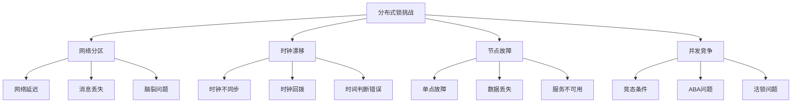
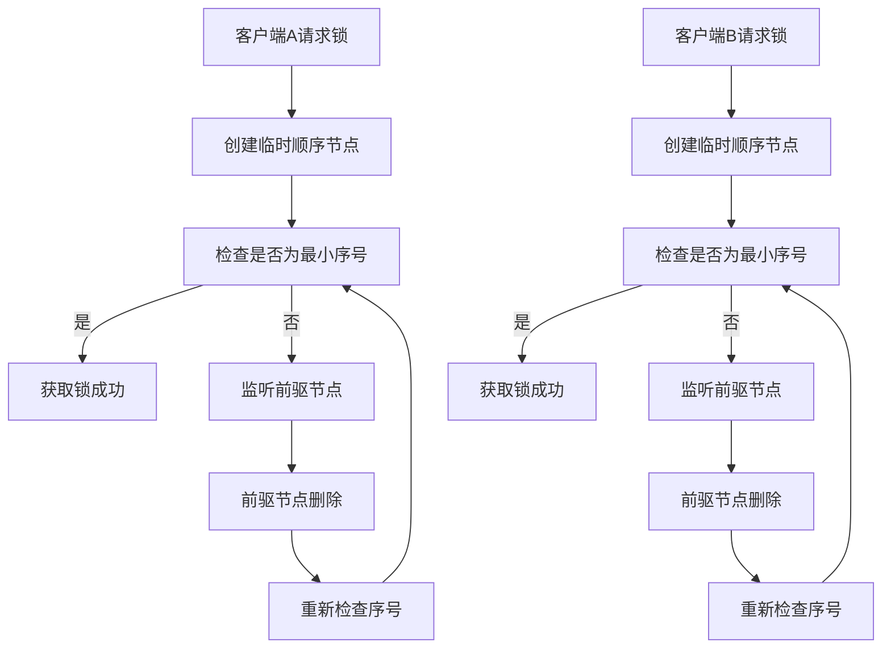

# 分布式锁实现方案详解

分布式锁是分布式系统中的核心组件，用于在分布式场景下实现临界资源的互斥访问。本章将详细介绍分布式锁的实现原理、技术方案和最佳实践。

:::tip 分布式锁的重要性
- **资源保护**：防止多个进程同时访问共享资源
- **数据一致性**：确保分布式环境下的数据操作原子性
- **业务安全**：避免重复处理、超卖等业务问题
- **系统稳定**：防止并发操作导致的系统异常
:::

## 1. 分布式锁的基本要求

### 1.1 核心特性

分布式锁需要满足以下基本要求：

| 特性 | 描述 | 重要性 |
|------|------|--------|
| **互斥性** | 同一时间只能有一个客户端持有锁 | 核心要求 |
| **防死锁** | 锁必须能够自动释放，避免死锁 | 系统稳定性 |
| **可重入性** | 同一客户端可以多次获取同一把锁 | 业务便利性 |
| **高性能** | 获取和释放锁的操作要快速 | 系统性能 |
| **高可用** | 锁服务本身要具备高可用性 | 系统可靠性 |

### 1.2 实现挑战



## 2. Redis分布式锁实现

### 2.1 基础实现

Redis分布式锁是最常用的分布式锁实现方案，具有高性能、易实现的特点。

#### 获取锁
```java title="Redis分布式锁基础实现"
@Service
public class RedisDistributedLock {
    
    private final RedisTemplate<String, String> redisTemplate;
    private final String lockKey;
    private final String lockValue;
    private final long expireTime;
    
    public RedisDistributedLock(RedisTemplate<String, String> redisTemplate, 
                               String lockKey, long expireTime) {
        this.redisTemplate = redisTemplate;
        this.lockKey = lockKey;
        this.lockValue = UUID.randomUUID().toString(); // 唯一标识
        this.expireTime = expireTime;
    }
    
    /**
     * 尝试获取锁
     * @param timeout 超时时间
     * @param unit 时间单位
     * @return 是否获取成功
     */
    public boolean tryLock(long timeout, TimeUnit unit) {
        long startTime = System.currentTimeMillis();
        long timeoutMillis = unit.toMillis(timeout);
        
        while (System.currentTimeMillis() - startTime < timeoutMillis) {
            // 使用SET NX EX命令原子性地设置锁
            Boolean success = redisTemplate.opsForValue()
                .setIfAbsent(lockKey, lockValue, expireTime, TimeUnit.MILLISECONDS);
            
            if (Boolean.TRUE.equals(success)) {
                return true; // 获取锁成功
            }
            
            // 获取锁失败，短暂等待后重试
            try {
                Thread.sleep(10);
            } catch (InterruptedException e) {
                Thread.currentThread().interrupt();
                return false;
            }
        }
        
        return false; // 超时未获取到锁
    }
    
    /**
     * 释放锁
     * @return 是否释放成功
     */
    public boolean releaseLock() {
        // 使用Lua脚本保证原子性
        String script = "if redis.call('get', KEYS[1]) == ARGV[1] then " +
                       "return redis.call('del', KEYS[1]) " +
                       "else return 0 end";
        
        Long result = redisTemplate.execute(
            new DefaultRedisScript<>(script, Long.class),
            Collections.singletonList(lockKey),
            lockValue
        );
        
        return Long.valueOf(1).equals(result);
    }
}
```

#### 使用示例
```java title="Redis分布式锁使用示例"
@Service
public class OrderService {
    
    private final RedisTemplate<String, String> redisTemplate;
    
    public void processOrder(String orderId) {
        String lockKey = "order:lock:" + orderId;
        RedisDistributedLock lock = new RedisDistributedLock(redisTemplate, lockKey, 30000);
        
        try {
            // 尝试获取锁，超时时间5秒
            if (lock.tryLock(5, TimeUnit.SECONDS)) {
                try {
                    // 执行业务逻辑
                    doProcessOrder(orderId);
                } finally {
                    // 释放锁
                    lock.releaseLock();
                }
            } else {
                throw new RuntimeException("Failed to acquire lock for order: " + orderId);
            }
        } catch (Exception e) {
            log.error("Error processing order: " + orderId, e);
            throw e;
        }
    }
    
    private void doProcessOrder(String orderId) {
        // 具体的订单处理逻辑
        log.info("Processing order: " + orderId);
        // ... 业务逻辑
    }
}
```

### 2.2 看门狗机制

为了防止业务执行时间超过锁的过期时间，需要实现看门狗机制自动续期。

```java title="Redis分布式锁看门狗实现"
@Service
public class RedisDistributedLockWithWatchdog {
    
    private final RedisTemplate<String, String> redisTemplate;
    private final String lockKey;
    private final String lockValue;
    private final long expireTime;
    private final ScheduledExecutorService scheduler;
    private volatile boolean isLocked = false;
    private volatile ScheduledFuture<?> renewalTask;
    
    public RedisDistributedLockWithWatchdog(RedisTemplate<String, String> redisTemplate, 
                                           String lockKey, long expireTime) {
        this.redisTemplate = redisTemplate;
        this.lockKey = lockKey;
        this.lockValue = UUID.randomUUID().toString();
        this.expireTime = expireTime;
        this.scheduler = Executors.newScheduledThreadPool(1);
    }
    
    /**
     * 尝试获取锁（带看门狗）
     */
    public boolean tryLock(long timeout, TimeUnit unit) {
        long startTime = System.currentTimeMillis();
        long timeoutMillis = unit.toMillis(timeout);
        
        while (System.currentTimeMillis() - startTime < timeoutMillis) {
            Boolean success = redisTemplate.opsForValue()
                .setIfAbsent(lockKey, lockValue, expireTime, TimeUnit.MILLISECONDS);
            
            if (Boolean.TRUE.equals(success)) {
                isLocked = true;
                // 启动看门狗任务
                startWatchdog();
                return true;
            }
            
            try {
                Thread.sleep(10);
            } catch (InterruptedException e) {
                Thread.currentThread().interrupt();
                return false;
            }
        }
        
        return false;
    }
    
    /**
     * 启动看门狗任务
     */
    private void startWatchdog() {
        // 在过期时间的1/3时开始续期
        long renewalInterval = expireTime / 3;
        
        renewalTask = scheduler.scheduleAtFixedRate(() -> {
            if (isLocked) {
                try {
                    // 检查锁是否仍然属于当前客户端
                    String currentValue = redisTemplate.opsForValue().get(lockKey);
                    if (lockValue.equals(currentValue)) {
                        // 续期锁
                        redisTemplate.expire(lockKey, expireTime, TimeUnit.MILLISECONDS);
                        log.debug("Lock renewed for key: " + lockKey);
                    } else {
                        // 锁已被其他客户端获取，停止续期
                        isLocked = false;
                        if (renewalTask != null) {
                            renewalTask.cancel(false);
                        }
                    }
                } catch (Exception e) {
                    log.error("Error renewing lock: " + lockKey, e);
                    isLocked = false;
                    if (renewalTask != null) {
                        renewalTask.cancel(false);
                    }
                }
            }
        }, renewalInterval, renewalInterval, TimeUnit.MILLISECONDS);
    }
    
    /**
     * 释放锁
     */
    public boolean releaseLock() {
        if (!isLocked) {
            return false;
        }
        
        // 停止看门狗任务
        if (renewalTask != null) {
            renewalTask.cancel(false);
        }
        
        // 释放锁
        String script = "if redis.call('get', KEYS[1]) == ARGV[1] then " +
                       "return redis.call('del', KEYS[1]) " +
                       "else return 0 end";
        
        Long result = redisTemplate.execute(
            new DefaultRedisScript<>(script, Long.class),
            Collections.singletonList(lockKey),
            lockValue
        );
        
        boolean released = Long.valueOf(1).equals(result);
        if (released) {
            isLocked = false;
        }
        
        return released;
    }
    
    /**
     * 关闭资源
     */
    public void close() {
        if (renewalTask != null) {
            renewalTask.cancel(false);
        }
        scheduler.shutdown();
    }
}
```

### 2.3 RedLock算法

RedLock是Redis官方推荐的分布式锁算法，通过多个独立的Redis节点来提高可靠性。

```java title="RedLock实现示例"
@Service
public class RedLockDistributedLock {
    
    private final List<RedisTemplate<String, String>> redisTemplates;
    private final String lockKey;
    private final String lockValue;
    private final long expireTime;
    private final int quorum;
    
    public RedLockDistributedLock(List<RedisTemplate<String, String>> redisTemplates, 
                                 String lockKey, long expireTime) {
        this.redisTemplates = redisTemplates;
        this.lockKey = lockKey;
        this.lockValue = UUID.randomUUID().toString();
        this.expireTime = expireTime;
        this.quorum = redisTemplates.size() / 2 + 1; // 多数派
    }
    
    /**
     * 尝试获取锁
     */
    public boolean tryLock(long timeout, TimeUnit unit) {
        long startTime = System.currentTimeMillis();
        long timeoutMillis = unit.toMillis(timeout);
        
        while (System.currentTimeMillis() - startTime < timeoutMillis) {
            long lockStartTime = System.currentTimeMillis();
            
            // 尝试在所有Redis节点上获取锁
            int successCount = 0;
            for (RedisTemplate<String, String> redisTemplate : redisTemplates) {
                try {
                    Boolean success = redisTemplate.opsForValue()
                        .setIfAbsent(lockKey, lockValue, expireTime, TimeUnit.MILLISECONDS);
                    if (Boolean.TRUE.equals(success)) {
                        successCount++;
                    }
                } catch (Exception e) {
                    log.warn("Failed to acquire lock on Redis node", e);
                }
            }
            
            // 检查是否获得多数派支持
            if (successCount >= quorum) {
                // 计算锁的有效时间
                long lockTime = System.currentTimeMillis() - lockStartTime;
                long validTime = expireTime - lockTime;
                
                if (validTime > 0) {
                    return true; // 获取锁成功
                } else {
                    // 锁的有效时间不足，释放所有锁
                    releaseAllLocks();
                }
            } else {
                // 未获得多数派支持，释放已获取的锁
                releaseAllLocks();
            }
            
            // 短暂等待后重试
            try {
                Thread.sleep(10);
            } catch (InterruptedException e) {
                Thread.currentThread().interrupt();
                return false;
            }
        }
        
        return false;
    }
    
    /**
     * 释放所有锁
     */
    private void releaseAllLocks() {
        for (RedisTemplate<String, String> redisTemplate : redisTemplates) {
            try {
                String script = "if redis.call('get', KEYS[1]) == ARGV[1] then " +
                               "return redis.call('del', KEYS[1]) " +
                               "else return 0 end";
                
                redisTemplate.execute(
                    new DefaultRedisScript<>(script, Long.class),
                    Collections.singletonList(lockKey),
                    lockValue
                );
            } catch (Exception e) {
                log.warn("Failed to release lock on Redis node", e);
            }
        }
    }
    
    /**
     * 释放锁
     */
    public boolean releaseLock() {
        return releaseAllLocks();
    }
}
```

```java
// 获取锁
Boolean ok = redis.opsForValue().setIfAbsent(k, v, java.time.Duration.ofSeconds(30));
// 释放锁（Lua）
String script = "if redis.call('get', KEYS[1]) == ARGV[1] then return redis.call('del', KEYS[1]) else return 0 end";
Long r = redis.execute(new org.springframework.data.redis.core.script.DefaultRedisScript<>(script, Long.class),
        java.util.Collections.singletonList(k), v);
```

### 2.4 RedLock的优缺点

#### 优点
- **高可靠性**：通过多个独立Redis节点提高可用性
- **强一致性**：需要多数派节点确认，保证锁的安全性
- **容错能力**：部分节点故障不影响锁的正常工作

#### 缺点
- **复杂性高**：需要管理多个Redis节点
- **性能开销**：需要与多个节点通信，增加延迟
- **时钟依赖**：对时钟同步要求较高
- **资源消耗**：需要更多的Redis实例

:::caution RedLock争议
RedLock算法在学术界存在争议，主要问题是时钟漂移可能导致锁的安全性无法保证。在实际使用中需要谨慎评估。
:::

## 3. Zookeeper分布式锁实现

### 3.1 基本原理

Zookeeper分布式锁基于临时顺序节点实现，具有强一致性和自动释放的特点。

#### 核心机制
- **临时节点**：客户端断开连接时自动删除
- **顺序节点**：保证获取锁的公平性
- **监听机制**：监听前驱节点变化，实现阻塞等待



### 3.2 实现代码

```java title="Zookeeper分布式锁实现"
@Service
public class ZookeeperDistributedLock {
    
    private final CuratorFramework client;
    private final String lockPath;
    private final String lockName;
    private InterProcessMutex mutex;
    
    public ZookeeperDistributedLock(CuratorFramework client, String lockPath, String lockName) {
        this.client = client;
        this.lockPath = lockPath;
        this.lockName = lockName;
        this.mutex = new InterProcessMutex(client, lockPath + "/" + lockName);
    }
    
    /**
     * 尝试获取锁
     */
    public boolean tryLock(long timeout, TimeUnit unit) {
        try {
            return mutex.acquire(timeout, unit);
        } catch (Exception e) {
            log.error("Failed to acquire lock: " + lockName, e);
            return false;
        }
    }
    
    /**
     * 释放锁
     */
    public boolean releaseLock() {
        try {
            if (mutex.isAcquiredInThisProcess()) {
                mutex.release();
                return true;
            }
            return false;
        } catch (Exception e) {
            log.error("Failed to release lock: " + lockName, e);
            return false;
        }
    }
    
    /**
     * 检查是否持有锁
     */
    public boolean isLocked() {
        return mutex.isAcquiredInThisProcess();
    }
}
```

### 3.3 手动实现Zookeeper锁

```java title="手动实现Zookeeper分布式锁"
@Service
public class ManualZookeeperLock {
    
    private final CuratorFramework client;
    private final String lockPath;
    private final String lockName;
    private String currentNode;
    private final CountDownLatch lockLatch = new CountDownLatch(1);
    
    public ManualZookeeperLock(CuratorFramework client, String lockPath, String lockName) {
        this.client = client;
        this.lockPath = lockPath;
        this.lockName = lockName;
    }
    
    /**
     * 尝试获取锁
     */
    public boolean tryLock(long timeout, TimeUnit unit) {
        try {
            // 1. 创建临时顺序节点
            currentNode = client.create()
                .withMode(CreateMode.EPHEMERAL_SEQUENTIAL)
                .forPath(lockPath + "/" + lockName + "-");
            
            // 2. 获取所有子节点
            List<String> children = client.getChildren().forPath(lockPath);
            children.sort(String::compareTo);
            
            // 3. 检查当前节点是否为最小序号
            String nodeName = currentNode.substring(currentNode.lastIndexOf('/') + 1);
            if (children.get(0).equals(nodeName)) {
                return true; // 获取锁成功
            }
            
            // 4. 监听前驱节点
            String previousNode = getPreviousNode(children, nodeName);
            if (previousNode != null) {
                // 设置监听器
                NodeCache nodeCache = new NodeCache(client, lockPath + "/" + previousNode);
                nodeCache.getListenable().addListener(() -> {
                    if (nodeCache.getCurrentData() == null) {
                        lockLatch.countDown(); // 前驱节点删除，通知等待线程
                    }
                });
                nodeCache.start();
                
                // 等待前驱节点删除
                return lockLatch.await(timeout, unit);
            }
            
            return false;
        } catch (Exception e) {
            log.error("Failed to acquire lock: " + lockName, e);
            return false;
        }
    }
    
    /**
     * 获取前驱节点
     */
    private String getPreviousNode(List<String> children, String currentNode) {
        int index = children.indexOf(currentNode);
        if (index > 0) {
            return children.get(index - 1);
        }
        return null;
    }
    
    /**
     * 释放锁
     */
    public boolean releaseLock() {
        try {
            if (currentNode != null) {
                client.delete().forPath(currentNode);
                return true;
            }
            return false;
        } catch (Exception e) {
            log.error("Failed to release lock: " + lockName, e);
            return false;
        }
    }
}
```

### 3.4 Zookeeper锁的特点

#### 优点
- **强一致性**：基于Zookeeper的强一致性保证
- **自动释放**：客户端断开连接时自动释放锁
- **公平性**：基于顺序节点，保证获取锁的公平性
- **可靠性**：Zookeeper的高可用性保证锁服务的可靠性

#### 缺点
- **性能较低**：相比Redis锁，性能较低
- **复杂性**：需要维护Zookeeper集群
- **网络开销**：每次操作都需要网络通信

## 4. 数据库分布式锁实现

### 4.1 基于唯一索引的锁

```java title="数据库分布式锁实现"
@Service
public class DatabaseDistributedLock {
    
    private final JdbcTemplate jdbcTemplate;
    private final String lockKey;
    private final String owner;
    
    public DatabaseDistributedLock(JdbcTemplate jdbcTemplate, String lockKey, String owner) {
        this.jdbcTemplate = jdbcTemplate;
        this.lockKey = lockKey;
        this.owner = owner;
    }
    
    /**
     * 尝试获取锁
     */
    public boolean tryLock(long timeout, TimeUnit unit) {
        long startTime = System.currentTimeMillis();
        long timeoutMillis = unit.toMillis(timeout);
        
        while (System.currentTimeMillis() - startTime < timeoutMillis) {
            try {
                // 尝试插入锁记录
                String sql = "INSERT INTO distributed_lock (lock_key, owner, expire_at) VALUES (?, ?, ?)";
                long expireAt = System.currentTimeMillis() + timeoutMillis;
                
                jdbcTemplate.update(sql, lockKey, owner, expireAt);
                return true; // 插入成功，获取锁
                
            } catch (DuplicateKeyException e) {
                // 锁已存在，检查是否过期
                if (isLockExpired()) {
                    // 删除过期锁并重试
                    releaseExpiredLock();
                    continue;
                }
                
                // 锁未过期，等待后重试
                try {
                    Thread.sleep(100);
                } catch (InterruptedException ie) {
                    Thread.currentThread().interrupt();
                    return false;
                }
            }
        }
        
        return false; // 超时未获取到锁
    }
    
    /**
     * 检查锁是否过期
     */
    private boolean isLockExpired() {
        String sql = "SELECT expire_at FROM distributed_lock WHERE lock_key = ?";
        try {
            Long expireAt = jdbcTemplate.queryForObject(sql, Long.class, lockKey);
            return expireAt != null && expireAt < System.currentTimeMillis();
        } catch (EmptyResultDataAccessException e) {
            return true; // 锁不存在，视为过期
        }
    }
    
    /**
     * 释放过期锁
     */
    private void releaseExpiredLock() {
        String sql = "DELETE FROM distributed_lock WHERE lock_key = ? AND expire_at < ?";
        jdbcTemplate.update(sql, lockKey, System.currentTimeMillis());
    }
    
    /**
     * 释放锁
     */
    public boolean releaseLock() {
        String sql = "DELETE FROM distributed_lock WHERE lock_key = ? AND owner = ?";
        int rows = jdbcTemplate.update(sql, lockKey, owner);
        return rows > 0;
    }
}
```

### 4.2 数据库锁表结构

```sql title="分布式锁表结构"
CREATE TABLE distributed_lock (
    id BIGINT AUTO_INCREMENT PRIMARY KEY,
    lock_key VARCHAR(128) NOT NULL UNIQUE,
    owner VARCHAR(64) NOT NULL,
    expire_at BIGINT NOT NULL,
    created_at TIMESTAMP DEFAULT CURRENT_TIMESTAMP,
    updated_at TIMESTAMP DEFAULT CURRENT_TIMESTAMP ON UPDATE CURRENT_TIMESTAMP,
    INDEX idx_lock_key (lock_key),
    INDEX idx_expire_at (expire_at)
);
```

### 4.3 数据库锁的特点

#### 优点
- **实现简单**：基于数据库，实现相对简单
- **强一致性**：利用数据库的事务特性保证一致性
- **可靠性高**：数据库的高可用性保证锁的可靠性

#### 缺点
- **性能较低**：数据库操作相对较慢
- **单点瓶颈**：容易成为系统瓶颈
- **资源消耗**：占用数据库连接和资源

## 5. 分布式锁选型对比

### 5.1 技术方案对比

| 特性 | Redis锁 | Zookeeper锁 | 数据库锁 |
|------|---------|-------------|----------|
| **性能** | 极高 | 中等 | 较低 |
| **一致性** | 最终一致 | 强一致 | 强一致 |
| **可靠性** | 中等 | 高 | 高 |
| **实现复杂度** | 简单 | 中等 | 简单 |
| **自动释放** | 需要TTL | 自动 | 需要TTL |
| **公平性** | 无 | 有 | 无 |
| **可重入** | 需要实现 | 支持 | 需要实现 |

### 5.2 选型建议

#### 选择Redis锁的场景
- **高性能要求**：对锁的性能要求极高
- **简单业务**：业务逻辑相对简单，不需要强一致性
- **快速实现**：需要快速实现分布式锁功能
- **大规模部署**：需要支持大规模并发访问

#### 选择Zookeeper锁的场景
- **强一致性要求**：对数据一致性要求极高
- **复杂业务**：业务逻辑复杂，需要可靠的锁机制
- **公平性要求**：需要保证获取锁的公平性
- **自动释放**：希望锁能够自动释放，避免死锁

#### 选择数据库锁的场景
- **简单实现**：希望用最简单的方式实现分布式锁
- **小规模应用**：应用规模较小，性能要求不高
- **过渡方案**：作为临时或过渡的分布式锁方案
- **已有数据库**：系统中已经有数据库，不想引入额外组件

## 6. 分布式锁最佳实践

### 6.1 锁的设计原则

#### 锁粒度设计
```java title="锁粒度设计示例"
public class LockGranularityExample {
    
    // 粗粒度锁：整个用户级别的锁
    public void processUserData(String userId) {
        String lockKey = "user:lock:" + userId;
        // 使用分布式锁保护整个用户数据处理过程
    }
    
    // 细粒度锁：具体操作级别的锁
    public void updateUserBalance(String userId, String operation) {
        String lockKey = "user:balance:lock:" + userId + ":" + operation;
        // 只锁定具体的余额操作
    }
    
    // 分层锁：多级锁保护
    public void complexOperation(String userId, String resourceId) {
        // 先获取用户锁
        String userLockKey = "user:lock:" + userId;
        // 再获取资源锁
        String resourceLockKey = "resource:lock:" + resourceId;
        // 避免死锁：按固定顺序获取锁
    }
}
```

#### 锁超时设置
```java title="锁超时设置示例"
public class LockTimeoutExample {
    
    // 根据业务复杂度设置超时时间
    public void processSimpleTask() {
        // 简单任务：30秒超时
        long timeout = 30_000;
    }
    
    public void processComplexTask() {
        // 复杂任务：5分钟超时
        long timeout = 5 * 60 * 1000;
    }
    
    public void processBatchTask() {
        // 批量任务：30分钟超时
        long timeout = 30 * 60 * 1000;
    }
    
    // 动态超时设置
    public long calculateTimeout(int dataSize, int complexity) {
        long baseTimeout = 10_000; // 基础超时时间
        long dataTimeout = dataSize * 100; // 数据量相关超时
        long complexityTimeout = complexity * 5_000; // 复杂度相关超时
        return baseTimeout + dataTimeout + complexityTimeout;
    }
}
```

### 6.2 常见问题与解决方案

#### 误删锁问题
```java title="防止误删锁示例"
public class SafeLockRelease {
    
    public boolean safeReleaseLock(String lockKey, String lockValue) {
        // 使用Lua脚本保证原子性检查和删除
        String script = "if redis.call('get', KEYS[1]) == ARGV[1] then " +
                       "return redis.call('del', KEYS[1]) " +
                       "else return 0 end";
        
        Long result = redisTemplate.execute(
            new DefaultRedisScript<>(script, Long.class),
            Collections.singletonList(lockKey),
            lockValue
        );
        
        return Long.valueOf(1).equals(result);
    }
}
```

#### 可重入锁实现
```java title="可重入锁实现示例"
public class ReentrantDistributedLock {
    
    private final RedisTemplate<String, String> redisTemplate;
    private final String lockKey;
    private final String lockValue;
    private final ThreadLocal<Integer> lockCount = new ThreadLocal<>();
    
    public boolean tryLock(long timeout, TimeUnit unit) {
        Integer count = lockCount.get();
        if (count != null && count > 0) {
            // 当前线程已持有锁，增加计数
            lockCount.set(count + 1);
            return true;
        }
        
        // 尝试获取锁
        Boolean success = redisTemplate.opsForValue()
            .setIfAbsent(lockKey, lockValue + ":1", timeout, unit);
        
        if (Boolean.TRUE.equals(success)) {
            lockCount.set(1);
            return true;
        }
        
        return false;
    }
    
    public boolean releaseLock() {
        Integer count = lockCount.get();
        if (count == null || count <= 0) {
            return false;
        }
        
        if (count == 1) {
            // 最后一次释放，删除锁
            lockCount.remove();
            return safeReleaseLock(lockKey, lockValue + ":1");
        } else {
            // 减少计数
            lockCount.set(count - 1);
            return true;
        }
    }
}
```

#### 读写锁实现
```java title="读写锁实现示例"
public class ReadWriteDistributedLock {
    
    private final RedisTemplate<String, String> redisTemplate;
    private final String lockKey;
    private final String clientId;
    
    public boolean tryReadLock(long timeout, TimeUnit unit) {
        String readLockKey = lockKey + ":read";
        String writeLockKey = lockKey + ":write";
        
        // 检查是否有写锁
        String writeLock = redisTemplate.opsForValue().get(writeLockKey);
        if (writeLock != null && !writeLock.equals(clientId)) {
            return false; // 有写锁且不是当前客户端
        }
        
        // 尝试获取读锁
        return redisTemplate.opsForValue()
            .setIfAbsent(readLockKey + ":" + clientId, "1", timeout, unit);
    }
    
    public boolean tryWriteLock(long timeout, TimeUnit unit) {
        String readLockKey = lockKey + ":read";
        String writeLockKey = lockKey + ":write";
        
        // 检查是否有读锁
        Set<String> readLocks = redisTemplate.keys(readLockKey + ":*");
        if (!readLocks.isEmpty()) {
            return false; // 有读锁存在
        }
        
        // 尝试获取写锁
        return redisTemplate.opsForValue()
            .setIfAbsent(writeLockKey, clientId, timeout, unit);
    }
}
```

### 6.3 监控与告警

#### 锁监控指标
```java title="锁监控示例"
@Component
public class LockMonitorService {
    
    private final MeterRegistry meterRegistry;
    
    public void recordLockAcquisition(String lockKey, long duration, boolean success) {
        // 记录锁获取次数
        Counter.builder("distributed_lock.acquisitions")
            .tag("lock_key", lockKey)
            .tag("result", success ? "success" : "failure")
            .register(meterRegistry)
            .increment();
        
        // 记录锁获取时间
        Timer.builder("distributed_lock.acquisition_time")
            .tag("lock_key", lockKey)
            .register(meterRegistry)
            .record(duration, TimeUnit.MILLISECONDS);
    }
    
    public void recordLockHoldingTime(String lockKey, long duration) {
        // 记录锁持有时间
        Timer.builder("distributed_lock.holding_time")
            .tag("lock_key", lockKey)
            .register(meterRegistry)
            .record(duration, TimeUnit.MILLISECONDS);
    }
    
    @Scheduled(fixedRate = 60000) // 每分钟检查一次
    public void checkLockHealth() {
        // 检查锁的健康状态
        // 例如：检查是否有长时间未释放的锁
        // 检查锁的获取失败率等
    }
}
```

## 7. 分布式锁面试题精选

### 7.1 基础概念

#### Q1: 什么是分布式锁？为什么需要分布式锁？

**答**: 分布式锁是分布式系统中的一种同步机制，用于在分布式环境下实现临界资源的互斥访问。

**为什么需要分布式锁**:
- **资源保护**：防止多个进程同时访问共享资源
- **数据一致性**：确保分布式环境下的数据操作原子性
- **业务安全**：避免重复处理、超卖等业务问题
- **系统稳定**：防止并发操作导致的系统异常

#### Q2: 分布式锁需要满足哪些基本要求？

**答**: 分布式锁需要满足以下基本要求：

1. **互斥性**：同一时间只能有一个客户端持有锁
2. **防死锁**：锁必须能够自动释放，避免死锁
3. **可重入性**：同一客户端可以多次获取同一把锁
4. **高性能**：获取和释放锁的操作要快速
5. **高可用**：锁服务本身要具备高可用性

### 7.2 Redis分布式锁

#### Q3: Redis分布式锁的实现原理是什么？

**答**: Redis分布式锁基于Redis的SET命令的原子性实现：

1. **获取锁**：使用`SET key value NX EX ttl`命令
   - NX：只有当key不存在时才设置
   - EX：设置过期时间
   - 返回OK表示获取成功，返回nil表示获取失败

2. **释放锁**：使用Lua脚本保证原子性
   - 先检查锁是否属于当前客户端
   - 如果是，则删除锁；否则不删除

```java title="Redis分布式锁核心实现"
// 获取锁
Boolean success = redisTemplate.opsForValue()
    .setIfAbsent(lockKey, lockValue, expireTime, TimeUnit.MILLISECONDS);

// 释放锁（Lua脚本）
String script = "if redis.call('get', KEYS[1]) == ARGV[1] then " +
               "return redis.call('del', KEYS[1]) " +
               "else return 0 end";
Long result = redisTemplate.execute(script, lockKey, lockValue);
```

#### Q4: Redis分布式锁存在哪些问题？如何解决？

**答**: Redis分布式锁存在以下问题：

1. **锁误删问题**：
   - **问题**：客户端A获取锁后，业务执行时间超过锁过期时间，锁被自动释放，客户端B获取锁，然后客户端A释放锁时误删了客户端B的锁
   - **解决**：在释放锁时检查锁是否属于当前客户端

2. **锁续期问题**：
   - **问题**：业务执行时间可能超过锁的过期时间
   - **解决**：实现看门狗机制，定期续期锁

3. **单点故障问题**：
   - **问题**：Redis单点故障导致锁服务不可用
   - **解决**：使用Redis集群或RedLock算法

```java title="看门狗机制示例"
private void startWatchdog() {
    long renewalInterval = expireTime / 3;
    
    renewalTask = scheduler.scheduleAtFixedRate(() -> {
        if (isLocked) {
            String currentValue = redisTemplate.opsForValue().get(lockKey);
            if (lockValue.equals(currentValue)) {
                // 续期锁
                redisTemplate.expire(lockKey, expireTime, TimeUnit.MILLISECONDS);
            }
        }
    }, renewalInterval, renewalInterval, TimeUnit.MILLISECONDS);
}
```

### 7.3 Zookeeper分布式锁

#### Q5: Zookeeper分布式锁的实现原理是什么？

**答**: Zookeeper分布式锁基于临时顺序节点实现：

1. **创建节点**：客户端在锁目录下创建临时顺序节点
2. **检查序号**：检查当前节点是否为最小序号
3. **监听前驱**：如果不是最小序号，监听前驱节点
4. **获取锁**：前驱节点删除后，重新检查序号

```java title="Zookeeper锁核心逻辑"
// 创建临时顺序节点
String currentNode = client.create()
    .withMode(CreateMode.EPHEMERAL_SEQUENTIAL)
    .forPath(lockPath + "/" + lockName + "-");

// 获取所有子节点并排序
List<String> children = client.getChildren().forPath(lockPath);
children.sort(String::compareTo);

// 检查是否为最小序号
String nodeName = currentNode.substring(currentNode.lastIndexOf('/') + 1);
if (children.get(0).equals(nodeName)) {
    return true; // 获取锁成功
}

// 监听前驱节点
String previousNode = getPreviousNode(children, nodeName);
// 设置监听器等待前驱节点删除
```

#### Q6: Zookeeper分布式锁相比Redis锁有什么优势？

**答**: Zookeeper分布式锁相比Redis锁有以下优势：

1. **强一致性**：基于Zookeeper的强一致性保证
2. **自动释放**：客户端断开连接时自动释放锁
3. **公平性**：基于顺序节点，保证获取锁的公平性
4. **可靠性**：Zookeeper的高可用性保证锁服务的可靠性

**缺点**：
- 性能较低：相比Redis锁，性能较低
- 复杂性：需要维护Zookeeper集群
- 网络开销：每次操作都需要网络通信

### 7.4 高级问题

#### Q7: 如何实现可重入分布式锁？

**答**: 可重入分布式锁需要记录锁的持有次数：

```java title="可重入锁实现"
public class ReentrantDistributedLock {
    private final ThreadLocal<Integer> lockCount = new ThreadLocal<>();
    
    public boolean tryLock(long timeout, TimeUnit unit) {
        Integer count = lockCount.get();
        if (count != null && count > 0) {
            // 当前线程已持有锁，增加计数
            lockCount.set(count + 1);
            return true;
        }
        
        // 尝试获取锁
        Boolean success = redisTemplate.opsForValue()
            .setIfAbsent(lockKey, lockValue + ":1", timeout, unit);
        
        if (Boolean.TRUE.equals(success)) {
            lockCount.set(1);
            return true;
        }
        
        return false;
    }
    
    public boolean releaseLock() {
        Integer count = lockCount.get();
        if (count == null || count <= 0) {
            return false;
        }
        
        if (count == 1) {
            // 最后一次释放，删除锁
            lockCount.remove();
            return safeReleaseLock(lockKey, lockValue + ":1");
        } else {
            // 减少计数
            lockCount.set(count - 1);
            return true;
        }
    }
}
```

#### Q8: 如何设计分布式锁的监控系统？

**答**: 分布式锁监控系统需要关注以下指标：

1. **性能指标**：
   - 锁获取成功率
   - 锁获取平均时间
   - 锁持有时间分布

2. **业务指标**：
   - 锁竞争情况
   - 锁等待队列长度
   - 锁超时情况

3. **系统指标**：
   - 锁服务可用性
   - 锁服务响应时间
   - 锁服务错误率

```java title="锁监控实现"
@Component
public class LockMonitorService {
    
    public void recordLockAcquisition(String lockKey, long duration, boolean success) {
        // 记录锁获取次数
        Counter.builder("distributed_lock.acquisitions")
            .tag("lock_key", lockKey)
            .tag("result", success ? "success" : "failure")
            .register(meterRegistry)
            .increment();
        
        // 记录锁获取时间
        Timer.builder("distributed_lock.acquisition_time")
            .tag("lock_key", lockKey)
            .register(meterRegistry)
            .record(duration, TimeUnit.MILLISECONDS);
    }
    
    @Scheduled(fixedRate = 60000)
    public void checkLockHealth() {
        // 检查长时间未释放的锁
        // 检查锁的获取失败率
        // 发送告警
    }
}
```

## 8. 总结

分布式锁是分布式系统中的重要组件，不同的实现方案各有优缺点。在实际应用中，需要根据业务场景、性能要求和一致性要求选择合适的分布式锁方案。

### 关键要点
1. **选择合适的锁方案**：根据业务需求选择Redis、Zookeeper或数据库锁
2. **解决锁的问题**：正确处理锁的误删、续期、可重入等问题
3. **保证锁的安全性**：使用Lua脚本、看门狗机制等技术保证锁的安全性
4. **监控和优化**：建立完善的监控体系，持续优化锁的性能

通过深入理解和熟练运用这些技术，我们能够构建出安全、高效的分布式锁系统。
