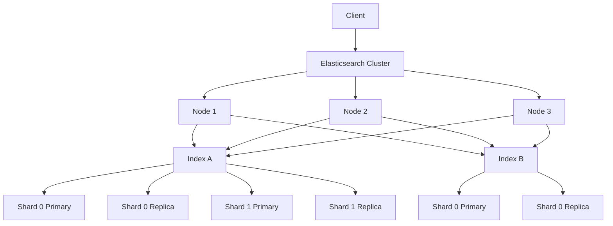
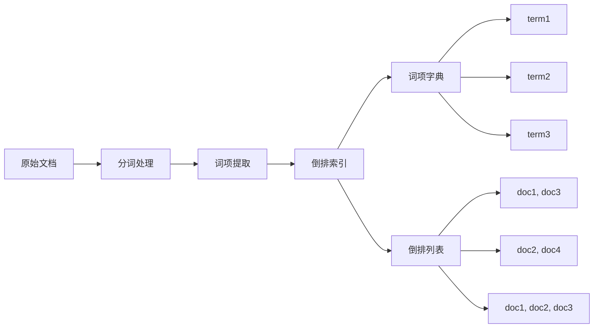
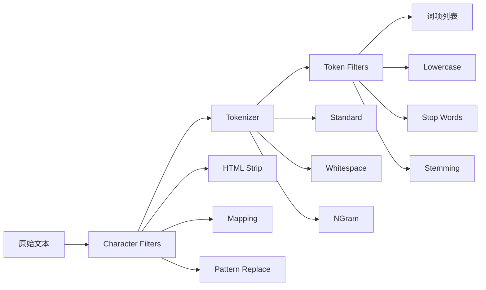
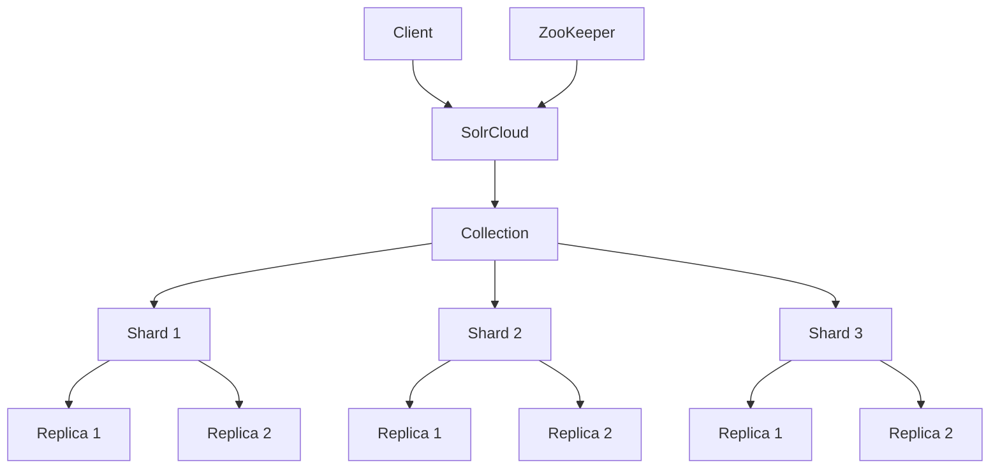
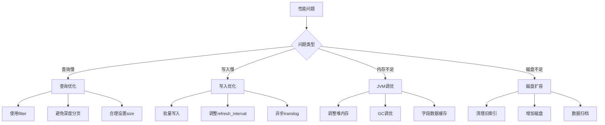

# 分布式搜索引擎详解

分布式搜索引擎是现代互联网应用中不可或缺的基础设施，它能够处理海量数据的快速检索、分析和聚合。本章将深入探讨Elasticsearch、Solr等主流分布式搜索引擎的核心概念、架构设计和工程实践。

:::tip 应用场景
分布式搜索引擎广泛应用于：
- 电商商品搜索与推荐
- 日志分析与监控
- 内容管理系统
- 企业知识库
- 实时数据分析
- 地理位置服务
:::

## 1. Elasticsearch 核心架构

### 1.1 基本概念与组件

Elasticsearch是一个基于Lucene的分布式搜索引擎，采用RESTful API设计，支持实时搜索和分析。

#### 核心组件架构


#### 核心概念详解

| 概念 | 定义 | 作用 | 示例 |
|------|------|------|------|
| **Index（索引）** | 逻辑上的数据容器，类似数据库中的表 | 组织和管理文档集合 | `products`、`users`、`logs` |
| **Document（文档）** | JSON格式的数据单元，类似数据库中的行 | 存储具体的数据内容 | `{"id": 1, "name": "iPhone", "price": 999}` |
| **Field（字段）** | 文档中的具体属性，类似数据库中的列 | 定义数据的结构和类型 | `name`、`price`、`created_at` |
| **Shard（分片）** | 索引的物理分割，分为Primary和Replica | 实现水平扩展和负载均衡 | 每个索引可以有多个分片 |
| **Replica（副本）** | 分片的备份，提供高可用和读性能 | 故障恢复和读取负载分担 | 每个分片可以有多个副本 |

:::info 分片策略
- **Primary Shard（主分片）**：负责处理写请求，数量在索引创建时确定且不可更改
- **Replica Shard（副本分片）**：主分片的备份，可以动态调整数量
- **分片数量建议**：`分片数 = 节点数 × 每个节点可承载的分片数`
:::

### 1.2 倒排索引机制

倒排索引是搜索引擎的核心数据结构，它将文档中的词项映射到包含该词项的文档列表。

#### 倒排索引构建过程


#### 倒排索引示例
```text
原始文档：
Doc1: "Elasticsearch is a search engine"
Doc2: "Elasticsearch is distributed"
Doc3: "Search engine is powerful"

倒排索引：
elasticsearch -> [Doc1, Doc2]
search -> [Doc1, Doc3]
engine -> [Doc1, Doc3]
is -> [Doc1, Doc2, Doc3]
a -> [Doc1]
distributed -> [Doc2]
powerful -> [Doc3]
```

#### 倒排索引的优势
- **快速查找**：O(1)时间复杂度找到包含特定词项的文档
- **支持复杂查询**：布尔查询、短语查询、模糊查询等
- **高效聚合**：基于词项的统计和分析操作

### 1.3 分词器（Analyzer）

分词器负责将文本转换为词项，是搜索质量的关键因素。

#### 分词器组成


#### 内置分词器对比

| 分词器 | 特点 | 适用场景 | 示例 |
|--------|------|----------|------|
| **Standard** | 标准分词，按空格和标点分割 | 英文文本 | "Quick brown fox" → ["Quick", "brown", "fox"] |
| **Simple** | 按非字母字符分割 | 简单分词 | "Quick-brown_fox" → ["Quick", "brown", "fox"] |
| **Whitespace** | 按空白字符分割 | 保留原始格式 | "Quick brown fox" → ["Quick", "brown", "fox"] |
| **Stop** | 移除停用词 | 减少索引大小 | "The quick brown fox" → ["quick", "brown", "fox"] |
| **Keyword** | 不分词，整体索引 | 精确匹配 | "Quick brown fox" → ["Quick brown fox"] |

#### 自定义分词器配置
```json title="自定义分词器示例"
{
  "settings": {
    "analysis": {
      "analyzer": {
        "my_custom_analyzer": {
          "type": "custom",
          "char_filter": ["html_strip"],
          "tokenizer": "standard",
          "filter": ["lowercase", "my_stop_words"]
        }
      },
      "filter": {
        "my_stop_words": {
          "type": "stop",
          "stopwords": ["the", "a", "an"]
        }
      }
    }
  }
}
```

## 2. Elasticsearch 索引管理

### 2.1 索引创建与配置

#### 索引创建示例
```json title="创建产品索引"
PUT /products
{
  "settings": {
    "number_of_shards": 3,
    "number_of_replicas": 1,
    "refresh_interval": "1s",
    "analysis": {
      "analyzer": {
        "product_analyzer": {
          "type": "custom",
          "tokenizer": "standard",
          "filter": ["lowercase", "stemmer"]
        }
      }
    }
  },
  "mappings": {
    "properties": {
      "id": {
        "type": "keyword"
      },
      "name": {
        "type": "text",
        "analyzer": "product_analyzer",
        "search_analyzer": "product_analyzer",
        "fields": {
          "keyword": {
            "type": "keyword",
            "ignore_above": 256
          }
        }
      },
      "description": {
        "type": "text",
        "analyzer": "product_analyzer"
      },
      "price": {
        "type": "double"
      },
      "category": {
        "type": "keyword"
      },
      "tags": {
        "type": "keyword"
      },
      "created_at": {
        "type": "date",
        "format": "yyyy-MM-dd HH:mm:ss||yyyy-MM-dd||epoch_millis"
      },
      "location": {
        "type": "geo_point"
      }
    }
  }
}
```

#### 字段类型详解

| 字段类型 | 用途 | 特点 | 示例 |
|----------|------|------|------|
| **text** | 全文搜索字段 | 会被分词，支持全文搜索 | 商品名称、描述 |
| **keyword** | 精确匹配字段 | 不分词，用于聚合和过滤 | 商品ID、分类、标签 |
| **long/double** | 数值字段 | 支持范围查询和聚合 | 价格、数量、评分 |
| **date** | 日期字段 | 支持日期范围查询 | 创建时间、更新时间 |
| **geo_point** | 地理位置 | 支持地理距离查询 | 用户位置、商店地址 |
| **nested** | 嵌套对象 | 保持对象内部关系 | 订单中的商品列表 |
| **object** | 对象字段 | 扁平化存储 | 用户信息对象 |

:::caution 映射设计注意事项
1. **避免映射爆炸**：控制字段数量，避免动态映射产生过多字段
2. **合理使用keyword**：需要精确匹配或聚合的字段使用keyword类型
3. **多字段映射**：为text字段添加keyword子字段，支持精确匹配
4. **日期格式**：明确指定日期格式，避免解析错误
:::

### 2.2 文档操作

#### 索引文档
```json title="索引单个文档"
PUT /products/_doc/1
{
  "id": "P001",
  "name": "iPhone 15 Pro",
  "description": "最新款iPhone，搭载A17 Pro芯片",
  "price": 999.99,
  "category": "electronics",
  "tags": ["smartphone", "apple", "5g"],
  "created_at": "2024-01-15T10:30:00",
  "location": {
    "lat": 37.7749,
    "lon": -122.4194
  }
}
```

#### 批量操作
```json title="批量索引文档"
POST /_bulk
{"index": {"_index": "products", "_id": "1"}}
{"id": "P001", "name": "iPhone 15 Pro", "price": 999.99}
{"index": {"_index": "products", "_id": "2"}}
{"id": "P002", "name": "Samsung Galaxy S24", "price": 899.99}
{"index": {"_index": "products", "_id": "3"}}
{"id": "P003", "name": "MacBook Pro", "price": 1999.99}
```

#### 更新文档
```json title="更新文档"
POST /products/_update/1
{
  "doc": {
    "price": 899.99,
    "updated_at": "2024-01-16T14:20:00"
  }
}
```

## 3. 查询与搜索

### 3.1 查询DSL基础

Elasticsearch提供了丰富的查询DSL（Domain Specific Language），支持各种复杂的搜索需求。

#### 查询结构
```json title="基本查询结构"
{
  "query": {
    "查询类型": {
      "字段": "查询值"
    }
  },
  "sort": [
    {"字段": {"order": "desc"}}
  ],
  "from": 0,
  "size": 10,
  "_source": ["字段1", "字段2"]
}
```

#### 常用查询类型

| 查询类型 | 用途 | 特点 | 示例 |
|----------|------|------|------|
| **match** | 全文搜索 | 对字段进行分词匹配 | `{"match": {"name": "iPhone"}}` |
| **term** | 精确匹配 | 不分词，精确匹配词项 | `{"term": {"category": "electronics"}}` |
| **range** | 范围查询 | 数值、日期范围查询 | `{"range": {"price": {"gte": 100, "lte": 1000}}}` |
| **exists** | 存在性查询 | 检查字段是否存在 | `{"exists": {"field": "description"}}` |
| **wildcard** | 通配符查询 | 支持*和?通配符 | `{"wildcard": {"name": "iPhone*"}}` |
| **fuzzy** | 模糊查询 | 支持拼写错误容错 | `{"fuzzy": {"name": "iphne"}}` |

### 3.2 复合查询

#### 布尔查询（Bool Query）
```json title="复杂布尔查询"
{
  "query": {
    "bool": {
      "must": [
        {"match": {"name": "iPhone"}},
        {"range": {"price": {"gte": 500, "lte": 1500}}}
      ],
      "should": [
        {"match": {"description": "5g"}},
        {"term": {"tags": "apple"}}
      ],
      "must_not": [
        {"term": {"category": "accessories"}}
      ],
      "filter": [
        {"range": {"created_at": {"gte": "2024-01-01"}}}
      ],
      "minimum_should_match": 1
    }
  }
}
```

#### 布尔查询子句说明

| 子句 | 作用 | 评分影响 | 缓存 |
|------|------|----------|------|
| **must** | 必须匹配，相当于AND | 影响评分 | 可缓存 |
| **should** | 应该匹配，相当于OR | 影响评分 | 可缓存 |
| **must_not** | 必须不匹配，相当于NOT | 不影响评分 | 可缓存 |
| **filter** | 过滤条件，不影响评分 | 不影响评分 | 可缓存 |

:::tip 查询优化建议
1. **使用filter**：不需要评分的条件使用filter，提高性能
2. **合理使用should**：设置`minimum_should_match`控制匹配度
3. **避免深度嵌套**：过深的嵌套查询影响性能
4. **使用查询缓存**：filter查询结果会被缓存
:::

### 3.3 聚合查询

聚合查询用于对数据进行统计分析，支持多种聚合类型。

#### 指标聚合（Metrics Aggregations）
```json title="指标聚合示例"
{
  "size": 0,
  "aggs": {
    "avg_price": {
      "avg": {"field": "price"}
    },
    "max_price": {
      "max": {"field": "price"}
    },
    "min_price": {
      "min": {"field": "price"}
    },
    "price_stats": {
      "stats": {"field": "price"}
    },
    "price_percentiles": {
      "percentiles": {
        "field": "price",
        "percents": [25, 50, 75, 95]
      }
    }
  }
}
```

#### 桶聚合（Bucket Aggregations）
```json title="桶聚合示例"
{
  "size": 0,
  "aggs": {
    "categories": {
      "terms": {
        "field": "category",
        "size": 10
      },
      "aggs": {
        "avg_price": {
          "avg": {"field": "price"}
        }
      }
    },
    "price_ranges": {
      "range": {
        "field": "price",
        "ranges": [
          {"to": 100},
          {"from": 100, "to": 500},
          {"from": 500, "to": 1000},
          {"from": 1000}
        ]
      }
    },
    "price_histogram": {
      "histogram": {
        "field": "price",
        "interval": 100
      }
    }
  }
}
```

#### 管道聚合（Pipeline Aggregations）
```json title="管道聚合示例"
{
  "size": 0,
  "aggs": {
    "categories": {
      "terms": {"field": "category"},
      "aggs": {
        "avg_price": {
          "avg": {"field": "price"}
        },
        "price_diff": {
          "bucket_script": {
            "buckets_path": {
              "avg_price": "avg_price"
            },
            "script": "params.avg_price - 500"
          }
        }
      }
    }
  }
}
```

### 3.4 高亮与建议

#### 高亮查询
```json title="高亮查询示例"
{
  "query": {
    "match": {"description": "iPhone"}
  },
  "highlight": {
    "fields": {
      "name": {
        "pre_tags": ["<em>"],
        "post_tags": ["</em>"],
        "fragment_size": 150,
        "number_of_fragments": 3
      },
      "description": {
        "pre_tags": ["<strong>"],
        "post_tags": ["</strong>"]
      }
    }
  }
}
```

#### 搜索建议
```json title="搜索建议示例"
{
  "suggest": {
    "product_suggest": {
      "prefix": "iph",
      "completion": {
        "field": "name_suggest",
        "size": 5
      }
    },
    "term_suggest": {
      "text": "iphne",
      "term": {
        "field": "name",
        "suggest_mode": "always"
      }
    }
  }
}
```

## 4. 性能优化与调优

### 4.1 索引性能优化

#### 批量写入优化
```java title="批量写入示例"
public class BulkIndexer {
    private final RestHighLevelClient client;
    private final String indexName;
    private final int batchSize;
    private final List<IndexRequest> batch;
    
    public BulkIndexer(RestHighLevelClient client, String indexName, int batchSize) {
        this.client = client;
        this.indexName = indexName;
        this.batchSize = batchSize;
        this.batch = new ArrayList<>();
    }
    
    public void add(String id, Map<String, Object> document) {
        IndexRequest request = new IndexRequest(indexName)
            .id(id)
            .source(document);
        batch.add(request);
        
        if (batch.size() >= batchSize) {
            flush();
        }
    }
    
    public void flush() throws IOException {
        if (batch.isEmpty()) {
            return;
        }
        
        BulkRequest bulkRequest = new BulkRequest();
        batch.forEach(bulkRequest::add);
        
        BulkResponse response = client.bulk(bulkRequest, RequestOptions.DEFAULT);
        
        if (response.hasFailures()) {
            // 处理失败的情况
            for (BulkItemResponse item : response.getItems()) {
                if (item.isFailed()) {
                    System.err.println("Failed to index document: " + item.getFailureMessage());
                }
            }
        }
        
        batch.clear();
    }
}
```

#### 索引设置优化
```json title="写入优化配置"
{
  "settings": {
    "number_of_shards": 3,
    "number_of_replicas": 1,
    "refresh_interval": "30s",
    "translog": {
      "durability": "async",
      "sync_interval": "5s"
    },
    "index": {
      "max_result_window": 10000,
      "mapping": {
        "nested_fields": {
          "limit": 100
        }
      }
    }
  }
}
```

### 4.2 查询性能优化

#### 查询优化策略

| 优化策略 | 说明 | 实现方式 |
|----------|------|----------|
| **使用filter** | filter不影响评分，可缓存 | 将不需要评分的条件放在filter中 |
| **避免深度分页** | 深度分页性能差 | 使用search_after或scroll API |
| **合理设置size** | 避免返回过多数据 | 根据实际需求设置合理的size |
| **使用_source过滤** | 只返回需要的字段 | 在查询中指定_source字段 |
| **预热查询** | 将常用查询加入缓存 | 定期执行常用查询 |

#### 查询缓存配置
```json title="查询缓存优化"
{
  "settings": {
    "indices": {
      "queries": {
        "cache": {
          "size": "10%"
        }
      },
      "fielddata": {
        "cache": {
          "size": "20%"
        }
      }
    }
  }
}
```

### 4.3 集群性能调优

#### JVM调优
```bash title="JVM配置示例"
# elasticsearch.yml
-Xms4g
-Xmx4g
-XX:+UseG1GC
-XX:G1HeapRegionSize=32m
-XX:MaxGCPauseMillis=200
-XX:+UnlockExperimentalVMOptions
-XX:+UseCGroupMemoryLimitForHeap
```

#### 操作系统调优
```bash title="系统调优命令"
# 增加文件描述符限制
echo "* soft nofile 65536" >> /etc/security/limits.conf
echo "* hard nofile 65536" >> /etc/security/limits.conf

# 禁用交换
swapoff -a

# 调整虚拟内存
echo "vm.max_map_count=262144" >> /etc/sysctl.conf
sysctl -p
```

## 5. Solr 搜索引擎

### 5.1 Solr vs Elasticsearch

| 特性 | Solr | Elasticsearch |
|------|------|---------------|
| **架构** | 基于Lucene，传统搜索引擎 | 基于Lucene，分布式优先 |
| **部署** | 需要外部容器（如Tomcat） | 内置HTTP服务器 |
| **配置** | XML配置文件 | JSON API配置 |
| **扩展性** | SolrCloud支持分布式 | 原生分布式支持 |
| **实时性** | 近实时搜索 | 实时搜索 |
| **生态** | 成熟的企业级生态 | 更活跃的开源生态 |

### 5.2 Solr核心概念

#### Solr架构图


#### Solr配置示例
```xml title="solrconfig.xml核心配置"
<config>
  <!-- 查询处理器配置 -->
  <requestHandler name="/select" class="solr.SearchHandler">
    <lst name="defaults">
      <str name="defType">edismax</str>
      <str name="qf">name^2.0 description^1.0</str>
      <str name="bf">recip(rord(id),1,1000,1000)</str>
    </lst>
  </requestHandler>
  
  <!-- 缓存配置 -->
  <queryResultCache class="solr.LRUCache" size="4096" initialSize="512" autowarmCount="0"/>
  <documentCache class="solr.LRUCache" size="512" initialSize="512" autowarmCount="0"/>
  <filterCache class="solr.LRUCache" size="512" initialSize="512" autowarmCount="0"/>
  
  <!-- 自动提交配置 -->
  <autoCommit>
    <maxTime>15000</maxTime>
    <openSearcher>false</openSearcher>
  </autoCommit>
  
  <autoSoftCommit>
    <maxTime>1000</maxTime>
  </autoSoftCommit>
</config>
```

## 6. 监控与运维

### 6.1 关键监控指标

#### 集群健康指标
```json title="集群健康检查"
GET /_cluster/health?pretty
{
  "cluster_name": "elasticsearch",
  "status": "green",
  "timed_out": false,
  "number_of_nodes": 3,
  "number_of_data_nodes": 3,
  "active_primary_shards": 15,
  "active_shards": 30,
  "relocating_shards": 0,
  "initializing_shards": 0,
  "unassigned_shards": 0,
  "delayed_unassigned_shards": 0,
  "number_of_pending_tasks": 0,
  "number_of_in_flight_fetch": 0,
  "task_max_waiting_in_queue_millis": 0,
  "active_shards_percent_as_number": 100.0
}
```

#### 性能监控指标

| 指标类别 | 关键指标 | 说明 | 告警阈值 |
|----------|----------|------|----------|
| **查询性能** | 查询延迟 | 查询响应时间 | P95 > 1s |
| **索引性能** | 索引速率 | 每秒索引文档数 | < 1000 docs/s |
| **JVM性能** | 堆内存使用率 | JVM堆内存使用情况 | > 85% |
| **磁盘性能** | 磁盘使用率 | 磁盘空间使用情况 | > 80% |
| **网络性能** | 网络延迟 | 节点间通信延迟 | > 100ms |

### 6.2 常见问题与解决方案

#### 问题诊断流程


## 7. 面试题精选

### 7.1 基础概念题

#### Q1: 什么是倒排索引？它有什么优势？

**答**: 倒排索引是搜索引擎的核心数据结构，它将文档中的词项映射到包含该词项的文档列表。

**优势**:
1. **快速查找**: O(1)时间复杂度找到包含特定词项的文档
2. **支持复杂查询**: 布尔查询、短语查询、模糊查询等
3. **高效聚合**: 基于词项的统计和分析操作
4. **压缩存储**: 支持高效的压缩算法

**示例**:
```text
原始文档:
Doc1: "Elasticsearch is a search engine"
Doc2: "Elasticsearch is distributed"

倒排索引:
elasticsearch -> [Doc1, Doc2]
search -> [Doc1]
engine -> [Doc1]
is -> [Doc1, Doc2]
distributed -> [Doc2]
```

#### Q2: Elasticsearch中的分片和副本有什么区别？

**答**: 
1. **分片（Shard）**:
   - 索引的物理分割，实现水平扩展
   - 分为Primary Shard和Replica Shard
   - Primary Shard数量在索引创建时确定且不可更改
   - 每个分片是一个独立的Lucene索引

2. **副本（Replica）**:
   - 分片的备份，提供高可用性
   - 可以动态调整数量
   - 提高读取性能，分担读取负载
   - 故障恢复时自动提升为Primary

**最佳实践**:
- 分片数量 = 节点数 × 每个节点可承载的分片数
- 副本数量建议为1-2个，平衡可用性和存储成本

#### Q3: term查询和match查询的区别是什么？

**答**:
1. **term查询**:
   - 精确匹配，不分词
   - 直接匹配索引中的词项
   - 适用于keyword类型字段
   - 性能较好，可缓存

2. **match查询**:
   - 全文搜索，会分词
   - 对查询文本进行分词后匹配
   - 适用于text类型字段
   - 支持相关性评分

**示例**:
```json
// term查询 - 精确匹配
{"term": {"category": "electronics"}}

// match查询 - 全文搜索
{"match": {"description": "iPhone smartphone"}}
```

### 7.2 性能优化题

#### Q4: 如何优化Elasticsearch的写入性能？

**答**:
1. **批量写入**:
   - 使用bulk API批量索引文档
   - 合理设置批量大小（1000-5000条）
   - 避免单条写入

2. **索引设置优化**:
   - 增加`refresh_interval`（如30s）
   - 设置`translog.durability`为async
   - 调整`number_of_replicas`

3. **硬件优化**:
   - 使用SSD存储
   - 增加内存配置
   - 优化网络带宽

4. **JVM调优**:
   - 合理设置堆内存大小
   - 使用G1GC垃圾收集器
   - 调整GC参数

#### Q5: 如何优化Elasticsearch的查询性能？

**答**:
1. **查询优化**:
   - 使用filter代替query（不影响评分）
   - 避免深度分页，使用search_after
   - 合理设置size，避免返回过多数据
   - 使用_source过滤，只返回需要的字段

2. **索引优化**:
   - 合理设计mapping
   - 避免过多字段
   - 使用合适的字段类型
   - 定期清理无用索引

3. **缓存优化**:
   - 启用查询缓存
   - 使用fielddata缓存
   - 预热常用查询

4. **集群优化**:
   - 合理分配分片
   - 监控节点负载
   - 及时扩容

### 7.3 架构设计题

#### Q6: 设计一个电商商品搜索系统，需要考虑哪些方面？

**答**:
1. **索引设计**:
   ```json
   {
     "mappings": {
       "properties": {
         "id": {"type": "keyword"},
         "name": {"type": "text", "analyzer": "ik_max_word"},
         "category": {"type": "keyword"},
         "brand": {"type": "keyword"},
         "price": {"type": "double"},
         "tags": {"type": "keyword"},
         "location": {"type": "geo_point"}
       }
     }
   }
   ```

2. **查询功能**:
   - 全文搜索（商品名称、描述）
   - 分类筛选
   - 价格范围查询
   - 品牌筛选
   - 地理位置搜索
   - 排序（价格、销量、评分）

3. **性能优化**:
   - 使用filter缓存分类、品牌等固定条件
   - 实现搜索建议
   - 支持高亮显示
   - 结果聚合（分类统计、价格分布）

4. **高可用设计**:
   - 多副本部署
   - 负载均衡
   - 监控告警
   - 故障自动恢复

#### Q7: 如何处理Elasticsearch中的数据一致性问题？

**答**:
1. **写入一致性**:
   - 设置`consistency`参数（one/quorum/all）
   - 使用`wait_for_active_shards`等待活跃分片
   - 实现重试机制

2. **读取一致性**:
   - 使用`preference`参数控制读取分片
   - 设置`timeout`避免长时间等待
   - 实现读取重试

3. **数据同步**:
   - 监控副本同步状态
   - 定期检查数据一致性
   - 实现数据校验机制

4. **故障处理**:
   - 自动故障转移
   - 数据恢复机制
   - 监控告警

### 7.4 运维监控题

#### Q8: 如何监控Elasticsearch集群的健康状态？

**答**:
1. **集群健康检查**:
   ```bash
   # 检查集群状态
   GET /_cluster/health
   
   # 检查节点状态
   GET /_nodes/stats
   
   # 检查索引状态
   GET /_cat/indices?v
   ```

2. **关键监控指标**:
   - 集群状态（green/yellow/red）
   - 节点数量和数据节点数量
   - 分片分配状态
   - JVM堆内存使用率
   - 磁盘使用率

3. **性能监控**:
   - 查询延迟（P50/P95/P99）
   - 索引速率
   - 缓存命中率
   - GC时间和频率

4. **告警设置**:
   - 集群状态变为yellow或red
   - 节点离线
   - 磁盘使用率超过阈值
   - 查询延迟超过阈值

#### Q9: Elasticsearch集群扩容的步骤和注意事项有哪些？

**答**:
1. **扩容前准备**:
   - 评估当前集群负载
   - 准备新节点硬件
   - 备份重要数据
   - 制定扩容计划

2. **扩容步骤**:
   ```bash
   # 1. 启动新节点
   # 2. 检查节点加入集群
   GET /_cat/nodes?v
   
   # 3. 重新分配分片
   PUT /_cluster/settings
   {
     "transient": {
       "cluster.routing.rebalance.enable": "all"
     }
   }
   ```

3. **注意事项**:
   - 扩容期间避免大量写入
   - 监控分片重分配进度
   - 确保网络带宽充足
   - 验证扩容后性能

4. **验证扩容效果**:
   - 检查分片分布
   - 测试查询性能
   - 监控集群状态
   - 调整相关配置

:::tip 搜索引擎学习要点
1. **理解倒排索引**：这是搜索引擎的核心机制
2. **掌握查询DSL**：熟练使用各种查询类型和聚合
3. **性能优化**：学会识别和解决性能瓶颈
4. **运维监控**：建立完善的监控和告警体系
5. **实际应用**：在真实项目中应用搜索引擎技术
:::

---

通过本章的学习，你应该已经掌握了分布式搜索引擎的核心概念、架构设计和最佳实践。Elasticsearch和Solr都是强大的搜索引擎，选择合适的工具并正确使用它们，可以显著提升应用的搜索体验和性能。在实际项目中，要根据具体需求选择合适的搜索引擎，并持续优化配置和查询性能。
