# 分布式系统理论基础详解

分布式系统是现代互联网应用的基础架构，掌握分布式系统设计对于构建高可用、高性能的系统至关重要。本章系统梳理分布式系统的核心理论与工程取舍，帮助你在设计与落地时做出可解释的权衡。

:::tip 学习目标
通过本章学习，你将掌握：
- 分布式系统的基本概念和设计目标
- CAP定理的深入理解和工程实践
- 一致性模型的分类和应用场景
- 共识算法的原理和实现
- 分布式系统的设计模式和最佳实践
:::

## 1. 分布式系统基本概念

### 1.1 什么是分布式系统？

分布式系统是由多个独立计算机节点组成的系统，这些节点通过网络进行通信和协作，对外表现为一个统一的系统。

:::info 核心特征
- **节点独立性**：每个节点都是独立的计算机，可以独立运行
- **网络通信**：节点间通过网络进行通信，存在网络延迟和故障
- **统一对外**：对外表现为一个整体系统，隐藏内部复杂性
- **并发处理**：多个节点可以并发处理请求，提高系统性能
:::

### 1.2 分布式系统的设计目标

| 设计目标 | 定义 | 重要性 | 实现挑战 |
|----------|------|--------|----------|
| **可伸缩性（Scalability）** | 系统能够通过增加节点来提升处理能力 | 支持业务增长 | 数据分片、负载均衡 |
| **高可用性（Availability）** | 系统在故障时仍能提供服务 | 保证业务连续性 | 故障检测、自动恢复 |
| **一致性（Consistency）** | 数据在多个副本间保持一致 | 保证数据正确性 | 同步机制、冲突解决 |
| **容错性（Fault Tolerance）** | 系统在部分节点故障时仍能运行 | 提高系统稳定性 | 冗余设计、故障隔离 |

### 1.3 分布式系统的挑战

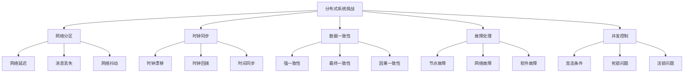

:::caution 工程实践要点
在实际工程中，我们通常需要在不同的设计目标之间进行权衡：
- **CP系统**：优先保证一致性和分区容错性，牺牲部分可用性
- **AP系统**：优先保证可用性和分区容错性，接受最终一致性
:::

## 2. CAP 定理与工程解读

### 2.1 CAP定理概述

CAP定理是分布式系统设计的理论基础，由Eric Brewer在2000年提出，后来由Seth Gilbert和Nancy Lynch在2003年进行了形式化证明。

#### CAP定理内容
- **C（Consistency 一致性）**：同一数据在任意副本读取到相同值
- **A（Availability 可用性）**：每个请求都能在有限时间内返回（不一定是最新）
- **P（Partition tolerance 分区容错）**：出现网络分区时系统仍能对外服务

**结论**：分区一旦发生（P 必选），只能在 C 与 A 之间二选一。

### 2.2 CAP定理的工程解读

#### CP系统（一致性优先）
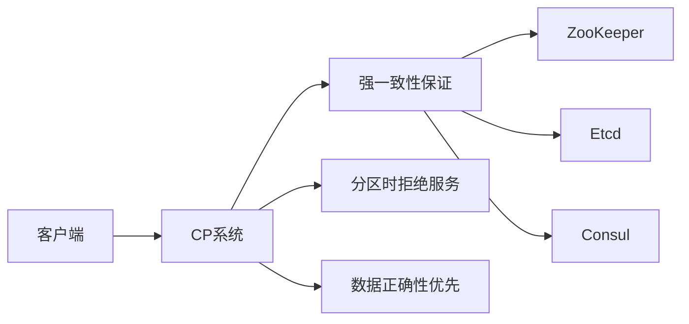

**特点**：
- 在网络分区时，系统会拒绝部分请求以保证一致性
- 适合对数据正确性要求极高的场景
- 典型应用：配置管理、分布式锁、元数据存储

**实现方式**：
```java title="CP系统示例 - 分布式锁"
public class DistributedLock {
    private final ZooKeeper zk;
    private final String lockPath;
    
    public boolean tryLock(String resource, long timeout) {
        try {
            // 创建临时节点，保证强一致性
            String path = zk.create("/locks/" + resource + "/lock-", 
                                   new byte[0], 
                                   ZooDefs.Ids.OPEN_ACL_UNSAFE, 
                                   CreateMode.EPHEMERAL_SEQUENTIAL);
            
            // 检查是否获得锁
            List<String> children = zk.getChildren("/locks/" + resource, false);
            Collections.sort(children);
            
            if (path.endsWith(children.get(0))) {
                return true; // 获得锁
            }
            
            // 等待锁释放
            return waitForLock(children, path, timeout);
        } catch (Exception e) {
            return false;
        }
    }
}
```

#### AP系统（可用性优先）
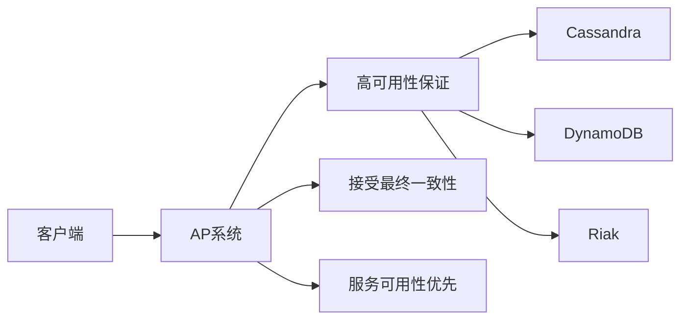

**特点**：
- 在网络分区时，系统继续提供服务，但可能返回旧数据
- 适合对可用性要求极高的场景
- 典型应用：内容分发、缓存系统、日志存储

**实现方式**：
```java title="AP系统示例 - 最终一致性缓存"
public class EventuallyConsistentCache<K, V> {
    private final Map<K, V> localCache = new ConcurrentHashMap<>();
    private final List<CacheNode> nodes;
    
    public V get(K key) {
        // 优先从本地缓存读取，保证可用性
        V value = localCache.get(key);
        if (value != null) {
            return value;
        }
        
        // 尝试从其他节点读取
        for (CacheNode node : nodes) {
            try {
                value = node.get(key);
                if (value != null) {
                    localCache.put(key, value);
                    return value;
                }
            } catch (Exception e) {
                // 节点不可用，继续尝试其他节点
                continue;
            }
        }
        
        return null;
    }
    
    public void put(K key, V value) {
        // 先更新本地缓存，保证可用性
        localCache.put(key, value);
        
        // 异步更新其他节点，接受最终一致性
        for (CacheNode node : nodes) {
            CompletableFuture.runAsync(() -> {
                try {
                    node.put(key, value);
                } catch (Exception e) {
                    // 异步更新失败，不影响主流程
                }
            });
        }
    }
}
```

### 2.3 CAP定理的实践建议

#### 按业务场景选择
| 业务场景 | 推荐选择 | 理由 | 典型系统 |
|----------|----------|------|----------|
| **金融交易** | CP | 数据正确性至关重要 | 银行核心系统 |
| **电商库存** | CP | 避免超卖问题 | 库存管理系统 |
| **用户配置** | CP | 配置一致性重要 | 配置中心 |
| **内容缓存** | AP | 可用性优先，内容可容忍延迟 | CDN系统 |
| **日志存储** | AP | 可用性优先，数据可容忍丢失 | 日志系统 |
| **社交动态** | AP | 可用性优先，内容可容忍延迟 | 社交平台 |

#### 混合架构设计
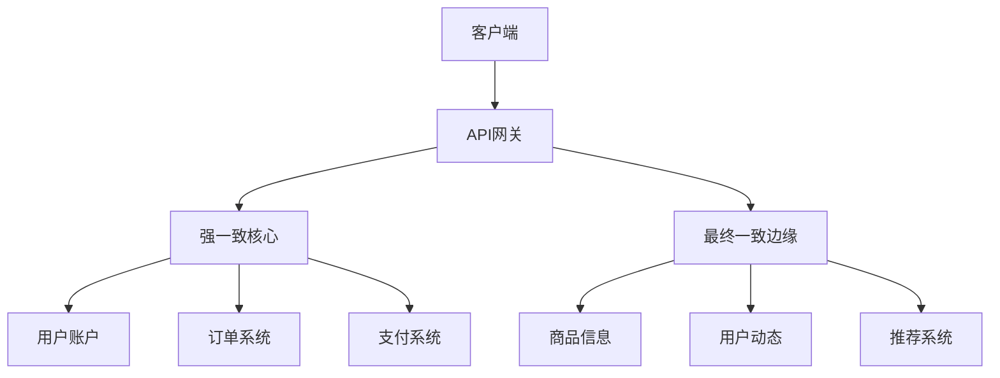

:::tip CAP选择原则
1. **数据重要性**：关键业务数据选择CP，非关键数据选择AP
2. **实时性要求**：强实时性选择CP，可容忍延迟选择AP
3. **业务容忍度**：对数据错误容忍度低选择CP，对服务中断容忍度低选择AP
4. **成本考虑**：CP系统通常成本更高，AP系统成本相对较低
:::

## 3. BASE 理论与一致性模型

### 3.1 BASE理论概述

BASE理论是对CAP定理中AP系统的补充，由Dan Pritchett在2008年提出，是对传统ACID特性的补充。

#### BASE理论内容
- **B（Basically Available 基本可用）**：系统在故障时仍能提供基本服务
- **S（Soft state 软状态）**：允许系统存在中间状态，不要求强一致性
- **E（Eventual consistency 最终一致性）**：经过一段时间后，所有副本最终会达到一致状态

### 3.2 一致性模型详解

#### 一致性模型层次结构
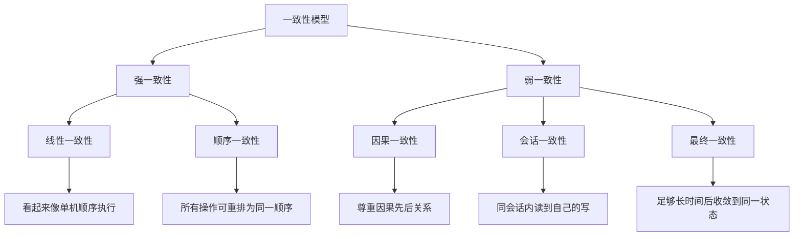

#### 线性一致性（Linearizability）
```java title="线性一致性示例"
public class LinearizableCounter {
    private final AtomicLong counter = new AtomicLong(0);
    
    public long increment() {
        // 线性一致性：所有操作看起来像在单机上顺序执行
        return counter.incrementAndGet();
    }
    
    public long get() {
        // 读取操作能看到所有已完成的写操作
        return counter.get();
    }
}
```

**特点**：
- 所有操作看起来像在单机上顺序执行
- 读取操作能看到所有已完成的写操作
- 实现复杂，性能开销大

#### 顺序一致性（Sequential Consistency）
```java title="顺序一致性示例"
public class SequentiallyConsistentQueue {
    private final Queue<String> queue = new ConcurrentLinkedQueue<>();
    
    public void enqueue(String item) {
        // 顺序一致性：所有操作可重排为同一顺序
        queue.offer(item);
    }
    
    public String dequeue() {
        // 单客户端程序次序保留
        return queue.poll();
    }
}
```

**特点**：
- 所有操作可重排为同一顺序
- 单客户端程序次序保留
- 比线性一致性弱，但实现相对简单

#### 因果一致性（Causal Consistency）
```java title="因果一致性示例"
public class CausallyConsistentChat {
    private final Map<String, Message> messages = new ConcurrentHashMap<>();
    private final VectorClock vectorClock = new VectorClock();
    
    public void sendMessage(String userId, String content) {
        Message message = new Message(userId, content, vectorClock.increment(userId));
        messages.put(message.getId(), message);
    }
    
    public List<Message> getMessages() {
        // 因果一致性：尊重因果先后关系
        return messages.values().stream()
                      .sorted(Comparator.comparing(Message::getVectorClock))
                      .collect(Collectors.toList());
    }
}
```

**特点**：
- 尊重因果先后关系
- 使用向量时钟（Vector Clock）表达因果关系
- 适合分布式聊天、协作编辑等场景

#### 会话一致性（Session Consistency）
```java title="会话一致性示例"
public class SessionConsistentCache {
    private final Map<String, Object> cache = new ConcurrentHashMap<>();
    private final String sessionId;
    
    public SessionConsistentCache(String sessionId) {
        this.sessionId = sessionId;
    }
    
    public void put(String key, Object value) {
        cache.put(key, value);
        // 同会话内立即可见
    }
    
    public Object get(String key) {
        // 同会话内能读到自己的写
        return cache.get(key);
    }
}
```

**特点**：
- 同会话内能读到自己的写操作
- 不同会话间可能看到不同状态
- 实现相对简单，性能较好

#### 最终一致性（Eventual Consistency）
```java title="最终一致性示例"
public class EventuallyConsistentDatabase {
    private final Map<String, Replica> replicas = new HashMap<>();
    
    public void write(String key, String value) {
        // 异步复制到所有副本
        for (Replica replica : replicas.values()) {
            CompletableFuture.runAsync(() -> {
                replica.write(key, value);
            });
        }
    }
    
    public String read(String key) {
        // 从任意副本读取，可能读到旧值
        Replica replica = selectReplica();
        return replica.read(key);
    }
}
```

**特点**：
- 经过一段时间后，所有副本最终会达到一致状态
- 实现简单，性能最好
- 适合对一致性要求不高的场景

## 4. 副本、Quorum 与冲突解决

### 4.1 副本机制

#### 副本的作用
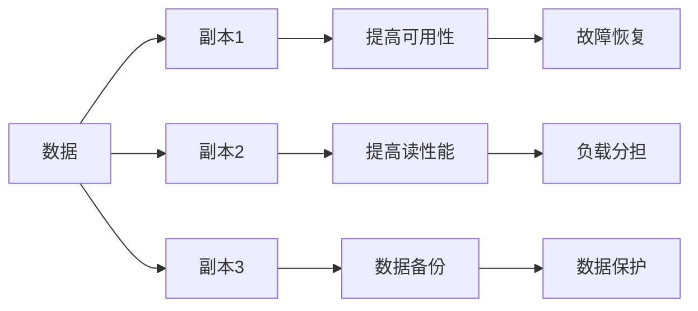

#### 副本一致性策略
| 策略 | 特点 | 适用场景 | 示例 |
|------|------|----------|------|
| **同步复制** | 写操作等待所有副本确认 | 强一致性要求 | 金融交易系统 |
| **异步复制** | 写操作不等待副本确认 | 高性能要求 | 日志系统 |
| **半同步复制** | 等待部分副本确认 | 平衡性能和一致性 | 一般业务系统 |

### 4.2 Quorum机制

#### Quorum读写规则
设副本数为N，读操作为R，写操作为W，则：
- **强一致性条件**：R + W > N
- **可用性优先**：R + W ≤ N

#### Quorum配置示例
```java title="Quorum读写实现"
public class QuorumDatabase {
    private final List<Replica> replicas;
    private final int readQuorum;
    private final int writeQuorum;
    
    public QuorumDatabase(List<Replica> replicas, int readQuorum, int writeQuorum) {
        this.replicas = replicas;
        this.readQuorum = readQuorum;
        this.writeQuorum = writeQuorum;
    }
    
    public String read(String key) {
        // 从多个副本读取，取最新值
        List<String> values = new ArrayList<>();
        for (Replica replica : replicas) {
            try {
                String value = replica.read(key);
                values.add(value);
                if (values.size() >= readQuorum) {
                    break;
                }
            } catch (Exception e) {
                // 副本不可用，继续尝试
            }
        }
        
        // 返回最新值（需要版本号或时间戳）
        return selectLatestValue(values);
    }
    
    public void write(String key, String value) {
        // 写入多个副本，确保写入成功
        int successCount = 0;
        for (Replica replica : replicas) {
            try {
                replica.write(key, value);
                successCount++;
                if (successCount >= writeQuorum) {
                    return; // 写入成功
                }
            } catch (Exception e) {
                // 副本写入失败，继续尝试
            }
        }
        
        throw new RuntimeException("Write failed: insufficient replicas");
    }
}
```

#### 不同Quorum配置的影响
```text
示例（N=3）：
- 强读配置：W=2, R=2 ⇒ R+W=4>3，读必覆盖写
- 偏可用配置：W=1, R=1 ⇒ R+W=2≤3，写快但读可能是旧值
- 平衡配置：W=2, R=1 ⇒ R+W=3≤3，写安全但读可能不一致
```

### 4.3 冲突解决策略

#### Last-Write-Wins（最后写入获胜）
```java title="Last-Write-Wins实现"
public class LastWriteWinsResolver {
    public Data resolveConflict(List<Data> versions) {
        // 基于时间戳选择最新版本
        return versions.stream()
                      .max(Comparator.comparing(Data::getTimestamp))
                      .orElse(null);
    }
}
```

**特点**：
- 实现简单，性能好
- 需要单调时钟
- 可能丢失数据

#### 向量时钟（Vector Clock）
```java title="向量时钟实现"
public class VectorClock {
    private final Map<String, Long> clock = new ConcurrentHashMap<>();
    
    public void increment(String nodeId) {
        clock.merge(nodeId, 1L, Long::sum);
    }
    
    public boolean isConcurrent(VectorClock other) {
        // 检查两个时钟是否并发
        boolean thisGreater = false;
        boolean otherGreater = false;
        
        Set<String> allNodes = new HashSet<>(clock.keySet());
        allNodes.addAll(other.clock.keySet());
        
        for (String node : allNodes) {
            long thisValue = clock.getOrDefault(node, 0L);
            long otherValue = other.clock.getOrDefault(node, 0L);
            
            if (thisValue > otherValue) {
                thisGreater = true;
            } else if (otherValue > thisValue) {
                otherGreater = true;
            }
        }
        
        return thisGreater && otherGreater;
    }
    
    public boolean isCausallyBefore(VectorClock other) {
        // 检查是否因果先于
        for (Map.Entry<String, Long> entry : clock.entrySet()) {
            String node = entry.getKey();
            long thisValue = entry.getValue();
            long otherValue = other.clock.getOrDefault(node, 0L);
            
            if (thisValue > otherValue) {
                return false;
            }
        }
        return true;
    }
}
```

**特点**：
- 保留并发写元信息
- 能检测因果关系
- 实现复杂，存储开销大

#### CRDT（无冲突可复制数据类型）
```java title="CRDT示例 - 计数器"
public class GCounter {
    private final Map<String, Long> counters = new ConcurrentHashMap<>();
    
    public void increment(String nodeId) {
        counters.merge(nodeId, 1L, Long::sum);
    }
    
    public long getValue() {
        return counters.values().stream().mapToLong(Long::longValue).sum();
    }
    
    public void merge(GCounter other) {
        // 合并两个计数器
        for (Map.Entry<String, Long> entry : other.counters.entrySet()) {
            String nodeId = entry.getKey();
            long value = entry.getValue();
            counters.merge(nodeId, value, Math::max);
        }
    }
}
```

**特点**：
- 天然收敛，无需冲突解决
- 支持并发修改
- 类型特定，通用性有限

:::tip 冲突解决选择
1. **简单场景**：使用Last-Write-Wins
2. **需要保留信息**：使用向量时钟
3. **特定数据类型**：使用CRDT
4. **复杂业务逻辑**：自定义冲突解决策略
:::

## 5. 共识算法（Paxos / Raft / ZAB）

### 5.1 共识算法概述

共识算法是分布式系统中实现强一致性的核心机制，确保多个节点在存在故障的情况下能够就某个值达成一致。

#### 共识算法的要求
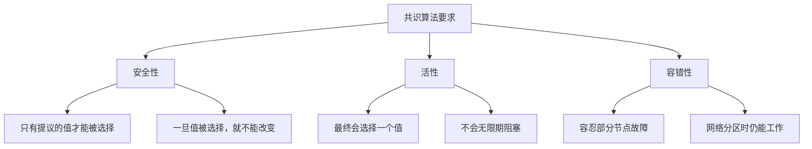

### 5.2 Paxos算法

#### Paxos角色定义
```java title="Paxos角色"
public enum PaxosRole {
    PROPOSER,  // 提议者：发起提议
    ACCEPTOR,  // 接受者：接受或拒绝提议
    LEARNER    // 学习者：学习最终选择的值
}
```

#### Paxos算法流程
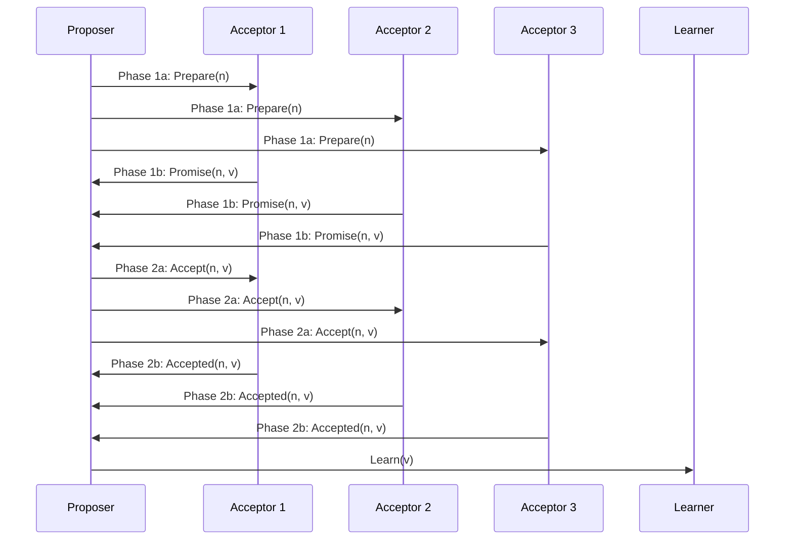

#### Paxos实现示例
```java title="Paxos简化实现"
public class PaxosNode {
    private final String nodeId;
    private final List<String> acceptors;
    private long proposalNumber = 0;
    private Object acceptedValue = null;
    
    public PaxosNode(String nodeId, List<String> acceptors) {
        this.nodeId = nodeId;
        this.acceptors = acceptors;
    }
    
    public Object propose(Object value) {
        long n = generateProposalNumber();
        
        // Phase 1: Prepare
        List<Promise> promises = prepare(n);
        if (promises.size() < majority()) {
            return null; // 准备失败
        }
        
        // 选择提议值
        Object proposedValue = selectProposedValue(promises, value);
        
        // Phase 2: Accept
        int acceptedCount = accept(n, proposedValue);
        if (acceptedCount >= majority()) {
            // 学习阶段
            learn(proposedValue);
            return proposedValue;
        }
        
        return null; // 接受失败
    }
    
    private List<Promise> prepare(long n) {
        List<Promise> promises = new ArrayList<>();
        for (String acceptor : acceptors) {
            try {
                Promise promise = sendPrepare(acceptor, n);
                promises.add(promise);
            } catch (Exception e) {
                // 忽略失败的acceptor
            }
        }
        return promises;
    }
    
    private int accept(long n, Object value) {
        int acceptedCount = 0;
        for (String acceptor : acceptors) {
            try {
                boolean accepted = sendAccept(acceptor, n, value);
                if (accepted) {
                    acceptedCount++;
                }
            } catch (Exception e) {
                // 忽略失败的acceptor
            }
        }
        return acceptedCount;
    }
    
    private int majority() {
        return acceptors.size() / 2 + 1;
    }
}
```

### 5.3 Raft算法

#### Raft算法架构
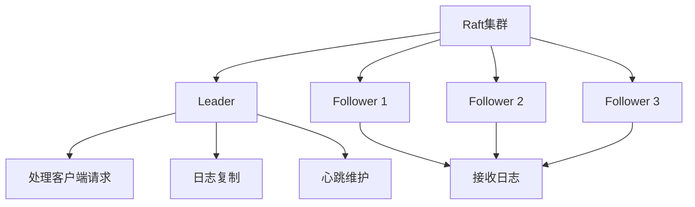

#### Raft算法状态转换
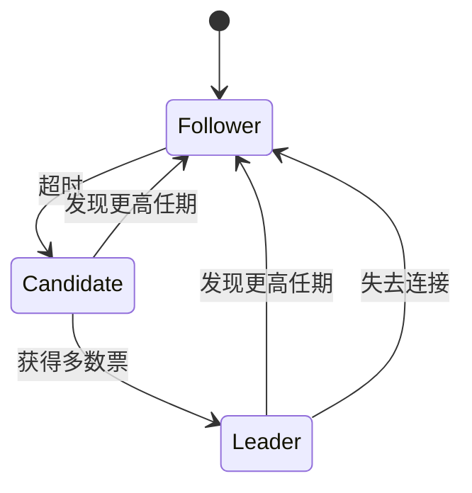

#### Raft核心机制

**Leader选举**：
```java title="Raft Leader选举"
public class RaftNode {
    private RaftState state = RaftState.FOLLOWER;
    private long currentTerm = 0;
    private String votedFor = null;
    private long lastHeartbeat = 0;
    private final Random random = new Random();
    
    public void startElection() {
        state = RaftState.CANDIDATE;
        currentTerm++;
        votedFor = nodeId;
        
        // 发送投票请求
        int votes = 1; // 自己的一票
        for (String peer : peers) {
            try {
                boolean voteGranted = requestVote(peer, currentTerm, nodeId);
                if (voteGranted) {
                    votes++;
                }
            } catch (Exception e) {
                // 忽略失败的请求
            }
        }
        
        if (votes > majority()) {
            becomeLeader();
        }
    }
    
    public void becomeLeader() {
        state = RaftState.LEADER;
        // 初始化leader状态
        nextIndex.clear();
        matchIndex.clear();
        for (String peer : peers) {
            nextIndex.put(peer, log.getLastIndex() + 1);
            matchIndex.put(peer, 0L);
        }
        
        // 开始发送心跳
        startHeartbeat();
    }
}
```

**日志复制**：
```java title="Raft日志复制"
public class RaftLog {
    private final List<LogEntry> entries = new ArrayList<>();
    private long commitIndex = 0;
    
    public void appendEntry(LogEntry entry) {
        entry.setTerm(currentTerm);
        entry.setIndex(entries.size());
        entries.add(entry);
        
        // 复制到其他节点
        replicateLog();
    }
    
    private void replicateLog() {
        for (String peer : peers) {
            long nextIdx = nextIndex.get(peer);
            List<LogEntry> entriesToSend = getEntriesFrom(nextIdx);
            
            try {
                boolean success = sendAppendEntries(peer, currentTerm, nextIdx, entriesToSend);
                if (success) {
                    nextIndex.put(peer, nextIdx + entriesToSend.size());
                    matchIndex.put(peer, nextIdx + entriesToSend.size() - 1);
                } else {
                    nextIndex.put(peer, Math.max(1, nextIdx - 1));
                }
            } catch (Exception e) {
                // 处理网络错误
            }
        }
        
        // 尝试提交日志
        tryCommit();
    }
    
    private void tryCommit() {
        for (long i = commitIndex + 1; i <= entries.size(); i++) {
            int replicatedCount = 1; // 自己
            for (String peer : peers) {
                if (matchIndex.get(peer) >= i) {
                    replicatedCount++;
                }
            }
            
            if (replicatedCount > majority() && entries.get((int)i-1).getTerm() == currentTerm) {
                commitIndex = i;
            }
        }
    }
}
```

### 5.4 ZAB算法

#### ZAB算法特点
- ZooKeeper的原子广播协议
- 崩溃恢复 + 顺序保证
- 基于主从架构

#### ZAB算法流程
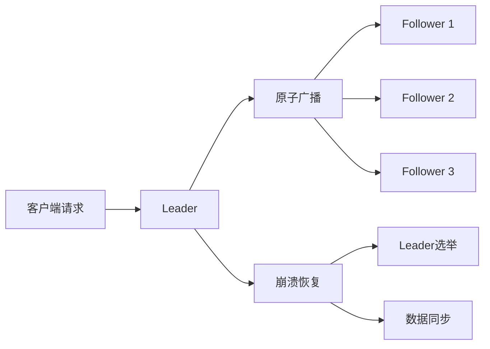

## 6. 时间与 ID：单调性与唯一性

### 6.1 分布式系统中的时间问题

#### 物理时钟 vs 逻辑时钟
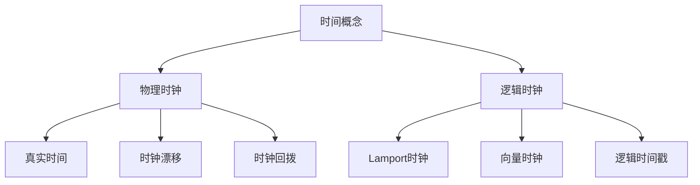

#### Lamport时钟
```java title="Lamport时钟实现"
public class LamportClock {
    private long timestamp = 0;
    private final String nodeId;
    
    public LamportClock(String nodeId) {
        this.nodeId = nodeId;
    }
    
    public long tick() {
        return ++timestamp;
    }
    
    public long send() {
        return tick();
    }
    
    public void receive(long receivedTimestamp) {
        timestamp = Math.max(timestamp, receivedTimestamp) + 1;
    }
    
    public long getTimestamp() {
        return timestamp;
    }
}
```

### 6.2 全局唯一ID生成

#### ID生成策略对比
| 策略 | 优点 | 缺点 | 适用场景 |
|------|------|------|----------|
| **数据库自增** | 简单、有序 | 单点故障、性能瓶颈 | 小规模系统 |
| **号段缓存** | 性能好、有序 | 浪费号段、单点故障 | 中等规模系统 |
| **UUID** | 去中心化、无冲突 | 无序、存储空间大 | 分布式系统 |
| **Snowflake** | 有序、高性能、去中心化 | 时钟依赖、实现复杂 | 大规模分布式系统 |

#### Snowflake算法实现
```java title="Snowflake ID生成器"
public final class SnowflakeIdGenerator {
    // 起始纪元（可自定义），31位差不多可覆盖多年
    private static final long EPOCH = 1577836800000L; // 2020-01-01
    // 机房ID与机器ID位宽（示例：5+5），序列12位
    private static final int DATACENTER_BITS = 5;
    private static final int WORKER_BITS = 5;
    private static final int SEQUENCE_BITS = 12;

    private static final long MAX_DATACENTER = (1L << DATACENTER_BITS) - 1;
    private static final long MAX_WORKER = (1L << WORKER_BITS) - 1;
    private static final long MAX_SEQUENCE = (1L << SEQUENCE_BITS) - 1;

    private static final int WORKER_SHIFT = SEQUENCE_BITS;
    private static final int DATACENTER_SHIFT = SEQUENCE_BITS + WORKER_BITS;
    private static final int TIMESTAMP_SHIFT = SEQUENCE_BITS + WORKER_BITS + DATACENTER_BITS;

    private final long datacenterId; // 机房ID
    private final long workerId;     // 机器ID

    private long lastTimestamp = -1L; // 上次生成ID的时间戳
    private long sequence = 0L;       // 当前毫秒内的序列

    public SnowflakeIdGenerator(long datacenterId, long workerId) {
        if (datacenterId < 0 || datacenterId > MAX_DATACENTER) {
            throw new IllegalArgumentException("bad datacenterId");
        }
        if (workerId < 0 || workerId > MAX_WORKER) {
            throw new IllegalArgumentException("bad workerId");
        }
        this.datacenterId = datacenterId;
        this.workerId = workerId;
    }

    // 线程安全：方法级同步，或使用CAS与自旋保证并发下正确性
    public synchronized long nextId() {
        long now = System.currentTimeMillis();
        if (now < lastTimestamp) {
            // 时钟回拨：可阻塞等待、抛错或使用回拨窗口序列
            long offset = lastTimestamp - now;
            if (offset > 5) { // 超过容忍窗口
                throw new IllegalStateException("clock moved backwards: " + offset + "ms");
            }
            // 退避等待到 lastTimestamp
            try { Thread.sleep(offset); } catch (InterruptedException ignored) {}
            now = System.currentTimeMillis();
        }
        if (now == lastTimestamp) {
            // 同一毫秒内自增序列
            sequence = (sequence + 1) & MAX_SEQUENCE;
            if (sequence == 0) {
                // 序列溢出，自旋到下一毫秒
                do { now = System.currentTimeMillis(); } while (now <= lastTimestamp);
            }
        } else {
            // 新毫秒重置序列
            sequence = 0L;
        }
        lastTimestamp = now;
        // 组装ID：时间戳高位 + 机房 + 机器 + 序列
        return ((now - EPOCH) << TIMESTAMP_SHIFT)
                | (datacenterId << DATACENTER_SHIFT)
                | (workerId << WORKER_SHIFT)
                | sequence;
    }
}
```

#### 号段缓存策略
```java title="号段缓存实现"
public class SegmentIdGenerator {
    private final DataSource dataSource;
    private final String bizType;
    private final int step = 1000; // 每次获取的号段大小
    
    private long currentId = 0;
    private long maxId = 0;
    
    public SegmentIdGenerator(DataSource dataSource, String bizType) {
        this.dataSource = dataSource;
        this.bizType = bizType;
        loadSegment();
    }
    
    public synchronized long nextId() {
        if (currentId >= maxId) {
            loadSegment();
        }
        return currentId++;
    }
    
    private void loadSegment() {
        try (Connection conn = dataSource.getConnection()) {
            conn.setAutoCommit(false);
            
            // 更新号段
            String updateSql = "UPDATE id_segments SET current_id = current_id + ? WHERE biz_type = ?";
            try (PreparedStatement stmt = conn.prepareStatement(updateSql)) {
                stmt.setInt(1, step);
                stmt.setString(2, bizType);
                stmt.executeUpdate();
            }
            
            // 获取当前号段
            String selectSql = "SELECT current_id FROM id_segments WHERE biz_type = ?";
            try (PreparedStatement stmt = conn.prepareStatement(selectSql)) {
                stmt.setString(1, bizType);
                ResultSet rs = stmt.executeQuery();
                if (rs.next()) {
                    currentId = rs.getLong("current_id") - step + 1;
                    maxId = rs.getLong("current_id");
                }
            }
            
            conn.commit();
        } catch (SQLException e) {
            throw new RuntimeException("Failed to load segment", e);
        }
    }
}
```

## 7. 可靠通信与重试（交付语义）

### 7.1 消息交付语义

#### 三种交付语义
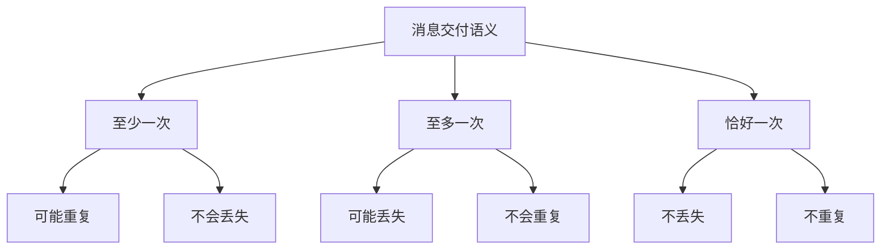

#### 至少一次交付（At-least-once）
```java title="至少一次交付实现"
public class AtLeastOnceSender {
    private final MessageQueue queue;
    private final int maxRetries;
    
    public void send(String message) {
        int retries = 0;
        while (retries < maxRetries) {
            try {
                queue.send(message);
                return; // 发送成功
            } catch (Exception e) {
                retries++;
                if (retries >= maxRetries) {
                    throw new RuntimeException("Failed to send message after " + maxRetries + " retries", e);
                }
                // 指数退避
                try {
                    Thread.sleep((long) Math.pow(2, retries) * 1000);
                } catch (InterruptedException ie) {
                    Thread.currentThread().interrupt();
                    break;
                }
            }
        }
    }
}
```

#### 恰好一次交付（Exactly-once）
```java title="恰好一次交付实现"
public class ExactlyOnceSender {
    private final MessageQueue queue;
    private final Set<String> processedIds = new ConcurrentHashSet<>();
    
    public void send(String messageId, String message) {
        // 检查是否已处理
        if (processedIds.contains(messageId)) {
            return; // 幂等处理
        }
        
        try {
            queue.send(message);
            processedIds.add(messageId);
        } catch (Exception e) {
            // 发送失败，不记录ID
            throw e;
        }
    }
    
    // 定期清理已处理的ID
    public void cleanupProcessedIds() {
        // 可以基于时间或数量清理
        if (processedIds.size() > 10000) {
            processedIds.clear();
        }
    }
}
```

### 7.2 重试策略

#### 指数退避算法
```java title="指数退避实现"
public class ExponentialBackoff {
    private final int maxRetries;
    private final long initialDelay;
    private final double multiplier;
    private final long maxDelay;
    
    public ExponentialBackoff(int maxRetries, long initialDelay, double multiplier, long maxDelay) {
        this.maxRetries = maxRetries;
        this.initialDelay = initialDelay;
        this.multiplier = multiplier;
        this.maxDelay = maxDelay;
    }
    
    public <T> T execute(Supplier<T> operation) throws Exception {
        int retries = 0;
        long delay = initialDelay;
        
        while (true) {
            try {
                return operation.get();
            } catch (Exception e) {
                retries++;
                if (retries > maxRetries) {
                    throw e;
                }
                
                // 计算退避时间
                long backoffDelay = Math.min(delay, maxDelay);
                
                // 添加抖动
                long jitter = (long) (Math.random() * backoffDelay * 0.1);
                long totalDelay = backoffDelay + jitter;
                
                Thread.sleep(totalDelay);
                delay = (long) (delay * multiplier);
            }
        }
    }
}
```

#### 重试策略配置
```java title="重试策略配置"
public class RetryConfig {
    private final int maxRetries;
    private final Duration initialDelay;
    private final Duration maxDelay;
    private final double multiplier;
    private final Set<Class<? extends Exception>> retryableExceptions;
    
    public static RetryConfig defaultConfig() {
        return new RetryConfig(
            3,                          // 最大重试次数
            Duration.ofMillis(100),     // 初始延迟
            Duration.ofSeconds(1),      // 最大延迟
            2.0,                        // 倍数
            Set.of(IOException.class, TimeoutException.class) // 可重试异常
        );
    }
    
    public boolean shouldRetry(Exception e, int attemptCount) {
        return attemptCount < maxRetries && 
               retryableExceptions.stream().anyMatch(ex -> ex.isInstance(e));
    }
}
```

:::tip 重试最佳实践
1. **设置最大重试次数**：避免无限重试
2. **使用指数退避**：减少对系统的压力
3. **添加抖动**：避免重试风暴
4. **区分异常类型**：只对特定异常重试
5. **实现幂等性**：确保重试不会产生副作用
:::

## 8. 设计与落地清单（Best Practices）

### 8.1 系统设计原则

#### 设计原则清单
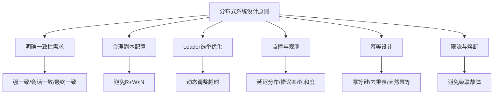

#### 一致性需求分析
```java title="一致性需求分析框架"
public class ConsistencyRequirementAnalyzer {
    
    public ConsistencyLevel analyzeRequirement(BusinessContext context) {
        // 分析业务场景
        if (isFinancialTransaction(context)) {
            return ConsistencyLevel.STRONG;
        }
        
        if (isUserSession(context)) {
            return ConsistencyLevel.SESSION;
        }
        
        if (isContentCache(context)) {
            return ConsistencyLevel.EVENTUAL;
        }
        
        return ConsistencyLevel.EVENTUAL; // 默认最终一致
    }
    
    private boolean isFinancialTransaction(BusinessContext context) {
        return context.getBusinessType() == BusinessType.FINANCIAL &&
               context.getDataImportance() == DataImportance.CRITICAL;
    }
    
    private boolean isUserSession(BusinessContext context) {
        return context.getBusinessType() == BusinessType.USER_SESSION;
    }
    
    private boolean isContentCache(BusinessContext context) {
        return context.getBusinessType() == BusinessType.CONTENT_CACHE;
    }
}
```

### 8.2 副本配置优化

#### Quorum配置检查
```java title="Quorum配置验证"
public class QuorumConfigValidator {
    
    public ValidationResult validateQuorumConfig(int replicaCount, int readQuorum, int writeQuorum) {
        ValidationResult result = new ValidationResult();
        
        // 检查基本约束
        if (readQuorum > replicaCount || writeQuorum > replicaCount) {
            result.addError("Quorum cannot exceed replica count");
        }
        
        if (readQuorum <= 0 || writeQuorum <= 0) {
            result.addError("Quorum must be positive");
        }
        
        // 检查一致性保证
        if (readQuorum + writeQuorum > replicaCount) {
            result.addInfo("Strong consistency guaranteed");
        } else {
            result.addWarning("Availability prioritized over consistency");
        }
        
        // 检查可用性
        int maxFailures = replicaCount - Math.max(readQuorum, writeQuorum);
        if (maxFailures < 1) {
            result.addError("System cannot tolerate any failures");
        }
        
        return result;
    }
}
```

### 8.3 监控与观测

#### 关键监控指标
```java title="分布式系统监控指标"
public class DistributedSystemMetrics {
    
    // 延迟指标
    public void recordLatency(String operation, long latency) {
        // 记录P50、P95、P99延迟
        histogram.record(latency);
    }
    
    // 错误率指标
    public void recordError(String operation, String errorType) {
        errorCounter.increment(errorType);
    }
    
    // 饱和度指标
    public void recordSaturation(String resource, double utilization) {
        gauge.set(utilization);
    }
    
    // 一致性指标
    public void recordConsistencyViolation(String dataType) {
        consistencyViolationCounter.increment(dataType);
    }
    
    // 分区指标
    public void recordPartition(String partitionType, long duration) {
        partitionHistogram.record(duration);
    }
}
```

#### 链路追踪
```java title="分布式链路追踪"
public class DistributedTracer {
    
    public Span startSpan(String operationName) {
        Span span = tracer.buildSpan(operationName)
                         .withTag("service", serviceName)
                         .withTag("node", nodeId)
                         .start();
        
        // 注入到当前上下文
        tracer.activateSpan(span);
        return span;
    }
    
    public void addEvent(String eventName, Map<String, Object> attributes) {
        Span span = tracer.activeSpan();
        if (span != null) {
            span.log(eventName, attributes);
        }
    }
    
    public void setTag(String key, String value) {
        Span span = tracer.activeSpan();
        if (span != null) {
            span.setTag(key, value);
        }
    }
}
```

### 8.4 幂等设计

#### 幂等性实现模式
```java title="幂等性实现"
public class IdempotentService {
    
    // 幂等键模式
    public void processWithIdempotentKey(String idempotentKey, Request request) {
        if (isProcessed(idempotentKey)) {
            return; // 已处理，直接返回
        }
        
        try {
            processRequest(request);
            markAsProcessed(idempotentKey);
        } catch (Exception e) {
            // 处理失败，不标记为已处理
            throw e;
        }
    }
    
    // 去重表模式
    public void processWithDeduplicationTable(String requestId, Request request) {
        try (Connection conn = dataSource.getConnection()) {
            conn.setAutoCommit(false);
            
            // 检查是否已处理
            if (isRequestProcessed(conn, requestId)) {
                conn.rollback();
                return;
            }
            
            // 标记为处理中
            markRequestAsProcessing(conn, requestId);
            
            // 处理请求
            processRequest(request);
            
            // 标记为已处理
            markRequestAsProcessed(conn, requestId);
            
            conn.commit();
        } catch (Exception e) {
            throw new RuntimeException("Failed to process request", e);
        }
    }
    
    // 天然幂等模式
    public void updateUserProfile(String userId, UserProfile profile) {
        // PUT操作天然幂等
        userRepository.put(userId, profile);
    }
}
```

### 8.5 限流与熔断

#### 限流器实现
```java title="分布式限流器"
public class DistributedRateLimiter {
    private final RedisTemplate<String, String> redisTemplate;
    private final String keyPrefix;
    
    public boolean tryAcquire(String resource, int permits, int capacity, Duration window) {
        String key = keyPrefix + ":" + resource;
        long now = System.currentTimeMillis();
        long windowStart = now - window.toMillis();
        
        // 使用Redis的ZREMRANGEBYSCORE和ZADD实现滑动窗口
        redisTemplate.execute(new SessionCallback<Boolean>() {
            @Override
            public Boolean execute(RedisOperations operations) throws DataAccessException {
                operations.multi();
                
                // 移除窗口外的请求
                operations.opsForZSet().removeRangeByScore(key, 0, windowStart);
                
                // 获取当前窗口内的请求数
                Long currentCount = operations.opsForZSet().zCard(key);
                
                if (currentCount + permits <= capacity) {
                    // 添加新请求
                    operations.opsForZSet().add(key, UUID.randomUUID().toString(), now);
                    return true;
                }
                
                return false;
            }
        });
        
        return false;
    }
}
```

#### 熔断器实现
```java title="熔断器模式"
public class CircuitBreaker {
    private final String name;
    private final int failureThreshold;
    private final Duration timeout;
    private final Duration resetTimeout;
    
    private CircuitState state = CircuitState.CLOSED;
    private int failureCount = 0;
    private long lastFailureTime = 0;
    
    public <T> T execute(Supplier<T> operation) throws Exception {
        if (state == CircuitState.OPEN) {
            if (System.currentTimeMillis() - lastFailureTime > resetTimeout.toMillis()) {
                state = CircuitState.HALF_OPEN;
            } else {
                throw new CircuitBreakerOpenException("Circuit breaker is open");
            }
        }
        
        try {
            T result = operation.get();
            onSuccess();
            return result;
        } catch (Exception e) {
            onFailure();
            throw e;
        }
    }
    
    private void onSuccess() {
        failureCount = 0;
        if (state == CircuitState.HALF_OPEN) {
            state = CircuitState.CLOSED;
        }
    }
    
    private void onFailure() {
        failureCount++;
        lastFailureTime = System.currentTimeMillis();
        
        if (failureCount >= failureThreshold) {
            state = CircuitState.OPEN;
        }
    }
}
```

## 9. 常见坑位（Pitfalls）

### 9.1 时钟依赖问题

#### 时钟回拨处理
```java title="时钟回拨处理"
public class ClockDriftHandler {
    
    public void handleClockDrift(long currentTime, long lastTime) {
        if (currentTime < lastTime) {
            long drift = lastTime - currentTime;
            
            if (drift > maxAllowedDrift) {
                // 时钟回拨过大，记录告警
                alertService.sendAlert("Clock drift too large: " + drift + "ms");
                
                // 可以选择停止服务或使用逻辑时钟
                if (stopOnLargeDrift) {
                    throw new ClockDriftException("Clock drifted too much");
                }
            } else {
                // 小幅度回拨，等待时钟追上
                try {
                    Thread.sleep(drift);
                } catch (InterruptedException e) {
                    Thread.currentThread().interrupt();
                }
            }
        }
    }
}
```

### 9.2 网络分区处理

#### 分区检测
```java title="网络分区检测"
public class PartitionDetector {
    private final Map<String, Long> lastHeartbeat = new ConcurrentHashMap<>();
    private final Duration heartbeatTimeout;
    
    public void recordHeartbeat(String nodeId) {
        lastHeartbeat.put(nodeId, System.currentTimeMillis());
    }
    
    public List<String> detectPartitionedNodes() {
        long now = System.currentTimeMillis();
        return lastHeartbeat.entrySet().stream()
                .filter(entry -> now - entry.getValue() > heartbeatTimeout.toMillis())
                .map(Map.Entry::getKey)
                .collect(Collectors.toList());
    }
    
    public void handlePartition(List<String> partitionedNodes) {
        // 根据业务需求处理分区
        if (isCriticalPartition(partitionedNodes)) {
            // 触发故障转移
            triggerFailover();
        } else {
            // 记录分区事件
            logPartitionEvent(partitionedNodes);
        }
    }
}
```

### 9.3 写扩散问题

#### 写扩散检测
```java title="写扩散检测"
public class WriteAmplificationDetector {
    
    public void detectWriteAmplification(String operation, int actualWrites, int expectedWrites) {
        double amplification = (double) actualWrites / expectedWrites;
        
        if (amplification > writeAmplificationThreshold) {
            // 记录写扩散事件
            metrics.recordWriteAmplification(operation, amplification);
            
            // 发送告警
            if (amplification > criticalThreshold) {
                alertService.sendAlert("Critical write amplification: " + amplification);
            }
        }
    }
    
    public void optimizeWritePattern(String operation) {
        // 分析写模式，提供优化建议
        WritePattern pattern = analyzeWritePattern(operation);
        
        if (pattern.hasCrossShardWrites()) {
            suggestBatchWrites(pattern);
        }
        
        if (pattern.hasRedundantWrites()) {
            suggestDeduplication(pattern);
        }
    }
}
```

### 9.4 幂等性缺失

#### 幂等性检查
```java title="幂等性检查工具"
public class IdempotencyChecker {
    
    public void checkIdempotency(String operation, Object request) {
        if (!isIdempotent(operation)) {
            logWarning("Operation " + operation + " may not be idempotent");
            
            // 建议添加幂等键
            suggestIdempotencyKey(operation);
        }
    }
    
    private boolean isIdempotent(String operation) {
        // 检查操作是否天然幂等
        return operation.startsWith("PUT") || 
               operation.startsWith("DELETE") ||
               operation.equals("GET");
    }
    
    private void suggestIdempotencyKey(String operation) {
        // 提供添加幂等键的建议
        logInfo("Consider adding idempotency key for operation: " + operation);
    }
}
```

## 10. 面试题精选

### 10.1 基础概念题

#### Q1: 请解释CAP定理，并举CP与AP系统的实际案例，说明取舍理由

**答**: CAP定理是分布式系统设计的理论基础，指出在网络分区（P）发生时，系统只能在一致性（C）和可用性（A）之间选择其一。

**CP系统案例**：
- **ZooKeeper**：配置管理、分布式锁
- **理由**：配置数据必须一致，否则会导致系统行为不一致

**AP系统案例**：
- **Cassandra**：内容存储、日志系统
- **理由**：可用性优先，数据最终一致即可

**取舍考虑**：
1. **数据重要性**：关键数据选CP，非关键数据选AP
2. **实时性要求**：强实时选CP，可容忍延迟选AP
3. **业务容忍度**：对数据错误容忍度低选CP，对服务中断容忍度低选AP

#### Q2: Quorum条件R+W>N能保证什么？在网络分区下有哪些限制？

**答**: 
**R+W>N保证**：
- 读操作一定能读到最新写入的数据
- 在单分区前提下提供强一致性保证

**网络分区限制**：
- 当网络分区时，可能无法满足R+W>N条件
- 需要在一致性和可用性之间做出选择
- 可能出现脑裂问题

**示例**：
```text
N=3, R=2, W=2的情况：
- 正常情况：R+W=4>3，强一致性
- 网络分区：可能只有2个节点可达，无法满足W=2
```

### 10.2 算法实现题

#### Q3: Raft如何保证日志的一致复制与提交索引的安全性？

**答**: 
**日志一致复制**：
1. **Leader选举**：只有包含所有已提交日志的节点才能成为Leader
2. **日志匹配**：Leader发送AppendEntries时包含前一条日志的索引和任期
3. **强制覆盖**：Follower发现日志不匹配时，删除冲突日志并接受Leader的日志

**提交索引安全性**：
1. **多数派确认**：只有多数派复制了日志，Leader才提交
2. **任期检查**：只有当前任期的日志才能通过多数派提交
3. **向后传播**：提交索引向后传播，确保之前任期的日志也被提交

**代码示例**：
```java
private void tryCommit() {
    for (long i = commitIndex + 1; i <= entries.size(); i++) {
        int replicatedCount = 1; // 自己
        for (String peer : peers) {
            if (matchIndex.get(peer) >= i) {
                replicatedCount++;
            }
        }
        
        // 只有当前任期的日志才能通过多数派提交
        if (replicatedCount > majority() && 
            entries.get((int)i-1).getTerm() == currentTerm) {
            commitIndex = i;
        }
    }
}
```

#### Q4: 何时选择CRDT？与向量时钟的关系与局限

**答**: 
**CRDT适用场景**：
1. **协作编辑**：多人同时编辑文档
2. **计数器**：分布式计数器
3. **集合操作**：分布式集合的并集、交集
4. **最终一致性场景**：可以接受最终一致性的应用

**与向量时钟的关系**：
- **向量时钟**：检测因果关系，但不解决冲突
- **CRDT**：天然收敛，无需冲突解决
- **结合使用**：向量时钟用于检测冲突，CRDT用于自动合并

**CRDT局限**：
1. **类型特定**：每种数据类型需要特定的CRDT实现
2. **存储开销**：需要存储额外的元数据
3. **语义限制**：不是所有操作都能用CRDT表示

### 10.3 系统设计题

#### Q5: 设计一个全局唯一ID方案，如何处理时钟回拨与热点分配

**答**: 
**设计方案**：
```java
public class GlobalIdGenerator {
    private final long datacenterId;
    private final long workerId;
    private final AtomicLong sequence = new AtomicLong(0);
    private volatile long lastTimestamp = -1L;
    
    public long nextId() {
        long timestamp = System.currentTimeMillis();
        
        // 处理时钟回拨
        if (timestamp < lastTimestamp) {
            long offset = lastTimestamp - timestamp;
            if (offset > maxClockDrift) {
                throw new ClockDriftException("Clock drifted too much");
            }
            // 等待时钟追上
            while (timestamp < lastTimestamp) {
                timestamp = System.currentTimeMillis();
            }
        }
        
        // 处理同一毫秒内的序列
        if (timestamp == lastTimestamp) {
            long currentSequence = sequence.incrementAndGet();
            if (currentSequence > maxSequence) {
                // 序列溢出，等待下一毫秒
                timestamp = waitForNextMillis(lastTimestamp);
                sequence.set(0);
            }
        } else {
            sequence.set(0);
        }
        
        lastTimestamp = timestamp;
        
        return ((timestamp - epoch) << timestampShift) |
               (datacenterId << datacenterShift) |
               (workerId << workerShift) |
               sequence.get();
    }
}
```

**时钟回拨处理**：
1. **检测回拨**：比较当前时间与上次时间
2. **容忍窗口**：小幅度回拨等待时钟追上
3. **异常处理**：大幅度回拨抛出异常

**热点分配处理**：
1. **预分配号段**：提前分配号段，减少竞争
2. **批量生成**：一次生成多个ID
3. **本地缓存**：在本地缓存一定数量的ID

#### Q6: 如何设计一个高可用的分布式锁系统？

**答**: 
**设计方案**：
```java
public class DistributedLock {
    private final ZooKeeper zk;
    private final String lockPath;
    private final String lockName;
    
    public boolean tryLock(String resource, long timeout) {
        try {
            // 创建临时顺序节点
            String path = zk.create("/locks/" + resource + "/lock-", 
                                   new byte[0], 
                                   ZooDefs.Ids.OPEN_ACL_UNSAFE, 
                                   CreateMode.EPHEMERAL_SEQUENTIAL);
            
            // 检查是否获得锁
            List<String> children = zk.getChildren("/locks/" + resource, false);
            Collections.sort(children);
            
            if (path.endsWith(children.get(0))) {
                return true; // 获得锁
            }
            
            // 等待锁释放
            return waitForLock(children, path, timeout);
        } catch (Exception e) {
            return false;
        }
    }
    
    private boolean waitForLock(List<String> children, String path, long timeout) {
        // 监听前一个节点的删除事件
        String watchPath = "/locks/" + resource + "/" + children.get(getIndex(children, path) - 1);
        
        CountDownLatch latch = new CountDownLatch(1);
        Watcher watcher = event -> {
            if (event.getType() == EventType.NodeDeleted) {
                latch.countDown();
            }
        };
        
        try {
            zk.exists(watchPath, watcher);
            return latch.await(timeout, TimeUnit.MILLISECONDS);
        } catch (Exception e) {
            return false;
        }
    }
}
```

**高可用保证**：
1. **多副本**：使用ZooKeeper集群，容忍部分节点故障
2. **自动故障转移**：Leader故障时自动选举新Leader
3. **监控告警**：监控锁的获取和释放情况
4. **超时机制**：设置合理的超时时间，避免死锁

#### Q7: 设计一个分布式缓存系统，如何处理缓存一致性问题？

**答**: 
**设计方案**：
```java
public class DistributedCache {
    private final Map<String, CacheNode> nodes;
    private final ConsistencyLevel consistencyLevel;
    
    public void put(String key, String value) {
        switch (consistencyLevel) {
            case STRONG:
                // 强一致性：同步写入所有节点
                putStrongConsistency(key, value);
                break;
            case EVENTUAL:
                // 最终一致性：异步写入
                putEventualConsistency(key, value);
                break;
        }
    }
    
    private void putStrongConsistency(String key, String value) {
        int successCount = 0;
        for (CacheNode node : nodes.values()) {
            try {
                node.put(key, value);
                successCount++;
            } catch (Exception e) {
                // 记录失败
            }
        }
        
        if (successCount < majority()) {
            throw new ConsistencyException("Failed to achieve strong consistency");
        }
    }
    
    private void putEventualConsistency(String key, String value) {
        // 先写入本地
        localCache.put(key, value);
        
        // 异步复制到其他节点
        for (CacheNode node : nodes.values()) {
            CompletableFuture.runAsync(() -> {
                try {
                    node.put(key, value);
                } catch (Exception e) {
                    // 异步失败不影响主流程
                }
            });
        }
    }
}
```

**一致性处理策略**：
1. **强一致性**：同步写入所有节点，确保数据一致
2. **最终一致性**：异步复制，接受短暂不一致
3. **版本控制**：使用版本号检测冲突
4. **失效策略**：设置合理的缓存失效时间

:::tip 分布式系统学习要点
1. **理解CAP定理**：这是分布式系统设计的理论基础
2. **掌握一致性模型**：根据业务需求选择合适的一致性级别
3. **熟悉共识算法**：理解Paxos、Raft等算法的原理
4. **实践工程经验**：在实际项目中应用分布式系统理论
5. **持续学习**：分布式系统技术不断发展，需要持续学习
:::

---

通过本章的学习，你应该已经掌握了分布式系统的核心理论、设计原则和工程实践。分布式系统是现代互联网应用的基础，理解这些理论对于构建高可用、高性能的系统至关重要。在实际项目中，要根据具体需求选择合适的理论和技术，并在实践中不断优化和改进。
