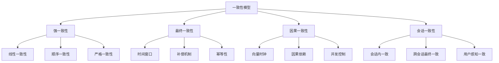
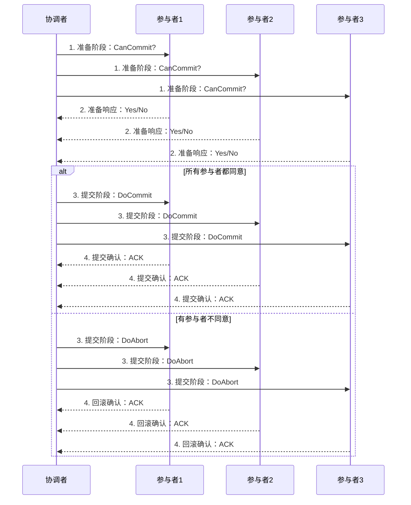
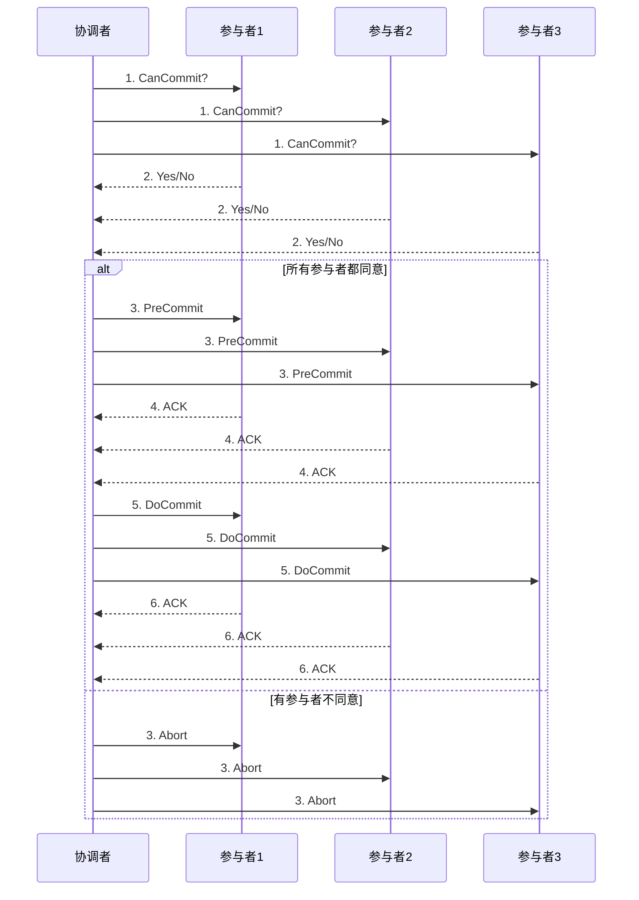
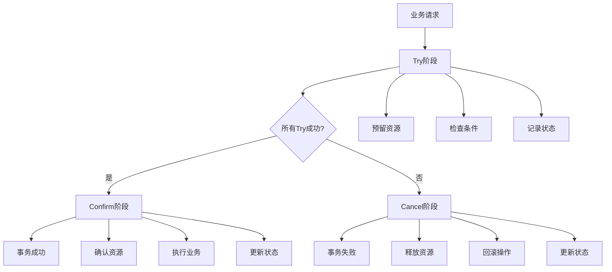

# 分布式事务解决方案详解

分布式事务是分布式系统中的核心挑战，用于在多个服务/数据库之间保持数据一致性。本章将详细介绍分布式事务的理论基础、技术方案和最佳实践。

:::tip 分布式事务的重要性
- **数据一致性**：确保跨服务的数据操作保持一致性
- **业务完整性**：保证复杂业务流程的原子性
- **系统可靠性**：提高分布式系统的容错能力
- **用户体验**：避免数据不一致导致的用户困惑
:::

## 1. 分布式事务基础理论

### 1.1 分布式事务的挑战

分布式事务面临的主要挑战包括：

| 挑战 | 描述 | 影响 |
|------|------|------|
| **网络分区** | 网络延迟、丢包、分区 | 消息传递不可靠 |
| **节点故障** | 服务宕机、数据库故障 | 事务状态不一致 |
| **时钟不同步** | 各节点时钟存在偏差 | 时序判断错误 |
| **并发控制** | 多事务并发执行 | 数据竞争和死锁 |

### 1.2 一致性模型



## 2. 两阶段提交协议（2PC）

### 2.1 2PC协议原理

两阶段提交协议是分布式事务的基础协议，通过两个阶段来保证事务的原子性。

#### 协议流程



### 2.2 2PC实现示例

```java title="2PC协调者实现"
@Service
public class TwoPhaseCommitCoordinator {
    
    private final List<TransactionParticipant> participants;
    private final TransactionLog transactionLog;
    
    public TwoPhaseCommitCoordinator(List<TransactionParticipant> participants) {
        this.participants = participants;
        this.transactionLog = new TransactionLog();
    }
    
    /**
     * 执行两阶段提交
     */
    public boolean executeTransaction(TransactionContext context) {
        String transactionId = generateTransactionId();
        
        try {
            // 记录事务开始
            transactionLog.logTransactionStart(transactionId, context);
            
            // 第一阶段：准备阶段
            if (!preparePhase(transactionId, context)) {
                // 准备失败，执行回滚
                abortPhase(transactionId, context);
                return false;
            }
            
            // 第二阶段：提交阶段
            if (!commitPhase(transactionId, context)) {
                // 提交失败，需要人工干预
                log.error("Transaction commit failed: " + transactionId);
                return false;
            }
            
            // 记录事务完成
            transactionLog.logTransactionComplete(transactionId);
            return true;
            
        } catch (Exception e) {
            log.error("Transaction execution failed: " + transactionId, e);
            // 发生异常，执行回滚
            abortPhase(transactionId, context);
            return false;
        }
    }
    
    /**
     * 准备阶段：询问所有参与者是否可以提交
     */
    private boolean preparePhase(String transactionId, TransactionContext context) {
        List<CompletableFuture<Boolean>> futures = new ArrayList<>();
        
        // 并行询问所有参与者
        for (TransactionParticipant participant : participants) {
            CompletableFuture<Boolean> future = CompletableFuture.supplyAsync(() -> {
                try {
                    return participant.prepare(transactionId, context);
                } catch (Exception e) {
                    log.error("Participant prepare failed: " + participant.getId(), e);
                    return false;
                }
            });
            futures.add(future);
        }
        
        // 等待所有参与者响应
        try {
            CompletableFuture<Void> allFutures = CompletableFuture.allOf(
                futures.toArray(new CompletableFuture[0])
            );
            allFutures.get(30, TimeUnit.SECONDS); // 30秒超时
            
            // 检查所有参与者是否都同意
            for (CompletableFuture<Boolean> future : futures) {
                if (!future.get()) {
                    return false; // 有参与者不同意
                }
            }
            
            return true; // 所有参与者都同意
            
        } catch (Exception e) {
            log.error("Prepare phase failed: " + transactionId, e);
            return false;
        }
    }
    
    /**
     * 提交阶段：通知所有参与者提交事务
     */
    private boolean commitPhase(String transactionId, TransactionContext context) {
        List<CompletableFuture<Boolean>> futures = new ArrayList<>();
        
        // 并行通知所有参与者提交
        for (TransactionParticipant participant : participants) {
            CompletableFuture<Boolean> future = CompletableFuture.supplyAsync(() -> {
                try {
                    return participant.commit(transactionId, context);
                } catch (Exception e) {
                    log.error("Participant commit failed: " + participant.getId(), e);
                    return false;
                }
            });
            futures.add(future);
        }
        
        // 等待所有参与者确认
        try {
            CompletableFuture<Void> allFutures = CompletableFuture.allOf(
                futures.toArray(new CompletableFuture[0])
            );
            allFutures.get(30, TimeUnit.SECONDS); // 30秒超时
            
            // 检查所有参与者是否都提交成功
            for (CompletableFuture<Boolean> future : futures) {
                if (!future.get()) {
                    return false; // 有参与者提交失败
                }
            }
            
            return true; // 所有参与者都提交成功
            
        } catch (Exception e) {
            log.error("Commit phase failed: " + transactionId, e);
            return false;
        }
    }
    
    /**
     * 回滚阶段：通知所有参与者回滚事务
     */
    private void abortPhase(String transactionId, TransactionContext context) {
        // 并行通知所有参与者回滚
        for (TransactionParticipant participant : participants) {
            CompletableFuture.runAsync(() -> {
                try {
                    participant.abort(transactionId, context);
                } catch (Exception e) {
                    log.error("Participant abort failed: " + participant.getId(), e);
                }
            });
        }
        
        // 记录事务回滚
        transactionLog.logTransactionAbort(transactionId);
    }
}
```

### 2.3 参与者实现

```java title="2PC参与者实现"
@Service
public class TransactionParticipant {
    
    private final String participantId;
    private final DataSource dataSource;
    private final TransactionLog transactionLog;
    
    public TransactionParticipant(String participantId, DataSource dataSource) {
        this.participantId = participantId;
        this.dataSource = dataSource;
        this.transactionLog = new TransactionLog();
    }
    
    /**
     * 准备阶段：检查是否可以提交
     */
    public boolean prepare(String transactionId, TransactionContext context) {
        Connection connection = null;
        try {
            connection = dataSource.getConnection();
            connection.setAutoCommit(false);
            
            // 记录准备状态
            transactionLog.logPrepare(transactionId, participantId, context);
            
            // 执行预提交操作
            boolean canCommit = executePreCommit(connection, context);
            
            if (canCommit) {
                // 记录准备成功
                transactionLog.logPrepareSuccess(transactionId, participantId);
                return true;
            } else {
                // 记录准备失败
                transactionLog.logPrepareFailure(transactionId, participantId);
                return false;
            }
            
        } catch (Exception e) {
            log.error("Prepare failed: " + transactionId, e);
            transactionLog.logPrepareFailure(transactionId, participantId, e);
            return false;
        } finally {
            if (connection != null) {
                try {
                    connection.close();
                } catch (SQLException e) {
                    log.error("Failed to close connection", e);
                }
            }
        }
    }
    
    /**
     * 提交阶段：执行实际提交
     */
    public boolean commit(String transactionId, TransactionContext context) {
        Connection connection = null;
        try {
            connection = dataSource.getConnection();
            connection.setAutoCommit(false);
            
            // 检查是否已经准备
            if (!transactionLog.isPrepared(transactionId, participantId)) {
                log.error("Transaction not prepared: " + transactionId);
                return false;
            }
            
            // 执行提交操作
            boolean success = executeCommit(connection, context);
            
            if (success) {
                connection.commit();
                transactionLog.logCommitSuccess(transactionId, participantId);
                return true;
            } else {
                connection.rollback();
                transactionLog.logCommitFailure(transactionId, participantId);
                return false;
            }
            
        } catch (Exception e) {
            log.error("Commit failed: " + transactionId, e);
            if (connection != null) {
                try {
                    connection.rollback();
                } catch (SQLException se) {
                    log.error("Failed to rollback", se);
                }
            }
            transactionLog.logCommitFailure(transactionId, participantId, e);
            return false;
        } finally {
            if (connection != null) {
                try {
                    connection.close();
                } catch (SQLException e) {
                    log.error("Failed to close connection", e);
                }
            }
        }
    }
    
    /**
     * 回滚阶段：执行回滚操作
     */
    public boolean abort(String transactionId, TransactionContext context) {
        Connection connection = null;
        try {
            connection = dataSource.getConnection();
            connection.setAutoCommit(false);
            
            // 执行回滚操作
            boolean success = executeAbort(connection, context);
            
            if (success) {
                connection.commit();
                transactionLog.logAbortSuccess(transactionId, participantId);
                return true;
            } else {
                connection.rollback();
                transactionLog.logAbortFailure(transactionId, participantId);
                return false;
            }
            
        } catch (Exception e) {
            log.error("Abort failed: " + transactionId, e);
            if (connection != null) {
                try {
                    connection.rollback();
                } catch (SQLException se) {
                    log.error("Failed to rollback", se);
                }
            }
            transactionLog.logAbortFailure(transactionId, participantId, e);
            return false;
        } finally {
            if (connection != null) {
                try {
                    connection.close();
                } catch (SQLException e) {
                    log.error("Failed to close connection", e);
                }
            }
        }
    }
    
    /**
     * 执行预提交操作
     */
    private boolean executePreCommit(Connection connection, TransactionContext context) {
        // 具体的预提交逻辑
        // 例如：检查资源可用性、预留资源等
        return true;
    }
    
    /**
     * 执行提交操作
     */
    private boolean executeCommit(Connection connection, TransactionContext context) {
        // 具体的提交逻辑
        // 例如：更新数据库、发送消息等
        return true;
    }
    
    /**
     * 执行回滚操作
     */
    private boolean executeAbort(Connection connection, TransactionContext context) {
        // 具体的回滚逻辑
        // 例如：释放资源、撤销操作等
        return true;
    }
}
```

### 2.4 2PC的优缺点

#### 优点
- **强一致性**：保证事务的ACID特性
- **实现简单**：协议相对简单，易于理解
- **理论成熟**：有完善的理论基础

#### 缺点
- **性能问题**：
  - 协调者单点瓶颈
  - 准备阶段长期持锁，影响吞吐量
  - 两阶段通信开销大

- **可用性问题**：
  - 协调者单点故障
  - 参与者故障影响整个事务
  - 网络分区导致阻塞

- **恢复复杂**：
  - 协调者崩溃恢复复杂
  - 需要超时机制和重选策略
  - 状态不一致处理困难

:::caution 2PC适用场景
2PC适用于对一致性要求极高、事务规模较小的场景，如金融交易、库存管理等。
:::

## 3. 三阶段提交协议（3PC）

### 3.1 3PC协议原理

三阶段提交协议是对2PC的改进，通过增加预提交阶段来减少阻塞时间，提高系统性能。

#### 协议流程



### 3.2 3PC的优势

#### 相比2PC的改进
- **减少阻塞时间**：预提交阶段减少了资源锁定时间
- **提高性能**：并行处理能力更强
- **更好的容错性**：超时机制更完善

#### 仍然存在的问题
- **实现复杂**：增加了预提交阶段的复杂性
- **网络开销**：多了一个阶段的通信开销
- **工程落地困难**：实际应用中较少采用

:::info 3PC现状
现代分布式系统较少直接使用3PC，更多采用基于补偿的最终一致性方案，如TCC、Saga等。
:::

## 4. TCC模式（Try-Confirm-Cancel）

### 4.1 TCC模式原理

TCC（Try-Confirm-Cancel）是一种基于补偿的分布式事务模式，将事务拆分为三个阶段：

- **Try阶段**：资源预留，检查并预留资源
- **Confirm阶段**：确认执行，使用预留的资源
- **Cancel阶段**：取消执行，释放预留的资源



### 4.2 TCC接口设计

```java title="TCC接口定义"
public interface TccService {
    
    /**
     * Try阶段：资源预留
     * @param context 事务上下文
     * @return 是否预留成功
     */
    boolean try(TransactionContext context);
    
    /**
     * Confirm阶段：确认执行
     * @param context 事务上下文
     * @return 是否确认成功
     */
    boolean confirm(TransactionContext context);
    
    /**
     * Cancel阶段：取消执行
     * @param context 事务上下文
     * @return 是否取消成功
     */
    boolean cancel(TransactionContext context);
}
```

### 4.3 账户服务TCC实现

```java title="账户服务TCC实现"
@Service
public class AccountTccService implements TccService {
    
    private final AccountRepository accountRepository;
    private final TransactionLog transactionLog;
    
    @Override
    public boolean try(TransactionContext context) {
        String transactionId = context.getTransactionId();
        String accountId = context.getAccountId();
        BigDecimal amount = context.getAmount();
        
        try {
            // 1. 检查账户是否存在
            Account account = accountRepository.findById(accountId);
            if (account == null) {
                log.error("Account not found: " + accountId);
                return false;
            }
            
            // 2. 检查余额是否充足
            if (account.getBalance().compareTo(amount) < 0) {
                log.error("Insufficient balance: " + accountId);
                return false;
            }
            
            // 3. 冻结资金（预留资源）
            account.setFrozenAmount(account.getFrozenAmount().add(amount));
            account.setBalance(account.getBalance().subtract(amount));
            accountRepository.save(account);
            
            // 4. 记录Try操作
            transactionLog.logTry(transactionId, accountId, amount);
            
            return true;
            
        } catch (Exception e) {
            log.error("Try failed for account: " + accountId, e);
            return false;
        }
    }
    
    @Override
    public boolean confirm(TransactionContext context) {
        String transactionId = context.getTransactionId();
        String accountId = context.getAccountId();
        BigDecimal amount = context.getAmount();
        
        try {
            // 1. 检查是否已经Try过
            if (!transactionLog.hasTried(transactionId, accountId)) {
                log.error("Transaction not tried: " + transactionId);
                return false;
            }
            
            // 2. 检查是否已经Confirm过（幂等性）
            if (transactionLog.hasConfirmed(transactionId, accountId)) {
                log.info("Transaction already confirmed: " + transactionId);
                return true;
            }
            
            // 3. 确认扣款（使用冻结的资金）
            Account account = accountRepository.findById(accountId);
            if (account != null) {
                // 解冻资金，实际扣款
                account.setFrozenAmount(account.getFrozenAmount().subtract(amount));
                accountRepository.save(account);
            }
            
            // 4. 记录Confirm操作
            transactionLog.logConfirm(transactionId, accountId, amount);
            
            return true;
            
        } catch (Exception e) {
            log.error("Confirm failed for account: " + accountId, e);
            return false;
        }
    }
    
    @Override
    public boolean cancel(TransactionContext context) {
        String transactionId = context.getTransactionId();
        String accountId = context.getAccountId();
        BigDecimal amount = context.getAmount();
        
        try {
            // 1. 检查是否已经Try过
            if (!transactionLog.hasTried(transactionId, accountId)) {
                log.error("Transaction not tried: " + transactionId);
                return false;
            }
            
            // 2. 检查是否已经Cancel过（幂等性）
            if (transactionLog.hasCancelled(transactionId, accountId)) {
                log.info("Transaction already cancelled: " + transactionId);
                return true;
            }
            
            // 3. 解冻资金（释放预留的资源）
            Account account = accountRepository.findById(accountId);
            if (account != null) {
                account.setFrozenAmount(account.getFrozenAmount().subtract(amount));
                account.setBalance(account.getBalance().add(amount));
                accountRepository.save(account);
            }
            
            // 4. 记录Cancel操作
            transactionLog.logCancel(transactionId, accountId, amount);
            
            return true;
            
        } catch (Exception e) {
            log.error("Cancel failed for account: " + accountId, e);
            return false;
        }
    }
}
```

### 4.4 库存服务TCC实现

```java title="库存服务TCC实现"
@Service
public class InventoryTccService implements TccService {
    
    private final InventoryRepository inventoryRepository;
    private final TransactionLog transactionLog;
    
    @Override
    public boolean try(TransactionContext context) {
        String transactionId = context.getTransactionId();
        String productId = context.getProductId();
        int quantity = context.getQuantity();
        
        try {
            // 1. 检查商品是否存在
            Inventory inventory = inventoryRepository.findByProductId(productId);
            if (inventory == null) {
                log.error("Product not found: " + productId);
                return false;
            }
            
            // 2. 检查库存是否充足
            if (inventory.getAvailableStock() < quantity) {
                log.error("Insufficient stock: " + productId);
                return false;
            }
            
            // 3. 预留库存
            inventory.setAvailableStock(inventory.getAvailableStock() - quantity);
            inventory.setReservedStock(inventory.getReservedStock() + quantity);
            inventoryRepository.save(inventory);
            
            // 4. 记录Try操作
            transactionLog.logTry(transactionId, productId, quantity);
            
            return true;
            
        } catch (Exception e) {
            log.error("Try failed for product: " + productId, e);
            return false;
        }
    }
    
    @Override
    public boolean confirm(TransactionContext context) {
        String transactionId = context.getTransactionId();
        String productId = context.getProductId();
        int quantity = context.getQuantity();
        
        try {
            // 1. 检查是否已经Try过
            if (!transactionLog.hasTried(transactionId, productId)) {
                log.error("Transaction not tried: " + transactionId);
                return false;
            }
            
            // 2. 检查是否已经Confirm过（幂等性）
            if (transactionLog.hasConfirmed(transactionId, productId)) {
                log.info("Transaction already confirmed: " + transactionId);
                return true;
            }
            
            // 3. 确认扣减库存
            Inventory inventory = inventoryRepository.findByProductId(productId);
            if (inventory != null) {
                // 解冻库存，实际扣减
                inventory.setReservedStock(inventory.getReservedStock() - quantity);
                inventoryRepository.save(inventory);
            }
            
            // 4. 记录Confirm操作
            transactionLog.logConfirm(transactionId, productId, quantity);
            
            return true;
            
        } catch (Exception e) {
            log.error("Confirm failed for product: " + productId, e);
            return false;
        }
    }
    
    @Override
    public boolean cancel(TransactionContext context) {
        String transactionId = context.getTransactionId();
        String productId = context.getProductId();
        int quantity = context.getQuantity();
        
        try {
            // 1. 检查是否已经Try过
            if (!transactionLog.hasTried(transactionId, productId)) {
                log.error("Transaction not tried: " + transactionId);
                return false;
            }
            
            // 2. 检查是否已经Cancel过（幂等性）
            if (transactionLog.hasCancelled(transactionId, productId)) {
                log.info("Transaction already cancelled: " + transactionId);
                return true;
            }
            
            // 3. 释放预留库存
            Inventory inventory = inventoryRepository.findByProductId(productId);
            if (inventory != null) {
                inventory.setReservedStock(inventory.getReservedStock() - quantity);
                inventory.setAvailableStock(inventory.getAvailableStock() + quantity);
                inventoryRepository.save(inventory);
            }
            
            // 4. 记录Cancel操作
            transactionLog.logCancel(transactionId, productId, quantity);
            
            return true;
            
        } catch (Exception e) {
            log.error("Cancel failed for product: " + productId, e);
            return false;
        }
    }
}
```

### 4.5 TCC事务协调器

```java title="TCC事务协调器"
@Service
public class TccTransactionCoordinator {
    
    private final List<TccService> tccServices;
    private final TransactionLog transactionLog;
    
    public TccTransactionCoordinator(List<TccService> tccServices) {
        this.tccServices = tccServices;
        this.transactionLog = new TransactionLog();
    }
    
    /**
     * 执行TCC事务
     */
    public boolean executeTransaction(TransactionContext context) {
        String transactionId = context.getTransactionId();
        
        try {
            // 记录事务开始
            transactionLog.logTransactionStart(transactionId, context);
            
            // Try阶段：所有服务预留资源
            if (!tryPhase(transactionId, context)) {
                // Try失败，执行Cancel
                cancelPhase(transactionId, context);
                return false;
            }
            
            // Confirm阶段：所有服务确认执行
            if (!confirmPhase(transactionId, context)) {
                // Confirm失败，需要人工干预
                log.error("Transaction confirm failed: " + transactionId);
                return false;
            }
            
            // 记录事务完成
            transactionLog.logTransactionComplete(transactionId);
            return true;
            
        } catch (Exception e) {
            log.error("Transaction execution failed: " + transactionId, e);
            // 发生异常，执行Cancel
            cancelPhase(transactionId, context);
            return false;
        }
    }
    
    /**
     * Try阶段：所有服务预留资源
     */
    private boolean tryPhase(String transactionId, TransactionContext context) {
        List<CompletableFuture<Boolean>> futures = new ArrayList<>();
        
        // 并行执行所有服务的Try操作
        for (TccService service : tccServices) {
            CompletableFuture<Boolean> future = CompletableFuture.supplyAsync(() -> {
                try {
                    return service.try(context);
                } catch (Exception e) {
                    log.error("Service try failed", e);
                    return false;
                }
            });
            futures.add(future);
        }
        
        // 等待所有服务完成Try
        try {
            CompletableFuture<Void> allFutures = CompletableFuture.allOf(
                futures.toArray(new CompletableFuture[0])
            );
            allFutures.get(30, TimeUnit.SECONDS); // 30秒超时
            
            // 检查所有服务是否都Try成功
            for (CompletableFuture<Boolean> future : futures) {
                if (!future.get()) {
                    return false; // 有服务Try失败
                }
            }
            
            return true; // 所有服务都Try成功
            
        } catch (Exception e) {
            log.error("Try phase failed: " + transactionId, e);
            return false;
        }
    }
    
    /**
     * Confirm阶段：所有服务确认执行
     */
    private boolean confirmPhase(String transactionId, TransactionContext context) {
        List<CompletableFuture<Boolean>> futures = new ArrayList<>();
        
        // 并行执行所有服务的Confirm操作
        for (TccService service : tccServices) {
            CompletableFuture<Boolean> future = CompletableFuture.supplyAsync(() -> {
                try {
                    return service.confirm(context);
                } catch (Exception e) {
                    log.error("Service confirm failed", e);
                    return false;
                }
            });
            futures.add(future);
        }
        
        // 等待所有服务完成Confirm
        try {
            CompletableFuture<Void> allFutures = CompletableFuture.allOf(
                futures.toArray(new CompletableFuture[0])
            );
            allFutures.get(30, TimeUnit.SECONDS); // 30秒超时
            
            // 检查所有服务是否都Confirm成功
            for (CompletableFuture<Boolean> future : futures) {
                if (!future.get()) {
                    return false; // 有服务Confirm失败
                }
            }
            
            return true; // 所有服务都Confirm成功
            
        } catch (Exception e) {
            log.error("Confirm phase failed: " + transactionId, e);
            return false;
        }
    }
    
    /**
     * Cancel阶段：所有服务取消执行
     */
    private void cancelPhase(String transactionId, TransactionContext context) {
        // 并行执行所有服务的Cancel操作
        for (TccService service : tccServices) {
            CompletableFuture.runAsync(() -> {
                try {
                    service.cancel(context);
                } catch (Exception e) {
                    log.error("Service cancel failed", e);
                }
            });
        }
        
        // 记录事务取消
        transactionLog.logTransactionCancel(transactionId);
    }
}
```

### 4.6 TCC的关键问题

#### 1. 幂等性问题
```java title="幂等性处理示例"
@Service
public class IdempotentTccService {
    
    private final TransactionLog transactionLog;
    
    public boolean confirm(TransactionContext context) {
        String transactionId = context.getTransactionId();
        
        // 检查是否已经Confirm过（幂等性检查）
        if (transactionLog.hasConfirmed(transactionId)) {
            log.info("Transaction already confirmed: " + transactionId);
            return true; // 直接返回成功
        }
        
        // 执行Confirm逻辑
        boolean success = doConfirm(context);
        
        if (success) {
            // 记录Confirm状态
            transactionLog.logConfirm(transactionId);
        }
        
        return success;
    }
}
```

#### 2. 空回滚问题
```java title="空回滚处理示例"
@Service
public class EmptyRollbackTccService {
    
    public boolean cancel(TransactionContext context) {
        String transactionId = context.getTransactionId();
        
        // 检查是否已经Try过
        if (!transactionLog.hasTried(transactionId)) {
            // 没有Try过，记录空回滚
            transactionLog.logEmptyRollback(transactionId);
            return true; // 空回滚也算成功
        }
        
        // 执行Cancel逻辑
        return doCancel(context);
    }
}
```

#### 3. 悬挂问题
```java title="悬挂问题处理示例"
@Service
public class HangingTccService {
    
    public boolean confirm(TransactionContext context) {
        String transactionId = context.getTransactionId();
        
        // 检查是否已经Cancel过
        if (transactionLog.hasCancelled(transactionId)) {
            log.warn("Transaction cancelled before confirm: " + transactionId);
            return false; // 拒绝Confirm
        }
        
        // 执行Confirm逻辑
        return doConfirm(context);
    }
}
```

## TCC模式

思想：将一次业务拆为三步 Try/Confirm/Cancel，Try预留资源，Confirm提交，Cancel回滚。

适用：
- 强业务语义，可实现精细补偿
- 每个资源均可提供Try/Confirm/Cancel接口

注意：幂等、防悬挂（Confirm前Try必须成功）、空回滚（Try未成功时的Cancel）

```java
// TCC接口示例
public interface AccountTccService {
    boolean tryFreeze(long userId, java.math.BigDecimal amount);
    boolean confirm(long userId, java.math.BigDecimal amount);
    boolean cancel(long userId, java.math.BigDecimal amount);
}

// 账户转账的应用服务（伪代码）
public class TransferService {
    private AccountTccService fromAccount;
    private AccountTccService toAccount;

    public boolean transfer(long from, long to, java.math.BigDecimal amt) {
        // Try
        boolean t1 = fromAccount.tryFreeze(from, amt);
        boolean t2 = toAccount.tryFreeze(to, amt);
        if (!t1 || !t2) {
            // Cancel
            if (t1) { fromAccount.cancel(from, amt); }
            if (t2) { toAccount.cancel(to, amt); }
            return false;
        }
        // Confirm
        boolean c1 = fromAccount.confirm(from, amt);
        boolean c2 = toAccount.confirm(to, amt);
        if (!c1 || !c2) {
            // 出现异常时执行补偿策略（根据业务定义）
            return false;
        }
        return true;
    }
}
```

## Saga模式

将长事务拆分为一系列可独立提交的本地事务，每步配备补偿动作（逆操作）。

两种编排：
- **Orchestration**：由编排器驱动流程（状态机）
- **Choreography**：各服务通过事件驱动协作（无中心）

优势：
- 无全局锁，吞吐高，适合跨服务长链路
劣势：
- 仅最终一致，补偿设计复杂

```yaml
# Orchestration示意（伪配置）
states:
  - name: CreateOrder
    execute: order.create
    compensate: order.cancel
  - name: ReserveInventory
    execute: inventory.reserve
    compensate: inventory.release
  - name: Pay
    execute: payment.pay
    compensate: payment.refund
```

## Outbox（事务外盒）与可靠消息

目标：本地数据库写入与消息发送原子化。

做法：
1. 业务数据与Outbox消息同一事务落库
2. 后台投递器扫描Outbox表，发送到消息队列
3. 消费方处理并幂等消费

优点：实现简单、对现有系统改造成本小
注意：去重、幂等键、重试与死信队列

```sql
-- Outbox表示例
CREATE TABLE outbox (
  id BIGINT PRIMARY KEY,
  aggregate_id BIGINT,
  topic VARCHAR(100),
  payload TEXT,
  status VARCHAR(20),
  created_at TIMESTAMP,
  updated_at TIMESTAMP
);
```

## 幂等与防重

- 业务幂等键（如订单号、请求ID）
- 去重表/唯一索引、分布式锁
- 消费端“至少一次”+幂等处理

## 选型建议

- 强一致小范围：2PC/XA；或由单一聚合根串行化
- 跨服务长流程：Saga/TCC + Outbox
- 对吞吐敏感：优先补偿型而非全局锁定

## 面试题

1. 2PC的两个阶段是什么？缺点有哪些
2. TCC如何避免空回滚与悬挂
3. Saga编排与编舞的差异，如何选择
4. Outbox如何保证不丢消息与不重复消费
5. 幂等的常用实现手段有哪些
