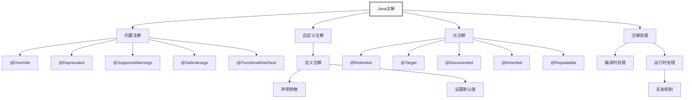
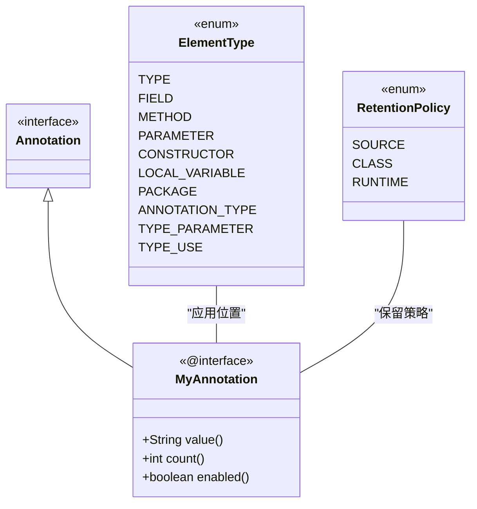
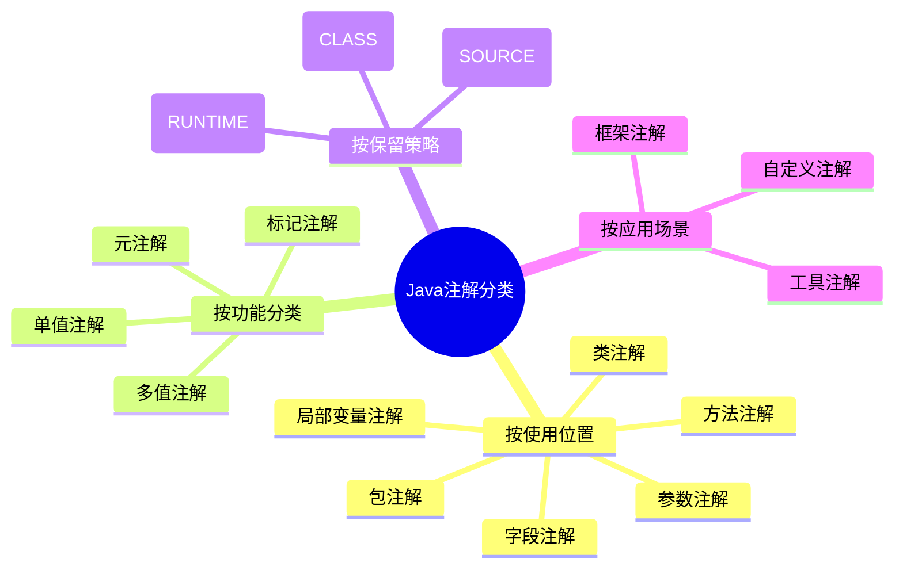
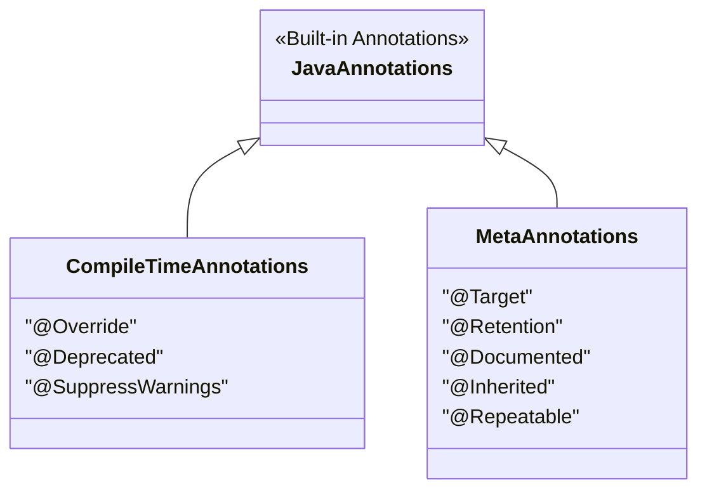
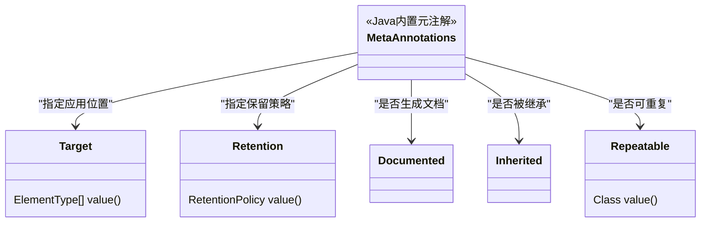
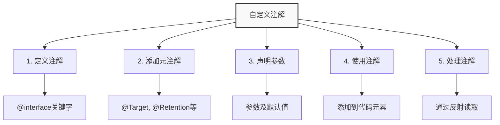

import Tabs from '@theme/Tabs';
import TabItem from '@theme/TabItem';
import TOCInline from '@theme/TOCInline';

# Java 注解详解

Java注解（Annotation）是Java 5引入的重要特性，它提供了一种在代码中添加元数据的方式。注解不直接影响代码的执行，但可以通过反射机制在运行时获取注解信息，实现各种功能如代码生成、验证、配置等。

:::info 本文内容概览
<TOCInline toc={toc} />
:::

:::tip 核心价值
**注解 = 元数据 + 反射处理 + 代码生成 + 配置管理**
- 📝 **元数据定义**：为代码元素提供额外的结构化信息
- 🔍 **反射处理**：通过反射机制在运行时读取和处理注解
- 🛠️ **代码生成**：自动生成样板代码，提高开发效率
- ⚙️ **配置管理**：简化配置，实现声明式编程
- 🧪 **代码验证**：提供编译时和运行时的代码验证能力
:::



## 1. 注解基础概念

### 1.1 什么是注解

注解是一种特殊的接口，用于为Java代码元素（类、方法、字段、参数等）添加元数据信息。注解本身不会影响代码的执行，但可以通过反射机制在运行时读取和处理。



<Tabs>
  <TabItem value="syntax" label="基本语法" default>
    ```java title="注解基本语法"
    // 注解使用语法：@注解名(参数)
    @Deprecated
    public class OldClass {
        
        @SuppressWarnings("unchecked")
        public void oldMethod() {
            // 方法实现
        }
        
        @Override
        public String toString() {
            return "OldClass";
        }
    }
    
    // 带参数的注解
    @SuppressWarnings(value = "unchecked")
    @SuppressWarnings("unchecked")  // 简写形式，当value是唯一参数时
    public class ExampleClass {
        // 类实现
    }
    ```
    
    :::info 注解语法特点
    1. 以 `@` 符号开始，后面跟注解名称
    2. 可以有参数，格式为 `参数名=参数值`
    3. 参数值可以是基本类型、String、Class、枚举、注解或它们的数组
    4. 当只有一个参数且名为 `value` 时，可以省略参数名
    :::
  </TabItem>
  <TabItem value="usage" label="注解的作用">
    <div className="card">
    <div className="card__header">
    <h4>注解的五大作用</h4>
    </div>
    <div className="card__body">
    <ol>
    <li><strong>编译时检查</strong>：如 <code>@Override</code> 检查方法是否重写了父类方法</li>
    <li><strong>代码生成</strong>：如 <code>@Data</code> 自动生成getter/setter方法</li>
    <li><strong>运行时处理</strong>：通过反射获取注解信息进行动态处理</li>
    <li><strong>配置管理</strong>：如Spring框架中的各种配置注解</li>
    <li><strong>文档生成</strong>：如 <code>@Deprecated</code> 标记废弃的API</li>
    </ol>
    </div>
    </div>
    
    ```mermaid
flowchart LR
    A["Java注解"] --> B["编译期作用"]
    A --> C["运行时作用"]
    
    B --> B1["代码检查"]
    B --> B2["代码生成"]
    B --> B3["文档生成"]
    
    C --> C1["配置注入"]
    C --> C2["行为控制"]
    C --> C3["动态处理"]
    
    style B fill:#e3f2fd,stroke:#1565c0
    style C fill:#fff8e1,stroke:#ff8f00
```
  </TabItem>
  <TabItem value="example" label="常见示例">
    <Tabs>
      <TabItem value="spring" label="Spring框架">
        ```java
        @RestController
        @RequestMapping("/api/users")
        public class UserController {
            
            @Autowired
            private UserService userService;
            
            @GetMapping("/{id}")
            public User getUserById(@PathVariable("id") Long id) {
                return userService.findById(id);
            }
            
            @PostMapping
            @ResponseStatus(HttpStatus.CREATED)
            public User createUser(@RequestBody @Valid User user) {
                return userService.save(user);
            }
        }
        ```
      </TabItem>
      <TabItem value="jpa" label="JPA持久化">
        ```java
        @Entity
        @Table(name = "users")
        public class User {
            
            @Id
            @GeneratedValue(strategy = GenerationType.IDENTITY)
            private Long id;
            
            @Column(nullable = false, length = 100)
            private String name;
            
            @Email
            @Column(unique = true)
            private String email;
            
            @OneToMany(mappedBy = "user", cascade = CascadeType.ALL)
            private List<Order> orders;
        }
        ```
      </TabItem>
      <TabItem value="test" label="单元测试">
        ```java
        public class CalculatorTest {
            
            @Test
            public void testAddition() {
                Calculator calc = new Calculator();
                assertEquals(5, calc.add(2, 3));
            }
            
            @Test
            @Timeout(1) // 超时测试
            public void testLongComputation() {
                Calculator calc = new Calculator();
                calc.computeComplexResult();
            }
            
            @ParameterizedTest
            @ValueSource(ints = {1, 2, 3, 4, 5})
            void testIsOdd(int number) {
                Calculator calc = new Calculator();
                assertTrue(calc.isOdd(number) || number % 2 == 0);
            }
        }
        ```
      </TabItem>
    </Tabs>
  </TabItem>
</Tabs>

### 1.2 注解的分类



<Tabs>
  <TabItem value="position" label="按使用位置分类" default>
    | 使用位置 | 说明 | 示例 |
    | -------- | ---- | ---- |
    | 类注解 | 应用于类、接口、枚举 | `@Entity`, `@Service` |
    | 方法注解 | 应用于方法 | `@Override`, `@Test` |
    | 字段注解 | 应用于字段 | `@Autowired`, `@Column` |
    | 参数注解 | 应用于方法参数 | `@RequestParam`, `@Valid` |
    | 包注解 | 应用于包 | `@PackageInfo` |
    | 局部变量注解 | 应用于局部变量 | `@SuppressWarnings` |
    
    ```mermaid
    classDiagram
        class ElementType {
            <<enum>>
            TYPE
            FIELD
            METHOD
            PARAMETER
            CONSTRUCTOR
            LOCAL_VARIABLE
            PACKAGE
            ANNOTATION_TYPE
            TYPE_PARAMETER
            TYPE_USE
        }
        
        note for ElementType "枚举常量对应了\n注解可应用的位置"
    ```
  </TabItem>
  <TabItem value="function" label="按功能分类">
    | 功能类型 | 说明 | 示例 |
    | -------- | ---- | ---- |
    | 标记注解 | 无参数，仅作标记 | `@Override`, `@Deprecated` |
    | 单值注解 | 只有一个参数 | `@SuppressWarnings("unchecked")` |
    | 多值注解 | 有多个参数 | `@RequestMapping(path="/api", method=GET)` |
    | 元注解 | 用于注解其他注解 | `@Target`, `@Retention` |
    
    <div className="alert alert--info" role="alert">
      <h4 className="alert--heading">功能分类示例</h4>
      <p><strong>标记注解</strong>：不包含任何参数的注解</p>
      ```java
@Override
public String toString() {
  return "Hello";
}
```
      <p><strong>单值注解</strong>：只有一个参数</p>
      ```java
@SuppressWarnings("unchecked")
public void process() {
  // ...
}
```
      <p><strong>多值注解</strong>：包含多个参数</p>
      ```java
@RequestMapping(path="/users", method=RequestMethod.GET)
```
    </div>
  </TabItem>
  <TabItem value="retention" label="按保留策略分类">
    <div className="card">
    <div className="card__header">
    <h4>注解的三种保留策略</h4>
    </div>
    <div className="card__body">
    
| 保留策略 | 说明 | 示例 | 使用场景 |
| ------- | ---- | ---- | ------- |
| `SOURCE` | 只在源码中保留，编译后丢弃 | `@Override`, `@SuppressWarnings` | 仅供编译器使用的注解 |
| `CLASS` | 在编译后的类文件中保留，运行时不可用 | 许多框架注解的默认策略 | 编译时处理或字节码增强 |
| `RUNTIME` | 在运行时保留，可通过反射访问 | `@Autowired`, `@Entity` | 需要在运行时通过反射读取的注解 |
    </div>
    </div>
    
    ```mermaid
    flowchart TD
        A[Java源文件] --> B[编译]
        B --> C[Class文件]
        C --> D[类加载]
        D --> E[运行时]
        
        F[SOURCE注解] --> |编译后丢弃| B
        G[CLASS注解] --> |保留在字节码中| C
        H[RUNTIME注解] --> |可在运行时通过反射访问| E
        
        style A fill:#d1c4e9,stroke:#673ab7
        style C fill:#bbdefb,stroke:#1976d2
        style E fill:#c8e6c9,stroke:#388e3c
        style F fill:#ffcdd2,stroke:#e53935
        style G fill:#fff9c4,stroke:#fbc02d
        style H fill:#b2ebf2,stroke:#0097a7
    ```
  </TabItem>
</Tabs>

## 2. 内置注解详解



<Tabs>
  <TabItem value="overview" label="内置注解总览" default>
    <div className="card">
    <div className="card__header">
    <h4>Java内置注解速览</h4>
    </div>
    <div className="card__body">
    
| 注解 | 引入版本 | 作用 | 应用位置 | 保留策略 |
| ---- | ------- | ---- | ------- | ------- |
| `@Override` | Java 5 | 标记方法重写 | 方法 | SOURCE |
| `@Deprecated` | Java 5 | 标记过时的API | 类、方法、字段等 | RUNTIME |
| `@SuppressWarnings` | Java 5 | 抑制编译器警告 | 类、方法、字段等 | SOURCE |
| `@Target` | Java 5 | 指定注解应用位置 | 注解 | RUNTIME |
| `@Retention` | Java 5 | 指定注解保留策略 | 注解 | RUNTIME |
    </div>
    </div>
  </TabItem>
</Tabs>

### 2.1 编译时注解

<Tabs>
  <TabItem value="override" label="@Override" default>
    <div className="alert alert--info" role="alert">
    <h4 className="alert--heading">@Override注解</h4>
    <p>用于标记方法重写，编译器会检查该方法是否真的重写了父类或接口的方法。</p>
    </div>
    
    ```java title="@Override注解示例"
    public class Animal {
        public void makeSound() {
            System.out.println("Some sound");
        }
    }
    
    public class Dog extends Animal {
        @Override
        public void makeSound() {
            System.out.println("Woof!");
        }
        
        // 编译错误：没有重写父类方法
        // @Override
        // public void eat() {
        //     System.out.println("Eating");
        // }
    }
    ```
    
    ```mermaid
    flowchart TD
        A["编译器检查"] --> B{"方法是否覆盖父类方法?"}
        B -->|"是"| C["编译通过"]
        B -->|"否"| D["编译错误"]
        D --> E["错误: 方法未覆盖父类方法"]
        
        style B fill:#ffe0b2,stroke:#ff9800,stroke-width:2px
```
    
    :::caution 编译时检查
    如果使用 `@Override` 注解的方法没有正确覆盖父类方法（方法名、参数或返回类型不匹配），编译器将报错。
    :::
  </TabItem>
  <TabItem value="deprecated" label="@Deprecated">
    <div className="alert alert--warning" role="alert">
    <h4 className="alert--heading">@Deprecated注解</h4>
    <p>用于标记已废弃的API，编译器会给出警告。</p>
    </div>
    
    ```java title="@Deprecated注解示例"
    public class OldAPI {
        @Deprecated
        public void oldMethod() {
            System.out.println("This method is deprecated");
        }
        
        @Deprecated(since = "1.8", forRemoval = true)
        public void veryOldMethod() {
            System.out.println("This method will be removed in future versions");
        }
        
        // 推荐的新方法
        public void newMethod() {
            System.out.println("Use this method instead");
        }
    }
    
    // 使用时会有警告
    public class UsageExample {
        public static void main(String[] args) {
            OldAPI api = new OldAPI();
            api.oldMethod();        // 编译警告
            api.veryOldMethod();    // 编译警告
            api.newMethod();        // 无警告
        }
    }
    ```
    
    <div className="card">
    <div className="card__header">
    <h4>Java 9增强的@Deprecated注解</h4>
    </div>
    <div className="card__body">
    
| 属性 | 类型 | 说明 | 示例 |
| ---- | ---- | ---- | ---- |
| `since` | String | 指定从哪个版本开始废弃 | `@Deprecated(since = "9")` |
| `forRemoval` | boolean | 指定是否计划在未来版本中移除 | `@Deprecated(forRemoval = true)` |
    </div>
    </div>
  </TabItem>
  <TabItem value="suppresswarnings" label="@SuppressWarnings">
    <div className="alert alert--secondary" role="alert">
    <h4 className="alert--heading">@SuppressWarnings注解</h4>
    <p>用于抑制编译器警告。</p>
    </div>
    
    ```java title="@SuppressWarnings注解示例"
    public class WarningSuppressionDemo {
        
        @SuppressWarnings("unchecked")
        public List<String> getStringList() {
            List list = new ArrayList();  // 原始类型警告
            list.add("Hello");
            list.add("World");
            return (List<String>) list;   // 类型转换警告
        }
        
        @SuppressWarnings({"unchecked", "deprecation"})
        public void multipleWarnings() {
            List list = new ArrayList();
            list.add("Item");
            
            // 使用废弃的API
            Date date = new Date(2023, 1, 1);
        }
        
        // 抑制所有警告（不推荐）
        @SuppressWarnings("all")
        public void suppressAll() {
            // 各种可能产生警告的代码
        }
    }
    ```
    
    ```mermaid
    graph LR
        A("编译警告") --> B{"使用@SuppressWarnings?"}
        B -->|"是"| C["抑制警告"]
        B -->|"否"| D["显示警告"]
        
        style A fill:#ffecb3,stroke:#ff9800
        style B fill:#e3f2fd,stroke:#1976d2
        style C fill:#c8e6c9,stroke:#388e3c
        style D fill:#ffcdd2,stroke:#d32f2f
```
    
    <div className="alert alert--info" role="alert">
    <h4>常见的警告类型</h4>
    <ul>
    <li><code>"deprecation"</code> - 使用了废弃的API</li>
    <li><code>"unchecked"</code> - 未检查的类型转换</li>
    <li><code>"rawtypes"</code> - 使用了原始类型</li>
    <li><code>"unused"</code> - 未使用的变量</li>
    <li><code>"null"</code> - 可能的空指针引用</li>
    <li><code>"all"</code> - 抑制所有警告</li>
    </ul>
    </div>
    
    :::caution 谨慎使用
    过度使用@SuppressWarnings可能会隐藏潜在的问题，应谨慎使用，尤其是对于"all"这样的抑制所有警告的用法。
    :::
  </TabItem>
</Tabs>

### 2.2 元注解



<Tabs>
  <TabItem value="target" label="@Target" default>
    <div className="alert alert--info" role="alert">
    <h4 className="alert--heading">@Target注解</h4>
    <p>用于指定注解可以应用的位置。</p>
    </div>
    
    ```java title="@Target注解示例"
    import java.lang.annotation.ElementType;
    import java.lang.annotation.Target;
    
    // 只能应用于方法
    @Target(ElementType.METHOD)
    public @interface MethodOnly {
        String value();
    }
    
    // 可以应用于方法和字段
    @Target({ElementType.METHOD, ElementType.FIELD})
    public @interface MethodAndField {
        String value();
    }
    
    // 可以应用于任何位置
    @Target(ElementType.ANNOTATION_TYPE)
    public @interface Anywhere {
        String value();
    }
    
    // 使用示例
    public class TargetDemo {
        @MethodOnly("method annotation")
        public void method() {}
        
        @MethodAndField("field annotation")
        private String field;
        
        @MethodAndField("method annotation")
        public void anotherMethod() {}
    }
    ```
    
    <div className="card">
    <div className="card__header">
    <h4>ElementType枚举值</h4>
    </div>
    <div className="card__body">
    
| ElementType | 描述 | 示例 |
| ----------- | ---- | ---- |
| TYPE | 类、接口、枚举 | `@Entity` |
| FIELD | 字段、枚举常量 | `@Column` |
| METHOD | 方法 | `@Test` |
| PARAMETER | 方法参数 | `@PathVariable` |
| CONSTRUCTOR | 构造函数 | `@Autowired` |
| LOCAL_VARIABLE | 局部变量 | 很少使用 |
| ANNOTATION_TYPE | 注解类型 | `@Target` |
| PACKAGE | 包 | `@PackageInfo` |
| TYPE_PARAMETER (Java 8+) | 类型参数 | `class Box<@NonNull T>` |
| TYPE_USE (Java 8+) | 任何类型使用处 | `List<@NotNull String>` |
| MODULE (Java 9+) | 模块 | 模块描述符中使用 |
    </div>
    </div>
  </TabItem>
  <TabItem value="retention" label="@Retention">
    <div className="alert alert--info" role="alert">
    <h4 className="alert--heading">@Retention注解</h4>
    <p>用于指定注解的保留策略。</p>
    </div>
    
    ```java title="@Retention注解示例"
    import java.lang.annotation.Retention;
    import java.lang.annotation.RetentionPolicy;
    
    // 源代码级别，编译后不保留
    @Retention(RetentionPolicy.SOURCE)
    public @interface SourceLevel {
        String value();
    }
    
    // 类级别，编译后保留，运行时不可见
    @Retention(RetentionPolicy.CLASS)
    public @interface ClassLevel {
        String value();
    }
    
    // 运行时级别，编译后保留，运行时可见
    @Retention(RetentionPolicy.RUNTIME)
    public @interface RuntimeLevel {
        String value();
    }
    
    // 使用示例
    @SourceLevel("source")    // 编译后不保留
    @ClassLevel("class")      // 编译后保留，运行时不可见
    @RuntimeLevel("runtime")  // 编译后保留，运行时可见
    public class RetentionDemo {
        // 类实现
    }
    ```
    
    ```mermaid
    flowchart LR
        A["RetentionPolicy"] --> B["SOURCE"]
        A --> C["CLASS"]
        A --> D["RUNTIME"]
        
        B --> B1["编译器处理后丢弃"]
        C --> C1["编译到类文件中\n但VM运行时不可用"]
        D --> D1["可在运行时\n通过反射API访问"]
        
        style B fill:#ffcdd2,stroke:#d32f2f
        style C fill:#fff9c4,stroke:#fbc02d
        style D fill:#c8e6c9,stroke:#388e3c
```
  </TabItem>
</Tabs>

<Tabs>
  <TabItem value="documented" label="@Documented" default>
    <div className="alert alert--info" role="alert">
    <h4 className="alert--heading">@Documented注解</h4>
    <p>用于指定注解是否应该包含在JavaDoc中。使用@Documented标记的注解会在生成的API文档中显示。</p>
    </div>
    
    ```java title="@Documented注解示例"
    import java.lang.annotation.Documented;
    
    // 包含在JavaDoc中
    @Documented
    public @interface DocumentedAnnotation {
        String value();
    }
    
    // 不包含在JavaDoc中
    public @interface NonDocumentedAnnotation {
        String value();
    }
    
    // 使用示例
    @DocumentedAnnotation("This will appear in JavaDoc")
    @NonDocumentedAnnotation("This won't appear in JavaDoc")
    public class DocumentationDemo {
        // 类实现
    }
    ```
    
    ```mermaid
    flowchart TB
        A["JavaDoc生成"] --> B{"注解有@Documented?"}
        B -->|"是"| C["包含在API文档中"]
        B -->|"否"| D["不包含在API文档中"]
        
        style B fill:#e3f2fd,stroke:#1976d2
        style C fill:#c8e6c9,stroke:#388e3c
        style D fill:#ffcdd2,stroke:#d32f2f
```
    
    :::tip Javadoc中显示示例
    使用@Documented标记的注解会显示在生成的Javadoc中：
    ```html
    /**
     * Class DocumentationDemo
     * 
     * @DocumentedAnnotation This will appear in JavaDoc
     */
    public class DocumentationDemo { ... }
    ```
    :::
  </TabItem>
  <TabItem value="inherited" label="@Inherited">
    <div className="alert alert--info" role="alert">
    <h4 className="alert--heading">@Inherited注解</h4>
    <p>用于指定注解是否可以被子类继承。只作用于类，不影响接口、方法或字段上的注解继承。</p>
    </div>
    
    ```java title="@Inherited注解示例"
    import java.lang.annotation.Inherited;
    
    // 可以被继承
    @Inherited
    public @interface InheritedAnnotation {
        String value();
    }
    
    // 不可以被继承
    public @interface NonInheritedAnnotation {
        String value();
    }
    
    // 父类
    @InheritedAnnotation("parent")
    @NonInheritedAnnotation("parent")
    public class ParentClass {
        // 父类实现
    }
    
    // 子类会继承 @InheritedAnnotation，但不会继承 @NonInheritedAnnotation
    public class ChildClass extends ParentClass {
        // 子类实现
    }
    ```
    
    ```mermaid
    classDiagram
        class ParentClass {
            "@InheritedAnnotation"
            "@NonInheritedAnnotation"
        }
        
        class ChildClass {
            "@InheritedAnnotation (继承自父类)"
        }
        
        ParentClass <|-- ChildClass : extends
        
        note for ParentClass "原始类有两种注解"
        note for ChildClass "子类仅继承@Inherited标记的注解"
```
    
    :::caution 注意事项
    1. @Inherited只对类注解有效，对方法、字段等其他元素上的注解无效
    2. 接口上的注解不会被实现类继承，即使使用@Inherited标记
    3. 如果子类自己有相同的注解，则父类的注解不会被继承
    :::
  </TabItem>
  <TabItem value="repeatable" label="@Repeatable">
    <div className="alert alert--info" role="alert">
    <h4 className="alert--heading">@Repeatable注解</h4>
    <p>Java 8引入，用于允许在同一个声明上多次使用同一个注解。</p>
    </div>
    
    ```java title="@Repeatable注解示例"
    import java.lang.annotation.Repeatable;
    
    // 容器注解
    public @interface Roles {
        Role[] value();
    }
    
    // 可重复注解
    @Repeatable(Roles.class)
    public @interface Role {
        String value();
    }
    
    // 使用示例 - Java 8之前
    @Roles({
        @Role("Admin"),
        @Role("User")
    })
    public class OldWay {
        // 类实现
    }
    
    // 使用示例 - Java 8之后
    @Role("Admin")
    @Role("User")
    public class NewWay {
        // 类实现
    }
    ```
    
    :::note Java内部机制
    Java编译器会将多个@Role注解聚合到@Roles容器注解中，本质上两种写法是等价的。
    :::
  </TabItem>
</Tabs>

## 3. 自定义注解



### 3.1 创建自定义注解

<Tabs>
  <TabItem value="basic" label="基本注解定义" default>
    ```java title="基本注解定义"
    import java.lang.annotation.ElementType;
    import java.lang.annotation.Retention;
    import java.lang.annotation.RetentionPolicy;
    import java.lang.annotation.Target;
    
    @Target(ElementType.METHOD)          // 只能用于方法
    @Retention(RetentionPolicy.RUNTIME)  // 运行时保留
    public @interface Test {
        String value() default "test";    // 默认参数
        int timeout() default 1000;       // 超时参数
        boolean enabled() default true;   // 是否启用
    }
    
    // 使用示例
    public class TestDemo {
        @Test("custom test")              // 使用默认参数名value的简写形式
        public void testMethod() {
            System.out.println("Running test");
        }
        
        @Test(value = "timeout test", timeout = 5000)  // 指定多个参数
        public void longRunningTest() {
            // 长时间运行的测试
        }
        
        @Test(enabled = false)           // 禁用测试
        public void disabledTest() {
            // 被禁用的测试
        }
    }
    ```
    
    <div className="card">
    <div className="card__header">
    <h4>定义注解的语法规则</h4>
    </div>
    <div className="card__body">
    <ol>
    <li>使用<code>@interface</code>关键字定义注解</li>
    <li>注解方法不能有参数</li>
    <li>注解方法不能抛出异常</li>
    <li>注解方法的返回值只能是基本类型、String、Class、枚举、注解及其数组</li>
    <li>可以使用<code>default</code>关键字指定默认值</li>
    </ol>
    </div>
    </div>
  </TabItem>
  <TabItem value="complex" label="复杂注解定义">
    ```java title="复杂注解定义"
    import java.lang.annotation.*;
    import java.util.concurrent.TimeUnit;
    
    @Target({ElementType.METHOD, ElementType.TYPE})
    @Retention(RetentionPolicy.RUNTIME)
    @Documented
    @Inherited
    public @interface PerformanceTest {
        // 基本参数
        String name() default "";
        String description() default "";
        
        // 性能参数
        int iterations() default 1;
        long timeout() default 1000;
        TimeUnit timeUnit() default TimeUnit.MILLISECONDS;
        
        // 阈值参数
        double maxExecutionTime() default Double.MAX_VALUE;
        double minExecutionTime() default 0.0;
        
        // 数组参数
        String[] tags() default {};
        
        // 枚举参数
        Priority priority() default Priority.NORMAL;
        
        // 嵌套注解
        Retry retry() default @Retry;
        
        // 枚举定义
        enum Priority {
            LOW, NORMAL, HIGH, CRITICAL
        }
        
        // 嵌套注解定义
        @interface Retry {
            int maxAttempts() default 3;
            long delay() default 1000;
        }
    }
    
    // 使用示例
    @PerformanceTest(
        name = "Database Performance Test",
        description = "Test database query performance",
        iterations = 1000,
        timeout = 5000,
        timeUnit = TimeUnit.MILLISECONDS,
        maxExecutionTime = 100.0,
        tags = {"database", "performance", "query"},
        priority = PerformanceTest.Priority.HIGH,
        retry = @PerformanceTest.Retry(maxAttempts = 5, delay = 2000)
    )
    public class DatabasePerformanceTest {
        // 测试实现
    }
    ```
    
    ```mermaid
    classDiagram
        class PerformanceTest {
            <<@interface>>
            +String name()
            +String description()
            +int iterations()
            +long timeout()
            +TimeUnit timeUnit()
            +double maxExecutionTime()
            +double minExecutionTime()
            +String[] tags()
            +Priority priority()
            +Retry retry()
        }
        
        class Priority {
            <<enum>>
            LOW
            NORMAL
            HIGH
            CRITICAL
        }
        
        class Retry {
            <<@interface>>
            +int maxAttempts()
            +long delay()
        }
        
        PerformanceTest --> Priority : 使用
        PerformanceTest --> Retry : 包含
    ```
  </TabItem>
  <TabItem value="restrictions" label="注解限制和规则">
    <div className="alert alert--warning" role="alert">
    <h4 className="alert--heading">注解参数的限制</h4>
    <ul>
    <li>注解方法不能有参数</li>
    <li>注解方法不能抛出异常</li>
    <li>注解方法的返回值有类型限制</li>
    <li>注解方法可以有默认值</li>
    </ul>
    </div>
    
    <div className="card">
    <div className="card__header">
    <h4>有效的参数类型示例</h4>
    </div>
    <div className="card__body">
    ```java
// 基本类型
int count() default 0;

// String类型
String name() default "";

// Class类型
Class<?> type() default Object.class;

// 枚举类型
TimeUnit unit() default TimeUnit.SECONDS;

// 注解类型
Author author() default @Author(name="Unknown");

// 数组类型
String[] tags() default {"test", "default"};
```
    </div>
    </div>
    
    <div className="card">
    <div className="card__header">
    <h4>无效的参数类型示例</h4>
    </div>
    <div className="card__body">
    ```java
// 错误: 不支持复杂对象
Date created();  // 编译错误

// 错误: 不支持泛型(除了Class<?>)
List<String> names();  // 编译错误

// 错误: 不能有参数
String format(String pattern);  // 编译错误

// 错误: 不能抛出异常
int calculate() throws Exception;  // 编译错误
```
    </div>
    </div>
  </TabItem>
</Tabs>
```

### 3.2 注解参数类型

#### 支持的参数类型

注解参数只能是以下类型：

1. **基本类型**：`byte`, `short`, `int`, `long`, `float`, `double`, `boolean`, `char`
2. **String类型**：`String`
3. **Class类型**：`Class<?>`
4. **枚举类型**：任何枚举
5. **注解类型**：任何注解
6. **数组类型**：上述类型的数组

```java title="注解参数类型示例"
import java.lang.annotation.*;
import java.lang.reflect.Method;

@Target(ElementType.METHOD)
@Retention(RetentionPolicy.RUNTIME)
public @interface ParameterTypes {
    // 基本类型
    int intValue() default 0;
    long longValue() default 0L;
    double doubleValue() default 0.0;
    boolean booleanValue() default false;
    char charValue() default 'A';
    
    // String类型
    String stringValue() default "";
    
    // Class类型
    Class<?> classValue() default Object.class;
    
    // 枚举类型
    ElementType enumValue() default ElementType.METHOD;
    
    // 注解类型
    Target annotationValue() default @Target(ElementType.METHOD);
    
    // 数组类型
    int[] intArray() default {};
    String[] stringArray() default {};
    Class<?>[] classArray() default {};
}

// 使用示例
public class ParameterTypesDemo {
    @ParameterTypes(
        intValue = 42,
        longValue = 123456789L,
        doubleValue = 3.14159,
        booleanValue = true,
        charValue = 'X',
        stringValue = "Hello",
        classValue = String.class,
        enumValue = ElementType.FIELD,
        annotationValue = @Target(ElementType.CONSTRUCTOR),
        intArray = {1, 2, 3},
        stringArray = {"a", "b", "c"},
        classArray = {String.class, Integer.class}
    )
    public void annotatedMethod() {
        // 方法实现
    }
}
```

## 4. 注解处理器

### 4.1 运行时注解处理

#### 通过反射获取注解信息

```java title="运行时注解处理示例"
import java.lang.annotation.*;
import java.lang.reflect.*;

@Target(ElementType.METHOD)
@Retention(RetentionPolicy.RUNTIME)
public @interface TestMethod {
    String name() default "";
    String description() default "";
    int priority() default 1;
}

public class TestRunner {
    
    public static void runTests(Class<?> testClass) {
        System.out.println("Running tests for: " + testClass.getName());
        
        Method[] methods = testClass.getDeclaredMethods();
        for (Method method : methods) {
            if (method.isAnnotationPresent(TestMethod.class)) {
                TestMethod annotation = method.getAnnotation(TestMethod.class);
                System.out.println("Running test: " + annotation.name());
                System.out.println("Description: " + annotation.description());
                System.out.println("Priority: " + annotation.priority());
                
                try {
                    method.invoke(testClass.newInstance());
                    System.out.println("Test passed: " + method.getName());
                } catch (Exception e) {
                    System.out.println("Test failed: " + method.getName() + " - " + e.getMessage());
                }
                System.out.println("---");
            }
        }
    }
}

// 测试类
public class SampleTest {
    @TestMethod(name = "Addition Test", description = "Test basic addition", priority = 1)
    public void testAddition() {
        assert 2 + 2 == 4;
        System.out.println("Addition test passed");
    }
    
    @TestMethod(name = "Multiplication Test", description = "Test basic multiplication", priority = 2)
    public void testMultiplication() {
        assert 3 * 4 == 12;
        System.out.println("Multiplication test passed");
    }
    
    public void nonTestMethod() {
        System.out.println("This method is not a test");
    }
}

// 运行测试
public class TestDemo {
    public static void main(String[] args) {
        TestRunner.runTests(SampleTest.class);
    }
}
```

#### 字段注解处理

```java title="字段注解处理示例"
import java.lang.annotation.*;
import java.lang.reflect.*;

@Target(ElementType.FIELD)
@Retention(RetentionPolicy.RUNTIME)
public @interface Column {
    String name();
    boolean nullable() default true;
    int length() default 255;
    String defaultValue() default "";
}

@Target(ElementType.FIELD)
@Retention(RetentionPolicy.RUNTIME)
public @interface PrimaryKey {
    boolean autoIncrement() default false;
}

public class EntityProcessor {
    
    public static String generateCreateTableSQL(Class<?> entityClass) {
        StringBuilder sql = new StringBuilder();
        sql.append("CREATE TABLE ").append(entityClass.getSimpleName()).append(" (");
        
        Field[] fields = entityClass.getDeclaredFields();
        boolean first = true;
        
        for (Field field : fields) {
            if (field.isAnnotationPresent(Column.class)) {
                if (!first) {
                    sql.append(", ");
                }
                first = false;
                
                Column column = field.getAnnotation(Column.class);
                sql.append(column.name()).append(" ");
                
                // 根据字段类型确定数据库类型
                if (field.getType() == String.class) {
                    sql.append("VARCHAR(").append(column.length()).append(")");
                } else if (field.getType() == int.class || field.getType() == Integer.class) {
                    sql.append("INT");
                } else if (field.getType() == long.class || field.getType() == Long.class) {
                    sql.append("BIGINT");
                } else if (field.getType() == double.class || field.getType() == Double.class) {
                    sql.append("DOUBLE");
                } else if (field.getType() == boolean.class || field.getType() == Boolean.class) {
                    sql.append("BOOLEAN");
                }
                
                if (!column.nullable()) {
                    sql.append(" NOT NULL");
                }
                
                if (!column.defaultValue().isEmpty()) {
                    sql.append(" DEFAULT '").append(column.defaultValue()).append("'");
                }
            }
        }
        
        sql.append(")");
        return sql.toString();
    }
}

// 实体类
public class User {
    @PrimaryKey(autoIncrement = true)
    @Column(name = "id", nullable = false)
    private int id;
    
    @Column(name = "username", nullable = false, length = 50)
    private String username;
    
    @Column(name = "email", nullable = false, length = 100)
    private String email;
    
    @Column(name = "age", nullable = true, defaultValue = "18")
    private int age;
    
    @Column(name = "active", nullable = false, defaultValue = "true")
    private boolean active;
    
    // getters and setters
}

// 使用示例
public class EntityProcessorDemo {
    public static void main(String[] args) {
        String sql = EntityProcessor.generateCreateTableSQL(User.class);
        System.out.println("Generated SQL:");
        System.out.println(sql);
    }
}
```

### 4.2 编译时注解处理

#### 注解处理器基础

```java title="注解处理器基础"
import javax.annotation.processing.*;
import javax.lang.model.SourceVersion;
import javax.lang.model.element.*;
import javax.tools.Diagnostic;
import java.util.Set;

@SupportedAnnotationTypes("com.example.TestMethod")
@SupportedSourceVersion(SourceVersion.RELEASE_8)
public class TestMethodProcessor extends AbstractProcessor {
    
    @Override
    public boolean process(Set<? extends TypeElement> annotations, RoundEnvironment roundEnv) {
        if (roundEnv.processingOver()) {
            return false;
        }
        
        // 处理所有被 @TestMethod 注解的元素
        for (Element element : roundEnv.getElementsAnnotatedWith(TestMethod.class)) {
            if (element.getKind() == ElementKind.METHOD) {
                ExecutableElement method = (ExecutableElement) element;
                TestMethod annotation = method.getAnnotation(TestMethod.class);
                
                // 验证方法签名
                if (!method.getParameters().isEmpty()) {
                    processingEnv.getMessager().printMessage(
                        Diagnostic.Kind.ERROR,
                        "Test methods should not have parameters",
                        method
                    );
                }
                
                if (method.getReturnType().getKind() != TypeKind.VOID) {
                    processingEnv.getMessager().printMessage(
                        Diagnostic.Kind.ERROR,
                        "Test methods should return void",
                        method
                    );
                }
                
                // 生成测试报告
                processingEnv.getMessager().printMessage(
                    Diagnostic.Kind.NOTE,
                    "Found test method: " + method.getSimpleName() +
                    " with priority: " + annotation.priority(),
                    method
                );
            }
        }
        
        return true;
    }
}
```

## 5. 实际应用场景

### 5.1 配置管理

#### 配置注解示例

```java title="配置注解示例"
import java.lang.annotation.*;
import java.lang.reflect.*;

@Target(ElementType.FIELD)
@Retention(RetentionPolicy.RUNTIME)
public @interface ConfigProperty {
    String key();
    String defaultValue() default "";
    boolean required() default false;
}

@Target(ElementType.CLASS)
@Retention(RetentionPolicy.RUNTIME)
public @interface Configuration {
    String prefix() default "";
}

public class ConfigurationLoader {
    
    public static <T> T loadConfiguration(Class<T> configClass) {
        try {
            T instance = configClass.newInstance();
            
            if (configClass.isAnnotationPresent(Configuration.class)) {
                Configuration config = configClass.getAnnotation(Configuration.class);
                String prefix = config.prefix();
                
                Field[] fields = configClass.getDeclaredFields();
                for (Field field : fields) {
                    if (field.isAnnotationPresent(ConfigProperty.class)) {
                        ConfigProperty prop = field.getAnnotation(ConfigProperty.class);
                        String key = prefix.isEmpty() ? prop.key() : prefix + "." + prop.key();
                        
                        // 从系统属性或环境变量获取值
                        String value = System.getProperty(key);
                        if (value == null) {
                            value = System.getenv(key);
                        }
                        if (value == null) {
                            value = prop.defaultValue();
                        }
                        
                        if (prop.required() && (value == null || value.isEmpty())) {
                            throw new IllegalStateException("Required configuration property not found: " + key);
                        }
                        
                        // 设置字段值
                        field.setAccessible(true);
                        if (field.getType() == String.class) {
                            field.set(instance, value);
                        } else if (field.getType() == int.class || field.getType() == Integer.class) {
                            field.set(instance, Integer.parseInt(value));
                        } else if (field.getType() == boolean.class || field.getType() == Boolean.class) {
                            field.set(instance, Boolean.parseBoolean(value));
                        }
                    }
                }
            }
            
            return instance;
        } catch (Exception e) {
            throw new RuntimeException("Failed to load configuration", e);
        }
    }
}

// 配置类
@Configuration(prefix = "app")
public class AppConfig {
    @ConfigProperty(key = "name", required = true)
    private String appName;
    
    @ConfigProperty(key = "version", defaultValue = "1.0.0")
    private String version;
    
    @ConfigProperty(key = "debug", defaultValue = "false")
    private boolean debug;
    
    @ConfigProperty(key = "port", defaultValue = "8080")
    private int port;
    
    // getters
    public String getAppName() { return appName; }
    public String getVersion() { return version; }
    public boolean isDebug() { return debug; }
    public int getPort() { return port; }
}

// 使用示例
public class ConfigurationDemo {
    public static void main(String[] args) {
        // 设置系统属性
        System.setProperty("app.name", "MyApplication");
        System.setProperty("app.port", "9090");
        
        // 加载配置
        AppConfig config = ConfigurationLoader.loadConfiguration(AppConfig.class);
        
        System.out.println("App Name: " + config.getAppName());
        System.out.println("Version: " + config.getVersion());
        System.out.println("Debug: " + config.isDebug());
        System.out.println("Port: " + config.getPort());
    }
}
```

### 5.2 验证框架

#### 验证注解示例

```java title="验证注解示例"
import java.lang.annotation.*;
import java.lang.reflect.*;
import java.util.*;

@Target(ElementType.FIELD)
@Retention(RetentionPolicy.RUNTIME)
public @interface NotNull {
    String message() default "Field cannot be null";
}

@Target(ElementType.FIELD)
@Retention(RetentionPolicy.RUNTIME)
public @interface Min {
    int value();
    String message() default "Value must be at least {value}";
}

@Target(ElementType.FIELD)
@Retention(RetentionPolicy.RUNTIME)
public @interface Max {
    int value();
    String message() default "Value must be at most {value}";
}

@Target(ElementType.FIELD)
@Retention(RetentionPolicy.RUNTIME)
public @interface Size {
    int min() default 0;
    int max() default Integer.MAX_VALUE;
    String message() default "Size must be between {min} and {max}";
}

@Target(ElementType.FIELD)
@Retention(RetentionPolicy.RUNTIME)
public @interface Email {
    String message() default "Invalid email format";
}

public class Validator {
    
    public static List<String> validate(Object obj) {
    List<String> errors = new ArrayList<>();
    
    Class<?> clazz = obj.getClass();
        Field[] fields = clazz.getDeclaredFields();
        
        for (Field field : fields) {
            field.setAccessible(true);
            
            try {
                Object value = field.get(obj);
                
                // 检查 @NotNull
                if (field.isAnnotationPresent(NotNull.class)) {
                    if (value == null) {
                        NotNull annotation = field.getAnnotation(NotNull.class);
                        errors.add(annotation.message());
                    }
                }
                
                // 检查 @Min
                if (field.isAnnotationPresent(Min.class) && value != null) {
                    if (value instanceof Number) {
                        Min annotation = field.getAnnotation(Min.class);
                        if (((Number) value).intValue() < annotation.value()) {
                            errors.add(annotation.message().replace("{value}", String.valueOf(annotation.value())));
                        }
                    }
                }
                
                // 检查 @Max
                if (field.isAnnotationPresent(Max.class) && value != null) {
                    if (value instanceof Number) {
                        Max annotation = field.getAnnotation(Max.class);
                        if (((Number) value).intValue() > annotation.value()) {
                            errors.add(annotation.message().replace("{value}", String.valueOf(annotation.value())));
                        }
                    }
                }
                
                // 检查 @Size
                if (field.isAnnotationPresent(Size.class) && value != null) {
                    Size annotation = field.getAnnotation(Size.class);
                    int size = 0;
                    
                    if (value instanceof String) {
                        size = ((String) value).length();
                    } else if (value instanceof Collection) {
                        size = ((Collection<?>) value).size();
                    } else if (value.getClass().isArray()) {
                        size = Array.getLength(value);
                    }
                    
                    if (size < annotation.min() || size > annotation.max()) {
                        errors.add(annotation.message()
                            .replace("{min}", String.valueOf(annotation.min()))
                            .replace("{max}", String.valueOf(annotation.max())));
                    }
                }
                
                // 检查 @Email
                if (field.isAnnotationPresent(Email.class) && value != null) {
                    if (value instanceof String) {
                        String email = (String) value;
                        if (!email.matches("^[A-Za-z0-9+_.-]+@(.+)$")) {
                            Email annotation = field.getAnnotation(Email.class);
                            errors.add(annotation.message());
                        }
                    }
                }
                
            } catch (IllegalAccessException e) {
                errors.add("Cannot access field: " + field.getName());
            }
        }
        
        return errors;
    }
}

// 用户类
public class User {
    @NotNull(message = "Username is required")
    @Size(min = 3, max = 20, message = "Username must be between 3 and 20 characters")
    private String username;
    
    @NotNull(message = "Email is required")
    @Email(message = "Invalid email format")
    private String email;
    
    @Min(value = 18, message = "User must be at least 18 years old")
    @Max(value = 120, message = "User cannot be older than 120 years")
    private int age;
    
    @Size(min = 1, max = 5, message = "User can have 1 to 5 roles")
    private List<String> roles;
    
    // 构造函数
    public User(String username, String email, int age, List<String> roles) {
        this.username = username;
        this.email = email;
        this.age = age;
        this.roles = roles;
    }
    
    // getters
    public String getUsername() { return username; }
    public String getEmail() { return email; }
    public int getAge() { return age; }
    public List<String> getRoles() { return roles; }
}

// 使用示例
public class ValidationDemo {
    public static void main(String[] args) {
        // 创建用户
        User user = new User("ab", "invalid-email", 15, Arrays.asList("admin", "user", "guest", "moderator", "editor", "viewer"));
        
        // 验证
        List<String> errors = Validator.validate(user);
        
        if (errors.isEmpty()) {
            System.out.println("Validation passed");
        } else {
            System.out.println("Validation failed:");
            for (String error : errors) {
                System.out.println("- " + error);
            }
        }
    }
}
```

## 6. 性能考虑

### 6.1 注解性能影响

#### 性能测试示例

```java title="注解性能测试示例"
import java.lang.annotation.*;
import java.lang.reflect.*;
import java.util.concurrent.*;

@Target(ElementType.METHOD)
@Retention(RetentionPolicy.RUNTIME)
public @interface PerformanceMonitor {
    String operation() default "";
}

public class PerformanceMonitorDemo {
    
    private static final ConcurrentHashMap<Class<?>, Map<Method, Annotation[]>> methodCache = 
        new ConcurrentHashMap<>();
    private static final ConcurrentHashMap<Class<?>, Map<Field, Annotation[]>> fieldCache = 
        new ConcurrentHashMap<>();
    
    public static void main(String[] args) throws Exception {
        int iterations = 1000000;
        
        // 测试直接调用
        long startTime = System.nanoTime();
        for (int i = 0; i < iterations; i++) {
            testMethod();
        }
        long directTime = System.nanoTime() - startTime;
        
        // 测试反射获取注解
        startTime = System.nanoTime();
        for (int i = 0; i < iterations; i++) {
            Method method = PerformanceMonitorDemo.class.getMethod("testMethod");
            if (method.isAnnotationPresent(PerformanceMonitor.class)) {
                PerformanceMonitor annotation = method.getAnnotation(PerformanceMonitor.class);
                String operation = annotation.operation();
            }
        }
        long reflectionTime = System.nanoTime() - startTime;
        
        // 测试缓存反射结果
        startTime = System.nanoTime();
        Method method = PerformanceMonitorDemo.class.getMethod("testMethod");
        PerformanceMonitor annotation = method.getAnnotation(PerformanceMonitor.class);
        String operation = annotation.operation();
        for (int i = 0; i < iterations; i++) {
            // 使用缓存的注解
            String cachedOperation = operation;
        }
        long cachedTime = System.nanoTime() - startTime;
        
        System.out.println("Direct call time: " + directTime + " ns");
        System.out.println("Reflection time: " + reflectionTime + " ns");
        System.out.println("Cached time: " + cachedTime + " ns");
        System.out.println("Reflection overhead: " + (reflectionTime / directTime) + "x");
        System.out.println("Cached overhead: " + (cachedTime / directTime) + "x");
    }
    
    @PerformanceMonitor(operation = "test operation")
    public static void testMethod() {
        // 空方法
    }
}
```

### 6.2 性能优化建议

1. **缓存注解信息**：避免重复反射获取注解
2. **延迟加载**：只在需要时获取注解信息
3. **批量处理**：一次性处理多个注解
4. **使用编译时处理**：减少运行时反射开销

## 7. 最佳实践

### 7.1 设计原则

1. **单一职责**：每个注解应该有明确的单一用途
2. **默认值合理**：提供合理的默认值，减少使用复杂度
3. **命名清晰**：使用清晰、描述性的名称
4. **文档完整**：为所有参数提供完整的文档说明

### 7.2 常见陷阱

1. **循环依赖**：避免注解之间的循环依赖
2. **过度使用**：不要为每个功能都创建注解
3. **性能忽略**：注意注解处理对性能的影响
4. **版本兼容**：考虑注解在不同Java版本中的兼容性

## 8. 总结

Java注解是一个强大的特性，它提供了：

1. **元数据支持**：为代码添加描述性信息
2. **编译时检查**：在编译时发现潜在问题
3. **运行时处理**：通过反射实现动态功能
4. **代码生成**：自动生成重复代码
5. **配置管理**：简化配置和验证

### 学习建议

1. **掌握基础概念**：理解注解的基本语法和类型
2. **熟悉内置注解**：了解Java提供的内置注解
3. **练习自定义注解**：创建自己的注解类型
4. **学习注解处理**：掌握运行时和编译时处理
5. **关注性能影响**：了解注解对性能的影响

### 进阶方向

1. **框架集成**：学习在Spring、Hibernate等框架中使用注解
2. **代码生成**：探索注解驱动的代码生成技术
3. **静态分析**：使用注解进行代码质量分析
4. **测试框架**：创建自定义的测试注解
5. **性能监控**：实现基于注解的性能监控系统

注解是Java现代化开发的重要工具，掌握它将使你的Java编程能力更上一层楼！ 

## 9. 面试题精选

### 9.1 什么是注解？Java注解的作用是什么？

**答案：** 注解（Annotation）是Java 5引入的特性，本质上是一种特殊的接口，用于为Java代码元素（类、方法、字段等）添加元数据信息。

Java注解的主要作用：
- **编译时信息处理**：为编译器提供额外信息，如`@Override`检查是否重写
- **代码生成**：通过注解处理器在编译期自动生成代码，如Lombok的`@Data`
- **运行时处理**：通过反射在运行时读取注解信息执行特定逻辑，如Spring的`@Autowired`
- **元数据存储**：为代码元素提供额外的描述信息，可被工具或框架读取使用
- **文档生成**：为JavaDoc等工具提供额外的文档信息，如`@Deprecated`

### 9.2 Java内置注解有哪些？各自的作用是什么？

**答案：** Java主要的内置注解包括：

1. **@Override**：标记方法是重写父类方法，编译器会验证是否正确重写
2. **@Deprecated**：标记已过时的类、方法或字段，使用时编译器会发出警告
3. **@SuppressWarnings**：抑制编译器警告，如`@SuppressWarnings("unchecked")`
4. **@SafeVarargs**（Java 7+）：抑制对可变参数方法的泛型类型不安全操作的警告
5. **@FunctionalInterface**（Java 8+）：声明接口为函数式接口（只有一个抽象方法）
6. **@Native**（Java 8+）：标记字段由本地代码引用

元注解（用于注解其他注解）：
- **@Target**：指定注解可应用的程序元素类型（类、方法、字段等）
   - 接收`ElementType`枚举值，如`TYPE`、`METHOD`、`FIELD`等

2. **@Retention**：指定注解的保留策略
   - `SOURCE`：仅在源代码中保留，编译后丢弃
   - `CLASS`：保留到编译后的类文件中，但运行时不可用（默认值）
   - `RUNTIME`：保留到运行时，可通过反射API访问

3. **@Documented**：指定注解是否应该包含在JavaDoc生成的文档中

4. **@Inherited**：指定注解是否可以被子类继承。只适用于类注解，子类会继承父类的注解

5. **@Repeatable**（Java 8+）：允许在同一元素上多次使用相同的注解，需要定义一个容器注解

### 9.3 什么是元注解？Java中的元注解有哪些？

**答案：** 元注解是用来注解其他注解的注解，用于定义注解的属性和行为。Java中有以下元注解：

1. **@Target**：指定注解可以应用的程序元素类型（类、方法、字段等）
   - 接收`ElementType`枚举值，如`TYPE`、`METHOD`、`FIELD`等

2. **@Retention**：指定注解的保留策略
   - `SOURCE`：仅在源代码中保留，编译后丢弃
   - `CLASS`：保留到编译后的类文件中，但运行时不可用（默认值）
   - `RUNTIME`：保留到运行时，可通过反射API访问

3. **@Documented**：指定注解是否应该包含在JavaDoc生成的文档中

4. **@Inherited**：指定注解是否可以被子类继承。只适用于类注解，子类会继承父类的注解

5. **@Repeatable**（Java 8+）：允许在同一元素上多次使用相同的注解，需要定义一个容器注解

### 9.4 如何自定义注解？自定义注解的基本规则是什么？

**答案：** 自定义注解的基本语法：

```java
@Target(ElementType.METHOD)
@Retention(RetentionPolicy.RUNTIME)
public @interface MyAnnotation {
    String value() default ""; // 注解参数
    int count() default 0;
    boolean enabled() default true;
}
```

自定义注解的基本规则：
1. 使用`@interface`关键字定义注解
2. 通常需要添加元注解如`@Target`和`@Retention`
3. 注解参数声明类似无参数方法
4. 参数类型只能是：
   - 基本类型（int, boolean等）
   - String
   - Class
   - 枚举类型
   - 注解类型
   - 以上类型的数组
5. 可以使用`default`为参数指定默认值
6. 如果只有一个参数且命名为`value`，使用时可以省略参数名

### 9.5 注解的保留策略（RetentionPolicy）有哪些？各自的应用场景是什么？

**答案：** Java注解的保留策略有三种：

1. **SOURCE**：只在源代码中保留，编译后丢弃
   - 应用场景：编译时检查、代码生成、IDE提示
   - 示例：`@Override`、`@SuppressWarnings`

2. **CLASS**（默认）：保留到编译后的类文件中，但在运行时不可通过反射获取
   - 应用场景：字节码工具、类加载时处理、性能优化
   - 示例：一些框架使用的注解如Lombok

3. **RUNTIME**：在运行时仍然保留，可以通过反射API读取注解信息
   - 应用场景：运行时配置、依赖注入、ORM映射
   - 示例：Spring的`@Autowired`、JPA的`@Entity`

选择策略的原则是根据注解的使用时机来决定——是在编译时、类加载时还是运行时需要使用这些注解信息。

### 9.6 如何在运行时通过反射读取注解信息？

**答案：** 在运行时通过反射读取注解信息的基本步骤：

```java
// 获取类上的注解
Class<?> clazz = MyClass.class;
if (clazz.isAnnotationPresent(MyAnnotation.class)) {
    MyAnnotation annotation = clazz.getAnnotation(MyAnnotation.class);
    String value = annotation.value();
    int count = annotation.count();
}

// 获取方法上的注解
Method method = clazz.getMethod("myMethod");
if (method.isAnnotationPresent(MyAnnotation.class)) {
    MyAnnotation annotation = method.getAnnotation(MyAnnotation.class);
    // 使用注解信息...
}

// 获取字段上的注解
Field field = clazz.getDeclaredField("myField");
field.setAccessible(true);  // 如果是私有字段
if (field.isAnnotationPresent(MyAnnotation.class)) {
    MyAnnotation annotation = field.getAnnotation(MyAnnotation.class);
    // 使用注解信息...
}

// 获取全部注解
Annotation[] annotations = clazz.getAnnotations();
for (Annotation annotation : annotations) {
    // 处理每个注解...
}
```

注意：只有保留策略为`RetentionPolicy.RUNTIME`的注解才能在运行时通过反射获取。

### 9.7 注解与接口和继承有什么关系？注解是否可以被继承？

**答案：** 注解与接口和继承的关系：

1. **注解本身是特殊的接口类型**：注解声明使用`@interface`，其实是继承了`java.lang.annotation.Annotation`接口的特殊接口

2. **注解是否可以被继承**：
   - 默认情况下，子类**不会继承**父类的注解
   - 如果注解使用了`@Inherited`元注解，则子类会继承父类的类级注解（不包括方法、字段等）
   - `@Inherited`只对类注解有效，对方法、字段等其他元素的注解无效
   - 接口上的注解不会被实现类继承，即使使用了`@Inherited`

3. **示例**：
```java
@Inherited
@Target(ElementType.TYPE)
@Retention(RetentionPolicy.RUNTIME)
public @interface InheritableAnnotation { }

@InheritableAnnotation
class Parent { }

class Child extends Parent { } // Child继承了@InheritableAnnotation
```

### 9.8 什么是注解处理器？如何创建自定义注解处理器？

**答案：** 注解处理器是用于处理注解的工具，分为两种类型：

1. **运行时注解处理器**：使用反射API在运行时读取和处理注解
   ```java
   public class RuntimeAnnotationProcessor {
       public void process(Class<?> clazz) {
           if (clazz.isAnnotationPresent(MyAnnotation.class)) {
               MyAnnotation annotation = clazz.getAnnotation(MyAnnotation.class);
               // 处理注解信息...
           }
       }
   }
   ```

2. **编译时注解处理器**：实现`javax.annotation.processing.Processor`接口，在编译期间处理注解
   ```java
   @SupportedAnnotationTypes("com.example.MyAnnotation")
   @SupportedSourceVersion(SourceVersion.RELEASE_8)
   public class CompileTimeProcessor extends AbstractProcessor {
       @Override
       public boolean process(Set<? extends TypeElement> annotations, RoundEnvironment roundEnv) {
           for (Element element : roundEnv.getElementsAnnotatedWith(MyAnnotation.class)) {
               // 处理注解元素，可以生成新代码、报告错误等
               processingEnv.getMessager().printMessage(
                   Diagnostic.Kind.NOTE, "Found MyAnnotation at " + element);
           }
           return true;
       }
   }
   ```

要使用编译时注解处理器，需要：
1. 创建实现`Processor`接口的类（通常继承`AbstractProcessor`）
2. 使用`@SupportedAnnotationTypes`和`@SupportedSourceVersion`配置处理器
3. 实现`process`方法处理注解
4. 使用Java的服务提供者机制注册处理器（在META-INF/services目录下）
5. 将处理器打包并在编译时引入

### 9.9 注解的常见应用场景有哪些？

**答案：** 注解的常见应用场景包括：

1. **配置管理**：
   - Spring的`@Component`、`@Autowired`等用于依赖注入
   - JPA的`@Entity`、`@Column`等用于ORM映射

2. **代码生成**：
   - Lombok的`@Data`、`@Builder`等自动生成getter/setter等代码
   - JAXB的`@XmlRootElement`等用于XML序列化

3. **编译时检查**：
   - `@Override`确保正确重写方法
   - `@FunctionalInterface`确保接口为函数式接口

4. **运行时处理**：
   - Spring的`@Transactional`用于事务管理
   - Java EE的`@Resource`用于资源注入

5. **API文档**：
   - `@Deprecated`标记废弃的API
   - Swagger的`@ApiOperation`等用于API文档生成

6. **测试框架**：
   - JUnit的`@Test`、`@Before`等用于测试生命周期管理
   - Mockito的`@Mock`、`@InjectMocks`等用于模拟对象

7. **验证框架**：
   - Bean Validation的`@NotNull`、`@Size`等用于数据验证

8. **编程规约**：
   - CheckStyle的`@SuppressWarnings`抑制特定检查
   - FindBugs的自定义注解标记问题

### 9.10 注解相比XML配置有什么优缺点？

**答案：** 注解相比XML配置的优缺点：

**优点**：
1. **代码即文档**：注解与代码紧密结合，提高可读性和维护性
2. **编译时检查**：IDE可以在编译时检查注解使用的正确性
3. **减少文件数量**：不需要维护单独的XML配置文件
4. **类型安全**：注解使用Java类型系统，比字符串更安全
5. **便于重构**：重构代码时注解会随之更新，而XML需要手动同步

**缺点**：
1. **耦合度增加**：业务逻辑与框架配置混合在一起
2. **修改需要重新编译**：更改配置需要修改代码并重新编译
3. **可读性挑战**：当注解过多时，代码可能难以阅读
4. **不适合频繁变更**：对于经常变化的配置，注解不如外部配置灵活
5. **学习成本**：理解特定框架的注解体系需要学习成本

**最佳实践**：
- 对于稳定的、与代码紧密相关的配置，使用注解
- 对于可能频繁变更或环境相关的配置，使用外部配置（XML、属性文件、YAML等）
- 根据项目需求选择合适的配置方式，或混合使用两种方式 