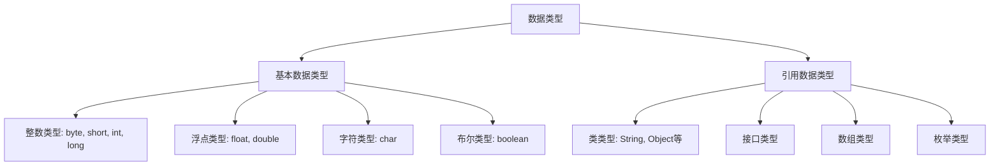
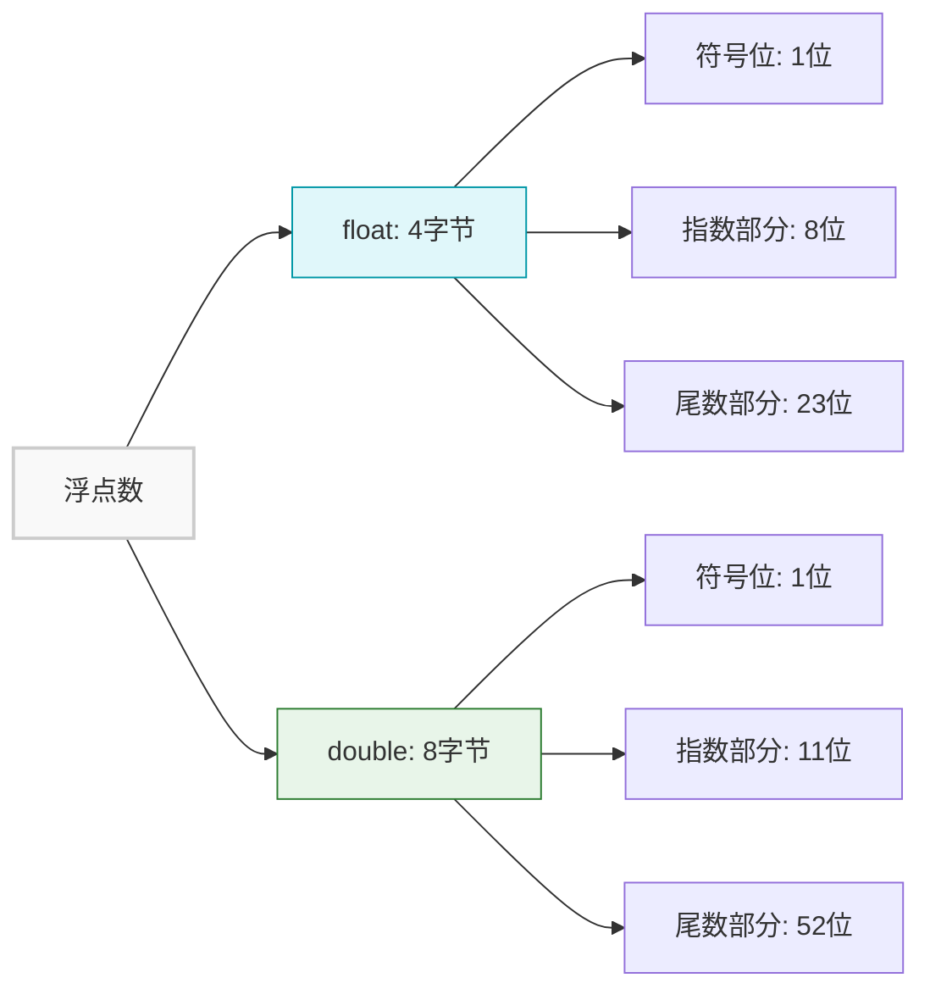
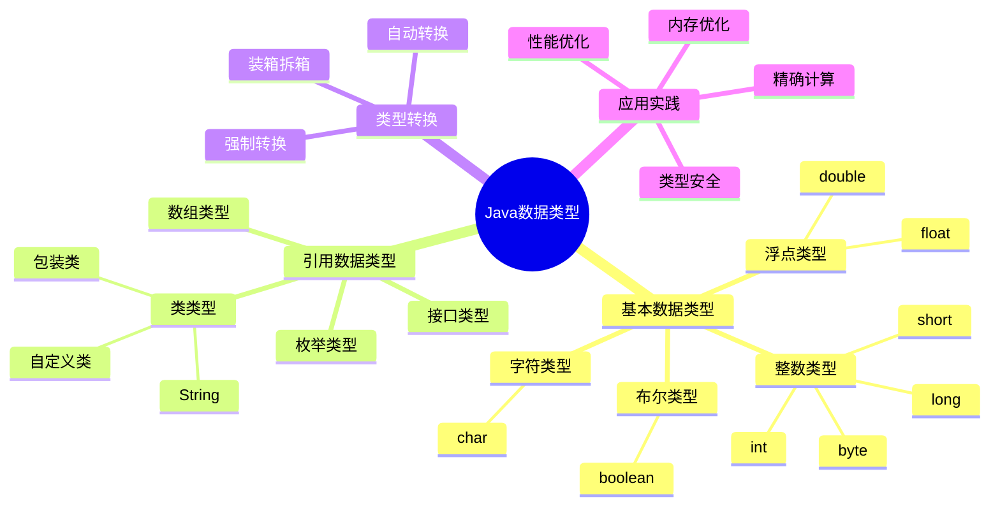

import Tabs from '@theme/Tabs';
import TabItem from '@theme/TabItem';
import TOCInline from '@theme/TOCInline';

# Java 数据类型详解

Java数据类型系统是Java语言的基础，它定义了程序中可以使用的各种数据类型的特性、范围和操作方式。理解Java数据类型对于编写高效、安全的程序至关重要。

:::info 本文内容概览
<TOCInline toc={toc} />
:::

:::tip 核心概念
数据类型 = 内存布局 + 取值范围 + 操作规则 + 性能特征
:::

## 1. 数据类型基础概念

### 1.1 什么是数据类型

数据类型是编程语言中用于定义变量、常量、方法参数和返回值的数据种类。Java是强类型语言，每个变量都必须声明其数据类型，编译器会进行类型检查。



#### 数据类型的作用

1. **内存分配**：确定变量在内存中占用的空间大小
2. **取值范围**：限制数据可以表示的值范围
3. **操作规则**：定义可以进行哪些运算和操作
4. **类型安全**：编译时检查类型匹配，避免运行时错误

### 1.2 Java数据类型分类

Java数据类型可以分为两大类：

| 分类 | 说明 | 特点 | 示例 |
|------|------|------|------|
| **基本数据类型** | 8种内置类型 | 直接存储值，栈内存分配 | `int`, `double`, `boolean` |
| **引用数据类型** | 类、接口、数组等 | 存储引用，堆内存分配 | `String`, `Object`, `int[]` |

## 2. 基本数据类型详解

### 2.1 整数类型

Java提供了4种整数类型，用于表示不同范围的整数值：

<Tabs>
  <TabItem value="table" label="基本信息" default>
| 类型 | 大小 | 取值范围 | 默认值 | 用途 |
|------|------|----------|--------|------|
| `byte` | 1字节 | -128 ~ 127 | 0 | 小范围整数，如年龄、成绩 |
| `short` | 2字节 | -32,768 ~ 32,767 | 0 | 中等范围整数，如年份、数量 |
| `int` | 4字节 | -2^31 ~ 2^31-1 | 0 | 最常用的整数类型 |
| `long` | 8字节 | -2^63 ~ 2^63-1 | 0L | 大范围整数，如时间戳、ID |
  </TabItem>
  <TabItem value="visualization" label="内存占用对比">
    ```mermaid
    graph LR
        subgraph "整数类型内存占用"
            A["byte (1字节)"] --- B["short (2字节)"] --- C["int (4字节)"] --- D["long (8字节)"]
        end
        
        style A fill:#f9f9f9,stroke:#ccc,stroke-width:2px
        style B fill:#f0f0f0,stroke:#ccc,stroke-width:2px
        style C fill:#e0e0e0,stroke:#ccc,stroke-width:2px
        style D fill:#d0d0d0,stroke:#ccc,stroke-width:2px
    ```
  </TabItem>
  <TabItem value="range" label="取值范围">
    <div className="admonition admonition-info">
    <div className="admonition-heading">
    <h5>整数类型的取值范围</h5>
    </div>
    <div className="admonition-content">
    <ul>
    <li><code>byte</code>: -128 到 127 （2^7 到 2^7-1）</li>
    <li><code>short</code>: -32,768 到 32,767 （2^15 到 2^15-1）</li>
    <li><code>int</code>: -2,147,483,648 到 2,147,483,647 （2^31 到 2^31-1）</li>
    <li><code>long</code>: -9,223,372,036,854,775,808 到 9,223,372,036,854,775,807 （2^63 到 2^63-1）</li>
    </ul>
    </div>
    </div>
  </TabItem>
</Tabs>

#### 整数类型示例

<div className="code-with-callout">

```java title="整数类型使用示例"
public class IntegerTypesDemo {
    public static void main(String[] args) {
        System.out.println("=== 整数类型详解 ===");
        
        // highlight-start
        // byte类型
        byte age = 25;
        byte score = 95;
        System.out.println("byte类型示例:");
        System.out.println("  年龄: " + age);
        System.out.println("  成绩: " + score);
        System.out.println("  byte范围: " + Byte.MIN_VALUE + " ~ " + Byte.MAX_VALUE);
        // highlight-end
        System.out.println();
        
        // short类型
        short year = 2024;
        short month = 12;
        System.out.println("short类型示例:");
        System.out.println("  年份: " + year);
        System.out.println("  月份: " + month);
        System.out.println("  short范围: " + Short.MIN_VALUE + " ~ " + Short.MAX_VALUE);
        System.out.println();
        
        // int类型
        int population = 1400000000;
        int distance = 384400;
        System.out.println("int类型示例:");
        System.out.println("  人口: " + population);
        System.out.println("  距离: " + distance + "km");
        System.out.println("  int范围: " + Integer.MIN_VALUE + " ~ " + Integer.MAX_VALUE);
        System.out.println();
        
        // long类型 - 注意长整型字面值需要加L后缀
        long timestamp = System.currentTimeMillis();
        long userId = 1234567890123456789L; // 需要使用L后缀
        System.out.println("long类型示例:");
        System.out.println("  时间戳: " + timestamp);
        System.out.println("  用户ID: " + userId);
        System.out.println("  long范围: " + Long.MIN_VALUE + " ~ " + Long.MAX_VALUE);
        System.out.println();
        
        // 整数运算
        System.out.println("=== 整数运算 ===");
        int a = 10;
        int b = 3;
        System.out.println("整数运算:");
        System.out.println("  a = " + a + ", b = " + b);
        System.out.println("  a + b = " + (a + b));
        System.out.println("  a - b = " + (a - b));
        System.out.println("  a * b = " + (a * b));
        System.out.println("  a / b = " + (a / b));        // 整数除法
        System.out.println("  a % b = " + (a % b));        // 取余
        System.out.println("  a / (double)b = " + (a / (double)b)); // 浮点除法
    }
}
```

:::warning 注意
对于long类型字面值，必须添加L后缀（如`1234567890123456789L`），否则会被解释为int类型，可能导致编译错误或精度损失。
:::
</div>

:::tip 整数类型使用技巧
- 对于简单计数、索引或循环控制变量，优先使用 `int` 类型
- 对于表示时间戳、大数据量ID和需要超出int范围的场景，使用 `long` 类型
- 在确定数值范围很小的情况下（如年龄、评分），可以考虑使用 `byte` 类型节省内存
- 在内存受限或需要处理大量数据的环境中，合理选择最小的满足需求的整数类型
:::

### 2.2 浮点类型

Java提供了2种浮点类型，用于表示小数和科学计数法数值：

| 类型 | 大小 | 精度 | 取值范围 | 默认值 | 用途 |
|------|------|------|----------|--------|------|
| `float` | 4字节 | 6-7位有效数字 | ±3.4E-38 ~ ±3.4E+38 | 0.0f | 单精度浮点数 |
| `double` | 8字节 | 15-16位有效数字 | ±1.7E-308 ~ ±1.7E+308 | 0.0 | 双精度浮点数（推荐） |



:::caution 浮点数精度问题
浮点数在计算机中采用二进制表示，某些十进制小数（如0.1）无法精确表示，因此浮点数计算可能产生微小误差。对于需要精确计算的场景（如金融计算），应使用`BigDecimal`类。
:::

#### 浮点类型示例

```java title="浮点类型使用示例"
public class FloatingPointTypesDemo {
    public static void main(String[] args) {
        System.out.println("=== 浮点类型详解 ===");
        
        // float类型
        float pi = 3.14159f;
        float temperature = 36.5f;
        System.out.println("float类型示例:");
        System.out.println("  圆周率: " + pi);
        System.out.println("  体温: " + temperature + "°C");
        System.out.println("  float精度: 6-7位有效数字");
        System.out.println("  float范围: " + Float.MIN_VALUE + " ~ " + Float.MAX_VALUE);
        System.out.println();
        
        // double类型
        double precisePi = 3.141592653589793;
        double gravity = 9.80665;
        System.out.println("double类型示例:");
        System.out.println("  精确圆周率: " + precisePi);
        System.out.println("  重力加速度: " + gravity + " m/s²");
        System.out.println("  double精度: 15-16位有效数字");
        System.out.println("  double范围: " + Double.MIN_VALUE + " ~ " + Double.MAX_VALUE);
        System.out.println();
        
        // 科学计数法
        System.out.println("=== 科学计数法 ===");
        double lightSpeed = 3.0e8;        // 3.0 × 10^8
        double electronMass = 9.109e-31;  // 9.109 × 10^-31
        System.out.println("科学计数法:");
        System.out.println("  光速: " + lightSpeed + " m/s");
        System.out.println("  电子质量: " + electronMass + " kg");
        System.out.println();
        
        // 浮点数精度问题
        System.out.println("=== 浮点数精度问题 ===");
        double a = 0.1;
        double b = 0.2;
        double c = a + b;
        System.out.println("浮点数精度问题:");
        System.out.println("  0.1 + 0.2 = " + c);
        System.out.println("  0.1 + 0.2 == 0.3: " + (c == 0.3));
        System.out.println("  解决方案: 使用BigDecimal进行精确计算");
        System.out.println();
        
        // 浮点数比较
        System.out.println("=== 浮点数比较 ===");
        double x = 0.1 + 0.2;
        double y = 0.3;
        System.out.println("浮点数比较:");
        System.out.println("  x = " + x);
        System.out.println("  y = " + y);
        System.out.println("  x == y: " + (x == y));
        System.out.println("  Math.abs(x - y) < 0.0001: " + (Math.abs(x - y) < 0.0001));
    }
}
```

### 2.3 字符类型

Java的 `char` 类型用于表示Unicode字符：

| 类型 | 大小 | 取值范围 | 默认值 | 用途 |
|------|------|----------|--------|------|
| `char` | 2字节 | 0 ~ 65,535 (Unicode) | '\u0000' | 单个字符、Unicode码点 |

#### 字符类型示例

```java title="字符类型使用示例"
public class CharTypeDemo {
    public static void main(String[] args) {
        System.out.println("=== 字符类型详解 ===");
        
        // 基本字符
        char letter = 'A';
        char digit = '5';
        char symbol = '@';
        char chinese = '中';
        System.out.println("基本字符示例:");
        System.out.println("  字母: " + letter);
        System.out.println("  数字: " + digit);
        System.out.println("  符号: " + symbol);
        System.out.println("  中文: " + chinese);
        System.out.println();
        
        // Unicode码点
        System.out.println("=== Unicode码点 ===");
        char unicodeA = 65;        // 'A'的Unicode码点
        char unicodeHeart = 9829;  // '♥'的Unicode码点
        char unicodeSmile = 0x1F600; // '😀'的Unicode码点（需要代理对）
        System.out.println("Unicode码点:");
        System.out.println("  65 -> " + unicodeA);
        System.out.println("  9829 -> " + unicodeHeart);
        System.out.println("  0x1F600 -> " + unicodeSmile);
        System.out.println();
        
        // 转义字符
        System.out.println("=== 转义字符 ===");
        System.out.println("转义字符示例:");
        System.out.println("  换行: Hello\nWorld");
        System.out.println("  制表符: Name\tAge\tCity");
        System.out.println("  双引号: \"Hello World\"");
        System.out.println("  单引号: \'A\'");
        System.out.println("  反斜杠: \\");
        System.out.println();
        
        // 字符运算
        System.out.println("=== 字符运算 ===");
        char c1 = 'A';
        char c2 = 'a';
        System.out.println("字符运算:");
        System.out.println("  'A'的Unicode值: " + (int)c1);
        System.out.println("  'a'的Unicode值: " + (int)c2);
        System.out.println("  大小写差值: " + (c2 - c1));
        System.out.println("  转换为小写: " + (char)(c1 + 32));
        System.out.println("  转换为大写: " + (char)(c2 - 32));
    }
}
```

### 2.4 布尔类型

Java的 `boolean` 类型用于表示逻辑值：

| 类型 | 大小 | 取值范围 | 默认值 | 用途 |
|------|------|----------|--------|------|
| `boolean` | 1字节 | `true` 或 `false` | `false` | 逻辑判断、条件控制 |

#### 布尔类型示例

```java title="布尔类型使用示例"
public class BooleanTypeDemo {
    public static void main(String[] args) {
        System.out.println("=== 布尔类型详解 ===");
        
        // 基本布尔值
        boolean isActive = true;
        boolean isVisible = false;
        System.out.println("基本布尔值:");
        System.out.println("  是否激活: " + isActive);
        System.out.println("  是否可见: " + isVisible);
        System.out.println();
        
        // 布尔运算
        System.out.println("=== 布尔运算 ===");
        boolean a = true;
        boolean b = false;
        System.out.println("布尔运算:");
        System.out.println("  a = " + a + ", b = " + b);
        System.out.println("  a && b (与): " + (a && b));
        System.out.println("  a || b (或): " + (a || b));
        System.out.println("  !a (非): " + (!a));
        System.out.println("  !b (非): " + (!b));
        System.out.println();
        
        // 比较运算
        System.out.println("=== 比较运算 ===");
        int age = 25;
        int minAge = 18;
        boolean isAdult = age >= minAge;
        boolean isTeenager = age >= 13 && age <= 19;
        System.out.println("比较运算:");
        System.out.println("  年龄: " + age);
        System.out.println("  是否成年: " + isAdult);
        System.out.println("  是否青少年: " + isTeenager);
        System.out.println();
        
        // 条件控制
        System.out.println("=== 条件控制 ===");
        System.out.println("条件控制示例:");
        if (isAdult) {
            System.out.println("  可以进入成人区域");
        } else {
            System.out.println("  需要监护人陪同");
        }
        
        String status = isActive ? "在线" : "离线";
        System.out.println("  状态: " + status);
    }
}
```

## 3. 引用数据类型详解

### 3.1 类类型

类类型是最常用的引用类型，包括Java内置类和自定义类：

#### 类类型示例

```java title="类类型示例"
public class ClassTypesDemo {
    public static void main(String[] args) {
        System.out.println("=== 类类型详解 ===");

        // String类（最常用的类类型）
        String str1 = "Hello World";
        String str2 = new String("Hello World");
        System.out.println("String类型:");
        System.out.println("  字面量创建: " + str1);
        System.out.println("  构造函数创建: " + str2);
        System.out.println("  字符串相等: " + str1.equals(str2));
        System.out.println("  引用相等: " + (str1 == str2));
        System.out.println();

        // 包装类
        System.out.println("=== 包装类 ===");
        Integer intObj = 100;           // 自动装箱
        Double doubleObj = 3.14;        // 自动装箱
        Boolean boolObj = true;         // 自动装箱

        int primitiveInt = intObj;      // 自动拆箱
        double primitiveDouble = doubleObj; // 自动拆箱
        boolean primitiveBool = boolObj;    // 自动拆箱

        System.out.println("包装类示例:");
        System.out.println("  Integer: " + intObj + " -> " + primitiveInt);
        System.out.println("  Double: " + doubleObj + " -> " + primitiveDouble);
        System.out.println("  Boolean: " + boolObj + " -> " + primitiveBool);
        System.out.println();

        // 自定义类
        System.out.println("=== 自定义类 ===");
        Person person = new Person("张三", 25);
        System.out.println("自定义类对象: " + person);
        System.out.println("姓名: " + person.getName());
        System.out.println("年龄: " + person.getAge());
    }
}

// 自定义类示例
class Person {
    private String name;
    private int age;

    public Person(String name, int age) {
        this.name = name;
        this.age = age;
    }

    public String getName() {
        return name;
    }

    public int getAge() {
        return age;
    }

    @Override
    public String toString() {
        return "Person{name='" + name + "', age=" + age + "}";
    }
}
```

### 3.2 接口类型

接口定义了一组抽象方法，可以被多个类实现：

```java title="接口类型示例"
public class InterfaceTypesDemo {
    public static void main(String[] args) {
        System.out.println("=== 接口类型详解 ===");

        // 使用接口作为类型
        Vehicle car = new Car();
        Vehicle bike = new Bike();

        System.out.println("接口类型示例:");
        car.start();
        car.stop();
        bike.start();
        bike.stop();
        System.out.println();

        // 接口数组
        Vehicle[] vehicles = {car, bike};
        System.out.println("接口数组:");
        for (Vehicle vehicle : vehicles) {
            vehicle.start();
            vehicle.stop();
        }
        System.out.println();

        // 接口作为方法参数
        System.out.println("=== 接口作为方法参数 ===");
        testVehicle(car);
        testVehicle(bike);
    }

    // 接口作为方法参数类型
    public static void testVehicle(Vehicle vehicle) {
        System.out.println("测试车辆: " + vehicle.getClass().getSimpleName());
        vehicle.start();
        vehicle.stop();
        System.out.println();
    }
}

// 接口定义
interface Vehicle {
    void start();
    void stop();
}

// 实现接口的类
class Car implements Vehicle {
    @Override
    public void start() {
        System.out.println("汽车启动");
    }

    @Override
    public void stop() {
        System.out.println("汽车停止");
    }
}

class Bike implements Vehicle {
    @Override
    public void start() {
        System.out.println("自行车开始骑行");
    }

    @Override
    public void stop() {
        System.out.println("自行车停止");
    }
}
```

### 3.3 数组类型

数组是相同类型元素的集合：

```java title="数组类型示例"
public class ArrayTypesDemo {
    public static void main(String[] args) {
        System.out.println("=== 数组类型详解 ===");

        // 基本数据类型数组
        System.out.println("=== 基本数据类型数组 ===");
        int[] intArray = {1, 2, 3, 4, 5};
        double[] doubleArray = {1.1, 2.2, 3.3, 4.4, 5.5};
        char[] charArray = {'A', 'B', 'C', 'D', 'E'};

        System.out.println("int数组: " + java.util.Arrays.toString(intArray));
        System.out.println("double数组: " + java.util.Arrays.toString(doubleArray));
        System.out.println("char数组: " + java.util.Arrays.toString(charArray));
        System.out.println();

        // 引用类型数组
        System.out.println("=== 引用类型数组 ===");
        String[] stringArray = {"Hello", "World", "Java"};
        Person[] personArray = {
            new Person("张三", 25),
            new Person("李四", 30),
            new Person("王五", 35)
        };

        System.out.println("String数组: " + java.util.Arrays.toString(stringArray));
        System.out.println("Person数组:");
        for (Person person : personArray) {
            System.out.println("  " + person);
        }
        System.out.println();

        // 多维数组
        System.out.println("=== 多维数组 ===");
        int[][] matrix = {
            {1, 2, 3},
            {4, 5, 6},
            {7, 8, 9}
        };

        System.out.println("二维数组（矩阵）:");
        for (int i = 0; i < matrix.length; i++) {
            for (int j = 0; j < matrix[i].length; j++) {
                System.out.print(matrix[i][j] + " ");
            }
            System.out.println();
        }
        System.out.println();

        // 数组操作
        System.out.println("=== 数组操作 ===");
        int[] numbers = {5, 2, 8, 1, 9, 3};
        System.out.println("原始数组: " + java.util.Arrays.toString(numbers));

        // 排序
        java.util.Arrays.sort(numbers);
        System.out.println("排序后: " + java.util.Arrays.toString(numbers));

        // 查找
        int searchValue = 8;
        int index = java.util.Arrays.binarySearch(numbers, searchValue);
        System.out.println("查找 " + searchValue + " 的索引: " + index);

        // 复制
        int[] copyArray = java.util.Arrays.copyOf(numbers, numbers.length);
        System.out.println("复制数组: " + java.util.Arrays.toString(copyArray));

        // 填充
        int[] fillArray = new int[5];
        java.util.Arrays.fill(fillArray, 100);
        System.out.println("填充数组: " + java.util.Arrays.toString(fillArray));
    }
}
```

### 3.4 枚举类型

枚举是Java 5引入的特殊类类型，用于表示一组常量：

```java title="枚举类型示例"
public class EnumTypesDemo {
    public static void main(String[] args) {
        System.out.println("=== 枚举类型详解 ===");

        // 基本枚举使用
        System.out.println("=== 基本枚举 ===");
        DayOfWeek today = DayOfWeek.MONDAY;
        System.out.println("今天是: " + today);
        System.out.println("今天是星期几: " + today.getDayNumber());
        System.out.println("中文名称: " + today.getChineseName());
        System.out.println();

        // 遍历所有枚举值
        System.out.println("=== 遍历枚举值 ===");
        System.out.println("一周的所有天:");
        for (DayOfWeek day : DayOfWeek.values()) {
            System.out.println("  " + day + " - " + day.getChineseName() + " (星期" + day.getDayNumber() + ")");
        }
        System.out.println();

        // 枚举比较
        System.out.println("=== 枚举比较 ===");
        DayOfWeek day1 = DayOfWeek.MONDAY;
        DayOfWeek day2 = DayOfWeek.FRIDAY;

        System.out.println("比较结果:");
        System.out.println("  " + day1 + " 在 " + day2 + " 之前: " + (day1.ordinal() < day2.ordinal()));
        System.out.println("  " + day1 + " 序号: " + day1.ordinal());
        System.out.println("  " + day2 + " 序号: " + day2.ordinal());
        System.out.println();

        // 枚举作为状态机
        System.out.println("=== 枚举状态机 ===");
        TrafficLight light = TrafficLight.RED;
        System.out.println("当前交通灯: " + light);
        System.out.println("下一个状态: " + light.next());
        System.out.println("等待时间: " + light.getWaitTime() + " 秒");
        System.out.println();

        // 枚举单例模式
        System.out.println("=== 枚举单例 ===");
        DatabaseConnection conn1 = DatabaseConnection.INSTANCE;
        DatabaseConnection conn2 = DatabaseConnection.INSTANCE;
        System.out.println("连接1: " + conn1);
        System.out.println("连接2: " + conn2);
        System.out.println("是否为同一实例: " + (conn1 == conn2));
        conn1.connect();
        conn2.disconnect();
    }
}

// 基本枚举
enum DayOfWeek {
    MONDAY(1, "星期一"),
    TUESDAY(2, "星期二"),
    WEDNESDAY(3, "星期三"),
    THURSDAY(4, "星期四"),
    FRIDAY(5, "星期五"),
    SATURDAY(6, "星期六"),
    SUNDAY(7, "星期日");

    private final int dayNumber;
    private final String chineseName;

    DayOfWeek(int dayNumber, String chineseName) {
        this.dayNumber = dayNumber;
        this.chineseName = chineseName;
    }

    public int getDayNumber() {
        return dayNumber;
    }

    public String getChineseName() {
        return chineseName;
    }
}

// 枚举状态机
enum TrafficLight {
    RED(30) {
        @Override
        public TrafficLight next() {
            return GREEN;
        }
    },
    GREEN(25) {
        @Override
        public TrafficLight next() {
            return YELLOW;
        }
    },
    YELLOW(5) {
        @Override
        public TrafficLight next() {
            return RED;
        }
    };

    private final int waitTime;

    TrafficLight(int waitTime) {
        this.waitTime = waitTime;
    }

    public abstract TrafficLight next();

    public int getWaitTime() {
        return waitTime;
    }
}

// 枚举单例
enum DatabaseConnection {
    INSTANCE;

    private boolean connected = false;

    public void connect() {
        if (!connected) {
            System.out.println("数据库连接已建立");
            connected = true;
        } else {
            System.out.println("数据库已经连接");
        }
    }

    public void disconnect() {
        if (connected) {
            System.out.println("数据库连接已断开");
            connected = false;
        } else {
            System.out.println("数据库未连接");
        }
    }

    public boolean isConnected() {
        return connected;
    }
}
```

## 4. 数据类型转换

Java中的数据类型转换分为自动转换（隐式转换）和强制转换（显式转换）。

### 4.1 自动类型转换

当满足转换条件时，Java会自动进行类型转换：

```java title="自动类型转换示例"
public class AutoConversionDemo {
    public static void main(String[] args) {
        System.out.println("=== 自动类型转换 ===");

        // 整数类型之间的转换
        System.out.println("=== 整数类型转换 ===");
        byte byteValue = 100;
        short shortValue = byteValue;  // byte -> short
        int intValue = shortValue;     // short -> int
        long longValue = intValue;     // int -> long

        System.out.println("转换过程:");
        System.out.println("  byte(100) -> short: " + shortValue);
        System.out.println("  short -> int: " + intValue);
        System.out.println("  int -> long: " + longValue);
        System.out.println();

        // 浮点类型之间的转换
        System.out.println("=== 浮点类型转换 ===");
        float floatValue = 3.14f;
        double doubleValue = floatValue;  // float -> double

        System.out.println("float -> double:");
        System.out.println("  float值: " + floatValue);
        System.out.println("  double值: " + doubleValue);
        System.out.println();

        // 整数到浮点的转换
        System.out.println("=== 整数到浮点转换 ===");
        int intNum = 123456789;
        float floatNum = intNum;      // int -> float
        double doubleNum = intNum;    // int -> double

        System.out.println("整数到浮点转换:");
        System.out.println("  int值: " + intNum);
        System.out.println("  float值: " + floatNum);
        System.out.println("  double值: " + doubleNum);
        System.out.println();

        // 字符到整数的转换
        System.out.println("=== 字符到整数转换 ===");
        char charValue = 'A';
        int charToInt = charValue;    // char -> int

        System.out.println("字符到整数转换:");
        System.out.println("  char值: " + charValue);
        System.out.println("  int值: " + charToInt);
        System.out.println("  Unicode值: " + (int) charValue);
        System.out.println();

        // 混合运算中的自动转换
        System.out.println("=== 混合运算中的转换 ===");
        int a = 10;
        double b = 3.5;
        double result = a + b;  // int + double -> double

        System.out.println("混合运算:");
        System.out.println("  int a = " + a);
        System.out.println("  double b = " + b);
        System.out.println("  a + b = " + result + " (类型: " + 
                          ((Object) result).getClass().getSimpleName() + ")");
    }
}
```

### 4.2 强制类型转换

当需要将大范围类型转换为小范围类型时，必须进行强制转换：

```java title="强制类型转换示例"
public class CastConversionDemo {
    public static void main(String[] args) {
        System.out.println("=== 强制类型转换 ===");

        // 浮点到整数的转换
        System.out.println("=== 浮点到整数转换 ===");
        double doubleValue = 3.99;
        int intValue = (int) doubleValue;  // 强制转换，小数部分被截断

        System.out.println("浮点到整数转换:");
        System.out.println("  double值: " + doubleValue);
        System.out.println("  int值: " + intValue);
        System.out.println("  注意：小数部分被截断");
        System.out.println();

        // 长整型到整型的转换
        System.out.println("=== 长整型到整型转换 ===");
        long longValue = 1234567890123L;
        int intFromLong = (int) longValue;  // 可能丢失精度

        System.out.println("长整型到整型转换:");
        System.out.println("  long值: " + longValue);
        System.out.println("  int值: " + intFromLong);
        System.out.println("  注意：可能丢失精度");
        System.out.println();

        // 整数到字符的转换
        System.out.println("=== 整数到字符转换 ===");
        int intNum = 65;
        char charFromInt = (char) intNum;  // 65 -> 'A'

        System.out.println("整数到字符转换:");
        System.out.println("  int值: " + intNum);
        System.out.println("  char值: " + charFromInt);
        System.out.println("  Unicode字符: " + charFromInt);
        System.out.println();

        // 字符到字节的转换
        System.out.println("=== 字符到字节转换 ===");
        char charValue = '中';
        byte byteFromChar = (byte) charValue;  // 可能丢失信息

        System.out.println("字符到字节转换:");
        System.out.println("  char值: " + charValue + " (Unicode: " + (int) charValue + ")");
        System.out.println("  byte值: " + byteFromChar);
        System.out.println("  注意：可能丢失信息");
        System.out.println();

        // 安全的类型转换
        System.out.println("=== 安全的类型转换 ===");
        double safeDouble = 100.0;
        int safeInt = (int) safeDouble;  // 安全转换

        System.out.println("安全转换:");
        System.out.println("  double值: " + safeDouble);
        System.out.println("  int值: " + safeInt);
        System.out.println("  转换后值相等: " + (safeDouble == safeInt));
        System.out.println();

        // 类型转换的注意事项
        System.out.println("=== 类型转换注意事项 ===");
        System.out.println("1. 强制转换可能丢失数据");
        System.out.println("2. 浮点数转整数会截断小数部分");
        System.out.println("3. 大范围类型转小范围类型可能溢出");
        System.out.println("4. 字符转字节可能丢失Unicode信息");
    }
}
```

### 4.3 类型检查

Java提供了多种方式进行类型检查：

```java title="类型检查示例"
public class TypeCheckingDemo {
    public static void main(String[] args) {
        System.out.println("=== 类型检查 ===");

        // instanceof 操作符
        System.out.println("=== instanceof 操作符 ===");
        Object obj1 = "Hello";
        Object obj2 = 123;
        Object obj3 = new Person("张三", 25);

        System.out.println("类型检查结果:");
        System.out.println("  \"Hello\" instanceof String: " + (obj1 instanceof String));
        System.out.println("  \"Hello\" instanceof Integer: " + (obj1 instanceof Integer));
        System.out.println("  123 instanceof Integer: " + (obj2 instanceof Integer));
        System.out.println("  123 instanceof String: " + (obj2 instanceof String));
        System.out.println("  Person instanceof Person: " + (obj3 instanceof Person));
        System.out.println("  Person instanceof Object: " + (obj3 instanceof Object));
        System.out.println();

        // getClass() 方法
        System.out.println("=== getClass() 方法 ===");
        System.out.println("对象类型信息:");
        System.out.println("  obj1类型: " + obj1.getClass().getName());
        System.out.println("  obj2类型: " + obj2.getClass().getName());
        System.out.println("  obj3类型: " + obj3.getClass().getName());
        System.out.println();

        // 基本数据类型的类型检查
        System.out.println("=== 基本数据类型检查 ===");
        int intValue = 100;
        double doubleValue = 3.14;
        char charValue = 'A';
        boolean boolValue = true;

        System.out.println("基本数据类型:");
        System.out.println("  int类型: " + Integer.TYPE);
        System.out.println("  double类型: " + Double.TYPE);
        System.out.println("  char类型: " + Character.TYPE);
        System.out.println("  boolean类型: " + Boolean.TYPE);
        System.out.println();

        // 数组类型检查
        System.out.println("=== 数组类型检查 ===");
        int[] intArray = {1, 2, 3};
        String[] stringArray = {"Hello", "World"};
        Object[] objectArray = {1, "Hello", 3.14};

        System.out.println("数组类型检查:");
        System.out.println("  int[]类型: " + intArray.getClass().getName());
        System.out.println("  String[]类型: " + stringArray.getClass().getName());
        System.out.println("  Object[]类型: " + objectArray.getClass().getName());
        System.out.println("  int[]是否为数组: " + intArray.getClass().isArray());
        System.out.println("  int[]组件类型: " + intArray.getClass().getComponentType());
        System.out.println();

        // 泛型类型擦除后的类型检查
        System.out.println("=== 泛型类型检查 ===");
        java.util.List<String> stringList = new java.util.ArrayList<>();
        java.util.List<Integer> intList = new java.util.ArrayList<>();

        System.out.println("泛型类型检查（注意类型擦除）:");
        System.out.println("  stringList类型: " + stringList.getClass().getName());
        System.out.println("  intList类型: " + intList.getClass().getName());
        System.out.println("  类型是否相等: " + (stringList.getClass() == intList.getClass()));
        System.out.println("  注意：泛型在运行时被擦除");
    }
}
```

## 5. 实际应用场景

### 5.1 数据类型选择策略

```java title="数据类型选择策略示例"
public class DataTypeSelectionDemo {
    public static void main(String[] args) {
        System.out.println("=== 数据类型选择策略 ===");

        // 1. 性能考虑
        System.out.println("=== 性能考虑 ===");
        long startTime = System.currentTimeMillis();
        
        // 使用int进行计算
        int sum = 0;
        for (int i = 0; i < 100000000; i++) {
            sum += i;
        }
        
        long endTime = System.currentTimeMillis();
        System.out.println("int计算耗时: " + (endTime - startTime) + "ms");
        System.out.println("结果: " + sum);
        System.out.println();

        // 2. 内存考虑
        System.out.println("=== 内存考虑 ===");
        System.out.println("基本数据类型内存占用:");
        System.out.println("  byte: 1字节");
        System.out.println("  short: 2字节");
        System.out.println("  int: 4字节");
        System.out.println("  long: 8字节");
        System.out.println("  float: 4字节");
        System.out.println("  double: 8字节");
        System.out.println("  char: 2字节");
        System.out.println("  boolean: 1字节");
        System.out.println();

        // 3. 精度考虑
        System.out.println("=== 精度考虑 ===");
        System.out.println("金融计算使用BigDecimal:");
        java.math.BigDecimal price = new java.math.BigDecimal("19.99");
        java.math.BigDecimal quantity = new java.math.BigDecimal("3");
        java.math.BigDecimal total = price.multiply(quantity);
        System.out.println("单价: " + price);
        System.out.println("数量: " + quantity);
        System.out.println("总价: " + total);
        System.out.println();

        // 4. 范围考虑
        System.out.println("=== 范围考虑 ===");
        System.out.println("根据数据范围选择类型:");
        System.out.println("  年龄: byte (0-127)");
        System.out.println("  年份: short (0-32767)");
        System.out.println("  人口: int (0-21亿)");
        System.out.println("  时间戳: long");
        System.out.println("  价格: BigDecimal");
        System.out.println("  状态: boolean");
        System.out.println("  文本: String");
    }
}
```

### 5.2 常见问题和解决方案

```java title="常见问题和解决方案示例"
public class CommonProblemsDemo {
    public static void main(String[] args) {
        System.out.println("=== 常见问题和解决方案 ===");

        // 1. 整数溢出问题
        System.out.println("=== 整数溢出问题 ===");
        int maxInt = Integer.MAX_VALUE;
        System.out.println("int最大值: " + maxInt);
        
        int overflow = maxInt + 1;
        System.out.println("溢出后: " + overflow);
        System.out.println("解决方案: 使用long类型");
        System.out.println();

        // 2. 浮点数精度问题
        System.out.println("=== 浮点数精度问题 ===");
        double a = 0.1;
        double b = 0.2;
        double c = a + b;
        System.out.println("0.1 + 0.2 = " + c);
        System.out.println("0.1 + 0.2 == 0.3: " + (c == 0.3));
        System.out.println("解决方案: 使用BigDecimal");
        System.out.println();

        // 3. 字符串比较问题
        System.out.println("=== 字符串比较问题 ===");
        String str1 = "Hello";
        String str2 = new String("Hello");
        System.out.println("字符串比较:");
        System.out.println("  str1 == str2: " + (str1 == str2));
        System.out.println("  str1.equals(str2): " + str1.equals(str2));
        System.out.println("解决方案: 使用equals()方法比较内容");
        System.out.println();

        // 4. 空指针问题
        System.out.println("=== 空指针问题 ===");
        String nullString = null;
        try {
            System.out.println("字符串长度: " + nullString.length());
        } catch (NullPointerException e) {
            System.out.println("捕获空指针异常: " + e.getMessage());
        }
        System.out.println("解决方案: 使用Objects.requireNonNull或null检查");
        System.out.println();

        // 5. 类型转换异常
        System.out.println("=== 类型转换异常 ===");
        Object obj = "Hello";
        try {
            Integer intValue = (Integer) obj;
            System.out.println("转换成功: " + intValue);
        } catch (ClassCastException e) {
            System.out.println("类型转换异常: " + e.getMessage());
        }
        System.out.println("解决方案: 使用instanceof检查类型");
        System.out.println();
    }
}
```

### 5.3 最佳实践总结

```java title="最佳实践总结"
public class BestPracticesDemo {
    public static void main(String[] args) {
        System.out.println("=== 数据类型最佳实践 ===");

        System.out.println("1. 选择合适的数据类型:");
        System.out.println("   - 根据数据范围选择整数类型");
        System.out.println("   - 根据精度要求选择浮点类型");
        System.out.println("   - 根据业务需求选择引用类型");
        System.out.println();

        System.out.println("2. 注意类型安全:");
        System.out.println("   - 使用instanceof进行类型检查");
        System.out.println("   - 避免不安全的类型转换");
        System.out.println("   - 处理可能的类型转换异常");
        System.out.println();

        System.out.println("3. 性能优化:");
        System.out.println("   - 基本类型比包装类型性能更好");
        System.out.println("   - 避免不必要的装箱拆箱");
        System.out.println("   - 合理使用数组和集合");
        System.out.println();

        System.out.println("4. 内存管理:");
        System.out.println("   - 及时释放不再使用的对象");
        System.out.println("   - 避免创建过多临时对象");
        System.out.println("   - 使用对象池管理大量对象");
        System.out.println();

        System.out.println("5. 代码可读性:");
        System.out.println("   - 使用有意义的变量名");
        System.out.println("   - 添加必要的类型注释");
        System.out.println("   - 遵循命名规范");
        System.out.println();

        System.out.println("6. 异常处理:");
        System.out.println("   - 捕获并处理可能的异常");
        System.out.println("   - 提供有意义的错误信息");
        System.out.println("   - 使用日志记录异常信息");
    }
}
```

## 总结

Java数据类型系统是Java语言的基础，理解各种数据类型的特点、使用场景和注意事项对于编写高质量的Java程序至关重要。

<div className="alert alert--primary" role="alert">
<h4 className="alert--heading">Java数据类型知识体系</h4>



</div>

### 关键要点

:::info 关键要点
1. **基本数据类型**：8种基本类型，各有其特定的用途和范围
2. **引用数据类型**：类、接口、数组、枚举，提供更丰富的功能
3. **类型转换**：自动转换和强制转换，需要注意数据丢失
4. **类型安全**：使用instanceof和getClass()进行类型检查
5. **最佳实践**：根据实际需求选择合适的数据类型
:::

### 学习建议

<Tabs>
  <TabItem value="beginner" label="初学者" default>
  <ul>
  <li>掌握8种基本数据类型的基本特性和取值范围</li>
  <li>理解基本数据类型和引用数据类型的区别</li>
  <li>学习常见的类型转换场景和方法</li>
  <li>避免常见的数据类型陷阱（如浮点数精度问题）</li>
  <li>多练习实际编码，巩固理论知识</li>
  </ul>
  </TabItem>
  <TabItem value="intermediate" label="进阶学习">
  <ul>
  <li>深入理解每种数据类型的内存布局和性能特点</li>
  <li>掌握类型转换的规则和注意事项</li>
  <li>学会根据业务需求选择合适的数据类型</li>
  <li>注意类型安全和异常处理</li>
  <li>探索高级类型用法（如泛型、函数式接口）</li>
  </ul>
  </TabItem>
  <TabItem value="advanced" label="高级应用">
  <ul>
  <li>研究JVM中的数据类型实现原理</li>
  <li>了解不同JVM实现对数据类型的优化策略</li>
  <li>掌握内存模型与数据类型的关系</li>
  <li>探索并发环境下的数据类型安全</li>
  <li>在大型项目中优化数据类型使用以提升性能</li>
  </ul>
  </TabItem>
</Tabs>

<div className="admonition admonition-tip">
<div className="admonition-heading">
<h5>实践是关键</h5>
</div>
<div className="admonition-content">
<p>通过系统学习和实践，你将能够熟练运用Java数据类型系统，编写出高效、安全、可维护的Java程序。记住，理论知识只有在实践中应用才能转化为真正的能力！</p>
</div>
</div> 