import Tabs from '@theme/Tabs';
import TabItem from '@theme/TabItem';
import TOCInline from '@theme/TOCInline';

# Java 异常处理机制详解

异常处理是Java编程语言的一个重要特性，它提供了一种结构化和受控的方式来处理程序运行时出现的错误或异常情况。良好的异常处理机制能够提高程序的健壮性、可维护性和用户体验。

:::info 本文内容概览
<TOCInline toc={toc} />
:::

:::tip 核心概念
异常处理 = 异常捕获 + 异常处理 + 资源管理 + 错误恢复
:::



```mermaid
graph TD
    A[Java异常处理] --> B[异常体系]
    A --> C[处理方式]
    A --> D[资源管理]
    A --> E[最佳实践]
    
    B --> B1[Throwable]
    B1 --> B2[Error]
    B1 --> B3[Exception]
    B3 --> B4[检查型异常]
    B3 --> B5[非检查型异常]
    
    C --> C1[try-catch-finally]
    C --> C2[try-with-resources]
    C --> C3[throws声明]
    
    D --> D1[手动关闭资源]
    D --> D2[自动关闭资源]
    
    E --> E1[异常处理原则]
    E --> E2[异常设计模式]
    
    style A fill:#f9f9f9,stroke:#333,stroke-width:2px
```

:::tip 核心价值
**异常处理 = 异常捕获 + 异常处理 + 资源管理 + 错误恢复**
- 🛡️ **结构化处理**：提供统一的错误处理机制，增强代码健壮性
- 🔍 **问题定位**：提供详细的堆栈跟踪，快速定位问题根源
- 🔄 **流程控制**：允许程序从错误中恢复并继续执行
- 🧹 **资源管理**：确保资源正确释放，防止资源泄露
- 📝 **代码分离**：分离正常逻辑与错误处理逻辑，提高可读性
:::

## 1. 异常基础概念

### 1.1 什么是异常？

异常是程序执行期间发生的事件，它会中断程序指令的正常流程。当方法中发生错误时，方法会创建一个异常对象并交给JVM处理。

```mermaid
sequenceDiagram
    participant 用户代码
    participant 方法A
    participant 方法B
    participant JVM
    
    用户代码->>方法A: 调用方法
    方法A->>方法B: 调用子方法
    方法B-->>JVM: 抛出异常
    JVM-->>方法A: 传播异常
    
    alt 异常被捕获
        方法A-->>用户代码: 处理异常并恢复
    else 异常未捕获
        JVM-->>用户代码: 程序中断
    end
```



<Tabs>
  <TabItem value="nature" label="异常的本质" default>
    - **异常不是错误**：而是一种机制，用于处理程序执行过程中的异常情况
    - **中断正常流程**：当异常发生时，正常的程序执行流程会被中断
    - **异常对象**：每个异常都是一个对象，包含错误信息和堆栈跟踪
    - **异常传播**：异常会沿着调用栈向上传播，直到被处理
    
    :::info 异常处理的意义
    异常处理让程序能够优雅地处理错误并继续执行，而不是简单地崩溃。这对于生产环境的应用程序尤为重要。
    :::
  </TabItem>
  <TabItem value="flow" label="异常处理流程">
    1. **异常发生**：执行代码时遇到异常情况
    2. **创建异常对象**：创建描述异常的对象（如 `NullPointerException`）
    3. **抛出异常**：从当前执行点中断代码执行，并"抛出"异常对象
    4. **寻找处理器**：JVM查找适当的异常处理器（向上查找调用堆栈）
    5. **执行处理器**：执行找到的异常处理代码（catch块）
    6. **执行清理**：执行清理代码（finally块）
    7. **恢复执行**：从异常处理器之后的点继续执行
    
    :::caution 未处理的异常
    如果异常在调用堆栈中未被捕获，则程序终止，JVM将异常信息打印到控制台。
    :::
  </TabItem>
  <TabItem value="example" label="异常演示">
    ```java
    public void demonstrateException() {
        try {
            System.out.println("执行正常代码...");
            String str = null;
            // 下面这行会抛出NullPointerException
            System.out.println(str.length());
            System.out.println("这行代码不会执行");
        } catch (NullPointerException e) {
            System.err.println("捕获异常: " + e.getMessage());
            e.printStackTrace();
        } finally {
            System.out.println("无论是否有异常都会执行");
        }
        System.out.println("继续执行后续代码");
    }
    ```
    
    **执行结果**：
    ```
    执行正常代码...
    捕获异常: null
    java.lang.NullPointerException
        at Example.demonstrateException(Example.java:6)
        at Example.main(Example.java:12)
    无论是否有异常都会执行
    继续执行后续代码
    ```
  </TabItem>
</Tabs>

### 1.2 异常处理的优点

| 优点 | 说明 | 示例 |
|------|------|------|
| **代码分离** | 把正常代码和错误处理代码分离，增强可读性 | try-catch块分离业务逻辑和异常处理 |
| **错误分组** | 把各种不同的错误类型分组，并用不同的方式进行处理 | 按异常类型分别处理IOException和SQLException |
| **提高健壮性** | 提高程序的健壮性和可靠性 | 网络异常时自动重试，文件不存在时创建默认配置 |
| **调试友好** | 提供良好的调试信息，帮助定位问题 | 详细的异常堆栈信息和错误描述 |
| **用户体验** | 避免程序崩溃，提供友好的错误提示 | 显示用户友好的错误消息而不是技术细节 |

### 1.3 异常处理的基本流程

```java title="异常处理基本流程"
public class ExceptionFlowDemo {
    public static void main(String[] args) {
        try {
            // 1. 执行可能抛出异常的代码
            String result = riskyOperation();
            System.out.println("操作成功: " + result);
            
        } catch (Exception e) {
            // 2. 捕获并处理异常
            System.err.println("操作失败: " + e.getMessage());
            
        } finally {
            // 3. 清理资源（无论是否发生异常都会执行）
            cleanup();
        }
    }
    
    private static String riskyOperation() throws Exception {
        // 模拟可能抛出异常的操作
        if (Math.random() < 0.5) {
            throw new Exception("随机错误");
        }
        return "成功结果";
    }
    
    private static void cleanup() {
        System.out.println("清理资源完成");
    }
}
```

## 2. Java异常体系结构

Java的异常体系是一个由各种异常类组成的层次结构，所有异常类都是`java.lang.Throwable`类的子类。

### 2.1 异常层次结构

```mermaid
classDiagram
    class Throwable {
        +String message
        +Throwable cause
        +printStackTrace()
        +getMessage()
        +getCause()
    }
    
    class Error {
        +严重系统错误
        +通常不可恢复
    }
    
    class Exception {
        +程序异常
        +通常可恢复
    }
    
    class RuntimeException {
        +运行时异常
        +非检查型异常
    }
    
    class CheckedException {
        +检查型异常
        +必须处理或声明
    }
    
    Throwable <|-- Error
    Throwable <|-- Exception
    Exception <|-- RuntimeException
    Exception <|-- CheckedException
    
    note for RuntimeException "非检查型异常\n编译器不强制处理\n常见：NullPointerException\nArrayIndexOutOfBoundsException"
    note for CheckedException "检查型异常\n编译器强制处理\n常见：IOException\nSQLException"
```



<Tabs>
  <TabItem value="ascii" label="层次结构" default>
    ```
    Throwable (可抛出对象)
    ├── Error (系统错误，通常不可恢复)
    │   ├── OutOfMemoryError (内存不足)
    │   ├── StackOverflowError (栈溢出)
    │   ├── VirtualMachineError (虚拟机错误)
    │   └── LinkageError (链接错误)
    └── Exception (程序异常，通常可恢复)
        ├── RuntimeException (运行时异常，非检查型)
        │   ├── NullPointerException (空指针异常)
        │   ├── ArrayIndexOutOfBoundsException (数组越界)
        │   ├── ClassCastException (类型转换异常)
        │   ├── IllegalArgumentException (非法参数异常)
        │   ├── NumberFormatException (数字格式异常)
        │   └── IndexOutOfBoundsException (索引越界异常)
        └── 其他Exception (检查型异常)
            ├── IOException (输入输出异常)
            ├── SQLException (数据库异常)
            ├── ClassNotFoundException (类未找到异常)
            ├── InterruptedException (中断异常)
            └── ParseException (解析异常)
    ```
  </TabItem>
  <TabItem value="compare" label="对比说明">
    | 特征 | Error | Exception | RuntimeException |
    |------|-------|-----------|-----------------|
    | **类型** | 系统级错误 | 程序异常 | 程序运行时异常 |
    | **可恢复性** | 通常不可恢复 | 通常可恢复 | 可恢复 |
    | **检查性质** | 非检查型 | 检查型(RuntimeException除外) | 非检查型 |
    | **编译检查** | 不强制处理 | 强制处理(try-catch或throws) | 不强制处理 |
    | **发生阶段** | 运行时 | 编译期或运行时 | 运行时 |
    | **处理策略** | 一般不处理 | 必须处理 | 预防为主 |
    | **示例** | OutOfMemoryError | IOException | NullPointerException |
  </TabItem>
  <TabItem value="visual" label="常见异常示例">
    <div className="card">
    <div className="card__header">
    <h4>常见异常类型示例</h4>
    </div>
    <div className="card__body">
    <h5>Error示例</h5>
    <ul>
    <li><code>OutOfMemoryError</code>: 内存溢出，无法分配新对象</li>
    <li><code>StackOverflowError</code>: 栈溢出，常见于无限递归</li>
    <li><code>NoClassDefFoundError</code>: 找不到类定义</li>
    </ul>
    <h5>检查型异常示例</h5>
    <ul>
    <li><code>IOException</code>: 输入输出操作失败</li>
    <li><code>SQLException</code>: 数据库访问错误</li>
    <li><code>ClassNotFoundException</code>: 类加载失败</li>
    </ul>
    <h5>运行时异常示例</h5>
    <ul>
    <li><code>NullPointerException</code>: 访问null对象的成员</li>
    <li><code>ArrayIndexOutOfBoundsException</code>: 数组访问越界</li>
    <li><code>ClassCastException</code>: 类型转换失败</li>
    </ul>
    </div>
    </div>
  </TabItem>
</Tabs>

### 2.2 异常分类详解

#### 2.2.1 检查型异常（Checked Exception）

检查型异常是编译器强制要求处理的异常，它们表示程序可以预见的、可能发生的错误情况。

**特点：**
- **编译器强制要求**：开发者必须在代码中显式处理这些异常
- **可恢复性**：通常表示可恢复的错误情况
- **调用者责任**：调用者应该知道并处理这些异常
- **方法签名**：必须在方法签名中声明或处理

**典型代表：**
```java title="检查型异常示例"
public class CheckedExceptionDemo {
    public static void main(String[] args) {
        try {
            // 读取文件可能抛出IOException
            readFile("example.txt");
            
            // 连接数据库可能抛出SQLException
            connectDatabase();
            
        } catch (IOException e) {
            System.err.println("文件读取错误: " + e.getMessage());
        } catch (SQLException e) {
            System.err.println("数据库连接错误: " + e.getMessage());
        }
    }
    
    // 方法必须声明可能抛出的检查型异常
    public static void readFile(String filename) throws IOException {
        // 文件操作代码
        if (!new File(filename).exists()) {
            throw new IOException("文件不存在: " + filename);
        }
    }
    
    public static void connectDatabase() throws SQLException {
        // 数据库连接代码
        throw new SQLException("数据库连接失败");
    }
}
```

#### 2.2.2 运行时异常（Runtime Exception）

运行时异常是`RuntimeException`及其子类，编译器不强制要求处理，通常表示编程错误。

**特点：**
- **编译器不强制要求**：开发者可以选择处理或不处理
- **不可预见性**：通常表示编程错误或不可恢复的系统错误
- **程序逻辑问题**：如空指针、数组越界、类型转换错误等
- **开发阶段问题**：应该在开发阶段发现并修复

**典型代表：**
```java title="运行时异常示例"
public class RuntimeExceptionDemo {
    public static void main(String[] args) {
        try {
            // 空指针异常
        String str = null;
            System.out.println(str.length()); // NullPointerException
        
        } catch (NullPointerException e) {
            System.err.println("空指针异常: " + e.getMessage());
        }
        
        try {
            // 数组越界异常
            int[] array = {1, 2, 3};
            System.out.println(array[5]); // ArrayIndexOutOfBoundsException
            
        } catch (ArrayIndexOutOfBoundsException e) {
            System.err.println("数组越界异常: " + e.getMessage());
        }
        
        try {
            // 类型转换异常
            Object obj = "Hello";
            Integer num = (Integer) obj; // ClassCastException
            
        } catch (ClassCastException e) {
            System.err.println("类型转换异常: " + e.getMessage());
        }
    }
}
```

#### 2.2.3 错误（Error）

错误表示严重的问题，程序通常无法恢复，通常不需要捕获。

**特点：**
- **严重性问题**：表示JVM或系统级别的严重问题
- **无法恢复**：程序通常无法从这些错误中恢复
- **不需要捕获**：通常不需要也不应该捕获这些错误
- **系统问题**：如内存不足、栈溢出等

**典型代表：**
```java title="错误示例"
public class ErrorDemo {
    public static void main(String[] args) {
        try {
            // 栈溢出错误
            recursiveMethod(0);
            
        } catch (StackOverflowError e) {
            // 通常不应该捕获Error
            System.err.println("栈溢出错误: " + e.getMessage());
        }
        
        try {
            // 内存不足错误
            allocateLargeMemory();
            
        } catch (OutOfMemoryError e) {
            System.err.println("内存不足错误: " + e.getMessage());
        }
    }
    
    // 递归方法可能导致栈溢出
    private static void recursiveMethod(int count) {
        recursiveMethod(count + 1);
    }
    
    // 分配大量内存可能导致内存不足
    private static void allocateLargeMemory() {
        List<byte[]> list = new ArrayList<>();
        while (true) {
            list.add(new byte[1024 * 1024]); // 1MB
        }
    }
}
```

:::caution 异常分类的重要性
正确理解异常分类有助于选择合适的处理策略：
- **检查型异常**：通常表示可恢复的错误，应该被处理
- **运行时异常**：通常表示编程错误，应该在开发阶段避免
- **错误**：通常表示系统问题，通常不需要捕获
:::

## 3. 异常处理机制

### 3.1 try-catch-finally 语句

try-catch-finally是Java异常处理的核心语句，它提供了完整的异常处理机制。

```mermaid
flowchart TD
    A[开始执行] --> B[执行try块]
    B --> C{发生异常?}
    
    C -->|是| D[查找匹配的catch块]
    C -->|否| E[执行try块中剩余代码]
    
    D --> F{找到匹配的catch?}
    F -->|是| G[执行对应的catch块]
    F -->|否| H[异常继续向上传播]
    
    G --> I[执行finally块]
    E --> I
    H --> I
    
    I --> J[继续执行后续代码]
    
    style A fill:#f9f9f9,stroke:#333,stroke-width:1px
    style I fill:#e3f2fd,stroke:#2196f3,stroke-width:2px
    style C fill:#fff9c4,stroke:#fbc02d,stroke-width:1px
```



<Tabs>
  <TabItem value="syntax" label="基本语法" default>
    ```java title="try-catch-finally基本语法"
    try {
        // 可能抛出异常的代码块
        riskyOperation();
        
    } catch (SpecificException e) {
        // 处理特定类型的异常
        handleSpecificException(e);
        
    } catch (Exception e) {
        // 处理其他类型的异常
        handleGeneralException(e);
        
    } finally {
        // 清理资源，无论是否发生异常都会执行
        cleanup();
    }
    ```
  </TabItem>
  <TabItem value="execution" label="执行流程">
    <div className="admonition admonition-info">
    <div className="admonition-heading">
    <h5>try-catch-finally执行流程</h5>
    </div>
    <div className="admonition-content">
    <ol>
    <li><strong>执行try块</strong>：首先执行try块中的代码</li>
    <li><strong>异常检测</strong>：如果try块中发生异常，立即停止执行try块剩余代码</li>
    <li><strong>异常匹配</strong>：按照catch块的顺序查找与异常类型匹配的处理器</li>
    <li><strong>异常处理</strong>：执行匹配的catch块中的代码</li>
    <li><strong>finally执行</strong>：无论是否发生异常，都会执行finally块（除非JVM退出）</li>
    <li><strong>继续执行</strong>：执行try-catch-finally语句后的代码</li>
    </ol>
    <p><strong>注意</strong>：如果发生异常且没有匹配的catch块，异常会向上传播到调用方，但finally块仍会执行。</p>
    </div>
    </div>
  </TabItem>
  <TabItem value="rules" label="使用规则">
    :::caution 重要规则
    - catch块必须从最具体的异常类型到最一般的异常类型排序
    - finally块即使在try或catch块中有return语句，也会执行
    - 不要在finally块中使用return语句，可能覆盖try/catch块的返回值
    - 在finally块中抛出的异常会覆盖try/catch块中的异常
    :::

    ```java
    // 错误的catch块顺序
    try {
        // 代码
    } catch (Exception e) {         // 先捕获一般异常
        // 处理
    } catch (IOException e) {       // 永远不会执行！
        // 处理
    }
    
    // 正确的catch块顺序
    try {
        // 代码
    } catch (IOException e) {       // 先捕获特定异常
        // 处理
    } catch (Exception e) {         // 再捕获一般异常
        // 处理
    }
    ```
  </TabItem>
</Tabs>

#### 3.1.2 详细示例

```java title="完整的异常处理示例"
public class ExceptionHandlingDemo {
    public static void main(String[] args) {
        FileInputStream fis = null;
        
        try {
            // 尝试打开文件
            fis = new FileInputStream("example.txt");
            
            // 读取文件内容
            int data;
            while ((data = fis.read()) != -1) {
                System.out.print((char) data);
            }
            
        } catch (FileNotFoundException e) {
            // 处理文件未找到异常
            System.err.println("文件未找到: " + e.getMessage());
            System.err.println("请检查文件路径是否正确");
            
        } catch (IOException e) {
            // 处理IO异常
            System.err.println("文件读取错误: " + e.getMessage());
            
        } catch (Exception e) {
            // 处理其他未知异常
            System.err.println("发生未知错误: " + e.getMessage());
            e.printStackTrace(); // 打印详细堆栈信息
            
        } finally {
            // 清理资源
            if (fis != null) {
                try {
                    fis.close();
                    System.out.println("文件已关闭");
                } catch (IOException e) {
                    System.err.println("关闭文件时发生错误: " + e.getMessage());
                }
            }
        }
    }
}
```

### 3.2 多重异常捕获

Java 7引入了多重异常捕获语法，可以简化代码并避免重复的异常处理逻辑。

#### 3.2.1 传统方式

```java title="传统异常捕获方式"
public class TraditionalExceptionHandling {
    public static void main(String[] args) {
        try {
            // 可能抛出多种异常的代码
            processData();
            
        } catch (IOException e) {
            // 处理IO异常
            System.err.println("IO错误: " + e.getMessage());
            
        } catch (SQLException e) {
            // 处理SQL异常
            System.err.println("数据库错误: " + e.getMessage());
            
        } catch (ParseException e) {
            // 处理解析异常
            System.err.println("解析错误: " + e.getMessage());
        }
    }
    
    private static void processData() throws IOException, SQLException, ParseException {
        // 模拟可能抛出多种异常的操作
        if (Math.random() < 0.3) {
            throw new IOException("文件读取失败");
        } else if (Math.random() < 0.6) {
            throw new SQLException("数据库查询失败");
        } else {
            throw new ParseException("数据解析失败", 0);
        }
    }
}
```

#### 3.2.2 多重异常捕获（Java 7+）

```java title="多重异常捕获"
public class MultiCatchDemo {
    public static void main(String[] args) {
        try {
            // 可能抛出多种异常的代码
            processData();
            
        } catch (IOException | SQLException | ParseException e) {
            // 统一处理多种异常
            System.err.println("处理数据时发生错误: " + e.getMessage());
            
            // 可以根据异常类型进行不同的处理
            if (e instanceof IOException) {
                System.err.println("这是一个IO错误");
            } else if (e instanceof SQLException) {
                System.err.println("这是一个数据库错误");
            } else if (e instanceof ParseException) {
                System.err.println("这是一个解析错误");
            }
        }
    }
    
    private static void processData() throws IOException, SQLException, ParseException {
        // 模拟可能抛出多种异常的操作
        if (Math.random() < 0.3) {
            throw new IOException("文件读取失败");
        } else if (Math.random() < 0.6) {
            throw new SQLException("数据库查询失败");
        } else {
            throw new ParseException("数据解析失败", 0);
        }
    }
}
```

:::tip 多重异常捕获的优势
1. **代码简洁**：避免重复的catch块
2. **维护性好**：统一的异常处理逻辑
3. **类型安全**：编译时检查异常类型
4. **性能优化**：避免重复的异常处理代码
:::

### 3.3 try-with-resources 语句

Java 7引入了try-with-resources语句，它自动管理实现了`AutoCloseable`接口的资源，确保资源被正确关闭。

```mermaid
flowchart TB
    subgraph "传统方式"
        A1[创建资源] --> B1[使用资源]
        B1 --> C1{发生异常?}
        C1 -->|是| D1[处理异常]
        C1 -->|否| E1[正常执行]
        D1 --> F1[手动关闭资源]
        E1 --> F1
        F1 --> G1{关闭异常?}
        G1 -->|是| H1[处理关闭异常]
        G1 -->|否| I1[结束]
        H1 --> I1
    end

    subgraph "try-with-resources"
        A2[创建资源] --> B2[使用资源]
        B2 --> C2{发生异常?}
        C2 -->|是| D2[处理异常]
        C2 -->|否| E2[正常执行]
        D2 --> F2[自动关闭资源]
        E2 --> F2
        F2 --> G2[结束]
    end
    
    style A1 fill:#f9f9f9,stroke:#333,stroke-width:1px
    style A2 fill:#f9f9f9,stroke:#333,stroke-width:1px
    style F1 fill:#ffcdd2,stroke:#f44336,stroke-width:2px
    style F2 fill:#c8e6c9,stroke:#4caf50,stroke-width:2px
```



<Tabs>
  <TabItem value="compare" label="对比说明" default>
    | 特性 | 传统 try-finally | try-with-resources |
    |------|-----------------|---------------------|
    | **代码复杂度** | 高（需要嵌套try-catch） | 低（语法简洁） |
    | **资源关闭** | 手动关闭 | 自动关闭 |
    | **异常处理** | 关闭资源的异常可能掩盖原始异常 | 保留原始异常，关闭异常作为被抑制异常 |
    | **适用资源** | 任何需要关闭的资源 | 实现了AutoCloseable接口的资源 |
    | **Java版本** | 所有版本 | Java 7及以上 |
  </TabItem>
  <TabItem value="evolution" label="语法演进">
    ```java title="Java 9增强的try-with-resources"
    // Java 7/8: 资源必须在try语句中声明
    try (FileInputStream fis = new FileInputStream("input.txt")) {
        // 使用资源
    }
    
    // Java 9+: 支持使用final或effectively final的外部变量
    FileInputStream fis = new FileInputStream("input.txt");
    try (fis) { // 使用已存在的资源变量
        // 使用资源
    }
    ```
    
    :::tip 注意
    要使用Java 9增强的try-with-resources语法，变量必须是final或effectively final（一旦赋值后不再更改）。
    :::
  </TabItem>
</Tabs>

#### 3.3.1 传统资源管理

```java title="传统资源管理方式"
public class TraditionalResourceManagement {
    public static void main(String[] args) {
        FileInputStream fis = null;
        FileOutputStream fos = null;
        
        try {
            fis = new FileInputStream("input.txt");
            fos = new FileOutputStream("output.txt");
            
            // 复制文件内容
            int data;
            while ((data = fis.read()) != -1) {
                fos.write(data);
            }
            
        } catch (IOException e) {
            System.err.println("文件操作错误: " + e.getMessage());
            
        } finally {
            // 手动关闭资源
            if (fis != null) {
                try {
                    fis.close();
                } catch (IOException e) {
                    System.err.println("关闭输入流时发生错误: " + e.getMessage());
                }
            }
            
            if (fos != null) {
                try {
                    fos.close();
                } catch (IOException e) {
                    System.err.println("关闭输出流时发生错误: " + e.getMessage());
                }
            }
        }
    }
}
```

#### 3.3.2 try-with-resources 方式

```java title="try-with-resources方式"
public class TryWithResourcesDemo {
    public static void main(String[] args) {
        // 自动管理资源，无需手动关闭
        try (FileInputStream fis = new FileInputStream("input.txt");
             FileOutputStream fos = new FileOutputStream("output.txt")) {
            
            // 复制文件内容
            int data;
            while ((data = fis.read()) != -1) {
                fos.write(data);
            }
            
        } catch (IOException e) {
            System.err.println("文件操作错误: " + e.getMessage());
        }
        // 资源自动关闭，无需finally块
    }
}
```

#### 3.3.3 自定义AutoCloseable资源

```java title="自定义AutoCloseable资源"
public class CustomResource implements AutoCloseable {
    private String name;
    
    public CustomResource(String name) {
        this.name = name;
        System.out.println("创建资源: " + name);
    }
    
    public void use() {
        System.out.println("使用资源: " + name);
    }
    
    @Override
    public void close() {
        System.out.println("关闭资源: " + name);
    }
}

public class CustomResourceDemo {
    public static void main(String[] args) {
        try (CustomResource resource1 = new CustomResource("Resource1");
             CustomResource resource2 = new CustomResource("Resource2")) {
            
            resource1.use();
            resource2.use();
            
        } catch (Exception e) {
            System.err.println("使用资源时发生错误: " + e.getMessage());
        }
        // 输出：
        // 创建资源: Resource1
        // 创建资源: Resource2
        // 使用资源: Resource1
        // 使用资源: Resource2
        // 关闭资源: Resource2
        // 关闭资源: Resource1
    }
}
```

:::info try-with-resources的优势
1. **自动资源管理**：无需手动关闭资源
2. **异常安全**：即使发生异常，资源也会被正确关闭
3. **代码简洁**：减少样板代码
4. **避免资源泄漏**：确保资源被正确释放
::: 

## 4. 异常抛出与传播

### 4.1 throw 语句

throw语句用于显式抛出异常，它允许程序员在特定条件下主动抛出异常。

#### 4.1.1 基本语法

```java title="throw语句基本语法"
throw new ExceptionType("异常描述信息");
```

#### 4.1.2 详细示例

```java title="throw语句示例"
public class ThrowDemo {
    public static void main(String[] args) {
        try {
            // 调用可能抛出异常的方法
            validateAge(-5);
            validateAge(150);
            
        } catch (IllegalArgumentException e) {
            System.err.println("年龄验证失败: " + e.getMessage());
        }
        
        try {
            // 调用可能抛出异常的方法
            divide(10, 0);
            
        } catch (ArithmeticException e) {
            System.err.println("除法运算失败: " + e.getMessage());
        }
    }
    
    // 验证年龄，如果无效则抛出异常
    public static void validateAge(int age) {
        if (age < 0) {
            throw new IllegalArgumentException("年龄不能为负数: " + age);
        }
        if (age > 120) {
            throw new IllegalArgumentException("年龄超出合理范围: " + age);
        }
        System.out.println("年龄验证通过: " + age);
    }
    
    // 除法运算，除数为0时抛出异常
    public static double divide(double dividend, double divisor) {
        if (divisor == 0) {
            throw new ArithmeticException("除数不能为0");
        }
        return dividend / divisor;
    }
}
```

### 4.2 throws 关键字

throws关键字用于在方法签名中声明可能抛出的异常，它告诉调用者需要处理这些异常。

#### 4.2.1 基本语法

```java title="throws关键字基本语法"
public returnType methodName(parameters) throws ExceptionType1, ExceptionType2 {
    // 方法体
}
```

#### 4.2.2 详细示例

```java title="throws关键字示例"
public class ThrowsDemo {
    public static void main(String[] args) {
        try {
            // 调用声明了异常的方法
            readFile("example.txt");
            connectDatabase("localhost", 3306);
            
        } catch (IOException e) {
            System.err.println("文件操作错误: " + e.getMessage());
        } catch (SQLException e) {
            System.err.println("数据库操作错误: " + e.getMessage());
        }
    }
    
    // 声明可能抛出IOException
    public static void readFile(String filename) throws IOException {
        if (!new File(filename).exists()) {
            throw new IOException("文件不存在: " + filename);
        }
        System.out.println("文件读取成功: " + filename);
    }
    
    // 声明可能抛出SQLException
    public static void connectDatabase(String host, int port) throws SQLException {
        if (port < 1 || port > 65535) {
            throw new SQLException("无效的端口号: " + port);
        }
        System.out.println("数据库连接成功: " + host + ":" + port);
    }
    
    // 声明可能抛出多种异常
    public static void processData(String data) throws IOException, SQLException, ParseException {
        if (data == null || data.trim().isEmpty()) {
            throw new IllegalArgumentException("数据不能为空");
        }
        
        // 模拟可能抛出异常的操作
        if (data.contains("file")) {
            throw new IOException("文件处理错误");
        }
        if (data.contains("db")) {
            throw new SQLException("数据库处理错误");
        }
        if (data.contains("parse")) {
            throw new ParseException("数据解析错误", 0);
        }
        
        System.out.println("数据处理成功: " + data);
    }
}
```

### 4.3 异常传播机制

异常会沿着调用栈向上传播，直到被捕获或到达main方法。

#### 4.3.1 异常传播示例

```java title="异常传播机制"
public class ExceptionPropagationDemo {
    public static void main(String[] args) {
        try {
            // 调用方法链
            methodA();
            
        } catch (Exception e) {
            System.err.println("在main方法中捕获异常: " + e.getMessage());
            e.printStackTrace(); // 打印完整的调用栈
        }
    }
    
    public static void methodA() throws Exception {
        System.out.println("进入methodA");
        try {
            methodB();
        } catch (Exception e) {
            System.err.println("在methodA中捕获异常: " + e.getMessage());
            // 可以选择重新抛出异常
            throw e;
        }
        System.out.println("离开methodA");
    }
    
    public static void methodB() throws Exception {
        System.out.println("进入methodB");
        try {
            methodC();
        } catch (Exception e) {
            System.err.println("在methodB中捕获异常: " + e.getMessage());
            throw e; // 重新抛出异常
        }
        System.out.println("离开methodB");
    }
    
    public static void methodC() throws Exception {
        System.out.println("进入methodC");
        // 主动抛出异常
        throw new Exception("在methodC中发生的异常");
        // 下面的代码不会执行
        // System.out.println("离开methodC");
    }
}
```

#### 4.3.2 异常传播的特点

| 特点 | 说明 | 示例 |
|------|------|------|
| **向上传播** | 异常会沿着调用栈向上传播 | methodC → methodB → methodA → main |
| **可被拦截** | 任何方法都可以捕获并处理异常 | 在methodA中捕获异常 |
| **可重新抛出** | 捕获异常后可以重新抛出 | `catch (Exception e) { throw e; }` |
| **调用栈信息** | 异常包含完整的调用栈信息 | `e.printStackTrace()` |

## 5. 自定义异常

### 5.1 创建自定义异常类

自定义异常类允许开发者创建特定于应用程序的异常类型。

#### 5.1.1 基本自定义异常

```java title="基本自定义异常类"
// 继承Exception创建检查型异常
public class BusinessException extends Exception {
    private String errorCode;
    
    // 默认构造函数
    public BusinessException() {
        super();
    }
    
    // 带消息的构造函数
    public BusinessException(String message) {
        super(message);
    }
    
    // 带消息和原因的构造函数
    public BusinessException(String message, Throwable cause) {
        super(message, cause);
    }
    
    // 带错误代码的构造函数
    public BusinessException(String message, String errorCode) {
        super(message);
        this.errorCode = errorCode;
    }
    
    // 获取错误代码
    public String getErrorCode() {
        return errorCode;
    }
}

// 继承RuntimeException创建运行时异常
public class ValidationException extends RuntimeException {
    private String fieldName;
    
    public ValidationException(String message) {
        super(message);
    }
    
    public ValidationException(String message, String fieldName) {
        super(message);
        this.fieldName = fieldName;
    }
    
    public ValidationException(String message, Throwable cause) {
        super(message, cause);
    }
    
    public String getFieldName() {
        return fieldName;
    }
}
```

#### 5.1.2 使用自定义异常

```java title="使用自定义异常"
public class CustomExceptionDemo {
    public static void main(String[] args) {
        try {
            // 测试业务异常
            processOrder("INVALID_ORDER");
            
        } catch (BusinessException e) {
            System.err.println("业务异常: " + e.getMessage());
            System.err.println("错误代码: " + e.getErrorCode());
        }
        
        try {
            // 测试验证异常
            validateUser("", -1);
            
        } catch (ValidationException e) {
            System.err.println("验证异常: " + e.getMessage());
            System.err.println("字段名: " + e.getFieldName());
        }
    }
    
    public static void processOrder(String orderId) throws BusinessException {
        if ("INVALID_ORDER".equals(orderId)) {
            throw new BusinessException("无效的订单ID", "ORDER_001");
        }
        System.out.println("订单处理成功: " + orderId);
    }
    
    public static void validateUser(String username, int age) {
        if (username == null || username.trim().isEmpty()) {
            throw new ValidationException("用户名不能为空", "username");
        }
        if (age < 0 || age > 150) {
            throw new ValidationException("年龄必须在0-150之间", "age");
        }
        System.out.println("用户验证通过: " + username + ", " + age);
    }
}
```

### 5.2 异常链（Exception Chaining）

异常链允许将一个异常包装在另一个异常中，保留原始异常的信息。

#### 5.2.1 异常链示例

```java title="异常链示例"
public class ExceptionChainingDemo {
    public static void main(String[] args) {
        try {
            // 调用可能抛出异常的方法
            processData();
            
        } catch (BusinessException e) {
            System.err.println("业务异常: " + e.getMessage());
            // 打印原因异常
            if (e.getCause() != null) {
                System.err.println("原因: " + e.getCause().getMessage());
                e.getCause().printStackTrace();
            }
        }
    }
    
    public static void processData() throws BusinessException {
        try {
            // 模拟底层操作
            performLowLevelOperation();
            
        } catch (IOException e) {
            // 将底层异常包装为业务异常
            throw new BusinessException("数据处理失败", e);
        }
    }
    
    private static void performLowLevelOperation() throws IOException {
        // 模拟IO异常
        throw new IOException("底层IO操作失败");
    }
}
```

## 6. 异常处理最佳实践

```mermaid
mindmap
  root((异常处理最佳实践))
    异常处理原则
      使用具体异常类型
      优先恢复而非终止
      只处理能处理的异常
      提供有意义的消息
    资源管理
      使用try-with-resources
      避免finally中抛异常
      确保资源总是关闭
    日志和调试
      记录详细的上下文信息
      统一日志格式
      区分不同级别的异常
    性能考虑
      避免过度使用异常
      缓存异常信息
      利用JDK标准异常
    异常设计
      设计有层次的异常体系
      使用异常包装技术
      提供根本原因信息
```



### 6.1 异常处理原则

#### 6.1.1 只捕获能处理的异常

```java title="只捕获能处理的异常"
public class ExceptionHandlingPrinciples {
    public static void main(String[] args) {
        // 好的做法：只捕获能处理的异常
        try {
            readConfiguration();
        } catch (IOException e) {
            // 可以处理：使用默认配置
            System.out.println("使用默认配置");
            loadDefaultConfiguration();
        }
        
        // 避免：捕获所有异常但不处理
        try {
            processData();
        } catch (Exception e) {
            // 不好的做法：捕获所有异常但不处理
            e.printStackTrace();
            // 应该根据异常类型进行相应处理
        }
    }
    
    private static void readConfiguration() throws IOException {
        // 读取配置文件
        throw new IOException("配置文件读取失败");
    }
    
    private static void loadDefaultConfiguration() {
        System.out.println("加载默认配置");
    }
    
    private static void processData() {
        // 处理数据
    }
}
```

#### 6.1.2 使用具体的异常类型

```java title="使用具体的异常类型"
public class SpecificExceptionHandling {
    public static void main(String[] args) {
        try {
            // 可能抛出多种异常的操作
            performOperation();
            
        } catch (FileNotFoundException e) {
            // 处理文件未找到
            System.err.println("文件未找到，创建新文件");
            createNewFile();
            
        } catch (IOException e) {
            // 处理其他IO异常
            System.err.println("IO错误: " + e.getMessage());
            
        } catch (SQLException e) {
            // 处理数据库异常
            System.err.println("数据库错误: " + e.getMessage());
            
        } catch (Exception e) {
            // 处理其他未知异常
            System.err.println("未知错误: " + e.getMessage());
            e.printStackTrace();
        }
    }
    
    private static void performOperation() throws IOException, SQLException {
        // 模拟可能抛出多种异常的操作
        if (Math.random() < 0.3) {
            throw new FileNotFoundException("配置文件不存在");
        } else if (Math.random() < 0.6) {
            throw new IOException("文件读取失败");
        } else {
            throw new SQLException("数据库连接失败");
        }
    }
    
    private static void createNewFile() {
        System.out.println("创建新配置文件");
    }
}
```

### 6.2 资源管理最佳实践

#### 6.2.1 使用try-with-resources

```java title="资源管理最佳实践"
public class ResourceManagementBestPractices {
    public static void main(String[] args) {
        // 好的做法：使用try-with-resources
        try (FileInputStream fis = new FileInputStream("input.txt");
             FileOutputStream fos = new FileOutputStream("output.txt");
             BufferedReader reader = new BufferedReader(new FileReader("input.txt"))) {
            
            // 处理文件
            processFiles(fis, fos, reader);
            
        } catch (IOException e) {
            System.err.println("文件操作错误: " + e.getMessage());
        }
        // 资源自动关闭
    }
    
    private static void processFiles(FileInputStream fis, FileOutputStream fos, BufferedReader reader) throws IOException {
        // 文件处理逻辑
        String line;
        while ((line = reader.readLine()) != null) {
            // 处理每一行
            System.out.println("处理行: " + line);
        }
    }
}
```

#### 6.2.2 避免在finally块中抛出异常

```java title="避免在finally块中抛出异常"
public class FinallyBlockBestPractices {
    public static void main(String[] args) {
        try {
            // 主要操作
            performMainOperation();
            
        } catch (Exception e) {
            System.err.println("主要操作失败: " + e.getMessage());
            
        } finally {
            // 清理资源，避免抛出异常
            try {
                cleanup();
            } catch (Exception e) {
                // 记录清理异常，但不抛出
                System.err.println("清理资源时发生错误: " + e.getMessage());
                // 可以选择记录日志，但不中断程序
            }
        }
    }
    
    private static void performMainOperation() throws Exception {
        // 模拟主要操作
        if (Math.random() < 0.5) {
            throw new Exception("主要操作失败");
        }
        System.out.println("主要操作成功");
    }
    
    private static void cleanup() throws Exception {
        // 模拟清理操作
        if (Math.random() < 0.3) {
            throw new Exception("清理操作失败");
        }
        System.out.println("清理完成");
    }
}
```

### 6.3 异常信息记录

#### 6.3.1 记录异常信息

```java title="异常信息记录"
public class ExceptionLogging {
    public static void main(String[] args) {
        try {
            // 可能抛出异常的操作
            riskyOperation();
            
        } catch (Exception e) {
            // 记录异常信息
            logException(e);
            
            // 根据异常类型进行相应处理
            handleException(e);
        }
    }
    
    private static void riskyOperation() throws Exception {
        // 模拟可能抛出异常的操作
        if (Math.random() < 0.5) {
            throw new Exception("随机错误");
        }
        System.out.println("操作成功");
    }
    
    private static void logException(Exception e) {
        // 记录异常信息到日志系统
        System.err.println("=== 异常信息 ===");
        System.err.println("异常类型: " + e.getClass().getSimpleName());
        System.err.println("异常消息: " + e.getMessage());
        System.err.println("异常时间: " + new java.util.Date());
        System.err.println("异常堆栈:");
            e.printStackTrace();
        System.err.println("================");
    }
    
    private static void handleException(Exception e) {
        // 根据异常类型进行相应处理
        if (e instanceof IOException) {
            System.err.println("处理IO异常");
        } else if (e instanceof SQLException) {
            System.err.println("处理数据库异常");
        } else {
            System.err.println("处理其他异常");
        }
    }
}
```

## 7. 常见异常处理模式

### 7.1 重试模式

当操作失败时，自动重试几次以提高成功率。

```java title="重试模式示例"
public class RetryPattern {
    public static void main(String[] args) {
        try {
            // 使用重试模式执行操作
            String result = executeWithRetry(() -> riskyOperation(), 3);
            System.out.println("操作成功: " + result);
            
        } catch (Exception e) {
            System.err.println("所有重试都失败了: " + e.getMessage());
        }
    }
    
    // 重试模式的核心方法
    public static <T> T executeWithRetry(Supplier<T> operation, int maxRetries) throws Exception {
        Exception lastException = null;
        
        for (int attempt = 1; attempt <= maxRetries; attempt++) {
            try {
                System.out.println("尝试第 " + attempt + " 次");
                return operation.get();
                
            } catch (Exception e) {
                lastException = e;
                System.err.println("第 " + attempt + " 次尝试失败: " + e.getMessage());
                
                if (attempt < maxRetries) {
                    // 等待一段时间后重试
                    try {
                        Thread.sleep(1000 * attempt); // 递增等待时间
                    } catch (InterruptedException ie) {
                        Thread.currentThread().interrupt();
                        throw new RuntimeException("重试被中断", ie);
                    }
                }
            }
        }
        
        throw lastException;
    }
    
    private static String riskyOperation() throws Exception {
        // 模拟可能失败的操作
        if (Math.random() < 0.7) {
            throw new Exception("操作失败");
        }
        return "操作成功";
    }
}
```

### 7.2 熔断器模式

当系统出现问题时，暂时停止服务以避免级联故障。

```java title="熔断器模式示例"
public class CircuitBreakerPattern {
    private static class CircuitBreaker {
        private enum State { CLOSED, OPEN, HALF_OPEN }
        
        private State state = State.CLOSED;
        private int failureCount = 0;
        private int threshold = 3;
        private long lastFailureTime = 0;
        private long timeout = 5000; // 5秒超时
        
        public synchronized boolean canExecute() {
            if (state == State.OPEN) {
                if (System.currentTimeMillis() - lastFailureTime > timeout) {
                    state = State.HALF_OPEN;
                    return true;
                }
                return false;
            }
            return true;
        }
        
        public synchronized void recordSuccess() {
            failureCount = 0;
            state = State.CLOSED;
        }
        
        public synchronized void recordFailure() {
            failureCount++;
            lastFailureTime = System.currentTimeMillis();
            
            if (failureCount >= threshold) {
                state = State.OPEN;
            }
        }
        
        public State getState() {
            return state;
        }
    }
    
    private static CircuitBreaker circuitBreaker = new CircuitBreaker();
    
    public static void main(String[] args) {
        for (int i = 0; i < 10; i++) {
            try {
                if (circuitBreaker.canExecute()) {
                    String result = riskyOperation();
                    System.out.println("操作成功: " + result);
                    circuitBreaker.recordSuccess();
                } else {
                    System.out.println("熔断器开启，跳过操作");
                }
                
                Thread.sleep(1000);
                
            } catch (Exception e) {
                System.err.println("操作失败: " + e.getMessage());
                circuitBreaker.recordFailure();
            }
        }
    }
    
    private static String riskyOperation() throws Exception {
        // 模拟可能失败的操作
        if (Math.random() < 0.8) {
            throw new Exception("操作失败");
        }
        return "操作成功";
    }
}
```

### 7.3 优雅降级模式

当主要功能失败时，提供备选方案以保持系统可用性。

```java title="优雅降级模式示例"
public class GracefulDegradationPattern {
    public static void main(String[] args) {
        // 尝试主要功能，失败时使用备选方案
        String result = executeWithFallback(
            () -> primaryOperation(),
            () -> fallbackOperation()
        );
        
        System.out.println("最终结果: " + result);
    }
    
    public static <T> T executeWithFallback(Supplier<T> primary, Supplier<T> fallback) {
        try {
            return primary.get();
        } catch (Exception e) {
            System.err.println("主要操作失败，使用备选方案: " + e.getMessage());
            try {
                return fallback.get();
            } catch (Exception fallbackException) {
                System.err.println("备选方案也失败了: " + fallbackException.getMessage());
                return getDefaultValue();
            }
        }
    }
    
    private static String primaryOperation() throws Exception {
        // 模拟主要功能
        if (Math.random() < 0.7) {
            throw new Exception("主要功能暂时不可用");
        }
        return "主要功能结果";
    }
    
    private static String fallbackOperation() throws Exception {
        // 模拟备选功能
        if (Math.random() < 0.3) {
            throw new Exception("备选功能也失败了");
        }
        return "备选功能结果";
    }
    
    private static String getDefaultValue() {
        return "默认值";
    }
}
```

## 8. 面试题精选

### 8.1 基础概念题

**Q: 什么是Java异常？异常和错误的区别是什么？**

A: Java异常是程序执行期间发生的事件，它会中断程序指令的正常流程。异常和错误的区别：
- **Exception（异常）**：通常表示程序可以处理的错误情况，如文件不存在、网络连接失败等
- **Error（错误）**：表示严重的问题，程序通常无法恢复，如内存不足、栈溢出等
- **处理方式**：Exception应该被捕获和处理，Error通常不需要也不应该捕获

**Q: 检查型异常和运行时异常的区别是什么？**

A: 
- **检查型异常（Checked Exception）**：编译器强制要求处理的异常，如IOException、SQLException等。必须在代码中显式处理或声明抛出
- **运行时异常（Runtime Exception）**：编译器不强制要求处理的异常，如NullPointerException、ArrayIndexOutOfBoundsException等。通常表示编程错误，应该在开发阶段避免

### 8.2 异常处理题

**Q: try-catch-finally的执行顺序是什么？**

A: try-catch-finally的执行顺序：
1. **try块**：执行可能抛出异常的代码
2. **catch块**：如果发生异常，执行相应的异常处理代码
3. **finally块**：无论是否发生异常，都会执行清理代码
4. **特殊情况**：如果在try或catch块中执行了`System.exit()`，finally块不会执行

**Q: 什么情况下finally块不会执行？**

A: finally块不会执行的情况：
- 在try或catch块中调用了`System.exit()`
- JVM崩溃或进程被强制终止
- 在try或catch块中调用了`System.halt()`
- 线程被强制终止

### 8.3 实践题

**Q: 设计一个异常处理框架，支持异常分类和统一处理**

A: 
```java
public class ExceptionHandler {
    private Map<Class<? extends Exception>, ExceptionProcessor> processors = new HashMap<>();
    
    public void registerProcessor(Class<? extends Exception> exceptionType, ExceptionProcessor processor) {
        processors.put(exceptionType, processor);
    }
    
    public void handleException(Exception e) {
        ExceptionProcessor processor = processors.get(e.getClass());
        if (processor != null) {
            processor.process(e);
        } else {
            // 默认处理
            System.err.println("未处理的异常: " + e.getMessage());
            e.printStackTrace();
        }
    }
    
    public interface ExceptionProcessor {
        void process(Exception e);
    }
    
    // 使用示例
    public static void main(String[] args) {
        ExceptionHandler handler = new ExceptionHandler();
        
        // 注册异常处理器
        handler.registerProcessor(IOException.class, e -> {
            System.err.println("处理IO异常: " + e.getMessage());
        });
        
        handler.registerProcessor(SQLException.class, e -> {
            System.err.println("处理数据库异常: " + e.getMessage());
        });
        
        // 处理异常
        try {
            throw new IOException("文件读取失败");
        } catch (Exception e) {
            handler.handleException(e);
        }
    }
}
```

**Q: 实现一个方法，安全地关闭多个资源**

A: 
  ```java
public class ResourceCloser {
    public static void closeResources(AutoCloseable... resources) {
        List<Exception> exceptions = new ArrayList<>();
        
        for (AutoCloseable resource : resources) {
            if (resource != null) {
                try {
                    resource.close();
                } catch (Exception e) {
                    exceptions.add(e);
                }
            }
        }
        
        // 如果有多个异常，抛出第一个
        if (!exceptions.isEmpty()) {
            throw new RuntimeException("关闭资源时发生错误", exceptions.get(0));
        }
    }
    
    // 使用示例
    public static void main(String[] args) {
        try (FileInputStream fis = new FileInputStream("input.txt");
             FileOutputStream fos = new FileOutputStream("output.txt")) {
            
            // 使用资源
            System.out.println("资源使用中...");
            
        } catch (Exception e) {
            System.err.println("操作失败: " + e.getMessage());
        }
        // 资源自动关闭
    }
}
```

### 8.4 高级面试题

**Q: 如何设计一个支持国际化错误信息的异常系统？**

A: 
```java
public class InternationalizedException extends Exception {
    private String errorCode;
    private Object[] parameters;
    
    public InternationalizedException(String errorCode, Object... parameters) {
        super(getLocalizedMessage(errorCode, parameters));
        this.errorCode = errorCode;
        this.parameters = parameters;
    }
    
    private static String getLocalizedMessage(String errorCode, Object... parameters) {
        // 从资源文件获取本地化消息
        ResourceBundle bundle = ResourceBundle.getBundle("error-messages", Locale.getDefault());
        String pattern = bundle.getString(errorCode);
        return MessageFormat.format(pattern, parameters);
    }
    
    public String getErrorCode() {
        return errorCode;
    }
    
    public Object[] getParameters() {
        return parameters;
    }
}

// 使用示例
public class I18nExceptionDemo {
    public static void main(String[] args) {
        try {
            throw new InternationalizedException("USER_NOT_FOUND", "张三");
        } catch (InternationalizedException e) {
            System.err.println("错误代码: " + e.getErrorCode());
            System.err.println("错误消息: " + e.getMessage());
        }
    }
}
```

**Q: 如何实现异常的性能监控和统计？**

A: 
```java
public class ExceptionMonitor {
    private static final Map<String, AtomicInteger> exceptionCounts = new ConcurrentHashMap<>();
    private static final Map<String, Long> lastOccurrence = new ConcurrentHashMap<>();
    
    public static void recordException(Exception e) {
        String exceptionType = e.getClass().getSimpleName();
        
        // 增加计数
        exceptionCounts.computeIfAbsent(exceptionType, k -> new AtomicInteger(0))
                      .incrementAndGet();
        
        // 记录最后出现时间
        lastOccurrence.put(exceptionType, System.currentTimeMillis());
        
        // 记录到日志系统
        logException(e);
    }
    
    public static void printStatistics() {
        System.out.println("=== 异常统计 ===");
        exceptionCounts.forEach((type, count) -> {
            long lastTime = lastOccurrence.getOrDefault(type, 0L);
            String lastTimeStr = lastTime > 0 ? new Date(lastTime).toString() : "从未";
            System.out.printf("%s: %d次, 最后出现: %s%n", type, count.get(), lastTimeStr);
        });
    }
    
    private static void logException(Exception e) {
        // 记录到日志系统
        System.err.println("记录异常: " + e.getClass().getSimpleName() + " - " + e.getMessage());
    }
}
```

## 9. 总结

<Tabs>
  <TabItem value="overview" label="核心要点" default>
    <div className="card">
    <div className="card__header">
    <h4>异常处理核心要点</h4>
    </div>
    <div className="card__body">
    <ol>
    <li><strong>异常体系结构</strong>：理解Exception、Error的区别，掌握检查型异常和运行时异常的特点</li>
    <li><strong>异常处理机制</strong>：熟练使用try-catch-finally、try-with-resources等语句</li>
    <li><strong>异常传播</strong>：理解异常的向上传播机制和调用栈信息</li>
    <li><strong>自定义异常</strong>：能够创建适合业务需求的异常类型</li>
    <li><strong>最佳实践</strong>：遵循异常处理的原则和模式</li>
    </ol>
    </div>
    </div>

    ```mermaid
    graph TD
        A[Java异常处理] --> B[理解异常体系]
        A --> C[掌握处理机制]
        A --> D[异常设计]
        A --> E[最佳实践]
        
        B --> B1[Error vs Exception]
        B --> B2[Checked vs Unchecked]
        
        C --> C1[try-catch-finally]
        C --> C2[try-with-resources]
        C --> C3[多重捕获]
        
        D --> D1[自定义异常]
        D --> D2[异常包装]
        
        E --> E1[具体异常类型]
        E --> E2[合适的粒度]
        E --> E3[文档和日志]
    ```
  </TabItem>
  <TabItem value="learning" label="学习建议">
    <div className="alert alert--info" role="alert">
    <h4 className="alert--heading">学习路径建议</h4>
    <ol>
    <li><strong>理论结合实践</strong>：通过编写代码来理解异常处理机制</li>
    <li><strong>阅读源码</strong>：学习Java标准库中的异常处理方式</li>
    <li><strong>项目实践</strong>：在实际项目中应用异常处理模式</li>
    <li><strong>持续学习</strong>：关注Java新版本中异常处理的改进</li>
    </ol>
    </div>
    
    <h4>学习阶段</h4>
    <ol>
    <li><strong>入门阶段</strong>：掌握try-catch语法，理解常见异常</li>
    <li><strong>进阶阶段</strong>：理解异常设计原则，学习资源管理</li>
    <li><strong>熟练阶段</strong>：设计异常体系，优化异常处理性能</li>
    <li><strong>专家阶段</strong>：处理复杂场景，如分布式系统、并发环境中的异常</li>
    </ol>
  </TabItem>
  <TabItem value="advanced" label="进阶方向">
    <h4>1. 异步异常处理</h4>
    <p>学习CompletableFuture、Future等异步API中的异常处理：</p>
    <ul>
    <li>exceptionally()方法</li>
    <li>handle()方法</li>
    <li>whenComplete()方法</li>
    </ul>
    
    <h4>2. 响应式编程</h4>
    <p>了解Reactor、RxJava中的异常处理：</p>
    <ul>
    <li>onError操作符</li>
    <li>错误恢复策略</li>
    <li>重试机制</li>
    </ul>
    
    <h4>3. 微服务架构</h4>
    <p>学习分布式系统中的异常处理策略：</p>
    <ul>
    <li>熔断机制</li>
    <li>降级策略</li>
    <li>重试策略</li>
    </ul>
    
    <h4>4. 性能优化</h4>
    <p>掌握异常处理对性能的影响和优化方法：</p>
    <ul>
    <li>异常创建成本</li>
    <li>异常栈跟踪开销</li>
    <li>优化手段</li>
    </ul>
  </TabItem>
  <TabItem value="dodonts" label="Do's & Don'ts">
    <div className="row">
    <div className="col col--6">
    <div className="card">
    <div className="card__header">
    <h4 style={{color: 'green'}}>✓ Do</h4>
    </div>
    <div className="card__body">
    <ul>
    <li>使用具体的异常类型</li>
    <li>提供有意义的异常信息</li>
    <li>记录完整的异常信息（包括堆栈）</li>
    <li>使用try-with-resources管理资源</li>
    <li>在适当级别处理异常</li>
    <li>为自定义异常提供构造方法链</li>
    <li>在JavaDoc中记录方法可能抛出的异常</li>
    </ul>
    </div>
    </div>
    </div>
    <div className="col col--6">
    <div className="card">
    <div className="card__header">
    <h4 style={{color: 'red'}}>✗ Don't</h4>
    </div>
    <div className="card__body">
    <ul>
    <li>捕获异常后不处理（空catch块）</li>
    <li>捕获顶层Exception却不做区分</li>
    <li>在finally中抛出异常</li>
    <li>使用异常控制正常流程</li>
    <li>过度使用检查型异常</li>
    <li>吞掉异常而不记录</li>
    <li>在循环中频繁创建和抛出异常</li>
    </ul>
    </div>
    </div>
    </div>
    </div>
  </TabItem>
</Tabs>

---

通过本章的学习，你应该已经掌握了Java异常处理的核心概念、机制和最佳实践。异常处理是Java编程中非常重要的技能，良好的异常处理能够提高程序的健壮性和用户体验。在实际开发中，要根据具体的业务场景选择合适的异常处理策略，并遵循最佳实践原则。

记住：**异常处理不是万能的，但良好的异常处理能让程序更加健壮和可靠。** 