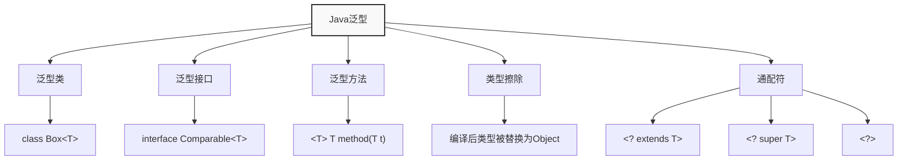
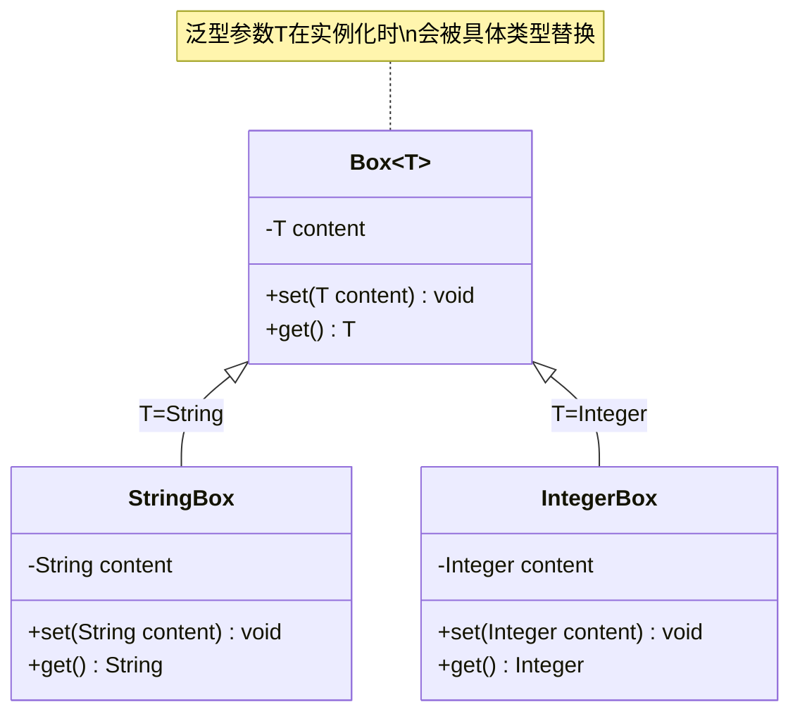
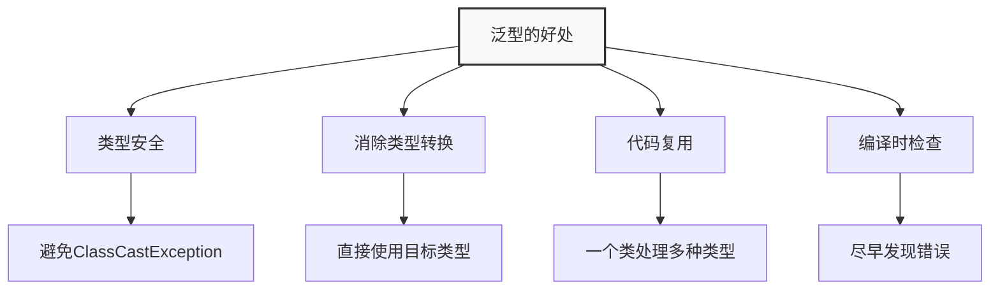
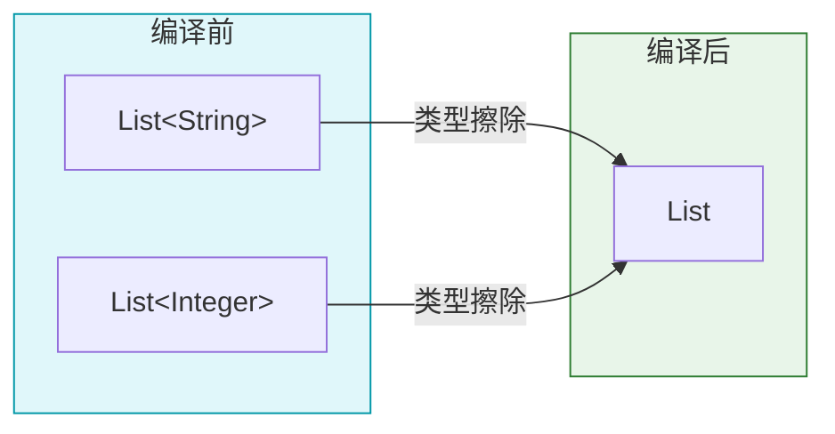
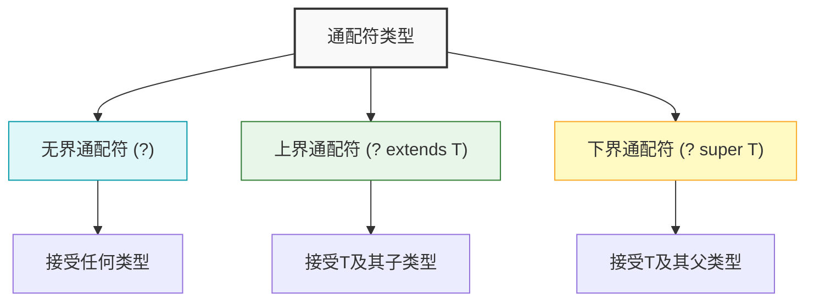
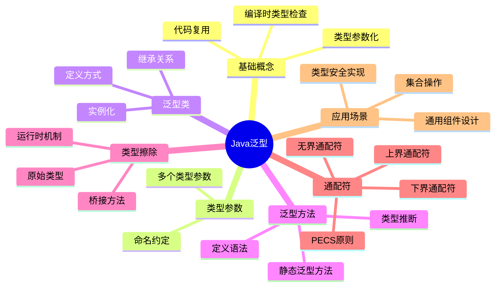

import Tabs from '@theme/Tabs';
import TabItem from '@theme/TabItem';
import TOCInline from '@theme/TOCInline';

# Java 泛型（Generics）详解

Java泛型是JDK 5.0引入的重要特性，它提供了编译时类型安全检查，允许在编译时检测到不正确的类型使用。泛型的主要目的是实现"类型参数化"，让代码更加灵活、安全，同时避免类型转换异常。

:::info 本文内容概览
<TOCInline toc={toc} />
:::



:::tip 核心价值
**泛型 = 类型安全 + 代码重用 + 性能优化 + 编译时检查**
- 🔒 **类型安全**：在编译时进行类型检查，减少运行时类型错误
- ♻️ **代码重用**：编写适用于多种类型的通用代码，提高代码复用性
- ⚡ **性能优化**：避免类型转换的开销，提升运行时性能
- 🧩 **API设计**：设计灵活且类型安全的API，增强代码健壮性
- 📝 **自文档化**：泛型参数提供了类型信息，增强代码可读性
:::

## 1. 泛型基础概念

### 1.1 什么是泛型？

泛型是一种参数化类型的概念，它允许在定义类、接口和方法时使用类型参数。这些类型参数在使用时会被具体的类型替换，从而提供类型安全。



<Tabs>
  <TabItem value="syntax" label="基本语法" default>
```java title="泛型类定义"
public class Box<T> {
    private T content;
    
    public void set(T content) {
        this.content = content;
    }
    
    public T get() {
        return content;
    }
}
```
  </TabItem>
  <TabItem value="usage" label="使用示例">
    ```java title="泛型类的使用" {3,8}
// 创建String类型的Box
Box<String> stringBox = new Box<>();
    stringBox.set("Hello World"); // 类型安全检查
String content = stringBox.get(); // 无需类型转换

// 创建Integer类型的Box
Box<Integer> intBox = new Box<>();
    intBox.set(42); // 类型安全检查
Integer number = intBox.get(); // 类型安全
    
    // 编译时类型检查保护
    // stringBox.set(42); // 编译错误！
    // intBox.set("42"); // 编译错误！
    ```
  </TabItem>
  <TabItem value="evolution" label="演进历史">

    ```java
    // Java 5.0 之前 - 无泛型
    Box oldBox = new Box();
    oldBox.set("Test String");
    String content = (String) oldBox.get(); // 需要强制类型转换
    
    // Java 5.0 - 引入泛型
    Box<String> newBox = new Box<String>();
    newBox.set("Test String");
    String newContent = newBox.get(); // 无需类型转换
    
    // Java 7.0 - 菱形操作符
    Box<String> diamondBox = new Box<>(); // 类型推断
    ```

:::tip 提示
Java 7引入的菱形操作符让泛型实例化更加简洁，编译器会自动推断类型参数。
:::
  </TabItem>
</Tabs>

### 1.2 泛型的好处



| 好处 | 说明 | 示例 |
|------|------|------|
| **类型安全** | 编译时检查类型匹配，避免运行时异常 | `List<String>` 只能存储String类型 |
| **消除类型转换** | 无需手动进行类型转换 | `String s = list.get(0);` 直接获取String |
| **代码复用** | 一个泛型类可以处理多种类型 | `Box<T>` 可以存储任何类型 |
| **编译时检查** | 在编译时发现类型错误 | 尝试存储错误类型时编译失败 |

<Tabs>
  <TabItem value="without" label="不使用泛型的问题" default>
    ```java title="不使用泛型的代码" {4,5}
// 没有泛型 - 可能出错
List list = new ArrayList();
list.add("Hello");
    list.add(42); // 可以添加任何类型，类型不安全
    String s = (String) list.get(1); // 运行时异常！ClassCastException
    ```
    
    :::caution 运行时错误
    上面的代码在编译时不会报错，但在运行时会抛出 `ClassCastException`，因为尝试将 `Integer` 转换为 `String`。
    这种错误只能在运行时被发现，增加了调试难度。
    :::
  </TabItem>
  <TabItem value="with" label="使用泛型的优势">
    ```java title="使用泛型的代码" {3,4}
// 使用泛型 - 类型安全
List<String> stringList = new ArrayList<>();
stringList.add("Hello");
    // stringList.add(42); // 编译错误！类型不匹配
String s = stringList.get(0); // 安全，无需转换
```
    
    :::tip 编译时检查
    使用泛型后，如果尝试向 `List<String>` 中添加非 String 类型的元素，编译器会直接报错。
    这种类型安全检查可以在编译阶段就发现错误，而不是等到运行时。
    :::
  </TabItem>
  <TabItem value="compare" label="对比分析">

| 特性 | 不使用泛型 | 使用泛型 |
|------|------------|----------|
| 类型检查 | 运行时检查 | 编译时检查 |
| 类型转换 | 需要显式转换 | 自动转换 |
| 错误发现 | 运行时抛出异常 | 编译时提示错误 |
| 代码清晰度 | 类型信息不明确 | 类型信息明确 |

  </TabItem>
</Tabs>

## 2. 泛型类型参数

### 2.1 类型参数命名约定

Java泛型使用类型参数来表示类型，这些参数通常使用单个大写字母命名，遵循以下约定：

| 类型参数 | 含义 | 示例 |
|----------|------|------|
| `E` | Element（元素） | `Collection<E>` |
| `T` | Type（类型） | `Box<T>` |
| `K` | Key（键） | `Map<K,V>` |
| `V` | Value（值） | `Map<K,V>` |
| `N` | Number（数字） | `Number<N>` |
| `S` | Source（源） | `Function<S,T>` |

### 2.2 多个类型参数

泛型类可以定义多个类型参数，用逗号分隔：

```java title="多个类型参数"
public class Pair<K, V> {
    private K key;
    private V value;
    
    public Pair(K key, V value) {
        this.key = key;
        this.value = value;
    }
    
    public K getKey() { return key; }
    public V getValue() { return value; }
    
    public void setKey(K key) { this.key = key; }
    public void setValue(V value) { this.value = value; }
}
```

#### 使用示例
```java title="Pair类的使用"
// 创建String-Integer对
Pair<String, Integer> pair1 = new Pair<>("Age", 25);
String key = pair1.getKey();      // String类型
Integer value = pair1.getValue();  // Integer类型

// 创建Integer-String对
Pair<Integer, String> pair2 = new Pair<>(1, "One");
Integer key2 = pair2.getKey();    // Integer类型
String value2 = pair2.getValue(); // String类型
```

:::caution 类型参数命名
虽然可以使用任何标识符作为类型参数，但建议遵循Java的命名约定，这样代码更易读、更专业。
:::

## 3. 泛型方法

### 3.1 泛型方法定义

泛型方法是在方法级别使用泛型，它可以在非泛型类中定义，也可以在泛型类中定义。

#### 基本语法
```java title="泛型方法定义"
public class Utils {
    // 泛型方法：在返回类型前声明类型参数
    public static <T> void printArray(T[] array) {
        for (T element : array) {
            System.out.print(element + " ");
        }
        System.out.println();
    }
    
    // 泛型方法：返回泛型类型
    public static <T> T getFirst(T[] array) {
        if (array.length > 0) {
            return array[0];
        }
        return null;
    }
}
```

#### 使用泛型方法
```java title="泛型方法调用"
// 调用泛型方法
String[] strings = {"Hello", "World"};
Integer[] numbers = {1, 2, 3, 4, 5};

Utils.printArray(strings);  // 输出: Hello World
Utils.printArray(numbers);  // 输出: 1 2 3 4 5

String firstString = Utils.getFirst(strings);  // String类型
Integer firstNumber = Utils.getFirst(numbers); // Integer类型
```

### 3.2 泛型方法与泛型类的区别

| 特性 | 泛型类 | 泛型方法 |
|------|--------|----------|
| **声明位置** | 类名后 | 方法返回类型前 |
| **作用范围** | 整个类 | 单个方法 |
| **类型参数** | 实例化时确定 | 调用时推断 |
| **使用方式** | `new Box<String>()` | `Utils.<String>method()` |

:::tip 类型推断
Java编译器通常能够自动推断泛型方法的类型参数，所以通常不需要显式指定：
```java
// 编译器自动推断T为String
Utils.printArray(new String[]{"Hello"});

// 显式指定类型参数（通常不需要）
Utils.<String>printArray(new String[]{"Hello"});
```
::: 

## 4. 类型擦除（Type Erasure）

Java泛型是通过类型擦除实现的，这意味着在运行时，泛型信息会被擦除，所有的泛型类型都被转换为它们的原始类型（raw type）。



### 4.1 类型擦除机制

类型擦除是Java泛型实现的核心机制，编译器会在编译时移除所有泛型类型信息，这种设计主要是为了向后兼容性。

<Tabs>
  <TabItem value="process" label="类型擦除过程" default>
    ```java title="类型擦除示例" {1-2,4-5}
// 编译时：泛型类型
List<String> stringList = new ArrayList<>();
List<Integer> intList = new ArrayList<>();

// 运行时：类型被擦除，都变成List
// 实际类型：List stringList = new ArrayList();
// 实际类型：List intList = new ArrayList();
```
  </TabItem>
  <TabItem value="bounded" label="有界类型擦除">
    ```java
    // 有界类型参数
    class Box<T extends Number> {
        private T value;
        // ...
    }
    
    // 擦除后等效为
    class Box {
        private Number value; // 使用上界作为实际类型
        // ...
    }
    ```
  </TabItem>
  <TabItem value="debug" label="调试提示">
    :::tip 如何验证类型擦除
    1. 使用反射API查看运行时类型
    2. 在调试器中查看对象的实际类型
    3. 利用`getClass()`方法比较不同泛型实例的类型
    
    类型擦除是造成泛型一些限制的根源，如不能创建泛型数组、不能进行确切的运行时类型检查等。
    :::
  </TabItem>
</Tabs>

#### 验证类型擦除
```java title="类型擦除验证"
public class TypeErasureDemo {
    public static void main(String[] args) {
        List<String> stringList = new ArrayList<>();
        List<Integer> intList = new ArrayList<>();
        
        // 检查运行时类型
        System.out.println(stringList.getClass()); // class java.util.ArrayList
        System.out.println(intList.getClass());    // class java.util.ArrayList
        
        // 类型擦除后，两个列表的类对象是相同的
        System.out.println(stringList.getClass() == intList.getClass()); // true
    }
}
```

### 4.2 类型擦除的影响

#### 4.2.1 无法创建泛型数组
```java title="泛型数组限制"
// 编译错误：不能创建泛型数组
// T[] array = new T[10]; // 错误！

// 解决方案1：使用Object数组，然后转换
public class GenericArray<T> {
    private Object[] array;
    
    public GenericArray(int size) {
        array = new Object[size];
    }
    
    @SuppressWarnings("unchecked")
    public T get(int index) {
        return (T) array[index];
    }
    
    public void set(int index, T element) {
        array[index] = element;
    }
}
```

#### 4.2.2 无法使用instanceof检查泛型类型
```java title="instanceof限制"
public class TypeCheckDemo {
    public static <T> void checkType(List<T> list) {
        // 编译错误：不能使用instanceof检查泛型类型
        // if (list instanceof List<String>) { } // 错误！
        
        // 正确的检查方式
        if (list instanceof List) {
            System.out.println("这是一个List");
        }
    }
}
```

:::caution 类型擦除的限制
由于类型擦除，Java泛型在运行时无法获取具体的类型信息，这限制了某些高级泛型操作的使用。
:::

## 5. 通配符（Wildcards）

泛型通配符提供了更灵活的类型参数使用方式，能够更好地支持多态性和子类型关系。



### 5.1 无界通配符（Unbounded Wildcard）

无界通配符使用 `?` 表示，表示可以接受任何类型。它常用于不依赖于类型参数的泛型代码中。

#### 基本用法
```java title="无界通配符"
public class WildcardDemo {
    // 接受任何类型的List
    public static void printList(List<?> list) {
        for (Object item : list) {
            System.out.print(item + " ");
        }
        System.out.println();
    }
    
    public static void main(String[] args) {
        List<String> stringList = Arrays.asList("Hello", "World");
        List<Integer> intList = Arrays.asList(1, 2, 3);
        
        printList(stringList); // 输出: Hello World
        printList(intList);    // 输出: 1 2 3
    }
}
```

#### 无界通配符的限制
```java title="无界通配符限制"
public class WildcardLimitations {
    public static void addElement(List<?> list) {
        // 编译错误：不能添加元素到无界通配符列表
        // list.add("Hello"); // 错误！
        
        // 只能添加null
        list.add(null); // 允许
        
        // 可以读取元素，但类型是Object
        Object item = list.get(0);
    }
}
```

### 5.2 上界通配符（Upper Bounded Wildcard）

上界通配符使用 `? extends T` 表示，表示类型必须是T或其子类型。

#### 基本用法
```java title="上界通配符"
public class UpperBoundedWildcard {
    // 接受Number及其子类型的List
    public static double sumOfList(List<? extends Number> list) {
    double sum = 0.0;
        for (Number number : list) {
            sum += number.doubleValue();
    }
    return sum;
    }
    
    public static void main(String[] args) {
        List<Integer> intList = Arrays.asList(1, 2, 3, 4, 5);
        List<Double> doubleList = Arrays.asList(1.1, 2.2, 3.3);
        
        System.out.println(sumOfList(intList));   // 输出: 15.0
        System.out.println(sumOfList(doubleList)); // 输出: 6.6
    }
}
```

#### 上界通配符的限制
```java title="上界通配符限制"
public class UpperBoundedLimitations {
    public static void addNumber(List<? extends Number> list) {
        // 编译错误：不能添加元素到上界通配符列表
        // list.add(42);        // 错误！
        // list.add(3.14);      // 错误！
        
        // 只能添加null
        list.add(null); // 允许
        
        // 可以读取元素，类型是Number
        Number first = list.get(0);
    }
}
```

### 5.3 下界通配符（Lower Bounded Wildcard）

下界通配符使用 `? super T` 表示，表示类型必须是T或其父类型。

#### 基本用法
```java title="下界通配符"
public class LowerBoundedWildcard {
    // 接受Integer及其父类型的List
    public static void addIntegers(List<? super Integer> list) {
        list.add(1);
        list.add(2);
        list.add(3);
    }
    
    public static void main(String[] args) {
        List<Number> numberList = new ArrayList<>();
        List<Object> objectList = new ArrayList<>();
        
        addIntegers(numberList); // 可以添加Integer到Number列表
        addIntegers(objectList); // 可以添加Integer到Object列表
        
        System.out.println(numberList); // [1, 2, 3]
        System.out.println(objectList); // [1, 2, 3]
    }
}
```

#### 下界通配符的特点
```java title="下界通配符特点"
public class LowerBoundedCharacteristics {
    public static void processList(List<? super Integer> list) {
        // 可以添加Integer及其子类型
        list.add(42);
        list.add(100);
        
        // 可以读取元素，但类型是Object
        Object item = list.get(0);
        
        // 不能读取为Integer（可能不安全）
        // Integer number = list.get(0); // 错误！
    }
}
```

<Tabs>
  <TabItem value="compare" label="通配符对比" default>
    | 通配符类型 | 语法 | 读取操作 | 写入操作 | 应用场景 |
    |-----------|-----|---------|---------|----------|
    | **无界通配符** | `List<?>` | 只能作为Object读取 | 只能添加null | 只读取不关心具体类型的场景 |
    | **上界通配符** | `List<? extends T>` | 可以作为T类型读取 | 只能添加null | 从列表中读取T类型元素的场景 |
    | **下界通配符** | `List<? super T>` | 只能作为Object读取 | 可以添加T及其子类型 | 向列表中添加T类型元素的场景 |
  </TabItem>
  <TabItem value="principle" label="PECS原则">
    :::info PECS原则（Producer Extends Consumer Super）
    - **Producer Extends**: 如果你需要从集合中读取类型T的数据，使用 `<? extends T>`
    - **Consumer Super**: 如果你需要向集合中写入类型T的数据，使用 `<? super T>`
    
    这个原则帮助我们选择正确的通配符，以确保类型安全性和灵活性。
    :::
    
    ```java
    // 从集合中读取（Producer） - 使用extends
    public static double sumOfList(List<? extends Number> list) {
        double sum = 0.0;
        for (Number n : list) { // 可以安全读取为Number
            sum += n.doubleValue();
        }
        return sum;
    }
    
    // 向集合中写入（Consumer） - 使用super
    public static void addNumbers(List<? super Integer> list) {
        list.add(1);    // 可以安全添加Integer
        list.add(2);
    }
    ```
  </TabItem>
  <TabItem value="visual" label="可视化说明">
    ```mermaid
    graph TD
        A[List&lt;?&gt;] --> A1["读: Object\n写: 只能null"]
        B[List&lt;? extends Number&gt;] --> B1["读: Number\n写: 只能null"]
        C[List&lt;? super Integer&gt;] --> C1["读: Object\n写: Integer及子类"]
        
        style A fill:#e0f7fa,stroke:#0097a7,stroke-width:1px
        style B fill:#e8f5e9,stroke:#2e7d32,stroke-width:1px
        style C fill:#fff9c4,stroke:#f9a825,stroke-width:1px
    ```
  </TabItem>
</Tabs>

## 6. 泛型约束与边界

### 6.1 类型边界（Type Bounds）

类型边界用于限制泛型类型参数的范围，确保类型参数满足特定条件。

#### 上界类型边界
```java title="上界类型边界"
public class NumberBox<T extends Number> {
    private T number;
    
    public NumberBox(T number) {
        this.number = number;
    }
    
    public T getNumber() {
        return number;
    }
    
    // 可以调用Number的方法
    public double getDoubleValue() {
        return number.doubleValue();
    }
    
    public int getIntValue() {
        return number.intValue();
    }
}
```

#### 使用上界类型边界
```java title="上界边界使用"
public class BoundedTypeDemo {
    public static void main(String[] args) {
        // 可以使用Number及其子类型
        NumberBox<Integer> intBox = new NumberBox<>(42);
        NumberBox<Double> doubleBox = new NumberBox<>(3.14);
        
        System.out.println(intBox.getDoubleValue());    // 42.0
        System.out.println(doubleBox.getDoubleValue()); // 3.14
        
        // 编译错误：String不是Number的子类型
        // NumberBox<String> stringBox = new NumberBox<>("Hello"); // 错误！
    }
}
```

#### 多重边界
```java title="多重边界"
public class MultipleBounds<T extends Number & Comparable<T>> {
    private T value;
    
    public MultipleBounds(T value) {
        this.value = value;
    }
    
    public T getValue() {
        return value;
    }
    
    // 可以使用Number和Comparable的方法
    public double getDoubleValue() {
        return value.doubleValue();
    }
    
    public int compareTo(T other) {
        return value.compareTo(other);
    }
}
```

### 6.2 递归类型边界

递归类型边界用于表示类型参数必须与自身相关。

```java title="递归类型边界"
public class RecursiveTypeBound {
    // T必须实现Comparable<T>，即可以与自身比较
    public static <T extends Comparable<T>> T max(T a, T b) {
        if (a.compareTo(b) > 0) {
            return a;
        } else {
            return b;
        }
    }
    
    public static void main(String[] args) {
        // Integer实现了Comparable<Integer>
        Integer maxInt = max(10, 20);
        System.out.println(maxInt); // 20
        
        // String实现了Comparable<String>
        String maxString = max("Hello", "World");
        System.out.println(maxString); // World
    }
}
``` 

## 7. 泛型接口与实现

### 7.1 泛型接口

泛型接口允许接口使用类型参数，实现类可以选择具体的类型或保持泛型。

#### 基本泛型接口
```java title="泛型接口定义"
public interface Container<T> {
    void add(T element);
    T get(int index);
    int size();
    boolean isEmpty();
}
```

#### 实现泛型接口
```java title="泛型接口实现"
// 实现为具体类型
public class StringContainer implements Container<String> {
    private List<String> elements = new ArrayList<>();
    
    @Override
    public void add(String element) {
        elements.add(element);
    }
    
    @Override
    public String get(int index) {
        return elements.get(index);
    }
    
    @Override
    public int size() {
        return elements.size();
    }
    
    @Override
    public boolean isEmpty() {
        return elements.isEmpty();
    }
}

// 保持泛型的实现
public class GenericContainer<T> implements Container<T> {
    private List<T> elements = new ArrayList<>();
    
    @Override
    public void add(T element) {
        elements.add(element);
    }
    
    @Override
    public T get(int index) {
        return elements.get(index);
    }
    
    @Override
    public int size() {
        return elements.size();
    }
    
    @Override
    public boolean isEmpty() {
        return elements.isEmpty();
    }
}
```

### 7.2 泛型继承

泛型类可以继承其他泛型类，形成复杂的泛型层次结构。

```java title="泛型继承"
// 基础泛型类
public class Box<T> {
    protected T content;
    
    public Box(T content) {
        this.content = content;
    }
    
    public T getContent() {
        return content;
    }
    
    public void setContent(T content) {
        this.content = content;
    }
}

// 继承泛型类，保持泛型
public class NumberBox<T extends Number> extends Box<T> {
    public NumberBox(T content) {
        super(content);
    }
    
    public double getDoubleValue() {
        return content.doubleValue();
    }
}

// 继承泛型类，固定类型
public class StringBox extends Box<String> {
    public StringBox(String content) {
        super(content);
    }
    
    public int getLength() {
        return content.length();
    }
}
```

## 8. 泛型最佳实践

### 8.1 命名约定

遵循Java泛型的命名约定，使代码更易读：

```java title="命名约定"
// 推荐的命名
public class Cache<K, V> { }
public class Repository<T> { }
public class Service<E> { }

// 避免的命名
public class Cache<Key, Value> { }  // 太长
public class Repository<Type> { }    // 不够通用
public class Service<Element> { }    // 太长
```

### 8.2 类型边界使用

合理使用类型边界，避免过度约束：

```java title="类型边界最佳实践"
// 好的做法：适当的约束
public class NumberProcessor<T extends Number> {
    public double process(T number) {
        return number.doubleValue();
    }
}

// 避免：过度约束
public class NumberProcessor<T extends Number & Comparable<T> & Serializable> {
    // 这限制了太多类型
}

// 好的做法：使用通配符
public static double sum(List<? extends Number> numbers) {
    double sum = 0.0;
    for (Number num : numbers) {
        sum += num.doubleValue();
    }
    return sum;
}
```

### 8.3 避免原始类型

始终使用泛型，避免使用原始类型：

```java title="避免原始类型"
// 错误：使用原始类型
List list = new ArrayList();
list.add("Hello");
list.add(42); // 可以添加任何类型

// 正确：使用泛型
List<String> stringList = new ArrayList<>();
stringList.add("Hello");
// stringList.add(42); // 编译错误，类型安全
```

### 8.4 泛型方法设计

设计泛型方法时，考虑类型推断和易用性：

```java title="泛型方法设计"
public class CollectionUtils {
    // 好的设计：类型推断友好
    public static <T> List<T> filter(List<T> list, Predicate<T> predicate) {
        List<T> result = new ArrayList<>();
        for (T item : list) {
            if (predicate.test(item)) {
                result.add(item);
            }
        }
        return result;
    }
    
    // 使用示例
    public static void main(String[] args) {
        List<String> names = Arrays.asList("Alice", "Bob", "Charlie");
        
        // 类型推断自动工作
        List<String> filtered = filter(names, name -> name.startsWith("A"));
        System.out.println(filtered); // [Alice]
    }
}
```

## 9. 常见问题与解决方案

### 9.1 泛型数组问题

```java title="泛型数组解决方案"
public class GenericArraySolutions {
    // 方案1：使用Object数组
    public static <T> T[] createArray1(int size) {
        @SuppressWarnings("unchecked")
        T[] array = (T[]) new Object[size];
        return array;
    }
    
    // 方案2：使用反射
    public static <T> T[] createArray2(Class<T> clazz, int size) {
        @SuppressWarnings("unchecked")
        T[] array = (T[]) Array.newInstance(clazz, size);
        return array;
    }
    
    // 方案3：使用泛型集合
    public static <T> List<T> createList(int size) {
        return new ArrayList<>(size);
    }
}
```

### 9.2 类型擦除的变通方案

```java title="类型擦除变通方案"
public class TypeErasureWorkarounds {
    // 使用Class对象保存类型信息
    public static class TypeAwareBox<T> {
        private T content;
        private Class<T> type;
        
        public TypeAwareBox(T content, Class<T> type) {
            this.content = content;
            this.type = type;
        }
        
        public T getContent() {
            return content;
        }
        
        public Class<T> getType() {
            return type;
        }
        
        public boolean isInstance(Object obj) {
            return type.isInstance(obj);
        }
    }
}
```

## 10. 面试题精选

### 10.1 基础概念题

**Q: 什么是Java泛型？它解决了什么问题？**

A: Java泛型是JDK 5.0引入的特性，它提供了编译时类型安全检查。主要解决了以下问题：
- 类型安全：编译时检查类型匹配，避免运行时异常
- 消除类型转换：无需手动进行类型转换
- 代码复用：一个泛型类可以处理多种类型
- 编译时检查：在编译时发现类型错误

**Q: 什么是类型擦除？它有什么影响？**

A: 类型擦除是Java泛型的实现机制，在运行时泛型信息会被擦除，所有泛型类型都转换为原始类型。主要影响包括：
- 无法创建泛型数组：`T[] array = new T[10]` 编译错误
- 无法使用instanceof检查泛型类型：`list instanceof List<String>` 编译错误
- 运行时无法获取具体的泛型类型信息

### 10.2 通配符题

**Q: 解释 `? extends T` 和 `? super T` 的区别？**

A: 
- `? extends T`（上界通配符）：表示类型必须是T或其子类型，可以读取元素（类型为T），但不能添加元素
- `? super T`（下界通配符）：表示类型必须是T或其父类型，可以添加元素（类型为T），但读取时类型为Object

**Q: 什么时候使用无界通配符 `?`？**

A: 当方法只关心集合的结构（如大小、是否为空），而不关心元素类型时使用。例如：
```java
public static boolean isEmpty(Collection<?> collection) {
    return collection == null || collection.isEmpty();
}
```

### 10.3 实践题

**Q: 设计一个泛型缓存类，支持键值对存储**

A: 
```java
public class GenericCache<K, V> {
    private Map<K, V> cache = new HashMap<>();
    
    public void put(K key, V value) {
        cache.put(key, value);
    }
    
    public V get(K key) {
        return cache.get(key);
    }
    
    public boolean containsKey(K key) {
        return cache.containsKey(key);
    }
    
    public void remove(K key) {
        cache.remove(key);
    }
    
    public int size() {
        return cache.size();
    }
    
    public void clear() {
        cache.clear();
    }
}
```

**Q: 实现一个泛型方法，找出数组中的最大值**

A: 
```java
public static <T extends Comparable<T>> T findMax(T[] array) {
    if (array == null || array.length == 0) {
        throw new IllegalArgumentException("Array cannot be null or empty");
    }
    
    T max = array[0];
    for (int i = 1; i < array.length; i++) {
        if (array[i].compareTo(max) > 0) {
            max = array[i];
        }
    }
    return max;
}
```

:::tip 泛型学习要点
1. **理解类型擦除**：这是Java泛型的核心机制
2. **掌握通配符**：合理使用三种通配符类型
3. **遵循最佳实践**：避免原始类型，合理使用类型边界
4. **实践应用**：在实际项目中应用泛型提高代码质量
:::

## 11. 总结



:::tip 泛型学习路径
学习Java泛型的建议路径：

1. 掌握基础语法和概念
2. 理解类型擦除机制
3. 学习通配符用法
4. 掌握PECS原则
5. 实践泛型类和方法的设计

通过合理使用泛型，可以编写更加通用、安全和可维护的代码。虽然类型擦除带来了一些限制，但总体而言，泛型给Java带来的好处远超过其缺点。对泛型的深入理解，是成为高级Java开发者的必备技能。
:::

<Tabs>
  <TabItem value="benefits" label="优势" default>
    ✅ **类型安全**: 在编译时捕获类型错误，避免运行时异常  
    ✅ **代码复用**: 一套代码可以处理多种不同类型  
    ✅ **消除类型转换**: 减少冗余的类型转换代码  
    ✅ **API设计**: 使API更加清晰、类型安全  
    ✅ **性能**: 编译后的代码和手动类型转换的代码性能相当
  </TabItem>
  <TabItem value="limitations" label="局限性">
    ⚠️ **类型擦除**: 运行时类型信息丢失  
    ⚠️ **泛型数组**: 无法直接创建泛型数组  
    ⚠️ **类型检查**: 无法使用instanceof检查泛型类型  
    ⚠️ **静态上下文**: 无法在静态字段或方法中直接使用类类型参数  
    ⚠️ **原始类型**: 为了向后兼容性保留了原始类型，可能导致混淆
  </TabItem>
  <TabItem value="best-practices" label="最佳实践">
    📌 **使用通配符**: 合理使用 `?`, `? extends T` 和 `? super T`  
    📌 **遵循PECS原则**: Producer Extends, Consumer Super  
    📌 **避免原始类型**: 总是使用泛型类型参数  
    📌 **优先考虑泛型方法**: 使方法更加通用和类型安全  
    📌 **关注类型推断**: 让编译器做更多工作，减少冗余代码
  </TabItem>
</Tabs>

---

通过本章的学习，你应该已经掌握了Java泛型的核心概念、语法规则和最佳实践。泛型是Java中非常重要的特性，它不仅能提高代码的类型安全性，还能增强代码的可读性和可维护性。在实际开发中，合理使用泛型可以避免很多运行时错误，让代码更加健壮。

## 12. 面试题精选

### 12.1 什么是Java泛型？泛型有什么优点？

**答案：** Java泛型是JDK 5引入的特性，允许在定义类、接口和方法时使用类型参数，这些参数在使用时会被具体类型替换。

泛型的主要优点：
- **类型安全**：在编译时检查类型错误，避免运行时ClassCastException
- **消除类型转换**：不需要显式转换对象类型，代码更加简洁
- **实现通用算法**：可以编写适用于多种类型的通用代码
- **代码复用**：减少因类型不同而导致的重复代码
- **更好的API设计**：提供了类型约束，使API更加直观

### 12.2 什么是类型擦除？为什么Java泛型使用类型擦除？

**答案：** 类型擦除是Java泛型的基本实现机制，它指的是编译器在编译时会擦除所有泛型类型相关的信息，替换为原始类型（通常是Object或上界类型）。

Java泛型使用类型擦除的原因：
1. **向后兼容性**：保证泛型代码可以与Java 5之前的代码无缝协作
2. **避免运行时开销**：不需要在运行时维护额外的类型信息
3. **JVM限制**：不需要修改Java虚拟机，简化了实现

类型擦除的主要后果：
- 泛型信息在运行时不可用
- 无法使用instanceof检查泛型类型
- 无法创建泛型类型的数组
- 静态上下文中不能引用类型参数

### 12.3 解释泛型中的通配符，以及PECS原则

**答案：** 通配符是Java泛型中的特殊符号，用于表示未知类型，有三种形式：

1. **无界通配符(?)**: `List<?>`表示可以是任何类型的列表
2. **上界通配符(? extends T)**: `List<? extends Number>`表示Number或其子类的列表
3. **下界通配符(? super T)**: `List<? super Integer>`表示Integer或其父类的列表

**PECS原则（Producer-Extends, Consumer-Super）**:
- 当你的泛型类是生产者（提供数据）时，使用`? extends T`
- 当你的泛型类是消费者（接收数据）时，使用`? super T`

例如：
```java
// 从列表读取数据（生产者），使用extends
public void readFrom(List<? extends Number> list) {
    Number n = list.get(0); // 安全，知道是Number或子类
}

// 向列表写入数据（消费者），使用super
public void writeTo(List<? super Integer> list) {
    list.add(42); // 安全，知道list可以接收Integer
}
```

### 12.4 泛型类型参数的命名约定是什么？常见的类型参数名称代表什么？

**答案：** Java泛型类型参数通常使用单个大写字母表示。最常见的类型参数命名约定：

- **E**: Element（元素），通常用于集合类
- **T**: Type（类型），最常用的泛型类型参数
- **K**: Key（键），常用于Map的键类型
- **V**: Value（值），常用于Map的值类型
- **N**: Number（数字），表示数值类型
- **S, U, V**: 第2、3、4个类型参数，当需要多个泛型类型时使用

例如：
```java
// T代表任意类型
public class Box<T> { }

// K代表键类型，V代表值类型
public interface Map<K, V> { }

// E代表元素类型
public interface List<E> { }
```

### 12.5 如何解决泛型数组创建的问题？

**答案：** 由于类型擦除，在Java中无法直接创建泛型数组（如`new T[10]`）。解决这个问题有以下几种方法：

1. **使用Object数组加类型转换**:
```java
public class GenericArray<T> {
    private T[] array;
    
    @SuppressWarnings("unchecked")
    public GenericArray(int size) {
        // 创建Object数组，然后强制类型转换
        array = (T[]) new Object[size];
    }
}
```

2. **使用反射创建数组**:
```java
public class GenericArray<T> {
    private T[] array;
    
    @SuppressWarnings("unchecked")
    public GenericArray(Class<T> type, int size) {
        // 使用反射API创建特定类型的数组
        array = (T[]) Array.newInstance(type, size);
    }
}
```

3. **使用ArrayList代替数组**:
```java
public class GenericCollection<T> {
    private List<T> list;
    
    public GenericCollection(int size) {
        list = new ArrayList<>(size);
    }
}
```

每种方法都有其优缺点，选择取决于具体需求和使用场景。 