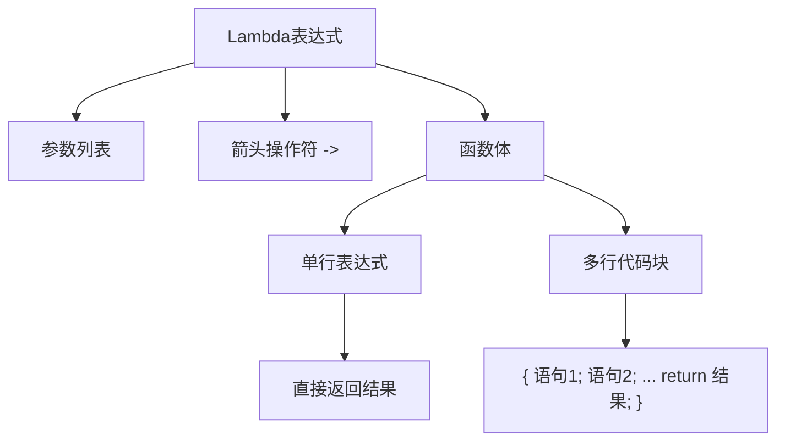
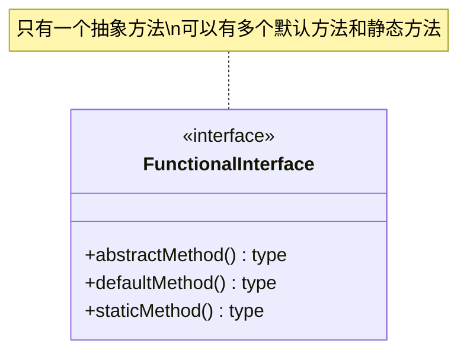
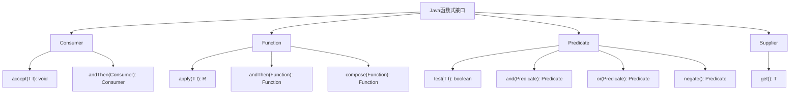
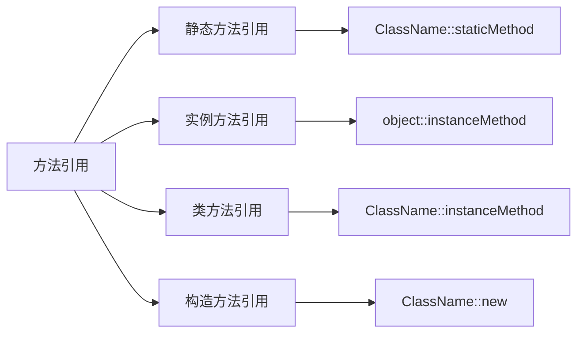
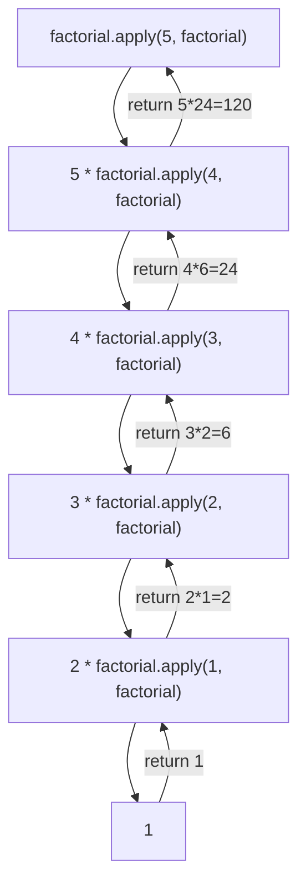
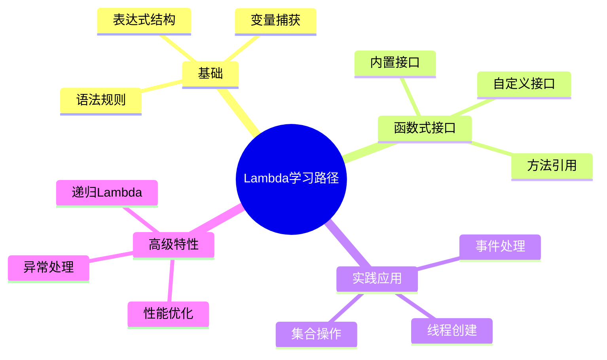

import Tabs from '@theme/Tabs';
import TabItem from '@theme/TabItem';
import TOCInline from '@theme/TOCInline';

# Java Lambda 表达式详解

Lambda表达式是Java 8引入的重要特性，它提供了一种简洁的方式来编写匿名函数，使代码更加简洁、可读，并支持函数式编程范式。Lambda表达式是Java向函数式编程迈进的重要一步。

:::info 本文内容概览
<TOCInline toc={toc} />
:::

:::tip 核心价值
Lambda表达式 = 简洁语法 + 函数式编程 + 代码可读性 + 集合操作优化
:::

## 1. Lambda表达式基础

### 1.1 什么是Lambda表达式？

Lambda表达式是一种匿名函数，它没有名称，但有参数列表、函数体和返回类型。Lambda表达式可以理解为一种"可传递的代码块"，可以在需要函数式接口的地方使用。



#### Lambda表达式的基本语法
```java title="Lambda表达式基本语法"
public class LambdaBasicSyntax {
    public static void main(String[] args) {
        // 基本语法：(parameters) -> expression
        // 1. 无参数
        Runnable noParam = () -> System.out.println("Hello World");
        noParam.run();
        
        // 2. 单个参数
        Function<String, Integer> singleParam = str -> str.length();
        System.out.println("字符串长度: " + singleParam.apply("Java"));
        
        // 3. 多个参数
        BinaryOperator<Integer> multipleParams = (a, b) -> a + b;
        System.out.println("求和: " + multipleParams.apply(5, 3));
        
        // 4. 类型声明
        BinaryOperator<Integer> typedParams = (Integer a, Integer b) -> a * b;
        System.out.println("乘积: " + typedParams.apply(4, 6));
        
        // 5. 多行语句
        Function<String, String> multiLine = str -> {
            String upper = str.toUpperCase();
            String reversed = new StringBuilder(upper).reverse().toString();
            return reversed;
        };
        System.out.println("处理结果: " + multiLine.apply("hello"));
    }
}
```

### 1.2 Lambda表达式的语法规则

| 语法规则 | 说明 | 示例 |
|---------|------|------|
| **参数列表** | 可以为空、单个或多个参数 | `()` `x` `(x, y)` |
| **参数类型** | 可以省略（类型推断）或显式声明 | `x -> x*2` 或 `(int x) -> x*2` |
| **箭头操作符** | 使用 `->` 分隔参数和函数体 | `x -> x*2` |
| **函数体** | 单行表达式或代码块 | `x -> x*2` 或 `x -> { return x*2; }` |
| **返回语句** | 单行表达式自动返回，代码块需要显式return | `x -> x*2` 或 `x -> { return x*2; }` |

<Tabs>
  <TabItem value="basic" label="基础语法" default>
  ```java
  // 无参数，无返回值
  Runnable task = () -> System.out.println("Task executed");

  // 单个参数，有返回值
  Function<String, Integer> length = str -> str.length();
  ```
  </TabItem>
  <TabItem value="multi" label="多参数">
  ```java
  // 多个参数，有返回值
  BinaryOperator<Integer> add = (a, b) -> a + b;
  
  // 带类型声明的多参数
  BiFunction<Integer, String, Boolean> check = (Integer num, String str) -> 
      str.length() > num;
  ```
  </TabItem>
  <TabItem value="block" label="代码块">
  ```java
  // 多行代码块
  Function<String, String> process = str -> {
      String trimmed = str.trim();
      String upper = trimmed.toUpperCase();
      return upper;
  };
  ```
  </TabItem>
</Tabs>

## 2. Lambda表达式与匿名内部类

### 2.1 对比分析

Lambda表达式可以替代匿名内部类，但两者有显著区别：

| 特性 | 匿名内部类 | Lambda表达式 |
|------|------------|-------------|
| **语法** | 冗长，需要完整的类定义 | 简洁，只需要参数和表达式 |
| **可读性** | 较低，代码结构复杂 | 较高，逻辑清晰 |
| **性能** | 创建新类文件 | 不创建新类文件 |
| **限制** | 可以实现接口或继承类 | 只能用于函数式接口 |
| **变量捕获** | 捕获外部变量需要final | 自动捕获effectively final变量 |

### 2.2 转换示例

<Tabs>
  <TabItem value="anonymous" label="匿名内部类" default>
  ```java
  // 匿名内部类方式
  Runnable oldWay = new Runnable() {
      @Override
      public void run() {
          System.out.println("Hello from anonymous class");
      }
  };
  
  oldWay.run();
  ```
  </TabItem>
  <TabItem value="lambda" label="Lambda表达式">
  ```java
  // Lambda表达式方式
  Runnable newWay = () -> System.out.println("Hello from lambda");
  
  newWay.run();
  ```
  </TabItem>
</Tabs>

### 2.3 Lambda表达式的优势

<div className="card">
<div className="card__body">
<ul>
<li><strong>语法简洁</strong>：减少了样板代码</li>
<li><strong>可读性强</strong>：逻辑更加清晰</li>
<li><strong>性能更好</strong>：不创建额外的类文件</li>
<li><strong>函数式编程</strong>：支持函数式编程范式</li>
<li><strong>集合操作</strong>：与Stream API完美配合</li>
</ul>
</div>
</div>

## 3. 函数式接口

### 3.1 什么是函数式接口？

函数式接口是只包含一个抽象方法的接口。Lambda表达式只能用于函数式接口，因为Lambda表达式本身就是这个抽象方法的实现。



```java title="函数式接口定义"
@FunctionalInterface
public interface MyFunctionalInterface {
    void process(String input);
    
    // 可以有默认方法
    default void defaultMethod() {
        System.out.println("Default implementation");
    }
    
    // 可以有静态方法
    static void staticMethod() {
        System.out.println("Static method");
    }
    
    // 可以有Object类的方法
    boolean equals(Object obj);
}
```

### 3.2 常用函数式接口

Java 8在`java.util.function`包中提供了常用的函数式接口：

<Tabs>
  <TabItem value="consumer" label="Consumer<T>" default>
  ```java title="Consumer接口示例"
  Consumer<String> printer = str -> System.out.println("Received: " + str);
  printer.accept("Hello World");

  // 组合多个Consumer
  Consumer<String> c1 = str -> System.out.print("C1: " + str);
  Consumer<String> c2 = str -> System.out.println(" C2: " + str);
  Consumer<String> combined = c1.andThen(c2);
  combined.accept("Test"); // 输出: C1: Test C2: Test
  ```
  </TabItem>
  <TabItem value="function" label="Function<T,R>">
  ```java title="Function接口示例"
  Function<String, Integer> length = String::length;
  Function<Integer, String> toString = Object::toString;

  // 函数组合
  Function<String, String> combined = length.andThen(toString);
  String result = combined.apply("Hello"); // "5"

  // 函数链式调用
  Function<String, String> pipeline = String::trim
      .andThen(String::toLowerCase)
      .andThen(str -> str.replace(" ", "_"));
  String processed = pipeline.apply("  Hello World  "); // "hello_world"
  ```
  </TabItem>
  <TabItem value="predicate" label="Predicate<T>">
  ```java title="Predicate接口示例"
  Predicate<String> isEmpty = String::isEmpty;
  Predicate<String> isLong = str -> str.length() > 10;

  // 逻辑组合
  Predicate<String> isNotEmptyAndLong = isEmpty.negate().and(isLong);
  boolean result = isNotEmptyAndLong.test("Hello World"); // true

  // 复杂条件
  Predicate<String> complex = str -> str != null 
      && str.length() > 5 
      && str.contains("a");
  ```
  </TabItem>
  <TabItem value="supplier" label="Supplier<T>">
  ```java title="Supplier接口示例"
  Supplier<String> randomString = () -> UUID.randomUUID().toString();
  Supplier<LocalDateTime> now = LocalDateTime::now;
  Supplier<List<String>> emptyList = ArrayList::new;

  // 延迟初始化
  Supplier<ExpensiveObject> lazyInit = () -> {
      System.out.println("Creating expensive object...");
      return new ExpensiveObject();
  };

  // 只有在调用get()时才会创建对象
  ExpensiveObject obj = lazyInit.get();
  ```
  </TabItem>
</Tabs>

<details>
<summary>常用函数式接口概览图</summary>



</details>

### 3.3 自定义函数式接口

```java title="自定义函数式接口"
@FunctionalInterface
public interface StringProcessor {
    String process(String input);
    
    // 默认方法
    default StringProcessor andThen(StringProcessor after) {
        return input -> after.process(this.process(input));
    }
    
    // 静态工厂方法
    static StringProcessor toUpperCase() {
        return String::toUpperCase;
    }
    
    static StringProcessor reverse() {
        return str -> new StringBuilder(str).reverse().toString();
    }
}

// 使用示例
StringProcessor processor = StringProcessor.toUpperCase()
    .andThen(StringProcessor.reverse());
String result = processor.process("hello"); // "OLLEH"
```

## 4. 方法引用

### 4.1 什么是方法引用？

方法引用是Lambda表达式的一种简化写法，它提供了一种更简洁的方式来引用已有的方法。方法引用使用`::`操作符。

| 类型 | 语法 | 示例 |
|------|------|------|
| **静态方法引用** | `ClassName::staticMethod` | `Math::abs` |
| **实例方法引用** | `object::instanceMethod` | `str::length` |
| **类方法引用** | `ClassName::instanceMethod` | `String::length` |
| **构造方法引用** | `ClassName::new` | `ArrayList::new` |



### 4.2 方法引用示例

<Tabs>
  <TabItem value="static" label="静态方法引用" default>
  ```java
  // Lambda表达式
  Function<Double, Double> sqrt1 = x -> Math.sqrt(x);

  // 方法引用
  Function<Double, Double> sqrt2 = Math::sqrt;

  // 使用
  double result = sqrt2.apply(16.0); // 4.0

  // 多个参数
  BiFunction<Double, Double, Double> power = Math::pow;
  double powerResult = power.apply(2.0, 3.0); // 8.0
  ```
  </TabItem>
  <TabItem value="instance" label="实例方法引用">
  ```java
  // Lambda表达式
  Consumer<String> printer1 = str -> System.out.println(str);

  // 方法引用
  Consumer<String> printer2 = System.out::println;

  // 使用
  printer2.accept("Hello World");

  // 带参数的实例方法
  String prefix = "Prefix: ";
  Function<String, String> addPrefix = str -> prefix + str;
  Function<String, String> addPrefixRef = prefix::concat;
  ```
  </TabItem>
  <TabItem value="class" label="类方法引用">
  ```java
  // Lambda表达式
  Function<String, Integer> length1 = str -> str.length();

  // 方法引用
  Function<String, Integer> length2 = String::length;

  // 使用
  int len = length2.apply("Hello"); // 5

  // 比较方法
  Comparator<String> comparator = String::compareToIgnoreCase;
  List<String> names = Arrays.asList("Alice", "bob", "Charlie");
  names.sort(comparator);
  ```
  </TabItem>
  <TabItem value="constructor" label="构造方法引用">
  ```java
  // Lambda表达式
  Supplier<ArrayList<String>> listSupplier1 = () -> new ArrayList<>();

  // 构造方法引用
  Supplier<ArrayList<String>> listSupplier2 = ArrayList::new;

  // 使用
  ArrayList<String> list = listSupplier2.get();

  // 带参数的构造方法
  Function<String, StringBuilder> sbSupplier = StringBuilder::new;
  StringBuilder sb = sbSupplier.apply("Initial");
  ```
  </TabItem>
</Tabs>

## 5. Lambda表达式的实际应用

### 5.1 集合操作

Lambda表达式与Stream API结合使用，可以大大简化集合操作：

```java title="集合操作示例"
List<String> names = Arrays.asList("Alice", "Bob", "Charlie", "David");

// 过滤和转换
List<String> filteredNames = names.stream()
    .filter(name -> name.length() > 4)
    .map(String::toUpperCase)
    .collect(Collectors.toList());

System.out.println("Names: " + filteredNames); // [ALICE, CHARLIE, DAVID]

// 排序
names.sort((a, b) -> a.compareToIgnoreCase(b));
System.out.println("Sorted: " + names);

// 分组
Map<Integer, List<String>> lengthGroups = names.stream()
    .collect(Collectors.groupingBy(String::length));
System.out.println("Groups: " + lengthGroups);
```

<details>
<summary>集合操作流程图</summary>

```mermaid
flowchart TD
    A[原始集合] -->|stream()| B[流]
    B -->|filter()| C[过滤]
    C -->|map()| D[转换]
    D -->|collect()| E[结果集合]
    
    A1[原始集合] -->|sort()| B1[排序]
    
    A2[原始集合] -->|stream()| B2[流]
    B2 -->|collect(groupingBy())| C2[分组结果]
```

</details>

### 5.2 事件处理

Lambda表达式简化了事件处理代码：

<div className="code-with-callout">

```java title="事件处理示例"
// 按钮点击事件
button.addActionListener(e -> {
    String text = textField.getText();
    if (!text.isEmpty()) {
        processText(text);
    }
});

// 定时器事件
Timer timer = new Timer(1000, e -> {
    updateTime();
    repaint();
});
timer.start();
```

:::info 优势
使用Lambda表达式处理事件，不再需要创建匿名内部类，代码更加简洁明了。
:::
</div>

### 5.3 线程创建

Lambda表达式简化了线程创建：

<Tabs>
  <TabItem value="traditional" label="传统方式" default>
  ```java
  Thread oldThread = new Thread(new Runnable() {
      @Override
      public void run() {
          System.out.println("Old way");
      }
  });
  
  oldThread.start();
  ```
  </TabItem>
  <TabItem value="lambda" label="Lambda方式">
  ```java
  Thread newThread = new Thread(() -> System.out.println("New way"));
  
  newThread.start();
  ```
  </TabItem>
</Tabs>

## 6. 高级特性

### 6.1 变量捕获

Lambda表达式可以捕获外部变量，但变量必须是effectively final的：

```java title="变量捕获示例"
String prefix = "Hello, ";
int count = 0;

// 正确：effectively final变量
Consumer<String> greeter = name -> {
    System.out.println(prefix + name);
    // count++; // 错误：不能修改外部变量
};

greeter.accept("World");

// 数组或对象引用可以修改内容
int[] counter = {0};
Consumer<String> counter1 = name -> {
    counter[0]++; // 正确：修改数组内容
    System.out.println(prefix + name + " (count: " + counter[0] + ")");
};
```

:::caution 变量捕获限制
Lambda表达式中引用的外部局部变量必须是final或effectively final的（即虽未声明为final，但值从未被修改）。这是为了确保线程安全和避免并发问题。
:::

### 6.2 异常处理

Lambda表达式中的异常处理需要特别注意：

<Tabs>
  <TabItem value="internal" label="内部处理" default>
  ```java
  // 方式1：在Lambda内部处理异常
  Function<String, Integer> safeLength = str -> {
      try {
          return str.length();
      } catch (Exception e) {
          return 0;
      }
  };
  ```
  </TabItem>
  <TabItem value="wrapper" label="包装器">
  ```java
  // 方式2：使用包装器
  @FunctionalInterface
  interface ThrowingFunction<T, R> {
      R apply(T t) throws Exception;
  }

  static <T, R> Function<T, R> unchecked(ThrowingFunction<T, R> f) {
      return t -> {
          try {
              return f.apply(t);
          } catch (Exception e) {
              throw new RuntimeException(e);
          }
      };
  }

  // 使用
  Function<String, Integer> length = unchecked(String::length);
  ```
  </TabItem>
</Tabs>

### 6.3 递归Lambda

Lambda表达式可以实现递归，但需要使用技巧：

```java title="递归Lambda示例"
// 使用函数式接口实现递归
@FunctionalInterface
interface IntFunction {
    int apply(int n, IntFunction self);
}

// 阶乘计算
IntFunction factorial = (n, self) -> n <= 1 ? 1 : n * self.apply(n - 1, self);
int result = factorial.apply(5, factorial); // 120

// 斐波那契数列
IntFunction fibonacci = (n, self) -> n <= 1 ? n : self.apply(n - 1, self) + self.apply(n - 2, self);
int fib = fibonacci.apply(10, fibonacci); // 55
```

<details>
<summary>递归Lambda执行过程</summary>



</details>

## 7. 性能考虑

### 7.1 Lambda表达式的性能特点

<div className="card">
<div className="card__header">
<h4>Lambda表达式性能特点</h4>
</div>
<div className="card__body">
<ol>
<li><strong>首次调用</strong>：可能较慢（JVM优化）</li>
<li><strong>后续调用</strong>：性能接近直接调用</li>
<li><strong>内存占用</strong>：不创建额外的类文件</li>
<li><strong>JIT优化</strong>：JVM会优化热点代码</li>
</ol>
</div>
</div>

### 7.2 性能优化建议

<Tabs>
  <TabItem value="predefine" label="预定义Lambda" default>
  ```java
  // 1. 避免在循环中创建Lambda
  List<String> names = Arrays.asList("Alice", "Bob", "Charlie");
  
  // 好的做法：预定义Lambda
  Function<String, String> toUpper = String::toUpperCase;
  List<String> upperNames = names.stream()
      .map(toUpper)
      .collect(Collectors.toList());
  ```
  </TabItem>
  <TabItem value="primitive" label="使用基本类型流">
  ```java
  // 2. 使用基本类型流避免装箱
  List<Integer> numbers = Arrays.asList(1, 2, 3, 4, 5);
  int sum = numbers.stream()
      .mapToInt(Integer::intValue) // 避免装箱
      .sum();
  ```
  </TabItem>
  <TabItem value="parallel" label="并行流">
  ```java
  // 3. 并行流处理大数据集
  long count = numbers.parallelStream()
      .filter(n -> n % 2 == 0)
      .count();
  ```
  </TabItem>
</Tabs>

:::tip 性能优化核心
1. **重用Lambda表达式**：避免重复创建相同的Lambda
2. **避免装箱拆箱**：使用基本类型专用的函数式接口
3. **考虑并行流**：处理大数据集时使用并行流
4. **注意副作用**：保持Lambda的无状态特性
:::

## 8. 常见问题和解决方案

### 8.1 类型推断问题

```java title="类型推断问题解决"
// 问题：类型推断失败
// List<String> list = Arrays.asList(1, 2, 3); // 编译错误

// 解决：显式类型声明
List<String> list = Arrays.asList("1", "2", "3");

// 或者使用类型参数
List<String> list2 = Arrays.<String>asList("1", "2", "3");
```

### 8.2 空指针异常

<div className="code-with-callout">

```java title="空指针异常预防"
List<String> names = Arrays.asList("Alice", null, "Bob");

// 预防空指针异常
List<String> safeNames = names.stream()
    .filter(Objects::nonNull)
    .collect(Collectors.toList());

// 或者提供默认值
List<String> processedNames = names.stream()
    .map(name -> name != null ? name : "Unknown")
    .collect(Collectors.toList());
```

:::warning 注意
在处理可能为null的数据时，总是要进行空检查或使用Optional包装。
:::
</div>

### 8.3 并发修改异常

```java title="并发修改异常预防"
List<String> names = new ArrayList<>(Arrays.asList("Alice", "Bob", "Charlie"));

// 错误：在迭代时修改集合
// names.removeIf(name -> name.equals("Bob")); // 可能抛出异常

// 正确：使用Stream API
List<String> filteredNames = names.stream()
    .filter(name -> !name.equals("Bob"))
    .collect(Collectors.toList());
```

## 9. 最佳实践

### 9.1 代码风格

<div className="card">
<div className="card__body">
<ol>
<li><strong>保持简洁</strong>：Lambda表达式应该简洁明了</li>
<li><strong>方法引用优先</strong>：当可能时使用方法引用</li>
<li><strong>避免副作用</strong>：Lambda表达式应该是无状态的</li>
<li><strong>适当命名</strong>：为复杂的Lambda表达式提供有意义的变量名</li>
</ol>
</div>
</div>

### 9.2 可读性提升

<Tabs>
  <TabItem value="bad" label="不推荐" default>
  ```java
  // 不好的做法：复杂的Lambda
  Function<String, String> processor = str -> str.trim().toLowerCase().replace(" ", "_");
  ```
  </TabItem>
  <TabItem value="good" label="推荐">
  ```java
  // 好的做法：分解为多个步骤
  Function<String, String> trim = String::trim;
  Function<String, String> toLower = String::toLowerCase;
  Function<String, String> replaceSpace = str -> str.replace(" ", "_");
  
  Function<String, String> processor = trim
      .andThen(toLower)
      .andThen(replaceSpace);
  ```
  </TabItem>
</Tabs>

### 9.3 测试策略

```java title="测试策略示例"
// 测试Lambda表达式
@Test
public void testLambda() {
    Function<String, String> toUpper = String::toUpperCase;
    
    assertEquals("HELLO", toUpper.apply("hello"));
    assertEquals("WORLD", toUpper.apply("world"));
}

// 测试函数式接口
@Test
public void testFunctionalInterface() {
    StringProcessor processor = StringProcessor.toUpperCase()
        .andThen(StringProcessor.reverse());
    
    assertEquals("OLLEH", processor.process("hello"));
}
```

## 10. 总结

:::tip Lambda表达式的核心价值
Lambda表达式是Java 8引入的重要特性，它大大简化了代码编写，提高了代码可读性，并支持函数式编程范式。通过合理使用Lambda表达式，我们可以：

1. **简化代码**：减少样板代码，提高开发效率
2. **提高可读性**：代码逻辑更加清晰明了
3. **支持函数式编程**：引入函数式编程思想
4. **优化性能**：与Stream API结合，提供高效的集合操作
5. **增强可维护性**：代码结构更加清晰，易于维护

### 学习建议



1. **掌握基础语法**：理解Lambda表达式的基本语法和规则
2. **熟悉函数式接口**：了解常用的函数式接口及其用法
3. **练习方法引用**：掌握各种类型的方法引用语法
4. **结合Stream API**：学习Lambda表达式与Stream API的结合使用
5. **注意性能影响**：了解Lambda表达式的性能特点和优化方法

### 进阶方向

1. **函数式编程**：深入学习函数式编程范式
2. **响应式编程**：探索响应式编程与Lambda的关系
3. **设计模式**：了解Lambda表达式在设计模式中的应用
4. **性能调优**：学习Lambda表达式的性能优化技巧
5. **最佳实践**：掌握Lambda表达式的最佳实践和常见陷阱

Lambda表达式是Java现代化的重要标志，掌握它将使你的Java编程能力更上一层楼！ 