import Tabs from '@theme/Tabs';
import TabItem from '@theme/TabItem';
import TOCInline from '@theme/TOCInline';
import CodeBlock from '@theme/CodeBlock';

# Java 面向对象编程详解

面向对象编程（Object-Oriented Programming，OOP）是Java语言的核心特性，它提供了一种组织和管理代码的方法，通过将数据和操作数据的方法封装在对象中来实现。

:::tip 核心价值
**OOP = 封装 + 继承 + 多态 + 抽象**
- 🔐 **封装**：隐藏实现细节，保护数据完整性，提供受控访问
- 🌳 **继承**：实现代码重用，建立类型层次结构，促进一致性设计
- 🔄 **多态**：增强灵活性，实现动态绑定，支持扩展性设计
- 🧩 **抽象**：专注核心特性，简化复杂系统，提升代码可维护性
- 🏗️ **组件化**：构建模块化系统，促进团队协作，提高开发效率
:::

:::info 本文内容概览
<TOCInline toc={toc} />
:::

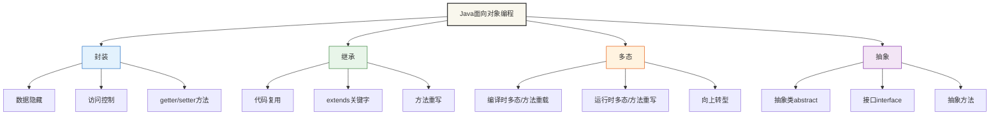

## 1. 面向对象编程基础

### 1.1 什么是面向对象编程

面向对象编程是一种编程范式，它将现实世界中的事物抽象为对象，每个对象都有自己的属性和行为。Java完全支持面向对象编程，提供了丰富的语法特性来实现OOP概念。

#### 核心概念

<Tabs>
  <TabItem value="table" label="概念总览" default>
  
| 概念 | 说明 | 特点 |
|------|------|------|
| **封装（Encapsulation）** | 将数据和方法绑定在一起，隐藏内部实现细节 | 数据隐藏、访问控制 |
| **继承（Inheritance）** | 子类可以继承父类的属性和方法 | 代码重用、层次结构 |
| **多态（Polymorphism）** | 同一个接口可以有多种不同的实现 | 方法重载、方法重写 |
| **抽象（Abstraction）** | 提取共同特征，隐藏复杂细节 | 接口定义、抽象类 |
  </TabItem>
  <TabItem value="encapsulation" label="封装">
    :::info 封装
    **封装**是面向对象编程的基本特性，它通过将数据和对数据的操作组合在一个单元（类）内部，并隐藏对象的内部状态和实现细节，只对外提供有限的接口。
    
    **关键机制**：
    - **访问修饰符**：`private`、`protected`、默认、`public`
    - **getter/setter方法**：控制对私有属性的访问
    - **信息隐藏**：隐藏实现细节，只暴露必要的接口
    
    **优势**：
    - 提高代码安全性
    - 简化接口，降低复杂度
    - 支持可维护性和灵活性
    :::
  </TabItem>
  <TabItem value="inheritance" label="继承">
    :::info 继承
    **继承**允许一个类（子类）获取另一个类（父类）的属性和方法，形成类的层次结构，实现代码重用。
    
    **关键机制**：
    - 使用`extends`关键字实现继承
    - 子类可以访问父类的非私有成员
    - 可以通过`super`关键字调用父类方法或构造器
    
    **优势**：
    - 代码重用
    - 建立类的层次结构
    - 实现"是一种"关系
    :::
  </TabItem>
  <TabItem value="polymorphism" label="多态">
    :::info 多态
    **多态**允许不同的对象对同一消息作出不同的响应，体现为"一个接口，多种实现"。
    
    **实现方式**：
    - **方法重写**：子类重写父类的方法，覆盖原有实现
    - **方法重载**：同一个类中定义多个同名但参数不同的方法
    - **接口实现**：不同类实现同一接口的不同行为
    
    **优势**：
    - 提高代码的灵活性和可扩展性
    - 简化客户端代码
    - 支持"开闭原则"
    :::
  </TabItem>
  <TabItem value="abstraction" label="抽象">
    :::info 抽象
    **抽象**是提取事物共同特征而忽略非本质细节的过程，在Java中通过抽象类和接口实现。
    
    **实现方式**：
    - **抽象类**：使用`abstract`关键字声明，可以包含抽象方法和具体方法
    - **接口**：使用`interface`关键字声明，定义一组方法规范
    
    **优势**：
    - 分离接口和实现
    - 提供设计蓝图
    - 支持程序的可扩展性
    :::
  </TabItem>
</Tabs>

## 2. 类和对象基础

### 2.1 类的定义

类是对象的模板，定义了对象的属性和行为。下面是一个标准Java类的结构：

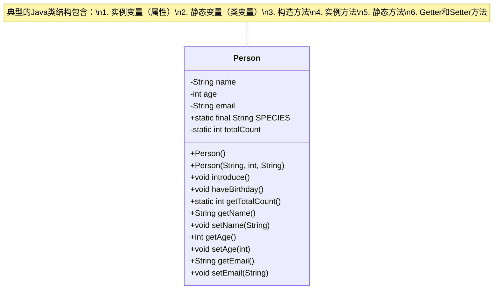

<Tabs>
  <TabItem value="class-structure" label="类结构" default>
  ```java title="Person类结构"
  public class Person {
      // 实例变量（属性）
      private String name;
      private int age;
      private String email;
      
      // 类变量（静态变量）
      public static final String SPECIES = "Homo sapiens";
      private static int totalCount = 0;
      
      // 构造方法
      public Person() {
          this("Unknown", 0, "");
      }
      
      public Person(String name, int age, String email) {
          this.name = name;
          this.age = age;
          this.email = email;
          totalCount++; // 增加总人数
      }
      
      // 实例方法
      public void introduce() {
          System.out.println("我叫 " + name + "，今年 " + age + " 岁");
      }
      
      public void haveBirthday() {
          age++;
          System.out.println("生日快乐！现在 " + name + " 已经 " + age + " 岁了");
      }
      
      // 静态方法
      public static int getTotalCount() {
          return totalCount;
      }
      
      // Getter和Setter方法
      public String getName() {
          return name;
      }
      
      public void setName(String name) {
          this.name = name;
      }
      
      public int getAge() {
          return age;
      }
      
      public void setAge(int age) {
          if (age >= 0 && age <= 150) {
              this.age = age;
          } else {
              System.err.println("年龄必须在0-150之间");
          }
      }
      
      public String getEmail() {
          return email;
      }
      
      public void setEmail(String email) {
          this.email = email;
      }
  }
  ```
  </TabItem>
  <TabItem value="class-components" label="类的组成部分">
    <div className="card">
      <div className="card__body">
        <h4>Java类的基本组成部分</h4>
        <ul>
          <li><strong>字段/属性</strong>：存储对象的状态</li>
          <li><strong>方法</strong>：定义对象的行为</li>
          <li><strong>构造方法</strong>：创建对象时初始化</li>
          <li><strong>内部类</strong>：嵌套在类内部的类</li>
          <li><strong>代码块</strong>：初始化代码块</li>
          <li><strong>接口实现</strong>：实现接口的方法</li>
        </ul>
      </div>
    </div>
    
    :::tip 类和对象的关系
    - **类**是对象的模板或蓝图
    - **对象**是类的具体实例
    - 类定义了对象的属性和行为
    - 对象是类在内存中的表示
    :::
  </TabItem>
  <TabItem value="access-modifiers" label="访问修饰符">
    | 修饰符 | 同一类 | 同一包 | 子类 | 其他包 |
    |--------|--------|--------|------|--------|
    | **private** | ✅ | ❌ | ❌ | ❌ |
    | **默认(无修饰符)** | ✅ | ✅ | ❌ | ❌ |
    | **protected** | ✅ | ✅ | ✅ | ❌ |
    | **public** | ✅ | ✅ | ✅ | ✅ |
  </TabItem>
</Tabs>

### 2.2 对象的创建和使用

对象是类的实例，通过 `new` 关键字创建。下面展示了对象的创建和使用过程：

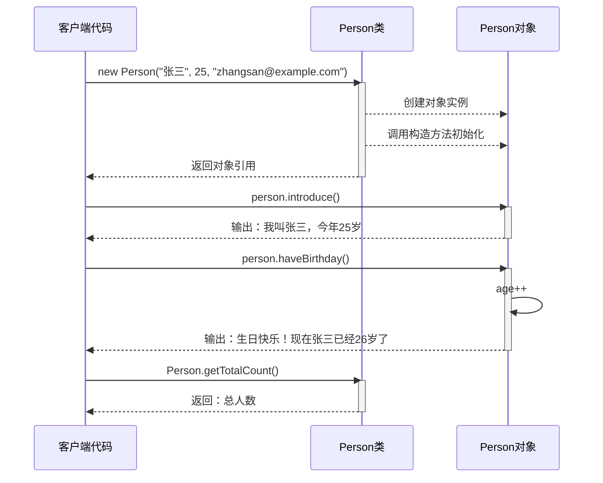

```java title="对象创建和使用示例"
public class ObjectDemo {
    public static void main(String[] args) {
        // 创建对象
        Person person1 = new Person("张三", 25, "zhangsan@example.com");
        Person person2 = new Person("李四", 30, "lisi@example.com");
        
        // 调用实例方法
        person1.introduce();
        person2.introduce();
        
        // 调用静态方法
        System.out.println("总人数: " + Person.getTotalCount());
        
        // 修改对象状态
        person1.haveBirthday();
        person1.setAge(26);
        
        // 访问静态常量
        System.out.println("人类学名: " + Person.SPECIES);
    }
}
```

:::info 对象的生命周期
1. **创建**：通过`new`关键字调用构造器创建对象
2. **使用**：通过引用变量访问对象的属性和方法
3. **不可达**：当没有任何引用指向对象时
4. **垃圾回收**：JVM的垃圾回收器回收不可达对象
:::

### 2.3 构造方法详解

构造方法是创建对象时自动调用的特殊方法，负责初始化对象。

<Tabs>
  <TabItem value="basics" label="基础知识" default>
    :::tip 构造方法特点
    - 与类同名
    - 没有返回值（连void都不写）
    - 可以重载（提供多个不同参数列表的构造方法）
    - 如果不定义构造方法，Java会提供默认的无参构造方法
    - 如果定义了构造方法，Java不会再提供默认构造方法
    :::
    
    ```java title="基本构造方法示例"
    public class User {
        private String username;
        private String email;
        
        // 默认构造方法
        public User() {
            username = "guest";
            email = "guest@example.com";
        }
        
        // 带参数的构造方法
        public User(String username, String email) {
            this.username = username;
            this.email = email;
        }
    }
    ```
  </TabItem>
  <TabItem value="chaining" label="构造方法链">
    构造方法可以通过`this`关键字调用同一个类中的其他构造方法：
    
    ```java title="构造方法链示例"
    public class Product {
        private String name;
        private double price;
        private String category;
        
        // 主构造方法
        public Product(String name, double price, String category) {
            this.name = name;
            this.price = price;
            this.category = category;
        }
        
        // 调用主构造方法
        public Product(String name, double price) {
            this(name, price, "未分类");
        }
        
        // 调用另一个构造方法
        public Product(String name) {
            this(name, 0.0);
        }
        
        // 无参构造方法
        public Product() {
            this("未命名产品");
        }
    }
    ```
    
    :::caution 注意事项
    - `this()`构造器调用必须是构造方法的第一条语句
    - 不能形成循环调用链
    :::
  </TabItem>
  <TabItem value="initializers" label="初始化块">
    除了构造方法，Java还提供了初始化块来初始化对象：
    
    ```java title="初始化块示例"
    public class InitializerExample {
        private int instanceVar;
        private static int staticVar;
        
        // 静态初始化块 - 类加载时执行一次
        static {
            System.out.println("静态初始化块执行");
            staticVar = 100;
        }
        
        // 实例初始化块 - 每次创建对象时执行
        {
            System.out.println("实例初始化块执行");
            instanceVar = 200;
        }
        
        // 构造方法
        public InitializerExample() {
            System.out.println("构造方法执行");
        }
    }
    ```
    
    **初始化顺序**：
    1. 静态初始化块（类加载时）
    2. 实例初始化块（实例创建时）
    3. 构造方法（实例创建时）
  </TabItem>
</Tabs>

### 2.4 访问修饰符

Java提供了四种访问修饰符来控制类成员的可见性：

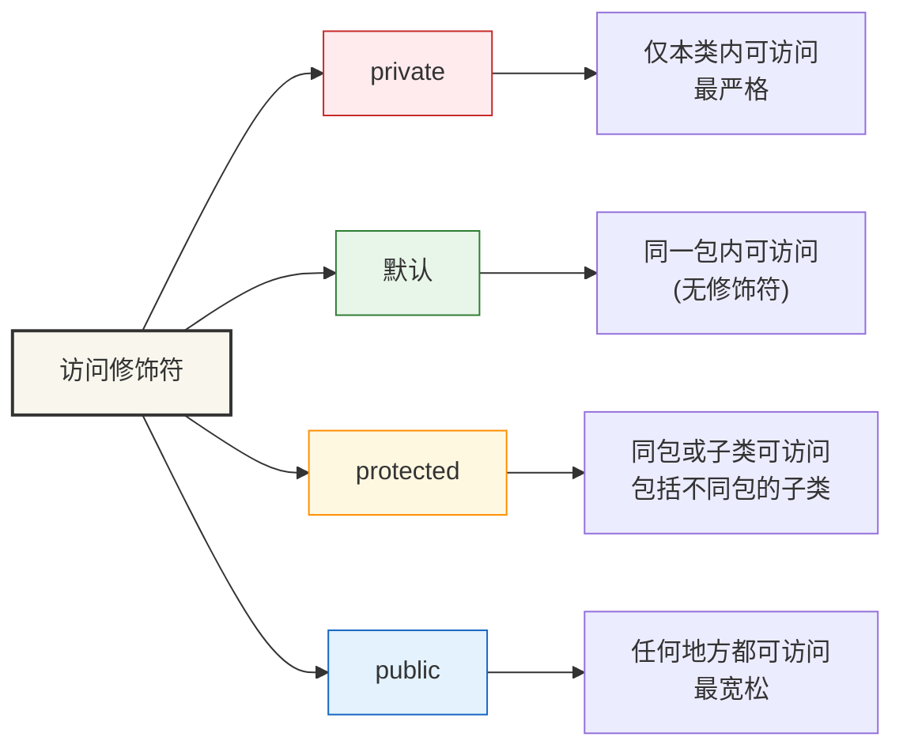

```java title="访问修饰符示例"
public class AccessModifierDemo {
    public static void main(String[] args) {
        AccessExample obj = new AccessExample();
        
        // 可以访问public成员
        obj.publicField = "公共字段";
        obj.publicMethod();
        
        // 可以访问protected成员（同包内）
        obj.protectedField = "受保护字段";
        obj.protectedMethod();
        
        // 可以访问默认访问权限成员（同包内）
        obj.defaultField = "默认字段";
        obj.defaultMethod();
        
        // 不能直接访问private成员
        // obj.privateField = "私有字段"; // 编译错误
        // obj.privateMethod(); // 编译错误
        
        // 通过公共方法访问私有成员
        obj.setPrivateField("通过公共方法设置私有字段");
        System.out.println("私有字段值: " + obj.getPrivateField());
    }
}

class AccessExample {
    // public: 任何地方都可以访问
    public String publicField;
    public void publicMethod() {
        System.out.println("公共方法");
    }
    
    // protected: 同包内和子类可以访问
    protected String protectedField;
    protected void protectedMethod() {
        System.out.println("受保护方法");
    }
    
    // 默认（无修饰符）: 同包内可以访问
    String defaultField;
    void defaultMethod() {
        System.out.println("默认方法");
    }
    
    // private: 只有本类内部可以访问
    private String privateField;
    private void privateMethod() {
        System.out.println("私有方法");
    }
    
    // 公共方法访问私有字段
    public void setPrivateField(String value) {
        this.privateField = value;
    }
    
    public String getPrivateField() {
        return privateField;
    }
}
``` 

:::warning 注意事项
1. 尽量使用**私有字段+公共方法**的封装模式
2. 只将必要的方法和字段设为公开
3. protected修饰符要慎用，它会破坏封装性
4. 内部类应当设为private或protected
:::

## 3. 封装（Encapsulation）

封装是面向对象编程的核心概念之一，它将数据和方法绑定在一起，隐藏内部实现细节，只提供必要的接口。

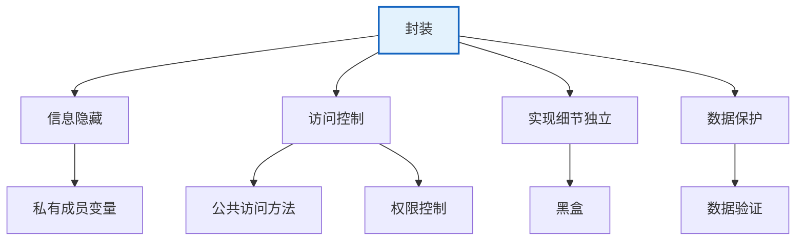

### 3.1 封装的原则

<Tabs>
  <TabItem value="principles" label="基本原则" default>
    :::tip 封装的核心原则
    1. **信息隐藏**：隐藏内部实现细节
    2. **访问控制**：通过访问修饰符限制对类成员的访问
    3. **数据保护**：防止对象数据被外部直接修改
    4. **接口抽象**：提供简单清晰的公共接口
    5. **数据验证**：通过setter方法验证数据有效性
    :::
    
    ```java title="封装示例"
    public class BankAccount {
        // 私有字段 - 隐藏实现细节
        private String accountNumber;
        private double balance;
        private String ownerName;
        private static final double MIN_BALANCE = 0.0;
        
        // 构造方法 - 控制对象初始化
        public BankAccount(String accountNumber, String ownerName, double initialBalance) {
            this.accountNumber = accountNumber;
            this.ownerName = ownerName;
            // 通过setter方法设置余额，确保数据验证
            setBalance(initialBalance);
        }
        
        // 公共接口方法 - 只暴露必要的功能
        public boolean deposit(double amount) {
            if (amount > 0) {
                balance += amount;
                System.out.println("存款成功: +" + amount + "，当前余额: " + balance);
                return true;
            } else {
                System.err.println("存款金额必须大于0");
                return false;
            }
        }
        
        public boolean withdraw(double amount) {
            if (amount > 0 && (balance - amount) >= MIN_BALANCE) {
                balance -= amount;
                System.out.println("取款成功: -" + amount + "，当前余额: " + balance);
                return true;
            } else {
                System.err.println("取款失败: 余额不足或金额无效");
                return false;
            }
        }
        
        // 只读访问器 - 允许读取但不修改
        public String getAccountNumber() {
            return accountNumber;
        }
        
        public double getBalance() {
            return balance;
        }
        
        public String getOwnerName() {
            return ownerName;
        }
        
        // 受控的setter方法 - 数据验证
        private void setBalance(double balance) {
            if (balance >= MIN_BALANCE) {
                this.balance = balance;
            } else {
                this.balance = MIN_BALANCE;
                System.err.println("余额不能为负数，已设置为0");
            }
        }
        
        // 业务逻辑方法
        public void transfer(BankAccount target, double amount) {
            if (this.withdraw(amount)) {
                target.deposit(amount);
                System.out.println("转账成功: " + amount + " 从 " + accountNumber + " 到 " + target.accountNumber);
            } else {
                System.err.println("转账失败");
            }
        }
        
        // 账户信息展示
        public void displayInfo() {
            System.out.println("账户信息:");
            System.out.println("  账号: " + accountNumber);
            System.out.println("  户名: " + ownerName);
            System.out.println("  余额: " + balance);
        }
    }
    ```
  </TabItem>
  <TabItem value="benefits" label="封装优势">
    <div className="card">
      <div className="card__header">
        <h4>封装的优势</h4>
      </div>
      <div className="card__body">
        <ol>
          <li><strong>安全性</strong>：防止对象内部状态被无效值破坏</li>
          <li><strong>模块化</strong>：实现细节和接口分离，便于模块开发</li>
          <li><strong>维护性</strong>：实现可以更改而不影响使用它的代码</li>
          <li><strong>灵活性</strong>：可以对数据进行验证，保持一致性</li>
          <li><strong>复用性</strong>：隐藏实现细节使代码更易于复用</li>
        </ol>
      </div>
    </div>
    
    ```mermaid
    flowchart LR
        A[访问字段] --> B{是否公开?}
        B -->|是| C[直接访问]
        B -->|否| D{是否需要读取?}
        D -->|是| E[提供Getter]
        D -->|否| F[不提供访问]
        
        G[修改字段] --> H{是否公开?}
        H -->|是| I[直接修改]
        H -->|否| J{是否允许修改?}
        J -->|是| K[提供Setter\n包含验证]
        J -->|否| L[不提供修改方法]
    ```
  </TabItem>
  <TabItem value="patterns" label="封装模式">
    ### 1. JavaBeans模式
    
    ```java
    public class User {
        private String name;
        private int age;
        private String email;
        
        // 无参构造方法
        public User() { }
        
        // Getter和Setter方法
        public String getName() { return name; }
        public void setName(String name) { this.name = name; }
        
        public int getAge() { return age; }
        public void setAge(int age) {
            if (age >= 0 && age <= 150) {
                this.age = age;
            }
        }
        
        public String getEmail() { return email; }
        public void setEmail(String email) { this.email = email; }
    }
    ```
    
    ### 2. 不可变对象模式
    
    ```java
    public final class ImmutablePoint {
        private final double x;
        private final double y;
        
        public ImmutablePoint(double x, double y) {
            this.x = x;
            this.y = y;
        }
        
        public double getX() { return x; }
        public double getY() { return y; }
        
        // 不提供setter，返回新对象而不修改原对象
        public ImmutablePoint translate(double dx, double dy) {
            return new ImmutablePoint(x + dx, y + dy);
        }
    }
    ```
    
    ### 3. 构建器模式
    
    ```java
    public class Person {
        // 必选参数
        private final String firstName;
        private final String lastName;
        // 可选参数
        private final int age;
        private final String email;
        private final String phone;
        
        private Person(Builder builder) {
            this.firstName = builder.firstName;
            this.lastName = builder.lastName;
            this.age = builder.age;
            this.email = builder.email;
            this.phone = builder.phone;
        }
        
        // 构建器
        public static class Builder {
            // 必选参数
            private final String firstName;
            private final String lastName;
            // 可选参数
            private int age;
            private String email;
            private String phone;
            
            public Builder(String firstName, String lastName) {
                this.firstName = firstName;
                this.lastName = lastName;
            }
            
            public Builder age(int val) {
                age = val; return this;
            }
            
            public Builder email(String val) {
                email = val; return this;
            }
            
            public Builder phone(String val) {
                phone = val; return this;
            }
            
            public Person build() {
                return new Person(this);
            }
        }
    }
    
    // 使用构建器
    Person person = new Person.Builder("张", "三")
        .age(25)
        .email("zhangsan@example.com")
        .phone("123-4567-8901")
        .build();
    ```
  </TabItem>
</Tabs>

### 3.2 封装的测试

```java title="封装测试示例"
public class EncapsulationDemo {
    public static void main(String[] args) {
        // 创建银行账户
        BankAccount account1 = new BankAccount("001", "张三", 1000.0);
        BankAccount account2 = new BankAccount("002", "李四", 500.0);
        
        // 显示初始信息
        account1.displayInfo();
        account2.displayInfo();
        
        // 进行各种操作
        account1.deposit(500.0);  // 存款
        account1.withdraw(200.0); // 取款
        account1.transfer(account2, 300.0); // 转账
        
        // 尝试非法操作
        account1.deposit(-100.0);  // 负数存款
        account1.withdraw(2000.0); // 超额取款
        
        // 显示最终信息
        System.out.println("\n最终账户状态:");
        account1.displayInfo();
        account2.displayInfo();
        
        // 注意：无法直接访问私有字段
        // System.out.println(account1.balance); // 编译错误
        // account1.balance = -1000; // 编译错误
    }
}
```

:::info 封装的实际应用
封装在实际开发中随处可见，例如：
1. **数据库连接类**：隐藏连接细节，提供简单的CRUD方法
2. **配置管理类**：内部处理配置加载逻辑，提供简单的配置访问接口
3. **UI组件**：内部处理渲染逻辑，对外提供简单的事件和属性接口
:::

## 4. 继承（Inheritance）

继承允许子类继承父类的属性和方法，实现代码重用和层次结构。

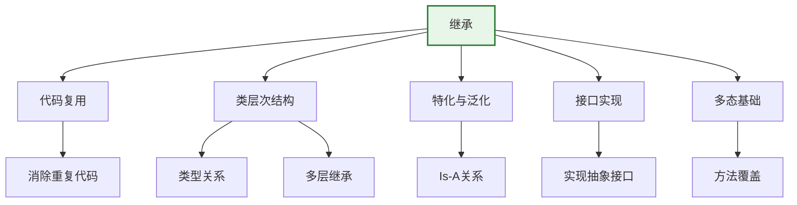

### 4.1 基本继承

<Tabs>
  <TabItem value="basics" label="继承基础" default>
    :::tip 继承的关键点
    - 使用`extends`关键字表示继承关系
    - Java中一个类只能继承一个父类（单继承）
    - 子类可以访问父类的非私有（public、protected、默认）成员
    - 子类可以通过`super`关键字访问父类的方法和构造方法
    - 子类可以覆盖（重写）父类的方法
    - 所有类都隐式继承自`Object`类
    :::
    
    ```java title="继承的语法"
    // 父类
    public class Animal {
        protected String name;
        protected int age;
        protected String species;
        
        public Animal(String name, int age, String species) {
            this.name = name;
            this.age = age;
            this.species = species;
        }
        
        public void eat() {
            System.out.println(name + " 正在吃东西");
        }
        
        public void sleep() {
            System.out.println(name + " 正在睡觉");
        }
        
        public void makeSound() {
            System.out.println(name + " 发出声音");
        }
    }
    
    // 子类
    public class Dog extends Animal {
        private String breed;
        
        public Dog(String name, int age, String breed) {
            // 调用父类构造方法
            super(name, age, "犬科");
            this.breed = breed;
        }
        
        // 重写父类方法
        @Override
        public void makeSound() {
            System.out.println(name + " 汪汪叫");
        }
        
        // 添加子类特有方法
        public void fetch() {
            System.out.println(name + " 在捡球");
        }
    }
    ```
  </TabItem>
  <TabItem value="super" label="super关键字">
    `super`关键字用于引用父类的成员：
    
    ```java title="super关键字用法"
    public class Child extends Parent {
        private int childField;
        
        public Child(int parentField, int childField) {
            // 调用父类构造方法
            super(parentField);
            this.childField = childField;
        }
        
        @Override
        public void display() {
            // 调用父类方法
            super.display();
            System.out.println("Child Field: " + childField);
        }
        
        public void accessParentField() {
            // 访问父类字段
            System.out.println("Parent Field: " + super.parentField);
        }
    }
    
    class Parent {
        protected int parentField;
        
        public Parent(int parentField) {
            this.parentField = parentField;
        }
        
        public void display() {
            System.out.println("Parent Field: " + parentField);
        }
    }
    ```
    
    :::caution 注意事项
    - `super()`必须是构造方法中的第一条语句
    - 如果父类没有无参构造方法，子类必须显式调用父类的有参构造方法
    - `super`和`this`不能同时用作构造方法的第一条语句
    :::
  </TabItem>
  <TabItem value="inheritance-types" label="继承类型">
    Java中的继承有多种形式：
    
    ### 1. 单继承
    Java只允许一个类继承一个父类，但可以实现多个接口。
    
    ```java
    public class Car extends Vehicle { }
    ```
    
    ### 2. 多层继承
    允许一个类继承另一个类，而该类又继承另一个类，形成继承链。
    
    ```java
    class Animal { }
    class Mammal extends Animal { }
    class Dog extends Mammal { }
    ```
    
    ### 3. 层次继承
    多个类可以继承同一个父类。
    
    ```java
    class Animal { }
    class Dog extends Animal { }
    class Cat extends Animal { }
    ```
    
    ### 4. 混合继承
    结合多层继承和层次继承的特点。
    
    ```java
    class Animal { }
    class Mammal extends Animal { }
    class Bird extends Animal { }
    class Dog extends Mammal { }
    class Cat extends Mammal { }
    ```
    
    ```mermaid
    classDiagram
        Animal <|-- Mammal
        Animal <|-- Bird
        Mammal <|-- Dog
        Mammal <|-- Cat
        
        class Animal {
            +makeSound()
        }
        class Mammal {
            +feedMilk()
        }
        class Bird {
            +fly()
        }
        class Dog {
            +fetch()
        }
        class Cat {
            +purr()
        }
    ```
  </TabItem>
</Tabs>

### 4.2 继承的测试

```java title="继承测试示例"
public class InheritanceDemo {
    public static void main(String[] args) {
        // 创建动物对象
        Animal animal = new Animal("未知动物", 5, "未知");
        animal.eat();
        animal.sleep();
        animal.makeSound();
        animal.displayInfo();
        
        System.out.println();
        
        // 创建狗对象
        Dog dog = new Dog("旺财", 3, "金毛", true);
        dog.eat();        // 继承自父类
        dog.sleep();      // 继承自父类
        dog.makeSound();  // 重写的父类方法
        dog.wagTail();    // 子类特有方法
        dog.fetch();      // 子类特有方法
        dog.displayInfo(); // 重写的父类方法
        
        System.out.println();
        
        // 创建猫对象
        Cat cat = new Cat("咪咪", 2, "橘色", false);
        cat.eat();        // 继承自父类
        cat.sleep();      // 继承自父类
        cat.makeSound();  // 重写的父类方法
        cat.purr();       // 子类特有方法
        cat.climb();      // 子类特有方法
        cat.displayInfo(); // 重写的父类方法
        
        System.out.println();
        
        // 多态：父类引用指向子类对象
        Animal[] animals = {dog, cat};
        for (Animal a : animals) {
            System.out.println("处理动物: " + a.name);
            a.makeSound(); // 调用重写的方法
            a.eat();       // 调用继承的方法
        }
    }
}
```

### 4.3 方法重写（Override）

方法重写允许子类提供父类方法的特定实现：

<div className="row">
  <div className="col col--6">
    <div className="card">
      <div className="card__header">
        <h4>方法重写规则</h4>
      </div>
      <div className="card__body">
        <ul>
          <li>方法名必须相同</li>
          <li>参数列表必须相同</li>
          <li>返回类型必须相同或是子类型</li>
          <li>访问修饰符不能更严格（可以更宽松）</li>
          <li>不能抛出更广泛的检查异常</li>
          <li>静态方法不能被重写（会被隐藏）</li>
          <li>私有方法不能被重写</li>
          <li>final方法不能被重写</li>
        </ul>
      </div>
    </div>
  </div>
  <div className="col col--6">
    <div className="card">
      <div className="card__header">
        <h4>@Override注解</h4>
      </div>
      <div className="card__body">
        <p>推荐在重写方法时使用@Override注解，它可以：</p>
        <ul>
          <li>帮助编译器验证重写是否正确</li>
          <li>防止意外定义新方法</li>
          <li>提高代码可读性和可维护性</li>
          <li>防止父类方法签名变化带来的错误</li>
        </ul>
      </div>
    </div>
  </div>
</div>

```java title="方法重写示例"
public class MethodOverrideDemo {
    public static void main(String[] args) {
        // 创建不同形状
        Shape circle = new Circle(5.0);
        Shape rectangle = new Rectangle(4.0, 6.0);
        Shape triangle = new Triangle(3.0, 4.0, 5.0);
        
        // 多态调用
        Shape[] shapes = {circle, rectangle, triangle};
        for (Shape shape : shapes) {
            System.out.println("形状: " + shape.getClass().getSimpleName());
            System.out.println("  面积: " + shape.calculateArea());
            System.out.println("  周长: " + shape.calculatePerimeter());
            shape.displayInfo();
            System.out.println();
        }
    }
}

// 抽象父类
abstract class Shape {
    protected String name;
    
    public Shape(String name) {
        this.name = name;
    }
    
    // 抽象方法，子类必须实现
    public abstract double calculateArea();
    public abstract double calculatePerimeter();
    
    // 具体方法，子类可以继承
    public void displayInfo() {
        System.out.println("  名称: " + name);
        System.out.println("  面积: " + calculateArea());
        System.out.println("  周长: " + calculatePerimeter());
    }
}

// 圆形
class Circle extends Shape {
    private double radius;
    
    public Circle(double radius) {
        super("圆形");
        this.radius = radius;
    }
    
    @Override
    public double calculateArea() {
        return Math.PI * radius * radius;
    }
    
    @Override
    public double calculatePerimeter() {
        return 2 * Math.PI * radius;
    }
}

// 矩形
class Rectangle extends Shape {
    private double width;
    private double height;
    
    public Rectangle(double width, double height) {
        super("矩形");
        this.width = width;
        this.height = height;
    }
    
    @Override
    public double calculateArea() {
        return width * height;
    }
    
    @Override
    public double calculatePerimeter() {
        return 2 * (width + height);
    }
}

// 三角形
class Triangle extends Shape {
    private double side1, side2, side3;
    
    public Triangle(double side1, double side2, double side3) {
        super("三角形");
        this.side1 = side1;
        this.side2 = side2;
        this.side3 = side3;
    }
    
    @Override
    public double calculateArea() {
        // 海伦公式
        double s = (side1 + side2 + side3) / 2;
        return Math.sqrt(s * (s - side1) * (s - side2) * (s - side3));
    }
    
    @Override
    public double calculatePerimeter() {
        return side1 + side2 + side3;
    }
}
```

:::warning 继承的局限性
1. **打破封装**：子类可能依赖父类的实现细节
2. **紧耦合**：父类变更可能影响所有子类
3. **多层继承难以维护**：层次过深导致复杂度增加
4. **单一继承限制**：Java只允许单一继承

解决方案：
- 考虑使用组合代替继承
- 控制继承深度（不超过3层）
- 多用接口，少用类继承
- 谨慎设计父类，保证稳定性
:::

## 5. 多态（Polymorphism）

多态是面向对象编程的重要特性，它允许同一个接口有多种不同的实现。

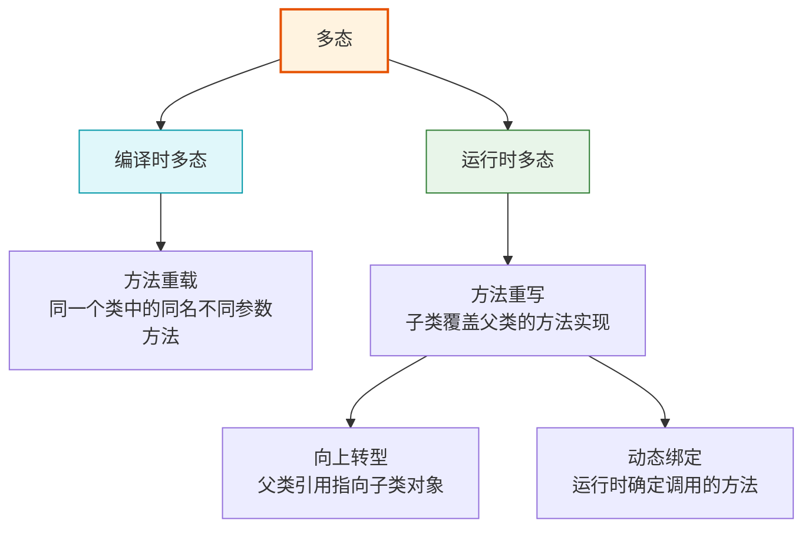

<Tabs>
  <TabItem value="overview" label="多态概述" default>
    :::info 多态的本质
    多态的核心思想是"一个接口，多种实现"。在Java中，多态主要通过继承和接口实现。多态使得代码更具灵活性、可扩展性和可维护性。

    **多态的关键机制**：
    - 继承或接口实现
    - 方法的重写（覆盖）
    - 向上转型（父类引用指向子类对象）
    - 动态绑定（运行时决定调用哪个方法）
    :::

    多态可分为两种主要类型：
    1. **编译时多态**（静态多态）：通过方法重载实现
    2. **运行时多态**（动态多态）：通过方法重写和继承实现
  </TabItem>
  <TabItem value="compile" label="编译时多态">
    编译时多态（又称静态多态）通过方法重载实现，编译器在编译时根据方法签名（方法名和参数列表）决定调用哪个方法。

    **关键特点**：
    - 发生在同一个类中
    - 方法名相同，参数列表不同（类型、数量或顺序）
    - 返回类型可以相同也可以不同
    - 在编译阶段即可确定调用哪个方法
  </TabItem>
  <TabItem value="runtime" label="运行时多态">
    运行时多态（又称动态多态）通过方法重写和继承实现，JVM在运行时根据对象的实际类型决定调用哪个方法。

    **关键特点**：
    - 必须有继承关系
    - 子类重写父类的方法
    - 父类引用指向子类对象
    - 只有在运行时才能确定调用哪个方法
    - 是Java OOP的核心机制之一
  </TabItem>
</Tabs>

### 5.1 编译时多态（方法重载）

方法重载是在同一个类中定义多个名称相同但参数列表不同的方法：

```java title="方法重载示例"
public class MethodOverloadingDemo {
    public static void main(String[] args) {
        Calculator calc = new Calculator();
        
        // 调用不同的重载方法
        System.out.println("整数加法: " + calc.add(5, 3));
        System.out.println("浮点数加法: " + calc.add(5.5, 3.2));
        System.out.println("三个整数加法: " + calc.add(1, 2, 3));
        System.out.println("字符串连接: " + calc.add("Hello", "World"));
        
        // 自动类型转换
        System.out.println("混合类型: " + calc.add(5, 3.5));
        System.out.println("字符加法: " + calc.add('A', 1));
    }
}

class Calculator {
    // 整数加法
    public int add(int a, int b) {
        System.out.println("调用 int add(int, int)");
        return a + b;
    }
    
    // 浮点数加法
    public double add(double a, double b) {
        System.out.println("调用 double add(double, double)");
        return a + b;
    }
    
    // 三个整数加法
    public int add(int a, int b, int c) {
        System.out.println("调用 int add(int, int, int)");
        return a + b + c;
    }
    
    // 字符串连接
    public String add(String a, String b) {
        System.out.println("调用 String add(String, String)");
        return a + b;
    }
    
    // 混合类型（自动类型转换）
    public double add(int a, double b) {
        System.out.println("调用 double add(int, double)");
        return a + b;
    }
    
    // 字符加法
    public int add(char a, int b) {
        System.out.println("调用 int add(char, int)");
        return a + b;
    }
}
```

<div className="card">
  <div className="card__header">
    <h4>方法重载解析规则</h4>
  </div>
  <div className="card__body">
    <p>编译器按照以下顺序解析重载方法：</p>
    <ol>
      <li>精确匹配：寻找与参数类型完全匹配的方法</li>
      <li>
        提升转换：原始类型按照以下顺序提升：
        <ul>
          <li>byte → short → int → long → float → double</li>
          <li>char → int → long → float → double</li>
        </ul>
      </li>
      <li>自动装箱/拆箱：原始类型和对应包装类型之间的转换</li>
      <li>可变参数：如果前面都没有匹配，尝试使用可变参数方法</li>
    </ol>
  </div>
</div>

### 5.2 运行时多态（方法重写）

运行时多态通过继承和方法重写实现，以下是示例：

```java title="运行时多态示例"
public class RuntimePolymorphismDemo {
    public static void main(String[] args) {
        // 父类引用指向子类对象
        Animal myDog = new Dog("旺财", 3, "金毛", true);
        Animal myCat = new Cat("咪咪", 2, "橘色", false);
        
        // 运行时多态：调用的是子类重写的方法
        System.out.println("狗的声音:");
        myDog.makeSound(); // 调用Dog类的makeSound方法
        
        System.out.println("猫的声音:");
        myCat.makeSound(); // 调用Cat类的makeSound方法
        
        // 多态数组
        Animal[] animals = {
            new Dog("小黑", 2, "拉布拉多", true),
            new Cat("小花", 1, "白色", true),
            new Dog("大黄", 4, "柴犬", false)
        };
        
        System.out.println("\n动物声音合唱:");
        for (Animal animal : animals) {
            animal.makeSound(); // 根据实际对象类型调用相应方法
        }
        
        // 多态在方法参数中的应用
        AnimalTrainer trainer = new AnimalTrainer();
        trainer.train(myDog);
        trainer.train(myCat);
    }
}

class AnimalTrainer {
    public void train(Animal animal) {
        System.out.println("训练动物: " + animal.name);
        animal.makeSound(); // 多态调用
        
        // 类型检查和转换
        if (animal instanceof Dog) {
            Dog dog = (Dog) animal;
            dog.fetch();
        } else if (animal instanceof Cat) {
            Cat cat = (Cat) animal;
            cat.climb();
        }
    }
}
```

:::tip 运行时多态要点
1. **必要条件**：继承、重写、向上转型
2. **方法调用**：根据对象的实际类型，而非引用类型
3. **动态绑定**：JVM在运行时决定调用的方法
4. **静态方法**：不参与多态（静态绑定）
5. **私有方法**：不参与多态（不能被重写）
6. **final方法**：不参与多态（不能被重写）
:::

### 5.3 多态的实际应用

<Tabs>
  <TabItem value="benefits" label="多态优势" default>
    <div className="row">
      <div className="col col--6">
        <div className="card">
          <div className="card__header">
            <h4>代码灵活性</h4>
          </div>
          <div className="card__body">
            <p>多态允许我们编写更通用的代码，处理不同类型的对象而无需知道其具体类型。这提高了代码的灵活性和可扩展性。</p>
            <p>通过多态，我们可以传递任何子类对象到需要父类类型的地方，而无需修改代码。</p>
          </div>
        </div>
      </div>
      <div className="col col--6">
        <div className="card">
          <div className="card__header">
            <h4>可扩展性</h4>
          </div>
          <div className="card__body">
            <p>多态支持"开闭原则"：对扩展开放，对修改关闭。</p>
            <p>可以添加新的子类实现，而无需修改使用这些类的代码。新的子类将自动与现有系统集成。</p>
          </div>
        </div>
      </div>
    </div>
  </TabItem>
  <TabItem value="design-patterns" label="设计模式应用">
    多态在许多设计模式中扮演核心角色：
    
    ### 1. 策略模式
    ```java
    // 策略接口
    interface SortStrategy {
        void sort(int[] array);
    }
    
    // 具体策略
    class QuickSort implements SortStrategy {
        public void sort(int[] array) {
            System.out.println("使用快速排序");
            // 快速排序实现...
        }
    }
    
    class MergeSort implements SortStrategy {
        public void sort(int[] array) {
            System.out.println("使用归并排序");
            // 归并排序实现...
        }
    }
    
    // 上下文
    class Sorter {
        private SortStrategy strategy;
        
        public void setStrategy(SortStrategy strategy) {
            this.strategy = strategy;
        }
        
        public void sort(int[] array) {
            strategy.sort(array);
        }
    }
    ```
    
    ### 2. 工厂方法模式
    ```java
    // 产品接口
    interface Product {
        void operation();
    }
    
    // 具体产品
    class ConcreteProductA implements Product {
        public void operation() {
            System.out.println("产品A的操作");
        }
    }
    
    class ConcreteProductB implements Product {
        public void operation() {
            System.out.println("产品B的操作");
        }
    }
    
    // 创建者抽象类
    abstract class Creator {
        public abstract Product createProduct();
        
        // 使用产品的方法
        public void someOperation() {
            Product product = createProduct();
            product.operation();
        }
    }
    ```
  </TabItem>
  <TabItem value="virtual-methods" label="虚方法机制">
    Java的多态通过虚方法表（Virtual Method Table, VMT）实现：
    
    ```mermaid
    classDiagram
        Animal <|-- Dog
        Animal <|-- Cat
        
        class Animal {
            +makeSound()
            +eat()
            +sleep()
        }
        
        class Dog {
            +makeSound()
            +fetch()
        }
        
        class Cat {
            +makeSound()
            +climb()
        }
    ```
    
    每个类都有一个虚方法表，包含该类的所有虚方法的地址：
    
    **Animal的虚方法表**:
    - makeSound() → Animal.makeSound()
    - eat() → Animal.eat()
    - sleep() → Animal.sleep()
    
    **Dog的虚方法表**:
    - makeSound() → Dog.makeSound() (覆盖父类方法)
    - eat() → Animal.eat() (继承自父类)
    - sleep() → Animal.sleep() (继承自父类)
    - fetch() → Dog.fetch() (子类特有方法)
    
    当通过父类引用调用方法时，JVM查找实际对象的虚方法表来确定应该调用哪个方法。
  </TabItem>
</Tabs>

## 6. 抽象类（Abstract Class）

抽象类是不能被实例化的类，通常包含抽象方法和具体方法。

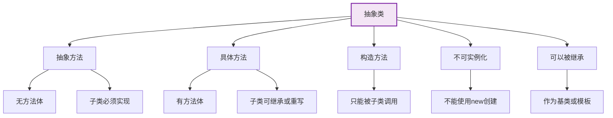

### 6.1 抽象类基础

<Tabs>
  <TabItem value="definition" label="定义与特点" default>
    :::info 抽象类的特点
    1. 使用`abstract`关键字声明
    2. 不能被实例化，只能被继承
    3. 可以包含抽象方法和具体方法
    4. 抽象方法没有方法体，子类必须实现
    5. 可以有构造方法，供子类调用
    6. 可以有成员变量和静态方法
    :::
    
    ```java title="抽象类定义示例"
    // 抽象类定义
    public abstract class Shape {
        // 成员变量
        protected String name;
        protected String color;
        
        // 构造方法
        public Shape(String name, String color) {
            this.name = name;
            this.color = color;
        }
        
        // 抽象方法 - 没有方法体
        public abstract double calculateArea();
        public abstract double calculatePerimeter();
        
        // 具体方法 - 有完整实现
        public void displayInfo() {
            System.out.println("形状名称: " + name);
            System.out.println("形状颜色: " + color);
            System.out.println("面积: " + calculateArea());
            System.out.println("周长: " + calculatePerimeter());
        }
        
        // Getter和Setter
        public String getName() {
            return name;
        }
        
        public void setName(String name) {
            this.name = name;
        }
        
        public String getColor() {
            return color;
        }
        
        public void setColor(String color) {
            this.color = color;
        }
    }
    
    // 具体子类
    public class Circle extends Shape {
        private double radius;
        
        public Circle(String color, double radius) {
            super("圆形", color);
            this.radius = radius;
        }
        
        // 实现抽象方法
        @Override
        public double calculateArea() {
            return Math.PI * radius * radius;
        }
        
        @Override
        public double calculatePerimeter() {
            return 2 * Math.PI * radius;
        }
        
        // 子类特有方法
        public double getRadius() {
            return radius;
        }
        
        public void setRadius(double radius) {
            this.radius = radius;
        }
    }
    ```
  </TabItem>
  <TabItem value="abstract-vs-concrete" label="抽象类 vs 具体类">
    | 特性 | 抽象类 | 具体类 |
    |------|--------|--------|
    | **实例化** | ❌ 不能直接实例化 | ✅ 可以直接实例化 |
    | **抽象方法** | ✅ 可以包含 | ❌ 不能包含 |
    | **方法实现** | 可以包含抽象方法和具体方法 | 只能包含具体方法 |
    | **构造方法** | ✅ 可以有 | ✅ 可以有 |
    | **用途** | 作为基类，定义通用接口 | 定义可直接使用的对象 |
    | **子类要求** | 子类必须实现所有抽象方法 | 子类可以直接继承所有方法 |
    
    ```java title="对比示例"
    // 抽象类
    abstract class Animal {
        abstract void makeSound(); // 子类必须实现
        
        void sleep() { // 具体实现
            System.out.println("动物睡觉");
        }
    }
    
    // 具体类
    class Dog extends Animal {
        @Override
        void makeSound() {
            System.out.println("汪汪叫"); // 必须实现父类抽象方法
        }
        
        // 可以添加更多方法
        void fetch() {
            System.out.println("捡球");
        }
    }
    ```
  </TabItem>
  <TabItem value="when-to-use" label="何时使用">
    <div className="card">
      <div className="card__header">
        <h4>使用抽象类的场景</h4>
      </div>
      <div className="card__body">
        <ol>
          <li><strong>共享代码</strong>：当多个相关类共享公共方法实现，但某些方法的实现因子类而异</li>
          <li><strong>部分实现</strong>：当类只能部分实现某个功能，其余功能需要由子类实现</li>
          <li><strong>模板模式</strong>：定义算法骨架，将某些步骤延迟到子类中实现</li>
          <li><strong>框架设计</strong>：定义系统框架，强制子类实现特定功能</li>
          <li><strong>代码复用</strong>：避免在多个子类中重复编写相同代码</li>
        </ol>
      </div>
    </div>
    
    ### 模板方法模式示例
    
    ```java title="模板方法模式"
    abstract class DataProcessor {
        // 模板方法 - 定义算法骨架
        public final void process() {
            readData();
            processData();
            writeData();
        }
        
        // 抽象方法 - 子类必须实现
        protected abstract void readData();
        protected abstract void processData();
        
        // 具体方法 - 公共实现
        protected void writeData() {
            System.out.println("写入处理结果到标准输出");
        }
    }
    
    class FileDataProcessor extends DataProcessor {
        @Override
        protected void readData() {
            System.out.println("从文件读取数据");
        }
        
        @Override
        protected void processData() {
            System.out.println("处理文件数据");
        }
    }
    
    class DatabaseDataProcessor extends DataProcessor {
        @Override
        protected void readData() {
            System.out.println("从数据库读取数据");
        }
        
        @Override
        protected void processData() {
            System.out.println("处理数据库数据");
        }
        
        // 重写公共方法
        @Override
        protected void writeData() {
            System.out.println("写入处理结果到数据库");
        }
    }
    ```
  </TabItem>
</Tabs>

### 6.2 抽象类示例

```java title="抽象类完整示例"
public class AbstractClassDemo {
    public static void main(String[] args) {
        // 不能直接创建抽象类对象
        // Vehicle vehicle = new Vehicle(); // 编译错误
        
        // 创建具体子类对象
        Vehicle car = new Car("红色", "汽油");
        Vehicle bicycle = new Bicycle("蓝色", "人力");
        Vehicle motorcycle = new Motorcycle("黑色", "汽油");
        
        // 多态调用
        Vehicle[] vehicles = {car, bicycle, motorcycle};
        for (Vehicle vehicle : vehicles) {
            vehicle.start();
            vehicle.stop();
            vehicle.displayInfo();
            System.out.println();
        }
    }
}

// 抽象类：交通工具
abstract class Vehicle {
    protected String color;
    protected String powerSource;
    
    public Vehicle(String color, String powerSource) {
        this.color = color;
        this.powerSource = powerSource;
    }
    
    // 抽象方法：子类必须实现
    public abstract void start();
    public abstract void stop();
    
    // 具体方法：子类可以继承
    public void displayInfo() {
        System.out.println("交通工具信息:");
        System.out.println("  类型: " + this.getClass().getSimpleName());
        System.out.println("  颜色: " + color);
        System.out.println("  动力源: " + powerSource);
    }
    
    // 具体方法：子类可以重写
    public void honk() {
        System.out.println("按喇叭");
    }
    
    // 静态方法
    public static void showVehicleCount() {
        System.out.println("交通工具总数: 3");
    }
}

// 具体子类：汽车
class Car extends Vehicle {
    private int doors;
    
    public Car(String color, String powerSource) {
        super(color, powerSource);
        this.doors = 4;
    }
    
    @Override
    public void start() {
        System.out.println("汽车启动，发动机轰鸣");
    }
    
    @Override
    public void stop() {
        System.out.println("汽车停止，刹车灯亮起");
    }
    
    @Override
    public void honk() {
        System.out.println("汽车喇叭: 滴滴");
    }
    
    @Override
    public void displayInfo() {
        super.displayInfo();
        System.out.println("  车门数: " + doors);
    }
}

// 具体子类：自行车
class Bicycle extends Vehicle {
    private int wheels;
    
    public Bicycle(String color, String powerSource) {
        super(color, powerSource);
        this.wheels = 2;
    }
    
    @Override
    public void start() {
        System.out.println("自行车开始骑行");
    }
    
    @Override
    public void stop() {
        System.out.println("自行车停止，脚踩地");
    }
    
    @Override
    public void displayInfo() {
        super.displayInfo();
        System.out.println("  轮子数: " + wheels);
    }
}

// 具体子类：摩托车
class Motorcycle extends Vehicle {
    private boolean hasSidecar;
    
    public Motorcycle(String color, String powerSource) {
        super(color, powerSource);
        this.hasSidecar = false;
    }
    
    @Override
    public void start() {
        System.out.println("摩托车启动，引擎咆哮");
    }
    
    @Override
    public void stop() {
        System.out.println("摩托车停止，侧支架放下");
    }
    
    @Override
    public void displayInfo() {
        super.displayInfo();
        System.out.println("  侧斗: " + (hasSidecar ? "有" : "无"));
    }
}
```

:::caution 抽象类设计注意事项
1. **避免过度抽象**：只提取真正通用的功能到抽象类
2. **层次适中**：控制继承层次，避免过深的继承结构
3. **明确职责**：每个抽象类应当有明确的单一职责
4. **设计稳定**：抽象类应该是稳定的，避免频繁修改
5. **考虑替代方案**：某些场景下接口+默认方法可能更合适
:::

### 6.3 抽象类与接口对比

<div className="row">
  <div className="col col--6">
    <div className="card">
      <div className="card__header">
        <h4>抽象类</h4>
      </div>
      <div className="card__body">
        <ul>
          <li>使用 <code>abstract class</code> 关键字</li>
          <li>可以包含抽象方法和具体方法</li>
          <li>可以有构造方法、成员变量</li>
          <li>可以有 private、protected 成员</li>
          <li>一个类只能继承一个抽象类</li>
          <li>适用于关系紧密的类</li>
          <li>强调"是什么"（is-a关系）</li>
          <li>提供部分实现和共同行为</li>
        </ul>
      </div>
    </div>
  </div>
  <div className="col col--6">
    <div className="card">
      <div className="card__header">
        <h4>接口</h4>
      </div>
      <div className="card__body">
        <ul>
          <li>使用 <code>interface</code> 关键字</li>
          <li>主要包含抽象方法（Java 8+支持默认方法）</li>
          <li>不能有构造方法，只能有常量</li>
          <li>所有成员默认 public</li>
          <li>一个类可以实现多个接口</li>
          <li>适用于不相关类需要共同行为</li>
          <li>强调"能做什么"（can-do关系）</li>
          <li>提供行为契约</li>
        </ul>
      </div>
    </div>
  </div>
</div>

```java title="抽象类与接口对比示例"
// 抽象类示例
abstract class Animal {
    // 成员变量
    protected String name;
    
    // 构造方法
    public Animal(String name) {
        this.name = name;
    }
    
    // 抽象方法
    public abstract void makeSound();
    
    // 具体方法
    public void sleep() {
        System.out.println(name + " 正在睡觉");
    }
    
    // protected方法
    protected void breathe() {
        System.out.println(name + " 正在呼吸");
    }
}

// 接口示例
interface Swimmer {
    // 常量
    int MAX_DEPTH = 100; // 隐式 public static final
    
    // 抽象方法
    void swim(); // 隐式 public abstract
    
    // 默认方法 (Java 8+)
    default void dive() {
        System.out.println("潜水中...");
    }
    
    // 静态方法 (Java 8+)
    static boolean canSwimInDeepWater(int depth) {
        return depth <= MAX_DEPTH;
    }
}

// 既继承抽象类又实现接口
class Fish extends Animal implements Swimmer {
    public Fish(String name) {
        super(name);
    }
    
    // 实现抽象类的抽象方法
    @Override
    public void makeSound() {
        System.out.println(name + " 吐泡泡");
    }
    
    // 实现接口的抽象方法
    @Override
    public void swim() {
        System.out.println(name + " 在水中游动");
    }
}
```

## 7. 接口（Interface）

接口定义了类必须实现的方法契约，支持多重继承。

### 7.1 基本接口

```java title="基本接口示例"
public class InterfaceDemo {
    public static void main(String[] args) {
        // 创建实现类对象
        MediaPlayer mp3Player = new MP3Player();
        MediaPlayer videoPlayer = new VideoPlayer();
        MediaPlayer radio = new Radio();
        
        // 多态调用
        MediaPlayer[] players = {mp3Player, videoPlayer, radio};
        for (MediaPlayer player : players) {
            player.play();
            player.pause();
            player.stop();
            player.displayInfo();
            System.out.println();
        }
        
        // 接口作为方法参数
        MediaController controller = new MediaController();
        controller.control(mp3Player);
        controller.control(videoPlayer);
    }
}

// 媒体播放器接口
interface MediaPlayer {
    // 常量（默认public static final）
    String VERSION = "1.0";
    
    // 抽象方法（默认public abstract）
    void play();
    void pause();
    void stop();
    
    // 默认方法（Java 8+）
    default void displayInfo() {
        System.out.println("媒体播放器 - 版本: " + VERSION);
    }
    
    // 静态方法（Java 8+）
    static void showVersion() {
        System.out.println("媒体播放器接口版本: " + VERSION);
    }
}

// 可充电接口
interface Chargeable {
    void charge();
    boolean isCharged();
}

// MP3播放器实现
class MP3Player implements MediaPlayer, Chargeable {
    private boolean isCharged = true;
    
    @Override
    public void play() {
        System.out.println("MP3播放器播放音乐");
    }
    
    @Override
    public void pause() {
        System.out.println("MP3播放器暂停音乐");
    }
    
    @Override
    public void stop() {
        System.out.println("MP3播放器停止播放");
    }
    
    @Override
    public void charge() {
        System.out.println("MP3播放器充电中");
        isCharged = true;
    }
    
    @Override
    public boolean isCharged() {
        return isCharged;
    }
    
    @Override
    public void displayInfo() {
        System.out.println("MP3播放器 - 支持音频播放");
        System.out.println("  充电状态: " + (isCharged ? "已充满" : "需要充电"));
    }
}

// 视频播放器实现
class VideoPlayer implements MediaPlayer {
    @Override
    public void play() {
        System.out.println("视频播放器播放视频");
    }
    
    @Override
    public void pause() {
        System.out.println("视频播放器暂停视频");
    }
    
    @Override
    public void stop() {
        System.out.println("视频播放器停止播放");
    }
    
    @Override
    public void displayInfo() {
        System.out.println("视频播放器 - 支持视频播放");
    }
}

// 收音机实现
class Radio implements MediaPlayer {
    private String frequency = "FM 101.7";
    
    @Override
    public void play() {
        System.out.println("收音机播放广播，频率: " + frequency);
    }
    
    @Override
    public void pause() {
        System.out.println("收音机暂停广播");
    }
    
    @Override
    public void stop() {
        System.out.println("收音机关闭");
    }
    
    @Override
    public void displayInfo() {
        System.out.println("收音机 - 支持广播接收");
        System.out.println("  当前频率: " + frequency);
    }
}

// 媒体控制器
class MediaController {
    public void control(MediaPlayer player) {
        System.out.println("控制媒体播放器:");
        player.play();
        player.pause();
        player.stop();
    }
}
```

### 7.2 接口的默认方法和静态方法

```java title="接口默认方法和静态方法示例"
public class InterfaceAdvancedDemo {
    public static void main(String[] args) {
        // 调用接口静态方法
        Logger.showVersion();
        
        // 创建实现类对象
        FileLogger fileLogger = new FileLogger();
        ConsoleLogger consoleLogger = new ConsoleLogger();
        DatabaseLogger dbLogger = new DatabaseLogger();
        
        // 使用默认方法
        fileLogger.log("文件日志信息");
        consoleLogger.log("控制台日志信息");
        dbLogger.log("数据库日志信息");
        
        // 调用重写的默认方法
        fileLogger.logWithTimestamp("带时间戳的文件日志");
        consoleLogger.logWithTimestamp("带时间戳的控制台日志");
        
        // 接口作为类型
        Logger[] loggers = {fileLogger, consoleLogger, dbLogger};
        for (Logger logger : loggers) {
            logger.log("批量日志信息");
        }
    }
}

// 日志接口
interface Logger {
    // 常量
    String DEFAULT_LEVEL = "INFO";
    
    // 抽象方法
    void log(String message);
    
    // 默认方法
    default void logWithTimestamp(String message) {
        String timestamp = java.time.LocalDateTime.now().toString();
        System.out.println("[" + timestamp + "] " + message);
    }
    
    default void logWithLevel(String message, String level) {
        System.out.println("[" + level + "] " + message);
    }
    
    // 静态方法
    static void showVersion() {
        System.out.println("Logger接口版本: 2.0");
    }
    
    static Logger createLogger(String type) {
        switch (type.toLowerCase()) {
            case "file":
                return new FileLogger();
            case "console":
                return new ConsoleLogger();
            case "database":
                return new DatabaseLogger();
            default:
                return new ConsoleLogger();
        }
    }
}

// 文件日志实现
class FileLogger implements Logger {
    @Override
    public void log(String message) {
        System.out.println("文件日志: " + message);
    }
    
    @Override
    public void logWithTimestamp(String message) {
        String timestamp = java.time.LocalDateTime.now().toString();
        System.out.println("文件日志 [" + timestamp + "]: " + message);
    }
}

// 控制台日志实现
class ConsoleLogger implements Logger {
    @Override
    public void log(String message) {
        System.out.println("控制台日志: " + message);
    }
    }
    
// 数据库日志实现
class DatabaseLogger implements Logger {
    @Override
    public void log(String message) {
        System.out.println("数据库日志: " + message);
    }
}
``` 

## 8. 内部类（Inner Classes）

内部类是在另一个类内部定义的类，提供了更好的封装和逻辑组织。

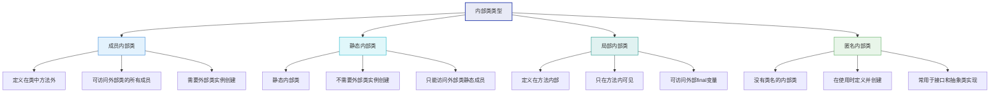

### 8.1 成员内部类

<Tabs>
  <TabItem value="member-inner" label="成员内部类" default>
    :::info 成员内部类特点
    - 定义在类内部、方法外部
    - 可以访问外部类的所有成员（包括私有成员）
    - 必须先创建外部类实例，才能创建内部类实例
    - 内部类可以被所有访问修饰符修饰（public、private等）
    - 外部类可以直接访问内部类的所有成员
    :::
    
    ```java title="成员内部类示例"
    public class OuterClass {
        private String outerField = "外部类字段";
        private static String staticOuterField = "静态外部字段";
        
        // 成员内部类
        public class InnerClass {
            private String innerField = "内部类字段";
            
            // 内部类可以访问外部类的所有成员
            public void accessOuterMembers() {
                System.out.println("访问外部类字段: " + outerField);
                System.out.println("访问外部类静态字段: " + staticOuterField);
                outerMethod(); // 调用外部类方法
            }
            
            public void displayInfo() {
                System.out.println("内部类字段: " + innerField);
            }
        }
        
        public void outerMethod() {
            System.out.println("外部类方法被调用");
        }
        
        // 外部类访问内部类
        public void accessInnerClass() {
            InnerClass inner = new InnerClass();
            inner.displayInfo();
            System.out.println("访问内部类字段: " + inner.innerField);
        }
    }
    
    // 使用内部类
    public class InnerClassDemo {
        public static void main(String[] args) {
            // 创建外部类实例
            OuterClass outer = new OuterClass();
            
            // 创建内部类实例（需要外部类实例）
            OuterClass.InnerClass inner = outer.new InnerClass();
            
            // 调用内部类方法
            inner.accessOuterMembers();
            inner.displayInfo();
        }
    }
    ```
  </TabItem>
  <TabItem value="static-inner" label="静态内部类">
    :::info 静态内部类特点
    - 使用`static`关键字修饰的内部类
    - 不需要外部类实例即可创建
    - 只能访问外部类的静态成员
    - 不能访问外部类的实例成员
    - 可以包含静态和非静态成员
    :::
    
    ```java title="静态内部类示例"
    public class OuterClass {
        private String instanceField = "实例字段";
        private static String staticField = "静态字段";
        
        // 静态内部类
        public static class StaticInnerClass {
            private String innerField = "内部类字段";
            private static String staticInnerField = "静态内部类静态字段";
            
            // 只能访问外部类的静态成员
            public void accessOuterMembers() {
                // System.out.println(instanceField); // 编译错误
                System.out.println("访问外部类静态字段: " + staticField);
            }
            
            public static void staticInnerMethod() {
                System.out.println("静态内部类的静态方法");
            }
            
            public void displayInfo() {
                System.out.println("内部类字段: " + innerField);
                System.out.println("静态内部类静态字段: " + staticInnerField);
            }
        }
        
        public void accessStaticInnerClass() {
            // 可以直接创建静态内部类实例
            StaticInnerClass inner = new StaticInnerClass();
            inner.displayInfo();
            
            // 访问静态内部类的静态成员
            StaticInnerClass.staticInnerMethod();
        }
    }
    
    // 使用静态内部类
    public class StaticInnerClassDemo {
        public static void main(String[] args) {
            // 创建静态内部类实例（无需外部类实例）
            OuterClass.StaticInnerClass inner = new OuterClass.StaticInnerClass();
            
            // 调用内部类方法
            inner.accessOuterMembers();
            inner.displayInfo();
            
            // 调用静态方法
            OuterClass.StaticInnerClass.staticInnerMethod();
        }
    }
    ```
  </TabItem>
</Tabs>

### 8.2 局部内部类和匿名内部类

<Tabs>
  <TabItem value="local-inner" label="局部内部类" default>
    :::info 局部内部类特点
    - 定义在方法内部
    - 作用域仅限于定义它的方法内
    - 可以访问外部类的所有成员
    - 可以访问方法中的final或effectively final局部变量
    - 不能使用方法中的非final局部变量
    :::
    
    ```java title="局部内部类示例"
    public class LocalInnerClassDemo {
        private String outerField = "外部类字段";
        
        public void method(final int param) {
            final String localVar = "局部变量";
            String effectivelyFinalVar = "实际上的final变量"; // 没有被修改，视为effectively final
            
            // 局部内部类
            class LocalInner {
                private String innerField = "局部内部类字段";
                
                public void display() {
                    // 访问外部类成员
                    System.out.println("外部类字段: " + outerField);
                    
                    // 访问方法的参数和局部变量（必须是final或effectively final）
                    System.out.println("方法参数: " + param);
                    System.out.println("局部变量: " + localVar);
                    System.out.println("实际上的final变量: " + effectivelyFinalVar);
                    
                    // 局部内部类的字段
                    System.out.println("内部类字段: " + innerField);
                }
            }
            
            // 创建并使用局部内部类
            LocalInner inner = new LocalInner();
            inner.display();
            
            // effectivelyFinalVar = "修改"; // 如果取消注释，会导致内部类无法引用此变量
        }
        
        public static void main(String[] args) {
            LocalInnerClassDemo demo = new LocalInnerClassDemo();
            demo.method(10);
        }
    }
    ```
    
    :::caution 局部变量限制
    局部内部类只能访问方法中的final或effectively final变量。这是因为：
    1. **生命周期不同**：方法执行完后局部变量消失，但内部类实例可能继续存在
    2. **值捕获**：内部类实际上捕获的是变量的副本，而非变量本身
    3. **一致性保证**：确保内部类和方法中的变量值保持一致
    :::
  </TabItem>
  <TabItem value="anonymous-inner" label="匿名内部类">
    :::info 匿名内部类特点
    - 没有名称的内部类
    - 在创建时同时定义和实例化
    - 只能创建一个实例
    - 可以扩展类或实现接口，但不能同时做两者
    - 不能有构造方法（没有类名）
    - 不能是静态的
    :::
    
    ```java title="匿名内部类示例"
    public class AnonymousInnerClassDemo {
        // 接口
        interface Greeting {
            void greet();
        }
        
        // 抽象类
        abstract class Person {
            abstract void introduce();
            
            void sleep() {
                System.out.println("人在睡觉...");
            }
        }
        
        public void demo() {
            // 1. 实现接口的匿名内部类
            Greeting chineseGreeting = new Greeting() {
                @Override
                public void greet() {
                    System.out.println("你好！");
                }
            };
            
            // 使用接口匿名实现
            chineseGreeting.greet();
            
            // 2. 扩展抽象类的匿名内部类
            Person student = new Person() {
                @Override
                void introduce() {
                    System.out.println("我是一名学生");
                }
                
                // 可以添加额外方法，但只能在内部使用
                void study() {
                    System.out.println("学生正在学习");
                }
            };
            
            // 使用抽象类匿名实现
            student.introduce();
            student.sleep();
            // student.study(); // 编译错误，无法访问匿名类特有的方法
            
            // 3. 扩展具体类的匿名内部类
            Runnable runnable = new Runnable() {
                @Override
                public void run() {
                    System.out.println("线程任务执行中...");
                }
            };
            
            // 使用匿名内部类创建线程
            new Thread(runnable).start();
            
            // 或者更简洁地
            new Thread(new Runnable() {
                @Override
                public void run() {
                    System.out.println("另一个线程任务执行中...");
                }
            }).start();
            
            // Java 8+ Lambda表达式（更简洁，但仅适用于函数式接口）
            Greeting englishGreeting = () -> System.out.println("Hello!");
            englishGreeting.greet();
        }
        
        public static void main(String[] args) {
            new AnonymousInnerClassDemo().demo();
        }
    }
    ```
    
    :::tip Lambda vs 匿名内部类
    从Java 8开始，对于函数式接口（只有一个抽象方法的接口），可以使用Lambda表达式代替匿名内部类，语法更简洁：
    ```java
    // 匿名内部类
    Runnable r1 = new Runnable() {
        @Override
        public void run() {
            System.out.println("Running...");
        }
    };
    
    // 等价的Lambda表达式
    Runnable r2 = () -> System.out.println("Running...");
    ```
    :::
  </TabItem>
</Tabs>

### 8.3 内部类的应用场景

<div className="row">
  <div className="col col--6">
    <div className="card">
      <div className="card__header">
        <h4>内部类的优势</h4>
      </div>
      <div className="card__body">
        <ul>
          <li><strong>封装性增强</strong>：可以将内部类完全隐藏在外部类中</li>
          <li><strong>访问控制</strong>：内部类可以访问外部类的所有成员</li>
          <li><strong>逻辑分组</strong>：将相关联的类组织在一起</li>
          <li><strong>回调实现</strong>：匿名内部类是回调的优雅实现</li>
          <li><strong>减少类文件数量</strong>：避免过多单独的类文件</li>
        </ul>
      </div>
    </div>
  </div>
  <div className="col col--6">
    <div className="card">
      <div className="card__header">
        <h4>适用场景</h4>
      </div>
      <div className="card__body">
        <ul>
          <li><strong>UI事件处理</strong>：处理按钮点击等事件</li>
          <li><strong>适配器模式</strong>：实现接口或抽象类</li>
          <li><strong>迭代器模式</strong>：为集合类提供迭代器</li>
          <li><strong>策略模式</strong>：提供算法的不同实现</li>
          <li><strong>构建器模式</strong>：使用静态内部类作为构建器</li>
          <li><strong>单例模式</strong>：使用静态内部类实现懒加载单例</li>
        </ul>
      </div>
    </div>
  </div>
</div>

```java title="内部类实际应用示例"
// 构建器模式
public class Computer {
    // 必选参数
    private final String cpu;
    private final int memory;
    // 可选参数
    private final int storage;
    private final String gpu;
    private final boolean hasBluetooth;
    
    private Computer(Builder builder) {
        this.cpu = builder.cpu;
        this.memory = builder.memory;
        this.storage = builder.storage;
        this.gpu = builder.gpu;
        this.hasBluetooth = builder.hasBluetooth;
    }
    
    // 静态内部类作为构建器
    public static class Builder {
        // 必选参数
        private final String cpu;
        private final int memory;
        // 可选参数
        private int storage = 256;
        private String gpu = "Integrated";
        private boolean hasBluetooth = false;
        
        public Builder(String cpu, int memory) {
            this.cpu = cpu;
            this.memory = memory;
        }
        
        public Builder storage(int storage) {
            this.storage = storage;
            return this;
        }
        
        public Builder gpu(String gpu) {
            this.gpu = gpu;
            return this;
        }
        
        public Builder hasBluetooth(boolean hasBluetooth) {
            this.hasBluetooth = hasBluetooth;
            return this;
        }
        
        public Computer build() {
            return new Computer(this);
        }
    }
    
    // 方法用于显示电脑信息
    public void displaySpecs() {
        System.out.println("Computer Specifications:");
        System.out.println("CPU: " + cpu);
        System.out.println("Memory: " + memory + "GB");
        System.out.println("Storage: " + storage + "GB");
        System.out.println("GPU: " + gpu);
        System.out.println("Bluetooth: " + (hasBluetooth ? "Yes" : "No"));
    }
    
    // 使用示例
    public static void main(String[] args) {
        Computer computer = new Computer.Builder("Intel i7", 16)
            .storage(512)
            .gpu("NVIDIA RTX 3070")
            .hasBluetooth(true)
            .build();
        
        computer.displaySpecs();
    }
}

// 单例模式（使用静态内部类实现懒加载）
public class Singleton {
    // 私有构造方法
    private Singleton() { }
    
    // 静态内部类持有单例实例
    private static class SingletonHolder {
        private static final Singleton INSTANCE = new Singleton();
    }
    
    // 公共获取实例方法
    public static Singleton getInstance() {
        return SingletonHolder.INSTANCE;
    }
}
```

## 9. 枚举（Enum）

枚举是一种特殊的类，用于表示一组固定的常量。

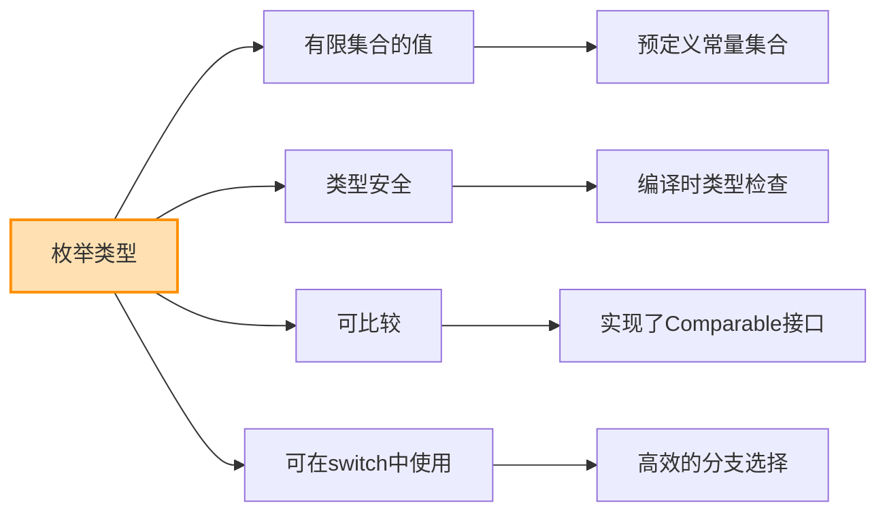

### 9.1 基本枚举

<Tabs>
  <TabItem value="basics" label="基础用法" default>
    :::info 枚举特点
    - 使用`enum`关键字定义
    - 所有枚举值必须在开头定义
    - 每个枚举常量都是该枚举类型的实例
    - 枚举类型隐式继承自`java.lang.Enum`
    - 枚举是类型安全的常量
    - 可以在`switch`语句中使用
    - 自动实现了`Comparable`接口
    :::
    
    ```java title="基本枚举示例"
    // 基本枚举定义
    public enum Day {
        MONDAY, TUESDAY, WEDNESDAY, THURSDAY, FRIDAY, SATURDAY, SUNDAY
    }
    
    // 使用枚举
    public class EnumBasicDemo {
        public static void main(String[] args) {
            // 声明枚举变量
            Day today = Day.MONDAY;
            
            // 在switch中使用
            switch (today) {
                case MONDAY:
                    System.out.println("星期一，工作日");
                    break;
                case TUESDAY:
                    System.out.println("星期二，工作日");
                    break;
                case WEDNESDAY:
                    System.out.println("星期三，工作日");
                    break;
                case THURSDAY:
                    System.out.println("星期四，工作日");
                    break;
                case FRIDAY:
                    System.out.println("星期五，工作日");
                    break;
                case SATURDAY:
                case SUNDAY:
                    System.out.println("周末");
                    break;
            }
            
            // 遍历所有枚举值
            System.out.println("\n一周的所有天:");
            for (Day day : Day.values()) {
                System.out.println(day);
            }
            
            // 从字符串获取枚举
            Day friday = Day.valueOf("FRIDAY");
            System.out.println("\n" + friday + " 的序数: " + friday.ordinal());
            
            // 比较枚举值
            if (today.compareTo(Day.FRIDAY) < 0) {
                System.out.println("今天在星期五之前");
            }
        }
    }
    ```
  </TabItem>
  <TabItem value="methods" label="枚举方法">
    每个枚举类型都隐式继承自`java.lang.Enum`，具有以下方法：
    
    | 方法 | 返回类型 | 描述 |
    |------|---------|------|
    | `name()` | `String` | 返回枚举常量的名称 |
    | `ordinal()` | `int` | 返回枚举常量的序数（从0开始的位置） |
    | `valueOf(String name)` | `枚举类型` | 返回指定名称的枚举常量 |
    | `values()` | `枚举类型[]` | 返回包含所有枚举常量的数组 |
    | `compareTo(E o)` | `int` | 比较枚举常量的序数 |
    
    ```java title="枚举方法示例"
    public enum Direction {
        NORTH, EAST, SOUTH, WEST
    }
    
    public class EnumMethodsDemo {
        public static void main(String[] args) {
            // 使用内置方法
            Direction dir = Direction.NORTH;
            
            System.out.println("名称: " + dir.name());
            System.out.println("序数: " + dir.ordinal());
            System.out.println("toString: " + dir.toString());
            
            // 获取所有枚举值
            Direction[] allDirections = Direction.values();
            System.out.println("\n所有方向:");
            for (Direction d : allDirections) {
                System.out.println(d + " at position " + d.ordinal());
            }
            
            // valueOf方法
            Direction west = Direction.valueOf("WEST");
            System.out.println("\n西方向: " + west);
            
            // 比较枚举
            Direction south = Direction.SOUTH;
            System.out.println("\n比较NORTH和SOUTH: " + dir.compareTo(south));
        }
    }
    ```
  </TabItem>
</Tabs>

### 9.2 带属性和方法的枚举

```java title="带属性和方法的枚举示例"
// 带属性和方法的枚举
public enum DayOfWeek {
    MONDAY("星期一", true),
    TUESDAY("星期二", true),
    WEDNESDAY("星期三", true),
    THURSDAY("星期四", true),
    FRIDAY("星期五", true),
    SATURDAY("星期六", false),
    SUNDAY("星期日", false);
    
    private final String chineseName;
    private final boolean workday;
    
    // 枚举构造方法
    DayOfWeek(String chineseName, boolean workday) {
        this.chineseName = chineseName;
        this.workday = workday;
    }
    
    // 获取中文名称
    public String getChineseName() {
        return chineseName;
    }
    
    // 判断是否工作日
    public boolean isWorkday() {
        return workday;
    }
    
    // 添加自定义方法
    public String getDescription() {
        return this.name() + " (" + chineseName + ")" + 
               (workday ? " - 工作日" : " - 休息日");
    }
    
    // 获取下一天
    public DayOfWeek nextDay() {
        int nextOrdinal = (this.ordinal() + 1) % values().length;
        return values()[nextOrdinal];
    }
}

// 枚举使用示例
public class EnhancedEnumDemo {
    public static void main(String[] args) {
        DayOfWeek today = DayOfWeek.MONDAY;
        
        // 使用枚举属性
        System.out.println("今天: " + today);
        System.out.println("中文名称: " + today.getChineseName());
        System.out.println("是否工作日: " + today.isWorkday());
        System.out.println("描述: " + today.getDescription());
        
        // 使用枚举方法
        DayOfWeek tomorrow = today.nextDay();
        System.out.println("\n明天: " + tomorrow.getDescription());
        
        // 遍历带属性的枚举
        System.out.println("\n一周的所有天:");
        for (DayOfWeek day : DayOfWeek.values()) {
            System.out.println(day.getDescription());
        }
    }
}
```

### 9.3 抽象方法和状态机

<Tabs>
  <TabItem value="abstract-methods" label="抽象方法" default>
    枚举可以定义抽象方法，每个枚举值必须实现该方法：
    
    ```java title="带抽象方法的枚举"
    public enum Operation {
        ADD("+") {
            @Override
            public double apply(double x, double y) {
                return x + y;
            }
        },
        
        SUBTRACT("-") {
            @Override
            public double apply(double x, double y) {
                return x - y;
            }
        },
        
        MULTIPLY("*") {
            @Override
            public double apply(double x, double y) {
                return x * y;
            }
        },
        
        DIVIDE("/") {
            @Override
            public double apply(double x, double y) {
                if (y == 0) throw new ArithmeticException("除数不能为零");
                return x / y;
            }
        };
        
        private final String symbol;
        
        Operation(String symbol) {
            this.symbol = symbol;
        }
        
        public String getSymbol() {
            return symbol;
        }
        
        // 抽象方法，每个枚举值必须实现
        public abstract double apply(double x, double y);
    }
    
    // 使用带抽象方法的枚举
    public class OperationDemo {
        public static void main(String[] args) {
            double x = 10;
            double y = 5;
            
            for (Operation op : Operation.values()) {
                System.out.println(x + " " + op.getSymbol() + " " + y + " = " + op.apply(x, y));
            }
        }
    }
    ```
  </TabItem>
  <TabItem value="state-machine" label="状态机">
    枚举非常适合实现状态机模式：
    
    ```java title="枚举状态机"
    public enum TrafficLight {
        RED(30) {
            @Override
            public TrafficLight next() {
                return GREEN;
            }
            
            @Override
            public String getAction() {
                return "停车等待";
            }
        },
        
        GREEN(45) {
            @Override
            public TrafficLight next() {
                return YELLOW;
            }
            
            @Override
            public String getAction() {
                return "可以通行";
            }
        },
        
        YELLOW(5) {
            @Override
            public TrafficLight next() {
                return RED;
            }
            
            @Override
            public String getAction() {
                return "减速准备停车";
            }
        };
        
        private final int durationSeconds;
        
        TrafficLight(int durationSeconds) {
            this.durationSeconds = durationSeconds;
        }
        
        public int getDurationSeconds() {
            return durationSeconds;
        }
        
        // 抽象方法：获取下一个状态
        public abstract TrafficLight next();
        
        // 抽象方法：获取当前状态应执行的动作
        public abstract String getAction();
    }
    
    // 状态机演示
    public class StateMachineDemo {
        public static void main(String[] args) {
            TrafficLight light = TrafficLight.RED;
            
            // 模拟5次状态转换
            for (int i = 0; i < 5; i++) {
                System.out.println("当前信号灯: " + light);
                System.out.println("持续时间: " + light.getDurationSeconds() + "秒");
                System.out.println("驾驶员动作: " + light.getAction());
                
                light = light.next(); // 状态转换
                System.out.println();
            }
        }
    }
    ```
    
    :::tip 状态机优势
    使用枚举实现状态机有以下优势：
    1. **类型安全**：状态转换在编译时检查
    2. **代码清晰**：每个状态的行为封装在一起
    3. **易于维护**：添加新状态只需添加新的枚举值
    4. **状态间转换明确**：通过方法明确定义状态转换规则
    :::
  </TabItem>
</Tabs>

### 9.4 EnumSet和EnumMap

Java提供了两个专门用于枚举的集合类：`EnumSet`和`EnumMap`。

<div className="row">
  <div className="col col--6">
    <div className="card">
      <div className="card__header">
        <h4>EnumSet</h4>
      </div>
      <div className="card__body">
        <p>EnumSet是Set接口的高性能实现，专为枚举类型设计：</p>
        <ul>
          <li>内部使用位向量实现，性能极高</li>
          <li>所有元素必须来自同一个枚举</li>
          <li>不允许null元素</li>
          <li>线程不安全，需要外部同步</li>
          <li>迭代顺序与枚举常量的定义顺序一致</li>
        </ul>
      </div>
    </div>
  </div>
  <div className="col col--6">
    <div className="card">
      <div className="card__header">
        <h4>EnumMap</h4>
      </div>
      <div className="card__body">
        <p>EnumMap是Map接口的高性能实现，专为枚举类型键设计：</p>
        <ul>
          <li>内部使用数组实现，性能极高</li>
          <li>所有键必须来自同一个枚举</li>
          <li>不允许null键，但允许null值</li>
          <li>线程不安全，需要外部同步</li>
          <li>迭代顺序与枚举常量的定义顺序一致</li>
        </ul>
      </div>
    </div>
  </div>
</div>

```java title="EnumSet和EnumMap示例"
import java.util.*;

// 枚举定义
enum DayOfWeek {
    MONDAY, TUESDAY, WEDNESDAY, THURSDAY, FRIDAY, SATURDAY, SUNDAY
}

public class EnumCollectionsDemo {
    public static void main(String[] args) {
        // EnumSet示例
        System.out.println("==== EnumSet示例 ====");
        
        // 创建包含所有枚举值的EnumSet
        EnumSet<DayOfWeek> allDays = EnumSet.allOf(DayOfWeek.class);
        System.out.println("所有天: " + allDays);
        
        // 创建空的EnumSet
        EnumSet<DayOfWeek> noDays = EnumSet.noneOf(DayOfWeek.class);
        System.out.println("空集合: " + noDays);
        
        // 创建包含特定范围的EnumSet
        EnumSet<DayOfWeek> workDays = EnumSet.range(DayOfWeek.MONDAY, DayOfWeek.FRIDAY);
        System.out.println("工作日: " + workDays);
        
        // 创建包含指定元素的EnumSet
        EnumSet<DayOfWeek> weekend = EnumSet.of(DayOfWeek.SATURDAY, DayOfWeek.SUNDAY);
        System.out.println("周末: " + weekend);
        
        // 集合运算
        EnumSet<DayOfWeek> businessDays = EnumSet.complementOf(weekend);  // 补集
        System.out.println("工作日(补集): " + businessDays);
        
        EnumSet<DayOfWeek> copy = EnumSet.copyOf(workDays);  // 复制
        System.out.println("工作日副本: " + copy);
        
        // EnumMap示例
        System.out.println("\n==== EnumMap示例 ====");
        
        EnumMap<DayOfWeek, String> daySchedule = new EnumMap<>(DayOfWeek.class);
        
        // 添加键值对
        daySchedule.put(DayOfWeek.MONDAY, "开始新一周工作");
        daySchedule.put(DayOfWeek.WEDNESDAY, "周会");
        daySchedule.put(DayOfWeek.FRIDAY, "提交周报");
        daySchedule.put(DayOfWeek.SATURDAY, "休息");
        daySchedule.put(DayOfWeek.SUNDAY, "休息");
        
        // 获取值
        System.out.println("星期一的安排: " + daySchedule.get(DayOfWeek.MONDAY));
        
        // 遍历EnumMap
        System.out.println("\n一周安排:");
        for (Map.Entry<DayOfWeek, String> entry : daySchedule.entrySet()) {
            System.out.println(entry.getKey() + ": " + entry.getValue());
        }
        
        // 检查键是否存在
        System.out.println("\n星期二有安排吗? " + daySchedule.containsKey(DayOfWeek.TUESDAY));
        System.out.println("星期五有安排吗? " + daySchedule.containsKey(DayOfWeek.FRIDAY));
    }
}
```

:::tip 枚举优势总结
1. **类型安全**：比普通常量更安全，编译时检查
2. **更强的表达能力**：可以添加方法和字段
3. **更好的封装**：可以实现自定义行为
4. **内置功能**：自带序列化、比较、字符串转换等功能
5. **专用集合**：高性能的EnumSet和EnumMap
6. **IDE支持**：更好的自动完成和重构支持
:::

## 10. 设计模式应用

设计模式是解决特定问题的经验总结，在面向对象编程中广泛应用。

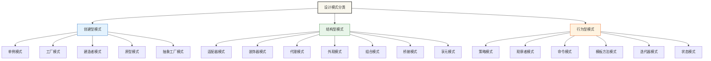

### 10.1 单例模式

<Tabs>
  <TabItem value="overview" label="模式概述" default>
    :::info 单例模式
    单例模式确保一个类在JVM中只有一个实例，并提供全局访问点。
    
    **关键特点**：
    - 私有构造方法，防止外部实例化
    - 静态方法或字段提供全局访问点
    - 线程安全考虑
    - 延迟加载或预加载
    
    **适用场景**：
    - 资源共享（数据库连接、线程池）
    - 全局配置管理
    - 日志记录器
    - 缓存管理
    :::
    
    ```mermaid
    flowchart TD
        A[调用getInstance] --> B{实例存在?}
        B -->|是| C[返回已有实例]
        B -->|否| D[创建新实例]
        D --> E[返回新实例]
    ```
  </TabItem>
  <TabItem value="implementation" label="实现方式">
    <div className="row">
      <div className="col col--6">
        <div className="card">
          <div className="card__header">
            <h4>饿汉式</h4>
          </div>
          <div className="card__body">
            <p><strong>特点</strong>：类加载时创建实例</p>
            <ul>
              <li>✅ 线程安全</li>
              <li>✅ 实现简单</li>
              <li>❌ 不支持延迟加载</li>
              <li>❌ 可能造成资源浪费</li>
            </ul>
            <p><strong>适用</strong>：创建实例开销小，需要保证线程安全</p>
          </div>
        </div>
      </div>
      <div className="col col--6">
        <div className="card">
          <div className="card__header">
            <h4>懒汉式</h4>
          </div>
          <div className="card__body">
            <p><strong>特点</strong>：首次使用时创建实例</p>
            <ul>
              <li>✅ 延迟加载</li>
              <li>✅ 资源利用效率高</li>
              <li>❌ 需要额外处理线程安全</li>
              <li>❌ 实现复杂</li>
            </ul>
            <p><strong>适用</strong>：创建实例开销大，需要延迟加载</p>
          </div>
        </div>
      </div>
    </div>
    
    <div className="row" style={{marginTop: '20px'}}>
      <div className="col col--6">
        <div className="card">
          <div className="card__header">
            <h4>静态内部类</h4>
          </div>
          <div className="card__body">
            <p><strong>特点</strong>：利用类加载机制保证线程安全</p>
            <ul>
              <li>✅ 线程安全</li>
              <li>✅ 延迟加载</li>
              <li>✅ 实现简单</li>
              <li>❌ 不支持参数化实例化</li>
            </ul>
            <p><strong>适用</strong>：最佳实践，兼顾线程安全和延迟加载</p>
          </div>
        </div>
      </div>
      <div className="col col--6">
        <div className="card">
          <div className="card__header">
            <h4>枚举实现</h4>
          </div>
          <div className="card__body">
            <p><strong>特点</strong>：最简洁的实现方式</p>
            <ul>
              <li>✅ 线程安全</li>
              <li>✅ 防止反射和序列化攻击</li>
              <li>✅ 实现最简单</li>
              <li>❌ 不支持延迟加载</li>
            </ul>
            <p><strong>适用</strong>：对抗反射和序列化攻击的场景</p>
          </div>
        </div>
      </div>
    </div>
  </TabItem>
  <TabItem value="code" label="代码示例">
    ```java title="单例模式示例"
    // 1. 饿汉式单例
    public class EagerSingleton {
        // 类加载时创建实例
        private static final EagerSingleton INSTANCE = new EagerSingleton();
        
        // 私有构造方法
        private EagerSingleton() { }
        
        // 公共访问点
        public static EagerSingleton getInstance() {
            return INSTANCE;
        }
    }
    
    // 2. 懒汉式单例（线程安全）
    public class LazySingleton {
        private static volatile LazySingleton instance;
        
        private LazySingleton() { }
        
        public static LazySingleton getInstance() {
            if (instance == null) {
                synchronized (LazySingleton.class) {
                    if (instance == null) {
                        instance = new LazySingleton();
                    }
                }
            }
            return instance;
        }
    }
    
    // 3. 静态内部类单例
    public class StaticInnerSingleton {
        private StaticInnerSingleton() { }
        
        // 静态内部类持有实例
        private static class SingletonHolder {
            private static final StaticInnerSingleton INSTANCE = new StaticInnerSingleton();
        }
        
        public static StaticInnerSingleton getInstance() {
            return SingletonHolder.INSTANCE;
        }
    }
    
    // 4. 枚举单例
    public enum EnumSingleton {
        INSTANCE;
        
        // 可以添加方法和字段
        private String data;
        
        public String getData() {
            return data;
        }
        
        public void setData(String data) {
            this.data = data;
        }
    }
    ```
  </TabItem>
</Tabs>

### 10.2 工厂模式

<Tabs>
  <TabItem value="overview" label="模式概述" default>
    :::info 工厂模式
    工厂模式将对象的创建逻辑封装在工厂类中，使客户端代码与具体类解耦。
    
    **工厂模式家族**：
    - **简单工厂**：由一个工厂类负责创建所有产品
    - **工厂方法**：定义创建对象的接口，子类决定实例化的类
    - **抽象工厂**：创建相关或依赖对象的家族，无需指定具体类
    
    **适用场景**：
    - 不确定使用哪个具体类
    - 创建对象的过程复杂
    - 希望将创建和使用逻辑分离
    - 系统需要更灵活地创建对象
    :::
    
    ```mermaid
    classDiagram
        class Creator {
            <<abstract>>
            +factoryMethod() Product
        }
        
        class ConcreteCreatorA {
            +factoryMethod() Product
        }
        
        class ConcreteCreatorB {
            +factoryMethod() Product
        }
        
        class Product {
            <<interface>>
        }
        
        class ConcreteProductA {
        }
        
        class ConcreteProductB {
        }
        
        Creator <|-- ConcreteCreatorA
        Creator <|-- ConcreteCreatorB
        Product <|.. ConcreteProductA
        Product <|.. ConcreteProductB
        ConcreteCreatorA ..> ConcreteProductA : creates
        ConcreteCreatorB ..> ConcreteProductB : creates
    ```
  </TabItem>
  <TabItem value="simple-factory" label="简单工厂">
    ```java title="简单工厂模式"
    // 产品接口
    interface Vehicle {
        void drive();
    }
    
    // 具体产品
    class Car implements Vehicle {
        @Override
        public void drive() {
            System.out.println("开车中...");
        }
    }
    
    class Motorcycle implements Vehicle {
        @Override
        public void drive() {
            System.out.println("骑摩托车中...");
        }
    }
    
    class Bicycle implements Vehicle {
        @Override
        public void drive() {
            System.out.println("骑自行车中...");
        }
    }
    
    // 简单工厂
    class VehicleFactory {
        public static Vehicle createVehicle(String type) {
            switch (type.toLowerCase()) {
                case "car": return new Car();
                case "motorcycle": return new Motorcycle();
                case "bicycle": return new Bicycle();
                default: throw new IllegalArgumentException("未知的车辆类型: " + type);
            }
        }
    }
    
    // 客户端代码
    public class SimpleFactoryDemo {
        public static void main(String[] args) {
            // 使用工厂创建对象
            Vehicle car = VehicleFactory.createVehicle("car");
            Vehicle motorcycle = VehicleFactory.createVehicle("motorcycle");
            Vehicle bicycle = VehicleFactory.createVehicle("bicycle");
            
            // 使用对象
            car.drive();
            motorcycle.drive();
            bicycle.drive();
        }
    }
    ```
  </TabItem>
  <TabItem value="factory-method" label="工厂方法">
    ```java title="工厂方法模式"
    // 产品接口
    interface Product {
        void use();
    }
    
    // 具体产品
    class ConcreteProductA implements Product {
        @Override
        public void use() {
            System.out.println("使用产品A");
        }
    }
    
    class ConcreteProductB implements Product {
        @Override
        public void use() {
            System.out.println("使用产品B");
        }
    }
    
    // 抽象工厂
    abstract class Creator {
        // 工厂方法
        public abstract Product createProduct();
        
        // 使用产品的方法
        public void anOperation() {
            Product product = createProduct();
            product.use();
        }
    }
    
    // 具体工厂
    class ConcreteCreatorA extends Creator {
        @Override
        public Product createProduct() {
            return new ConcreteProductA();
        }
    }
    
    class ConcreteCreatorB extends Creator {
        @Override
        public Product createProduct() {
            return new ConcreteProductB();
        }
    }
    
    // 客户端代码
    public class FactoryMethodDemo {
        public static void main(String[] args) {
            Creator creatorA = new ConcreteCreatorA();
            Creator creatorB = new ConcreteCreatorB();
            
            // 创建并使用产品
            creatorA.anOperation();
            creatorB.anOperation();
        }
    }
    ```
  </TabItem>
</Tabs>

## 11. 最佳实践和注意事项

### 11.1 设计原则

<div className="row">
  <div className="col col--6">
    <div className="card">
      <div className="card__header">
        <h4>SOLID原则</h4>
      </div>
      <div className="card__body">
        <ul>
          <li><strong>S - 单一职责原则</strong>：一个类应该只有一个引起它变化的原因</li>
          <li><strong>O - 开闭原则</strong>：对扩展开放，对修改关闭</li>
          <li><strong>L - 里氏替换原则</strong>：子类必须能够替换父类</li>
          <li><strong>I - 接口隔离原则</strong>：使用多个专门的接口，而不是单一的总接口</li>
          <li><strong>D - 依赖倒置原则</strong>：依赖于抽象而不是具体实现</li>
        </ul>
      </div>
    </div>
  </div>
  <div className="col col--6">
    <div className="card">
      <div className="card__header">
        <h4>其他设计原则</h4>
      </div>
      <div className="card__body">
        <ul>
          <li><strong>DRY原则</strong>：不要重复自己</li>
          <li><strong>KISS原则</strong>：保持简单明了</li>
          <li><strong>YAGNI原则</strong>：你不会需要它</li>
          <li><strong>组合优于继承</strong>：优先使用对象组合而非继承</li>
          <li><strong>迪米特法则</strong>：最少知识原则</li>
        </ul>
      </div>
    </div>
  </div>
</div>

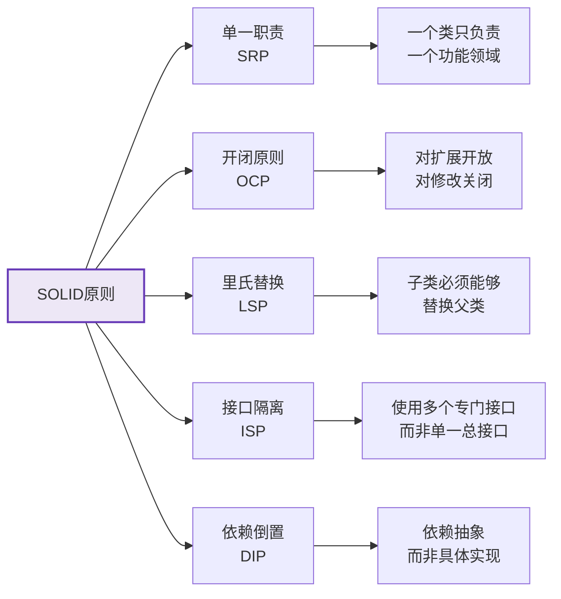

:::tip 设计原则最佳实践
1. **识别变化**：找出系统中可能变化的部分，将它们封装起来
2. **接口分离**：根据客户端需求定义接口，避免客户端依赖不需要的接口
3. **抽象层次**：在适当的抽象层次上工作，不要过度抽象或过度具体
4. **关注点分离**：将不同关注点的代码分开，减少耦合
5. **避免过度设计**：从简单开始，需要时再添加复杂性
:::

### 11.2 常见陷阱和解决方案

<Tabs>
  <TabItem value="inheritance-traps" label="继承陷阱" default>
    <div className="card">
      <div className="card__header">
        <h4>继承的陷阱</h4>
      </div>
      <div className="card__body">
        <ul>
          <li><strong>脆弱基类问题</strong>：修改父类可能意外破坏子类</li>
          <li><strong>继承层次过深</strong>：导致系统难以理解和维护</li>
          <li><strong>方法爆炸</strong>：基类累积过多方法，变得臃肿</li>
          <li><strong>多重继承冲突</strong>：接口中默认方法的冲突</li>
          <li><strong>横切关注点</strong>：有些功能难以通过继承实现</li>
        </ul>
      </div>
    </div>
    
    **解决方案**：
    1. **使用组合**：将功能委托给组合对象，而不是继承
    2. **接口继承**：继承接口而非实现
    3. **装饰器模式**：动态添加功能，而不是通过继承
    4. **使用工具类**：将共用功能放在工具类中
    5. **控制继承深度**：保持继承层次不超过3层
  </TabItem>
  <TabItem value="encapsulation-traps" label="封装陷阱">
    <div className="card">
      <div className="card__header">
        <h4>封装的陷阱</h4>
      </div>
      <div className="card__body">
        <ul>
          <li><strong>过度暴露</strong>：暴露过多内部实现细节</li>
          <li><strong>Getter/Setter滥用</strong>：为每个字段都添加访问器</li>
          <li><strong>内部状态泄露</strong>：返回可变对象的引用</li>
          <li><strong>不变性破坏</strong>：外部可以修改对象状态</li>
          <li><strong>封装层次不一致</strong>：类的部分功能高度封装，部分又完全开放</li>
        </ul>
      </div>
    </div>
    
    **解决方案**：
    1. **最小特权原则**：仅暴露必要的成员
    2. **返回防御性副本**：返回可变对象的副本而非引用
    3. **不可变对象**：创建不可变类，状态无法修改
    4. **封装集合**：不直接暴露集合字段
    5. **使用构建器模式**：控制对象创建过程
  </TabItem>
  <TabItem value="polymorphism-traps" label="多态陷阱">
    <div className="card">
      <div className="card__header">
        <h4>多态的陷阱</h4>
      </div>
      <div className="card__body">
        <ul>
          <li><strong>类型转换错误</strong>：不安全的向下转型</li>
          <li><strong>重写混乱</strong>：混淆重写和重载</li>
          <li><strong>静态方法冲突</strong>：尝试多态调用静态方法</li>
          <li><strong>构造方法中调用多态方法</strong>：导致未初始化字段被访问</li>
          <li><strong>equals和hashCode不一致</strong>：导致集合操作异常</li>
        </ul>
      </div>
    </div>
    
    **解决方案**：
    1. **使用instanceof检查**：转型前检查类型
    2. **使用@Override注解**：明确标记重写方法
    3. **避免在构造方法中调用可重写方法**
    4. **统一重写equals和hashCode方法**
    5. **使用泛型减少类型转换**
  </TabItem>
</Tabs>

### 11.3 性能优化建议

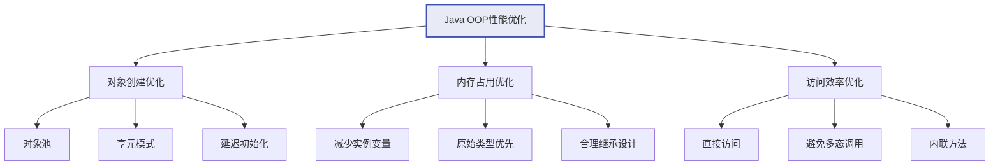

<div className="row">
  <div className="col col--4">
    <div className="card">
      <div className="card__header">
        <h4>对象创建</h4>
      </div>
      <div className="card__body">
        <ul>
          <li>对象池化重用频繁创建的对象</li>
          <li>使用享元模式共享不可变对象</li>
          <li>采用延迟初始化策略</li>
          <li>减少临时对象的创建</li>
          <li>合理使用StringBuilder</li>
        </ul>
      </div>
    </div>
  </div>
  <div className="col col--4">
    <div className="card">
      <div className="card__header">
        <h4>内存占用</h4>
      </div>
      <div className="card__body">
        <ul>
          <li>优先使用基本类型而非包装类</li>
          <li>减少实例变量数量</li>
          <li>使用数组替代集合（适用场景）</li>
          <li>避免过深的继承层次</li>
          <li>重用常量和静态资源</li>
        </ul>
      </div>
    </div>
  </div>
  <div className="col col--4">
    <div className="card">
      <div className="card__header">
        <h4>访问效率</h4>
      </div>
      <div className="card__body">
        <ul>
          <li>避免过度使用getter和setter</li>
          <li>减少不必要的多态调用</li>
          <li>使用final修饰不变方法</li>
          <li>考虑方法内联</li>
          <li>缓存频繁计算的结果</li>
        </ul>
      </div>
    </div>
  </div>
</div>

## 13. 最佳实践总结

:::tip 面向对象编程最佳实践
1. **设计优先**：先考虑对象职责和交互，再考虑实现
2. **封装内部状态**：不要暴露内部细节，提供良好的接口
3. **组合优于继承**：优先使用对象组合而非继承关系
4. **接口优于抽象类**：尽量使用接口定义行为
5. **遵循SOLID原则**：写出健壮、可维护的代码
6. **保持简单**：不要过度设计，保持代码简单明了
7. **类职责单一**：每个类只负责一个功能领域
8. **正确使用访问修饰符**：使用最小必要的可见性
9. **编写可测试代码**：设计时考虑可测试性
10. **重视文档和注释**：为公共API提供详细文档
:::

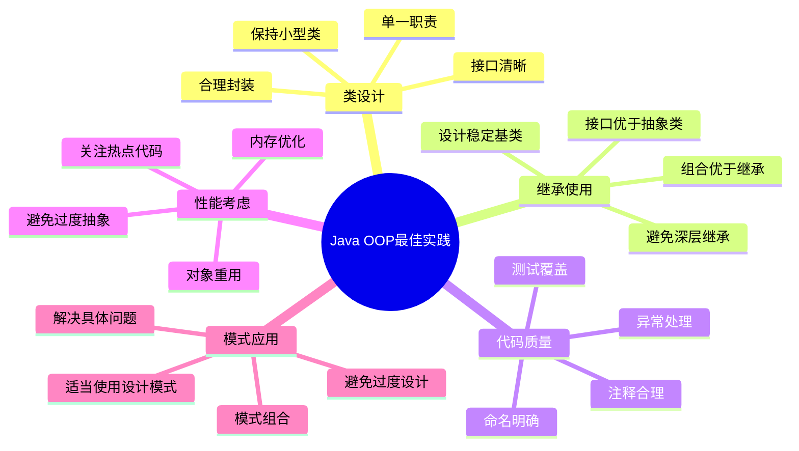

恭喜你！现在你已经全面掌握了Java面向对象编程的核心概念和最佳实践。通过理解封装、继承、多态和抽象，以及掌握内部类、枚举、设计模式等高级特性，你已经具备了使用Java进行面向对象开发的能力。记住，面向对象编程是一种思维方式，熟练掌握它不仅能帮助你写出优雅的代码，还能让你更好地理解和使用Java生态系统中的各种框架和库。继续练习，不断应用这些原则，你将成为一名出色的Java开发者！

## 14. 面试题精选

### 14.1 面向对象编程的四大特征是什么？请详细解释。

**答案：** 面向对象编程的四大特征是封装、继承、多态和抽象：

1. **封装（Encapsulation）**：
   - 定义：将数据和操作数据的方法绑定在一起，对外部隐藏实现细节
   - 实现方式：通过访问修饰符（private、protected、public）和getter/setter方法
   - 优势：提高安全性、降低耦合度、提高代码可维护性
   - 示例：`private int id; public int getId() { return id; }`

2. **继承（Inheritance）**：
   - 定义：子类继承父类的属性和方法，实现代码重用
   - 实现方式：通过extends关键字，Java只支持单继承，通过接口可以实现多继承效果
   - 优势：代码复用、构建类的层次结构、支持多态
   - 示例：`public class Dog extends Animal { }`

3. **多态（Polymorphism）**：
   - 定义：同一个操作可以作用于不同的对象，产生不同的结果
   - 实现方式：方法重载（编译时多态）和方法重写（运行时多态）
   - 优势：提高代码的灵活性和可扩展性、降低耦合度
   - 示例：`Animal animal = new Dog(); animal.makeSound();`

4. **抽象（Abstraction）**：
   - 定义：提取共同特征，隐藏复杂的实现细节
   - 实现方式：通过抽象类和接口
   - 优势：简化复杂系统、提高代码可复用性
   - 示例：`abstract class Shape { abstract void draw(); }`

### 14.2 Java中方法重载和方法重写的区别是什么？

**答案：** 方法重载（Overloading）和方法重写（Overriding）的主要区别：

| 特点 | 方法重载 | 方法重写 |
|------|---------|---------|
| **定义** | 同一个类中定义多个同名但参数不同的方法 | 子类重新实现父类中已有的方法 |
| **参数** | 必须不同（类型、个数、顺序） | 必须相同 |
| **返回类型** | 可以不同 | 必须相同或是父类返回类型的子类型 |
| **访问修饰符** | 可以不同 | 不能比父类方法更严格 |
| **异常** | 可以不同 | 不能抛出比父类方法更多的异常 |
| **绑定** | 编译时绑定（静态绑定） | 运行时绑定（动态绑定） |
| **多态体现** | 编译时多态 | 运行时多态 |

示例：
```java
// 方法重载
class Calculator {
    int add(int a, int b) { return a + b; }
    double add(double a, double b) { return a + b; }
    int add(int a, int b, int c) { return a + b + c; }
}

// 方法重写
class Animal {
    void makeSound() { System.out.println("Animal sound"); }
}

class Dog extends Animal {
    @Override
    void makeSound() { System.out.println("Woof"); }
}
```

### 14.3 Java中的抽象类和接口有什么区别？何时使用抽象类，何时使用接口？

**答案：** 抽象类和接口的主要区别：

| 特点 | 抽象类 | 接口 |
|------|--------|------|
| **关键字** | abstract | interface |
| **实现方法** | 可以有具体方法实现 | 只能有抽象方法(Java 8+可以有默认和静态方法) |
| **成员变量** | 可以有实例变量 | 只能有常量(public static final) |
| **构造器** | 可以有构造器 | 不能有构造器 |
| **继承** | 单继承，只能继承一个类 | 可以实现多个接口 |
| **访问修饰符** | 可以用所有访问修饰符 | 方法默认public |
| **设计目的** | 表示"是什么"关系 | 表示"能做什么"关系 |

**使用抽象类的场景**：
1. 需要在几个相关类之间共享代码
2. 需要访问和修改非final成员变量
3. 类之间存在"是一种"的关系，且有公共行为
4. 想要声明非public成员

**使用接口的场景**：
1. 不相关的类需要实现相同的行为
2. 需要指定特定行为但不关心具体实现
3. 需要利用多继承的优势
4. 需要对行为进行解耦

### 14.4 Java中的访问修饰符有哪些？它们的访问范围分别是什么？

**答案：** Java中有四种访问修饰符，按照访问范围从小到大依次是：

1. **private**：
   - 范围：仅在声明它的类内部可见
   - 适用于：变量、方法、构造器、内部类
   - 不适用于：类(外部类)、接口、接口的方法和变量

2. **默认（无修饰符）**：
   - 范围：同一包内可见
   - 适用于：类、接口、变量、方法、构造器

3. **protected**：
   - 范围：同一包内和不同包的子类可见
   - 适用于：变量、方法、构造器、内部类
   - 不适用于：类(外部类)、接口

4. **public**：
   - 范围：所有类可见
   - 适用于：类、接口、变量、方法、构造器

访问权限对比：

| 修饰符 | 同一类 | 同一包 | 不同包子类 | 不同包非子类 |
|--------|-------|-------|-----------|------------|
| private | 可访问 | 不可访问 | 不可访问 | 不可访问 |
| 默认 | 可访问 | 可访问 | 不可访问 | 不可访问 |
| protected | 可访问 | 可访问 | 可访问 | 不可访问 |
| public | 可访问 | 可访问 | 可访问 | 可访问 |

### 14.5 什么是组合（Composition）？为什么说组合优于继承？

**答案：** 组合是一种类之间的关系，它表示"有一个"（has-a）的关系，即一个类包含另一个类的实例作为其成员变量。

**组合优于继承的原因**：

1. **更高的灵活性**：组合可以在运行时动态改变行为，而继承关系在编译时就已确定

2. **避免紧耦合**：继承创建了紧耦合，子类依赖于父类的实现；而组合通过接口交互，降低了耦合度

3. **防止继承层次过深**：过深的继承层次会导致系统难以理解和维护

4. **更好的封装性**：组合可以只暴露必要的接口，而继承会暴露所有可访问的父类方法

5. **符合开闭原则**：组合更容易扩展功能而不修改现有代码

示例：
```java
// 使用继承
class Bird extends Animal {
    void fly() { ... }
}

// 使用组合
class Bird {
    private Animal animal;  // 组合
    private Wings wings;    // 组合
    
    void makeSound() {
        animal.makeSound();
    }
    
    void fly() {
        wings.flap();
    }
}
```

在实际开发中，应优先考虑使用组合，只有在确实存在"是一个"关系且需要利用多态性时才使用继承。