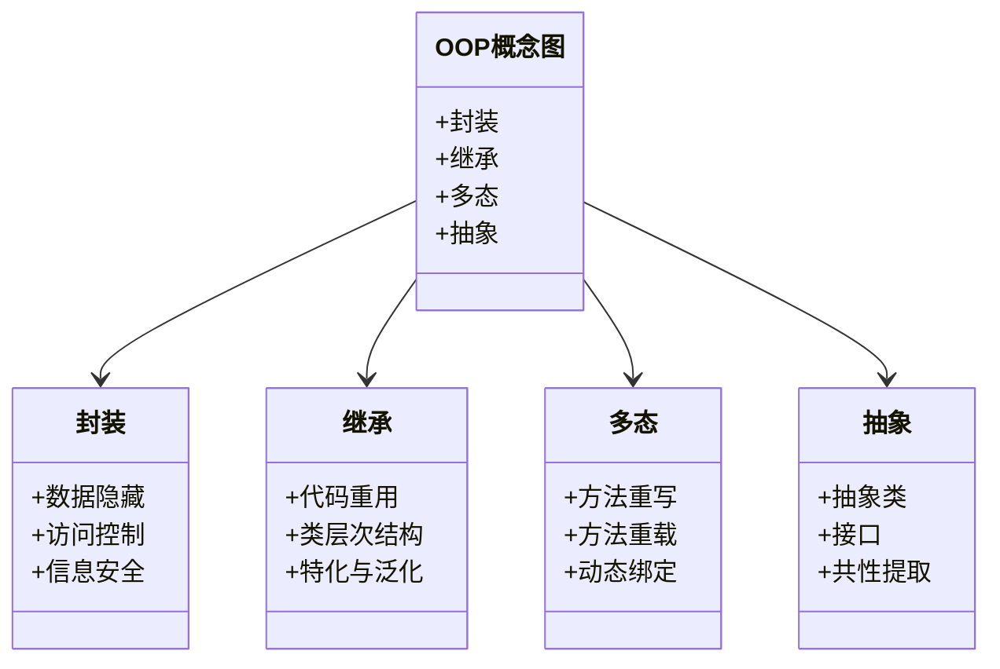
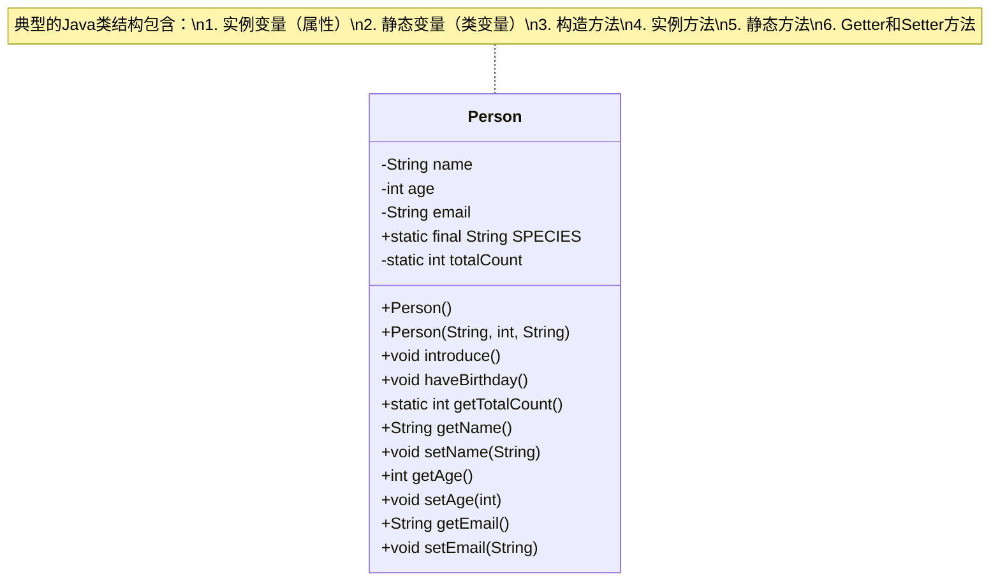
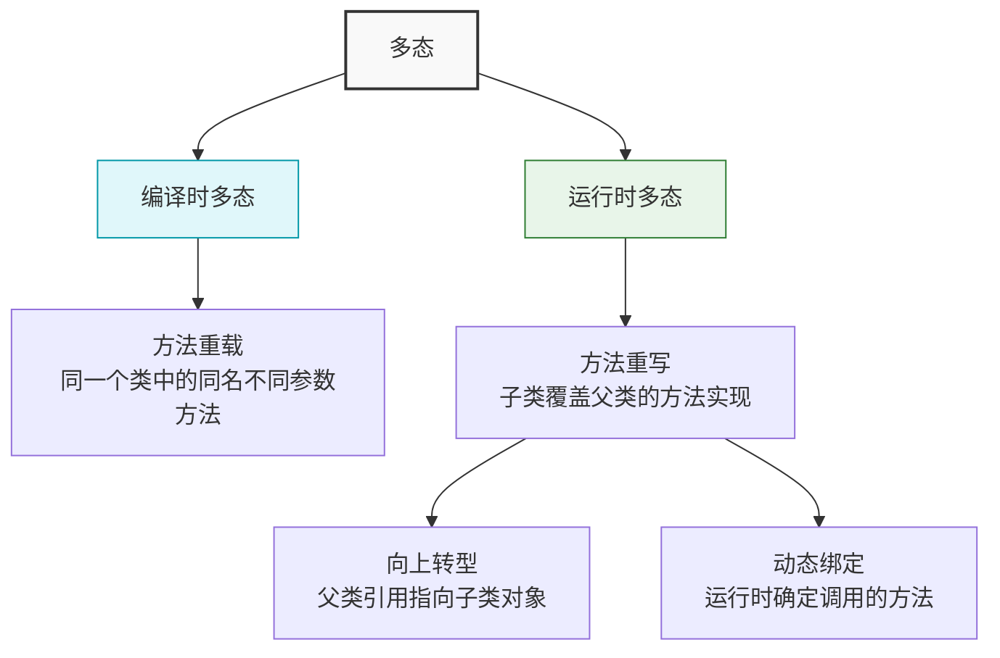
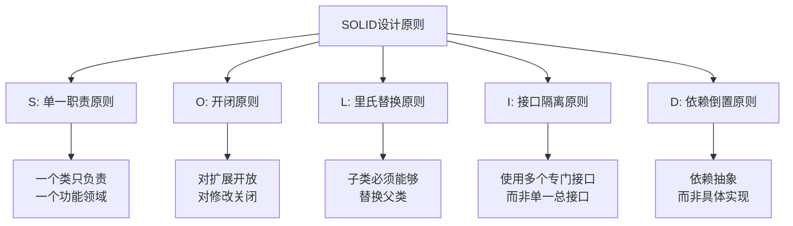
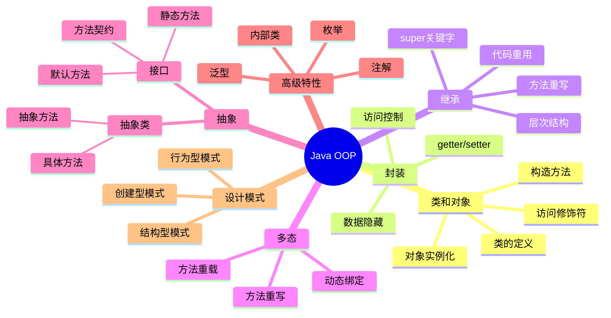

import Tabs from '@theme/Tabs';
import TabItem from '@theme/TabItem';
import TOCInline from '@theme/TOCInline';

# Java 面向对象编程详解

面向对象编程（Object-Oriented Programming，OOP）是Java语言的核心特性，它提供了一种组织和管理代码的方法，通过将数据和操作数据的方法封装在对象中来实现。

:::info 本文内容概览
<TOCInline toc={toc} />
:::

:::tip 核心概念
面向对象编程 = 封装 + 继承 + 多态 + 抽象
:::



## 1. 面向对象编程基础

### 1.1 什么是面向对象编程

面向对象编程是一种编程范式，它将现实世界中的事物抽象为对象，每个对象都有自己的属性和行为。Java完全支持面向对象编程，提供了丰富的语法特性来实现OOP概念。

#### 核心概念

<Tabs>
  <TabItem value="table" label="概念总览" default>
| 概念 | 说明 | 特点 |
|------|------|------|
| **封装（Encapsulation）** | 将数据和方法绑定在一起，隐藏内部实现细节 | 数据隐藏、访问控制 |
| **继承（Inheritance）** | 子类可以继承父类的属性和方法 | 代码重用、层次结构 |
| **多态（Polymorphism）** | 同一个接口可以有多种不同的实现 | 方法重载、方法重写 |
| **抽象（Abstraction）** | 提取共同特征，隐藏复杂细节 | 接口定义、抽象类 |
  </TabItem>
  <TabItem value="encapsulation" label="封装">
    :::info 封装
    **封装**是面向对象编程的基本特性，它通过将数据和对数据的操作组合在一个单元（类）内部，并隐藏对象的内部状态和实现细节，只对外提供有限的接口。
    
    **关键机制**：
    - **访问修饰符**：`private`、`protected`、默认、`public`
    - **getter/setter方法**：控制对私有属性的访问
    - **信息隐藏**：隐藏实现细节，只暴露必要的接口
    
    **优势**：
    - 提高代码安全性
    - 简化接口，降低复杂度
    - 支持可维护性和灵活性
    :::
  </TabItem>
  <TabItem value="inheritance" label="继承">
    :::info 继承
    **继承**允许一个类（子类）获取另一个类（父类）的属性和方法，形成类的层次结构，实现代码重用。
    
    **关键机制**：
    - 使用`extends`关键字实现继承
    - 子类可以访问父类的非私有成员
    - 可以通过`super`关键字调用父类方法或构造器
    
    **优势**：
    - 代码重用
    - 建立类的层次结构
    - 实现"是一种"关系
    :::
  </TabItem>
  <TabItem value="polymorphism" label="多态">
    :::info 多态
    **多态**允许不同的对象对同一消息作出不同的响应，体现为"一个接口，多种实现"。
    
    **实现方式**：
    - **方法重写**：子类重写父类的方法，覆盖原有实现
    - **方法重载**：同一个类中定义多个同名但参数不同的方法
    - **接口实现**：不同类实现同一接口的不同行为
    
    **优势**：
    - 提高代码的灵活性和可扩展性
    - 简化客户端代码
    - 支持"开闭原则"
    :::
  </TabItem>
  <TabItem value="abstraction" label="抽象">
    :::info 抽象
    **抽象**是提取事物共同特征而忽略非本质细节的过程，在Java中通过抽象类和接口实现。
    
    **实现方式**：
    - **抽象类**：使用`abstract`关键字声明，可以包含抽象方法和具体方法
    - **接口**：使用`interface`关键字声明，定义一组方法规范
    
    **优势**：
    - 分离接口和实现
    - 提供设计蓝图
    - 支持程序的可扩展性
    :::
  </TabItem>
</Tabs>

## 2. 类和对象基础

### 2.1 类的定义

类是对象的模板，定义了对象的属性和行为。下面是一个标准Java类的结构：



```java title="基本类定义示例"
public class Person {
    // 实例变量（属性）
    private String name;
    private int age;
    private String email;
    
    // 类变量（静态变量）
    public static final String SPECIES = "Homo sapiens";
    private static int totalCount = 0;
    
    // 构造方法
    public Person() {
        this("Unknown", 0, "");
    }
    
    public Person(String name, int age, String email) {
        this.name = name;
        this.age = age;
        this.email = email;
        totalCount++; // 增加总人数
    }
    
    // 实例方法
    public void introduce() {
        System.out.println("我叫 " + name + "，今年 " + age + " 岁");
    }
    
    public void haveBirthday() {
        age++;
        System.out.println("生日快乐！现在 " + name + " 已经 " + age + " 岁了");
    }
    
    // 静态方法
    public static int getTotalCount() {
        return totalCount;
    }
    
    // Getter和Setter方法
    public String getName() {
        return name;
    }
    
    public void setName(String name) {
        this.name = name;
    }
    
    public int getAge() {
        return age;
    }
    
    public void setAge(int age) {
        if (age >= 0 && age <= 150) {
            this.age = age;
        } else {
            System.err.println("年龄必须在0-150之间");
        }
    }
    
    public String getEmail() {
        return email;
    }
    
    public void setEmail(String email) {
        this.email = email;
    }
}
```

### 2.2 对象的创建和使用

对象是类的实例，通过 `new` 关键字创建：

```java title="对象创建和使用示例"
public class ObjectDemo {
    public static void main(String[] args) {
        // 创建对象
        Person person1 = new Person("张三", 25, "zhangsan@example.com");
        Person person2 = new Person("李四", 30, "lisi@example.com");
        
        // 调用实例方法
        person1.introduce();
        person2.introduce();
        
        // 调用静态方法
        System.out.println("总人数: " + Person.getTotalCount());
        
        // 修改对象状态
        person1.haveBirthday();
        person1.setAge(26);
        
        // 访问静态常量
        System.out.println("人类学名: " + Person.SPECIES);
    }
}
```

### 2.3 构造方法详解

构造方法是创建对象时自动调用的特殊方法：

```java title="构造方法详解示例"
public class ConstructorDemo {
    public static void main(String[] args) {
        // 调用无参构造方法
        Person p1 = new Person();
        p1.introduce(); // 输出默认值
        
        // 调用有参构造方法
        Person p2 = new Person("王五", 28, "wangwu@example.com");
        p2.introduce();
        
        // 链式构造方法调用
        Person p3 = new Person("赵六", 35, "zhaoliu@example.com");
        p3.introduce();
    }
}

class Person {
    private String name;
    private int age;
    private String email;
    
    // 默认构造方法
    public Person() {
        // 调用其他构造方法
        this("Unknown", 0, "");
    }
    
    // 主要构造方法
    public Person(String name, int age, String email) {
        this.name = name;
        this.age = age;
        this.email = email;
        System.out.println("创建了一个新的Person对象: " + name);
    }
    
    // 重载构造方法
    public Person(String name, int age) {
        this(name, age, ""); // 调用主要构造方法
    }
    
    public Person(String name) {
        this(name, 0, ""); // 调用主要构造方法
    }
    
    public void introduce() {
        System.out.println("我叫 " + name + "，今年 " + age + " 岁，邮箱: " + email);
    }
}
```

### 2.4 访问修饰符

Java提供了四种访问修饰符来控制类成员的可见性：

```java title="访问修饰符示例"
public class AccessModifierDemo {
    public static void main(String[] args) {
        AccessExample obj = new AccessExample();
        
        // 可以访问public成员
        obj.publicField = "公共字段";
        obj.publicMethod();
        
        // 可以访问protected成员（同包内）
        obj.protectedField = "受保护字段";
        obj.protectedMethod();
        
        // 可以访问默认访问权限成员（同包内）
        obj.defaultField = "默认字段";
        obj.defaultMethod();
        
        // 不能直接访问private成员
        // obj.privateField = "私有字段"; // 编译错误
        // obj.privateMethod(); // 编译错误
        
        // 通过公共方法访问私有成员
        obj.setPrivateField("通过公共方法设置私有字段");
        System.out.println("私有字段值: " + obj.getPrivateField());
    }
}

class AccessExample {
    // public: 任何地方都可以访问
    public String publicField;
    public void publicMethod() {
        System.out.println("公共方法");
    }
    
    // protected: 同包内和子类可以访问
    protected String protectedField;
    protected void protectedMethod() {
        System.out.println("受保护方法");
    }
    
    // 默认（无修饰符）: 同包内可以访问
    String defaultField;
    void defaultMethod() {
        System.out.println("默认方法");
    }
    
    // private: 只有本类内部可以访问
    private String privateField;
    private void privateMethod() {
        System.out.println("私有方法");
    }
    
    // 公共方法访问私有字段
    public void setPrivateField(String value) {
        this.privateField = value;
    }
    
    public String getPrivateField() {
        return privateField;
    }
}
``` 

## 3. 封装（Encapsulation）

封装是面向对象编程的核心概念之一，它将数据和方法绑定在一起，隐藏内部实现细节，只提供必要的接口。

### 3.1 封装的原则

```java title="封装原则示例"
public class BankAccount {
    // 私有字段，外部无法直接访问
    private String accountNumber;
    private double balance;
    private String ownerName;
    private static final double MIN_BALANCE = 0.0;
    
    // 构造方法
    public BankAccount(String accountNumber, String ownerName, double initialBalance) {
        this.accountNumber = accountNumber;
        this.ownerName = ownerName;
        // 通过setter方法设置余额，确保数据验证
        setBalance(initialBalance);
    }
    
    // 公共接口方法
    public boolean deposit(double amount) {
        if (amount > 0) {
            balance += amount;
            System.out.println("存款成功: +" + amount + "，当前余额: " + balance);
            return true;
        } else {
            System.err.println("存款金额必须大于0");
            return false;
        }
    }
    
    public boolean withdraw(double amount) {
        if (amount > 0 && (balance - amount) >= MIN_BALANCE) {
            balance -= amount;
            System.out.println("取款成功: -" + amount + "，当前余额: " + balance);
            return true;
        } else {
            System.err.println("取款失败: 余额不足或金额无效");
            return false;
        }
    }
    
    // 只读访问器
    public String getAccountNumber() {
        return accountNumber;
    }
    
    public double getBalance() {
        return balance;
    }
    
    public String getOwnerName() {
        return ownerName;
    }
    
    // 受控的setter方法
    private void setBalance(double balance) {
        if (balance >= MIN_BALANCE) {
            this.balance = balance;
        } else {
            this.balance = MIN_BALANCE;
            System.err.println("余额不能为负数，已设置为0");
        }
    }
    
    // 业务逻辑方法
    public void transfer(BankAccount target, double amount) {
        if (this.withdraw(amount)) {
            target.deposit(amount);
            System.out.println("转账成功: " + amount + " 从 " + accountNumber + " 到 " + target.accountNumber);
        } else {
            System.err.println("转账失败");
        }
    }
    
    // 账户信息展示
    public void displayInfo() {
        System.out.println("账户信息:");
        System.out.println("  账号: " + accountNumber);
        System.out.println("  户名: " + ownerName);
        System.out.println("  余额: " + balance);
    }
}
```

### 3.2 封装的测试

```java title="封装测试示例"
public class EncapsulationDemo {
    public static void main(String[] args) {
        // 创建银行账户
        BankAccount account1 = new BankAccount("001", "张三", 1000.0);
        BankAccount account2 = new BankAccount("002", "李四", 500.0);
        
        // 显示初始信息
        account1.displayInfo();
        account2.displayInfo();
        
        // 进行各种操作
        account1.deposit(500.0);  // 存款
        account1.withdraw(200.0); // 取款
        account1.transfer(account2, 300.0); // 转账
        
        // 尝试非法操作
        account1.deposit(-100.0);  // 负数存款
        account1.withdraw(2000.0); // 超额取款
        
        // 显示最终信息
        System.out.println("\n最终账户状态:");
        account1.displayInfo();
        account2.displayInfo();
        
        // 注意：无法直接访问私有字段
        // System.out.println(account1.balance); // 编译错误
        // account1.balance = -1000; // 编译错误
    }
}
```

## 4. 继承（Inheritance）

继承允许子类继承父类的属性和方法，实现代码重用和层次结构。

### 4.1 基本继承

```java title="基本继承示例"
// 父类：动物
public class Animal {
    protected String name;
    protected int age;
    protected String species;
    
    public Animal(String name, int age, String species) {
        this.name = name;
        this.age = age;
        this.species = species;
    }
    
    public void eat() {
        System.out.println(name + " 正在吃东西");
    }
    
    public void sleep() {
        System.out.println(name + " 正在睡觉");
    }
    
    public void makeSound() {
        System.out.println(name + " 发出声音");
    }
    
    public void displayInfo() {
        System.out.println("动物信息:");
        System.out.println("  名称: " + name);
        System.out.println("  年龄: " + age);
        System.out.println("  物种: " + species);
    }
}

// 子类：狗
public class Dog extends Animal {
    private String breed;
    private boolean isVaccinated;
    
    public Dog(String name, int age, String breed, boolean isVaccinated) {
        // 调用父类构造方法
        super(name, age, "犬科");
        this.breed = breed;
        this.isVaccinated = isVaccinated;
    }
    
    // 重写父类方法
    @Override
    public void makeSound() {
        System.out.println(name + " 汪汪叫");
    }
    
    // 子类特有方法
    public void wagTail() {
        System.out.println(name + " 摇尾巴");
    }
    
    public void fetch() {
        System.out.println(name + " 捡球");
    }
    
    // 重写显示信息方法
    @Override
    public void displayInfo() {
        super.displayInfo(); // 调用父类方法
        System.out.println("  品种: " + breed);
        System.out.println("  已接种: " + (isVaccinated ? "是" : "否"));
    }
    
    // Getter方法
    public String getBreed() {
        return breed;
    }
    
    public boolean isVaccinated() {
        return isVaccinated;
    }
}

// 子类：猫
public class Cat extends Animal {
    private String color;
    private boolean isIndoor;
    
    public Cat(String name, int age, String color, boolean isIndoor) {
        super(name, age, "猫科");
        this.color = color;
        this.isIndoor = isIndoor;
    }
    
    @Override
    public void makeSound() {
        System.out.println(name + " 喵喵叫");
    }
    
    public void purr() {
        System.out.println(name + " 发出呼噜声");
    }
    
    public void climb() {
        System.out.println(name + " 爬树");
    }
    
    @Override
    public void displayInfo() {
        super.displayInfo();
        System.out.println("  颜色: " + color);
        System.out.println("  室内猫: " + (isIndoor ? "是" : "否"));
    }
    
    public String getColor() {
        return color;
    }
    
    public boolean isIndoor() {
        return isIndoor;
    }
}
```

### 4.2 继承的测试

```java title="继承测试示例"
public class InheritanceDemo {
    public static void main(String[] args) {
        // 创建动物对象
        Animal animal = new Animal("未知动物", 5, "未知");
        animal.eat();
        animal.sleep();
        animal.makeSound();
        animal.displayInfo();
        
        System.out.println();
        
        // 创建狗对象
        Dog dog = new Dog("旺财", 3, "金毛", true);
        dog.eat();        // 继承自父类
        dog.sleep();      // 继承自父类
        dog.makeSound();  // 重写的父类方法
        dog.wagTail();    // 子类特有方法
        dog.fetch();      // 子类特有方法
        dog.displayInfo(); // 重写的父类方法
        
        System.out.println();
        
        // 创建猫对象
        Cat cat = new Cat("咪咪", 2, "橘色", false);
        cat.eat();        // 继承自父类
        cat.sleep();      // 继承自父类
        cat.makeSound();  // 重写的父类方法
        cat.purr();       // 子类特有方法
        cat.climb();      // 子类特有方法
        cat.displayInfo(); // 重写的父类方法
        
        System.out.println();
        
        // 多态：父类引用指向子类对象
        Animal[] animals = {dog, cat};
        for (Animal a : animals) {
            System.out.println("处理动物: " + a.name);
            a.makeSound(); // 调用重写的方法
            a.eat();       // 调用继承的方法
        }
    }
}
```

### 4.3 方法重写（Override）

方法重写允许子类提供父类方法的特定实现：

```java title="方法重写示例"
public class MethodOverrideDemo {
    public static void main(String[] args) {
        // 创建不同形状
        Shape circle = new Circle(5.0);
        Shape rectangle = new Rectangle(4.0, 6.0);
        Shape triangle = new Triangle(3.0, 4.0, 5.0);
        
        // 多态调用
        Shape[] shapes = {circle, rectangle, triangle};
        for (Shape shape : shapes) {
            System.out.println("形状: " + shape.getClass().getSimpleName());
            System.out.println("  面积: " + shape.calculateArea());
            System.out.println("  周长: " + shape.calculatePerimeter());
            shape.displayInfo();
            System.out.println();
        }
    }
}

// 抽象父类
abstract class Shape {
    protected String name;
    
    public Shape(String name) {
        this.name = name;
    }
    
    // 抽象方法，子类必须实现
    public abstract double calculateArea();
    public abstract double calculatePerimeter();
    
    // 具体方法，子类可以继承
    public void displayInfo() {
        System.out.println("  名称: " + name);
        System.out.println("  面积: " + calculateArea());
        System.out.println("  周长: " + calculatePerimeter());
    }
}

// 圆形
class Circle extends Shape {
    private double radius;
    
    public Circle(double radius) {
        super("圆形");
        this.radius = radius;
    }
    
    @Override
    public double calculateArea() {
        return Math.PI * radius * radius;
    }
    
    @Override
    public double calculatePerimeter() {
        return 2 * Math.PI * radius;
    }
}

// 矩形
class Rectangle extends Shape {
    private double width;
    private double height;
    
    public Rectangle(double width, double height) {
        super("矩形");
        this.width = width;
        this.height = height;
    }
    
    @Override
    public double calculateArea() {
        return width * height;
    }
    
    @Override
    public double calculatePerimeter() {
        return 2 * (width + height);
    }
}

// 三角形
class Triangle extends Shape {
    private double side1, side2, side3;
    
    public Triangle(double side1, double side2, double side3) {
        super("三角形");
        this.side1 = side1;
        this.side2 = side2;
        this.side3 = side3;
    }
    
    @Override
    public double calculateArea() {
        // 海伦公式
        double s = (side1 + side2 + side3) / 2;
        return Math.sqrt(s * (s - side1) * (s - side2) * (s - side3));
    }
    
    @Override
    public double calculatePerimeter() {
        return side1 + side2 + side3;
    }
}
```

## 5. 多态（Polymorphism）

多态是面向对象编程的重要特性，它允许同一个接口有多种不同的实现。



<Tabs>
  <TabItem value="overview" label="多态概述" default>
    :::info 多态的本质
    多态的核心思想是"一个接口，多种实现"。在Java中，多态主要通过继承和接口实现。多态使得代码更具灵活性、可扩展性和可维护性。

    **多态的关键机制**：
    - 继承或接口实现
    - 方法的重写（覆盖）
    - 向上转型（父类引用指向子类对象）
    - 动态绑定（运行时决定调用哪个方法）
    :::

    多态可分为两种主要类型：
    1. **编译时多态**（静态多态）：通过方法重载实现
    2. **运行时多态**（动态多态）：通过方法重写和继承实现
  </TabItem>
  <TabItem value="compile" label="编译时多态">
    编译时多态（又称静态多态）通过方法重载实现，编译器在编译时根据方法签名（方法名和参数列表）决定调用哪个方法。

    **关键特点**：
    - 发生在同一个类中
    - 方法名相同，参数列表不同（类型、数量或顺序）
    - 返回类型可以相同也可以不同
    - 在编译阶段即可确定调用哪个方法
  </TabItem>
  <TabItem value="runtime" label="运行时多态">
    运行时多态（又称动态多态）通过方法重写和继承实现，JVM在运行时根据对象的实际类型决定调用哪个方法。

    **关键特点**：
    - 必须有继承关系
    - 子类重写父类的方法
    - 父类引用指向子类对象
    - 只有在运行时才能确定调用哪个方法
    - 是Java OOP的核心机制之一
  </TabItem>
</Tabs>

### 5.1 编译时多态（方法重载）

```java title="方法重载示例"
public class MethodOverloadingDemo {
    public static void main(String[] args) {
        Calculator calc = new Calculator();
        
        // 调用不同的重载方法
        System.out.println("整数加法: " + calc.add(5, 3));
        System.out.println("浮点数加法: " + calc.add(5.5, 3.2));
        System.out.println("三个整数加法: " + calc.add(1, 2, 3));
        System.out.println("字符串连接: " + calc.add("Hello", "World"));
        
        // 自动类型转换
        System.out.println("混合类型: " + calc.add(5, 3.5));
        System.out.println("字符加法: " + calc.add('A', 1));
    }
}

class Calculator {
    // 整数加法
    public int add(int a, int b) {
        System.out.println("调用 int add(int, int)");
        return a + b;
    }
    
    // 浮点数加法
    public double add(double a, double b) {
        System.out.println("调用 double add(double, double)");
        return a + b;
    }
    
    // 三个整数加法
    public int add(int a, int b, int c) {
        System.out.println("调用 int add(int, int, int)");
        return a + b + c;
    }
    
    // 字符串连接
    public String add(String a, String b) {
        System.out.println("调用 String add(String, String)");
        return a + b;
    }
    
    // 混合类型（自动类型转换）
    public double add(int a, double b) {
        System.out.println("调用 double add(int, double)");
        return a + b;
    }
    
    // 字符加法
    public int add(char a, int b) {
        System.out.println("调用 int add(char, int)");
        return a + b;
    }
}
```

### 5.2 运行时多态（方法重写）

```java title="运行时多态示例"
public class RuntimePolymorphismDemo {
    public static void main(String[] args) {
        // 父类引用指向子类对象
        Animal myDog = new Dog("旺财", 3, "金毛", true);
        Animal myCat = new Cat("咪咪", 2, "橘色", false);
        
        // 运行时多态：调用的是子类重写的方法
        System.out.println("狗的声音:");
        myDog.makeSound(); // 调用Dog类的makeSound方法
        
        System.out.println("猫的声音:");
        myCat.makeSound(); // 调用Cat类的makeSound方法
        
        // 多态数组
        Animal[] animals = {
            new Dog("小黑", 2, "拉布拉多", true),
            new Cat("小花", 1, "白色", true),
            new Dog("大黄", 4, "柴犬", false)
        };
        
        System.out.println("\n动物声音合唱:");
        for (Animal animal : animals) {
            animal.makeSound(); // 根据实际对象类型调用相应方法
        }
        
        // 多态在方法参数中的应用
        AnimalTrainer trainer = new AnimalTrainer();
        trainer.train(myDog);
        trainer.train(myCat);
    }
}

class AnimalTrainer {
    public void train(Animal animal) {
        System.out.println("训练动物: " + animal.name);
        animal.makeSound(); // 多态调用
        
        // 类型检查和转换
        if (animal instanceof Dog) {
            Dog dog = (Dog) animal;
            dog.fetch();
        } else if (animal instanceof Cat) {
            Cat cat = (Cat) animal;
            cat.climb();
        }
    }
}
```

## 6. 抽象类（Abstract Class）

抽象类是不能被实例化的类，通常包含抽象方法和具体方法。

### 6.1 抽象类定义

```java title="抽象类示例"
public class AbstractClassDemo {
    public static void main(String[] args) {
        // 不能直接创建抽象类对象
        // Vehicle vehicle = new Vehicle(); // 编译错误
        
        // 创建具体子类对象
        Vehicle car = new Car("红色", "汽油");
        Vehicle bicycle = new Bicycle("蓝色", "人力");
        Vehicle motorcycle = new Motorcycle("黑色", "汽油");
        
        // 多态调用
        Vehicle[] vehicles = {car, bicycle, motorcycle};
        for (Vehicle vehicle : vehicles) {
            vehicle.start();
            vehicle.stop();
            vehicle.displayInfo();
            System.out.println();
        }
    }
}

// 抽象类：交通工具
abstract class Vehicle {
    protected String color;
    protected String powerSource;
    
    public Vehicle(String color, String powerSource) {
        this.color = color;
        this.powerSource = powerSource;
    }
    
    // 抽象方法：子类必须实现
    public abstract void start();
    public abstract void stop();
    
    // 具体方法：子类可以继承
    public void displayInfo() {
        System.out.println("交通工具信息:");
        System.out.println("  类型: " + this.getClass().getSimpleName());
        System.out.println("  颜色: " + color);
        System.out.println("  动力源: " + powerSource);
    }
    
    // 具体方法：子类可以重写
    public void honk() {
        System.out.println("按喇叭");
    }
    
    // 静态方法
    public static void showVehicleCount() {
        System.out.println("交通工具总数: 3");
    }
}

// 具体子类：汽车
class Car extends Vehicle {
    private int doors;
    
    public Car(String color, String powerSource) {
        super(color, powerSource);
        this.doors = 4;
    }
    
    @Override
    public void start() {
        System.out.println("汽车启动，发动机轰鸣");
    }
    
    @Override
    public void stop() {
        System.out.println("汽车停止，刹车灯亮起");
    }
    
    @Override
    public void honk() {
        System.out.println("汽车喇叭: 滴滴");
    }
    
    @Override
    public void displayInfo() {
        super.displayInfo();
        System.out.println("  车门数: " + doors);
    }
}

// 具体子类：自行车
class Bicycle extends Vehicle {
    private int wheels;
    
    public Bicycle(String color, String powerSource) {
        super(color, powerSource);
        this.wheels = 2;
    }
    
    @Override
    public void start() {
        System.out.println("自行车开始骑行");
    }
    
    @Override
    public void stop() {
        System.out.println("自行车停止，脚踩地");
    }
    
    @Override
    public void displayInfo() {
        super.displayInfo();
        System.out.println("  轮子数: " + wheels);
    }
}

// 具体子类：摩托车
class Motorcycle extends Vehicle {
    private boolean hasSidecar;
    
    public Motorcycle(String color, String powerSource) {
        super(color, powerSource);
        this.hasSidecar = false;
    }
    
    @Override
    public void start() {
        System.out.println("摩托车启动，引擎咆哮");
    }
    
    @Override
    public void stop() {
        System.out.println("摩托车停止，侧支架放下");
    }
    
    @Override
    public void displayInfo() {
        super.displayInfo();
        System.out.println("  侧斗: " + (hasSidecar ? "有" : "无"));
    }
}
```

## 7. 接口（Interface）

接口定义了类必须实现的方法契约，支持多重继承。

### 7.1 基本接口

```java title="基本接口示例"
public class InterfaceDemo {
    public static void main(String[] args) {
        // 创建实现类对象
        MediaPlayer mp3Player = new MP3Player();
        MediaPlayer videoPlayer = new VideoPlayer();
        MediaPlayer radio = new Radio();
        
        // 多态调用
        MediaPlayer[] players = {mp3Player, videoPlayer, radio};
        for (MediaPlayer player : players) {
            player.play();
            player.pause();
            player.stop();
            player.displayInfo();
            System.out.println();
        }
        
        // 接口作为方法参数
        MediaController controller = new MediaController();
        controller.control(mp3Player);
        controller.control(videoPlayer);
    }
}

// 媒体播放器接口
interface MediaPlayer {
    // 常量（默认public static final）
    String VERSION = "1.0";
    
    // 抽象方法（默认public abstract）
    void play();
    void pause();
    void stop();
    
    // 默认方法（Java 8+）
    default void displayInfo() {
        System.out.println("媒体播放器 - 版本: " + VERSION);
    }
    
    // 静态方法（Java 8+）
    static void showVersion() {
        System.out.println("媒体播放器接口版本: " + VERSION);
    }
}

// 可充电接口
interface Chargeable {
    void charge();
    boolean isCharged();
}

// MP3播放器实现
class MP3Player implements MediaPlayer, Chargeable {
    private boolean isCharged = true;
    
    @Override
    public void play() {
        System.out.println("MP3播放器播放音乐");
    }
    
    @Override
    public void pause() {
        System.out.println("MP3播放器暂停音乐");
    }
    
    @Override
    public void stop() {
        System.out.println("MP3播放器停止播放");
    }
    
    @Override
    public void charge() {
        System.out.println("MP3播放器充电中");
        isCharged = true;
    }
    
    @Override
    public boolean isCharged() {
        return isCharged;
    }
    
    @Override
    public void displayInfo() {
        System.out.println("MP3播放器 - 支持音频播放");
        System.out.println("  充电状态: " + (isCharged ? "已充满" : "需要充电"));
    }
}

// 视频播放器实现
class VideoPlayer implements MediaPlayer {
    @Override
    public void play() {
        System.out.println("视频播放器播放视频");
    }
    
    @Override
    public void pause() {
        System.out.println("视频播放器暂停视频");
    }
    
    @Override
    public void stop() {
        System.out.println("视频播放器停止播放");
    }
    
    @Override
    public void displayInfo() {
        System.out.println("视频播放器 - 支持视频播放");
    }
}

// 收音机实现
class Radio implements MediaPlayer {
    private String frequency = "FM 101.7";
    
    @Override
    public void play() {
        System.out.println("收音机播放广播，频率: " + frequency);
    }
    
    @Override
    public void pause() {
        System.out.println("收音机暂停广播");
    }
    
    @Override
    public void stop() {
        System.out.println("收音机关闭");
    }
    
    @Override
    public void displayInfo() {
        System.out.println("收音机 - 支持广播接收");
        System.out.println("  当前频率: " + frequency);
    }
}

// 媒体控制器
class MediaController {
    public void control(MediaPlayer player) {
        System.out.println("控制媒体播放器:");
        player.play();
        player.pause();
        player.stop();
    }
}
```

### 7.2 接口的默认方法和静态方法

```java title="接口默认方法和静态方法示例"
public class InterfaceAdvancedDemo {
    public static void main(String[] args) {
        // 调用接口静态方法
        Logger.showVersion();
        
        // 创建实现类对象
        FileLogger fileLogger = new FileLogger();
        ConsoleLogger consoleLogger = new ConsoleLogger();
        DatabaseLogger dbLogger = new DatabaseLogger();
        
        // 使用默认方法
        fileLogger.log("文件日志信息");
        consoleLogger.log("控制台日志信息");
        dbLogger.log("数据库日志信息");
        
        // 调用重写的默认方法
        fileLogger.logWithTimestamp("带时间戳的文件日志");
        consoleLogger.logWithTimestamp("带时间戳的控制台日志");
        
        // 接口作为类型
        Logger[] loggers = {fileLogger, consoleLogger, dbLogger};
        for (Logger logger : loggers) {
            logger.log("批量日志信息");
        }
    }
}

// 日志接口
interface Logger {
    // 常量
    String DEFAULT_LEVEL = "INFO";
    
    // 抽象方法
    void log(String message);
    
    // 默认方法
    default void logWithTimestamp(String message) {
        String timestamp = java.time.LocalDateTime.now().toString();
        System.out.println("[" + timestamp + "] " + message);
    }
    
    default void logWithLevel(String message, String level) {
        System.out.println("[" + level + "] " + message);
    }
    
    // 静态方法
    static void showVersion() {
        System.out.println("Logger接口版本: 2.0");
    }
    
    static Logger createLogger(String type) {
        switch (type.toLowerCase()) {
            case "file":
                return new FileLogger();
            case "console":
                return new ConsoleLogger();
            case "database":
                return new DatabaseLogger();
            default:
                return new ConsoleLogger();
        }
    }
}

// 文件日志实现
class FileLogger implements Logger {
    @Override
    public void log(String message) {
        System.out.println("文件日志: " + message);
    }
    
    @Override
    public void logWithTimestamp(String message) {
        String timestamp = java.time.LocalDateTime.now().toString();
        System.out.println("文件日志 [" + timestamp + "]: " + message);
    }
}

// 控制台日志实现
class ConsoleLogger implements Logger {
    @Override
    public void log(String message) {
        System.out.println("控制台日志: " + message);
    }
    }
    
// 数据库日志实现
class DatabaseLogger implements Logger {
    @Override
    public void log(String message) {
        System.out.println("数据库日志: " + message);
    }
}
``` 

## 8. 内部类（Inner Classes）

内部类是在另一个类内部定义的类，提供了更好的封装和逻辑组织。

### 8.1 成员内部类

```java title="成员内部类示例"
public class InnerClassDemo {
    public static void main(String[] args) {
        // 创建外部类对象
        OuterClass outer = new OuterClass("外部类");
        
        // 创建内部类对象
        OuterClass.InnerClass inner = outer.new InnerClass("内部类");
        
        // 调用内部类方法
        inner.displayInfo();
        inner.accessOuter();
        
        // 外部类调用内部类方法
        outer.callInner();
        
        // 静态内部类
        OuterClass.StaticInnerClass staticInner = new OuterClass.StaticInnerClass("静态内部类");
        staticInner.displayInfo();
    }
}

class OuterClass {
    private String outerName;
    private static String staticOuterField = "静态外部字段";
    
    public OuterClass(String name) {
        this.outerName = name;
    }
    
    // 成员内部类
    class InnerClass {
        private String innerName;
        
        public InnerClass(String name) {
            this.innerName = name;
        }
        
        public void displayInfo() {
            System.out.println("内部类信息:");
            System.out.println("  内部类名称: " + innerName);
            System.out.println("  外部类名称: " + outerName); // 可以访问外部类成员
            System.out.println("  静态外部字段: " + staticOuterField);
        }
        
        public void accessOuter() {
            System.out.println("内部类访问外部类方法:");
            outerMethod(); // 调用外部类方法
        }
    }
    
    // 静态内部类
    static class StaticInnerClass {
        private String staticInnerName;
        
        public StaticInnerClass(String name) {
            this.staticInnerName = name;
        }
        
        public void displayInfo() {
            System.out.println("静态内部类信息:");
            System.out.println("  静态内部类名称: " + staticInnerName);
            System.out.println("  静态外部字段: " + staticOuterField);
            // 不能访问非静态外部字段
            // System.out.println("外部类名称: " + outerName); // 编译错误
        }
    }
    
    public void outerMethod() {
        System.out.println("外部类方法被调用");
    }
    
    public void callInner() {
        InnerClass inner = new InnerClass("从外部类创建的内部类");
        inner.displayInfo();
    }
}
```

### 8.2 局部内部类和匿名内部类

```java title="局部内部类和匿名内部类示例"
public class LocalAndAnonymousClassDemo {
    public static void main(String[] args) {
        LocalOuter outer = new LocalOuter();
        
        // 调用使用局部内部类的方法
        outer.methodWithLocalClass();
        
        // 调用使用匿名内部类的方法
        outer.methodWithAnonymousClass();
        
        // 使用函数式接口的匿名内部类
        Runnable runnable = new Runnable() {
            @Override
            public void run() {
                System.out.println("匿名Runnable执行中...");
            }
        };
        runnable.run();
        
        // Lambda表达式（Java 8+）
        Runnable lambdaRunnable = () -> System.out.println("Lambda表达式执行中...");
        lambdaRunnable.run();
    }
}

class LocalOuter {
    private String outerField = "外部字段";
    
    public void methodWithLocalClass() {
        final String localVar = "局部变量";
        
        // 局部内部类
        class LocalInnerClass {
            private String innerField = "局部内部类字段";
            
            public void displayInfo() {
                System.out.println("局部内部类信息:");
                System.out.println("  内部字段: " + innerField);
                System.out.println("  外部字段: " + outerField);
                System.out.println("  局部变量: " + localVar);
            }
        }
        
        // 创建局部内部类对象
        LocalInnerClass localInner = new LocalInnerClass();
        localInner.displayInfo();
    }
    
    public void methodWithAnonymousClass() {
        // 匿名内部类继承自抽象类
        AbstractClass abstractObj = new AbstractClass("匿名对象") {
            @Override
            public void abstractMethod() {
                System.out.println("匿名内部类实现的抽象方法");
            }
            
            @Override
            public void displayInfo() {
                super.displayInfo();
                System.out.println("  来自匿名内部类");
            }
        };
        
        abstractObj.abstractMethod();
        abstractObj.displayInfo();
        
        // 匿名内部类实现接口
        MyInterface interfaceObj = new MyInterface() {
            @Override
            public void interfaceMethod() {
                System.out.println("匿名内部类实现的接口方法");
            }
        };
        
        interfaceObj.interfaceMethod();
    }
}

// 抽象类
abstract class AbstractClass {
    protected String name;
    
    public AbstractClass(String name) {
        this.name = name;
    }
    
    public abstract void abstractMethod();
    
    public void displayInfo() {
        System.out.println("抽象类信息:");
        System.out.println("  名称: " + name);
    }
}

// 接口
interface MyInterface {
    void interfaceMethod();
}
```

## 9. 枚举（Enum）

枚举是一种特殊的类，用于表示一组固定的常量。

### 9.1 基本枚举

```java title="基本枚举示例"
public class EnumDemo {
    public static void main(String[] args) {
        // 使用枚举常量
        DayOfWeek today = DayOfWeek.MONDAY;
        System.out.println("今天是: " + today);
        System.out.println("中文名称: " + today.getChineseName());
        System.out.println("是否工作日: " + today.isWorkday());
        
        // 遍历所有枚举值
        System.out.println("\n一周的所有天:");
        for (DayOfWeek day : DayOfWeek.values()) {
            System.out.println(day + " - " + day.getChineseName() + " - 工作日: " + day.isWorkday());
        }
        
        // 根据名称获取枚举
        DayOfWeek friday = DayOfWeek.valueOf("FRIDAY");
        System.out.println("\n根据名称获取: " + friday);
        
        // 使用带参数的枚举
        Season currentSeason = Season.SPRING;
        System.out.println("\n当前季节: " + currentSeason);
        System.out.println("温度范围: " + currentSeason.getTemperatureRange());
        System.out.println("描述: " + currentSeason.getDescription());
        
        // 枚举比较
        if (today.compareTo(DayOfWeek.FRIDAY) < 0) {
            System.out.println("还没到周五");
        }
        
        // 使用枚举的状态机
        TrafficLight light = TrafficLight.RED;
        System.out.println("\n交通灯状态: " + light);
        System.out.println("等待时间: " + light.getWaitTime() + "秒");
        System.out.println("下一个状态: " + light.next());
    }
}

// 基本枚举
enum DayOfWeek {
    MONDAY("星期一", true),
    TUESDAY("星期二", true),
    WEDNESDAY("星期三", true),
    THURSDAY("星期四", true),
    FRIDAY("星期五", true),
    SATURDAY("星期六", false),
    SUNDAY("星期日", false);
    
    private final String chineseName;
    private final boolean workday;
    
    // 枚举构造方法
    DayOfWeek(String chineseName, boolean workday) {
        this.chineseName = chineseName;
        this.workday = workday;
    }
    
    // 获取中文名称
    public String getChineseName() {
        return chineseName;
    }
    
    // 判断是否工作日
    public boolean isWorkday() {
        return workday;
    }
}

// 带方法的枚举
enum Season {
    SPRING("春天", "温暖", "10-20°C") {
    @Override
        public String getActivity() {
            return "踏青赏花";
        }
    },
    SUMMER("夏天", "炎热", "25-35°C") {
        @Override
        public String getActivity() {
            return "游泳避暑";
        }
    },
    AUTUMN("秋天", "凉爽", "15-25°C") {
        @Override
        public String getActivity() {
            return "登高望远";
        }
    },
    WINTER("冬天", "寒冷", "0-10°C") {
        @Override
        public String getActivity() {
            return "滑雪溜冰";
        }
    };
    
    private final String chineseName;
    private final String description;
    private final String temperatureRange;
    
    Season(String chineseName, String description, String temperatureRange) {
        this.chineseName = chineseName;
        this.description = description;
        this.temperatureRange = temperatureRange;
    }
    
    public String getChineseName() {
        return chineseName;
    }
    
    public String getDescription() {
        return description;
    }
    
    public String getTemperatureRange() {
        return temperatureRange;
    }
    
    // 抽象方法，每个枚举值必须实现
    public abstract String getActivity();
}

// 状态机枚举
enum TrafficLight {
    RED(30) {
    @Override
        public TrafficLight next() {
            return GREEN;
        }
    },
    GREEN(25) {
        @Override
        public TrafficLight next() {
            return YELLOW;
        }
    },
    YELLOW(5) {
        @Override
        public TrafficLight next() {
            return RED;
        }
    };
    
    private final int waitTime;
    
    TrafficLight(int waitTime) {
        this.waitTime = waitTime;
    }
    
    public int getWaitTime() {
        return waitTime;
    }
    
    // 抽象方法，定义下一个状态
    public abstract TrafficLight next();
}
```

## 10. 设计模式应用

### 10.1 单例模式

```java title="单例模式示例"
public class SingletonPatternDemo {
    public static void main(String[] args) {
        // 获取单例实例
        Singleton singleton1 = Singleton.getInstance();
        Singleton singleton2 = Singleton.getInstance();
        
        // 验证是否为同一个实例
        System.out.println("是否为同一个实例: " + (singleton1 == singleton2));
        System.out.println("实例1的ID: " + singleton1.getId());
        System.out.println("实例2的ID: " + singleton2.getId());
        
        // 使用单例
        singleton1.doSomething();
        singleton2.doSomething();
        
        // 线程安全的单例
        ThreadSafeSingleton threadSafe1 = ThreadSafeSingleton.getInstance();
        ThreadSafeSingleton threadSafe2 = ThreadSafeSingleton.getInstance();
        System.out.println("线程安全单例是否为同一个实例: " + (threadSafe1 == threadSafe2));
    }
}

// 懒汉式单例
class Singleton {
    private static Singleton instance;
    private final String id;
    
    // 私有构造方法
    private Singleton() {
        this.id = java.util.UUID.randomUUID().toString();
        System.out.println("创建单例实例: " + id);
    }
    
    // 公共获取实例方法
    public static Singleton getInstance() {
        if (instance == null) {
            instance = new Singleton();
        }
        return instance;
    }
    
    public String getId() {
        return id;
    }
    
    public void doSomething() {
        System.out.println("单例执行操作: " + id);
    }
}

// 线程安全的单例（双重检查锁定）
class ThreadSafeSingleton {
    private static volatile ThreadSafeSingleton instance;
    private final String id;
    
    private ThreadSafeSingleton() {
        this.id = java.util.UUID.randomUUID().toString();
        System.out.println("创建线程安全单例实例: " + id);
    }
    
    public static ThreadSafeSingleton getInstance() {
        if (instance == null) {
            synchronized (ThreadSafeSingleton.class) {
                if (instance == null) {
                    instance = new ThreadSafeSingleton();
                }
            }
        }
        return instance;
    }
    
    public String getId() {
        return id;
    }
}
```

### 10.2 工厂模式

```java title="工厂模式示例"
public class FactoryPatternDemo {
    public static void main(String[] args) {
        // 使用简单工厂
        AnimalFactory factory = new AnimalFactory();
        
        Animal dog = factory.createAnimal("dog", "旺财", 3);
        Animal cat = factory.createAnimal("cat", "咪咪", 2);
        
        dog.makeSound();
        cat.makeSound();
        
        // 使用工厂方法
        VehicleFactory carFactory = new CarFactory();
        VehicleFactory motorcycleFactory = new MotorcycleFactory();
        
        Vehicle car = carFactory.createVehicle("红色");
        Vehicle motorcycle = motorcycleFactory.createVehicle("黑色");
        
        car.start();
        motorcycle.start();
    }
}

// 简单工厂
class AnimalFactory {
    public Animal createAnimal(String type, String name, int age) {
        switch (type.toLowerCase()) {
            case "dog":
                return new Dog(name, age, "未知品种", false);
            case "cat":
                return new Cat(name, age, "未知颜色", false);
            default:
                throw new IllegalArgumentException("未知的动物类型: " + type);
        }
    }
}

// 工厂方法模式
abstract class VehicleFactory {
    public abstract Vehicle createVehicle(String color);
}

class CarFactory extends VehicleFactory {
    @Override
    public Vehicle createVehicle(String color) {
        return new Car(color, "汽油");
    }
}

class MotorcycleFactory extends VehicleFactory {
    @Override
    public Vehicle createVehicle(String color) {
        return new Motorcycle(color, "汽油");
    }
}
```

## 11. 最佳实践和注意事项

### 11.1 设计原则

```java title="设计原则示例"
public class DesignPrinciplesDemo {
    public static void main(String[] args) {
        // 依赖倒置原则：依赖抽象而不是具体实现
        MessageSender emailSender = new EmailSender();
        MessageSender smsSender = new SMSSender();
        
        NotificationService emailService = new NotificationService(emailSender);
        NotificationService smsService = new NotificationService(smsSender);
        
        emailService.sendNotification("重要通知");
        smsService.sendNotification("紧急提醒");
        
        // 开闭原则：对扩展开放，对修改关闭
        ShapeCalculator calculator = new ShapeCalculator();
        calculator.addShape(new Circle(5.0));
        calculator.addShape(new Rectangle(4.0, 6.0));
        
        System.out.println("总面积: " + calculator.calculateTotalArea());
    }
}

// 依赖倒置原则
interface MessageSender {
    void send(String message);
}

class EmailSender implements MessageSender {
            @Override
    public void send(String message) {
        System.out.println("发送邮件: " + message);
    }
}

class SMSSender implements MessageSender {
    @Override
    public void send(String message) {
        System.out.println("发送短信: " + message);
    }
}

class NotificationService {
    private final MessageSender sender;
    
    public NotificationService(MessageSender sender) {
        this.sender = sender;
    }
    
    public void sendNotification(String message) {
        sender.send(message);
    }
}

// 开闭原则
class ShapeCalculator {
    private final java.util.List<Shape> shapes = new java.util.ArrayList<>();
    
    public void addShape(Shape shape) {
        shapes.add(shape);
    }
    
    public double calculateTotalArea() {
        return shapes.stream()
                .mapToDouble(Shape::calculateArea)
                .sum();
    }
}
```

### 11.2 常见陷阱和解决方案

```java title="常见陷阱和解决方案示例"
public class CommonPitfallsDemo {
    public static void main(String[] args) {
        // 1. 可变对象作为不可变类的字段
        MutablePerson person = new MutablePerson("张三", 25);
        System.out.println("原始年龄: " + person.getAge());
        
        // 修改年龄
        person.setAge(26);
        System.out.println("修改后年龄: " + person.getAge());
        
        // 2. 继承vs组合
        Car car = new Car("红色", "汽油");
        car.start();
        car.stop();
        
        // 3. 接口隔离原则
        Worker worker = new Programmer();
        worker.work();
        worker.eat();
        
        // 4. 避免深度继承
        DeepInheritanceExample deep = new DeepInheritanceExample();
        deep.methodA();
        deep.methodB();
        deep.methodC();
    }
}

// 可变对象示例
class MutablePerson {
    private String name;
    private int age;
    
    public MutablePerson(String name, int age) {
        this.name = name;
        this.age = age;
    }
    
    public String getName() {
        return name;
    }
    
    public int getAge() {
        return age;
    }
    
    public void setAge(int age) {
        this.age = age;
    }
}

// 接口隔离原则
interface Worker {
    void work();
    void eat();
}

interface Programmer extends Worker {
    void code();
    void debug();
}

class ProgrammerImpl implements Programmer {
    @Override
    public void work() {
        System.out.println("程序员在工作");
    }
    
    @Override
    public void eat() {
        System.out.println("程序员在吃饭");
    }
    
    @Override
    public void code() {
        System.out.println("程序员在编码");
    }
    
    @Override
    public void debug() {
        System.out.println("程序员在调试");
    }
}

// 避免深度继承
class DeepInheritanceExample extends Level3 {
    public void methodD() {
        System.out.println("Level4方法");
    }
}

class Level3 extends Level2 {
    public void methodC() {
        System.out.println("Level3方法");
    }
}

class Level2 extends Level1 {
    public void methodB() {
        System.out.println("Level2方法");
    }
}

class Level1 {
    public void methodA() {
        System.out.println("Level1方法");
    }
}
```

## 12. 实际应用场景

### 12.1 企业级应用开发

在实际的企业级应用开发中，面向对象编程的应用非常广泛：

```java title="用户管理系统示例"
public class UserManagementSystem {
    public static void main(String[] args) {
        // 创建用户服务
        UserService userService = new UserService();
        
        // 创建不同类型的用户
        User admin = new AdminUser("admin", "admin@company.com", UserRole.ADMIN);
        User employee = new EmployeeUser("zhang", "zhang@company.com", UserRole.EMPLOYEE);
        User customer = new CustomerUser("customer", "customer@company.com", UserRole.CUSTOMER);
        
        // 注册用户
        userService.registerUser(admin);
        userService.registerUser(employee);
        userService.registerUser(customer);
        
        // 权限验证
        System.out.println("管理员权限: " + admin.hasPermission("DELETE_USER"));
        System.out.println("员工权限: " + employee.hasPermission("VIEW_REPORTS"));
        System.out.println("客户权限: " + customer.hasPermission("PLACE_ORDER"));
    }
}

// 用户角色枚举
enum UserRole {
    ADMIN, EMPLOYEE, CUSTOMER
}

// 抽象用户类
abstract class User {
    protected String username;
    protected String email;
    protected UserRole role;
    
    public User(String username, String email, UserRole role) {
        this.username = username;
        this.email = email;
        this.role = role;
    }
    
    public abstract boolean hasPermission(String permission);
    
    public String getUsername() { return username; }
    public String getEmail() { return email; }
    public UserRole getRole() { return role; }
}

// 具体用户类
class AdminUser extends User {
    public AdminUser(String username, String email, UserRole role) {
        super(username, email, role);
    }
    
    @Override
    public boolean hasPermission(String permission) {
        return true; // 管理员拥有所有权限
    }
}

class EmployeeUser extends User {
    public EmployeeUser(String username, String email, UserRole role) {
        super(username, email, role);
    }
    
    @Override
    public boolean hasPermission(String permission) {
        return permission.equals("VIEW_REPORTS") || 
               permission.equals("EDIT_ORDERS") ||
               permission.equals("VIEW_CUSTOMERS");
    }
}

class CustomerUser extends User {
    public CustomerUser(String username, String email, UserRole role) {
        super(username, email, role);
    }
    
    @Override
    public boolean hasPermission(String permission) {
        return permission.equals("PLACE_ORDER") || 
               permission.equals("VIEW_ORDERS") ||
               permission.equals("UPDATE_PROFILE");
    }
}

// 用户服务类
class UserService {
    private final java.util.List<User> users = new java.util.ArrayList<>();
    
    public void registerUser(User user) {
        users.add(user);
        System.out.println("用户 " + user.getUsername() + " 注册成功");
    }
    
    public User findUser(String username) {
        return users.stream()
                   .filter(u -> u.getUsername().equals(username))
                   .findFirst()
                   .orElse(null);
    }
}
```

### 12.2 设计模式在实际项目中的应用

```java title="策略模式应用示例"
public class PaymentStrategyDemo {
    public static void main(String[] args) {
        // 创建支付策略
        PaymentStrategy creditCard = new CreditCardPayment();
        PaymentStrategy paypal = new PayPalPayment();
        PaymentStrategy wechat = new WeChatPayment();
        
        // 创建购物车
        ShoppingCart cart = new ShoppingCart();
        cart.addItem(new Item("iPhone", 5999.0));
        cart.addItem(new Item("AirPods", 1299.0));
        
        // 使用不同支付方式
        System.out.println("总金额: " + cart.getTotal());
        
        cart.pay(creditCard);
        cart.pay(paypal);
        cart.pay(wechat);
    }
}

// 支付策略接口
interface PaymentStrategy {
    void pay(double amount);
}

// 具体支付策略
class CreditCardPayment implements PaymentStrategy {
    @Override
    public void pay(double amount) {
        System.out.println("使用信用卡支付: " + amount + " 元");
    }
}

class PayPalPayment implements PaymentStrategy {
    @Override
    public void pay(double amount) {
        System.out.println("使用PayPal支付: " + amount + " 元");
    }
}

class WeChatPayment implements PaymentStrategy {
    @Override
    public void pay(double amount) {
        System.out.println("使用微信支付: " + amount + " 元");
    }
}

// 购物车类
class ShoppingCart {
    private final java.util.List<Item> items = new java.util.ArrayList<>();
    
    public void addItem(Item item) {
        items.add(item);
    }
    
    public double getTotal() {
        return items.stream().mapToDouble(Item::getPrice).sum();
    }
    
    public void pay(PaymentStrategy strategy) {
        strategy.pay(getTotal());
    }
}

class Item {
    private String name;
    private double price;
    
    public Item(String name, double price) {
        this.name = name;
        this.price = price;
    }
    
    public String getName() { return name; }
    public double getPrice() { return price; }
}
```

## 13. 最佳实践总结

### 13.1 设计原则



<Tabs>
  <TabItem value="srp" label="单一职责" default>
    :::info 单一职责原则 (SRP)
    一个类应该只有一个引起它变化的原因。换句话说，一个类应该只负责一个功能领域，应该只有一个职责。
    
    **优势**：
    - 提高代码的内聚性
    - 减少类之间的耦合
    - 提高可维护性和可读性
    
    **示例**：将用户认证和用户管理分为两个独立的类，而不是合并在一个类中
    :::
  </TabItem>
  <TabItem value="ocp" label="开闭原则">
    :::info 开闭原则 (OCP)
    软件实体（类、模块、函数等）应该对扩展开放，对修改关闭。当需求变化时，应该通过添加新代码来扩展功能，而不是修改现有代码。
    
    **优势**：
    - 提高代码的可复用性
    - 减少修改带来的风险
    - 支持增量式开发
    
    **示例**：使用策略模式实现支付方式，可以添加新的支付方式而不需要修改原有代码
    :::
  </TabItem>
  <TabItem value="lsp" label="里氏替换">
    :::info 里氏替换原则 (LSP)
    子类型必须能够替换掉它们的基类型。即子类应该能够替换任何基类能够出现的地方，并且不会产生任何错误或异常。
    
    **优势**：
    - 保证继承的正确性
    - 增强程序的健壮性
    - 提高代码的可维护性
    
    **示例**：所有形状子类都能正确计算面积而不会改变父类规定的行为
    :::
  </TabItem>
</Tabs>

:::tip SOLID原则总结
- **单一职责原则**：一个类只负责一个功能领域
- **开闭原则**：对扩展开放，对修改关闭
- **里氏替换原则**：子类必须能够替换父类
- **接口隔离原则**：使用多个专门的接口比使用单一的总接口要好
- **依赖倒置原则**：依赖抽象而不是具体实现
:::

### 13.2 性能优化建议

| 优化点 | 说明 | 建议 |
|--------|------|------|
| **对象创建** | 避免频繁创建对象 | 使用对象池、单例模式 |
| **继承层次** | 控制继承深度 | 建议不超过3层 |
| **接口设计** | 接口要精简单一 | 避免胖接口，使用组合 |
| **内存管理** | 及时释放资源 | 使用try-with-resources |

## 14. 总结

面向对象编程是Java语言的核心，掌握好OOP概念对于编写高质量、可维护的Java代码至关重要。



本章涵盖了Java面向对象编程的核心概念：

<Tabs>
  <TabItem value="basics" label="基础概念" default>
    - **类和对象基础**：类的定义、构造方法、访问修饰符
    - **封装**：数据隐藏、访问控制、业务逻辑封装
    - **继承**：代码重用、方法重写、层次结构
    - **多态**：方法重载、方法重写、运行时多态
    - **抽象**：抽象方法、具体方法、模板方法模式
  </TabItem>
  <TabItem value="advanced" label="高级特性">
    - **接口**：方法契约、多重继承、默认方法
    - **内部类**：成员内部类、静态内部类、局部内部类、匿名内部类
    - **枚举**：常量定义、状态机、带方法的枚举
    - **泛型**：类型安全、代码重用
    - **注解**：元数据、代码生成、运行时处理
  </TabItem>
  <TabItem value="patterns" label="设计模式">
    - **创建型模式**：单例模式、工厂模式、建造者模式
    - **结构型模式**：适配器模式、装饰器模式、代理模式
    - **行为型模式**：观察者模式、策略模式、模板方法模式
    - **SOLID原则**：单一职责、开闭原则、里氏替换、接口隔离、依赖倒置
  </TabItem>
</Tabs>

:::tip 学习建议
通过深入理解这些概念并应用到实际开发中，可以编写出更加优雅、可扩展的Java代码。推荐循序渐进地学习，先掌握基础概念，再深入理解高级特性，最后学习和应用设计模式。
::: 