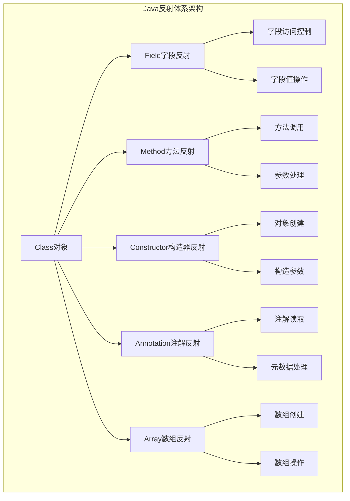
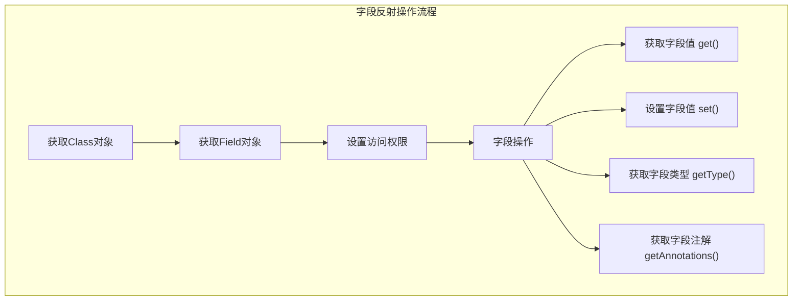
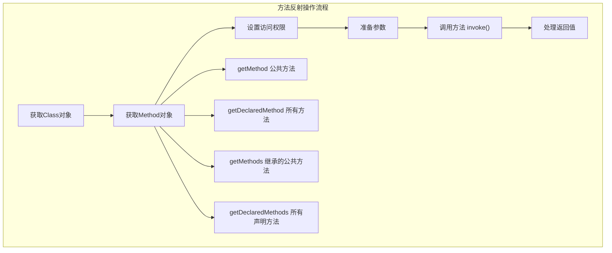
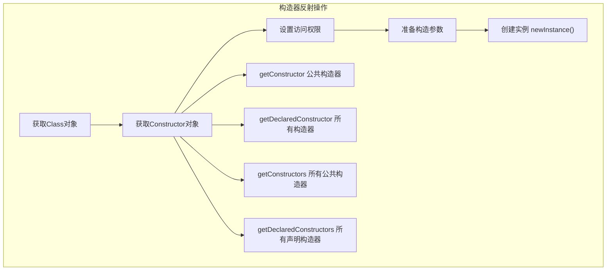
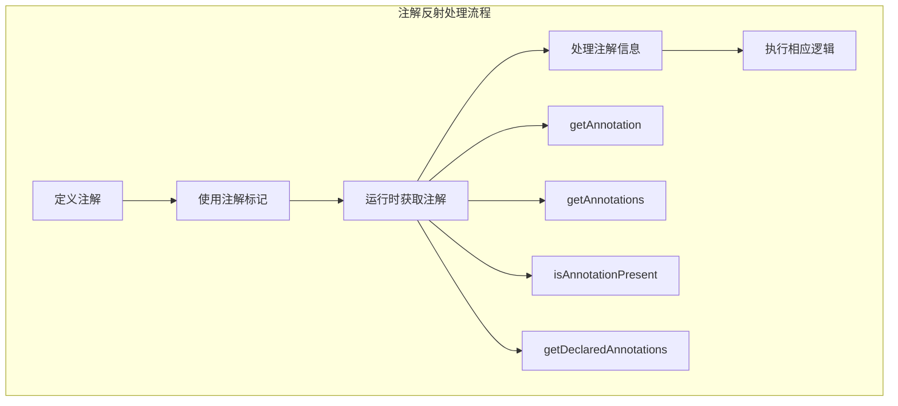

import Tabs from '@theme/Tabs';
import TabItem from '@theme/TabItem';
import CodeBlock from '@theme/CodeBlock';
import TOCInline from '@theme/TOCInline';

# Java反射机制完全指南

Java反射（Reflection）是Java语言最强大的特性之一，它允许程序在运行时检查和操作类、接口、字段和方法的信息。反射机制为Java提供了强大的动态编程能力，是Spring、Hibernate等主流框架的核心技术基础。

:::info 本文内容概览
<TOCInline toc={toc} />
:::

:::tip 核心价值
**反射 = 运行时自省 + 动态调用 + 框架基础 + 元编程能力**
- 🔍 **自省机制**：运行时检查类型信息，实现动态特性
- 🔄 **动态调用**：运行时创建对象、调用方法，提供极大灵活性
- 🏗️ **框架基础**：支持依赖注入、序列化等底层框架能力
- 🛠️ **工具开发**：编写各类开发工具，如调试器、代码生成器
- 🔌 **扩展性设计**：构建可配置、可扩展的应用架构
:::

## 1. 反射基础概念与原理

### 1.1 反射机制深度解析

反射是指程序可以访问、检测和修改它本身状态或行为的一种能力。在Java中，反射主要通过`java.lang.reflect`包实现。



#### 反射核心类对比表

| 核心类 | 作用 | 主要方法 | 使用场景 | 性能影响 |
|--------|------|----------|----------|----------|
| **Class** | 类信息表示 | `forName()`, `newInstance()` | 类加载、实例创建 | 中等 |
| **Field** | 字段操作 | `get()`, `set()`, `setAccessible()` | 属性注入、序列化 | 较高 |
| **Method** | 方法调用 | `invoke()`, `getParameterTypes()` | 动态方法调用 | 高 |
| **Constructor** | 构造器操作 | `newInstance()`, `getParameters()` | 对象创建 | 中等 |
| **Parameter** | 参数信息 | `getName()`, `getType()` | 参数解析 | 低 |
<Tabs>
<TabItem value="class-object" label="Class对象获取">

### 获取Class对象的多种方式

```java title="Class对象获取方式对比"
public class ClassObjectDemo {
    public static void main(String[] args) throws ClassNotFoundException {
        // 方式1：通过类名.class获取（编译时确定）
        Class<String> clazz1 = String.class;
        System.out.println("方式1: " + clazz1.getName());
        
        // 方式2：通过对象.getClass()获取（运行时确定）
        String str = "Hello";
        Class<?> clazz2 = str.getClass();
        System.out.println("方式2: " + clazz2.getName());
        
        // 方式3：通过Class.forName()获取（动态加载）
        Class<?> clazz3 = Class.forName("java.lang.String");
        System.out.println("方式3: " + clazz3.getName());
        
        // 方式4：通过类加载器获取
        ClassLoader classLoader = Thread.currentThread().getContextClassLoader();
        Class<?> clazz4 = classLoader.loadClass("java.lang.String");
        System.out.println("方式4: " + clazz4.getName());
        
        // 验证是否为同一个Class对象
        System.out.println("是否为同一个Class对象: " + (clazz1 == clazz2));
        System.out.println("是否为同一个Class对象: " + (clazz2 == clazz3));
    }
}
```

#### Class对象获取方式对比

| 获取方式 | 语法 | 使用场景 | 性能 | 异常处理 |
|----------|------|----------|------|----------|
| **类名.class** | `String.class` | 编译时已知类型 | 最快 | 无异常 |
| **对象.getClass()** | `obj.getClass()` | 运行时获取对象类型 | 快 | 无异常 |
| **Class.forName()** | `Class.forName("类名")` | 动态加载类 | 较慢 | ClassNotFoundException |
| **类加载器** | `classLoader.loadClass()` | 自定义类加载 | 较慢 | ClassNotFoundException |

</TabItem>
<TabItem value="class-info" label="类信息获取">

### 获取类的详细信息

```java title="类信息获取完整示例"
import java.lang.reflect.*;
import java.util.Arrays;

public class ClassInfoDemo {
    public static void analyzeClass(Class<?> clazz) {
        System.out.println("=== 分析类: " + clazz.getName() + " ===");
        
        // 1. 基本信息
        System.out.println("简单名称: " + clazz.getSimpleName());
        System.out.println("包名: " + clazz.getPackage().getName());
        System.out.println("是否为接口: " + clazz.isInterface());
        System.out.println("是否为抽象类: " + Modifier.isAbstract(clazz.getModifiers()));
        System.out.println("是否为final类: " + Modifier.isFinal(clazz.getModifiers()));
        
        // 2. 继承关系
        Class<?> superClass = clazz.getSuperclass();
        if (superClass != null) {
            System.out.println("父类: " + superClass.getName());
        }
        
        // 3. 实现的接口
        Class<?>[] interfaces = clazz.getInterfaces();
        if (interfaces.length > 0) {
            System.out.println("实现的接口: " + Arrays.toString(interfaces));
        }
        
        // 4. 泛型信息
        TypeVariable<?>[] typeParameters = clazz.getTypeParameters();
        if (typeParameters.length > 0) {
            System.out.println("泛型参数: " + Arrays.toString(typeParameters));
        }
        
        // 5. 注解信息
        Annotation[] annotations = clazz.getAnnotations();
        if (annotations.length > 0) {
            System.out.println("类注解: " + Arrays.toString(annotations));
        }
        
        // 6. 内部类
        Class<?>[] innerClasses = clazz.getDeclaredClasses();
        if (innerClasses.length > 0) {
            System.out.println("内部类: " + Arrays.toString(innerClasses));
        }
        
        System.out.println();
    }
    
    public static void main(String[] args) {
        // 分析不同类型的类
        analyzeClass(String.class);
        analyzeClass(java.util.ArrayList.class);
        analyzeClass(java.util.List.class);
        analyzeClass(Thread.class);
    }
}
```

</TabItem>
<TabItem value="performance" label="性能考虑">

### 反射性能优化策略

```java title="反射性能优化实践"
import java.lang.reflect.*;
import java.util.concurrent.ConcurrentHashMap;

public class ReflectionPerformanceOptimizer {
    // 缓存Class对象
    private static final ConcurrentHashMap<String, Class<?>> CLASS_CACHE = new ConcurrentHashMap<>();
    
    // 缓存Method对象
    private static final ConcurrentHashMap<String, Method> METHOD_CACHE = new ConcurrentHashMap<>();
    
    // 缓存Field对象
    private static final ConcurrentHashMap<String, Field> FIELD_CACHE = new ConcurrentHashMap<>();
    
    /**
     * 优化的Class获取方法
     */
    public static Class<?> getClassOptimized(String className) throws ClassNotFoundException {
        return CLASS_CACHE.computeIfAbsent(className, key -> {
            try {
                return Class.forName(key);
            } catch (ClassNotFoundException e) {
                throw new RuntimeException(e);
            }
        });
    }
    
    /**
     * 优化的Method获取方法
     */
    public static Method getMethodOptimized(Class<?> clazz, String methodName, Class<?>... parameterTypes) 
            throws NoSuchMethodException {
        String key = clazz.getName() + "#" + methodName + "#" + Arrays.toString(parameterTypes);
        return METHOD_CACHE.computeIfAbsent(key, k -> {
            try {
                Method method = clazz.getDeclaredMethod(methodName, parameterTypes);
                method.setAccessible(true); // 预先设置访问权限
                return method;
            } catch (NoSuchMethodException e) {
                throw new RuntimeException(e);
            }
        });
    }
    
    /**
     * 优化的Field获取方法
     */
    public static Field getFieldOptimized(Class<?> clazz, String fieldName) throws NoSuchFieldException {
        String key = clazz.getName() + "#" + fieldName;
        return FIELD_CACHE.computeIfAbsent(key, k -> {
            try {
                Field field = clazz.getDeclaredField(fieldName);
                field.setAccessible(true); // 预先设置访问权限
                return field;
            } catch (NoSuchFieldException e) {
                throw new RuntimeException(e);
            }
        });
    }
    
    /**
     * 性能测试对比
     */
    public static void performanceTest() throws Exception {
        int iterations = 100000;
        Class<?> clazz = String.class;
        
        // 测试直接调用 vs 反射调用
        String testStr = "Hello World";
        
        // 直接调用性能测试
        long startTime = System.nanoTime();
        for (int i = 0; i < iterations; i++) {
            testStr.length();
        }
        long directCallTime = System.nanoTime() - startTime;
        
        // 反射调用性能测试（未优化）
        Method lengthMethod = clazz.getMethod("length");
        startTime = System.nanoTime();
        for (int i = 0; i < iterations; i++) {
            lengthMethod.invoke(testStr);
        }
        long reflectionCallTime = System.nanoTime() - startTime;
        
        // 反射调用性能测试（优化后）
        Method cachedMethod = getMethodOptimized(clazz, "length");
        startTime = System.nanoTime();
        for (int i = 0; i < iterations; i++) {
            cachedMethod.invoke(testStr);
        }
        long optimizedReflectionTime = System.nanoTime() - startTime;
        
        System.out.println("性能测试结果 (" + iterations + " 次调用):");
        System.out.println("直接调用: " + directCallTime / 1_000_000 + " ms");
        System.out.println("反射调用(未优化): " + reflectionCallTime / 1_000_000 + " ms");
        System.out.println("反射调用(优化后): " + optimizedReflectionTime / 1_000_000 + " ms");
        System.out.println("反射性能损失: " + (reflectionCallTime / (double) directCallTime) + "x");
        System.out.println("优化后性能损失: " + (optimizedReflectionTime / (double) directCallTime) + "x");
    }
    
    public static void main(String[] args) throws Exception {
        performanceTest();
    }
}
```

:::warning 性能注意事项
1. **缓存反射对象**：Method、Field、Constructor对象应该缓存复用
2. **预设访问权限**：提前调用`setAccessible(true)`避免重复检查
3. **避免频繁反射**：在性能敏感的代码路径中谨慎使用反射
4. **使用MethodHandle**：Java 7+可以考虑使用MethodHandle替代反射
:::

</TabItem>
</Tabs>

## 2. 字段（Field）操作详解

字段反射允许我们在运行时访问和修改对象的字段值，包括私有字段。



<Tabs>
<TabItem value="field-access" label="字段访问操作">

### 字段访问与操作

```java title="字段反射操作完整示例"
import java.lang.reflect.*;

// 示例类
class Person {
    private String name;
    protected int age;
    public String email;
    private static final String SPECIES = "Homo sapiens";
    
    public Person(String name, int age, String email) {
        this.name = name;
        this.age = age;
        this.email = email;
    }
    
    @Override
    public String toString() {
        return String.format("Person{name='%s', age=%d, email='%s'}", name, age, email);
    }
}

public class FieldReflectionDemo {
    public static void main(String[] args) throws Exception {
        Person person = new Person("张三", 25, "zhangsan@example.com");
        Class<?> personClass = person.getClass();
        
        System.out.println("原始对象: " + person);
        
        // 1. 获取所有字段（包括私有字段）
        System.out.println("\n=== 所有声明的字段 ===");
        Field[] declaredFields = personClass.getDeclaredFields();
        for (Field field : declaredFields) {
            System.out.printf("字段: %s, 类型: %s, 修饰符: %s%n", 
                field.getName(), 
                field.getType().getSimpleName(),
                Modifier.toString(field.getModifiers())
            );
        }
        
        // 2. 获取公共字段
        System.out.println("\n=== 公共字段 ===");
        Field[] publicFields = personClass.getFields();
        for (Field field : publicFields) {
            System.out.println("公共字段: " + field.getName());
        }
        
        // 3. 访问私有字段
        System.out.println("\n=== 访问私有字段 ===");
        Field nameField = personClass.getDeclaredField("name");
        nameField.setAccessible(true); // 突破访问控制
        
        String originalName = (String) nameField.get(person);
        System.out.println("原始姓名: " + originalName);
        
        // 修改私有字段值
        nameField.set(person, "李四");
        System.out.println("修改后对象: " + person);
        
        // 4. 访问静态字段
        System.out.println("\n=== 访问静态字段 ===");
        Field speciesField = personClass.getDeclaredField("SPECIES");
        speciesField.setAccessible(true);
        String species = (String) speciesField.get(null); // 静态字段传null
        System.out.println("物种: " + species);
        
        // 5. 字段类型判断
        System.out.println("\n=== 字段类型判断 ===");
        for (Field field : declaredFields) {
            System.out.printf("字段 %s: ", field.getName());
            System.out.printf("是否静态=%s, ", Modifier.isStatic(field.getModifiers()));
            System.out.printf("是否final=%s, ", Modifier.isFinal(field.getModifiers()));
            System.out.printf("是否私有=%s%n", Modifier.isPrivate(field.getModifiers()));
        }
    }
}
```

</TabItem>
<TabItem value="field-utils" label="字段工具类">

### 通用字段操作工具类

```java title="字段反射工具类"
import java.lang.reflect.*;
import java.util.*;

public class FieldUtils {
    
    /**
     * 获取对象的所有字段值（包括继承的字段）
     */
    public static Map<String, Object> getAllFieldValues(Object obj) {
        Map<String, Object> fieldValues = new HashMap<>();
        Class<?> clazz = obj.getClass();
        
        // 遍历类层次结构
        while (clazz != null && clazz != Object.class) {
            Field[] fields = clazz.getDeclaredFields();
            for (Field field : fields) {
                if (!Modifier.isStatic(field.getModifiers())) {
                    try {
                        field.setAccessible(true);
                        Object value = field.get(obj);
                        fieldValues.put(field.getName(), value);
                    } catch (IllegalAccessException e) {
                        System.err.println("无法访问字段: " + field.getName());
                    }
                }
            }
            clazz = clazz.getSuperclass();
        }
        
        return fieldValues;
    }
    
    /**
     * 复制对象字段值
     */
    public static void copyFields(Object source, Object target) {
        Class<?> sourceClass = source.getClass();
        Class<?> targetClass = target.getClass();
        
        Field[] sourceFields = sourceClass.getDeclaredFields();
        
        for (Field sourceField : sourceFields) {
            if (Modifier.isStatic(sourceField.getModifiers()) || 
                Modifier.isFinal(sourceField.getModifiers())) {
                continue;
            }
            
            try {
                Field targetField = targetClass.getDeclaredField(sourceField.getName());
                
                // 检查类型兼容性
                if (targetField.getType().isAssignableFrom(sourceField.getType())) {
                    sourceField.setAccessible(true);
                    targetField.setAccessible(true);
                    
                    Object value = sourceField.get(source);
                    targetField.set(target, value);
                    
                    System.out.println("复制字段: " + sourceField.getName() + " = " + value);
                }
            } catch (NoSuchFieldException e) {
                System.out.println("目标对象没有字段: " + sourceField.getName());
            } catch (IllegalAccessException e) {
                System.err.println("无法访问字段: " + sourceField.getName());
            }
        }
    }
    
    /**
     * 将对象转换为Map
     */
    public static Map<String, Object> objectToMap(Object obj) {
        Map<String, Object> map = new HashMap<>();
        Class<?> clazz = obj.getClass();
        
        Field[] fields = clazz.getDeclaredFields();
        for (Field field : fields) {
            if (!Modifier.isStatic(field.getModifiers())) {
                try {
                    field.setAccessible(true);
                    Object value = field.get(obj);
                    map.put(field.getName(), value);
                } catch (IllegalAccessException e) {
                    System.err.println("无法访问字段: " + field.getName());
                }
            }
        }
        
        return map;
    }
    
    /**
     * 从Map创建对象
     */
    public static <T> T mapToObject(Map<String, Object> map, Class<T> clazz) throws Exception {
        T instance = clazz.getDeclaredConstructor().newInstance();
        
        for (Map.Entry<String, Object> entry : map.entrySet()) {
            try {
                Field field = clazz.getDeclaredField(entry.getKey());
                field.setAccessible(true);
                field.set(instance, entry.getValue());
            } catch (NoSuchFieldException e) {
                System.out.println("字段不存在: " + entry.getKey());
            }
        }
        
        return instance;
    }
    
    /**
     * 查找带有特定注解的字段
     */
    public static List<Field> findFieldsWithAnnotation(Class<?> clazz, Class<? extends Annotation> annotationClass) {
        List<Field> annotatedFields = new ArrayList<>();
        
        Field[] fields = clazz.getDeclaredFields();
        for (Field field : fields) {
            if (field.isAnnotationPresent(annotationClass)) {
                annotatedFields.add(field);
            }
        }
        
        return annotatedFields;
    }
    
    // 使用示例
    public static void main(String[] args) throws Exception {
        Person person1 = new Person("张三", 25, "zhangsan@example.com");
        Person person2 = new Person("", 0, "");
        
        System.out.println("=== 获取所有字段值 ===");
        Map<String, Object> fieldValues = getAllFieldValues(person1);
        fieldValues.forEach((name, value) -> System.out.println(name + " = " + value));
        
        System.out.println("\n=== 复制字段值 ===");
        System.out.println("复制前 person2: " + person2);
        copyFields(person1, person2);
        System.out.println("复制后 person2: " + person2);
        
        System.out.println("\n=== 对象转Map ===");
        Map<String, Object> personMap = objectToMap(person1);
        System.out.println("Person Map: " + personMap);
        
        System.out.println("\n=== Map转对象 ===");
        Person person3 = mapToObject(personMap, Person.class);
        System.out.println("从Map创建的对象: " + person3);
    }
}
```

</TabItem>
<TabItem value="field-annotations" label="字段注解处理">

### 字段注解处理

```java title="字段注解处理示例"
import java.lang.annotation.*;
import java.lang.reflect.*;

// 自定义注解
@Retention(RetentionPolicy.RUNTIME)
@Target(ElementType.FIELD)
@interface Validate {
    String message() default "验证失败";
    int min() default 0;
    int max() default Integer.MAX_VALUE;
    boolean required() default false;
}

@Retention(RetentionPolicy.RUNTIME)
@Target(ElementType.FIELD)
@interface JsonProperty {
    String value() default "";
}

// 使用注解的示例类
class User {
    @Validate(required = true, message = "用户名不能为空")
    @JsonProperty("username")
    private String name;
    
    @Validate(min = 18, max = 100, message = "年龄必须在18-100之间")
    private int age;
    
    @Validate(required = true, message = "邮箱不能为空")
    @JsonProperty("email_address")
    private String email;
    
    public User(String name, int age, String email) {
        this.name = name;
        this.age = age;
        this.email = email;
    }
    
    // getters and setters...
}

public class FieldAnnotationProcessor {
    
    /**
     * 验证对象字段
     */
    public static boolean validateObject(Object obj) {
        Class<?> clazz = obj.getClass();
        Field[] fields = clazz.getDeclaredFields();
        boolean isValid = true;
        
        for (Field field : fields) {
            if (field.isAnnotationPresent(Validate.class)) {
                Validate validate = field.getAnnotation(Validate.class);
                
                try {
                    field.setAccessible(true);
                    Object value = field.get(obj);
                    
                    // 检查必填项
                    if (validate.required() && (value == null || value.toString().trim().isEmpty())) {
                        System.err.println("验证失败 - " + field.getName() + ": " + validate.message());
                        isValid = false;
                        continue;
                    }
                    
                    // 检查数值范围
                    if (value instanceof Integer) {
                        int intValue = (Integer) value;
                        if (intValue < validate.min() || intValue > validate.max()) {
                            System.err.println("验证失败 - " + field.getName() + ": " + validate.message());
                            isValid = false;
                        }
                    }
                    
                } catch (IllegalAccessException e) {
                    System.err.println("无法访问字段: " + field.getName());
                    isValid = false;
                }
            }
        }
        
        return isValid;
    }
    
    /**
     * 将对象转换为JSON格式的Map（基于注解）
     */
    public static Map<String, Object> toJsonMap(Object obj) {
        Map<String, Object> jsonMap = new HashMap<>();
        Class<?> clazz = obj.getClass();
        Field[] fields = clazz.getDeclaredFields();
        
        for (Field field : fields) {
            try {
                field.setAccessible(true);
                Object value = field.get(obj);
                
                String jsonKey = field.getName();
                if (field.isAnnotationPresent(JsonProperty.class)) {
                    JsonProperty jsonProperty = field.getAnnotation(JsonProperty.class);
                    if (!jsonProperty.value().isEmpty()) {
                        jsonKey = jsonProperty.value();
                    }
                }
                
                jsonMap.put(jsonKey, value);
                
            } catch (IllegalAccessException e) {
                System.err.println("无法访问字段: " + field.getName());
            }
        }
        
        return jsonMap;
    }
    
    public static void main(String[] args) {
        // 测试验证功能
        User validUser = new User("张三", 25, "zhangsan@example.com");
        User invalidUser = new User("", 15, "");
        
        System.out.println("=== 验证有效用户 ===");
        boolean isValid1 = validateObject(validUser);
        System.out.println("验证结果: " + (isValid1 ? "通过" : "失败"));
        
        System.out.println("\n=== 验证无效用户 ===");
        boolean isValid2 = validateObject(invalidUser);
        System.out.println("验证结果: " + (isValid2 ? "通过" : "失败"));
        
        System.out.println("\n=== JSON转换 ===");
        Map<String, Object> jsonMap = toJsonMap(validUser);
        System.out.println("JSON Map: " + jsonMap);
    }
}
```

</TabItem>
</Tabs>

## 3. 方法（Method）操作详解

方法反射是反射机制中最复杂也是最强大的部分，它允许我们在运行时动态调用对象的方法。



<Tabs>
<TabItem value="method-invoke" label="方法调用">

### 方法调用与参数处理

```java title="方法反射调用完整示例"
import java.lang.reflect.*;
import java.util.*;

// 示例服务类
class CalculatorService {
    public int add(int a, int b) {
        System.out.println("执行加法: " + a + " + " + b);
        return a + b;
    }
    
    public double multiply(double a, double b) {
        System.out.println("执行乘法: " + a + " * " + b);
        return a * b;
    }
    
    private String formatResult(String operation, Object result) {
        return String.format("运算结果: %s = %s", operation, result);
    }
    
    public static String getServiceInfo() {
        return "计算器服务 v1.0";
    }
    
    // 重载方法
    public String process(String input) {
        return "处理字符串: " + input;
    }
    
    public String process(int input) {
        return "处理整数: " + input;
    }
    
    // 可变参数方法
    public int sum(int... numbers) {
        int total = 0;
        for (int num : numbers) {
            total += num;
        }
        return total;
    }
}

public class MethodReflectionDemo {
    public static void main(String[] args) throws Exception {
        CalculatorService calculator = new CalculatorService();
        Class<?> calculatorClass = calculator.getClass();
        
        // 1. 调用公共方法
        System.out.println("=== 调用公共方法 ===");
        Method addMethod = calculatorClass.getMethod("add", int.class, int.class);
        Object result1 = addMethod.invoke(calculator, 10, 20);
        System.out.println("反射调用结果: " + result1);
        
        // 2. 调用私有方法
        System.out.println("\n=== 调用私有方法 ===");
        Method formatMethod = calculatorClass.getDeclaredMethod("formatResult", String.class, Object.class);
        formatMethod.setAccessible(true);
        Object result2 = formatMethod.invoke(calculator, "10 + 20", 30);
        System.out.println("私有方法结果: " + result2);
        
        // 3. 调用静态方法
        System.out.println("\n=== 调用静态方法 ===");
        Method staticMethod = calculatorClass.getMethod("getServiceInfo");
        Object result3 = staticMethod.invoke(null); // 静态方法传null
        System.out.println("静态方法结果: " + result3);
        
        // 4. 处理重载方法
        System.out.println("\n=== 处理重载方法 ===");
        Method processString = calculatorClass.getMethod("process", String.class);
        Method processInt = calculatorClass.getMethod("process", int.class);
        
        Object result4 = processString.invoke(calculator, "Hello");
        Object result5 = processInt.invoke(calculator, 42);
        System.out.println("重载方法结果1: " + result4);
        System.out.println("重载方法结果2: " + result5);
        
        // 5. 处理可变参数方法
        System.out.println("\n=== 处理可变参数方法 ===");
        Method sumMethod = calculatorClass.getMethod("sum", int[].class);
        Object result6 = sumMethod.invoke(calculator, new int[]{1, 2, 3, 4, 5});
        System.out.println("可变参数方法结果: " + result6);
        
        // 6. 获取方法信息
        System.out.println("\n=== 方法信息分析 ===");
        analyzeMethod(addMethod);
        analyzeMethod(formatMethod);
    }
    
    private static void analyzeMethod(Method method) {
        System.out.println("方法名: " + method.getName());
        System.out.println("返回类型: " + method.getReturnType().getSimpleName());
        System.out.println("参数类型: " + Arrays.toString(method.getParameterTypes()));
        System.out.println("修饰符: " + Modifier.toString(method.getModifiers()));
        System.out.println("是否可变参数: " + method.isVarArgs());
        System.out.println("异常类型: " + Arrays.toString(method.getExceptionTypes()));
        System.out.println("---");
    }
}
```

</TabItem>
<TabItem value="method-utils" label="方法工具类">

### 通用方法操作工具类

```java title="方法反射工具类"
import java.lang.reflect.*;
import java.util.*;
import java.util.concurrent.ConcurrentHashMap;

public class MethodUtils {
    // 方法缓存
    private static final Map<String, Method> METHOD_CACHE = new ConcurrentHashMap<>();
    
    /**
     * 安全调用方法（带异常处理）
     */
    public static Object safeInvoke(Object target, String methodName, Object... args) {
        try {
            Class<?> clazz = target.getClass();
            Class<?>[] paramTypes = getParameterTypes(args);
            
            Method method = findMethod(clazz, methodName, paramTypes);
            if (method == null) {
                throw new NoSuchMethodException("找不到方法: " + methodName);
            }
            
            method.setAccessible(true);
            return method.invoke(target, args);
            
        } catch (Exception e) {
            System.err.println("方法调用失败: " + methodName + " - " + e.getMessage());
            return null;
        }
    }
    
    /**
     * 查找方法（支持继承和重载）
     */
    public static Method findMethod(Class<?> clazz, String methodName, Class<?>... paramTypes) {
        String cacheKey = clazz.getName() + "#" + methodName + "#" + Arrays.toString(paramTypes);
        
        return METHOD_CACHE.computeIfAbsent(cacheKey, key -> {
            // 首先尝试精确匹配
            try {
                return clazz.getDeclaredMethod(methodName, paramTypes);
            } catch (NoSuchMethodException e) {
                // 尝试在父类中查找
                return findMethodInHierarchy(clazz, methodName, paramTypes);
            }
        });
    }
    
    /**
     * 在类层次结构中查找方法
     */
    private static Method findMethodInHierarchy(Class<?> clazz, String methodName, Class<?>[] paramTypes) {
        Class<?> currentClass = clazz;
        
        while (currentClass != null && currentClass != Object.class) {
            try {
                return currentClass.getDeclaredMethod(methodName, paramTypes);
            } catch (NoSuchMethodException e) {
                // 尝试模糊匹配（参数类型兼容）
                Method[] methods = currentClass.getDeclaredMethods();
                for (Method method : methods) {
                    if (method.getName().equals(methodName) && 
                        isParameterTypesCompatible(method.getParameterTypes(), paramTypes)) {
                        return method;
                    }
                }
                currentClass = currentClass.getSuperclass();
            }
        }
        
        return null;
    }
    
    /**
     * 检查参数类型兼容性
     */
    private static boolean isParameterTypesCompatible(Class<?>[] methodParams, Class<?>[] actualParams) {
        if (methodParams.length != actualParams.length) {
            return false;
        }
        
        for (int i = 0; i < methodParams.length; i++) {
            if (!methodParams[i].isAssignableFrom(actualParams[i])) {
                return false;
            }
        }
        
        return true;
    }
    
    /**
     * 获取参数类型数组
     */
    private static Class<?>[] getParameterTypes(Object... args) {
        if (args == null || args.length == 0) {
            return new Class<?>[0];
        }
        
        Class<?>[] types = new Class<?>[args.length];
        for (int i = 0; i < args.length; i++) {
            types[i] = args[i] != null ? args[i].getClass() : Object.class;
        }
        
        return types;
    }
    
    /**
     * 获取所有方法（包括继承的）
     */
    public static List<Method> getAllMethods(Class<?> clazz) {
        List<Method> allMethods = new ArrayList<>();
        Class<?> currentClass = clazz;
        
        while (currentClass != null && currentClass != Object.class) {
            Method[] methods = currentClass.getDeclaredMethods();
            allMethods.addAll(Arrays.asList(methods));
            currentClass = currentClass.getSuperclass();
        }
        
        return allMethods;
    }
    
    /**
     * 查找带有特定注解的方法
     */
    public static List<Method> findMethodsWithAnnotation(Class<?> clazz, Class<? extends Annotation> annotationClass) {
        List<Method> annotatedMethods = new ArrayList<>();
        List<Method> allMethods = getAllMethods(clazz);
        
        for (Method method : allMethods) {
            if (method.isAnnotationPresent(annotationClass)) {
                annotatedMethods.add(method);
            }
        }
        
        return annotatedMethods;
    }
    
    /**
     * 方法签名比较
     */
    public static boolean isSameSignature(Method method1, Method method2) {
        return method1.getName().equals(method2.getName()) &&
               Arrays.equals(method1.getParameterTypes(), method2.getParameterTypes());
    }
    
    /**
     * 创建方法代理
     */
    public static Object createMethodProxy(Object target, String methodName, Object... args) {
        return new Object() {
            public Object invoke() {
                return safeInvoke(target, methodName, args);
            }
        };
    }
    
    // 使用示例
    public static void main(String[] args) {
        CalculatorService calculator = new CalculatorService();
        
        System.out.println("=== 安全方法调用 ===");
        Object result1 = safeInvoke(calculator, "add", 10, 20);
        System.out.println("结果: " + result1);
        
        Object result2 = safeInvoke(calculator, "nonExistentMethod", "test");
        System.out.println("不存在的方法结果: " + result2);
        
        System.out.println("\n=== 查找所有方法 ===");
        List<Method> allMethods = getAllMethods(CalculatorService.class);
        allMethods.forEach(method -> System.out.println("方法: " + method.getName()));
        
        System.out.println("\n=== 方法签名比较 ===");
        try {
            Method method1 = CalculatorService.class.getMethod("add", int.class, int.class);
            Method method2 = CalculatorService.class.getMethod("multiply", double.class, double.class);
            System.out.println("方法签名相同: " + isSameSignature(method1, method2));
        } catch (NoSuchMethodException e) {
            e.printStackTrace();
        }
    }
}
```

</TabItem>
<TabItem value="method-interceptor" label="方法拦截器">

### 方法拦截器实现

```java title="方法拦截器和AOP实现"
import java.lang.annotation.*;
import java.lang.reflect.*;
import java.util.Arrays;

// 方法执行时间注解
@Retention(RetentionPolicy.RUNTIME)
@Target(ElementType.METHOD)
@interface Timed {
    String value() default "";
}

// 日志注解
@Retention(RetentionPolicy.RUNTIME)
@Target(ElementType.METHOD)
@interface Logged {
    boolean logParameters() default true;
    boolean logResult() default true;
}

// 方法拦截器接口
interface MethodInterceptor {
    Object intercept(Object target, Method method, Object[] args) throws Exception;
}

// 执行时间拦截器
class TimingInterceptor implements MethodInterceptor {
    @Override
    public Object intercept(Object target, Method method, Object[] args) throws Exception {
        long startTime = System.nanoTime();
        
        try {
            Object result = method.invoke(target, args);
            return result;
        } finally {
            long endTime = System.nanoTime();
            long duration = (endTime - startTime) / 1_000_000; // 转换为毫秒
            
            Timed timed = method.getAnnotation(Timed.class);
            String methodName = timed.value().isEmpty() ? method.getName() : timed.value();
            System.out.println(String.format("[TIMING] %s 执行时间: %d ms", methodName, duration));
        }
    }
}

// 日志拦截器
class LoggingInterceptor implements MethodInterceptor {
    @Override
    public Object intercept(Object target, Method method, Object[] args) throws Exception {
        Logged logged = method.getAnnotation(Logged.class);
        
        if (logged.logParameters()) {
            System.out.println(String.format("[LOG] 调用方法: %s, 参数: %s", 
                method.getName(), Arrays.toString(args)));
        }
        
        Object result = method.invoke(target, args);
        
        if (logged.logResult()) {
            System.out.println(String.format("[LOG] 方法: %s, 返回值: %s", 
                method.getName(), result));
        }
        
        return result;
    }
}

// 代理工厂
class ProxyFactory {
    public static <T> T createProxy(T target, MethodInterceptor... interceptors) {
        Class<?> targetClass = target.getClass();
        
        return (T) Proxy.newProxyInstance(
            targetClass.getClassLoader(),
            targetClass.getInterfaces(),
            new InvocationHandler() {
                @Override
                public Object invoke(Object proxy, Method method, Object[] args) throws Throwable {
                    // 检查方法是否需要拦截
                    boolean needsInterception = method.isAnnotationPresent(Timed.class) || 
                                              method.isAnnotationPresent(Logged.class);
                    
                    if (!needsInterception) {
                        return method.invoke(target, args);
                    }
                    
                    // 应用拦截器
                    Object result = null;
                    for (MethodInterceptor interceptor : interceptors) {
                        if ((interceptor instanceof TimingInterceptor && method.isAnnotationPresent(Timed.class)) ||
                            (interceptor instanceof LoggingInterceptor && method.isAnnotationPresent(Logged.class))) {
                            result = interceptor.intercept(target, method, args);
                        }
                    }
                    
                    return result != null ? result : method.invoke(target, args);
                }
            }
        );
    }
}

// 业务服务接口
interface BusinessService {
    String processData(String data);
    int calculate(int a, int b);
    void doSomething();
}

// 业务服务实现
class BusinessServiceImpl implements BusinessService {
    
    @Timed("数据处理")
    @Logged(logParameters = true, logResult = true)
    @Override
    public String processData(String data) {
        // 模拟耗时操作
        try {
            Thread.sleep(100);
        } catch (InterruptedException e) {
            Thread.currentThread().interrupt();
        }
        return "处理后的数据: " + data.toUpperCase();
    }
    
    @Timed
    @Override
    public int calculate(int a, int b) {
        // 模拟复杂计算
        try {
            Thread.sleep(50);
        } catch (InterruptedException e) {
            Thread.currentThread().interrupt();
        }
        return a * b + (a + b);
    }
    
    @Logged(logParameters = false, logResult = false)
    @Override
    public void doSomething() {
        System.out.println("执行某些操作...");
    }
}

public class MethodInterceptorDemo {
    public static void main(String[] args) {
        // 创建原始服务
        BusinessService originalService = new BusinessServiceImpl();
        
        // 创建代理服务
        BusinessService proxyService = ProxyFactory.createProxy(
            originalService,
            new TimingInterceptor(),
            new LoggingInterceptor()
        );
        
        System.out.println("=== 使用代理服务 ===");
        
        // 测试带时间和日志的方法
        String result1 = proxyService.processData("hello world");
        System.out.println("最终结果: " + result1);
        
        System.out.println();
        
        // 测试只带时间的方法
        int result2 = proxyService.calculate(10, 20);
        System.out.println("计算结果: " + result2);
        
        System.out.println();
        
        // 测试只带日志的方法
        proxyService.doSomething();
    }
}
```

</TabItem>
</Tabs>

## 4. 构造器（Constructor）操作详解

构造器反射允许我们在运行时动态创建对象实例，这是依赖注入框架的核心技术。


# 5. 注解（Annotation）反射处理

注解反射是现代Java框架的核心技术，Spring、Hibernate等框架大量使用注解来简化配置。



<Tabs>
<TabItem value="annotation-basics" label="注解基础">

### 注解定义与使用

```java title="自定义注解完整示例"
import java.lang.annotation.*;
import java.lang.reflect.*;
import java.util.*;

// 1. 字段验证注解
@Retention(RetentionPolicy.RUNTIME)
@Target(ElementType.FIELD)
@interface Validate {
    String message() default "验证失败";
    int min() default 0;
    int max() default Integer.MAX_VALUE;
    boolean required() default false;
    String pattern() default "";
}

// 2. 方法级注解
@Retention(RetentionPolicy.RUNTIME)
@Target(ElementType.METHOD)
@interface Cacheable {
    String key() default "";
    int expireTime() default 3600; // 秒
}

@Retention(RetentionPolicy.RUNTIME)
@Target(ElementType.METHOD)
@interface Transactional {
    String value() default "default";
    boolean readOnly() default false;
}

// 3. 类级注解
@Retention(RetentionPolicy.RUNTIME)
@Target(ElementType.TYPE)
@interface Entity {
    String tableName() default "";
}

@Retention(RetentionPolicy.RUNTIME)
@Target(ElementType.TYPE)
@interface Service {
    String value() default "";
}

// 使用注解的示例类
@Entity(tableName = "users")
class User {
    @Validate(required = true, message = "用户名不能为空")
    private String username;
    
    @Validate(min = 18, max = 100, message = "年龄必须在18-100之间")
    private int age;
    
    @Validate(required = true, pattern = "^[\\w-\\.]+@([\\w-]+\\.)+[\\w-]{2,4}$", message = "邮箱格式不正确")
    private String email;
    
    private String password;
    
    public User(String username, int age, String email, String password) {
        this.username = username;
        this.age = age;
        this.email = email;
        this.password = password;
    }
    
    // getters and setters...
    public String getUsername() { return username; }
    public int getAge() { return age; }
    public String getEmail() { return email; }
    public String getPassword() { return password; }
    
    @Override
    public String toString() {
        return String.format("User{username='%s', age=%d, email='%s'}", username, age, email);
    }
}

@Service("userService")
class UserService {
    
    @Cacheable(key = "user:{0}", expireTime = 1800)
    @Transactional(readOnly = true)
    public User findById(Long id) {
        System.out.println("从数据库查询用户: " + id);
        // 模拟数据库查询
        return new User("user" + id, 25, "user" + id + "@example.com", "password");
    }
    
    @Transactional
    public void saveUser(User user) {
        System.out.println("保存用户到数据库: " + user);
        // 模拟保存操作
    }
    
    @Cacheable(key = "userList", expireTime = 600)
    public List<User> findAll() {
        System.out.println("从数据库查询所有用户");
        // 模拟查询所有用户
        return Arrays.asList(
            new User("alice", 28, "alice@example.com", "pass1"),
            new User("bob", 32, "bob@example.com", "pass2")
        );
    }
}

public class AnnotationReflectionDemo {
    
    /**
     * 验证对象字段
     */
    public static boolean validateObject(Object obj) {
        Class<?> clazz = obj.getClass();
        Field[] fields = clazz.getDeclaredFields();
        boolean isValid = true;
        
        System.out.println("验证对象: " + obj.getClass().getSimpleName());
        
        for (Field field : fields) {
            if (field.isAnnotationPresent(Validate.class)) {
                Validate validate = field.getAnnotation(Validate.class);
                
                try {
                    field.setAccessible(true);
                    Object value = field.get(obj);
                    
                    // 检查必填项
                    if (validate.required()) {
                        if (value == null || (value instanceof String && ((String) value).trim().isEmpty())) {
                            System.err.println("  ❌ " + field.getName() + ": " + validate.message());
                            isValid = false;
                            continue;
                        }
                    }
                    
                    // 检查数值范围
                    if (value instanceof Integer) {
                        int intValue = (Integer) value;
                        if (intValue < validate.min() || intValue > validate.max()) {
                            System.err.println("  ❌ " + field.getName() + ": " + validate.message());
                            isValid = false;
                        }
                    }
                    
                    // 检查正则表达式
                    if (!validate.pattern().isEmpty() && value instanceof String) {
                        String strValue = (String) value;
                        if (!strValue.matches(validate.pattern())) {
                            System.err.println("  ❌ " + field.getName() + ": " + validate.message());
                            isValid = false;
                        }
                    }
                    
                    if (isValid) {
                        System.out.println("  ✅ " + field.getName() + ": 验证通过");
                    }
                    
                } catch (IllegalAccessException e) {
                    System.err.println("无法访问字段: " + field.getName());
                    isValid = false;
                }
            }
        }
        
        return isValid;
    }
    
    /**
     * 分析类的注解信息
     */
    public static void analyzeClassAnnotations(Class<?> clazz) {
        System.out.println("\n=== 分析类注解: " + clazz.getSimpleName() + " ===");
        
        // 类级注解
        Annotation[] classAnnotations = clazz.getAnnotations();
        if (classAnnotations.length > 0) {
            System.out.println("类注解:");
            for (Annotation annotation : classAnnotations) {
                System.out.println("  " + annotation);
                
                // 处理特定注解
                if (annotation instanceof Entity) {
                    Entity entity = (Entity) annotation;
                    String tableName = entity.tableName().isEmpty() ? 
                        clazz.getSimpleName().toLowerCase() : entity.tableName();
                    System.out.println("    表名: " + tableName);
                }
                
                if (annotation instanceof Service) {
                    Service service = (Service) annotation;
                    String serviceName = service.value().isEmpty() ? 
                        clazz.getSimpleName() : service.value();
                    System.out.println("    服务名: " + serviceName);
                }
            }
        }
        
        // 方法注解
        Method[] methods = clazz.getDeclaredMethods();
        for (Method method : methods) {
            Annotation[] methodAnnotations = method.getAnnotations();
            if (methodAnnotations.length > 0) {
                System.out.println("方法 " + method.getName() + " 的注解:");
                for (Annotation annotation : methodAnnotations) {
                    System.out.println("  " + annotation);
                }
            }
        }
    }
    
    public static void main(String[] args) {
        // 测试对象验证
        User validUser = new User("alice", 25, "alice@example.com", "password123");
        User invalidUser = new User("", 15, "invalid-email", "pass");
        
        System.out.println("=== 验证有效用户 ===");
        boolean isValid1 = validateObject(validUser);
        System.out.println("验证结果: " + (isValid1 ? "✅ 通过" : "❌ 失败"));
        
        System.out.println("\n=== 验证无效用户 ===");
        boolean isValid2 = validateObject(invalidUser);
        System.out.println("验证结果: " + (isValid2 ? "✅ 通过" : "❌ 失败"));
        
        // 分析类注解
        analyzeClassAnnotations(User.class);
        analyzeClassAnnotations(UserService.class);
    }
}
```

</TabItem>
</Tabs>

## 6. 反射在框架中的应用

反射是Java框架开发的核心技术，Spring、Hibernate等框架都大量使用反射。

:::tip 框架应用场景
- **依赖注入**：Spring IoC容器通过反射创建和注入对象
- **ORM映射**：Hibernate通过反射实现对象关系映射
- **AOP切面**：动态代理和字节码增强
- **序列化**：JSON、XML序列化框架
- **测试框架**：JUnit通过反射发现和执行测试方法
:::

通过掌握Java反射机制的核心概念和实践技巧，你可以更好地理解和使用各种Java框架，同时具备开发自己的框架和工具的能力。

## 7. 面试题精选

### 7.1 什么是Java反射？它的作用和应用场景有哪些？

**答案：** Java反射是一种在运行时检查、访问和修改类、接口、字段和方法的机制。它允许程序在运行时而非编译时获取类的信息并操作类的对象。

**作用和应用场景：**
1. **依赖注入框架**：Spring框架使用反射实现依赖注入和控制反转(IoC)
2. **ORM框架**：Hibernate等ORM框架使用反射将对象映射到数据库表
3. **单元测试框架**：JUnit使用反射来识别和运行测试方法
4. **序列化和反序列化**：Jackson、Gson等JSON库使用反射自动序列化对象
5. **动态代理**：实现AOP(面向切面编程)
6. **注解处理**：在运行时处理和解释注解
7. **插件和模块化系统**：动态加载和使用模块或插件
8. **IDE开发工具**：代码补全、调试器等功能

### 7.2 Java反射的核心API有哪些？如何获取Class对象？

**答案：** Java反射的核心API位于`java.lang.reflect`包中，主要包括：

1. **Class**：表示类或接口的类型信息
2. **Field**：表示类的字段（成员变量）
3. **Method**：表示类的方法
4. **Constructor**：表示类的构造方法
5. **Modifier**：提供对类和成员访问修饰符的信息
6. **Array**：提供动态创建和访问数组的静态方法
7. **Parameter**：表示方法或构造函数参数（Java 8+）

**获取Class对象的方式：**
```java
// 方式1：通过类名.class（编译时确定）
Class<String> clazz1 = String.class;

// 方式2：通过对象的getClass()方法（运行时确定）
String str = "Hello";
Class<?> clazz2 = str.getClass();

// 方式3：通过Class.forName()（动态加载，最常用）
Class<?> clazz3 = Class.forName("java.lang.String");

// 方式4：通过类加载器
ClassLoader classLoader = Thread.currentThread().getContextClassLoader();
Class<?> clazz4 = classLoader.loadClass("java.lang.String");
```

### 7.3 Java反射的优缺点是什么？如何提高反射性能？

**答案：**

**优点：**
1. **灵活性**：允许在运行时检查和修改类的行为
2. **可扩展性**：支持创建可扩展的应用和框架
3. **动态性**：能够动态创建对象和调用方法
4. **解耦**：帮助实现松耦合设计

**缺点：**
1. **性能损失**：反射操作比直接代码调用慢，有性能开销
2. **安全限制**：可能违反访问控制规则
3. **代码复杂性**：反射代码难以理解和维护
4. **编译时检查缺失**：类型错误在运行时才会发现

**提高反射性能的方法：**
1. **缓存反射对象**：重用Class、Method、Field等反射对象
2. **使用setAccessible(true)**：避免Java安全检查的开销
3. **批量操作**：一次获取所有需要的反射信息，避免重复查找
4. **限制使用范围**：只在必要时使用反射
5. **使用MethodHandles**：Java 7引入的MethodHandle比传统反射性能更好

### 7.4 反射中的setAccessible(true)作用是什么？为什么需要它？

**答案：** setAccessible(true)方法用于取消Java语言访问检查，使得可以访问和修改原本无法访问的成员（如private字段或方法）。

**作用：**
1. **访问私有成员**：允许访问类的private字段、方法和构造器
2. **提高性能**：绕过JVM的安全检查，提高反射操作的性能

**为什么需要它：**
1. **框架开发**：框架需要访问用户类的私有成员
2. **测试目的**：单元测试时可能需要访问私有方法或字段
3. **序列化/反序列化**：序列化库需要访问所有字段，包括私有字段
4. **性能优化**：在反射频繁使用的场景下，提高执行效率

```java
// 访问私有字段示例
Field field = targetClass.getDeclaredField("privateField");
field.setAccessible(true);  // 关键步骤
field.set(targetObject, newValue);

// 调用私有方法示例
Method method = targetClass.getDeclaredMethod("privateMethod", String.class);
method.setAccessible(true);  // 关键步骤
method.invoke(targetObject, "parameter");
```

**注意事项：** 虽然setAccessible(true)可以绕过访问控制，但在实际应用中应谨慎使用，以免破坏封装性。从Java 9开始，模块系统可以限制非法反射访问。

### 7.5 如何通过反射调用方法？如何处理方法的异常？

**答案：** 通过Method对象的invoke()方法可以反射调用方法：

```java
public static void invokeMethod() {
    try {
        // 获取Class对象
        Class<?> clazz = Class.forName("java.util.ArrayList");
        
        // 创建实例
        Object list = clazz.getDeclaredConstructor().newInstance();
        
        // 获取add方法
        Method addMethod = clazz.getMethod("add", Object.class);
        
        // 调用add方法
        boolean result = (boolean)addMethod.invoke(list, "Hello");
        
        // 获取size方法
        Method sizeMethod = clazz.getMethod("size");
        
        // 调用size方法
        int size = (int)sizeMethod.invoke(list);
        
        System.out.println("添加结果: " + result);
        System.out.println("列表大小: " + size);
        
    } catch (ClassNotFoundException e) {
        System.out.println("类未找到: " + e.getMessage());
    } catch (NoSuchMethodException e) {
        System.out.println("方法未找到: " + e.getMessage());
    } catch (InstantiationException | IllegalAccessException e) {
        System.out.println("实例化错误: " + e.getMessage());
    } catch (InvocationTargetException e) {
        // 处理目标方法抛出的异常
        System.out.println("方法执行异常: " + e.getTargetException().getMessage());
    }
}
```

**处理反射方法的异常：**
1. **InvocationTargetException**：表示被调用的方法本身抛出了异常，通过getTargetException()可以获取原始异常
2. **NoSuchMethodException**：当请求的方法不存在时抛出
3. **IllegalAccessException**：当访问控制不允许执行操作时抛出
4. **IllegalArgumentException**：当参数类型不匹配时抛出

**最佳实践：**
- 总是捕获并处理InvocationTargetException，它包装了目标方法的原始异常
- 检查参数类型的兼容性，避免类型转换异常
- 考虑使用try-with-resources语句处理可能需要关闭的资源