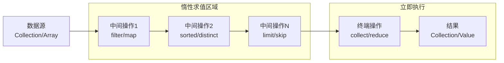
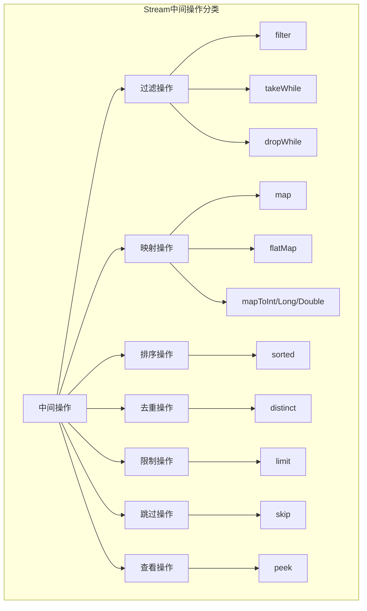
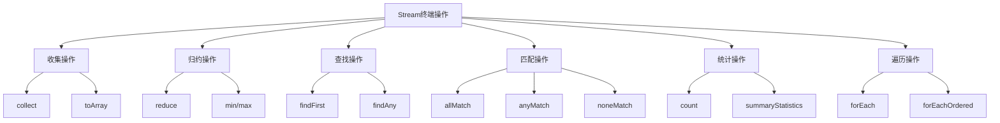
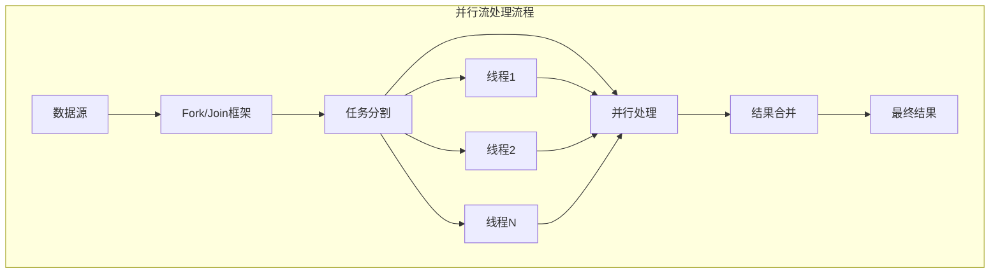

import Tabs from '@theme/Tabs';
import TabItem from '@theme/TabItem';
import CodeBlock from '@theme/CodeBlock';
import TOCInline from '@theme/TOCInline';

# Java Stream API完全指南

Java 8引入的Stream API是Java函数式编程的重要里程碑，它提供了一种声明式的方式来处理集合数据。Stream API不仅让代码更加简洁、可读，还支持并行处理，大大提升了Java处理数据的能力和开发效率。

:::info 本文内容概览
<TOCInline toc={toc} />
:::

:::tip 核心价值
**Stream API = 声明式编程 + 函数式风格 + 并行处理 + 流水线操作**
- 📝 **声明式编程**：关注做什么而非怎么做，提高代码可读性
- λ **函数式风格**：使用函数组合和表达式，减少副作用
- ⚡ **并行处理**：简单切换并行执行，充分利用多核处理能力
- 🔄 **流水线操作**：链式API支持多阶段处理，简化复杂数据转换
- 🧩 **内置操作**：丰富的内置操作符，简化常见数据处理任务
:::

## 1. Stream基础概念与原理

### 1.1 Stream核心概念

Stream不是数据结构，而是数据源的视图。它不存储数据，而是按需计算。Stream操作分为中间操作和终端操作。



#### Stream特性对比表

| 特性 | 传统集合操作 | Stream API | 优势 |
|------|-------------|------------|------|
| **执行方式** | 立即执行 | 惰性求值 | 性能优化，避免不必要计算 |
| **数据修改** | 可能修改原数据 | 不修改原数据 | 数据安全，函数式编程 |
| **并行处理** | 需要手动实现 | 内置并行支持 | 简化并发编程 |
| **代码风格** | 命令式 | 声明式 | 代码更简洁易读 |
| **链式调用** | 不支持 | 完全支持 | 流畅的API体验 |
| **内存使用** | 可能创建中间集合 | 按需处理 | 内存效率更高 |

<Tabs>
<TabItem value="stream-basics" label="Stream基础">

### Stream创建与基本操作

```java title="Stream创建方式完整示例"
import java.util.*;
import java.util.stream.*;
import java.nio.file.*;
import java.io.IOException;

public class StreamCreationDemo {
    public static void main(String[] args) throws IOException {
        // 1. 从集合创建Stream
        List<String> languages = Arrays.asList("Java", "Python", "JavaScript", "C++", "Go");
        Stream<String> streamFromList = languages.stream();
        System.out.println("从List创建: " + streamFromList.collect(Collectors.toList()));
        
        // 2. 从数组创建Stream
        String[] array = {"Apple", "Banana", "Cherry", "Date"};
        Stream<String> streamFromArray = Arrays.stream(array);
        System.out.println("从数组创建: " + streamFromArray.collect(Collectors.toList()));
        
        // 3. 使用Stream.of()创建
        Stream<Integer> streamOf = Stream.of(1, 2, 3, 4, 5);
        System.out.println("使用of()创建: " + streamOf.collect(Collectors.toList()));
        
        // 4. 创建空Stream
        Stream<String> emptyStream = Stream.empty();
        System.out.println("空Stream元素数量: " + emptyStream.count());
        
        // 5. 使用Stream.generate()创建无限流
        Stream<Double> randomStream = Stream.generate(Math::random).limit(5);
        System.out.println("随机数流: " + randomStream.collect(Collectors.toList()));
        
        // 6. 使用Stream.iterate()创建
        Stream<Integer> iterateStream = Stream.iterate(0, n -> n + 2).limit(10);
        System.out.println("迭代流(偶数): " + iterateStream.collect(Collectors.toList()));
        
        // 7. 从范围创建IntStream
        IntStream rangeStream = IntStream.range(1, 6);
        System.out.println("范围流: " + rangeStream.boxed().collect(Collectors.toList()));
        
        // 8. 从文件创建Stream
        try {
            Stream<String> fileStream = Files.lines(Paths.get("example.txt"));
            // 注意：实际使用时需要确保文件存在
            // System.out.println("文件行数: " + fileStream.count());
        } catch (Exception e) {
            System.out.println("文件不存在，跳过文件流示例");
        }
        
        // 9. 从字符串创建字符流
        IntStream charStream = "Hello World".chars();
        System.out.println("字符流: " + charStream.mapToObj(c -> (char) c).collect(Collectors.toList()));
        
        // 10. 并行流创建
        Stream<String> parallelStream = languages.parallelStream();
        System.out.println("并行流处理: " + parallelStream.map(String::toUpperCase).collect(Collectors.toList()));
    }
}
```

</TabItem>
<TabItem value="stream-pipeline" label="Stream流水线">

### Stream操作流水线

```java title="Stream操作流水线详解"
import java.util.*;
import java.util.stream.*;

public class StreamPipelineDemo {
    
    static class Product {
        private String name;
        private String category;
        private double price;
        private int stock;
        private boolean available;
        
        public Product(String name, String category, double price, int stock, boolean available) {
            this.name = name;
            this.category = category;
            this.price = price;
            this.stock = stock;
            this.available = available;
        }
        
        // getters
        public String getName() { return name; }
        public String getCategory() { return category; }
        public double getPrice() { return price; }
        public int getStock() { return stock; }
        public boolean isAvailable() { return available; }
        
        @Override
        public String toString() {
            return String.format("Product{name='%s', category='%s', price=%.2f, stock=%d, available=%s}",
                name, category, price, stock, available);
        }
    }
    
    public static void main(String[] args) {
        // 创建测试数据
        List<Product> products = Arrays.asList(
            new Product("iPhone 14", "Electronics", 999.99, 50, true),
            new Product("MacBook Pro", "Electronics", 2499.99, 20, true),
            new Product("AirPods", "Electronics", 179.99, 100, true),
            new Product("Java编程思想", "Books", 89.99, 30, true),
            new Product("Spring实战", "Books", 79.99, 0, false),
            new Product("Nike运动鞋", "Sports", 129.99, 80, true),
            new Product("Adidas T恤", "Sports", 49.99, 0, false),
            new Product("咖啡机", "Home", 299.99, 15, true)
        );
        
        System.out.println("=== 原始数据 ===");
        products.forEach(System.out::println);
        
        // 复杂的Stream流水线操作
        System.out.println("\n=== 复杂流水线处理 ===");
        Map<String, List<String>> result = products.stream()
            .filter(product -> product.isAvailable())           // 过滤：只要可用的产品
            .filter(product -> product.getPrice() > 50)         // 过滤：价格大于50
            .peek(product -> System.out.println("处理中: " + product.getName())) // 调试：查看处理过程
            .sorted(Comparator.comparing(Product::getPrice).reversed()) // 排序：按价格降序
            .limit(5)                                           // 限制：只取前5个
            .collect(Collectors.groupingBy(                     // 分组：按类别分组
                Product::getCategory,
                Collectors.mapping(Product::getName, Collectors.toList())
            ));
        
        System.out.println("\n=== 处理结果 ===");
        result.forEach((category, productNames) -> {
            System.out.println(category + ": " + productNames);
        });
        
        // 统计信息
        System.out.println("\n=== 统计信息 ===");
        DoubleSummaryStatistics priceStats = products.stream()
            .filter(Product::isAvailable)
            .mapToDouble(Product::getPrice)
            .summaryStatistics();
        
        System.out.println("价格统计: " + priceStats);
        System.out.println("平均价格: " + String.format("%.2f", priceStats.getAverage()));
        System.out.println("最高价格: " + priceStats.getMax());
        System.out.println("最低价格: " + priceStats.getMin());
        System.out.println("总计: " + String.format("%.2f", priceStats.getSum()));
        
        // 查找操作
        System.out.println("\n=== 查找操作 ===");
        Optional<Product> mostExpensive = products.stream()
            .filter(Product::isAvailable)
            .max(Comparator.comparing(Product::getPrice));
        
        mostExpensive.ifPresent(product -> 
            System.out.println("最贵的产品: " + product.getName() + " - $" + product.getPrice()));
        
        // 检查操作
        boolean hasExpensiveProduct = products.stream()
            .anyMatch(product -> product.getPrice() > 2000);
        System.out.println("是否有价格超过2000的产品: " + hasExpensiveProduct);
        
        boolean allAvailable = products.stream()
            .allMatch(Product::isAvailable);
        System.out.println("所有产品都可用: " + allAvailable);
    }
}
```

</TabItem>
<TabItem value="lazy-evaluation" label="惰性求值">

### 惰性求值机制

```java title="惰性求值演示"
import java.util.*;
import java.util.stream.*;

public class LazyEvaluationDemo {
    
    // 自定义函数，用于演示何时执行
    public static String processString(String input) {
        System.out.println("处理字符串: " + input);
        return input.toUpperCase();
    }
    
    public static boolean isLongString(String input) {
        System.out.println("检查字符串长度: " + input);
        return input.length() > 5;
    }
    
    public static void main(String[] args) {
        List<String> words = Arrays.asList("apple", "banana", "cherry", "date", "elderberry", "fig");
        
        System.out.println("=== 演示惰性求值 ===");
        System.out.println("创建Stream（注意：没有任何输出）");
        
        Stream<String> stream = words.stream()
            .filter(word -> {
                System.out.println("过滤: " + word);
                return word.length() > 4;
            })
            .map(word -> {
                System.out.println("映射: " + word);
                return word.toUpperCase();
            });
        
        System.out.println("Stream已创建，但还没有执行任何操作");
        System.out.println("现在执行终端操作...");
        
        List<String> result = stream.collect(Collectors.toList());
        System.out.println("结果: " + result);
        
        System.out.println("\n=== 短路操作演示 ===");
        // 短路操作：findFirst会在找到第一个匹配元素后停止处理
        Optional<String> firstLong = words.stream()
            .filter(word -> {
                System.out.println("短路过滤: " + word);
                return word.length() > 5;
            })
            .findFirst();
        
        System.out.println("第一个长字符串: " + firstLong.orElse("未找到"));
        
        System.out.println("\n=== limit操作的短路效果 ===");
        List<String> limitedResult = words.stream()
            .filter(word -> {
                System.out.println("limit过滤: " + word);
                return word.length() > 3;
            })
            .limit(2)  // 只取前2个
            .collect(Collectors.toList());
        
        System.out.println("限制结果: " + limitedResult);
        
        System.out.println("\n=== 无终端操作的Stream ===");
        // 这个Stream不会执行任何操作，因为没有终端操作
        words.stream()
            .filter(word -> {
                System.out.println("这行不会打印: " + word);
                return true;
            })
            .map(word -> {
                System.out.println("这行也不会打印: " + word);
                return word.toUpperCase();
            });
        
        System.out.println("没有终端操作，所以上面的中间操作都不会执行");
        
        System.out.println("\n=== 性能对比：传统方式 vs Stream ===");
        
        // 传统方式
        long startTime = System.nanoTime();
        List<String> traditionalResult = new ArrayList<>();
        for (String word : words) {
            if (word.length() > 4) {
                traditionalResult.add(word.toUpperCase());
            }
        }
        long traditionalTime = System.nanoTime() - startTime;
        
        // Stream方式
        startTime = System.nanoTime();
        List<String> streamResult = words.stream()
            .filter(word -> word.length() > 4)
            .map(String::toUpperCase)
            .collect(Collectors.toList());
        long streamTime = System.nanoTime() - startTime;
        
        System.out.println("传统方式结果: " + traditionalResult);
        System.out.println("Stream方式结果: " + streamResult);
        System.out.println("传统方式耗时: " + traditionalTime + " 纳秒");
        System.out.println("Stream方式耗时: " + streamTime + " 纳秒");
    }
}
```

</TabItem>
</Tabs>

## 2. Stream中间操作详解

中间操作是Stream处理的核心，它们是惰性的，只有在遇到终端操作时才会执行。



<Tabs>
<TabItem value="filter-operations" label="过滤操作">

### 过滤操作详解

```java title="过滤操作完整示例"
import java.util.*;
import java.util.stream.*;

public class FilterOperationsDemo {
    
    static class Employee {
        private String name;
        private String department;
        private int age;
        private double salary;
        private List<String> skills;
        
        public Employee(String name, String department, int age, double salary, String... skills) {
            this.name = name;
            this.department = department;
            this.age = age;
            this.salary = salary;
            this.skills = Arrays.asList(skills);
        }
        
        // getters
        public String getName() { return name; }
        public String getDepartment() { return department; }
        public int getAge() { return age; }
        public double getSalary() { return salary; }
        public List<String> getSkills() { return skills; }
        
        @Override
        public String toString() {
            return String.format("Employee{name='%s', dept='%s', age=%d, salary=%.0f, skills=%s}",
                name, department, age, salary, skills);
        }
    }
    
    public static void main(String[] args) {
        List<Employee> employees = Arrays.asList(
            new Employee("张三", "IT", 28, 8000, "Java", "Spring", "MySQL"),
            new Employee("李四", "IT", 32, 12000, "Python", "Django", "PostgreSQL"),
            new Employee("王五", "HR", 29, 6000, "招聘", "培训"),
            new Employee("赵六", "Finance", 35, 9000, "会计", "审计"),
            new Employee("钱七", "IT", 26, 7000, "JavaScript", "React", "Node.js"),
            new Employee("孙八", "Marketing", 31, 7500, "市场分析", "广告策划"),
            new Employee("周九", "IT", 40, 15000, "Java", "架构设计", "团队管理")
        );
        
        System.out.println("=== 原始员工数据 ===");
        employees.forEach(System.out::println);
        
        // 1. 基础过滤 - filter()
        System.out.println("\n=== IT部门员工 ===");
        List<Employee> itEmployees = employees.stream()
            .filter(emp -> "IT".equals(emp.getDepartment()))
            .collect(Collectors.toList());
        itEmployees.forEach(System.out::println);
        
        // 2. 复合条件过滤
        System.out.println("\n=== IT部门且薪资>8000的员工 ===");
        List<Employee> highSalaryIT = employees.stream()
            .filter(emp -> "IT".equals(emp.getDepartment()))
            .filter(emp -> emp.getSalary() > 8000)
            .collect(Collectors.toList());
        highSalaryIT.forEach(System.out::println);
        
        // 3. 使用Predicate组合
        System.out.println("\n=== 使用Predicate组合条件 ===");
        Predicate<Employee> isIT = emp -> "IT".equals(emp.getDepartment());
        Predicate<Employee> isHighSalary = emp -> emp.getSalary() > 10000;
        Predicate<Employee> isYoung = emp -> emp.getAge() < 30;
        
        // 年轻的高薪IT员工
        List<Employee> youngHighSalaryIT = employees.stream()
            .filter(isIT.and(isHighSalary).and(isYoung))
            .collect(Collectors.toList());
        System.out.println("年轻高薪IT员工: " + youngHighSalaryIT);
        
        // IT或高薪员工
        List<Employee> itOrHighSalary = employees.stream()
            .filter(isIT.or(isHighSalary))
            .collect(Collectors.toList());
        System.out.println("IT或高薪员工数量: " + itOrHighSalary.size());
        
        // 4. 基于集合属性过滤
        System.out.println("\n=== 掌握Java技能的员工 ===");
        List<Employee> javaEmployees = employees.stream()
            .filter(emp -> emp.getSkills().contains("Java"))
            .collect(Collectors.toList());
        javaEmployees.forEach(System.out::println);
        
        // 5. 空值过滤
        List<String> namesWithNulls = Arrays.asList("Alice", null, "Bob", "", "Charlie", null);
        System.out.println("\n=== 过滤空值和空字符串 ===");
        List<String> validNames = namesWithNulls.stream()
            .filter(Objects::nonNull)
            .filter(name -> !name.trim().isEmpty())
            .collect(Collectors.toList());
        System.out.println("有效姓名: " + validNames);
        
        // 6. 范围过滤
        System.out.println("\n=== 年龄在25-35之间的员工 ===");
        List<Employee> ageRangeEmployees = employees.stream()
            .filter(emp -> emp.getAge() >= 25 && emp.getAge() <= 35)
            .collect(Collectors.toList());
        ageRangeEmployees.forEach(emp -> 
            System.out.println(emp.getName() + " - 年龄: " + emp.getAge()));
        
        // 7. 自定义复杂过滤逻辑
        System.out.println("\n=== 资深员工（年龄>30且薪资>平均薪资） ===");
        double avgSalary = employees.stream()
            .mapToDouble(Employee::getSalary)
            .average()
            .orElse(0.0);
        
        System.out.println("平均薪资: " + String.format("%.2f", avgSalary));
        
        List<Employee> seniorEmployees = employees.stream()
            .filter(emp -> emp.getAge() > 30 && emp.getSalary() > avgSalary)
            .collect(Collectors.toList());
        seniorEmployees.forEach(System.out::println);
    }
}
```

</TabItem>
<TabItem value="map-operations" label="映射操作">

### 映射操作详解

```java title="映射操作完整示例"
import java.util.*;
import java.util.stream.*;

public class MapOperationsDemo {
    
    static class Order {
        private String orderId;
        private String customerId;
        private List<OrderItem> items;
        private double totalAmount;
        
        public Order(String orderId, String customerId, double totalAmount, OrderItem... items) {
            this.orderId = orderId;
            this.customerId = customerId;
            this.totalAmount = totalAmount;
            this.items = Arrays.asList(items);
        }
        
        // getters
        public String getOrderId() { return orderId; }
        public String getCustomerId() { return customerId; }
        public List<OrderItem> getItems() { return items; }
        public double getTotalAmount() { return totalAmount; }
        
        @Override
        public String toString() {
            return String.format("Order{id='%s', customer='%s', total=%.2f, items=%d}",
                orderId, customerId, totalAmount, items.size());
        }
    }
    
    static class OrderItem {
        private String productName;
        private int quantity;
        private double price;
        
        public OrderItem(String productName, int quantity, double price) {
            this.productName = productName;
            this.quantity = quantity;
            this.price = price;
        }
        
        // getters
        public String getProductName() { return productName; }
        public int getQuantity() { return quantity; }
        public double getPrice() { return price; }
        
        @Override
        public String toString() {
            return String.format("OrderItem{product='%s', qty=%d, price=%.2f}",
                productName, quantity, price);
        }
    }
    
    public static void main(String[] args) {
        // 创建测试数据
        List<Order> orders = Arrays.asList(
            new Order("ORD001", "CUST001", 299.99,
                new OrderItem("笔记本电脑", 1, 199.99),
                new OrderItem("鼠标", 2, 50.00)),
            new Order("ORD002", "CUST002", 89.98,
                new OrderItem("键盘", 1, 79.99),
                new OrderItem("鼠标垫", 1, 9.99)),
            new Order("ORD003", "CUST001", 1299.99,
                new OrderItem("显示器", 1, 899.99),
                new OrderItem("音响", 1, 400.00))
        );
        
        System.out.println("=== 原始订单数据 ===");
        orders.forEach(System.out::println);
        
        // 1. 基础映射 - map()
        System.out.println("\n=== 提取订单ID ===");
        List<String> orderIds = orders.stream()
            .map(Order::getOrderId)
            .collect(Collectors.toList());
        System.out.println("订单ID列表: " + orderIds);
        
        // 2. 映射到不同类型
        System.out.println("\n=== 订单总金额列表 ===");
        List<Double> totalAmounts = orders.stream()
            .map(Order::getTotalAmount)
            .collect(Collectors.toList());
        System.out.println("总金额列表: " + totalAmounts);
        
        // 3. 复杂对象映射
        System.out.println("\n=== 创建订单摘要 ===");
        List<String> orderSummaries = orders.stream()
            .map(order -> String.format("订单%s: 客户%s, 金额%.2f, 商品%d件",
                order.getOrderId(),
                order.getCustomerId(),
                order.getTotalAmount(),
                order.getItems().size()))
            .collect(Collectors.toList());
        orderSummaries.forEach(System.out::println);
        
        // 4. flatMap - 扁平化操作
        System.out.println("\n=== 所有订单项（使用flatMap） ===");
        List<OrderItem> allItems = orders.stream()
            .flatMap(order -> order.getItems().stream())
            .collect(Collectors.toList());
        allItems.forEach(System.out::println);
        
        // 5. flatMap复杂示例 - 提取所有产品名称
        System.out.println("\n=== 所有产品名称（去重） ===");
        List<String> allProductNames = orders.stream()
            .flatMap(order -> order.getItems().stream())
            .map(OrderItem::getProductName)
            .distinct()
            .collect(Collectors.toList());
        System.out.println("所有产品: " + allProductNames);
        
        // 6. mapToInt/mapToDouble - 映射到基本类型
        System.out.println("\n=== 数值统计 ===");
        IntSummaryStatistics itemStats = orders.stream()
            .flatMap(order -> order.getItems().stream())
            .mapToInt(OrderItem::getQuantity)
            .summaryStatistics();
        
        System.out.println("商品数量统计: " + itemStats);
        System.out.println("总商品数量: " + itemStats.getSum());
        System.out.println("平均数量: " + itemStats.getAverage());
        
        DoubleSummaryStatistics priceStats = orders.stream()
            .mapToDouble(Order::getTotalAmount)
            .summaryStatistics();
        
        System.out.println("订单金额统计: " + priceStats);
        System.out.println("总金额: " + String.format("%.2f", priceStats.getSum()));
        System.out.println("平均金额: " + String.format("%.2f", priceStats.getAverage()));
        
        // 7. 链式映射操作
        System.out.println("\n=== 链式映射：客户订单统计 ===");
        Map<String, Double> customerTotals = orders.stream()
            .collect(Collectors.groupingBy(
                Order::getCustomerId,
                Collectors.summingDouble(Order::getTotalAmount)
            ));
        
        List<String> customerSummaries = customerTotals.entrySet().stream()
            .map(entry -> String.format("客户%s: 总消费%.2f", entry.getKey(), entry.getValue()))
            .sorted()
            .collect(Collectors.toList());
        
        customerSummaries.forEach(System.out::println);
        
        // 8. 条件映射
        System.out.println("\n=== 条件映射：订单等级 ===");
        List<String> orderLevels = orders.stream()
            .map(order -> {
                String level;
                if (order.getTotalAmount() > 1000) {
                    level = "VIP";
                } else if (order.getTotalAmount() > 200) {
                    level = "高级";
                } else {
                    level = "普通";
                }
                return order.getOrderId() + " - " + level;
            })
            .collect(Collectors.toList());
        
        orderLevels.forEach(System.out::println);
        
        // 9. 映射到Optional
        System.out.println("\n=== 安全映射示例 ===");
        List<String> safeCustomerIds = orders.stream()
            .map(order -> Optional.ofNullable(order.getCustomerId())
                .filter(id -> !id.isEmpty())
                .orElse("UNKNOWN"))
            .collect(Collectors.toList());
        
        System.out.println("安全的客户ID: " + safeCustomerIds);
        
        // 10. 自定义映射函数
        System.out.println("\n=== 自定义映射函数 ===");
        Function<Order, String> orderFormatter = order -> 
            String.format("[%s] %s (%.2f元)", 
                order.getOrderId(), 
                order.getCustomerId(), 
                order.getTotalAmount());
        
        List<String> formattedOrders = orders.stream()
            .map(orderFormatter)
            .collect(Collectors.toList());
        
        formattedOrders.forEach(System.out::println);
    }
}
```

</TabItem>
<TabItem value="sort-distinct" label="排序去重">

### 排序和去重操作

```java title="排序去重操作完整示例"
import java.util.*;
import java.util.stream.*;

public class SortDistinctDemo {
    
    static class Student {
        private String name;
        private int age;
        private String major;
        private double gpa;
        private List<String> courses;
        
        public Student(String name, int age, String major, double gpa, String... courses) {
            this.name = name;
            this.age = age;
            this.major = major;
            this.gpa = gpa;
            this.courses = Arrays.asList(courses);
        }
        
        // getters
        public String getName() { return name; }
        public int getAge() { return age; }
        public String getMajor() { return major; }
        public double getGpa() { return gpa; }
        public List<String> getCourses() { return courses; }
        
        @Override
        public String toString() {
            return String.format("Student{name='%s', age=%d, major='%s', gpa=%.2f}",
                name, age, major, gpa);
        }
        
        @Override
        public boolean equals(Object obj) {
            if (this == obj) return true;
            if (obj == null || getClass() != obj.getClass()) return false;
            Student student = (Student) obj;
            return Objects.equals(name, student.name) && Objects.equals(major, student.major);
        }
        
        @Override
        public int hashCode() {
            return Objects.hash(name, major);
        }
    }
    
    public static void main(String[] args) {
        List<Student> students = Arrays.asList(
            new Student("张三", 20, "计算机科学", 3.8, "数据结构", "算法", "数据库"),
            new Student("李四", 22, "软件工程", 3.6, "软件架构", "设计模式"),
            new Student("王五", 19, "计算机科学", 3.9, "操作系统", "网络编程"),
            new Student("赵六", 21, "信息管理", 3.4, "信息系统", "数据分析"),
            new Student("钱七", 20, "软件工程", 3.7, "项目管理", "软件测试"),
            new Student("张三", 20, "计算机科学", 3.8, "数据结构", "算法"), // 重复数据
            new Student("孙八", 23, "计算机科学", 3.5, "人工智能", "机器学习"),
            new Student("周九", 22, "信息管理", 3.2, "数据挖掘", "商业智能")
        );
        
        System.out.println("=== 原始学生数据 ===");
        students.forEach(System.out::println);
        
        // 1. 基础排序 - 按年龄排序
        System.out.println("\n=== 按年龄升序排序 ===");
        List<Student> sortedByAge = students.stream()
            .sorted(Comparator.comparing(Student::getAge))
            .collect(Collectors.toList());
        sortedByAge.forEach(System.out::println);
        
        // 2. 降序排序 - 按GPA降序
        System.out.println("\n=== 按GPA降序排序 ===");
        List<Student> sortedByGpaDesc = students.stream()
            .sorted(Comparator.comparing(Student::getGpa).reversed())
            .collect(Collectors.toList());
        sortedByGpaDesc.forEach(System.out::println);
        
        // 3. 多字段排序
        System.out.println("\n=== 多字段排序：专业升序，GPA降序 ===");
        List<Student> multiFieldSorted = students.stream()
            .sorted(Comparator.comparing(Student::getMajor)
                .thenComparing(Student::getGpa, Comparator.reverseOrder()))
            .collect(Collectors.toList());
        multiFieldSorted.forEach(System.out::println);
        
        // 4. 自定义排序逻辑
        System.out.println("\n=== 自定义排序：年龄分组排序 ===");
        List<Student> customSorted = students.stream()
            .sorted((s1, s2) -> {
                // 先按年龄分组：20岁以下、20-22岁、22岁以上
                int ageGroup1 = s1.getAge() < 20 ? 0 : (s1.getAge() <= 22 ? 1 : 2);
                int ageGroup2 = s2.getAge() < 20 ? 0 : (s2.getAge() <= 22 ? 1 : 2);
                
                if (ageGroup1 != ageGroup2) {
                    return Integer.compare(ageGroup1, ageGroup2);
                }
                
                // 同一年龄组内按GPA降序
                return Double.compare(s2.getGpa(), s1.getGpa());
            })
            .collect(Collectors.toList());
        
        customSorted.forEach(student -> 
            System.out.println(String.format("年龄组: %s, %s", 
                getAgeGroup(student.getAge()), student)));
        
        // 5. 去重操作 - distinct()
        System.out.println("\n=== 去重操作 ===");
        List<Student> distinctStudents = students.stream()
            .distinct()
            .collect(Collectors.toList());
        System.out.println("去重前数量: " + students.size());
        System.out.println("去重后数量: " + distinctStudents.size());
        distinctStudents.forEach(System.out::println);
        
        // 6. 基于特定字段去重
        System.out.println("\n=== 基于专业去重（保留GPA最高的） ===");
        Map<String, Student> bestByMajor = students.stream()
            .collect(Collectors.toMap(
                Student::getMajor,
                student -> student,
                (existing, replacement) -> 
                    existing.getGpa() > replacement.getGpa() ? existing : replacement
            ));
        
        bestByMajor.values().forEach(System.out::println);
        
        // 7. 复杂去重：基于多个字段
        System.out.println("\n=== 基于姓名和年龄去重 ===");
        List<Student> distinctByNameAge = students.stream()
            .collect(Collectors.toMap(
                student -> student.getName() + "-" + student.getAge(),
                student -> student,
                (existing, replacement) -> existing
            ))
            .values()
            .stream()
            .sorted(Comparator.comparing(Student::getName))
            .collect(Collectors.toList());
        
        distinctByNameAge.forEach(System.out::println);
        
        // 8. 排序 + 去重组合
        System.out.println("\n=== 排序后去重：按专业分组，每组取GPA最高的2名 ===");
        Map<String, List<Student>> topStudentsByMajor = students.stream()
            .distinct()
            .sorted(Comparator.comparing(Student::getGpa).reversed())
            .collect(Collectors.groupingBy(Student::getMajor))
            .entrySet().stream()
            .collect(Collectors.toMap(
                Map.Entry::getKey,
                entry -> entry.getValue().stream().limit(2).collect(Collectors.toList())
            ));
        
        topStudentsByMajor.forEach((major, topStudents) -> {
            System.out.println(major + "专业前2名:");
            topStudents.forEach(student -> System.out.println("  " + student));
        });
        
        // 9. 字符串去重和排序
        System.out.println("\n=== 所有课程去重排序 ===");
        List<String> allCourses = students.stream()
            .flatMap(student -> student.getCourses().stream())
            .distinct()
            .sorted()
            .collect(Collectors.toList());
        
        System.out.println("所有课程: " + allCourses);
        
        // 10. 性能对比：排序 vs 去重顺序
        System.out.println("\n=== 性能测试：先排序后去重 vs 先去重后排序 ===");
        
        // 创建大量重复数据进行测试
        List<Student> largeDataset = new ArrayList<>();
        for (int i = 0; i < 1000; i++) {
            largeDataset.addAll(students);
        }
        
        // 先排序后去重
        long startTime = System.nanoTime();
        List<Student> sortThenDistinct = largeDataset.stream()
            .sorted(Comparator.comparing(Student::getGpa))
            .distinct()
            .collect(Collectors.toList());
        long sortFirstTime = System.nanoTime() - startTime;
        
        // 先去重后排序
        startTime = System.nanoTime();
        List<Student> distinctThenSort = largeDataset.stream()
            .distinct()
            .sorted(Comparator.comparing(Student::getGpa))
            .collect(Collectors.toList());
        long distinctFirstTime = System.nanoTime() - startTime;
        
        System.out.println("数据量: " + largeDataset.size());
        System.out.println("先排序后去重耗时: " + sortFirstTime / 1_000_000 + " ms");
        System.out.println("先去重后排序耗时: " + distinctFirstTime / 1_000_000 + " ms");
        System.out.println("结果数量相同: " + (sortThenDistinct.size() == distinctThenSort.size()));
    }
    
    private static String getAgeGroup(int age) {
        if (age < 20) return "19岁以下";
        if (age <= 22) return "20-22岁";
        return "22岁以上";
    }
}
```

</TabItem>
</Tabs>

## 3. Stream终端操作详解

终端操作会触发流的处理并产生结果。一旦执行了终端操作，流就被消费了，不能再次使用。


 4. 并行流与性能优化

并行流是Stream API的重要特性，可以充分利用多核处理器的优势。



:::warning 并行流使用注意事项
1. **数据量要足够大**：小数据集使用并行流可能反而降低性能
2. **避免有状态操作**：如sorted、distinct等操作会影响并行性能
3. **线程安全**：确保Lambda表达式中的操作是线程安全的
4. **I/O密集型任务**：不适合使用并行流，应该使用异步处理
:::

<Tabs>
<TabItem value="parallel-basics" label="并行流基础">

### 并行流基础操作

```java title="并行流基础示例"
import java.util.*;
import java.util.concurrent.*;
import java.util.stream.*;

public class ParallelStreamBasics {
    
    public static void main(String[] args) {
        // 创建大量测试数据
        List<Integer> numbers = IntStream.rangeClosed(1, 1_000_000)
            .boxed()
            .collect(Collectors.toList());
        
        System.out.println("数据量: " + numbers.size());
        System.out.println("可用处理器数量: " + Runtime.getRuntime().availableProcessors());
        
        // 1. 串行流 vs 并行流性能对比
        System.out.println("\n=== 性能对比：计算平方和 ===");
        
        // 串行流
        long startTime = System.currentTimeMillis();
        long serialSum = numbers.stream()
            .mapToLong(n -> (long) n * n)
            .sum();
        long serialTime = System.currentTimeMillis() - startTime;
        
        // 并行流
        startTime = System.currentTimeMillis();
        long parallelSum = numbers.parallelStream()
            .mapToLong(n -> (long) n * n)
            .sum();
        long parallelTime = System.currentTimeMillis() - startTime;
        
        System.out.println("串行结果: " + serialSum + ", 耗时: " + serialTime + "ms");
        System.out.println("并行结果: " + parallelSum + ", 耗时: " + parallelTime + "ms");
        System.out.println("性能提升: " + String.format("%.2fx", (double) serialTime / parallelTime));
        
        // 2. 并行流创建方式
        System.out.println("\n=== 并行流创建方式 ===");
        
        // 方式1: 从集合创建并行流
        Stream<Integer> parallelStream1 = numbers.parallelStream();
        
        // 方式2: 将串行流转换为并行流
        Stream<Integer> parallelStream2 = numbers.stream().parallel();
        
        // 方式3: 直接创建并行流
        IntStream parallelIntStream = IntStream.range(1, 1000).parallel();
        
        System.out.println("并行流1是否并行: " + parallelStream1.isParallel());
        System.out.println("并行流2是否并行: " + parallelStream2.isParallel());
        System.out.println("并行IntStream是否并行: " + parallelIntStream.isParallel());
        
        // 3. 并行流转串行流
        Stream<Integer> sequentialStream = numbers.parallelStream().sequential();
        System.out.println("转换后是否并行: " + sequentialStream.isParallel());
        
        // 4. 复杂计算的并行处理
        System.out.println("\n=== 复杂计算并行处理 ===");
        
        // 模拟复杂计算函数
        Function<Integer, Double> complexCalculation = n -> {
            double result = 0;
            for (int i = 1; i <= 1000; i++) {
                result += Math.sin(n * i) * Math.cos(n * i);
            }
            return result;
        };
        
        List<Integer> smallDataset = IntStream.rangeClosed(1, 1000)
            .boxed()
            .collect(Collectors.toList());
        
        // 串行复杂计算
        startTime = System.currentTimeMillis();
        double serialComplexSum = smallDataset.stream()
            .mapToDouble(complexCalculation::apply)
            .sum();
        long serialComplexTime = System.currentTimeMillis() - startTime;
        
        // 并行复杂计算
        startTime = System.currentTimeMillis();
        double parallelComplexSum = smallDataset.parallelStream()
            .mapToDouble(complexCalculation::apply)
            .sum();
        long parallelComplexTime = System.currentTimeMillis() - startTime;
        
        System.out.println("串行复杂计算: " + String.format("%.2f", serialComplexSum) + 
                          ", 耗时: " + serialComplexTime + "ms");
        System.out.println("并行复杂计算: " + String.format("%.2f", parallelComplexSum) + 
                          ", 耗时: " + parallelComplexTime + "ms");
        System.out.println("复杂计算性能提升: " + 
                          String.format("%.2fx", (double) serialComplexTime / parallelComplexTime));
    }
}
```

</TabItem>
<TabItem value="parallel-performance" label="性能优化">

### 并行流性能优化

```java title="并行流性能优化实践"
import java.util.*;
import java.util.concurrent.*;
import java.util.stream.*;

public class ParallelStreamOptimization {
    
    // 自定义ForkJoinPool
    private static final ForkJoinPool customThreadPool = new ForkJoinPool(8);
    
    public static void main(String[] args) {
        // 1. 数据量对并行性能的影响
        System.out.println("=== 数据量对并行性能的影响 ===");
        testDataSizeImpact();
        
        // 2. 操作类型对并行性能的影响
        System.out.println("\n=== 操作类型对并行性能的影响 ===");
        testOperationTypeImpact();
        
        // 3. 自定义线程池
        System.out.println("\n=== 自定义线程池 ===");
        testCustomThreadPool();
        
        // 4. 并行流的陷阱
        System.out.println("\n=== 并行流的陷阱 ===");
        demonstrateParallelPitfalls();
        
        // 清理资源
        customThreadPool.shutdown();
    }
    
    private static void testDataSizeImpact() {
        int[] dataSizes = {1_000, 10_000, 100_000, 1_000_000};
        
        for (int size : dataSizes) {
            List<Integer> data = IntStream.rangeClosed(1, size)
                .boxed()
                .collect(Collectors.toList());
            
            // 串行处理
            long startTime = System.nanoTime();
            long serialSum = data.stream()
                .mapToLong(n -> (long) n * n)
                .sum();
            long serialTime = System.nanoTime() - startTime;
            
            // 并行处理
            startTime = System.nanoTime();
            long parallelSum = data.parallelStream()
                .mapToLong(n -> (long) n * n)
                .sum();
            long parallelTime = System.nanoTime() - startTime;
            
            double speedup = (double) serialTime / parallelTime;
            
            System.out.printf("数据量: %,d, 串行: %dms, 并行: %dms, 加速比: %.2fx%n",
                size, serialTime / 1_000_000, parallelTime / 1_000_000, speedup);
        }
    }
    
    private static void testOperationTypeImpact() {
        List<Integer> data = IntStream.rangeClosed(1, 100_000)
            .boxed()
            .collect(Collectors.toList());
        
        // 测试不同类型的操作
        Map<String, Runnable> operations = new LinkedHashMap<>();
        
        // CPU密集型操作
        operations.put("CPU密集型", () -> {
            long serialTime = measureTime(() -> 
                data.stream().mapToDouble(n -> Math.sin(n) * Math.cos(n)).sum());
            long parallelTime = measureTime(() -> 
                data.parallelStream().mapToDouble(n -> Math.sin(n) * Math.cos(n)).sum());
            
            System.out.printf("  串行: %dms, 并行: %dms, 加速比: %.2fx%n",
                serialTime, parallelTime, (double) serialTime / parallelTime);
        });
        
        // 简单操作
        operations.put("简单操作", () -> {
            long serialTime = measureTime(() -> 
                data.stream().mapToLong(n -> n * 2L).sum());
            long parallelTime = measureTime(() -> 
                data.parallelStream().mapToLong(n -> n * 2L).sum());
            
            System.out.printf("  串行: %dms, 并行: %dms, 加速比: %.2fx%n",
                serialTime, parallelTime, (double) serialTime / parallelTime);
        });
        
        // 有状态操作
        operations.put("有状态操作", () -> {
            long serialTime = measureTime(() -> 
                data.stream().sorted().limit(1000).count());
            long parallelTime = measureTime(() -> 
                data.parallelStream().sorted().limit(1000).count());
            
            System.out.printf("  串行: %dms, 并行: %dms, 加速比: %.2fx%n",
                serialTime, parallelTime, (double) serialTime / parallelTime);
        });
        
        operations.forEach((name, operation) -> {
            System.out.println(name + ":");
            operation.run();
        });
    }
    
    private static void testCustomThreadPool() {
        List<Integer> data = IntStream.rangeClosed(1, 100_000)
            .boxed()
            .collect(Collectors.toList());
        
        // 默认ForkJoinPool
        long defaultTime = measureTime(() -> 
            data.parallelStream()
                .mapToDouble(n -> Math.sin(n) * Math.cos(n))
                .sum());
        
        // 自定义ForkJoinPool
        long customTime = measureTime(() -> {
            try {
                return customThreadPool.submit(() ->
                    data.parallelStream()
                        .mapToDouble(n -> Math.sin(n) * Math.cos(n))
                        .sum()
                ).get();
            } catch (Exception e) {
                throw new RuntimeException(e);
            }
        });
        
        System.out.println("默认线程池 (并行度: " + 
            ForkJoinPool.commonPool().getParallelism() + "): " + defaultTime + "ms");
        System.out.println("自定义线程池 (并行度: " + 
            customThreadPool.getParallelism() + "): " + customTime + "ms");
    }
    
    private static void demonstrateParallelPitfalls() {
        List<Integer> data = IntStream.rangeClosed(1, 10_000)
            .boxed()
            .collect(Collectors.toList());
        
        // 陷阱1: 线程安全问题
        System.out.println("陷阱1: 线程安全问题");
        List<Integer> unsafeList = new ArrayList<>(); // 非线程安全
        List<Integer> safeList = Collections.synchronizedList(new ArrayList<>()); // 线程安全
        
        // 不安全的并行操作
        data.parallelStream()
            .filter(n -> n % 2 == 0)
            .forEach(unsafeList::add); // 可能导致数据丢失或异常
        
        // 安全的并行操作
        data.parallelStream()
            .filter(n -> n % 2 == 0)
            .forEach(safeList::add);
        
        System.out.println("不安全列表大小: " + unsafeList.size() + " (可能不正确)");
        System.out.println("安全列表大小: " + safeList.size());
        System.out.println("预期大小: " + data.stream().mapToInt(n -> n % 2 == 0 ? 1 : 0).sum());
        
        // 陷阱2: 装箱/拆箱开销
        System.out.println("\n陷阱2: 装箱/拆箱开销");
        
        // 使用包装类型（有装箱开销）
        long boxedTime = measureTime(() -> 
            data.parallelStream()
                .map(n -> n * n)
                .reduce(0, Integer::sum));
        
        // 使用基本类型（无装箱开销）
        long primitiveTime = measureTime(() -> 
            data.parallelStream()
                .mapToInt(n -> n * n)
                .sum());
        
        System.out.println("包装类型耗时: " + boxedTime + "ms");
        System.out.println("基本类型耗时: " + primitiveTime + "ms");
        System.out.println("性能差异: " + String.format("%.2fx", (double) boxedTime / primitiveTime));
        
        // 陷阱3: 错误的归约操作
        System.out.println("\n陷阱3: 错误的归约操作");
        
        // 错误的归约（非结合律）
        String wrongResult = data.parallelStream()
            .limit(10)
            .map(String::valueOf)
            .reduce("", (a, b) -> a + "-" + b); // 结果不确定
        
        // 正确的归约
        String correctResult = data.parallelStream()
            .limit(10)
            .map(String::valueOf)
            .collect(Collectors.joining("-"));
        
        System.out.println("错误归约结果: " + wrongResult);
        System.out.println("正确归约结果: " + correctResult);
    }
    
    private static long measureTime(Runnable operation) {
        long startTime = System.currentTimeMillis();
        operation.run();
        return System.currentTimeMillis() - startTime;
    }
    
    private static long measureTime(Supplier<Object> operation) {
        long startTime = System.currentTimeMillis();
        operation.get();
        return System.currentTimeMillis() - startTime;
    }
}
```

</TabItem>
</Tabs>

## 5. Stream最佳实践与设计模式

掌握Stream的最佳实践和常见设计模式，能够写出更优雅、高效的代码。

:::tip 最佳实践原则
1. **优先使用Stream API**：相比传统循环，Stream更简洁易读
2. **合理选择并行流**：只在数据量大且CPU密集时使用
3. **避免副作用**：Lambda表达式应该是纯函数
4. **使用方法引用**：提高代码可读性
5. **链式调用要适度**：过长的链式调用影响可读性
:::

通过掌握Stream API的这些核心概念和最佳实践，你可以编写出更加简洁、高效、易维护的Java代码，充分发挥函数式编程的优势。

## 6. 面试题精选

### 6.1 什么是Stream API？它有什么优势？

**答案：** Stream API是Java 8引入的处理集合的API，它允许以声明式方式处理数据集合，支持函数式编程范式。

Stream API的主要优势：
1. **声明式编程**：关注"做什么"而非"怎么做"，代码更加简洁、可读
2. **函数式风格**：支持Lambda表达式和方法引用，减少样板代码
3. **并行处理**：轻松切换并行/串行执行，充分利用多核处理能力
4. **惰性求值**：中间操作延迟执行，只有在终端操作时才会执行，提高性能
5. **链式操作**：支持多步骤流水线处理，API设计流畅
6. **内置丰富操作**：提供filter、map、reduce等多种数据处理操作
7. **无副作用**：不修改数据源，符合函数式编程原则

### 6.2 Stream的中间操作和终端操作有什么区别？常用的操作有哪些？

**答案：** 
- **中间操作(Intermediate Operations)**：返回一个新的Stream，可以链式调用多个中间操作，不会立即执行
- **终端操作(Terminal Operations)**：触发实际计算，返回一个非Stream的结果，执行后Stream不能再被使用

**常用中间操作：**
- `filter(Predicate)`: 过滤元素
- `map(Function)`: 转换元素
- `flatMap(Function)`: 扁平化嵌套集合
- `distinct()`: 去除重复
- `sorted()`: 排序
- `peek(Consumer)`: 查看元素(调试)
- `limit(n)`: 限制元素数量
- `skip(n)`: 跳过元素

**常用终端操作：**
- `collect(Collector)`: 收集结果到容器
- `forEach(Consumer)`: 遍历每个元素
- `reduce(BinaryOperator)`: 归约操作
- `count()`: 计数
- `anyMatch(Predicate)`: 是否存在匹配元素
- `allMatch(Predicate)`: 是否全部匹配
- `noneMatch(Predicate)`: 是否全部不匹配
- `findFirst()/findAny()`: 查找元素
- `min()/max()`: 查找最小/最大值

```java
// 中间操作示例
List<String> result = names.stream()  // 创建Stream
    .filter(name -> name.length() > 5)  // 中间操作1
    .map(String::toUpperCase)  // 中间操作2
    .sorted()  // 中间操作3
    .collect(Collectors.toList());  // 终端操作
```

### 6.3 Stream与Collection的区别是什么？

**答案：** Stream与Collection的主要区别：

| 特性 | Stream | Collection |
|------|--------|------------|
| **目的** | 处理数据 | 存储数据 |
| **数据存储** | 不存储数据 | 存储数据 |
| **执行方式** | 惰性计算 | 立即计算 |
| **消费性** | 只能遍历一次 | 可以多次遍历 |
| **数据修改** | 不修改数据源 | 可以修改数据 |
| **并行处理** | 内置支持并行 | 需手动实现并行 |
| **无限大小** | 可以表示无限序列 | 总是有限大小 |

### 6.4 如何正确使用并行流(parallelStream)？什么情况下应该避免使用？

**答案：** 

**正确使用并行流的原则：**
1. **数据量足够大**：对于小数据集，并行处理的开销可能超过收益
2. **操作足够重**：CPU密集型操作更适合并行处理
3. **数据结构易拆分**：ArrayList、数组分解高效，LinkedList分解效率低
4. **避免共享可变状态**：并行操作中避免修改共享变量
5. **合理设置线程池大小**：根据CPU核心数和任务特性调整并行度

```java
// 并行流示例
long sum = IntStream.rangeClosed(1, 10_000_000)
    .parallel()  // 切换到并行模式
    .filter(n -> n % 2 == 0)
    .mapToLong(n -> n * n)
    .sum();

// 自定义并行度
System.setProperty("java.util.concurrent.ForkJoinPool.common.parallelism", "8");
```

**避免使用并行流的场景：**
1. **I/O绑定操作**：如文件读写、网络操作
2. **顺序敏感操作**：结果依赖于元素处理顺序
3. **很小的数据量**：并行开销可能大于收益(通常低于1万元素)
4. **不可分割的数据源**：如LinkedList等难以有效分割的结构
5. **使用非线程安全的操作或收集器**：如普通ArrayList::add

### 6.5 请解释Stream中的Collector收集器，并列举几个常用的收集器。

**答案：** Collector是一种终端操作，用于将Stream中的元素累积到结果容器中，如List、Map等。Collectors类提供了多种预定义的收集器。

**常用收集器：**

1. **转换为集合**：
```java
// 转为List
List<String> list = stream.collect(Collectors.toList());
// 转为Set
Set<String> set = stream.collect(Collectors.toSet());
// 转为特定集合
TreeSet<String> treeSet = stream.collect(Collectors.toCollection(TreeSet::new));
```

2. **字符串连接**：
```java
// 简单连接
String joined = stream.collect(Collectors.joining());
// 带分隔符
String joined = stream.collect(Collectors.joining(", "));
// 带前缀和后缀
String joined = stream.collect(Collectors.joining(", ", "[", "]"));
```

3. **分组和分区**：
```java
// 按属性分组
Map<Department, List<Employee>> byDept = employees.stream()
    .collect(Collectors.groupingBy(Employee::getDepartment));
// 多级分组
Map<Department, Map<EmployeeType, List<Employee>>> byDeptAndType = employees.stream()
    .collect(Collectors.groupingBy(Employee::getDepartment,
             Collectors.groupingBy(Employee::getType)));
// 分区(特殊分组)
Map<Boolean, List<Employee>> partitioned = employees.stream()
    .collect(Collectors.partitioningBy(emp -> emp.getSalary() > 50000));
```

4. **统计和汇总**：
```java
// 求和
int total = stream.collect(Collectors.summingInt(User::getAge));
// 平均值
double avg = stream.collect(Collectors.averagingInt(User::getAge));
// 汇总统计
IntSummaryStatistics stats = stream.collect(Collectors.summarizingInt(User::getAge));
```

5. **归约和映射**：
```java
// 归约(类似reduce)
Optional<User> oldest = users.stream()
    .collect(Collectors.reducing((u1, u2) -> u1.getAge() > u2.getAge() ? u1 : u2));
// 映射后收集
Map<Integer, String> idToName = users.stream()
    .collect(Collectors.toMap(User::getId, User::getName));
```

**自定义收集器**：可以通过实现Collector接口或使用Collector.of()方法创建自定义收集器，满足特殊需求。