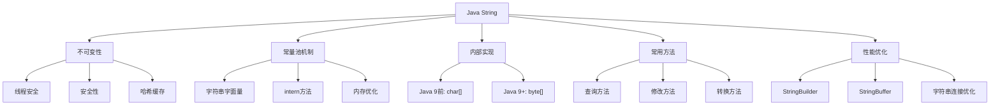
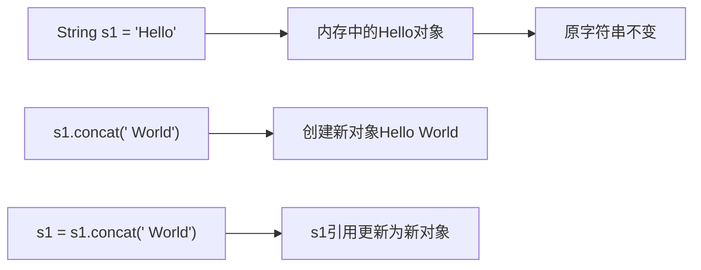
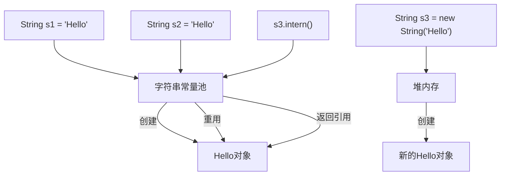
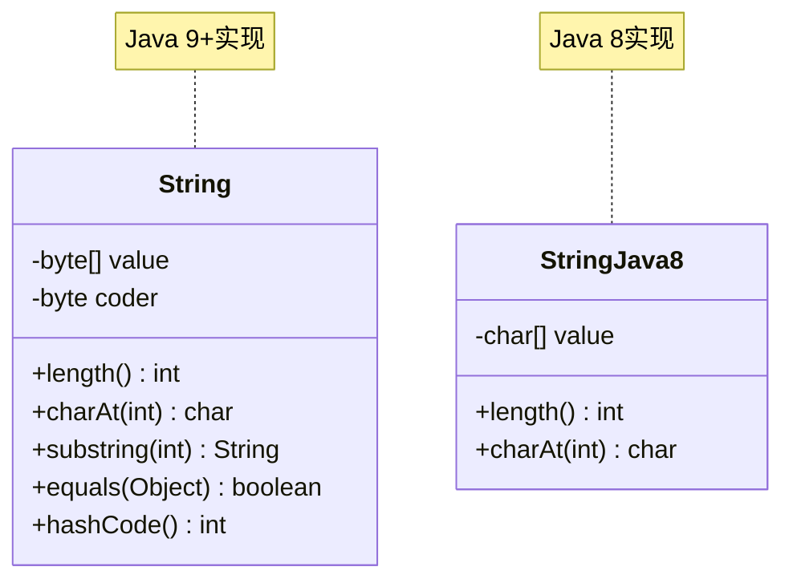
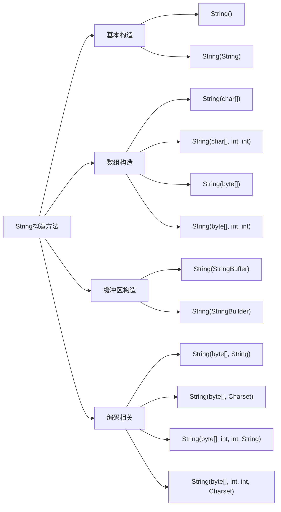
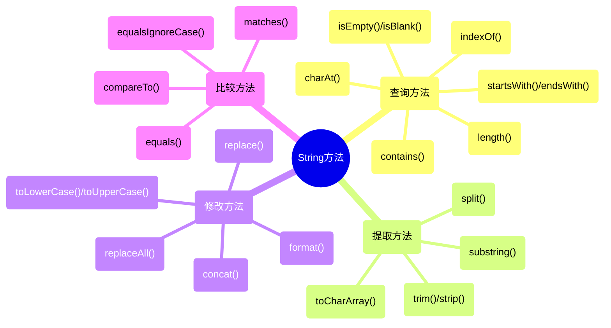
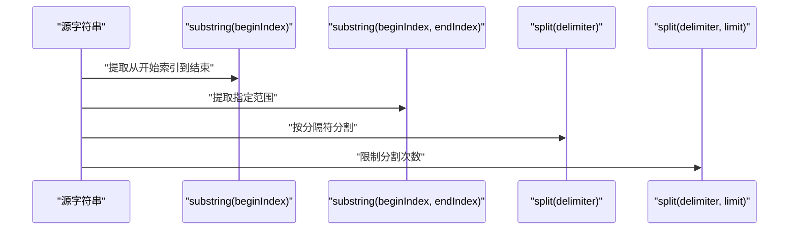
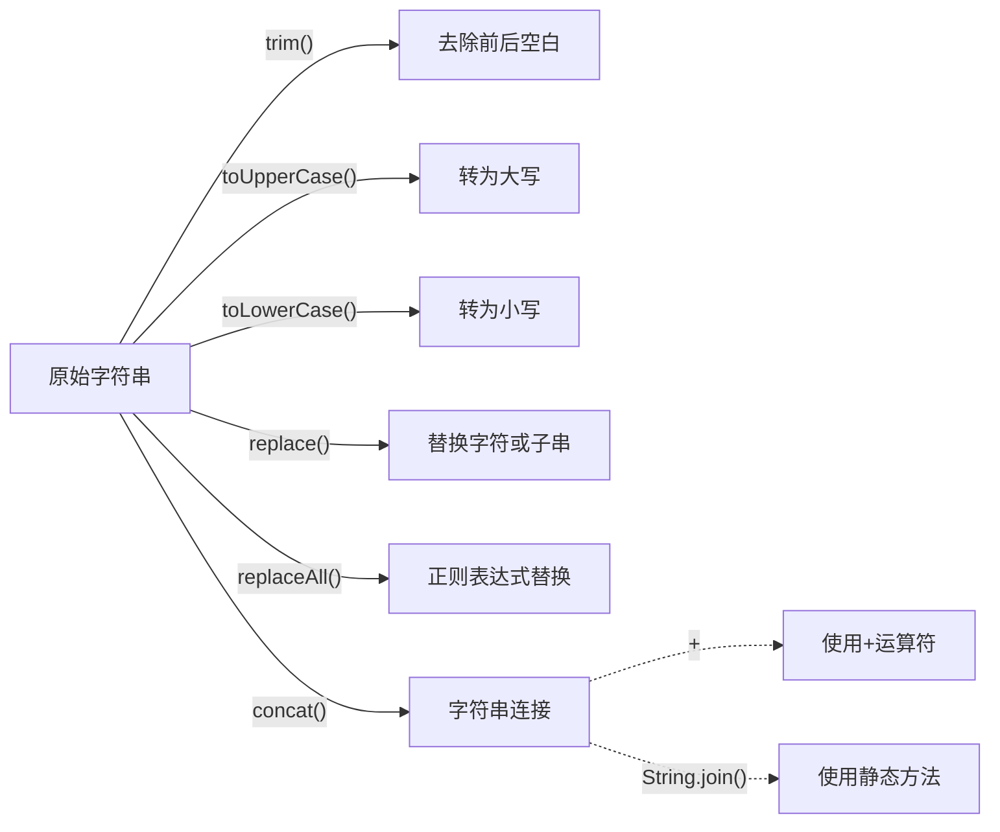
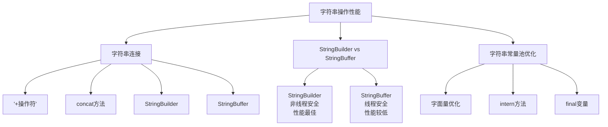
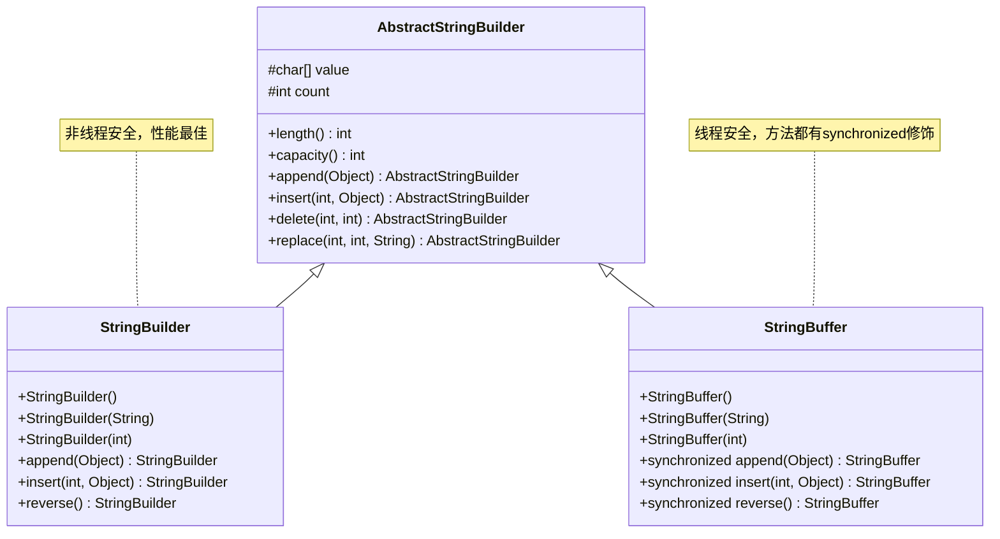

import Tabs from '@theme/Tabs';
import TabItem from '@theme/TabItem';
import TOCInline from '@theme/TOCInline';

# Java String类详解

String是Java中使用最广泛的类之一，用于表示字符串。虽然字符串在Java中作为对象处理，但Java提供了特殊的语法支持，使其用起来像基本数据类型一样方便。理解String类的特性和内部机制对于编写高效的Java程序至关重要。

<TOCInline toc={toc} />



:::tip 核心概念
String = 不可变性 + 字符串常量池 + 丰富的操作方法 + 性能优化
:::

## 1. String类基础特性

<Tabs>
  <TabItem value="immutable" label="不可变性" default>
    
### 1.1 不可变性（Immutability）

String对象是**不可变的**（immutable），这意味着一旦创建，其内容就不能被修改。任何修改操作都会创建一个新的String对象。



```java title="不可变性示例"
public class StringImmutabilityDemo {
    public static void main(String[] args) {
        // 基本不可变性演示
String s1 = "Hello";
s1.concat(" World");  // 创建了新的字符串"Hello World"，但s1没有改变
System.out.println(s1);  // 输出: Hello

// 如果要保存修改后的值，需要重新赋值
s1 = s1.concat(" World");
System.out.println(s1);  // 输出: Hello World

// 验证不可变性
String original = "Java";
String modified = original.toUpperCase();  // 创建新对象
System.out.println("Original: " + original);    // Java
System.out.println("Modified: " + modified);    // JAVA
System.out.println("Same object? " + (original == modified));  // false
        
        // 进一步验证不可变性
        String test = "Test";
        String testCopy = test;  // testCopy和test指向同一个对象
        test = test + "Modified";  // test指向新对象，testCopy仍然指向原对象
        System.out.println("test: " + test);           // TestModified
        System.out.println("testCopy: " + testCopy);   // Test
        System.out.println("Same object? " + (test == testCopy)); // false
    }
}
```

**不可变性的好处：**

<Tabs>
  <TabItem value="thread-safety" label="线程安全" default>
    多个线程可以同时访问同一个字符串而不会导致数据一致性问题，不需要额外的同步机制。
  </TabItem>
  <TabItem value="security" label="安全性">
    用于存储密码、网络连接等敏感信息时更安全，因为内容无法被修改。
  </TabItem>
  <TabItem value="hashcode" label="哈希缓存">
    String对象的哈希值可以被缓存，无需重新计算，适合作为HashMap或HashSet的键。
  </TabItem>
  <TabItem value="pool" label="字符串常量池">
    不可变性使JVM能够优化内存使用，通过常量池复用相同内容的字符串对象。
  </TabItem>
</Tabs>

:::caution 性能考虑
不可变性虽然带来很多好处，但在频繁修改字符串的场景下可能影响性能。此时应考虑使用StringBuilder或StringBuffer。
:::

  </TabItem>
  <TabItem value="pool" label="字符串常量池">

### 1.2 字符串常量池（String Pool）

为了提高效率和减少内存消耗，Java为字符串维护了一个特殊的内存区域，称为"字符串常量池"。



```java title="字符串常量池示例"
public class StringPoolDemo {
    public static void main(String[] args) {
        // 基本常量池演示
String s1 = "Hello";  // 创建一个字符串并放入常量池
String s2 = "Hello";  // 直接引用常量池中的字符串
String s3 = new String("Hello");  // 强制在堆中创建新对象

System.out.println(s1 == s2);  // true，指向同一个对象
System.out.println(s1 == s3);  // false，指向不同对象
System.out.println(s1.equals(s3));  // true，内容相同

// 使用intern()方法将字符串放入常量池
String s4 = new String("World").intern();
String s5 = "World";
System.out.println(s4 == s5);  // true
        
        // 动态创建的字符串
        String dynamic1 = "Dynamic";
        String dynamic2 = "Dynamic";
        String dynamic3 = new String("Dynamic");
        String dynamic4 = dynamic3.intern();
        
        System.out.println("dynamic1 == dynamic2: " + (dynamic1 == dynamic2));     // true
        System.out.println("dynamic1 == dynamic3: " + (dynamic1 == dynamic3));     // false
        System.out.println("dynamic1 == dynamic4: " + (dynamic1 == dynamic4));     // true
    }
}
```

<Tabs>
  <TabItem value="creation" label="字符串创建方式" default>
    
1. **字面量**：使用双引号直接创建，如`String s = "Hello"`
2. **构造函数**：使用`new`关键字创建，如`String s = new String("Hello")`
3. **字符串方法**：通过其他字符串的方法创建，如`"Hello".concat(" World")`
4. **intern()方法**：将字符串放入常量池并返回引用
  
  </TabItem>
  <TabItem value="memory" label="内存布局">

```java title="内存布局示例"
public class StringMemoryExample {
    public static void main(String[] args) {
        // 方式1：字面量 - 存储在常量池
        String literal1 = "Hello";
        String literal2 = "Hello";
        
        // 方式2：构造函数 - 存储在堆内存
        String constructor1 = new String("Hello");
        String constructor2 = new String("Hello");
        
        // 方式3：字符串连接 - 可能创建新对象
        String concat1 = "Hello" + " World";
        String concat2 = "Hello World";
        
        // 方式4：运行时连接
        String runtime1 = "Hello" + new String(" World");
        String runtime2 = "Hello World";
        
        // 比较引用
        System.out.println("literal1 == literal2: " + (literal1 == literal2));           // true
        System.out.println("constructor1 == constructor2: " + (constructor1 == constructor2)); // false
        System.out.println("concat1 == concat2: " + (concat1 == concat2));               // true（编译时优化）
        System.out.println("runtime1 == runtime2: " + (runtime1 == runtime2));           // false（运行时创建）
        
        // 比较内容
        System.out.println("literal1.equals(constructor1): " + literal1.equals(constructor1)); // true
        System.out.println("concat1.equals(runtime1): " + concat1.equals(runtime1));           // true
    }
}
```

  </TabItem>
</Tabs>

:::info 字符串常量池位置
在Java 7之前，字符串常量池位于永久代(PermGen)。从Java 7开始，字符串常量池被移至堆内存，提高了性能并降低了内存溢出的风险。
:::

  </TabItem>
  <TabItem value="structure" label="内部结构">

### 1.3 String类的内部结构

从Java 9开始，String类的内部实现发生了变化，使用byte数组替代char数组来存储字符串内容。



```java title="String内部结构分析"
public class StringInternalStructure {
    public static void main(String[] args) {
        // 创建不同编码的字符串
        String asciiString = "Hello World";  // ASCII字符
        String chineseString = "你好世界";    // 中文字符
        String emojiString = "Hello 👋";     // 包含emoji
        
        // 获取字符串长度
        System.out.println("ASCII字符串长度: " + asciiString.length());           // 11
        System.out.println("中文字符串长度: " + chineseString.length());         // 4
        System.out.println("Emoji字符串长度: " + emojiString.length());          // 7
        
        // 获取字节数组
        byte[] asciiBytes = asciiString.getBytes();
        byte[] chineseBytes = chineseString.getBytes();
        byte[] emojiBytes = emojiString.getBytes();
        
        System.out.println("ASCII字节数: " + asciiBytes.length);                 // 11
        System.out.println("中文字节数: " + chineseBytes.length);                 // 12 (UTF-8编码)
        System.out.println("Emoji字节数: " + emojiBytes.length);                 // 10 (UTF-8编码)
        
        // 获取字符数组
        char[] asciiChars = asciiString.toCharArray();
        char[] chineseChars = chineseString.toCharArray();
        char[] emojiChars = emojiString.toCharArray();
        
        System.out.println("ASCII字符数: " + asciiChars.length);                 // 11
        System.out.println("中文字符数: " + chineseChars.length);                 // 4
        System.out.println("Emoji字符数: " + emojiChars.length);                 // 7
    }
}
```

<Tabs>
  <TabItem value="java8" label="Java 8及之前" default>
    
```java
// Java 8 中 String 的部分源码
public final class String
    implements java.io.Serializable, Comparable<String>, CharSequence {
    /** The value is used for character storage. */
    private final char value[];

    /** Cache the hash code for the string */
    private int hash; // Default to 0
    
    // ...其他成员和方法...
}
```

  </TabItem>
  <TabItem value="java9" label="Java 9及以后">
    
```java
// Java 9+ 中 String 的部分源码
public final class String
    implements java.io.Serializable, Comparable<String>, CharSequence {
    /** The value is used for character storage. */
    private final byte[] value;

    /** The identifier of the encoding used to encode the bytes in {@code value}. */
    private final byte coder;
    
    /** Cache the hash code for the string */
    private int hash; // Default to 0
    
    // ...其他成员和方法...
}
```

  </TabItem>
</Tabs>

:::tip Java 9的改进
Java 9中String类使用byte[]而非char[]存储数据的主要原因：
1. 节省内存：大多数字符串只包含Latin-1字符，每个字符只需要1个字节而非2个字节
2. 使用coder字段标记编码方式：0代表Latin-1编码，1代表UTF-16编码
3. 平均可节省约20%的内存空间
:::

  </TabItem>
</Tabs>

## 2. String类的构造方法



<Tabs>
  <TabItem value="basic" label="常用构造方法" default>

### 2.1 常用构造方法

String类提供了多种构造方法，用于不同的创建场景。

```java title="String构造方法示例"
public class StringConstructorsDemo {
    public static void main(String[] args) {
        // 1. 无参构造方法 - 创建空字符串
        String empty = new String();
        System.out.println("空字符串: '" + empty + "'");
        System.out.println("长度: " + empty.length());
        System.out.println("是否为空: " + empty.isEmpty());
        
        // 2. 字符串字面量构造
        String literal = new String("Hello World");
        System.out.println("字面量构造: " + literal);
        
        // 3. 字符数组构造
        char[] charArray = {'H', 'e', 'l', 'l', 'o'};
        String fromCharArray = new String(charArray);
        System.out.println("字符数组构造: " + fromCharArray);
        
        // 4. 字符数组部分构造
        String fromCharArrayPart = new String(charArray, 1, 3);  // 从索引1开始，取3个字符
        System.out.println("字符数组部分构造: " + fromCharArrayPart);  // ell
        
        // 5. 字节数组构造
        byte[] byteArray = {72, 101, 108, 108, 111};  // "Hello"的ASCII码
        String fromByteArray = new String(byteArray);
        System.out.println("字节数组构造: " + fromByteArray);
        
        // 6. 字节数组部分构造
        String fromByteArrayPart = new String(byteArray, 1, 3, "UTF-8");
        System.out.println("字节数组部分构造: " + fromByteArrayPart);
        
        // 7. StringBuffer构造
        StringBuffer stringBuffer = new StringBuffer("Hello");
        String fromStringBuffer = new String(stringBuffer);
        System.out.println("StringBuffer构造: " + fromStringBuffer);
        
        // 8. StringBuilder构造
        StringBuilder stringBuilder = new StringBuilder("World");
        String fromStringBuilder = new String(stringBuilder);
        System.out.println("StringBuilder构造: " + fromStringBuilder);
    }
}
```

<Tabs>
  <TabItem value="empty" label="空字符串">
    ```java
    // 创建空字符串
    String s = new String();
    ```
    这是最简单的构造方法，创建一个空字符串，长度为0。等同于`String s = ""`。
  </TabItem>
  <TabItem value="copy" label="字符串拷贝">
    ```java
    // 从现有字符串创建新字符串
    String original = "Hello";
    String copy = new String(original);
    ```
    这个构造方法创建一个与参数内容相同的新字符串对象。注意，这将创建一个新对象，不会重用常量池中的对象。
  </TabItem>
  <TabItem value="array" label="数组构造">
    ```java
    // 从字符数组构造
    char[] chars = {'H', 'e', 'l', 'l', 'o'};
    String s1 = new String(chars);
    
    // 从部分字符数组构造
    String s2 = new String(chars, 1, 3); // "ell"
    
    // 从字节数组构造
    byte[] bytes = {72, 101, 108, 108, 111};
    String s3 = new String(bytes);
    ```
    这些构造方法允许从字符数组或字节数组创建字符串，可以指定起始索引和长度。
  </TabItem>
</Tabs>

  </TabItem>
  <TabItem value="encoding" label="编码相关构造方法">

### 2.2 编码相关构造方法

```java title="编码相关构造方法"
public class StringEncodingDemo {
    public static void main(String[] args) throws Exception {
        String original = "Hello 世界";
        
        // 使用默认编码（通常是UTF-8）
        byte[] defaultBytes = original.getBytes();
        String fromDefaultBytes = new String(defaultBytes);
        System.out.println("默认编码: " + fromDefaultBytes);
        
        // 使用UTF-8编码
        byte[] utf8Bytes = original.getBytes("UTF-8");
        String fromUtf8Bytes = new String(utf8Bytes, "UTF-8");
        System.out.println("UTF-8编码: " + fromUtf8Bytes);
        
        // 使用GBK编码
        byte[] gbkBytes = original.getBytes("GBK");
        String fromGbkBytes = new String(gbkBytes, "GBK");
        System.out.println("GBK编码: " + fromGbkBytes);
        
        // 使用ISO-8859-1编码
        byte[] isoBytes = original.getBytes("ISO-8859-1");
        String fromIsoBytes = new String(isoBytes, "ISO-8859-1");
        System.out.println("ISO-8859-1编码: " + fromIsoBytes);
        
        // 编码问题演示
        System.out.println("UTF-8字节数: " + utf8Bytes.length);
        System.out.println("GBK字节数: " + gbkBytes.length);
        System.out.println("ISO-8859-1字节数: " + isoBytes.length);
    }
}
``` 

<Tabs>
  <TabItem value="encoding-table" label="常用编码对照表" default>
    
| 编码名称 | 特点 | 适用场景 | 中文支持 |
|---------|------|----------|---------|
| UTF-8 | 变长编码，1-4字节 | 网页、国际化应用 | 支持（3字节） |
| UTF-16 | 大部分字符2字节 | Java内部编码 | 支持（2字节） |
| GBK | 中文优化编码 | 中文应用 | 支持（2字节） |
| ISO-8859-1 | 单字节编码 | 西欧语言 | 不支持 |
| ASCII | 单字节编码 | 纯英文 | 不支持 |

  </TabItem>
  <TabItem value="encoding-code" label="编码构造方法">
    ```java
    // 指定字符集名称
    byte[] bytes = "Hello".getBytes("UTF-8");
    String s1 = new String(bytes, "UTF-8");
    
    // 使用Charset对象
    Charset utf8 = Charset.forName("UTF-8");
    byte[] bytes2 = "Hello".getBytes(utf8);
    String s2 = new String(bytes2, utf8);
    
    // 标准字符集常量
    byte[] bytes3 = "Hello".getBytes(StandardCharsets.UTF_8);
    String s3 = new String(bytes3, StandardCharsets.UTF_8);
    ```
    
    :::caution 编码转换警告
    不同编码间的转换如果处理不当，可能导致乱码，特别是对于中文、日文等非ASCII字符。始终使用相同的编码进行getBytes()和new String()操作。
    :::
  </TabItem>
</Tabs>

:::tip 编码最佳实践
1. 尽量使用UTF-8作为默认编码
2. 在处理外部数据时，总是显式指定编码，不要依赖默认编码
3. 使用Java 7引入的StandardCharsets常量而不是字符串形式的编码名称
4. 处理非ASCII字符时，注意验证编码转换的正确性
:::

  </TabItem>
</Tabs>

## 3. String类的常用方法



<Tabs>
  <TabItem value="query" label="查询方法" default>

### 3.1 字符串查询方法

String类提供了丰富的查询方法来获取字符串的各种信息。

```java title="字符串查询方法示例"
public class StringQueryMethodsDemo {
    public static void main(String[] args) {
        String text = "Hello World Java Programming";
        
        // 1. 长度相关
        System.out.println("字符串长度: " + text.length());
        System.out.println("是否为空: " + text.isEmpty());
        System.out.println("是否为空白: " + text.isBlank());  // Java 11+
        
        // 2. 字符访问
        System.out.println("第一个字符: " + text.charAt(0));
        System.out.println("最后一个字符: " + text.charAt(text.length() - 1));
        
        // 3. 子字符串查找
        System.out.println("'World'的位置: " + text.indexOf("World"));
        System.out.println("'Java'的位置: " + text.indexOf("Java"));
        System.out.println("'o'第一次出现位置: " + text.indexOf('o'));
        System.out.println("'o'最后一次出现位置: " + text.lastIndexOf('o'));
        
        // 4. 字符串包含检查
        System.out.println("包含'Hello': " + text.contains("Hello"));
        System.out.println("包含'Python': " + text.contains("Python"));
        
        // 5. 字符串开始和结束检查
        System.out.println("以'Hello'开始: " + text.startsWith("Hello"));
        System.out.println("以'ing'结束: " + text.endsWith("ing"));
        System.out.println("从索引5开始以'World'开始: " + text.startsWith("World", 6));
        
        // 6. 字符串比较
        String text2 = "Hello World Java Programming";
        String text3 = "hello world java programming";
        
        System.out.println("text == text2: " + (text == text2));  // 引用比较
        System.out.println("text.equals(text2): " + text.equals(text2));  // 内容比较
        System.out.println("text.equalsIgnoreCase(text3): " + text.equalsIgnoreCase(text3));  // 忽略大小写比较
        
        // 7. 字符串比较（字典序）
        System.out.println("text.compareTo(text2): " + text.compareTo(text2));  // 0
        System.out.println("text.compareTo(text3): " + text.compareTo(text3));  // 负数
        System.out.println("text.compareToIgnoreCase(text3): " + text.compareToIgnoreCase(text3));  // 0
    }
}
```

<Tabs>
  <TabItem value="length" label="长度和空检查" default>
  
```java
// 字符串长度
int length = str.length();

// 空字符串检查
boolean isEmpty = str.isEmpty();  // 检查是否是空字符串 ""

// Java 11+: 空白检查
boolean isBlank = str.isBlank();  // 检查是否只包含空白字符
```

  </TabItem>
  <TabItem value="index" label="索引和搜索">
  
```java
// 字符访问
char firstChar = str.charAt(0);
char lastChar = str.charAt(str.length() - 1);

// 子字符串搜索
int index = str.indexOf("Hello");    // 首次出现位置
int lastIndex = str.lastIndexOf("o"); // 最后一次出现位置

// 带起始位置的搜索
int fromIndex = str.indexOf("o", 5);  // 从索引5开始搜索首次出现位置

// 包含检查
boolean contains = str.contains("Java");  // 检查是否包含子串
```
  
  </TabItem>
  <TabItem value="startend" label="开始和结束检查">
  
```java
// 开始检查
boolean startsWithHello = str.startsWith("Hello");

// 结束检查
boolean endsWithJava = str.endsWith("Java");

// 带偏移量的开始检查
boolean startsWithWorld = str.startsWith("World", 6); // 从索引6开始检查
```
  
  </TabItem>
  <TabItem value="compare" label="字符串比较">
  
```java
// 相等性比较
boolean isEqual = str1.equals(str2);               // 区分大小写
boolean isEqualIgnoreCase = str1.equalsIgnoreCase(str2); // 不区分大小写

// 字典顺序比较
int result = str1.compareTo(str2);
// 返回值: 负数表示str1小于str2，0表示相等，正数表示str1大于str2

// 不区分大小写字典顺序比较
int resultIgnoreCase = str1.compareToIgnoreCase(str2);
```
  
  </TabItem>
</Tabs>

:::info Java 11+新增方法
Java 11引入了isBlank()、strip()、stripLeading()、stripTrailing()和lines()等新方法，用于增强字符串处理能力。
:::

  </TabItem>
  <TabItem value="extract" label="提取和分割">

### 3.2 字符串提取和分割方法

```java title="字符串提取和分割方法"
public class StringExtractionDemo {
    public static void main(String[] args) {
        String text = "Hello,World,Java,Programming";
        
        // 1. 子字符串提取
        System.out.println("从索引0到5: " + text.substring(0, 5));  // Hello
        System.out.println("从索引6开始: " + text.substring(6));    // World,Java,Programming
        
        // 2. 字符串分割
        String[] parts = text.split(",");
        System.out.println("分割后的部分:");
        for (int i = 0; i < parts.length; i++) {
            System.out.println("  [" + i + "]: " + parts[i]);
        }
        
        // 3. 使用正则表达式分割
        String text2 = "Hello;World.Java:Programming";
        String[] parts2 = text2.split("[;.:]");
        System.out.println("正则分割后的部分:");
        for (int i = 0; i < parts2.length; i++) {
            System.out.println("  [" + i + "]: " + parts2[i]);
        }
        
        // 4. 限制分割次数
        String text3 = "a,b,c,d,e,f";
        String[] parts3 = text3.split(",", 3);  // 最多分割3次
        System.out.println("限制分割次数:");
        for (int i = 0; i < parts3.length; i++) {
            System.out.println("  [" + i + "]: " + parts3[i]);
        }
        
        // 5. 字符串截取
        String longText = "This is a very long text that needs to be truncated";
        if (longText.length() > 20) {
            String truncated = longText.substring(0, 20) + "...";
            System.out.println("截取后: " + truncated);
        }
    }
}
```



<Tabs>
  <TabItem value="substring" label="子字符串提取" default>
  
```java
// 从索引beginIndex到字符串结束
String sub1 = str.substring(6);

// 从索引beginIndex到endIndex-1
String sub2 = str.substring(0, 5);  // 提取索引0,1,2,3,4的字符

// 安全截取（避免IndexOutOfBoundsException）
public static String safeSubstring(String str, int start, int end) {
    if (str == null) return "";
    int length = str.length();
    if (start < 0) start = 0;
    if (end > length) end = length;
    if (start > end) return "";
    return str.substring(start, end);
}
```
  
  </TabItem>
  <TabItem value="split" label="分割字符串">
  
```java
// 基本分割
String[] parts = "a,b,c".split(",");  // 返回 ["a", "b", "c"]

// 使用正则表达式分割
String[] parts2 = "a;b.c:d".split("[;.:]");  // 返回 ["a", "b", "c", "d"]

// 限制分割次数
String[] parts3 = "a,b,c,d".split(",", 2);  // 返回 ["a", "b,c,d"]

// 处理连续分隔符
String[] parts4 = "a,,b".split(",");  // 返回 ["a", "", "b"]
```
  
  </TabItem>
  <TabItem value="whitespace" label="空白处理">
  
```java
// 去除前后空白（传统方法）
String trimmed = "  Hello  ".trim();  // 返回 "Hello"

// Java 11+ 新方法
String stripped = "  Hello  ".strip();        // 去除前后Unicode空白
String stripLeading = "  Hello  ".stripLeading();  // 去除前导空白
String stripTrailing = "  Hello  ".stripTrailing(); // 去除尾部空白
```
  
  </TabItem>
  <TabItem value="convert" label="转换方法">
  
```java
// 转换为字符数组
char[] chars = "Hello".toCharArray();

// 转换为字节数组
byte[] bytes = "Hello".getBytes();
byte[] utf8Bytes = "Hello".getBytes("UTF-8");

// 转换为代码点数组 (Java 9+)
int[] codePoints = "Hello😊".codePoints().toArray();
```
  
  </TabItem>
</Tabs>

  </TabItem>
  <TabItem value="modify" label="修改方法">

### 3.3 字符串修改方法

```java title="字符串修改方法"
public class StringModificationDemo {
    public static void main(String[] args) {
        String original = "  Hello World  ";
        
        // 1. 去除空白字符
        System.out.println("原始字符串: '" + original + "'");
        System.out.println("去除前后空白: '" + original.trim() + "'");
        System.out.println("去除前导空白: '" + original.stripLeading() + "'");  // Java 11+
        System.out.println("去除尾部空白: '" + original.stripTrailing() + "'"); // Java 11+
        
        // 2. 大小写转换
        String text = "Hello World";
        System.out.println("原字符串: " + text);
        System.out.println("转大写: " + text.toUpperCase());
        System.out.println("转小写: " + text.toLowerCase());
        
        // 3. 字符串替换
        String replaceText = "Hello World Hello Java";
        System.out.println("原字符串: " + replaceText);
        System.out.println("替换Hello为Hi: " + replaceText.replace("Hello", "Hi"));
        System.out.println("替换第一个Hello: " + replaceText.replaceFirst("Hello", "Hi"));
        System.out.println("替换所有o为0: " + replaceText.replace('o', '0'));
        
        // 4. 正则表达式替换
        String regexText = "Hello123World456Java";
        System.out.println("原字符串: " + regexText);
        System.out.println("替换数字为#: " + regexText.replaceAll("\\d+", "#"));
        System.out.println("替换第一个数字序列: " + regexText.replaceFirst("\\d+", "#"));
        
        // 5. 字符串连接
        String s1 = "Hello";
        String s2 = "World";
        String s3 = "Java";

// 使用concat方法
        String result1 = s1.concat(" ").concat(s2).concat(" ").concat(s3);
        System.out.println("concat结果: " + result1);
        
        // 使用+操作符
        String result2 = s1 + " " + s2 + " " + s3;
        System.out.println("+操作符结果: " + result2);
        
        // 使用String.join
        String result3 = String.join(" ", s1, s2, s3);
        System.out.println("String.join结果: " + result3);
    }
}
```



<Tabs>
  <TabItem value="case" label="大小写转换" default>
  
```java
// 转大写
String upper = "hello".toUpperCase();  // "HELLO"

// 转小写
String lower = "HELLO".toLowerCase();  // "hello"

// 特定语言环境的大小写转换
String turkishUpper = "istanbul".toUpperCase(Locale.forLanguageTag("tr-TR"));
// 在土耳其语中，i转大写为İ(带点的I)
```
  
  </TabItem>
  <TabItem value="replace" label="替换操作">
  
```java
// 替换单个字符
String replaced1 = "hello".replace('l', 'w');  // "hewwo"

// 替换子字符串
String replaced2 = "hello world".replace("world", "java");  // "hello java"

// 使用正则表达式替换所有匹配
String replaced3 = "hello123world456".replaceAll("\\d+", "#");  // "hello#world#"

// 替换第一个匹配
String replaced4 = "hello hello".replaceFirst("hello", "hi");  // "hi hello"
```
  
  </TabItem>
  <TabItem value="concat" label="连接字符串">
  
```java
// 使用concat方法
String s1 = "hello".concat(" ").concat("world");  // "hello world"

// 使用+运算符（编译器会优化）
String s2 = "hello" + " " + "world";  // "hello world"

// 使用String.join (Java 8+)
String s3 = String.join(" ", "hello", "world");  // "hello world"
String s4 = String.join(",", List.of("a", "b", "c"));  // "a,b,c"

// 使用StringJoiner (Java 8+)
StringJoiner joiner = new StringJoiner(", ", "[", "]");
joiner.add("apple").add("banana").add("cherry");
String s5 = joiner.toString();  // "[apple, banana, cherry]"
```
  
  </TabItem>
  <TabItem value="format" label="格式化">
  
```java
// 基本格式化
String formatted = String.format("Hello, %s", "World");  // "Hello, World"

// 多参数格式化
String multi = String.format("Name: %s, Age: %d", "Alice", 30);

// 数字格式化
String number = String.format("%.2f", 123.456);  // "123.46"

// Java 15+ 文本块
String textBlock = """
    Hello,
    World!
    """;
```
  
  </TabItem>
</Tabs>

:::tip 字符串修改的最佳实践
- 对于简单的连接，使用`+`运算符最为清晰
- 在循环中连接字符串，使用`StringBuilder`而不是`+`
- 对集合元素进行连接，使用`String.join`或`StringJoiner`
- 对格式化输出，使用`String.format`或`printf`
:::

  </TabItem>
</Tabs>

## 4. 字符串操作和性能



<Tabs>
  <TabItem value="concat" label="字符串连接性能分析" default>

### 4.1 字符串连接性能分析

```java title="字符串连接性能分析"
public class StringConcatenationPerformance {
    public static void main(String[] args) {
        int iterations = 10000;
        
        // 1. 使用+操作符连接
        long startTime = System.currentTimeMillis();
        String result1 = "";
        for (int i = 0; i < iterations; i++) {
            result1 += "String" + i + " ";
        }
        long endTime = System.currentTimeMillis();
        System.out.println("+操作符耗时: " + (endTime - startTime) + "ms");
        
        // 2. 使用StringBuilder连接
        startTime = System.currentTimeMillis();
        StringBuilder sb = new StringBuilder();
        for (int i = 0; i < iterations; i++) {
            sb.append("String").append(i).append(" ");
        }
        String result2 = sb.toString();
        endTime = System.currentTimeMillis();
        System.out.println("StringBuilder耗时: " + (endTime - startTime) + "ms");
        
        // 3. 使用StringBuffer连接
        startTime = System.currentTimeMillis();
        StringBuffer sbf = new StringBuffer();
        for (int i = 0; i < iterations; i++) {
            sbf.append("String").append(i).append(" ");
        }
        String result3 = sbf.toString();
        endTime = System.currentTimeMillis();
        System.out.println("StringBuffer耗时: " + (endTime - startTime) + "ms");
        
        // 4. 使用String.join
        startTime = System.currentTimeMillis();
        String[] strings = new String[iterations];
        for (int i = 0; i < iterations; i++) {
            strings[i] = "String" + i;
        }
        String result4 = String.join(" ", strings);
        endTime = System.currentTimeMillis();
        System.out.println("String.join耗时: " + (endTime - startTime) + "ms");
        
        // 验证结果长度
        System.out.println("结果长度验证:");
        System.out.println("  +操作符: " + result1.length());
        System.out.println("  StringBuilder: " + result2.length());
        System.out.println("  StringBuffer: " + result3.length());
        System.out.println("  String.join: " + result4.length());
    }
}
```

<Tabs>
  <TabItem value="plus" label="+ 操作符" default>
    **优点**：
    - 语法简洁，易于理解
    - 少量字符串连接时性能可接受
    - 编译时常量会被优化
    
    **缺点**：
    - 大量连接或在循环中使用性能极差
    - 每次连接都创建新的String对象
    - 循环中使用会导致O(n²)时间复杂度
    
    **适用场景**：简单的少量字符串连接，编译时常量连接
    
    ```java
    // 编译优化示例
    String s = "Hello" + " " + "World"; // 编译器优化为 "Hello World"
    
    // 不推荐的用法
    String result = "";
    for (int i = 0; i < 1000; i++) {
        result += i; // 非常低效!
    }
    ```
  </TabItem>
  <TabItem value="stringbuilder" label="StringBuilder">
    **优点**：
    - 可变字符序列，避免创建多余对象
    - 性能最佳（非线程安全环境）
    - 支持链式调用
    - 可预分配容量减少扩容成本
    
    **缺点**：
    - 非线程安全
    - 代码冗长度高于+操作符
    
    **适用场景**：单线程环境下的大量字符串操作，尤其是在循环中
    
    ```java
    // 高效用法
    StringBuilder sb = new StringBuilder(1000); // 预分配容量
    for (int i = 0; i < 1000; i++) {
        sb.append(i);
    }
    String result = sb.toString();
    
    // 链式调用
    String message = new StringBuilder()
        .append("Hello, ")
        .append("World")
        .append("!")
        .toString();
    ```
  </TabItem>
  <TabItem value="stringbuffer" label="StringBuffer">
    **优点**：
    - 线程安全
    - 可变字符序列
    - 适合多线程环境
    
    **缺点**：
    - 性能低于StringBuilder (约慢10-15%)
    - 代码冗长度高于+操作符
    
    **适用场景**：多线程环境下的字符串操作
    
    ```java
    // 多线程环境示例
    StringBuffer buffer = new StringBuffer();
    
    Runnable task = () -> {
        for (int i = 0; i < 100; i++) {
            buffer.append(i); // 线程安全
        }
    };
    
    Thread t1 = new Thread(task);
    Thread t2 = new Thread(task);
    t1.start(); t2.start();
    ```
  </TabItem>
  <TabItem value="join" label="String.join">
    **优点**：
    - 专为集合元素连接设计
    - 清晰简洁的API
    - 比循环+连接高效
    
    **缺点**：
    - Java 8+才可用
    - 仅适用于已知元素的连接
    - 不适合动态添加内容
    
    **适用场景**：连接数组或集合中的元素
    
    ```java
    // 数组元素连接
    String[] fruits = {"Apple", "Banana", "Cherry"};
    String result = String.join(", ", fruits);
    
    // 集合元素连接
    List<String> names = List.of("Alice", "Bob", "Charlie");
    String nameList = String.join("; ", names);
    ```
  </TabItem>
</Tabs>

:::caution 性能陷阱
在循环中使用`+`或`concat()`连接字符串是常见的性能陷阱。这会导致每次迭代都创建新的字符串对象，时间复杂度为O(n²)。始终在此类场景使用StringBuilder。
:::

  </TabItem>
  <TabItem value="sb" label="StringBuilder和StringBuffer">

### 4.2 StringBuilder和StringBuffer

```java title="StringBuilder和StringBuffer示例"
public class StringBuilderBufferDemo {
    public static void main(String[] args) {
        // 1. StringBuilder基本操作
        StringBuilder sb = new StringBuilder();
        sb.append("Hello");
        sb.append(" ");
        sb.append("World");
        sb.append(" ");
        sb.append("Java");
        
        System.out.println("StringBuilder结果: " + sb.toString());
        System.out.println("长度: " + sb.length());
        System.out.println("容量: " + sb.capacity());
        
        // 2. StringBuilder插入和删除
        sb.insert(5, " Beautiful ");
        System.out.println("插入后: " + sb.toString());
        
        sb.delete(5, 16);
        System.out.println("删除后: " + sb.toString());
        
        sb.replace(5, 10, "Amazing");
        System.out.println("替换后: " + sb.toString());
        
        // 3. StringBuilder反转
        sb.reverse();
        System.out.println("反转后: " + sb.toString());
        sb.reverse();  // 恢复原状
        
        // 4. StringBuilder设置长度
        sb.setLength(10);
        System.out.println("设置长度后: " + sb.toString());
        
        // 5. StringBuffer（线程安全版本）
        StringBuffer sbf = new StringBuffer("Thread Safe");
        sbf.append(" String Buffer");
        System.out.println("StringBuffer结果: " + sbf.toString());
        
        // 6. 性能对比
        int iterations = 100000;
        
        // StringBuilder性能
        long startTime = System.currentTimeMillis();
        StringBuilder sb2 = new StringBuilder();
        for (int i = 0; i < iterations; i++) {
            sb2.append(i);
        }
        long endTime = System.currentTimeMillis();
        System.out.println("StringBuilder耗时: " + (endTime - startTime) + "ms");
        
        // StringBuffer性能
        startTime = System.currentTimeMillis();
        StringBuffer sbf2 = new StringBuffer();
        for (int i = 0; i < iterations; i++) {
            sbf2.append(i);
        }
        endTime = System.currentTimeMillis();
        System.out.println("StringBuffer耗时: " + (endTime - startTime) + "ms");
    }
}
```



<Tabs>
  <TabItem value="common" label="常用操作" default>
    **创建**
    ```java
    // 默认容量构造
    StringBuilder sb1 = new StringBuilder();
    
    // 指定初始容量
    StringBuilder sb2 = new StringBuilder(100);
    
    // 初始字符串
    StringBuilder sb3 = new StringBuilder("Hello");
    ```
    
    **添加内容**
    ```java
    StringBuilder sb = new StringBuilder();
    sb.append("Hello");        // 添加字符串
    sb.append(' ');            // 添加字符
    sb.append(123);            // 添加数字
    sb.append(true);           // 添加布尔值
    sb.append(new char[]{'a', 'b', 'c'}); // 添加字符数组
    ```
    
    **插入内容**
    ```java
    StringBuilder sb = new StringBuilder("HelloWorld");
    sb.insert(5, ' ');         // Hello World
    sb.insert(0, "Start: ");   // Start: Hello World
    ```
    
    **删除内容**
    ```java
    StringBuilder sb = new StringBuilder("Hello World");
    sb.delete(5, 6);           // HelloWorld (删除空格)
    sb.deleteCharAt(5);        // HelloWorld (删除W)
    ```
    
    **替换内容**
    ```java
    StringBuilder sb = new StringBuilder("Hello World");
    sb.replace(6, 11, "Java"); // Hello Java
    ```
  </TabItem>
  <TabItem value="capacity" label="容量管理">
    **容量原理**
    
    StringBuilder和StringBuffer内部维护一个字符数组，初始容量为16。当容量不足时，会自动扩容。默认的扩容策略是将容量翻倍+2。
    
    ```java
    // 检查和管理容量
    StringBuilder sb = new StringBuilder();
    System.out.println("初始容量: " + sb.capacity()); // 通常为16
    
    // 确保容量足够
    sb.ensureCapacity(100);
    System.out.println("扩容后: " + sb.capacity());
    
    // 压缩容量到实际所需
    sb.append("Hello");
    sb.trimToSize();
    System.out.println("压缩后: " + sb.capacity()); // 应为5
    ```
    
    **自定义初始容量**
    
    如果预知大概需要的容量，最好在创建时指定，避免扩容开销：
    
    ```java
    // 好的做法: 预估大小
    StringBuilder sb = new StringBuilder(1000);
    for (int i = 0; i < 1000; i++) {
        sb.append(i);
    }
    
    // 不好的做法: 频繁扩容
    StringBuilder sb2 = new StringBuilder();
    for (int i = 0; i < 1000; i++) {
        sb2.append(i);
    }
    ```
  </TabItem>
  <TabItem value="thread" label="线程安全性">
    **StringBuilder (非线程安全)**
    
    ```java
    // 单线程环境 - 正确
    StringBuilder sb = new StringBuilder();
    for (int i = 0; i < 1000; i++) {
        sb.append(i);
    }
    
    // 多线程环境 - 错误! 可能导致数据损坏或异常
    StringBuilder sharedSb = new StringBuilder();
    Runnable task = () -> {
        for (int i = 0; i < 1000; i++) {
            sharedSb.append(i); // 线程不安全!
        }
    };
    new Thread(task).start();
    new Thread(task).start();
    ```
    
    **StringBuffer (线程安全)**
    
    ```java
    // 多线程环境 - 正确
    StringBuffer buffer = new StringBuffer();
    Runnable task = () -> {
        for (int i = 0; i < 1000; i++) {
            buffer.append(i); // 线程安全
        }
    };
    new Thread(task).start();
    new Thread(task).start();
    ```
    
    :::info
    StringBuffer的线程安全是通过在每个方法上添加`synchronized`关键字实现的，这保证了多线程环境下的安全性，但也带来了约10-15%的性能损失。
    :::
  </TabItem>
</Tabs>

  </TabItem>
  <TabItem value="pool" label="字符串池优化">

### 4.3 字符串池优化

```java title="字符串池优化示例"
public class StringPoolOptimization {
    public static void main(String[] args) {
        // 1. 编译时常量优化
        String s1 = "Hello" + "World";  // 编译时优化为"HelloWorld"
        String s2 = "HelloWorld";
        System.out.println("编译时优化: " + (s1 == s2));  // true
        
        // 2. 运行时连接
        String s3 = "Hello";
        String s4 = "World";
        String s5 = s3 + s4;  // 运行时创建新对象
        String s6 = "HelloWorld";
        System.out.println("运行时连接: " + (s5 == s6));  // false
        
        // 3. final变量优化
        final String finalS1 = "Hello";
        final String finalS2 = "World";
        String s7 = finalS1 + finalS2;  // 编译时优化
        System.out.println("final变量优化: " + (s7 == s6));  // true
        
        // 4. intern()方法使用
        String s8 = new String("InternTest");
        String s9 = s8.intern();
        String s10 = "InternTest";
        System.out.println("intern()优化: " + (s9 == s10));  // true
        
        // 5. 字符串池大小限制
        System.out.println("字符串池优化建议:");
        System.out.println("  - 对于频繁使用的字符串，使用字面量创建");
        System.out.println("  - 对于动态创建的字符串，考虑使用intern()");
        System.out.println("  - 避免在循环中创建大量字符串对象");
        System.out.println("  - 使用StringBuilder进行大量字符串操作");
    }
}
```

<Tabs>
  <TabItem value="compile" label="编译时优化" default>
    编译器会在编译期间优化字符串常量表达式，将多个字符串字面量连接为一个：
    
    ```java
    // 以下代码会被编译为 String s = "HelloWorld";
    String s = "Hello" + "World";
    ```
    
    **字符串常量折叠**
    
    这种优化称为"字符串常量折叠"(String constant folding)，它只适用于编译时常量表达式：
    
    ```java
    // 编译时优化示例
    String s1 = "Hello" + "World" + "!";  // 编译为 "HelloWorld!"
    String s2 = "HelloWorld!";
    System.out.println(s1 == s2);  // true
    
    // 非编译时常量，不会优化
    String hello = "Hello";
    String world = "World";
    String s3 = hello + world;  // 运行时连接，创建新对象
    System.out.println(s3 == s2);  // false
    ```
  </TabItem>
  <TabItem value="final" label="final变量优化">
    使用`final`修饰的变量在编译期间是已知的常量，编译器可以对它们进行优化：
    
    ```java
    // final变量优化
    final String hello = "Hello";
    final String world = "World";
    String s1 = hello + world;  // 编译为 "HelloWorld"
    
    // 非final变量不会优化
    String h = "Hello";
    String w = "World";
    String s2 = h + w;  // 运行时连接
    
    System.out.println(s1 == "HelloWorld");  // true
    System.out.println(s2 == "HelloWorld");  // false
    ```
    
    :::info 字节码验证
    如果查看编译后的字节码，你会发现`final`变量的连接已经在编译阶段被替换为常量"HelloWorld"，而非`final`变量的连接会调用StringBuilder的append方法。
    :::
  </TabItem>
  <TabItem value="intern" label="intern()方法">
    `intern()`方法可以将运行时创建的字符串添加到字符串常量池，并返回常量池中的引用：
    
    ```java
    // 动态创建的字符串
    String s1 = new String("Hello");  // 堆中的对象
    String s2 = s1.intern();          // 常量池中的引用
    String s3 = "Hello";              // 常量池中的引用
    
    System.out.println(s1 == s2);     // false
    System.out.println(s2 == s3);     // true
    ```
    
    **何时使用intern()**
    
    - 大量相同内容的字符串对象
    - 内存敏感应用
    - 需要频繁比较字符串引用相等性的场景
    
    ```java
    // 有效使用intern()的例子
    Map<String, Data> dataCache = new HashMap<>();
    
    void processData(String key, Data value) {
        // 使用intern()避免重复的字符串对象
        dataCache.put(key.intern(), value);
    }
    ```
    
    :::caution 性能考虑
    `intern()`方法需要全局字符串表查找，可能影响性能。在Java 7之前，常量池在PermGen空间，大小有限，过度使用intern()可能导致OutOfMemoryError。Java 7及以后，常量池移至堆内存，这个问题有所缓解，但仍需谨慎使用。
    :::
  </TabItem>
</Tabs>

:::tip 字符串池优化最佳实践
1. 优先使用字面量创建字符串，而不是构造函数
2. 对于需要频繁使用且内容相同的字符串，考虑使用intern()
3. 利用final变量的编译时优化特性
4. 对于大量字符串操作，使用StringBuilder而非+运算符
5. 使用`System.getProperty("java.lang.string.intern.count")`查看常量池使用情况（JVM特定参数）
:::

  </TabItem>
</Tabs>

## 5. 高级字符串操作

### 5.1 正则表达式操作

```java title="正则表达式操作示例"
public class StringRegexDemo {
    public static void main(String[] args) {
        // 1. 基本正则表达式匹配
        String text = "Hello123World456Java789";
        
        // 匹配数字
        String[] numbers = text.split("\\D+");
        System.out.println("提取的数字:");
        for (String number : numbers) {
            if (!number.isEmpty()) {
                System.out.println("  " + number);
            }
        }
        
        // 匹配字母
        String[] letters = text.split("\\d+");
        System.out.println("提取的字母:");
        for (String letter : letters) {
            if (!letter.isEmpty()) {
                System.out.println("  " + letter);
            }
        }
        
        // 2. 复杂正则表达式
        String email = "user@example.com";
        String phone = "123-456-7890";
        String date = "2023-12-25";
        
        // 邮箱验证
        boolean isValidEmail = email.matches("^[a-zA-Z0-9._%+-]+@[a-zA-Z0-9.-]+\\.[a-zA-Z]{2,}$");
        System.out.println("邮箱格式有效: " + isValidEmail);
        
        // 电话号码验证
        boolean isValidPhone = phone.matches("^\\d{3}-\\d{3}-\\d{4}$");
        System.out.println("电话号码格式有效: " + isValidPhone);
        
        // 日期格式验证
        boolean isValidDate = date.matches("^\\d{4}-\\d{2}-\\d{2}$");
        System.out.println("日期格式有效: " + isValidDate);
        
        // 3. 正则表达式替换
        String htmlText = "<p>Hello <b>World</b> <i>Java</i></p>";
        String plainText = htmlText.replaceAll("<[^>]+>", "");
        System.out.println("HTML标签移除后: " + plainText);
        
        // 4. 捕获组使用
        String logEntry = "2023-12-25 10:30:45 [INFO] User login successful";
        String pattern = "(\\d{4}-\\d{2}-\\d{2}) (\\d{2}:\\d{2}:\\d{2}) \\[(\\w+)\\] (.+)";
        
        if (logEntry.matches(pattern)) {
            String[] groups = logEntry.replaceAll(pattern, "$1|$2|$3|$4").split("\\|");
            System.out.println("日志解析结果:");
            System.out.println("  日期: " + groups[0]);
            System.out.println("  时间: " + groups[1]);
            System.out.println("  级别: " + groups[2]);
            System.out.println("  消息: " + groups[3]);
        }
    }
}
```

### 5.2 字符串格式化

```java title="字符串格式化示例"
public class StringFormattingDemo {
    public static void main(String[] args) {
        // 1. String.format方法
        String name = "张三";
        int age = 25;
        double salary = 12345.67;
        
        String formatted1 = String.format("姓名: %s, 年龄: %d, 薪资: %.2f", name, age, salary);
        System.out.println("格式化结果1: " + formatted1);
        
        // 2. 数字格式化
        String numberFormat = String.format("整数: %d, 八进制: %o, 十六进制: %x, 科学计数: %e", 
                                          100, 100, 100, 1000000.0);
        System.out.println("数字格式化: " + numberFormat);
        
        // 3. 字符串对齐和填充
        String leftAlign = String.format("左对齐: %-10s", "Hello");
        String rightAlign = String.format("右对齐: %10s", "World");
        String centerAlign = String.format("居中: %10s", "Java");
        
        System.out.println(leftAlign + "|");
        System.out.println(rightAlign + "|");
        System.out.println(centerAlign + "|");
        
        // 4. 日期时间格式化
        java.util.Date now = new java.util.Date();
        String dateFormat = String.format("当前时间: %tF %tT", now, now);
        System.out.println("日期时间格式化: " + dateFormat);
        
        // 5. 货币格式化
        double amount = 1234567.89;
        String currencyFormat = String.format("金额: $%,.2f", amount);
        System.out.println("货币格式化: " + currencyFormat);
        
        // 6. 自定义格式化
        String customFormat = String.format("自定义: %1$s的%2$s是%3$d", "张三", "年龄", 25);
        System.out.println("自定义格式化: " + customFormat);
    }
}
```

### 5.3 字符串编码和国际化

```java title="字符串编码和国际化示例"
public class StringEncodingDemo {
    public static void main(String[] args) throws Exception {
        // 1. 不同编码的字符串处理
        String original = "Hello 世界";
        
        // UTF-8编码
        byte[] utf8Bytes = original.getBytes("UTF-8");
        String utf8String = new String(utf8Bytes, "UTF-8");
        System.out.println("UTF-8编码: " + utf8String);
        System.out.println("UTF-8字节数: " + utf8Bytes.length);
        
        // GBK编码
        byte[] gbkBytes = original.getBytes("GBK");
        String gbkString = new String(gbkBytes, "GBK");
        System.out.println("GBK编码: " + gbkString);
        System.out.println("GBK字节数: " + gbkBytes.length);
        
        // 2. 编码问题演示
        String chineseText = "你好世界";
        
        // 错误的编码转换
        try {
            byte[] wrongBytes = chineseText.getBytes("ISO-8859-1");
            String wrongString = new String(wrongBytes, "ISO-8859-1");
            System.out.println("错误编码结果: " + wrongString);
        } catch (Exception e) {
            System.out.println("编码错误: " + e.getMessage());
        }
        
        // 3. 字符集检测
        String[] charsets = {"UTF-8", "GBK", "ISO-8859-1", "UTF-16"};
        String testString = "测试字符串";
        
        System.out.println("字符集兼容性测试:");
        for (String charset : charsets) {
            try {
                byte[] bytes = testString.getBytes(charset);
                String decoded = new String(bytes, charset);
                System.out.println("  " + charset + ": " + decoded + " (兼容)");
            } catch (Exception e) {
                System.out.println("  " + charset + ": 不兼容");
            }
        }
        
        // 4. 国际化支持
        java.util.Locale[] locales = {
            java.util.Locale.US,
            java.util.Locale.CHINA,
            java.util.Locale.JAPAN,
            java.util.Locale.GERMANY
        };
        
        System.out.println("国际化测试:");
        for (java.util.Locale locale : locales) {
            System.out.println("  " + locale.getDisplayCountry() + " (" + locale.getLanguage() + "): " + 
                             java.text.NumberFormat.getCurrencyInstance(locale).format(1234.56));
        }
    }
}
```

## 6. 实际应用场景

### 6.1 文本处理工具

```java title="文本处理工具示例"
public class TextProcessingTools {
    public static void main(String[] args) {
        // 1. 文本统计工具
        String text = "Hello World! This is a sample text for demonstration. " +
                     "It contains multiple sentences and various punctuation marks.";
        
        TextStats stats = analyzeText(text);
        System.out.println("文本统计结果:");
        System.out.println("  字符数: " + stats.characterCount);
        System.out.println("  单词数: " + stats.wordCount);
        System.out.println("  句子数: " + stats.sentenceCount);
        System.out.println("  行数: " + stats.lineCount);
        
        // 2. 文本清理工具
        String dirtyText = "  Hello   World  !  \n\n  This   is   dirty   text.  ";
        String cleanText = cleanText(dirtyText);
        System.out.println("清理前: '" + dirtyText + "'");
        System.out.println("清理后: '" + cleanText + "'");
        
        // 3. 文本搜索工具
        String searchText = "Java is a programming language. Java is widely used.";
        String searchTerm = "Java";
        int[] positions = findTextPositions(searchText, searchTerm);
        System.out.println("搜索词 '" + searchTerm + "' 出现位置:");
        for (int pos : positions) {
            System.out.println("  位置: " + pos);
        }
        
        // 4. 文本替换工具
        String template = "Hello {name}, welcome to {company}!";
        String result = replacePlaceholders(template, "张三", "ABC公司");
        System.out.println("模板替换结果: " + result);
    }
    
    // 文本统计类
    static class TextStats {
        int characterCount, wordCount, sentenceCount, lineCount;
    }
    
    // 分析文本统计信息
    public static TextStats analyzeText(String text) {
        TextStats stats = new TextStats();
        
        if (text == null || text.isEmpty()) {
            return stats;
        }
        
        stats.characterCount = text.length();
        stats.wordCount = text.split("\\s+").length;
        stats.sentenceCount = text.split("[.!?]+").length;
        stats.lineCount = text.split("\n").length;
        
        return stats;
    }
    
    // 清理文本
    public static String cleanText(String text) {
        if (text == null) return "";
        
        return text.trim()
                  .replaceAll("\\s+", " ")  // 多个空白字符替换为单个空格
                  .replaceAll("\\n\\s*\\n", "\n")  // 多个空行替换为单个空行
                  .trim();
    }
    
    // 查找文本位置
    public static int[] findTextPositions(String text, String searchTerm) {
        if (text == null || searchTerm == null || searchTerm.isEmpty()) {
            return new int[0];
        }
        
        java.util.List<Integer> positions = new java.util.ArrayList<>();
        int index = 0;
        
        while ((index = text.indexOf(searchTerm, index)) != -1) {
            positions.add(index);
            index += searchTerm.length();
        }
        
        return positions.stream().mapToInt(Integer::intValue).toArray();
    }
    
    // 替换占位符
    public static String replacePlaceholders(String template, String name, String company) {
        return template.replace("{name}", name).replace("{company}", company);
    }
}
```

### 6.2 配置文件解析

```java title="配置文件解析示例"
public class ConfigFileParser {
    public static void main(String[] args) {
        // 模拟配置文件内容
        String configContent = 
            "# 数据库配置\n" +
            "db.host=localhost\n" +
            "db.port=3306\n" +
            "db.username=admin\n" +
            "db.password=123456\n" +
            "\n" +
            "# 应用配置\n" +
            "app.name=MyApplication\n" +
            "app.version=1.0.0\n" +
            "app.debug=true\n" +
            "app.timeout=30000";
        
        // 解析配置文件
        java.util.Map<String, String> config = parseConfig(configContent);
        
        System.out.println("解析的配置:");
        for (java.util.Map.Entry<String, String> entry : config.entrySet()) {
            System.out.println("  " + entry.getKey() + " = " + entry.getValue());
        }
        
        // 获取特定配置
        System.out.println("\n数据库主机: " + config.get("db.host"));
        System.out.println("应用名称: " + config.get("app.name"));
        System.out.println("调试模式: " + config.get("app.debug"));
        
        // 类型转换
        int port = Integer.parseInt(config.get("db.port"));
        boolean debug = Boolean.parseBoolean(config.get("app.debug"));
        long timeout = Long.parseLong(config.get("app.timeout"));
        
        System.out.println("\n类型转换结果:");
        System.out.println("  端口号: " + port + " (int)");
        System.out.println("  调试模式: " + debug + " (boolean)");
        System.out.println("  超时时间: " + timeout + " (long)");
    }
    
    // 解析配置文件
    public static java.util.Map<String, String> parseConfig(String content) {
        java.util.Map<String, String> config = new java.util.HashMap<>();
        
        if (content == null || content.isEmpty()) {
            return config;
        }
        
        String[] lines = content.split("\n");
        
        for (String line : lines) {
            line = line.trim();
            
            // 跳过空行和注释行
            if (line.isEmpty() || line.startsWith("#")) {
                continue;
            }
            
            // 解析键值对
            int equalIndex = line.indexOf('=');
            if (equalIndex > 0) {
                String key = line.substring(0, equalIndex).trim();
                String value = line.substring(equalIndex + 1).trim();
                config.put(key, value);
            }
        }
        
        return config;
    }
}
```

## 7. 面试题精选

### 7.1 基础概念题

**Q: String、StringBuilder、StringBuffer的区别是什么？**

A: 三者的主要区别：
- **String**: 不可变类，线程安全，适合少量字符串操作
- **StringBuilder**: 可变类，非线程安全，性能最好，适合单线程环境
- **StringBuffer**: 可变类，线程安全，性能略低于StringBuilder，适合多线程环境

**Q: 什么是字符串常量池？它有什么作用？**

A: 字符串常量池是JVM中专门存储字符串字面量的内存区域，主要作用：
- 节省内存空间，避免重复创建相同内容的字符串对象
- 提高字符串比较效率，可以直接使用==比较
- 支持字符串的intern()操作

### 7.2 性能优化题

**Q: 如何优化字符串操作的性能？**

A: 字符串性能优化策略：
1. 使用StringBuilder进行大量字符串连接
2. 合理使用字符串常量池
3. 避免在循环中创建字符串对象
4. 使用String.join替代循环连接
5. 合理设置StringBuilder的初始容量

**Q: 什么情况下使用intern()方法？**

A: intern()方法适用于：
- 需要频繁比较的字符串
- 内存敏感的应用
- 字符串内容相对固定的场景
- 需要节省内存的场景

### 7.3 实践题

**Q: 实现一个字符串反转方法，要求不使用额外空间**

A: 
```java
public class StringReversal {
    public static String reverse(String str) {
        if (str == null || str.length() <= 1) {
            return str;
        }
        
        char[] chars = str.toCharArray();
        int left = 0, right = chars.length - 1;
        
        while (left < right) {
            char temp = chars[left];
            chars[left] = chars[right];
            chars[right] = temp;
            left++;
            right--;
        }
        
        return new String(chars);
    }
    
    public static void main(String[] args) {
        String test = "Hello World";
        System.out.println("原字符串: " + test);
        System.out.println("反转后: " + reverse(test));
    }
}
```

**Q: 实现一个方法判断字符串是否为回文**

A: 
```java
public class PalindromeChecker {
    public static boolean isPalindrome(String str) {
        if (str == null) return false;
        
        // 移除所有非字母数字字符并转换为小写
        String clean = str.replaceAll("[^a-zA-Z0-9]", "").toLowerCase();
        
        if (clean.isEmpty()) return true;
        
        int left = 0, right = clean.length() - 1;
        
        while (left < right) {
            if (clean.charAt(left) != clean.charAt(right)) {
                return false;
            }
            left++;
            right--;
        }
        
        return true;
    }
    
    public static void main(String[] args) {
        String[] tests = {
            "A man, a plan, a canal: Panama",
            "race a car",
            "Was it a car or a cat I saw?",
            "Hello World"
        };
        
        for (String test : tests) {
            System.out.println("'" + test + "' 是回文: " + isPalindrome(test));
        }
    }
}
```

## 8. 总结

### 8.1 核心要点回顾

1. **不可变性**: String对象一旦创建就不能修改，所有修改操作都返回新对象
2. **字符串常量池**: JVM优化机制，避免重复创建相同内容的字符串
3. **性能考虑**: 大量字符串操作时使用StringBuilder，少量操作使用String
4. **编码处理**: 正确处理字符串编码，避免乱码问题
5. **最佳实践**: 合理使用字符串方法，注意性能优化

### 8.2 学习建议

1. **深入理解内存机制**: 掌握字符串在内存中的存储方式
2. **实践性能测试**: 通过实际测试了解不同方法的性能差异
3. **关注新特性**: 了解Java新版本中String类的改进
4. **实际项目应用**: 在实际项目中应用字符串处理技巧

### 8.3 进阶方向

1. **文本分析算法**: 学习字符串匹配、搜索等算法
2. **自然语言处理**: 了解文本处理的更高级应用
3. **性能调优**: 深入学习JVM调优和性能分析
4. **框架应用**: 学习Spring等框架中的字符串处理

---

通过本章的学习，你应该已经掌握了Java String类的核心特性、使用方法和性能优化技巧。String类是Java编程中最基础也是最重要的类之一，良好的字符串处理能力是Java开发者的必备技能。

记住：**选择合适的字符串处理方式，既能提高代码可读性，也能优化程序性能。** 