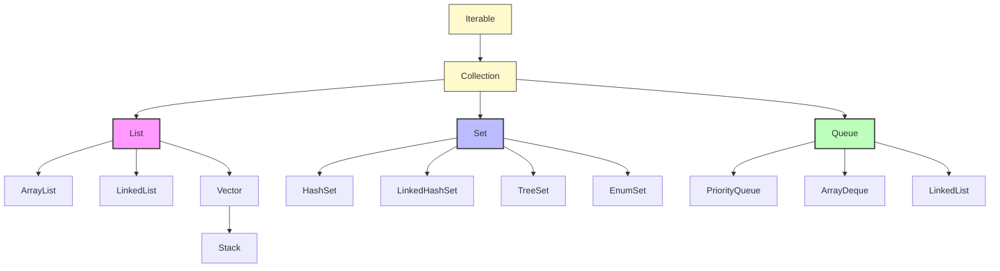
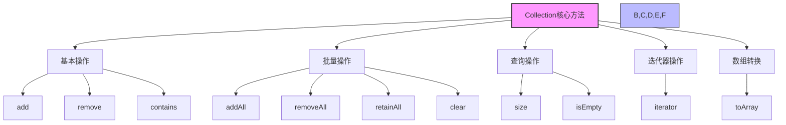
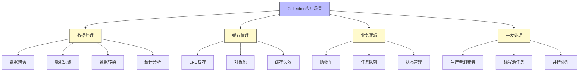

import Tabs from '@theme/Tabs';
import TabItem from '@theme/TabItem';

# Java Collection 接口详解

## 1. Collection 接口基础

Collection 接口是 Java 集合框架的根接口，它定义了集合的基本操作。所有的集合类都实现了这个接口，为 Java 程序提供了统一的数据结构操作方式。

:::tip 核心价值
**Collection 接口 = 统一操作规范 + 类型安全 + 迭代支持 + 泛型支持**
- 🔄 **统一操作规范**：提供了一致的API，简化了集合操作
- 🛡️ **类型安全**：通过泛型支持，在编译期保证类型安全
- 🔁 **迭代支持**：继承自Iterable，支持for-each循环和迭代器访问
- 📦 **多种实现**：提供了丰富的具体实现类，满足不同需求
- ⚡ **高性能操作**：针对不同场景优化的数据结构实现
:::

### 1.1 什么是 Collection 接口？

Collection 接口是 Java 集合框架的顶层接口，它继承自 `Iterable<E>` 接口，定义了集合的基本操作方法。所有具体的集合实现类都必须实现这个接口，确保集合操作的一致性和可预测性。

#### Collection 接口的层次结构



#### 核心特性对比

| 特性 | Collection | 具体实现类 |
|------|------------|------------|
| **元素顺序** | 不保证顺序 | List有序，Set无序 |
| **元素唯一性** | 不保证唯一 | Set唯一，List可重复 |
| **线程安全** | 不保证线程安全 | 需要具体实现类保证 |
| **性能特征** | 接口定义 | 由具体实现决定 |

### 1.2 Collection 接口方法概览

Collection 接口定义了丰富的操作方法，可以分为以下几个类别：

```java title="Collection 接口核心方法"
public interface Collection<E> extends Iterable<E> {
    // ===== 基本操作 =====
    boolean add(E e);                          // 添加元素
    boolean remove(Object o);                  // 删除元素
    boolean contains(Object o);                // 是否包含指定元素
    
    // ===== 批量操作 =====
    boolean addAll(Collection<? extends E> c); // 添加集合
    boolean removeAll(Collection<?> c);        // 删除集合
    boolean retainAll(Collection<?> c);        // 保留集合
    void clear();                              // 清空集合
    
    // ===== 查询操作 =====
    int size();                                // 获取元素个数
    boolean isEmpty();                         // 判断是否为空
    
    // ===== 迭代器 =====
    Iterator<E> iterator();                    // 获取迭代器
    
    // ===== 数组转换 =====
    Object[] toArray();                        // 转换为Object数组
    `<T> T[] toArray(T[] a);`                   // 转换为指定类型数组
}
```

:::info 方法分类说明
- **基本操作**：单个元素的增删查操作
- **批量操作**：对整个集合的操作
- **查询操作**：获取集合状态信息
- **迭代器**：支持集合遍历
- **数组转换**：与数组的互转操作
:::

## 2. Collection 接口核心方法详解



### 2.1 基本操作方法

<Tabs>
<TabItem value="add" label="添加元素操作">

```java title="添加元素操作示例"
public class CollectionBasicOperations {
    public static void main(String[] args) {
        Collection<String> collection = new ArrayList<>();
        
        // 添加单个元素
        boolean added = collection.add("Java");
        System.out.println("添加Java成功: " + added);
        
        // 添加多个元素
        collection.add("Python");
        collection.add("C++");
        collection.add("JavaScript");
        
        // 检查添加结果
        System.out.println("集合大小: " + collection.size());
        System.out.println("集合内容: " + collection);
        
        // 尝试添加重复元素（Collection允许重复）
        boolean duplicateAdded = collection.add("Java");
        System.out.println("重复添加Java: " + duplicateAdded);
        System.out.println("添加后集合大小: " + collection.size());
    }
}
```

</TabItem>
<TabItem value="remove" label="删除元素操作">

```java title="删除元素操作示例"
public class CollectionRemoveOperations {
    public static void main(String[] args) {
        Collection<String> collection = new ArrayList<>();
        collection.add("Apple");
        collection.add("Banana");
        collection.add("Cherry");
        collection.add("Date");
        
        System.out.println("原始集合: " + collection);
        
        // 删除指定元素
        boolean removed = collection.remove("Banana");
        System.out.println("删除Banana成功: " + removed);
        System.out.println("删除后集合: " + collection);
        
        // 删除不存在的元素
        boolean notFound = collection.remove("Orange");
        System.out.println("删除不存在的Orange: " + notFound);
        
        // 清空集合
        collection.clear();
        System.out.println("清空后集合大小: " + collection.size());
        System.out.println("集合是否为空: " + collection.isEmpty());
    }
}
```

</TabItem>
<TabItem value="query" label="查询元素操作">

```java title="查询元素操作示例"
public class CollectionQueryOperations {
    public static void main(String[] args) {
        Collection<Integer> numbers = new ArrayList<>();
        numbers.add(10);
        numbers.add(20);
        numbers.add(30);
        numbers.add(40);
        numbers.add(50);
        
        // 检查元素是否存在
        boolean contains20 = numbers.contains(20);
        boolean contains100 = numbers.contains(100);
        System.out.println("包含20: " + contains20);
        System.out.println("包含100: " + contains100);
        
        // 获取集合信息
        System.out.println("集合大小: " + numbers.size());
        System.out.println("集合是否为空: " + numbers.isEmpty());
        
        // 转换为数组
        Object[] objectArray = numbers.toArray();
        System.out.println("Object数组: " + Arrays.toString(objectArray));
        
        Integer[] intArray = numbers.toArray(new Integer[0]);
        System.out.println("Integer数组: " + Arrays.toString(intArray));
    }
}
```

</TabItem>
</Tabs>

### 2.2 批量操作方法

<Tabs>
<TabItem value="merge" label="集合合并操作">

```java title="集合合并操作示例"
public class CollectionBatchOperations {
    public static void main(String[] args) {
        Collection<String> collection1 = new ArrayList<>();
        collection1.add("Java");
        collection1.add("Python");
        
        Collection<String> collection2 = new ArrayList<>();
        collection2.add("C++");
        collection2.add("JavaScript");
        collection2.add("Go");
        
        System.out.println("集合1: " + collection1);
        System.out.println("集合2: " + collection2);
        
        // 添加所有元素
        boolean allAdded = collection1.addAll(collection2);
        System.out.println("批量添加成功: " + allAdded);
        System.out.println("合并后集合1: " + collection1);
        
        // 创建测试集合
        Collection<String> testCollection = new ArrayList<>();
        testCollection.add("Java");
        testCollection.add("C++");
        testCollection.add("Ruby");
        
        // 保留交集
        boolean retained = collection1.retainAll(testCollection);
        System.out.println("保留交集操作: " + retained);
        System.out.println("保留交集后: " + collection1);
        
        // 删除交集
        boolean removed = collection1.removeAll(testCollection);
        System.out.println("删除交集操作: " + removed);
        System.out.println("删除交集后: " + collection1);
    }
}
```

</TabItem>
<TabItem value="compare" label="集合比较操作">

```java title="集合比较操作示例"
public class CollectionComparisonOperations {
    public static void main(String[] args) {
        Collection<String> collection1 = new ArrayList<>();
        collection1.add("A");
        collection1.add("B");
        collection1.add("C");
        
        Collection<String> collection2 = new ArrayList<>();
        collection2.add("A");
        collection2.add("B");
        collection2.add("C");
        
        Collection<String> collection3 = new ArrayList<>();
        collection3.add("A");
        collection3.add("B");
        collection3.add("D");
        
        // 检查是否包含所有元素
        boolean containsAll1 = collection1.containsAll(collection2);
        boolean containsAll2 = collection1.containsAll(collection3);
        
        System.out.println("collection1包含collection2的所有元素: " + containsAll1);
        System.out.println("collection1包含collection3的所有元素: " + containsAll2);
        
        // 检查集合是否相等
        boolean equals1 = collection1.equals(collection2);
        boolean equals2 = collection1.equals(collection3);
        
        System.out.println("collection1等于collection2: " + equals1);
        System.out.println("collection1等于collection3: " + equals2);
    }
}
```

</TabItem>
</Tabs>

## 3. Collection 接口实现类详解

### 3.1 主要实现类分类

Collection 接口有三个主要的子接口，每个子接口都有多个具体的实现类：

<Tabs>
<TabItem value="list" label="List 接口实现类">

```java title="List实现类示例"
public class ListImplementationExamples {
    public static void main(String[] args) {
        // ArrayList - 基于动态数组
        List<String> arrayList = new ArrayList<>();
        arrayList.add("ArrayList元素");
        System.out.println("ArrayList: " + arrayList);
        
        // LinkedList - 基于双向链表
        List<String> linkedList = new LinkedList<>();
        linkedList.add("LinkedList元素");
        System.out.println("LinkedList: " + linkedList);
        
        // Vector - 线程安全的动态数组
        List<String> vector = new Vector<>();
        vector.add("Vector元素");
        System.out.println("Vector: " + vector);
        
        // Stack - 后进先出的栈
        Stack<String> stack = new Stack<>();
        stack.push("Stack元素");
        System.out.println("Stack: " + stack);
    }
}
```

| 实现类 | 特点 | 线程安全 | 适用场景 |
|--------|------|----------|----------|
| **ArrayList** | 基于动态数组，随机访问快，增删慢 | 否 | 频繁随机访问，较少增删操作 |
| **LinkedList** | 基于双向链表，随机访问慢，增删快 | 否 | 频繁增删操作，较少随机访问 |
| **Vector** | 基于动态数组，与ArrayList类似但线程安全 | 是 | 需要线程安全的场景 |
| **Stack** | 继承自Vector，实现LIFO栈 | 是 | 需要后进先出数据结构 |

</TabItem>
<TabItem value="set" label="Set 接口实现类">

```java title="Set实现类示例"
public class SetImplementationExamples {
    public static void main(String[] args) {
        // HashSet - 基于哈希表
        Set<String> hashSet = new HashSet<>();
        hashSet.add("HashSet元素");
        System.out.println("HashSet: " + hashSet);
        
        // LinkedHashSet - 保持插入顺序
        Set<String> linkedHashSet = new LinkedHashSet<>();
        linkedHashSet.add("LinkedHashSet元素");
        System.out.println("LinkedHashSet: " + linkedHashSet);
        
        // TreeSet - 基于红黑树的有序Set
        Set<String> treeSet = new TreeSet<>();
        treeSet.add("TreeSet元素");
        System.out.println("TreeSet: " + treeSet);
        
        // EnumSet - 专门用于枚举
        Set<DayOfWeek> enumSet = EnumSet.of(DayOfWeek.MONDAY, DayOfWeek.TUESDAY);
        System.out.println("EnumSet: " + enumSet);
    }
}

enum DayOfWeek {
    MONDAY, TUESDAY, WEDNESDAY, THURSDAY, FRIDAY, SATURDAY, SUNDAY
}
```

| 实现类 | 特点 | 线程安全 | 适用场景 |
|--------|------|----------|----------|
| **HashSet** | 基于HashMap实现，无序，查找快 | 否 | 不关心顺序，需要快速查找/去重 |
| **LinkedHashSet** | 基于LinkedHashMap，维护插入顺序 | 否 | 需要记住插入顺序的场景 |
| **TreeSet** | 基于TreeMap，自然排序或比较器排序 | 否 | 需要有序集合，支持范围操作 |
| **EnumSet** | 专为枚举类型设计，性能极佳 | 否 | 操作枚举类型的集合

</TabItem>
<TabItem value="queue" label="Queue 接口实现类">

```java title="Queue实现类示例"
public class QueueImplementationExamples {
    public static void main(String[] args) {
        // LinkedList - 可以作为队列使用
        Queue<String> linkedListQueue = new LinkedList<>();
        linkedListQueue.offer("LinkedList队列元素");
        System.out.println("LinkedList队列: " + linkedListQueue);
        
        // PriorityQueue - 优先级队列
        Queue<Integer> priorityQueue = new PriorityQueue<>();
        priorityQueue.offer(30);
        priorityQueue.offer(10);
        priorityQueue.offer(20);
        System.out.println("PriorityQueue: " + priorityQueue);
        
        // ArrayBlockingQueue - 有界阻塞队列
        BlockingQueue<String> blockingQueue = new ArrayBlockingQueue<>(3);
        try {
            blockingQueue.put("阻塞队列元素");
            System.out.println("ArrayBlockingQueue: " + blockingQueue);
        } catch (InterruptedException e) {
            e.printStackTrace();
        }
    }
}
```

| 实现类 | 特点 | 线程安全 | 适用场景 |
|--------|------|----------|----------|
| **LinkedList** | 实现Queue接口，基于链表 | 否 | 一般队列应用 |
| **PriorityQueue** | 基于优先级堆的优先队列 | 否 | 需要按优先级处理的场景 |
| **ArrayDeque** | 基于数组实现的双端队列 | 否 | 双端队列应用，栈应用 |
| **ArrayBlockingQueue** | 有界阻塞队列 | 是 | 生产者-消费者模型 |
| **LinkedBlockingQueue** | 可选有界阻塞队列 | 是 | 生产者-消费者模型 |
| **PriorityBlockingQueue** | 阻塞优先队列 | 是 | 优先任务调度 |

</TabItem>
</Tabs>

### 3.2 实现类性能对比

| 实现类 | 底层数据结构 | 查询性能 | 插入性能 | 删除性能 | 线程安全 | 适用场景 |
|--------|--------------|----------|----------|----------|----------|----------|
| **ArrayList** | 动态数组 | O(1) | O(1) 末尾 | O(n) | 否 | 随机访问频繁 |
| **LinkedList** | 双向链表 | O(n) | O(1) | O(1) | 否 | 频繁插入删除 |
| **Vector** | 动态数组 | O(1) | O(1) 末尾 | O(n) | 是 | 需要线程安全 |
| **HashSet** | 哈希表 | O(1) | O(1) | O(1) | 否 | 快速查找 |
| **TreeSet** | 红黑树 | O(log n) | O(log n) | O(log n) | 否 | 需要有序 |
| **PriorityQueue** | 堆 | O(1) | O(log n) | O(log n) | 否 | 优先级处理 |

:::caution 性能选择建议
- **随机访问频繁**：选择 ArrayList
- **频繁插入删除**：选择 LinkedList
- **需要线程安全**：选择 Vector 或使用 Collections.synchronizedXXX()
- **快速查找**：选择 HashSet
- **需要有序**：选择 TreeSet
:::

## 4. Collection 接口实际应用场景



### 4.1 数据聚合处理

在实际的企业级应用中，Collection 接口常用于数据聚合处理：

```java title="数据聚合处理示例"
public class DataAggregationExample {
    public static void main(String[] args) {
        // 模拟用户订单数据
        List<Order> orders = Arrays.asList(
            new Order("Alice", "Electronics", 1500.0),
            new Order("Bob", "Books", 300.0),
            new Order("Charlie", "Electronics", 2000.0),
            new Order("Diana", "Clothing", 800.0),
            new Order("Eve", "Electronics", 1200.0)
        );
        
        // 1. 按用户分组统计
        System.out.println("=== 按用户分组统计 ===");
        Map<String, List<Order>> userOrders = orders.stream()
            .collect(Collectors.groupingBy(Order::getCustomerName));
        
        userOrders.forEach((user, userOrderList) -> {
            double totalAmount = userOrderList.stream()
                .mapToDouble(Order::getAmount)
                .sum();
            System.out.println(user + ": " + userOrderList.size() + " 个订单, 总金额: " + totalAmount);
        });
        
        // 2. 按类别统计
        System.out.println("\n=== 按类别统计 ===");
        Map<String, DoubleSummaryStatistics> categoryStats = orders.stream()
            .collect(Collectors.groupingBy(
                Order::getCategory,
                Collectors.summarizingDouble(Order::getAmount)
            ));
        
        categoryStats.forEach((category, stats) -> {
            System.out.println(category + ":");
            System.out.println("  订单数: " + stats.getCount());
            System.out.println("  总金额: " + stats.getSum());
            System.out.println("  平均金额: " + stats.getAverage());
        });
        
        // 3. 高价值订单筛选
        System.out.println("\n=== 高价值订单筛选 ===");
        List<Order> highValueOrders = orders.stream()
            .filter(order -> order.getAmount() > 1000)
            .sorted(Comparator.comparing(Order::getAmount).reversed())
            .collect(Collectors.toList());
        
        System.out.println("高价值订单(>1000):");
        highValueOrders.forEach(order -> 
            System.out.println("  " + order.getCustomerName() + " - " + 
                             order.getCategory() + " - " + order.getAmount()));
    }
    
    static class Order {
        private String customerName;
        private String category;
        private double amount;
        
        public Order(String customerName, String category, double amount) {
            this.customerName = customerName;
            this.category = category;
            this.amount = amount;
        }
        
        public String getCustomerName() { return customerName; }
        public String getCategory() { return category; }
        public double getAmount() { return amount; }
    }
}
```

### 4.2 缓存管理实现

Collection 接口在缓存管理中的应用：

```java title="缓存管理示例"
public class CacheManagementExample {
    public static void main(String[] args) {
        // 实现简单的LRU缓存
        LRUCache<String, String> cache = new LRUCache<>(3);
        
        // 添加缓存项
        cache.put("key1", "value1");
        cache.put("key2", "value2");
        cache.put("key3", "value3");
        
        System.out.println("初始缓存: " + cache);
        
        // 访问key1，使其成为最近使用
        String value1 = cache.get("key1");
        System.out.println("访问key1: " + value1);
        System.out.println("访问后缓存: " + cache);
        
        // 添加新项，触发LRU淘汰
        cache.put("key4", "value4");
        System.out.println("添加key4后缓存: " + cache);
        
        // 检查缓存统计
        System.out.println("缓存命中次数: " + cache.getHitCount());
        System.out.println("缓存未命中次数: " + cache.getMissCount());
    }
    
    static class LRUCache<K, V> {
        private final int capacity;
        private final LinkedHashMap<K, V> cache;
        private int hitCount = 0;
        private int missCount = 0;
        
        public LRUCache(int capacity) {
            this.capacity = capacity;
            this.cache = new LinkedHashMap<K, V>(capacity, 0.75f, true) {
                @Override
                protected boolean removeEldestEntry(Map.Entry<K, V> eldest) {
                    return size() > capacity;
                }
            };
        }
        
        public V get(K key) {
            V value = cache.get(key);
            if (value != null) {
                hitCount++;
            } else {
                missCount++;
            }
            return value;
        }
        
        public void put(K key, V value) {
            cache.put(key, value);
        }
        
        public int getHitCount() { return hitCount; }
        public int getMissCount() { return missCount; }
        
        @Override
        public String toString() {
            return cache.toString();
        }
    }
}
```

## 5. Collection 接口最佳实践

### 5.1 性能优化建议

:::tip 核心优化原则
- **选择合适的实现类**：根据使用场景选择最合适的集合类型
- **预分配容量**：对于已知大小的集合，预分配容量避免扩容
- **使用迭代器**：遍历时优先使用迭代器而不是索引
- **避免频繁装箱拆箱**：使用基本类型集合类
- **合理使用并行流**：大数据集考虑并行处理
:::

### 5.2 代码质量建议

| 方面 | 建议 | 示例 |
|------|------|------|
| **类型安全** | 使用泛型保证类型安全 | `Collection<String>` 而不是 `Collection` |
| **接口编程** | 面向接口编程 | `Collection<String>` 而不是 `ArrayList<String>` |
| **异常处理** | 处理集合操作的异常 | 检查 `add()` 返回值 |
| **资源管理** | 及时清理不需要的集合 | 使用 `clear()` 或设置为 null |

### 5.3 常见陷阱和解决方案

```java title="常见陷阱示例"
public class CollectionPitfallsExample {
    public static void main(String[] args) {
        // 陷阱1：在迭代过程中修改集合
        List<String> list = new ArrayList<>();
        list.add("A");
        list.add("B");
        list.add("C");
        
        // 错误方式：会抛出ConcurrentModificationException
        try {
            for (String item : list) {
                if ("B".equals(item)) {
                    list.remove(item); // 异常！
                }
            }
        } catch (Exception e) {
            System.out.println("陷阱1异常: " + e.getClass().getSimpleName());
        }
        
        // 正确方式：使用迭代器
        Iterator<String> iterator = list.iterator();
        while (iterator.hasNext()) {
            String item = iterator.next();
            if ("B".equals(item)) {
                iterator.remove(); // 安全删除
            }
        }
        System.out.println("安全删除后: " + list);
        
        // 陷阱2：使用原始类型
        Collection rawCollection = new ArrayList(); // 原始类型
        rawCollection.add("String");
        rawCollection.add(42); // 可以添加任何类型
        
        // 正确方式：使用泛型
        Collection<String> genericCollection = new ArrayList<>();
        genericCollection.add("String");
        // genericCollection.add(42); // 编译错误，类型安全
    }
}
```

## 6. 总结

Java Collection 接口是集合框架的核心，它定义了集合的基本操作规范，为 Java 程序提供了统一的数据结构操作方式。

### 核心要点

1. **接口设计**：Collection 接口定义了集合的基本操作，包括增删改查、批量操作、迭代等
2. **实现类丰富**：List、Set、Queue 三大子接口提供了丰富的具体实现
3. **性能选择**：不同实现类有不同的性能特征，需要根据使用场景选择
4. **类型安全**：泛型支持确保编译时类型检查
5. **迭代支持**：继承自 Iterable 接口，支持多种遍历方式

### 最佳实践

1. **选择合适的实现类**：根据性能需求和使用场景选择最合适的集合类型
2. **使用泛型**：确保类型安全和编译时检查
3. **避免常见陷阱**：注意迭代过程中的修改、原始类型使用等问题
4. **性能优化**：预分配容量、使用合适的遍历方式、考虑并行处理

### 应用场景

Collection 接口广泛应用于数据处理、缓存管理、业务逻辑实现等场景，是 Java 应用程序开发中不可或缺的基础组件。

通过深入学习和实践，开发者可以充分利用 Collection 接口的强大功能，提升代码质量和开发效率。 