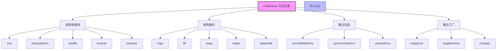
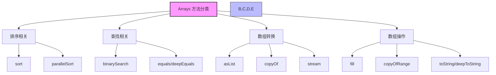
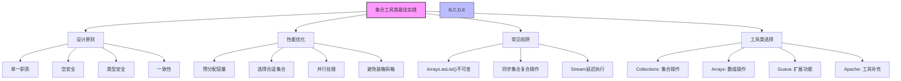

import Tabs from '@theme/Tabs';
import TabItem from '@theme/TabItem';

# Java 集合工具类详解

## 1. 集合工具类概述

Java 提供了丰富的集合工具类，主要包括 `Collections` 和 `Arrays` 工具类，以及 Apache Commons Collections 等第三方库。这些工具类提供了大量便捷的方法来操作集合，大大简化了集合操作的复杂度。

:::tip 核心价值
**集合工具类 = 便捷操作 + 性能优化 + 线程安全 + 代码复用**

- 🛠️ **便捷操作** - 提供丰富的方法简化常见集合操作，如排序、查找、转换等
- ⚡ **性能优化** - 经过优化的算法实现，提供高效的集合处理能力
- 🔒 **线程安全** - 提供线程安全的集合包装和操作方法，简化并发编程
- 📦 **代码复用** - 减少重复代码，提高开发效率和代码质量
- 🧩 **标准化** - 提供统一的API接口，使代码更加一致和可维护
:::

### 1.1 什么是集合工具类？

集合工具类是一组静态方法的集合，专门用于操作 Java 集合框架中的各种集合类型。它们提供了排序、查找、同步、不可变集合创建等常用功能，让开发者能够更高效地处理集合数据。

```mermaid
classDiagram
    class Collections {
        +sort(List) void
        +binarySearch(List, Object) int
        +shuffle(List) void
        +reverse(List) void
        +swap(List, int, int) void
        +fill(List, Object) void
        +max(Collection) T
        +min(Collection) T
        +unmodifiableList(List) List
        +synchronizedList(List) List
        +emptyList() List
        +singleton(T) Set
    }
    
    class Arrays {
        +sort(T[]) void
        +binarySearch(T[], Object) int
        +fill(T[], Object) void
        +copyOf(T[], int) T[]
        +equals(T[], T[]) boolean
        +asList(T...) List
        +stream(T[]) Stream
        +parallelSort(T[]) void
        +spliterator(T[]) Spliterator
    }
    
    class Guava {
        +immutableList(T...) ImmutableList
        +multiset() Multiset
        +biMap() BiMap
        +table() Table
        +partition(List, int) List~List~
        +transform(Collection, Function) Collection
    }
    
    class ApacheCommons {
        +isEmpty(Collection) boolean
        +isNotEmpty(Collection) boolean
        +union(Collection, Collection) Collection
        +intersection(Collection, Collection) Collection
        +subtract(Collection, Collection) Collection
        +filter(Collection, Predicate) Collection
    }
    
    Collections --> "操作" List
    Collections --> "操作" Set
    Collections --> "操作" Map
    
    Arrays --> "操作" Object[]
    Arrays --> "转换" List
    
    Guava --> "扩展" Collections
    ApacheCommons --> "扩展" Collections
```

#### 主要工具类分类

| 工具类 | 主要功能 | 适用场景 |
|--------|----------|----------|
| **Collections** | 集合操作、排序、查找、同步 | List、Set、Map 等集合类型 |
| **Arrays** | 数组操作、排序、查找、转换 | 各种数组类型 |
| **Apache Commons** | 扩展功能、集合操作 | 复杂业务场景 |
| **Stream API** | 函数式操作、并行处理 | 数据流处理 |

### 1.2 工具类设计原则

```java title="工具类设计原则示例"
public class CollectionUtilsDesign {
    
    // 1. 静态方法设计
    public static <T> boolean isEmpty(Collection<T> collection) {
        return collection == null || collection.isEmpty();
    }
    
    // 2. 泛型支持
    public static <T> List<T> filter(Collection<T> collection, Predicate<T> predicate) {
        return collection.stream()
                        .filter(predicate)
                        .collect(Collectors.toList());
    }
    
    // 3. 空值安全
    public static <T> int safeSize(Collection<T> collection) {
        return collection == null ? 0 : collection.size();
    }
    
    // 4. 不可变集合
    public static <T> List<T> immutableList(Collection<T> collection) {
        return Collections.unmodifiableList(new ArrayList<>(collection));
    }
}
```

:::info 设计特点
- **静态方法**：无需实例化，直接调用
- **泛型支持**：类型安全，编译时检查
- **空值安全**：避免空指针异常
- **不可变性**：提供不可变集合，保证数据安全
:::

## 2. Collections 工具类详解

Collections 工具类是 Java 集合框架中最重要的工具类，提供了丰富的静态方法来操作各种集合类型。



<Tabs>
<TabItem value="sort" label="排序和查找操作">

### 2.1 排序操作

Collections 工具类提供了多种排序方法，支持自然排序和自定义排序：

```java title="基本排序操作示例"
public class CollectionsSortExample {
    public static void main(String[] args) {
        // 自然排序（要求元素实现Comparable接口）
        List<String> names = Arrays.asList("Alice", "Bob", "Charlie", "David");
        Collections.sort(names);
        System.out.println("自然排序后: " + names);
        // 输出: [Alice, Bob, Charlie, David]
        
        // 自定义排序（使用Comparator）
        List<Person> people = Arrays.asList(
            new Person("Alice", 25),
            new Person("Bob", 30),
            new Person("Charlie", 20),
            new Person("David", 28)
        );
        
        // 按年龄排序
        Collections.sort(people, Comparator.comparing(Person::getAge));
        System.out.println("按年龄排序: " + people);
        
        // 按姓名排序
        Collections.sort(people, Comparator.comparing(Person::getName));
        System.out.println("按姓名排序: " + people);
        
        // 逆序排序
        Collections.sort(names, Collections.reverseOrder());
        System.out.println("逆序排序: " + names);
        // 输出: [David, Charlie, Bob, Alice]
    }
    
    static class Person {
        private String name;
        private int age;
        
        public Person(String name, int age) {
            this.name = name;
            this.age = age;
        }
        
        public String getName() { return name; }
        public int getAge() { return age; }
        
        @Override
        public String toString() {
            return name + "(" + age + ")";
        }
    }
}
```

#### 排序方法对比

| 方法 | 说明 | 时间复杂度 | 适用场景 |
|------|------|------------|----------|
| `Collections.sort(List)` | 自然排序 | O(n log n) | 元素已实现Comparable |
| `Collections.sort(List, Comparator)` | 自定义排序 | O(n log n) | 需要自定义排序逻辑 |
| `Collections.reverseOrder()` | 逆序比较器 | - | 需要逆序排序 |
| `Collections.shuffle(List)` | 随机打乱 | O(n) | 需要随机顺序 |

### 2.2 查找和替换操作

Collections 工具类提供了高效的查找和替换方法，特别是二分查找算法：

```java title="查找和替换操作示例"
public class CollectionsSearchExample {
    public static void main(String[] args) {
        // 二分查找（要求列表已排序）
        List<Integer> numbers = Arrays.asList(1, 3, 5, 7, 9, 11, 13, 15);
        System.out.println("有序列表: " + numbers);
        
        int target = 7;
        int index = Collections.binarySearch(numbers, target);
        if (index >= 0) {
            System.out.println(target + " 的索引: " + index);
        } else {
            System.out.println(target + " 未找到，应插入位置: " + (-index - 1));
        }
        
        // 查找最大最小值
        Integer max = Collections.max(numbers);
        Integer min = Collections.min(numbers);
        System.out.println("最大值: " + max + ", 最小值: " + min);
        
        // 替换所有元素
        List<String> list = new ArrayList<>(Arrays.asList("a", "b", "a", "c", "a"));
        System.out.println("替换前: " + list);
        Collections.replaceAll(list, "a", "x");
        System.out.println("替换后: " + list);
        
        // 填充集合
        List<String> fillList = new ArrayList<>(Arrays.asList("a", "b", "c"));
        System.out.println("填充前: " + fillList);
        Collections.fill(fillList, "default");
        System.out.println("填充后: " + fillList);
        
        // 查找子列表位置
        List<String> source = Arrays.asList("a", "b", "c", "d", "e", "f");
        List<String> target1 = Arrays.asList("c", "d");
        List<String> target2 = Arrays.asList("x", "y");
        
        int firstIndex = Collections.indexOfSubList(source, target1);
        int lastIndex = Collections.lastIndexOfSubList(source, target1);
        System.out.println("子列表 " + target1 + " 首次出现位置: " + firstIndex);
        System.out.println("子列表 " + target1 + " 最后出现位置: " + lastIndex);
        
        int notFound = Collections.indexOfSubList(source, target2);
        System.out.println("子列表 " + target2 + " 位置: " + notFound);
    }
}
```

#### 查找方法性能对比

| 方法 | 时间复杂度 | 前提条件 | 适用场景 |
|------|------------|----------|----------|
| `Collections.binarySearch()` | O(log n) | 列表已排序 | 有序列表快速查找 |
| `Collections.max()/min()` | O(n) | 无 | 查找最大最小值 |
| `Collections.indexOfSubList()` | O(n*m) | 无 | 查找子列表位置 |
| `Collections.frequency()` | O(n) | 无 | 统计元素出现次数 |

</TabItem>
<TabItem value="modify" label="修改操作">

### 2.3 集合修改操作

Collections 工具类提供了丰富的集合修改方法，包括元素交换、旋转、打乱、反转等：

```java title="集合修改操作示例"
public class CollectionsModifyExample {
    public static void main(String[] args) {
        // 交换元素
        List<String> swapList = new ArrayList<>(Arrays.asList("a", "b", "c", "d"));
        System.out.println("交换前: " + swapList);
        Collections.swap(swapList, 0, 2);
        System.out.println("交换后: " + swapList);
        
        // 旋转集合
        List<String> rotateList = new ArrayList<>(Arrays.asList("a", "b", "c", "d", "e"));
        System.out.println("旋转前: " + rotateList);
        
        // 向右旋转2位
        Collections.rotate(rotateList, 2);
        System.out.println("向右旋转2位: " + rotateList);
        
        // 向左旋转1位
        Collections.rotate(rotateList, -1);
        System.out.println("向左旋转1位: " + rotateList);
        
        // 反转列表
        List<Integer> reverseList = new ArrayList<>(Arrays.asList(1, 2, 3, 4, 5));
        System.out.println("反转前: " + reverseList);
        Collections.reverse(reverseList);
        System.out.println("反转后: " + reverseList);
        
        // 复制集合
        List<String> source = Arrays.asList("a", "b", "c");
        List<String> dest = Arrays.asList("x", "y", "z");
        System.out.println("复制前: 源=" + source + ", 目标=" + dest);
        Collections.copy(dest, source);
        System.out.println("复制后: 目标=" + dest);
        
        // 替换所有元素
        List<String> replaceList = new ArrayList<>(Arrays.asList("a", "b", "a", "c", "a"));
        System.out.println("替换前: " + replaceList);
        Collections.replaceAll(replaceList, "a", "x");
        System.out.println("替换后: " + replaceList);
    }
}
```

| 方法 | 功能 | 时间复杂度 | 特点 |
|------|------|------------|------|
| `swap(List, int, int)` | 交换两个位置的元素 | O(1) | 原地修改 |
| `rotate(List, int)` | 将列表旋转指定距离 | O(n) | 正数右移，负数左移 |
| `reverse(List)` | 反转列表 | O(n) | 原地修改 |
| `shuffle(List)` | 随机打乱列表 | O(n) | 使用默认随机源 |
| `copy(List dest, List src)` | 复制列表 | O(n) | 目标必须足够大 |
| `fill(List, Object)` | 用指定元素填充列表 | O(n) | 覆盖所有元素 |
| `replaceAll(List, old, new)` | 替换所有指定元素 | O(n) | 替换全部匹配项 |

</TabItem>
<TabItem value="wrapper" label="集合包装">

### 2.3 同步和不可变集合

Collections 工具类提供了创建线程安全集合和不可变集合的方法，确保在多线程环境下的数据安全：

```java title="同步和不可变集合示例"
public class CollectionsThreadSafetyExample {
    public static void main(String[] args) {
        // 创建同步集合（线程安全）
        List<String> syncList = Collections.synchronizedList(new ArrayList<>());
        Set<String> syncSet = Collections.synchronizedSet(new HashSet<>());
        Map<String, String> syncMap = Collections.synchronizedMap(new HashMap<>());
        
        // 多线程安全操作
        Runnable addTask = () -> {
            for (int i = 0; i < 100; i++) {
                syncList.add("Thread-" + Thread.currentThread().getId() + "-" + i);
            }
        };
        
        Thread thread1 = new Thread(addTask);
        Thread thread2 = new Thread(addTask);
        
        thread1.start();
        thread2.start();
        
        try {
            thread1.join();
            thread2.join();
        } catch (InterruptedException e) {
            e.printStackTrace();
        }
        
        System.out.println("同步集合最终大小: " + syncList.size());
        
        // 创建不可变集合
        List<String> immutableList = Collections.unmodifiableList(Arrays.asList("a", "b", "c"));
        Set<String> immutableSet = Collections.unmodifiableSet(new HashSet<>(Arrays.asList("x", "y", "z")));
        Map<String, String> immutableMap = Collections.unmodifiableMap(Map.of("key1", "value1", "key2", "value2"));
        
        System.out.println("不可变集合: " + immutableList);
        System.out.println("不可变Set: " + immutableSet);
        System.out.println("不可变Map: " + immutableMap);
        
        // 尝试修改不可变集合会抛出异常
        try {
            immutableList.add("d"); // 抛出UnsupportedOperationException
        } catch (UnsupportedOperationException e) {
            System.out.println("不能修改不可变集合: " + e.getMessage());
        }
        
        // 创建单元素集合
        List<String> singletonList = Collections.singletonList("single");
        Set<String> singletonSet = Collections.singleton("single");
        Map<String, String> singletonMap = Collections.singletonMap("key", "value");
        
        System.out.println("单元素List: " + singletonList);
        System.out.println("单元素Set: " + singletonSet);
        System.out.println("单元素Map: " + singletonMap);
    }
}
```

#### 线程安全集合对比

| 类型 | 同步方式 | 性能影响 | 适用场景 |
|------|----------|----------|----------|
| `Collections.synchronizedXXX()` | 方法级同步 | 中等 | 简单同步需求 |
| `ConcurrentHashMap` | 分段锁 | 低 | 高并发读多写少 |
| `CopyOnWriteArrayList` | 写时复制 | 高 | 读多写少场景 |
| `Collections.unmodifiableXXX()` | 不可变 | 无 | 只读数据 |

### 2.4 集合操作

Collections 工具类提供了丰富的集合操作方法，包括元素交换、旋转、打乱、反转等：

```java title="集合操作示例"
public class CollectionsOperationsExample {
    public static void main(String[] args) {
        // 交换元素
        List<String> swapList = new ArrayList<>(Arrays.asList("a", "b", "c", "d"));
        System.out.println("交换前: " + swapList);
        Collections.swap(swapList, 0, 2);
        System.out.println("交换后: " + swapList);
        
        // 旋转集合
        List<String> rotateList = new ArrayList<>(Arrays.asList("a", "b", "c", "d", "e"));
        System.out.println("旋转前: " + rotateList);
        
        // 向右旋转2位
        Collections.rotate(rotateList, 2);
        System.out.println("向右旋转2位: " + rotateList);
        
        // 向左旋转1位
        Collections.rotate(rotateList, -1);
        System.out.println("向左旋转1位: " + rotateList);
        
        // 随机打乱
        List<String> shuffleList = new ArrayList<>(Arrays.asList("a", "b", "c", "d", "e"));
        System.out.println("打乱前: " + shuffleList);
        
        // 使用固定种子确保可重复结果
        Collections.shuffle(shuffleList, new Random(42));
        System.out.println("打乱后: " + shuffleList);
        
        // 反转集合
        List<String> reverseList = new ArrayList<>(Arrays.asList("a", "b", "c", "d"));
        System.out.println("反转前: " + reverseList);
        Collections.reverse(reverseList);
        System.out.println("反转后: " + reverseList);
        
        // 集合操作组合使用
        List<Integer> numbers = new ArrayList<>(Arrays.asList(1, 2, 3, 4, 5, 6, 7, 8));
        System.out.println("原始集合: " + numbers);
        
        // 先排序，再反转，最后随机打乱
        Collections.sort(numbers);
        System.out.println("排序后: " + numbers);
        
        Collections.reverse(numbers);
        System.out.println("反转后: " + numbers);
        
        Collections.shuffle(numbers);
        System.out.println("打乱后: " + numbers);
    }
}
```

#### 集合操作方法对比

| 方法 | 功能 | 时间复杂度 | 适用场景 |
|------|------|------------|----------|
| `Collections.swap()` | 交换两个元素 | O(1) | 需要交换特定位置元素 |
| `Collections.rotate()` | 旋转集合 | O(n) | 循环移位操作 |
| `Collections.shuffle()` | 随机打乱 | O(n) | 需要随机顺序 |
| `Collections.reverse()` | 反转集合 | O(n) | 需要逆序排列 |

### 2.5 频率统计和集合关系

Collections 工具类提供了统计元素频率和检查集合关系的方法：

```java title="频率统计和集合关系示例"
public class CollectionsStatisticsExample {
    public static void main(String[] args) {
        // 统计元素出现次数
        List<String> freqList = Arrays.asList("a", "b", "a", "c", "a", "b", "d", "a");
        System.out.println("原始列表: " + freqList);
        
        int aCount = Collections.frequency(freqList, "a");
        int bCount = Collections.frequency(freqList, "b");
        int cCount = Collections.frequency(freqList, "c");
        int dCount = Collections.frequency(freqList, "d");
        int xCount = Collections.frequency(freqList, "x");
        
        System.out.println("a出现次数: " + aCount);
        System.out.println("b出现次数: " + bCount);
        System.out.println("c出现次数: " + cCount);
        System.out.println("d出现次数: " + dCount);
        System.out.println("x出现次数: " + xCount);
        
        // 检查两个集合是否有共同元素
        List<String> list1 = Arrays.asList("a", "b", "c", "d");
        List<String> list2 = Arrays.asList("b", "c", "d", "e");
        List<String> list3 = Arrays.asList("x", "y", "z");
        
        boolean hasCommon1 = !Collections.disjoint(list1, list2);
        boolean hasCommon2 = !Collections.disjoint(list1, list3);
        
        System.out.println("list1和list2有共同元素: " + hasCommon1);
        System.out.println("list1和list3有共同元素: " + hasCommon2);
        
        // 统计所有元素的频率
        Map<String, Long> frequencyMap = freqList.stream()
            .collect(Collectors.groupingBy(
                Function.identity(),
                Collectors.counting()
            ));
        
        System.out.println("元素频率统计: " + frequencyMap);
        
        // 找出出现次数最多的元素
        String mostFrequent = frequencyMap.entrySet().stream()
            .max(Map.Entry.comparingByValue())
            .map(Map.Entry::getKey)
            .orElse("无");
        
        System.out.println("出现次数最多的元素: " + mostFrequent);
        
        // 检查集合包含关系
        List<String> subset = Arrays.asList("a", "b");
        boolean containsAll = freqList.containsAll(subset);
        System.out.println("freqList包含subset的所有元素: " + containsAll);
    }
}
```

#### 统计方法功能对比

| 方法 | 功能 | 返回值 | 适用场景 |
|------|------|--------|----------|
| `Collections.frequency()` | 统计元素出现次数 | int | 需要知道特定元素出现次数 |
| `Collections.disjoint()` | 检查集合是否无交集 | boolean | 检查两个集合是否完全独立 |
| `Collection.containsAll()` | 检查包含关系 | boolean | 检查一个集合是否包含另一个集合的所有元素 |

</TabItem>
</Tabs>

## 3. Arrays 工具类详解

Arrays 工具类是 Java 中专门用于操作数组的工具类，提供了排序、查找、比较、填充等常用功能。



### 3.1 数组排序和查找

Arrays 工具类提供了高效的数组排序和查找方法：

```java title="数组排序和查找示例"
public class ArraysSortExample {
    public static void main(String[] args) {
        // 基本类型数组排序
        int[] numbers = {3, 1, 4, 1, 5, 9, 2, 6, 5, 3, 5};
        System.out.println("原始数组: " + Arrays.toString(numbers));
        
        // 完整排序
        Arrays.sort(numbers);
        System.out.println("排序后: " + Arrays.toString(numbers));
        
        // 部分排序（只排序索引2到7的元素）
        int[] partialSort = {3, 1, 4, 1, 5, 9, 2, 6, 5, 3, 5};
        System.out.println("部分排序前: " + Arrays.toString(partialSort));
        Arrays.sort(partialSort, 2, 8);
        System.out.println("部分排序后: " + Arrays.toString(partialSort));
        
        // 二分查找（要求数组已排序）
        int target = 5;
        int index = Arrays.binarySearch(numbers, target);
        if (index >= 0) {
            System.out.println(target + " 的索引: " + index);
        } else {
            System.out.println(target + " 未找到，应插入位置: " + (-index - 1));
        }
        
        // 查找所有匹配的元素
        List<Integer> indices = new ArrayList<>();
        for (int i = 0; i < numbers.length; i++) {
            if (numbers[i] == target) {
                indices.add(i);
            }
        }
        System.out.println(target + " 的所有索引: " + indices);
        
        // 对象数组排序
        String[] names = {"Charlie", "Alice", "Bob", "David", "Eve"};
        System.out.println("原始字符串数组: " + Arrays.toString(names));
        
        // 自然排序
        Arrays.sort(names);
        System.out.println("自然排序后: " + Arrays.toString(names));
        
        // 自定义排序（按长度）
        Arrays.sort(names, Comparator.comparing(String::length));
        System.out.println("按长度排序后: " + Arrays.toString(names));
        
        // 并行排序（大数据量）
        int[] largeArray = new int[100000];
        Random random = new Random(42);
        for (int i = 0; i < largeArray.length; i++) {
            largeArray[i] = random.nextInt(10000);
        }
        
        long startTime = System.currentTimeMillis();
        Arrays.sort(largeArray);
        long endTime = System.currentTimeMillis();
        System.out.println("普通排序耗时: " + (endTime - startTime) + "ms");
        
        // 重置数组
        for (int i = 0; i < largeArray.length; i++) {
            largeArray[i] = random.nextInt(10000);
        }
        
        startTime = System.currentTimeMillis();
        Arrays.parallelSort(largeArray);
        endTime = System.currentTimeMillis();
        System.out.println("并行排序耗时: " + (endTime - startTime) + "ms");
    }
}
```

#### 排序方法性能对比

| 方法 | 适用类型 | 时间复杂度 | 适用场景 |
|------|----------|------------|----------|
| `Arrays.sort()` | 基本类型、对象数组 | O(n log n) | 一般排序需求 |
| `Arrays.parallelSort()` | 基本类型、对象数组 | O(n log n) | 大数据量排序 |
| `Arrays.sort(array, from, to)` | 基本类型、对象数组 | O(n log n) | 部分排序 |
| `Arrays.sort(array, comparator)` | 对象数组 | O(n log n) | 自定义排序 |

### 3.2 数组比较和填充

Arrays 工具类提供了数组比较和填充的便捷方法：

```java title="数组比较和填充示例"
public class ArraysComparisonExample {
    public static void main(String[] args) {
        // 一维数组比较
        int[] arr1 = {1, 2, 3, 4, 5};
        int[] arr2 = {1, 2, 3, 4, 5};
        int[] arr3 = {1, 2, 3, 4, 6};
        
        System.out.println("arr1: " + Arrays.toString(arr1));
        System.out.println("arr2: " + Arrays.toString(arr2));
        System.out.println("arr3: " + Arrays.toString(arr3));
        
        boolean equals1 = Arrays.equals(arr1, arr2);
        boolean equals2 = Arrays.equals(arr1, arr3);
        
        System.out.println("arr1 equals arr2: " + equals1);
        System.out.println("arr1 equals arr3: " + equals2);
        
        // 多维数组深度比较
        int[][] matrix1 = {{1, 2, 3}, {4, 5, 6}, {7, 8, 9}};
        int[][] matrix2 = {{1, 2, 3}, {4, 5, 6}, {7, 8, 9}};
        int[][] matrix3 = {{1, 2, 3}, {4, 5, 6}, {7, 8, 0}};
        
        System.out.println("matrix1: " + Arrays.deepToString(matrix1));
        System.out.println("matrix2: " + Arrays.deepToString(matrix2));
        System.out.println("matrix3: " + Arrays.deepToString(matrix3));
        
        boolean deepEquals1 = Arrays.deepEquals(matrix1, matrix2);
        boolean deepEquals2 = Arrays.deepEquals(matrix1, matrix3);
        
        System.out.println("matrix1 deepEquals matrix2: " + deepEquals1);
        System.out.println("matrix1 deepEquals matrix3: " + deepEquals2);
        
        // 数组填充
        int[] fillArray = new int[8];
        System.out.println("填充前: " + Arrays.toString(fillArray));
        
        // 全部填充
        Arrays.fill(fillArray, 42);
        System.out.println("全部填充42后: " + Arrays.toString(fillArray));
        
        // 部分填充
        Arrays.fill(fillArray, 2, 6, 100);
        System.out.println("索引2-5填充100后: " + Arrays.toString(fillArray));
        
        // 重置数组
        Arrays.fill(fillArray, 0);
        System.out.println("重置为0后: " + Arrays.toString(fillArray));
        
        // 对象数组填充
        String[] stringArray = new String[5];
        System.out.println("字符串数组填充前: " + Arrays.toString(stringArray));
        
        Arrays.fill(stringArray, "default");
        System.out.println("填充default后: " + Arrays.toString(stringArray));
        
        // 部分填充字符串
        Arrays.fill(stringArray, 1, 4, "custom");
        System.out.println("索引1-3填充custom后: " + Arrays.toString(stringArray));
        
        // 数组复制和比较
        int[] original = {1, 2, 3, 4, 5};
        int[] copy1 = Arrays.copyOf(original, 3);  // 复制前3个元素
        int[] copy2 = Arrays.copyOf(original, 7);  // 复制并扩展长度
        int[] copy3 = Arrays.copyOfRange(original, 1, 4); // 复制指定范围
        
        System.out.println("原始数组: " + Arrays.toString(original));
        System.out.println("复制前3个: " + Arrays.toString(copy1));
        System.out.println("复制并扩展: " + Arrays.toString(copy2));
        System.out.println("复制范围1-3: " + Arrays.toString(copy3));
        
        // 比较不同长度的数组
        boolean equalsLength = Arrays.equals(original, copy1);
        System.out.println("original equals copy1: " + equalsLength);
    }
}
```

#### 比较和填充方法对比

| 方法 | 功能 | 适用场景 | 注意事项 |
|------|------|----------|----------|
| `Arrays.equals()` | 一维数组比较 | 简单数组比较 | 只比较引用和内容，不比较长度 |
| `Arrays.deepEquals()` | 多维数组比较 | 嵌套数组比较 | 递归比较所有层级 |
| `Arrays.fill()` | 数组填充 | 初始化或重置数组 | 支持部分填充 |
| `Arrays.copyOf()` | 数组复制 | 创建数组副本 | 可以改变数组长度 |

### 3.3 数组转换

Arrays 工具类提供了丰富的数组转换方法，支持数组与集合、流之间的转换：

```java title="数组转换示例"
public class ArraysConversionExample {
    public static void main(String[] args) {
        // 基本类型数组转List
        int[] intArray = {1, 2, 3, 4, 5};
        System.out.println("原始int数组: " + Arrays.toString(intArray));
        
        // 基本类型数组转Stream
        IntStream intStream = Arrays.stream(intArray);
        List<Integer> intList = intStream.boxed().collect(Collectors.toList());
        System.out.println("转换为List: " + intList);
        
        // 对象数组转List
        String[] stringArray = {"Alice", "Bob", "Charlie", "David"};
        System.out.println("原始字符串数组: " + Arrays.toString(stringArray));
        
        // 使用Arrays.asList转换
        List<String> stringList = Arrays.asList(stringArray);
        System.out.println("Arrays.asList结果: " + stringList);
        
        // 注意：Arrays.asList返回的List是固定大小的
        try {
            stringList.add("Eve"); // 抛出UnsupportedOperationException
        } catch (UnsupportedOperationException e) {
            System.out.println("不能修改固定大小的List: " + e.getMessage());
        }
        
        // 创建可修改的List
        List<String> modifiableList = new ArrayList<>(Arrays.asList(stringArray));
        modifiableList.add("Eve");
        System.out.println("可修改的List: " + modifiableList);
        
        // 使用Stream API转换
        List<String> streamList = Arrays.stream(stringArray)
            .filter(s -> s.length() > 4)
            .map(String::toUpperCase)
            .collect(Collectors.toList());
        System.out.println("Stream转换结果: " + streamList);
        
        // 多维数组转换
        int[][] matrix = {{1, 2, 3}, {4, 5, 6}, {7, 8, 9}};
        System.out.println("原始矩阵: " + Arrays.deepToString(matrix));
        
        // 多维数组转Stream
        List<Integer> flatList = Arrays.stream(matrix)
            .flatMapToInt(Arrays::stream)
            .boxed()
            .collect(Collectors.toList());
        System.out.println("展平后的List: " + flatList);
        
        // 数组转Set（去重）
        int[] duplicateArray = {1, 2, 2, 3, 3, 3, 4, 4, 4, 4};
        Set<Integer> uniqueSet = Arrays.stream(duplicateArray)
            .boxed()
            .collect(Collectors.toSet());
        System.out.println("去重后的Set: " + uniqueSet);
        
        // 数组转Map
        String[] keys = {"name", "age", "city"};
        Object[] values = {"Alice", 25, "New York"};
        
        Map<String, Object> map = new HashMap<>();
        for (int i = 0; i < keys.length; i++) {
            map.put(keys[i], values[i]);
        }
        System.out.println("转换后的Map: " + map);
        
        // 使用Stream API创建Map
        Map<String, Object> streamMap = IntStream.range(0, keys.length)
            .boxed()
            .collect(Collectors.toMap(
                i -> keys[i],
                i -> values[i]
            ));
        System.out.println("Stream创建的Map: " + streamMap);
    }
}
```

#### 转换方法对比

| 方法 | 功能 | 返回值类型 | 注意事项 |
|------|------|------------|----------|
| `Arrays.asList()` | 数组转List | 固定大小List | 不能添加/删除元素 |
| `Arrays.stream()` | 数组转Stream | Stream | 支持函数式操作 |
| `new ArrayList<>(Arrays.asList())` | 数组转可变List | 可变List | 可以修改 |
| `Arrays.stream().boxed()` | 基本类型转包装类型 | Stream&lt;包装类型&gt; | 自动装箱 |

## 4. 实用工具方法

在实际开发中，我们经常需要创建一些通用的工具方法来简化集合操作。以下是一些常用的实用工具方法：

### 4.1 集合判空和null检查

```java title="集合判空和null检查工具类"
public class CollectionUtils {
    
    /**
     * 检查集合是否为空
     * @param collection 要检查的集合
     * @return true如果集合为null或空，否则false
     */
    public static boolean isEmpty(Collection<?> collection) {
        return collection == null || collection.isEmpty();
    }
    
    /**
     * 检查集合是否不为空
     * @param collection 要检查的集合
     * @return true如果集合不为null且不为空，否则false
     */
    public static boolean isNotEmpty(Collection<?> collection) {
        return !isEmpty(collection);
    }
    
    /**
     * 安全获取集合大小
     * @param collection 要检查的集合
     * @return 集合大小，如果为null则返回0
     */
    public static int size(Collection<?> collection) {
        return collection == null ? 0 : collection.size();
    }
    
    /**
     * 检查Map是否为空
     * @param map 要检查的Map
     * @return true如果Map为null或空，否则false
     */
    public static boolean isEmpty(Map<?, ?> map) {
        return map == null || map.isEmpty();
    }
    
    /**
     * 检查Map是否不为空
     * @param map 要检查的Map
     * @return true如果Map不为null且不为空，否则false
     */
    public static boolean isNotEmpty(Map<?, ?> map) {
        return !isEmpty(map);
    }
    
    /**
     * 创建空集合
     * @return 不可变的空List
     */
    public static <T> List<T> emptyList() {
        return Collections.emptyList();
    }
    
    /**
     * 创建空Set
     * @return 不可变的空Set
     */
    public static <T> Set<T> emptySet() {
        return Collections.emptySet();
    }
    
    /**
     * 创建空Map
     * @return 不可变的空Map
     */
    public static <K, V> Map<K, V> emptyMap() {
        return Collections.emptyMap();
    }
    
    /**
     * 检查数组是否为空
     * @param array 要检查的数组
     * @return true如果数组为null或长度为0，否则false
     */
    public static boolean isEmpty(Object[] array) {
        return array == null || array.length == 0;
    }
    
    /**
     * 检查数组是否不为空
     * @param array 要检查的数组
     * @return true如果数组不为null且长度大于0，否则false
     */
    public static boolean isNotEmpty(Object[] array) {
        return !isEmpty(array);
    }
}
```

#### 判空方法对比

| 方法 | 功能 | 返回值 | 适用场景 |
|------|------|--------|----------|
| `isEmpty()` | 检查集合/Map/数组是否为空 | boolean | 需要判断集合状态 |
| `isNotEmpty()` | 检查集合/Map/数组是否不为空 | boolean | 需要判断集合状态 |
| `size()` | 安全获取集合大小 | int | 需要获取集合大小 |
| `emptyXXX()` | 创建空集合 | 不可变集合 | 作为默认返回值 |

### 4.2 集合转换工具

集合转换工具类提供了各种集合类型之间的转换方法：

```java title="集合转换工具类"
public class CollectionConverter {
    
    /**
     * List转Set（去重）
     * @param list 要转换的List
     * @return 包含List元素的Set
     */
    public static <T> Set<T> listToSet(List<T> list) {
        if (isEmpty(list)) {
            return new HashSet<>();
        }
        return new HashSet<>(list);
    }
    
    /**
     * Set转List
     * @param set 要转换的Set
     * @return 包含Set元素的List
     */
    public static <T> List<T> setToList(Set<T> set) {
        if (isEmpty(set)) {
            return new ArrayList<>();
        }
        return new ArrayList<>(set);
    }
    
    /**
     * 数组转List
     * @param array 要转换的数组
     * @return 包含数组元素的List
     */
    public static <T> List<T> arrayToList(T[] array) {
        if (isEmpty(array)) {
            return new ArrayList<>();
        }
        return Arrays.asList(array);
    }
    
    /**
     * 数组转可变List
     * @param array 要转换的数组
     * @return 可修改的List
     */
    public static <T> List<T> arrayToModifiableList(T[] array) {
        if (isEmpty(array)) {
            return new ArrayList<>();
        }
        return new ArrayList<>(Arrays.asList(array));
    }
    
    /**
     * List转数组
     * @param list 要转换的List
     * @param clazz 目标数组的类型
     * @return 包含List元素的数组
     */
    public static <T> T[] listToArray(List<T> list, Class<T> clazz) {
        if (isEmpty(list)) {
            @SuppressWarnings("unchecked")
            T[] array = (T[]) Array.newInstance(clazz, 0);
            return array;
        }
        
        @SuppressWarnings("unchecked")
        T[] array = (T[]) Array.newInstance(clazz, list.size());
        return list.toArray(array);
    }
    
    /**
     * 基本类型数组转包装类型List
     * @param array 基本类型数组
     * @return 包装类型List
     */
    public static List<Integer> intArrayToList(int[] array) {
        if (array == null || array.length == 0) {
            return new ArrayList<>();
        }
        return Arrays.stream(array).boxed().collect(Collectors.toList());
    }
    
    /**
     * 基本类型数组转包装类型Set
     * @param array 基本类型数组
     * @return 包装类型Set
     */
    public static Set<Integer> intArrayToSet(int[] array) {
        if (array == null || array.length == 0) {
            return new HashSet<>();
        }
        return Arrays.stream(array).boxed().collect(Collectors.toSet());
    }
    
    /**
     * 字符串数组转List
     * @param array 字符串数组
     * @return 字符串List
     */
    public static List<String> stringArrayToList(String[] array) {
        if (isEmpty(array)) {
            return new ArrayList<>();
        }
        return Arrays.asList(array);
    }
    
    /**
     * 字符串数组转Set（去重）
     * @param array 字符串数组
     * @return 字符串Set
     */
    public static Set<String> stringArrayToSet(String[] array) {
        if (isEmpty(array)) {
            return new HashSet<>();
        }
        return new HashSet<>(Arrays.asList(array));
    }
    
    /**
     * 集合转字符串
     * @param collection 要转换的集合
     * @param delimiter 分隔符
     * @return 用分隔符连接的字符串
     */
    public static String collectionToString(Collection<?> collection, String delimiter) {
        if (isEmpty(collection)) {
            return "";
        }
        return collection.stream()
            .map(Object::toString)
            .collect(Collectors.joining(delimiter));
    }
    
    /**
     * 字符串转List
     * @param str 要转换的字符串
     * @param delimiter 分隔符
     * @return 分割后的字符串List
     */
    public static List<String> stringToList(String str, String delimiter) {
        if (str == null || str.trim().isEmpty()) {
            return new ArrayList<>();
        }
        return Arrays.asList(str.split(delimiter));
    }
}
```

#### 转换方法功能对比

| 方法 | 功能 | 输入类型 | 输出类型 | 特点 |
|------|------|----------|----------|------|
| `listToSet()` | List转Set | `List<T>` | `Set<T>` | 自动去重 |
| `setToList()` | Set转List | `Set<T>` | `List<T>` | 保持顺序 |
| `arrayToList()` | 数组转List | `T[]` | `List<T>` | 固定大小 |
| `arrayToModifiableList()` | 数组转可变List | `T[]` | `List<T>` | 可修改 |
| `listToArray()` | List转数组 | `List<T>` | `T[]` | 类型安全 |

### 4.3 集合操作工具

集合操作工具类提供了集合之间的数学运算，如交集、并集、差集等：

```java title="集合操作工具类"
public class CollectionOperations {
    
    /**
     * 计算两个集合的交集
     * @param c1 第一个集合
     * @param c2 第二个集合
     * @return 包含共同元素的Set
     */
    public static <T> Set<T> intersection(Collection<T> c1, Collection<T> c2) {
        if (isEmpty(c1) || isEmpty(c2)) {
            return new HashSet<>();
        }
        Set<T> result = new HashSet<>(c1);
        result.retainAll(c2);
        return result;
    }
    
    /**
     * 计算两个集合的并集
     * @param c1 第一个集合
     * @param c2 第二个集合
     * @return 包含所有元素的Set
     */
    public static <T> Set<T> union(Collection<T> c1, Collection<T> c2) {
        Set<T> result = new HashSet<>();
        if (isNotEmpty(c1)) {
            result.addAll(c1);
        }
        if (isNotEmpty(c2)) {
            result.addAll(c2);
        }
        return result;
    }
    
    /**
     * 计算两个集合的差集（c1 - c2）
     * @param c1 第一个集合
     * @param c2 第二个集合
     * @return 包含c1中但不在c2中的元素
     */
    public static <T> Set<T> difference(Collection<T> c1, Collection<T> c2) {
        if (isEmpty(c1)) {
            return new HashSet<>();
        }
        if (isEmpty(c2)) {
            return new HashSet<>(c1);
        }
        Set<T> result = new HashSet<>(c1);
        result.removeAll(c2);
        return result;
    }
    
    /**
     * 计算两个集合的对称差集（并集 - 交集）
     * @param c1 第一个集合
     * @param c2 第二个集合
     * @return 包含只在一个集合中出现的元素
     */
    public static <T> Set<T> symmetricDifference(Collection<T> c1, Collection<T> c2) {
        Set<T> union = union(c1, c2);
        Set<T> intersection = intersection(c1, c2);
        union.removeAll(intersection);
        return union;
    }
    
    /**
     * 分割集合为指定大小的子集合
     * @param list 要分割的List
     * @param size 每个子集合的大小
     * @return 分割后的子集合List
     */
    public static <T> List<List<T>> partition(List<T> list, int size) {
        if (isEmpty(list) || size <= 0) {
            return new ArrayList<>();
        }
        
        List<List<T>> partitions = new ArrayList<>();
        for (int i = 0; i < list.size(); i += size) {
            int end = Math.min(i + size, list.size());
            partitions.add(list.subList(i, end));
        }
        return partitions;
    }
    
    /**
     * 检查一个集合是否是另一个集合的子集
     * @param subset 可能的子集
     * @param superset 可能的超集
     * @return true如果subset是superset的子集
     */
    public static <T> boolean isSubset(Collection<T> subset, Collection<T> superset) {
        if (isEmpty(subset)) {
            return true; // 空集合是任何集合的子集
        }
        if (isEmpty(superset)) {
            return false;
        }
        return superset.containsAll(subset);
    }
    
    /**
     * 检查两个集合是否相等（忽略顺序）
     * @param c1 第一个集合
     * @param c2 第二个集合
     * @return true如果两个集合包含相同的元素
     */
    public static <T> boolean equalsIgnoreOrder(Collection<T> c1, Collection<T> c2) {
        if (c1 == c2) {
            return true;
        }
        if (isEmpty(c1) && isEmpty(c2)) {
            return true;
        }
        if (isEmpty(c1) || isEmpty(c2)) {
            return false;
        }
        if (c1.size() != c2.size()) {
            return false;
        }
        
        // 使用Map统计元素出现次数
        Map<T, Integer> countMap = new HashMap<>();
        for (T element : c1) {
            countMap.merge(element, 1, Integer::sum);
        }
        
        for (T element : c2) {
            Integer count = countMap.get(element);
            if (count == null || count == 0) {
                return false;
            }
            countMap.put(element, count - 1);
        }
        
        return true;
    }
    
    /**
     * 找出集合中的重复元素
     * @param collection 要检查的集合
     * @return 包含重复元素的Set
     */
    public static <T> Set<T> findDuplicates(Collection<T> collection) {
        if (isEmpty(collection)) {
            return new HashSet<>();
        }
        
        Set<T> seen = new HashSet<>();
        Set<T> duplicates = new HashSet<>();
        
        for (T element : collection) {
            if (!seen.add(element)) {
                duplicates.add(element);
            }
        }
        
        return duplicates;
    }
    
    /**
     * 随机选择集合中的元素
     * @param collection 要选择的集合
     * @param count 要选择的元素数量
     * @return 随机选择的元素List
     */
    public static <T> List<T> randomSample(Collection<T> collection, int count) {
        if (isEmpty(collection) || count <= 0) {
            return new ArrayList<>();
        }
        
        List<T> list = new ArrayList<>(collection);
        if (count >= list.size()) {
            return list;
        }
        
        List<T> result = new ArrayList<>();
        Random random = new Random();
        
        for (int i = 0; i < count; i++) {
            int index = random.nextInt(list.size());
            result.add(list.get(index));
            list.remove(index);
        }
        
        return result;
    }
}
```

#### 集合操作方法对比

| 方法 | 功能 | 时间复杂度 | 适用场景 |
|------|------|------------|----------|
| `intersection()` | 计算交集 | O(n+m) | 找出共同元素 |
| `union()` | 计算并集 | O(n+m) | 合并两个集合 |
| `difference()` | 计算差集 | O(n+m) | 找出独有元素 |
| `symmetricDifference()` | 计算对称差集 | O(n+m) | 找出不同元素 |
| `partition()` | 分割集合 | O(n) | 分批处理数据 |
| `findDuplicates()` | 找出重复元素 | O(n) | 找出重复数据 |
```

## 5. 实际应用场景

### 5.1 数据处理和分析

```java title="数据处理和分析示例"
public class DataProcessingExample {
    public static void main(String[] args) {
        // 用户数据统计
        List<User> users = Arrays.asList(
            new User("Alice", 25, "Engineer"),
            new User("Bob", 30, "Manager"),
            new User("Charlie", 25, "Engineer"),
            new User("David", 35, "Director"),
            new User("Eve", 28, "Engineer")
        );
        
        // 使用Collections工具类进行数据分析
        System.out.println("=== 用户数据分析 ===");
        
        // 按年龄分组统计
        Map<Integer, Long> ageDistribution = users.stream()
            .collect(Collectors.groupingBy(User::getAge, Collectors.counting()));
        System.out.println("年龄分布: " + ageDistribution);
        
        // 找出重复的职业
        List<String> jobs = users.stream().map(User::getJob).collect(Collectors.toList());
        Set<String> duplicateJobs = CollectionOperations.findDuplicates(jobs);
        System.out.println("重复职业: " + duplicateJobs);
        
        // 按职业分组，找出每个职业的平均年龄
        Map<String, Double> avgAgeByJob = users.stream()
            .collect(Collectors.groupingBy(
                User::getJob,
                Collectors.averagingInt(User::getAge)
            ));
        System.out.println("各职业平均年龄: " + avgAgeByJob);
        
        // 找出年龄最大的用户
        User oldestUser = Collections.max(users, Comparator.comparing(User::getAge));
        System.out.println("年龄最大的用户: " + oldestUser);
        
        // 按年龄排序
        List<User> sortedByAge = new ArrayList<>(users);
        Collections.sort(sortedByAge, Comparator.comparing(User::getAge));
        System.out.println("按年龄排序: " + sortedByAge);
    }
}

class User {
    private String name;
    private int age;
    private String job;
    
    // 构造函数、getter、setter省略...
}
```

### 5.2 缓存和配置管理

```java title="缓存和配置管理示例"
public class CacheConfigExample {
    private static final Map<String, Object> configCache = Collections.synchronizedMap(new HashMap<>());
    private static final Set<String> blacklist = Collections.newSetFromMap(new ConcurrentHashMap<>());
    
    public static void main(String[] args) {
        // 配置缓存管理
        System.out.println("=== 配置缓存管理 ===");
        
        // 安全地添加配置
        safePutConfig("database.url", "jdbc:mysql://localhost:3306/test");
        safePutConfig("cache.ttl", 3600);
        safePutConfig("max.connections", 100);
        
        // 批量获取配置
        List<String> keys = Arrays.asList("database.url", "cache.ttl", "max.connections");
        Map<String, Object> configs = getConfigs(keys);
        System.out.println("获取的配置: " + configs);
        
        // 黑名单管理
        addToBlacklist("spam@example.com");
        addToBlacklist("malware@example.com");
        addToBlacklist("phishing@example.com");
        
        System.out.println("黑名单大小: " + blacklist.size());
        System.out.println("是否在黑名单中: " + isBlacklisted("spam@example.com"));
        
        // 配置验证
        validateConfigs(configs);
    }
    
    private static void safePutConfig(String key, Object value) {
        if (CollectionUtils.isNotEmpty(key) && value != null) {
            configCache.put(key, value);
        }
    }
    
    private static Map<String, Object> getConfigs(List<String> keys) {
        if (CollectionUtils.isEmpty(keys)) {
            return Collections.emptyMap();
        }
        
        return keys.stream()
            .filter(configCache::containsKey)
            .collect(Collectors.toMap(key -> key, configCache::get));
    }
    
    private static void addToBlacklist(String email) {
        if (CollectionUtils.isNotEmpty(email)) {
            blacklist.add(email);
        }
    }
    
    private static boolean isBlacklisted(String email) {
        return CollectionUtils.isNotEmpty(email) && blacklist.contains(email);
    }
    
    private static void validateConfigs(Map<String, Object> configs) {
        if (CollectionUtils.isEmpty(configs)) {
            System.out.println("配置为空，跳过验证");
            return;
        }
        
        // 验证必需的配置项
        Set<String> requiredKeys = new HashSet<>(Arrays.asList("database.url", "max.connections"));
        Set<String> missingKeys = CollectionOperations.difference(requiredKeys, configs.keySet());
        
        if (CollectionUtils.isNotEmpty(missingKeys)) {
            System.out.println("缺少必需配置: " + missingKeys);
        } else {
            System.out.println("所有必需配置都已存在");
        }
    }
}
```

### 5.3 批量数据处理

```java title="批量数据处理示例"
public class BatchProcessingExample {
    public static void main(String[] args) {
        // 模拟大量数据
        List<String> largeDataset = generateLargeDataset(10000);
        System.out.println("=== 批量数据处理 ===");
        System.out.println("数据集大小: " + largeDataset.size());
        
        // 分批处理数据
        int batchSize = 1000;
        List<List<String>> batches = CollectionOperations.partition(largeDataset, batchSize);
        System.out.println("分成 " + batches.size() + " 个批次");
        
        // 并行处理每个批次
        List<String> processedResults = batches.parallelStream()
            .map(batch -> processBatch(batch))
            .flatMap(List::stream)
            .collect(Collectors.toList());
        
        System.out.println("处理完成，结果数量: " + processedResults.size());
        
        // 数据去重和统计
        Set<String> uniqueResults = new HashSet<>(processedResults);
        System.out.println("去重后结果数量: " + uniqueResults.size());
        
        // 找出重复的数据
        Set<String> duplicates = CollectionOperations.findDuplicates(processedResults);
        System.out.println("重复数据数量: " + duplicates.size());
        
        // 随机采样验证
        List<String> sample = CollectionOperations.randomSample(uniqueResults, 10);
        System.out.println("随机采样结果: " + sample);
    }
    
    private static List<String> generateLargeDataset(int size) {
        List<String> dataset = new ArrayList<>();
        Random random = new Random();
        
        for (int i = 0; i < size; i++) {
            dataset.add("data_" + random.nextInt(1000));
        }
        
        return dataset;
    }
    
    private static List<String> processBatch(List<String> batch) {
        // 模拟批处理逻辑
        return batch.stream()
            .map(data -> "processed_" + data)
            .collect(Collectors.toList());
    }
}
```

## 6. 最佳实践总结

### 6.1 工具类设计原则

:::tip 核心价值
集合工具类的设计遵循以下原则：
- **单一职责**：每个方法只做一件事
- **空安全**：所有方法都要处理null和空集合
- **性能优化**：选择合适的算法和数据结构
- **易用性**：提供直观的API接口
:::

### 6.2 性能优化策略

| 优化策略 | 具体方法 | 适用场景 |
|----------|----------|----------|
| **预分配容量** | 使用 `new ArrayList<>(expectedSize)` | 已知集合大小 |
| **选择合适的集合** | HashSet用于查找，TreeSet用于排序 | 根据使用场景选择 |
| **并行处理** | 使用 `parallelStream()` | 大数据量处理 |
| **避免装箱拆箱** | 使用基本类型数组和Stream | 数值计算 |
| **缓存结果** | 缓存频繁计算的结果 | 重复计算 |

### 6.3 常见陷阱和解决方案

:::caution 注意事项
在使用集合工具类时，需要注意以下常见陷阱：
:::

1. **Arrays.asList()的不可变性**
   ```java
   // 错误用法
   List<String> list = Arrays.asList("a", "b", "c");
   list.add("d"); // 抛出UnsupportedOperationException
   
   // 正确用法
   List<String> list = new ArrayList<>(Arrays.asList("a", "b", "c"));
   list.add("d"); // 正常工作
   ```

2. **Collections.synchronizedXXX()的局限性**
   ```java
   // 注意：单个操作是线程安全的，但复合操作不是
   List<String> syncList = Collections.synchronizedList(new ArrayList<>());
   
   // 错误：复合操作不是线程安全的
   if (!syncList.contains("item")) {
       syncList.add("item"); // 可能重复添加
   }
   
   // 正确：使用同步块
   synchronized(syncList) {
       if (!syncList.contains("item")) {
           syncList.add("item");
       }
   }
   ```

3. **Stream API的延迟执行**
   ```java
   // 注意：Stream是延迟执行的
   Stream<String> stream = list.stream().filter(s -> s.length() > 5);
   list.add("newItem"); // 这会影响stream的结果
   
   // 正确：先收集结果
   List<String> result = list.stream().filter(s -> s.length() > 5).collect(Collectors.toList());
   list.add("newItem"); // 不会影响已收集的结果
   ```

### 6.4 测试和调试建议

1. **单元测试覆盖**
   - 测试边界条件（空集合、null值）
   - 测试异常情况
   - 测试性能关键路径

2. **调试技巧**
   - 使用 `Arrays.toString()` 和 `Arrays.deepToString()` 打印数组
   - 使用 `Collections.toString()` 打印集合
   - 使用Stream API的 `peek()` 方法调试流操作

3. **性能监控**
   - 监控集合操作的时间复杂度
   - 使用JMH进行性能基准测试
   - 监控内存使用情况

## 7. 总结



Java集合工具类为集合操作提供了强大而便捷的功能。通过合理使用Collections和Arrays工具类，我们可以：

- **提高开发效率**：避免重复编写集合操作代码
- **保证代码质量**：使用经过充分测试的标准库方法
- **优化性能**：选择合适的算法和数据结构
- **增强可维护性**：统一的API风格和错误处理

在实际开发中，我们应该：

1. **优先使用标准库**：Collections和Arrays工具类已经覆盖了大部分常见需求
2. **合理封装**：对于特定业务场景，可以基于标准工具类进行二次封装
3. **注意性能**：了解各种操作的时间复杂度，选择合适的实现
4. **保持一致性**：在项目中统一使用相同的工具类和方法

通过深入理解和熟练运用这些工具类，我们能够编写出更加高效、健壮和易维护的Java代码。 