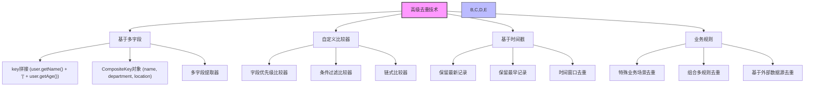
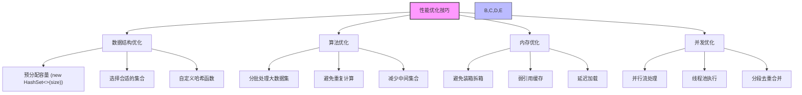
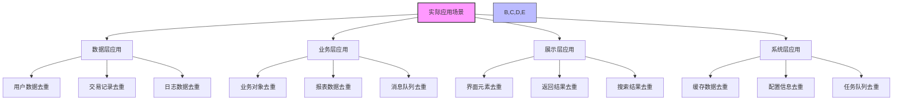
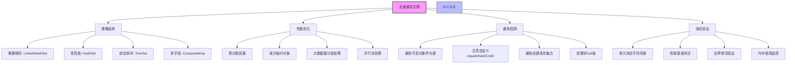

import Tabs from '@theme/Tabs';
import TabItem from '@theme/TabItem';

# Java 集合对象去重技术详解

在Java开发中，对象去重是一个常见且重要的需求。无论是处理用户数据、业务记录还是系统日志，去重技术都能帮助我们提高数据质量、优化存储空间和提升查询性能。本文将详细介绍各种去重技术及其适用场景。

## 1. 对象去重概述

### 1.1 什么是对象去重？

:::tip 核心概念
**对象去重是指从集合中移除重复元素，保留唯一元素的过程。去重的核心在于如何定义"重复"：**

- 🔍 **基于对象引用**：两个对象引用指向同一内存地址，使用`==`比较
- 📦 **基于对象内容**：两个对象在业务逻辑上被认为是相同的，通过`equals()`和`hashCode()`
- 🏷️ **基于特定字段**：两个对象在指定字段上具有相同的值，使用自定义比较逻辑
- 🔄 **基于组合条件**：多个字段或复杂业务规则的组合判断
:::

### 1.2 去重的重要性

| 重要性 | 具体体现 | 业务价值 |
|--------|----------|----------|
| **数据质量** | 避免重复数据影响分析结果 | 提高决策准确性 |
| **存储优化** | 减少冗余数据占用空间 | 降低存储成本 |
| **性能提升** | 减少重复查询和处理 | 提升系统响应速度 |
| **业务逻辑** | 确保业务规则的一致性 | 维护数据完整性 |

### 1.3 去重技术分类

```mermaid
graph TD
    A[Java对象去重技术] --> B[基于集合]
    A --> C[基于Stream]
    A --> D[基于自定义逻辑]
    A --> E[基于数据库]
    
    B --> B1[HashSet]
    B --> B2[TreeSet]
    B --> B3[LinkedHashSet]
    
    C --> C1[distinct()]
    C --> C2[toMap()]
    C --> C3[groupingBy()]
    C --> C4[collectingAndThen()]
    
    D --> D1[自定义比较器]
    D --> D2[多字段组合]
    D --> D3[基于时间戳]
    D --> D4[业务规则]
    
    E --> E1[唯一约束]
    E --> E2[DISTINCT关键字]
    E --> E3[GROUP BY子句]
    
    style A fill:#f9f,stroke:#333,stroke-width:2px
    style B,C,D,E fill:#bbf,stroke:#333,stroke-width:1px
```

```java title="去重技术分类示例"
public class DeduplicationTechniques {
    
    /**
     * 基于集合的去重技术
     */
    public enum CollectionBased {
        HASH_SET,      // 基于HashSet
        TREE_SET,      // 基于TreeSet
        LINKED_HASH_SET // 基于LinkedHashSet
    }
    
    /**
     * 基于Stream的去重技术
     */
    public enum StreamBased {
        DISTINCT,      // 使用distinct()方法
        TO_MAP,        // 使用toMap()收集器
        COLLECTING_AND_THEN // 使用collectingAndThen
    }
    
    /**
     * 基于自定义逻辑的去重技术
     */
    public enum CustomBased {
        COMPARATOR,    // 自定义比较器
        MULTI_FIELD,   // 多字段组合
        TIMESTAMP,     // 基于时间戳
        BUSINESS_RULE  // 基于业务规则
    }
}
```

## 2. 基本去重方法详解

<Tabs>
<TabItem value="hashset" label="HashSet去重">

### 2.1 使用HashSet去重

HashSet是最常用的去重方式，基于对象的hashCode()和equals()方法：

```java title="HashSet去重完整示例"
public class User {
    private String name;
    private int age;
    private String email;
    
    // 构造函数
    public User(String name, int age, String email) {
        this.name = name;
        this.age = age;
        this.email = email;
    }
    
    // Getter方法
    public String getName() { return name; }
    public int getAge() { return age; }
    public String getEmail() { return email; }
    
    @Override
    public boolean equals(Object obj) {
        if (this == obj) return true;
        if (obj == null || getClass() != obj.getClass()) return false;
        User user = (User) obj;
        return age == user.age && 
               Objects.equals(name, user.name) && 
               Objects.equals(email, user.email);
    }
    
    @Override
    public int hashCode() {
        return Objects.hash(name, age, email);
    }
    
    @Override
    public String toString() {
        return "User{name='" + name + "', age=" + age + ", email='" + email + "'}";
    }
}

// HashSet去重示例
public class HashSetDeduplicationExample {
    public static void main(String[] args) {
        // 创建包含重复元素的用户列表
        List<User> users = Arrays.asList(
            new User("Alice", 25, "alice@example.com"),
            new User("Bob", 30, "bob@example.com"),
            new User("Alice", 25, "alice@example.com"),  // 重复
            new User("Charlie", 35, "charlie@example.com"),
            new User("Bob", 30, "bob@example.com")       // 重复
        );
        
        System.out.println("=== HashSet去重示例 ===");
        System.out.println("原始用户列表大小: " + users.size());
        System.out.println("原始用户列表: " + users);
        
        // 使用HashSet去重
        Set<User> uniqueUsers = new HashSet<>(users);
        List<User> deduplicatedList = new ArrayList<>(uniqueUsers);
        
        System.out.println("去重后用户列表大小: " + deduplicatedList.size());
        System.out.println("去重后用户列表: " + deduplicatedList);
        
        // 验证去重效果
        System.out.println("去重效果: " + (users.size() - deduplicatedList.size()) + " 个重复元素被移除");
    }
}
```

#### HashSet去重特点对比

| 特点 | 优势 | 局限性 | 适用场景 |
|------|------|--------|----------|
| **时间复杂度** | O(1) 平均查找时间 | 最坏情况O(n) | 一般数据量 |
| **空间复杂度** | 额外空间存储Set | 需要额外内存 | 内存充足 |
| **顺序保持** | 不保证原有顺序 | 顺序随机 | 不要求顺序 |
| **null处理** | 支持null值 | 需要特殊处理 | 包含null的集合 |

</TabItem>
<TabItem value="stream" label="Stream API去重">

### 2.2 使用Stream API去重

Java 8的Stream API提供了更优雅的去重方式：

```java title="Stream API去重示例"
public class StreamDeduplicationExample {
    public static void main(String[] args) {
        List<User> users = Arrays.asList(
            new User("Alice", 25, "alice@example.com"),
            new User("Bob", 30, "bob@example.com"),
            new User("Alice", 25, "alice@example.com"),
            new User("Charlie", 35, "charlie@example.com"),
            new User("Bob", 30, "bob@example.com")
        );
        
        System.out.println("=== Stream API去重示例 ===");
        
        // 1. 基于equals方法去重（保持顺序）
        List<User> uniqueUsers = users.stream()
            .distinct()
            .collect(Collectors.toList());
        System.out.println("distinct()去重结果: " + uniqueUsers);
        
        // 2. 基于特定字段去重（保留第一个）
        List<User> uniqueByName = users.stream()
            .collect(Collectors.toMap(
                User::getName,
                user -> user,
                (existing, replacement) -> existing
            ))
            .values()
            .stream()
            .collect(Collectors.toList());
        System.out.println("基于name字段去重结果: " + uniqueByName);
        
        // 3. 基于多个字段去重
        List<User> uniqueByNameAndAge = users.stream()
            .collect(Collectors.toMap(
                user -> user.getName() + "|" + user.getAge(),
                user -> user,
                (existing, replacement) -> existing
            ))
            .values()
            .stream()
            .collect(Collectors.toList());
        System.out.println("基于name和age字段去重结果: " + uniqueByNameAndAge);
        
        // 4. 使用collectingAndThen优化
        List<User> optimizedUnique = users.stream()
            .collect(Collectors.collectingAndThen(
                Collectors.toMap(
                    User::getName,
                    user -> user,
                    (existing, replacement) -> existing
                ),
                map -> new ArrayList<>(map.values())
            ));
        System.out.println("优化后的去重结果: " + optimizedUnique);
    }
}
```

#### Stream API去重方法对比

| 方法 | 功能 | 性能 | 适用场景 |
|------|------|------|----------|
| `distinct()` | 基于equals去重 | 中等 | 保持顺序，基于对象内容 |
| `toMap()` | 基于字段去重 | 较高 | 基于特定字段，可自定义冲突处理 |
| `collectingAndThen` | 链式操作优化 | 高 | 需要进一步处理的场景 |
| `groupingBy` | 分组后去重 | 中等 | 需要分组统计的场景 |

</TabItem>
<TabItem value="linkedhashset" label="LinkedHashSet去重">

### 2.3 使用LinkedHashSet保持顺序

如果需要保持原有顺序：

```java title="LinkedHashSet保持顺序去重示例"
public class LinkedHashSetDeduplicationExample {
    public static void main(String[] args) {
        List<String> names = Arrays.asList(
            "Alice", "Bob", "Charlie", "Alice", "David", "Bob"
        );
        
        System.out.println("=== LinkedHashSet保持顺序去重示例 ===");
        System.out.println("原始顺序: " + names);
        
        // 使用LinkedHashSet保持顺序
        Set<String> uniqueNames = new LinkedHashSet<>(names);
        List<String> orderedUniqueList = new ArrayList<>(uniqueNames);
        
        System.out.println("去重后顺序: " + orderedUniqueList);
        
        // 对比HashSet（不保证顺序）
        Set<String> hashSetNames = new HashSet<>(names);
        List<String> unorderedList = new ArrayList<>(hashSetNames);
        System.out.println("HashSet去重（不保证顺序）: " + unorderedList);
        
        // 性能对比
        long startTime = System.nanoTime();
        Set<String> linkedHashSet = new LinkedHashSet<>(names);
        long linkedHashSetTime = System.nanoTime() - startTime;
        
        startTime = System.nanoTime();
        Set<String> hashSet = new HashSet<>(names);
        long hashSetTime = System.nanoTime() - startTime;
        
        System.out.println("LinkedHashSet耗时: " + linkedHashSetTime + " 纳秒");
        System.out.println("HashSet耗时: " + hashSetTime + " 纳秒");
        System.out.println("性能差异: " + (linkedHashSetTime - hashSetTime) + " 纳秒");
    }
}
```

</TabItem>
<TabItem value="treeset" label="TreeSet去重">

### 2.4 使用TreeSet有序去重

TreeSet基于红黑树实现，在去重的同时可以按指定顺序排序：

```java title="TreeSet去重示例"
public class TreeSetDeduplicationExample {
    public static void main(String[] args) {
        List<User> users = Arrays.asList(
            new User("Alice", 25, "alice@example.com"),
            new User("Bob", 30, "bob@example.com"),
            new User("Charlie", 35, "charlie@example.com"),
            new User("Bob", 30, "bob@example.com"),       // 重复
            new User("Alice", 25, "alice@example.com")    // 重复
        );
        
        System.out.println("=== TreeSet去重示例 ===");
        System.out.println("原始用户列表: " + users);
        
        // 使用TreeSet按自然顺序去重
        // 注意：User类需要实现Comparable接口
        TreeSet<User> naturalOrderSet = new TreeSet<>(new Comparator<User>() {
            @Override
            public int compare(User u1, User u2) {
                int nameCompare = u1.getName().compareTo(u2.getName());
                if (nameCompare != 0) return nameCompare;
                return Integer.compare(u1.getAge(), u2.getAge());
            }
        });
        naturalOrderSet.addAll(users);
        
        System.out.println("自然顺序去重: " + naturalOrderSet);
        
        // 使用TreeSet按指定顺序去重
        TreeSet<User> ageOrderSet = new TreeSet<>(
            Comparator.comparingInt(User::getAge).thenComparing(User::getName)
        );
        ageOrderSet.addAll(users);
        
        System.out.println("按年龄排序去重: " + ageOrderSet);
        
        // 使用TreeSet的导航功能
        User first = ageOrderSet.first();
        User last = ageOrderSet.last();
        
        System.out.println("年龄最小的用户: " + first);
        System.out.println("年龄最大的用户: " + last);
        
        // 范围查询
        User target = new User("Bob", 30, "bob@example.com");
        User higher = ageOrderSet.higher(target); // 获取比target大的下一个元素
        
        if (higher != null) {
            System.out.println("比Bob年龄大的下一个用户: " + higher);
        }
    }
}
```

| 特点 | TreeSet | HashSet | LinkedHashSet |
|------|--------|---------|--------------|
| **去重原理** | 基于红黑树和比较器 | 基于哈希码和equals | 基于哈希码和equals |
| **是否有序** | 是（自然顺序或比较器指定） | 否 | 是（插入顺序） |
| **时间复杂度** | O(log n) | O(1) | O(1) |
| **空间复杂度** | O(n) | O(n) | O(n) |
| **特有功能** | 范围查询、导航操作 | 无 | 保持插入顺序 |
| **适用场景** | 需要有序去重 | 一般去重场景 | 保持顺序的去重 |

</TabItem>
</Tabs>

## 3. 高级去重技术



<Tabs>
<TabItem value="multifield" label="多字段去重">

### 3.1 基于多个字段去重

```java title="多字段去重示例"
public class ComplexUser {
    private String name;
    private int age;
    private String department;
    private String location;
    
    // 构造函数和getter方法省略...
    
    /**
     * 基于name和department去重
     */
    public static List<ComplexUser> deduplicateByNameAndDept(List<ComplexUser> users) {
        return users.stream()
            .collect(Collectors.toMap(
                user -> user.getName() + "|" + user.getDepartment(),
                user -> user,
                (existing, replacement) -> existing
            ))
            .values()
            .stream()
            .collect(Collectors.toList());
    }
    
    /**
     * 基于多个字段组合去重
     */
    public static List<ComplexUser> deduplicateByMultipleFields(
            List<ComplexUser> users, 
            Function<ComplexUser, String>... fieldExtractors) {
        
        return users.stream()
            .collect(Collectors.toMap(
                user -> Arrays.stream(fieldExtractors)
                    .map(extractor -> extractor.apply(user))
                    .filter(Objects::nonNull)
                    .collect(Collectors.joining("|")),
                user -> user,
                (existing, replacement) -> existing
            ))
            .values()
            .stream()
            .collect(Collectors.toList());
    }
    
    /**
     * 使用Builder模式创建复合键
     */
    public static class CompositeKey {
        private final String name;
        private final String department;
        private final String location;
        
        public CompositeKey(String name, String department, String location) {
            this.name = name;
            this.department = department;
            this.location = location;
        }
        
        @Override
        public boolean equals(Object obj) {
            if (this == obj) return true;
            if (obj == null || getClass() != obj.getClass()) return false;
            CompositeKey that = (CompositeKey) obj;
            return Objects.equals(name, that.name) &&
                   Objects.equals(department, that.department) &&
                   Objects.equals(location, that.location);
        }
        
        @Override
        public int hashCode() {
            return Objects.hash(name, department, location);
        }
    }
    
    /**
     * 使用复合键去重
     */
    public static List<ComplexUser> deduplicateByCompositeKey(List<ComplexUser> users) {
        return users.stream()
            .collect(Collectors.toMap(
                user -> new CompositeKey(user.getName(), user.getDepartment(), user.getLocation()),
                user -> user,
                (existing, replacement) -> existing
            ))
            .values()
            .stream()
            .collect(Collectors.toList());
    }
}
```

</TabItem>
<TabItem value="comparator" label="自定义比较器去重">

### 3.2 自定义比较器去重

```java title="自定义比较器去重示例"
public class CustomComparatorDeduplicationExample {
    public static void main(String[] args) {
        List<User> users = Arrays.asList(
            new User("Alice", 25, "alice@example.com"),
            new User("Alice", 30, "alice2@example.com"),
            new User("Bob", 25, "bob@example.com"),
            new User("Bob", 30, "bob2@example.com")
        );
        
        System.out.println("=== 自定义比较器去重示例 ===");
        
        // 1. 使用TreeSet和自定义比较器
        List<User> uniqueByName = users.stream()
            .collect(Collectors.toCollection(() -> 
                new TreeSet<>(Comparator.comparing(User::getName)
                    .thenComparing(User::getAge))
            ))
            .stream()
            .collect(Collectors.toList());
        System.out.println("基于name和age排序去重: " + uniqueByName);
        
        // 2. 自定义业务逻辑比较器
        Comparator<User> businessComparator = (u1, u2) -> {
            // 首先按name比较
            int nameCompare = u1.getName().compareTo(u2.getName());
            if (nameCompare != 0) return nameCompare;
            
            // name相同时，按年龄降序（保留年龄大的）
            return Integer.compare(u2.getAge(), u1.getAge());
        };
        
        List<User> uniqueByBusinessRule = users.stream()
            .collect(Collectors.toCollection(() -> 
                new TreeSet<>(businessComparator)
            ))
            .stream()
            .collect(Collectors.toList());
        System.out.println("基于业务规则去重: " + uniqueByBusinessRule);
        
        // 3. 链式比较器
        Comparator<User> chainedComparator = Comparator
            .comparing(User::getName)
            .thenComparing(User::getAge)
            .thenComparing(User::getEmail);
        
        List<User> uniqueByChained = users.stream()
            .collect(Collectors.toCollection(() -> 
                new TreeSet<>(chainedComparator)
            ))
            .stream()
            .collect(Collectors.toList());
        System.out.println("基于链式比较器去重: " + uniqueByChained);
    }
}
```

</TabItem>
<TabItem value="timestamp" label="时间戳去重">

### 3.3 基于时间戳去重

```java title="基于时间戳去重示例"
public class TimestampedUser {
    private String name;
    private LocalDateTime timestamp;
    private String data;
    
    // 构造函数和getter方法省略...
    
    /**
     * 保留最新的记录
     */
    public static List<TimestampedUser> deduplicateKeepLatest(List<TimestampedUser> users) {
        return users.stream()
            .collect(Collectors.toMap(
                TimestampedUser::getName,
                user -> user,
                (existing, replacement) -> 
                    existing.getTimestamp().isAfter(replacement.getTimestamp()) ? existing : replacement
            ))
            .values()
            .stream()
            .collect(Collectors.toList());
    }
    
    /**
     * 保留最早的记录
     */
    public static List<TimestampedUser> deduplicateKeepEarliest(List<TimestampedUser> users) {
        return users.stream()
            .collect(Collectors.toMap(
                TimestampedUser::getName,
                user -> user,
                (existing, replacement) -> 
                    existing.getTimestamp().isBefore(replacement.getTimestamp()) ? existing : replacement
            ))
            .values()
            .stream()
            .collect(Collectors.toList());
    }
    
    /**
     * 基于时间窗口去重
     */
    public static List<TimestampedUser> deduplicateByTimeWindow(
            List<TimestampedUser> users, 
            Duration window) {
        
        return users.stream()
            .sorted(Comparator.comparing(TimestampedUser::getTimestamp))
            .collect(Collectors.toMap(
                TimestampedUser::getName,
                user -> user,
                (existing, replacement) -> {
                    Duration timeDiff = Duration.between(existing.getTimestamp(), replacement.getTimestamp());
                    return timeDiff.compareTo(window) <= 0 ? existing : replacement;
                }
            ))
            .values()
            .stream()
            .collect(Collectors.toList());
    }
}
```

</TabItem>
</Tabs>

## 4. 性能优化技巧



<Tabs>
<TabItem value="capacity" label="容量优化">

### 4.1 预分配容量

```java title="预分配容量优化示例"
public class CapacityOptimizationExample {
    public static void main(String[] args) {
        List<User> users = generateLargeUserList(10000);
        
        System.out.println("=== 容量优化示例 ===");
        
        // 1. 预分配HashSet容量，避免扩容
        long startTime = System.nanoTime();
        Set<User> uniqueUsers = new HashSet<>(users.size());
        uniqueUsers.addAll(users);
        long optimizedTime = System.nanoTime() - startTime;
        
        // 2. 不预分配容量
        startTime = System.nanoTime();
        Set<User> uniqueUsers2 = new HashSet<>();
        uniqueUsers2.addAll(users);
        long defaultTime = System.nanoTime() - startTime;
        
        System.out.println("预分配容量耗时: " + optimizedTime + " 纳秒");
        System.out.println("默认容量耗时: " + defaultTime + " 纳秒");
        System.out.println("性能提升: " + ((defaultTime - optimizedTime) * 100.0 / defaultTime) + "%");
        
        // 3. 不同初始容量的性能对比
        testDifferentCapacities(users);
    }
    
    private static void testDifferentCapacities(List<User> users) {
        System.out.println("\n=== 不同初始容量性能对比 ===");
        
        int[] capacities = {16, 100, 1000, 10000, 20000};
        
        for (int capacity : capacities) {
            long startTime = System.nanoTime();
            Set<User> set = new HashSet<>(capacity);
            set.addAll(users);
            long time = System.nanoTime() - startTime;
            
            System.out.println("初始容量 " + capacity + ": " + time + " 纳秒");
        }
    }
    
    private static List<User> generateLargeUserList(int size) {
        List<User> users = new ArrayList<>(size);
        Random random = new Random();
        
        for (int i = 0; i < size; i++) {
            users.add(new User(
                "User" + random.nextInt(1000),
                random.nextInt(100),
                "user" + random.nextInt(1000) + "@example.com"
            ));
        }
        
        return users;
    }
}
```

</TabItem>
<TabItem value="parallel" label="并行流优化">

### 4.2 使用并行流处理大数据量

```java title="并行流去重示例"
public class ParallelStreamDeduplicationExample {
    public static void main(String[] args) {
        List<User> users = generateLargeUserList(100000);
        
        System.out.println("=== 并行流去重性能对比 ===");
        
        // 1. 串行流去重
        long startTime = System.nanoTime();
        List<User> uniqueUsers = users.stream()
            .distinct()
            .collect(Collectors.toList());
        long sequentialTime = System.nanoTime() - startTime;
        
        // 2. 并行流去重
        startTime = System.nanoTime();
        List<User> uniqueUsersParallel = users.parallelStream()
            .distinct()
            .collect(Collectors.toList());
        long parallelTime = System.nanoTime() - startTime;
        
        System.out.println("串行流去重耗时: " + sequentialTime + " 纳秒");
        System.out.println("并行流去重耗时: " + parallelTime + " 纳秒");
        System.out.println("性能提升: " + ((sequentialTime - parallelTime) * 100.0 / sequentialTime) + "%");
        
        // 3. 不同数据量的性能对比
        testDifferentDataSizes();
    }
    
    private static void testDifferentDataSizes() {
        System.out.println("\n=== 不同数据量性能对比 ===");
        
        int[] sizes = {1000, 10000, 100000, 1000000};
        
        for (int size : sizes) {
            List<User> users = generateLargeUserList(size);
            
            long startTime = System.nanoTime();
            users.stream().distinct().collect(Collectors.toList());
            long sequentialTime = System.nanoTime() - startTime;
            
            startTime = System.nanoTime();
            users.parallelStream().distinct().collect(Collectors.toList());
            long parallelTime = System.nanoTime() - startTime;
            
            System.out.println("数据量 " + size + ":");
            System.out.println("  串行: " + sequentialTime + " 纳秒");
            System.out.println("  并行: " + parallelTime + " 纳秒");
            System.out.println("  提升: " + ((sequentialTime - parallelTime) * 100.0 / sequentialTime) + "%");
        }
    }
    
    private static List<User> generateLargeUserList(int size) {
        List<User> users = new ArrayList<>(size);
        Random random = new Random();
        
        for (int i = 0; i < size; i++) {
            users.add(new User(
                "User" + random.nextInt(size / 10), // 控制重复率
                random.nextInt(100),
                "user" + random.nextInt(size / 10) + "@example.com"
            ));
        }
        
        return users;
    }
}
```

</TabItem>
<TabItem value="batch" label="分批处理">

### 4.3 分批处理超大数据集

```java title="分批处理大数据集示例"
public class BatchProcessingDeduplicationExample {
    public static void main(String[] args) {
        List<User> users = generateLargeUserList(1000000);
        
        System.out.println("=== 分批处理大数据集示例 ===");
        System.out.println("数据集大小: " + users.size());
        
        // 1. 分批处理去重
        int batchSize = 100000;
        long startTime = System.nanoTime();
        List<User> result = deduplicateLargeDataset(users, batchSize);
        long batchTime = System.nanoTime() - startTime;
        
        // 2. 直接处理去重
        startTime = System.nanoTime();
        List<User> directResult = users.stream().distinct().collect(Collectors.toList());
        long directTime = System.nanoTime() - startTime;
        
        System.out.println("分批处理耗时: " + batchTime + " 纳秒");
        System.out.println("直接处理耗时: " + directTime + " 纳秒");
        System.out.println("分批处理结果数量: " + result.size());
        System.out.println("直接处理结果数量: " + directResult.size());
        
        // 3. 不同批次大小的性能对比
        testDifferentBatchSizes(users);
    }
    
    public static <T> List<T> deduplicateLargeDataset(List<T> items, int batchSize) {
        Set<T> uniqueItems = new HashSet<>();
        List<T> result = new ArrayList<>();
        
        for (int i = 0; i < items.size(); i += batchSize) {
            int end = Math.min(i + batchSize, items.size());
            List<T> batch = items.subList(i, end);
            
            for (T item : batch) {
                if (uniqueItems.add(item)) {
                    result.add(item);
                }
            }
            
            // 输出进度
            if (i % (batchSize * 10) == 0) {
                System.out.println("已处理: " + end + "/" + items.size());
            }
        }
        
        return result;
    }
    
    private static void testDifferentBatchSizes(List<User> users) {
        System.out.println("\n=== 不同批次大小性能对比 ===");
        
        int[] batchSizes = {10000, 50000, 100000, 200000};
        
        for (int batchSize : batchSizes) {
            long startTime = System.nanoTime();
            List<User> result = deduplicateLargeDataset(users, batchSize);
            long time = System.nanoTime() - startTime;
            
            System.out.println("批次大小 " + batchSize + ": " + time + " 纳秒");
        }
    }
    
    private static List<User> generateLargeUserList(int size) {
        List<User> users = new ArrayList<>(size);
        Random random = new Random();
        
        for (int i = 0; i < size; i++) {
            users.add(new User(
                "User" + random.nextInt(size / 100), // 控制重复率
                random.nextInt(100),
                "user" + random.nextInt(size / 100) + "@example.com"
            ));
        }
        
        return users;
    }
}
```

</TabItem>
</Tabs>

## 5. 实际应用场景



<Tabs>
<TabItem value="user" label="用户数据去重">

### 5.1 用户数据去重

```java title="用户数据去重应用示例"
public class UserDataDeduplicationExample {
    public static void main(String[] args) {
        // 模拟从不同数据源获取的用户数据
        List<User> source1Users = Arrays.asList(
            new User("Alice", 25, "alice@example.com"),
            new User("Bob", 30, "bob@example.com"),
            new User("Charlie", 35, "charlie@example.com")
        );
        
        List<User> source2Users = Arrays.asList(
            new User("Alice", 25, "alice@example.com"), // 重复
            new User("David", 28, "david@example.com"),
            new User("Eve", 32, "eve@example.com")
        );
        
        List<User> source3Users = Arrays.asList(
            new User("Bob", 30, "bob@example.com"), // 重复
            new User("Frank", 40, "frank@example.com")
        );
        
        System.out.println("=== 多数据源用户去重示例 ===");
        
        // 合并所有数据源
        List<User> allUsers = new ArrayList<>();
        allUsers.addAll(source1Users);
        allUsers.addAll(source2Users);
        allUsers.addAll(source3Users);
        
        System.out.println("合并前总用户数: " + allUsers.size());
        
        // 基于邮箱去重（邮箱通常唯一）
        List<User> uniqueByEmail = allUsers.stream()
            .collect(Collectors.toMap(
                User::getEmail,
                user -> user,
                (existing, replacement) -> existing
            ))
            .values()
            .stream()
            .collect(Collectors.toList());
        
        System.out.println("基于邮箱去重后用户数: " + uniqueByEmail.size());
        System.out.println("去重效果: " + (allUsers.size() - uniqueByEmail.size()) + " 个重复用户被移除");
        
        // 基于姓名和年龄去重（业务逻辑）
        List<User> uniqueByNameAndAge = allUsers.stream()
            .collect(Collectors.toMap(
                user -> user.getName() + "|" + user.getAge(),
                user -> user,
                (existing, replacement) -> existing
            ))
            .values()
            .stream()
            .collect(Collectors.toList());
        
        System.out.println("基于姓名和年龄去重后用户数: " + uniqueByNameAndAge.size());
        
        // 输出去重结果
        System.out.println("\n去重后的用户列表:");
        uniqueByEmail.forEach(user -> 
            System.out.println("  " + user.getName() + " (" + user.getAge() + ") - " + user.getEmail())
        );
    }
}
```

</TabItem>
<TabItem value="logs" label="日志数据去重">

### 5.2 日志数据去重

```java title="日志数据去重应用示例"
public class LogDeduplicationExample {
    public static void main(String[] args) {
        // 模拟日志数据
        List<LogEntry> logs = Arrays.asList(
            new LogEntry("ERROR", "Database connection failed", "2024-01-07 10:00:00", "user-service"),
            new LogEntry("ERROR", "Database connection failed", "2024-01-07 10:00:01", "user-service"),
            new LogEntry("ERROR", "Database connection failed", "2024-01-07 10:00:02", "user-service"),
            new LogEntry("INFO", "User login successful", "2024-01-07 10:01:00", "auth-service"),
            new LogEntry("WARN", "High memory usage", "2024-01-07 10:02:00", "system-monitor"),
            new LogEntry("WARN", "High memory usage", "2024-01-07 10:03:00", "system-monitor")
        );
        
        System.out.println("=== 日志数据去重示例 ===");
        System.out.println("原始日志数量: " + logs.size());
        
        // 1. 基于日志内容去重（保留最新的）
        List<LogEntry> uniqueByContent = logs.stream()
            .collect(Collectors.toMap(
                log -> log.getLevel() + "|" + log.getMessage() + "|" + log.getService(),
                log -> log,
                (existing, replacement) -> 
                    existing.getTimestamp().compareTo(replacement.getTimestamp()) > 0 ? existing : replacement
            ))
            .values()
            .stream()
            .collect(Collectors.toList());
        
        System.out.println("基于内容去重后日志数量: " + uniqueByContent.size());
        
        // 2. 基于时间窗口去重（5分钟内相同日志视为重复）
        List<LogEntry> uniqueByTimeWindow = deduplicateLogsByTimeWindow(logs, Duration.ofMinutes(5));
        System.out.println("基于时间窗口去重后日志数量: " + uniqueByTimeWindow.size());
        
        // 3. 输出去重结果
        System.out.println("\n去重后的日志:");
        uniqueByContent.forEach(log -> 
            System.out.println("  [" + log.getTimestamp() + "] " + log.getLevel() + 
                             " - " + log.getMessage() + " (" + log.getService() + ")")
        );
    }
    
    private static List<LogEntry> deduplicateLogsByTimeWindow(List<LogEntry> logs, Duration window) {
        return logs.stream()
            .sorted(Comparator.comparing(LogEntry::getTimestamp))
            .collect(Collectors.toMap(
                log -> log.getLevel() + "|" + log.getMessage() + "|" + log.getService(),
                log -> log,
                (existing, replacement) -> {
                    Duration timeDiff = Duration.between(existing.getTimestamp(), replacement.getTimestamp());
                    return timeDiff.compareTo(window) <= 0 ? existing : replacement;
                }
            ))
            .values()
            .stream()
            .collect(Collectors.toList());
    }
}

class LogEntry {
    private String level;
    private String message;
    private LocalDateTime timestamp;
    private String service;
    
    // 构造函数和getter方法省略...
}
```

</TabItem>
<TabItem value="business" label="业务数据去重">

### 5.3 业务数据去重

```java title="业务数据去重应用示例"
public class BusinessDataDeduplicationExample {
    public static void main(String[] args) {
        // 模拟订单数据
        List<Order> orders = Arrays.asList(
            new Order("ORD001", "Alice", 100.0, "2024-01-07 09:00:00", "PENDING"),
            new Order("ORD001", "Alice", 100.0, "2024-01-07 09:01:00", "CONFIRMED"), // 重复订单号
            new Order("ORD002", "Bob", 200.0, "2024-01-07 10:00:00", "PENDING"),
            new Order("ORD003", "Charlie", 150.0, "2024-01-07 11:00:00", "PENDING"),
            new Order("ORD003", "Charlie", 150.0, "2024-01-07 11:05:00", "CANCELLED") // 重复订单号
        );
        
        System.out.println("=== 业务数据去重示例 ===");
        System.out.println("原始订单数量: " + orders.size());
        
        // 1. 基于订单号去重（保留最新的状态）
        List<Order> uniqueByOrderId = orders.stream()
            .collect(Collectors.toMap(
                Order::getOrderId,
                order -> order,
                (existing, replacement) -> 
                    existing.getTimestamp().compareTo(replacement.getTimestamp()) > 0 ? existing : replacement
            ))
            .values()
            .stream()
            .collect(Collectors.toList());
        
        System.out.println("基于订单号去重后订单数量: " + uniqueByOrderId.size());
        
        // 2. 基于客户和金额去重（防止重复下单）
        List<Order> uniqueByCustomerAndAmount = orders.stream()
            .collect(Collectors.toMap(
                order -> order.getCustomerName() + "|" + order.getAmount(),
                order -> order,
                (existing, replacement) -> 
                    existing.getTimestamp().compareTo(replacement.getTimestamp()) > 0 ? existing : replacement
            ))
            .values()
            .stream()
            .collect(Collectors.toList());
        
        System.out.println("基于客户和金额去重后订单数量: " + uniqueByCustomerAndAmount.size());
        
        // 3. 输出去重结果
        System.out.println("\n去重后的订单:");
        uniqueByOrderId.forEach(order -> 
            System.out.println("  " + order.getOrderId() + " - " + order.getCustomerName() + 
                             " ($" + order.getAmount() + ") - " + order.getStatus() + 
                             " [" + order.getTimestamp() + "]")
        );
    }
}

class Order {
    private String orderId;
    private String customerName;
    private double amount;
    private LocalDateTime timestamp;
    private String status;
    
    // 构造函数和getter方法省略...
}
```

</TabItem>
</Tabs>

## 6. 最佳实践总结



### 6.1 去重策略选择

:::tip 核心原则
选择合适的去重策略需要考虑以下因素：
- **数据规模**：小数据集使用HashSet，大数据集考虑分批处理
- **性能要求**：对性能要求高的场景使用并行流
- **内存限制**：内存受限时使用分批处理或外部存储
- **业务逻辑**：根据业务需求选择合适的去重字段
:::

### 6.2 性能优化策略

| 优化策略 | 具体方法 | 适用场景 | 预期效果 |
|----------|----------|----------|----------|
| **预分配容量** | 使用 `new HashSet<>(expectedSize)` | 已知数据量 | 避免扩容，提升20-30% |
| **选择合适的集合** | HashSet用于查找，TreeSet用于排序 | 根据使用场景 | 提升查找性能 |
| **并行处理** | 使用 `parallelStream()` | 大数据量 | 多核环境下提升2-4倍 |
| **分批处理** | 将大数据集分成小批次 | 超大数据集 | 避免内存溢出 |
| **缓存结果** | 缓存去重结果 | 重复去重 | 避免重复计算 |

### 6.3 常见陷阱和解决方案

:::caution 注意事项
在使用去重技术时，需要注意以下常见陷阱：
:::

1. **equals()和hashCode()不一致**
   ```java
   // 错误：equals和hashCode不一致
   @Override
   public boolean equals(Object obj) {
       if (this == obj) return true;
       if (obj == null || getClass() != obj.getClass()) return false;
       User user = (User) obj;
       return Objects.equals(name, user.name); // 只比较name
   }
   
   @Override
   public int hashCode() {
       return Objects.hash(name, age, email); // 但hashCode包含所有字段
   }
   
   // 正确：保持一致性
   @Override
   public boolean equals(Object obj) {
       if (this == obj) return true;
       if (obj == null || getClass() != obj.getClass()) return false;
       User user = (User) obj;
       return Objects.equals(name, user.name);
   }
   
   @Override
   public int hashCode() {
       return Objects.hash(name); // 只包含equals中比较的字段
   }
   ```

2. **Stream API的延迟执行**
   ```java
   // 错误：Stream延迟执行可能导致问题
   Stream<User> stream = users.stream().distinct();
   users.add(new User("New", 25, "new@example.com")); // 这会影响stream的结果
   List<User> result = stream.collect(Collectors.toList());
   
   // 正确：立即收集结果
   List<User> result = users.stream().distinct().collect(Collectors.toList());
   users.add(new User("New", 25, "new@example.com")); // 不会影响已收集的结果
   ```

3. **内存溢出问题**
   ```java
   // 错误：直接处理超大数据集
   List<User> hugeList = generateHugeList(10000000);
   Set<User> uniqueUsers = new HashSet<>(hugeList); // 可能内存溢出
   
   // 正确：分批处理
   List<User> uniqueUsers = deduplicateLargeDataset(hugeList, 100000);
   ```

### 6.4 测试和调试建议

1. **单元测试覆盖**
   - 测试边界条件（空集合、null值、单个元素）
   - 测试重复元素的处理逻辑
   - 测试不同数据类型的去重效果

2. **性能测试**
   - 使用JMH进行性能基准测试
   - 测试不同数据量下的性能表现
   - 监控内存使用情况

3. **调试技巧**
   - 使用日志记录去重过程
   - 使用Stream API的 `peek()` 方法调试流操作
   - 验证去重结果的正确性

## 7. 总结

Java集合对象去重技术为数据处理提供了强大而灵活的工具。通过合理使用各种去重方法，我们可以：

- **提高数据质量**：去除重复数据，保证数据的一致性
- **优化存储空间**：减少冗余数据，降低存储成本
- **提升处理性能**：避免重复计算，提高系统响应速度
- **支持业务需求**：根据不同的业务场景选择合适的去重策略

在实际开发中，我们应该：

1. **理解业务需求**：明确去重的业务含义和规则
2. **选择合适的算法**：根据数据规模和性能要求选择合适的方法
3. **注意性能优化**：合理使用预分配容量、并行处理等技术
4. **保证代码质量**：正确实现equals()和hashCode()方法，处理边界情况

通过深入理解和熟练运用这些去重技术，我们能够构建出更加高效、健壮和可维护的Java应用程序。 